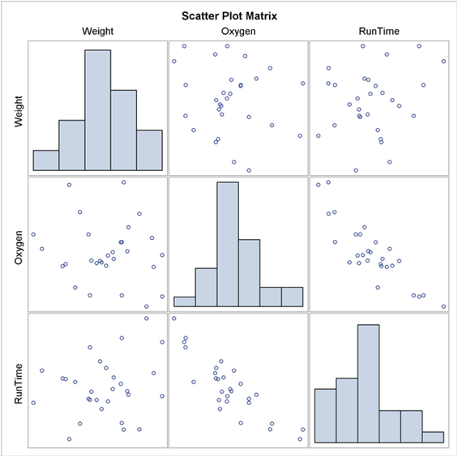

地图 > 数据科学 > 解释过去 > 数据探索 > 双变量分析 > 数值 & 数值

# 双变量分析 - 数值 & 数值

# **散点图**

散点图是两个数值变量（属性）之间关系的有用的可视化表示，通常在计算线性相关性或拟合回归线之前绘制。所得到的模式指示了两个变量之间关系的类型（线性或非线性）和强度。可以向二维散点图添加更多信息，例如，我们可以用一个代码标记点来指示第三个变量的水平。如果我们在数据集中处理许多变量，一种同时呈现所有可能的两个变量的散点图的方法是*散点图矩阵*。

# **线性相关性**

线性相关性量化了两个数值变量之间线性关系的强度。当两个变量之间没有相关性时，一个量的值不会随着第二个量的值的增加或减少而有任何倾向。

*r* 只衡量线性关系的强度，始终介于-1 和 1 之间，其中-1 表示完全负线性相关，+1 表示完全正线性相关，零表示没有线性相关。 *例子*：

| **温度** | 83 | 64 | 72 | 81 | 70 | 68 | 65 | 75 | 71 | 85 | 80 | 72 | 69 | 75 |
| --- | --- | --- | --- | --- | --- | --- | --- | --- | --- | --- | --- | --- | --- | --- |
| **湿度** | 86 | 65 | 90 | 75 | 96 | 80 | 70 | 80 | 91 | 85 | 90 | 95 | 70 | 70 |
|  | 方差 | 协方差 | 相关性 |
| **温度** | 40.10 | 19.78 | **0.32** |
| **湿度** | 98.23 |   |   |

温度和湿度之间存在着弱的线性相关性。

| 练习 |  |  |
| --- | --- | --- |
