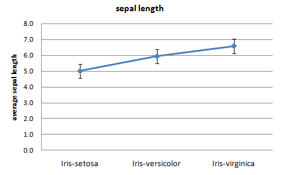
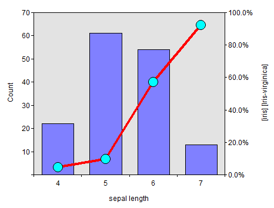
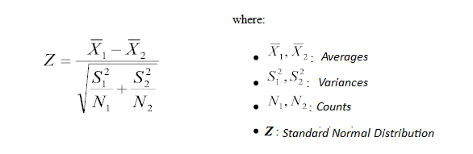
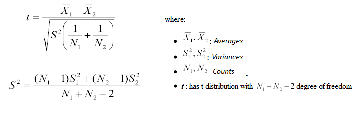
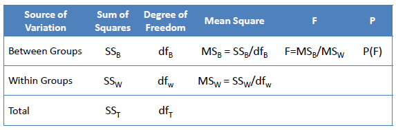
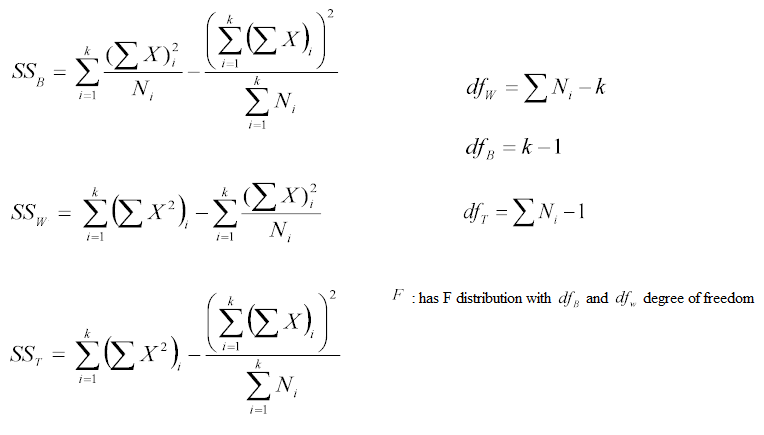

地图 > 数据科学 > 解释过去 > 数据探索 > 双变量分析 > 分类 & 数值

# 双变量分析 - 分类 & 数值

# **带有误差线的折线图**

带有误差线的折线图将信息显示为一系列由直线段连接的数据点。每个数据点是相应分类变量的数值数据的平均值，误差线显示标准误差。这是一种总结信息之间关系以及它们如何相互变化的方式（iris_linechart.xlsx）。

# **组合图表**

组合图表使用两种或更多种类的图表来强调图表包含不同种类的信息。在这里，我们使用条形图显示分组的数值变量的分布，使用折线图显示分类变量中所选类别的百分比。组合图表是展示预测变量（X 轴）对目标变量（Y 轴）的预测能力的最佳可视化方法。

# **Z 检验和 t 检验**

Z 检验和 t 检验基本相同。它们评估两组的平均值是否在统计上不同。此分析适用于比较分类变量的两个类别的数值变量的平均值。

如果 Z 的概率很小，则两个平均值之间的差异更为显著。

**t 检验**

当*n[1]*或*n[2]*小于 30 时，我们使用 t 检验而不是 Z 检验。

*示例*：两个不同类别的分类变量（O 型环失效）中的数值变量（温度）的平均值之间是否存在显著差异？

| **O 型环失效** | **   温度** |
| --- | --- |
| 是 | 53 | 56 | 57 | 70 | 70 | 70 | 75 |  |  |  |  |  |  |  |  |  |  |
| 否 | 63 | 66 | 67 | 67 | 67 | 68 | 69 | 70 | 72 | 73 | 75 | 76 | 76 | 78 | 79 | 80 | 81 |
| *t 检验* | **O 型环失效** |
| **温度** | 是 | 否 |
| 计数 | 7 | 17 |
| 平均值 | 64.43 | 72.18 |
| 方差 | 76.95 | 30.78 |
| t | -2.62 |   |
| *自由度* | 22 |   |
| 概率 | 0.0156 |   |

低概率（0.0156）意味着失效 O 型环的平均温度与完好 O 型环的平均温度之间的差异是显著的。

# **方差分析（ANOVA）**

方差分析（ANOVA）测试评估两个以上组的平均值是否在统计上不同。此分析适用于比较分类变量的两个以上类别的数值变量的平均值。

*示例*:

三种分类变量（天气状况）中数值变量（湿度）的平均值之间是否存在显著差异？

| **天气状况** | **湿度** |
| --- | --- |
| 多云 | 86 | 65 | 90 | 75 |  |
| 雨天 | 96 | 80 | 70 | 80 | 91 |
| 晴朗 | 85 | 90 | 95 | 70 | 70 |
| 天气状况 | 计数 | 平均值 | 方差 |
| 多云 | 4 | 79.0 | 127.3 |
| 雨天 | 5 | 83.4 | 104.8 |
| 晴朗 | 5 | 82.0 | 132.5 |
| **变异源** | 平方和 | 自由度 | 均方 | F 值 | 概率 |
| **组间** | 44.0 | 2 | 22.0 | 0.182 | 0.836 |
| **组内** | 1331.2 | 11 | 121.0 |  |  |
| 总计 | 1375.2 | 13 |  |  |  |

三种天气情况下湿度的平均值之间没有显著差异。

|  |  |  |
| --- | --- | --- |
