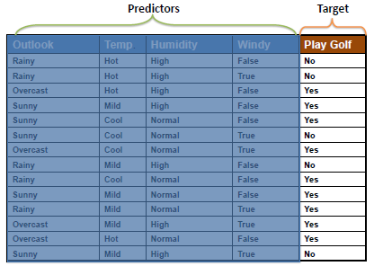
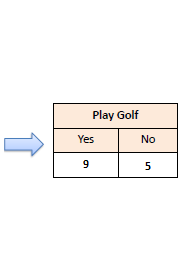

地图 > 数据科学 > 预测未来 > 建模 > 分类 > ZeroR

# ZeroR

ZeroR 是最简单的分类方法，依赖于目标并忽略所有预测变量。ZeroR 分类器简单地预测多数类别（类）。虽然 ZeroR 没有预测能力，但它对于确定其他分类方法的基准性能作为基准很有用。 **算法**为目标构建频率表，并选择其最频繁的值。 *示例*：对于以下数据集，"打高尔夫 = 是" 是准确率为 0.64 的 ZeroR 模型。

**预测变量贡献**关于预测变量对模型的贡献没有什么可说的，因为 ZeroR 不使用任何预测变量。 **模型评估**

以下混淆矩阵显示，ZeroR 只能正确预测多数类。如前所述，ZeroR 仅用于确定其他分类方法的基准性能。

| 混淆矩阵 | **打高尔夫** |   |
| --- | --- | --- |
| 是 | 否 |
| **ZeroR** | 是 | 9 | 5 | *正预测值* | 0.64 |
| 否 | 0 | 0 | *负预测值* | 0.00 |
|   | *敏感性* | *特异性* | **准确率** = 0.64 |
| 1.00 | 0.00 |
| 练习 |  |  ZeroR 交互式 |
