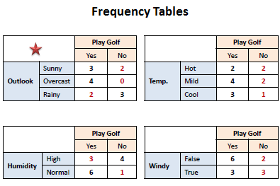
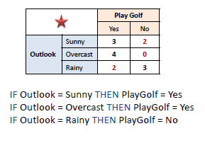

地图 > 数据科学 > 预测未来 > 建模 > 分类 > OneR

# OneR

OneR，即"One Rule"，是一种简单但准确的分类算法，它为数据中的每个预测变量生成一条规则，然后选择总误差最小的规则作为其"一条规则"。为了为一个预测变量创建一条规则，我们针对每个预测变量与目标变量构建一个频率表。已经证明，OneR 生成的规则准确度仅略低于最先进的分类算法，同时生成的规则易于人类解释。**OneR 算法**对于每个预测变量，

对于该预测变量的每个值，制定以下规则；

统计目标（类别）的每个值出现的频率

找到最频繁的类别

制定规则将该类别分配给该预测变量的这个值

计算每个预测变量规则的总误差

选择总误差最小的预测变量。  *例子:*使用相关频率表基于 OneR 算法找到总误差最小的最佳预测变量。

最佳预测变量是：

**预测变量贡献**

简单地说，从频率表中计算的总误差是每个预测变量贡献度的度量。低总误差意味着对模型的可预测性有更高的贡献。

**模型评估**

以下混淆矩阵显示了显著的预测能力。OneR 不生成分数或概率，这意味着评估图表（增益、提升、K-S 和 ROC）不适用。

| 混淆矩阵 | **打高尔夫** |   |
| --- | --- | --- |
| 是 | 否 |
| **OneR** | 是 | 7 | 2 | *正预测值* | 0.78 |
| No | 2 | 3 | *负预测值* | 0.60 |
|   | *灵敏度* | *特异性* | **准确率** = 0.71 |
| 0.78 | 0.60 |
| 练习 |  |  OneR 互动 |

尝试通过使用 ANOVA 和 Chi²检验来发明一个新的 OneR 算法。
