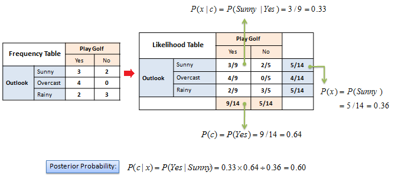
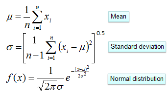
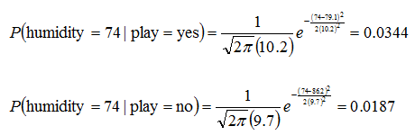
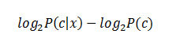
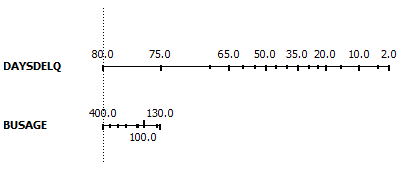

地图 > 数据科学 > 预测未来 > 建模 > 分类 > 朴素贝叶斯

# 朴素贝叶斯

朴素贝叶斯分类器是基于贝叶斯定理和预测变量之间的独立假设构建的。朴素贝叶斯模型易于构建，没有复杂的迭代参数估计，因此特别适用于非常大的数据集。尽管简单，朴素贝叶斯分类器通常表现出人意料的良好性能，并且被广泛使用，因为它经常优于更复杂的分类方法。**算法** 贝叶斯定理提供了从 *P*(*c*)、*P*(*x*) 和 *P*(*x|c*) 计算后验概率 *P*(*c|x*) 的方法。朴素贝叶斯分类器假设预测变量 (*x*) 对给定类别 (*c*) 的影响与其他预测变量的值无关。这个假设被称为类条件独立性。

+   *P*(*c|x*) 是 *类别* (*目标*) 给定 *预测变量* (*属性*) 的后验概率。

+   *P*(*c*) 是 *类别* 的先验概率。

+   *P*(*x|c*) 是似然性，即给定 *类别* 的 *预测变量* 的概率。

+   *P*(*x*) 是 *预测变量* 的先验概率。

*示例*： 可以通过首先为每个属性对目标构建频率表，然后将频率表转换为似然表，最后使用朴素贝叶斯方程来计算每个类别的后验概率来计算后验概率。具有最高后验概率的类别是预测的结果。

**零频率问题** 当一个属性值 (*Outlook=Overcast*) 与每个类值 (*Play Golf=no*) 都不发生时，对每个属性值-类别组合的计数加 1 (*拉普拉斯估计器*)。  **数值预测变量** 在构建频率表之前，数值变量需要转换为它们的分类对应物（分箱）。我们另一个选择是使用数值变量的分布来对频率进行良好的猜测。例如，一种常见的做法是假设数值变量服从正态分布。正态分布的概率密度函数由两个参数（均值和标准差）定义。

*示例*：

|  |  | **湿度** |  | *平均值* | *标准差* |
| --- | --- | --- | --- | --- | --- |
| **打高尔夫** | 是 | 86 | 96 | 80 | 65 | 70 | 80 | 70 | 90 | 75 | 79.1 | 10.2 |
| 否 | 85 | 90 | 70 | 95 | 91 |  |  |  |  | 86.2 | 9.7 |

**预测变量的贡献** Kononenko 的 *信息增益* 作为每个属性贡献的信息的总和，可以解释预测变量的值如何影响类别概率。

预测变量的贡献也可以通过绘制*等高线图*来可视化。等高线图绘制了每个预测变量每个值的对数几率比。线段的长度对应于几率比的跨度，暗示了相关预测变量的重要性。它还显示了预测变量各个值的影响。

| 练习 |  | 朴素贝叶斯交互式 |
| --- | --- | --- |

 尝试发明一个实时贝叶斯分类器。你应该能够随时添加或删除数据和变量（预测变量和类别）。
