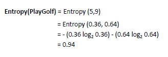
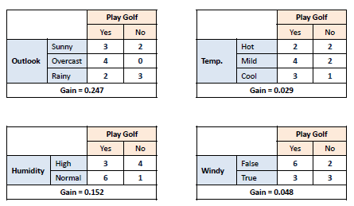
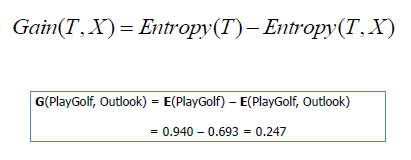
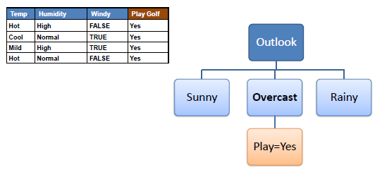
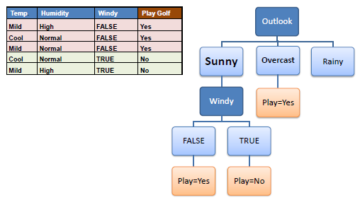

地图 > 数据科学 > 预测未来 > 建模 > 分类 > 决策树

# 决策树 - 分类

决策树以树结构的形式构建分类或回归模型。它将数据集分解为越来越小的子集，同时逐步开发关联的决策树。最终结果是一个具有**决策节点**和**叶节点**的树。决策节点（例如，Outlook）有两个或更多分支（例如，晴天、阴天和雨天）。叶节点（例如，Play）表示分类或决策。树中最顶层的决策节点对应于最佳预测器，称为**根节点**。决策树可以处理分类和数值数据。

## **算法**

构建决策树的核心算法称为**ID3**，由 J.R. Quinlan 提出，采用自顶向下、贪婪搜索的方式在可能的分支空间中进行搜索，没有回溯。ID3 使用*熵*和*信息增益*构建决策树。**熵**决策树是从根节点自顶向下构建的，涉及将数据分成包含具有相似值的实例的子集（同质）。ID3 算法使用熵来计算样本的同质性。如果样本完全同质，则熵为零，如果样本均匀分布，则熵为一。

要构建决策树，我们需要使用频率表计算两种类型的熵，如下所示：a) 使用一个属性的频率表计算熵：

b) 使用两个属性的频率表计算熵：

**信息增益**信息增益是基于数据集在属性分裂后熵的减少。构建决策树的关键在于找到返回最高信息增益（即最同质分支）的属性。*第一步*：计算目标的熵。

*第二步*：然后在不同的属性上对数据集进行分裂。计算每个分支的熵。然后按比例添加，以获得分裂的总熵。然后从分裂前的熵中减去结果。结果就是信息增益，或熵的减少。

*第三步*：选择具有最大信息增益的属性作为决策节点，通过其分支划分数据集，并在每个分支上重复相同的过程。

*第四步 a*：熵为 0 的分支是叶节点。

*步骤 4b*：熵大于 0 的分支需要进一步分割。

*步骤 5*：在非叶子分支上递归运行 ID3 算法，直到所有数据被分类。

# **决策树转换为决策规则**

通过从根节点到叶节点逐一映射，可以轻松将决策树转换为一组规则。

# **决策树 - 问题**

+   处理连续属性（分箱）

+   避免过拟合

+   超级属性（具有多个值的属性）

+   处理缺失值

| 练习 |  |  |
| --- | --- | --- |

 尝试发明一种使用卡方检验从数据构建决策树的新算法。
