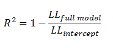

地图 > 数据科学 > 预测未来 > 建模 > 分类 > 逻辑回归

# 逻辑回归

逻辑回归预测只能具有两个值（即二分法）的结果的概率。预测是基于使用一个或多个预测变量（数值和分类）进行的。线性回归不适用于预测二元变量的值，有两个原因：

+   线性回归将预测值预测到可接受范围之外（例如，预测概率

    超出范围 0 到 1)

+   由于二分法实验每次只能有两个可能值，因此残差不会围绕预测线正态分布。

另一方面，逻辑回归产生的是逻辑曲线，该曲线限制在 0 到 1 之间的值。逻辑回归类似于线性回归，但该曲线是使用目标变量的“几率”的自然对数而不是概率来构造的。此外，预测变量不必在每个组中具有正态分布或相等的方差。

在逻辑回归中，常数（*b[0]*）将曲线左右移动，而斜率（*b[1]*）定义了曲线的陡峭程度。通过简单的转换，逻辑回归方程可以用几率比来表示。

最后，对两边取自然对数，我们可以用对数几率（logit）的形式写出方程，它是预测变量的线性函数。系数（*b[1]*）是对数几率（log-odds）在*x*变化一个单位时的变化量。

正如之前提到的，逻辑回归可以处理任意数量的数值和/或分类变量。

线性回归和逻辑回归之间有几个类比。正如普通最小二乘回归是用于估计线性回归中最佳拟合线的系数的方法一样，逻辑回归使用**最大似然估计**（MLE）来获取将预测变量与目标相关联的模型系数。在估计了这个初始函数之后，该过程将重复进行，直到 LL（对数似然）不再显著变化。

还提供**伪 R²**值以指示回归模型的适当性。**似然比检验**是对基线模型的似然比与简化模型的似然比之间差异的显著性检验。这种差异称为“模型卡方”。**瓦尔德检验**用于测试模型中每个系数（*b*）的统计显著性（即，预测变量的贡献）。**伪 R²**有几种旨在模拟 R²分析以评估逻辑模型拟合度的指标，但它们不能像解释 R²那样解释，不同的伪 R²可能得出非常不同的值。这里我们讨论三种伪 R²指标。

| 伪 R² | 方程 |  描述 |
| --- | --- | --- |
| 埃夫隆 |   | '*p'*是逻辑模型预测的概率。模型残差被平方，求和，然后除以因变量的总变异性。 |
| 麦克法登 |    | 对数似然比的比值表明完整模型相对于截距模型提供的改进水平。  |
| 计数 |    | 在给定.5 的截断点下正确预测的记录数，除以案例的总数。这等于分类模型的准确性。 |

**似然比检验**似然比检验提供了比较数据在一个模型（例如，完整模型）下的似然性与在另一个更受限制的模型（例如，截距模型）下的似然性的手段。

其中'*p'*是逻辑模型预测的概率。下一步是计算这两个对数似然性之间的差异。

两个似然性之间的差异乘以 2 倍，以便使用标准显著性水平（Chi²检验）进行统计显著性评估。测试的自由度将等于在模型下估计的参数数量的差异（例如，完整和截距）。**瓦尔德检验**用于评估模型中每个系数（*b*）的统计显著性。

其中*W*是具有正态分布的瓦尔德统计量（类似于 Z 检验），*b*是系数，*SE*是其标准误差。然后将*W*值平方，得到一个具有卡方分布的瓦尔德统计量。

**预测变量贡献** Wald 检验通常用于评估每个预测变量的预测显著性。另一个预测变量贡献的指标是系数的*exp*(*b*)或**比值比**，它是对数几率（对数几率）在预测变量(*x*)变化一个单位时变化的数量。

| 练习 |  |  |
| --- | --- | --- |

 逻辑回归交互式
