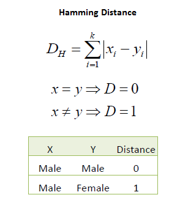

地图 > 数据科学 > 预测未来 > 建模 > 分类 > K 最近邻

# K 最近邻 - 分类

K 最近邻是一种简单的算法，它存储所有可用案例，并根据相似度度量（例如，距离函数）对新案例进行分类。KNN 在 1970 年代初期就已经被用于统计估计和模式识别中，作为一种非参数技术。 **算法**案例被其邻居的多数投票分类，通过距离函数测量其 K 个最近邻居中最常见的类别来分配。如果 K = 1，则案例简单地分配给其最近邻居的类别。

还应该注意到，这三个距离度量仅适用于连续变量。在分类变量的情况下，必须使用 Hamming 距离。这也提出了在数据集中存在数值和分类变量混合时，对数值变量进行标准化到 0 和 1 之间的问题。

选择最佳的 K 值最好是首先检查数据。一般来说，较大的 K 值更精确，因为它减少了总体噪音，但并没有保证。交叉验证是另一种通过使用独立数据集来验证 K 值的良好方法。在大多数数据集的历史上，最佳的 K 值在 3-10 之间。这比 1NN 产生了更好的结果。 *示例*：考虑以下关于信用违约的数据。年龄和贷款是两个数值变量（预测变量），违约是目标。

现在，我们可以使用训练集使用欧几里得距离对未知案例（年龄=48，贷款=$142,000）进行分类。如果 K=1，则最近邻是训练集中最后一个具有默认=Y 的案例。

D = Sqrt[(48-33)² + (142000-150000)²] = 8000.01  >> 默认=Y

当 K=3 时，三个最接近的邻居中有两个默认为 Y，一个默认为 N。对于未知案例的预测再次为默认=Y。 **标准化距离**直接从训练集计算距离度量的一个主要缺点是，当变量具有不同的测量尺度或数据集中存在数值和分类变量的混合时。例如，如果一个变量基于年收入（以美元计） ，而另一个基于年龄（以年为单位），那么收入将对计算的距离具有更高的影响。一种解决方案是如下所示地对训练集进行标准化。

在相同的训练集上使用标准化距离，未知情况返回了一个不同的邻居，这不是鲁棒性的一个好迹象。

| 练习 |  |  KNN 交互式 |
| --- | --- | --- |

 尝试使用线性相关发明一个新的 KNN 算法。
