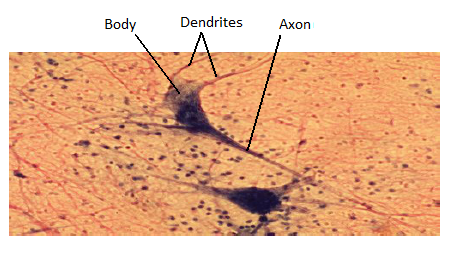
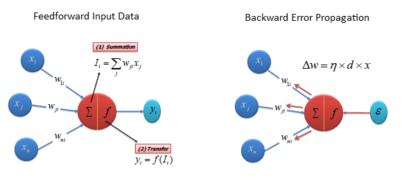
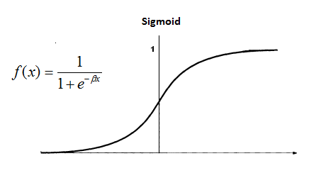
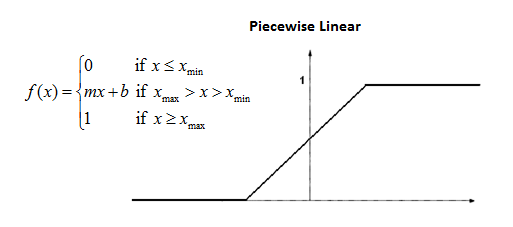
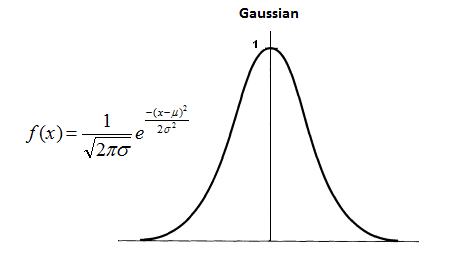
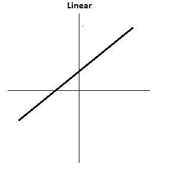

映射 > 数据科学 > 预测未来 > 建模 > 分类/回归 > 人工神经网络

# 人工神经网络

人工神经网络（**ANN**）是基于生物神经网络的系统，例如大脑。大脑约有 1000 亿个神经元，它们通过电化学信号进行通信。神经元通过称为突触的连接连接在一起。每个神经元与其他神经元建立数千个连接，不断接收传入信号以达到细胞体。如果信号的总和超过一定的阈值，则通过轴突发送响应。人工神经网络试图重新创建生物神经网络的计算镜像，尽管它不可比较，因为生物神经网络中的神经元数量和复杂性以及使用的次数比人工神经网络中的多得多。

人工神经网络由一组人工神经元（也称为“节点”）组成。这些节点彼此连接，它们之间的连接强度根据其强度分配一个值：抑制（最大值为-1.0）或兴奋（最大值为+1.0）。如果连接的值很高，则表示存在很强的连接。在每个节点的设计中，内置了一个传递函数。人工神经网络中有三种类型的神经元，即**输入节点**、**隐藏节点**和**输出节点**。

输入节点接收信息，其形式可以用数字表示。信息以激活值的形式呈现，其中每个节点都被赋予一个数字，数字越高，激活越强。然后将此信息传递到整个网络中。基于连接强度（**权重**）、抑制或兴奋以及传递函数，激活值从一个节点传递到另一个节点。每个节点对其接收的激活值求和；然后根据其传递函数修改该值。激活值通过网络流动，穿过隐藏层，直到到达输出节点。然后，输出节点以对外部世界有意义的方式反映输入。预测值与实际值之间的差异（错误）将通过根据节点对此错误的负责程度将其分配给每个节点的权重而向后传播（例如，梯度下降算法）。

## **传递（激活）函数**

传递函数将输入信号转换为输出信号。常用的四种传递函数类型是单位阶跃（阈值）、Sigmoid、分段线性和高斯。

**Sigmoid**Sigmoid 函数由两个函数组成，*逻辑*和*切线*。逻辑函数的值范围在 0 和 1 之间，切线函数的值范围在-1 到+1 之间。

**分段线性**输出与总加权输出成比例。

**高斯**高斯函数是连续的钟形曲线。节点输出（高/低）根据输入与选择的平均值的接近程度来解释类成员资格（1/0）。

**线性**像线性回归一样，线性激活函数将神经元的加权和输入转换为输出，使用线性函数。

## **算法**

神经网络有不同类型，但通常分为前馈和反馈网络。**前馈网络**是一种非递归网络，包含输入、输出和隐藏层；信号只能单向传输。输入数据传递到一层处理元素，进行计算。每个处理元素根据其输入的加权和进行计算。新计算的值然后成为下一层的新输入值。这个过程一直持续，直到通过所有层并确定输出。有时会使用阈值传递函数来量化输出层神经元的输出。前馈网络包括感知器（线性和非线性）和径向基函数网络。前馈网络经常用于数据挖掘。**反馈网络**具有反馈路径，意味着可以使用循环双向传输信号。允许神经元之间的所有可能连接。由于这种网络中存在循环，它变成一个非线性动态系统，不断变化直到达到平衡状态。反馈网络经常用于联想记忆和优化问题，其中网络寻找相互关联因素的最佳排列。
