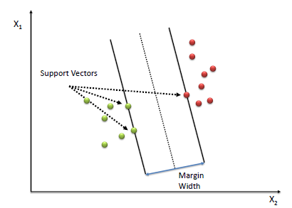
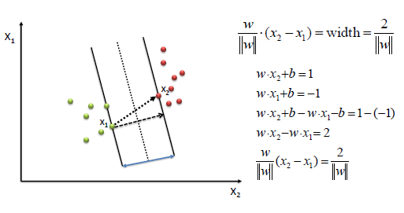
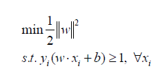
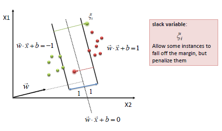
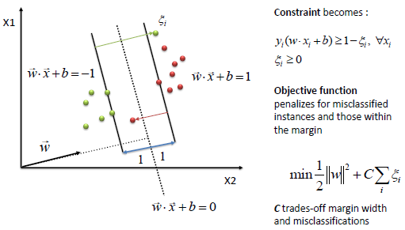
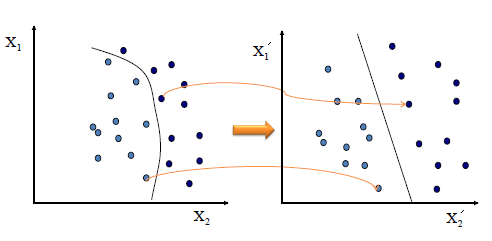
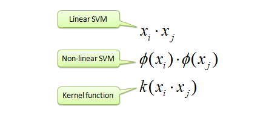
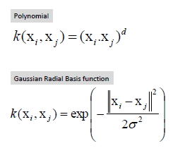

地图 > 数据科学 > 预测未来 > 建模 > 分类 > 支持向量机

# 支持向量机 - 分类（SVM）

支持向量机（SVM）通过找到最大化两类之间间隔的超平面来进行分类。定义超平面的向量（案例）是支持向量。

**算法**

1.  定义一个最优超平面：最大化间隔

1.  将上述定义扩展到非线性可分问题：对误分类有一个惩罚项。

1.  将数据映射到高维空间，这样就可以更容易地用线性决策面进行分类：重新制定问题，使数据隐式映射到这个空间。

要定义一个最优超平面，我们需要最大化间隔的宽度（*w*）。

通过求解以下目标函数，我们找到*w*和*b*，使用二次规划。

SVM 的美妙之处在于，如果数据是线性可分的，那么存在一个唯一的全局最小值。一个理想的 SVM 分析应该产生一个完全将向量（案例）分为两个不重叠类别的超平面。然而，完美的分离可能是不可能的，或者可能导致一个包含太多案例的模型，使得模型无法正确分类。在这种情况下，SVM 找到最大化间隔并最小化误分类的超平面。

该算法试图将松弛变量维持为零，同时最大化间隔。然而，它并不是最小化误分类数量（NP 完全问题），而是最小化距离边界超平面的距离之和。

用一条直线（1 维）、平面（2 维）或者 N 维超平面是分离两组数据最简单的方法。然而，有些情况下，非线性区域可以更有效地分离这些组。支持向量机通过使用核函数（非线性）来将数据映射到一个不同的空间，在这个空间中，超平面（线性）无法用来进行分离。这意味着一个非线性函数在高维特征空间中被线性学习机器所学习，而系统的容量由一个与空间维度无关的参数来控制。这被称为*核技巧*，意味着核函数将数据转换为更高维的特征空间，以便进行线性分离。

将数据映射到新空间，然后取新向量的内积。数据内积的图像是数据图像的内积。下面显示了两个核函数。

| 练习 |  |  |
| --- | --- | --- |
