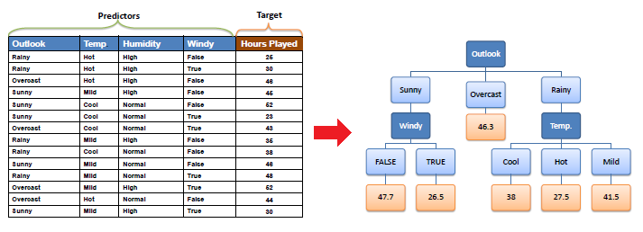
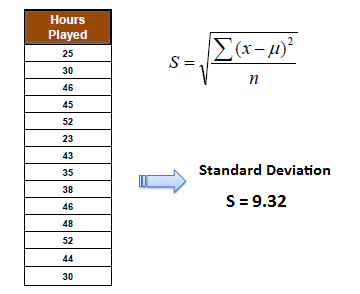
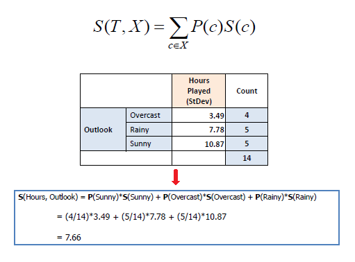
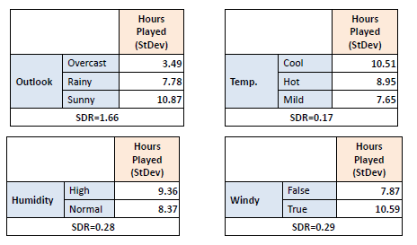
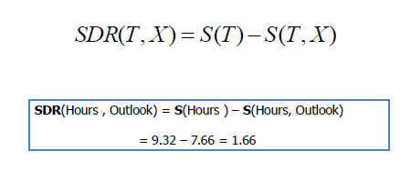
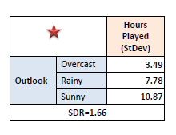
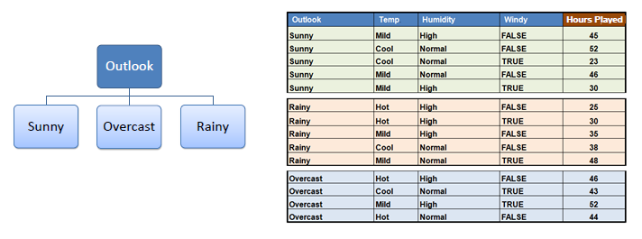
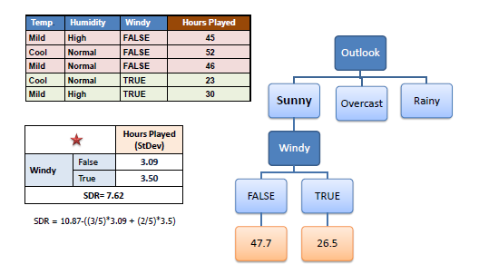

地图 > 数据科学 > 预测未来 > 建模 > 回归 > 决策树

# 决策树 - 回归

决策树以树形结构构建回归或分类模型。它将数据集分解为越来越小的子集，同时逐步开发关联的决策树。最终结果是一个具有**决策节点**和**叶节点**的树。决策节点（例如，Outlook）有两个或更多分支（例如，晴天、阴天和雨天），每个分支代表被测试属性的值。叶节点（例如，游戏时间）表示对数值目标的决策。树中最顶层的决策节点对应于最佳预测器，称为**根节点**。决策树可以处理分类和数值数据。

## **决策树算法**

构建决策树的核心算法称为**ID3**，由 J.R. Quinlan 提出，采用自顶向下、贪婪搜索的方式在可能的分支空间中进行搜索，没有回溯。ID3 算法可用于构建回归决策树，将信息增益替换为*标准差减少*。**标准差**：决策树自顶向下构建，涉及将数据分成包含具有相似值的实例的子集（同质）。我们使用标准差来计算数值样本的同质性。如果数值样本完全同质，则其标准差为零。

a) 一个属性的标准差：

b) 两个属性的标准差：

**标准差减少**：标准差减少是基于数据集在属性上分裂后标准差的减少。构建决策树的关键在于找到返回最高标准差减少（即最一致的分支）的属性。*步骤 1*：计算目标的标准差。

**标准差（游戏时间）= 9.32**

*步骤 2*：然后根据不同属性对数据集进行分裂。计算每个分支的标准差。将得到的标准差减去分裂前的标准差。结果就是标准差减少。

*步骤 3*：选择具有最大标准差减少的属性作为决策节点。

*步骤 4a*：根据所选属性的值对数据集进行划分。

*第四步 b*：标准差大于 0 的分支集需要进一步分割。实际操作中，我们需要一些终止准则。例如，当分支的标准差变得比整个数据集的标准差的某个分数（例如，5%）还要小，*或者*当分支中剩余的实例太少（例如，3）时。

*第五步*：该过程在非叶子节点上递归运行，直到所有数据被处理。当叶子节点上的实例数大于一个时，我们将*平均值*计算为目标的最终值。

| 练习 |  |  |
| --- | --- | --- |

 尝试发明一种新的算法，使用 MLR 而不是在叶子节点上使用平均值来构建决策树。
