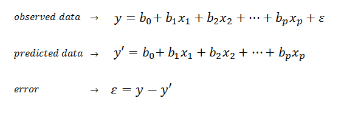
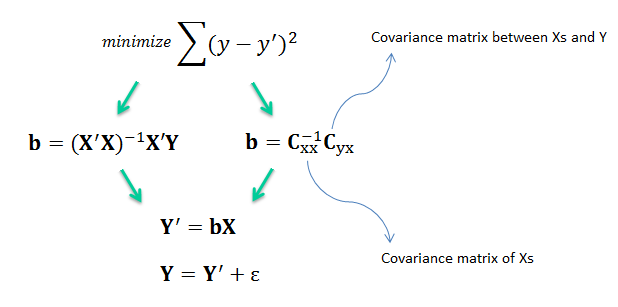
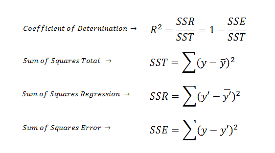
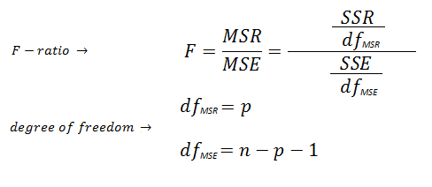
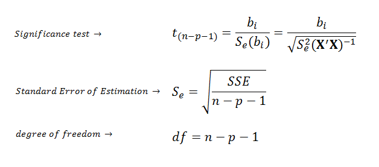

地图 > 数据科学 > 预测未来 > 建模 > 回归分析 > 多元线性回归

# 多元线性回归

多元线性回归（**MLR**）是一种用于模拟因变量（目标）与一个或多个自变量（预测变量）之间线性关系的方法。

MLR 基于普通最小二乘法（**OLS**），模型拟合使得观测值和预测值的差的平方和最小化。

MLR 模型基于几个假设（例如，误差服从均值为零且方差恒定的正态分布）。只要满足这些假设，回归估计量在无偏、高效和一致的意义上是最佳的。无偏意味着估计量的期望值等于参数的真实值。高效意味着估计量的方差小于任何其他估计量。一致意味着估计量的偏差和方差在样本量趋近无穷时趋近于零。**模型有多好？**R²也称为*决定系数*，总结了回归模型的解释能力，并从平方和项中计算得出。

R²描述了回归模型解释的因变量方差的比例。如果回归模型是“完美的”，SSE 为零，R²为 1。如果回归模型完全失败，SSE 等于 SST，回归未解释任何方差，R²为零。重要的是要记住高 R²与因果关系之间没有直接关系。**模型的显著性有多大？***F*-比率估计了回归模型的统计显著性，并从 ANOVA 表中的均方项计算得出。F-比率的显著性是通过使用两个自由度（*df*[MSR]，*df*[MSE]）在 F 分布表中查找得到的。*p*是独立变量的数量（例如，对于简单线性回归，*p*为 1）。

F-比率相对于 R²的优势在于 F-比率在评估回归模型的显著性时考虑了样本量和预测变量的数量。一个模型可能具有较高的 R²，但仍然不具有统计显著性。**系数的显著性有多大？**如果回归模型显著好，我们可以使用 t 检验来估计每个系数的统计显著性。

*示例* **多重共线性**预测变量之间存在高度共线性会导致回归系数估计不可靠。共线性的迹象包括：

1.  预测变量之间存在高相关性。

1.  回归系数的符号或大小没有良好的物理意义。

1.  对重要预测变量的统计上不显著的回归系数。

1.  回归系数对于插入或删除预测变量的敏感性极高。

在(**X'X**)^(-1)矩阵中的对角值被称为*方差膨胀因子*（VIFs），它们是多重共线性的非常有用的衡量指标。如果任何一个 VIF 超过 5，那么多重共线性就是一个问题。**模型选择**数据挖掘中经常遇到的问题是要避免那些对模型预测没有显著贡献的预测变量。首先，已经证明删除那些具有无关紧要系数的预测变量可以降低预测误差的平均值。其次，在具有许多变量的模型中，由于多重共线性，回归系数的估计可能不稳定。最后，一个更简单的模型是一个更好的模型，可以更深入地了解模型中预测变量的影响。模型选择有两种主要方法：

+   **前向选择**，最佳的预测变量逐个进入模型。

+   **后向消元**，最差的预测变量逐个从模型中消除。

| 练习 |  |  线性回归交互式 |
| --- | --- | --- |
