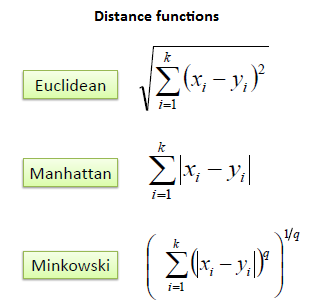

地图 > 数据科学 > 预测未来 > 建模 > 回归 > K 最近邻

# K 最近邻 - 回归

K 最近邻是一个简单的算法，它存储所有可用的情况并根据相似性度量（例如，距离函数）预测数值目标。KNN 已经在 1970 年代初就被用于统计估计和模式识别中，作为一种非参数技术。**算法** KNN 回归的一个简单实现是计算 K 最近邻的数值目标的平均值。另一种方法使用 K 最近邻的倒数距离加权平均值。KNN 回归使用与 KNN 分类相同的距离函数。

上述三种距离度量仅适用于连续变量。对于分类变量的情况，必须使用汉明距离，它是两个等长字符串中对应符号不同的实例数的度量。

通过首先检查数据来选择最佳的 K 值是最好的方法。一般来说，较大的 K 值更精确，因为它减少了总体噪声；然而，这种妥协是特征空间中的明确边界变得模糊了。交叉验证是另一种通过使用独立数据集来回顾性地确定良好 K 值的方法。大多数数据集的最佳 K 值为 10 或更多。这比 1-NN 产生了更好的结果。*示例*：考虑以下关于房价指数（HPI）的数据。年龄和贷款是两个数值变量（预测变量），HPI 是数值目标。

现在我们可以使用训练集使用欧几里得距离对一个未知情况（年龄=33，贷款=$150,000）进行分类。如果 K=1，则最近的邻居是训练集中 HPI=264 的最后一个情况。

D = Sqrt[(48-33)² + (142000-150000)²] = 8000.01 >> HPI = 264

当 K=3 时，HPI 的预测值等于前三个邻居的 HPI 的平均值。

HPI = (264+139+139)/3 = 180.7

**标准化距离**

直接从训练集计算距离度量的一个主要缺点在于变量具有不同的测量尺度或者存在数值和分类变量混合的情况。例如，如果一个变量是以年收入美元为基础的，另一个变量是以年龄年为基础的，则收入将对计算的距离产生更高的影响。一个解决方案是将训练集标准化，如下所示。

如在同一训练集上使用标准化距离进行 KNN 分类所述，未知情况返回了一个不同的邻居，这不是健壮性的好迹象。

| 练习 |  |  |
| --- | --- | --- |
