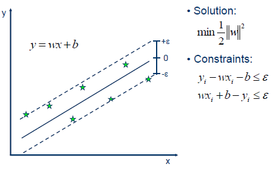

地图 > 数据科学 > 预测未来 > 建模 > 回归 > 支持向量机

# 支持向量机 - 回归 (SVR)

支持向量机也可以用作回归方法，保留了算法的所有主要特征（最大间隔）。支持向量回归 (SVR) 使用与用于分类的 SVM 相同的原则，只有一些细微的差异。首先，因为输出是实数，所以预测手头的信息变得非常困难，它有无限的可能性。在回归的情况下，设置一个容差边界 (epsilon) 近似于已经从问题中要求的 SVM。但除此之外，还有一个更复杂的原因，即算法更复杂，因此需要考虑。然而，主要思想始终是一样的：最小化误差，个性化地找到最大间隔的超平面，同时考虑到部分误差是可容忍的。

**线性 SVR**

**非线性 SVR** 核函数将数据转换为更高维的特征空间，使得可以进行线性分离。

**核函数**

| 练习 |  |  |
| --- | --- | --- |
