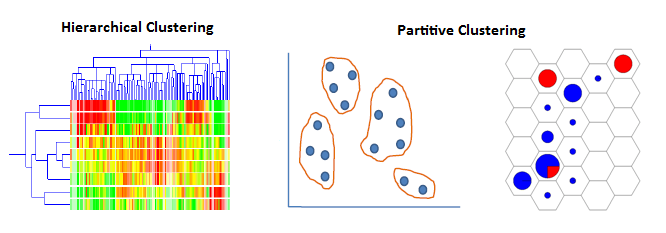
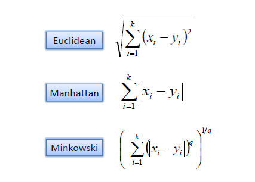

地图 > 数据科学 > 预测未来 > 建模 > 聚类

# 聚类

一个聚类是数据的子集，它们是相似的。聚类（也称为无监督学习）是将数据集划分为组，使得每个组的成员尽可能相似（接近），而不同组之间尽可能不同（远）的过程。聚类可以揭示数据集中以前未发现的关系。聚类分析有许多应用。例如，在商业中，聚类分析可用于发现和描述市场营销目的的客户细分，而在生物学中，它可用于根据其特征对植物和动物进行分类。聚类算法主要分为两大类：

1.  分层

    +   聚合

    +   分裂

1.  部分的

    +   K 均值

    +   自组织映射

<map name="FPMap0"></map>

一个好的聚类方法的要求是：

+   发现部分或全部隐藏聚类的能力。

+   簇内相似度和簇间差异度。

+   能够处理各种类型的属性。

+   能够处理噪声和异常值。

+   可处理高维度。

+   可扩展的、可解释的和可用的。

聚类中一个重要问题是如何确定两个对象之间的相似性，以便可以从具有高相似性的对象形成簇，并且簇内的相似性低于簇间的相似性。通常，为了测量对象之间的相似性或差异性，会使用距离度量，如欧氏距离、曼哈顿距离和闵可夫斯基距离。距离函数会为彼此更相似的对象对返回较低的值。

