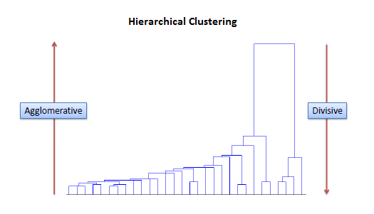
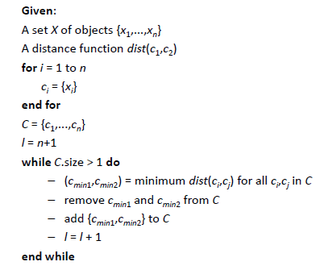
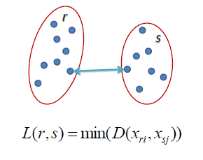
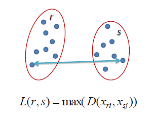
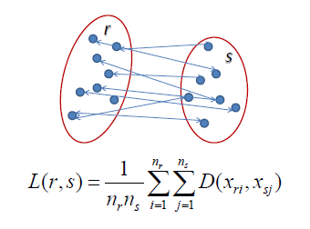

地图 > 数据科学 > 预测未来 > 建模 > 聚类 > 层次

# 层次聚类

层次聚类涉及创建具有从顶部到底部的预定顺序的聚类。例如，硬盘上的所有文件和文件夹都以层次结构组织。有两种类型的层次聚类，*分裂*和*聚合*。

**分裂方法**在这种方法中，我们将所有观察结果都分配给一个单一的聚类，然后将该聚类分成两个最不相似的聚类。最后，我们对每个聚类进行递归处理，直到每个观察结果都有一个聚类。

**聚合方法**

在这种方法中，我们将每个观察结果分配给其自己的聚类。然后，计算每个聚类之间的相似度（例如，距离），并将最相似的两个聚类连接起来。最后，重复步骤 2 和 3，直到只剩下一个单一的聚类。相关的算法如下所示。

> 

在执行任何聚类之前，需要确定包含每个点之间距离的接近度矩阵，使用距离函数计算距离。然后，更新矩阵以显示每个聚类之间的距离。以下三种方法在每个聚类之间的距离如何测量方面有所不同。**单链接**在单链接层次聚类中，两个聚类之间的距离定义为每个聚类中两个点之间的*最短*距离。例如，左侧聚类�r�和�s�之间的距离等于它们两个最接近点之间的箭头的长度。

**完全链接**在完全链接层次聚类中，两个聚类之间的距离定义为每个聚类中两个点之间的*最长*距离。例如，左侧聚类�r�和�s�之间的距离等于它们两个最远点之间的箭头的长度。

**平均链接**在平均链接层次聚类中，两个聚类之间的距离定义为一个聚类中的每个点到另一个聚类中的每个点的平均距离。例如，左侧聚类�r�和�s�之间的距离等于连接一个聚类中的点与另一个聚类中的点的每个箭头的平均长度。

| 练习 |  | [层次聚类交互式](http://home.dei.polimi.it/matteucc/Clustering/tutorial_html/AppletH.html) |
| --- | --- | --- |
