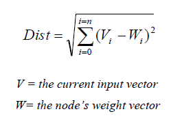

地图 > 数据科学 > 预测未来 > 建模 > 聚类 > 自组织映射

# 自组织映射

**自组织映射（SOM）**用于高维数据集的可视化和分析。 SOM 有助于将高维数据集呈现为较低维度的数据集，通常是 1-D、2-D 和 3-D。这是一种无监督学习算法，不需要目标向量，因为它能够在没有监督的情况下学习对数据进行分类。 SOM 由一组节点或单元的网格组成，输入数据被呈现给这些单元。每个节点都与输入连接，节点之间没有连接。 SOM 是一种保持拓扑关系的技术，并在其映射展示中保持邻域关系。

**算法**1- 每个节点的权重初始化为 0 到 1 之间的随机数

2- 从训练数据集中选择一个随机输入向量 3- 计算最佳匹配单元（BMU）。检查每个节点以找到其权重与输入向量最相似的节点。 由于其向量与输入向量最相似，因此该单元被称为最佳匹配单元（BMU）。 通过欧几里得距离公式进行此选择，这是衡量两个数据集之间相似性的指标。 计算输入向量与节点权重之间的距离以找到 BMU。

4- 计算 BMU 周围邻域的大小。 BMU 周围邻域的大小随着指数衰减函数而减小。 它在每次迭代中收缩，直到只剩下 BMU。

5- 修改 BMU 和相邻节点的权重，使其权重更接近输入向量的权重。 调整邻域内每个节点的权重，使得距离 BMU 更近的邻居变化更大。

学习率的衰减是每次迭代计算的。

随着训练的进行，邻域逐渐缩小。训练结束时，邻域已经缩小到零大小。

影响率显示节点距离 BMU 的距离对其学习的影响量。在最简单的形式中，接近 BMU 的所有节点的影响率均等于 1，而其他节点的影响率均为零，但高斯函数也很常见。 最后，通过权重的随机分布和大量迭代，SOM 能够得出稳定区域的地图。 最后，数据的解释需要人类来完成，但 SOM 是一种展示数据中看不见的模式的伟大技术。

| 练习 |  | SOM 交互式  |
| --- | --- | --- |
