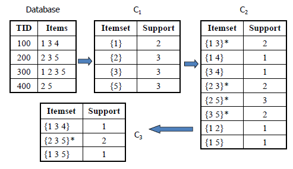
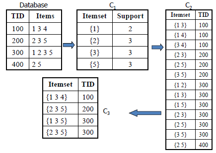
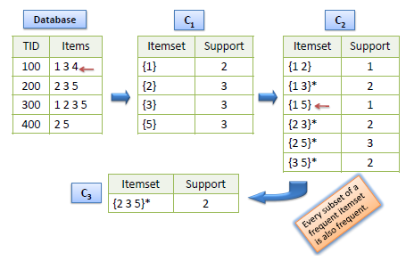
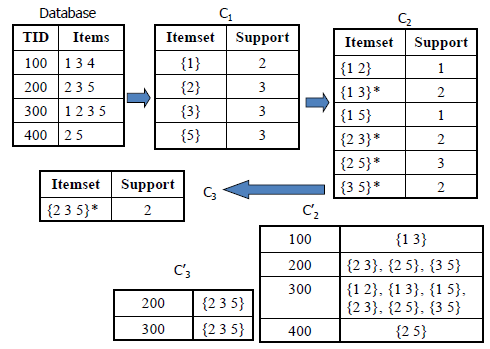

地图 > 数据科学 > 预测未来 > 建模 > 关联规则

# 关联规则

关联规则查找所有具有大于最小支持的***支持***的项目集，并使用大项集生成具有大于最小置信度的所需规则。规则的***提升度***是观察到的支持与如果 X 和 Y 独立预期的支持之比。 关联规则应用的典型和广泛使用的示例是市场篮子分析。

*例子*：

**AIS 算法**

1.  候选项集在扫描数据库时即时生成和计数。

1.  对于每个事务，确定前一次传递的大项集中包含在该事务中的哪些。

1.  通过将这些大项集与此事务中的其他项扩展，生成新的候选项集。

AIS 算法的缺点是导致不必要地生成和计数太多的候选项集，结果是小的。 **SETM 算法**

1.  候选项集在扫描数据库时即时生成，但在通过结束时计数。

1.  新的候选项集的生成方式与 AIS 算法相同，但是生成事务的 TID 与候选项集一起保存在顺序结构中。

1.  在通过结束时，通过聚合此序列结构来确定候选项集的支持计数。

SETM 算法具有与 AIS 算法相同的缺点。 另一个缺点是对于每个候选项集，其条目数与其支持值一样多。 **Apriori 算法**

1.  仅使用前一次传递的大项集生成候选项集，而不考虑数据库中的事务。

1.  上一次传递的大项集与自身连接以生成所有大小增加 1 的项集。

1.  删除具有不是大的子集的生成的项集。 剩下的项集是候选项。

Apriori 算法利用了频繁项集的任何子集也是频繁项集的事实。 因此，该算法可以通过仅探索支持计数大于最小支持计数的项集来减少考虑的候选数目。 如果有一个不频繁的子集，则可以修剪所有不频繁的项集。 **AprioriTid 算法**

1.  数据库在第一遍之后不再用于计算候选项集的支持。

1.  候选项集的生成方式与 Apriori 算法相同。

1.  另外生成一个集合 C�，其中每个成员都有每个事务的 TID 以及该事务中存在的大项集。这个集合用于计算每个候选项集的支持度。

优点是 C�中的条目数可能小于数据库中的事务数，特别是在后续传递中。 **AprioriHybrid Algorithm** 在较早的传递中，Apriori 比 AprioriTid 做得更好。然而，在后续传递中，AprioriTid 比 Apriori 做得更好。因此，可以设计一个混合算法，该算法在初始传递中使用 Apriori，并在预计 C�集合将适合内存时切换到 AprioriTid。

| 练习 |  |  |
| --- | --- | --- |
