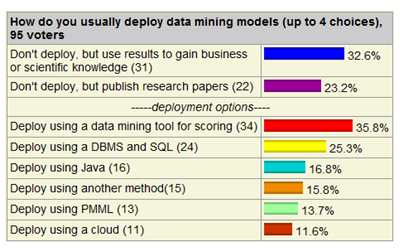
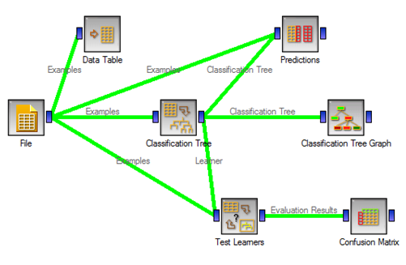
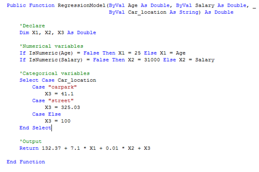
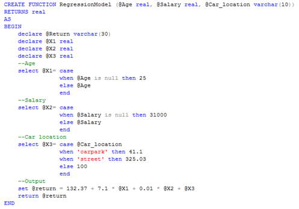
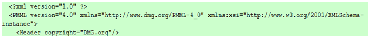
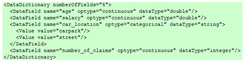
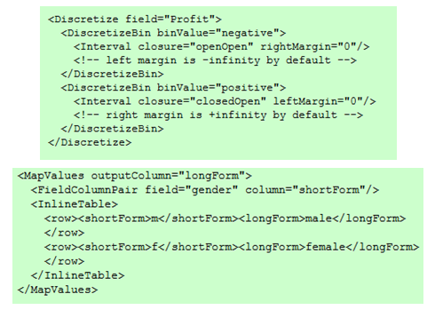
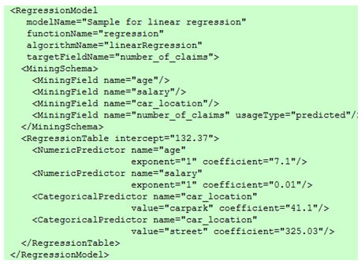
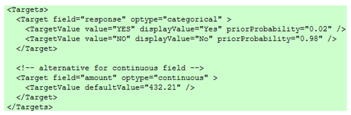

地图 > 问题定义 > 数据准备 > 数据探索 > 建模 > 评估 > 部署

# 模型部署

在数据科学中，部署的概念指的是使用新数据对模型进行预测的应用。构建模型通常不是项目的终点。即使模型的目的是增加对数据的了解，获得的知识也需要以客户能够使用的方式组织和呈现。根据要求，部署阶段可能是生成报告的简单操作，也可能是实施可重复的数据科学过程。在许多情况下，执行部署步骤的将是客户，而不是数据分析师。例如，信用卡公司可能希望部署一组训练好的模型（例如，神经网络，元学习器）来快速识别可能是欺诈的交易。但是，即使分析师不执行部署工作，客户也需要事先了解需要执行哪些操作才能真正利用创建的模型。**模型部署方法:**通常，数据科学中有四种部署模型的方式。

1.  数据科学工具（或云）

1.  编程语言（Java，C，VB，�）

1.  数据库和 SQL 脚本（TSQL，PL-SQL，�）

1.  PMML（预测模型标记语言）

下表显示了对模型部署的不同方法进行调查的结果 ([KDnuggets](http://www.kdnuggets.com/polls/2009/deployment-data-mining-models.htm))。

使用数据挖掘工具（[Orange](http://www.ailab.si/orange/)）部署决策树模型的示例。

使用编程语言（Visual Basic）部署回归模型的示例。

在 SQL 脚本中部署的相同回归模型。

**预测模型标记语言（PMML）**PMML 是一种基于 XML 的语言，用于定义统计和数据科学模型，并在符合规范的应用程序之间共享这些模型。它不仅定义了表示数据科学模型的标准，还定义了数据处理和数据转换（前处理和后处理）的标准。PMML 是由 [DMG](http://www.dmg.org/) 开发的，旨在避免专有问题和不兼容性，并部署模型。PMML 消除了自定义模型部署的需要，并允许清晰地区分模型开发和模型部署任务。PMML 支持以下数据科学方法。

+   回归

+   神经网络

+   支持向量机

+   决策树

+   朴素贝叶斯

+   聚类

+   序列

+   规则集

+   关联规则

+   时间序列

+   文本模型

**PMML 过程**

1.  **预处理**

    +   数据字典：允许明确指定有效、无效和缺失值。

    +   挖掘模式：用于定义要应用于缺失和无效值的适当处理方式。

    +   变换：允许变量离散化、标准化和映射，并处理缺失和默认值。

    +   内置函数：算术表达式，处理日期和时间以及字符串。此外，用于实现 IF-THEN-ELSE 逻辑和布尔操作。

1.  **模型**

    +   PMML 允许完全表达多种预测建模技术。

1.  **后处理**

    +   可以使用 PMML 元素目标执行模型输出的缩放。

**PMML 组件****标头**：包含有关 PMML 文档的一般信息，例如模型的版权信息、描述以及用于生成模型的应用程序的信息，如名称和版本。它还包含一个时间戳属性，可用于指定模型创建的日期。

**数据字典**：包含模型使用的所有可能字段的定义。在这里，一个字段被定义为连续的、分类的或有序的。根据此定义，然后定义适当的值范围以及数据类型 (例如，字符串或双精度)。

**数据转换**：转换允许将用户数据映射到更理想的形式，以供挖掘模型使用。PMML 定义了几种简单数据转换。

+   标准化：将值映射到数字，输入可以是连续的或离散的。

+   离散化：将连续值映射到离散值。

+   值映射：将离散值映射到离散值。

+   函数：通过将函数应用于一个或多个参数来派生一个值。

+   聚合：用于总结或收集一组值。

**模型**：包含数据科学模型的定义。例如，前馈神经网络在 PMML 中由一个名为 "NeuralNetwork" 的元素表示，该元素包含诸如以下属性：

+   模型名称 (属性 modelName)

+   函数名称 (属性 functionName)

+   算法名称 (属性 algorithmName)

+   激活函数 (属性 activationFunction)

+   层数 (属性 numberOfLayers)

**挖掘模式**：挖掘模式列出了模型中使用的所有字段。这可以是数据字典中定义的字段的子集。它包含有关每个字段的具体信息，例如：

+   名称 (属性 name)：必须引用数据字典中的字段

+   使用类型 (属性 usageType)：定义字段在模型中的使用方式。典型的值包括：active、predicted 和 supplementary。预测字段是由模型预测的字段。

+   异常值处理（属性异常值）：定义要使用的异常值处理方式。在 PMML 中，异常值可以被视为缺失值、极端值（基于特定字段的高低值定义）或原样处理。

+   缺失值替换策略（属性缺失值替换）：如果指定了此属性，则缺失值将自动替换为给定的值。

+   缺失值处理（属性缺失值处理）：指示如何得到缺失值替换（例如，作为值、均值或中位数）。

**目标**: 允许对模型输出进行后处理，以比例缩放的形式处理预测值，如果模型输出是连续的。目标也可用于分类任务。在这种情况下，属性先验概率指定了相应目标类别的默认概率。如果预测逻辑本身没有产生结果，则会使用它。例如，如果输入值缺失且没有其他方法处理缺失值。

**PMML 4.0 � 新特性**

+   改进的预处理能力

    +   内置函数的添加包括一系列布尔操作和一个 If-Then-Else 函数。

+   时间序列模型

    +   新的指数平滑模型；还有 ARIMA、季节性趋势分解和谱分析的占位符，这些将在不久的将来得到支持。

+   模型解释

    +   将评估和模型性能指标保存到 PMML 文件本身。

+   多模型

    +   模型组合、集成和分割的能力（例如，回归和决策树的组合）。

+   扩展现有元素

    +   添加了支持向量机的多类分类、关联规则的改进表示以及 Cox 回归模型的添加。
