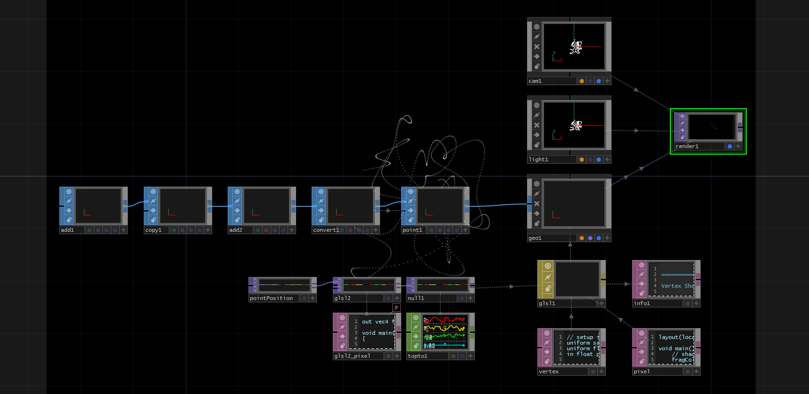

# TouchDesigner 入门指南

## 前言

在艺术家和工具之间有无数的技巧和知识片段，这些都有助于艺术家变得更加流畅和为制作挑战做好准备。当我听说 Elburz 的 TouchDesigner 书籍项目时，我想，是的，我想知道他知道什么！Elburz 对 TouchDesigner 的深入了解来自多个来源——在论坛上帮助和交谈与无数用户，紧急项目的现场修正，使用 TouchDesigner 的 beta 版本进行与 Derivative 的合作，以及他作为嘻哈长号手和 VJ 的副业纯粹的探索活动。

这本书是一个很好的键盘旁或床边的伴侣，探讨了 TouchDesigner 背后的概念、技术和方法论 - 这是我以前没有机会亲自介绍过的东西，我很高兴 Elburz 在这里呈现了。所以用这些东西来提升自己的技能——它可以从头到尾阅读，也可以随意翻阅页面，就像我自己所做的那样——在整本书中发现了信息和见解的宝藏。

非常感谢 Elburz 为丰富 TouchDesigner 社区所做的努力。我相信这将引发一连串伟大的反应。

*Greg Hermanovic

创始人

衍生品*

## 作者的前言

这本书的目的是双重的：

+   教授 TouchDesigner 088 的基础知识

+   创建一个由社区驱动的初学者资源

第一个目的很简单。我们将看看各种 UI 元素，讨论操作符和操作符系列，探索逻辑工作流程，网络优化，性能界面，显示管理等。TouchDesigner 的核心元素将被解释和演示，并且将预先解决许多常见问题。

在书面部分之后，我们将通过书的结尾的示例项目和视频教程学习如何解决问题的方法。这些课程将是实践性的，因为我们将从零开始组装一些项目和有用的模块。

这本书的第二个目的对社区的要求稍微更高一些。我们真的相信社区，所以我们不想出售这本书，我们希望每个人都能免费访问它（文字、视频和示例文件）。我们希望进一步推动这个想法，不仅允许免费访问书籍的内容，还允许免费访问书籍的构建模块。

这意味着任何人都可以随意添加、评论、更改、标记、删除或增加这本书中的资源。这本书的所有内容都是完全使用 LaTeX 编写的，编译该书的代码、项目文件、示例、图表、视频以及任何其他内容都将托管在 GitHub 上，并且将免费（根据知识共享许可证）供任何人下载、分享和构建。

为了质量控制目的，每个人都可以分支存储库，但我们将在将更新集成回主分支之前审查所有更改。每个贡献者都将受到感谢，并被添加到本书的“致谢”部分。这样，新用户只需寻找一个单独的 PDF 文件或下载链接，就可以获得社区最新的知识。

我们真诚希望社区参与其中，并帮助为初学者创建终极的入门资源！

在最初的撰写时，了解这本书是什么将和了解这本书不是什么一样重要。这本书不是操作符参考手册。我们不会涵盖每个操作符的每个参数或用法。这本书不旨在取代 Derivative Wiki 作为主要参考，我们只会使用和学习我们需要的内容。这本书也不旨在取代论坛中丰富的有用用户和组件。

最终，这个资源是对许多 TouchDesigner 程序员和 Derivative 员工的致敬，无论是在论坛上还是在现实生活中，他们都帮助我们所有人走到了今天。我们希望这一传统将随着 TouchDesigner 的持续而延续。

*Elburz Sorkhabi & nVoid Art-Tech Limited*

## TouchDesigner 是什么？

这是许多用户在刚开始时花时间尝试回答的问题。令人惊讶的是，创建和执行简单任务需要花费多长时间。令人惊讶的是，花费了大量时间来构建其他软件包中已经存在的功能。那么 TouchDesigner 是什么？答案很简单：TouchDesigner 是一种视觉、基于节点的编程语言。

从描述中可能最重要的方面开始，TouchDesigner 是一种编程语言。TouchDesigner 不是一个在启动时准备好执行在其他应用程序中看似简单的操作的应用程序。TouchDesigner 是一个具有极端深度和许多潜在陷阱的环境。通过一些练习和时间，许多东西可以在需要时快速创建。通过本书的目标创建可重复使用的模块，空白画布变成完成项目的速度将大大增加。这并不是否认 TouchDesigner 仍然是一种编程语言。许多任务仍然需要时间和精力的尽职调查。许多任务将需要相当多的思考，所有这些任务都将需要一些基本的问题解决技能。

描述的第二个方面是 TouchDesigner 是基于节点的。这意味着，与其打开文本文档并逐行输入代码，TouchDesigner 的图形界面用于通过节点制作应用程序。TouchDesigner 中的每个节点或操作符执行特定、小型和细粒度的操作。为执行复杂任务，一些节点将共同工作。为在这些节点之间发送信息，它们的输入和输出被连线在一起。存在许多基于节点的编程语言，例如 Cycling 74 的 Max/MSP，但是 TouchDesigner 的视觉特性使其与众不同。

TouchDesigner 中的所有内容都有可视化对应物。所有操作符都有查看器。无论是文本、控制数据、音频、视频等，都通过执行的每个操作来可视化。这与任何传统编程，甚至基于节点的语言都不同，但这正是使 TouchDesigner 成为一个出色的工作环境的原因。通过能够可视化所涉及的每个步骤，学习如何完成许多复杂任务变得大大简化。

## 访问这本书

有多种方式可以访问《TouchDesigner 088 入门》。自从将这本书转换为使用 Gitbooks 后，您现在可以从下面的链接下载 PDF、epub 或 mobi 版本的书籍：

[`www.gitbook.com/book/nvoid/introduction-to-touchdesigner/details`](https://www.gitbook.com/book/nvoid/introduction-to-touchdesigner/details)

示例文件位于 GitHub 存储库的`TouchDesigner 示例文件`文件夹中，可以在此处克隆或下载：

[`github.com/nVoid/Introduction-to-touchdesigner`](https://github.com/nVoid/Introduction-to-touchdesigner)

数小时的高清视频教程可在单个 Vimeo 频道中找到。所有文件都可以从 Vimeo 下载以供离线观看。以下是此链接：

[`vimeo.com/channels/845218`](https://vimeo.com/channels/845218)

您还可以从此 GitHub 存储库下载 Markdown 源代码，并单独构建使用各部分。您可以自由更改、编辑、添加、删除和修改文本，通过分支源文件。完成后，提交您的更改，它们将由我们的管理人员审核，并合并到主分支中，届时您将被添加到书籍的贡献者章节的贡献者列表中，连同您的贡献。

有关此资源的更多一般信息，请访问[`book.nvoid.com`](http://book.nvoid.com)

## 编译这本书

与之前的 LaTeX 版本不同，无需构建环境即可为这本书做出贡献。您可以使用普通的 Markdown，当您完成并且您的更改被接受到存储库时，Gitbooks 会自动创建新的网络版本、PDF、epub 和 mobi 版本的书籍。

## 归属和许可

本资源采用知识共享署名-非商业性使用-相同方式共享 4.0 国际许可协议。

链接: [`creativecommons.org/licenses/by-nc-sa/4.0/`](http://creativecommons.org/licenses/by-nc-sa/4.0/)

谢谢！

# 信号流和连接

# 1 基础知识

### *1.1 信号流和连接*

在 TouchDesigner 中，连接操作符是最基本的操作。所有项目都由一组组连接在一起的操作符组成。每个操作符本身都有一个非常具体的功能，但当它们组合在一起成为一个'网络'时，它们可以解决非常复杂的问题。

TouchDesigner 中的所有数据都是从左到右流动的。任何操作符具有的输入始终在左侧，输出在右侧。输入和输出也将按照从上到下的顺序排序。在下面的示例图中，从左侧开始跟随两个信号。当它们从左到右流动时，它们会叠加在一起。


有趣的是，组件与操作符具有相同的数据信号流，从左到右流动，但它们还能够具有父子关系，从上到下流动。信号链顶部的组件是父组件，其下方的组件是其子组件，再下方是子组件的子组件，依此类推。在下面的示例中，有一个由几个滑块组成的小型 UI。在这个示例中，滑块组件是容器组件的子组件，而容器组件是父组件。


# 创建操作符

### *1.2 创建操作符*

OP 创建对话框可以通过多种方式到达。每种方式都有正确的使用时间和地点。当从头开始创建操作符时，最简单的两种方法是在键盘上按下'Tab'键，或者双击网络背景。

在处理现有操作符链时，有两种简单的方法可以添加操作符。第一种是右键单击操作符的输入或输出。这将在输入之前或输出之后直接添加所选的操作符，并进行预连接。这在将操作符无缝插入到现有链中时特别有用。

例如，有一个连接到 Null TOP 的 Constant TOP，需要在两者之间添加一个 Transform TOP。右键单击 Constant TOP 的输出或 Null TOP 的输入，并选择 Transform TOP，将创建一个 Transform TOP，它将预先连接在 Constant TOP 和 Null TOP 之间。

添加操作符到现有链中的第二种方法是在操作符的输出上中键单击。不同之处在于，右键单击会将新创建的操作符集成到当前操作符链中，而中键单击会在操作符链的旁边创建一个新的并行分支。

可以通过右键单击线本身然后点击“插入操作符”或“添加操作符”来实现类似的结果。“插入操作符”的作用类似于右键单击操作符的输出，并将其集成到当前操作符链中，而“添加操作符”的作用类似于中键单击，并在操作符链的旁边创建一个新的分支。

在下面的图表中，有一个包含一个常量 TOP 和一个空 TOP 的示例。在接下来的图表中，右键单击连接它们的线，并使用“插入操作符”创建了一个变换 TOP。在后续图表中，右键单击连接操作符的线，并使用“添加操作符”创建了一个变换 TOP。注意它是如何预先连线并行到第一个变换 TOP 的。


在使用操作符创建对话框时，有两个有用的键命令：“Control”和“Shift”。打开操作符创建对话框，按住键盘上的“Control”键，然后开始连续选择多个操作符。每个操作符将被添加到上一个下方的网络中。这对于快速使用几个不同的操作符填充网络非常有用。

同样地，打开操作符创建对话框，按住“Shift”键，然后开始选择多个操作符。这与上面不同，因为这些操作符将串联在一起。这个键盘命令可用于快速创建预先连线的操作符的小型或大型链。

当这两个键命令一起使用时，它们变得更加强大。例如，一个项目需要 3 条操作符链。第一条将由一个 Circle TOP 组成，连接到一个模糊 TOP，连接到一个空 TOP。第二条将由一个 Circle TOP 组成，连接到一个 Edge TOP，连接到一个 Noise TOP，连接到一个空 TOP。最后一条链将由一个 Movie In TOP 组成，连接到一个模糊 TOP，连接到一个空 TOP。让我们一步步地进行，以演示以上键命令的实际用法：

1.  打开操作符创建对话框

1.  按住“Shift”键

1.  在按住“Shift”键的同时，点击 Circle TOP、模糊 TOP，然后空 TOP。这将创建第一条链。

1.  松开“Shift”键

1.  按住“Control”键。这将在第一个操作符下放置下一个操作符。

1.  在按住“Control”键的同时，点击 Circle TOP

1.  松开“Control”键

1.  按住“Shift”键

1.  在按住“Shift”键的同时，点击 Edge TOP、Noise TOP，然后空 TOP。这将创建第二条链

1.  松开“Shift”键

1.  按住“Control”键

1.  在按住“Control”键的同时，点击 Movie In TOP。

1.  松开“Control”键

1.  按住“Shift”键

1.  点击剩余的操作符：模糊 TOP 和 空 TOP

1.  现在所有操作符都已创建完成，使用“Esc”键关闭操作符创建对话框。

关闭 OP 创建对话框后，所有所需的运算符将被连接并准备好在项目中使用。这些关键命令不仅节省了每个运算符都要打开和关闭 OP 创建对话框的时间，而且还节省了手动连接它们的需要。

# 鼠标和键盘导航

### *1.3 鼠标和键盘导航*

鼠标在 TouchDesigner 编程中起着至关重要的作用，强烈推荐使用高质量的鼠标。鼠标用于在网络中移动和处理运算符。

要在网络中导航，左键单击并拖动网络背景。左键单击运算符以选择它。左键单击并拖动该运算符以在网络中移动它。右键单击运算符以显示带有逐渐介绍的选项的菜单。要选择并处理多个运算符，右键单击并拖动选择框围绕所需的运算符。中键单击运算符以获取有关它的更多信息。有一个显示相同运算符信息窗口的 UI 按钮，当使用没有中键单击按钮的鼠标时非常有用。


左键单击“i”以获取有关所选运算符的更详细信息。

有几个用于导航 TouchDesigner 项目的关键命令。其中两个关键命令是‘u’和‘i’。按‘u’将向上移动一个网络，并退出当前组件。要进入网络或组件（如容器 COMP 或基础 COMP），选择组件并按‘i’。

要将屏幕居中显示网络中的所有运算符，请使用键盘上的‘h’键。这会执行当前网络上的‘主页’操作。

# 网络和路径

### *1.4 网络和路径*

所有 TouchDesigner 项目都由网络组成。网络是一组运算符。网络封装在组件内，例如容器 COMP、基础 COMP、几何 COMP 等。网络可以无限嵌套。顶层称为“根”级别。TouchDesigner 系统和 UI 元素可以在“根”级别找到。

从项目开始封装和组织网络是一个很好的习惯。当前路径始终显示在“网络编辑器”顶部的“路径栏”中。


所有 TouchDesigner 运算符都有路径。这些路径类似于 Unix 文件路径。有两种到运算符的路径：‘绝对路径’和‘相对路径’。‘绝对路径’是从项目的‘根’或‘/’到运算符的路径。‘相对路径’是从另一个运算符到运算符的路径。这些路径从引用运算符的网络开始，而不是从‘根’开始。

打开示例 'Paths.toe'。此示例演示路径。TouchDesigner 将从项目的 'root' 开始，在那里有一个名为 'network1' 的容器 COMP。在 'network1' 中，有两个运算符。'rel1' 是一个 Text DAT，其内容中有两个路径。第一个是 '绝对路径'。该路径从 'root'，或项目的顶部开始，并朝着运算符。第二个路径是从当前运算符到 'rel2' 的 '相对路径'，后者是名为 'network2' 的容器 COMP 中的 Text DAT。在 '相对路径' 中，路径从当前位置到目的地。要从 'rel1' 到 'rel2'，路径只需要进入 'network2'，因此 '相对路径' 是 'network2/rel2'。

请注意，'network2' 的查看器正在显示来自其中的运算符。这种技术将在后续示例中更详细地讨论，但现在重要的是使用的路径。在 'network2' 的 '运算符查看器' 参数中，有指向 './display' 的路径，其中 'display' 是运算符的名称，'./' 表示参考运算符内部的一个级别，这种情况下是 'network2'。 

在 'network2' 内部，有一个名为 'display' 的 Text DAT，其内容正在上面的网络中显示。另外两个 Text DAT 中写入了更多的路径示例。'abs1' 是 '绝对路径' 的另一个示例。'rel2' 有一个示例，显示了它与 'abs1' 之间的 '相对路径'。它还展示了它与上面网络中的 'rel1' 之间的 '相对路径' 的示例，其中 'rel1' 是运算符的名称，'../' 表示当前网络的上一个网络级别。'../' 可以连续使用，直到到达根目录，但有更有效的方法来创建路径。

# 使用外部文本编辑器

### *1.5 使用外部文本编辑器*

在 TouchDesigner 内部可以创建和编辑小型 Python 脚本，但随着脚本的增长，使用外部文本编辑器可以节省大量时间和麻烦。

通过在外部文本编辑器中编辑脚本，可以获得许多有用的功能。不列举详尽列表，一些原因包括：

1.  行编号

1.  颜色编码的语法

1.  查找和替换功能

1.  自动完成

当大量使用 Python 在 TouchDesigner 内部工作时，这些功能会大大丰富和提高效率。

1.  打开“编辑”菜单中的“首选项”对话框

1.  转到“DATs”首选项

1.  单击“文本编辑器”设置的文件浏览器图标

1.  通过选择外部编辑器的可执行文件（.exe）并点击“打开”来分配。这通常位于“Program Files”文件夹中。

1.  在首选项对话框上单击“接受”

安装完成后，在 DAT 上右键单击并单击“编辑内容”选项。DAT 将在此首选项指定的程序中打开。可用单独的“表格编辑器”首选项来设置用于 DAT 的外部编辑器，这些 DAT 是表格。

TouchDesigner 社区经常使用的两个备受尊敬的编辑器，而且跨平台性强，下面链接了它们：

*Sublime Text 3* [`www.sublimetext.com/`](http://www.sublimetext.com/)

*Notepad++* [`notepad-plus-plus.org/`](http://notepad-plus-plus.org/)

# 帮助

### *1.6 帮助*

如果对特定操作器或流程有任何疑问，请参阅官方 Derivative Wiki。每个操作器都有两个快捷方式，将在新浏览器窗口中打开其 Wiki 页面。这两个按钮位于参数窗口中，都由问号表示。一个是关于操作器及其用法的，而另一个，Python 标志上的问号，是关于使用该操作器进行 Python 脚本编写的。


# 参数窗口

# 2 用户界面

### *2.1 参数窗口*

“参数窗口”是可以访问所有操作器参数的地方。

访问“参数窗口”的两种方法。第一种方法是使用“P”键。这将在窗格的右上角打开一个停靠的“参数窗口”。这个停靠的“参数窗口”将显示所选操作器的参数。

访问“参数窗口”的第二种方法是右键单击操作器，然后选择“参数...”。这将为操作器打开一个浮动的“参数窗口”。此方法与第一种方法不同之处在于，如果选择另一个操作器，参数不会更改。这对同时管理多个操作器的参数非常有用。

每个操作器都有一组不同的参数，但所有“参数窗口”都具有相同的选项集。下面是一个突出显示选项的图表：


从左到右，选项如下：

1.  操作器帮助：在新浏览器窗口中打开操作器的 Wiki 帮助页面

1.  操作器 Python 帮助：在新浏览器中打开操作器的 Python Wiki 帮助页面

1.  操作器信息对话框：显示有关操作器过程的信息，类似于中键单击操作器

1.  注释：显示并编辑操作器注释

1.  已复制的参数：显示通过右键菜单复制的参数

1.  语言：选择操作器将使用 Python 还是 tscript 作为其脚本语言

1.  展开/折叠参数：展开或折叠所有操作器的参数

1.  非默认参数：仅显示已更改为非默认值的参数

# 参数

### *2.2 参数*

参数可以通过多种方式输入。根据情况，某些参数可能需要静态值，而某些参数可能需要由其他值和输入驱动。每个参数都有三种模式。每种模式都非常不同，并且每种都定义了参数的行为。这三种模式分别是：

1.  常量模式

1.  表达式模式

1.  导出模式

大多数参数的默认模式是常量模式，以灰色方案表示在数值字段中。表达式模式用于 Python、tscript 或数学运算和脚本。表达式模式以深灰色和浅蓝色方案表示。导出模式用于直接引用 CHOP 通道。它以浅绿色方案表示。

操作符的每个参数可以在三种模式之间独立更改。要更改参数的模式，请将鼠标悬停在参数的名称上。在参数的名称附近会出现一个“+”号，与下图类似。


悬停在参数的名称上后，点击它会展开，显示更多信息和选项，与下图类似：


一旦参数展开，就会提供三个主要元素。左侧的第一个是参数的脚本名称。无论何时需要引用该参数在 TouchDesigner 的任何脚本语言中都需要此脚本名称。在上图中，噪声 CHOP 的粗糙度的脚本名称是'rough'。继续上面的例子，将上述噪声 CHOP 的粗糙度设置为'1'的 Python 脚本将是：

`op('noise1').par.rough = 1`

第二个元素是三个彩色方块。这些方块代表了上面讨论的参数的不同模式。设置为常量模式的操作符参数由填充的灰色方块表示。可以通过点击浅蓝色方块的轮廓来将此参数更改为表达式模式。一旦点击，浅蓝色方块将被填充，并且右侧的值字段也将被着色以反映参数的模式。


要将参数的模式更改为导出模式，需要将 CHOP 通道拖放到参数上，此时它将采用导出模式的颜色方案，并且绿色方块将被填充。


展开参数的第三个元素是值字段。值字段显示不同的信息，具体取决于参数模式。在常量模式下，值字段显示当前值，并且可以通过单击并在字段中输入来进行编辑。在表达式模式下，值字段显示正在评估的 Python 或 tscript 的脚本。表达式可以通过单击并在值字段中输入来编辑。在导出模式下，值字段显示由冒号分隔的两个信息。冒号前的文本显示导出到此参数的 CHOP 的路径。冒号后的文本是从 CHOP 导出的通道的名称。因为这些值是由另一个操作符强加的，所以在参数处于导出模式时无法编辑值字段。

# 传输控制

### *2.3 传输控制*

运输栏的功能与许多其他应用程序的运输栏类似。从左到右快速浏览按钮的功能如下：


1.  将时间轴重置为第 1 帧

1.  暂停时间轴

1.  反向播放时间轴

1.  播放时间轴向前

1.  向后移动一帧

1.  向前移动一帧

1.  将'范围限制'设置为'循环'将持续循环时间轴

1.  将'范围限制'设置为'一次'将播放时间轴并保持最后一帧

时间轴最常用的功能是'播放'和'暂停'，可以通过快速按键盘上的'空格键'来快速访问。

# 时间轴设置

### *2.4 时间轴设置*

除非媒体或动画被锁定到时间轴，否则不需要经常访问'时间轴设置'。'时间轴设置'位于窗口左下角。关于这个区域需要知道的关键事项是项目的'FPS'和'节奏'可以在这里更改。项目的'FPS'确定项目渲染帧的速率。默认设置为 60 FPS，这意味着 TouchDesigner 会尝试每秒渲染 60 帧。'节奏'将设置项目的 BPM（每分钟节拍数），供 Beat CHOP 使用。

'时间轴设置'在需要将动画和媒体锁定到一致时间轴的情况下更常用。帧控制包括'开始'和'结束'，控制时间轴的开始帧和结束帧，以及'RStart'和'REnd'，控制时间轴的循环开始和循环结束。通过这些设置，可以创建一个跨越整个时间轴的动画，可能是 4000 帧，同时仍然可以选择循环时间轴的一小部分以进行工作。


# 面板

### *2.5 面板*

定期使用面板可以在在不同网络之间来回移动时节省大量时间。不得不穿越 3 个网络来更改参数，然后再返回查看更改是浪费时间的。面板将当前窗口水平或垂直分割多次。每个面板布局都可以保存以供以后使用。


上图突出显示了默认可用的面板预设。这些预设提供了对几种标准面板配置的快速访问，包括左右分割，上下分割，3 个面板设置和 4 个面板设置。保存面板预设就像点击'添加新布局+'按钮，输入名称，然后点击'确定'一样简单。保存布局不仅保存了面板的大小和位置，还保存了每个面板的类型。

窗格能够显示各种独特类型的内容，无论是其他对话框、网络还是查看器。能够混合和匹配查看器和网络编辑器的组合允许有很大的灵活性。在下面的图表中，左上角的窗格是网络编辑器。右侧是文本端口，左下方是几何查看器。再次保存此布局不仅会保存窗格排列，还会保存窗格类型。在处理具有许多不同元素的项目时，跳转到上述设置和简单的网络编辑器之间可以在长期内节省���当多的时间。


与窗格一起工作的键盘快捷键如下：

1.  Alt + [：在鼠标下垂直拆分当前窗格

1.  Alt + ]：在鼠标下水平拆分当前窗格

1.  Alt + Z：关闭鼠标下的窗格

# 调色板浏览器

### *2.6 调色板浏览器*

调色板浏览器可以被视为组件库。调色板浏览器保存'.tox'文件（或 TouchDesigner 组件文件）。这些文件包含一个单一的组件运算符，可以包含其他运算符的网络。这意味着一系列经常使用的运算符、UI 组件、Python 脚本等可以在单个组件运算符内创建，保存为'.tox'文件，并在将来任何时候快速访问。

打开调色板浏览器，并查看大量可用的预先存在的'.tox'文件。空白项目默认情况下以调色板浏览器打开，并停靠在窗口的左侧。要将调色板浏览器打开为浮动窗口，请使用键盘命令'Alt + L'。让我们尝试一个预构建的组件。

在'Derivative'部分下，导航到'Tools'，最后将'Blend'组件拖放到新项目中。查看'Blend'组件的用户界面，很明显里面有很多内容。在深入之前，花点时间连接两个输入并尝试'Blend'组件。激活查看器，单击图像下方的按钮选择混合模式，然后拖动半透明手柄在图像之间混合输入。这是一个有用的工具，只需从调色板浏览器简单拖放即可！

本书的一个目标是创建一些可以添加到调色板浏览器中的工具，以便可以定期使用它们。有两种方法可以将组件添加到调色板浏览器中。第一种是拖放方法。要这样做，请从浏览器的顶部部分选择'My Components'。然后将网络中的任何组件拖放到调色板浏览器的下部分。然后它将被添加到'My Components'存储库中。添加组件的第二种方法是从 Windows 资源管理器中拖动保存的'.tox'文件，然后将其放在上述相同区域中。下面的图表清楚地说明了组件应该放置的位置。


# 搜索对话框

### *2.7 搜索对话框*

'搜索对话框'在项目变得更加复杂，并且充斥着 Python 脚本和嵌套网络时非常有帮助。'搜索对话框'可以在多个地方找到多种东西，搜索可以根据需要进行广泛或具体的搜索。它可以在屏幕顶部的'编辑'菜单中访问，或者通过键盘上的'F3'键进行访问。

'基本'搜索不仅可以找到运算符，还可以搜索 Python 代码。经常使用 Python 来更改运算符参数值。有时，在 Python 脚本的深处，很容易迷失特定的代码行。快速搜索下面的代码将返回涉及更改具有名称中带有'transform'的运算符参数的每一行代码的列表：

`op('transform').par`

浏览结果比手动查看充满代码的网络要容易得多。

'高级'搜索可以按任何组合的名称、操作类型、注释、标志等进行搜索。当返回到过去的项目时，通常需要一些时间来重新定位和重新适应复杂逻辑系统的内部运作。这就是在通过模糊名称和类型搜索运算符时可以节省大量时间的时候。例如，在一个极其嵌套的系统中，可能会有一个在其名称中包含'电影'一词的 Movie In TOP。关于运算符类型和部分名称的这些小信息可以用来创建一个相当精确的搜索。

当搜索产生结果时，每个结果都可以点击以在新的浮动窗格中打开网络。在这里，结果可以快速预览，并且可以在此窗格内进行简单更改，而不会影响当前工作区。

# 实时标志

### *2.8 实时标志*


实时标志会显著改变 TouchDesigner 的行为。当它激活时（默认情况下是激活的），TouchDesigner 将始终优先考虑真实世界的时间。举个简单的例子，如果一个电影文件长达 30 秒，无论发生什么，TouchDesigner 都会尝试在 30 秒内播放它。如果这意味着需要丢帧，TouchDesigner 会尽量遵守时间。这是用于大多数实时安装和表演工作的模式。

当实时标志关闭时，TouchDesigner 将优先考虑帧渲染而不是真实世界的时间。在上面提到的例子中，如果实时关闭，TouchDesigner 将花费所需的时间来处理和渲染每一帧，脱离真实世界的时间来显示每一帧。这种模式在导出复杂动画或 3D 渲染时非常有用。想象这种模式类似于从 Adobe After Effects 中实时渲染的版本。

# 有用的快捷键

### *2.9 有用的快捷键*

以下是一些有用快捷键的项目符号列表：

当悬停在网络上时：

+   'P' - 打开和关闭所选运算符的参数窗口

+   'O' - 打开和关闭窗格左下角的网络可视化概览

+   'C' - 打开和关闭颜色调色板。这可以为选定的操作器添加彩色轮廓，以便更容易识别

选择一个或多个操作器时：

+   'A' - 允许与操作器的查看器进行交互

+   'B' - 绕过选定的操作器

+   'H' - 对网络执行“Home All”操作，这相当于将网络中的所有操作器适配到屏幕上

+   'Shift + H' - 执行'Home Selected'动作，将所有选择的操作器适配到屏幕上

+   'R' - 切换操作器的渲染标志（如果有的话）

+   'D' - 切换操作器的显示标志（如果有的话）

+   'Control + C' - 复制选择的操作器

+   'Control + V' - 粘贴复制的操作器

+   'Control + Shift + V' - 在鼠标位置粘贴复制的操作器

# 介绍

# 3 个 TOPs

### *3.1 介绍*

纹理操作器，或称为 TOPs，是几乎每个项目中的基本组成部分。它们是处理从影片播放、3D 几何渲染、合成、硬件视频输入和输出的 2D 纹理操作器，并用于处理将输出到显示器、投影仪或 LED 显示器的所有内容。

# Movie In TOP

### *3.2 Movie In TOP*

Movie In TOP 是最常用的 TOP 之一。它的功能是将资产加载到 TouchDesigner 中。它能够加载许多不同类型的资产，从静止图像到各种电影编解码器。以下是与 Movie In TOP 一起使用的常见文件格式的小列表：

+   .mov

+   .mp4

+   .avi

+   .tiff

+   .jpeg

+   .png

还有许多支持的文件格式，在 Derivative TouchDesigner 088 维基的“文件类型”页面中列出。

Movie In TOP 内置了一些很棒的功能，可以极大地减少快速摄入和输出具有不同帧速率的资产所涉及的问题。其主要功能是，Movie In TOP 的目标是在保持其时间持续性的同时播放资产。例如，如果项目设置为 60FPS，而一个以 30FPS 制作的资产长达 10 秒，那么它将在 10 秒内播放，而不考虑项目和资产之间的 FPS 差异。反之亦然。如果在 30FPS 时间轴中播放以 60 FPS 创建的 10 秒资产，则会在 10 秒内播放。在这两种情况下，帧数要么翻倍，要么丢弃，以保持每个资产的真实时间长度。这在某些情况下使帧的插值成为一个好主意。

# 预加载影片

### *3.3 预加载影片*

在创建实时应用程序时，连续丢帧会严重影响展示效果和影响。诊断性能问题将在后面的章节中讨论，但可以采取许多预防措施。预加载和卸载电影播放器是其中之一。新用户通常忽略了预加载和卸载电影的简单程序，因为最简单的方法涉及脚本编写。

打开示例'Preloading.toe'。此示例有一组三个按钮。'Preload'按钮使用以下 Python 函数预加载在'电影播放器'操作符的'Tune'参数中设置的'Pre-Read frames'参数中设置的帧数：

`op('moviein1').preload()`

'Play'按钮开始播放 Movie In TOP。'Unload'按钮停止'moviein1'的播放，然后卸载电影，释放正在使用的任何系统资源。下面是使用以下 Python 脚本完成的：

`op('play').click(0)`

`op('moviein1').unload()`

最佳实践是在播放电影之前预加载电影，否则有很高的丢帧风险。

# 空的 TOP 和选择的 TOP

### *3.4 空 TOP 和选择 TOP*

与昂贵的 TOP（如模糊 TOP）相比，一些 TOP 是'免费'的，并且应该慷慨地使用！两个具体的例子是空 TOP 和选择 TOP。尽管这两个操作符不会改变任何像素，但它们在创建更有效的工作流程方面非常有帮助。

一个无法辨认的网络，其中电线重叠且随处可见，与一个易于跟踪的网络之间的区别在于，一些适当放置的空 TOP 和选择的 TOP。打开示例'Null_1.toe'和'Null_2.toe'。第一个文件是一堆在一起的 TOP，它们被合成在一起。在这个文件中，对网络布局几乎没有考虑，电线被其他操作符和其他电线覆盖，使得难以追踪任何特定的一系列操作符。在'Null_2.toe'中，一列空 TOP 被布置在一起，以在它们被合成之前收集所有信号。这一列空 TOP 可以作为一个检查点，在快速浏览时，使得更容易跟踪一系列操作。

同样的情况也适用于选择 TOP。当使用嵌套网络时，使用 Out TOP 并在容器之间拉取连接会导致与上述情况相同的情况，其中网络变得非常难以辨认。选择的 TOP 可以快速而整洁地引用其他 TOP。打开示例'Select_1.toe'。这个示例演示了如何使用 In TOP 和 Out TOP 会导致额外的混乱。这个示例只是复制了电影 12 次！如果需要 100 次呢？这就是选择的 TOP 派上用场的地方。

打开示例'Select_2.toe'。这个示例在同时更易读的情况下指数增加了复制的组件数量。更有趣的是使用 Select TOPs 创建的动态选择系统。这比以前的手动方法要高效得多，并且允许 Select TOP 的“Select”参数中的 Python 脚本自动引用上面网络中基于其名称中的数字的相应复制 TOPs。为了进一步发展这个概念，使用 Select DAT 来驱动一个 Replicator COMP，创建一个新的 Select TOP，并在每次使用第一个 Replicator COMP 添加新项目时自动将其连接到 Composite TOP。如果这个示例看起来令人生畏，不要担心，复制器和脚本将在后续示例中介绍。目前，需要注意的重要事情是，通过使用 Select TOPs 和非常简单的脚本，这个组件相对具有未来性，并且不需要太多维护。当需要复制更多项目时，只需向表中添加一行即可。

# 编解码器

### *3.5 编解码器*

电影播放是一个繁重的过程。花时间尝试不同的编解码器，看哪一个在视觉质量和性能方面适合项目是明智的。

在深入了解特定编解码器之前，了解编解码器和容器之间的区别是很重要的。编解码器已经成为音视频文件的文件格式的通用术语，这对初学者来说很令人困惑，因为许多容器可以容纳多个编解码器。

编解码器代表压缩-解压缩。编解码器有两个主要任务。第一个是为存储和传输压缩视频数据，第二个是为播放解压缩视频数据。由于这些不同的任务，每个编解码器都是为不同的目的而制作的。有些优先考虑轻便便携文件的压缩，而其他一些则优先考虑质量，以便长期保存内容。不同的项目将有不同的要求。有时，目标是以最高质量播放单个内容，而其他时候，必须牺牲质量以能够同时播放多个视频文件。为每个项目找到合适的编解码器可能需要一些测试和一些事先考虑，但这是值得花时间的。

容器确实做了其名称所暗示的事情。它保存了压缩的视频、音频以及电影播放器需要正确解压缩和播放内容的所有元数据。有许多不同的容器，但与编解码器相比，它们对整体编程工作流程的影响要小得多。

当使用不同的容器和编解码器的组合时，情况可能会变得复杂。想象一个名为'test_movie.mov'的文件。在一个示例中，这个文件可能是一个 Animation 编解码器压缩的视频文件，位于'.mov' QuickTime 容器内。有趣的是，也令许多初学者困惑的是，在另一个示例中，这个文件可能是一个 H.264 压缩的视频文件，位于 QuickTime 容器内。增加了混淆的是，同一个 H.264 文件也可以位于'.mp4'或 MPEG-4 Part 14 容器内。

除了混乱外，一些流行的编解码器选择目前包括 HAP 系列、H.264、动画编解码器和 Cineform。每种编解码器都有其自身的优缺点。以下是一份非常简要的每种编解码器的一些优缺点的列表：

**HAP 系列**

*优点*

+   可以播放极高分辨率和高帧率的视频

+   CPU 成本极低

+   HAP Q 是视觉上无损的

+   GPU 成本极低

*缺点*

+   文件大小大

+   在 Windows 上批量编码文件困难

+   必须使用 SSD 或 SSD 的 RAID0 来播放文件

+   主要瓶颈是硬盘读取速度

**H.264**

*优点*

+   创建极轻量级/低文件大小的视频

+   在比较质量和文件大小时性价比最高

+   低磁盘使用率

*缺点*

+   需要大量 CPU 核心来播放极高分辨率或高帧率。

+   如果编码时没有采取适当的措施，可能会出现颜色量化

+   比特率高度依赖内容

+   分辨率可以达到 4096 像素大小的长度和宽度

+   创建 Alpha 通道困难

**动画编解码器**

*优点*

+   100%质量是无损文件

+   优先考虑质量

+   具有本地支持 Alpha 通道

*缺点*

+   文件大小大

+   对硬盘和 CPU 都要求高

+   比特率随视频内容中的细节数量而波动

**Cineform**

*优点*

+   恒定比特率

+   高图像质量

+   本地 Alpha 通道支持

*缺点*

+   文件大小

+   必须从 Cineform 购买编码软件

# 介绍

# 4 CHOPs

### *4.1 介绍*

通道操作器或 CHOP 家族的操作器处理所有通道操作，包括动作数据、音频输入、关键帧动画、硬件输入（来自 Microsoft Kinect、Leap Motion、Oculus Rift、笔式平板电脑、键盘、鼠标等）、DMX、MIDI 和 OSC。这些是处理与许多类型的音频视觉设备通信所使用的数据的输入、处理和输出的操作器，例如：

+   混音器

+   MIDI 控制器

+   合成

+   DMX 照明设备

+   Microsoft Kinect 相机

+   运行 TouchDesigner 的计算机

+   扬声器

+   其他音频视频应用程序，如 Max/MSP、Ableton Live、Resolume Arena

# 通信方法

### *4.2 通信方法*

MIDI 与大量现有软件和硬件兼容。数字音频工作站（DAWs），如 Ableton Live，Avid Pro Tools，Propellerhead Reason 等，都支持 MIDI 输入和输出。这是一个相对快速，稳定且经过时间考验的协议。音频性能控制器通常配备有 MIDI over USB。这些控制器包括具有控件的硬件输入，如：按钮，推子，钢琴键，触摸条，旋钮轮，鼓垫和电位器。

编程环境，如 Cycling 74 Max/MSP，PureData，Native Instruments Reaktor 等，都支持 OSC 消息传递。OSC 消息传递具有现代网络技术的优势，比 MIDI 具有更高的分辨率，通道命名和许多结构改进。OSC 消息可以通过 UDP 或 TCP 连接发送，使其非常容易进行网络传输，并实时传输长距离。目前，OSC 更常用作软件和计算机系统之间的通信方法。

DMX 是灯具和控制器使用的协议。许多 DMX 灯具具有各种通道，用于调光器，各种设置，内置追逐，RGB 通道，电机自动化等。许多灯光控制器和控制台使用 DMX 协议与灯具和视频计算机系统进行通信。有许多类型的控制器和控制台可用，当考虑到它们时，它们的手册将是无价的。一般来说，即使未被积极使用，所有灯具的通道都需要考虑在内。有许多优化发送和接收 DMX 数据的工作流程的方法，主要涉及通道的管理和组织。这些将在后面的示例中进行讨论。

Sync In CHOP 和 Sync Out CHOP 用于帧同步 TouchDesigner 的内部和外部实例。它们使用 OSC 协议进行底层通信。这两个操作符通过在每个同步机器上通信每帧的状态来工作。一旦所有同步机器确认已渲染当前帧，它们同时转移到下一帧。这一系列事件为每一帧重复进行，并始终使同步机器保持在同一帧上。

# 音频输入和输出

### *4.3 音频输入和输出*

音频可以从各种来源处理，并且可以以各种方式处理。TouchDesigner 能够处理来自音频文件，电影文件，外部音频接口，互联网音频流的音频，甚至可以从无中合成音频。

大多数涉及声音设计和音轨的项目都将包含专用音频文件。TouchDesigner 能够通过使用 Audio File In CHOP 和 Audio Play CHOP 读取和播放许多标准音频格式，如 MP3，AIFF 和 WAV。这些文件可以循环播放，预备播放，重新调整音高和修剪，从而灵活使用样本和音频文件。

Audio Movie CHOP 可用于从电影文件播放音频。与通过引用文件读取音频不同，此 CHOP 引用一个 Movie In TOP。这很有用，因为它将音频与 Movie In TOP 中播放的视频同步，并带有一个参数，可用于偏移音频以更好地匹配视频。

有许多不同的外部音频接口可与 TouchDesigner 一起使用。最好参考衍生 TouchDesigner Wiki 和论坛，以获取更全面的兼容设备列表。

这些设备提供模拟和数字音频输入和输出。这些可以是音乐家和乐器演奏者、音频混音控制台、专业视频摄像机、其他计算机系统等的输入。这些设备可以将音频输出到上述许多目的地，以及音响系统。用于与外部接口通信的 CHOP 是 Audio Device In CHOP 和 Audio Device Out CHOP。它们分别处理项目中的输入和输出。有一个 Audio SDI CHOP 与 nVidia Quadro SDI 卡配合使用，用于从外部 SDI 源接收音频。

TouchDesigner 内可以访问两种不同的音频驱动程序。DirectSound 从 TouchDesigner 的先前版本就已经可用，并作为 DirectX 的一部分进行了开发。它是一个成熟的驱动程序，经过多年的开发，即使在重度使用下也能提供相对较低的延迟。

ASIO 是 TouchDesigner 088 的新功能。它由 Steinberg 开发，旨在改善 DirectX 的主要缺点之一，即 DirectX 通过 Windows 操作系统传输所有音频。绕过操作系统，ASIO 驱动程序能够直接与外部音频硬件通信，从而创造出比以前通过 DirectSound 可能性更低的延迟。

一旦在 TouchDesigner 中设置了输入和输出，它们可以像任何其他数据一样进行路由。

# 采样率

### *4.4 采样率*

许多应用程序从不暴露在幕后发生的细微功能和操作。因此，许多人不习惯以数学方式处理音频。音频在本质上是数值数据，正在快速处理。了解这一点为如何在 TouchDesigner 中处理音频奠定了基础。

打开示例 'Sample_rates_1.toe'。这个示例创建了许多音频应用程序中常见的一个非常基本的功能：静音。这是通过使用 Math CHOP 将音频流乘以 Button COMP 的输出值来实现的，该值为 0 或 1。像任何其他数学方程一样，乘以 0 的值，在这种情况下是每个音频样本，将始终为 0。同样，乘以 1 的值，或音频样本，将被返回不变。这两种状态为此音频示例产生了打开和关闭状态。

让我们进一步将此示例进行扩展，使按钮能够使音频淡入淡出。打开示例 'Sample_rates_2.toe'。

这个示例在之前的基础上添加了两个操作符。第一个是滤波器 CHOP，用于平滑输入值。这样可以在按钮的两个状态之间创建平滑的斜坡。第二个是重采样 CHOP。

不同操作符的采样率是许多初学者忽视的内容，但对于无杂音的音频至关重要。振荡器 CHOP 每秒采样 44,100 次，而滤波器 CHOP 每秒采样 60 次。这种差异意味着在将音频和斜坡的样本相乘时，它们之间不会有 1:1 的比例关系。更准确地说，音频样本和斜坡样本之间将有一个 735:1 的比率。这意味着当两个值相乘时，每隔 735 个样本音频的音量就会上升或下降。请参考下面的图表，其中虚线蓝线是 1:1 的比例关系，虚线红线表示 735:1 的比率。


从上面的图表可以看出，当具有不同采样率的两个通道相乘时，会出现非常明显的阶梯效应。许多 CHOP 默认使用项目的 FPS 作为它们的采样率，当项目设置为以 30 FPS 运行时，这种阶梯效应会变得更加明显。以上述相同的示例为例，音频样本和斜坡样本之间的比率将从 735:1 跳变到 1470:1。这意味着在一个 30 FPS 的项目中，每隔 1470 个样本才会有一个增量音量变化！

上述示例突显了在项目中始终注意 CHOP 的采样率，并在必要时使用重采样 CHOP 的必要性。许多时候，这种情况会涉及到音频，但也有一些情况是控制数据可能需要以不同的采样率输入或输出。

# 时间切片

### *4.5 时间切片*

时间切片是 TouchDesigner 独有的功能，一开始可能有点难以理解。

时间切片是最后一个渲染帧和当前渲染帧之间的时间段。将时间切片视为动态时间量。如果一个项目以一致的 60 FPS 运行，那么时间切片将为 1 帧长度。如果一个项目在实时运行时出现问题，并且丢失了 10 帧，则相应的时间切片将为 10 帧长度。

时间切片存在的目的是在帧被丢弃的情况下平滑 CHOP 数据。简单地说，时间切片是当 CHOP 开始考虑时间片的大小进行计算时的情况。可以将其视为一种自适应烹饪，这意味着随着时间片长度的增加，CHOP 将补偿丢失的帧数，并烹饪产生更平滑输出所需的帧数。这与未进行时间切片的 CHOP 形成对比，后者将在上次烹饪的帧上烹饪其值，然后跳到下次烹饪的帧的值，无论中间丢失了多少帧。只有 CHOP 才能利用时间切片。

使用上面的示例，当时间轴以恒定的 30 FPS 运行时，每个时间片的长度为 1 帧。如果有两个斜坡在一秒钟内从 0 到 1（30 帧）的过程中，那么两个输出都将是平滑的斜坡。如果由于某种奇怪的原因，只有每十帧烹饪一次，结果将会有很大不同。在未进行时间切片的 CHOP 中，每次烹饪一帧时值都会跳跃，而在这些烹饪帧之间的数据将丢失。时间切片的 CHOP 知道自己只有每十帧才会被烹饪，将在最后一个烹饪帧和当前烹饪帧之间进行插值。这样无论发生什么情况，数据都保持平滑。

下图说明了上述示例，其中虚线蓝色线是非时间切片的 CHOP，虚线红色线是时间切片的 CHOP，垂直虚线绿色线表示烹饪的帧：


# 常见 CHOP

### *4.6 常见通道操作符*

本节介绍了许多情况下使用的一些通道操作符。示例文件包含在.zip 文件夹中。

#### 生成器 CHOP

##### 常数

常数 CHOP 最多可容纳 40 个独特的常数值。通道名称在左侧的文本字段中定义，值在右侧的数字字段滑块中定义。

创建常数 CHOP 时，只有 1 个通道处于活动状态。如果通道未激活，则其数字字段将变灰。只需给通道命名即可激活通道，数字字段将亮起，并显示在操作器查看器中。

为了创建具有相同值的多个通道，可以使用模式匹配来命名通道。如果在名称字段中输入`chan[1-4]`，将创建 4 个通道：`chan1`、`chan2`、`chan3`和`chan4`。这些通道都将具有相同的值。

##### 噪声

此 CHOP 根据操作器参数中的设置生成一组伪随机点。有 6 种不同的算法可供选择，每种算法具有不同的特征，可能比其他情况更适合。每个算法的基础是`seed`值。您可以有 2 个具有相同值的 Noise CHOPs，噪声看起来相同，但如果您更改 seed，它将基于新的 seed 数字生成一组点，从而产生不同的结果。(*noise.toe*的示例 1)

要创建运动，您可以在`Transform`页面上更改值。如果您将`absTime.frame`输入到第一个`Translate`字段中，您会看到噪声开始沿着 x 轴滚动。（*noise.toe*的示例 2）

要创建多个通道的噪声，请转到参数的`Channel`页面，并在`Channel Names`字段中输入以空格分隔的通道名称。(*noise.toe*的示例 3)

您想要生成的样本数量由`Channel`页面上的设置确定，包括`Start`、`End`和`Sample Rate`。时间乘以采样率。但如果您一次只需要 1 个样本，您可以转到`Common`页面，并将`Time Slice`切换打开。这会为每帧的每个通道创建 1 个随机值，从而减少 CPU 使用量。(*noise.toe*的示例 4)

##### 模式

Pattern CHOP 生成一个函数，即一组样本或数组。数组的大小由`Pattern`参数页面上的`Length`设置，函数类型由`Type`选择。

`Cycles`是函数在样本数量内循环的次数。

根据您选择的`Type`，有设置来控制您的模式。

`From Range`和`To Range`对于像创建`-1`到`1`值的正弦波这样的情况非常有用，但您需要`0`到`1`值。（稍后在 Math CHOP 部分中会详细介绍）。(*pattern.toe*的示例 3)

这是一个创建查找表的好工具。(*pattern.toe*的示例 4)

##### LFO

LFO CHOP 根据参数设置生成振荡值。它在给定时间或`Frequency`内在`Amplitude`和`Offset`确定的 2 个值之间来回摆动。

`Frequency`通常确定每秒循环的次数，除非将值连接到`Octave Control`的第一个输入。如果`Octave Control`值设置为`1`，速度加倍，如果值设置为`2`，速度加倍 2（4 倍），依此类推。(*noise.toe*的示例 2)

振荡的形状由`Type`控制。

您还可以使用第 3 个输入使用不同的振荡模式进行振荡。(*lfo.toe*的示例 3)

##### 计时器

此 CHOP 对涉及固定时间段的任何事物非常有用。您可以触发计时器，并在其持续时间内接收不同类型的数据，以及在结束时设置其以不同方式运行。

计时器可以运行一次并在结束时停止，运行一次并重置自身，重复某个特定次数或无限期重复。

使用`Timer`参数设置计时器的长度，并触发它开始或重置。您可以使用`Delay`在触发`Start`按钮后设置一段时间等待，以实际启动计时器。

`Cue Point`在计时器期间设置一个点，您可以通过触发`Cue`脉冲跳转到该点。如果您想要能够跳转到计时器持续时间的一半处，将`Cue Point`设置为`0.5`。

在`Outputs`参数页面上，您可以选择要接收的信息。一些常见的输出包括：

+   `Timer Fraction`显示已经过的设置时间段的百分比，以 0 到 1 的值表示。0.5 意味着计时器完成一半，1 意味着计时器已完成。

+   当计时器被初始化或运行时，`Done`的值为`0`，当计时器完成时，它会变为`1`。一旦再次触发`Init`或`Start`按钮，它将恢复为`0`。

#### `Filter CHOPs`

##### 数学

这可能是最常用的 CHOP。它从其输入中获取数据并以不同的方式操纵它：

最直观的用法是取一个值并执行一些简单的数学运算，比如加 10，或者将给定的值乘以 10。这是在`Mult-Add`参数页面上完成的。


通常，我们需要获取一个值或一组值，并根据另一个值或一组值进行调整。例如，如果我们最终想要的是随时间变化而上下移动的值，但我们还想添加随机抖动，我们可以使用 Pattern CHOP 创建一个 SIN 波，使用 Noise CHOP 创建一组随机数字，并在 Math CHOP 的`OP`参数页面上将`Combine CHOPs`下拉菜单设置为`Add`。结果可能是这样的：


Math CHOP 的另一个非常有用的功能是`Range`参数页面。这将一系列值重新映射到一个新的范围。例如，如果您有一个从 0 到 1 的 LFO CHOP，但您需要相同的运动适合于 7.9 和 51.4 的特定值，那么使用`From Range`和`To Range`参数比使用运算顺序调整要快得多。


##### 选择

这个`CHOP`可以用来分割包含在一个`CHOP`中的数据，或者可以用来从项目的远程部分获取数据。您还可以同时选择重命名通道。

如果您有一个包含多个信息通道的`CHOP`，并且需要对其中的 2 个通道应用处理，而不是所有通道，`Select CHOP`将允许您命名您想要关注的通道。在参数的`Select`页面上使用`Channel Names`字段列出您需要的通道，用空格分隔。

如果你想要将这些通道重新命名为其他名称，你可以使用`重命名自`字段写入原始通道名称，并使用`重命名为`字段输入新名称。

这个 CHOP 还允许你指向项目不同区域的其他 CHOP。假设你的 Constant CHOP 中有数据，它嵌套在其他 2 个 COMPs 中。Constant CHOP 的路径是`/project1/base1/base1/constant1`。但是你的项目要求你在你的`/project1` COMP 中访问这些数据。你可以使用一些`Out` CHOP 手动连接信息，或者使用 Select CHOP 无线指向常量 CHOP 的路径，这通常更快并且保持网络更有组织性。在`Select`参数页面的`CHOP`字段中输入`project1/base1/base1/constant1`，然后你现在会看到数据。

和之前一样，如果常量中有几个通道，而你只想选择一个，你可以使用`通道名称`字段来选择你需要的通道，并重命名它。

##### 合并

Merge CHOP 是 Select CHOP 的相反。它从多个 CHOP 中获取通道，并将它们合并到单个 CHOP 中。

这是一个简单的想法，但如果结果与你预期的不同，你需要中键单击输入的 CHOPs，看看`起始/结束`样本是否匹配。

 

在上述的 CHOP 中，起始样本和结束样本都不同。这通过在被输入的 Generator CHOP 的`通道`参数页面上设置扩展条件以及在 Merge CHOP 的`Merge`参数页面上设置`Align`选项来处理。

关于不同扩展方法的解释位于 Extend CHOP 维基页面上，位于[这里](http://www.derivative.ca/wiki088/index.php?title=Extend_CHOP "Extend CHOP 维基页面")

你也可以打开示例项目，尝试不同的扩展条件和不同的`Align`选项。

##### 轨迹

Trail CHOP 创建了一个可视化显示，显示了它的输入值在给定时间内的变化。当你需要看到通道运动的微妙差异，或者一个通道的值与另一个通道的值的变化时，这可能非常有用。


##### 过滤器 / 滞后

Filter 和 Lag CHOP 在给定时间内创建值之间的平滑过渡。这两个 CHOP 具有类似的目的，但是不同的选项。

Filter CHOP 应用了平滑效果或时间，你可以选择平滑的形状，具有不同形状的不同选项。


*(参见示例项目文件中的**/filter_lag/ 示例 1**)*

Lag CHOP，根据平滑方法的不同，允许你为增加的输入值和减少的输入值设置 2 个单独的效果长度。*(参见示例项目文件中的**/filter_lag/ 示例 2**)*

##### 触发器

这个 CHOP 接收一个事件，并创建一个带有一些附加控制的 ADSR 包络（Attack、Decay、Sustain 和 Release）。

可以通过 `Trigger Parameter` 页面上的 `Trigger Pulse` 或将 CHOP 连接到其输入来触发包络，例如按钮的输出。以下是包络的不同部分：


包络的不同部分也可以有缓动。这里是一个示例，`Attack Shape` 设置为 `Ease out`，`Decay Shape` 设置为 `Ease in Ease out`，`Release Shape` 设置为 `Ease in`：


# 介绍

# 5 个 DATs

### *5.1 介绍*

Data Operators，或 DATs，对数据执行操作。它们可以编辑、解析、创建、发送和接收各种形式的数据。这些数据形式可以是文本字符串、表格、Python 脚本、XML、JSON、MIDI、串口、OSC 等等。

逻辑系统在很大程度上依赖于 DATs 和 Python 脚本的使用。能够解析充满信息和元数据的表格，监视其他操作员及其状态，根据来自其他系统的消息执行复杂任务等，使得在 TouchDesigner 中创建相当复杂的系统成为可能。在本书的示例部分将会有一些简单的逻辑系统，因为它们是使 TouchDesigner 独特的因素之一。

将 TouchDesigner 088 看作是一个模块化的 Python 编程环境是一种有趣的思考方式。想象一下，将复杂且冗长的 Python 程序和函数拆分成轻量级和模块化的部分。把 Text DAT 想象成这些部分。这种设置易于学习、易于维护、易于扩展，更重要的是，易于分享和共同合作。

# 通信方法

### *5.2 通信方法*

有很多 DATs 能够在许多标准通信协议上提供输入和输出。TouchDesigner 能够原生支持 MIDI、OSC、TCP、UDP、UDT 和 Websocket 进行通信，使其能够与许多不同类型的程序、Web 应用程序和服务、展示控制硬件、其他计算机系统等进行通信。

CHOP 章节解释了 MIDI、OSC 和 DMX 协议。DATs 可以使用相同的协议进行通信，还有很多其他协议。

TCP 是互联网标准通信协议。它是一种面向连接的协议，意味着通信双方之间有明确的客户端-服务器关系，并且必须在传输任何数据之前建立连接（通常在幕后）。这种关系使得 TCP 连接能够可靠，即通信双方可以确认所有发送和接收的数据，这意味着没有任何数据会丢失。TCP 是有序传递流，意味着以特定顺序发送的数据将以相同的顺序接收。

UDP，相反，是一种无连接协议，在数据传输之前不建立明确的连接。这在交付确认、丢包和消息顺序等方面造成了一定程度的不可靠性。如果这些对项目都不是至关重要的，那么在丢包不是问题的系统中可能会有一些性能上的提升。

UDT 是较新的通信协议之一。它基本上是 UDP 和 TCP 的优点结合。它是建立在 UDP 协议上的，但是是基于连接的和可靠的。这意味着它具有与 TCP 连接相同的确认和数据排序，但是使用更快的 UDP 协议。

无连接协议的一个好处是它们支持一种称为“多播消息”的功能。这意味着无论连接了多少台计算机，每条消息都只发送一次。当将相同的消息发送到许多计算机时，这消除了将相同消息发送到每台计算机的开销。这与“单播消息”相反，单播消息中每个连接的计算机都会接收到一个独立的消息，即使发送到每台机器的消息都是相同的。

Websocket 是在处理 Web 浏览器和实时 Web 应用程序时的首选通信方法。它从头开始设计，用作 Web 浏览器和服务器之间的接口，并且协议简化了关于双向 Web 通信的一些关键功能。

# 介绍

# 6 个 SOPs

### *6.1 介绍*

表面操作器，或者 SOPs，是用于所有 3D 操作的操作器家族。这包括处理简单的 3D 几何体、粒子系统、建筑模型、3D 角色等。SOPs 是许多初学者经常忽视的操作器，因为它们的学习曲线陡峭，但是请放心，对 SOP 家族操作器的扎实了解将会在项目上开启许多非常有趣的机会，并且提供许多非常有效的解决问题的方法。

许多涉及投影映射、实时 3D 动作捕捉、建筑 LED 立面安装和分层视频播放器的项目，如果没有 SOP 操作器家族，要么是不可能的，要么是非常困难的。

TouchDesigner 088 当前支持以下 3D 文件类型：

+   .fbx

+   .obj

+   .3ds

+   .dxf

+   .dae

避免不必要地让操作器无谓运算对于顺畅的性能至关重要，这将在本书的 '优化' 部分进一步讨论。当涉及到 SOPs 时，这一点更加重要。始终尝试将变换动画数据应用于 Geometry COMP，而不是直接应用于 SOP。这是因为 SOP 变换发生在 CPU 上，并且必须为几何体中存在的每个顶点执行变换。组件级别的变换应用于整个 3D 几何体或对象，并且在 GPU 上作为单个操作执行。与在 CPU 上执行数百次或数千次操作相比，GPU 上执行的单个操作要好得多。

总点数、基元数、顶点数和网格数会根据正在处理的模型类型而变化，但基本原则是，模型中的多边形/顶点越多，处理操作所需的处理器和 GPU RAM 就越多。TouchDesigner 中有一些工具可以减少复杂模型中的多边形数量，但在专用建模套件中优化几何形状可以提供更大的灵活性。

# 渲染

### *6.2 渲染*

许多初学者所困扰的一件事是如何快速有效地从 3D 工作流程过渡到 2D 工作流程的过程。互联网上充斥着许多可以解释 3D 渲染的细节的教程，但在本章中，目标是从点 A，一个简单的 3D 对象，到点 B，一个渲染 TOP。

一个 3D 场景由三个部分组成：

1.  3D 几何体（和材质）

1.  相机

1.  照明

打开示例 'Rendering_1.toe'。快速浏览一下，渲染场景需要三样基本东西：相机、光线和 3D 几何体，这些都由 Render TOP 引用。让我们分解渲染设置的每个方面，然后看看它们如何组合在一起。

开始的合适地方是 3D 几何体。这就是一切的本质。3D 模型可以是任何东西，从简单的多边形、动画 3D 角色、建筑模型等。无论是导入还是程序化构建模型，所有操作都是用 SOP 完成的，并且这些 SOP 最终会在 Geometry Component 中。要掌握的一个关键概念是，在 TouchDesigner 中，SOPs 本身永远不会直接渲染。相反，被标记为渲染的 SOPs 存储在 Geometry Components 中，并且这是一个关键的理念。两种情况可以说明这一点。

打开示例 'Rendering_2.toe'。在这个项目中，有一个单一的几何图形被发送到 4 个不同的 Geometry COMPs 中，每个都以不同的变换值进行渲染。出于示例的目的，此项目使用了一个 Box SOP，但这也适用于更复杂的模型。对于复杂角色执行操作，并对其进行几次迭代可能会耗尽系统的余量。回到 SOPs 不直接渲染的想法，从一个模型加载一次，然后从 Geometry COMPs 渲染出几个迭代成为合乎逻辑的做法。

打开示例 'Rendering_3.toe'。这与前面的示例非常不同，因为有一个单一的 Geometry COMP，渲染了 3 个不同的模型。牢记 Geometry COMPs 是被渲染的，将这些模型分组到一个单一的 Geometry COMP 中进行渲染就变得合乎逻辑。差异可能看起来是任意的，但随着项目变得更加复杂，节约资源变得至关重要。

到目前为止，各种几何图形都没有任何材料。材料使 3D 场景变得有趣。水泥建筑块和 3D 盒子之间的区别在于材料。纹理可以在两个级别上应用：SOP 级别和组件级别。第一个是通过使用 Material SOP，第二个是通过在 Geometry COMP 的 'Render' 选项卡中引用材料。在示例 'Rendering_4.toe' 中，两种材料看起来相同，但每种使用了不同的纹理方法。

现在材质加入了混合，让我们快速讨论一下 UV 贴图。打开示例 'Rendering_5.toe'。这与上面的示例相同，但是相同的纹理看起来完全不同。这是因为 UV 贴图的坐标已经被更改。

3D 场景的第二个方面是光线。就像现实生活中一样，3D 场景需要光线。打开示例 'Rendering_6.toe'。这个示例中有一个简单的盒子被渲染，但在 Render TOP 中什么都看不到。这是因为光线的昏暗被故意设置为 0，以演示光照的重要性，以及它经常被忽视。

接下来的几个示例项目是相同的场景，但使用不同的灯光。在每个连续的项目中，Light COMP 已被转换以从不同的角度照亮 Box SOP。这些示例项目是 'Rendering_7.toe'、'Rendering_8.toe' 和 'Rendering_9.toe'。

渲染 3D 场景的最后一个方面是摄像机。摄像机是眼睛和透视。摄像机看到的就是被渲染的。打开示例 'Rendering_10.toe'。场景中的所有运动都源自动画摄像机运动。通常情况下，摄像机放置在场景中并且再也不加考虑。这可能导致乏味的 3D 场景，感觉非常静态和无生命。不要害怕像电影摄影师一样思考，尝试使用不同的摄像机位置、焦距和动画摄像机运动。

摄像机有两种主要类型：透视摄像机和正交摄像机。


透视相机需要很少的解释，因为它们的工作方式类似于人眼。 透视相机有一个透视点和一个视锥体，用于确定相机看到的内容以及如何渲染。 使用透视相机，想象 3D 场景中的所有光线都汇聚到透视点。 透视校正，或称为“透视缩短”，应用于场景中的所有对象，这意味着距离相机更远的对象看起来更小。 这种相机最常被使用，因为它的功能类似于人眼。 这种类型的相机的示例可以在示例文件'Camera_1.toe'中找到。

这个示例突出了透视校正。 有两个立方体，大小相同。 放置在场景中更远的立方体看起来更小，就像在现实生活中一样。 这是透视相机功能的最简单示例。

另一方面，正交相机则大不相同。 熟悉计算机辅助设计（CAD）软件的人可能以前遇到过正交相机。 正交相机背后的关键原则是没有单一的透视点。 在想象中的 3D 场景中的所有光线不会像在透视相机中那样汇聚到一个单一点。 对象不会受到它们在空间中的 Z 位置的扭曲，这意味着无论物体离相机有多远，它看起来都不会比场景中的其他物体更大或更小。

打开示例'Camera_2.toe'。 这个示例与'Camera_1.toe'完全相同，但在渲染的内容上有很大的区别。 在这个示例中，两个立方体看起来是并排的，无论在 Z 空间中的位置如何。 这可能是第一次理解时很难理解的概念。 关于这个概念有两种思考方式：

**第一** 一个 3D 世界的概念，在渲染之前被压缩到一个单一平面上。 想象一下原始的超级马里奥视频游戏实际上是一个使用正交相机渲染的 3D 场景。 无论坏人和平台在屏幕上的位置如何，无论是在边缘还是在中间，它们始终具有相同的大小和形状，并且没有应用透视校正。

**第二** 想象一下 CAD 程序中建筑蓝图的蓝图。 这是在 2D 平面上对 3D 对象的表示。 无论屏幕上的蓝图从哪个位置看，屏幕边缘的 1 个单位长度与屏幕中间的 1 个单位长度完全相同。 相机位置的任何变化都不会扭曲渲染的内容。

这并不是说在使用正交相机时 Z 深度是无关紧要的。 当在场景中叠加不同的几何体时，Z 深度变得至关重要。

对于投影映射项目，摄像机同样重要。投影映射将在后续示例中探讨，但现在，关键是了解摄像机的另一个作用。在投影映射中，主要目标是将现实世界的物体转化为 3D 显示表面。为了实现这一目标，需要将物体的 3D 模型导入到 TouchDesigner 中，并使用各种来源进行纹理处理。然后需要渲染这个带纹理的物体。摄像机 COMP 用于模拟现实世界的投影仪。通过收集有关投影仪及其镜头特性的尽可能多的信息，摄像机 COMP 可以在 TouchDesigner 中准确复制投影仪的视角。然后这些视角被渲染、输出、校准，并与现实世界的物体对齐。这就是投影映射的基础。

# 介绍

# 7 个 COMPs

### *7.1 介绍*

有 3 种类型的组件运算符，或者说 COMPs，每种都有不同的用途：

**对象**组件创建、照明和查看 3D 场景

**面板**组件创建 UI 组件，如按钮、滑块和窗口窗格

**其他** 组件包括创建关键帧动画、复制其他运算符和创建输出窗口的组件

组件运算符通常与其他运算符一起使用。'对象' 组件用于各种组合，以创建和渲染 SOPs 和 3D 场景。'面板' 组件用于创建 UI 和各种容器，以创建输出光栅。'其他' 组件用于各种任务，如关键帧动画、动态运算符复制、在各种显示器上打开窗口等。

一个有趣的事实是，TouchDesigner 中有大量的组件构成。理解这一点真的有助于把握 TouchDesigner 的细微之处，以及如何处理各种项目。例如，所有面板组件都由其他运算符制成。创建一个按钮 COMP，在其网络中，其背景由一个文本 TOP 制成，其开/关值由一个面板 CHOP 生成。同样，TouchDesigner 的所有 UI 都是在所有项目的根目录中的 'ui' 容器中制作和存储的。甚至菜单和对话框，如 MIDI 映射对话框和变量对话框，都是使用其他 TouchDesigner 组件创建的。

# 窗口 COMP

### *7.2 窗口 COMP*

窗口 COMP 几乎在每个项目中都用于在新窗口中显示运算符的内容。无论是使用窗口 COMP 创建全屏输出，还是创建更传统的窗口化应用程序，都需要修改一些选项。由于每个项目的独特性，没有可以始终依赖的 '最佳设置'。花一些时间查看 Wiki 上的参数，并尝试找到在每个新情况下最适合的设置。

打开示例 'Window.toe'。此示例演示了一种非常有用的实践，以及一些简单的 Window COMP 功能。最佳实践是使用容器 COMP 作为 Window COMP 输出的源。这是因为 TOP 中的纹理可以在屏幕上拖动，即使在执行模式下也是如此。如果发生这种情况，纹理将保持移位，直到重新加载项目，或者直到将纹理移回其原始位置。容器 COMP 中的纹理不会发生相同的纹理移位。容器 COMP 中的纹理默认情况下无法被拖动，这意味着纹理始终是一致的。

该示例中的其他功能相对简单。首先是一个按钮，其 Null CHOP 被引用在 Window COMP 的 'Open in Separate Window' 参数中。这样可以方便地打开窗口。接下来是一个按钮，通过从最近实施的 Monitors DAT 获取行数来动态检查连接的显示器数量。利用该值循环一个 Count CHOP，用第一个按钮打开窗口，然后使用第二个按钮循环切换此窗口分配到哪个显示器上。

# 用户界面组件

### *7.3 用户界面组件*

组件运算符非常重要，因为它们在 TouchDesigner 中创建用户界面。具体来说，面板组件提供了此功能。许多用户界面将在后面的示例中创建，因此本节仅检查了一些基本示例。

三个最有用的面板 COMPs 是：

+   滑块 COMP

+   按钮 COMP

+   容器 COMP

前两个功能具有与其他应用程序中的滑块和按钮相同的功能，但可以修改以适应不同的要求。按钮可以编程为切换、单选或瞬时按钮。滑块可以作为单轴滑块或完整的 XY 轴块。

另一方面，容器 COMPs 除了作为其他 UI 元素的容器外，没有其他功能。

打开示例 'UI.toe'。在这个示例中，有一个简单的用户界面。从网络底部向上，有 2 个按钮 COMPs 和 5 个滑块 COMPs。这些是实际创建 UI 功能的组件。这些元素的父级用于分组和分别排列按钮和滑块。注意，如果激活了 'container1' 或 'container2' 的视图器，则可以使用 UI 元素，但 'container1' 或 'container2' 的网络中没有任何输出或运算符。类似地，当 'container1' 和 'container2' 合并到 'container3' 中时，结果相同。这是因为容器 COMPs 有能力在其视图器中显示其子级。容器 COMPs 通过组合较小的部分来促进复杂界面的创建。

# 介绍

# 8 个 MATs

### *8.1 介绍*

材质运算符，或 MATs，用于三维几何体的材质和着色器。

在处理材质和着色器时，对计算机图形学和渲染有深入的了解会大有帮助。没有这方面的知识，大多数用户将被限制在 Phong MAT 和 Point Sprite MAT 的基本设置上。

纹理和 UV 映射几何体是复杂的过程，通常在专门的建模软件中可以获得最佳结果。然后可以将带有纹理的模型导入 TouchDesigner 并进行处理。

存在许多用于修改纹理的工具，例如 Texture SOP，但复杂的过程可能更容易在专门为此目的创建的软件包中实现。

# Phong、GLSL 和 Point Sprite 材质

### *8.2 Phong、GLSL 和 Point Sprite 材质*

最常用的三种 MAT 是：

+   Phong MAT

+   GLSL MAT

+   Point Sprite MAT

这一部分将快速介绍这三种 MAT 的一般用途。这三个操作符非常不同，涵盖了许多着色和材质需求。

Phong MAT 是最常见的材质操作符。它负责将纹理应用于 3D 几何体。可以应用各种地图，如颜色、凹凸、高光、漫反射等。Phong MAT 可以混合匹配环境光、漫反射、高光、发射和常数光。打开示例'Phong.toe'。在这个项目中，有两个非常简单的 Phong MAT 示例。第一个使用纹理的 alpha 通道创建一个透明的盒子。第二个将发射光设置为 1,1,1，以完全照亮物体，而不受光照条件的影响。当 Phong MAT 在示例部分中投入使用时，将有许多示例。

使用 GLSL MAT 可以使用 OpenGL 着色语言（简称 GLSL）创建自定义材质。GLSL 是一种非常棒的编程语言，可以创建运行非常快速的极其复杂的纹理。它通过让程序员对图形管线有相当大的控制权，而不暴露给他们汇编语言来实现这一点。刚开始时可能会有一点学习曲线，但互联网上有大量 GLSL 着色器的示例，以及 TouchDesigner 论坛的“共享组件”区域中有相当多的优秀示例。

Point Sprite MAT 用于将精灵分配给粒子系统的点。名称是不言而喻的，即在 3D 空间的每个点上放置一个 2D 图像（精灵）。精灵始终面向摄像机，并根据它们的 Z 深度进行缩放。示例'Point_Sprite.toe'演示了这一点。要创建一个类似的 TouchDesigner 网络而不使用点精灵，不仅会有一个相当混乱的网络，谁知道有多少个 Transform TOP 和 Composite TOP，而且它们都会使用更多的资源。通过使用粒子系统和点精灵，网络易于阅读，并且不需要大量系统资源。

# UV 映射

### *8.3 UV 映射*

UV 映射对于处理复杂的 3D 几何体至关重要。与三维建模的其他方面一样，使用专用建模程序创建和处理 UV 映射更容易。

UV 映射使设计师和艺术家能够为 3D 几何体创建有趣的运动和静态图形纹理。它连接了在其中创建运动和静态图形的 2D 世界与几何体的 3D 世界。

UV 映射是一个三步过程。第一步是将 3D 对象展开成 2D 平面。这个展开的纹理称为 UV 图。它被称为图，因为就像任何其他类型的地图一样，它将 3D 对象以准确且成比例的方式创建为 2D 参考。这与街道地图或世界地图相同，它们将 3D 宇宙表示在 2D 平面上。

纹理处理是第二步。艺术家和设计师在他们的合成软件中使用 2D UV 图来创建纹理，无论是静止的还是动态的。UV 图的好处在于，纹理可以被精确地应用到几何体上。

第三步是将纹理应用到 3D 几何体上。这取决于所使用的软件。

这三个步骤的组合被称为 UV 映射。

第三步是在 TouchDesigner 中相对常见的操作。只要 3D 几何体从其建模软件中正确导出，它将包括指示其他应用程序在何处应用 UV 映射的坐标。在这些情况下，纹理将在 Movie In TOP 中加载，并使用 Phong MAT 应用于几何体。如果需要对 UV 映射的应用进行任何更改，则可以使用 Texture SOP。

下面是一个简单 3D 箱子及其 UV 映射的示例：


# 简介

# 9 Python

### *9.1 简介*

Python 脚本是 TouchDesigner 088 最强大的功能之一。它能够执行非常复杂的操作，如遍历大型数据集，与众多网络 API 本地通信，以极快的速度控制和更改其他运算符的参数，等等。

值得注意的是，截至目前，TouchDesigner 088 使用的是 Python 3.3.1。 Python 3 与 Python 2.7 有许多不同之处，但大多数问题都可以通过快速的谷歌搜索解决。大多数问题可能已经被提出，并且解决方案可能就是一组括号。

例如，在 Python 2.7 中，Print 函数可以在没有括号的情况下使用，而在 Python 3 中，这将引发错误。以下是许多 Python 2.7 课程使用 Print 函数的示例：

```
print 'text' 
```

这与 Python 3 中 Print 函数的使用方式相反，在其中需要括号：

```
print ('text') 
```

Python 的一个令人难以置信的特性，除了它的可读性外，还有许多外部库，其中许多可以本地连接到大多数最活跃的网络空间，如 Facebook、Twitter、Instagram、Foursquare 等。这些本地集成解锁了实时数据驱动项目的世界，以及令人难以置信的实时数据集，可用于可视化和客户演示。

以后的示例中会有大量的 Python 脚本，虽然没有必要这样做，但强烈建议花一些时间通过入门教程学习 Python。有许多学习 Python 的优秀资源，其中一些是游戏化的，大多数都很容易上手和放下。通常，每天 10-15 分钟的教程，在几周的时间里，可以提供强大的 Python 基础知识，以及足够的知识来在 TouchDesigner 中进行相当多的脚本编写。

# Textport

### *9.2 Textport*

Textport 在 TouchDesigner 中的脚本方面有几个重要角色。打开 Textport 有两种方法。第一种是使用键盘命令“Alt + T”。第二种是从 TouchDesigner 窗口顶部的菜单栏中选择“对话框”，然后选择“Textport”。

第一点是它可以类似于 Python 安装中附带的 IDLE shell。例如，打开 Textport，键入以下内容，然后在键盘上按“Enter”：

```
print(2+2+2+2) 
```

在 Python 中运行此代码将打印出方程的结果，即 8。在 Textport 中按“Enter”键后，方程的结果将显示出来。这是因为 Textport 作为 Python 解释器工作。在 Textport 中键入 Python 代码，它将被处理，并返回结果。

它也可以为 tscript 执行相同的操作，tscript 是在 TouchDesigner 077 中使用的脚本语言。请注意，当打开 Textport 时，首先打印的是：

```
python >> 
```

这是因为在 TouchDesigner 088 中，Textport 解释器默认设置为解释 Python。要在 Textport 中使用 tscript，需要将 Textport 的模式从 Python 更改为 tscript。方法是点击 Textport 左上角的 Python 标志。点击后，它将变成字母“T”，Textport 的下一行将是：

```
tscript -> 
```

这意味着 Textport 现在处于 tscript 模式。要确认这一点，请在 Textport 中键入以下 tscript 代码：

```
echo Hello! 
```

类似于 Python 的 Print 函数，上述 tscript 代码将“Hello!”打印到 Textport。

Textport 的另一个很好的用途是作为 Python 调试器。打开示例“Textport_1.toe”。

这是一个非常简单的示例，突出显示了在使用 Python 脚本时 Textport 变得多么有用。打开 Textport，然后点击网络中间的“Good Python”按钮。这将运行一个打印到 Textport 的脚本：

```
this will not error 
```

现在点击“Bad Python”按钮。Textport 将显示完全不同的内容。

```
File "/project1/chopexec1", line 11
    Print(this will error)
                 ^
SyntaxError: Invalid syntax 
```

这是一个 Python 错误，因为正在解释的一些代码无效。学会阅读这些错误可以极大地加快调试大型 Python 脚本的速度。让我们来检查这个错误的不同部分。

第一行准确地指示了网络中错误的位置，以及 Python 解释器认为无效的脚本的哪一行：

```
File "/project1/chopexec1", line 11 
```

在这个示例中，出错的运算符是'project1'组件内的'chopexec1'。Python 在第 11 行停止解释脚本。

在此之下，Textport 打印出了带有错误的行：

```
Print(this will error) 
```

往往，拼写错误和小失误可以很容易地被这两行捕捉到。在这种情况下，很明显，要打印的字符串没有被引号括起来。知道错误在哪里，更具体地说是错误发生在哪一行，意味着问题会很快得到解决。就这个示例而言，看看错误的最后一行：

```
SyntaxError: Invalid syntax 
```

错误的最后一行是 Python 遇到的错误类型。可以通过查看官方 Python 3.3 文档中的'错误和异常'部分找到有关不同类型错误的更详细信息。'SyntaxErrror'是一个非常常见的错误，是由于 Python 解释器遇到了无效的 Python 语法代码。如上所述，上述代码行是缺少了打印的字符串周围的引号。

向 Textport 打印是消除脚本中一些神秘感的绝佳方式。当在越来越大的项目中编写脚本时，通常在每个网络中都有脚本，而且很多时候，其中许多脚本正在执行后台任务，比如预加载和卸载影片，其结果很难查看。往往脚本在不同的网络中并行运行，这样就非常难以确定脚本的时间是否正确，或者操作是否按照错误的顺序发生。

通过在脚本中分散简单的打印函数，不仅可以看到脚本何时运行，还可以打印出各种各样的信息。其中一些信息可能是简单的脚本路径，或者详细到正在处理和更改的值和变量。

打开示例'Textport_2.toe'。在这个示例中，有两个脚本序列，它们一个接一个地运行，并且它们之间有一定的暂停时间。点击'Visual Sequence'按钮。这个序列有按钮，随着每个脚本的运行而被点击到开启状态。这仅仅是为了更容易地看到这个序列的进展。如何从另一个网络监视这个进展呢？

打开 Textport 并单击'Textport Sequence'按钮。与第一个序列相反，此序列在每个脚本运行时向 Textport 打印一条消息。网络中可能没有视觉上状态变化的按钮，但会获得许多新的功能。第一个是能够从项目的任何位置监视这些脚本。第二个是可以将这些序列的时间与项目中其他地方运行的任何其他脚本进行比较。第三，可能是最有价值的，是暂停项目并拥有最近事件序列的书面历史。

这段历史在调试复杂逻辑系统时变得非常宝贵。在一个有 30 个网络和 300 个独立脚本的项目中，当一系列操作失败而没有引发任何 Python 错误时，如果没有有序的事件日志，将无法追踪错误。随着脚本变得越来越长和复杂，很容易在整个脚本中创建更多这些伪检查点，比如'运行 Y 脚本的 X 部分'。

# 常见做法

### *9.3 常见做法*

在使用 Python 时应遵守一些常见做法。关于 Python 语言有趣的一点是，它建立在可读性和简单性的理念之上。Python 内置了一个彩蛋，可以通过在 Python 解释器或 Textport 中输入以下代码来访问：

```
import this 
```

Python 返回了一首名为'The Zen of Python'的诗，作者是 Tim Peters。以下是该文本：

```
The Zen of Python, by Tim Peters

Beautiful is better than ugly.
Explicit is better than implicit.
Simple is better than complex.
Complex is better than complicated.
Flat is better than nested.
Sparse is better than dense.
Readability counts.
Special cases aren't special enough to break the rules.
Although practicality beats purity.
Errors should never pass silently.
Unless explicitly silenced.
In the face of ambiguity, refuse the temptation to guess.
There should be one-- and preferably only one --obvious way to do it.
Although that way may not be obvious at first unless you're Dutch.
Now is better than never.
Although never is often better than *right* now.
If the implementation is hard to explain, it's a bad idea.
If the implementation is easy to explain, it may be a good idea.
Namespaces are one honking great idea -- let's do more of those! 
```

这首诗是许多 Python 开发者的座右铭。它的许多句子试图传达 Python 的理想和常见开发者意识。

想想这句话：

```
'Explicit is better than implicit' 
```

这可以应用于经常匆忙完成的事情：命名。在 Python 和 TouchDesigner 中有许多不同的领域，对象通过名称相互引用。开发人员最终会为变量、函数、操作符、网络等命名。如果不仔细命名操作符，将无法知道每个操作符的功能。同样，如果不在命名变量时小心，如本章前面所示，阅读脚本可能会变得非常繁琐。在 TouchDesigner 中命名操作符和变量时通常使用两种约定。

第一个涉及在现实世界空间的位置使用下划线。以下是一些示例：

+   final_comp

+   stop_button

+   time_now

下划线使名称更易于阅读和快速理解。有些人不喜欢使用下划线，因此第二个约定涉及使用大写字母区分单词。以下是一些示例：

+   finalComp

+   stopButton

+   timeNow

两者都能传达明确命名的原始想法，并应用于促进协作。

# 代码注释

### *9.4 代码注释*

注释是新用户不应忽视的一种实践。写几行脚本很容易，但只需几秒钟就可以快速记录这些行的作用。这在许多情况下都很有用，比如：

+   与其他程序员分享代码和项目

+   维护旧项目中的代码

+   更改可重复使用组件内的功能

当脚本简短时，这可能看起来是不必要的，但这是一个应该从第一天就养成的习惯。看下面的示例代码：

```
a = 10
b = op('value')[0]

op('op12').par.rx = b

c = str(op('numbers')[0])
d = 'testing'
e = 'something'

op('lines').par.text = d + e + c 
```

这个脚本很难阅读，原因有很多。主要原因是当快速浏览时，它的操作并不明显。增加这个脚本可读性的一种快速方法是对其进行注释。让我们看看上面的脚本，并为其添加一些基本注释：

```
#Set initial variable
#get the value from slider input
a = 10
b = op('value')[0]

#assign the slider value to video input rotation
op('op12').par.rx = b

#take numeric input from computer keypad
c = str(op('numbers')[0])
d = 'You'
e = 'pressed'

#create a sentence from variables above
#add it to a Text TOP to display
op('lines').par.text = d + e + c 
```

即使没有花时间创建有意义的变量和操作符名称，上面的脚本仍然更容易阅读。即使脱离上下文，脚本的功能也是明显的。

这种简单的添加可以使与其他开发人员合作变得更加容易和愉快。

# 分隔

### *9.5 分隔*

项目变得越复杂，脚本会慢慢变得越来越长。在某个时候，搜索代码会花费更多时间，而不是实际进行更改和添加。因此，重要的是将所有项目的脚本进行分隔。

这意味着几件不同的事情，并结合了几种不同的技术，但它会带来许多好处。所有这些好处都将直接改善工作流程，但更重要的是，它们将减少协作环境中的痛苦。一些好处包括：

+   更容易长期维护脚本

+   少花时间向同事解释脚本

+   编程功能的更容易重用性

+   更快速的短期可编辑性和代码管理

打开示例 'Scripting_1.toe'。在这个示例中，有 10 个 Movie In TOPs，需要对每个进行一系列操作。首先，每个都应该被卸载。其次，每个将被分配一个新的文件路径。最后，每个电影需要被预加载，并准备好播放。因为这是一个 Python 示例，所有这些操作将通过 Python 脚本执行。查看名为 'movies' 的 Text DAT。

关于这个脚本的一个快速说明：为了这个例子，这个脚本没有使用循环迭代所有的操作符。这是为了模拟一个更长更复杂的脚本会是什么感觉，即使只执行了一些简单的操作。

在名为 'movies' 的 Text DAT 上右键单击，选择 'Run'，所有上述动作将按顺序发生。这个脚本有轻微的注释，但是快速查看它可能有点令人迷惑。要编辑代码中的单个值，必须在长长的动作列表中找到它。同事们将不得不花费更多的时间来弄清楚这个脚本的作用。在将来重新使用脚本的一部分时，必须手动找到并提取它的各个部分。这些过程如何变得更有效？

打开示例 'Scripting_2.toe'。 这个示例从前一个示例中获取代码，但是将每个“动作”分隔开，放入自己独立的 Text DAT 中。即使没有深入研究每个脚本，也很容易看出每个脚本将做什么。有一个用于卸载电影的脚本，一个用于更改路径，一个用于预加载电影。在每个脚本的末尾，有一行代码运行每个连续脚本的序列。这行代码使用了 Run 类：

`op('preload').run()`

现在很容易快速编辑单个值，因为动作和参数现在要容易追踪得多。将此组件传递给同事将毫不费力，因为他们可以一眼看出每个脚本的作用。如果有人需要一个脚本来启动一组 Movie In TOPs 的预加载，可以从该项目中快速获取。

这种分隔的工作流程有助于将难以管理的脚本（有些超过 500 行）分割为易于快速整理和共享的较小脚本。在上述示例中，处理这些多个运算符的第三种方法。

打开示例 'Scripting_3.toe'。 这个示例利用了 Python 函数。Python 函数是一小段代码集群，可以调用以执行一系列操作。在名为 'actions' 的 Text DAT 中定义了一个包含需要在每个 Movie In TOP 上执行的一组动作的函数。从名为 'set_movie_tops' 的 Text DAT 中，不再重复输入相同的一组动作，而是通过传递函数名称来调用新函数，传递每个 Movie In TOP 的名称。

尽管一系列动作可能略有武断，但思想很简单：将 Python 脚本分割为易于维护、更易于协作的工作流程、可重用性和管理的便利性。

# 外部模块

### *9.6 外部模块*

Python 在 TouchDesigner 中的集成的一个不太常用的好处是能够导入第三方 Python 库并在本地使用它们。这包括使用流行的 Requests 或 Beautiful Soup 库等库的能力。导入库是一个简单的过程。

1.  安装一个 64 位版本的 Python。在撰写本文时，3.5 版本是最新的。

1.  使用 'pip' 安装所需的软件包

1.  打开 TouchDesigner 并转到 'Edit' 菜单，然后单击 'Preferences'

1.  在'常规'下找到名为'Python 64 位模块路径'的设置，并将路径添加到您的 64 位 Python 'site-packages'文件夹中。这个文件夹可以在您的 Python 安装文件夹内的 'Lib' 文件夹中找到。

1.  在 TouchDesigner 内创建一个文本 DAT，并使用标准的 'import' 命令测试包。

最好确认'pip'是否为正确版本的 Python 安装了包。用户常见的问题是，'pip'被调用以获取与所需版本的 Python 不同的版本。

# 学习 Python 的地方

### *9.7 学习 Python 的地方*

下面是一份非常基本的一些免费在线 Python 教程的列表。（注意：其中一些教程是针对 Python 2.7 的，但制作得非常好，因此包括在内）。

**CodeAcademy** [`www.codecademy.com/tracks/python`](http://www.codecademy.com/tracks/python)

**可汗学院** [`www.khanacademy.org/science/computer-science`](https://www.khanacademy.org/science/computer-science)

**Coursera** [`www.coursera.org/course/interactivepython`](https://www.coursera.org/course/interactivepython)

**Google 开发者** [`developers.google.com/edu/python/?csw=1`](https://developers.google.com/edu/python/?csw=1)

**用困难的方式学习 Python** [`learnpythonthehardway.org/`](http://learnpythonthehardway.org/)

# 执行模式

# 10 输出内容以供部署和性能

### *10.1 执行模式*

部署项目时应尽可能使用执行模式（Perform mode）。执行模式背后的基本前提是，当项目准备好交付时，它将处于一个状态，不需要按需编程，因此不需要网络编辑器。令人惊讶的是，系统资源可以用于仅仅渲染网络编辑器，特别是如果有许多操作器具有可见的查看器，显示 CHOP 通道、TOP 预览、DAT 表等。

因此，执行模式存在是为了让计算机专注于渲染内容，并且不必渲染额外的网络编辑器。与创建最终产品有关的所有内容仍然在执行窗口中被渲染和激活，包括外部数据输入和输出等元素。停止渲染的唯一内容是网络编辑器。

如在组件章节中所述，建议使用容器 COMP 作为窗口 COMP 的源。相同的建议适用于执行模式。

打开示例 'Perform_mode.toe'。在这个示例中，容器 COMP 'container1' 被用作执行模式的源。按下 'F1' 键进入执行模式，容器的内容将显示在一个新窗口中。按下 'ESC' 键退出执行模式并返回到网络编辑器。可以使用鼠标来使用 UI 按钮进入执行模式。


# 使用网络编辑器进行执行

### *10.2 使用网络编辑器进行执行*

每种情况都是不同的，可能需要在实时演出期间进行编程。如果是这种情况，有一些事情可以帮助管理网络编辑器对系统的影响。首先是关闭不需要监视的任何运算符的查看器。见下图：


只在网络编辑器中使用一个窗格是有帮助的。显示的窗格越多，需要渲染的东西就越多。

最后，应避免进入和离开大型网络。进入和离开大型网络可能导致帧率下降，因为 TouchDesigner 必须在可以查看之前渲染该网络中的所有运算符。

# 创建输出栅格

### *10.3 创建输出栅格*

通常情况下，为了获得最佳性能，应始终努力只使用一个窗口 COMP。这不适用于编程，但是在部署和性能方面，打开多个窗口会大大降低系统的性能。那么如果有多个具有不同位置和旋转的输出应该怎么办呢？

答案是为输出创建一个栅格，并创建一个单一的、全包围的窗口，跨越所有现实世界的输出。

这更容易通过一个例子来表达。在这个例子场景中，有四个 SXGA+ 投影仪，每个投影仪的分辨率为 1400x1050。在现实世界的设置中，有两个投影仪水平投射在侧墙上，另外两个投影仪垂直投射在中央墙上，并且进行了边缘混合。下图说明了所需的设置。


这个设置并不特别复杂，因此了解如何最有效地处理它是很重要的。让我们把这个设置放在 2D 中。


初学者的第一直觉可能是使用四个窗口 COMPs，因为有四个输出，其中两个需要旋转。挑战在于为这四个画布找到最有效的布局，以创建单个栅格。在这种情况下，因为所有四个输出的分辨率都相同，一个简单的解决方案是创建一个 2x2 的网格。


在上图中，所有输出都放置在单个栅格中。这个设置可以有效地使用一个大小为 2800x2100 像素的窗口 COMP。此时，应使用 nVidia 或 AMD 控制面板在 Windows 中创建类似的设置，然后将其连接到显卡上的正确输出。

下一步是在 TouchDesigner 中准备这个光栅。打开示例'Raster.toe'。从一开始就有一些需要注意的地方。对于示例，已创建了一些非常基本的虚拟内容，并将代表实际内容的位置。'Content1'用于左墙投影仪，大小为 1400x1050 像素。'Content2'用于中间的投影仪组，大小为 2100x1400 像素。'Content3'用于右墙投影仪，大小为 1400x1050 像素。所有的画布构建都发生在'canvas'容器内部。

在'canvas'容器中，信号路径可以从左到右，从上到下地跟随，就像瀑布一样。第一步是创建一个空的光栅，可以在其上合成内容。为此，在网络的左上角设置了一个尺寸为 2800x2100 像素的常量 TOP。使用一个 Over TOP，将第一片内容放置在其适当的位置上，根据上面的图表来看，为左侧的投影仪。这是通过 Over TOP 的'Translate'参数来完成的。投影仪 1：完成！

中间墙有两个边缘混合在一起的投影仪。因为需要对原始内容进行一些操作，所以有一个名为'crop'的容器。这使得操作封装在内部，整洁且易于查找。在'crop'内部，执行三个主要操作。第一个是将大块内容切成两半，以便每个投影仪可以显示图像的一半。由于投影仪在安装中是垂直放置的，但在光栅中是水平放置的，因此使用 Flip TOP 的'Flop'参数将画布翻转。Flip TOP 的设置将根据硬件设置而不同，因此要准备尝试不同的 Flip 和 Flop 设置以获得正确的内容方向。

旁注：大多数初学者在旋转整个画布时会遇到困难。第一反应是使用 Transform TOP，但重要的是要注意，Transform TOP 将转换画布内的像素。这就是 Flip TOP 的'Flop'参数派上用场的地方。它将完全旋转画布。

由于本示例并非专门用于边缘混合，因此'edge_blend'容器只是创建混合边缘视觉效果的占位符。

所有裁剪、旋转和混合完成后，两个投影仪输出准备好合成到光栅上。使用与之前相同的技术，具有修改的'Translate'参数的 Over TOP 正确地定位两个内容片段。现在投影仪 2 和 3 也完成了！

最后一个投影仪与第一个一样简单，使用可靠的 Over TOP，定位最后的一块拼图。

如前一章所述，最佳实践是使用容器 COMPs 而不是 TOPs 作为 Window COMPs 的源。在这个项目中，有一个尺寸为 2800x2100 像素的容器，用于保存完成的光栅图像。'final' 容器被设置为 Window COMPs 的 'Operator'，在 Window COMP 中关闭了 'Borders' 设置，并将窗口大小设置为 2800x2100 像素。有了这些，项目就准备好输出到上述的 4 投影仪设置中。

# 显示器、撕裂和卡顿

### *10.4 显示器、撕裂和卡顿*

在本书中并没有太多关于硬件的讨论，但在使用多个显示器时有几点需要注意。最重要的规则是始终尽量使所有显示硬件完全相同。信号流中的任何差异都可能导致所谓的 'tearing'。下面的图像是一个具有撕裂的帧的示例。

查看下面的图像。这是一个带有撕裂的帧的示例。注意帧上的两个水平切割：


*图片由维基百科提供*

当显示器在渲染图像时与图形卡刷新图像不同步时，就会发生撕裂。结果是图像的一部分来自上一帧，另一部分来自下一帧。在内容移动缓慢时，有时可能很难注意到，但一旦内容中有任何运动，撕裂就会变得极为分散注意力。

撕裂是一个复杂的问题，但有一些预防措施可以避免它。首先是使用专业的显卡，比如来自 nVidia Quadro 系列的显卡。大多数公司不会保证除了他们的专业显卡外的任何设备都能无撕裂地播放。

第二个是始终确保显示器是相同的。相同是再强调也不为过。如果有一个安装有 3 个刷新率为 60hz 的输出和一个刷新率为 59hz 的输出，那么可能会出现撕裂。如果有一个安装有两个 1080p 投影仪和两个 SXGA+ 投影仪，那么可能会出现撕裂。最佳实践是使用不仅规格相同，而且也是完全相同型号的显示器。像 VNC 和 LogMeIn 这样的网络远程访问应用程序也是撕裂的罪魁祸首。

这引出了撕裂的一个非常重要的问题：没有硬性规定。有时，具有一些不同分辨率和刷新率的设置会完美运行而不会撕裂。另一方面，有时即使是具有相同显示器的设置也会出现撕裂。无法过分强调避免撕裂的预防措施。当出现撕裂问题时，唯一能做的就是逐步分析系统，看看是什么导致了撕裂。

在 Derivative Wiki 页面上有一个关于 'Tearing' 的常见调试方法列表。

通常，开始的步骤如下，没有特定的顺序：

+   验证项目是否丢失任何帧。丢帧有时可能会触发撕裂。

+   验证没有其他应用程序中断或镜像图形卡驱动程序，例如 VNC 和 LogMeIn。

+   断开连接到计算机的每个显示器，然后逐个连接它们，直到出现撕裂。然后将该显示器隔离开来，并确定是单个显示器还是布局导致的问题。

+   验证所有显示器在 nVidia 或 AMD 控制面板中配置为相同的分辨率、颜色位深度和刷新率。

+   确认在 Windows 中没有应用任何显示器旋转。这可能导致不可预测的行为。

+   检查图形卡驱动程序版本，并在必要时进行更新。

+   检查外部视频分配器（如 Datapath X4 或 Matrox TripleHead2Go）的驱动程序或固件更新。

+   确认只有 1 个 Window COMP 被渲染

+   确认 Windows Aero 已禁用。在 Windows 7 中，Aero 可能会导致丢帧和卡顿，但不会撕裂。一旦禁用，系统可能会出现撕裂，但播放时不会出现卡顿。

+   使用 nVidia 控制面板配置高级镶嵌，以创建一个单一的逻辑显示。

有许多情况下，一个完美运行、不丢失任何帧的系统偶尔会出现卡顿。这可能是因为显示器和图形卡协商不同刷新率的方式造成的。

如果项目以 30 FPS 运行，但显示器的刷新率为 60hz，则必须在某个地方协商帧加倍。在图形卡和显示器之间，大多数情况下这种协商是透明进行的，但有时会出现问题。可能发生的情况是，每一帧都不会协商正确的帧加倍，其中一帧可能显示一次，而下一帧可能显示三次。从项目的角度来看，没有丢失时间，也没有丢失帧，因此不会在性能监视器或 Windows 任务管理器中报告。

如果似乎可能发生这种问题，请使用 Window COMP 中的“FPS is Half Monitor Refresh”功能。这会通知图形驱动程序应该将每一帧显示两次。

# 边缘混合

### *10.5 边缘混合*

视频投影仪具有极大的灵活性，并且能够创建无限大的画布。这是通过创建具有重叠边缘的投影仪数组并将它们混合在一起来实现的，从而创建一个无缝的画布。混合重叠部分的行为称为“边缘混合”。

边缘混合的概念对于通常使用显示器和屏幕阵列的人来说可能是新的。边缘混合原理的一个很好的示例可以相对快速地完成。设置两个投影仪，一个投影蓝色，另一个投影绿色。单独地，这些投影仪输出它们分配的颜色，但如果你将投影仪对准以使颜色重叠的区域，这两个投影仪重叠的区域实际上将产生一种青绿色。这些物理原理和加色混合是边缘混合的基础。

保罗·伯克写了一篇关于边缘混合主题的非常深入的优秀论文，比我们在这里要深入得多。有关进一步参考和阅读，请在以下链接找到该论文：

**使用普通投影仪进行边缘混合，作者保罗·伯克** [`paulbourke.net/texture_colour/edgeblend/`](http://paulbourke.net/texture_colour/edgeblend/)

学习边缘混合的基础知识的最佳方法是通过一个示例设置。在本示例中，目标是在 1 x 2 数组（高度为 1 单元，横向为 2 单元）中混合两个 1920 x 1080 投影仪。下面是一个投影仪 1 x 2 数组的图示：


混合这两个投影仪将需要一个重叠部分。所需的重叠量将根据许多因素而变化，如投影仪分辨率和安装参数。从接近单个投影仪尺寸的 10% 的 2 的幂的混合区域开始尝试是一个不错的起点。对于本示例，1920 x 1080 屏幕长度的 10% 是 192 个像素，最近的 2 的幂是 256。 

如果不考虑其所有含义，这个重叠部分可能会导致问题。要使图像重叠，这意味着两个投影仪必须在它们的混合边缘上具有相同的内容。在这个示例中，这意味着投影仪 A 的右边缘和投影仪 B 的左边缘必须具有相同的内容。填写一些数字，这意味着投影仪 A 右边缘的 256 个像素必须与投影仪 B 左边缘的 256 个像素相同，如下图所示：


在整个生产流程和工作流程中考虑到这一事实非常重要。起初，人们自然会认为，一个 1920 x 1080 投影仪的 1 x 2 数组需要创建 3840 x 1080 的内容，但这种假设可能会导致不良后果。

投影仪与显示器一样，有一定数量的物理像素。两个 1920 x 1080 的图像放置在边缘相接处将有 3840 个像素，但如果需要在重叠的混合区域中加倍像素，那么用于混合的额外像素并不是凭空出现的。混合区域将需要消耗本来用于内容的像素。

在这个例子中，如果内容创建团队创建了一个 3840 x 1080 的资源，那么需要从某个地方丢弃 256 像素，以便考虑到将在混合区域中加倍的 256 像素。从哪里丢弃这些像素是一个偏好和工具选择的问题，但首选方法是从非混合边缘的每一侧丢弃一半的混合区域。这种方法保持了画布的绝对中心，混合将在该区域进行，如下图所示：


在边缘混合投影仪时，始终要注意像素的丢失，避免将关键信息或内容放在可能丢弃像素的区域周围。那么为什么只移除每侧一半的混合区域（128 像素），而不是从每侧完全移除整个混合区域（256 像素）呢？答案是为了在中心创建一个 256 像素的重叠，每侧都需要向另一侧移动 128 像素。当两侧都向彼此移动 128 像素时，得到的重叠区域为 256 像素。

在 TouchDesigner 中进行边缘混合之前，有几种方法可以用来创建混合投影仪的内容。

第一种方法是以完整的输出分辨率创建内容，在这个例子中，分辨率为 3840 x 1080，边缘周围有一个内容缓冲区，其中的像素将被丢弃。即使部分缓冲区将被丢弃，它也允许在安装和设置过程中灵活调整混合区域的大小，而不必担心剪切太多内容而无法填充画布。这是对于没有经验的投影师在安装前计算混合区域的项目来说是“安全”的方式。

对于有投影师或其他经验丰富的员工的项目，有一个选项是让内容团队创建内容以适应可见图像的大小，而不是完整的输出分辨率。这是有吸引力的，因为这意味着在生成管道中处理的像素更少，或者从硬盘读取的像素更少。在这个例子中，要计算总图像大小，需要将完整的输出分辨率（3840 x 1080）减去混合区域的大小（256 像素）。这样留下 3584 x 1080 的内容，或者图像分辨率。这种方法存在风险，即如果混合区域没有正确计算，那么内容可能不足以填充屏幕而需要额外缩放。

无论选择哪种方法，下面的图表首先展示了每个投影仪的最终输出，Windows 和 TouchDesigner 中的显示方式，其次是混合后在投影表面上看到的投影图像。


在 TouchDesigner 中实现这个示例非常简单，因为有内置的边缘混合工具。在使用内置的边缘混合组件之前，让我们看一个简单示例中边缘混合工作流程的基本元素。

打开示例'Simple_blend.toe'。在这个示例中，名为'content'的容器 COMP 通过拉伸 TouchDesigner 示例文件创建了一个代替的 3840 x 1080 内容。然后，该容器的输出通过 Crop TOPs 分成两部分，每个投影仪一个。这里需要注意的重要事项是之前提到的偏移量在 Crop TOPs 中。投影仪 A 的 Crop TOP 创建了一个从左边缘开始偏移 128 像素的 1920 x 1080（投影仪分辨率）纹理，丢弃了非混合边缘的 128 像素（混合区域的一半大小），在这种情况下是左边缘。类似地，投影仪 B 的 Crop TOP 创建了一个从右边缘开始偏移 128 像素的 1920 x 1080 纹理，丢弃了非混合边缘的 128 像素，这种情况下是右边缘。两个纹理相互偏移 128 像素，创造了一个 256 像素的重叠区域用于混合。

为了创建混合区域，这些纹理被与混合区域大小相同的 alpha 斜坡相乘，即 256 x 1080 像素。创建无缝图像需要一些其他元素，但这个示例是为了演示工作流程。在元素准备好进行混合的边缘后，它们可以适当地合成到一个完整输出分辨率的纹理上，或者在这种情况下，各个纹理然后被分配给 Container COMPs 的背景，每个在投影仪分辨率上。然后，这些 Container COMPs 通过父容器的'Align Layout Horizontal Left To Right'参数进行父子关联和对齐，从而有效地创建主输出。

这个基本示例中缺少一些元素，比如伽马和亮度校正，但这应该给你一个裁剪源纹理、偏移片段以创建重叠区域、使用斜坡创建混合区域，然后从中创建输出的过程示例。通过对工作流程的基本理解，让我们看一个使用更丰富功能的内置边缘混合工具的示例。

打开示例'Full_blend.toe'。这个项目文件中有两个示例，对应讨论过的两种内容创建方法。要找到自己项目中的边缘混合组件，打开 Palette Browser，可以使用'Alt + L'或者在屏幕顶部的'Dialogue'菜单中点击'Palette Browser'。在 Palette Browser 中，在'Tools'部分下，你会找到可以拖入项目中的'EdgeBlend'组件。这个组件基于之前提到的 Paul Bourke 的同一篇论文。

在这两个示例中，“EdgeBlend”组件的混合设置为 256 像素。 “EdgeBlend”组件在纹理的中心创建内容的重叠部分，以牺牲非混合边缘上的像素。它通过斜坡乘以混合边缘，并将处理后的纹理合成到完整投影仪分辨率的画布上。

第一个示例使用完整输出分辨率为 3840 x 1080 像素的临时内容。这是前面提到的“安全”方法，在非混合边缘丢失多余内容的情况下，允许在安装过程中更灵活地调整混合区域。

第二个示例使用图像分辨率为 3584 x 1080 的临时内容。在此分辨率下，不需要从此纹理中丢弃像素。需要记住的一个关键事项是，许多边缘混合工具将假定您使用第一个示例的路线，提供完整输出分辨率的内容，并且它们将丢弃外部边缘上的像素，并返回与输入纹理相同分辨率的纹理。这就是为什么在这个示例中，图像分辨率资产（3584 x 1080）在输入到“EdgeBlend”组件之前，被合成在完整输出分辨率画布（3840 x 1080）的中心。因此，“EdgeBlend”组件将在图像的两侧丢弃空白空间，并且在中间加倍内容。

输出的差异可以清楚地看到，顶部示例丢失了图像外侧的参考色条，而第二个示例则没有。

准备好这些输出后，就是将正确的纹理发送到正确的投影仪的问题了。如何设置投影仪并处理复杂的装配超出了本章的范围。在理想情况下，两个投影仪与投影表面平行，如下所示：


如果混合区域中的像素数量已知，请将其输入到“EdgeBlend”组件的“Region”参数中。然后尝试关闭“启用混合”按钮，以确保您的图像正确重叠。在这一点上，重叠的图像应该匹配并对齐。永远记住边缘混合工具的主要目的是消除接缝，而不是对齐内容。

如果混合区域中的像素数量未知，请关闭“启用混合”按钮并输入一个猜测值。尝试在“Region”参数中使用较低的值将每个投影仪的纹理向中心偏移，而较高的值将使它们向边缘偏移。继续增加或减少“Region”值，直到重叠中的内容相同。然后打开“启用混合”按钮。

在这一点上，使用“Blend”滑块来调整混合的功率。较高的值将使斜坡更陡峭，而较低的值将创建更渐进的斜坡。

您可能需要对混合区域的内容执行伽马校正。这是因为光线的感知不是线性的，因此输入像素的亮度为 0.5 的可能并不是输入像素亮度为 0.25 的两倍（像素值从 0-1 进行归一化）。几乎所有视频数据已经通过伽马校正，但由于投影技术的差异以及存在两个投影仪重叠的事实，您可能会发现需要进行细微的更改。这些滑块用于补偿或减轻伽马校正的强度。

“亮度”滑块控制混合区域的整体亮度。如果混合区域比图像的其他部分更亮或更暗，将该滑块调低至 0.5 以下将使混合区域变暗，而将该滑块调高至 0.5 以上将使混合区域变亮。

# 介绍

# 11 优化

### *11.1 介绍*

想想在实时工作中所克服的挑战是令人难以置信的。抛开所有硬件和软件，实时工作需要极其精密的操作。在以 30 FPS 运行的项目中，每处理、显示和创建的事物都必须在 33ms 的窗口内完成。那甚至不到一秒钟的十分之一！在更高的帧率下工作时，这个窗口甚至更小。以 60 FPS 运行的项目只有 16ms 来渲染从头到尾的每一帧。

意识到机会之窗有多么微小，珍惜每一毫秒的每一分每一秒非常重要。不明白为什么操作员要花费整整一毫秒的时间来进行处理。变得紧张，尽力挽回尽可能多的半毫秒，知道每一毫秒都很重要。所有这些都需要基本的项目分析和优化技能。

TouchDesigner 大量使用 CPU 和 GPU，知道如何确定哪个需求更大是一项重要技能。面对越来越大的网络，知道系统在哪里停滞，以及如何优化操作员以避开这些陷阱，可能是成功交付和未能交付项目之间的区别。

# 找到瓶颈

### *11.2 找到瓶颈*

整个计算机可以被视为一个管道。CPU、GPU、RAM 和硬盘都共同工作，创建最终产品。它们有时会独立工作，但通常彼此依赖，因为它们各自执行非常特定的任务。在管道中，系统只能像最弱的一环那样快。由于这种依赖性，管道的一个阶段可能会使整个项目停滞，即使管道的其他部分完全清晰。这种停滞或链条中的弱环被称为瓶颈。

一个存在瓶颈的管道示例是一个尝试渲染一些基本 3D 几何体并用视频文件纹理它们的项目。这个假设性项目由 4 个 Box SOPs 组成。Box SOPs 的每个面都使用 1920x1080 HAP Q 电影文件进行纹理。用于此项目的计算机具有 32GB 的 RAM，双 8 核处理器，一款顶级的 nVidia Quadro 显卡和一个 5400 转的硬盘。

当启动时，这个项目在这个系统上根本无法运行。无论有多少 RAM，多少处理器，多贵的显卡，项目都无法从单个 5400 转的硬盘中读取那么多 HAP Q 文件。计算机将不断停顿，因为硬盘无法以足够快的速度同时读取每个电影文件。HAP Q 文件对硬盘要求很高，无论计算机的其他部分有多强大，项目都无法运行。GPU 无法开始从硬盘读取电影，就像硬盘无法开始处理像素一样。在这种情况下，硬盘已成为该项目管道中的瓶颈。

通常瓶颈出现在三个领域：GPU、CPU 和硬盘。

GPU 本身就是一个管道，像素着色是可能成为瓶颈的阶段。每当在像素上操作时，几乎使用任何 TOP，系统都会对 GPU 的像素着色器需求越来越高。分辨率越高，对 GPU 的需求就越高。TOP 的分辨率与其 GPU 工作量之间存在 1:1 的比例关系。如果将 TOP 的分辨率减少一半，其 GPU 工作量也会相应减少。检查是否存在像素着色瓶颈的快速方法是降低所有生成器 TOP（如 Render TOP 和 Constant TOP）的分辨率。如果速度和性能立即提高，那么很明显存在像素着色瓶颈。

当显卡超负荷时，看似随机的 TOPs 开始具有高于正常烹饪时间。当查看性能监视器中各种 TouchDesigner UI 元素的烹饪时间时，这一点变得明显。如果突然之间，各种 UI 元素的烹饪时间超过一毫秒，那么需要优化网络以减轻 GPU 的一些工作负荷。

CPU 是第二个经历瓶颈的领域。大多数运算符需要 CPU 运行，因此 CPU 可能很快就会超负荷。CPU 瓶颈往往更容易追踪，因为在性能监视器中可以看到需要很长时间才能完成的运算符。可以使用 Hog CHOP 来测量 CPU 的剩余处理能力。这个 CHOP 的功能正如其名，会占用 CPU 处理能力。'Delay' 参数是每帧 Hog CHOP 将增加的烹饪时间的秒数。如果创建了一个 Hog CHOP 并且项目开始丢帧，那么意味着 CPU 是我们的瓶颈。

所有电影文件都使用 CPU 来解码其压缩状态的数据。某些编解码器比其他编解码器更多地使用 CPU，并且同时读取多个电影文件可能会使用比想象中更多的 CPU 资源。

过载的 CPU 与过载的 GPU 反应类似，即性能监视器中会出现不一致的结果。操作员的烹饪时间会有所不同。这是因为它们的操作已经开始，但在完成之前，CPU 被调用执行另一个进程。操作员等待 CPU 返回其进程的时间增加了其烹饪时间。与 GPU 过载不同，CPU 过载通常会影响不止 TOPs。

硬盘是瓶颈发生的第三个领域。特定操作可能对硬盘要求很高，当准备系统部署时，很容易忽视高质量的固态硬盘（SSD）。诸如读写电影之类的操作可能会快速耗尽驱动器，具体取决于使用的编解码器。这种瓶颈通常会出现在性能监视器中，作为 Movie In TOP 下的一行项目，例如：

```
Waiting for frame for 90 - E:/test.mov from harddrive 
```

电影的帧数是数字，路径是电影文件的路径。

# 使用性能监视器

### *11.3 使用性能监视器*

性能监视器是分析帧的烹饪时间的工具。在尝试优化和调试项目性能时非常有用。

有三种访问性能监视器的方式：

1.  键盘上的'F2'

1.  键盘上的'Alt + Y'

1.  在屏幕顶部的菜单栏下点击'Dialogs'下的'性能监视器'

只有几个按钮，它们执行几乎是不言自明的简单任务。


1.  对当前帧执行分析

1.  清除当前结果

1.  将当前结果保存到文本文件中

1.  更改监视的内容

1.  毫秒阈值，如果帧的烹饪时间超过该值，将触发性能监视器进行分析

1.  为了更精确地过滤结果，即仅限于 CHOPS、TOPs 等

需要注意的是烹饪时间是基于 CPU 的。这并不意味着 GPU 瓶颈在性能监视器中不会被注意到，但要注意这些是 CPU 读数。

这是来自性能监视器的一个示例分析。


上述分析来自一个简单的项目，其中有几个 Movie In TOPs 和几个 Over TOPs。分析的每一帧都会有一些类似的操作员。这些操作员负责 TouchDesigner 的功能和用户界面元素。

查看上图标记的部分，可以看到操作员的烹饪时间和路径，这些操作员负责 TouchDesigner 的主要功能（用户界面、对话框窗口等），更重要的是属于示例项目的操作员。每个操作员的烹饪时间由一个白色条表示，其大小与其对该帧的总烹饪时间的贡献成比例。当项目不断壮大并变得更加复杂时，标有“示例项目”的部分将扩大以包括项目的所有操作员。这允许对项目进行分析以找出使用过多系统资源的问题操作员。

在这个例子中，可以追踪一系列 Over TOPs 的路径和烹饪时间。它们都位于“project1”容器内，其烹饪时间范围从 0.06 毫秒到 0.6 毫秒不等。

小心的侧面说明：注意垂直同步的效果以及性能监视器中烹饪时间的感知。显卡将尝试锁定项目的 FPS 和显示刷新率。在 30 FPS 时，即使是在一个空项目中，每帧的烹饪时间可能被感知为 33 毫秒。当以 60 FPS 工作时，相同的效果可能发生，只是性能监视器会显示每帧的烹饪时间为 16 毫秒。这并不意味着每帧实际上都需要完整的 33 毫秒或 16 毫秒来渲染一帧，而是垂直同步正在尝试同步 TouchDesigner 的 FPS 和显示器的刷新率。

# 操作员烹饪

### *11.4 操作员烹饪*

通过减少每帧烹饪的操作员数量，总是可以实现更好的性能。许多初学者在创建网络时从未考虑过这一点。诚然，每个人都曾在紧迫的截止日期下工作过原型，并且不得不在没有太多远见的情况下创建网络。然而，如果项目无法承受任何丢帧，不考虑烹饪可能是非常危险的。

主要目标是在信号流中尽早执行静态操作，以防止特定的操作在每帧都被渲染。

打开示例“Cooking_1.toe”。在这个示例中，有一个简单的图形在旋转，然后使用各种操作员使图像看起来更有趣。一个有助于优化网络的功能是动画连接操作员的导线。动画导线意味着两端的操作员每帧都在烹饪。从网络的最左边开始，Movie In TOP 和 Transform TOP 之间的导线没有动画。这是因为图像已加载，并保持静态。操作员只有在需要执行操作或更改时才会烹饪。静止图片是静态的，因此不会改变，也不会每帧烹饪。

相反，网络中其余的线路都是动画的，这意味着在“顶部的电影”之后的一切都在每一帧中进行处理。对于这个项目来说，这并不是一个严重的问题，因为没有发生非常复杂的事情。从一开始就设定高效网络的思维模式可以在性能时间到来时节省很多麻烦。让我们在性能监视器中查看这个项目。


忽略 TouchDesigner 功能所需的所有操作器，有一小块操作器专门用于这个示例。总体上，对图像执行的操作大约需要 0.25 毫秒。正如前面提到的，静态操作只需要处理一次，需要注意的是，在变换 TOP 之后的许多操作都是静态的。让我们重新排列这些操作，看看性能的提升。

打开示例“Cooking_2.toe”。这个项目与之前的相同，只是操作器已经重新排列。在更仔细地检查信号流之前，让我们先看一下性能监视器。


乍一看，项目似乎已经缩小了！之前列出的一些操作器已经消失了。这是因为这些操作器不是每一帧都在处理。在上一个示例中，变换 TOP 每帧都在执行变换，迫使其后的 TOP 每帧重新计算其操作。在这个示例中，所有静态操作都发生在信号流的开始，使变换 TOP 可以自由执行其变换，而不会强迫其他操作器重新计算其操作或处理。

更深入地查看性能监视器读数，唯一被处理的操作器是变换 TOP，它需要 0.061 毫秒来处理。将这与之前的示例进行比较，那里的一系列操作需要 0.25 毫秒来处理。对于这样一个简单的改变来说，这是一个令人难以置信的收益。

值得注意的是，这两个操作链的输出可能并不完全相同，但它们之间的区别是如此微不足道，以至于许多客户和艺术家不会在意这种差异，因为他们知道巨大的性能提升将使他们能够做更多事情。

# 分辨率

### *11.5 分辨率*

在处理 2D 纹理时，分辨率非常重要，因为像素处理与使用的处理能力几乎是 1:1 的比例。

通过示例演示这一事实的一种非常简单的方法是通过示例。打开示例'Resolution_1.toe'。 这是一个简单的设置。 蝴蝶被合成在一个更大的画布上，然后使用一些 LFOs，在它被合成到森林背景之前，不透明度和模糊度被调制。 在任何 TOP 上中键单击将显示，这个示例需要超过 100MB 的 GPU RAM。 在具有 4GB 以上 GPU RAM 的系统上，这并不是很多内存，但这可能很快累积起来。 尝试实时合成 40 只这样的蝴蝶，4GB 很容易就会花掉。

现在将此与示例'Resolution_2.toe'进行对比。 它创建完全相同的结果，但只使用 60MB 的 GPU RAM。 这是一个显着的差异。 以合成 40 只蝴蝶的示例为例，使用此第二种方法，只需要约 2.4GB 的 GPU RAM。 来自分辨率简单更改的所有额外的可用空间。 源蝴蝶资产仅为 512x512 像素，并且在第一个示例中，它立即被合成在一个 1920x1080 像素的画布上，然后进行调制。 这会创建一个场景，其中 TouchDesigner 在每个蝴蝶调制的每一帧都在不断重新绘制所有 1920x1080 像素。 没有颜色或 alpha 数据的“空”像素也将被重新绘制。 在第二个示例中，执行的操作完全相同，但仅适用于源资产，这是一个更低的分辨率。 然后，在 1920x1080 画布上合成这个调制的资产。 当只有一个小部分需要处理时，这样可以节省 GPU 重新绘制大画布像素的时间，从而节省相当多的 GPU RAM 和处理能力。

# GPU 内存碎片化

### *11.6 GPU 内存碎片*

使用 GPU 的 Operators 通常会分配其任务所需的资源，并将其保留，直到任务完成或更改为止。

GPU 碎片化是在处理具有许多不同内容源的项目时的主要关注点之一。 例如，一个分辨率为 1280x720 的 Constant TOP 连接到其他 10 个 Operators。 一旦连接并烹饪，每个 Operator 都会设置所需的正确数量的 GPU 内存，以处理其特定数量的像素的处理。 一旦分配了内存，Operators 可以相对有效地在其分配的空间内运行。

如果源 Constant TOP 的分辨率更改，则会触发一系列连锁反应，其中所有其他 10 个 Operators 将不得不重新分配正确数量的 GPU 资源来执行它们的任务。 如果 Operator 的资源被有效地重新分配，许多相同的内存块将被重用。 如果偶然它们无法重用内存块，它们将不得不重新定位到内存的末尾。 如果这种情况连续发生了足够多的次数，GPU 内存将被碎片化，导致项目处于性能不佳的状态，而 GPU 试图对其内存进行碎片整理。

下面的两个图表尝试以最简单的方式概述内存碎片化。

有两个案例研究，都具有类似的参数：GPU RAM 为 3GB，并且有三个 1GB 的静态纹理需要加载并永久保存在 RAM 中。


在案例 1 中，3GB 的 GPU RAM 可以完美地容纳这三个 1GB 的静态纹理。它们被称为静态纹理，因为一旦它们分配到内存中，就不会改变。这相当于在项目开始时将大图像加载到 Movie In TOP 中并永久留在那里。

这是一个完美的世界情况，因为还有许多其他使用 GPU RAM 的进程，这意味着资源不断变化，一个只有 3GB GPU RAM 的显卡上永远不会有 3GB 的空闲 RAM。

Case 2 描述了一种内存碎片化的情况。在已经存在的三个 1GB 的纹理中，加入了一个 200MB 的纹理。在这个例子中，加载和卸载将按以下顺序进行：

1.  加载 1GB 的纹理

1.  加载 200MB 的纹理

1.  加载 1GB 的纹理

1.  卸载 200MB 的纹理

1.  加载 1GB 的纹理

这将模拟这样一种情况：一个纹理被加载、显示，然后用另一个纹理替换。


在图 'Case 2.1' 中，完成了步骤 1 到 3，并且有 800MB 的空闲空间。乍一看，这可能看起来很完美，因为如果卸载了 200MB 的纹理，将会有 1GB 的空闲空间供最后的纹理使用。不幸的是，图形卡不是这样工作的。


如上图所示，在图 'Case 2.2' 中，第 4 步已经完成，并且已卸载了 200MB 的纹理。剩下的是 GPU 内存碎片化的一个典型例子。总共有 1GB 的空闲 GPU 内存，但没有一个 1GB 的单一块来分配给 1GB 的纹理。已经加载的 1GB 静态纹理在它们的静态状态下不能在 GPU 内存中移动而不发生完全卸载和重新加载过程，因为内存无法移动，所以 200MB 的空闲空间被困在静态纹理之间。这 200MB 的分配可以用 200MB 或更小的纹理填充，但无法加载第三个 1GB 的静态纹理。

防止严重的内存碎片化的最佳方法是尽量限制项目中变化分辨率的数量。当一个资源被替换为与其分辨率相同的资源时，通常可以在内存中占用它的位置。

# Windows 系统进程

### *11.7 Windows 系统进程*

Windows 是一个复杂的操作系统，有许多后台运行的进程和与系统相关的应用程序。这些进程和应用程序中的许多可能会对计算机和 TouchDesigner 的性能产生负面影响。

Windows 是为大量消费者市场设计的，他们主要在白天使用计算机。因此，如果计算机在夜间保持通电状态，将会有许多应用程序和 Windows 系统操作被安排在后台运行。这对于全天候运行的性能安装可能会有问题。根据安装或性能的需求，许多不同的应用程序和系统相关任务可以被关闭并重新安排。

虽然病毒和间谍软件等应用在日常计算中很有用，但在使用 TouchDesigner 时通常应避免。病毒和间谍软件可能会引起许多问题，首先是弹出窗口。许多这些软件会定期显示弹出提醒和通知。在不幸的情况下，这些内容可能与显示的内容重叠，并在演出和安装过程中覆盖输出。这些应用程序还可能对硬盘产生负面影响，因为它们经常扫描系统以查找病毒和恶意软件，消耗硬盘的读写循环。这两个问题都是许多这些长时间运行的应用程序可能带来的 CPU 负担之外的问题。

# 简介

# 12 GLSL

### *12.1 简介*

GLSL，或 OpenGL 着色语言，是一个非常强大的工具。通过一点点代码，人们可以直接在 GPU 上编程。

许多人避免学习 GLSL，因为他们认为它只对处理大纹理（4K 及以上）、复杂的 2D 生成视觉场景或创建和操作 3D 几何体有用，但它可以在日常编程的许多方面使用。无论是为标准 HD 内容优化和创建极其高效的合成工作流程，还是为交互体验创建简单的生成背景。

本章的目标是向读者介绍一些基本的 GLSL 工作流程和技术，假设读者没有之前的 GLSL 经验。

# 着色器类型和渲染管线

### *12.2 着色器类型和渲染管线*

在 TouchDesigner 中可以编程的两种主要着色器是顶点着色器和像素（或片段）着色器。在标准渲染管线中，它们按照顺序处理，如下图所示：


还有一种几何着色器可以应用于顶点着色器和像素着色器之间，用于分层渲染和变换反馈，但并不常用。

在上述管线中，应用程序将顶点和基元数据传递给 GPU。这包括顶点位置、纹理坐标、颜色、法线等信息。通过使用顶点着色器，可以对这些信息进行程序化处理和操作。

当顶点着色器处理完顶点和基元数据后，几何体被光栅化。在此过程中，几何体经历各种阶段，如裁剪、剔除、转换到窗口空间等。这些阶段准备了将由像素着色器处理的片段。

像素着色器接收这些片段，处理它们，并为每个像素输出颜色和深度数据。

要更深入地了解渲染管线，可以在 OpenGL 网站上找到更详细的解释：

[`www.opengl.org/wiki/Rendering_Pipeline_Overview`](http://www.opengl.org/wiki/Rendering_Pipeline_Overview)

# 调试

### *12.3 调试*

在深入 GLSL 的世界之前，了解如何调试编译问题是很重要的。有两个标志表示编译错误。

第一个是蓝色和红色的棋盘格图案。在使用 GLSL MAT 时，这个检查图案将出现在几何体本身上。当在 TOPs 中使用 GLSL 时，这个棋盘格图案将填满操作符的查看器并从 TOP 输出。

编译错误的第二个标志是操作符上的黄色三角形警告标志。单击并按住鼠标左键在标志上，错误将显示为：

```
Warning: The GLSL Shader has compile error 
```

要诊断这些问题，需要一个信息 DAT。创建一个信息 DAT，并将“Operator”参数设置为引用带有错误的 GLSL 操作符。在信息 DAT 中，如果没有错误，将只有几行，其中一行将会显示“编译成功”或“链接成功”。然而，如果有错误，它们将会显示如下：

```
Pixel Shader Compile Results:
0(3) : error C0000: syntax error, unexpected '=', expecting '::' at token '=' 
```

简单地解释一下，第一件事是行号。在这种情况下，“0(3)”表示编译器在第 3 行遇到错误。在许多情况下，这可能意味着实际错误发生在一两行之前，但编译器直到下一行停止时才停止，当事情对它来说不再有意义。

下一节强调这是一个语法错误，然后提供有关错误的更多信息。

对于初学者来说，大部分错误是因为忘记在行末添加分号，或者尝试将一种数据类型转换为另一种不兼容的数据类型。

# 3D 中的着色器

### *12.4 3D 中的着色器*

让我们先看一些非常简单的利用顶点和像素着色器的 3D 场景。

打开示例'Basic_3D.toe'。

这是一个简单的渲染设置，其中顶点着色器什么也不做，只是将顶点传递给像素着色器，然后将一切着色为白色。让我们更深入地看一下每个着色器，从顶点着色器开始：

```
void main(){
    gl_Position = TDWorldToProj(TDDeform(P));
} 
```

由于这是为没有 GLSL 经验的人编写的，需要注意一些关于基本 C 语法和需要遵循的规则，因为 GLSL 与 C 非常相似。

第一件事是需要在工作代码行的末尾添加分号。

第二件事是，大多数工作代码都将位于主() 循环内。对于初学者来说，除了主循环外的唯一事情将是声明诸如输入和输出流和属性之类的变量。

当启动一个空的着色器时，最好的做法是从输入主函数() 开始，如下所示：

```
void main(){

} 
```

在这个顶点着色器中，只有一行代码：

```
gl_Position = TDWorldToProj(TDDeform(P)); 
```

让我们从右向左分解这个，因为这里有很多内容。

在这个实例中，'P' 是顶点位置。在 TouchDesigner 中，默认声明了一些属性。例如，'P' 是顶点位置，'N' 是法线，'Cd' 是颜色，'uv' 是纹理坐标层（它是一个通过索引访问的数组，即 uv[0]，uv[1]，等等）。这些值可以像访问 'P' 一样轻松访问。

在代码行中，'P' 被输入到一个名为 'TDDeform()' 的函数中。这个函数从对象空间获取顶点位置，并返回世界空间中的位置。

将对象空间视为 3D 世界中每个对象都有自己的坐标系和 0,0,0 点。在处理这些顶点后，它们必须被转换并集成到世界空间中。世界空间是，顾名思义，整个世界。在这种情况下，世界是共同的坐标系，有一个 0,0,0 点，所有对象都将共存于此。

一旦顶点位置返回到世界空间，它们就会被传递给函数 'TDWorldToProj()'。这个函数将世界空间坐标作为参数，并返回投影空间中的坐标。投影空间将来自世界空间的所有坐标从摄像机的视角返回。

然后将这些值赋给变量 'gl_Position'，这是转换后顶点的内置输出。

如渲染管线图所示，这些转换后的顶点将被处理并传递到像素着色器，其中它们将被分配颜色值。

在这个示例中，像素着色器将所有片段的颜色输出设置为白色。代码如下：

```
out vec4 fragColor;
void main(){
    fragColor = vec4(1,1,1,1);
} 
```

与顶点着色器类似，除了输出声明之外的所有代码都在主() 循环内，并且在代码行的末尾有分号。

从顶部开始，有这一行代码：

```
out vec4 fragColor; 
```

这一行将输出设置为名为 'fragColor' 的变量。'vec4' 是一个具有 4 个分量的向量，在这种情况下，它们对应于输出的红色、绿色、蓝色和 alpha 通道。在 GLSL 中，无论是声明输入还是输出，都必须声明类型，因此规定它将是一个 'vec4'。同样，输入将以 'in' 为前缀，输出将以 'out' 为前缀。

主() 循环中的代码行如下：

```
fragColor = vec4(1,1,1,1); 
```

由于'fragColor'已经声明为输出，这一行直接将像素值写入输出。部分'vec4(1,1,1,1)'创建一个具有值 1,1,1,1 的 4 分量向量，然后将其分配给'fragColor'。'vec4'必须在值列表之前，因为'fragColor'已经被声明为 vec4，因此要将值分配给它，该值需要是'vec4'。

因为输出的 4 个分量对应于 RGBA 通道，(1,1,1,1)会将所有通道设置为 1，有效地将输出设置为每个像素的白色。

现在了解了在 3D 场景中使用着色器的基本方法，让我们增加一些复杂性。首先，让我们调整盒子的大小。这只需将每个顶点位置或'P'乘以一个值即可。

打开示例'Basic_3D_scaled.toe'。

仅更改了几行顶点着色器：

```
vec3 scaledP;

void main(){
    scaledP = P * 0.5;
    gl_Position = TDWorldToProj(TDDeform(scaledP));
} 
```

添加的第一件事是一个将要使用的变量的声明，名为'scaledP'。这将是一个 3 分量向量，因为我们将使用顶点位置'P'，它也是一个 3 分量向量。

定义变量后，可以在整个代码中使用它。接下来添加的下一行是：

```
scaledP = P * 0.5; 
```

这一行将顶点位置乘以所有值的 0.5，有效地使盒子缩小了一半。类似地，值为 2 会使盒子成为其原始大小的两倍。

然后，将这个新值'scaledP'替换到下面的'P'中：

```
gl_Position = TDWorldToProj(TDDeform(scaledP)); 
```

同样，要转换盒子而不是缩放它，需要向各个轴添加或减去值。

打开示例'Basic_3D_transform.toe'。

在这个例子中，顶点着色器中的代码已更改如下：

```
vec3 transformedP;

void main(){
    transformedP = P + vec3(1,0,0);
    gl_Position = TDWorldToProj(TDDeform(transformedP));
} 
```

这与上面的示例非常相似。它首先声明了一个名为'transformedP'的 3 分量向量。在 main()循环的第一行，不是将顶点位置乘以 0.5，而是将新的 3 分量向量添加到它们。

在这个示例中使用'vec3'的原因是，如果简单地将 0.5 添加到'P'，它将分别添加 0.5 到 x 轴，0.5 到 y 轴和 0.5 到 z 轴。为这些值创建'vec3'允许控制每个特定轴。在这个例子中，添加'vec3(1,0,0)'将仅在 x 轴上添加 1，使 y 轴和 z 轴保持不变。实际上，这将把盒子移动到相机的右侧 1 个单位。

我们可以轻松地从加法改为减法，以将盒子移动到另一个方向。

现在，让我们从顶点着色器中引用一个 LFO CHOP 来对移动进行动画处理。

打开示例'Basic_3D_LFO.toe'。

为了实现这一点，创建了一个 LFO CHOP。然后，将其通道的值导出到参数窗口的'Vectors 1'选项卡中的 GLSL MAT 的参数'value0x'中。然后，给出了一个统一的名称，这种情况下是'lfoCHOP'。这意味着现在可以从顶点着色器和像素着色器中访问该值。

顶点着色器中的代码已更改如下：

```
vec3 transformedP;
uniform float lfoCHOP;

void main(){
    transformedP = P + vec3(lfoCHOP,0,0);
    gl_Position = TDWorldToProj(TDDeform(transformedP));
} 
```

第一个增加的是在第二行，声明了一个 'uniform'。 'uniform' 是一个全局的 GLSL 变量，主要用于用户或程序将传递到着色器的参数。

在这个示例中，LFO CHOP 通道是一个浮点值，所以在 'uniform' 后面添加了 'float'。 uniform 的名称很重要，因为它必须对应于在 GLSL MAT 中输入的 'Uniform Name' 参数中输入的名称。 在 GLSL MAT 中，我们将 uniform 命名为 'lfoCHOP'，因此要访问它，必须使用相同的名称。

唯一的其他变化是先前在顶点位置的 x 轴上添加了 1，现在是 'lfoCHOP' 的值。

```
transformedP = P + vec3(lfoCHOP,0,0); 
```

通过这些小改动，一个 CHOP 控制着着色器的 x 轴位置。 像素着色器的功能方式与顶点着色器大致相同。 让我们将前面示例中的 LFO CHOP 分配给控制输出颜色的红色通道。

打开示例 'Basic_3D_red.toe'。

在这个示例中，LFO CHOP 控制像素着色器中的红色通道，方式与 LFO CHOP 控制 x 轴变换类似。

像素着色器中的代码如下：

```
out vec4 fragColor;
uniform float lfoCHOP;

void main(){
    fragColor = vec4(lfoCHOP,0,0,1);
} 
```

类似于 x 轴变换示例，唯一需要的步骤是声明传入的 uniform，然后将其分配给参数，在这种情况下是向量的第一个分量。 要再进一步，让我们将 Ramp TOP 作为纹理进行采样，而不仅仅是输出单一颜色。

打开示例 'Basic_3D_texture.toe'。

首先要做的是创建 Ramp TOP 并将其分配给 GLSL MAT。 TOP 需要在参数窗口的 'Samplers 1' 选项卡中引用。 与 LFO CHOP 需要一个 'Uniform Name' 类似，Ramp TOP 需要一个 'Sampler Name'，在这种情况下是 'rampTOP'。

然后在 Box SOP 后面添加了一个 Texture SOP 来分配纹理坐标。

在顶点着色器中，添加了几行代码来分配纹理坐标。 这些行添加在下面：

```
vec3 transformedP;
uniform float lfoCHOP;
out vec2 texCoord0;

void main(){
    transformedP = P + vec3(lfoCHOP,0,0);
    gl_Position = TDWorldToProj(TDDeform(transformedP));

    vec3 texCoord = TDInstanceTexCoord(uv[0]);
    texCoord0.st = texCoord.st;
} 
```

添加的第一行是：

```
out vec2 texCoord0; 
```

这行代码输出一个名为 'texCoord0' 的 2 组件向量，可以在像素着色器中使用。 在这种情况下，它们将是纹理 UV 坐标。

还有一行额外的内容：

```
texCoord0.st = uv[0].st; 
```

这行代码获取了之前声明的 'texCoord0'，并将其赋值给内置的 TouchDesigner 变量 'uv'，正如之前提到的，默认情况下由 'uv' 声明，包含 UV 纹理坐标（类似于顶点位置的 'P'）。

这里的 '.st' 正在将 2 组件向量 'uv' 中包含的两个值分配给 'texCoord0' 的 2 个分量。 正如前面提到的，'.xyzw' 用于顶点位置，'.stpq' 经常用于纹理坐标。 这主要是为了约定，以便相同的字母（例如 XYZW 和 RGBA）不表示多个不同的东西。 可以根据软件包看到 '.uv' 而不是 '.st'。

通过这两行额外的代码，现在 Box SOP 正在被 Ramp TOP 纹理化。

# 2D 着色器

### *12.5 2D 着色器*

即使一个人不想花费大量时间学习 GLSL 用于 3D 使用，像素着色器作为一种生成视觉和合成 2D 纹理的工具仍然非常有用。简单的 GLSL 着色器在合成纹理时尤其有用，因为在执行重复工作时可以节省相当多的图形内存。

让我们看一个类似于 Add TOP 的示例，将两个 TOP 添加在一起。

打开示例 'Basic_2D_add.toe'。

使用 GLSL TOP，可以在 GLSL 像素着色器中合成、采样和处理多个 TOP 输入。在这个示例中，Movie In TOP 和 Constant TOP 被输入到 GLSL TOP 中。像素着色器中的 GLSL 代码将它们相加：

```
out vec4 fragColor;

void main(){
    vec4 in1 = texture(sTD2DInputs[0], vUV.st);
    vec4 in2 = texture(sTD2DInputs[1], vUV.st);
    fragColor = in1 + in2;
} 
```

在 TOP 家族中使用像素着色器与使用 GLSL MAT 非常相似。仍然有一个主() 循环，声明首先发生在主() 循环之前，工作代码行的末尾有分号。

要注意的第一个区别是如何处理输入。在这个示例中有两个输入，并且有两行处理这些输入：

```
vec4 in1 = texture(sTD2DInputs[0], vUV.st);
vec4 in2 = texture(sTD2DInputs[1], vUV.st); 
```

要访问 TOP 输入，必须声明一个 4 组件变量，用于 RGBA 通道。texture() 函数用于采样纹理。它有两个参数，第一个是要采样的纹理，这些情况下是 TOP 输入。第二个参数是要采样的纹理坐标。

在这种情况下，由于正在对 TOP 输入进行采样，所以使用名为 'sTD2DInputs' 的内置采样器数组。此数组通过索引访问。在这种情况下，有两个 TOP 输入，因此使用 'sTD2DInputs[0]' 访问第一个输入，使用 'sTD2DInputs[1]' 访问第二个。

要访问正确的纹理坐标，使用 'vUV.st'。'vUV' 是一个内置变量，包含像素的纹理坐标。如前所述，'.st' 用于访问向量的前两个分量。

一旦从每个输入中选取了适当的像素，这个示例就会将像素相加，并将它们输出到 'fragColor'，这是已定义的输出：

```
fragColor = in1 + in2; 
```

就是这么简单，Add TOP 的一个主要功能已经被复制了。这似乎是一种处理两个纹理的迂回方式，但当使用更复杂的工作流程或 GLSL Multi TOP 时，这种简单的东西的好处开始显现出来，GLSL Multi TOP 与 GLSL TOP 基本相同，只是它具有无限数量的 TOP 输入（仅受显卡限制）。

打开示例 'Basic_2D_multi.toe'。

此示例扩展了之前示例的功能，通过将所有源连接到 GLSL Multi TOP，然后以与之前访问两个输入相同的方式访问它们来添加。

在这个示例的着色器中，每个输入都获取 'sTD2DInputs' 的下一个索引，并将其分配给另一个 'vec4'，然后将它们全部加在一起。

同样，这可能会很有用，但是复合 TOP 也可以添加多个输入，所以让我们再进一步。

打开示例 'Basic_2D_composite.toe'。

该示例将上一个示例进一步扩展了一步。在定义了所有输入之后，GLSL 代码不仅仅是将所有输入相加，而是进行了加法、减法和乘法的混合。在像这样工作时记住操作顺序是关键！

在处理大量纹理时，即使只有 1920x1080，这也非常有用，因为使用 TOP 进行类似的处理将需要多个复合 TOP，或者一些乘法、加法和减法 TOP。即使是在这样简单的方法下，一次性操纵所有这些纹理也可以节省相当多的 GPU 内存。

转换纹理与在顶点着色器中转换顶点非常相似。让我们看一个例子。

打开示例 'Basic_2D_transform.toe'。

该示例采用了上一个示例，并对其中的一些纹理进行了偏移。这是通过对纹理坐标进行加法、减法、乘法和除法来实现的。让我们来看一下下面的示例代码：

```
out vec4 fragColor;

void main(){
    vec4 in1 = texture(sTD2DInputs[0], vUV.st * 0.5);
    vec4 in2 = texture(sTD2DInputs[1], vUV.st);
    vec4 in3 = texture(sTD2DInputs[2], vUV.st - vec2(0.5,0.25));
    vec4 in4 = texture(sTD2DInputs[3], vUV.st);
    vec4 in5 = texture(sTD2DInputs[4], vUV.st + vec2(0.5,0.));

    fragColor = in1 + in2 * in3 - in4 * in5;
} 
```

在上述示例中，有三个纹理正在被转换。第一个纹理被放大了两倍。为了实现这一点，'vUV.st' 被乘以 0.5。这可能看起来有些反直觉，但是请记住 'vUV' 是纹理坐标，所以当 x 轴和 y 轴坐标都向右移动时，图像会向左移动。想象一下把手指指向纸的中心。如果把手指位置向右移动，图像就会比以前更靠近手指的左侧。这是一个非常简单的例子，但应该有助于理解。

第三个输入，“in3”，在 x 轴和 y 轴上都被平移，x 轴上减去了 0.5，y 轴上减去了 0.25。

最终的输入，“in5”，在 x 轴上的平移是通过在 x 轴上添加 0.5 实现的。

这两种转换也遵循了第一种转换提到的相同思路。例如，当在 x 轴纹理坐标上加 0.5 时，它们被加到了纹理坐标上而不是图像的位置上。因此，当纹理坐标在 x 轴上移动 0.5 时，图像会向左移动。

最后一个例子将是对上一个示例的改进，将每个单独的图层输出到单独的颜色缓冲区而不是将它们合成在一起。

打开示例 'Basic_2D_buffers.toe'。

着色器如下所示：

```
out vec4 fragColor[5];

void main(){
    vec4 in1 = texture(sTD2DInputs[0], vUV.st * 0.5);
    vec4 in2 = texture(sTD2DInputs[1], vUV.st);
    vec4 in3 = texture(sTD2DInputs[2], vUV.st - vec2(0.5,0.25));
    vec4 in4 = texture(sTD2DInputs[3], vUV.st);
    vec4 in5 = texture(sTD2DInputs[4], vUV.st + vec2(0.5,0.));

    fragColor[0] = in1;
    fragColor[1] = in2;
    fragColor[2] = in3;
    fragColor[3] = in4;
    fragColor[4] = in5;

} 
```

第一行着色器已被修改，使得输出'fragColor'现在是一个数组。数组的每个分量可以被分配不同的纹理，就像在着色器的末尾所做的那样。在这一点上，通过将 GLSL Multi TOP 的'# of Color Buffers'参数设置为 5，可以使用 Render Select TOPs 来从 GLSL Multi TOP 内部单独选择每个单独的颜色缓冲区。为此，'Render or GLSL TOP'参数引用 GLSL Multi TOP，'Color Buffer Index'参数设置为目标颜色缓冲区。

将纹理分配给颜色缓冲区类似于将纹理分配给单个输出，只是增加了颜色缓冲区索引：

```
fragColor[0] = in1; 
```

方括号中的数字指的是正在写入的缓冲区。在上面的示例中，正在写入第一个缓冲区。

# 导入 Shadertoy

### *12.6 从 Shadertoy 导入着色器*

##### 由 Matthew Hedlin 撰写的章节

本节将演示将着色器从 Shadertoy.com 移植到 TouchDesigner 的基础知识。我们建议使用功能丰富的代码编辑器，如 Sublime Text、Atom 或 Notepad++，因为强大的查找和替换功能是必不可少的。

#### Shadertoy API

当将着色器从 Shadertoy 移植到 TouchDesigner 时，您可以根据自己的判断找到/创建与 Shadertoy 内置输入类似的源，或者可以使用 Shadertoy 的 API 下载在 Shadertoy 上使用的源。要下载着色器的输入源，您必须设置一个 Shadertoy 帐户并创建一个'App Key'。

要创建一个'App Key'，一旦您登录到 Shadertoy，点击右上角的`Profile`，然后在'Config'部分点击`your Apps`。选择一个名称和描述，然后点击'Create'按钮。

您将在'Manage Your Apps'部分看到`App Key`。现在，将此 URL `https://www.shadertoy.com/api/v1/shaders/MdlGDM?key=` 复制到浏览器中，并在末尾输入您的 App Key。

按下回车后，响应将是一个名为`inputs`的 JSON 对象。在这个示例中，上面的 URL 需要名为`tex09.jpg`的文件。

如果您在浏览器中输入`https://www.shadertoy.com/presets/tex09.jpg`，您将看到并能够下载所需的纹理。

#### Swizzling

Swizzling 是访问矢量组件的方法。在这些示例中，您会遇到几次这种情况。

如果有一个变量`vec4 color`，则`color`的 4 个值表示为`color.rgba`。如果您只想访问矢量的前两个值，可以使用`color.rg`。如果您想重新排列矢量的值，可以写成`color.bgar`

有与.rgba 等效的内容，执行完全相同的操作，但通常在不同的情况下使用，以提供在阅读代码时的清晰度。

一般来说，在引用纹理坐标时，使用`.stpq`。在引用 3D 坐标时，使用`.xyzw`。

尽管这些约定执行相同的操作，但不能组合使用。要引用`vec4 a`的四个值，我们可以使用`a.xyzw`或`a.stpq`，但不能使用`a.stzw`。这将导致错误。

#### 故障排除

在转换 Shadertoy 着色器时遇到的常见错误与 UV 扩展默认值有关。如果发现您的着色器的结果与 Shadertoy 网站上的结果不匹配，请尝试将'GLSL' TOP 的`Input Extend Mode UV`参数设置为`Repeat`。

#### Swizzling

Swizzling 是访问向量组件的方法。在这些示例中，您会遇到几次。

如果有一个变量`vec4 color`，则`color`的 4 个值表示为`color.rgba`。如果您只想访问向量的前两个值，可以使用`color.rg`。如果您想重新排列向量的值，可以写成`color.bgar`

有与.rgba 等效的方法，执行完全相同的操作，但通常在不同情况下使用，以提供代码阅读时的清晰度。

一般情况下，当涉及到纹理坐标时，使用`.stpq`。当涉及到 3D 坐标时，使用`.xyzw`。

尽管这些约定执行相同的操作，但不能组合使用。要引用`vec4 a`的四个值，我们可以使用`a.xyzw`或`a.stpq`，但不能使用`a.stzw`。这将导致错误。

#### 示例 1：水视频 - 测试


由[FabriceNeyret2](https://www.shadertoy.com/user/FabriceNeyret2)编写的着色器

[`www.shadertoy.com/view/MdlGDM`](https://www.shadertoy.com/view/MdlGDM)

##### 设置

首先创建一个'GLSL' TOP 和一个'Info' DAT。将'GLSL' TOP 的名称放入'Info' DAT 的`Operator field`中。

在'GLSL' TOP 的`Common`页面上，将`Output Resolution`更改为`Custom`，然后在`Resolution`字段中输入`1280`和`720`。

从 Shadertoy 复制代码并粘贴到`glsl1_pixel` DAT 中，替换默认的代码。

现在我们需要设置来源。在这个示例中，我们将创建两个'Movie File In' TOP，并选择两张分辨率与'GLSL' TOP 相同的图片（1280 x 720），'Mettler.3.jpg'和'Trillium.jpg'。

##### 主函数及其参数

在 Shadertoy 中，主函数和参数为：

`mainImage( out vec4 fragColor, in vec2 fragCoord )`

但我们将把它改为：

`main()`

为了替换我们删除的 fragColor 参数，我们将回到代码顶部并插入：

`layout(location = 0) out vec4 fragColor;`

接下来，我们将搜索所有对`fragCoord`的引用，并将它们替换为`gl_FragCoord`。

` uniform vec3 Resolution;

`uniform float iGlobalTime; `

##### 统一输入

Shadertoy 包含一系列内置的统一变量。您可以在 Shadertoy 网站的代码窗口顶部点击标有“Shader Inputs”箭头的箭头，或者您可以点击同一代码窗口右下角的“?”创建一个包含“Shadertoy Inputs”以及其他信息的弹出窗口。我们将介绍与 Shadertoy 着色器相关的主要采样器和统一变量。

##### 采样器

Shadertoy 将它们的采样器输入命名为`iChannels`。这些采样器可以是图像、视频、噪声模式、立方体贴图等。'GLSL' TOP 有一个类似的变量称为`sTD2DInputs`。Shadertoy 的采样器是单独编号的采样器，例如`iChannel0`和`iChannel1`。在 TouchDesigner 中，`sTD2DInputs` 是一个数组，因此您可以使用数字索引访问元素。

现在，搜索代码，并在任何引用`iChannel0`的地方，将其替换为`sTD2DInputs[0]`。在引用`iChannel1`的地方，将其替换为`sTD2DInputs[1]`。

##### iGlobalTime

要找出这需要是什么类型的统一变量，请查看前面提到的 Shadertoy 的“Shader Inputs”列表。在列表中，`iGlobalTime` 是一个浮点数，因此在我们的代码顶部的`fragColor`声明下面，我们将写入：

`uniform float iGlobalTime;`

接下来，我们点击 TouchDesigner 中的“GLSL” TOP，并转到参数窗口中的`Vectors 1`页面。

作为第一个`Uniform Name`，我们将写入`iGlobalTime`，对于值，我们将引用 TouchDesigner 的`absTime`类的`seconds`成员，输入如下：

`absTime.seconds`

它应该看起来像这样：


##### iResolution

iResolution 是 Shadertoy 上着色器的分辨率。如果我们的分辨率取决于我们的输入之一，我们可以使用 TouchDesigner 的内置对象数组：

`uTD2DInfos[i].res`

在这种情况下，您可以在末尾添加`.zw`以检索像素的宽度和高度，或者您可以添加`.xy`以接收宽度的倒数和高度的倒数的结果。

对于这个示例，我们将手动将 iResolution 声明为一个统一变量。如果我们查看 Shadertoy 的输入列表，我们会看到 iResolution 是一个 vec3。类似于 iGlobalTime，我们首先在代码中声明它，方法是在代码的顶部附近编写以下行：

`uniform vec3 iResolution;`

接下来，转到“GLSL” TOP 参数的`Vectors 1`页面，并在第二个`Uniform Name`旁边输入`iResolution`。对于其值，输入`1270`和`720`。对于这个 vec3 的第三个值，我们不需要，所以我们将其他两个值保留为`0`。

您的 GLSL TOP 现在应该成功编译并看起来像这样：


#### 示例 2：Shard


着色器作者：[simesgreen](https://www.shadertoy.com/user/simesgreen)

[`www.shadertoy.com/view/Xdf3zM`](https://www.shadertoy.com/view/Xdf3zM)

这个示例将带您走得更远，使用立方贴图，创建噪声采样器，使用声音，并添加鼠标交互。

##### 设置

我们将从一个新的 TouchDesigner 项目开始，并像上一个例子一样开始。

创建一个 'GLSL' TOP 并将其 `Output Resolution` 设置为 `1280` 和 `720`。

创建一个 'Info' DAT 并将一个参考添加到它的 `Operator` 参数中的 'GLSL' TOP。

将代码从 Shadertoy 复制到 `glsl1_pixel` 中。

如果我们在 Shadertoy 网站上查看着色器，底部我们可以看到我们需要 3 个输入：一个噪声纹理，一个背景图像和一些声音/音频。

##### 噪声纹理

在 Shadertoy 上有 4 个噪声纹理：分辨率为 64 x 64 的单色和彩色噪声，以及分辨率为 256 x 256 的单色和彩色噪声。

对于这个例子，创建一个 'Noise' TOP 并在 `Common` 设置中将分辨率设置为 64 x 64。我们可以在 Shadertoy 上查看噪声纹理并估计设置。这些是你现在可以使用的设置：


##### 背景图像

如果你在 Shadertoy 上点击 'iChannel1'，你会发现它是来自 'Cubemaps' 部分的一个纹理。这里有一个源链接：

[`www.pauldebevec.com/Probes`](http://www.pauldebevec.com/Probes)

在页面底部附近，有一些可以下载的立方体格式图像。与 Shadertoy 着色器中使用的图像匹配的 LDR .tif 图像在右下角，名为 `Uffizi.tif`。下载那个图像。

在 TouchDesigner 中创建一个 'Movie File In' TOP 并引用下载的文件。

将新的 'Movie File In' TOP 连接到一个 'Cube Map' TOP。

将 `Input Layout` 设置为 `Vertical Cross` 并将 'Cube Map' TOP 连接到 `glsl1` 的第二个输入。


##### 音频

在 Shadertoy 中 'iChannel2' 设置为 Soundcloud 输入，但在 TouchDesigner 中我们可以使用任何音频。暂时，我们将使用 'Audio File In' CHOP 中的默认音轨。

我们需要为 'GLSL' TOP 准备音频，因为我们不能直接连接 'Audio' CHOP 到 'GLSL' TOP。GLSL 代码的第 35 行被注释掉，说明如果没有音频可以使用这行代码，但我们不会这样做。在下一行中，变量 `d` 在注释 `move planes with music` 的纹理上寻找一个 `texture`。实现这个的简单方法是将 'Audio File In' CHOP 转换成纹理。

对于这个例子，我们只想要一个样本，所以在 'Audio File In' CHOP 之后放置一个 'Analyze' CHOP，并将其 `Function` 设置为 `Maximum`。

之后可能需要调整这个值，所以在那之后放置一个 'Null' CHOP。

现在创建一个 'CHOP To' TOP，它引用 'Null' CHOP。将 `Data Format` 设置为 `R`。

将 'CHOP To' TOP 连接到 'GLSL' TOP 的第三个输入。

网络应该像这样：


现在输入已经设置好，我们可以查看 `Info` DAT 看看我们需要在代码中改变的内容。

##### 主函数和 `fragColor`

首先，我们将把主函数的名称从 `mainImage` 更改为 `main` 并移除参数，所以不再是：

`void mainImage( out vec4 fragColor, in vec2 fragCoord )`

我们应该只有：

`void main()`

现在，我们必须替换主函数中删除的 2 个参数：fragColor 和 fragCoord。转到代码的最顶部，并插入：

`layout(location = 0) out vec4 fragColor;`

现在你可以搜索所有对 `fragCoord` 的引用（应该只有一个，即在主函数的第一行），并将其替换为内置变量 `gl_FragCoord`。

##### 采样器

###### iChannel0

与上一个示例类似，iChannel0 是一个 2D 输入，所以我们将找到所有 `iChannel0` 引用，并将其替换为 `sTD2DInputs[0]`。在 GLSL 3.30 及更高版本中，我们不需要为不同的纹理类型使用不同的 `texture()` 函数，因此使用查找和替换将所有 `texture2D` 函数替换为 `texture`。`texture2D` 在某些驱动程序上可能仍然有效，但在许多驱动程序上可能无效，因此为了确保您的着色器在所有 GPU 和驱动程序版本上都能正常工作，您需要进行这些更改。截至本文的最新更新，着色器正确地使用了 `texture()` 调用而不是 `texture2D()`，因此不需要进行更改。


###### iChannel1

更改 iChannel1 的代码与 iChannel0 的编辑类似，但输入是一个立方体贴图。TouchDesigner 为我们对输入类型进行了排序：2D、3D、立方体等，分成不同的数组。如果这是另一个 2D 输入，我们将使用 `sTD2DInputs[1]`，但由于它是一个立方体贴图（我们输入的第一个和唯一的），所以我们使用 `sTDCubeInputs[0]`。

与`iChannel0`提到的类似，如果着色器有 `textureCube` 调用，它们应该被更改为 `texture`。不过，现在着色器不再有这些调用，因此不需要进行更改。

###### iChannel2

iChannel2 是音频。我们使用 'CHOP To' TOP 将音频信息转换为 2D 纹理。'CHOP To' TOP 是第 3 个输入，但它是第 2 个 2D 输入，因此我们将所有 `iChannel2` 引用替换为 `sTD2DInputs[1]`。

如果你保存着色器并查看'Info' DAT，你应该已经修复了除了'iMouse'之外的所有错误。

###### iMouse

要了解我们需要模仿 Shadertoy 的 iMouse 统一需要什么，我们需要回到 Shader Input 列表。点击窗口右下角的问号，如果向下滚动，你会找到 iMouse：


`iMouse` 是一个 `vec4`，其 4 个值定义为：

`xy = 当前像素坐标（如果鼠标左键按下）。zw = 单击像素`

现在，我们只需设置基本的统一，以便着色器无错误地渲染。在'GLSL' TOP 参数的'Vectors 1'页面上将`iMouse`添加为`Uniform Name`，并将所有值设置为`0`。

现在添加：

`uniform vec4 iMouse;`

在代码顶部附近的其他统一声明之后。

'GLSL' TOP 现在应该没有错误，并且应该看起来像这样：


###### iMouse 功能

让我们回到 iMouse 的描述：

`xy = 当前像素坐标（如果鼠标左键按下）。zw = 单击像素`

我们还可以在这个着色器中看到 iMouse 的示例运行：

[`www.shadertoy.com/view/Mss3zH`](https://www.shadertoy.com/view/Mss3zH)。

所以`.xy`是鼠标在按下左键时的坐标。`.zw`是鼠标在第一次点击时的坐标。我们需要设置一个小的 CHOP 网络来重新创建这些数据。

我们可以使用'Mouse In' CHOP，但我希望只有在有意时鼠标才与着色器交互。

创建一个'Container' COMP，将`Width`和`Height`设置为与'GLSL' TOP 相同的尺寸，本例中为`1280`和`720`。在面板设置中将'GLSL' TOP 设置为容器的`Background`。现在创建一个'Panel' CHOP，并将您的容器设置为`Component`参数的引用。

我们将要从'Panel' CHOP 中选择 3 个值：`u`、`v`和`lselect`。为此，添加 3 个'Select' CHOP，并将`panel1`并行连接到每一个。

在`select1`中，在`Channel Names`下，输入`u`。我们将立即重命名，因此在`Rename From`字段中输入`u`，在`Rename To`字段中输入`x`。对于`select2`，选择`v`通道，并像以前一样，从`v`重命名为`y`。对于`select3`，我们不需要重命名任何内容，所以只需在`Channel Names`字段中输入`lselect`。

我们需要将这些值从 0 - 1 值转换为完整分辨率。在`select1`之后添加一个'Math' CHOP，并将`Multiply`参数设置为`1280`。在`select2`之后添加一个`Math` CHOP，并将`Multiply`参数设置为`720`。

现在，创建一个'Merge' CHOP 并将`math1`和`math2`连接到它。像往常一样，在此之后添加一个'Null' CHOP。到目前为止，它应该看起来像这样：


现在我们有了`.xy`值，现在我们需要设置`.zw`值。我们需要读取鼠标在第一次点击左键时的位置，并保持该值直到释放左键。

要做到这一点，创建一个'Chop Execute' DAT 并将`CHOP`字段设置为`select3`。打开`Off to On`和`On to Off`开关，并将`Value Change`开关设置为`off`。在网络中添加一个'Constant' CHOP，并在前两个`Name`字段中创建通道`z`和`w`。应该看起来像这样：


当按下左键时，我们希望将`null2`的值写入`constant1`的`z`和`w`通道，释放时，我们希望将它们设置回`0`。

将以下代码片段添加到'offToOn'函数中：

```
z = op('null2')['x']
w = op('null2')['y']
op('constant1').par.value0 = z
op('constant1').par.value1 = w 
```

并将以下代码添加到'onToOff'函数中：

```
op('constant1').par.value0 = 0
op('constant1').par.value1 = 0 
```

您可以使用另一个'Merge' CHOP 将`constant1`与`null2`合并，并在其后添加另一个'Null' CHOP。返回到'GLSL' TOP，在`iMouse`统一的四个`Value`字段中，您可以引用`null3`的`x`、`y`、`z`和`w`通道。您可以使用 Python 引用或导出来实现这一点。

'Vectors 1'页面现在应该看起来像这样：


如果你查看容器，现在应该能够点击并拖动以围绕 Shard 旋转！

#### 示例 3：循环细胞自动机


由[zolozulman](https://www.shadertoy.com/user/zolozulman)编写的着色器

[`www.shadertoy.com/view/4tV3Wd`](https://www.shadertoy.com/view/4tV3Wd)

Shadertoy 已经实现了多个缓冲区的使用，将函数分离为单独的进程。这个示例演示了导入这些多通道着色器的一种方法。

##### 设置

###### 连接缓冲区

在 Shadertoy 网站上，以前的示例只有一个包含名为'Image'的代码选项卡。这个示例有一个'Image'选项卡和一个'Buf A'选项卡。这意味着我们将需要使用 2 个不同的'GLSL' TOP 来表示每个着色器函数或`buffers`。

首先创建它们，并将两个 TOP 的分辨率设置为 1280 x 720。为每个设置一个'Info' DAT。重命名'GLSL' TOP 以匹配每个缓冲区，以便我们可以跟踪哪个是哪个。

现在我们可以从每个缓冲区复制代码，并将其粘贴到相应的`GLSL`像素着色器中。

它应该是这样的：


###### 噪声和反馈 TOP

'iChannel0'代表'Image'是'Buf A'。这意味着我们可以连接我们的`Buf_A` 'GLSL' TOP 的输出到我们的`Image` 'GLSL' TOP 的第一个输入。如果我们点击'Buf A'的 Shadertoy 选项卡，我们可以看到`iChannel0`是自身的反馈，`Buffer A`。在创建反馈循环之前，让我们先处理`iChannel1`。'iChannel1'是一个噪声纹理，所以我们可以创建一个与之前示例相同设置的'Noise' TOP，并将其连接到`Buf_A` 'GLSL' TOP 的第二个输入。

对于反馈循环，我们不能将一个顶部的输出连接到自身的输入，否则会创建一个烹饪依赖循环。在网络中添加一个'Feedback' TOP。'Feedback' TOP 需要一个输入，所以我们可以将'Noise' TOP 连接到输入，将'Target TOP'参数设置为`Buf_A`，然后将输出连接到`Buf_A` 'GLSL' TOP 的第一个输入。

我们的网络应该是这样的：


##### 主函数和 fragColor

我们将按照以前示例的相同过程进行：将`mainImage`更改为`main`，删除`()`内的参数，并在开头声明：

`layout(location = 0) out vec4 fragColor;`

接下来，遍历两个着色器，并将所有的`fragCoord`引用更改为`gl_FragCoord`。如果我们查看'Info' DATs，我们可以看到关于数据类型的错误。这是因为主函数调用要求'vec2 fragCoord'，但内置的'gl_FragCoord'是一个 vec4。

我们需要遍历主函数，无论在哪里找到没有跟在其后的`.x`或`.y`的`gl_FragCoord`变量，我们都必须添加`.xy`。（如果在主函数中更改它，那么传递给其他函数的将是 `vec2`，这是我们想要的）。记住，如果代码引用 'gl_FragCoord.x' 或 'gl_FragCoord.y'，那么我们就不需要更改它，因为 `.x` 和 `.y` 已经选择了向量内的浮点值。

这个例子只有在每个主函数中需要更改的 1 个实例。 'Buf_A' 的主函数应该是这样的：

```
void main()
{
    float r = pow(iMouse.x-gl_FragCoord.x,2.0) + pow(iMouse.y-gl_FragCoord.y,2.0);
    float max_r = pow(25.0,2.0);
    vec4 c = vec4(0,0,0,1);
    if(r <= max_r){
        c = vec4(1,0,0,1);
    }
    vec2 uv = gl_FragCoord.xy / iResolution.xy;    
    if(iFrame < 5){
        fragColor = texture2D( iChannel1, uv);
    }else{
        fragColor = c+rule(gl_FragCoord.xy);
    }
} 
```

`Image`的主函数应该是这样的：

```
void main()
{
    vec2 uv = gl_FragCoord.xy / iResolution.xy;
    fragColor = neiborhood(gl_FragCoord.xy)*vec4(uv,0.5+0.5*sin(iGlobalTime),1.0)*4.;
} 
```

现在我们可以回到 `Info` DAT 看看还有什么需要改变的。

##### `iResolution`、`iGlobalTime`、`iMouse` 和 `iFrame`

`Buf_A` 和 `Image` 都需要声明 `iResolution` 和 `iGlobalTime`，我们之前已经做过了，所以我们将继续将这些添加到两者中。我们需要 `uniform vec3 Resolution;`

`uniform float iGlobalTime;`

在两个像素着色器的顶部，并且我们需要将这两个统一变量添加到 'GLSL' TOP 参数的 'Vectors 1' 页面中。

如果我们查看`Buf_A`的`Info` DAT，我们会看到一个新的未定义变量：'iFrame'。这个统一变量是一个帧计数器，我们可以使用`absTime.frame`或`me.time.frame`来引用，取决于是否希望帧计数器与时间轴循环。在这个例子中，我们使用`absTime.frame`作为统一变量第一个值的表达式，因为我们不希望时间轴的循环影响着色器。

接下来，我们可以复制并粘贴我们在上一个示例中为 `iMouse` 创建的相同网络，并以完全相同的方式声明统一变量。

##### `iChannels`

唯一剩下要转换的是，将所有的`iChannel0`引用改为`sTD2DInputs[0]`，将`iChannel1`改为`sTD2DInputs[1]`。你可以在两个像素着色器中都这样做。

你的两个 'GLSL' TOP 现在应该可以工作了，你的网络可能看起来像这样：

# GPU 粒子系统

### *12.7 GPU 粒子系统*

#### *12.7.1 介绍*

本教程将专注于使用 TouchDesigner 和 GLSL 着色器创建基于 GPU 的粒子系统。与使用内置的 Particle SOP 相比，这具有许多优点，因为 GLSL 着色器内的所有计算都在 GPU 上执行。GLSL 着色器允许创建具有极大粒子数（以千万甚至更多计）的粒子系统，具有自定义行为，但仍然能够快速计算。

在 GLSL 中实现粒子系统的过程一开始可能会有点令人困惑，与创建 Particle SOP 相比，但是一旦你理解了工作流背后的基本原理，你就会有无限的自由进行实验。

一个要理解的概念是，我们将使用的 GLSL 材质着色器不能从空气中创建新的点，因此您必须向其提供一组起始点，这些点对应于您系统中的最大粒子数量。输入的点的数量决定我们的材质着色器将计算的次数，我们编写的着色器代码将应用于每个单独的粒子。

第二个重要的概念要记住的是，与任何其他类型的着色器一样，您的代码除了处理当前点之外没有任何其他内容的引用。该着色器将不会引用上一帧或下一帧，也不会引用在同一帧上计算的任何点。所有的着色器代码都需要是独立的，并且任何引用数据都需要作为纹理或值统一地提供给着色器。统一是您将传递给着色器代码的参数或值。这很重要，因为粒子系统中的粒子需要知道它们上一次计算时的前一个位置，这样它们就可以在下一帧上重新应用它们的代码来计算它们的新位置。在其他 OpenGL 应用程序中，您会创建多个纹理缓冲区，您将在读取和写入之间来回跳动。在 TouchDesigner 中，这可以通过使用一个简单的反馈循环来解决。

为了实现创建一个完全功能的 GPU 粒子系统的目标，我们将粒子系统分解为多个增量项目。

#### *12.7.2 使用纹理移动粒子*

在开始之前，这是本节步骤的概述：

1.  创建一组点，这将是您的初始位置。

1.  为每个点添加一个点索引。

1.  使用 Noise TOP 创建 1000 个 RGBA 通道，用作点位置。

1.  创建一个 GLSL TOP 来缩放噪声 TOP 的值（在删除噪声后将在稍后构建）。

1.  创建一个基本的渲染设置。

1.  创建一个将容纳所有粒子的着色器代码的 GLSL Mat。

1.  创建一个基本的像素着色器，以将所有像素着色为白色。

1.  创建一个具有统一输入和正确输出的顶点着色器。

1.  获取点索引、点位置纹理，然后每个实例的点数。

1.  对噪声 TOP 纹理进行采样并创建 UV 坐标。

1.  通过使用以上所有步骤移动传入的点。

我们需要做的第一件事是创建一组点，GLSL MAT 将使用这些点作为粒子。如前所述，GLSL MAT 不能自行创建粒子。它只是一小段代码，应用到每个给定的点上。对于粒子系统，这意味着我们需要一个包含 1000 个点的几何体来构建一个包含 1000 个点的粒子系统。类似地，如果我们想要一个包含 1,000,000 个点的粒子系统，我们将需要一个包含 1,000,000 个点的几何体。为了开始简单，我们将在原点 0,0,0 处生成 1000 个点。

您可以通过打开示例'01_Moving_particles_with_textures.toe'来跟随下面的解释。

从创建一个'Add SOP'并点击参数窗口中的第一个复选框以启用'Point 0'开始。'Point 0'的默认值适用于此示例。这样就创建了我们的第一个点。将'Add SOP'的输出连接到'Copy SOP'的第一个输入。'Copy SOP'用于复制'Add SOP'创建的第一个点，为我们的粒子系统提供更多的点。通过将'Copy SOP'的'Number of Copies'参数更改为 1000 来完成此操作。现在我们有 1000 个点来创建一个 1000 个点的粒子系统。

将'Copy SOP'的输出连接到另一个'Add SOP'的第一个输入。此'Add SOP'将用于关闭点并创建多边形。这是为了从我们的 1000 个点创建一个多边形，该多边形可以在进入着色器之前转换为粒子。要做到这一点，在新的'Add SOP'（如果您使用默认运算符名称，它应该被命名为'add2'）中，转到参数窗口中的'Polygons'选项卡，并在名为'Polygon'的第一个参数中添加一个星号（'*'）。现在我们将把这个 1000 点多边形转换成粒子。通过将第二个'Add SOP'（'add2'）的输出连接到'Convert SOP'来完成此操作。在新的'Convert SOP'中，将名为'Convert To'的参数更改为值为'Particles'，并将名为'Particle Type'的参数更改为'Render as Point Sprites'。创建点精灵使我们可以使用单行着色器代码稍后增加粒子大小。

创建材质之前的最后一步是使用点索引创建一个额外的自定义属性。要做到这一点，将'Convert SOP'的输出连接到'Point SOP'。将第一个'Custom Attrib'名称设置为'pointIndex'。从名称字段右侧的下拉菜单中选择'float'作为数据类型。展开'Value'字段，并在命名为'custom1val1'的第一个参数字段中输入 Python 脚本：

```
me.inputPoint.index 
```

这样做的作用是在每个点上创建一个自定义属性，我们可以在 GLSL 代码中使用。在这种情况下，我们已经获取了每个点的点索引，并将其分配给了名为'pointIndex'的浮点值。现在我们已经完成了前两个步骤，我们有了 1000 个粒子，我们将把它们馈送到 GLSL MAT 中。这应该看起来像这样（注意：在此阶段，除非您激活不同的显示选项使点可见，否则您在 SOP 查看器中看不到任何内容！）:


我们接下来要做的是创建一些噪声，我们将用作我们的点位置。首先要做的是创建一个'Noise TOP'。在'Common'参数中，将分辨率更改为 1000 像素乘以 1 像素，并将'Pixel Format'更改为'32 位浮点（RGBA）'。这为我们提供了每个粒子一个像素的噪声（1000 个像素的噪声对应于 1000 个粒子）。将'Pixel Format'更改为'32 位浮点（RGBA）'意味着每个像素将每个颜色通道有 32 位，这意味着每个颜色通道中可以保存更精确的数据。接下来的步骤是将'Monochrome'参数设置为'off'。这将为每个颜色通道返回不同的噪声值，这些值将被转换为我们粒子的 X、Y、Z 位置的不同噪声值。您可以选择以任何您喜欢的方式对噪声进行动画处理，但最简单的是将以下代码添加到'Translate'参数的 'tx' 值中：

```
absTime.frame/100 
```

这将沿 X 轴转换噪声，从而在初始粒子系统上创建带状效果。接下来，我们将创建一个'GLSL TOP'，这将使我们能够对每个颜色通道中的当前噪声值进行更精细的控制。我们将能够缩放这些值，并且在进一步的部分中，扩展相同的着色器以添加更多功能。将'Noise TOP'的输出连接到'GLSL TOP'的第一个输入。'GLSL TOP'默认创建时带有连接到其上的'Text DAT'，其中包含一个默认着色器，输出白色。编辑'Text DAT'，删除现有代码，添加下面的代码，然后保存：

```
out vec4 fragColor;

void main()
{
// sample the input
vec4 inPosition = texture(sTD2DInputs[0], vUV.st);

// scale each color channel (the XYZ of the vector) separately
vec4 outPosition = vec4(inPosition.x * 5.0 - 2.5, inPosition.y * 5.0 - 2.5, inPosition.z * -5.0 - 20.0, 1.0);

// output the new position
fragColor = outPosition;
} 
```

我们会快速回顾上面的代码，但请参考本章的前几节。我们首先设置了主输出'fragColor'。然后我们在当前 UV 处对纹理进行采样。因为我们设置了'Noise TOP'与粒子数量相同的像素数，所以我们可以按照每个粒子的一对一方式对每个粒子进行像素采样。在采样当前像素后，我们将 R 和 G 通道（vec4 的 X 和 Y）缩放了 5.0 倍，然后将它们向左下移动 2.5 个单位的摄像机。然后我们将 B 通道（vec4 的 Z）缩放了 -5.0 倍，然后将其移动 20 个单位远离摄像机，以适应场景中的整个粒子系统。我们可以将 alpha 通道保留为 1.0，因为我们当前不会使用它。

缩放和平移之后，将'outPosition'分配给'fragColor'输出。如果您想看到粒子将接收的位置，您可以将'GLSL TOP'连接到'TOP to CHOP'运算符，并查看每个颜色通道的值。这完成了项目列表的第 3 和第 4 步。


现在通过添加一个'Camera COMP'、一个'Light COMP'、一个'Geometry COMP'和一个'Render TOP'来创建一个基本的渲染设置。它们可以都设置为默认值以供本练习使用。确保在'Geometry COMP'上添加一个'In SOP'，这样你就可以输入你的点集，并在'Geometry COMP'内部的'In SOP'上打开渲染和显示标志。这将完成步骤 5。


接下来，创建一个 'GLSL MAT' 运算符，一个 'Info DAT'，和两个 'Text DAT'。在 'Info DAT' 的 'Operator' 参数中引用 'GLSL MAT' 以帮助调试任何错误。将其中一个 'Text DAT' 命名为 'vertex'，另一个命名为 'pixel'。这些将是 GLSL 顶点和像素着色器。在 'GLSL MAT' 的 'Vertex Shader' 参数中引用 'vertex'，在 'GLSL MAT' 的 'Pixel Shader' 参数中引用 'pixel'。然后，我们需要引用我们创建的 'GLSL TOP'。要做到这一点，在 'GLSL MAT' 的 'Samplers 1' 参数页面上，将 'sPointPosition' 添加到第一个 'Sampler Name' 参数中，并将噪声纹理的名称添加到第一个 'TOP' 参数中。在示例文件中，'GLSL TOP' 之后添加了一个名为 'null1' 的 'Null TOP'，这是在 'TOP' 参数中引用的运算符名称。非常小心 'Sampler Name' 参数，因为这将是代码中使用的名称，如果与代码不同，你将无法引用粒子位置而看不到任何输出。最后，在 'GLSL MAT' 的 'Vectors 1' 页面上，将 'uPointsPerInstance' 添加到第一个 'Uniform Name' 中，并将 '1.0 / 1000' 输入为参数 'value0x' 的第一个值。这个最后的向量将用于在着色器中将点索引从 0-1000 缩放到标准化的 0.0 到 1.0 UV 坐标时采样点位置噪声纹理。设置完成后，我们可以从步骤 6 移动到步骤 7。


从这里开始，我们将在 GLSL 着色器中完成所有剩余的步骤。首先，编辑'pixel'，我们将用来保存像素着色器的 'Text DAT'，并输入以下内容：

```
layout(location = 0) out vec4 fragColor;

void main()
{
// shade pixel white
fragColor = vec4(1.0, 1.0, 1.0, 1.0);
} 
```

这是一个非常基本的像素着色器，正如我们之前在本章中看到的那样，它只是将任何传入的像素着色为白色。这完成了步骤 7。

编辑 'vertex'，我们将用来保存顶点着色器的 'Text DAT' 并输入以下内容：

```
// setup inputs
uniform sampler2D sPointPosition;
uniform float uPointsPerInstance;
in float pointIndex;

void main()
{
    // create the uv from point index
    vec2 uv;
    uv.x = (pointIndex * uPointsPerInstance) + (uPointsPerInstance * 0.5);
    uv.y = 0.5;

    // sample the noise texture using the uv
    vec4 newPosition = texture(sPointPosition, uv);

    // set point size to your liking
    gl_PointSize = 1.0;

    // move point from object space to screen space and output to gl_Position
    vec4 worldSpaceVert = TDDeform(newPosition);
    vec4 camSpaceVert = uTDMat.cam * worldSpaceVert;
    gl_Position = TDCamToProj(camSpaceVert);
} 
```

一旦你输入并保存了这段代码，你将看到粒子系统使用生成的噪声创建了一个带状效果。让我们来看一下这个顶点着色器。

前 4 行设置噪声纹理为 'uniform sampler2D'，将 'uPointsPerInstance' 值设置为 'uniform float'，并将传入的点索引属性设置为传入的浮点数：

```
// setup inputs
uniform sampler2D sPointPosition;
uniform float uPointsPerInstance;
in float pointIndex; 
```

代码中接下来的几行创建了用于采样噪声纹理的 UV。为了创建 UV 的 X 位置，我们首先取入点索引并将其乘以'uPointsPerInstance'，即 1 / 1000。这给了我们从 0.0 到 1.0 范围内采样的位置。在手动创建 UV 时要记住的一点是，UV 坐标具有无限精度，因此沿 X 轴的 UV 为 0 不是第一个像素，而是第一个像素的左边缘，这将导致视觉错误，因为着色器将插值第一个像素的 50%和第一个像素左侧的 50%（取决于设置的重复参数）。因此，我们需要通过将采样步长'uPointsPerInstance'的一半偏移我们的采样，这就是为什么我们将'uPointsPerInstance'乘以 0.5 的结果添加到我们通过将'pointIndex'和'uPointsPerInstance'相乘计算出的位置上。

总结一下：

1.  我们需要将点索引从 0 到 1000 转换为 UV 坐标 0.0 到 1.0

1.  通过将点索引乘以 1 / 1000 的结果来实现，这给了我们在 0.0 到 1.0 范围内的采样步长

1.  然后将'uPointsPerInstance'值的一半（即单个采样步长的一半）添加到我们的采样中，以便我们采样每个像素的中心而不是最左边缘

最后，因为我们知道纹理只有 1 像素高，我们可以将'uv.y'设置为 0.5（同样，因为我们不想采样像素的边缘，我们想采样其中心）。

```
// create the uv from point index
vec2 uv;
uv.x = (pointIndex * uPointsPerInstance) + (uPointsPerInstance * 0.5);
uv.y = 0.5; 
```

接下来要做的是使用 UV 坐标来采样噪声纹理：

```
// sample the noise texture using the uv
vec4 newPosition = texture(sPointPosition, uv); 
```

在完成分配新点位置之前，我们使用这段方便的 GLSL 代码快速调整粒子的大小。我们能够做到这一点是因为之前我们使用'Convert SOP'将粒子类型设置为精灵（因为这段代码只适用于精灵）。

```
// set point size to your liking
gl_PointSize = 1.0; 
```

最后，下面的代码从对象空间获取我们的'newPosition'值，使用'TDDeform()'将它们移动到世界空间。然后将位置乘以'uTDMat.cam'将点移动到相机空间。最后，使用'TDCamToProj()'将相机空间点转换为屏幕空间点，分配给'gl_Position'，这是每个点位置的内置输出。

```
// move point from object space to screen space and output to gl_Position
vec4 worldSpaceVert = TDDeform(newPosition);
vec4 camSpaceVert = uTDMat.cam * worldSpaceVert;
gl_Position = TDCamToProj(camSpaceVert); 
```

通过这样，我们完成了第一个目标，即使用纹理移动粒子。虽然这可能看起来不像传统的粒子系统，但这些步骤为下一步的实现奠定了基础。



### 12.7.3 使用源几何

现在我们对使用纹理移动粒子有了基本的了解，我们可以添加一块几何体，并使用其位置作为粒子系统的起始位置。在这个练习中，我们将用一个'Grid SOP'（具有相同的点数）替换我们的'Add SOP'，并为每个粒子位置添加一些噪声。我们将按照以下步骤进行：

1.  从'Grid SOP'的点位置数据创建纹理

1.  使用这个纹理将我们的粒子定位在 'Grid SOP' 的点位置上

1.  在新位置上应用之前的噪声纹理以创建一个受影响的网格

最好在检查示例项目'02_Source_geometry.toe'时阅读本文本，因为我将会用示例项目中的运算符名称来引用某些运算符。

第一步是从 'Grid SOP' 的点位置数据中创建一个纹理。第一个示例中的点位置源是一个 'Add SOP'、一个 'Copy SOP' 和另一个 'Add SOP'。首先删除它们，并用 'Rows' 参数设置为 100， 'Columns' 参数设置为 10 的 'Grid SOP' 替换它们。这个行和列的组合将创建一个与我们上一个示例中点数量相同的网格。

下一步是使用 'SOP to CHOP' 从 'Grid SOP' 中获取所有点位置。创建一个 'SOP to CHOP' 并将 'SOP' 参数设置为 'Grid SOP' 的名称，本例中为 'grid1'。

这将创建一个包含所有点位置的 CHOP。我们可以通过使用 'CHOP to TOP' 将这些 XYZ 通道转换为纹理的 RGB 通道。创建一个 'CHOP to TOP' 并将 'CHOP' 参数设置为 'SOP to CHOP' 的名称，本示例中为 'sopto1'。确保在 'CHOP to TOP' 的 'Common' 设置中将 'Pixel Format' 设置为 '32-bit float (RGBA)'，因为我们将把它馈送到 GLSL 着色器中，并希望它继续输出一个 32 位纹理。将 'CHOP to TOP' 的输出连接到 'glsl2' 的第二个输入，即我们在上一个示例中用于缩放噪声值的 'GLSL TOP' 的输入。

这完成了示例的第一步。


现在我们有了一个纹理，让我们对着色器进行一些修改。下面是我们上一个示例中的最终着色器：

```
out vec4 fragColor;

void main()
{
// sample the input
vec4 inPosition = texture(sTD2DInputs[0], vUV.st);

// scale each color channel (the XYZ of the vector) separately
vec4 outPosition = vec4(inPosition.x * 5.0 - 2.5, inPosition.y * 5.0 - 2.5, inPosition.z * -5.0 - 20.0, 1.0);

// output the new position
fragColor = outPosition;
} 
```

我们将从用 'Grid SOP' 位置数据采样新纹理的一行开始。在第 7 行之后插入这一行（我们将在最后回顾完整代码）：

```
vec4 gridPosition = texture(sTD2DInputs[1], vUV.st); 
```

这将创建一个新的四部分向量，包含我们的 XYZ 数据，连接到第二个输入（请记住输入是从 0 开始索引的）。如果您想快速可视化这个过程，请暂时将最后一行更改为：

```
fragColor = gridPosition; 
```

这将把所有的粒子移动到 'Grid SOP' 上的静态点上。继续之前，请确保将最后一行改回：

```
fragColor = outPosition; 
```

现在我们将专注于这一行：

```
vec4 outPosition = vec4(inPosition.x * 5.0 - 2.5, inPosition.y * 5.0 - 2.5, inPosition.z * -5.0 - 20.0, 1.0); 
```

之前，我们获取了噪声数值，将其缩放以使其变得有趣，然后偏移以使其在相机视图中显示得很好。我们现在的目标是取得传入的网格位置，并将其与噪声结合起来。为此，我们可以使用以下一行代码：

```
vec4 outPosition = vec4(gridPosition.x + (inPosition.x * 0.1), gridPosition.y + (inPosition.y * 0.1), gridPosition.z + inPosition.z, 1.0); 
```

在 'vec4' 的每个部分中，我们取 'Grid SOP' 的 XYZ 并将其与噪声纹理的 XYZ 相加。我们额外添加的唯一事情是，在添加噪声的 X 和 Y 值之前，我们将它们缩小，因为这样更容易在渲染中看到 'Grid SOP' 的形状。完整的着色器代码应该像这样：

```
out vec4 fragColor;

void main()
{
// sample the inputs
vec4 inPosition = texture(sTD2DInputs[0], vUV.st);
vec4 gridPosition = texture(sTD2DInputs[1], vUV.st);

// add scaled noise texture values to the grid position values
vec4 outPosition = vec4(gridPosition.x + (inPosition.x * 0.1), gridPosition.y + (inPosition.y * 0.1), gridPosition.z + inPosition.z, 1.0);

// output the new position
fragColor = outPosition;
} 
```

保存后，你应该看到网格的列受到噪声纹理的影响。


随意尝试用另一个具有 1000 个点的几何体替换'Grid SOP'。

### 12.7.4 添加速度

在这一部分，我们将删除驱动粒子的随机噪声，并添加一个恒定速度。如果您对一些物理概念还不熟悉，我们不会花太多时间深入讨论，我们建议您：

+   [自然编码](http://natureofcode.com/)是一本关于建模自然力的优秀 Processing 书籍

+   [可汗学院](https://www.khanacademy.org/science/physics)用于自学物理概念

我们将创建一些简单的 UI 控件，允许我们在 XYZ 空间中为所有粒子添加恒定速度。粒子是如何控制的很重要，因为从上一帧的数据添加到当前帧以找到新位置。想象一下一个粒子在几帧中移动。对于每一帧，粒子需要知道上一帧它在哪里，这样它就可以添加速度并计算它的新位置。在以前的示例中，噪声只有当前帧的数据。

我们将在这个示例中添加的主要元素是一个反馈循环，这样我们就可以持续地输入上一帧的数据，更新纹理以获取新位置，然后将其作为输入反馈。

您可以在文件夹`TouchDesigner Example Files/12.7.4`中跟随示例`01_adding_velocity.toe`。

首先删除'Noise TOP'并将`chopto1`从'GLSL TOP'中拔出。按照以下步骤进行：

1.  创建一个'Feedback TOP'

1.  将`chopto1`的输出连接到'Feedback TOP'的输入

1.  将'Feedback TOP'的输出连接到'GLSL TOP'的第一个输入

1.  将'Feedback TOP'的'Target TOP'参数设置为'GLSL TOP'的名称，在示例项目中这是`glsl2`

这应该看起来像下面的图片：


现在让我们在'GLSL TOP'参数的'Vectors 1'页面上创建一个新的 uniform。将其命名为`uVel`，并将值保留为 0。

如果您向下滑动一点，您可以看到最终的着色器，但这里解释了各个更改。

添加一行以在着色器开头获取我们的新 uniform 值：

```
uniform vec3 uVel; 
```

我们将把 vec4 输出的名称从`fragColor`改为`oPosition`，这是'output position'的简称。

然后，我们将采样从'Feedback TOP'反馈到着色器的新输入位置，而不是采样噪声位置和网格位置：

```
vec4 pos = texture(sTD2DInputs[0], vUV.st); 
```

我们将把新的速度值添加到上一个点位置：

```
pos.xyz += uVel.xyz; 
```

最后，输出新的点位置：

```
oPosition = pos; 
```

这个示例的最终着色器将如下所示：

```
uniform vec3 uVel;

out vec4 oPosition;

void main()
{
    // get input positions
    vec4 pos = texture(sTD2DInputs[0], vUV.st);

    // add our single velocity values to every point position
    pos.xyz += uVel.xyz;

    // output the new point position
    oPosition = pos;

} 
```

我们需要的最后一个元素是一个界面来改变`uVel` uniform 参数，以及一个按钮通过重置反馈来重置粒子。

在示例中，我们为粒子的 XY 速度创建了一个 2D 滑块和一个 Z 速度滑块。您可以尝试其他类型的滑块和按钮，只要您在 'GLSL TOP' 参数的 'Vectors 1' 页中引用前三个值中的通道值即可。

您将添加到重置按钮的脚本将根据您创建的界面类型而有所不同，但最后将始终有一行代码。这行代码将脉冲 'Feedback TOP' 的 'Reset' 参数，然后清除反馈并再次传递网格的原始点位置。在示例重置脚本中，UI 元素都被重置为 0 位置，然后 'Feedback TOP' 被重置。

### [随机速度](https://wiki.example.org/random_velocity)

现在我们有了最基本的粒子系统：一个系统，其中所有粒子都以相同的恒定速度移动。在本节中，我们将给每个点赋予自己的随机速度，而不是用 UI 元素控制它们。这将创建从 'Grid SOP' 中的粒子爆炸的效果。

首先，从 'GLSL TOP' 中删除`uVel`统一，并清除引用我们的 UI 元素的参数。您的 'GLSL TOP' 的 'Vectors 1' 参数页应该是空的。

接下来，删除用于控制粒子速度的滑块/UI 元素*但不要删除重置按钮*。在本示例中，我们将继续使用重置按钮。

取决于您创建了哪种元素来控制粒子，我们将需要从连接到重置按钮的 'Panel Execute DAT' 中删除与其相关的任何 Python 代码。在`def offToOn`回调内，您应该只有一行代码来重置 'Feedback TOP'：

```
op('feedback1').par.resetpulse.pulse() 
```

网络中我们需要的最后一个元素是一个分辨率为 1000 像素乘以 1 像素的 'Noise TOP'，以匹配我们的 'CHOP to TOP' 的分辨率。将 'Noise TOP' 类型设置为`随机（GPU）`。关闭`单色`开关。将`振幅`设置为 0.5，并将`偏移`设置为 0.5。改变这两个参数是将噪声值从 0 到 1 的范围移动到具有 0 为底部的 0 到 1 的范围中心的简单方法。

为了可视化这一点，这是一种噪声的移动：


到这种噪声：


设置这些参数后，将 'Noise TOP' 插入到 'GLSL TOP' 的第二个输入中。

您的网络现在应该是这样的：


在我们的着色器中，我们只需要做一些小改动。

在我们从网格中采样输入位置的行之后，我们将添加一行代码来采样我们的噪声纹理并创建一个名为`velocity`的新 vec4：

```
vec4 velocity = texture(sTD2DInputs[1], vUV.st) * 2 - 1; 
```

到目前为止，这应该看起来非常熟悉。结尾处的`* 2 - 1`是一些简单的数学，将噪声范围从 0 到 1 变为 -1 到 1 的范围。

现在在下一行代码中，我们将不再添加`uVel`统一，而是添加新的`velocity`向量：

```
pos.xyz += velocity.xyz; 
```

现在，你可以点击重置按钮，看着粒子系统从“网格 SOP”点处爆炸开来。尝试调整“噪声 TOP”设置和着色器中的范围数学，看看你能够创造出不同的结果。

# 接下来呢？

### *12.7 接下来呢？*

本章应该已经在不过度技术的情况下帮助你解开了 GLSL 的一些入门之谜。

如果你想继续学习 GLSL，尝试在更复杂的 3D 场景和材质着色器中进行实验，或者使用更复杂的 2D 合成工具和生成纹理，以下是一些资源：

1.  OpenGL 主要参考页面：[`www.opengl.org/wiki/Main_Page`](http://www.opengl.org/wiki/Main_Page)

1.  OpenGL 一般信息：[`www.opengl.org/wiki/General_OpenGL`](http://www.opengl.org/wiki/General_OpenGL)

1.  衍生 Wiki：[`www.derivative.ca/wiki088/index.php?title=Glsl`](http://www.derivative.ca/wiki088/index.php?title=Glsl)

1.  Shader Toy：[`www.shadertoy.com/`](https://www.shadertoy.com/)
