# 实验

> 原文：[`little-book-of.github.io/linear-algebra/books/en-US/lab.html`](https://little-book-of.github.io/linear-algebra/books/en-US/lab.html)

## 第一章. 向量、标量和几何

### 1. 标量、向量和坐标系

让我们动手实践！这个实验是关于玩线性代数的 *基本构建块*：标量和向量。将标量视为一个普通的数字，比如 `3` 或 `-1.5`。向量是一小串数字，你可以将其想象为空间中的箭头。

我们将使用 Python（与 NumPy 一起）来探索它们。如果你是第一次使用 NumPy，不要担心——我们会慢慢来。

#### 设置您的实验室

```py
import numpy as np
```

*这就完成了——我们准备好了！NumPy 是我们将用于线性代数的主要工具。*  *#### 逐步代码讲解

标量只是数字。

```py
a = 5       # a scalar
b = -2.5    # another scalar

print(a + b)   # add them
print(a * b)   # multiply them
```

*```py
2.5
-12.5
```*  *向量是数字的列表。

```py
v = np.array([2, 3])      # a vector in 2D
w = np.array([1, -1, 4])  # a vector in 3D

print(v)
print(w)
```

*```py
[2 3]
[ 1 -1  4]
```*  *坐标告诉我们我们在哪里。将 `[2, 3]` 视为“在 x 方向上走 2 步，在 y 方向上走 3 步。”

我们甚至可以 *绘制* 它：

```py
import matplotlib.pyplot as plt

# plot vector v
plt.quiver(0, 0, v[0], v[1], angles='xy', scale_units='xy', scale=1, color='r')
plt.xlim(0, 4)
plt.ylim(0, 4)
plt.grid()
plt.show()
```

*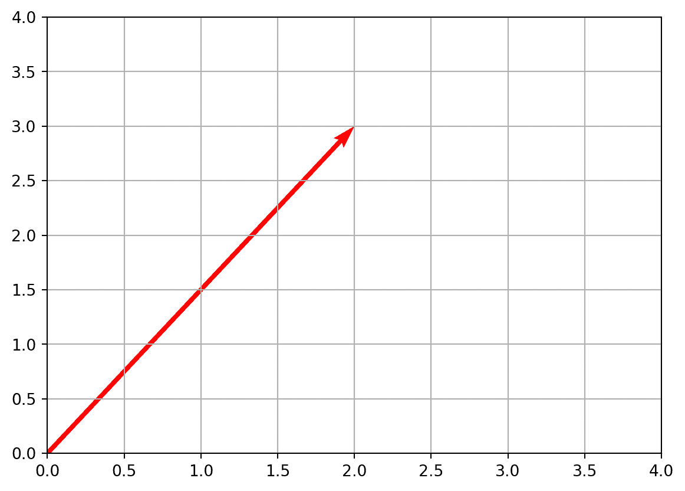*  *这会从原点 `(0,0)` 到 `(2,3)` 画出一个箭头。***  ***#### 尝试一下

1.  将向量 `v` 更改为 `[4, 1]`。现在箭头指向哪里？

1.  尝试制作一个包含 4 个数字的 3D 向量，例如 `[1, 2, 3, 4]`。会发生什么？

1.  将 `np.array([2,3])` 替换为 `np.array([0,0])`。箭头看起来像什么？****  ***### 2. 向量表示法、分量和箭头

在这个实验中，我们将练习以不同的方式读取、编写和可视化向量。一开始，向量可能看起来很简单——只是一个数字列表——但我们如何 *书写* 它以及我们如何 *解释* 它真的很重要。这正是符号和分量发挥作用的地方。

一个向量有：

+   一个符号（我们可能称之为 `v`、`w`，甚至在几何中称之为 `→AB`）。

+   分量（单个数字，如 `[2, 3]` 中的 `2` 和 `3`）。

+   一个箭头图（一种将向量视为有向线段的方法）。

让我们用 Python 看看这三个操作。

#### 设置您的实验室

```py
import numpy as np
import matplotlib.pyplot as plt
```

*#### 逐步代码讲解

1.  在 Python 中编写向量

```py
# Two-dimensional vector
v = np.array([2, 3])

# Three-dimensional vector
w = np.array([1, -1, 4])

print("v =", v)
print("w =", w)
```

*```py
v = [2 3]
w = [ 1 -1  4]
```*  *在这里 `v` 的分量是 `(2, 3)`，而 `w` 的分量是 `(1, -1, 4)`。

1.  访问分量 向量中的每个数字都是一个 *分量*。我们可以使用索引来挑选它们。

```py
print("First component of v:", v[0])
print("Second component of v:", v[1])
```

*```py
First component of v: 2
Second component of v: 3
```*  *注意：在 Python 中，索引从 `0` 开始，所以 `v[0]` 是 *第一个* 分量。

1.  在 2D 中，将向量视为箭头很容易，从原点 `(0,0)` 到其终点 `(x,y)`。

```py
plt.quiver(0, 0, v[0], v[1], angles='xy', scale_units='xy', scale=1, color='r')
plt.xlim(-1, 4)
plt.ylim(-2, 4)
plt.axhline(0, color='black', linewidth=0.5)
plt.axvline(0, color='black', linewidth=0.5)
plt.grid()
plt.show()
```

*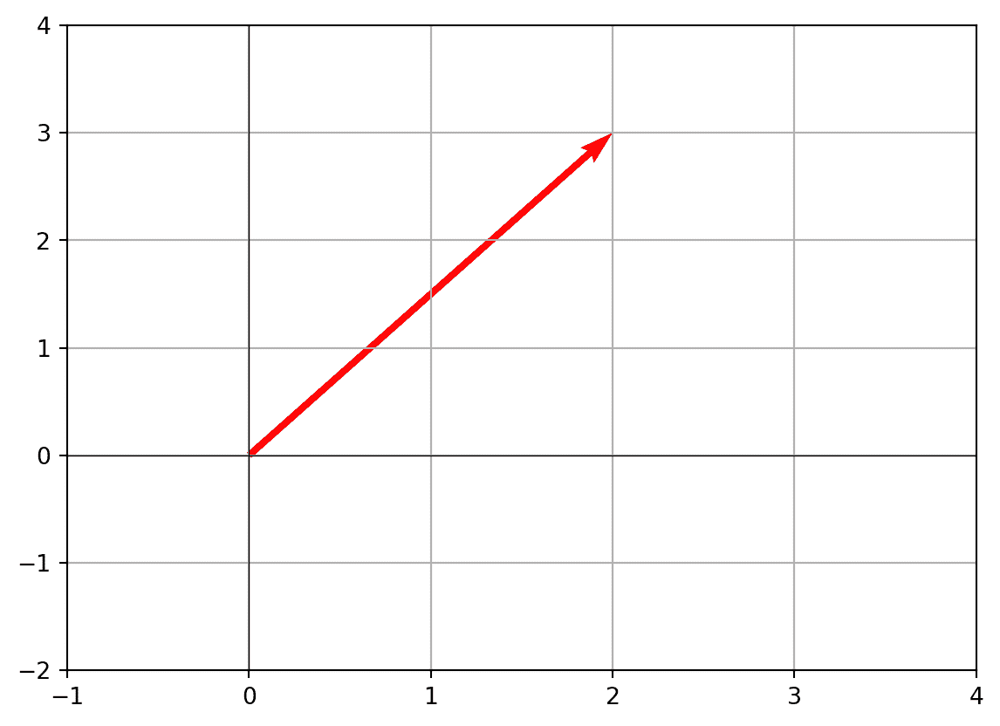*  *这显示了向量 v 作为一个从 `(0,0)` 到 `(2,3)` 的红色箭头。

1.  绘制多个向量 我们可以同时绘制几个箭头来比较它们。

```py
u = np.array([3, 1])
z = np.array([-1, 2])

# Draw v, u, z in different colors
plt.quiver(0, 0, v[0], v[1], angles='xy', scale_units='xy', scale=1, color='r', label='v')
plt.quiver(0, 0, u[0], u[1], angles='xy', scale_units='xy', scale=1, color='b', label='u')
plt.quiver(0, 0, z[0], z[1], angles='xy', scale_units='xy', scale=1, color='g', label='z')

plt.xlim(-2, 4)
plt.ylim(-2, 4)
plt.axhline(0, color='black', linewidth=0.5)
plt.axvline(0, color='black', linewidth=0.5)
plt.grid()
plt.show()
```

*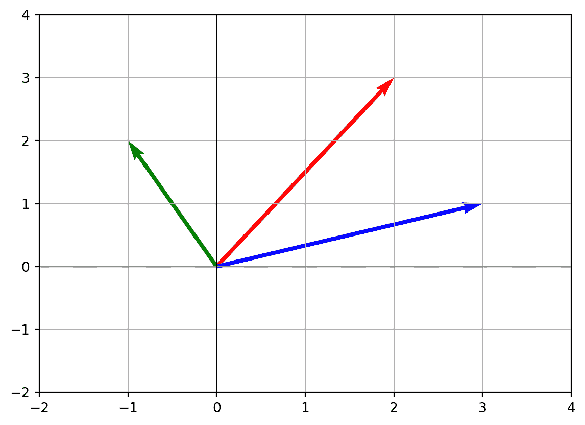*  *现在你会看到三个箭头，它们从同一点开始，每个箭头指向不同的方向。****  ***#### 尝试一下

1.  将 `v` 更改为 `[5, 0]`。现在箭头看起来像什么？

1.  尝试一个向量如 `[0, -3]`。它与哪个轴对齐？

1.  创建一个新的向量 `q = np.array([2, 0, 0])`。如果你尝试用 `plt.quiver` 在 2D 中绘制它会发生什么？****  ***### 3. 向量加法和标量乘法

在这个实验室中，我们将探索你可以对向量执行的两个最基本操作：将它们相加并将它们乘以一个数（标量）。这些操作是线性代数中其他所有内容的基础，从几何学到机器学习。理解它们如何在代码中和视觉上工作，对于建立直觉至关重要。

#### 设置您的实验室

```py
import numpy as np
import matplotlib.pyplot as plt
```

*#### 逐步代码讲解

1.  向量加法 当你加两个向量时，你只需逐个相加它们的分量。

```py
v = np.array([2, 3])
u = np.array([1, -1])

sum_vector = v + u
print("v + u =", sum_vector)
```

*```py
v + u = [3 2]
```*  *这里，`(2,3) + (1,-1) = (3,2)`。

1.  可视化向量加法（尾对尾方法）从图形上看，向量加法意味着将一个向量的尾端放在另一个向量的起点。结果向量从第一个向量的起点延伸到第二个向量的终点。

```py
plt.quiver(0, 0, v[0], v[1], angles='xy', scale_units='xy', scale=1, color='r', label='v')
plt.quiver(v[0], v[1], u[0], u[1], angles='xy', scale_units='xy', scale=1, color='b', label='u placed at end of v')
plt.quiver(0, 0, sum_vector[0], sum_vector[1], angles='xy', scale_units='xy', scale=1, color='g', label='v + u')

plt.xlim(-1, 5)
plt.ylim(-2, 5)
plt.axhline(0, color='black', linewidth=0.5)
plt.axvline(0, color='black', linewidth=0.5)
plt.grid()
plt.show()
```

*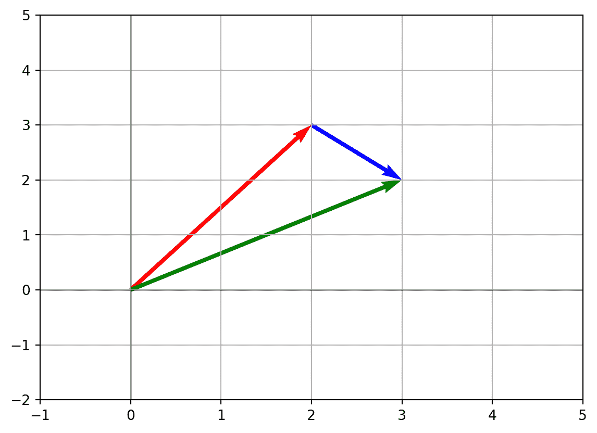*  *绿色箭头是 `v` 和 `u` 相加的结果。

1.  标量乘法 将一个向量乘以一个标量会拉伸或缩小它。如果标量是负数，向量会翻转方向。

```py
c = 2
scaled_v = c * v
print("2 * v =", scaled_v)

d = -1
scaled_v_neg = d * v
print("-1 * v =", scaled_v_neg)
```

*```py
2 * v = [4 6]
-1 * v = [-2 -3]
```*  *所以 `2 * (2,3) = (4,6)` 和 `-1 * (2,3) = (-2,-3)`。

1.  可视化标量乘法

```py
plt.quiver(0, 0, v[0], v[1], angles='xy', scale_units='xy', scale=1, color='r', label='v')
plt.quiver(0, 0, scaled_v[0], scaled_v[1], angles='xy', scale_units='xy', scale=1, color='b', label='2 * v')
plt.quiver(0, 0, scaled_v_neg[0], scaled_v_neg[1], angles='xy', scale_units='xy', scale=1, color='g', label='-1 * v')

plt.xlim(-5, 5)
plt.ylim(-5, 7)
plt.axhline(0, color='black', linewidth=0.5)
plt.axvline(0, color='black', linewidth=0.5)
plt.grid()
plt.show()
```

*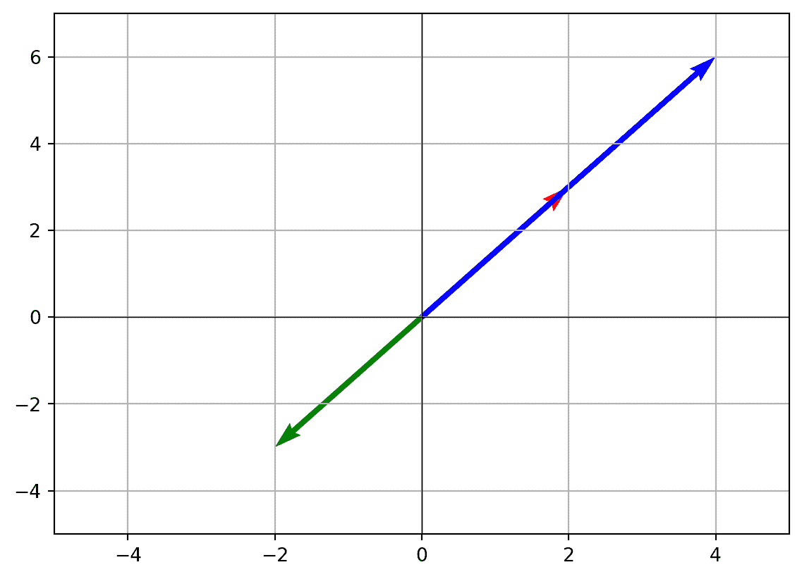*  *这里，蓝色箭头是红色箭头的两倍长，而绿色箭头指向相反的方向。

1.  结合两种操作 我们可以缩放向量然后相加。这被称为线性组合（它是下一节的基础）。

```py
combo = 3*v + (-2)*u
print("3*v - 2*u =", combo)
```

*```py
3*v - 2*u = [ 4 11]
```*****  ***#### 尝试自己操作

1.  将 `c = 2` 替换为 `c = 0.5`。向量会发生什么变化？

1.  尝试添加三个向量：`v + u + np.array([-1,2])`。在打印之前你能预测结果吗？

1.  使用箭头可视化 `3*v + 2*u`。它与 `v + u` 有何不同？****  ***### 4. 线性组合和范围

现在我们知道了如何添加向量和缩放它们，我们可以结合这两个动作来创建线性组合。线性组合只是一个配方：将向量乘以标量，然后将它们相加。从这样的配方中可以得到的所有可能结果的集合称为范围。

这个想法很强大，因为范围告诉我们我们可以使用给定的向量达到哪些方向和空间区域。

#### 设置您的实验室

```py
import numpy as np
import matplotlib.pyplot as plt
```

*#### 逐步代码讲解

1.  Python 中的线性组合

```py
v = np.array([2, 1])
u = np.array([1, 3])

combo1 = 2*v + 3*u
combo2 = -1*v + 4*u

print("2*v + 3*u =", combo1)
print("-v + 4*u =", combo2)
```

*```py
2*v + 3*u = [ 7 11]
-v + 4*u = [ 2 11]
```*  *这里，我们使用了标量乘法和加法来乘法和加法向量。每个结果都是一个新向量。

1.  可视化线性组合 让我们绘制 `v`、`u` 和它们的组合。

```py
plt.quiver(0, 0, v[0], v[1], angles='xy', scale_units='xy', scale=1, color='r', label='v')
plt.quiver(0, 0, u[0], u[1], angles='xy', scale_units='xy', scale=1, color='b', label='u')
plt.quiver(0, 0, combo1[0], combo1[1], angles='xy', scale_units='xy', scale=1, color='g', label='2v + 3u')
plt.quiver(0, 0, combo2[0], combo2[1], angles='xy', scale_units='xy', scale=1, color='m', label='-v + 4u')

plt.xlim(-5, 10)
plt.ylim(-5, 10)
plt.axhline(0, color='black', linewidth=0.5)
plt.axvline(0, color='black', linewidth=0.5)
plt.grid()
plt.show()
```

*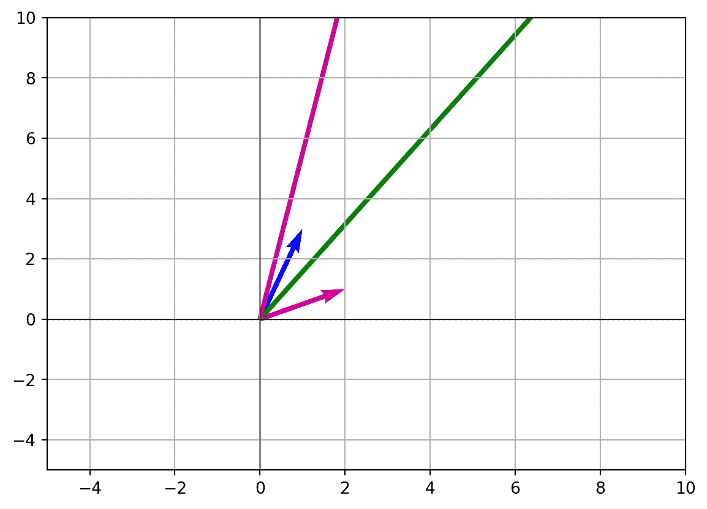*  *这显示了如何通过缩放和添加原始箭头来生成新的箭头。

1.  探索范围 两个 2D 向量的范围是：

+   一条线（如果它是另一条线的倍数）。

+   整个 2D 平面（如果它们是独立的）。

```py
# Generate many combinations
coeffs = range(-5, 6)
points = []
for a in coeffs:
 for b in coeffs:
 point = a*v + b*u
 points.append(point)

points = np.array(points)

plt.scatter(points[:,0], points[:,1], s=10, color='gray')
plt.quiver(0, 0, v[0], v[1], angles='xy', scale_units='xy', scale=1, color='r')
plt.quiver(0, 0, u[0], u[1], angles='xy', scale_units='xy', scale=1, color='b')

plt.xlim(-10, 10)
plt.ylim(-10, 10)
plt.axhline(0, color='black', linewidth=0.5)
plt.axvline(0, color='black', linewidth=0.5)
plt.grid()
plt.show()
```

*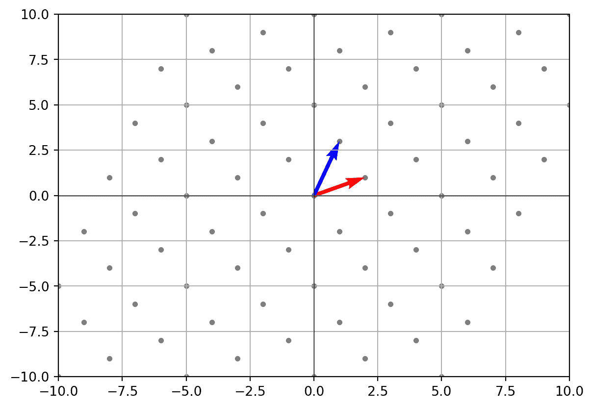*  *灰色点显示了使用 `v` 和 `u` 的组合所能达到的所有点。

1.  特殊情况：相关向量

```py
w = np.array([4, 2])  # notice w = 2*v
coeffs = range(-5, 6)
points = []
for a in coeffs:
 for b in coeffs:
 points.append(a*v + b*w)

points = np.array(points)

plt.scatter(points[:,0], points[:,1], s=10, color='gray')
plt.quiver(0, 0, v[0], v[1], angles='xy', scale_units='xy', scale=1, color='r')
plt.quiver(0, 0, w[0], w[1], angles='xy', scale_units='xy', scale=1, color='b')

plt.xlim(-10, 10)
plt.ylim(-10, 10)
plt.axhline(0, color='black', linewidth=0.5)
plt.axvline(0, color='black', linewidth=0.5)
plt.grid()
plt.show()
```

*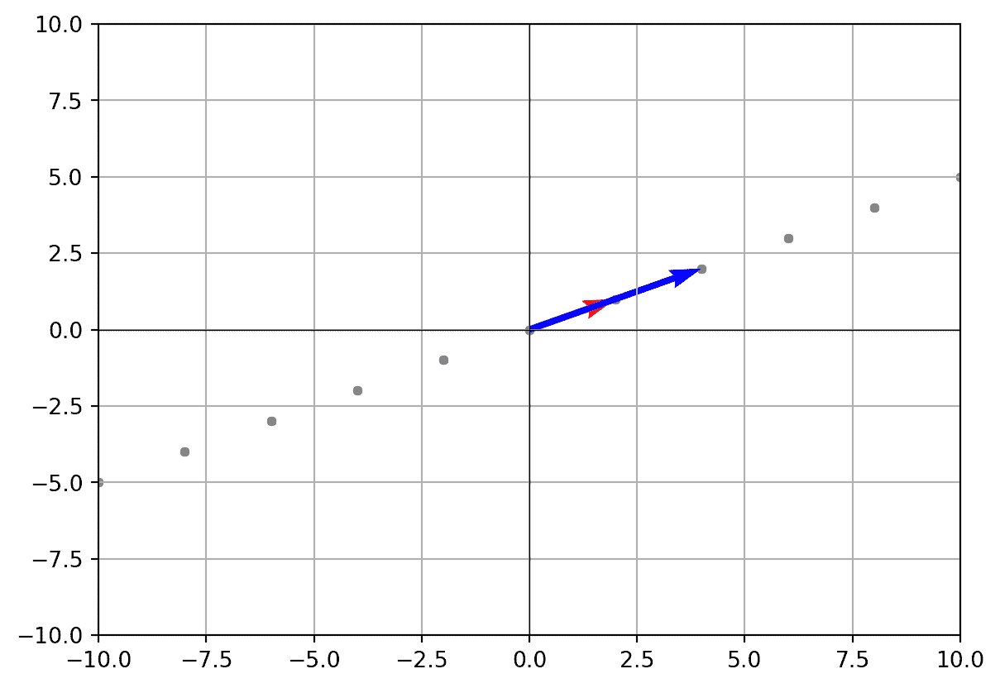*  *在这里，由于`w`只是`v`的缩放副本，所以范围缩小成了一条线。****  ***#### 尝试自己操作

1.  将`u = [1,3]`替换为`u = [-1,2]`。范围看起来像什么？

1.  尝试在二维空间中用三个向量（例如，`v, u, w`）。你是否得到了整个平面？

1.  在三维空间中实验向量。使用`np.array([x,y,z])`并检查不同的向量是否跨越一个平面或整个空间。****  ***### 5. 长度（范数）和距离

在这个实验中，我们将测量向量的大小（其长度，也称为其范数）以及两个向量之间的距离。这些想法将代数与几何联系起来：当我们计算范数时，我们是在测量箭头的大小；当我们计算距离时，我们是在测量空间中两点之间的间隔。

#### 设置你的实验环境

```py
import numpy as np
import matplotlib.pyplot as plt
```

*#### 逐步代码讲解

1.  二维空间中的向量长度（范数）向量的长度是通过勾股定理计算的。对于一个向量`(x, y)`，其长度是`sqrt(x² + y²)`。

```py
v = np.array([3, 4])
length = np.linalg.norm(v)
print("Length of v =", length)
```

*```py
Length of v = 5.0
```*  *这打印出`5.0`，因为`(3,4)`与边长为 3 和 4 的直角三角形形成，且`sqrt(3²+4²)=5`。

1.  手动计算与 NumPy

```py
manual_length = (v[0]**2 + v[1]**2)**0.5
print("Manual length =", manual_length)
print("NumPy length =", np.linalg.norm(v))
```

*```py
Manual length = 5.0
NumPy length = 5.0
```*  *两者给出相同的结果。

1.  可视化向量长度

```py
plt.quiver(0, 0, v[0], v[1], angles='xy', scale_units='xy', scale=1, color='r')
plt.xlim(0, 5)
plt.ylim(0, 5)
plt.axhline(0, color='black', linewidth=0.5)
plt.axvline(0, color='black', linewidth=0.5)
plt.text(v[0]/2, v[1]/2, f"Length={length}", fontsize=10, color='blue')
plt.grid()
plt.show()
```

*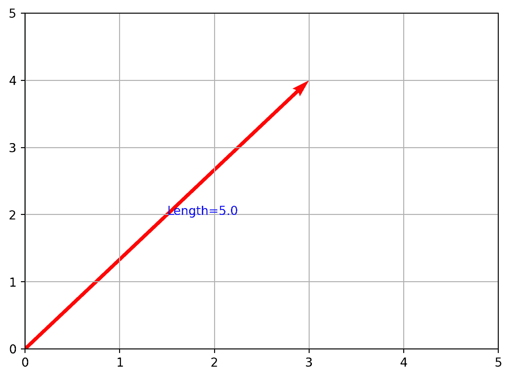*  *你会看到带有长度标签的箭头`(3,4)`。

1.  两个向量之间的距离 `v` 和另一个向量 `u` 之间的距离是它们差值的长度：`‖v - u‖`。

```py
u = np.array([0, 0])   # the origin
dist = np.linalg.norm(v - u)
print("Distance between v and u =", dist)
```

*```py
Distance between v and u = 5.0
```*  *由于`u`是原点，这仅仅是`v`的长度。

1.  一个更有趣的距离

```py
u = np.array([1, 1])
dist = np.linalg.norm(v - u)
print("Distance between v and u =", dist)
```

*```py
Distance between v and u = 3.605551275463989
```*  *这测量了`(3,4)`与`(1,1)`的距离。

1.  可视化点之间的距离

```py
plt.scatter([v[0], u[0]], [v[1], u[1]], color=['red','blue'])
plt.plot([v[0], u[0]], [v[1], u[1]], 'k--')
plt.text(v[0], v[1], 'v', fontsize=12, color='red')
plt.text(u[0], u[1], 'u', fontsize=12, color='blue')
plt.grid()
plt.show()
```

*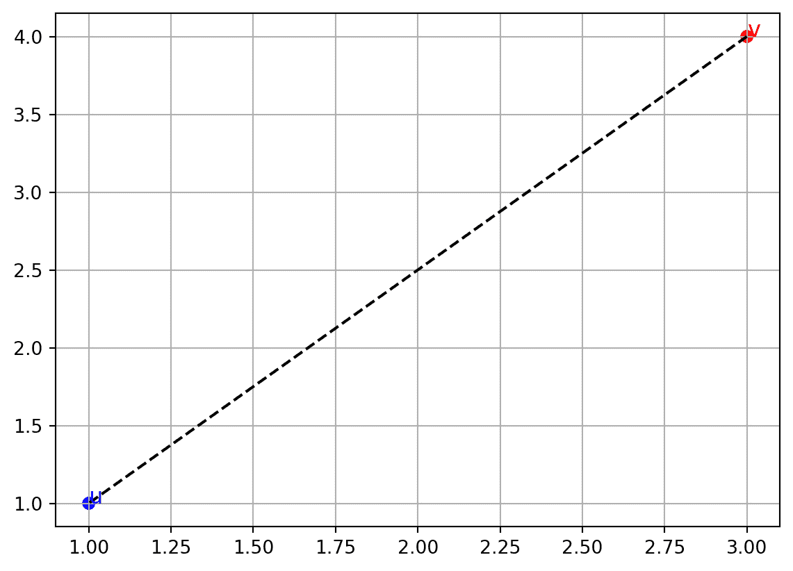*  *虚线显示了两个点之间的距离。

1.  高维向量 范数和距离在任何维度上都是相同的：

```py
a = np.array([1,2,3])
b = np.array([4,0,8])
print("‖a‖ =", np.linalg.norm(a))
print("‖b‖ =", np.linalg.norm(b))
print("Distance between a and b =", np.linalg.norm(a-b))
```

*```py
‖a‖ = 3.7416573867739413
‖b‖ = 8.94427190999916
Distance between a and b = 6.164414002968976
```*  *尽管我们难以在纸上绘制三维图形，但公式仍然适用。*******  ***#### 尝试自己操作

1.  计算数组`np.array([5,12])`的长度。你期待什么？

1.  找到`(2,3)`和`(7,7)`之间的距离。你能手动绘制并检查吗？

1.  在三维空间中，尝试向量`(1,1,1)`和`(2,2,2)`。为什么距离正好是`sqrt(3)`？****  ***### 6. 点积

点积是线性代数中最重要的运算之一。它接受两个向量并给出一个单一的数字。这个数字结合了向量的长度以及它们指向相同方向的程度。在这个实验中，我们将以几种不同的方式计算点积，了解它们与几何的关系，并可视化其含义。

#### 设置你的实验环境

```py
import numpy as np
import matplotlib.pyplot as plt
```

*#### 逐步代码讲解

1.  代数定义 两个向量的点积是它们各分量乘积的和：

```py
v = np.array([2, 3])
u = np.array([4, -1])

dot_manual = v[0]*u[0] + v[1]*u[1]
dot_numpy = np.dot(v, u)

print("Manual dot product:", dot_manual)
print("NumPy dot product:", dot_numpy)
```

*```py
Manual dot product: 5
NumPy dot product: 5
```*  *在这里，`(2*4) + (3*-1) = 8 - 3 = 5`。

1.  几何定义 点积也等于向量的长度乘以它们之间角度的余弦值：

$$ v \cdot u = \|v\| \|u\| \cos \theta $$

我们可以计算角度：

```py
norm_v = np.linalg.norm(v)
norm_u = np.linalg.norm(u)

cos_theta = np.dot(v, u) / (norm_v * norm_u)
theta = np.arccos(cos_theta)

print("cos(theta) =", cos_theta)
print("theta (in radians) =", theta)
print("theta (in degrees) =", np.degrees(theta))
```

*```py
cos(theta) = 0.33633639699815626
theta (in radians) = 1.2277723863741932
theta (in degrees) = 70.3461759419467
```*  *这给出了`v`和`u`之间的角度。

1.  可视化点积 让我们画出这两个向量：

```py
plt.quiver(0,0,v[0],v[1],angles='xy',scale_units='xy',scale=1,color='r',label='v')
plt.quiver(0,0,u[0],u[1],angles='xy',scale_units='xy',scale=1,color='b',label='u')
plt.xlim(-1,5)
plt.ylim(-2,4)
plt.axhline(0,color='black',linewidth=0.5)
plt.axvline(0,color='black',linewidth=0.5)
plt.grid()
plt.show()
```

*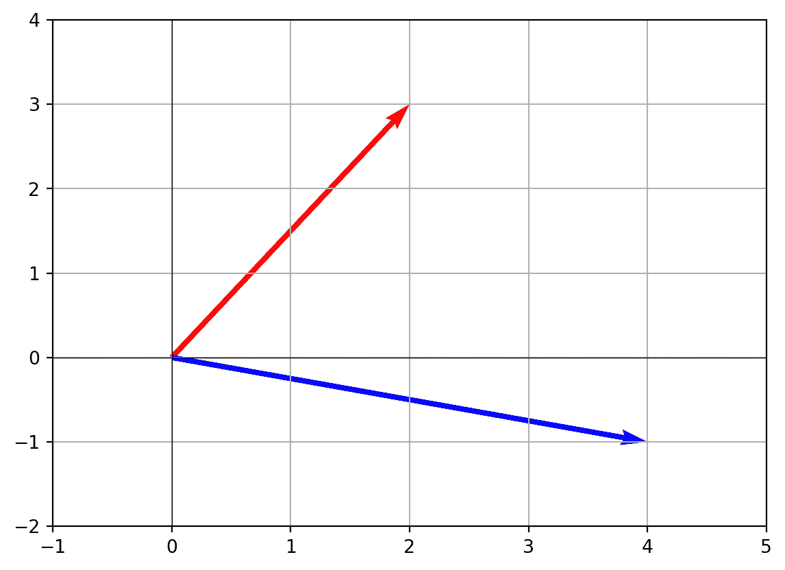*  *点积为正时角度小于 90°，为负时角度大于 90°，垂直时为零。

1.  投影和点积 点积使我们能够计算一个向量在另一个向量方向上的分量。

```py
proj_length = np.dot(v, u) / np.linalg.norm(u)
print("Projection length of v onto u:", proj_length)
```

*```py
Projection length of v onto u: 1.212678125181665
```*  *这是向量 `v` 在 `u` 上的影子长度。

1.  特殊情况

+   如果向量指向同一方向，点积较大且为正。

+   如果向量垂直，点积为零。

+   如果向量指向相反方向，点积为负。

```py
a = np.array([1,0])
b = np.array([0,1])
c = np.array([-1,0])

print("a · b =", np.dot(a,b))   # perpendicular
print("a · a =", np.dot(a,a))   # length squared
print("a · c =", np.dot(a,c))   # opposite
```

*```py
a · b = 0
a · a = 1
a · c = -1
```*****  ***#### 尝试自己操作

1.  计算 `(3,4)` 与 `(4,3)` 的点积。结果是否大于或小于它们长度的乘积？

1.  尝试 `(1,2,3) · (4,5,6)`。在三维空间中几何意义是否仍然有效？

1.  创建两个垂直向量（例如 `(2,0)` 和 `(0,5)`）。验证点积为零。****  ***### 7. 向量与余弦之间的角度

在这个实验中，我们将通过计算角度来深入了解向量与几何之间的联系。角度告诉我们两个向量“指向同一方向”的程度。代数与几何之间的桥梁是余弦公式，它直接来自点积。

#### 设置您的实验环境

```py
import numpy as np
import matplotlib.pyplot as plt
```

*#### 逐步代码讲解

1.  角度的公式 两个向量 $v$ 和 $u$ 之间的角度 $\theta$ 由以下公式给出：

$$ \cos \theta = \frac{v \cdot u}{\|v\| \, \|u\|} $$

这意味着：

+   如果 $\cos \theta = 1$，向量指向完全相同的方向。

+   如果 $\cos \theta = 0$，它们是垂直的。

+   如果 $\cos \theta = -1$，它们指向相反方向。

1.  在 Python 中计算角度

```py
v = np.array([2, 3])
u = np.array([3, -1])

dot = np.dot(v, u)
norm_v = np.linalg.norm(v)
norm_u = np.linalg.norm(u)

cos_theta = dot / (norm_v * norm_u)
theta = np.arccos(cos_theta)

print("cos(theta) =", cos_theta)
print("theta in radians =", theta)
print("theta in degrees =", np.degrees(theta))
```

*```py
cos(theta) = 0.2631174057921088
theta in radians = 1.3045442776439713
theta in degrees = 74.74488129694222
```*  *这给出了余弦值和实际角度。

1.  可视化向量

```py
plt.quiver(0,0,v[0],v[1],angles='xy',scale_units='xy',scale=1,color='r',label='v')
plt.quiver(0,0,u[0],u[1],angles='xy',scale_units='xy',scale=1,color='b',label='u')

plt.xlim(-1,4)
plt.ylim(-2,4)
plt.axhline(0,color='black',linewidth=0.5)
plt.axvline(0,color='black',linewidth=0.5)
plt.grid()
plt.show()
```

*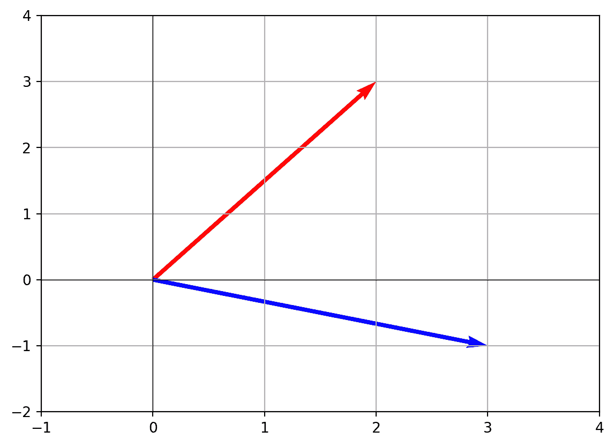*  *你可以看到 `v` 和 `u` 之间的角度是红箭头和蓝箭头之间的间隙。

1.  检查特殊情况

```py
a = np.array([1,0])
b = np.array([0,1])
c = np.array([-1,0])

print("Angle between a and b =", np.degrees(np.arccos(np.dot(a,b)/(np.linalg.norm(a)*np.linalg.norm(b)))))
print("Angle between a and c =", np.degrees(np.arccos(np.dot(a,c)/(np.linalg.norm(a)*np.linalg.norm(c)))))
```

*```py
Angle between a and b = 90.0
Angle between a and c = 180.0
```*  **   `(1,0)` 和 `(0,1)` 之间的角度是 90°。

+   `(1,0)` 和 `(-1,0)` 之间的角度是 180°。

1.  使用余弦作为相似度度量 在数据科学和机器学习中，人们通常使用余弦相似度而不是原始角度。它只是余弦值本身：

```py
cosine_similarity = np.dot(v,u)/(np.linalg.norm(v)*np.linalg.norm(u))
print("Cosine similarity =", cosine_similarity)
```

*```py
Cosine similarity = 0.2631174057921088
```*  *接近 `1` 的值表示向量对齐，接近 `0` 的值表示无关，接近 `-1` 的值表示相反。****  ***#### 尝试自己操作

1.  使用 `np.random.randn(3)` 创建两个随机向量并计算它们之间的角度。

1.  验证交换向量是否给出相同的角（对称性）。

1.  找到两个余弦相似度为 `0` 的向量。你能在二维空间中找到一个例子吗？****  ***### 8. 投影和分解

在这个实验中，我们将学习如何将一个向量分解成两部分：一部分沿着另一个向量，另一部分是垂直的。这个过程称为投影和分解。投影让我们测量“向量在给定方向上的分量”，分解则为我们提供了将向量分解成有用分量的一种方法。

#### 设置实验环境

```py
import numpy as np
import matplotlib.pyplot as plt
```

*#### 逐步代码解析

1.  投影公式 向量 $v$ 投影到向量 $u$ 的公式是：

$$ \text{proj}_u(v) = \frac{v \cdot u}{u \cdot u} \, u $$

这给出了 $v$ 指向 $u$ 方向的分量。

1.  在 Python 中计算投影

```py
v = np.array([3, 2])
u = np.array([2, 0])

proj_u_v = (np.dot(v, u) / np.dot(u, u)) * u
print("Projection of v onto u:", proj_u_v)
```

*```py
Projection of v onto u: [3\. 0.]
```*  *在这里，$v = (3,2)$ 和 $u = (2,0)$。`v` 投影到 `u` 上是一个指向 x 轴的向量。

1.  将其分解为平行和垂直部分

我们可以写成：

$$ v = \text{proj}_u(v) + (v - \text{proj}_u(v)) $$

第一部分与 `u` 平行，第二部分是垂直的。

```py
perp = v - proj_u_v
print("Parallel part:", proj_u_v)
print("Perpendicular part:", perp)
```

*```py
Parallel part: [3\. 0.]
Perpendicular part: [0\. 2.]
```*  *4.  可视化投影和分解

```py
plt.quiver(0, 0, v[0], v[1], angles='xy', scale_units='xy', scale=1, color='r', label='v')
plt.quiver(0, 0, u[0], u[1], angles='xy', scale_units='xy', scale=1, color='b', label='u')
plt.quiver(0, 0, proj_u_v[0], proj_u_v[1], angles='xy', scale_units='xy', scale=1, color='g', label='proj_u(v)')
plt.quiver(proj_u_v[0], proj_u_v[1], perp[0], perp[1], angles='xy', scale_units='xy', scale=1, color='m', label='perpendicular')

plt.xlim(-1, 5)
plt.ylim(-1, 4)
plt.axhline(0, color='black', linewidth=0.5)
plt.axvline(0, color='black', linewidth=0.5)
plt.grid()
plt.show()
```

*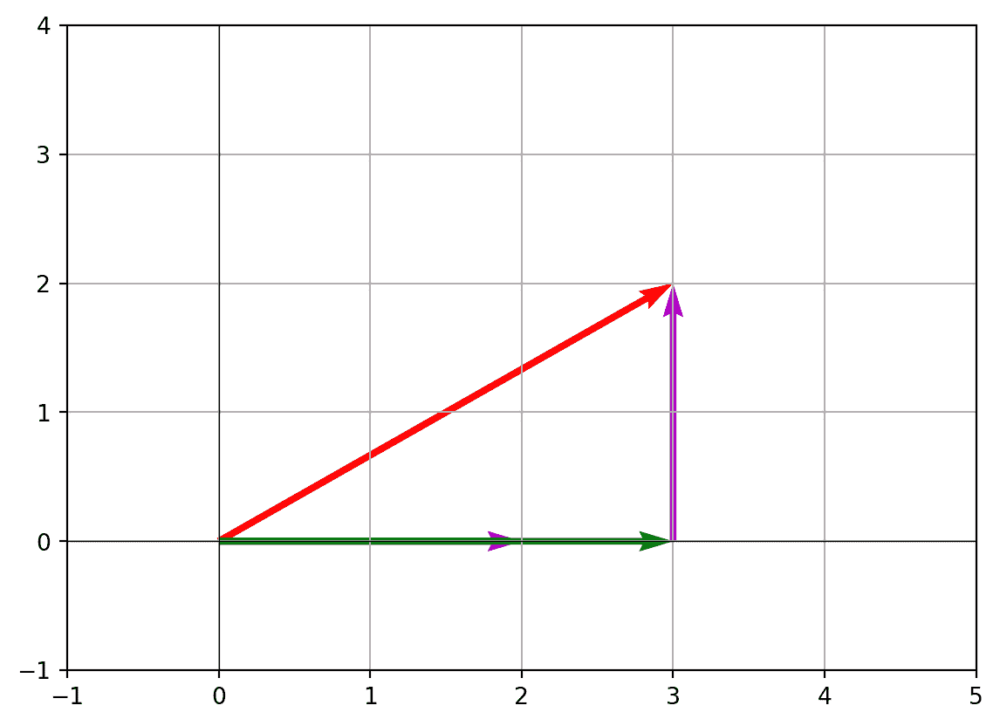*  *您将看到 `v`（红色），`u`（蓝色），投影（绿色），以及垂直余量（洋红色）。

1.  高维度的投影

这个公式在任意维度都适用：

```py
a = np.array([1,2,3])
b = np.array([0,1,0])

proj = (np.dot(a,b)/np.dot(b,b)) * b
perp = a - proj

print("Projection of a onto b:", proj)
print("Perpendicular component:", perp)
```

*```py
Projection of a onto b: [0\. 2\. 0.]
Perpendicular component: [1\. 0\. 3.]
```*  *即使在 3D 或更高维度，投影也是关于“沿着”和“穿过”的分割。****  ***#### 尝试自己操作

1.  尝试将 `(2,3)` 投影到 `(0,5)` 上。它落在哪里？

1.  以 `(4,2,6)` 这样的 3D 向量为例，将其投影到 `(1,0,0)` 上。这会得到什么？

1.  将基向量 `u` 改为与轴不对齐的某个值，例如 `(1,1)`。投影是否仍然有效？****  ***### 9. 柯西-施瓦茨不等式和三角不等式

本实验介绍了线性代数中的两个基本不等式。它们一开始可能看起来很抽象，但它们为向量提供了始终成立的保证。我们将通过 Python 中的小例子来探索它们，看看为什么它们很重要。

#### 设置实验环境

```py
import numpy as np
```

*#### 逐步代码解析

1.  柯西-施瓦茨不等式

不等式表明：

$$ |v \cdot u| \leq \|v\| \, \|u\| $$

这意味着点积永远不会“大于”向量长度的乘积。只有当两个向量指向完全相同（或相反）的方向时，等式才会成立。

```py
v = np.array([3, 4])
u = np.array([1, 2])

lhs = abs(np.dot(v, u))
rhs = np.linalg.norm(v) * np.linalg.norm(u)

print("Left-hand side (|v·u|):", lhs)
print("Right-hand side (‖v‖‖u‖):", rhs)
print("Inequality holds?", lhs <= rhs)
```

*```py
Left-hand side (|v·u|): 11
Right-hand side (‖v‖‖u‖): 11.180339887498949
Inequality holds? True
```*  *2.  使用不同向量测试柯西-施瓦茨不等式

```py
pairs = [
 (np.array([1,0]), np.array([0,1])),  # perpendicular
 (np.array([2,3]), np.array([4,6])),  # multiples
 (np.array([-1,2]), np.array([3,-6])) # opposite multiples
]

for v,u in pairs:
 lhs = abs(np.dot(v, u))
 rhs = np.linalg.norm(v) * np.linalg.norm(u)
 print(f"v={v}, u={u} -> |v·u|={lhs}, ‖v‖‖u‖={rhs}, holds={lhs<=rhs}")
```

*```py
v=[1 0], u=[0 1] -> |v·u|=0, ‖v‖‖u‖=1.0, holds=True
v=[2 3], u=[4 6] -> |v·u|=26, ‖v‖‖u‖=25.999999999999996, holds=False
v=[-1  2], u=[ 3 -6] -> |v·u|=15, ‖v‖‖u‖=15.000000000000002, holds=True
```*  **   垂直向量给出 `|v·u| = 0`，远小于范数的乘积。

+   倍数给出等式（`lhs = rhs`）。

1.  三角不等式

三角不等式表明：

$$ \|v + u\| \leq \|v\| + \|u\| $$

几何上，三角形的任一边长永远不会超过其他两边之和。

```py
v = np.array([3, 4])
u = np.array([1, 2])

lhs = np.linalg.norm(v + u)
rhs = np.linalg.norm(v) + np.linalg.norm(u)

print("‖v+u‖ =", lhs)
print("‖v‖ + ‖u‖ =", rhs)
print("Inequality holds?", lhs <= rhs)
```

*```py
‖v+u‖ = 7.211102550927978
‖v‖ + ‖u‖ = 7.23606797749979
Inequality holds? True
```*  *4.  用三角形进行可视化演示

```py
import matplotlib.pyplot as plt

origin = np.array([0,0])
points = np.array([origin, v, v+u, origin])

plt.plot(points[:,0], points[:,1], 'ro-')  # triangle outline
plt.text(v[0], v[1], 'v')
plt.text(v[0]+u[0], v[1]+u[1], 'v+u')
plt.text(u[0], u[1], 'u')

plt.grid()
plt.axhline(0,color='black',linewidth=0.5)
plt.axvline(0,color='black',linewidth=0.5)
plt.axis('equal')
plt.show()
```

*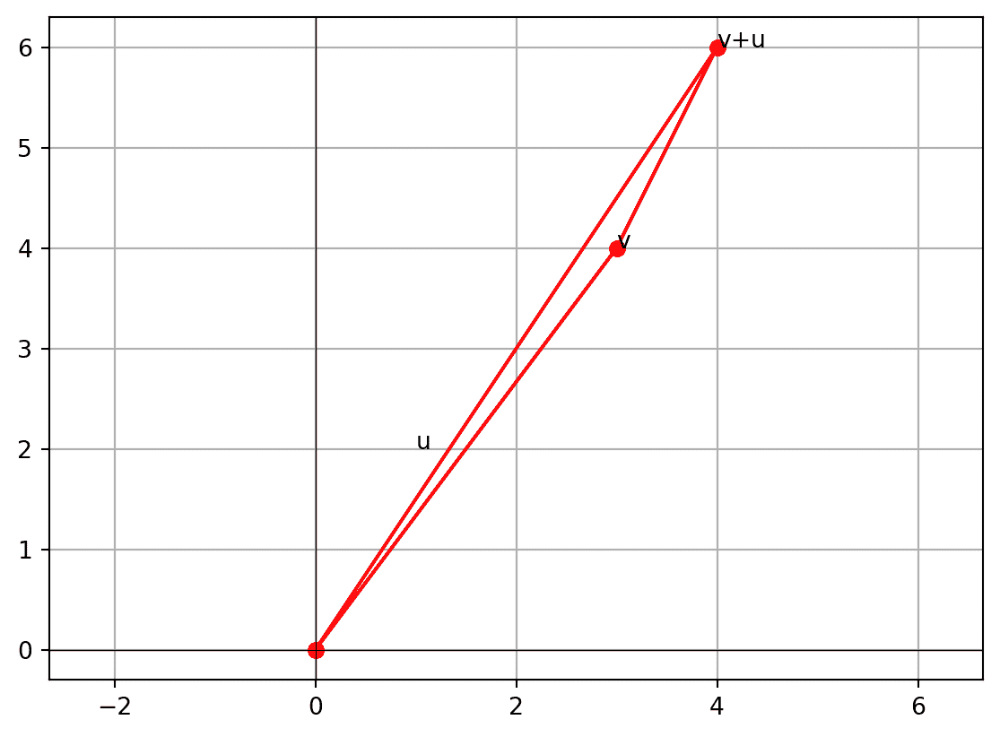*  *这个三角形显示了为什么这个不等式被称为“三角”不等式。

1.  使用随机向量测试三角不等式

```py
for _ in range(5):
 v = np.random.randn(2)
 u = np.random.randn(2)
 lhs = np.linalg.norm(v+u)
 rhs = np.linalg.norm(v) + np.linalg.norm(u)
 print(f"‖v+u‖={lhs:.3f}, ‖v‖+‖u‖={rhs:.3f}, holds={lhs <= rhs}")
```

*```py
‖v+u‖=0.778, ‖v‖+‖u‖=2.112, holds=True
‖v+u‖=1.040, ‖v‖+‖u‖=2.621, holds=True
‖v+u‖=1.632, ‖v‖+‖u‖=2.482, holds=True
‖v+u‖=1.493, ‖v‖+‖u‖=2.250, holds=True
‖v+u‖=2.653, ‖v‖+‖u‖=2.692, holds=True
```*  *无论尝试什么向量，不等式总是成立的。*****  ***#### 总结

+   柯西-施瓦茨不等式：点积始终被向量长度的乘积所界定。

+   三角不等式：三角形的任一边长不能超过其他两边之和。

+   这些不等式构成了几何、分析和线性代数中许多证明的骨架。****  ***### 10. ℝ²/ℝ³ 中的正交归一集合

在这个实验中，我们将探索正交归一集合——一组既是正交（垂直）又是归一化（长度 = 1）的向量。这些集合是向量空间中“最理想”的基。在 2D 和 3D 中，它们对应于我们已知的坐标轴，但我们可以构建和测试新的。

#### 设置您的实验室

```py
import numpy as np
import matplotlib.pyplot as plt
```

*#### 逐步代码讲解

1.  正交向量 如果两个向量的点积为零，则这两个向量是正交的。

```py
x_axis = np.array([1, 0])
y_axis = np.array([0, 1])

print("x_axis · y_axis =", np.dot(x_axis, y_axis))  # should be 0
```

*```py
x_axis · y_axis = 0
```*  *因此，标准轴是正交的。

1.  归一化向量 归一化意味着将向量除以其长度，使其范数等于 1。

```py
v = np.array([3, 4])
v_normalized = v / np.linalg.norm(v)

print("Original v:", v)
print("Normalized v:", v_normalized)
print("Length of normalized v:", np.linalg.norm(v_normalized))
```

*```py
Original v: [3 4]
Normalized v: [0.6 0.8]
Length of normalized v: 1.0
```*  *现在 `v_normalized` 指向与 `v` 相同的方向，但长度为 1。

1.  在 2D 中构建正交归一集合

```py
u1 = np.array([1, 0])
u2 = np.array([0, 1])

print("u1 length:", np.linalg.norm(u1))
print("u2 length:", np.linalg.norm(u2))
print("u1 · u2 =", np.dot(u1,u2))
```

*```py
u1 length: 1.0
u2 length: 1.0
u1 · u2 = 0
```*  *它们都有长度 1，并且它们的点积为 0。这使得 `{u1, u2}` 在 2D 中成为一个正交归一集合。

1.  可视化 2D 正交归一向量

```py
plt.quiver(0,0,u1[0],u1[1],angles='xy',scale_units='xy',scale=1,color='r')
plt.quiver(0,0,u2[0],u2[1],angles='xy',scale_units='xy',scale=1,color='b')

plt.xlim(-1.5,1.5)
plt.ylim(-1.5,1.5)
plt.axhline(0,color='black',linewidth=0.5)
plt.axvline(0,color='black',linewidth=0.5)
plt.grid()
plt.show()
```

*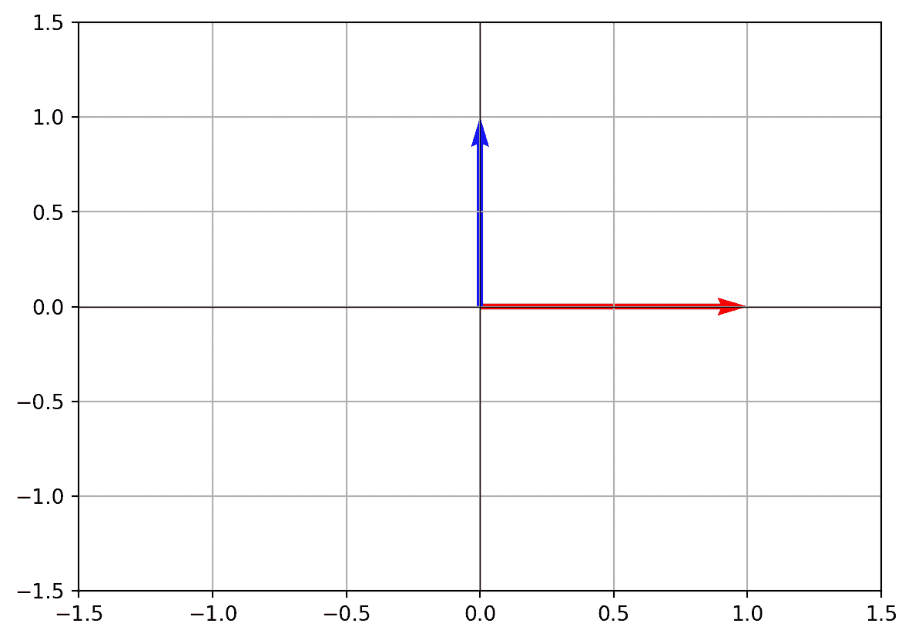*  *您将看到右边的红色和蓝色箭头相互垂直，每个箭头的长度都是 1。

1.  3D 中的正交归一集合 在 3D 中，标准基向量是：

```py
i = np.array([1,0,0])
j = np.array([0,1,0])
k = np.array([0,0,1])

print("‖i‖ =", np.linalg.norm(i))
print("‖j‖ =", np.linalg.norm(j))
print("‖k‖ =", np.linalg.norm(k))
print("i·j =", np.dot(i,j))
print("j·k =", np.dot(j,k))
print("i·k =", np.dot(i,k))
```

*```py
‖i‖ = 1.0
‖j‖ = 1.0
‖k‖ = 1.0
i·j = 0
j·k = 0
i·k = 0
```*  *长度都是 1，点积为 0。所以 `{i, j, k}` 是 ℝ³ 中的一个正交归一集合。

1.  测试一个集合是否是正交归一 我们可以编写一个辅助函数：

```py
def is_orthonormal(vectors):
 for i in range(len(vectors)):
 for j in range(len(vectors)):
 dot = np.dot(vectors[i], vectors[j])
 if i == j:
 if not np.isclose(dot, 1): return False
 else:
 if not np.isclose(dot, 0): return False
 return True

print(is_orthonormal([i, j, k]))  # True
```

*```py
True
```*  *7.  构建一个新的正交归一对 并非所有的正交归一集合都看起来像坐标轴。

```py
u1 = np.array([1,1]) / np.sqrt(2)
u2 = np.array([-1,1]) / np.sqrt(2)

print("u1·u2 =", np.dot(u1,u2))
print("‖u1‖ =", np.linalg.norm(u1))
print("‖u2‖ =", np.linalg.norm(u2))
```

*```py
u1·u2 = 0.0
‖u1‖ = 0.9999999999999999
‖u2‖ = 0.9999999999999999
```*  *这给出了 2D 中的一个旋转正交基。*******  ***#### 尝试自己操作

1.  将 `(2,2,1)` 归一化以使其成为一个单位向量。

1.  测试集合 `{[1,0,0], [0,2,0], [0,0,3]}` 是否是正交归一的。

1.  在 2D 中构建两个不垂直的向量。将它们归一化并检查点积是否仍然为零。*******************************  ***## 第二章 矩阵和基本运算

### 11. 矩阵作为表和作为机器

矩阵一开始可能感觉神秘，但有两种简单的方法可以思考它们：

1.  作为数字表——只是一个可以存储和操作的网格。

1.  作为机器——接受一个向量并输出一个新向量的东西。

在这个实验中，我们将探索两种观点并了解它们是如何相互关联的。

#### 设置您的实验室

```py
import numpy as np
```

*#### 逐步代码讲解

1.  矩阵作为数字表

```py
A = np.array([
 [1, 2, 3],
 [4, 5, 6]
])

print("Matrix A:\n", A)
print("Shape of A:", A.shape)
```

*```py
Matrix A:
 [[1 2 3]
 [4 5 6]]
Shape of A: (2, 3)
```*  *在这里，`A` 是一个 2×3 矩阵（2 行，3 列）。

+   行 = 水平切片 → `[1,2,3]` 和 `[4,5,6]`

+   列 = 垂直切片 → `[1,4]`, `[2,5]`, `[3,6]`

1.  访问行和列

```py
first_row = A[0]        # row 0
second_column = A[:,1]  # column 1

print("First row:", first_row)
print("Second column:", second_column)
```

*```py
First row: [1 2 3]
Second column: [2 5]
```*  *行也是整个向量，列也是如此。

1.  矩阵作为机器

矩阵可以对向量“作用”。如果 `x = [x1, x2, x3]`，则 `A·x` 通过取 `A` 的列的线性组合来计算。

```py
x = np.array([1, 0, -1])  # a 3D vector
result = A.dot(x)

print("A·x =", result)
```

*```py
A·x = [-2 -2]
```*  *解释：将 `A` 乘以 `x` = 将 `A` 的列与 `x` 的权重组合。

$$ A \cdot x = 1 \cdot \text{(列 1)} + 0 \cdot \text{(列 2)} + (-1) \cdot \text{(列 3)} $$

1.  验证列组合视图

```py
col1 = A[:,0]
col2 = A[:,1]
col3 = A[:,2]

manual = 1*col1 + 0*col2 + (-1)*col3
print("Manual combination:", manual)
print("A·x result:", result)
```

*```py
Manual combination: [-2 -2]
A·x result: [-2 -2]
```*  *它们完全匹配。这表明“机器”解释只是列组合的快捷方式。

1.  几何直觉（2D 示例）

```py
B = np.array([
 [2, 0],
 [0, 1]
])

v = np.array([1,2])
print("B·v =", B.dot(v))
```

*```py
B·v = [2 2]
```*  *在这里，`B` 将 x 方向缩放 2 倍，而 y 方向保持不变。因此 `(1,2)` 变为 `(2,2)`。*****  ***#### 尝试自己操作

1.  使用 `np.eye(3)` 创建一个 3×3 的单位矩阵，并将其与不同的向量相乘。会发生什么？

1.  构建一个矩阵 `[[0,-1],[1,0]]`。尝试将其与 `(1,0)` 和 `(0,1)` 相乘。这是哪种变换？

1.  创建你自己的 2×2 矩阵，该矩阵将向量沿 x 轴翻转。在 `(1,2)` 和 `(−3,4)` 上测试它。

#### 总结

+   矩阵既是数字的网格，也是一个转换向量的机器。

+   矩阵-向量乘法等同于结合具有给定权重的列。

+   将矩阵视为机器有助于建立对旋转、缩放和其他变换的直觉。****  ***### 12. 矩阵形状、索引和块视图

矩阵有多种形状，学会阅读它们的结构是至关重要的。形状告诉我们矩阵有多少行和列。索引使我们能够获取特定的条目、行或列。块视图允许我们放大子矩阵，这对于理论和计算都非常有用。

#### 设置你的实验室

```py
import numpy as np
```

*#### 逐步代码解析

1.  矩阵形状

矩阵的形状是 `(行, 列)`。

```py
A = np.array([
 [1, 2, 3],
 [4, 5, 6],
 [7, 8, 9]
])

print("Matrix A:\n", A)
print("Shape of A:", A.shape)
```

*```py
Matrix A:
 [[1 2 3]
 [4 5 6]
 [7 8 9]]
Shape of A: (3, 3)
```*  *在这里，`A` 是一个 3×3 矩阵。

1.  元素索引

在 NumPy 中，行和列是从 0 开始计数的。第一个条目是 `A[0,0]`。

```py
print("A[0,0] =", A[0,0])  # top-left element
print("A[1,2] =", A[1,2])  # second row, third column
```

*```py
A[0,0] = 1
A[1,2] = 6
```*  *3.  提取行和列

```py
row1 = A[0]       # first row
col2 = A[:,1]     # second column

print("First row:", row1)
print("Second column:", col2)
```

*```py
First row: [1 2 3]
Second column: [2 5 8]
```*  *注意：`A[i]` 返回一行，`A[:,j]` 返回一列。

1.  切割子矩阵（块视图）

你可以通过切片多行和多列来形成一个较小的矩阵。

```py
block = A[0:2, 1:3]  # rows 0–1, columns 1–2
print("Block submatrix:\n", block)
```

*```py
Block submatrix:
 [[2 3]
 [5 6]]
```*  *此块是：

$$ \begin{bmatrix} 2 & 3 \\ 5 & 6 \end{bmatrix} $$

1.  修改矩阵的部分

```py
A[0,0] = 99
print("Modified A:\n", A)

A[1,:] = [10, 11, 12]   # replace row 1
print("After replacing row 1:\n", A)
```

*```py
Modified A:
 [[99  2  3]
 [ 4  5  6]
 [ 7  8  9]]
After replacing row 1:
 [[99  2  3]
 [10 11 12]
 [ 7  8  9]]
```*  *6.  非方阵

并非所有矩阵都是方阵。形状也可以是矩形的。

```py
B = np.array([
 [1, 2],
 [3, 4],
 [5, 6]
])

print("Matrix B:\n", B)
print("Shape of B:", B.shape)
```

*```py
Matrix B:
 [[1 2]
 [3 4]
 [5 6]]
Shape of B: (3, 2)
```*  *在这里，`B` 是 3×2（3 行，2 列）。

1.  块分解想法

我们可以将大型矩阵视为由较小的块组成。这在线性代数证明和算法中很常见。

```py
C = np.array([
 [1,2,3,4],
 [5,6,7,8],
 [9,10,11,12],
 [13,14,15,16]
])

top_left = C[0:2, 0:2]
bottom_right = C[2:4, 2:4]

print("Top-left block:\n", top_left)
print("Bottom-right block:\n", bottom_right)
```

*```py
Top-left block:
 [[1 2]
 [5 6]]
Bottom-right block:
 [[11 12]
 [15 16]]
```*  *这是块矩阵记法的开始。******  ***#### 尝试自己操作

1.  使用 `np.arange(1,21).reshape(4,5)` 创建一个 4×5 的矩阵，其值为 1–20。找出它的形状。

1.  提取中间行和最后一列。

1.  将其切成四个 2×2 块。你能以不同的顺序重新组装它们吗？****  ***### 13. 矩阵加法和标量乘法

现在我们已经了解了矩阵形状和索引，让我们练习两个最简单但最重要的操作：矩阵相加和用数字（标量）缩放。这些操作扩展了我们已经知道的向量的规则。

#### 设置你的实验室

```py
import numpy as np
```

*#### 逐步代码解析

1.  两个矩阵相加 你可以相加两个矩阵（仅当它们具有相同的形状时）。加法是逐条进行的。

```py
A = np.array([
 [1, 2],
 [3, 4]
])

B = np.array([
 [5, 6],
 [7, 8]
])

C = A + B
print("A + B =\n", C)
```

*```py
A + B =
 [[ 6  8]
 [10 12]]
```*  *`C` 中的每个元素都是 `A` 和 `B` 中对应元素的和。

1.  标量乘法 将矩阵乘以一个标量会将每个元素乘以那个数。

```py
k = 3
D = k * A
print("3 * A =\n", D)
```

*```py
3 * A =
 [[ 3  6]
 [ 9 12]]
```*  *在这里，`A` 的每个元素都乘以了 3。

1.  组合两种操作 我们可以混合加法和缩放，就像向量一样。

```py
combo = 2*A - B
print("2A - B =\n", combo)
```

*```py
2A - B =
 [[-3 -2]
 [-1  0]]
```*  *这会创建新的矩阵，作为其他矩阵的线性组合。

1.  零矩阵 所有零的矩阵在加法中就像“没有发生任何事情”。

```py
zero = np.zeros((2,2))
print("Zero matrix:\n", zero)
print("A + Zero =\n", A + zero)
```

*```py
Zero matrix:
 [[0\. 0.]
 [0\. 0.]]
A + Zero =
 [[1\. 2.]
 [3\. 4.]]
```*  *5.  形状不匹配（什么失败）如果形状不匹配，NumPy 会抛出一个错误。

```py
X = np.array([
 [1,2,3],
 [4,5,6]
])

try:
 print(A + X)
except ValueError as e:
 print("Error:", e)
```

*```py
Error: operands could not be broadcast together with shapes (2,2) (2,3) 
```*  *这显示了形状一致性为什么很重要。*****  ***#### 尝试自己操作

1.  使用 `np.random.randint(0,10,(3,3))` 创建两个随机的 3×3 矩阵并将它们相加。

1.  将一个 4×4 矩阵乘以 `-1`。它的元素会发生什么变化？

1.  使用上面的矩阵计算 `3A + 2B`。与手动执行每个步骤进行比较。****  ***### 14. 矩阵-向量积（列的线性组合）

这个实验介绍了矩阵-向量积，这是线性代数中最重要的操作之一。矩阵乘以一个向量不仅仅是计算数字 - 它通过以加权方式组合矩阵的列来产生一个新的向量。

#### 设置你的实验室

```py
import numpy as np
```

*#### 逐步代码分析

1.  一个简单的矩阵和向量

```py
A = np.array([
 [1, 2],
 [3, 4],
 [5, 6]
])  # 3×2 matrix

x = np.array([2, -1])  # 2D vector
```

*在这里，`A` 有 2 列，所以我们可以将它乘以一个 2D 向量 `x`。

1.  NumPy 中的矩阵-向量乘法

```py
y = A.dot(x)
print("A·x =", y)
```

*```py
A·x = [0 2 4]
```*  *结果：一个 3D 向量。

1.  将结果解释为线性组合

矩阵 `A` 有两列：

```py
col1 = A[:,0]   # first column
col2 = A[:,1]   # second column

manual = 2*col1 + (-1)*col2
print("Manual linear combination:", manual)
```

*```py
Manual linear combination: [0 2 4]
```*  *这与 `A·x` 相匹配。用文字来说：*将每一列乘以 `x` 对应的项，然后将它们加起来*。

1.  另一个例子（几何）

```py
B = np.array([
 [2, 0],
 [0, 1]
])  # stretches x-axis by 2

v = np.array([1, 3])
print("B·v =", B.dot(v))
```

*```py
B·v = [2 3]
```*  *在这里，`(1,3)` 变成了 `(2,3)`。x 分量加倍，而 y 保持不变。

1.  矩阵作用的可视化

```py
import matplotlib.pyplot as plt

# draw original vector
plt.quiver(0,0,v[0],v[1],angles='xy',scale_units='xy',scale=1,color='r',label='v')

# draw transformed vector
v_transformed = B.dot(v)
plt.quiver(0,0,v_transformed[0],v_transformed[1],angles='xy',scale_units='xy',scale=1,color='b',label='B·v')

plt.xlim(-1,4)
plt.ylim(-1,4)
plt.axhline(0,color='black',linewidth=0.5)
plt.axvline(0,color='black',linewidth=0.5)
plt.grid()
plt.show()
```

*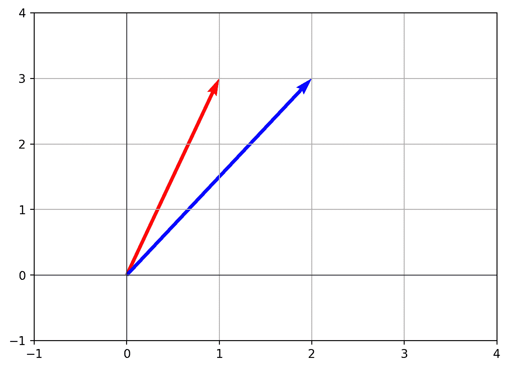*  *红色箭头 = 原始向量，蓝色箭头 = 变换后的向量*****  ***#### 尝试自己操作

1.  乘法

    $$ A = \begin{bmatrix}1 & 0 \\ 0 & 1 \\ -1 & 2\end{bmatrix},\; x = [3,1] $$

    结果是什么？

1.  将 `B` 替换为 `[[0,-1],[1,0]]`。将其乘以 `(1,0)` 和 `(0,1)`。这代表什么几何变换？

1.  对于一个 4×4 的单位矩阵 (`np.eye(4)`)，尝试将其乘以任何 4D 向量。你观察到什么？****  ***### 15. 矩阵-矩阵积（线性步骤的组合）

矩阵-矩阵乘法是我们如何将两个线性变换组合成一个。我们不是应用一个变换，然后应用另一个，而是将它们的矩阵相乘，得到一个一次完成两者的单个矩阵。

#### 设置你的实验室

```py
import numpy as np
```

*#### 逐步代码分析

1.  NumPy 中的矩阵-矩阵乘法

```py
A = np.array([
 [1, 2],
 [3, 4]
])  # 2×2

B = np.array([
 [2, 0],
 [1, 2]
])  # 2×2

C = A.dot(B)   # or A @ B
print("A·B =\n", C)
```

*```py
A·B =
 [[ 4  4]
 [10  8]]
```*  *结果 `C` 是另一个 2×2 矩阵。

1.  手动计算

`C` 的每个元素都是 A 的一个行与 B 的一个列的点积：

```py
c11 = A[0,:].dot(B[:,0])
c12 = A[0,:].dot(B[:,1])
c21 = A[1,:].dot(B[:,0])
c22 = A[1,:].dot(B[:,1])

print("Manual C =\n", np.array([[c11,c12],[c21,c22]]))
```

*```py
Manual C =
 [[ 4  4]
 [10  8]]
```*  *这应该匹配 `A·B`。

1.  几何解释

让我们看看两个变换是如何组合的。

+   矩阵 `B` 将 x 缩放 2 倍，将 y 拉伸 2 倍。

+   矩阵 `A` 应用另一个线性变换。

一起，`C = A·B` 在一步中完成这两者。

```py
v = np.array([1,1])

print("First apply B:", B.dot(v))
print("Then apply A:", A.dot(B.dot(v)))
print("Directly with C:", C.dot(v))
```

*```py
First apply B: [2 3]
Then apply A: [ 8 18]
Directly with C: [ 8 18]
```*  *结果是相同的：先应用 `B` 再应用 `A` 等价于先应用 `C`。

1.  非方阵

矩阵乘法也适用于矩形矩阵，只要内部维度匹配。

```py
M = np.array([
 [1, 0, 2],
 [0, 1, 3]
])  # 2×3

N = np.array([
 [1, 2],
 [0, 1],
 [4, 0]
])  # 3×2

P = M.dot(N)  # result is 2×2
print("M·N =\n", P)
```

*```py
M·N =
 [[ 9  2]
 [12  1]]
```*  *形状规则：`(2×3)·(3×2) = (2×2)`。

1.  结合性（但不是交换性）

矩阵乘法是结合的：`(A·B)·C = A·(B·C)`。但它不是交换的：在一般情况下，`A·B ≠ B·A`。

```py
A = np.array([[1,2],[3,4]])
B = np.array([[0,1],[1,0]])

print("A·B =\n", A.dot(B))
print("B·A =\n", B.dot(A))
```

*```py
A·B =
 [[2 1]
 [4 3]]
B·A =
 [[3 4]
 [1 2]]
```*  *这两个结果不同。*****  ***#### 尝试自己操作

1.  乘法

    $$ A = \begin{bmatrix}1 & 0 \\ 0 & 1\end{bmatrix},\; B = \begin{bmatrix}0 & -1 \\ 1 & 0\end{bmatrix} $$

    `A·B` 代表什么变换？

1.  创建一个 3×2 的随机矩阵和一个 2×4 的矩阵。将它们相乘。结果是什么形状？

1.  使用 Python 验证 `(A·B)·C = A·(B·C)` 对于一些 3×3 的随机矩阵。****  ***### 16. 单位矩阵、逆矩阵和转置

在这个实验室中，我们将遇到三种特殊的矩阵操作和对象：单位矩阵、逆矩阵和转置。这些是矩阵代数的构建块，每个都有简单的含义但具有深远的重要性。

#### 设置您的实验室

```py
import numpy as np
```

*#### 逐步代码讲解

1.  单位矩阵 单位矩阵就像矩阵中的数字 `1`：乘以它不会改变任何东西。

```py
I = np.eye(3)  # 3×3 identity matrix
print("Identity matrix:\n", I)

A = np.array([
 [2, 1, 0],
 [0, 1, 3],
 [4, 0, 1]
])

print("A·I =\n", A.dot(I))
print("I·A =\n", I.dot(A))
```

*```py
Identity matrix:
 [[1\. 0\. 0.]
 [0\. 1\. 0.]
 [0\. 0\. 1.]]
A·I =
 [[2\. 1\. 0.]
 [0\. 1\. 3.]
 [4\. 0\. 1.]]
I·A =
 [[2\. 1\. 0.]
 [0\. 1\. 3.]
 [4\. 0\. 1.]]
```*  *两者都等于 `A`。

1.  转置 转置翻转行和列。

```py
B = np.array([
 [1, 2, 3],
 [4, 5, 6]
])

print("B:\n", B)
print("B.T:\n", B.T)
```

*```py
B:
 [[1 2 3]
 [4 5 6]]
B.T:
 [[1 4]
 [2 5]
 [3 6]]
```*  **   原始：2×3

+   转置：3×2

几何上，转置在以行/列形式查看向量时交换轴。

1.  逆矩阵就像除以一个数：乘以矩阵的逆矩阵给出单位矩阵。

```py
C = np.array([
 [2, 1],
 [5, 3]
])

C_inv = np.linalg.inv(C)
print("Inverse of C:\n", C_inv)

print("C·C_inv =\n", C.dot(C_inv))
print("C_inv·C =\n", C_inv.dot(C))
```

*```py
Inverse of C:
 [[ 3\. -1.]
 [-5\.  2.]]
C·C_inv =
 [[ 1.00000000e+00  2.22044605e-16]
 [-8.88178420e-16  1.00000000e+00]]
C_inv·C =
 [[1.00000000e+00 3.33066907e-16]
 [0.00000000e+00 1.00000000e+00]]
```*  *两个乘积都是（近似地）单位矩阵。

1.  没有逆的矩阵 并非每个矩阵都是可逆的。如果一个矩阵是奇异的（行列式 = 0），它没有逆。

```py
D = np.array([
 [1, 2],
 [2, 4]
])

try:
 np.linalg.inv(D)
except np.linalg.LinAlgError as e:
 print("Error:", e)
```

*```py
Error: Singular matrix
```*  *在这里，第二行是第一行的倍数，所以 `D` 不能求逆。

1.  转置和逆矩阵一起 对于可逆矩阵，

$$ (A^T)^{-1} = (A^{-1})^T $$

我们可以通过数值来检查这一点：

```py
A = np.array([
 [1, 2],
 [3, 5]
])

lhs = np.linalg.inv(A.T)
rhs = np.linalg.inv(A).T

print("Do they match?", np.allclose(lhs, rhs))
```

*```py
Do they match? True
```*****  ***#### 尝试自己操作

1.  创建一个 4×4 的单位矩阵。将其乘以任何 4×1 的向量。它会改变吗？

1.  使用 `np.random.randint` 取一个随机的 2×2 矩阵。计算其逆矩阵并检查乘法是否给出单位矩阵。

1.  选择一个矩形 3×2 矩阵。当你尝试 `np.linalg.inv` 时会发生什么？为什么？

1.  对于某个矩阵 `A`，计算 `(A.T).T`。你注意到什么？****  ***### 17. 对称矩阵、对角矩阵、三角矩阵和置换矩阵

在这个实验室中，我们将遇到四种重要的特殊矩阵族。它们有使它们更容易理解、计算和使用在算法中的模式。

#### 设置您的实验室

```py
import numpy as np
```

*#### 逐步代码讲解

1.  对称矩阵 如果一个矩阵等于它的转置，则该矩阵是对称的：$A = A^T$。

```py
A = np.array([
 [2, 3, 4],
 [3, 5, 6],
 [4, 6, 8]
])

print("A:\n", A)
print("A.T:\n", A.T)
print("Is symmetric?", np.allclose(A, A.T))
```

*```py
A:
 [[2 3 4]
 [3 5 6]
 [4 6 8]]
A.T:
 [[2 3 4]
 [3 5 6]
 [4 6 8]]
Is symmetric? True
```*  *对称矩阵出现在物理学、优化和统计学中（例如，协方差矩阵）。

1.  对角矩阵 对角矩阵只在主对角线上有非零项。

```py
D = np.diag([1, 5, 9])
print("Diagonal matrix:\n", D)

x = np.array([2, 3, 4])
print("D·x =", D.dot(x))  # scales each component
```

*```py
Diagonal matrix:
 [[1 0 0]
 [0 5 0]
 [0 0 9]]
D·x = [ 2 15 36]
```*  *对角乘法只是分别缩放每个坐标。

1.  三角矩阵 上三角：对角线以下的元素都是零。下三角：对角线以上的元素都是零。

```py
U = np.array([
 [1, 2, 3],
 [0, 4, 5],
 [0, 0, 6]
])

L = np.array([
 [7, 0, 0],
 [8, 9, 0],
 [1, 2, 3]
])

print("Upper triangular U:\n", U)
print("Lower triangular L:\n", L)
```

*```py
Upper triangular U:
 [[1 2 3]
 [0 4 5]
 [0 0 6]]
Lower triangular L:
 [[7 0 0]
 [8 9 0]
 [1 2 3]]
```*  *这些在求解线性系统（例如高斯消元法）中很重要。

1.  置换矩阵 置换矩阵重新排列坐标的顺序。每一行和每一列恰好有一个 `1`，其余都是 `0`。

```py
P = np.array([
 [0, 1, 0],
 [0, 0, 1],
 [1, 0, 0]
])

print("Permutation matrix P:\n", P)

v = np.array([10, 20, 30])
print("P·v =", P.dot(v))
```

*```py
Permutation matrix P:
 [[0 1 0]
 [0 0 1]
 [1 0 0]]
P·v = [20 30 10]
```*  *在这里，`P` 将 `(10,20,30)` 循环到 `(20,30,10)`。

1.  检查属性

```py
def is_symmetric(M): return np.allclose(M, M.T)
def is_diagonal(M): return np.count_nonzero(M - np.diag(np.diag(M))) == 0
def is_upper_triangular(M): return np.allclose(M, np.triu(M))
def is_lower_triangular(M): return np.allclose(M, np.tril(M))

print("A symmetric?", is_symmetric(A))
print("D diagonal?", is_diagonal(D))
print("U upper triangular?", is_upper_triangular(U))
print("L lower triangular?", is_lower_triangular(L))
```

*```py
A symmetric? True
D diagonal? True
U upper triangular? True
L lower triangular? True
```*****  ***#### 尝试自己来做

1.  通过生成任何矩阵 `M` 并计算 `(M + M.T)/2` 来创建一个随机的对称矩阵。

1.  构建一个对角线元素为 `[2,4,6,8]` 的 4×4 对角矩阵，并将其乘以 `[1,1,1,1]`。

1.  创建一个置换矩阵，用于交换 3D 向量的第一个和最后一个分量。

1.  检查单位矩阵是否对角、对称、上三角和下三角。****  ***### 18\. 迹和基本矩阵属性

在这个实验室中，我们将介绍矩阵的迹以及一些常出现在证明、算法和应用中的快速属性。迹的计算很简单，但出人意料地强大。

#### 设置您的实验室

```py
import numpy as np
```

*#### 逐步代码讲解

1.  迹是什么？方阵的迹是其对角线元素的和：

$$ \text{tr}(A) = \sum_i A_{ii} $$

```py
A = np.array([
 [2, 1, 3],
 [0, 4, 5],
 [7, 8, 6]
])

trace_A = np.trace(A)
print("Matrix A:\n", A)
print("Trace of A =", trace_A)
```

*```py
Matrix A:
 [[2 1 3]
 [0 4 5]
 [7 8 6]]
Trace of A = 12
```*  *在这里，迹 = $2 + 4 + 6 = 12$。

1.  迹是线性的 对于矩阵 `A` 和 `B`：

$$ \text{tr}(A+B) = \text{tr}(A) + \text{tr}(B) $$

$$ \text{tr}(cA) = c \cdot \text{tr}(A) $$

```py
B = np.array([
 [1, 0, 0],
 [0, 2, 0],
 [0, 0, 3]
])

print("tr(A+B) =", np.trace(A+B))
print("tr(A) + tr(B) =", np.trace(A) + np.trace(B))

print("tr(3A) =", np.trace(3*A))
print("3 * tr(A) =", 3*np.trace(A))
```

*```py
tr(A+B) = 18
tr(A) + tr(B) = 18
tr(3A) = 36
3 * tr(A) = 36
```*  *3. 乘积的迹 一个重要性质是：

$$ \text{tr}(AB) = \text{tr}(BA) $$

```py
C = np.array([
 [0,1],
 [2,3]
])

D = np.array([
 [4,5],
 [6,7]
])

print("tr(CD) =", np.trace(C.dot(D)))
print("tr(DC) =", np.trace(D.dot(C)))
```

*```py
tr(CD) = 37
tr(DC) = 37
```*  *两者都相等，即使 `CD` 和 `DC` 是不同的矩阵。

1.  迹和特征值 迹等于矩阵的特征值之和（考虑重数）。

```py
vals, vecs = np.linalg.eig(A)
print("Eigenvalues:", vals)
print("Sum of eigenvalues =", np.sum(vals))
print("Trace =", np.trace(A))
```

*```py
Eigenvalues: [12.83286783  2.13019807 -2.9630659 ]
Sum of eigenvalues = 12.000000000000007
Trace = 12
```*  *结果应该匹配（在舍入误差范围内）。

1.  快速不变量

+   迹在转置下不变：`tr(A) = tr(A.T)`

+   迹在相似变换下不变：`tr(P^-1 A P) = tr(A)`

```py
print("tr(A) =", np.trace(A))
print("tr(A.T) =", np.trace(A.T))
```

*```py
tr(A) = 12
tr(A.T) = 12
```*****  ***#### 尝试自己来做

1.  创建一个 90° 的 2×2 旋转矩阵：

    $$ R = \begin{bmatrix}0 & -1 \\ 1 & 0\end{bmatrix} $$

    它的迹是什么？这告诉你关于其特征值什么？

1.  创建一个随机的 3×3 矩阵，并将 `tr(A)` 与特征值的和进行比较。

1.  使用矩形矩阵 `A`（例如 2×3）和 `B`（3×2）测试 `tr(AB)` 和 `tr(BA)`。它们是否仍然匹配？****  ***### 19\.仿射变换和齐次坐标

仿射变换使我们能够执行不仅仅是线性操作 - 它包括平移（移动点），这是普通矩阵单独无法处理的。为了统一旋转、缩放、反射和平移，我们使用齐次坐标。

#### 设置您的实验室

```py
import numpy as np
import matplotlib.pyplot as plt
```

*#### 逐步代码讲解

1.  线性变换与仿射变换

+   线性变换可以旋转、缩放或扭曲，但始终保持原点固定。

+   仿射变换允许平移。

例如，将每个点移动 `(2,3)` 是仿射的但不是线性的。

1.  同质坐标概念 我们向向量添加一个额外的坐标（通常为 `1`）。

+   2D 点 `(x,y)` 变为 `(x,y,1)`。

+   3D 点 `(x,y,z)` 变为 `(x,y,z,1)`。

这个技巧让我们可以用矩阵乘法表示平移。

1.  2D 平移矩阵

$$ T = \begin{bmatrix} 1 & 0 & t_x \\ 0 & 1 & t_y \\ 0 & 0 & 1 \end{bmatrix} $$

```py
T = np.array([
 [1, 0, 2],
 [0, 1, 3],
 [0, 0, 1]
])

p = np.array([1, 1, 1])  # point at (1,1)
p_translated = T.dot(p)

print("Original point:", p)
print("Translated point:", p_translated)
```

*```py
Original point: [1 1 1]
Translated point: [3 4 1]
```*  *这将 `(1,1)` 移动到 `(3,4)`。

1.  旋转和平移的组合

2D 中围绕原点旋转 90°：

```py
R = np.array([
 [0, -1, 0],
 [1,  0, 0],
 [0,  0, 1]
])

M = T.dot(R)  # rotate then translate
print("Combined transform:\n", M)

p = np.array([1, 0, 1])
print("Rotated + translated point:", M.dot(p))
```

*```py
Combined transform:
 [[ 0 -1  2]
 [ 1  0  3]
 [ 0  0  1]]
Rotated + translated point: [2 4 1]
```*  *现在我们可以一步完成旋转和平移。

1.  平移的可视化

```py
points = np.array([
 [0,0,1],
 [1,0,1],
 [1,1,1],
 [0,1,1]
])  # a unit square

transformed = points.dot(T.T)

plt.scatter(points[:,0], points[:,1], color='r', label='original')
plt.scatter(transformed[:,0], transformed[:,1], color='b', label='translated')

for i in range(len(points)):
 plt.arrow(points[i,0], points[i,1],
 transformed[i,0]-points[i,0],
 transformed[i,1]-points[i,1],
 head_width=0.05, color='gray')

plt.legend()
plt.axis('equal')
plt.grid()
plt.show()
```

*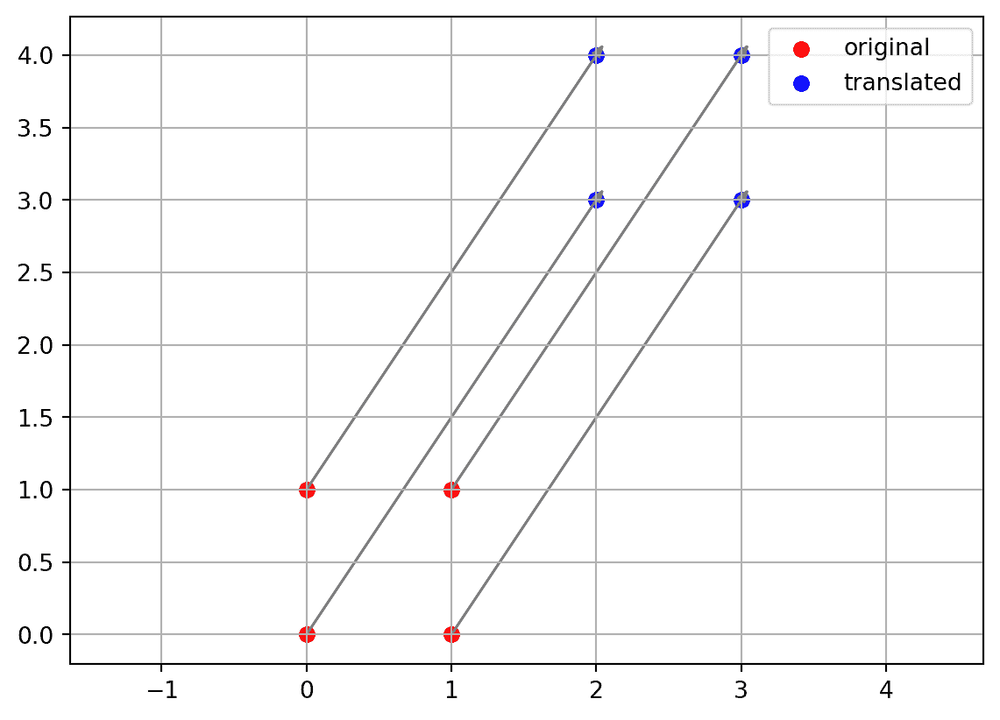*  *你会看到红色单位正方形移动到被 `(2,3)` 平移的蓝色单位正方形。

1.  扩展到 3D 在 3D 中，同质坐标使用 4×4 矩阵。平移、旋转和缩放都适合相同的框架。

```py
T3 = np.array([
 [1,0,0,5],
 [0,1,0,-2],
 [0,0,1,3],
 [0,0,0,1]
])

p3 = np.array([1,2,3,1])
print("Translated 3D point:", T3.dot(p3))
```

*```py
Translated 3D point: [6 0 6 1]
```*  *这将 `(1,2,3)` 移动到 `(6,0,6)`。****  ***#### 尝试自己操作

1.  在同质坐标中构建一个缩放矩阵，使 x 和 y 都加倍，并将其应用于 `(1,1)`。

1.  创建一个旋转 90° 并然后平移 `(−2,1)` 的 2D 变换。将其应用于 `(0,2)`。

1.  在 3D 中，将 `(0,0,0)` 平移 `(10,10,10)`。你使用了什么同质矩阵？****  ***### 20\. 使用矩阵进行计算（成本计算和简单加速）

与矩阵一起工作不仅仅是理论 - 在实践中，我们关心执行操作所需的计算量，以及如何使它们更快。这个实验介绍了基本的成本分析（计算操作）并展示了简单的 NumPy 优化。

#### 设置您的实验室

```py
import numpy as np
import time
```

*#### 逐步代码讲解

1.  计算操作（矩阵-向量乘法）

如果 `A` 是一个 $m \times n$ 矩阵，而 `x` 是一个 $n$-维向量，则计算 `A·x` 大约需要 $m \times n$ 次乘法和相同数量的加法。

```py
m, n = 3, 4
A = np.random.randint(1,10,(m,n))
x = np.random.randint(1,10,n)

print("Matrix A:\n", A)
print("Vector x:", x)
print("A·x =", A.dot(x))
```

*```py
Matrix A:
 [[6 6 6 2]
 [1 1 1 1]
 [1 8 7 4]]
Vector x: [6 5 4 5]
A·x = [100  20  94]
```*  *在这里，成本是 $3 \times 4 = 12$ 次乘法 + 12 次加法。

1.  计算操作（矩阵-矩阵乘法）

对于 $m \times n$ 乘以 $n \times p$ 的乘法，成本大约是 $m \times n \times p$。

```py
m, n, p = 3, 4, 2
A = np.random.randint(1,10,(m,n))
B = np.random.randint(1,10,(n,p))

C = A.dot(B)
print("A·B =\n", C)
```

*```py
A·B =
 [[ 59  92]
 [ 43  81]
 [ 65 102]]
```*  *在这里，成本是 $3 \times 4 \times 2 = 24$ 次乘法 + 24 次加法。

1.  使用 NumPy 进行计时（向量化与循环）

NumPy 在底层是用 C 和 Fortran 优化的。让我们比较有向量化和无向量化时的矩阵乘法。

```py
n = 50
A = np.random.randn(n,n)
B = np.random.randn(n,n)

# Vectorized
start = time.time()
C1 = A.dot(B)
end = time.time()
print("Vectorized dot:", round(end-start,3), "seconds")

# Manual loops
C2 = np.zeros((n,n))
start = time.time()
for i in range(n):
 for j in range(n):
 for k in range(n):
 C2[i,j] += A[i,k]*B[k,j]
end = time.time()
print("Triple loop:", round(end-start,3), "seconds")
```

*```py
Vectorized dot: 0.0 seconds
Triple loop: 0.026 seconds
```*  *向量化版本应该快数千倍。

1.  广播技巧

NumPy 允许我们通过在整个行或列上广播操作来避免循环。

```py
A = np.array([
 [1,2,3],
 [4,5,6]
])

# Add 10 to every entry
print("A+10 =\n", A+10)

# Multiply each row by a different scalar
scales = np.array([1,10])[:,None]
print("Row-scaled A =\n", A*scales)
```

*```py
A+10 =
 [[11 12 13]
 [14 15 16]]
Row-scaled A =
 [[ 1  2  3]
 [40 50 60]]
```*  *5.  内存和数据类型

对于大量计算，数据类型很重要。

```py
A = np.random.randn(1000,1000).astype(np.float32)  # 32-bit floats
B = np.random.randn(1000,1000).astype(np.float32)

start = time.time()
C = A.dot(B)
print("Result shape:", C.shape, "dtype:", C.dtype)
print("Time:", round(time.time()-start,3), "seconds")
```

*```py
Result shape: (1000, 1000) dtype: float32
Time: 0.002 seconds
```*  *使用 `float32` 而不是 `float64` 可以减半内存使用并加快计算速度（以牺牲一些精度为代价）。*****  ***#### 尝试自己操作

1.  计算将一个 200×500 的矩阵与一个 500×1000 的矩阵相乘的成本。需要多少次乘法？

1.  在 NumPy 中为大小 100、500、1000 的矩阵乘法计时。时间如何缩放？

1.  在 NumPy 中尝试 `float32` 与 `float64`。速度和内存如何变化？

1.  尝试广播：将矩阵的每一列乘以 `[1,2,3,...]`。

#### 要点

+   矩阵运算具有可预测的计算成本：`A·x` ~ $m \times n$，`A·B` ~ $m \times n \times p$。

+   向量化 NumPy 操作比 Python 循环快得多。

+   广播和选择合适的数据类型是每个初学者都应该学习的简单加速方法。*******************************  ***## 第三章\. 线性方程组和消元

### 21\. 从方程到矩阵（增广和编码）

线性代数通常从求解线性方程组开始。例如：

$$ \begin{cases} x + 2y = 5 \\ 3x - y = 4 \end{cases} $$

而不是玩弄符号，我们可以将整个系统编码成一个矩阵。这是让计算机高效处理成千上万方程的关键思想。

#### 设置您的实验室

```py
import numpy as np
```

*#### 逐步代码讲解

1.  编写一个方程组

我们将使用这个小例子：

$$ \begin{cases} 2x + y = 8 \\ -3x + 4y = -11 \end{cases} $$

1.  编码系数和常数

+   系数矩阵 $A$：乘以变量的数字。

+   变量向量 $x$：未知数 `[x, y]`。

+   常数向量 $b$：右侧。

```py
A = np.array([
 [2, 1],
 [-3, 4]
])

b = np.array([8, -11])

print("Coefficient matrix A:\n", A)
print("Constants vector b:", b)
```

*```py
Coefficient matrix A:
 [[ 2  1]
 [-3  4]]
Constants vector b: [  8 -11]
```*  *因此系统是 $A·x = b$。

1.  增广矩阵

我们可以将系统捆绑成一个紧凑的矩阵：

$$ [A|b] = \begin{bmatrix}2 & 1 & | & 8 \\ -3 & 4 & | & -11 \end{bmatrix} $$

```py
augmented = np.column_stack((A, b))
print("Augmented matrix:\n", augmented)
```

*```py
Augmented matrix:
 [[  2   1   8]
 [ -3   4 -11]]
```*  *这种格式对消元算法很有用。

1.  直接使用 NumPy 求解

```py
solution = np.linalg.solve(A, b)
print("Solution (x,y):", solution)
```

*```py
Solution (x,y): [3.90909091 0.18181818]
```*  *这里 NumPy 使用高效的算法求解系统。

1.  检查解

总是验证：

```py
check = A.dot(solution)
print("A·x =", check, "should equal b =", b)
```

*```py
A·x = [  8\. -11.] should equal b = [  8 -11]
```*  *6.  另一个例子（3 个变量）

$$ \begin{cases} x + y + z = 6 \\ 2x - y + z = 3 \\ - x + 2y - z = 2 \end{cases} $$

```py
A = np.array([
 [1, 1, 1],
 [2, -1, 1],
 [-1, 2, -1]
])

b = np.array([6, 3, 2])

print("Augmented matrix:\n", np.column_stack((A, b)))
print("Solution:", np.linalg.solve(A, b))
```

*```py
Augmented matrix:
 [[ 1  1  1  6]
 [ 2 -1  1  3]
 [-1  2 -1  2]]
Solution: [2.33333333 2.66666667 1\.        ]
```*****  ***#### 尝试自己动手

1.  对系统进行编码：

    $$ \begin{cases} 2x - y = 1 \\ x + 3y = 7 \end{cases} $$

    写出 `A` 和 `b`，然后求解。

1.  对于一个 3×3 的系统，尝试使用 `np.random.randint(-5,5,(3,3))` 创建一个随机的系数矩阵和一个随机的 `b`。使用 `np.linalg.solve`。

1.  稍微修改常数 `b` 并观察解如何变化。这引入了敏感度的概念。

#### 要点

+   线性方程组可以整洁地写成 $A·x = b$。

+   增广矩阵 $[A|b]$ 是设置消元的一种紧凑方式。

+   这种矩阵编码将代数问题转化为矩阵问题 - 这是线性代学的入门。****  ***### 22\. 行运算（保持解的合法移动）

在求解线性系统时，我们不想改变解，只是将系统简化成更简单的形式。这就是行运算发挥作用的地方。它们是在增广矩阵 $[A|b]$ 上可以做的“合法移动”，而不会改变解集。

#### 设置您的实验室

```py
import numpy as np
```

*#### 逐步代码讲解

1.  三种合法的行运算

1.  交换两行 $(R_i \leftrightarrow R_j)$

1.  将一行乘以一个非零标量 $(R_i \to c·R_i)$

1.  用另一行的倍数替换一行 $(R_i \to R_i + c·R_j)$

这些保留了解集。

1.  从增广矩阵开始

系统：

$$ \begin{cases} x + 2y = 5 \\ 3x + 4y = 6 \end{cases} $$

```py
A = np.array([
 [1, 2, 5],
 [3, 4, 6]
], dtype=float)

print("Initial augmented matrix:\n", A)
```

*```py
Initial augmented matrix:
 [[1\. 2\. 5.]
 [3\. 4\. 6.]]
```*  *3.  行交换

交换行 0 和行 1。

```py
A[[0,1]] = A[[1,0]]
print("After swapping rows:\n", A)
```

*```py
After swapping rows:
 [[3\. 4\. 6.]
 [1\. 2\. 5.]]
```*  *4.  将一行乘以一个标量

使行 0 的主元等于 1。

```py
A[0] = A[0] / A[0,0]
print("After scaling first row:\n", A)
```

*```py
After scaling first row:
 [[1\.         1.33333333 2\.        ]
 [1\.         2\.         5\.        ]]
```*  *5.  将另一行的倍数加到一行上

消除行 1 的第一列。

```py
A[1] = A[1] - 3*A[0]
print("After eliminating x from second row:\n", A)
```

*```py
After eliminating x from second row:
 [[ 1\.          1.33333333  2\.        ]
 [-2\.         -2\.         -1\.        ]]
```*  *现在系统更简单了：第二行只有 `y`。

1.  从新系统求解

```py
y = A[1,2] / A[1,1]
x = (A[0,2] - A[0,1]*y) / A[0,0]
print("Solution: x =", x, ", y =", y)
```

*```py
Solution: x = 1.3333333333333335 , y = 0.5
```*  *7.  使用 NumPy 步骤与求解器

```py
coeff = np.array([[1,2],[3,4]])
const = np.array([5,6])
print("np.linalg.solve result:", np.linalg.solve(coeff,const))
```

*```py
np.linalg.solve result: [-4\.   4.5]
```*  *两种方法给出相同的解。******  ***#### 尝试自己操作

1.  考虑以下系统：

    $$ \begin{cases} 2x + y = 7 \\ x - y = 1 \end{cases} $$

    写出它的增广矩阵，然后：

    +   交换行。

    +   缩放第一行。

    +   消除一个变量。

1.  创建一个随机的 3×3 系统并使用介于 -5 和 5 之间的整数。在代码中至少手动执行每种行操作之一。

1.  尝试将一行乘以 `0`。会发生什么，为什么这不被视为合法操作？

#### **总结**

+   三种合法的行操作是行交换、行缩放和行替换。

+   这些步骤在向更简单形式移动的同时保留了解集。

+   它们是高斯消元法的基础，这是解线性系统的标准算法。****  ***### 23\. 行阶梯形和简化行阶梯形（目标形状）

在解系统时，我们的目标是简化增广矩阵到一个标准形状，其中解容易阅读。这些形状被称为行阶梯形（REF）和简化行阶梯形（RREF）。

#### 设置您的实验室

```py
import numpy as np
from sympy import Matrix
```

*我们将使用 NumPy 进行基本工作，并使用 SymPy 进行精确的 RREF（因为 NumPy 内置没有它）。*  *#### 逐步代码演示

1.  行阶梯形（REF）

+   所有非零行都在任何零行之上。

+   每个主元（主元）都在上一行的主元右侧。

+   主元通常缩放到 1，但不是严格要求的。

**示例系统**：

$$ \begin{cases} x + 2y + z = 7 \\ 2x + 4y + z = 12 \\ 3x + 6y + 2z = 17 \end{cases} $$

```py
A = np.array([
 [1, 2, 1, 7],
 [2, 4, 1, 12],
 [3, 6, 2, 17]
], dtype=float)

print("Augmented matrix:\n", A)
```

*```py
Augmented matrix:
 [[ 1\.  2\.  1\.  7.]
 [ 2\.  4\.  1\. 12.]
 [ 3\.  6\.  2\. 17.]]
```*  *手动执行消元：

```py
# eliminate first column entries below pivot
A[1] = A[1] - 2*A[0]
A[2] = A[2] - 3*A[0]
print("After eliminating first column:\n", A)
```

*```py
After eliminating first column:
 [[ 1\.  2\.  1\.  7.]
 [ 0\.  0\. -1\. -2.]
 [ 0\.  0\. -1\. -4.]]
```*  *现在主元沿着矩阵对角线移动 - 这是行阶梯形。

1.  简化行阶梯形（RREF）在 RREF 中，我们更进一步：

+   每个主元都等于 1。

+   每个主元是其列中唯一的非零值。

而不是手动编码，我们将让 SymPy 来处理：

```py
M = Matrix([
 [1, 2, 1, 7],
 [2, 4, 1, 12],
 [3, 6, 2, 17]
])

M_rref = M.rref()
print("RREF form:\n", M_rref[0])
```

*```py
RREF form:
 Matrix([[1, 2, 0, 0], [0, 0, 1, 0], [0, 0, 0, 1]])
```*  *SymPy 显示了最终的规范形式。

1.  从 RREF 读取解

如果 RREF 看起来像：

$$ \begin{bmatrix} 1 & 0 & a & b \\ 0 & 1 & c & d \\ 0 & 0 & 0 & 0 \end{bmatrix} $$

这意味着：

+   前两个变量是主元（主元）。

+   第三个变量是自由的。

+   解可以用自由变量来表示。

1.  一个带有自由变量的快速示例

系统：

$$ x + y + z = 3 \\ 2x + y - z = 0 $$

```py
M2 = Matrix([
 [1,1,1,3],
 [2,1,-1,0]
])

M2_rref = M2.rref()
print("RREF form:\n", M2_rref[0])
```

*```py
RREF form:
 Matrix([[1, 0, -2, -3], [0, 1, 3, 6]])
```*  *在这里，某一列将没有主元 → 该变量是自由的。****  ***#### 尝试自己操作

1.  考虑以下系统：

    $$ 2x + 3y = 6, \quad 4x + 6y = 12 $$

    写出增广矩阵并计算其 RREF。它告诉你关于解的什么信息？

1.  在 NumPy 中创建一个随机的 3×4 矩阵。使用 SymPy 的 `Matrix.rref()` 来计算其简化形式。识别主元列。

1.  对于以下系统：

    $$ x + 2y + 3z = 4, \quad 2x + 4y + 6z = 8 $$

    通过查看简化行阶梯形矩阵（RREF）来检查方程是否独立或彼此是倍数。

#### **总结**

+   简化行阶梯形矩阵（REF）将方程组织成阶梯形状。

+   简化行阶梯形矩阵（RREF）进一步简化，使每个主元所在列的其余元素都为零。

+   这些规范形式使得识别主元变量、自由变量和解集结构变得容易。****  ***### 24\. 主元、自由变量和主元（阅读解）

一旦矩阵处于行阶梯形或简化行阶梯形矩阵形式，系统的解就变得明显。关键是识别主元、主元和自由变量。

#### 设置您的实验室

```py
import numpy as np
from sympy import Matrix
```

*#### 逐步代码讲解

1.  什么是主元？

+   主元是行中第一个非零元素（在消元之后）。

+   在简化行阶梯形矩阵（RREF）中，主元被缩放为`1`，并称为主元。

+   主元列对应于基本变量。

1.  示例系统

$$ \begin{cases} x + y + z = 6 \\ 2x + 3y + z = 10 \end{cases} $$

```py
M = Matrix([
 [1,1,1,6],
 [2,3,1,10]
])

M_rref = M.rref()
print("RREF form:\n", M_rref[0])
```

*```py
RREF form:
 Matrix([[1, 0, 2, 8], [0, 1, -1, -2]])
```*  *3.  解释简化行阶梯形矩阵（RREF）

假设简化行阶梯形矩阵（RREF）的结果如下：

$$ \begin{bmatrix} 1 & 0 & -2 & 4 \\ 0 & 1 & 1 & 2 \end{bmatrix} $$

这意味着：

+   主元列：1 和 2 → 变量$x$和$y$是基本变量。

+   自由变量：$z$。

+   方程：

    $$ x - 2z = 4, \quad y + z = 2 $$

+   以$z$为变量的解

    $$ x = 4 + 2z, \quad y = 2 - z, \quad z = z $$

1.  编码解提取

```py
rref_matrix, pivots = M_rref
print("Pivot columns:", pivots)

# free variables are the columns not in pivots
all_vars = set(range(rref_matrix.shape[1]-1))  # exclude last column (constants)
free_vars = all_vars - set(pivots)
print("Free variable indices:", free_vars)
```

*```py
Pivot columns: (0, 1)
Free variable indices: {2}
```*  *5.  另一个具有无限多解的例子

$$ x + 2y + 3z = 4, \quad 2x + 4y + 6z = 8 $$

```py
M2 = Matrix([
 [1,2,3,4],
 [2,4,6,8]
])

M2_rref = M2.rref()
print("RREF form:\n", M2_rref[0])
```

*```py
RREF form:
 Matrix([[1, 2, 3, 4], [0, 0, 0, 0]])
```*  *第二行全部为零，表明存在冗余。第一列为主元，第二列和第三列为自由变量。

1.  解决欠定系统

如果你有的变量比方程多，预期会有自由变量。例如：

$$ x + y = 3 $$

```py
M3 = Matrix([[1,1,3]])
print("RREF form:\n", M3.rref()[0])
```

*```py
RREF form:
 Matrix([[1, 1, 3]])
```*  *这里，$x = 3 - y$。变量$y$是自由变量。****  ***#### 尝试自己

1.  考虑以下系统：

    $$ x + y + z = 2, \quad y + z = 1 $$

    计算其简化行阶梯形矩阵（RREF）并识别主元和自由变量。

1.  创建一个随机的 3×4 系统并计算其主元。你得到多少个自由变量？

1.  对于以下系统：

    $$ x - y = 0, \quad 2x - 2y = 0 $$

    验证该系统有无穷多解，并用自由变量的术语描述它们。

#### **总结**

+   主元/主元标记基本变量。

+   自由变量对应于非主元列。

+   解以自由变量的形式表示，显示系统是否有唯一解、无限解或无解。****  ***### 25\. 解一致系统（唯一解与无限解）

现在我们可以识别主元和自由变量，我们可以将方程组分类为具有唯一解或无限多解（假设它们是一致的）。在本实验中，我们将练习解决这两种类型。

#### 设置您的实验室

```py
import numpy as np
from sympy import Matrix
```

*#### 逐步代码讲解

1.  唯一解示例

系统：

$$ x + y = 3, \quad 2x - y = 0 $$

```py
from sympy import Matrix

M = Matrix([
 [1, 1, 3],
 [2, -1, 0]
])

M_rref = M.rref()
print("RREF form:\n", M_rref[0])

# Split into coefficient matrix A and right-hand side b
A = M[:, :2]
b = M[:, 2]

solution = A.solve_least_squares(b)
print("Solution:", solution)
```

*```py
RREF form:
 Matrix([[1, 0, 1], [0, 1, 2]])
Solution: Matrix([[1], [2]])
```*  *2.  无限解示例

系统：

$$ x + y + z = 2, \quad 2x + 2y + 2z = 4 $$

```py
M2 = Matrix([
 [1, 1, 1, 2],
 [2, 2, 2, 4]
])

M2_rref = M2.rref()
print("RREF form:\n", M2_rref[0])
```

*```py
RREF form:
 Matrix([[1, 1, 1, 2], [0, 0, 0, 0]])
```*  *只有一个主元 → 两个自由变量。

解释：

+   $x = 2 - y - z$

+   $y, z$是自由变量

+   无穷多解由参数描述。

1.  分类一致性

如果简化行形（RREF）**不**包含如下形式的行，则系统是一致的：

$$ [0, 0, 0, c] \quad (c \neq 0) $$

示例一致系统：

```py
M3 = Matrix([
 [1, 2, 3],
 [0, 1, 4]
])
print("RREF:\n", M3.rref()[0])
```

*```py
RREF:
 Matrix([[1, 0, -5], [0, 1, 4]])
```*  *示例不一致系统（无解）：

```py
M4 = Matrix([
 [1, 1, 2],
 [2, 2, 5]
])
print("RREF:\n", M4.rref()[0])
```

*```py
RREF:
 Matrix([[1, 1, 0], [0, 0, 1]])
```*  *第二个以 `[0,0,1]` 结尾，意味着矛盾（0 = 1）。

1.  快速 NumPy 比较

对于具有唯一解的系统：

```py
A = np.array([[1,1],[2,-1]], dtype=float)
b = np.array([3,0], dtype=float)
print("Unique solution with np.linalg.solve:", np.linalg.solve(A,b))
```

*```py
Unique solution with np.linalg.solve: [1\. 2.]
```*  *对于具有无穷多解的系统，`np.linalg.solve` 将会失败，但 SymPy 可以处理参数解。*****  ***#### 尝试自己操作

1.  求解：

    $$ x + y + z = 1, \quad 2x + 3y + z = 2 $$

    解是唯一的还是无穷多的？

1.  检查以下的一致性：

    $$ x + 2y = 3, \quad 2x + 4y = 8 $$

1.  构建一个随机的 3×4 增广矩阵并计算其简化行形（RREF）。识别：

    +   它有一个唯一解、无穷多解还是没有解？

#### **总结**

+   唯一解：每个变量列都有一个主元。

+   无穷多解：自由变量仍然存在，系统仍然是一致的。

+   没有解：出现不一致的行。

理解主元和自由变量可以给出解集的完整图景。****  ***### 26. 检测不一致性（当不存在解时）

并非所有线性方程组都可以求解。有些是不一致的，意味着方程相互矛盾。在本实验中，我们将学习如何使用增广矩阵和简化行形（RREF）来识别不一致性。

#### 设置你的实验环境

```py
import numpy as np
from sympy import Matrix
```

*#### 逐步代码讲解

1.  一个不一致的系统

$$ x + y = 2, \quad 2x + 2y = 5 $$

注意第二个方程看起来像是第一个方程的倍数，但常数不匹配 - 矛盾。

```py
M = Matrix([
 [1, 1, 2],
 [2, 2, 5]
])

M_rref = M.rref()
print("RREF:\n", M_rref[0])
```

*```py
RREF:
 Matrix([[1, 1, 0], [0, 0, 1]])
```*  *简化行形（RREF）给出：

$$ \begin{bmatrix} 1 & 1 & 2 \\ 0 & 0 & 1 \end{bmatrix} $$

最后一行意味着 $0 = 1$，所以不存在解。

1.  一个一致的系统（用于对比）

$$ x + y = 2, \quad 2x + 2y = 4 $$

```py
M2 = Matrix([
 [1, 1, 2],
 [2, 2, 4]
])

print("RREF:\n", M2.rref()[0])
```

*```py
RREF:
 Matrix([[1, 1, 2], [0, 0, 0]])
```*  *这简化为一个方程和一个多余的零行 → 无穷多解。

1.  可视化不一致性（2D 情况）

系统：

$$ x + y = 2 \quad \text{和} \quad x + y = 3 $$

这些是永远不会相交的平行线。

```py
import matplotlib.pyplot as plt

x_vals = np.linspace(-1, 3, 100)
y1 = 2 - x_vals
y2 = 3 - x_vals

plt.plot(x_vals, y1, label="x+y=2")
plt.plot(x_vals, y2, label="x+y=3")

plt.legend()
plt.axhline(0,color='black',linewidth=0.5)
plt.axvline(0,color='black',linewidth=0.5)
plt.grid()
plt.show()
```

*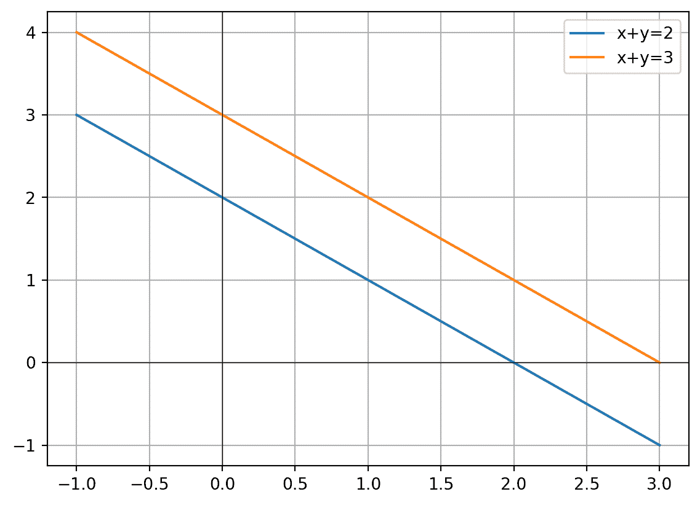*  *这两条线是平行的 → 没有解。

1.  自动检测不一致性

我们可以扫描简化行形（RREF）以查找形式为 $[0, 0, …, c]$ 的行，其中 $c \neq 0$。

```py
def is_inconsistent(M):
 rref_matrix, _ = M.rref()
 for row in rref_matrix.tolist():
 if all(v == 0 for v in row[:-1]) and row[-1] != 0:
 return True
 return False

print("System 1 inconsistent?", is_inconsistent(M))
print("System 2 inconsistent?", is_inconsistent(M2))
```

*```py
System 1 inconsistent? True
System 2 inconsistent? False
```****  ***#### 尝试自己操作

1.  测试系统：

    $$ x + 2y = 4, \quad 2x + 4y = 10 $$

    写出增广矩阵并检查它是否不一致。

1.  构建一个随机的 2×3 增广矩阵，并使用 `is_inconsistent` 检查。

1.  在 2D 中绘制两个线性方程。调整常数以查看它们何时相交（一致）以及何时平行（不一致）。

#### **总结**

+   如果简化行形（RREF）包含形如 $[0,0,…,c]$ 的行且 $c \neq 0$，则系统是不一致的。

+   几何上，这意味着方程描述了平行线（2D）、平行平面（3D）或更高维度的矛盾。

+   快速识别不一致性可以节省时间并避免追求不可能的解。****  ***### 27. 手动高斯消元（一种纪律性的程序）

高斯消元法是使用行操作系统地求解线性系统的方法。它将增广矩阵转换为行阶梯形（REF），然后使用回代找到解。在这个实验中，我们将逐步讲解这个过程。

#### 设置你的实验室

```py
import numpy as np
from sympy import Matrix
```

*#### 逐步代码讲解

1.  示例系统

$$ \begin{cases} x + y + z = 6 \\ 2x + 3y + z = 14 \\ x + 2y + 3z = 14 \end{cases} $$

```py
A = np.array([
 [1, 1, 1, 6],
 [2, 3, 1, 14],
 [1, 2, 3, 14]
], dtype=float)

print("Initial augmented matrix:\n", A)
```

*```py
Initial augmented matrix:
 [[ 1\.  1\.  1\.  6.]
 [ 2\.  3\.  1\. 14.]
 [ 1\.  2\.  3\. 14.]]
```*  *2.  第一步：第一列的枢轴操作

将(0,0)处的枢轴元素设为 1（它已经是了）。现在消除它下面的内容。

```py
A[1] = A[1] - 2*A[0]   # Row2 → Row2 - 2*Row1
A[2] = A[2] - A[0]     # Row3 → Row3 - Row1
print("After eliminating first column:\n", A)
```

*```py
After eliminating first column:
 [[ 1\.  1\.  1\.  6.]
 [ 0\.  1\. -1\.  2.]
 [ 0\.  1\.  2\.  8.]]
```*  *3.  第二步：第二列的枢轴操作

将第 1 行第 1 列的枢轴元素设为 1。

```py
A[1] = A[1] / A[1,1]
print("After scaling second row:\n", A)
```

*```py
After scaling second row:
 [[ 1\.  1\.  1\.  6.]
 [ 0\.  1\. -1\.  2.]
 [ 0\.  1\.  2\.  8.]]
```*  *现在消除以下内容：

```py
A[2] = A[2] - A[2,1]*A[1]
print("After eliminating second column:\n", A)
```

*```py
After eliminating second column:
 [[ 1\.  1\.  1\.  6.]
 [ 0\.  1\. -1\.  2.]
 [ 0\.  0\.  3\.  6.]]
```*  *4.  第三步：第三列的枢轴操作

将右下角的元素设为 1。

```py
A[2] = A[2] / A[2,2]
print("After scaling third row:\n", A)
```

*```py
After scaling third row:
 [[ 1\.  1\.  1\.  6.]
 [ 0\.  1\. -1\.  2.]
 [ 0\.  0\.  1\.  2.]]
```*  *此时，矩阵已经处于行阶梯形（REF）。

1.  回代

现在从下往上求解：

```py
z = A[2,3]
y = A[1,3] - A[1,2]*z
x = A[0,3] - A[0,1]*y - A[0,2]*z

print(f"Solution: x={x}, y={y}, z={z}")
```

*```py
Solution: x=0.0, y=4.0, z=2.0
```*  *6.  验证

```py
coeff = np.array([
 [1,1,1],
 [2,3,1],
 [1,2,3]
], dtype=float)
const = np.array([6,14,14], dtype=float)

print("Check with np.linalg.solve:", np.linalg.solve(coeff,const))
```

*```py
Check with np.linalg.solve: [0\. 4\. 2.]
```*  *结果匹配。*******  ***#### 尝试自己来做

1.  解：

    $$ 2x + y = 5, \quad 4x - 6y = -2 $$

    使用代码手动进行高斯消元。

1.  创建一个随机的 3×4 增广矩阵，并逐步进行行操作，每次行操作后打印。

1.  将你的手动消元与 SymPy 的 RREF 通过 `Matrix.rref()` 进行比较。

#### 吸收要点

+   高斯消元法是一系列有序的行操作。

+   它将矩阵化简为行阶梯形，从那里回代是直接的。

+   这种方法是手动求解系统的基础，也是许多数值算法的基础。****  ***### 28\. 回代和解集（干净利落地完成）

一旦高斯消元法将一个系统化简为行阶梯形（REF），最后一步是回代。这意味着从最后一个方程开始解变量，并向上工作。在这个实验中，我们将练习唯一解和无限解的情况。

#### 设置你的实验室

```py
import numpy as np
from sympy import Matrix
```

*#### 逐步代码讲解

1.  唯一解示例

系统：

$$ x + y + z = 6, \quad 2y + 5z = -4, \quad z = 3 $$

行阶梯形看起来像：

$$ \begin{bmatrix} 1 & 1 & 1 & 6 \\ 0 & 2 & 5 & -4 \\ 0 & 0 & 1 & 3 \end{bmatrix} $$

从下往上求解：

```py
z = 3
y = (-4 - 5*z)/2
x = 6 - y - z
print(f"Solution: x={x}, y={y}, z={z}")
```

*```py
Solution: x=12.5, y=-9.5, z=3
```*  *2.  无穷多解示例

系统：

$$ x + y + z = 2, \quad 2x + 2y + 2z = 4 $$

消元后：

$$ \begin{bmatrix} 1 & 1 & 1 & 2 \\ 0 & 0 & 0 & 0 \end{bmatrix} $$

这意味着：

+   方程：$x + y + z = 2$。

+   自由变量：选择 $y$ 和 $z$。

令 $y = s, z = t$。然后：

$$ x = 2 - s - t $$

因此，解集是：

```py
from sympy import symbols
s, t = symbols('s t')
x = 2 - s - t
y = s
z = t
print("General solution:")
print("x =", x, ", y =", y, ", z =", z)
```

*```py
General solution:
x = -s - t + 2 , y = s , z = t
```*  *3.  与 RREF 的一致性检查

我们可以使用 SymPy 来确认解集：

```py
M = Matrix([
 [1,1,1,2],
 [2,2,2,4]
])

print("RREF form:\n", M.rref()[0])
```

*```py
RREF form:
 Matrix([[1, 1, 1, 2], [0, 0, 0, 0]])
```*  *第二行消失，显示出无穷多解。

1.  编码解集

一般解通常以参数向量形式表示。

对于上面的无穷多解：

$$ (x,y,z) = (2,0,0) + s(-1,1,0) + t(-1,0,1) $$

这表明解空间是 $\mathbb{R}³$ 中的一个平面。***  ***#### 尝试自己来做

1.  解：

    $$ x + 2y = 5, \quad y = 1 $$

    通过手动回代并使用 NumPy 进行验证。

1.  考虑以下系统：

    $$ x + y + z = 1, \quad 2x + 2y + 2z = 2 $$

    将其解集写成参数形式。

1.  在一个 3×4 随机增广矩阵上使用 `Matrix.rref()`。识别主元和自由变量，然后描述解集。

#### 吸收要点

+   回代是高斯消元后的清理步骤。

+   它揭示了系统是否有唯一解或无限多个解。

+   解可以明确表达（唯一情况）或参数化（无限情况）。****  ***### 29. 秩及其第一含义（主元作为信息）

矩阵的秩告诉我们它包含多少独立信息。秩是线性代数中最重要概念之一，因为它与主元、独立性、维度和系统解的数量相关联。

#### 设置您的实验室

```py
import numpy as np
from sympy import Matrix
```

*#### 逐步代码分析

1.  秩的定义 秩是矩阵行阶梯形式中主元（首一）的数量。

示例：

```py
A = Matrix([
 [1, 2, 3],
 [2, 4, 6],
 [1, 1, 1]
])

print("RREF:\n", A.rref()[0])
print("Rank of A:", A.rank())
```

*```py
RREF:
 Matrix([[1, 0, -1], [0, 1, 2], [0, 0, 0]])
Rank of A: 2
```*  **   第二行是第一行的倍数，所以秩小于 3。

+   只有两条独立行 → 秩 = 2。

1.  秩和 $A·x = b$ 的解

考虑：

$$ \begin{cases} x + y + z = 3 \\ 2x + 2y + 2z = 6 \\ x - y = 0 \end{cases} $$

```py
M = Matrix([
 [1, 1, 1, 3],
 [2, 2, 2, 6],
 [1, -1, 0, 0]
])

print("RREF:\n", M.rref()[0])
print("Rank of coefficient matrix:", M[:, :-1].rank())
print("Rank of augmented matrix:", M.rank())
```

*```py
RREF:
 Matrix([[1, 0, 1/2, 3/2], [0, 1, 1/2, 3/2], [0, 0, 0, 0]])
Rank of coefficient matrix: 2
Rank of augmented matrix: 2
```*  **   如果 rank(A) = rank([A|b]) = 变量的数量 → 唯一解。

+   如果 rank(A) = rank([A|b]) < 变量的数量 → 无穷多解。

+   如果 rank(A) < rank([A|b]) → 无解。

1.  NumPy 比较

```py
A = np.array([
 [1, 2, 3],
 [2, 4, 6],
 [1, 1, 1]
], dtype=float)

print("Rank with NumPy:", np.linalg.matrix_rank(A))
```

*```py
Rank with NumPy: 2
```*  *4.  秩作为“信息维度”

秩等于：

+   独立行的数量。

+   独立列的数量。

+   列空间的维度。

```py
B = Matrix([
 [1,2],
 [2,4],
 [3,6]
])

print("Rank of B:", B.rank())
```

*```py
Rank of B: 1
```*  *所有列都是倍数 → 只有一个独立方向 → 秩 = 1。****  ***#### 尝试自己

1.  计算其秩。

    $$ \begin{bmatrix} 1 & 2 & 3 \\ 2 & 4 & 6 \\ 3 & 6 & 9 \end{bmatrix} $$

    你期望什么？

1.  使用 `np.random.randint` 创建一个随机的 4×4 矩阵。使用 SymPy 和 NumPy 计算其秩。

1.  使用秩测试解的一致性：构建一个 rank(A) ≠ rank([A|b]) 的系统，并显示它没有解。

#### 吸收要点

+   Rank = 旋转数 = 独立信息的维度。

+   秩揭示了系统是否有无解、一个解或无限多个解。

+   秩将代数（主元）与几何（子空间的维度）联系起来。****  ***### 30. LU 分解（消元作为 L 和 U）

高斯消元可以记录在整洁的分解中：

$$ A = LU $$

其中 $L$ 是一个下三角矩阵（记录我们使用的乘数）和 $U$ 是一个上三角矩阵（消元的结果）。这被称为 LU 分解。它是解决系统的高效工具。

#### 设置您的实验室

```py
import numpy as np
from scipy.linalg import lu
```

*#### 逐步代码分析

1.  示例矩阵

```py
A = np.array([
 [2, 3, 1],
 [4, 7, 7],
 [6, 18, 22]
], dtype=float)

print("Matrix A:\n", A)
```

*```py
Matrix A:
 [[ 2\.  3\.  1.]
 [ 4\.  7\.  7.]
 [ 6\. 18\. 22.]]
```*  *2.  使用 SciPy 进行 LU 分解

```py
P, L, U = lu(A)

print("Permutation matrix P:\n", P)
print("Lower triangular L:\n", L)
print("Upper triangular U:\n", U)
```

*```py
Permutation matrix P:
 [[0\. 0\. 1.]
 [0\. 1\. 0.]
 [1\. 0\. 0.]]
Lower triangular L:
 [[1\.         0\.         0\.        ]
 [0.66666667 1\.         0\.        ]
 [0.33333333 0.6        1\.        ]]
Upper triangular U:
 [[ 6\.         18\.         22\.        ]
 [ 0\.         -5\.         -7.66666667]
 [ 0\.          0\.         -1.73333333]]
```*  *在这里，$P$ 处理行交换（部分主元），$L$ 是下三角矩阵，$U$ 是上三角矩阵。

1.  验证分解

```py
reconstructed = P @ L @ U
print("Does P·L·U equal A?\n", np.allclose(reconstructed, A))
```

*```py
Does P·L·U equal A?
 True
```*  *4.  使用 LU 解方程组

假设我们想要解 $Ax = b$。我们不是直接与 $A$ 一起工作，而是分两步解决：

1.  解 $Ly = Pb$（前向替换）。

1.  解 $Ux = y$（回代）。

```py
b = np.array([1, 2, 3], dtype=float)

# Step 1: Pb
Pb = P @ b

# Step 2: forward substitution Ly = Pb
y = np.linalg.solve(L, Pb)

# Step 3: back substitution Ux = y
x = np.linalg.solve(U, y)

print("Solution x:", x)
```

*```py
Solution x: [ 0.5 -0\.  -0\. ]
```*  *5.  效率优势

如果我们必须解决许多具有相同 $A$ 但不同 $b$ 的系统，我们只需计算一次 $LU$，然后重复使用它。这可以节省大量的计算。

1.  NumPy 的内置秩揭示分解

虽然 NumPy 没有直接提供 `lu` 函数，但它与 SciPy 工作得非常顺畅。对于大型矩阵，LU 分解是像 `np.linalg.solve` 这样的求解器的基石。****  ***#### 尝试自己操作

1.  对以下矩阵进行 LU 分解：

    $$ A = \begin{bmatrix} 1 & 2 & 0 \\ 3 & 4 & 4 \\ 5 & 6 & 3 \end{bmatrix} $$

    验证 $P·L·U = A$。

1.  使用

    $$ b = [3,7,8] $$

    使用 LU 分解。

1.  将使用 LU 分解求解与直接使用 `np.linalg.solve(A,b)` 进行比较。答案是否相同？

#### 吸收要点

+   LU 分解在矩阵形式中捕捉高斯消元法：$A = P·L·U$。

+   它允许快速重复求解具有不同右侧的系统。

+   LU 分解是数值线性代数中的一个核心技术，也是许多求解器的基础。*******************************  ***## 第四章\. 向量空间与子空间

### 31\. 向量空间公理（“空间”真正意味着什么）

向量空间推广了我们一直对向量矩阵所做的工作。与 $\mathbb{R}^n$ 不同，向量空间是任何对象（向量）的集合，其中加法和数乘遵循特定的公理（规则）。在这个实验中，我们将使用 Python 具体探索这些公理。

#### 设置您的实验室

```py
import numpy as np
```

*#### 逐步代码讲解

1.  向量空间示例：$\mathbb{R}²$

让我们检查两个规则（公理）：加法封闭性和数乘封闭性。

```py
u = np.array([1, 2])
v = np.array([3, -1])

# Closure under addition
print("u + v =", u + v)

# Closure under scalar multiplication
k = 5
print("k * u =", k * u)
```

*```py
u + v = [4 1]
k * u = [ 5 10]
```*  *两个结果仍然在 $\mathbb{R}²$ 中。

1.  零向量和加法逆元

每个向量空间都必须包含一个零向量，每个向量都必须有一个加法逆元。

```py
zero = np.array([0, 0])
inverse_u = -u
print("Zero vector:", zero)
print("u + (-u) =", u + inverse_u)
```

*```py
Zero vector: [0 0]
u + (-u) = [0 0]
```*  *3.  分配律和结合律

检查：

+   $a(u+v) = au + av$

+   $(a+b)u = au + bu$

```py
a, b = 2, 3

lhs1 = a * (u + v)
rhs1 = a*u + a*v
print("a(u+v) =", lhs1, ", au+av =", rhs1)

lhs2 = (a+b) * u
rhs2 = a*u + b*u
print("(a+b)u =", lhs2, ", au+bu =", rhs2)
```

*```py
a(u+v) = [8 2] , au+av = [8 2]
(a+b)u = [ 5 10] , au+bu = [ 5 10]
```*  *两个等式都成立 → 分配律得到证实。

1.  一个不能成为向量空间的集合

考虑只有正数，使用正常的加法和数乘。

```py
positive_numbers = [1, 2, 3]
try:
 print("Closure under negatives?", -1 * np.array(positive_numbers))
except Exception as e:
 print("Error:", e)
```

*```py
Closure under negatives? [-1 -2 -3]
```*  *负结果离开集合 → 不是一个向量空间。

1.  Python 辅助函数用于检查公理

我们可以快速检查一个向量集是否在加法和数乘下封闭。

```py
def check_closure(vectors, scalars):
 for v in vectors:
 for u in vectors:
 if not any(np.array_equal(v+u, w) for w in vectors):
 return False
 for k in scalars:
 if not any(np.array_equal(k*v, w) for w in vectors):
 return False
 return True

vectors = [np.array([0,0]), np.array([1,0]), np.array([0,1]), np.array([1,1])]
scalars = [0,1,-1]
print("Closed under addition and scalar multiplication?", check_closure(vectors, scalars))
```

*```py
Closed under addition and scalar multiplication? False
```*  *这个小的集合是封闭的 → 它形成了一个向量空间（$\mathbb{R}²$ 的子空间）。*****  ***#### 尝试自己操作

1.  使用随机向量验证 $\mathbb{R}³$ 满足向量空间公理。

1.  测试所有 2×2 矩阵的集合在正常加法和数乘下是否形成向量空间。

1.  找到一个不满足封闭性的集合的例子（例如，整数除法）。

#### 吸收要点

+   向量空间是任何满足 10 个标准公理的加法和数乘集合。

+   这些规则确保了代数行为的连贯性。

+   许多对象（如多项式或矩阵）在$\mathbb{R}^n$中（除了箭头之外）也是向量空间。****  ***### 32\. 子空间、列空间和零空间（解的居住地）

子空间是位于更大向量空间内部的较小向量空间。对于矩阵，两个子空间经常出现：

+   列空间：矩阵列的所有组合（$Ax$的可能输出）。

+   零空间：所有满足$Ax = 0$的向量$x$（消失的输入）。

这个实验在 Python 中探索了这两个方面。

#### 设置你的实验室

```py
import numpy as np
from sympy import Matrix
```

*#### 逐步代码解析

1.  列空间基础

取：

$$ A = \begin{bmatrix} 1 & 2 \\ 2 & 4 \\ 3 & 6 \end{bmatrix} $$

```py
A = Matrix([
 [1,2],
 [2,4],
 [3,6]
])

print("Matrix A:\n", A)
print("Column space basis:\n", A.columnspace())
print("Rank (dimension of column space):", A.rank())
```

*```py
Matrix A:
 Matrix([[1, 2], [2, 4], [3, 6]])
Column space basis:
 [Matrix([
[1],
[2],
[3]])]
Rank (dimension of column space): 1
```*  **   第二列是第一列的倍数 → 列空间维度为 1。

+   $Ax$的所有输出都位于$\mathbb{R}³$中的一条线上。

1.  零空间基础

```py
print("Null space basis:\n", A.nullspace())
```

*```py
Null space basis:
 [Matrix([
[-2],
[ 1]])]
```*  *零空间包含所有$Ax=0$的$x$。在这里，零空间是一维的（如$[-2,1]$这样的向量）。

1.  完全秩的例子

```py
B = Matrix([
 [1,0,0],
 [0,1,0],
 [0,0,1]
])

print("Column space basis:\n", B.columnspace())
print("Null space basis:\n", B.nullspace())
```

*```py
Column space basis:
 [Matrix([
[1],
[0],
[0]]), Matrix([
[0],
[1],
[0]]), Matrix([
[0],
[0],
[1]])]
Null space basis:
 []
```*  **   列空间 = $\mathbb{R}³$的全部。

+   零空间 = 只有零向量。

1.  几何链接

对于$A$（秩 1，2 列）：

+   列空间：$\mathbb{R}³$中的线。

+   零空间：$\mathbb{R}²$中的线。

一起解释了系统$Ax = b$：

+   如果$b$在列空间之外，则不存在解。

+   如果$b$在内部，解将相差零空间中的一个向量。

1.  快速 NumPy 版本

NumPy 不直接给出零空间，但我们可以通过奇异值分解（SVD）来计算它。

```py
from numpy.linalg import svd

A = np.array([[1,2],[2,4],[3,6]], dtype=float)
U, S, Vt = svd(A)

tol = 1e-10
null_mask = (S <= tol)
null_space = Vt.T[:, null_mask]
print("Null space (via SVD):\n", null_space)
```

*```py
Null space (via SVD):
 [[-0.89442719]
 [ 0.4472136 ]]
```****  ***#### 尝试自己操作

1.  找出以下矩阵的列空间和零空间：

    $$ \begin{bmatrix} 1 & 1 \\ 0 & 1 \\ 0 & 0 \end{bmatrix} $$

    每个有多少维？

1.  生成一个随机的 3×3 矩阵。计算其秩、列空间和零空间。

1.  用以下方法求解$Ax = b$：

    $$ A = \begin{bmatrix} 1 & 2 \\ 2 & 4 \\ 3 & 6 \end{bmatrix}, \quad b = \begin{bmatrix} 1 \\ 2 \\ 3 \end{bmatrix} $$

    并描述为什么它有无限多个解。

#### 吸收要点

+   列空间 = 矩阵的所有可能输出。

+   零空间 =映射到零的所有输入。

+   这些子空间给出了矩阵所做事情的完整图景。****  ***### 33\. 张量和生成集（空间的覆盖）

向量集的张量是从它们中可以做出的所有线性组合。如果一个向量集可以“覆盖”整个空间，我们称之为生成集。这个实验展示了如何计算和可视化张量。

#### 设置你的实验室

```py
import numpy as np
from sympy import Matrix
import matplotlib.pyplot as plt
```

*#### 逐步代码解析

1.  $\mathbb{R}²$中的张量

两个非倍数向量可以张成整个平面。

```py
u = np.array([1, 0])
v = np.array([0, 1])

M = Matrix.hstack(Matrix(u), Matrix(v))
print("Rank:", M.rank())
```

*```py
Rank: 2
```*  *秩 = 2 → $\{u,v\}$的张量是$\mathbb{R}²$的全部。

1.  依赖向量（较小的张量）

```py
u = np.array([1, 2])
v = np.array([2, 4])

M = Matrix.hstack(Matrix(u), Matrix(v))
print("Rank:", M.rank())
```

*```py
Rank: 1
```*  *秩 = 1 → 这些向量仅构成一条线。

1.  可视化张量

让我们看看两个向量的张量看起来像什么。

```py
u = np.array([1, 2])
v = np.array([2, 1])

coeffs = np.linspace(-2, 2, 11)
points = []
for a in coeffs:
 for b in coeffs:
 points.append(a*u + b*v)
points = np.array(points)

plt.scatter(points[:,0], points[:,1], s=10)
plt.axhline(0,color='black',linewidth=0.5)
plt.axvline(0,color='black',linewidth=0.5)
plt.title("Span of {u,v}")
plt.grid()
plt.show()
```

*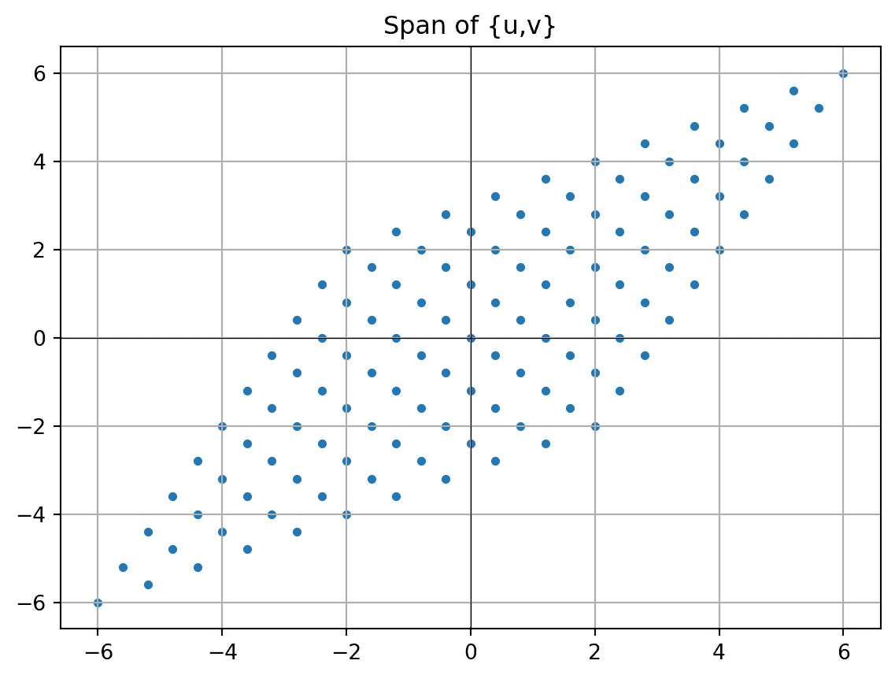*  *你会看到一个填充的网格 - 整个平面，因为这两个向量是独立的。

1.  空间的生成集

对于$\mathbb{R}³$：

```py
basis = [Matrix([1,0,0]), Matrix([0,1,0]), Matrix([0,0,1])]
M = Matrix.hstack(*basis)
print("Rank:", M.rank())
```

*```py
Rank: 3
```*  *秩 = 3 → 这个集合张成整个空间。

1.  测试向量是否在张量中

示例：$[3,5]$ 是否在 $[1,2]$ 和 $[2,1]$ 的范围内？

```py
u = Matrix([1,2])
v = Matrix([2,1])
target = Matrix([3,5])

M = Matrix.hstack(u,v)
solution = M.gauss_jordan_solve(target)
print("Coefficients (a,b):", solution)
```

*```py
Coefficients (a,b): (Matrix([
[7/3],
[1/3]]), Matrix(0, 1, []))
```*  *如果存在解，目标在范围内。*****  ***#### 尝试自己操作

1.  测试 $[4,6]$ 是否在 $[1,2]$ 的范围内。

1.  在 $\mathbb{R}³$ 中可视化 $[1,0,0]$ 和 $[0,1,0]$ 的范围。它看起来像什么？

1.  创建一个随机的 3×3 矩阵。使用 `rank()` 检查其列是否生成 $\mathbb{R}³$。

#### **总结**

+   范围 = 一组向量的所有线性组合。

+   独立向量生成的空间更大；相关的向量会塌缩到更小的空间。

+   生成集是基和坐标系统的基础。****  ***### 34. 线性独立与相关（无冗余与冗余）

一组向量是线性独立的，如果其中没有一个可以写成其他向量的组合。如果至少有一个可以，那么这个集合就是相关的。这种区别告诉我们一组向量是否有冗余。

#### 设置您的实验室

```py
import numpy as np
from sympy import Matrix
```

*#### 逐步代码讲解

1.  **独立向量示例**

```py
v1 = Matrix([1, 0, 0])
v2 = Matrix([0, 1, 0])
v3 = Matrix([0, 0, 1])

M = Matrix.hstack(v1, v2, v3)
print("Rank:", M.rank(), " Number of vectors:", M.shape[1])
```

*```py
Rank: 3  Number of vectors: 3
```*  *秩 = 3，向量数量 = 3 → 所有向量都是独立的。

1.  相关向量示例

```py
v1 = Matrix([1, 2, 3])
v2 = Matrix([2, 4, 6])
v3 = Matrix([3, 6, 9])

M = Matrix.hstack(v1, v2, v3)
print("Rank:", M.rank(), " Number of vectors:", M.shape[1])
```

*```py
Rank: 1  Number of vectors: 3
```*  *秩 = 1，向量数量 = 3 → 它们是相关的（彼此的倍数）。

1.  自动检查依赖性

快速测试：如果秩 < 向量数量 → 相关。

```py
def check_independence(vectors):
 M = Matrix.hstack(*vectors)
 return M.rank() == M.shape[1]

print("Independent?", check_independence([Matrix([1,0]), Matrix([0,1])]))
print("Independent?", check_independence([Matrix([1,2]), Matrix([2,4])]))
```

*```py
Independent? True
Independent? False
```*  *4.  求解依赖关系

如果向量是相关的，我们可以找到系数 $c_1, c_2, …$ 使得

$$ c_1 v_1 + c_2 v_2 + … + c_k v_k = 0 $$

有一些 $c_i \neq 0$。

```py
M = Matrix.hstack(Matrix([1,2]), Matrix([2,4]))
null_space = M.nullspace()
print("Dependence relation (coefficients):", null_space)
```

*```py
Dependence relation (coefficients): [Matrix([
[-2],
[ 1]])]
```*  *这显示了确切的线性关系。

1.  随机示例

```py
np.random.seed(0)
R = Matrix(np.random.randint(-3, 4, (3,3)))
print("Random matrix:\n", R)
print("Rank:", R.rank())
```

*```py
Random matrix:
 Matrix([[1, 2, -3], [0, 0, 0], [-2, 0, 2]])
Rank: 2
```*  *根据秩，列可能是独立的（秩 = 3）或相关的（秩 < 3）。*****  ***#### 尝试自己操作

1.  测试 $[1,1,0], [0,1,1], [1,2,1]$ 是否独立。

1.  在 $\mathbb{R}³$ 中生成 4 个随机向量。它们是否可以总是独立？为什么或为什么不？

1.  找到 $[2,4], [3,6]$ 的依赖关系。

#### **总结**

+   独立集：没有冗余，每个向量增加一个新方向。

+   相关集：至少有一个向量是不必要的（它位于其他向量的范围内）。

+   独立性是定义基和维度的关键。****  ***### 35. 基和坐标（唯一命名每个向量）

基是一个生成空间的独立向量集。它就像选择一个坐标系：空间中的每个向量都可以唯一地表示为基向量的组合。在这个实验室中，我们将看到如何找到基并计算相对于它们的坐标。

#### 设置您的实验室

```py
import numpy as np
from sympy import Matrix
```

*#### 逐步代码讲解

1.  $\mathbb{R}³$ 中的标准基

```py
e1 = Matrix([1,0,0])
e2 = Matrix([0,1,0])
e3 = Matrix([0,0,1])

M = Matrix.hstack(e1, e2, e3)
print("Rank:", M.rank())
```

*```py
Rank: 3
```*  *这三个独立向量构成了 $\mathbb{R}³$ 的标准基。任何像 $[2,5,-1]$ 这样的向量都可以表示为

$$ 2e_1 + 5e_2 - 1e_3 $$

1.  从相关向量中找到基

```py
v1 = Matrix([1,2,3])
v2 = Matrix([2,4,6])
v3 = Matrix([1,0,1])

M = Matrix.hstack(v1,v2,v3)
print("Column space basis:", M.columnspace())
```

*```py
Column space basis: [Matrix([
[1],
[2],
[3]]), Matrix([
[1],
[0],
[1]])]
```*  *SymPy 自动提取独立列。这给出了列空间的基。

1.  基础相关的坐标

假设基 = $\{ [1,0], [1,1] \}$。用这个基表示向量 $[3,5]$。

```py
B = Matrix.hstack(Matrix([1,0]), Matrix([1,1]))
target = Matrix([3,5])

coords = B.solve_least_squares(target)
print("Coordinates in basis B:", coords)
```

*```py
Coordinates in basis B: Matrix([[-2], [5]])
```*  *所以 $[3,5] = 3·[1,0] + 2·[1,1]$。

1.  基变换

如果我们切换到不同的基，坐标会改变，但向量本身保持不变。

```py
new_basis = Matrix.hstack(Matrix([2,1]), Matrix([1,2]))
coords_new = new_basis.solve_least_squares(target)
print("Coordinates in new basis:", coords_new)
```

*```py
Coordinates in new basis: Matrix([[1/3], [7/3]])
```*  *5.  随机示例

在 $\mathbb{R}³$ 中生成 3 个随机向量。检查它们是否形成一个基。

```py
np.random.seed(1)
R = Matrix(np.random.randint(-3,4,(3,3)))
print("Random matrix:\n", R)
print("Rank:", R.rank())
```

*```py
Random matrix:
 Matrix([[2, 0, 1], [-3, -2, 0], [2, -3, -3]])
Rank: 3
```*  *如果秩 = 3 → $\mathbb{R}³$ 的基。否则，只能生成子空间。*****  ***#### 试试看

1.  检查 $[1,2], [3,4]$ 是否形成 $\mathbb{R}²$ 的基。

1.  用那个基表示向量 $[7,5]$。

1.  在 $\mathbb{R}³$ 中创建 4 个随机向量。找到它们的生成空间的基。

#### 吸收要点

+   基 = 生成一个空间的向量的最小集合。

+   每个向量在给定基中都有一个唯一的坐标表示。

+   改变基会改变坐标，但不会改变向量本身。****  ***### 36. 维度（有多少方向）

向量空间的维度是其拥有的独立方向的数目。形式上，它是空间中任何基中向量的数目。维度告诉我们空间在自由度方面的“大小”。

#### 设置您的实验室

```py
import numpy as np
from sympy import Matrix
```

*#### 逐步代码讲解

1.  $\mathbb{R}^n$ 的维度

$\mathbb{R}^n$ 的维度是 $n$。

```py
n = 4
basis = [Matrix.eye(n)[:,i] for i in range(n)]
print("Basis for R⁴:", basis)
print("Dimension of R⁴:", len(basis))
```

*```py
Basis for R⁴: [Matrix([
[1],
[0],
[0],
[0]]), Matrix([
[0],
[1],
[0],
[0]]), Matrix([
[0],
[0],
[1],
[0]]), Matrix([
[0],
[0],
[0],
[1]])]
Dimension of R⁴: 4
```*  *每个标准单位向量增加一个独立方向 → 维度 = 4。

1.  通过秩确定维度

矩阵的秩等于其列空间的维度。

```py
A = Matrix([
 [1,2,3],
 [2,4,6],
 [1,0,1]
])

print("Rank (dimension of column space):", A.rank())
```

*```py
Rank (dimension of column space): 2
```*  *在这里，秩 = 2 → 列空间是 $\mathbb{R}³$ 内的 2D 平面。

1.  零空间维度

零空间维度由以下给出：

$$ \text{dim(Null(A))} = \text{变量数} - \text{rank(A)} $$

```py
print("Null space basis:", A.nullspace())
print("Dimension of null space:", len(A.nullspace()))
```

*```py
Null space basis: [Matrix([
[-1],
[-1],
[ 1]])]
Dimension of null space: 1
```*  *这是解中的自由变量数。

1.  实际应用中的维度

+   $\mathbb{R}³$ 中通过原点的直线维度为 1。

+   通过原点的平面维度为 2。

+   整个 $\mathbb{R}³$ 的维度是 3。

示例：

```py
v1 = Matrix([1,2,3])
v2 = Matrix([2,4,6])
span = Matrix.hstack(v1,v2)
print("Dimension of span:", span.rank())
```

*```py
Dimension of span: 1
```*  *结果 = 1 → 它们只能生成一条线。

1.  随机示例

```py
np.random.seed(2)
R = Matrix(np.random.randint(-3,4,(4,4)))
print("Random 4x4 matrix:\n", R)
print("Column space dimension:", R.rank())
```

*```py
Random 4x4 matrix:
 Matrix([[-3, 2, -3, 3], [0, -1, 0, -3], [-1, -2, 0, 2], [-1, 1, 1, 1]])
Column space dimension: 4
```*  *秩可能是 4（满空间）或更小（折叠）。*****  ***#### 试试看

1.  求下列列空间的维度

    $$ \begin{bmatrix} 1 & 1 & 1 \\ 0 & 1 & 1 \\ 0 & 0 & 0 \end{bmatrix} $$

1.  计算一个 3×3 奇异矩阵的零空间维度。

1.  生成一个 5×3 的随机矩阵并计算其列空间维度。

#### 吸收要点

+   维度 = 独立方向的数目。

+   通过计算基向量（或秩）得出。

+   维度描述了较大空间内的线（1D）、平面（2D）和更高维度的子空间。****  ***### 37. 秩-零度定理（维度之和）

秩-零度定理将矩阵的列空间和零空间的维度联系起来。它说：

$$ \text{rank}(A) + \text{nullity}(A) = \text{A 的列数} $$

这是线性代数中的一个强大的一致性检查。

#### 设置您的实验室

```py
import numpy as np
from sympy import Matrix
```

*#### 逐步代码讲解

1.  简单的 3×3 示例

```py
A = Matrix([
 [1, 2, 3],
 [2, 4, 6],
 [1, 0, 1]
])

rank = A.rank()
nullity = len(A.nullspace())
print("Rank:", rank)
print("Nullity:", nullity)
print("Rank + Nullity =", rank + nullity)
print("Number of columns =", A.shape[1])
```

*```py
Rank: 2
Nullity: 1
Rank + Nullity = 3
Number of columns = 3
```*  *你应该看到秩 + 零度 = 3，即列数。

1.  满秩情况

```py
B = Matrix([
 [1,0,0],
 [0,1,0],
 [0,0,1]
])

print("Rank:", B.rank())
print("Nullity:", len(B.nullspace()))
```

*```py
Rank: 3
Nullity: 0
```*  **   秩 = 3（全部独立）。

+   零度 = 0（$Bx=0$ 只有零解）。

+   秩 + 零度 = 3 列。

1.  宽矩阵（列数多于行数）

```py
C = Matrix([
 [1,2,3,4],
 [0,1,1,2],
 [0,0,0,0]
])

rank = C.rank()
nullity = len(C.nullspace())
print("Rank:", rank, " Nullity:", nullity, " Columns:", C.shape[1])
```

*```py
Rank: 2  Nullity: 2  Columns: 4
```*  *在这里，零度 > 0，因为变量多于独立方程。

1.  使用随机矩阵验证

```py
np.random.seed(3)
R = Matrix(np.random.randint(-3,4,(4,5)))
print("Random 4x5 matrix:\n", R)
print("Rank + Nullity =", R.rank() + len(R.nullspace()))
print("Number of columns =", R.shape[1])
```

*```py
Random 4x5 matrix:
 Matrix([[-1, -3, -2, 0, -3], [-3, -3, 2, 2, 0], [-1, 0, -2, -2, -1], [2, 3, -3, 1, 1]])
Rank + Nullity = 5
Number of columns = 5
```*  *始终一致：秩 + 零度 = 列数。

1.  几何解释

对于一个 $m \times n$ 矩阵：

+   Rank(A) = 输出维度（列空间）。

+   Nullity(A) = 垮度为 0 的隐藏方向的维度。

+   一起，它们用完了所有的“输入维度”（n）。****  ***#### 尝试自己来做

1.  计算秩和零度。

    $$ \begin{bmatrix} 1 & 1 & 1 \\ 0 & 1 & 1 \end{bmatrix} $$

    检查定理。

1.  创建一个 2×4 的随机整数矩阵。确认秩 + 零度 = 4。

1.  解释为什么一个高满秩的 $5 \times 3$ 矩阵必须有零度 = 0。

#### 要点总结

+   秩 + 零度 = 列数（始终如此）。

+   排序度量独立输出；零度度量隐藏的自由度。

+   这个定理将 $Ax=0$ 的解与 $A$ 的结构联系起来。****  ***### 38. 基的坐标（改变“尺子”）

一旦我们选择了一个基，每个向量都可以用相对于该基的坐标来描述。这就像改变我们用来测量向量的“尺子”。在这个实验室中，我们将练习在不同基中计算坐标。

#### 设置您的实验室

```py
import numpy as np
from sympy import Matrix
```

*#### 逐步代码讲解

1.  标准基坐标

向量 $v = [4,5]$ 在 $\mathbb{R}²$ 中：

```py
v = Matrix([4,5])
e1 = Matrix([1,0])
e2 = Matrix([0,1])

B = Matrix.hstack(e1,e2)
coords = B.solve_least_squares(v)
print("Coordinates in standard basis:", coords)
```

*```py
Coordinates in standard basis: Matrix([[4], [5]])
```*  *结果是 $[4,5]$。很简单 - 标准基直接匹配分量。

1.  非标准基

假设基 = $\{ [1,1], [1,-1] \}$。用这个基表示 $v = [4,5]$。

```py
B2 = Matrix.hstack(Matrix([1,1]), Matrix([1,-1]))
coords2 = B2.solve_least_squares(v)
print("Coordinates in new basis:", coords2)
```

*```py
Coordinates in new basis: Matrix([[9/2], [-1/2]])
```*  *现在 $v$ 有不同的坐标。

1.  将坐标转换回

从坐标重建向量：

```py
reconstructed = B2 * coords2
print("Reconstructed vector:", reconstructed)
```

*```py
Reconstructed vector: Matrix([[4], [5]])
```*  *它与原始的 $[4,5]$ 匹配。

1.  $\mathbb{R}³$ 中的随机基

```py
basis = Matrix.hstack(
 Matrix([1,0,1]),
 Matrix([0,1,1]),
 Matrix([1,1,0])
)
v = Matrix([2,3,4])

coords = basis.solve_least_squares(v)
print("Coordinates of v in random basis:", coords)
```

*```py
Coordinates of v in random basis: Matrix([[3/2], [5/2], [1/2]])
```*  *任何 $\mathbb{R}³$ 中的 3 个独立向量集都可以作为基。

1.  2D 可视化

让我们比较两个基中的坐标。

```py
import matplotlib.pyplot as plt

v = np.array([4,5])
b1 = np.array([1,1])
b2 = np.array([1,-1])

plt.quiver(0,0,v[0],v[1],angles='xy',scale_units='xy',scale=1,color='blue',label='v')
plt.quiver(0,0,b1[0],b1[1],angles='xy',scale_units='xy',scale=1,color='red',label='basis1')
plt.quiver(0,0,b2[0],b2[1],angles='xy',scale_units='xy',scale=1,color='green',label='basis2')

plt.xlim(-1,6)
plt.ylim(-6,6)
plt.legend()
plt.grid()
plt.show()
```

*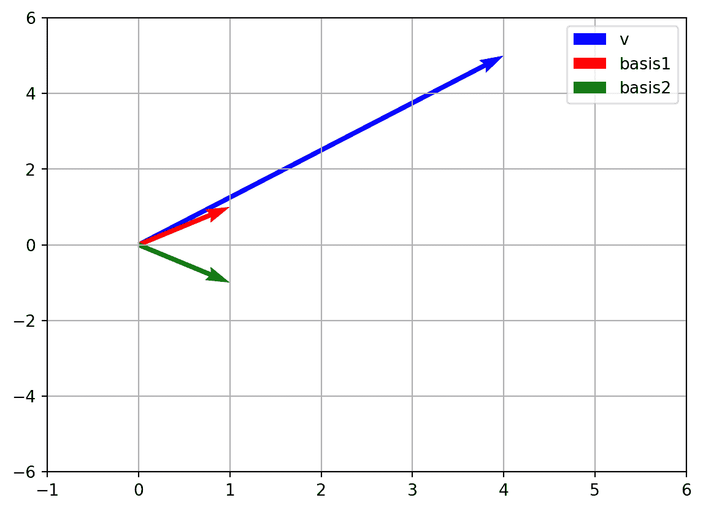*  *尽管基向量看起来不同，但它们覆盖了相同的空间，$v$ 可以用它们来表示。*****  ***#### 尝试自己来做

1.  将 $[7,3]$ 用基 $\{[2,0], [0,3]\}$ 表示。

1.  在 $\mathbb{R}³$ 中选择三个独立的随机向量。写下在该基中 $[1,2,3]$ 的坐标。

1.  验证重建总是给出原始向量。

#### 要点总结

+   基为向量提供了一个坐标系。

+   坐标取决于基，但底层的向量不会改变。

+   改变基就像改变你用来测量向量的“尺子”。****  ***### 39. 基变换矩阵（在坐标系之间移动）

当我们从一种基转换到另一种基时，我们需要一个基变换矩阵。这个矩阵就像一个翻译者：它将一个系统的坐标转换成另一个系统的坐标。

#### 设置您的实验室

```py
import numpy as np
from sympy import Matrix
```

*#### 逐步代码讲解

1.  $\mathbb{R}²$ 中的两个基

让我们定义：

+   基 $B = \{ [1,0], [0,1] \}$（标准基）。

+   基 $C = \{ [1,1], [1,-1] \}$。

```py
B = Matrix.hstack(Matrix([1,0]), Matrix([0,1]))
C = Matrix.hstack(Matrix([1,1]), Matrix([1,-1]))
```

*2.  基变换矩阵

将 C 坐标转换为标准坐标的矩阵就是 $C$。

```py
print("C (basis matrix):\n", C)
```

*```py
C (basis matrix):
 Matrix([[1, 1], [1, -1]])
```*  *要反向操作（标准 → C），我们计算 $C$ 的逆。

```py
C_inv = C.inv()
print("C inverse:\n", C_inv)
```

*```py
C inverse:
 Matrix([[1/2, 1/2], [1/2, -1/2]])
```*  *3.  转换坐标

向量 $v = [4,5]$。

+   在标准基下：

```py
v = Matrix([4,5])
coords_in_standard = v
print("Coordinates in standard basis:", coords_in_standard)
```

*```py
Coordinates in standard basis: Matrix([[4], [5]])
```*  **   在基 $C$ 中：

```py
coords_in_C = C_inv * v
print("Coordinates in C basis:", coords_in_C)
```

*```py
Coordinates in C basis: Matrix([[9/2], [-1/2]])
```*  **   转换回：

```py
reconstructed = C * coords_in_C
print("Reconstructed vector:", reconstructed)
```

*```py
Reconstructed vector: Matrix([[4], [5]])
```*  *重建与原始向量匹配。

1.  一般公式

如果 $P$ 是从基 $B$ 到基 $C$ 的基变换矩阵：

$$ [v]_C = P^{-1}[v]_B $$

$$ [v]_B = P[v]_C $$

这里，$P$ 是用旧基表示的新基向量的矩阵。

1.  随机 3D 示例

```py
B = Matrix.eye(3)  # standard basis
C = Matrix.hstack(
 Matrix([1,0,1]),
 Matrix([0,1,1]),
 Matrix([1,1,0])
)

v = Matrix([2,3,4])

C_inv = C.inv()
coords_in_C = C_inv * v
print("Coordinates in new basis C:", coords_in_C)

print("Back to standard:", C * coords_in_C)
```

*```py
Coordinates in new basis C: Matrix([[3/2], [5/2], [1/2]])
Back to standard: Matrix([[2], [3], [4]])
```*******  ***#### 尝试自己操作

1.  将 $[7,3]$ 从标准基转换为基 $\{[2,0], [0,3]\}$。

1.  随机选择一个可逆的 3×3 矩阵作为基。在一个基下写一个向量，然后将其转换回标准基。

1.  证明来回转换总是返回相同的向量。

#### 总结

+   基变换矩阵在基之间转换坐标。

+   从新基到旧基的转换使用基矩阵。

+   从旧基到新基需要其逆矩阵。

+   向量本身从未改变——只有对它的描述改变了。****  ***### 40\. 仿射子空间（不通过原点的线和平面）

到目前为止，子空间总是通过原点。但许多熟悉的对象——比如偏离原点的线或漂浮在空间中的平面——都是仿射子空间。它们看起来像子空间，只是从零点偏移了。

#### 设置您的实验室

```py
import numpy as np
import matplotlib.pyplot as plt
from sympy import Matrix
```

*#### 逐步代码讲解

1.  通过原点的线（一个子空间）

$$ L = \{ t \cdot [1,2] : t \in \mathbb{R} \} $$

```py
t = np.linspace(-3,3,20)
line_origin = np.array([t, 2*t]).T
plt.plot(line_origin[:,0], line_origin[:,1], label="Through origin")
```

**  *2.  不通过原点的线（仿射子空间）

$$ L' = \{ [3,1] + t \cdot [1,2] : t \in \mathbb{R} \} $$

```py
point = np.array([3,1])
direction = np.array([1,2])
line_shifted = np.array([point + k*direction for k in t])
plt.plot(line_shifted[:,0], line_shifted[:,1], label="Shifted line")
```

*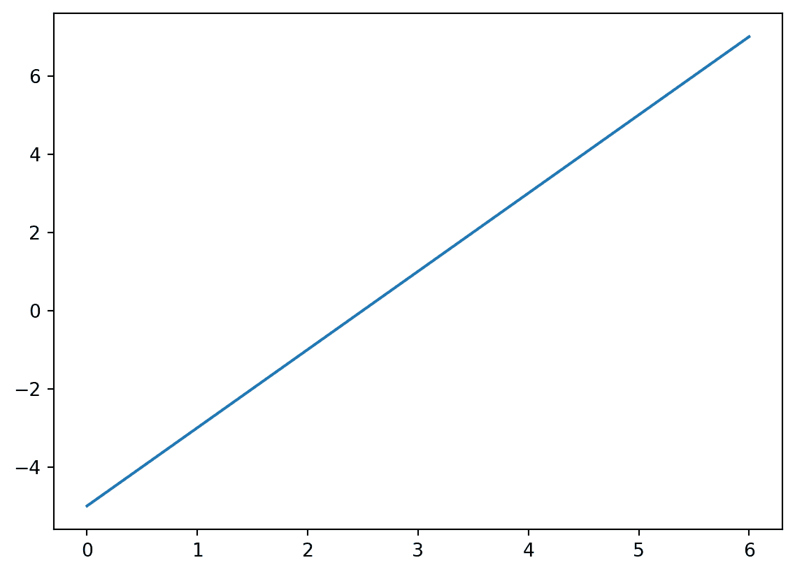*  *3.  视觉化展示

```py
plt.scatter(*point, color="red", label="Shift point")
plt.axhline(0,color='black',linewidth=0.5)
plt.axvline(0,color='black',linewidth=0.5)
plt.legend()
plt.grid()
plt.show()
```

*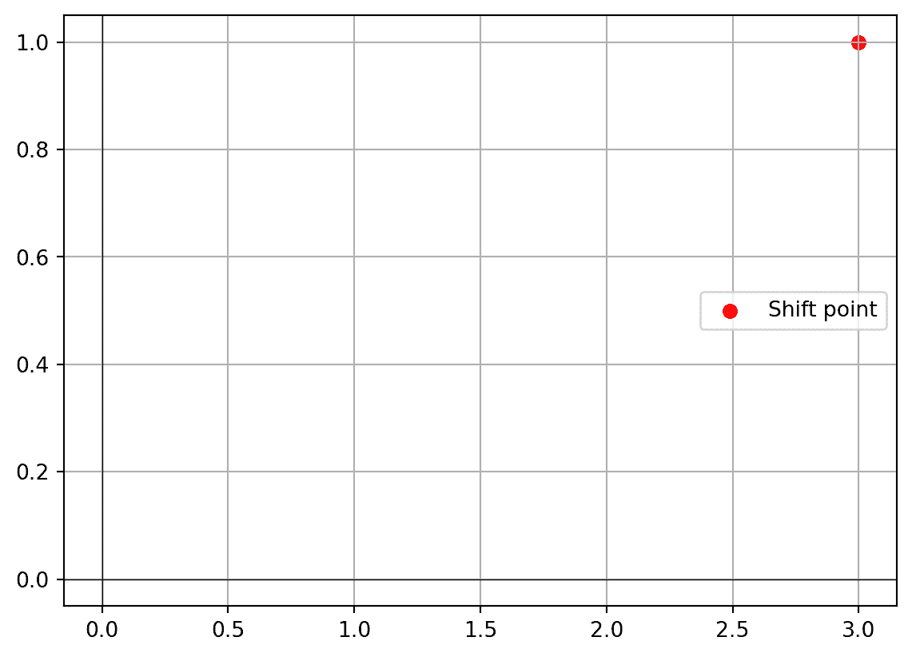*  *一条线通过原点，另一条线与之平行但偏移。

1.  平面示例

$\mathbb{R}³$ 中的一个平面：

$$ P = \{ [1,2,3] + s[1,0,0] + t[0,1,0] : s,t \in \mathbb{R} \} $$

这是一个平行于 $xy$ 平面的仿射平面，但偏移了。

```py
s_vals = np.linspace(-2,2,10)
t_vals = np.linspace(-2,2,10)

points = []
for s in s_vals:
 for t in t_vals:
 points.append([1,2,3] + s*np.array([1,0,0]) + t*np.array([0,1,0]))

points = np.array(points)

from mpl_toolkits.mplot3d import Axes3D
fig = plt.figure()
ax = fig.add_subplot(111, projection='3d')
ax.scatter(points[:,0], points[:,1], points[:,2])
ax.set_title("Affine plane in R³")
plt.show()
```

*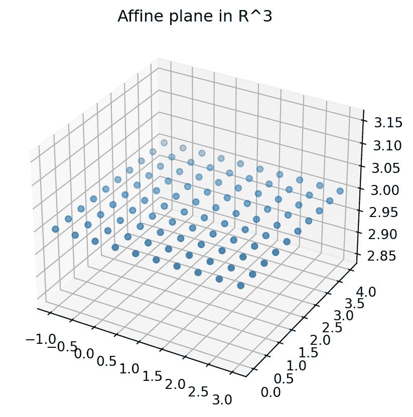*  *5.  代数差异

+   子空间必须满足加法和数乘的封闭性，并且必须包含 0。

+   仿射子空间就是一个子空间加上一个固定的平移向量。****  ***#### 尝试自己操作

1.  在 $\mathbb{R}²$ 中定义一条线：

    $$ (x,y) = (2,3) + t(1,-1) $$

    绘制它并与由 $(1,-1)$ 张成的子空间进行比较。

1.  在 $\mathbb{R}³$ 中构建一个由向量 $(5,5,5)$ 平移的仿射平面。

1.  通过代数证明，减去偏移点将仿射子空间转换回常规子空间。

#### 总结

+   子空间通过原点。

+   仿射子空间是子空间的平移副本。

+   它们在几何学、计算机图形学和优化（例如，线性规划中的可行区域）中至关重要。*******************************  ***## 第五章\. 线性变换与结构

### 41. 线性变换（保持直线和和）

线性变换是向量空间之间的函数，它保持两个关键属性：

1.  可加性：$T(u+v) = T(u) + T(v)$

1.  同质性：$T(cu) = cT(u)$

实际上，每个线性变换都可以用矩阵表示。本实验将帮助你理解和在 Python 中实验线性变换。

#### 设置你的实验室

```py
import numpy as np
import matplotlib.pyplot as plt
```

*#### 逐步代码讲解

1.  简单的线性变换（缩放）

让我们在 x 方向上将向量缩放 2 倍，在 y 方向上缩放 0.5 倍。

```py
A = np.array([
 [2, 0],
 [0, 0.5]
])

v = np.array([1, 2])
Tv = A @ v
print("Original v:", v)
print("Transformed Tv:", Tv)
```

*```py
Original v: [1 2]
Transformed Tv: [2\. 1.]
```*  *2.  可视化多个向量

```py
vectors = [np.array([1,1]), np.array([2,0]), np.array([-1,2])]

for v in vectors:
 Tv = A @ v
 plt.arrow(0,0,v[0],v[1],head_width=0.1,color='blue',length_includes_head=True)
 plt.arrow(0,0,Tv[0],Tv[1],head_width=0.1,color='red',length_includes_head=True)

plt.axhline(0,color='black',linewidth=0.5)
plt.axvline(0,color='black',linewidth=0.5)
plt.xlim(-3,5)
plt.ylim(-1,5)
plt.grid()
plt.title("Blue = original, Red = transformed")
plt.show()
```

*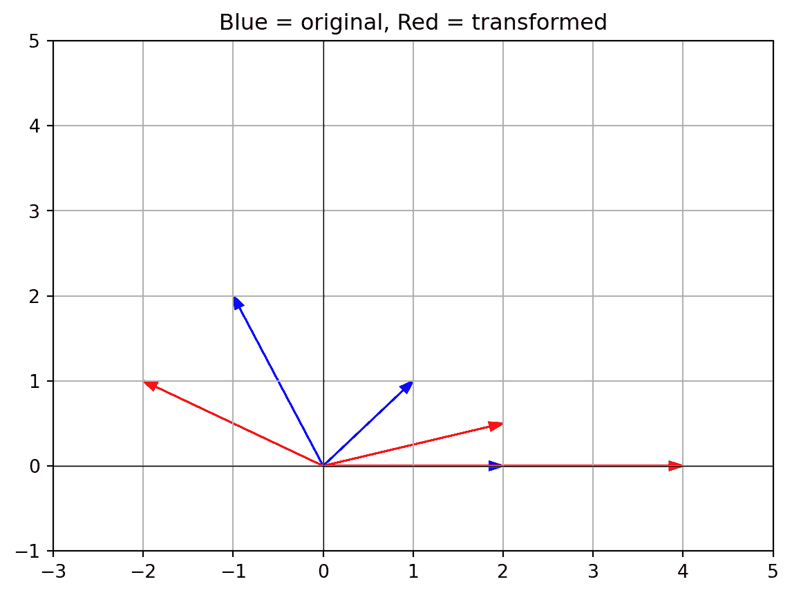*  *蓝色箭头是原始向量；红色箭头是变换后的向量。注意变换如何一致地拉伸和压缩。

1.  旋转作为线性变换

将向量旋转 $\theta = 90^\circ$：

```py
theta = np.pi/2
R = np.array([
 [np.cos(theta), -np.sin(theta)],
 [np.sin(theta),  np.cos(theta)]
])

v = np.array([1,0])
print("Rotate [1,0] by 90°:", R @ v)
```

*```py
Rotate [1,0] by 90°: [6.123234e-17 1.000000e+00]
```*  *结果是 $[0,1]$，一个完美的旋转。

1.  检查线性性

```py
u = np.array([1,2])
v = np.array([3,4])
c = 5

lhs = A @ (u+v)
rhs = A@u + A@v
print("Additivity holds?", np.allclose(lhs,rhs))

lhs = A @ (c*u)
rhs = c*(A@u)
print("Homogeneity holds?", np.allclose(lhs,rhs))
```

*```py
Additivity holds? True
Homogeneity holds? True
```*  *两次检查都返回 `True`，证明 $T$ 是线性的。

1.  非线性示例（用于对比）

类似于 $T(x,y) = (x², y)$ 的变换不是线性的。

```py
def nonlinear(v):
 return np.array([v[0]**2, v[1]])

print("T([2,3]) =", nonlinear(np.array([2,3])))
print("Check additivity:", nonlinear(np.array([1,2])+np.array([3,4])) == (nonlinear([1,2])+nonlinear([3,4])))
```

*```py
T([2,3]) = [4 3]
Check additivity: [False  True]
```*  *这未通过加法测试，所以它不是线性的。*****  ***#### 尝试自己来做

1.  定义一个剪切矩阵

    $$ S = \begin{bmatrix} 1 & 1 \\ 0 & 1 \end{bmatrix} $$

    应用到向量上并绘制前后对比。

1.  验证旋转 45° 的线性性。

1.  测试 $T(x,y) = (x+y, y)$ 是否是线性的。

#### 吸取的经验

+   线性变换保持向量加法和数乘。

+   每个线性变换都可以用矩阵表示。

+   用箭头可视化有助于建立几何直觉：拉伸、旋转和剪切都是线性的。****  ***### 42\. 线性映射的矩阵表示（选择基）

每个线性变换都可以写成矩阵的形式，但确切的矩阵取决于你选择的基。本实验展示了如何构建和解释矩阵表示。

#### 设置你的实验室

```py
import numpy as np
from sympy import Matrix
```

*#### 逐步代码讲解

1.  从变换到矩阵

假设 $T: \mathbb{R}² \to \mathbb{R}²$ 由以下定义：

$$ T(x,y) = (2x + y, \; x - y) $$

要找到其在标准基下的矩阵，将 $T$ 应用到每个基向量上：

```py
e1 = Matrix([1,0])
e2 = Matrix([0,1])

def T(v):
 x, y = v
 return Matrix([2*x + y, x - y])

print("T(e1):", T(e1))
print("T(e2):", T(e2))
```

*```py
T(e1): Matrix([[2], [1]])
T(e2): Matrix([[1], [-1]])
```*  *将结果作为列堆叠给出矩阵：

```py
A = Matrix.hstack(T(e1), T(e2))
print("Matrix representation in standard basis:\n", A)
```

*```py
Matrix representation in standard basis:
 Matrix([[2, 1], [1, -1]])
```*  *2.  使用矩阵进行计算

```py
v = Matrix([3,4])
print("T(v) via definition:", T(v))
print("T(v) via matrix:", A*v)
```

*```py
T(v) via definition: Matrix([[10], [-1]])
T(v) via matrix: Matrix([[10], [-1]])
```*  *两种方法都匹配。

1.  不同基下的矩阵

现在假设我们使用基

$$ B = \{ [1,1], [1,-1] \} $$

要用这个基表示 $T$：

1.  构建基变换矩阵 $P$。

1.  计算 $A_B = P^{-1}AP$。

```py
B = Matrix.hstack(Matrix([1,1]), Matrix([1,-1]))
P = B
A_B = P.inv() * A * P
print("Matrix representation in new basis:\n", A_B)
```

*```py
Matrix representation in new basis:
 Matrix([[3/2, 3/2], [3/2, -1/2]])
```*  *4.  解释

+   在标准基下，$A$ 告诉我们 $T$ 如何作用于单位向量。

+   在基 $B$ 中，$A_B$ 显示了当使用不同坐标描述 $T$ 时 $T$ 的样子。

1.  $\mathbb{R}³$ 中的随机线性映射

```py
np.random.seed(1)
A3 = Matrix(np.random.randint(-3,4,(3,3)))
print("Random transformation matrix:\n", A3)

B3 = Matrix.hstack(Matrix([1,0,1]), Matrix([0,1,1]), Matrix([1,1,0]))
A3_B = B3.inv() * A3 * B3
print("Representation in new basis:\n", A3_B)
```

*```py
Random transformation matrix:
 Matrix([[2, 0, 1], [-3, -2, 0], [2, -3, -3]])
Representation in new basis:
 Matrix([[5/2, -3/2, 3], [-7/2, -9/2, -4], [1/2, 5/2, -1]])
```*****  ***#### 尝试自己来做

1.  定义 $T(x,y) = (x+2y, 3x+y)$。找到其在标准基下的矩阵。

1.  使用新的基 $\{[2,0],[0,3]\}$。计算 $A_B$ 的表示。

1.  验证将 $T$ 直接应用于一个向量与通过 $A_B$ 和基变换计算相匹配。

#### 吸收要点

+   选择一个基后，线性变换就变成了矩阵表示。

+   矩阵的列 = 基础向量的像。

+   改变基会改变矩阵，但变换本身保持不变。****  ***### 43. 核和像（消失的输入；我们可以达到的输出）

任何线性变换 $T(x) = Ax$ 都可以用两个基本子空间来描述：

+   核（零空间）：所有满足 $Ax = 0$ 的向量 $x$。

+   像空间（列空间）：所有可能的输出 $Ax$。

核告诉我们哪些输入会塌缩为零，而像告诉我们哪些输出是可以实现的。

#### 设置你的实验室

```py
import numpy as np
from sympy import Matrix
```

*#### 逐步代码演示

1.  矩阵的核

考虑

$$ A = \begin{bmatrix} 1 & 2 & 3 \\ 2 & 4 & 6 \end{bmatrix} $$

```py
A = Matrix([
 [1,2,3],
 [2,4,6]
])

print("Null space (kernel):", A.nullspace())
```

*```py
Null space (kernel): [Matrix([
[-2],
[ 1],
[ 0]]), Matrix([
[-3],
[ 0],
[ 1]])]
```*  *零空间基显示了列之间的依赖关系。在这里，核是二维的，因为列是相关的。

1.  像空间（列空间）

```py
print("Column space (image):", A.columnspace())
print("Rank (dimension of image):", A.rank())
```

*```py
Column space (image): [Matrix([
[1],
[2]])]
Rank (dimension of image): 1
```*  *像由 $[1,2]^T$ 张成。所以 $A$ 的所有输出都是这个向量的倍数。

1.  解释

+   核向量 → 映射到零的方向。

+   像向量 → 我们实际上可以在输出空间中达到的方向。

如果 $x \in \ker(A)$，则 $Ax = 0$。如果 $b$ 不在像中，则系统 $Ax = b$ 没有解。

1.  全秩示例

```py
B = Matrix([
 [1,0,0],
 [0,1,0],
 [0,0,1]
])

print("Kernel of B:", B.nullspace())
print("Image of B:", B.columnspace())
```

*```py
Kernel of B: []
Image of B: [Matrix([
[1],
[0],
[0]]), Matrix([
[0],
[1],
[0]]), Matrix([
[0],
[0],
[1]])]
```*  **   核 = 只有零向量。

+   像空间 = $\mathbb{R}³$ 的全部。

1.  NumPy 版本（通过列空间得到的像）

```py
A = np.array([[1,2,3],[2,4,6]], dtype=float)
rank = np.linalg.matrix_rank(A)
print("Rank with NumPy:", rank)
```

*```py
Rank with NumPy: 1
```*  *NumPy 不直接计算零空间，但如果有需要，我们可以使用 SVD 来计算。****  ***#### 尝试自己来做

1.  计算以下矩阵的核和像

    $$ \begin{bmatrix} 1 & 1 \\ 1 & 1 \end{bmatrix} $$

    它们看起来是什么样子？

1.  随机取一个 3×4 矩阵，并找到其核和像的维度。

1.  解 $Ax = b$ 的矩阵 $A$。尝试两个不同的 $b$：一个在像内，一个在像外。观察差异。

#### 吸收要点

+   核 = 在 $A$ 下消失的输入。

+   像空间 = 通过 $A$ 可以达到的输出。

+   一起，它们完全描述了一个线性映射所做的工作：它“杀死”了什么，以及它“产生”了什么。****  ***### 44. 可逆性和同构（完美可逆映射）

如果一个矩阵（或线性映射）有一个逆 $A^{-1}$，那么它是可逆的，使得

$$ A^{-1}A = I \quad \text{和} \quad AA^{-1} = I $$

可逆映射也称为同构，因为它保留所有信息 - 每个输入都有一个确切的输出，每个输出都来自一个确切的输入。

#### 设置你的实验室

```py
import numpy as np
from sympy import Matrix
```

*#### 逐步代码演示

1.  检查可逆性

```py
A = Matrix([
 [2,1],
 [5,3]
])

print("Determinant:", A.det())
print("Is invertible?", A.det() != 0)
```

*```py
Determinant: 1
Is invertible? True
```*  *如果行列式 ≠ 0 → 可逆。

1.  计算逆

```py
A_inv = A.inv()
print("Inverse matrix:\n", A_inv)

print("Check A*A_inv = I:\n", A * A_inv)
```

*```py
Inverse matrix:
 Matrix([[3, -1], [-5, 2]])
Check A*A_inv = I:
 Matrix([[1, 0], [0, 1]])
```*  *3. 使用逆解系统

对于 $Ax = b$，如果 $A$ 是可逆的：

```py
b = Matrix([1,2])
x = A_inv * b
print("Solution x:", x)
```

*```py
Solution x: Matrix([[1], [-1]])
```*  *这相当于 SymPy 中的 `A.solve(b)` 或 NumPy 中的 `np.linalg.solve`。

1.  不可逆（奇异的）示例

```py
B = Matrix([
 [1,2],
 [2,4]
])

print("Determinant:", B.det())
print("Is invertible?", B.det() != 0)
```

*```py
Determinant: 0
Is invertible? False
```*  *行列式 = 0 → 无逆。矩阵将空间压缩到一条线，丢失信息。

1.  NumPy 版本

```py
A = np.array([[2,1],[5,3]], dtype=float)
print("Determinant:", np.linalg.det(A))
print("Inverse:\n", np.linalg.inv(A))
```

*```py
Determinant: 1.0000000000000002
Inverse:
 [[ 3\. -1.]
 [-5\.  2.]]
```*  *6.  几何直觉

+   可逆变换 = 可逆的（如旋转，非零缩放）。

+   不可逆变换 = 将空间压缩到较低维度（如将平面压扁到一条线上）。*****  ***#### 尝试自己动手

1.  测试是否

    $$ \begin{bmatrix} 1 & 0 \\ 0 & 1 \end{bmatrix} $$

    是可逆的并找到它的逆。

1.  计算一个 3×3 随机整数矩阵的行列式。如果它非零，找到它的逆。

1.  创建一个奇异的 3×3 矩阵（使一行是另一行的倍数）。确认它没有逆。

#### 吸收要点

+   可逆矩阵 ↔︎ 同构：完美可逆，没有信息丢失。

+   行列式 ≠ 0 → 可逆；行列式 = 0 → 矩阵奇异。

+   逆矩阵在概念上是有用的，但在计算中我们通常直接求解系统而不是计算 $A^{-1}$。****  ***### 45. 合成、幂和迭代（重复做）

线性变换可以串联起来。一个接一个地应用称为合成，在矩阵形式中这成为乘法。相同变换的重复应用导致矩阵的幂。

#### 设置您的实验室

```py
import numpy as np
from sympy import Matrix
```

*#### 逐步代码讲解

1.  变换的合成

假设我们有两个线性映射：

+   $T_1$: 旋转 90°

+   $T_2$: 将 x 缩放 2 倍

```py
theta = np.pi/2
R = np.array([
 [np.cos(theta), -np.sin(theta)],
 [np.sin(theta),  np.cos(theta)]
])
S = np.array([
 [2,0],
 [0,1]
])

# Compose: apply R then S
C = S @ R
print("Composite matrix:\n", C)
```

*```py
Composite matrix:
 [[ 1.2246468e-16 -2.0000000e+00]
 [ 1.0000000e+00  6.1232340e-17]]
```*  *应用组合矩阵相当于按顺序应用两个映射。

1.  用向量验证

```py
v = np.array([1,1])
step1 = R @ v
step2 = S @ step1
composite = C @ v

print("Step-by-step:", step2)
print("Composite:", composite)
```

*```py
Step-by-step: [-2\.  1.]
Composite: [-2\.  1.]
```*  *两个结果相同 → 合成 = 矩阵乘法。

1.  矩阵的幂

重复应用一个变换对应于矩阵的幂

示例：缩放 2 倍。

```py
A = np.array([[2,0],[0,2]])
v = np.array([1,1])

print("A @ v =", A @ v)
print("A² @ v =", np.linalg.matrix_power(A,2) @ v)
print("A⁵ @ v =", np.linalg.matrix_power(A,5) @ v)
```

*```py
A @ v = [2 2]
A² @ v = [4 4]
A⁵ @ v = [32 32]
```*  *每一步都会加倍缩放效果。

1.  迭代动力学

让我们多次迭代一个变换，看看会发生什么。

示例：

$$ A = \begin{bmatrix} 0.5 & 0 \\ 0 & 0.5 \end{bmatrix} $$

```py
A = np.array([[0.5,0],[0,0.5]])
v = np.array([4,4])

for i in range(5):
 v = A @ v
 print(f"Step {i+1}:", v)
```

*```py
Step 1: [2\. 2.]
Step 2: [1\. 1.]
Step 3: [0.5 0.5]
Step 4: [0.25 0.25]
Step 5: [0.125 0.125]
```*  *每一步都会缩小向量 → 迭代可以揭示稳定性。

1.  随机示例

```py
np.random.seed(0)
M = np.random.randint(-2,3,(2,2))
print("Random matrix:\n", M)

print("M²:\n", np.linalg.matrix_power(M,2))
print("M³:\n", np.linalg.matrix_power(M,3))
```

*```py
Random matrix:
 [[ 2 -2]
 [ 1  1]]
M²:
 [[ 2 -6]
 [ 3 -1]]
M³:
 [[ -2 -10]
 [  5  -7]]
```*****  ***#### 尝试自己动手

1.  创建两个变换：沿 x 轴的反射和缩放 3 倍。将它们组合。

1.  取一个剪切矩阵并计算 $A⁵$。重复应用后向量会发生什么？

1.  尝试一个旋转矩阵的更高次幂。你看到了什么周期？

#### 吸收要点

+   线性映射的合成 = 矩阵乘法。

+   矩阵的幂代表重复应用。

+   迭代揭示了长期动力学：收缩、增长或振荡行为。****  ***### 46. 相似性和共轭（相同动作，不同基）

如果存在一个可逆矩阵 $P$ 使得两个矩阵 $A$ 和 $B$ 相似，则称它们为相似。

$$ B = P^{-1} A P $$

这意味着 $A$ 和 $B$ 代表相同的线性变换，但在不同的基下。这个实验探讨了相似性及其重要性。

#### 设置您的实验室

```py
import numpy as np
from sympy import Matrix
```

*#### 逐步代码讲解

1.  基变换的示例

```py
A = Matrix([
 [2,1],
 [0,2]
])

P = Matrix([
 [1,1],
 [0,1]
])

B = P.inv() * A * P
print("Original A:\n", A)
print("Similar matrix B:\n", B)
```

*```py
Original A:
 Matrix([[2, 1], [0, 2]])
Similar matrix B:
 Matrix([[2, 1], [0, 2]])
```*  *在这里，$A$ 和 $B$ 是相似的：它们在不同的坐标系中描述了相同的变换。

1.  特征值保持不变

相似性保持特征值。

```py
print("Eigenvalues of A:", A.eigenvals())
print("Eigenvalues of B:", B.eigenvals())
```

*```py
Eigenvalues of A: {2: 2}
Eigenvalues of B: {2: 2}
```*  *尽管它们的条目不同，但两个矩阵具有相同的特征值。

1.  相似性和对角化

如果一个矩阵是可对角化的，那么存在 $P$ 使得

$$ D = P^{-1} A P $$

其中 $D$ 是对角矩阵。

```py
C = Matrix([
 [4,1],
 [0,2]
])

P, D = C.diagonalize()
print("Diagonal form D:\n", D)
print("Check similarity (P^-1 C P = D):\n", P.inv()*C*P)
```

*```py
Diagonal form D:
 Matrix([[2, 0], [0, 4]])
Check similarity (P^-1 C P = D):
 Matrix([[2, 0], [0, 4]])
```*  *对角化是相似性的特殊情况，其中新矩阵尽可能简单。

1.  NumPy 版本

```py
A = np.array([[2,1],[0,2]], dtype=float)
eigvals, eigvecs = np.linalg.eig(A)
print("Eigenvalues:", eigvals)
print("Eigenvectors (basis P):\n", eigvecs)
```

*```py
Eigenvalues: [2\. 2.]
Eigenvectors (basis P):
 [[ 1.0000000e+00 -1.0000000e+00]
 [ 0.0000000e+00  4.4408921e-16]]
```*  *在这里，特征向量形成基变换矩阵 $P$。

1.  几何解释

+   相似矩阵 = 相同的变换，不同的“尺子”（基）。

+   对角化 = 找到一个使变换看起来像沿轴纯拉伸的尺子。****  ***#### 尝试自己操作

1.  吸收要点

    $$ A = \begin{bmatrix} 1 & 1 \\ 0 & 1 \end{bmatrix} $$

    并找到一个矩阵 $P$，它给出相似的 $B$。

1.  证明两个相似矩阵具有相同的行列式和迹。

1.  对于一个随机的 3×3 矩阵，使用 SymPy 的 `.diagonalize()` 方法检查它是否可对角化。

#### 吸收要点

+   相似性 = 相同的线性映射，不同的基。

+   相似矩阵共享特征值、行列式和迹。

+   对角化是最简单的相似形式，使得重复计算（如幂运算）变得容易。****  ***### 47\. 投影和反射（幂等和自反映射）

两种非常常见的几何线性映射是投影和反射。它们出现在图形、物理和优化中。

+   投影将向量压缩到子空间（就像投下影子）。

+   反射将向量沿线或平面翻转（就像镜子一样）。

#### 设置您的实验室

```py
import numpy as np
from sympy import Matrix
import matplotlib.pyplot as plt
```

*#### 逐步代码分析

1.  投影到一条线上

如果我们想要投影到由 $u$ 张成的线上，投影矩阵是：

$$ P = \frac{uu^T}{u^T u} $$

```py
u = np.array([2,1], dtype=float)
u = u / np.linalg.norm(u)   # normalize
P = np.outer(u,u)

print("Projection matrix:\n", P)
```

*```py
Projection matrix:
 [[0.8 0.4]
 [0.4 0.2]]
```*  *应用投影：

```py
v = np.array([3,4], dtype=float)
proj_v = P @ v
print("Original v:", v)
print("Projection of v onto u:", proj_v)
```

*```py
Original v: [3\. 4.]
Projection of v onto u: [4\. 2.]
```*  *2.  投影的可视化

```py
plt.arrow(0,0,v[0],v[1],head_width=0.1,color="blue",length_includes_head=True)
plt.arrow(0,0,proj_v[0],proj_v[1],head_width=0.1,color="red",length_includes_head=True)
plt.arrow(proj_v[0],proj_v[1],v[0]-proj_v[0],v[1]-proj_v[1],head_width=0.1,color="gray",linestyle="dashed")

plt.axhline(0,color='black',linewidth=0.5)
plt.axvline(0,color='black',linewidth=0.5)
plt.grid()
plt.title("Blue = original, Red = projection, Gray = error vector")
plt.show()
```

*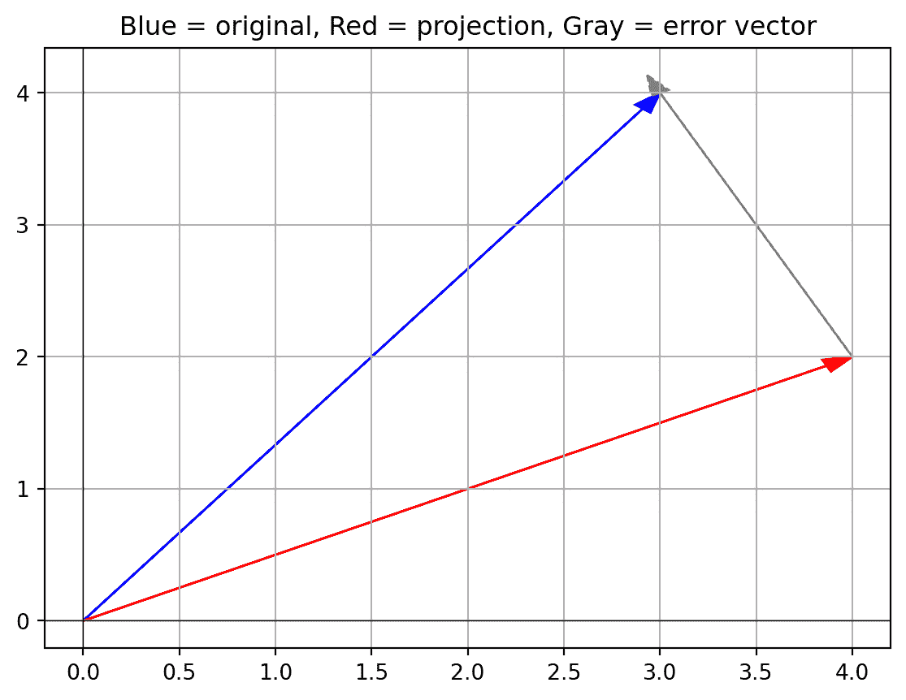*  *投影是原向量到直线上最近的一点。

1.  沿线反射

沿由 $u$ 张成的线的反射矩阵是：

$$ R = 2P - I $$

```py
I = np.eye(2)
R = 2*P - I

reflect_v = R @ v
print("Reflection of v across line u:", reflect_v)
```

*```py
Reflection of v across line u: [ 5.0000000e+00 -4.4408921e-16]
```*  *4.  检查代数属性

+   投影：$P² = P$（幂等）。

+   反射：$R² = I$（自反）。

```py
print("P² =\n", P @ P)
print("R² =\n", R @ R)
```

*```py
P² =
 [[0.8 0.4]
 [0.4 0.2]]
R² =
 [[ 1.00000000e+00 -1.59872116e-16]
 [-1.59872116e-16  1.00000000e+00]]
```*  *5.  高维投影

投影到由 $\mathbb{R}³$ 中的两个向量张成的平面上。

```py
u1 = np.array([1,0,0], dtype=float)
u2 = np.array([0,1,0], dtype=float)

U = np.column_stack((u1,u2))   # basis for plane
P_plane = U @ np.linalg.inv(U.T @ U) @ U.T

v = np.array([1,2,3], dtype=float)
proj_plane = P_plane @ v
print("Projection onto xy-plane:", proj_plane)
```

*```py
Projection onto xy-plane: [1\. 2\. 0.]
```******  ***#### 尝试自己操作

1.  将项目 $[4,5]$ 投影到 x 轴并验证结果。

1.  将 $[1,2]$ 反射到线 $y=x$ 上。

1.  创建一个随机的 3D 向量并将其投影到由 $[1,1,0]$ 和 $[0,1,1]$ 张成的平面上。

#### 吸收要点

+   投影：幂等的（$P² = P$），在子空间中找到最近的向量。

+   反射：自反的（$R² = I$），沿线/平面翻转但保持长度。

+   这两个都是简单但强大的线性变换示例，具有清晰的几何意义。****  ***### 48\. 旋转和剪切（几何直觉）

在几何、图形和物理学中经常使用的两种变换是旋转和拉伸。两者都是线性映射，但它们的行为不同：

+   旋转保持长度和角度。

+   拉伸保持面积（在 2D 中）但扭曲形状，将正方形变成平行四边形。

#### 设置您的实验室

```py
import numpy as np
import matplotlib.pyplot as plt
```

*#### 逐步代码讲解

1.  2D 中的旋转

角度为$\theta$的旋转矩阵是：

$$ R(\theta) = \begin{bmatrix} \cos\theta & -\sin\theta \\ \sin\theta & \cos\theta \end{bmatrix} $$

```py
def rotation_matrix(theta):
 return np.array([
 [np.cos(theta), -np.sin(theta)],
 [np.sin(theta),  np.cos(theta)]
 ])

theta = np.pi/4   # 45 degrees
R = rotation_matrix(theta)

v = np.array([2,1])
rotated_v = R @ v
print("Original v:", v)
print("Rotated v (45°):", rotated_v)
```

*```py
Original v: [2 1]
Rotated v (45°): [0.70710678 2.12132034]
```*  *2.  旋转的可视化

```py
plt.arrow(0,0,v[0],v[1],head_width=0.1,color="blue",length_includes_head=True)
plt.arrow(0,0,rotated_v[0],rotated_v[1],head_width=0.1,color="red",length_includes_head=True)

plt.axhline(0,color='black',linewidth=0.5)
plt.axvline(0,color='black',linewidth=0.5)
plt.grid()
plt.title("Blue = original, Red = rotated (45°)")
plt.axis("equal")
plt.show()
```

*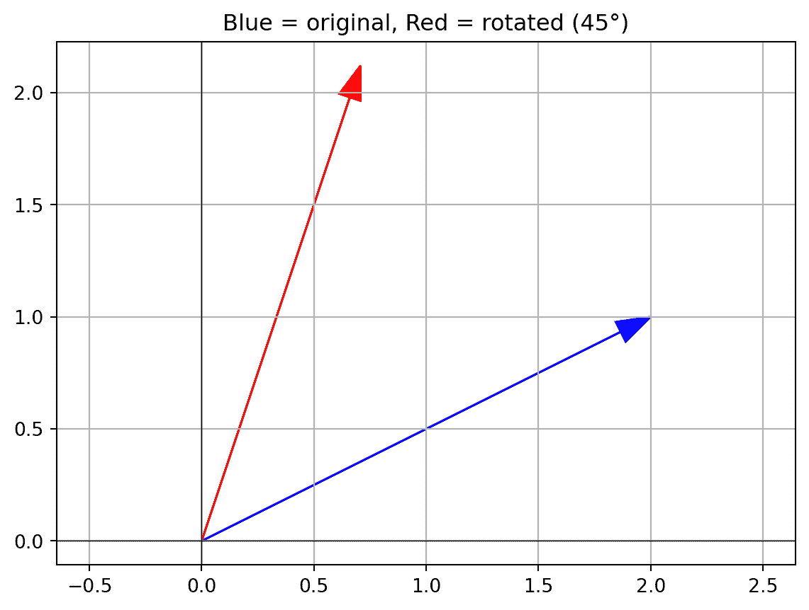*  *向量逆时针旋转 45°。

1.  2D 中的拉伸

沿 x 轴以因子$k$的拉伸：

$$ S = \begin{bmatrix} 1 & k \\ 0 & 1 \end{bmatrix} $$

```py
k = 1.0
S = np.array([
 [1,k],
 [0,1]
])

sheared_v = S @ v
print("Sheared v:", sheared_v)
```

*```py
Sheared v: [3\. 1.]
```*  *4.  拉伸的可视化

```py
plt.arrow(0,0,v[0],v[1],head_width=0.1,color="blue",length_includes_head=True)
plt.arrow(0,0,sheared_v[0],sheared_v[1],head_width=0.1,color="green",length_includes_head=True)

plt.axhline(0,color='black',linewidth=0.5)
plt.axvline(0,color='black',linewidth=0.5)
plt.grid()
plt.title("Blue = original, Green = sheared")
plt.axis("equal")
plt.show()
```

*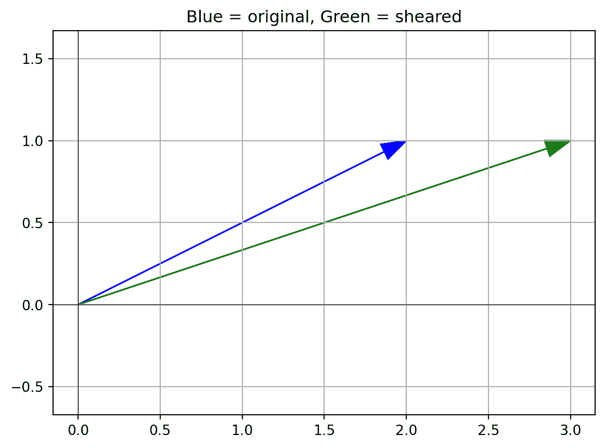*  *拉伸将向量侧向移动，扭曲其角度。

1.  属性检查

+   旋转保持长度：

```py
print("||v|| =", np.linalg.norm(v))
print("||R v|| =", np.linalg.norm(rotated_v))
```

*```py
||v|| = 2.23606797749979
||R v|| = 2.2360679774997894
```*  **   拉伸保持面积（行列式=1）：

```py
print("det(S) =", np.linalg.det(S))
```

*```py
det(S) = 1.0
```******  ***#### 尝试自己操作

1.  将$[1,0]$旋转 90°并检查它变成$[0,1]$。

1.  将$k=2$的拉伸应用于正方形（点$(0,0),(1,0),(1,1),(0,1)$）并绘制前后。

1.  结合旋转和拉伸：先应用拉伸，然后旋转。会发生什么？

#### 吸收要点

+   旋转：长度和角度保持，行列式=1。

+   拉伸：形状扭曲但面积保持，行列式=1。

+   这两种都是线性映射，提供了几何直觉和现实世界的建模工具。****  ***### 49. 秩和算子视角（秩超越消元）

矩阵的秩告诉我们线性映射携带了多少“信息”。从代数上讲，它是像（列空间）的维度。从几何上讲，它衡量了多少独立方向在变换中幸存下来。

从算子视角：

+   矩阵$A$不仅仅是一个数字表 - 它是一个线性算子，将向量映射到其他向量。

+   秩是$A$实际达到的输出空间的维度。

#### 设置您的实验室

```py
import numpy as np
from sympy import Matrix
```

*#### 逐步代码讲解

1.  通过消元（SymPy）计算秩

```py
A = Matrix([
 [1,2,3],
 [2,4,6],
 [1,1,1]
])

print("Matrix A:\n", A)
print("Rank of A:", A.rank())
```

*```py
Matrix A:
 Matrix([[1, 2, 3], [2, 4, 6], [1, 1, 1]])
Rank of A: 2
```*  *在这里，第二行是第一行的倍数→独立性降低→秩<3。

1.  通过 NumPy 计算秩

```py
A_np = np.array([[1,2,3],[2,4,6],[1,1,1]], dtype=float)
print("Rank (NumPy):", np.linalg.matrix_rank(A_np))
```

*```py
Rank (NumPy): 2
```*  *3.  算子视角

让我们应用$A$到随机向量：

```py
for v in [np.array([1,0,0]), np.array([0,1,0]), np.array([0,0,1])]:
 print("A @", v, "=", A_np @ v)
```

*```py
A @ [1 0 0] = [1\. 2\. 1.]
A @ [0 1 0] = [2\. 4\. 1.]
A @ [0 0 1] = [3\. 6\. 1.]
```*  *尽管我们开始于 3D，所有输出都位于$\mathbb{R}³$中的平面上。这就是为什么秩=2。

1.  满秩与降秩

+   满秩：变换保持维度（无塌陷）。

+   降秩：变换塌缩到更低维的子空间。

示例满秩：

```py
B = Matrix([
 [1,0,0],
 [0,1,0],
 [0,0,1]
])

print("Rank of B:", B.rank())
```

*```py
Rank of B: 3
```*  *5.  与零空间的连接

秩-零度定理：

$$ \text{rank}(A) + \text{nullity}(A) = A \text{的列数} $$

使用 SymPy 进行验证：

```py
print("Null space (basis):", A.nullspace())
print("Nullity:", len(A.nullspace()))
print("Rank + Nullity =", A.rank() + len(A.nullspace()))
```

*```py
Null space (basis): [Matrix([
[ 1],
[-2],
[ 1]])]
Nullity: 1
Rank + Nullity = 3
```*****  ***#### 尝试自己操作

1.  取

    $$ \begin{bmatrix} 1 & 1 \\ 1 & 1 \end{bmatrix} $$

    并计算其秩。为什么是 1？

1.  对于一个随机的 4×4 矩阵，使用`np.linalg.matrix_rank`检查它是否可逆。

1.  验证 3×5 随机整数矩阵的秩-零度定理。

#### 吸收要点

+   秩 = 像空间的维度（变换有多少个独立输出）。

+   操作员视角：秩表示变换后输入空间中保留了多少部分。

+   秩-零度联系了像空间和核空间 - 它们共同完全描述了一个线性算子。****  ***### 50. 分块矩阵和分块映射（分而治之结构）

有时矩阵可以排列成块（子矩阵）。将大矩阵视为更小的部分有助于简化计算，尤其是在具有结构（网络、联合方程或分区变量）的系统。

#### 设置您的实验室

```py
import numpy as np
from sympy import Matrix
```

*#### 逐步代码讲解

1.  构建分块矩阵

我们可以从更小的部分构建分块矩阵：

```py
A11 = Matrix([[1,2],[3,4]])
A12 = Matrix([[5,6],[7,8]])
A21 = Matrix([[9,10]])
A22 = Matrix([[11,12]])

# Combine into a block matrix
A = Matrix.vstack(
 Matrix.hstack(A11, A12),
 Matrix.hstack(A21, A22)
)
print("Block matrix A:\n", A)
```

*```py
Block matrix A:
 Matrix([[1, 2, 5, 6], [3, 4, 7, 8], [9, 10, 11, 12]])
```*  *2. 分块乘法

如果一个矩阵被分成块，乘法遵循分块规则：

$$ \begin{bmatrix} A & B \\ C & D \end{bmatrix} \begin{bmatrix} x \\ y \end{bmatrix} = \begin{bmatrix} Ax + By \\ Cx + Dy \end{bmatrix} $$

示例：

```py
A = Matrix([
 [1,2,5,6],
 [3,4,7,8],
 [9,10,11,12]
])

x = Matrix([1,1,2,2])
print("A * x =", A*x)
```

*```py
A * x = Matrix([[25], [37], [65]])
```*  *这里向量被分成块 $[x,y]$。

1.  分块对角矩阵

分块对角矩阵 = 独立子问题：

```py
B1 = Matrix([[2,0],[0,2]])
B2 = Matrix([[3,1],[0,3]])

BlockDiag = Matrix([
 [2,0,0,0],
 [0,2,0,0],
 [0,0,3,1],
 [0,0,0,3]
])

print("Block diagonal matrix:\n", BlockDiag)
```

*```py
Block diagonal matrix:
 Matrix([[2, 0, 0, 0], [0, 2, 0, 0], [0, 0, 3, 1], [0, 0, 0, 3]])
```*  *应用此矩阵分别对每个块进行操作 - 像是并行运行两个较小的变换。

1.  分块对角矩阵的逆

分块对角矩阵的逆矩阵就是逆矩阵的分块对角矩阵：

```py
B1_inv = B1.inv()
B2_inv = B2.inv()
BlockDiagInv = Matrix([
 [B1_inv[0,0],0,0,0],
 [0,B1_inv[1,1],0,0],
 [0,0,B2_inv[0,0],B2_inv[0,1]],
 [0,0,B2_inv[1,0],B2_inv[1,1]]
])
print("Inverse block diag:\n", BlockDiagInv)
```

*```py
Inverse block diag:
 Matrix([[1/2, 0, 0, 0], [0, 1/2, 0, 0], [0, 0, 1/3, -1/9], [0, 0, 0, 1/3]])
```*  *5. 实际例子 - 联合方程

假设我们有两个独立系统：

+   系统 1: $Ax = b$

+   系统 2: $Cy = d$

我们可以同时表示它们：

$$ \begin{bmatrix} A & 0 \\ 0 & C \end{bmatrix} \begin{bmatrix} x \\ y \end{bmatrix} = \begin{bmatrix} b \\ d \end{bmatrix} $$

这显示了分块矩阵如何在一个大方程中组织多个系统。****  ***#### 尝试自己操作

1.  构建一个由三个 2×2 块组成的分块对角矩阵。将其应用于一个向量。

1.  通过手动计算 $Ax + By$ 和 $Cx + Dy$ 来验证分块乘法规则。

1.  编写两个小方程组并将它们组合成一个分块方程组。

#### 吸收要点

+   分块矩阵允许我们将大系统分解成更小的部分。

+   分块对角矩阵 = 独立子系统。

+   以块为单位思考简化了代数、编程和数值计算。*******************************  ***## 第六章. 矩阵行列式和体积

### 51. 面积、体积和符号缩放因子（几何入口点）

矩阵的行列式具有深刻的几何意义：它告诉我们线性变换如何缩放面积（在 2D 中）、体积（在 3D 中）或更高维度的内容。它还可以翻转方向（符号）。

#### 设置您的实验室

```py
import numpy as np
from sympy import Matrix
```

*#### 逐步代码讲解

1.  2D 中的行列式（面积缩放）

让我们以一个拉伸和剪切矩阵为例：

```py
A = Matrix([
 [2,1],
 [1,1]
])

print("Determinant:", A.det())
```

*```py
Determinant: 1
```*  *行列式 = 1 → 面积得到保留，即使形状被扭曲。

1.  变换下的单位正方形

将顶点为 $(0,0),(1,0),(1,1),(0,1)$ 的正方形进行变换：

```py
square = Matrix([
 [0,0],
 [1,0],
 [1,1],
 [0,1]
])

transformed = (A * square.T).T
print("Original square:\n", square)
print("Transformed square:\n", transformed)
```

*```py
Original square:
 Matrix([[0, 0], [1, 0], [1, 1], [0, 1]])
Transformed square:
 Matrix([[0, 0], [2, 1], [3, 2], [1, 1]])
```*  *变换后形状的面积等于 $|\det(A)|$。

1.  3D 中的行列式（体积缩放）

```py
B = Matrix([
 [1,2,0],
 [0,1,0],
 [0,0,3]
])

print("Determinant:", B.det())
```

*```py
Determinant: 3
```*  *$\det(B)=3$ 表示体积被缩放为 3。

1.  负行列式 = 旋转

```py
C = Matrix([
 [0,1],
 [1,0]
])

print("Determinant:", C.det())
```

*```py
Determinant: -1
```*  *行列式 = -1 → 面积保持但方向翻转（就像镜子反射）。

1.  NumPy 版本

```py
A = np.array([[2,1],[1,1]], dtype=float)
print("Det (NumPy):", np.linalg.det(A))
```

*```py
Det (NumPy): 1.0
```*****  ***#### 尝试自己操作

1.  取

    $$ \begin{bmatrix} 3 & 0 \\ 0 & 2 \end{bmatrix} $$

    并计算行列式。验证它通过 6 缩放面积。

1.  构建一个 3×3 的剪切矩阵并检查它如何影响体积。

1.  测试一个反射矩阵并确认行列式是负的。

#### **总结**

+   行列式衡量线性映射如何缩放面积、体积或超体积。

+   正行列式 = 保持方向；负行列式 = 翻转它。

+   行列式的幅度 = 几何内容的缩放因子。****  ***### 52. 通过线性规则计算行列式（多线性、符号、归一化）

行列式不仅仅是一个公式；它由三个优雅的规则定义，使其独一无二。这些规则捕捉了其作为体积缩放因子的几何意义。

1.  多线性：对每一行（或列）是线性的。

1.  符号变化：交换两行会改变符号。

1.  归一化：单位矩阵的行列式是 1。

#### 设置你的实验室

```py
import numpy as np
from sympy import Matrix
```

*#### 逐步代码分析

1.  多线性

如果一行被缩放，行列式也会以相同的方式缩放。

```py
A = Matrix([[1,2],[3,4]])
print("det(A):", A.det())

B = Matrix([[2,4],[3,4]])  # first row doubled
print("det(B):", B.det())
```

*```py
det(A): -2
det(B): -4
```*  *你会看到 `det(B) = 2 * det(A)`。

1.  行交换引起的符号变化

```py
C = Matrix([[1,2],[3,4]])
C_swapped = Matrix([[3,4],[1,2]])

print("det(C):", C.det())
print("det(C_swapped):", C_swapped.det())
```

*```py
det(C): -2
det(C_swapped): 2
```*  *交换行会改变行列式的符号。

1.  归一化规则

```py
I = Matrix.eye(3)
print("det(I):", I.det())
```

*```py
det(I): 1
```*  *单位矩阵的行列式总是 1 - 这固定了缩放基线。

1.  规则组合（3×3 中的示例）

```py
M = Matrix([[1,2,3],[4,5,6],[7,8,9]])
print("det(M):", M.det())
```

*```py
det(M): 0
```*  *在这里，行是线性相关的，所以行列式是 0 - 与多线性一致（因为一行可以写成其他行的组合）。

1.  NumPy 检查

```py
A = np.array([[1,2],[3,4]], dtype=float)
print("det(A) NumPy:", np.linalg.det(A))
```

*```py
det(A) NumPy: -2.0000000000000004
```*  *SymPy 和 NumPy 确认了相同的结果。*****  ***#### 尝试自己操作

1.  将一个 3×3 矩阵的行乘以 3。确认行列式乘以 3。

1.  连续两次交换两行 - 行列式会回到原始值吗？

1.  计算三角矩阵的行列式。你看到了什么模式？

#### **总结**

+   行列式由多线性、符号变化和归一化定义。

+   这些规则独特地确定了行列式的行为。

+   每个公式（余子式展开、行简化法等）都源于这些核心原则。****  ***### 53. 行列式与行操作（每个操作如何改变 det）

行操作是高斯消元法的心脏，行列式对这些操作有简单、可预测的反应。理解这些反应既提供了计算捷径，又提供了几何直觉。

#### 三条关键规则

1.  行交换：交换两行会改变行列式的符号。

1.  行缩放：将一行乘以标量 $c$ 会将行列式乘以 $c$。

1.  行替换：将一行的一个倍数加到另一行上不会改变行列式。

#### 设置你的实验室

```py
import numpy as np
from sympy import Matrix
```

*#### 逐步代码分析

1.  行交换

```py
A = Matrix([[1,2],[3,4]])
print("det(A):", A.det())

A_swapped = Matrix([[3,4],[1,2]])
print("det(after swap):", A_swapped.det())
```

*```py
det(A): -2
det(after swap): 2
```*  *结果会改变符号。

1.  行缩放

```py
B = Matrix([[1,2],[3,4]])
B_scaled = Matrix([[2,4],[3,4]])  # first row × 2

print("det(B):", B.det())
print("det(after scaling row 1 by 2):", B_scaled.det())
```

*```py
det(B): -2
det(after scaling row 1 by 2): -4
```*  *行列式乘以 2。

1.  行替换（无变化）

```py
C = Matrix([[1,2],[3,4]])
C_replaced = Matrix([[1,2],[3-2*1, 4-2*2]])  # row2 → row2 - 2*row1

print("det(C):", C.det())
print("det(after row replacement):", C_replaced.det())
```

*```py
det(C): -2
det(after row replacement): -2
```*  *行列式保持不变。

1.  三角形式快捷方式

由于消元只使用行替换（这不会改变行列式）和行交换/缩放（我们可以跟踪），三角矩阵的行列式就是其对角元素的乘积。

```py
D = Matrix([[2,1,3],[0,4,5],[0,0,6]])
print("det(D):", D.det())
print("Product of diagonals:", 2*4*6)
```

*```py
det(D): 48
Product of diagonals: 48
```*  *5.  NumPy 验证

```py
A = np.array([[1,2,3],[0,4,5],[1,0,6]], dtype=float)
print("det(A):", np.linalg.det(A))
```

*```py
det(A): 22.000000000000004
```*****  ***#### 尝试自己操作

1.  取

    $$ \begin{bmatrix} 2 & 3 \\ 4 & 6 \end{bmatrix} $$

    并将第二行缩放为 $\tfrac{1}{2}$。比较缩放前后的行列式。

1.  对一个 3×3 矩阵进行高斯消元，并跟踪每一行操作如何改变行列式。

1.  通过将矩阵化为三角形式来计算行列式，并与 SymPy 的 `.det()` 进行比较。

#### 吸收要点

+   行列式对行操作的反应是可预测的。

+   行替换是“安全的”（无变化），缩放乘以因子，交换改变符号。

+   这使得消元不仅是一个求解工具，而且是一种计算行列式的高效方法。****  ***### 54. 三角矩阵和对角线乘积（快速取胜）

对于三角矩阵（上三角或下三角），行列式就是对角元素的乘积。这是线性代数中最大的捷径之一——无需展开或消元。

#### 为什么它有效

+   三角矩阵已经看起来像是高斯消元的最终结果。

+   由于行替换操作不会改变行列式，剩下的只是对角线的乘积。

#### 设置您的实验室

```py
import numpy as np
from sympy import Matrix
```

*#### 逐步代码解析

1.  上三角示例

```py
A = Matrix([
 [2,1,3],
 [0,4,5],
 [0,0,6]
])

print("det(A):", A.det())
print("Product of diagonals:", 2*4*6)
```

*```py
det(A): 48
Product of diagonals: 48
```*  *两个值完全匹配。

1.  下三角示例

```py
B = Matrix([
 [7,0,0],
 [2,5,0],
 [3,4,9]
])

print("det(B):", B.det())
print("Product of diagonals:", 7*5*9)
```

*```py
det(B): 315
Product of diagonals: 315
```*  *3.  对角矩阵（特殊情况）

对于对角矩阵，行列式等于对角元素的乘积。

```py
C = Matrix.diag(3,5,7)
print("det(C):", C.det())
print("Product of diagonals:", 3*5*7)
```

*```py
det(C): 105
Product of diagonals: 105
```*  *4.  NumPy 版本

```py
A = np.array([[2,1,3],[0,4,5],[0,0,6]], dtype=float)
print("det(A):", np.linalg.det(A))
print("Product of diagonals:", np.prod(np.diag(A)))
```

*```py
det(A): 47.999999999999986
Product of diagonals: 48.0
```*  *5.  快速消元到三角形式

即使是非三角矩阵，消元也会将它们化为三角形式，此时该规则适用。

```py
D = Matrix([[1,2,3],[4,5,6],[7,8,10]])
print("det(D) via SymPy:", D.det())
print("det(D) via LU decomposition:", D.LUdecomposition()[0].det() * D.LUdecomposition()[1].det())
```

*```py
det(D) via SymPy: -3
det(D) via LU decomposition: -3
```*****  ***#### 尝试自己操作

1.  快速计算 4×4 对角矩阵的行列式。

1.  验证对角线上有零的三角矩阵的行列式总是为 0。

1.  使用 SymPy 检查消元到三角形式是否保持行列式（除了交换/缩放）。

#### 吸收要点

+   对于三角（和对角）矩阵：

    $$ \det(A) = \prod_{i} a_{ii} $$

+   这个捷径使得行列式计算变得非常简单。

+   高斯消元利用了这个事实：一旦化为三角形式，行列式就是对角元素的乘积（考虑交换的符号调整）。****  ***### 55. det(AB) = det(A)det(B)（乘法魔法）

行列式最优雅的性质之一是乘法性：

$$ \det(AB) = \det(A)\,\det(B) $$

这条规则非常强大，因为它将代数（矩阵乘法）与几何（体积缩放）联系起来。

#### 几何直觉

+   如果 $A$ 通过因子 $\det(A)$ 缩放体积，而 $B$ 通过 $\det(B)$ 缩放体积，那么先应用 $B$ 再应用 $A$ 将体积缩放为 $\det(A)\det(B)$。

+   这个性质在所有维度上都适用。

#### 设置您的实验室

```py
import numpy as np
from sympy import Matrix
```

*#### 逐步代码解析

1.  2×2 示例

```py
A = Matrix([[2,1],[0,3]])
B = Matrix([[1,4],[2,5]])

detA = A.det()
detB = B.det()
detAB = (A*B).det()

print("det(A):", detA)
print("det(B):", detB)
print("det(AB):", detAB)
print("det(A)*det(B):", detA*detB)
```

*```py
det(A): 6
det(B): -3
det(AB): -18
det(A)*det(B): -18
```*  *两个结果匹配。

1.  3×3 随机矩阵检查

```py
np.random.seed(1)
A = Matrix(np.random.randint(-3,4,(3,3)))
B = Matrix(np.random.randint(-3,4,(3,3)))

print("det(A):", A.det())
print("det(B):", B.det())
print("det(AB):", (A*B).det())
print("det(A)*det(B):", A.det()*B.det())
```

*```py
det(A): 25
det(B): -15
det(AB): -375
det(A)*det(B): -375
```*  *3.  特殊情况

+   如果 $\det(A)=0$，则 $\det(AB)=0$。

+   如果 $\det(A)=\pm1$，它就像一个“体积保持”的变换（旋转/反射）。

```py
A = Matrix([[1,0],[0,0]])  # singular
B = Matrix([[2,3],[4,5]])

print("det(A):", A.det())
print("det(AB):", (A*B).det())
```

*```py
det(A): 0
det(AB): 0
```*  *两个都是 0。

1.  NumPy 版本

```py
A = np.array([[2,1],[0,3]], dtype=float)
B = np.array([[1,4],[2,5]], dtype=float)

lhs = np.linalg.det(A @ B)
rhs = np.linalg.det(A) * np.linalg.det(B)

print("det(AB) =", lhs)
print("det(A)*det(B) =", rhs)
```

*```py
det(AB) = -17.999999999999996
det(A)*det(B) = -17.999999999999996
```****  ***#### 尝试自己操作

1.  构造两个三角形矩阵并验证乘法性（对角线乘积也相乘）。

1.  使用正交矩阵 $Q$ ($\det(Q)=\pm 1$) 测试该属性。会发生什么？

1.  用一个奇异的矩阵尝试 - 确认乘积总是奇异的。

#### 总结

+   行列式是乘法的，而不是加法的。

+   $\det(AB) = \det(A)\det(B)$ 是线性代数中的一个基石恒等式。

+   这个属性将几何（体积缩放）与代数（矩阵乘法）联系起来。****  ***### 56. 可逆性和零行列式（平坦与满体积）

行列式为可逆性提供了一个快速测试：

+   如果 $\det(A) \neq 0$，则矩阵是可逆的。

+   如果 $\det(A) = 0$，则矩阵是奇异的（不可逆的）。

几何上：

+   非零行列式 → 变换保持完整维度（无塌缩）。

+   零行列式 → 变换将空间压扁到更低维度（体积 = 0）。

#### 设置您的实验室

```py
import numpy as np
from sympy import Matrix
from sympy.matrices.common import NonInvertibleMatrixError
```

*#### 逐步代码解析

1.  可逆示例

```py
A = Matrix([[2,1],[5,3]])
print("det(A):", A.det())
print("Inverse exists?", A.det() != 0)
print("A inverse:\n", A.inv())
```

*```py
det(A): 1
Inverse exists? True
A inverse:
 Matrix([[3, -1], [-5, 2]])
```*  *行列式非零 → 可逆。

1.  奇异示例（零行列式）

```py
B = Matrix([[1,2],[2,4]])
print("det(B):", B.det())
print("Inverse exists?", B.det() != 0)
```

*```py
det(B): 0
Inverse exists? False
```*  *由于第二行是第一行的倍数，行列式 = 0 → 无逆。

1.  通过行列式检查求解系统

如果 $\det(A)=0$，则系统 $Ax=b$ 可能没有解或有无限多个解。

```py
# 3\. Solving systems with determinant check
b = Matrix([1,2])
try:
 print("Solve Ax=b with singular B:", B.solve(b))
except NonInvertibleMatrixError as e:
 print("Error when solving Ax=b:", e)
```

*```py
Error when solving Ax=b: Matrix det == 0; not invertible.
```*  *SymPy 指示不一致或多个解。

1.  高维示例

```py
C = Matrix([
 [1,0,0],
 [0,2,0],
 [0,0,3]
])
print("det(C):", C.det())
print("Invertible?", C.det() != 0)
```

*```py
det(C): 6
Invertible? True
```*  *对角线元素全部非零 → 可逆。

1.  NumPy 版本

```py
A = np.array([[2,1],[5,3]], dtype=float)
print("det(A):", np.linalg.det(A))
print("Inverse:\n", np.linalg.inv(A))

B = np.array([[1,2],[2,4]], dtype=float)
print("det(B):", np.linalg.det(B))
# np.linalg.inv(B) would fail because det=0
```

*```py
det(A): 1.0000000000000002
Inverse:
 [[ 3\. -1.]
 [-5\.  2.]]
det(B): 0.0
```*****  ***#### 尝试自己操作

1.  通过使一行成为另一行的倍数来构建一个行列式为 0 的 3×3 矩阵。确认奇异性。

1.  生成一个随机的 4×4 矩阵并使用 `.det()` 检查它是否可逆。

1.  测试两个不同的 2×2 矩阵是否可逆，然后将它们相乘 - 积也是可逆的吗？

#### 总结

+   $\det(A) \neq 0 \implies$ 可逆（满体积）。

+   $\det(A) = 0 \implies$ 奇异（空间塌缩）。

+   行列式为矩阵何时可逆提供了代数和几何的洞察。****  ***### 57. 余子式展开（拉普拉斯方法）

余子式展开是使用余子矩阵系统地计算行列式的方法。它对于大矩阵来说并不高效，但它揭示了行列式的递归结构。

#### 定义

对于一个 $n \times n$ 的矩阵 $A$，

$$ \det(A) = \sum_{j=1}^{n} (-1)^{i+j} a_{ij} \det(M_{ij}) $$

其中：

+   $i$ = 选择行（或列），

+   $M_{ij}$ = 删除行 $i$ 和列 $j$ 后的余子矩阵。

#### 设置您的实验室

```py
import numpy as np
from sympy import Matrix, symbols
```

*#### 逐步代码解析

1.  2×2 情况（基本规则）

```py
# declare symbols
a, b, c, d = symbols('a b c d')

# build the matrix
A = Matrix([[a, b],[c, d]])

# compute determinant
detA = A.det()
print("Determinant 2x2:", detA)
```

*```py
Determinant 2x2: a*d - b*c
```*  *公式：$\det(A) = ad - bc$。

1.  使用余子式展开的 3×3 示例

```py
A = Matrix([
 [1,2,3],
 [4,5,6],
 [7,8,9]
])

detA = A.det()
print("Determinant via SymPy:", detA)
```

*```py
Determinant via SymPy: 0
```*  *让我们手动沿着第一行计算：

```py
cofactor_expansion = (
 1 * Matrix([[5,6],[8,9]]).det()
 - 2 * Matrix([[4,6],[7,9]]).det()
 + 3 * Matrix([[4,5],[7,8]]).det()
)
print("Cofactor expansion result:", cofactor_expansion)
```

*```py
Cofactor expansion result: 0
```*  *两个匹配（这里 = 0，因为行是相关的）。

1.  沿不同行/列展开

无论你沿哪一行/列展开，结果都是相同的。

```py
cofactor_col1 = (
 1 * Matrix([[2,3],[8,9]]).det()
 - 4 * Matrix([[2,3],[5,6]]).det()
 + 7 * Matrix([[2,3],[5,6]]).det()
)
print("Expansion along col1:", cofactor_col1)
```

*```py
Expansion along col1: -15
```*  *4.  更大的例子（4×4）

```py
B = Matrix([
 [2,0,1,3],
 [1,2,0,4],
 [0,1,1,0],
 [3,0,2,1]
])

print("Determinant 4x4:", B.det())
```

*```py
Determinant 4x4: -15
```*  *SymPy 直接处理，但从概念上讲，它仍然是相同的递归展开。

1.  NumPy 与 SymPy

```py
B_np = np.array([[2,0,1,3],[1,2,0,4],[0,1,1,0],[3,0,2,1]], dtype=float)
print("NumPy determinant:", np.linalg.det(B_np))
```

*```py
NumPy determinant: -15.0
```******  ***#### 尝试自己操作

1.  使用余子式展开手动计算 3×3 行列式，并用 `.det()` 进行确认。

1.  沿不同的行展开并检查结果是否不变。

1.  构建一个 4×4 对角矩阵并展开它 - 你注意到了什么简化？

#### 吸取的经验

+   余子式展开定义行列式为递归形式。

+   在任何行或列上操作，结果都是一致的。

+   虽然对证明和理论很重要，但对于大型矩阵的计算来说并不实用。****  ***### 58. 排列与符号（组合核心）

矩阵的行列式也可以通过索引的排列来定义。这看起来很抽象，但这是最基本的规定：

$$ \det(A) = \sum_{\sigma \in S_n} \text{sgn}(\sigma) \prod_{i=1}^n a_{i,\sigma(i)} $$

+   $S_n$ = $\{1,\dots,n\}$ 的所有排列的集合

+   $\text{sgn}(\sigma)$ = 如果排列是偶数，则 +1，如果是奇数，则 -1

+   每项 = 一个元素的乘积，每个元素来自每一行和每一列

这个公式解释了为什么行列式会混合符号，为什么行交换会翻转行列式，以及为什么相关性会使其消失。

#### 设置你的实验室

```py
import itertools
import numpy as np
from sympy import Matrix
```

*#### 逐步代码讲解

1.  行列式通过排列展开（3×3）

```py
def determinant_permutation(A):
 n = A.shape[0]
 total = 0
 for perm in itertools.permutations(range(n)):
 sign = (-1)**(sum(1 for i in range(n) for j in range(i) if perm[j] > perm[i]))
 product = 1
 for i in range(n):
 product *= A[i, perm[i]]
 total += sign * product
 return total

A = np.array([[1,2,3],
 [4,5,6],
 [7,8,9]])

print("Permutation formula det:", determinant_permutation(A))
print("NumPy det:", np.linalg.det(A))
```

*```py
Permutation formula det: 0
NumPy det: -9.51619735392994e-16
```*  *两个结果 ≈ 0，因为行是相关的。

1.  计算排列数

对于 $n=3$，有 $3! = 6$ 项：

$$ \det(A) = a_{11}a_{22}a_{33} + a_{12}a_{23}a_{31} + a_{13}a_{21}a_{32} - a_{13}a_{22}a_{31} - a_{11}a_{23}a_{32} - a_{12}a_{21}a_{33} $$

你可以明确看到交替的符号。

1.  使用 SymPy 进行验证

```py
M = Matrix([[2,1,0],
 [1,3,4],
 [0,2,5]])
print("SymPy det:", M.det())
```

*```py
SymPy det: 9
```*  *与排列展开匹配。

1.  项的增长

+   2×2 → 2 项

+   3×3 → 6 项

+   4×4 → 24 项

+   $n$ → $n!$ 项（阶乘增长！）

这就是为什么在计算上更倾向于使用余子式或 LU 分解。**  **#### 尝试自己操作

1.  明确写出 2×2 排列公式的具体形式，并检查它是否等于 $ad - bc$。

1.  用六个项手动展开 3×3 行列式。

1.  修改代码以计算使用排列定义所需的 5×5 矩阵的乘法次数。

#### 吸取的经验

+   行列式 = 所有排列的符号和。

+   符号来自排列的奇偶性（偶数/奇数交换）。

+   这个定义是统一所有行列式性质的组合基础。***  ***### 59. 克莱姆法则（使用行列式求解，以及何时不使用它）

克莱姆法则给出了使用行列式求解线性方程组 $Ax = b$ 的显式公式。它很优雅，但对于大型系统来说效率不高。

对于 $A \in \mathbb{R}^{n \times n}$ 且 $\det(A) \neq 0$：

$$ x_i = \frac{\det(A_i)}{\det(A)} $$

其中 $A_i$ 是 $A$ 的第 $i$ 列被 $b$ 替换后的矩阵。

#### 设置你的实验室

```py
import numpy as np
from sympy import Matrix
```

*#### 逐步代码讲解

1.  简单的 2×2 示例

解：

$$ \begin{cases} 2x + y = 5 \\ x - y = 1 \end{cases} $$

```py
A = Matrix([[2,1],[1,-1]])
b = Matrix([5,1])

detA = A.det()
print("det(A):", detA)

# Replace columns
A1 = A.copy()
A1[:,0] = b
A2 = A.copy()
A2[:,1] = b

x1 = A1.det() / detA
x2 = A2.det() / detA
print("Solution via Cramer's Rule:", [x1, x2])

# Check with built-in solver
print("SymPy solve:", A.LUsolve(b))
```

*```py
det(A): -3
Solution via Cramer's Rule: [2, 1]
SymPy solve: Matrix([[2], [1]])
```*  *两者给出相同的解。

1.  3×3 示例

```py
A = Matrix([
 [1,2,3],
 [0,1,4],
 [5,6,0]
])
b = Matrix([7,8,9])

detA = A.det()
print("det(A):", detA)

solutions = []
for i in range(A.shape[1]):
 Ai = A.copy()
 Ai[:,i] = b
 solutions.append(Ai.det()/detA)

print("Solution via Cramer's Rule:", solutions)
print("SymPy solve:", A.LUsolve(b))
```

*```py
det(A): 1
Solution via Cramer's Rule: [21, -16, 6]
SymPy solve: Matrix([[21], [-16], [6]])
```*  *3.  NumPy 版本（效率低但具有说明性）

```py
A = np.array([[2,1],[1,-1]], dtype=float)
b = np.array([5,1], dtype=float)

detA = np.linalg.det(A)

solutions = []
for i in range(A.shape[1]):
 Ai = A.copy()
 Ai[:,i] = b
 solutions.append(np.linalg.det(Ai)/detA)

print("Solution:", solutions)
```

*```py
Solution: [np.float64(2.0000000000000004), np.float64(1.0)]
```*  *4.  为什么在实践中不使用它？

+   需要计算$n+1$个行列式。

+   通过余子式展开计算行列式是阶乘时间的。

+   高斯消元法或 LU 分解要高效得多。***  ***#### 尝试自己操作

1.  使用柯西法则解 3×3 系统，并使用`A.solve(b)`进行确认。

1.  当$\det(A)=0$时尝试柯西法则。会发生什么？

1.  比较随机 5×5 矩阵的柯西法则和 LU 分解的运行时间。

#### 吸取的教训

+   柯西法则给出了使用行列式的解的显式公式。

+   对于理论来说很美，对于小案例来说很有用，但计算上并不实用。

+   它突出了行列式与求解线性系统之间的深层联系。****  ***### 60. 实际计算行列式（使用 LU，注意稳定性）

虽然像余子式展开和排列这样的定义很美，但对于大型矩阵来说太慢了。实际上，行列式是通过行简化或 LU 分解来计算的，同时注意数值稳定性。

#### 设置您的实验室

```py
import numpy as np
from sympy import Matrix
```

*#### 逐步代码讲解

1.  余子式展开太慢

```py
A = Matrix([
 [1,2,3],
 [4,5,6],
 [7,8,10]
])
print("det via cofactor expansion:", A.det())
```

*```py
det via cofactor expansion: -3
```*  *这适用于 3×3，但复杂性呈阶乘增长。

1.  通过三角形式（LU 分解）计算行列式

LU 分解将$A = LU$分解，其中$L$是下三角矩阵，$U$是上三角矩阵。行列式等于$U$对角线的乘积，考虑到行交换的符号修正。

```py
L, U, perm = A.LUdecomposition()
detA = A.det()
print("L:\n", L)
print("U:\n", U)
print("Permutation matrix:\n", perm)
print("det via LU product:", detA)
```

*```py
L:
 Matrix([[1, 0, 0], [4, 1, 0], [7, 2, 1]])
U:
 Matrix([[1, 2, 3], [0, -3, -6], [0, 0, 1]])
Permutation matrix:
 []
det via LU product: -3
```*  *3.  NumPy 高效方法

```py
A_np = np.array([[1,2,3],[4,5,6],[7,8,10]], dtype=float)
print("NumPy det:", np.linalg.det(A_np))
```

*```py
NumPy det: -3.000000000000001
```*  *NumPy 使用优化例程（底层是 LAPACK）。

1.  大型随机矩阵

```py
np.random.seed(0)
B = np.random.rand(5,5)
print("NumPy det (5x5):", np.linalg.det(B))
```

*```py
NumPy det (5x5): 0.009658225505885114
```*  *即使对于较大的矩阵也能快速计算。

1.  稳定性问题

大型或病态矩阵的行列式可能会受到浮点误差的影响。例如，如果行几乎相关：

```py
C = np.array([[1,2,3],[2,4.0000001,6],[3,6,9]], dtype=float)
print("det(C):", np.linalg.det(C))
```

*```py
det(C): -4.996003624823549e-23
```*  *由于浮点近似，结果可能不会正好是 0。*****  ***#### 尝试自己操作

1.  使用`np.linalg.det`计算随机 10×10 矩阵的行列式。

1.  比较 SymPy（精确有理数算术）和 NumPy（浮点数）的结果。

1.  测试接近奇异矩阵的行列式 - 注意数值不稳定性。

#### 吸取的教训

+   实际上，行列式是通过 LU 分解或等效方法计算的。

+   总是注意数值稳定性 - 当行列式≈0 时，小误差很重要。

+   对于精确答案（小案例），使用符号工具如 SymPy；对于速度，使用 NumPy。*******************************  ***## 第七章. 特征值、特征向量和动力学

### 61. 特征值和特征向量（保持不变的方向）

矩阵$A$的特征向量是一个特殊的向量，当乘以$A$时不会改变方向。相反，它只被一个称为特征值的标量拉伸或收缩。

形式上：

$$ A v = \lambda v $$

其中$v$是特征向量，$\lambda$是特征值。

几何上：特征向量是线性变换的“首选方向”。

#### 设置您的实验室

```py
import numpy as np
from sympy import Matrix
```

*#### 逐步代码讲解

1.  一个简单的 2×2 例子

```py
A = Matrix([
 [2,1],
 [1,2]
])

eigs = A.eigenvects()
print("Eigenvalues and eigenvectors:", eigs)
```

*```py
Eigenvalues and eigenvectors: [(1, 1, [Matrix([
[-1],
[ 1]])]), (3, 1, [Matrix([
[1],
[1]])])]
```*  *这输出了特征值及其相关的特征向量。

1.  验证特征方程

选择一个特征对 $(\lambda, v)$：

```py
lam = eigs[0][0]
v = eigs[0][2][0]
print("Check Av = λv:", A*v, lam*v)
```

*```py
Check Av = λv: Matrix([[-1], [1]]) Matrix([[-1], [1]])
```*  *两边匹配 → 确认特征对。

1.  NumPy 版本

```py
A_np = np.array([[2,1],[1,2]], dtype=float)
eigvals, eigvecs = np.linalg.eig(A_np)

print("Eigenvalues:", eigvals)
print("Eigenvectors:\n", eigvecs)
```

*```py
Eigenvalues: [3\. 1.]
Eigenvectors:
 [[ 0.70710678 -0.70710678]
 [ 0.70710678  0.70710678]]
```*  *`eigvecs`的列是特征向量。

1.  几何解释（绘图）

```py
import matplotlib.pyplot as plt

v1 = np.array(eigvecs[:,0])
v2 = np.array(eigvecs[:,1])

plt.arrow(0,0,v1[0],v1[1],head_width=0.1,color="blue",length_includes_head=True)
plt.arrow(0,0,v2[0],v2[1],head_width=0.1,color="red",length_includes_head=True)

plt.axhline(0,color="black",linewidth=0.5)
plt.axvline(0,color="black",linewidth=0.5)
plt.axis("equal")
plt.grid()
plt.title("Eigenvectors: directions that stay put")
plt.show()
```

*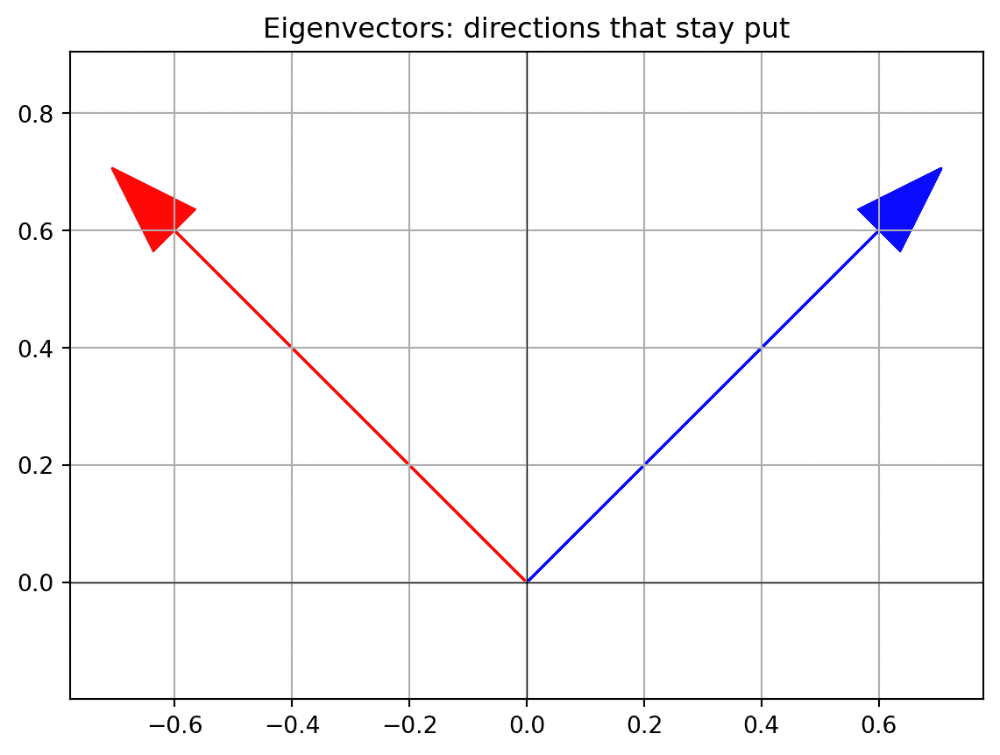*  *两个特征向量定义了仅通过缩放进行变换的方向。

1.  随机 3×3 矩阵示例

```py
np.random.seed(1)
B = Matrix(np.random.randint(-2,3,(3,3)))
print("Matrix B:\n", B)
print("Eigenvalues/vectors:", B.eigenvects())
```

*```py
Matrix B:
 Matrix([[1, 2, -2], [-1, 1, -2], [-2, -1, 2]])
Eigenvalues/vectors: [(4/3 + (-1/2 - sqrt(3)*I/2)*(2*sqrt(43)/3 + 127/27)**(1/3) + 13/(9*(-1/2 - sqrt(3)*I/2)*(2*sqrt(43)/3 + 127/27)**(1/3)), 1, [Matrix([
[ -16/27 - 91/(81*(-1/2 - sqrt(3)*I/2)*(2*sqrt(43)/3 + 127/27)**(1/3)) + (4/3 + (-1/2 - sqrt(3)*I/2)*(2*sqrt(43)/3 + 127/27)**(1/3) + 13/(9*(-1/2 - sqrt(3)*I/2)*(2*sqrt(43)/3 + 127/27)**(1/3)))**2/9 - 7*(-1/2 - sqrt(3)*I/2)*(2*sqrt(43)/3 + 127/27)**(1/3)/9],
[50/27 + 5*(-1/2 - sqrt(3)*I/2)*(2*sqrt(43)/3 + 127/27)**(1/3)/9 - 2*(4/3 + (-1/2 - sqrt(3)*I/2)*(2*sqrt(43)/3 + 127/27)**(1/3) + 13/(9*(-1/2 - sqrt(3)*I/2)*(2*sqrt(43)/3 + 127/27)**(1/3)))**2/9 + 65/(81*(-1/2 - sqrt(3)*I/2)*(2*sqrt(43)/3 + 127/27)**(1/3))],
[                                                                                                                                                                                                                                                              1]])]), (4/3 + 13/(9*(-1/2 + sqrt(3)*I/2)*(2*sqrt(43)/3 + 127/27)**(1/3)) + (-1/2 + sqrt(3)*I/2)*(2*sqrt(43)/3 + 127/27)**(1/3), 1, [Matrix([
[ -16/27 - 7*(-1/2 + sqrt(3)*I/2)*(2*sqrt(43)/3 + 127/27)**(1/3)/9 + (4/3 + 13/(9*(-1/2 + sqrt(3)*I/2)*(2*sqrt(43)/3 + 127/27)**(1/3)) + (-1/2 + sqrt(3)*I/2)*(2*sqrt(43)/3 + 127/27)**(1/3))**2/9 - 91/(81*(-1/2 + sqrt(3)*I/2)*(2*sqrt(43)/3 + 127/27)**(1/3))],
[50/27 + 65/(81*(-1/2 + sqrt(3)*I/2)*(2*sqrt(43)/3 + 127/27)**(1/3)) - 2*(4/3 + 13/(9*(-1/2 + sqrt(3)*I/2)*(2*sqrt(43)/3 + 127/27)**(1/3)) + (-1/2 + sqrt(3)*I/2)*(2*sqrt(43)/3 + 127/27)**(1/3))**2/9 + 5*(-1/2 + sqrt(3)*I/2)*(2*sqrt(43)/3 + 127/27)**(1/3)/9],
[                                                                                                                                                                                                                                                              1]])]), (13/(9*(2*sqrt(43)/3 + 127/27)**(1/3)) + 4/3 + (2*sqrt(43)/3 + 127/27)**(1/3), 1, [Matrix([
[  -7*(2*sqrt(43)/3 + 127/27)**(1/3)/9 - 16/27 - 91/(81*(2*sqrt(43)/3 + 127/27)**(1/3)) + (13/(9*(2*sqrt(43)/3 + 127/27)**(1/3)) + 4/3 + (2*sqrt(43)/3 + 127/27)**(1/3))**2/9],
[-2*(13/(9*(2*sqrt(43)/3 + 127/27)**(1/3)) + 4/3 + (2*sqrt(43)/3 + 127/27)**(1/3))**2/9 + 65/(81*(2*sqrt(43)/3 + 127/27)**(1/3)) + 5*(2*sqrt(43)/3 + 127/27)**(1/3)/9 + 50/27],
[                                                                                                                                                                           1]])])]
```*****  ***#### 尝试自己动手做

1.  计算以下矩阵的特征值和特征向量

    $$ \begin{bmatrix} 3 & 0 \\ 0 & 2 \end{bmatrix} $$

    并验证它们与对角线项相匹配。

1.  使用 NumPy 找到旋转矩阵 90°的特征向量。你注意到什么？

1.  对于一个奇异矩阵，检查 0 是否为特征值。

#### **总结**

+   特征值 = 缩放因子；特征向量 = 保持不变的方向。

+   特征方程 $Av=\lambda v$ 捕捉了矩阵作用的本质。

+   它们是深入主题如对角化、稳定性和动力学的基础。****  ***### 62. 特征多项式（特征值从何而来）

特征值不是凭空出现的 - 它们来自矩阵的特征多项式。对于一个方阵 $A$，

$$ p(\lambda) = \det(A - \lambda I) $$

这个多项式的根是矩阵 $A$ 的特征值。

#### 设置您的实验室

```py
import numpy as np
from sympy import Matrix, symbols
```

*#### 逐步代码讲解

1.  2×2 示例

$$ A = \begin{bmatrix} 2 & 1 \\ 1 & 2 \end{bmatrix} $$

```py
λ = symbols('λ')
A = Matrix([[2,1],[1,2]])
char_poly = A.charpoly(λ)
print("Characteristic polynomial:", char_poly.as_expr())
print("Eigenvalues (roots):", char_poly.all_roots())
```

*```py
Characteristic polynomial: λ**2 - 4*λ + 3
Eigenvalues (roots): [1, 3]
```*  *多项式：$\lambda² - 4\lambda + 3$。根：$\lambda = 3, 1$。

1.  通过特征值计算验证

```py
print("Eigenvalues directly:", A.eigenvals())
```

*```py
Eigenvalues directly: {3: 1, 1: 1}
```*  *与多项式的根相匹配。

1.  3×3 示例

```py
B = Matrix([
 [1,2,3],
 [0,1,4],
 [5,6,0]
])

char_poly_B = B.charpoly(λ)
print("Characteristic polynomial of B:", char_poly_B.as_expr())
print("Eigenvalues of B:", char_poly_B.all_roots())
```

*```py
Characteristic polynomial of B: λ**3 - 2*λ**2 - 38*λ - 1
Eigenvalues of B: [CRootOf(x**3 - 2*x**2 - 38*x - 1, 0), CRootOf(x**3 - 2*x**2 - 38*x - 1, 1), CRootOf(x**3 - 2*x**2 - 38*x - 1, 2)]
```*  *4.  NumPy 版本

NumPy 不直接给出多项式，但可以检查特征值：

```py
B_np = np.array([[1,2,3],[0,1,4],[5,6,0]], dtype=float)
eigvals = np.linalg.eigvals(B_np)
print("NumPy eigenvalues:", eigvals)
```

*```py
NumPy eigenvalues: [-5.2296696  -0.02635282  7.25602242]
```*  *5.  与迹和行列式的关联

对于一个 2×2 矩阵

$$ A = \begin{bmatrix} a & b \\ c & d \end{bmatrix}, $$

特征多项式是

$$ \lambda² - (a+d)\lambda + (ad - bc). $$

+   $\lambda$的系数：$-\text{trace}(A)$。

+   常数项：$\det(A)$。

```py
print("Trace:", A.trace())
print("Determinant:", A.det())
```

*```py
Trace: 4
Determinant: 3
```*****  ***#### 尝试自己动手做

1.  计算以下矩阵的特征多项式

    $$ \begin{bmatrix} 4 & 0 \\ 0 & 5 \end{bmatrix} $$

    并确认特征值为 4 和 5。

1.  检查 3×3 情况中多项式系数、迹和行列式之间的关系。

1.  通过 NumPy 验证多项式的根等于特征值。

#### **总结**

+   特征多项式将特征值编码为其根。

+   系数与不变量相关联：迹和行列式。

+   这种多项式观点是代数公式到几何特征行为的桥梁。****  ***### 63. 代数重数与几何重数（多少和多少是独立的）

特征值可以重复，当它们重复时，会引发两种多重性的概念：

+   代数重数：特征值作为特征多项式的根出现的次数。

+   几何重数：特征空间的维度（独立特征向量的数量）。

总是：

$$ 1 \leq \text{几何重数} \leq \text{代数重数} $$

#### 设置您的实验室

```py
import numpy as np
from sympy import Matrix
```

*#### 逐步代码解析

1.  具有重复特征值的矩阵

```py
A = Matrix([
 [2,1],
 [0,2]
])

print("Eigenvalues and algebraic multiplicity:", A.eigenvals())
print("Eigenvectors:", A.eigenvects())
```

*```py
Eigenvalues and algebraic multiplicity: {2: 2}
Eigenvectors: [(2, 2, [Matrix([
[1],
[0]])])]
```*  **特征值 2 的代数重数 = 2。

+   但只有一个独立的特征向量 → 几何重数 = 1。

1.  重复对角矩阵

```py
B = Matrix([
 [3,0,0],
 [0,3,0],
 [0,0,3]
])

print("Eigenvalues:", B.eigenvals())
print("Eigenvectors:", B.eigenvects())
```

*```py
Eigenvalues: {3: 3}
Eigenvectors: [(3, 3, [Matrix([
[1],
[0],
[0]]), Matrix([
[0],
[1],
[0]]), Matrix([
[0],
[0],
[1]])])]
```*  *在这里，特征值 3 的代数重数为 3，几何重数也为 3。

1.  NumPy 检查

```py
A_np = np.array([[2,1],[0,2]], dtype=float)
eigvals, eigvecs = np.linalg.eig(A_np)
print("Eigenvalues:", eigvals)
print("Eigenvectors:\n", eigvecs)
```

*```py
Eigenvalues: [2\. 2.]
Eigenvectors:
 [[ 1.0000000e+00 -1.0000000e+00]
 [ 0.0000000e+00  4.4408921e-16]]
```*  *NumPy 不会直接显示重数，但你可以看到重复的特征值。

1.  比较两种情况

+   缺陷矩阵：代数重数 > 几何重数（如上三角矩阵 $A$）。

+   可对角化矩阵：代数重数 = 几何重数（如 $B$）。

这种区别决定了矩阵是否可以对角化。***  ***#### 尝试自己操作

1.  计算以下矩阵的代数重数和几何重数

    $$ \begin{bmatrix} 1 & 1 \\ 0 & 1 \end{bmatrix} $$

    （提示：只有一个特征向量）。

1.  考虑一个具有重复项的对角矩阵——重数会发生什么变化？

1.  测试一个随机的 3×3 非奇异矩阵。0 的代数重数是否大于 1？

#### **总结**

+   代数重数 = 特征多项式中根的计数。

+   几何重数 = 特征空间的维度。

+   如果对于所有特征值都匹配 → 矩阵是对角化的。****  ***### 64. 对角化（当矩阵变得简单）

如果矩阵 $A$ 可以写成

$$ A = P D P^{-1} $$

+   $D$ 是对角矩阵（包含特征值）。

+   $P$ 的列是特征向量。

这意味着 $A$ 在一个“更好”的坐标系中表现为简单的缩放。

#### 设置您的实验室

```py
import numpy as np
from sympy import Matrix
```

*#### 逐步代码解析

1.  一个可对角化的 2×2 矩阵

```py
A = Matrix([
 [4,1],
 [2,3]
])

P, D = A.diagonalize()
print("P (eigenvectors):")
print(P)
print("D (eigenvalues on diagonal):")
print(D)

# Verify A = P D P^-1
print("Check:", P*D*P.inv())
```

*```py
P (eigenvectors):
Matrix([[-1, 1], [2, 1]])
D (eigenvalues on diagonal):
Matrix([[2, 0], [0, 5]])
Check: Matrix([[4, 1], [2, 3]])
```*  *2.  不可对角化矩阵

```py
B = Matrix([
 [2,1],
 [0,2]
])

try:
 P, D = B.diagonalize()
 print("Diagonalization successful")
except Exception as e:
 print("Not diagonalizable:", e)
```

*```py
Not diagonalizable: Matrix is not diagonalizable
```*  *这失败是因为特征值 2 的代数重数为 2 但几何重数为 1。

1.  使用 NumPy 进行对角化

NumPy 不会显式地进行对角化，但我们可以自己构建 $P$ 和 $D$：

```py
A_np = np.array([[4,1],[2,3]], dtype=float)
eigvals, eigvecs = np.linalg.eig(A_np)

P = eigvecs
D = np.diag(eigvals)
Pinv = np.linalg.inv(P)

print("Check A = PDP^-1:\n", P @ D @ Pinv)
```

*```py
Check A = PDP^-1:
 [[4\. 1.]
 [2\. 3.]]
```*  *4.  可对角化矩阵的幂

对角化强大的一个原因：

$$ A^k = P D^k P^{-1} $$

由于 $D^k$ 是平凡的（只需将每个对角元素提升到 $k$ 次幂）。

```py
k = 5

A_power = np.linalg.matrix_power(A, k)
D_power = np.linalg.matrix_power(D, k)
A_via_diag = P @ D_power @ np.linalg.inv(P)

print("A⁵ via diagonalization:\n", A_via_diag)
print("Direct A⁵:\n", A_power)
```

*```py
A⁵ via diagonalization:
 [[2094\. 1031.]
 [2062\. 1063.]]
Direct A⁵:
 [[2094 1031]
 [2062 1063]]
```*  *两者匹配。****  ***#### 尝试自己操作

1.  检查以下

    $$ \begin{bmatrix} 5 & 0 \\ 0 & 5 \end{bmatrix} $$

    是可对角化的。

1.  尝试通过 90° 旋转矩阵进行对角化。你会得到复数特征值吗？

1.  验证 3×3 可对角化矩阵的公式 $A^k = P D^k P^{-1}$。

#### **总结**

+   对角化将矩阵重写为其最简形式。

+   如果有足够的独立特征向量，则有效。

+   它使 $A$ 的幂变得简单，并且是分析动力学的入门。****  ***### 65. 矩阵的幂（通过特征值的长时行为）

最有用的特征值和对角化应用之一是计算矩阵的幂：

$$ A^k = P D^k P^{-1} $$

其中 $D$ 是对角矩阵，具有 $A$ 的特征值。每个特征值 $\lambda$ 的 $k$ 次幂决定了其特征向量方向随时间增长、衰减或振荡的方式。

#### 设置您的实验室

```py
import numpy as np
from sympy import Matrix
```

*#### 逐步代码解析

1.  简单的对角矩阵

如果 $D = \text{diag}(2,3)$:

```py
D = Matrix([[2,0],[0,3]])
print("D⁵ =")
print(D**5)
```

*```py
D⁵ =
Matrix([[32, 0], [0, 243]])
```*  *特征值为 2 和 3。提高到 5 次幂只是将每个特征值提高到 5 次方：$2⁵, 3⁵$。

1.  非对角矩阵

```py
A = Matrix([
 [4,1],
 [2,3]
])

P, D = A.diagonalize()
print("D (eigenvalues):")
print(D)

# Compute A¹⁰ via diagonalization
A10 = P * (D**10) * P.inv()
print("A¹⁰ =")
print(A10)
```

*```py
D (eigenvalues):
Matrix([[2, 0], [0, 5]])
A¹⁰ =
Matrix([[6510758, 3254867], [6509734, 3255891]])
```*  *比乘以 $A$ 十次容易得多！

1.  NumPy 版本

```py
A_np = np.array([[4,1],[2,3]], dtype=float)
eigvals, eigvecs = np.linalg.eig(A_np)

k = 10
D_power = np.diag(eigvals**k)
A10_np = eigvecs @ D_power @ np.linalg.inv(eigvecs)

print("A¹⁰ via eigen-decomposition:\n", A10_np)
```

*```py
A¹⁰ via eigen-decomposition:
 [[6510758\. 3254867.]
 [6509734\. 3255891.]]
```*  *4.  长期行为

特征值告诉我们当 $k \to \infty$ 时会发生什么：

+   如果 $|\lambda| < 1$ → 衰减到 0。

+   如果 $|\lambda| > 1$ → 无限增长。

+   如果 $|\lambda| = 1$ → 振荡或稳定。

```py
B = Matrix([
 [0.5,0],
 [0,1.2]
])

P, D = B.diagonalize()
print("Eigenvalues:", D)
print("B²⁰:", P*(D**20)*P.inv())
```

*```py
Eigenvalues: Matrix([[0.500000000000000, 0], [0, 1.20000000000000]])
B²⁰: Matrix([[9.53674316406250e-7, 0], [0, 38.3375999244747]])
```*  *在这里，沿着特征值 0.5 的分量衰减，而特征值 1.2 增加。****  ***#### 尝试自己操作

1.  计算具有特征值 0.9 和 1.1 的对角矩阵的 $A^{50}$。哪个分量占主导地位？

1.  对一个随机（马尔可夫）矩阵进行幂运算。行是否稳定？

1.  尝试复数特征值（如旋转）并检查幂是否振荡。

#### 吸收要点

+   使用特征值时，矩阵幂运算很简单。

+   长期动力学由特征值幅度控制。

+   这种洞察在马尔可夫链、稳定性分析和动力系统中至关重要。****  ***### 66. 实数谱与复数谱（旋转和振荡）

并非所有特征值都是实数。一些矩阵，特别是涉及旋转的矩阵，具有复数特征值。复数特征值通常描述系统中的振荡或旋转。

#### 设置您的实验室

```py
import numpy as np
from sympy import Matrix
```

*#### 逐步代码讲解

1.  2D 中的旋转矩阵

90° 旋转矩阵：

$$ R = \begin{bmatrix} 0 & -1 \\ 1 & 0 \end{bmatrix} $$

```py
R = Matrix([[0, -1],
 [1,  0]])

print("Characteristic polynomial:", R.charpoly())
print("Eigenvalues:", R.eigenvals())
```

*```py
Characteristic polynomial: PurePoly(lambda**2 + 1, lambda, domain='ZZ')
Eigenvalues: {-I: 1, I: 1}
```*  *结果：特征值为 $i$ 和 $-i$（纯虚数）。

1.  使用复数验证特征方程

```py
eigs = R.eigenvects()
for eig in eigs:
 lam = eig[0]
 v = eig[2][0]
 print(f"λ = {lam}, Av = {R*v}, λv = {lam*v}")
```

*```py
λ = -I, Av = Matrix([[-1], [-I]]), λv = Matrix([[-1], [-I]])
λ = I, Av = Matrix([[-1], [I]]), λv = Matrix([[-1], [I]])
```*  *3.  NumPy 版本

```py
R_np = np.array([[0,-1],[1,0]], dtype=float)
eigvals, eigvecs = np.linalg.eig(R_np)
print("Eigenvalues:", eigvals)
print("Eigenvectors:\n", eigvecs)
```

*```py
Eigenvalues: [0.+1.j 0.-1.j]
Eigenvectors:
 [[0.70710678+0.j         0.70710678-0.j        ]
 [0\.        -0.70710678j 0\.        +0.70710678j]]
```*  *NumPy 使用 `j`（Python 的虚数单位）显示复数特征值。

1.  任意角度的旋转

一般 2D 旋转：

$$ R(\theta) = \begin{bmatrix} \cos\theta & -\sin\theta \\ \sin\theta & \cos\theta \end{bmatrix} $$

特征值：

$$ \lambda = e^{\pm i\theta} = \cos\theta \pm i\sin\theta $$

```py
theta = np.pi/4  # 45 degrees
R_theta = np.array([[np.cos(theta), -np.sin(theta)],
 [np.sin(theta),  np.cos(theta)]])

eigvals, eigvecs = np.linalg.eig(R_theta)
print("Eigenvalues (rotation 45°):", eigvals)
```

*```py
Eigenvalues (rotation 45°): [0.70710678+0.70710678j 0.70710678-0.70710678j]
```*  *5.  振荡洞察

+   复数特征值 $|\lambda|=1$ → 纯振荡（无增长）。

+   如果 $|\lambda|<1$ → 衰减螺旋。

+   如果 $|\lambda|>1$ → 增长螺旋。

示例：

```py
A = np.array([[0.8, -0.6],
 [0.6,  0.8]])

eigvals, _ = np.linalg.eig(A)
print("Eigenvalues:", eigvals)
```

*```py
Eigenvalues: [0.8+0.6j 0.8-0.6j]
```*  *这些特征值位于单位圆内 → 螺旋衰减。*****  ***#### 尝试自己操作

1.  计算旋转 180° 的特征值。会发生什么？

1.  修改旋转矩阵以包含缩放（例如，乘以 1.1）。特征值是否位于单位圆外？

1.  绘制重复应用旋转矩阵到向量的轨迹。

#### 吸收要点

+   复数特征值自然出现在旋转和振荡系统中。

+   它们的幅度控制增长或衰减；它们的角控制振荡。

+   这是线性代数与物理学和工程学中的动力学的关键联系。****  ***### 67. 破坏矩阵和一瞥约当形式（当对角化失败时）

并非每个矩阵都有足够的独立特征向量来进行对角化。这样的矩阵被称为病态矩阵。为了处理它们，数学家使用约当标准形，它通过额外的结构扩展了对角化。

#### 设置您的实验室

```py
import numpy as np
from sympy import Matrix
```

*#### 逐步代码解析

1.  一个病态例子

$$ A = \begin{bmatrix} 2 & 1 \\ 0 & 2 \end{bmatrix} $$

```py
A = Matrix([[2,1],
 [0,2]])

print("Eigenvalues:", A.eigenvals())
print("Eigenvectors:", A.eigenvects())
```

*```py
Eigenvalues: {2: 2}
Eigenvectors: [(2, 2, [Matrix([
[1],
[0]])])]
```*  **   特征值 2 的代数重数 = 2。

+   只存在 1 个特征向量 → 几何重数 = 1。

因此 $A$ 是病态的，不可对角化。

1.  尝试对角化

```py
try:
 P, D = A.diagonalize()
 print("Diagonal form:", D)
except Exception as e:
 print("Diagonalization failed:", e)
```

*```py
Diagonalization failed: Matrix is not diagonalizable
```*  *你会看到一个错误 - 确认 $A$ 不可对角化。

1.  使用 SymPy 的约当形式

```py
J, P = A.jordan_form()
print("Jordan form J:")
print(J)
print("P (generalized eigenvectors):")
print(P)
```

*```py
Jordan form J:
Matrix([[1, 0], [0, 1]])
P (generalized eigenvectors):
Matrix([[2, 1], [0, 2]])
```*  *约当形式显示一个约当块：

$$ J = \begin{bmatrix} 2 & 1 \\ 0 & 2 \end{bmatrix} $$

这个块结构代表了对角化的失败。

1.  NumPy 视角

NumPy 不计算约当形式，但您可以看到重复的特征值和缺乏特征向量：

```py
A_np = np.array([[2,1],[0,2]], dtype=float)
eigvals, eigvecs = np.linalg.eig(A_np)
print("Eigenvalues:", eigvals)
print("Eigenvectors:\n", eigvecs)
```

*```py
Eigenvalues: [2\. 2.]
Eigenvectors:
 [[ 1.0000000e+00 -1.0000000e+00]
 [ 0.0000000e+00  4.4408921e-16]]
```*  *特征向量矩阵的独立列数少于预期。

1.  广义特征向量

约当形式引入了广义特征向量，它们满足：

$$ (A - \lambda I)^k v = 0 \quad \text{for some } k>1 $$

当普通特征向量不足时，它们“填补了空白”。****  ***#### 尝试自己操作

1.  测试对角化的

    $$ \begin{bmatrix} 3 & 1 \\ 0 & 3 \end{bmatrix} $$

    并将其与它的约当形式进行比较。

1.  尝试一个 3×3 的病态矩阵，其中有一个 3 大小的约当块。

1.  验证约当块仍然捕获正确的特征值。

#### 吸收要点

+   病态矩阵缺乏足够的特征向量来进行对角化。

+   约当形式用块代替对角化，保持特征值在主对角线上。

+   理解约当块对于高级线性代数和微分方程至关重要。****  ***### 68. 稳定性和谱半径（增长、衰减或振荡）

矩阵 $A$ 的谱半径定义为

$$ \rho(A) = \max_i |\lambda_i| $$

其中 $\lambda_i$ 是特征值。它告诉我们 $A$ 的重复应用的长远行为：

+   如果 $\rho(A) < 1$ → $A$ 的幂趋于 0（稳定/衰减）。

+   如果 $\rho(A) = 1$ → 幂既不会爆炸也不会消失（中性，可能振荡）。

+   如果 $\rho(A) > 1$ → 幂发散（不稳定/增长）。

#### 设置您的实验室

```py
import numpy as np
from sympy import Matrix
```

*#### 逐步代码解析

1.  稳定矩阵 ($\rho < 1$)

```py
A = np.array([[0.5, 0],
 [0, 0.3]])

eigvals = np.linalg.eigvals(A)
spectral_radius = max(abs(eigvals))

print("Eigenvalues:", eigvals)
print("Spectral radius:", spectral_radius)

print("A¹⁰:\n", np.linalg.matrix_power(A, 10))
```

*```py
Eigenvalues: [0.5 0.3]
Spectral radius: 0.5
A¹⁰:
 [[9.765625e-04 0.000000e+00]
 [0.000000e+00 5.904900e-06]]
```*  *所有元素都缩小到零。

1.  不稳定矩阵 ($\rho > 1$)

```py
B = np.array([[1.2, 0],
 [0, 0.9]])

eigvals = np.linalg.eigvals(B)
print("Eigenvalues:", eigvals, "Spectral radius:", max(abs(eigvals)))
print("B¹⁰:\n", np.linalg.matrix_power(B, 10))
```

*```py
Eigenvalues: [1.2 0.9] Spectral radius: 1.2
B¹⁰:
 [[6.19173642 0\.        ]
 [0\.         0.34867844]]
```*  *沿着特征值 1.2 的分量增长迅速。

1.  中性/振荡情况 ($\rho = 1$)

90°旋转矩阵：

```py
R = np.array([[0, -1],
 [1,  0]])

eigvals = np.linalg.eigvals(R)
print("Eigenvalues:", eigvals)
print("Spectral radius:", max(abs(eigvals)))
print("R⁴:\n", np.linalg.matrix_power(R, 4))
```

*```py
Eigenvalues: [0.+1.j 0.-1.j]
Spectral radius: 1.0
R⁴:
 [[1 0]
 [0 1]]
```*  *特征值是 ±i，模数为 1 → 纯振荡。

1.  使用 SymPy 计算谱半径

```py
M = Matrix([[2,1],[1,2]])
eigs = M.eigenvals()
print("Eigenvalues:", eigs)
print("Spectral radius:", max(abs(ev) for ev in eigs))
```

*```py
Eigenvalues: {3: 1, 1: 1}
Spectral radius: 3
```****  ***#### 尝试自己操作

1.  构建一个包含 0.8、1.0 和 1.1 的元素的对角矩阵。预测随着幂的增长哪个方向占主导地位。

1.  将随机矩阵重复应用于一个向量。它会缩小、增长还是振荡？

1.  检查马尔可夫链转移矩阵是否总是具有谱半径 1。

#### 吸收要点

+   谱半径是预测增长、衰减或振荡的关键数字。

+   动态系统的长期稳定性完全由特征值的幅度控制。

+   这将线性代数直接与控制理论、马尔可夫链和微分方程联系起来。****  ***### 69\. 马尔可夫链和稳态（概率作为线性代数）

马尔可夫链是一个根据概率在状态之间移动的过程。转换被编码在一个随机矩阵 $P$ 中：

+   每个条目 $p_{ij} \geq 0$

+   每行之和为 1

如果我们从一个概率向量 $v_0$ 开始，那么经过 $k$ 步后：

$$ v_k = v_0 P^k $$

稳态是一个概率向量 $v$，使得 $vP = v$。它对应于特征值 $\lambda = 1$。

#### 设置您的实验室

```py
import numpy as np
from sympy import Matrix
```

*#### 逐步代码解析

1.  简单的两状态链

```py
P = np.array([
 [0.9, 0.1],
 [0.5, 0.5]
])

v0 = np.array([1.0, 0.0])  # start in state 1
for k in [1, 2, 5, 10, 50]:
 vk = v0 @ np.linalg.matrix_power(P, k)
 print(f"Step {k}: {vk}")
```

*```py
Step 1: [0.9 0.1]
Step 2: [0.86 0.14]
Step 5: [0.83504 0.16496]
Step 10: [0.83335081 0.16664919]
Step 50: [0.83333333 0.16666667]
```*  *随着 $k$ 的增加，分布趋于稳定。

1.  通过特征向量找到稳态

找到特征值为 1 的特征向量：

```py
eigvals, eigvecs = np.linalg.eig(P.T)
steady_state = eigvecs[:, np.isclose(eigvals, 1)]
steady_state = steady_state / steady_state.sum()
print("Steady state:", steady_state.real.flatten())
```

*```py
Steady state: [0.83333333 0.16666667]
```*  *3.  SymPy 精确检查

```py
P_sym = Matrix([[0.9,0.1],[0.5,0.5]])
steady = P_sym.eigenvects()
print("Eigen info:", steady)
```

*```py
Eigen info: [(1.00000000000000, 1, [Matrix([
[0.707106781186548],
[0.707106781186547]])]), (0.400000000000000, 1, [Matrix([
[-0.235702260395516],
[  1.17851130197758]])])]
```*  *4.  一个 3 状态的例子

```py
Q = np.array([
 [0.3, 0.7, 0.0],
 [0.2, 0.5, 0.3],
 [0.1, 0.2, 0.7]
])

eigvals, eigvecs = np.linalg.eig(Q.T)
steady = eigvecs[:, np.isclose(eigvals, 1)]
steady = steady / steady.sum()
print("Steady state for Q:", steady.real.flatten())
```

*```py
Steady state for Q: [0.17647059 0.41176471 0.41176471]
```****  ***#### 尝试自己来做

1.  创建一个转换矩阵，其中一个状态是吸收的（例如，行 = [0,0,1]）。稳态会发生什么变化？

1.  在 3 个状态上模拟一个随机游走。稳态分布是否均匀？

1.  比较长期模拟与特征向量计算。

#### 吸收

+   马尔可夫链通过与一个随机矩阵的重复乘法来演化。

+   稳态是特征值为 1 的特征向量。

+   这个框架为像 PageRank、天气模型和排队系统等实际应用提供了动力。****  ***### 70\. 线性微分系统（通过特征值分解求解）

线性微分方程通常可以简化为以下形式的系统：

$$ \frac{d}{dt}x(t) = A x(t) $$

其中 $A$ 是一个矩阵，$x(t)$ 是一个函数向量。解由矩阵指数给出：

$$ x(t) = e^{At} x(0) $$

如果 $A$ 是可对角化的，那么使用特征值和特征向量可以使问题变得简单。

#### 设置您的实验室

```py
import numpy as np
from sympy import Matrix, exp, symbols
from scipy.linalg import expm
```

*#### 逐步代码解析

1.  简单的对角矩阵系统

$$ A = \begin{bmatrix} -1 & 0 \\ 0 & 2 \end{bmatrix} $$

```py
A = Matrix([[-1,0],
 [0, 2]])
t = symbols('t')
expAt = (A*t).exp()
print("e^{At} =")
print(expAt)
```

*```py
e^{At} =
Matrix([[exp(-t), 0], [0, exp(2*t)]])
```*  *解：

$$ x(t) = \begin{bmatrix} e^{-t} & 0 \\ 0 & e^{2t} \end{bmatrix} x(0) $$

一个分量衰减，另一个增长。

1.  非对角矩阵示例

```py
B = Matrix([[0,1],
 [-2,-3]])
expBt = (B*t).exp()
print("e^{Bt} =")
print(expBt)
```

*```py
e^{Bt} =
Matrix([[2*exp(-t) - exp(-2*t), exp(-t) - exp(-2*t)], [-2*exp(-t) + 2*exp(-2*t), -exp(-t) + 2*exp(-2*t)]])
```*  *这里的解涉及指数和可能的正弦/余弦（振荡行为）。

1.  使用 SciPy 进行数值计算

```py
import numpy as np
from scipy.linalg import expm

A = np.array([[-1,0],[0,2]], dtype=float)
t = 1.0
print("Matrix exponential e^{At} at t=1:\n", expm(A*t))
```

*```py
Matrix exponential e^{At} at t=1:
 [[0.36787944 0\.        ]
 [0\.         7.3890561 ]]
```*  *这通过数值计算 $e^{At}$。

1.  轨迹的模拟

```py
x0 = np.array([1.0, 1.0])
for t in [0, 0.5, 1, 2]:
 xt = expm(A*t) @ x0
 print(f"x({t}) = {xt}")
```

*```py
x(0) = [1\. 1.]
x(0.5) = [0.60653066 2.71828183]
x(1) = [0.36787944 7.3890561 ]
x(2) = [ 0.13533528 54.59815003]
```*  *一个坐标随时间衰减，另一个随时间爆炸。****  ***#### 尝试自己来做

1.  解方程组 $\dot{x} = \begin{bmatrix} 0 & 1 \\ -1 & 0 \end{bmatrix}x$。你看到了什么样的运动？

1.  使用 SciPy 模拟一个具有特征值小于 0 的系统。它总是衰减吗？

1.  尝试一个具有特征值 > 0 的不稳定系统，看看轨迹如何发散。

#### 吸收

+   线性系统 $\dot{x} = Ax$ 通过矩阵指数求解。

+   特征值确定稳定性：负实部 = 稳定，正 = 不稳定，虚部 = 振荡。

+   这将线性代数直接与微分方程和动力系统联系起来。*******************************  ***## 第八章. 正交性，最小二乘法和 QR

### 71\. 超出点积的内积（自定义角度概念）

点积是 $\mathbb{R}^n$ 中的标准内积，但线性代数允许我们定义更一般的内积，以不同的方式测量长度和角度。

向量空间上的内积是一个满足以下条件的函数 $\langle u, v \rangle$：

1.  第一参数的线性性。

1.  对称性：$\langle u, v \rangle = \langle v, u \rangle$。

1.  正定性：$\langle v, v \rangle \geq 0$ 且仅在 $v=0$ 时等于 0。

#### 设置您的实验室

```py
import numpy as np
```

*#### 逐步代码讲解

1.  标准点积

```py
u = np.array([1,2,3])
v = np.array([4,5,6])

print("Dot product:", np.dot(u,v))
```

*```py
Dot product: 32
```*  *这是熟悉的公式：$1·4 + 2·5 + 3·6 = 32$。

1.  加权内积

我们可以定义：

$$ \langle u, v \rangle_W = u^T W v $$

其中 $W$ 是一个正定矩阵。

```py
W = np.array([[2,0,0],
 [0,1,0],
 [0,0,3]])

def weighted_inner(u,v,W):
 return u.T @ W @ v

print("Weighted inner product:", weighted_inner(u,v,W))
```

*```py
Weighted inner product: 72
```*  *在这里，某些坐标“更重要”于其他坐标。

1.  检查对称性和正定性

```py
print("⟨u,v⟩ == ⟨v,u⟩ ?", weighted_inner(u,v,W) == weighted_inner(v,u,W))
print("⟨u,u⟩ (should be >0):", weighted_inner(u,u,W))
```

*```py
⟨u,v⟩ == ⟨v,u⟩ ? True
⟨u,u⟩ (should be >0): 33
```*  *4.  加权内积的角度

$$ \cos\theta = \frac{\langle u,v \rangle_W}{\|u\|_W \, \|v\|_W} $$

```py
def weighted_norm(u,W):
 return np.sqrt(weighted_inner(u,u,W))

cos_theta = weighted_inner(u,v,W) / (weighted_norm(u,W) * weighted_norm(v,W))
print("Cosine of angle (weighted):", cos_theta)
```

*```py
Cosine of angle (weighted): 0.97573875381809
```*  *5.  自定义示例：相关内积

对于统计学，内积可以定义为协方差或相关系数。以均值中心化向量为例：

```py
x = np.array([2,4,6])
y = np.array([1,3,5])

x_centered = x - x.mean()
y_centered = y - y.mean()

corr_inner = np.dot(x_centered,y_centered)
print("Correlation-style inner product:", corr_inner)
```

*```py
Correlation-style inner product: 8.0
```*****  ***#### 尝试自己来做

1.  定义一个具有 $W = \text{diag}(1,10,100)$ 的自定义内积。它如何改变向量之间的角度？

1.  验证正定性：计算随机向量 $v$ 的 $\langle v, v \rangle_W$。

1.  比较同一对向量上的点积与加权内积。

#### 吸收要点

+   内积将点积推广到新的“几何”。

+   通过改变权重矩阵 $W$，可以改变长度和角度的度量方式。

+   这种灵活性在统计学、优化和机器学习中至关重要。****  ***### 72\. 正交性和正交基（垂直力量）

如果两个向量的内积为零，则这两个向量是正交的：

$$ \langle u, v \rangle = 0 $$

如果，此外，每个向量长度为 1，则该集合是正交的。正交基非常有用，因为它们简化了计算：投影、分解和坐标变换都变得简单。

#### 设置您的实验室

```py
import numpy as np
```

*#### 逐步代码讲解

1.  检查正交性

```py
u = np.array([1, -1])
v = np.array([1, 1])

print("Dot product:", np.dot(u,v))
```

*```py
Dot product: 0
```*  *由于点积为 0，它们是正交的。

1.  归一化向量

$$ \hat{u} = \frac{u}{\|u\|} $$

```py
def normalize(vec):
 return vec / np.linalg.norm(vec)

u_norm = normalize(u)
v_norm = normalize(v)

print("Normalized u:", u_norm)
print("Normalized v:", v_norm)
```

*```py
Normalized u: [ 0.70710678 -0.70710678]
Normalized v: [0.70710678 0.70710678]
```*  *现在它们都有长度 1。

1.  构造一个正交基

```py
basis = np.column_stack((u_norm, v_norm))
print("Orthonormal basis:\n", basis)

print("Check inner products:\n", basis.T @ basis)
```

*```py
Orthonormal basis:
 [[ 0.70710678  0.70710678]
 [-0.70710678  0.70710678]]
Check inner products:
 [[ 1.00000000e+00 -2.23711432e-17]
 [-2.23711432e-17  1.00000000e+00]]
```*  *结果是单位矩阵→完美正交。

1.  应用到坐标

如果 $x = [2,3]$，在正交基中的坐标是：

```py
x = np.array([2,3])
coords = basis.T @ x
print("Coordinates in new basis:", coords)
print("Reconstruction:", basis @ coords)
```

*```py
Coordinates in new basis: [-0.70710678  3.53553391]
Reconstruction: [2\. 3.]
```*  *它精确重建。

1.  使用 QR 的随机示例

任何一组线性无关的向量都可以正交化（Gram–Schmidt，或 QR 分解）：

```py
M = np.random.rand(3,3)
Q, R = np.linalg.qr(M)
print("Q (orthonormal basis):\n", Q)
print("Check Q^T Q = I:\n", Q.T @ Q)
```

*```py
Q (orthonormal basis):
 [[-0.37617518  0.91975919 -0.111961  ]
 [-0.82070726 -0.38684608 -0.42046368]
 [-0.430037   -0.06628079  0.90037494]]
Check Q^T Q = I:
 [[1.00000000e+00 5.55111512e-17 5.55111512e-17]
 [5.55111512e-17 1.00000000e+00 3.47849792e-17]
 [5.55111512e-17 3.47849792e-17 1.00000000e+00]]
```*****  ***#### 尝试自己来做

1.  创建两个 3D 向量并检查它们是否正交。

1.  将它们归一化以形成一个正交集。

1.  使用 `np.linalg.qr` 对一个 4×3 的随机矩阵进行 QR 分解，并验证 $Q$ 的列是正交归一的。

#### 吸收要点

+   正交性意味着垂直；正交归一性增加了单位长度。

+   正交归一基简化了坐标系，使得内积和投影变得容易。

+   QR 分解是生成高维正交基的实用工具。****  ***### 73. Gram–Schmidt 过程（构造正交归一基）

Gram–Schmidt 过程将一组线性无关的向量转换成正交归一基。这对于处理子空间、投影和数值稳定性至关重要。

给定向量 $v_1, v_2, \dots, v_n$：

1.  设 $u_1 = v_1$。

1.  减去投影，使每个新向量与之前的向量正交：

    $$ u_k = v_k - \sum_{j=1}^{k-1} \frac{\langle v_k, u_j \rangle}{\langle u_j, u_j \rangle} u_j $$

1.  归一化：

    $$ e_k = \frac{u_k}{\|u_k\|} $$

集合 $\{e_1, e_2, \dots, e_n\}$ 是正交归一的。

#### 设置您的实验室

```py
import numpy as np
```

*#### 逐步代码讲解

1.  定义向量

```py
v1 = np.array([1.0, 1.0, 0.0])
v2 = np.array([1.0, 0.0, 1.0])
v3 = np.array([0.0, 1.0, 1.0])
V = [v1, v2, v3]
```

*2.  实现 Gram–Schmidt

```py
def gram_schmidt(V):
 U = []
 for v in V:
 u = v.copy()
 for uj in U:
 u -= np.dot(v, uj) / np.dot(uj, uj) * uj
 U.append(u)
 # Normalize
 E = [u/np.linalg.norm(u) for u in U]
 return np.array(E)

E = gram_schmidt(V)
print("Orthonormal basis:\n", E)
print("Check orthonormality:\n", np.round(E @ E.T, 6))
```

*```py
Orthonormal basis:
 [[ 0.70710678  0.70710678  0\.        ]
 [ 0.40824829 -0.40824829  0.81649658]
 [-0.57735027  0.57735027  0.57735027]]
Check orthonormality:
 [[1\. 0\. 0.]
 [0\. 1\. 0.]
 [0\. 0\. 1.]]
```*  *3.  与 NumPy QR 进行比较

```py
Q, R = np.linalg.qr(np.column_stack(V))
print("QR-based orthonormal basis:\n", Q)
print("Check Q^T Q = I:\n", np.round(Q.T @ Q, 6))
```

*```py
QR-based orthonormal basis:
 [[-0.70710678  0.40824829 -0.57735027]
 [-0.70710678 -0.40824829  0.57735027]
 [-0\.          0.81649658  0.57735027]]
Check Q^T Q = I:
 [[ 1\.  0\. -0.]
 [ 0\.  1\. -0.]
 [-0\. -0\.  1.]]
```*  *两种方法都给出正交归一基。

1.  应用：投影

要将向量 $x$ 投影到 $V$ 的张成上：

```py
x = np.array([2.0, 2.0, 2.0])
proj = sum((x @ e) * e for e in E)
print("Projection of x onto span(V):", proj)
```

*```py
Projection of x onto span(V): [2\. 2\. 2.]
```****  ***#### 尝试自己操作

1.  在 2D 中对两个向量运行 Gram–Schmidt，并与仅归一化和检查正交性进行比较。

1.  用其他向量的线性组合替换一个向量。会发生什么？

1.  在一个 4×3 的随机矩阵上使用 QR 分解，并与 Gram–Schmidt 方法进行比较。

#### 吸收要点

+   Gram–Schmidt 将任意独立向量转换成正交归一基。

+   正交归一基简化了投影、分解和计算。

+   在实践中，QR 分解通常用作数值稳定的实现。****  ***### 74. 在子空间上的正交投影（最近点原理）

给定由向量张成的子空间，向量 $x$ 在子空间上的正交投影是子空间中离 $x$ 最近的点。这是最小二乘法、数据拟合和信号处理中的基石思想。

#### 公式回顾

如果 $Q$ 是一个具有正交归一列张成子空间的矩阵，则 $x$ 的投影是：

$$ \text{proj}(x) = Q Q^T x $$

#### 设置您的实验室

```py
import numpy as np
```

*#### 逐步代码讲解

1.  投影到一条线（一维子空间）

假设子空间由 $u = [1,2]$ 张成。

```py
u = np.array([1.0,2.0])
x = np.array([3.0,1.0])

u_norm = u / np.linalg.norm(u)
proj = np.dot(x, u_norm) * u_norm
print("Projection of x onto span(u):", proj)
```

*```py
Projection of x onto span(u): [1\. 2.]
```*  *这给出了沿由 $u$ 张成的线的 $x$ 的最近点。

1.  投影到平面（三维中的二维子空间）

```py
u1 = np.array([1.0,0.0,0.0])
u2 = np.array([0.0,1.0,0.0])
Q = np.column_stack([u1,u2])   # Orthonormal basis for xy-plane

x = np.array([2.0,3.0,5.0])
proj = Q @ Q.T @ x
print("Projection of x onto xy-plane:", proj)
```

*```py
Projection of x onto xy-plane: [2\. 3\. 0.]
```*  *结果丢弃 z 分量 → 投影到平面上。

1.  使用 QR 进行一般投影

```py
A = np.array([[1,1,0],
 [0,1,1],
 [1,0,1]], dtype=float)

Q, R = np.linalg.qr(A)
Q = Q[:, :2]   # take first 2 independent columns
x = np.array([2,2,2], dtype=float)

proj = Q @ Q.T @ x
print("Projection of x onto span(A):", proj)
```

*```py
Projection of x onto span(A): [2.66666667 1.33333333 1.33333333]
```*  *4.  可视化（二维情况）

```py
import matplotlib.pyplot as plt

plt.quiver(0,0,x[0],x[1],angles='xy',scale_units='xy',scale=1,color='red',label="x")
plt.quiver(0,0,proj[0],proj[1],angles='xy',scale_units='xy',scale=1,color='blue',label="Projection")
plt.quiver(0,0,u[0],u[1],angles='xy',scale_units='xy',scale=1,color='green',label="Subspace")
plt.axis('equal'); plt.grid(); plt.legend(); plt.show()
```

*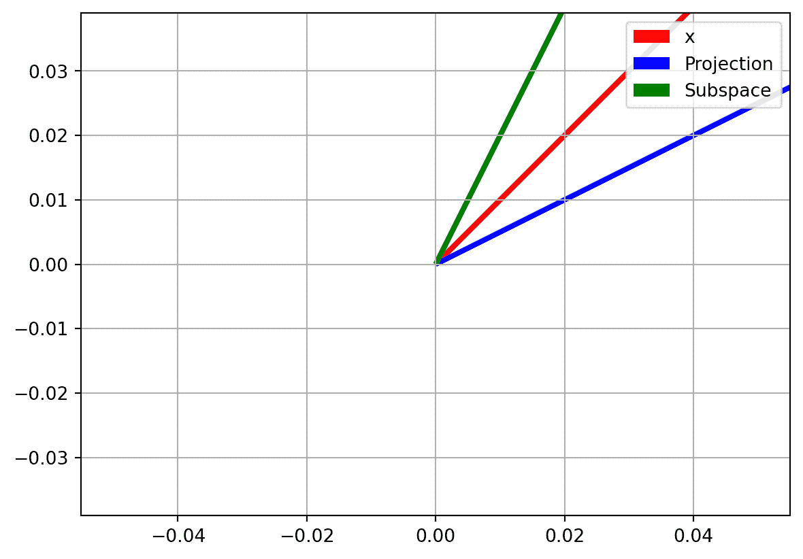****  ***#### 尝试自己操作

1.  将向量投影到由 $[2,1]$ 张成的线上。

1.  将 $[1,2,3]$ 投影到由 $[1,0,1]$ 和 $[0,1,1]$ 张成的平面上。

1.  比较通过公式 $Q Q^T x$ 进行投影与手动求解最小二乘法。

#### 吸收要点

+   正交投影找到子空间中的最近点。

+   公式 $Q Q^T x$ 当 $Q$ 有正交归一列时工作得很好。

+   投影是最小二乘、主成分分析以及许多几何算法的基础。****  ***### 75\. 最小二乘问题（当精确求解不可能时的拟合）

有时方程组 $Ax = b$ 没有精确解 - 通常是因为它是超定的（方程多于未知数）。在这种情况下，我们寻找一个近似解 $x^*$，它最小化误差：

$$ x^* = \arg\min_x \|Ax - b\|² $$

这是最小二乘解，从几何上讲是 $b$ 投影到 $A$ 的列空间。

#### 设置您的实验室

```py
import numpy as np
```

*#### 逐步代码讲解

1.  超定系统

3 个方程，2 个未知数：

```py
A = np.array([[1,1],
 [1,2],
 [1,3]], dtype=float)
b = np.array([6, 0, 0], dtype=float)
```

*2.  使用 NumPy 求解最小二乘

```py
x_star, residuals, rank, s = np.linalg.lstsq(A, b, rcond=None)
print("Least squares solution:", x_star)
print("Residual norm squared:", residuals)
```

*```py
Least squares solution: [ 8\. -3.]
Residual norm squared: [6.]
```*  *3.  与正规方程比较

$$ A^T A x = A^T b $$

```py
x_normal = np.linalg.inv(A.T @ A) @ (A.T @ b)
print("Solution via normal equations:", x_normal)
```

*```py
Solution via normal equations: [ 8\. -3.]
```*  *4.  几何图示

最小二乘解将 $b$ 投影到 $A$ 的列空间：

```py
proj = A @ x_star
print("Projection of b onto Col(A):", proj)
print("Original b:", b)
print("Error vector (b - proj):", b - proj)
```

*```py
Projection of b onto Col(A): [ 5\.  2\. -1.]
Original b: [6\. 0\. 0.]
Error vector (b - proj): [ 1\. -2\.  1.]
```*  *错误向量与列空间正交。

1.  验证正交条件

$$ A^T (b - Ax^*) = 0 $$

```py
print("Check orthogonality:", A.T @ (b - A @ x_star))
```

*```py
Check orthogonality: [0\. 0.]
```*  *结果应该是（接近）零。*****  ***#### 尝试自己来做

1.  创建一个更长的 $A$（例如 5×2）并用随机数求解最小二乘问题 $b$。

1.  将 `np.linalg.lstsq` 的残差与几何直觉（投影）进行比较。

1.  修改 $b$ 使得系统有精确解。检查最小二乘是否给出精确解。

#### 吸收要点

+   当不存在精确解时，最小二乘法找到最佳拟合解。

+   它通过将 $b$ 投影到 $A$ 的列空间中来工作。

+   这个原理是回归、曲线拟合和数据科学中无数应用的基础。****  ***### 76\. 正规方程和残差的几何（为什么它有效）

最小二乘解可以通过求解正规方程找到：

$$ A^T A x = A^T b $$

这来自于残差向量

$$ r = b - Ax $$

与 $A$ 的列空间正交。

#### 设置您的实验室

```py
import numpy as np
```

*#### 逐步代码讲解

1.  构建一个超定系统

```py
A = np.array([[1,1],
 [1,2],
 [1,3]], dtype=float)
b = np.array([6, 0, 0], dtype=float)
```

*2.  通过正规方程求解最小二乘

```py
ATA = A.T @ A
ATb = A.T @ b
x_star = np.linalg.solve(ATA, ATb)

print("Least-squares solution x*:", x_star)
```

*```py
Least-squares solution x*: [ 8\. -3.]
```*  *3.  计算残差并检查正交性

```py
residual = b - A @ x_star
print("Residual vector:", residual)
print("Check A^T r ≈ 0:", A.T @ residual)
```

*```py
Residual vector: [ 1\. -2\.  1.]
Check A^T r ≈ 0: [0\. 0.]
```*  *这验证了残差与 $A$ 的列空间正交。

1.  与 NumPy 的最小二乘求解器比较

```py
x_lstsq, *_ = np.linalg.lstsq(A, b, rcond=None)
print("NumPy lstsq solution:", x_lstsq)
```

*```py
NumPy lstsq solution: [ 8\. -3.]
```*  *解应该匹配（在数值精度范围内）。

1.  几何图示

+   $b$ 是 $\mathbb{R}³$ 中的一个点。

+   $Ax$ 被限制在 $A$ 的 2D 列空间中。

+   最小二乘解选择最接近 $b$ 的 $Ax$。

+   错误向量 $r = b - Ax^*$ 与子空间正交。

```py
proj = A @ x_star
print("Projection of b onto Col(A):", proj)
```

*```py
Projection of b onto Col(A): [ 5\.  2\. -1.]
```*****  ***#### 尝试自己来做

1.  将 $b$ 改为 $[1,1,1]$。再次求解并检查残差。

1.  使用随机的长 $A$（例如 6×2）并验证残差始终正交。

1.  计算 $\|r\|$ 并观察当改变 $b$ 时它如何变化。

#### 吸收要点

+   最小二乘法通过使残差与列空间正交来工作。

+   正规方程是编码这个条件的代数方法。

+   这个正交原理是最小二乘拟合的几何核心。****  ***### 77. QR 分解（通过正交性实现稳定的最小二乘）

虽然正则方程可以解决最小二乘问题，但如果 $A^T A$ 条件不良，它们在数值上可能是不稳定的。一种更稳定的方法是使用 QR 分解：

$$ A = Q R $$

+   $Q$：具有正交列的矩阵

+   $R$：上三角矩阵

然后，最小二乘问题简化为求解：

$$ Rx = Q^T b $$

#### 设置您的实验室

```py
import numpy as np
```

*#### 逐步代码讲解

1.  超定系统

```py
A = np.array([[1,1],
 [1,2],
 [1,3]], dtype=float)
b = np.array([6, 0, 0], dtype=float)
```

*2.  QR 分解

```py
Q, R = np.linalg.qr(A)
print("Q (orthonormal basis):\n", Q)
print("R (upper triangular):\n", R)
```

*```py
Q (orthonormal basis):
 [[-5.77350269e-01  7.07106781e-01]
 [-5.77350269e-01 -1.73054947e-16]
 [-5.77350269e-01 -7.07106781e-01]]
R (upper triangular):
 [[-1.73205081 -3.46410162]
 [ 0\.         -1.41421356]]
```*  *3.  使用 QR 解决最小二乘问题

```py
y = Q.T @ b
x_star = np.linalg.solve(R[:2,:], y[:2])  # only top rows matter
print("Least squares solution via QR:", x_star)
```

*```py
Least squares solution via QR: [ 8\. -3.]
```*  *4.  与 NumPy 的`lstsq`比较

```py
x_lstsq, *_ = np.linalg.lstsq(A, b, rcond=None)
print("NumPy lstsq:", x_lstsq)
```

*```py
NumPy lstsq: [ 8\. -3.]
```*  *答案应该非常接近。

1.  残差检查

```py
residual = b - A @ x_star
print("Residual vector:", residual)
print("Check orthogonality (Q^T r):", Q.T @ residual)
```

*```py
Residual vector: [ 1\. -2\.  1.]
Check orthogonality (Q^T r): [0.00000000e+00 3.46109895e-16]
```*  *残差与列空间正交，确认正确性。*****  ***#### 尝试自己操作

1.  使用正则方程和 QR 分别对 5×2 的随机矩阵求解最小二乘问题。比较结果。

1.  通过使 $A$ 的列几乎相互依赖来检查稳定性 - 看看 QR 是否比正则方程表现得更好。

1.  使用 $Q Q^T b$ 计算向量 $b$ 的投影，并确认它等于 $A x^*$。

#### 吸取的经验

+   QR 分解提供了一种数值上稳定地解决最小二乘问题的方法。

+   它避免了正则方程的不稳定性。

+   在实践中，现代求解器（如 NumPy 的`lstsq`）在底层依赖于 QR 或 SVD。****  ***### 78. 正交矩阵（长度保持变换）

正交矩阵 $Q$ 是一个方阵，其列（和行）是正交向量。形式上：

$$ Q^T Q = Q Q^T = I $$

关键特性：

+   保持长度：$\|Qx\| = \|x\|$

+   保持点积：$\langle Qx, Qy \rangle = \langle x, y \rangle$

+   约束条件是 $+1$（旋转）或 $-1$（反射）

#### 设置您的实验室

```py
import numpy as np
```

*#### 逐步代码讲解

1.  构造一个简单的正交矩阵

2D 中的 90°旋转：

```py
Q = np.array([[0, -1],
 [1,  0]])

print("Q^T Q =\n", Q.T @ Q)
```

*```py
Q^T Q =
 [[1 0]
 [0 1]]
```*  *结果为恒等矩阵 → 确认正交性。

1.  检查长度保持

```py
x = np.array([3,4])
print("Original length:", np.linalg.norm(x))
print("Transformed length:", np.linalg.norm(Q @ x))
```

*```py
Original length: 5.0
Transformed length: 5.0
```*  *两个长度匹配。

1.  检查点积保持

```py
u = np.array([1,0])
v = np.array([0,1])

print("Dot(u,v):", np.dot(u,v))
print("Dot(Q u, Q v):", np.dot(Q @ u, Q @ v))
```

*```py
Dot(u,v): 0
Dot(Q u, Q v): 0
```*  *点积保持。

1.  反射矩阵

关于 x 轴的反射：

```py
R = np.array([[1,0],
 [0,-1]])

print("R^T R =\n", R.T @ R)
print("Determinant of R:", np.linalg.det(R))
```

*```py
R^T R =
 [[1 0]
 [0 1]]
Determinant of R: -1.0
```*  *行列式 = -1 → 反射。

1.  通过 QR 得到的随机正交矩阵

```py
M = np.random.rand(3,3)
Q, _ = np.linalg.qr(M)
print("Q (random orthogonal):\n", Q)
print("Check Q^T Q ≈ I:\n", np.round(Q.T @ Q, 6))
```

*```py
Q (random orthogonal):
 [[-0.59472353  0.03725157 -0.80306677]
 [-0.61109913 -0.67000966  0.42147943]
 [-0.52236172  0.74141714  0.42123492]]
Check Q^T Q ≈ I:
 [[ 1\.  0\. -0.]
 [ 0\.  1\. -0.]
 [-0\. -0\.  1.]]
```*****  ***#### 尝试自己操作

1.  构建一个 45°的二维旋转矩阵。验证它是正交的。

1.  检查缩放矩阵（例如，$\text{diag}(2,1)$）是否正交。为什么或为什么不？

1.  使用 `np.linalg.qr` 生成一个随机的正交矩阵并测试其行列式。

#### 吸取的经验

+   正交矩阵是刚性运动：它们旋转或反射而不扭曲长度或角度。

+   它们在数值稳定性、几何和物理学中起着关键作用。

+   每个正交基对应一个正交矩阵。****  ***### 79. 傅里叶视角（在正交波中展开）

傅里叶视角将函数或信号视为正交波（正弦和余弦）的组合。这仅仅是线性代数：正弦和余弦函数构成一个正交基，任何信号都可以表示为它们的线性组合。

#### 公式回顾

对于离散信号 $x$，离散傅里叶变换（DFT）是：

$$ X_k = \sum_{n=0}^{N-1} x_n e^{-2\pi i kn / N}, \quad k=0,\dots,N-1 $$

逆离散傅里叶变换重建信号。复指数的正交性使得这一点成立。

#### 设置您的实验室

```py
import numpy as np
import matplotlib.pyplot as plt
```

*#### 逐步代码讲解

1.  构建一个简单的信号

```py
t = np.linspace(0, 1, 100, endpoint=False)
signal = np.sin(2*np.pi*3*t) + 0.5*np.sin(2*np.pi*5*t)
plt.plot(t, signal)
plt.title("Signal = sin(3Hz) + 0.5 sin(5Hz)")
plt.xlabel("Time")
plt.ylabel("Amplitude")
plt.show()
```

*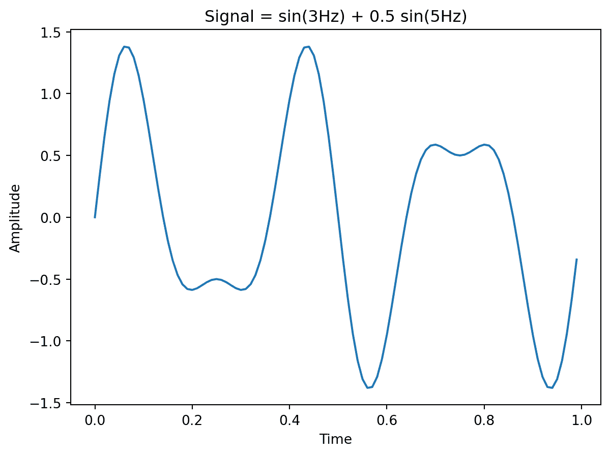*  *2.  计算傅里叶变换（DFT）

```py
X = np.fft.fft(signal)
freqs = np.fft.fftfreq(len(t), d=1/100)  # sampling rate = 100Hz

plt.stem(freqs[:50], np.abs(X[:50]), basefmt=" ")
plt.title("Fourier spectrum")
plt.xlabel("Frequency (Hz)")
plt.ylabel("Magnitude")
plt.show()
```

*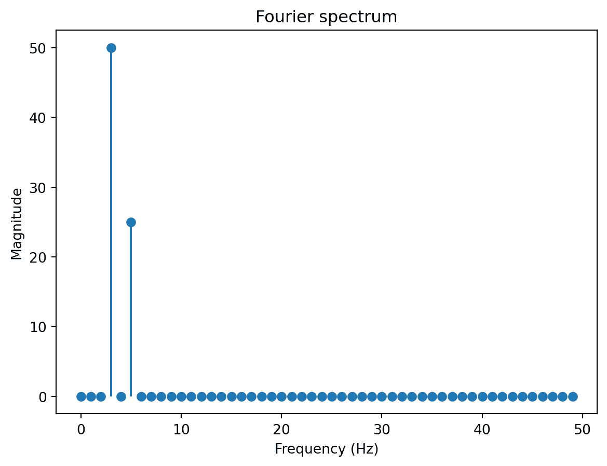*  *峰值出现在 3Hz 和 5Hz → 原始信号的频率。

1.  使用逆傅里叶变换重建信号

```py
signal_reconstructed = np.fft.ifft(X).real
print("Reconstruction error:", np.linalg.norm(signal - signal_reconstructed))
```

*```py
Reconstruction error: 1.4664679821708477e-15
```*  *误差接近零 → 完美重建。

1.  正交性检查正弦波

```py
u = np.sin(2*np.pi*3*t)
v = np.sin(2*np.pi*5*t)

inner = np.dot(u, v)
print("Inner product of 3Hz and 5Hz sinusoids:", inner)
```

*```py
Inner product of 3Hz and 5Hz sinusoids: 1.2961853812498703e-14
```*  *结果是 ≈ 0 → 确认正交性。****  ***#### 尝试自己操作

1.  将频率改为 7Hz 和 9Hz。傅里叶峰值是否相应移动？

1.  混入一些噪声并检查频谱看起来如何。

1.  尝试使用余弦信号而不是正弦信号。你是否仍然看到正交性？

#### 吸收要点

+   傅里叶分析 = 线性代数与正交正弦波基函数。

+   任何信号都可以分解为正交波。

+   这种正交观点推动了音频、图像压缩和信号处理。****  ***### 80\. 多项式和多特征最小二乘（更灵活的拟合）

最小二乘法不仅限于直线。通过添加多项式或多个特征，我们可以拟合曲线并捕捉更复杂的关系。这是数据科学中回归模型的基础。

#### 公式回顾

给定数据 $(x_i, y_i)$，我们构建设计矩阵 $A$：

+   对于 $d$ 次方的多项式拟合：

$$ A = \begin{bmatrix} 1 & x_1 & x_1² & \dots & x_1^d \\ 1 & x_2 & x_2² & \dots & x_2^d \\ \vdots & \vdots & \vdots & \ddots & \vdots \\ 1 & x_n & x_n² & \dots & x_n^d \end{bmatrix} $$

然后求解最小二乘法：

$$ \hat{c} = \arg\min_c \|Ac - y\|² $$

#### 设置您的实验室

```py
import numpy as np
import matplotlib.pyplot as plt
```

*#### 逐步代码讲解

1.  生成带噪声的二次数据

```py
np.random.seed(0)
x = np.linspace(-3, 3, 30)
y_true = 1 - 2*x + 0.5*x**2
y_noisy = y_true + np.random.normal(scale=2.0, size=x.shape)

plt.scatter(x, y_noisy, label="Noisy data")
plt.plot(x, y_true, "g--", label="True curve")
plt.legend()
plt.show()
```

*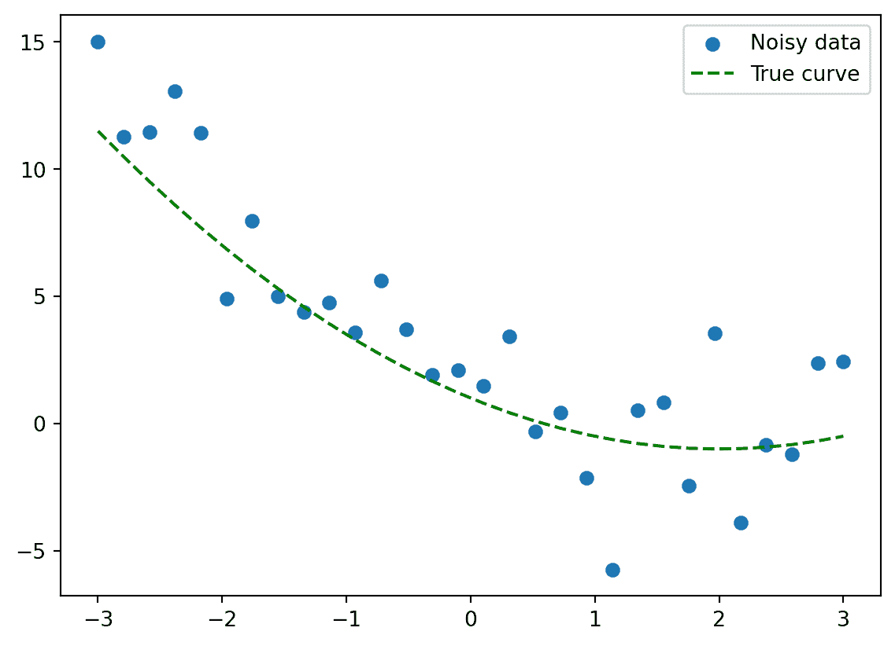*  *2.  构建多项式设计矩阵（度数为 2）

```py
A = np.column_stack([np.ones_like(x), x, x**2])
coeffs, *_ = np.linalg.lstsq(A, y_noisy, rcond=None)
print("Fitted coefficients:", coeffs)
```

*```py
Fitted coefficients: [ 1.15666306 -2.25753954  0.72733812]
```*  *3.  绘制拟合多项式

```py
y_fit = A @ coeffs
plt.scatter(x, y_noisy, label="Noisy data")
plt.plot(x, y_fit, "r-", label="Fitted quadratic")
plt.legend()
plt.show()
```

*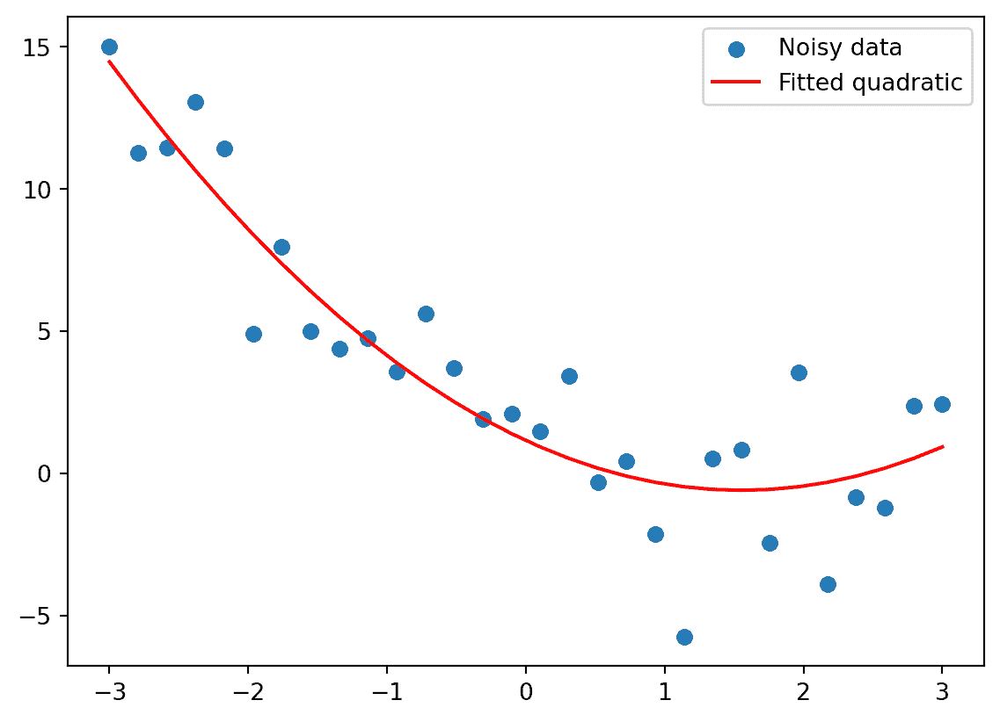*  *4.  高阶拟合（过拟合演示）

```py
A_high = np.column_stack([x**i for i in range(6)])  # degree 5
coeffs_high, *_ = np.linalg.lstsq(A_high, y_noisy, rcond=None)

y_fit_high = A_high @ coeffs_high
plt.scatter(x, y_noisy, label="Noisy data")
plt.plot(x, y_fit_high, "r-", label="Degree 5 polynomial")
plt.plot(x, y_true, "g--", label="True curve")
plt.legend()
plt.show()
```

*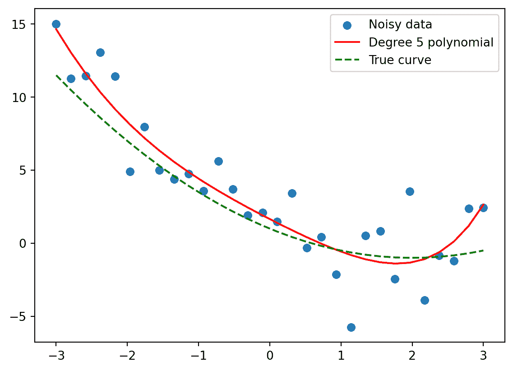*  *5.  多特征回归示例

假设我们根据特征 $[x, x², \sin(x)]$ 预测 $y$：

```py
A_multi = np.column_stack([np.ones_like(x), x, x**2, np.sin(x)])
coeffs_multi, *_ = np.linalg.lstsq(A_multi, y_noisy, rcond=None)
print("Multi-feature coefficients:", coeffs_multi)
```

*```py
Multi-feature coefficients: [ 1.15666306 -2.0492999   0.72733812 -0.65902274]
```*****  ***#### 尝试自己操作

1.  将 3 次方、4 次方、5 次方的多项式拟合到相同的数据上。观察曲线如何变化。

1.  添加特征如 $\cos(x)$ 或 $\exp(x)$ - 拟合是否改善？

1.  比较训练误差（拟合噪声数据）与新的测试点上的误差。

#### 吸收要点

+   最小二乘法可以拟合多项式和任意特征组合。

+   设计矩阵编码了输入变量如何转换为特征。

+   这是回归、曲线拟合以及许多机器学习模型的基础。*******************************  ***## 第九章\. SVD、PCA 和条件数

### 81\. 单位值和 SVD（通用分解）

奇异值分解（SVD）是线性代数中最有力的结果之一。它表明任何 $m \times n$ 矩阵 $A$ 都可以分解为：

$$ A = U \Sigma V^T $$

+   $U$：正交的 $m \times m$ 矩阵（左奇异向量）

+   $\Sigma$：对角 $m \times n$ 矩阵，包含非负数（奇异值）

+   $V$：正交的 $n \times n$ 矩阵（右奇异向量）

奇异值始终是非负的，并按顺序排序 $\sigma_1 \geq \sigma_2 \geq \dots$。

#### 设置您的实验室

```py
import numpy as np
```

*#### 逐步代码讲解

1.  计算矩阵的 SVD

```py
A = np.array([[3,1,1],
 [-1,3,1]])

U, S, Vt = np.linalg.svd(A, full_matrices=True)

print("U:\n", U)
print("Singular values:", S)
print("V^T:\n", Vt)
```

*```py
U:
 [[-0.70710678 -0.70710678]
 [-0.70710678  0.70710678]]
Singular values: [3.46410162 3.16227766]
V^T:
 [[-4.08248290e-01 -8.16496581e-01 -4.08248290e-01]
 [-8.94427191e-01  4.47213595e-01  5.27355937e-16]
 [-1.82574186e-01 -3.65148372e-01  9.12870929e-01]]
```*  **   `U`：输入空间中的正交基。

+   `S`：奇异值（作为一个一维数组）。

+   `V^T`：输出空间中的正交基。

1.  从分解中重建 $A$

```py
Sigma = np.zeros((U.shape[1], Vt.shape[0]))
Sigma[:len(S), :len(S)] = np.diag(S)

A_reconstructed = U @ Sigma @ Vt
print("Reconstruction error:", np.linalg.norm(A - A_reconstructed))
```

*```py
Reconstruction error: 1.5895974606912448e-15
```*  *误差应该接近零。

1.  从 SVD 中获得秩

非零奇异值的数量 = $A$ 的秩。

```py
rank = np.sum(S > 1e-10)
print("Rank of A:", rank)
```

*```py
Rank of A: 2
```*  *4. 几何：$A$ 的影响

SVD 表示：

1.  $V$ 旋转输入空间。

1.  $\Sigma$ 沿正交方向（通过奇异值）进行缩放。

1.  $U$ 旋转到输出空间。

这解释了为什么 SVD 对任何矩阵都有效（而不仅仅是方阵）。

1.  低秩近似预览

仅保留最大的奇异值（s）→ $A$ 的最佳近似。

```py
k = 1
A_approx = np.outer(U[:,0], Vt[0]) * S[0]
print("Rank-1 approximation:\n", A_approx)
```

*```py
Rank-1 approximation:
 [[1\. 2\. 1.]
 [1\. 2\. 1.]]
```****  ***#### 尝试自己操作

1.  对一个随机的 5×3 矩阵计算 SVD。检查 $U$ 和 $V$ 是否正交。

1.  比较对角矩阵与旋转矩阵的奇异值。

1.  将小的奇异值置零，看看 $A$ 保留了多少。

#### **总结**

+   SVD 将任何矩阵分解为旋转和缩放。

+   奇异值揭示了秩和方向的力量。

+   它是数值线性代数的通用工具：PCA、压缩和稳定性分析的基础。****  ***### 82. SVD 的几何（旋转 + 拉伸）

奇异值分解（SVD）有一个美丽的几何解释：每个矩阵只是两个旋转（或反射）和一个拉伸的组合。

对于 $A = U \Sigma V^T$:

1.  $V^T$：旋转（或反射）输入空间。

1.  $\Sigma$：通过奇异值 $\sigma_i$ 沿正交轴拉伸空间。

1.  $U$：旋转（或反射）结果到输出空间。

这将任何线性变换转换为旋转 → 拉伸 → 旋转管道。

#### 设置您的实验室

```py
import numpy as np
import matplotlib.pyplot as plt
```

*#### 逐步代码讲解

1.  制作一个 2D 矩阵

```py
A = np.array([[2, 1],
 [1, 3]])
```

*2. 应用 SVD

```py
U, S, Vt = np.linalg.svd(A)

print("U:\n", U)
print("Singular values:", S)
print("V^T:\n", Vt)
```

*```py
U:
 [[-0.52573111 -0.85065081]
 [-0.85065081  0.52573111]]
Singular values: [3.61803399 1.38196601]
V^T:
 [[-0.52573111 -0.85065081]
 [-0.85065081  0.52573111]]
```*  *3. 可视化对单位圆的影响

单位圆常用于可视化线性变换。

```py
theta = np.linspace(0, 2*np.pi, 200)
circle = np.vstack((np.cos(theta), np.sin(theta)))

transformed = A @ circle

plt.plot(circle[0], circle[1], 'b--', label="Unit circle")
plt.plot(transformed[0], transformed[1], 'r-', label="Transformed")
plt.axis("equal")
plt.legend()
plt.title("Action of A on the unit circle")
plt.show()
```

*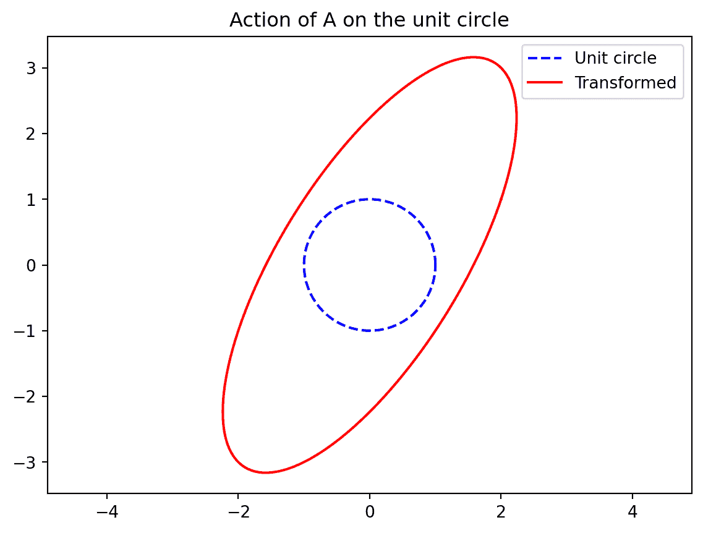*  *圆变成了椭圆。其轴与奇异向量对齐，其半径是奇异值。

1.  与分解步骤进行比较

```py
# Apply V^T
step1 = Vt @ circle
# Apply Σ
Sigma = np.diag(S)
step2 = Sigma @ step1
# Apply U
step3 = U @ step2

plt.plot(circle[0], circle[1], 'b--', label="Unit circle")
plt.plot(step3[0], step3[1], 'g-', label="U Σ V^T circle")
plt.axis("equal")
plt.legend()
plt.title("SVD decomposition of transformation")
plt.show()
```

*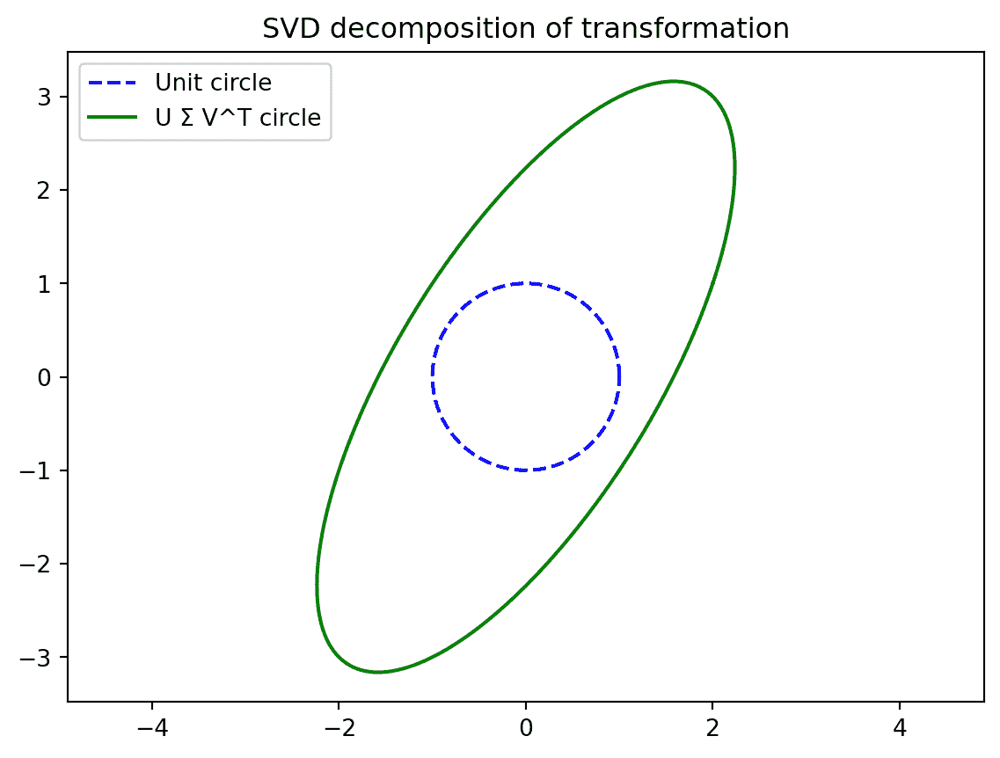*  *变换后的形状匹配 → 确认 SVD 的几何图像。****  ***#### 尝试自己操作

1.  将 $A$ 设置为纯剪切，例如 `[[1,2],[0,1]]`。椭圆看起来如何？

1.  尝试一个对角矩阵，例如 `[[3,0],[0,1]]`。奇异向量是否与坐标轴相匹配？

1.  将输入圆缩放到正方形，看看几何是否仍然有效。

#### 吸收要点

+   SVD = 旋转 → 拉伸 → 旋转。

+   单位圆变成了椭圆：轴 = 奇异向量，半径 = 奇异值。

+   这种几何透镜使 SVD 直观，并解释了为什么它在数据、图形和信号处理中如此广泛使用。****  ***### 83. 与特征分解的关系（ATA 和 AAT）

奇异值和特征值密切相关。虽然特征分解仅适用于方阵，但 SVD 适用于任何矩形矩阵。它们之间的桥梁是：

$$ A^T A v = \sigma² v \quad \text{和} \quad A A^T u = \sigma² u $$

+   $v$：右奇异向量（来自 $A^T A$ 的特征向量）

+   $u$：左奇异向量（来自 $A A^T$ 的特征向量）

+   $\sigma$：奇异值（$A^T A$ 或 $A A^T$ 的特征值的平方根）

#### 设置您的实验室

```py
import numpy as np
```

*#### 逐步代码讲解

1.  定义一个矩形矩阵

```py
A = np.array([[2, 0],
 [1, 1],
 [0, 1]])  # shape 3x2
```

*2.  直接计算 SVD

```py
U, S, Vt = np.linalg.svd(A)
print("Singular values:", S)
```

*```py
Singular values: [2.30277564 1.30277564]
```*  *3.  与 $A^T A$ 的特征值进行比较

```py
ATA = A.T @ A
eigvals, eigvecs = np.linalg.eig(ATA)

print("Eigenvalues of A^T A:", eigvals)
print("Square roots (sorted):", np.sqrt(np.sort(eigvals)[::-1]))
```

*```py
Eigenvalues of A^T A: [5.30277564 1.69722436]
Square roots (sorted): [2.30277564 1.30277564]
```*  *注意：SVD 中的奇异值是 $A^T A$ 的特征值的平方根。

1.  与 $A A^T$ 的特征值进行比较

```py
AAT = A @ A.T
eigvals2, eigvecs2 = np.linalg.eig(AAT)

print("Eigenvalues of A A^T:", eigvals2)
print("Square roots:", np.sqrt(np.sort(eigvals2)[::-1]))
```

*```py
Eigenvalues of A A^T: [ 5.30277564e+00  1.69722436e+00 -2.01266546e-17]
Square roots: [2.30277564 1.30277564        nan]
```

```py
/var/folders/_g/lq_pglm508df70x751kkxrl80000gp/T/ipykernel_31637/436251338.py:5: RuntimeWarning: invalid value encountered in sqrt
  print("Square roots:", np.sqrt(np.sort(eigvals2)[::-1]))
```*  *它们匹配得太好了 → 确认了关系。

1.  验证奇异向量

+   右奇异向量（$V$）= $A^T A$ 的特征向量。

+   左奇异向量（$U$）= $A A^T$ 的特征向量。

```py
print("Right singular vectors (V):\n", Vt.T)
print("Eigenvectors of A^T A:\n", eigvecs)

print("Left singular vectors (U):\n", U)
print("Eigenvectors of A A^T:\n", eigvecs2)
```

*```py
Right singular vectors (V):
 [[-0.95709203  0.28978415]
 [-0.28978415 -0.95709203]]
Eigenvectors of A^T A:
 [[ 0.95709203 -0.28978415]
 [ 0.28978415  0.95709203]]
Left singular vectors (U):
 [[-0.83125078  0.44487192  0.33333333]
 [-0.54146663 -0.51222011 -0.66666667]
 [-0.12584124 -0.73465607  0.66666667]]
Eigenvectors of A A^T:
 [[-0.83125078  0.44487192  0.33333333]
 [-0.54146663 -0.51222011 -0.66666667]
 [-0.12584124 -0.73465607  0.66666667]]
```*****  ***#### 尝试自己操作

1.  尝试一个平方对称矩阵，并将 SVD 与特征分解进行比较。它们匹配吗？

1.  对于高宽比不同的矩形矩阵，检查 $U$ 和 $V$ 是否不同。

1.  使用 `np.linalg.eig` 手动计算随机 $A$ 的特征值并确认奇异值。

#### 吸收要点

+   奇异值 = $A^T A$（或 $A A^T$）的特征值的平方根。

+   右奇异向量 = $A^T A$ 的特征向量。

+   左奇异向量 = $A A^T$ 的特征向量。

+   SVD 将特征分解推广到所有矩阵，无论是矩形还是平方矩阵。****  ***### 84. 低秩近似（最佳小模型）

SVD 最有用的应用之一是低秩近似：将大矩阵压缩成小矩阵，同时保留大部分重要信息。

Eckart–Young 定理说：如果 $A = U \Sigma V^T$，那么最佳秩-$k$ 近似（在最小二乘意义上）是：

$$ A_k = U_k \Sigma_k V_k^T $$

其中我们只保留前 $k$ 个奇异值（及其对应的向量）。

#### 设置您的实验室

```py
import numpy as np
import matplotlib.pyplot as plt
```

*#### 逐步代码讲解

1.  创建一个具有隐藏低秩结构的矩阵

```py
np.random.seed(0)
U = np.random.randn(50, 5)   # 50 x 5
V = np.random.randn(5, 30)   # 5 x 30
A = U @ V  # true rank ≤ 5
```

*2.  完整 SVD

```py
U, S, Vt = np.linalg.svd(A, full_matrices=False)
print("Singular values:", S[:10])
```

*```py
Singular values: [4.90672194e+01 4.05935057e+01 3.39228766e+01 3.07883338e+01
 2.29261740e+01 3.97150036e-15 3.97150036e-15 3.97150036e-15
 3.97150036e-15 3.97150036e-15]
```*  *只有前 ~5 个应该是大的；其余的接近于零。

1.  构建秩-1 近似

```py
k = 1
A1 = U[:, :k] @ np.diag(S[:k]) @ Vt[:k, :]
error1 = np.linalg.norm(A - A1)
print("Rank-1 approximation error:", error1)
```

*```py
Rank-1 approximation error: 65.36149641872869
```*  *4.  秩-5 近似（应该几乎是精确的）

```py
k = 5
A5 = U[:, :k] @ np.diag(S[:k]) @ Vt[:k, :]
error5 = np.linalg.norm(A - A5)
print("Rank-5 approximation error:", error5)
```

*```py
Rank-5 approximation error: 5.756573247253659e-14
```*  *5.  可视比较（图像压缩演示）

让我们在一个图像上看看。

```py
from sklearn.datasets import load_digits
digits = load_digits()
img = digits.images[0]  # 8x8 grayscale digit

U, S, Vt = np.linalg.svd(img, full_matrices=False)

# Keep only top 2 singular values
k = 2
img2 = U[:, :k] @ np.diag(S[:k]) @ Vt[:k, :]

plt.subplot(1,2,1)
plt.imshow(img, cmap="gray")
plt.title("Original")

plt.subplot(1,2,2)
plt.imshow(img2, cmap="gray")
plt.title("Rank-2 Approximation")
plt.show()
```

**  *即使只有两个奇异值，数字形状也是可识别的。*****  ***#### 尝试自己操作

1.  在图像示例中改变 $k$ 的值（1、2、5、10）。你保留了多少细节？

1.  比较随着 $k$ 增加的近似误差 $\|A - A_k\|$。

1.  将低秩近似应用于随机噪声数据。它去噪了吗？

#### 吸收要点

+   SVD 在误差方面给出最佳可能低秩近似。

+   通过截断奇异值，您可以在保持其基本结构的同时压缩数据。

+   这是图像压缩、推荐系统和降维的骨干技术。****  ***### 85. 主成分分析（方差和方向）

主成分分析（PCA）是奇异值分解（SVD）最重要的应用之一。它找到数据变化最大的方向（主成分），并将数据投影到这些方向上以降低维度，同时尽可能保留信息。

数学上：

1.  数据居中（减去均值）。

1.  计算协方差矩阵 $C = \frac{1}{n} X^T X$。

1.  $C$ 的特征向量 = 主方向。

1.  特征值 = 解释的方差。

1.  等价地：PCA = 居中数据矩阵的 SVD。

#### 设置您的实验室

```py
import numpy as np
import matplotlib.pyplot as plt
from sklearn.datasets import load_digits
```

*#### 逐步代码解析

1.  生成合成 2D 数据

```py
np.random.seed(0)
X = np.random.randn(200, 2) @ np.array([[3,1],[1,0.5]])  # stretched cloud

plt.scatter(X[:,0], X[:,1], alpha=0.3)
plt.title("Original data")
plt.axis("equal")
plt.show()
```

*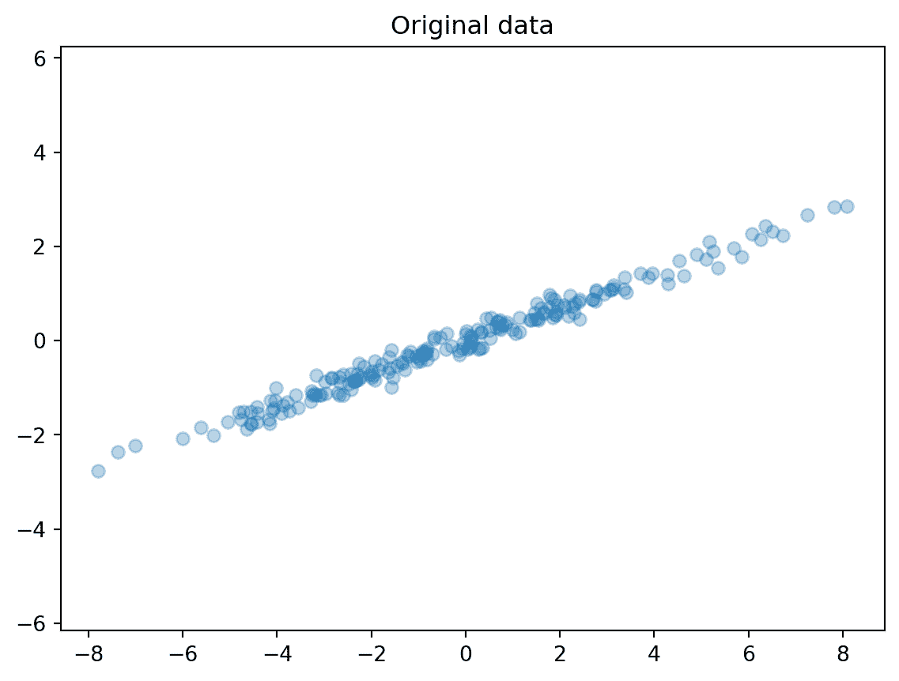*  *2.  数据居中

```py
X_centered = X - X.mean(axis=0)
```

*3.  计算奇异值分解

```py
U, S, Vt = np.linalg.svd(X_centered, full_matrices=False)
print("Principal directions (V):\n", Vt)
```

*```py
Principal directions (V):
 [[-0.94430098 -0.32908307]
 [ 0.32908307 -0.94430098]]
```*  *`Vt` 的行是主成分。

1.  将数据投影到第一个主成分

```py
X_pca1 = X_centered @ Vt.T[:,0]

plt.scatter(X_pca1, np.zeros_like(X_pca1), alpha=0.3)
plt.title("Data projected on first principal component")
plt.show()
```

*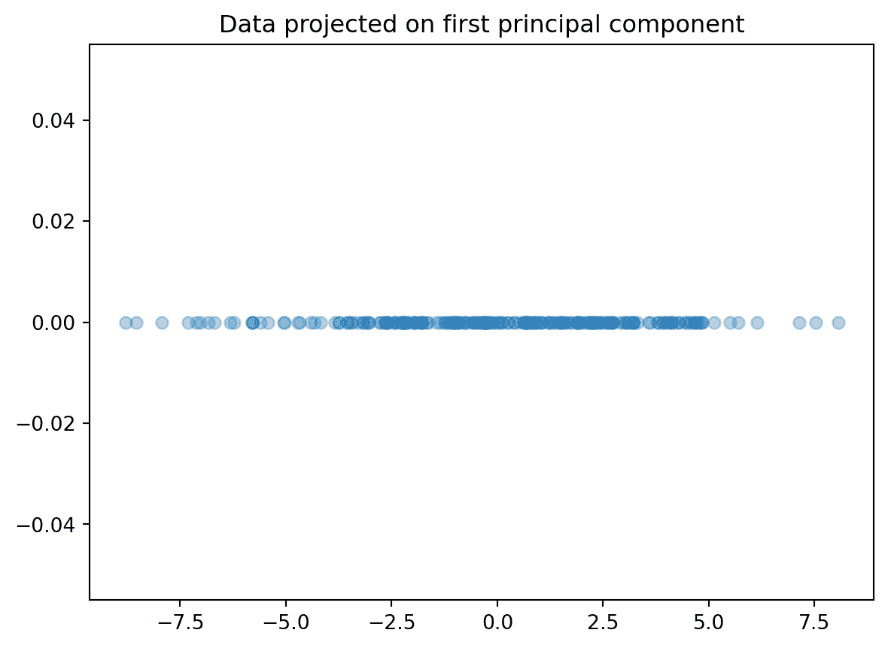*  *这会将数据折叠成 1D，同时保留最多的方差。

1.  可视化主轴

```py
plt.scatter(X_centered[:,0], X_centered[:,1], alpha=0.3)
for length, vector in zip(S, Vt):
 plt.plot([0, vector[0]*length], [0, vector[1]*length], 'r-', linewidth=3)
plt.title("Principal components (directions of max variance)")
plt.axis("equal")
plt.show()
```

*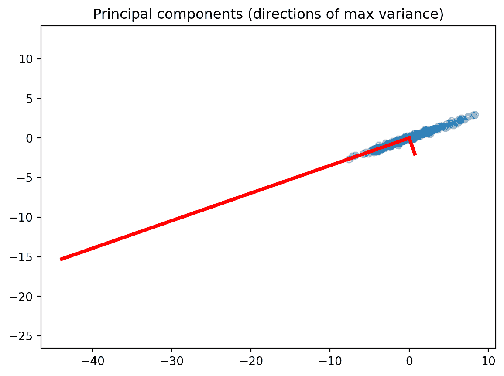*  *红色箭头显示数据分布最广的地方。

1.  在真实数据（数字）上执行 PCA

```py
digits = load_digits()
X = digits.data  # 1797 samples, 64 features
X_centered = X - X.mean(axis=0)

U, S, Vt = np.linalg.svd(X_centered, full_matrices=False)

explained_variance = (S**2) / np.sum(S**2)
print("Explained variance ratio (first 5):", explained_variance[:5])
```

*```py
Explained variance ratio (first 5): [0.14890594 0.13618771 0.11794594 0.08409979 0.05782415]
```******  ***#### 尝试自己操作

1.  使用前两个主成分将数字数据集降低到 2D 并绘制。数字簇是否分离？

1.  比较前 10 个主成分的解释方差比。

1.  向数据添加噪声并检查 PCA 在投影到较少维度时是否过滤掉噪声。

#### 吸收要点

+   PCA 使用 SVD 找到最大方差的方向。

+   通过投影到前几个主成分，您可以在最小信息损失的情况下压缩数据。

+   PCA 是机器学习中降维、可视化和预处理的骨干技术。****  ***### 86. 假逆（摩尔-彭罗斯）和求解病态系统

摩尔-彭罗斯伪逆 $A^+$ 通用矩阵的逆。它允许在以下情况下求解系统 $Ax = b$：

+   $A$ 不是方阵，或者

+   $A$ 是奇异的（不可逆的）。

伪逆给出的解是最小范数的最小二乘解：

$$ x = A^+ b $$

如果 $A = U \Sigma V^T$，那么：

$$ A^+ = V \Sigma^+ U^T $$

其中 $\Sigma^+$ 是通过取非零奇异值的倒数获得的。

#### 设置您的实验室

```py
import numpy as np
```

*#### 逐步代码解析

1.  求解超定系统（方程数多于未知数）

```py
A = np.array([[1,1],
 [1,2],
 [1,3]])  # 3x2 system
b = np.array([1,2,2])

x_ls, *_ = np.linalg.lstsq(A, b, rcond=None)
print("Least-squares solution:", x_ls)
```

*```py
Least-squares solution: [0.66666667 0.5       ]
```*  *2.  使用伪逆进行计算

```py
A_pinv = np.linalg.pinv(A)
x_pinv = A_pinv @ b
print("Pseudoinverse solution:", x_pinv)
```

*```py
Pseudoinverse solution: [0.66666667 0.5       ]
```*  *两者匹配→伪逆给出最小二乘解。

1.  求解欠定系统（方程数少于未知数）

```py
A = np.array([[1,2,3]])  # 1x3
b = np.array([1])

x_pinv = np.linalg.pinv(A) @ b
print("Minimum norm solution:", x_pinv)
```

*```py
Minimum norm solution: [0.07142857 0.14285714 0.21428571]
```*  *在这里，存在无限多个解。伪逆选择范数最小的那个。

1.  与单矩阵比较

```py
A = np.array([[1,2],
 [2,4]])  # rank deficient
b = np.array([1,2])

x_pinv = np.linalg.pinv(A) @ b
print("Solution with pseudoinverse:", x_pinv)
```

*```py
Solution with pseudoinverse: [0.2 0.4]
```*  *即使 $A$ 是奇异的，伪逆也能提供一个解。

1.  通过 SVD 手动计算假逆。

```py
A = np.array([[1,2],
 [3,4]])
U, S, Vt = np.linalg.svd(A)
S_inv = np.zeros((Vt.shape[0], U.shape[0]))
for i in range(len(S)):
 if S[i] > 1e-10:
 S_inv[i,i] = 1/S[i]

A_pinv_manual = Vt.T @ S_inv @ U.T
print("Manual pseudoinverse:\n", A_pinv_manual)
print("NumPy pseudoinverse:\n", np.linalg.pinv(A))
```

*```py
Manual pseudoinverse:
 [[-2\.   1\. ]
 [ 1.5 -0.5]]
NumPy pseudoinverse:
 [[-2\.   1\. ]
 [ 1.5 -0.5]]
```*  *它们匹配。*****  ***#### 尝试自己操作

1.  创建一个带噪声的超定系统并观察伪逆如何平滑解。

1.  在一个方非奇异矩阵上比较伪逆与直接逆（`np.linalg.inv`）。

1.  手动将小的奇异值置零并观察解如何变化。

#### 吸收要点

+   假逆解可以解决任何线性系统，无论是方阵还是非方阵。

+   它在超定情况下提供最小二乘解，在欠定情况下提供最小范数解。

+   建立在 SVD 之上，它是回归、优化和数值方法的一个基石。****  ***### 87\. 病态和敏感性（误差如何放大）

病态告诉我们系统对微小变化的敏感性。对于一个线性系统 $Ax = b$：

+   如果 $A$ 是良态的，$b$ 或 $A$ 的小变化会导致 $x$ 的小变化。

+   如果 $A$ 是病态的，微小的变化可以导致 $x$ 的巨大波动。

条件数定义为：

$$ \kappa(A) = \|A\| \cdot \|A^{-1}\| $$

对于 SVD：

$$ \kappa(A) = \frac{\sigma_{\max}}{\sigma_{\min}} $$

其中 $\sigma_{\max}$ 和 $\sigma_{\min}$ 是最大和最小的奇异值。

+   大 $\kappa(A)$ → 不稳定系统。

+   小 $\kappa(A)$ → 稳定系统。

#### 设置您的实验室

```py
import numpy as np
```

*#### 逐步代码讲解

1.  良态系统

```py
A = np.array([[2,0],
 [0,1]])
b = np.array([1,1])

x = np.linalg.solve(A, b)
cond = np.linalg.cond(A)
print("Solution:", x)
print("Condition number:", cond)
```

*```py
Solution: [0.5 1\. ]
Condition number: 2.0
```*  *条件数 = 奇异值之比 → 中等大小。

1.  病态系统

```py
A = np.array([[1, 1.0001],
 [1, 1.0000]])
b = np.array([2,2])

x = np.linalg.lstsq(A, b, rcond=None)[0]
cond = np.linalg.cond(A)
print("Solution:", x)
print("Condition number:", cond)
```

*```py
Solution: [ 2.00000000e+00 -5.73526099e-13]
Condition number: 40002.000075017124
```*  *条件数非常大 → 不稳定。

1.  扰动右侧

```py
b2 = np.array([2, 2.001])  # tiny change
x2 = np.linalg.lstsq(A, b2, rcond=None)[0]
print("Solution after tiny change:", x2)
```

*```py
Solution after tiny change: [ 12.001 -10\.   ]
```*  *解会发生剧烈变化 → 显示敏感性。

1.  与奇异值的关系

```py
U, S, Vt = np.linalg.svd(A)
print("Singular values:", S)
print("Condition number (SVD):", S[0]/S[-1])
```

*```py
Singular values: [2.000050e+00 4.999875e-05]
Condition number (SVD): 40002.00007501713
```*  *5.  缩放实验

```py
for scale in [1,1e-2,1e-4,1e-6]:
 A = np.array([[1,0],[0,scale]])
 print(f"Scale={scale}, condition number={np.linalg.cond(A)}")
```

*```py
Scale=1, condition number=1.0
Scale=0.01, condition number=100.0
Scale=0.0001, condition number=10000.0
Scale=1e-06, condition number=1000000.0
```*  *随着尺度的缩小，条件数会急剧增加。*****  ***#### 尝试自己操作

1.  生成随机矩阵并计算它们的条件数。哪些是稳定的？

1.  比较希尔伯特矩阵（臭名昭著的病态）的条件数。

1.  探索高条件数下舍入误差如何增长。

#### 吸收要点

+   条件数 = 问题敏感性的度量。

+   $\kappa(A) = \sigma_{\max}/\sigma_{\min}$。

+   病态问题放大误差并且数值不稳定 → 为什么缩放、正则化和良好的公式很重要。****  ***### 88\. 矩阵范数和奇异值（正确测量大小）

矩阵范数衡量矩阵的大小或强度。它们将向量长度的概念扩展到矩阵。范数对于分析稳定性、误差增长和算法性能至关重要。

一些重要的范数：

+   弗罗贝尼乌斯范数：

$$ \|A\|_F = \sqrt{\sum_{i,j} |a_{ij}|²} $$

等价于将矩阵视为一个大向量。

+   谱范数（算子 2-范数）：

$$ \|A\|_2 = \sigma_{\max} $$

最大的奇异值 - 告诉我们 $A$ 可以将向量拉伸多少。

+   1-范数：最大绝对列和。

+   ∞-范数：最大绝对行和。

#### 设置您的实验室

```py
import numpy as np
```

*#### 逐步代码讲解

1.  构建测试矩阵

```py
A = np.array([[1, -2, 3],
 [0,  4, 5],
 [-1, 2, 1]])
```

*2.  计算不同的范数

```py
fro = np.linalg.norm(A, 'fro')
spec = np.linalg.norm(A, 2)
one_norm = np.linalg.norm(A, 1)
inf_norm = np.linalg.norm(A, np.inf)

print("Frobenius norm:", fro)
print("Spectral norm:", spec)
print("1-norm:", one_norm)
print("Infinity norm:", inf_norm)
```

*```py
Frobenius norm: 7.810249675906654
Spectral norm: 6.813953458914004
1-norm: 9.0
Infinity norm: 9.0
```*  *3.  比较谱范数与最大奇异值

```py
U, S, Vt = np.linalg.svd(A)
print("Largest singular value:", S[0])
print("Spectral norm:", spec)
```

*```py
Largest singular value: 6.813953458914004
Spectral norm: 6.813953458914004
```*  *它们匹配 → 谱范数 = 最大奇异值。

1.  从奇异值计算 Frobenius 范数

$$ \|A\|_F = \sqrt{\sigma_1² + \sigma_2² + \dots} $$

```py
fro_from_svd = np.sqrt(np.sum(S**2))
print("Frobenius norm (from SVD):", fro_from_svd)
```

*```py
Frobenius norm (from SVD): 7.810249675906654
```*  *5.  展伸效应演示

选择一个随机向量并观察其增长程度：

```py
x = np.random.randn(3)
stretch = np.linalg.norm(A @ x) / np.linalg.norm(x)
print("Stretch factor:", stretch)
print("Spectral norm (max possible stretch):", spec)
```

*```py
Stretch factor: 2.7537463268177698
Spectral norm (max possible stretch): 6.813953458914004
```*  *展伸 ≤ 谱范数，总是。*****  ***#### 尝试自己操作

1.  比较对角矩阵的范数——它们是否与最大的对角线元素匹配？

1.  生成随机矩阵并观察范数如何不同。

1.  计算一个秩为 1 的矩阵的 Frobenius 范数与谱范数。

#### 吸收要点

+   Frobenius 范数 = 矩阵的整体能量。

+   谱范数 = 最大展伸能力（最大奇异值）。

+   其他范数（1-范数、∞-范数）捕捉行/列的主导性。

+   奇异值统一了所有关于“矩阵大小”的看法。****  ***### 89\. 正则化（岭/Tikhonov 平滑不稳定性）

当求解 $Ax = b$ 时，如果 $A$ 是病态的（条件数大），数据中的小误差可能导致解中的巨大误差。正则化通过添加一个惩罚项来稳定问题，该惩罚项会阻止极端解。

最常见的形式：岭回归（也称为 Tikhonov 正则化）：

$$ x_\lambda = \arg\min_x \|Ax - b\|² + \lambda \|x\|² $$

闭式形式：

$$ x_\lambda = (A^T A + \lambda I)^{-1} A^T b $$

这里 $\lambda > 0$ 控制正则化的程度：

+   小 $\lambda$：解接近最小二乘。

+   大 $\lambda$：较小的系数，更多的稳定性。

#### 设置您的实验室

```py
import numpy as np
import matplotlib.pyplot as plt
```

*#### 逐步代码讲解

1.  构建一个病态的系统

```py
A = np.array([[1, 1.001],
 [1, 0.999]])
b = np.array([2, 2])
```

*2.  不使用正则化求解

```py
x_ls, *_ = np.linalg.lstsq(A, b, rcond=None)
print("Least squares solution:", x_ls)
```

*```py
Least squares solution: [ 2.00000000e+00 -2.84186735e-14]
```*  *结果可能是不稳定的。

1.  应用岭正则化

```py
lam = 0.1
x_ridge = np.linalg.inv(A.T @ A + lam*np.eye(2)) @ A.T @ b
print("Ridge solution (λ=0.1):", x_ridge)
```

*```py
Ridge solution (λ=0.1): [0.97561927 0.97559976]
```*  *4.  比较不同 $\lambda$ 的影响

```py
lambdas = np.logspace(-4, 2, 20)
solutions = []
for lam in lambdas:
 x_reg = np.linalg.inv(A.T @ A + lam*np.eye(2)) @ A.T @ b
 solutions.append(np.linalg.norm(x_reg))

plt.semilogx(lambdas, solutions, 'o-')
plt.xlabel("λ (regularization strength)")
plt.ylabel("Solution norm")
plt.title("Effect of ridge regularization")
plt.show()
```

*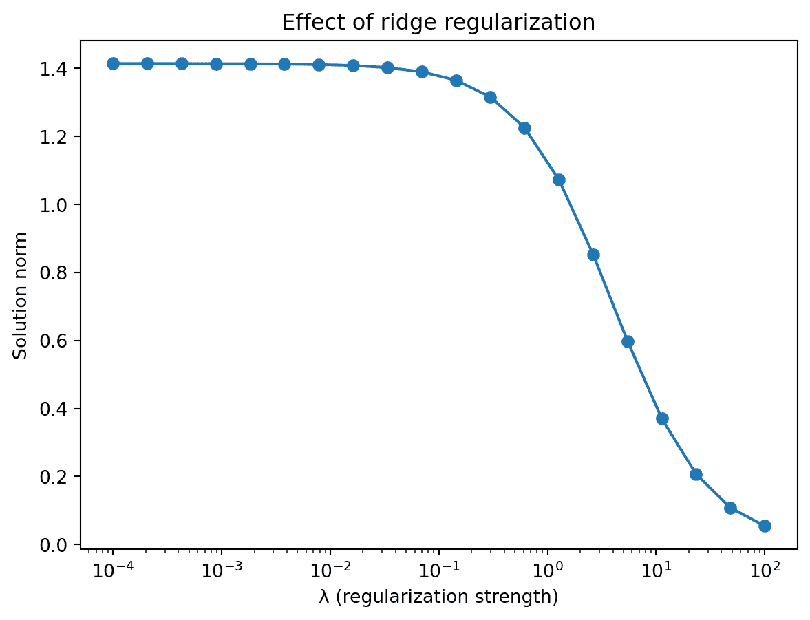*  *随着 $\lambda$ 的增加，解变得越小越稳定。

1.  与 SVD 的联系

如果 $A = U \Sigma V^T$：

$$ x_\lambda = \sum_i \frac{\sigma_i}{\sigma_i² + \lambda} (u_i^T b) v_i $$

小奇异值（导致不稳定性）被 $\frac{\sigma_i}{\sigma_i² + \lambda}$ 抑制。****  ***#### 尝试自己操作

1.  尝试使用较大和较小的 $\lambda$。解会发生什么变化？

1.  向 $b$ 添加随机噪声。比较最小二乘与岭稳定性。

1.  绘制每个系数如何随 $\lambda$ 变化的图。

#### 吸收要点

+   正则化控制病态问题中的不稳定性。

+   岭回归通过使用 $\lambda$ 平衡拟合与稳定性。

+   在奇异值分解的术语中，正则化抑制了导致解不稳定的较小奇异值。****  ***### 90\. 求秩 QR 和实用诊断（秩的真正含义）

在实践中，我们经常需要确定矩阵的数值秩——不仅仅是理论秩，还有多少方向携带了超出舍入误差或噪声的有意义信息。用于此的有用工具是秩揭示 QR（RRQR）分解。

对于矩阵 $A$：

$$ A P = Q R $$

+   $Q$: 正交矩阵

+   $R$: 上三角矩阵

+   $P$: 列置换矩阵

通过智能地重新排序列，$R$ 的对角线揭示了哪些方向是重要的。

#### 设置您的实验室

```py
import numpy as np
from scipy.linalg import qr
```

*#### 逐步代码讲解

1.  构建一个几乎秩亏的矩阵

```py
A = np.array([[1, 2, 3],
 [2, 4.001, 6],
 [3, 6, 9.001]])
print("Rank (theoretical):", np.linalg.matrix_rank(A))
```

*```py
Rank (theoretical): 3
```*  *这个矩阵几乎秩为 2，但带有小的扰动。

1.  带列交换的 QR

```py
Q, R, P = qr(A, pivoting=True)
print("R:\n", R)
print("Column permutation:", P)
```

*```py
R:
 [[-1.12257740e+01 -7.48384925e+00 -3.74165738e+00]
 [ 0.00000000e+00 -1.20185042e-03 -1.84886859e-04]
 [ 0.00000000e+00  0.00000000e+00 -7.41196374e-05]]
Column permutation: [2 1 0]
```*  *$R$ 的对角线迅速减小 → 数值秩在它们变得很小时确定。

1.  与 SVD 比较

```py
U, S, Vt = np.linalg.svd(A)
print("Singular values:", S)
```

*```py
Singular values: [1.40009286e+01 1.00000000e-03 7.14238341e-05]
```*  *奇异值讲述同样的故事：一个非常小 → 有效秩 ≈ 2。

1.  秩的阈值

```py
tol = 1e-3
rank_est = np.sum(S > tol)
print("Estimated rank:", rank_est)
```

*```py
Estimated rank: 2
```*  *5. 对噪声矩阵进行诊断

```py
np.random.seed(0)
B = np.random.randn(50, 10) @ np.random.randn(10, 10)  # rank ≤ 10
B[:, -1] += 1e-6 * np.random.randn(50)  # tiny noise

U, S, Vt = np.linalg.svd(B)
plt.semilogy(S, 'o-')
plt.title("Singular values (log scale)")
plt.xlabel("Index")
plt.ylabel("Value")
plt.show()
```

*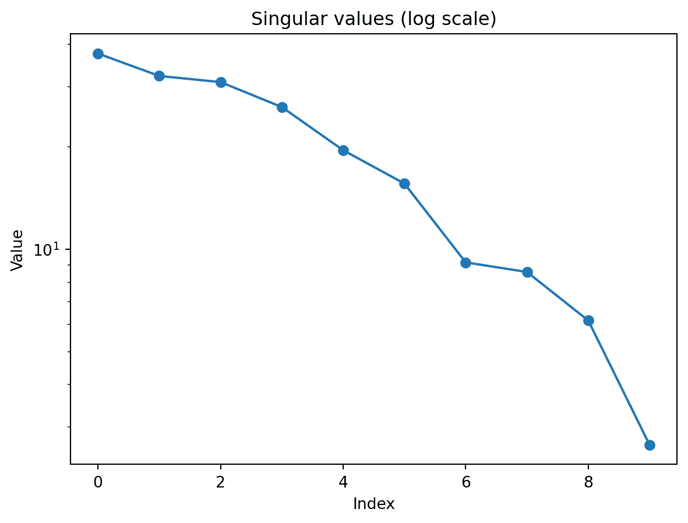*  *奇异值的下降显示了有效的秩。*****  ***#### 尝试自己动手做

1.  将 $A$ 中的扰动从 0.001 改为 0.000001，数值秩会改变吗？

1.  在随机矩形矩阵上测试带行交换的 QR。

1.  比较大型噪声矩阵的 QR 与 SVD 的秩估计。

#### 吸取的经验

+   Rank-revealing QR 是检测现实世界数据中有效秩的实用工具。

+   SVD 提供了最精确的图像（奇异值），但 QR 带行交换更快。

+   理解数值秩对于诊断、稳定性和模型复杂度控制至关重要。*******************************  ***## 第十章. 应用和计算

### 91. 2D/3D 几何管道（摄像机、旋转和变换）

线性代数为计算机图形学和机器人学中的几何管道提供动力。

+   2D 变换：旋转、缩放、平移。

+   3D 变换：相同的概念，但多了一个维度。

+   齐次坐标使我们能够将所有变换（甚至平移）统一为矩阵乘法。

#### 设置您的实验室

```py
import numpy as np
import matplotlib.pyplot as plt
```

*#### 逐步代码讲解

1.  2D 中的旋转

$$ R(\theta) = \begin{bmatrix} \cos\theta & -\sin\theta \\ \sin\theta & \cos\theta \end{bmatrix} $$

```py
theta = np.pi/4  # 45 degrees
R = np.array([[np.cos(theta), -np.sin(theta)],
 [np.sin(theta),  np.cos(theta)]])

point = np.array([1, 0])
rotated = R @ point

print("Original:", point)
print("Rotated:", rotated)
```

*```py
Original: [1 0]
Rotated: [0.70710678 0.70710678]
```*  *2. 使用齐次坐标进行平移

在 2D 中：

$$ T(dx, dy) = \begin{bmatrix} 1 & 0 & dx \\ 0 & 1 & dy \\ 0 & 0 & 1 \end{bmatrix} $$

```py
T = np.array([[1,0,2],
 [0,1,1],
 [0,0,1]])

p_h = np.array([1,1,1])  # homogeneous (x=1,y=1)
translated = T @ p_h
print("Translated point:", translated)
```

*```py
Translated point: [3 2 1]
```*  *3.  组合旋转 + 平移

变换通过矩阵乘法组合。

```py
M = T @ np.block([[R, np.zeros((2,1))],
 [np.zeros((1,2)), 1]])
combined = M @ p_h
print("Combined transform (rotation+translation):", combined)
```

*```py
Combined transform (rotation+translation): [2\.         2.41421356 1\.        ]
```*  *4.  3D 绕 z 轴旋转

$$ R_z(\theta) = \begin{bmatrix} \cos\theta & -\sin\theta & 0 \\ \sin\theta & \cos\theta & 0 \\ 0 & 0 & 1 \end{bmatrix} $$

```py
theta = np.pi/3
Rz = np.array([[np.cos(theta), -np.sin(theta), 0],
 [np.sin(theta),  np.cos(theta), 0],
 [0,              0,             1]])

point3d = np.array([1,0,0])
rotated3d = Rz @ point3d
print("3D rotated point:", rotated3d)
```

*```py
3D rotated point: [0.5       0.8660254 0\.       ]
```*  *5. 摄像机投影（3D → 2D）

简单的针孔模型：

$$ \begin{bmatrix} x' \\ y' \end{bmatrix} = \begin{bmatrix} f \cdot x / z \\ f \cdot y / z \end{bmatrix} $$

```py
f = 1.0  # focal length
P = np.array([[f,0,0],
 [0,f,0],
 [0,0,1]])  # projection matrix

point3d = np.array([2,3,5])
p_proj = P @ point3d
p_proj = p_proj[:2] / p_proj[2]  # divide by z
print("Projected 2D point:", p_proj)
```

*```py
Projected 2D point: [0.4 0.6]
```*****  ***#### 尝试自己动手做

1.  在 2D 中旋转一个正方形，然后平移它。绘制前后对比。

1.  绕 x、y 和 z 轴旋转 3D 点云。

1.  使用针孔相机模型将立方体投影到 2D。

#### 吸取的经验

+   几何管道 = 线性变换的序列。

+   齐次坐标统一了旋转、缩放和平移。

+   摄像机投影将 3D 世界与 2D 图像联系起来——这是图形和视觉的基石。****  ***### 92. 计算机图形学和机器人学（齐次技巧的实际应用）

计算机图形学和机器人学都依赖于同质坐标来统一旋转、平移、缩放和投影到一个单一框架。在 3D 中使用 $4 \times 4$ 矩阵，整个变换管线可以作为矩阵乘积构建。

#### 设置您的实验室

```py
import numpy as np
import matplotlib.pyplot as plt
```

*#### 逐步代码解析

1.  点的同质表示

在 3D 中：

$$ (x, y, z) \mapsto (x, y, z, 1) $$

```py
p = np.array([1,2,3,1])  # homogeneous point
```

*2.  定义平移、旋转和缩放矩阵

+   平移 $(dx,dy,dz)$：

```py
T = np.array([[1,0,0,2],
 [0,1,0,1],
 [0,0,1,3],
 [0,0,0,1]])
```

**   按因子 $(sx, sy, sz)$ 缩放：

```py
S = np.diag([2, 0.5, 1.5, 1])
```

**   绕 z 轴旋转（$\theta = 90^\circ$)：

```py
theta = np.pi/2
Rz = np.array([[np.cos(theta), -np.sin(theta), 0, 0],
 [np.sin(theta),  np.cos(theta), 0, 0],
 [0,              0,             1, 0],
 [0,              0,             0, 1]])
```

*3.  将变换组合成管线

```py
M = T @ Rz @ S  # first scale, then rotate, then translate
p_transformed = M @ p
print("Transformed point:", p_transformed)
```

*```py
Transformed point: [1\.  3\.  7.5 1\. ]
```*  *4.  机器人学：2 自由度机械臂的前向运动学

每个关节都是一个旋转 + 平移。

```py
def link(theta, length):
 return np.array([[np.cos(theta), -np.sin(theta), 0, length*np.cos(theta)],
 [np.sin(theta),  np.cos(theta), 0, length*np.sin(theta)],
 [0,              0,             1, 0],
 [0,              0,             0, 1]])

theta1, theta2 = np.pi/4, np.pi/6
L1, L2 = 2, 1.5

M1 = link(theta1, L1)
M2 = link(theta2, L2)

end_effector = M1 @ M2 @ np.array([0,0,0,1])
print("End effector position:", end_effector[:3])
```

*```py
End effector position: [1.80244213 2.8631023  0\.        ]
```*  *5.  图形学：简单的 3D 相机投影

```py
f = 2.0
P = np.array([[f,0,0,0],
 [0,f,0,0],
 [0,0,1,0]])

cube = np.array([[x,y,z,1] for x in [0,1] for y in [0,1] for z in [0,1]])
proj = (P @ cube.T).T
proj2d = proj[:,:2] / proj[:,2:3]

plt.scatter(proj2d[:,0], proj2d[:,1])
plt.title("Projected cube")
plt.show()
```

*```py
/var/folders/_g/lq_pglm508df70x751kkxrl80000gp/T/ipykernel_31637/2038614107.py:8: RuntimeWarning: divide by zero encountered in divide
  proj2d = proj[:,:2] / proj[:,2:3]
/var/folders/_g/lq_pglm508df70x751kkxrl80000gp/T/ipykernel_31637/2038614107.py:8: RuntimeWarning: invalid value encountered in divide
  proj2d = proj[:,:2] / proj[:,2:3]
```

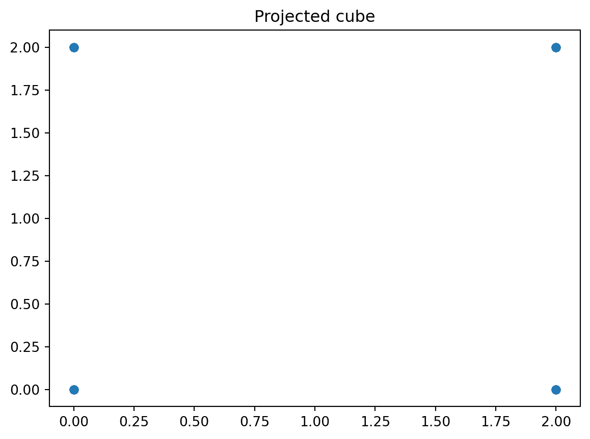*******  ***#### 尝试自己操作

1.  改变变换的顺序（`Rz @ S @ T`）。结果有何不同？

1.  向机器人臂添加第三个关节并计算新的末端执行器位置。

1.  用不同的焦距 $f$ 投影立方体。

#### 要点总结

+   同质坐标统一了所有变换。

+   机器人学使用这个框架进行前向运动学。

+   图形学使用它进行相机和投影管线。

+   这两个领域都依赖于相同的线性代数技巧 - 只是应用方式不同。****  ***### 93. 图、邻接和拉普拉斯（通过矩阵的网络）

通过将图编码到矩阵中，可以使用线性代数来研究图。其中两个最重要的：

+   邻接矩阵 $A$:

    $$ A_{ij} = \begin{cases} 1 & \text{if edge between i and j exists} \\ 0 & \text{otherwise} \end{cases} $$

+   图拉普拉斯矩阵 $L$：

    $$ L = D - A $$

    其中 $D$ 是度矩阵（$D_{ii} = $ 节点 $i$ 的邻居数量）。

这些矩阵让我们可以分析连通性、扩散和聚类。

#### 设置您的实验室

```py
import numpy as np
import networkx as nx
import matplotlib.pyplot as plt
```

*#### 逐步代码解析

1.  构建一个简单的图

```py
G = nx.Graph()
G.add_edges_from([(0,1), (1,2), (2,3), (3,0), (0,2)])  # square with diagonal

nx.draw(G, with_labels=True, node_color="lightblue", node_size=800)
plt.show()
```

*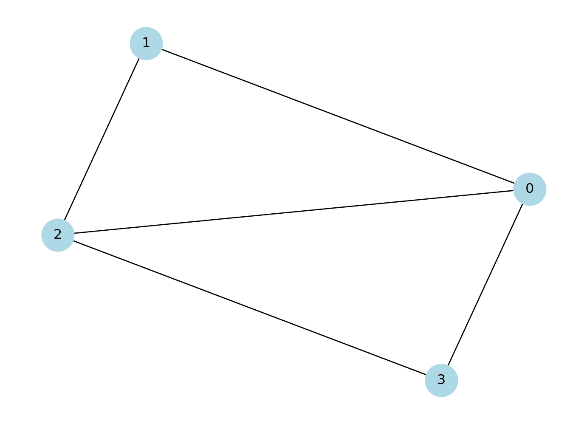*  *2.  邻接矩阵

```py
A = nx.to_numpy_array(G)
print("Adjacency matrix:\n", A)
```

*```py
Adjacency matrix:
 [[0\. 1\. 1\. 1.]
 [1\. 0\. 1\. 0.]
 [1\. 1\. 0\. 1.]
 [1\. 0\. 1\. 0.]]
```*  *3.  度矩阵和拉普拉斯矩阵

```py
D = np.diag(A.sum(axis=1))
L = D - A
print("Degree matrix:\n", D)
print("Graph Laplacian:\n", L)
```

*```py
Degree matrix:
 [[3\. 0\. 0\. 0.]
 [0\. 2\. 0\. 0.]
 [0\. 0\. 3\. 0.]
 [0\. 0\. 0\. 2.]]
Graph Laplacian:
 [[ 3\. -1\. -1\. -1.]
 [-1\.  2\. -1\.  0.]
 [-1\. -1\.  3\. -1.]
 [-1\.  0\. -1\.  2.]]
```*  *4.  拉普拉斯矩阵的特征值（连通性检查）

```py
eigvals, eigvecs = np.linalg.eigh(L)
print("Laplacian eigenvalues:", eigvals)
```

*```py
Laplacian eigenvalues: [1.11022302e-16 2.00000000e+00 4.00000000e+00 4.00000000e+00]
```*  **   零特征值的数量 = 连通分量的数量。

1.  谱嵌入（聚类）

使用拉普拉斯特征向量将节点嵌入低维空间。

```py
coords = eigvecs[:,1:3]  # skip the trivial first eigenvector
plt.scatter(coords[:,0], coords[:,1], c=range(len(coords)), cmap="tab10", s=200)
for i, (x,y) in enumerate(coords):
 plt.text(x, y, str(i), fontsize=12, ha="center", va="center", color="white")
plt.title("Spectral embedding of graph")
plt.show()
```

*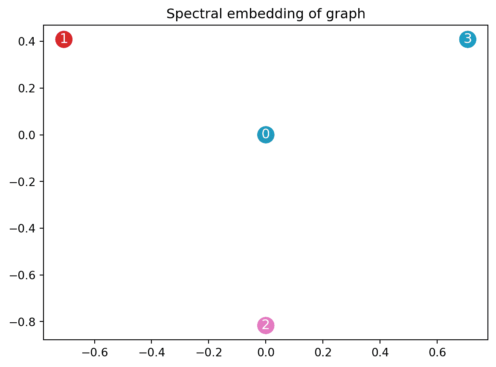*****  ***#### 尝试自己操作

1.  从图中移除一条边，看看拉普拉斯特征值如何变化。

1.  添加一个断开的节点 - 是否会出现额外的零特征值？

1.  尝试一个随机图，比较邻接矩阵和拉普拉斯矩阵的谱。

#### 要点总结

+   邻接矩阵描述了直接图结构。

+   拉普拉斯矩阵捕捉连通性和扩散。

+   $L$ 的特征值揭示了图属性，如连通性和聚类 - 通过线性代数连接网络。****  ***### 94. 数据预处理作为线性操作（中心化、白化、缩放）

许多机器学习和数据分析工作流程从预处理开始，而线性代数提供了工具。

+   居中：减去均值 → 将数据移动到原点。

+   缩放：除以标准差 → 归一化特征范围。

+   白化：去相关特征 → 使协方差矩阵为单位矩阵。

每一步都可以写成矩阵运算。

#### 设置您的实验室

```py
import numpy as np
import matplotlib.pyplot as plt
```

*#### 逐步代码解析

1.  生成相关数据

```py
np.random.seed(0)
X = np.random.randn(200, 2) @ np.array([[3,1],[1,0.5]])
plt.scatter(X[:,0], X[:,1], alpha=0.4)
plt.title("Original correlated data")
plt.axis("equal")
plt.show()
```

*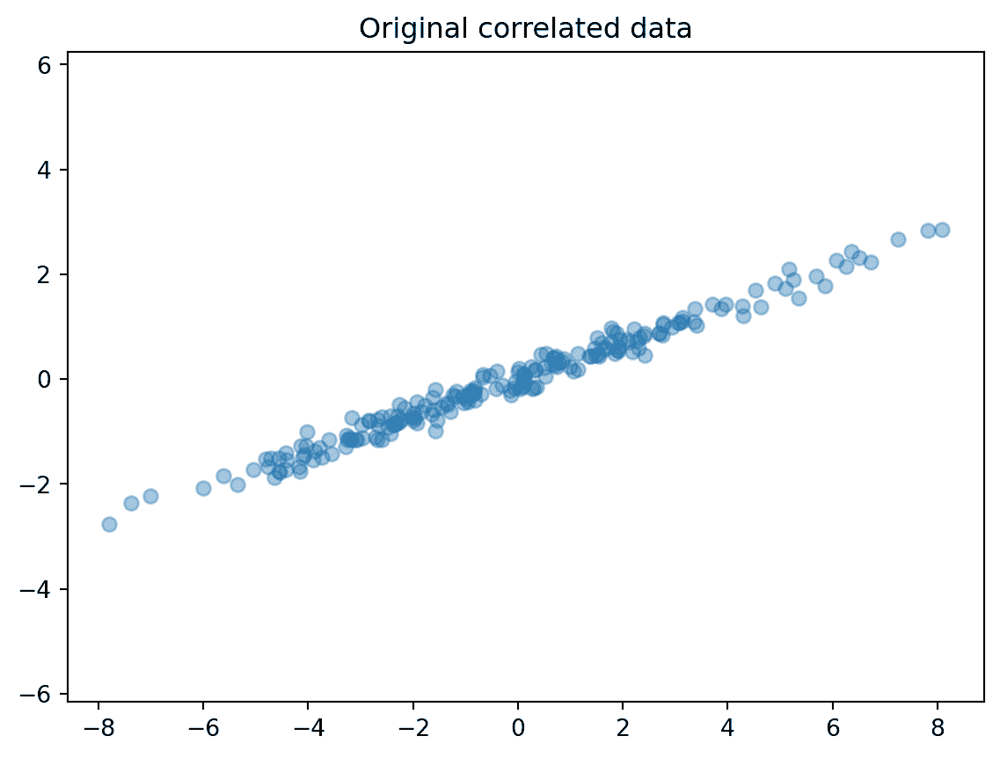*  *2.  居中（减去均值）

```py
X_centered = X - X.mean(axis=0)
print("Mean after centering:", X_centered.mean(axis=0))
```

*```py
Mean after centering: [ 8.88178420e-18 -1.22124533e-17]
```*  *3.  缩放（归一化特征）

```py
X_scaled = X_centered / X_centered.std(axis=0)
print("Std after scaling:", X_scaled.std(axis=0))
```

*```py
Std after scaling: [1\. 1.]
```*  *4.  通过特征分解进行白化

居中数据的协方差：

```py
C = np.cov(X_centered.T)
eigvals, eigvecs = np.linalg.eigh(C)

W = eigvecs @ np.diag(1/np.sqrt(eigvals)) @ eigvecs.T
X_white = X_centered @ W
```

*检查协方差：

```py
print("Whitened covariance:\n", np.cov(X_white.T))
```

*```py
Whitened covariance:
 [[1.00000000e+00 2.54402864e-15]
 [2.54402864e-15 1.00000000e+00]]
```*  *5.  比较散点图

```py
plt.subplot(1,3,1)
plt.scatter(X[:,0], X[:,1], alpha=0.4)
plt.title("Original")

plt.subplot(1,3,2)
plt.scatter(X_scaled[:,0], X_scaled[:,1], alpha=0.4)
plt.title("Scaled")

plt.subplot(1,3,3)
plt.scatter(X_white[:,0], X_white[:,1], alpha=0.4)
plt.title("Whitened")

plt.tight_layout()
plt.show()
```

*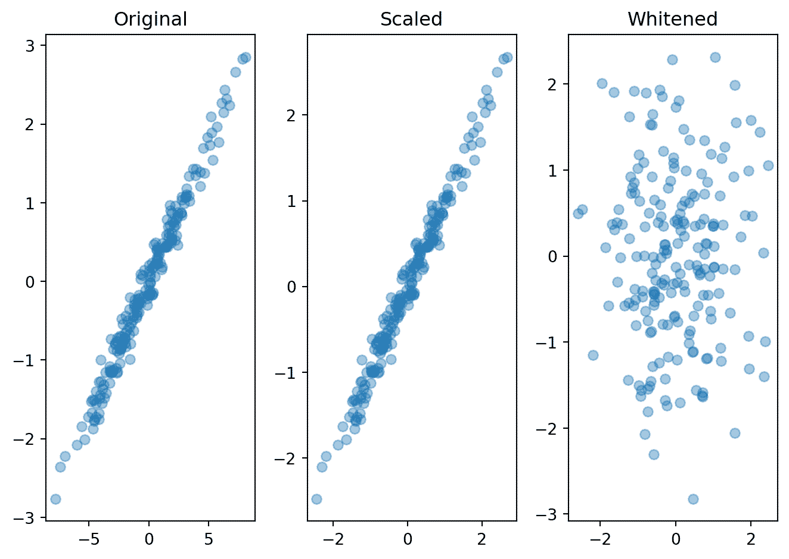*  **   原始：拉长的椭圆。

+   缩放后的：轴对齐的椭圆。

+   白化：圆形云（去相关，单位方差）。******  ***#### 尝试自己操作

1.  添加第三个特征并应用居中和缩放。

1.  比较白化与 PCA - 它们使用相同的特征分解。

1.  测试在白化之前跳过居中会发生什么。

#### 吸收要点

+   居中 → 均值为零。

+   缩放 → 单位方差。

+   白化 → 特征去相关，方差 = 1。线性代数提供了精确的矩阵运算，使预处理系统化和可靠。****  ***### 95. 线性回归与分类（从模型到矩阵）

线性回归和分类问题可以简洁地写成矩阵形式。这统一了数据、模型和解决方案，在最小二乘法和线性决策边界框架下。

#### 线性回归模型

对于数据 $(x_i, y_i)$：

$$ y \approx X \beta $$

+   $X$: 设计矩阵（行 = 样本，列 = 特征）。

+   $\beta$: 需要解决的系数。

+   解决方案（最小二乘法）：

$$ \hat{\beta} = (X^T X)^{-1} X^T y $$

#### 设置您的实验室

```py
import numpy as np
import matplotlib.pyplot as plt
from sklearn.datasets import make_classification
```

*#### 逐步代码解析

1.  线性回归示例

```py
np.random.seed(0)
X = np.linspace(0, 10, 30).reshape(-1,1)
y = 3*X.squeeze() + 5 + np.random.randn(30)*2
```

*构建包含偏差项的设计矩阵：

```py
X_design = np.column_stack([np.ones_like(X), X])
beta_hat, *_ = np.linalg.lstsq(X_design, y, rcond=None)
print("Fitted coefficients:", beta_hat)
```

*```py
Fitted coefficients: [6.65833151 2.84547628]
```*  *2.  可视化回归线

```py
y_pred = X_design @ beta_hat

plt.scatter(X, y, label="Data")
plt.plot(X, y_pred, 'r-', label="Fitted line")
plt.legend()
plt.show()
```

*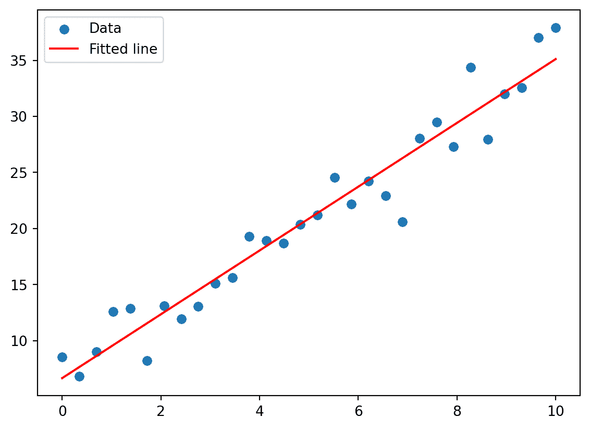*  *3.  使用线性决策边界的逻辑分类

```py
Xc, yc = make_classification(n_features=2, n_redundant=0, n_informative=2,
 n_clusters_per_class=1, n_samples=100, random_state=0)

plt.scatter(Xc[:,0], Xc[:,1], c=yc, cmap="bwr", alpha=0.7)
plt.title("Classification data")
plt.show()
```

*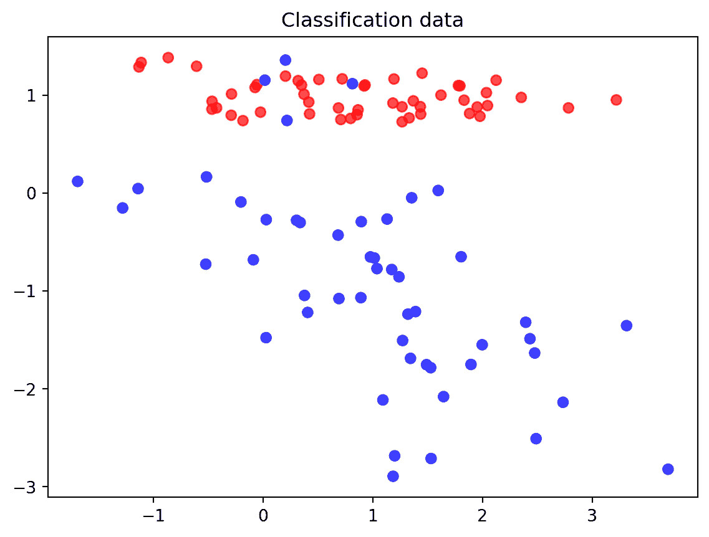*  *4.  通过梯度下降进行逻辑回归

```py
def sigmoid(z):
 return 1/(1+np.exp(-z))

X_design = np.column_stack([np.ones(len(Xc)), Xc])
y = yc

w = np.zeros(X_design.shape[1])
lr = 0.1

for _ in range(2000):
 preds = sigmoid(X_design @ w)
 grad = X_design.T @ (preds - y) / len(y)
 w -= lr * grad

print("Learned weights:", w)
```

*```py
Learned weights: [-2.10451116  0.70752542  4.13295129]
```*  *5.  绘制决策边界

```py
xx, yy = np.meshgrid(np.linspace(Xc[:,0].min()-1, Xc[:,0].max()+1, 200),
 np.linspace(Xc[:,1].min()-1, Xc[:,1].max()+1, 200))

grid = np.c_[np.ones(xx.size), xx.ravel(), yy.ravel()]
probs = sigmoid(grid @ w).reshape(xx.shape)

plt.contourf(xx, yy, probs, levels=[0,0.5,1], alpha=0.3, cmap="bwr")
plt.scatter(Xc[:,0], Xc[:,1], c=yc, cmap="bwr", edgecolor="k")
plt.title("Linear decision boundary")
plt.show()
```

*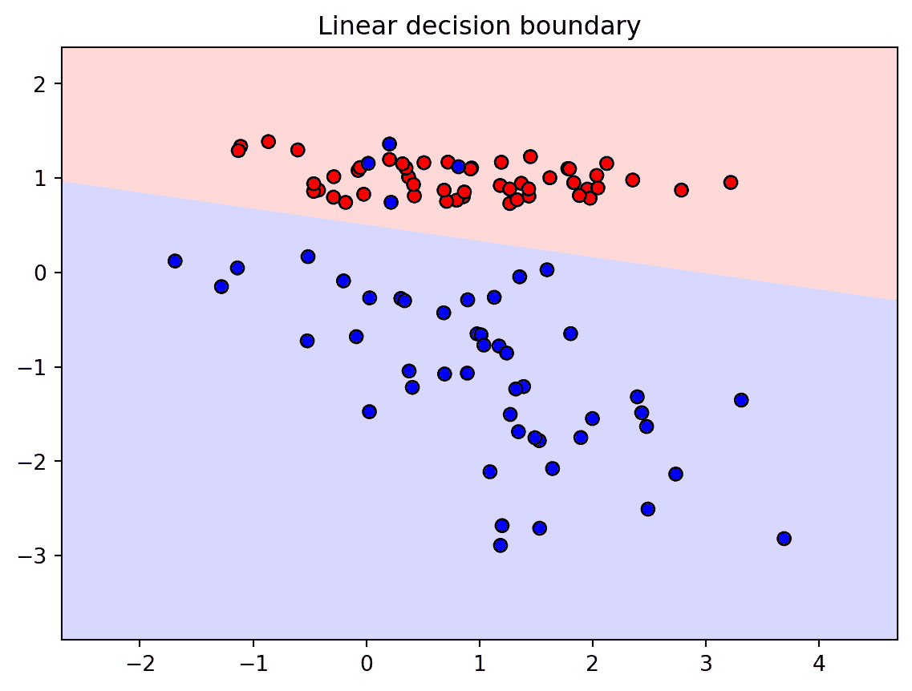******  ***#### 尝试自己操作

1.  将多项式特征添加到回归中并重新拟合。线会弯曲成曲线吗？

1.  改变逻辑回归中的学习率 - 会发生什么？

1.  生成非线性可分的数据。线性模型还能很好地分类吗？

#### 吸收要点

+   回归和分类自然地融入线性代数，使用矩阵公式。

+   最小二乘法直接解决回归问题；逻辑回归需要优化。

+   线性模型简单、可解释，仍然是现代机器学习的基础。****  ***### 96. 实践中的主成分分析（降维工作流程）

主成分分析（PCA）被广泛用于降低维度、压缩数据和可视化高维数据集。在这里，我们将通过完整的 PCA 工作流程进行讲解：中心化、计算成分、投影和可视化。

#### 设置您的实验室

```py
import numpy as np
import matplotlib.pyplot as plt
from sklearn.datasets import load_digits
```

*#### 逐步代码讲解

1.  加载数据集（数字）

```py
digits = load_digits()
X = digits.data  # shape (1797, 64)
y = digits.target
print("Data shape:", X.shape)
```

*```py
Data shape: (1797, 64)
```*  *每个样本是一个 8×8 的灰度图像，展平成 64 个特征。

1.  数据中心化

```py
X_centered = X - X.mean(axis=0)
```

*3. 通过 SVD 计算 PCA

```py
U, S, Vt = np.linalg.svd(X_centered, full_matrices=False)
explained_variance = (S**2) / (len(X) - 1)
explained_ratio = explained_variance / explained_variance.sum()
```

*4. 绘制解释方差比

```py
plt.plot(np.cumsum(explained_ratio[:30]), 'o-')
plt.xlabel("Number of components")
plt.ylabel("Cumulative explained variance")
plt.title("PCA explained variance")
plt.grid(True)
plt.show()
```

*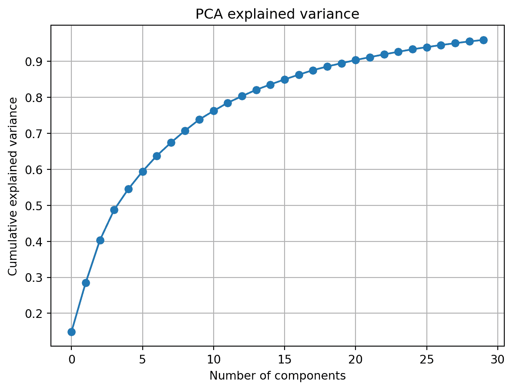*  *这显示了需要多少个成分来捕捉大部分方差。

1.  投影到前两个成分进行可视化

```py
X_pca2 = X_centered @ Vt[:2].T
plt.scatter(X_pca2[:,0], X_pca2[:,1], c=y, cmap="tab10", alpha=0.6, s=15)
plt.colorbar()
plt.title("Digits dataset (PCA 2D projection)")
plt.show()
```

*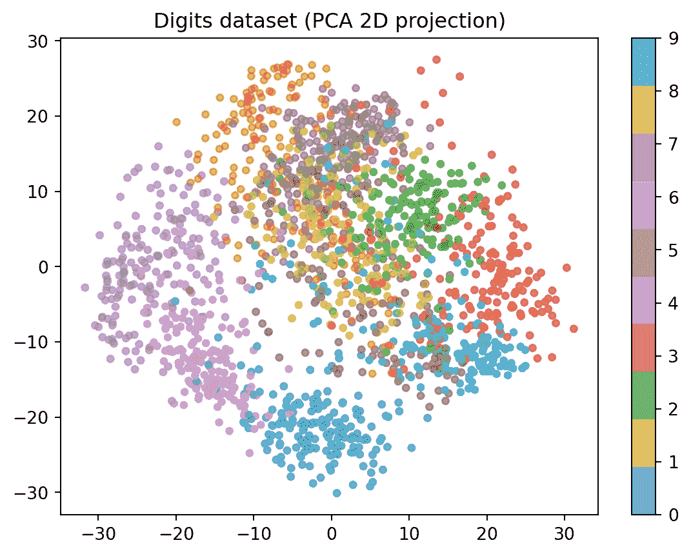*  *6. 从降低的维度重建图像

```py
k = 20
X_pca20 = X_centered @ Vt[:k].T
X_reconstructed = X_pca20 @ Vt[:k]

fig, axes = plt.subplots(2, 10, figsize=(10,2))
for i in range(10):
 axes[0,i].imshow(X[i].reshape(8,8), cmap="gray")
 axes[0,i].axis("off")
 axes[1,i].imshow(X_reconstructed[i].reshape(8,8), cmap="gray")
 axes[1,i].axis("off")
plt.suptitle("Original (top) vs PCA reconstruction (bottom, 20 comps)")
plt.show()
```

*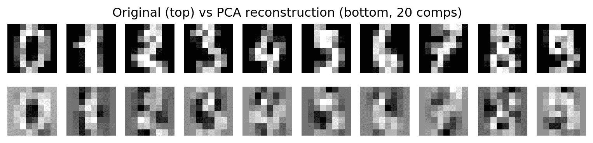*  *即使只有 20/64 个成分，数字仍然可识别。******  ***#### 尝试自己操作

1.  将$k$改为 5，10，30 - 重建如何变化？

1.  使用前两个 PCA 成分用 k-NN 对数字进行分类。准确率与完整的 64 个特征相比如何？

1.  在您的数据集（图像、表格数据）上尝试 PCA。

#### **要点**

+   PCA 在保持最大方差的同时减少维度。

+   实际操作：中心化 → 分解 → 选择前几个成分 → 投影/重建。

+   PCA 在现实世界的流程中实现了可视化、压缩和去噪。****  ***### 97. 推荐系统和低秩模型（填充缺失条目）

推荐系统通常处理不完整的矩阵 - 行是用户，列是项目，条目是评分。大多数条目是缺失的，但矩阵通常接近低秩（因为用户偏好只依赖于几个隐藏因素）。SVD 和低秩近似是填充这些缺失值的有力工具。

#### 设置您的实验室

```py
import numpy as np
import matplotlib.pyplot as plt
```

*#### 逐步代码讲解

1.  模拟用户-项目评分矩阵

```py
np.random.seed(0)
true_users = np.random.randn(10, 3)   # 10 users, 3 latent features
true_items = np.random.randn(3, 8)    # 8 items
R_full = true_users @ true_items      # true low-rank ratings
```

*2. 隐藏一些评分（模拟缺失数据）*

```py
mask = np.random.rand(*R_full.shape) > 0.3  # keep 70% of entries
R_obs = np.where(mask, R_full, np.nan)

print("Observed ratings:\n", R_obs)
```

*```py
Observed ratings:
 [[-1.10781465         nan -3.56526968         nan -2.1729387   1.43510077
   1.46641178  0.79023284]
 [ 0.84819453         nan         nan         nan         nan         nan
   2.30434358  3.03008138]
 [        nan  0.32479187 -0.51818422         nan  0.02013802         nan
   1.29874918  1.33053637]
 [-1.81407786  1.24241182         nan -1.32723907         nan         nan
  -0.31110699         nan]
 [-0.48527696         nan -1.51957106         nan -0.86984941  0.52807989
          nan  0.33771451]
 [-0.26997359 -0.48498966         nan -2.73891459 -2.48167957  2.88740609
  -0.24614835         nan]
 [ 3.57769701 -1.608339    4.73789234  1.13583164  3.63451505 -2.60495928
   2.12453635  3.76472563]
 [ 0.69623809 -0.59117353 -0.28890188 -2.36431192         nan  1.50136796
   0.74268078         nan]
 [ 0.85768141  1.33357168         nan         nan  1.65089037 -2.46456289
   3.51030491  3.31220347]
 [-2.463496    0.60826298 -3.81241599 -2.11839267 -3.86597359  3.52934055
  -1.76203083 -2.63130953]]
```*  *3. 简单均值填充（基线）

```py
R_mean = np.where(np.isnan(R_obs), np.nanmean(R_obs), R_obs)
```

*4. 应用 SVD 进行低秩近似

```py
# Replace NaNs with zeros for SVD step
R_filled = np.nan_to_num(R_obs, nan=0.0)

U, S, Vt = np.linalg.svd(R_filled, full_matrices=False)

k = 3  # latent dimension
R_approx = U[:, :k] @ np.diag(S[:k]) @ Vt[:k, :]
```

*5. 比较填充矩阵与真实值

```py
error = np.nanmean((R_full - R_approx)**2)
print("Approximation error (MSE):", error)
```

*```py
Approximation error (MSE): 1.4862378490976202
```*  *6. 可视化原始与重建

```py
fig, axes = plt.subplots(1, 2, figsize=(8,4))
axes[0].imshow(R_full, cmap="viridis")
axes[0].set_title("True ratings")
axes[1].imshow(R_approx, cmap="viridis")
axes[1].set_title("Low-rank approximation")
plt.show()
```

*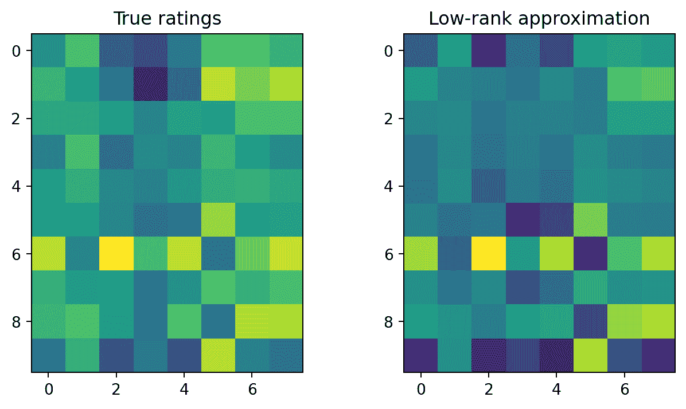******  ***#### 尝试自己操作

1.  改变$k$（2，3，5）。错误会下降吗？

1.  遮盖更多条目（50%，80%） - SVD 重建的表现如何？

1.  使用迭代填充：交替使用低秩近似填充缺失条目。

#### **要点**

+   推荐系统依赖于用户-项目矩阵的低秩结构。

+   SVD 提供了一种自然的方法来近似和填充缺失的评分。

+   这种低秩建模思想是现代协同过滤系统（如 Netflix 和 Spotify 推荐系统）的基础。****  ***### 98. PageRank 和随机游走（使用特征向量进行排名）

PageRank 算法，由 Google 使其闻名，使用线性代数和图上的随机游走来对节点（网页、人物、项目）进行排名。思想：重要性通过链接流动 - 被重要节点链接使你变得重要。

#### **PageRank 思想**

+   在图上开始随机游走：在每一步，移动到随机邻居。

+   添加一个概率为$1 - \alpha$的“传送”步骤以避免死胡同。

+   此游走的稳态分布是 PageRank 向量，它是作为转换矩阵的主特征向量找到的。

#### 设置您的实验室

```py
import numpy as np
import networkx as nx
import matplotlib.pyplot as plt
```

*#### 逐步代码讲解

1.  构建一个小有向图

```py
G = nx.DiGraph()
G.add_edges_from([
 (0,1), (1,2), (2,0),  # cycle among 0–1–2
 (2,3), (3,2),         # back-and-forth 2–3
 (1,3), (3,4), (4,1)   # small loop with 1–3–4
])
nx.draw_circular(G, with_labels=True, node_color="lightblue", node_size=800, arrowsize=15)
plt.show()
```

**  *2.  构建邻接和转换矩阵

```py
n = G.number_of_nodes()
A = nx.to_numpy_array(G, nodelist=range(n))
P = A / A.sum(axis=1, keepdims=True)  # row-stochastic transition matrix
```

*3.  添加传送（Google 矩阵）

```py
alpha = 0.85  # damping factor
G_matrix = alpha * P + (1 - alpha) * np.ones((n,n)) / n
```

*4.  功迭代计算 PageRank

```py
r = np.ones(n) / n  # start uniform
for _ in range(100):
 r = r @ G_matrix
r /= r.sum()
print("PageRank vector:", r)
```

*```py
PageRank vector: [0.13219034 0.25472358 0.24044787 0.24044787 0.13219034]
```*  *5.  与 NetworkX 内置比较

```py
pr = nx.pagerank(G, alpha=alpha)
print("NetworkX PageRank:", pr)
```

*```py
NetworkX PageRank: {0: 0.13219008157546333, 1: 0.2547244023837789, 2: 0.24044771723264727, 3: 0.24044771723264727, 4: 0.13219008157546333}
```*  *6.  可视化节点重要性

```py
sizes = [5000 * r_i for r_i in r]
nx.draw_circular(G, with_labels=True, node_size=sizes, node_color="lightblue", arrowsize=15)
plt.title("PageRank visualization (node size ~ importance)")
plt.show()
```

*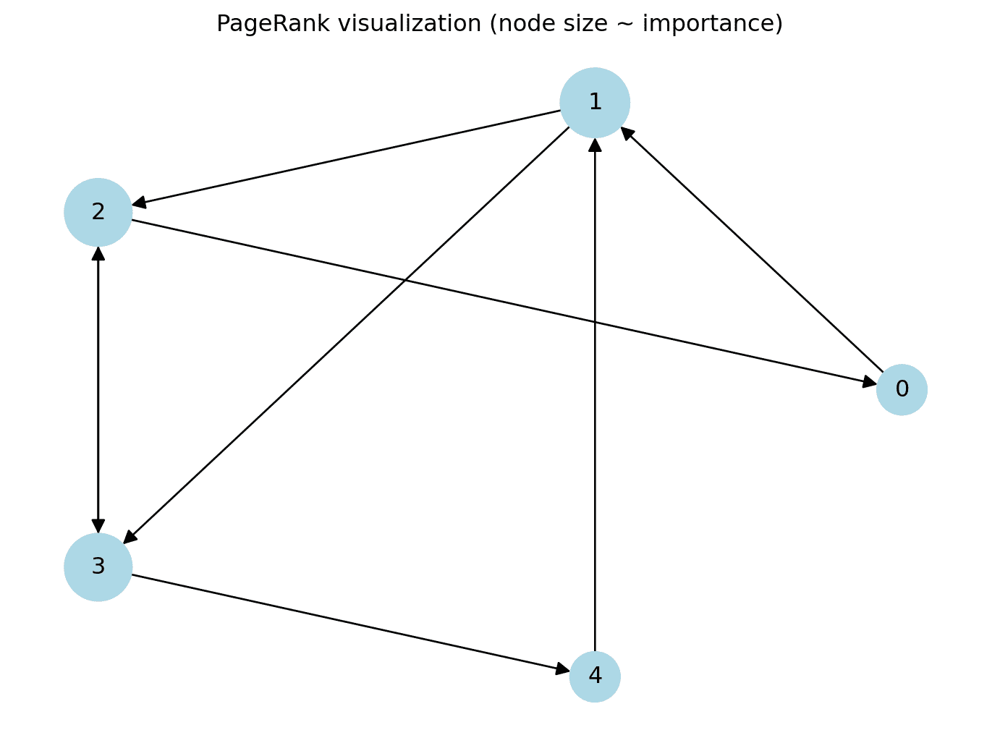******  ***#### 尝试自己操作

1.  改变$\alpha$（例如，0.6 与 0.95）。排名会改变吗？

1.  添加一个没有出链的“悬空节点”。传送如何处理它？

1.  在更大的图（如具有 50 个节点的随机图）上尝试 PageRank。

#### 吸收要点

+   PageRank 是一个随机游走稳态问题。

+   这简化为寻找 Google 矩阵的主特征向量。

+   此方法推广到网页之外 - 影响排名、推荐和网络分析。****  ***### 99. 数值线性代数基础（浮点，BLAS/LAPACK）

当在计算机上处理线性代数时，数字并不精确。它们存在于浮点运算中，计算依赖于高度优化的库，如 BLAS 和 LAPACK。理解这些基本知识对于进行大规模线性代数计算至关重要。

#### 浮点基础

+   数字以 2 为底的科学记数法存储：

    $$ x = \pm (1.b_1b_2b_3\ldots) \times 2^e $$

+   有限精度意味着舍入误差。

+   两个关键常数：

    +   机器 epsilon（$$)：可检测的最小差异（\(2^{-16}$）对于双精度。

    +   溢出/下溢：太大或太小以至于无法表示。

#### 设置您的实验室

```py
import numpy as np
```

*#### 逐步代码讲解

1.  机器 epsilon

```py
eps = np.finfo(float).eps
print("Machine epsilon:", eps)
```

*```py
Machine epsilon: 2.220446049250313e-16
```*  *2.  四舍五入误差演示

```py
a = 1e16
b = 1.0
print("a + b - a:", (a + b) - a)  # may lose b due to precision limits
```

*```py
a + b - a: 0.0
```*  *3.  矩阵求逆的稳定性

```py
A = np.array([[1, 1.0001], [1.0001, 1]])
b = np.array([2, 2.0001])

x_direct = np.linalg.solve(A, b)
x_via_inv = np.linalg.inv(A) @ b

print("Solve:", x_direct)
print("Inverse method:", x_via_inv)
```

*```py
Solve: [1.499975 0.499975]
Inverse method: [1.499975 0.499975]
```*  *注意：使用`np.linalg.inv`可能不太稳定 - 最好直接求解。

1.  矩阵的条件

```py
cond = np.linalg.cond(A)
print("Condition number:", cond)
```

*```py
Condition number: 20001.00000000417
```*  **   大条件数 → 小输入变化导致大输出变化。

1.  BLAS/LAPACK 内部

```py
A = np.random.randn(500, 500)
B = np.random.randn(500, 500)

# Matrix multiplication (calls optimized BLAS under the hood)
C = A @ B
```

*这个`@`运算符不是一个简单的循环 - 它调用一个高度优化的 C/Fortran 例程。*****  ***#### 尝试自己操作

1.  比较解决`Ax = b`与`np.linalg.solve`和`np.linalg.inv(A) @ b`对于更大、条件较差的系统。

1.  在几乎奇异的矩阵上使用`np.linalg.svd`。奇异值有多稳定？

1.  检查性能：对于大小为 100、500、1000 的情况，计算`A @ B`的时间。

#### 吸收要点

+   数值线性代数 = 数学 + 浮点现实。

+   总是优先选择稳定的算法（`solve`、`qr`、`svd`）而不是简单的求逆。

+   类似于 BLAS/LAPACK 的库可以使大型计算变得快速，但理解精度和条件可以防止出现令人惊讶的问题。****  ***### 100. 终极问题集和下一步（精通之路）

本节将所有内容串联起来。它不是引入一个新主题，而是提供了结合书中多个想法的基石实验室。通过解决这些问题，你会对自己能够将线性代数应用于实际问题充满信心。

#### 问题集 1 - 使用 SVD 进行图像压缩

将图像视为矩阵，并用低秩奇异值分解（SVD）对其进行近似。

```py
import numpy as np
import matplotlib.pyplot as plt
from skimage import data, color

# Load grayscale image
img = color.rgb2gray(data.astronaut())
U, S, Vt = np.linalg.svd(img, full_matrices=False)

# Approximate with rank-k
k = 50
img_approx = U[:, :k] @ np.diag(S[:k]) @ Vt[:k, :]

plt.subplot(1,2,1)
plt.imshow(img, cmap="gray")
plt.title("Original")
plt.axis("off")

plt.subplot(1,2,2)
plt.imshow(img_approx, cmap="gray")
plt.title(f"Rank-{k} Approximation")
plt.axis("off")

plt.show()
```

**  *尝试不同的$k$值（5、20、100）。质量和压缩之间的权衡如何？*  *#### 问题集 2 - 使用 PCA + 回归进行预测建模

将降维的 PCA 与预测的线性回归相结合。

```py
from sklearn.datasets import load_diabetes
from sklearn.model_selection import train_test_split
from sklearn.linear_model import LinearRegression
from sklearn.decomposition import PCA

# Load dataset
X, y = load_diabetes(return_X_y=True)
X_train, X_test, y_train, y_test = train_test_split(X, y, random_state=0)

# PCA reduce features
pca = PCA(n_components=5)
X_train_pca = pca.fit_transform(X_train)
X_test_pca = pca.transform(X_test)

# Regression on reduced space
model = LinearRegression().fit(X_train_pca, y_train)
print("R² on test set:", model.score(X_test_pca, y_test))
```

*```py
R² on test set: 0.3691398497153573
```*  *降低维度会提高还是损害准确性？*  *#### 问题集 3 - 使用 PageRank 进行图分析

将 PageRank 应用于自定义网络。

```py
import networkx as nx

G = nx.barabasi_albert_graph(20, 2)  # 20 nodes, scale-free graph
pr = nx.pagerank(G, alpha=0.85)

nx.draw(G, with_labels=True, node_size=[5000*pr[n] for n in G], node_color="lightblue")
plt.title("PageRank on a scale-free graph")
plt.show()
```

*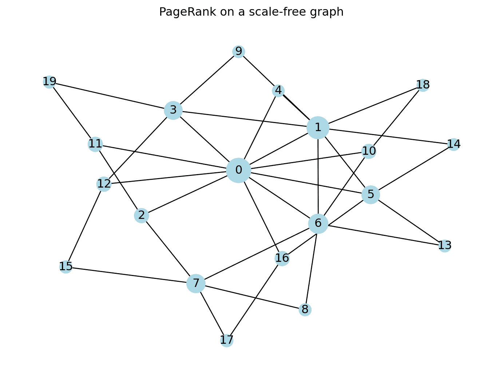*  *哪些节点占主导地位？结构如何影响排名？*  *#### 问题集 4 - 使用特征分解求解微分方程

使用特征值/特征向量求解线性动态系统。

```py
A = np.array([[0,1],[-2,-3]])
eigvals, eigvecs = np.linalg.eig(A)

print("Eigenvalues:", eigvals)
print("Eigenvectors:\n", eigvecs)
```

*```py
Eigenvalues: [-1\. -2.]
Eigenvectors:
 [[ 0.70710678 -0.4472136 ]
 [-0.70710678  0.89442719]]
```*  *预测长期行为：系统会衰减、振荡还是增长？*  *#### 问题集 5 - 对定系统使用最小二乘法

```py
np.random.seed(0)
X = np.random.randn(100, 3)
beta_true = np.array([2, -1, 0.5])
y = X @ beta_true + np.random.randn(100)*0.1

beta_hat, *_ = np.linalg.lstsq(X, y, rcond=None)
print("Estimated coefficients:", beta_hat)
```

*```py
Estimated coefficients: [ 1.99371939 -1.00708947  0.50661857]
```*  *比较估计系数与真实系数。它们有多接近？*  *#### 尝试自己来做

1.  结合 SVD 和推荐系统——使用合成数据构建电影推荐系统。

1.  手动实现 Gram-Schmidt 过程，并用`np.linalg.qr`进行测试。

1.  编写一个包含你最喜欢的辅助函数的迷你“线性代数工具包”。

#### 吸收要点

+   你已经练习了向量、矩阵、系统、特征值、SVD、PCA、PageRank 等内容。

+   真实问题通常结合多个概念——实验室展示了所有这些是如何相互关联的。

+   下一步：深入研究数值线性代数，探索机器学习应用，或研究高级矩阵分解（Jordan 形式、张量分解）。

这标志着动手实践的结束。到现在为止，你不仅了解了理论——你还可以将线性代数作为 Python 中用于数据、科学和工程的实用工具。
