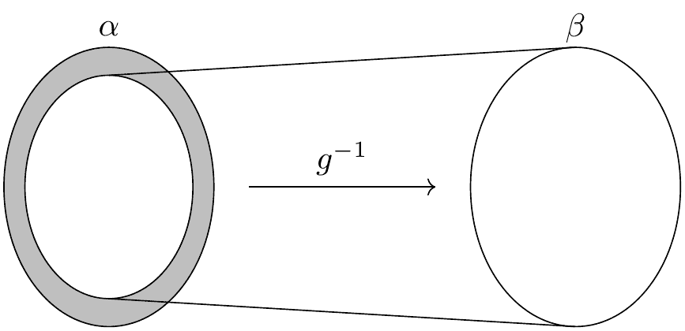
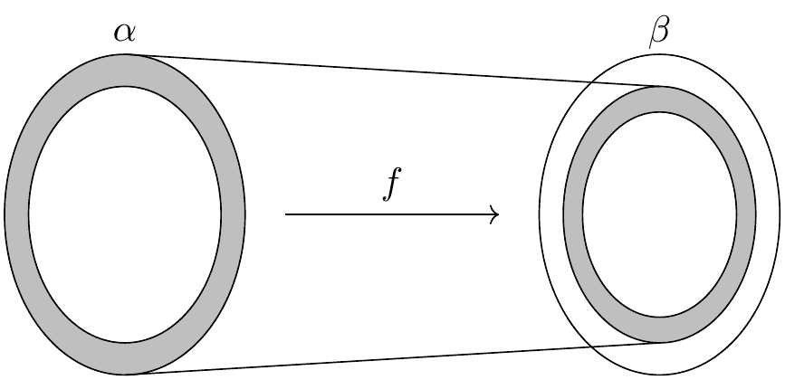
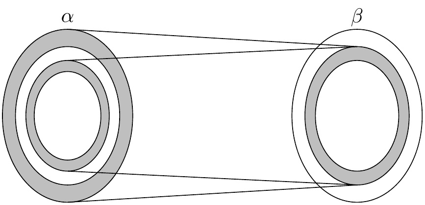

# 4. 集合与函数

> 原文：[`leanprover-community.github.io/mathematics_in_lean/C04_Sets_and_Functions.html`](https://leanprover-community.github.io/mathematics_in_lean/C04_Sets_and_Functions.html)

*Lean 中的数学* **   4. 集合与函数

+   查看页面源代码

* * *

集合、关系和函数的词汇为在数学的所有分支中进行构造提供了一个统一的语言。由于函数和关系可以用集合来定义，公理化集合论可以用作数学的基础。

Lean 的基础建立在原始的 *类型* 概念之上，并且包括定义类型之间函数的方法。Lean 中的每个表达式都有一个类型：有自然数、实数、从实数到实数的函数、群、向量空间等等。一些表达式 *是* 类型，也就是说，它们的类型是 `Type`。Lean 和 Mathlib 提供了定义新类型以及定义那些类型对象的方法。

从概念上讲，你可以将类型视为仅仅是对象集合。要求每个对象都有类型有一些优点。例如，它使得重载像 `+` 这样的符号成为可能，并且有时它使得输入更简洁，因为 Lean 可以从对象类型中推断出很多信息。类型系统还使 Lean 能够在将函数应用于错误数量的参数或应用于错误类型的参数时标记错误。

Lean 的库确实定义了基本的集合论概念。与集合论不同，在 Lean 中，集合始终是某些类型（如自然数集合或从实数到实数的函数集合）的对象的集合。类型和集合之间的区别需要一些习惯，但本章将带你了解其基本概念。

## 4.1. 集合

如果 `α` 是任何类型，则类型 `Set α` 由 `α` 的元素组成的集合组成。此类型支持通常的集合论操作和关系。例如，`s ⊆ t` 表示 `s` 是 `t` 的子集，`s ∩ t` 表示 `s` 和 `t` 的交集，而 `s ∪ t` 表示它们的并集。子集关系可以用 `\ss` 或 `\sub` 来表示，交集可以用 `\i` 或 `\cap` 来表示，并集可以用 `\un` 或 `\cup` 来表示。库还定义了包含类型 `α` 所有元素的集合 `univ`，以及空集 `∅`，它可以表示为 `\empty`。给定 `x : α` 和 `s : Set α`，表达式 `x ∈ s` 表示 `x` 是 `s` 的成员。提及集合成员关系的定理通常在其名称中包含 `mem`。表达式 `x ∉ s` 简写为 `¬ x ∈ s`。你可以用 `\in` 或 `\mem` 来表示 `∈`，用 `\notin` 来表示 `∉`。

证明集合属性的一种方法是用 `rw` 或简化器来展开定义。在下面的第二个例子中，我们使用 `simp only` 来告诉简化器只使用我们给出的标识符列表，而不是其完整的标识符数据库。与 `rw` 不同，`simp` 可以在全称量词或存在量词内部执行简化。如果你逐步进行证明，你可以看到这些命令的效果。

```py
variable  {α  :  Type*}
variable  (s  t  u  :  Set  α)
open  Set

example  (h  :  s  ⊆  t)  :  s  ∩  u  ⊆  t  ∩  u  :=  by
  rw  [subset_def,  inter_def,  inter_def]
  rw  [subset_def]  at  h
  simp  only  [mem_setOf]
  rintro  x  ⟨xs,  xu⟩
  exact  ⟨h  _  xs,  xu⟩

example  (h  :  s  ⊆  t)  :  s  ∩  u  ⊆  t  ∩  u  :=  by
  simp  only  [subset_def,  mem_inter_iff]  at  *
  rintro  x  ⟨xs,  xu⟩
  exact  ⟨h  _  xs,  xu⟩ 
```

在这个例子中，我们打开 `set` 命名空间以访问定理的简短名称。但实际上，我们可以完全删除对 `rw` 和 `simp` 的调用：

```py
example  (h  :  s  ⊆  t)  :  s  ∩  u  ⊆  t  ∩  u  :=  by
  intro  x  xsu
  exact  ⟨h  xsu.1,  xsu.2⟩ 
```

这里发生的事情被称为*定义性简化*：为了理解 `intro` 命令和 Lean 强制展开的定义，匿名构造器。以下示例也说明了这种现象：

```py
example  (h  :  s  ⊆  t)  :  s  ∩  u  ⊆  t  ∩  u  :=
  fun  x  ⟨xs,  xu⟩  ↦  ⟨h  xs,  xu⟩ 
```

要处理并集，我们可以使用 `Set.union_def` 和 `Set.mem_union`。由于 `x ∈ s ∪ t` 展开为 `x ∈ s ∨ x ∈ t`，我们也可以使用 `cases` 策略来强制进行定义性简化。

```py
example  :  s  ∩  (t  ∪  u)  ⊆  s  ∩  t  ∪  s  ∩  u  :=  by
  intro  x  hx
  have  xs  :  x  ∈  s  :=  hx.1
  have  xtu  :  x  ∈  t  ∪  u  :=  hx.2
  rcases  xtu  with  xt  |  xu
  ·  left
  show  x  ∈  s  ∩  t
  exact  ⟨xs,  xt⟩
  ·  right
  show  x  ∈  s  ∩  u
  exact  ⟨xs,  xu⟩ 
```

由于交集比并集绑定更紧密，表达式 `(s ∩ t) ∪ (s ∩ u)` 中的括号是不必要的，但它们使表达式的含义更清晰。以下是对同一事实的更简短的证明：

```py
example  :  s  ∩  (t  ∪  u)  ⊆  s  ∩  t  ∪  s  ∩  u  :=  by
  rintro  x  ⟨xs,  xt  |  xu⟩
  ·  left;  exact  ⟨xs,  xt⟩
  ·  right;  exact  ⟨xs,  xu⟩ 
```

作为练习，尝试证明另一个包含：

```py
example  :  s  ∩  t  ∪  s  ∩  u  ⊆  s  ∩  (t  ∪  u)  :=  by
  sorry 
```

有时使用 `rintro` 时，可能需要在析取模式 `h1 | h2` 的周围使用括号，以便 Lean 正确解析它。

该库还定义了集合差，`s \ t`，其中反斜杠是一个特殊的 unicode 字符，输入为 `\\`。表达式 `x ∈ s \ t` 展开为 `x ∈ s ∧ x ∉ t`。（`∉` 可以输入为 `\notin`。）可以使用 `Set.diff_eq` 和 `dsimp` 或 `Set.mem_diff` 手动重写，但以下两个包含同一性的证明显示了如何避免使用它们。

```py
example  :  (s  \  t)  \  u  ⊆  s  \  (t  ∪  u)  :=  by
  intro  x  xstu
  have  xs  :  x  ∈  s  :=  xstu.1.1
  have  xnt  :  x  ∉  t  :=  xstu.1.2
  have  xnu  :  x  ∉  u  :=  xstu.2
  constructor
  ·  exact  xs
  intro  xtu
  -- x ∈ t ∨ x ∈ u
  rcases  xtu  with  xt  |  xu
  ·  show  False;  exact  xnt  xt
  ·  show  False;  exact  xnu  xu

example  :  (s  \  t)  \  u  ⊆  s  \  (t  ∪  u)  :=  by
  rintro  x  ⟨⟨xs,  xnt⟩,  xnu⟩
  use  xs
  rintro  (xt  |  xu)  <;>  contradiction 
```

作为练习，证明反向包含：

```py
example  :  s  \  (t  ∪  u)  ⊆  (s  \  t)  \  u  :=  by
  sorry 
```

要证明两个集合相等，只需证明一个集合的每个元素也是另一个集合的元素。这个原则被称为“扩展性”，而且不出所料，`ext` 策略被装备来处理它。

```py
example  :  s  ∩  t  =  t  ∩  s  :=  by
  ext  x
  simp  only  [mem_inter_iff]
  constructor
  ·  rintro  ⟨xs,  xt⟩;  exact  ⟨xt,  xs⟩
  ·  rintro  ⟨xt,  xs⟩;  exact  ⟨xs,  xt⟩ 
```

再次强调，删除 `simp only [mem_inter_iff]` 行不会损害证明。事实上，如果你喜欢难以理解的证明项，以下是一行证明：

```py
example  :  s  ∩  t  =  t  ∩  s  :=
  Set.ext  fun  x  ↦  ⟨fun  ⟨xs,  xt⟩  ↦  ⟨xt,  xs⟩,  fun  ⟨xt,  xs⟩  ↦  ⟨xs,  xt⟩⟩ 
```

这里是一个更简短的证明，使用了简化器：

```py
example  :  s  ∩  t  =  t  ∩  s  :=  by  ext  x;  simp  [and_comm] 
```

使用 `ext` 的一个替代方法是使用定理 `Subset.antisymm`，它允许我们通过证明 `s ⊆ t` 和 `t ⊆ s` 来证明集合之间的等式 `s = t`。

```py
example  :  s  ∩  t  =  t  ∩  s  :=  by
  apply  Subset.antisymm
  ·  rintro  x  ⟨xs,  xt⟩;  exact  ⟨xt,  xs⟩
  ·  rintro  x  ⟨xt,  xs⟩;  exact  ⟨xs,  xt⟩ 
```

尝试完成这个证明项：

```py
example  :  s  ∩  t  =  t  ∩  s  :=
  Subset.antisymm  sorry  sorry 
```

记住，你可以用下划线替换 `sorry`，并且当你悬停在它上面时，Lean 会显示它在该点期望的内容。

这里有一些你可能喜欢证明的集合论恒等式：

```py
example  :  s  ∩  (s  ∪  t)  =  s  :=  by
  sorry

example  :  s  ∪  s  ∩  t  =  s  :=  by
  sorry

example  :  s  \  t  ∪  t  =  s  ∪  t  :=  by
  sorry

example  :  s  \  t  ∪  t  \  s  =  (s  ∪  t)  \  (s  ∩  t)  :=  by
  sorry 
```

当涉及到表示集合时，以下是底层发生的事情。在类型论中，类型 `α` 上的 *属性* 或 *谓词* 只是一个函数 `P : α → Prop`。这是有意义的：给定 `a : α`，`P a` 只是 `P` 对 `a` 成立的命题。在库中，`Set α` 被定义为 `α → Prop`，`x ∈ s` 被定义为 `s x`。换句话说，集合实际上是属性，被视为对象。

图书馆还定义了集合构造器符号。表达式 `{ y | P y }` 展开为 `(fun y ↦ P y)`，因此 `x ∈ { y | P y }` 简化为 `P x`。因此，我们可以将偶数的属性转换为偶数集合：

```py
def  evens  :  Set  ℕ  :=
  {  n  |  Even  n  }

def  odds  :  Set  ℕ  :=
  {  n  |  ¬Even  n  }

example  :  evens  ∪  odds  =  univ  :=  by
  rw  [evens,  odds]
  ext  n
  simp  [-Nat.not_even_iff_odd]
  apply  Classical.em 
```

你应该逐步进行这个证明，并确保你理解了正在进行的事情。注意，我们告诉简化器不要使用引理 `Nat.not_even_iff`，因为我们希望保留 `¬ Even n` 在我们的目标中。尝试删除 `rw [evens, odds]` 这一行，并确认证明仍然有效。

事实上，集合构造器符号用于定义

+   `s ∩ t` 表示为 `{x | x ∈ s ∧ x ∈ t}`。

+   `s ∪ t` 表示为 `{x | x ∈ s ∨ x ∈ t}`,

+   `∅` 表示为 `{x | False}`，

+   `univ` 表示为 `{x | True}`。

我们经常需要明确指出 `∅` 和 `univ` 的类型，因为 Lean 难以猜测我们指的是哪一个。以下示例显示了 Lean 在需要时如何展开最后两个定义。在第二个示例中，`trivial` 是库中 `True` 的规范证明。

```py
example  (x  :  ℕ)  (h  :  x  ∈  (∅  :  Set  ℕ))  :  False  :=
  h

example  (x  :  ℕ)  :  x  ∈  (univ  :  Set  ℕ)  :=
  trivial 
```

作为练习，证明以下包含关系。使用 `intro n` 展开子集的定义，并使用简化器将集合论构造简化为逻辑。我们还建议使用定理 `Nat.Prime.eq_two_or_odd` 和 `Nat.odd_iff`。

```py
example  :  {  n  |  Nat.Prime  n  }  ∩  {  n  |  n  >  2  }  ⊆  {  n  |  ¬Even  n  }  :=  by
  sorry 
```

请注意：图书馆中存在多个版本的谓词 `Prime`，这可能会有些令人困惑。最通用的一种在任何具有零元素的交换幺半群中都有意义。谓词 `Nat.Prime` 专门针对自然数。幸运的是，有一个定理说明在特定情况下，这两个概念是一致的，因此你可以总是将一个重写为另一个。

```py
#print  Prime

#print  Nat.Prime

example  (n  :  ℕ)  :  Prime  n  ↔  Nat.Prime  n  :=
  Nat.prime_iff.symm

example  (n  :  ℕ)  (h  :  Prime  n)  :  Nat.Prime  n  :=  by
  rw  [Nat.prime_iff]
  exact  h 
```

rwa 策略遵循重写和假设策略。

```py
example  (n  :  ℕ)  (h  :  Prime  n)  :  Nat.Prime  n  :=  by
  rwa  [Nat.prime_iff] 
```

Lean 引入了 `∀ x ∈ s, ...` 的符号，“对于 `s` 中的每个 `x` ...”，作为 `∀ x, x ∈ s → ...` 的缩写。它还引入了 `∃ x ∈ s, ...,` 的符号，“存在一个 `s` 中的 `x` 使得 ...”，这些有时被称为 *有界量词*，因为它们的构造旨在将它们的含义限制在集合 `s` 中。因此，使用它们的库中的定理通常包含 `ball` 或 `bex` 在其名称中。定理 `bex_def` 断言 `∃ x ∈ s, ...` 等价于 `∃ x, x ∈ s ∧ ...,` 但当它们与 `rintro`、`use` 和匿名构造函数一起使用时，这两个表达式的行为大致相同。因此，我们通常不需要使用 `bex_def` 来显式地转换它们。以下是一些它们如何使用的例子：

```py
variable  (s  t  :  Set  ℕ)

example  (h₀  :  ∀  x  ∈  s,  ¬Even  x)  (h₁  :  ∀  x  ∈  s,  Prime  x)  :  ∀  x  ∈  s,  ¬Even  x  ∧  Prime  x  :=  by
  intro  x  xs
  constructor
  ·  apply  h₀  x  xs
  apply  h₁  x  xs

example  (h  :  ∃  x  ∈  s,  ¬Even  x  ∧  Prime  x)  :  ∃  x  ∈  s,  Prime  x  :=  by
  rcases  h  with  ⟨x,  xs,  _,  prime_x⟩
  use  x,  xs 
```

看看你是否可以证明这些细微的变化：

```py
section
variable  (ssubt  :  s  ⊆  t)

example  (h₀  :  ∀  x  ∈  t,  ¬Even  x)  (h₁  :  ∀  x  ∈  t,  Prime  x)  :  ∀  x  ∈  s,  ¬Even  x  ∧  Prime  x  :=  by
  sorry

example  (h  :  ∃  x  ∈  s,  ¬Even  x  ∧  Prime  x)  :  ∃  x  ∈  t,  Prime  x  :=  by
  sorry

end 
```

索引并集和交集是另一种重要的集合论构造。我们可以将元素类型 `α` 的集合序列 $A_0, A_1, A_2, \ldots$ 模拟为一个函数 `A : ℕ → Set α`，在这种情况下，`⋃ i, A i` 表示它们的并集，`⋂ i, A i` 表示它们的交集。这里关于自然数没有什么特殊之处，所以 `ℕ` 可以被任何用于索引集合的类型 `I` 替换。以下说明了它们的使用。

```py
variable  {α  I  :  Type*}
variable  (A  B  :  I  →  Set  α)
variable  (s  :  Set  α)

open  Set

example  :  (s  ∩  ⋃  i,  A  i)  =  ⋃  i,  A  i  ∩  s  :=  by
  ext  x
  simp  only  [mem_inter_iff,  mem_iUnion]
  constructor
  ·  rintro  ⟨xs,  ⟨i,  xAi⟩⟩
  exact  ⟨i,  xAi,  xs⟩
  rintro  ⟨i,  xAi,  xs⟩
  exact  ⟨xs,  ⟨i,  xAi⟩⟩

example  :  (⋂  i,  A  i  ∩  B  i)  =  (⋂  i,  A  i)  ∩  ⋂  i,  B  i  :=  by
  ext  x
  simp  only  [mem_inter_iff,  mem_iInter]
  constructor
  ·  intro  h
  constructor
  ·  intro  i
  exact  (h  i).1
  intro  i
  exact  (h  i).2
  rintro  ⟨h1,  h2⟩  i
  constructor
  ·  exact  h1  i
  exact  h2  i 
```

在有索引的并集或交集中，通常需要括号，因为，与量词一样，约束变量的作用域延伸到尽可能远的地方。

尝试证明以下恒等式。其中一个方向需要经典逻辑！我们建议在证明的适当位置使用 `by_cases xs : x ∈ s`。

```py
example  :  (s  ∪  ⋂  i,  A  i)  =  ⋂  i,  A  i  ∪  s  :=  by
  sorry 
```

Mathlib 还有限制并集和交集，它们与限制量词类似。你可以用 `mem_iUnion₂` 和 `mem_iInter₂` 来展开它们的含义。以下示例显示，Lean 的简化器也会执行这些替换。

```py
def  primes  :  Set  ℕ  :=
  {  x  |  Nat.Prime  x  }

example  :  (⋃  p  ∈  primes,  {  x  |  p  ^  2  ∣  x  })  =  {  x  |  ∃  p  ∈  primes,  p  ^  2  ∣  x  }  :=by
  ext
  rw  [mem_iUnion₂]
  simp

example  :  (⋃  p  ∈  primes,  {  x  |  p  ^  2  ∣  x  })  =  {  x  |  ∃  p  ∈  primes,  p  ^  2  ∣  x  }  :=  by
  ext
  simp

example  :  (⋂  p  ∈  primes,  {  x  |  ¬p  ∣  x  })  ⊆  {  x  |  x  =  1  }  :=  by
  intro  x
  contrapose!
  simp
  apply  Nat.exists_prime_and_dvd 
```

尝试解决以下示例，它与前面的示例类似。如果你开始输入 `eq_univ`，Tab 完成会告诉你 `apply eq_univ_of_forall` 是开始证明的好方法。我们还建议使用定理 `Nat.exists_infinite_primes`。

```py
example  :  (⋃  p  ∈  primes,  {  x  |  x  ≤  p  })  =  univ  :=  by
  sorry 
```

给定一个集合的集合，`s : Set (Set α)`，它们的并集，`⋃₀ s`，具有类型 `Set α`，定义为 `{x | ∃ t ∈ s, x ∈ t}`。同样，它们的交集，`⋂₀ s`，定义为 `{x | ∀ t ∈ s, x ∈ t}`。这些操作分别称为 `sUnion` 和 `sInter`。以下示例展示了它们与有界并集和交集的关系。

```py
variable  {α  :  Type*}  (s  :  Set  (Set  α))

example  :  ⋃₀  s  =  ⋃  t  ∈  s,  t  :=  by
  ext  x
  rw  [mem_iUnion₂]
  simp

example  :  ⋂₀  s  =  ⋂  t  ∈  s,  t  :=  by
  ext  x
  rw  [mem_iInter₂]
  rfl 
```

在库中，这些恒等性被称为 `sUnion_eq_biUnion` 和 `sInter_eq_biInter`。  ## 4.2\. 函数

如果 `f : α → β` 是一个函数，且 `p` 是类型 `β` 的元素集合，库定义 `preimage f p`，写作 `f ⁻¹' p`，为 `{x | f x ∈ p}`。表达式 `x ∈ f ⁻¹' p` 简化为 `f x ∈ p`。这通常很方便，以下是一个示例：

```py
variable  {α  β  :  Type*}
variable  (f  :  α  →  β)
variable  (s  t  :  Set  α)
variable  (u  v  :  Set  β)

open  Function
open  Set

example  :  f  ⁻¹'  (u  ∩  v)  =  f  ⁻¹'  u  ∩  f  ⁻¹'  v  :=  by
  ext
  rfl 
```

如果 `s` 是类型 `α` 的元素集合，库还定义了 `image f s`，写作 `f '' s`，为 `{y | ∃ x, x ∈ s ∧ f x = y}`。因此，假设 `y ∈ f '' s` 分解为一个三元组 `⟨x, xs, xeq⟩`，其中 `x : α` 满足假设 `xs : x ∈ s` 和 `xeq : f x = y`。`rintro` 策略中的 `rfl` 标签（见 第 3.2 节）正是为了这种情况而设计的。

```py
example  :  f  ''  (s  ∪  t)  =  f  ''  s  ∪  f  ''  t  :=  by
  ext  y;  constructor
  ·  rintro  ⟨x,  xs  |  xt,  rfl⟩
  ·  left
  use  x,  xs
  right
  use  x,  xt
  rintro  (⟨x,  xs,  rfl⟩  |  ⟨x,  xt,  rfl⟩)
  ·  use  x,  Or.inl  xs
  use  x,  Or.inr  xt 
```

注意，当 `use` 策略可以时，它会应用 `rfl` 来关闭目标。

这里是另一个示例：

```py
example  :  s  ⊆  f  ⁻¹'  (f  ''  s)  :=  by
  intro  x  xs
  show  f  x  ∈  f  ''  s
  use  x,  xs 
```

如果我们想使用专门为此目的设计的定理，我们可以将行 `use x, xs` 替换为 `apply mem_image_of_mem f xs`。但知道像这样的像是由存在量词定义的通常很方便。

以下等价性是一个很好的练习：

```py
example  :  f  ''  s  ⊆  v  ↔  s  ⊆  f  ⁻¹'  v  :=  by
  sorry 
```

它表明 `image f` 和 `preimage f` 是 `Set α` 和 `Set β` 之间所知的一种称为 *Galois 连接* 的实例，每个都是通过子集关系部分有序的。在库中，这个等价性被命名为 `image_subset_iff`。在实践中，右侧通常是更有用的表示形式，因为 `y ∈ f ⁻¹' t` 展开为 `f y ∈ t`，而处理 `x ∈ f '' s` 需要分解一个存在量词。

这里有一长串的集合论恒等式供你欣赏。你不必一次性完成所有这些；做几个，把剩下的留到雨天再做。

```py
example  (h  :  Injective  f)  :  f  ⁻¹'  (f  ''  s)  ⊆  s  :=  by
  sorry

example  :  f  ''  (f  ⁻¹'  u)  ⊆  u  :=  by
  sorry

example  (h  :  Surjective  f)  :  u  ⊆  f  ''  (f  ⁻¹'  u)  :=  by
  sorry

example  (h  :  s  ⊆  t)  :  f  ''  s  ⊆  f  ''  t  :=  by
  sorry

example  (h  :  u  ⊆  v)  :  f  ⁻¹'  u  ⊆  f  ⁻¹'  v  :=  by
  sorry

example  :  f  ⁻¹'  (u  ∪  v)  =  f  ⁻¹'  u  ∪  f  ⁻¹'  v  :=  by
  sorry

example  :  f  ''  (s  ∩  t)  ⊆  f  ''  s  ∩  f  ''  t  :=  by
  sorry

example  (h  :  Injective  f)  :  f  ''  s  ∩  f  ''  t  ⊆  f  ''  (s  ∩  t)  :=  by
  sorry

example  :  f  ''  s  \  f  ''  t  ⊆  f  ''  (s  \  t)  :=  by
  sorry

example  :  f  ⁻¹'  u  \  f  ⁻¹'  v  ⊆  f  ⁻¹'  (u  \  v)  :=  by
  sorry

example  :  f  ''  s  ∩  v  =  f  ''  (s  ∩  f  ⁻¹'  v)  :=  by
  sorry

example  :  f  ''  (s  ∩  f  ⁻¹'  u)  ⊆  f  ''  s  ∩  u  :=  by
  sorry

example  :  s  ∩  f  ⁻¹'  u  ⊆  f  ⁻¹'  (f  ''  s  ∩  u)  :=  by
  sorry

example  :  s  ∪  f  ⁻¹'  u  ⊆  f  ⁻¹'  (f  ''  s  ∪  u)  :=  by
  sorry 
```

你也可以尝试下一组练习，这些练习描述了图像和前像在索引并集和交集方面的行为。在第三个练习中，需要参数 `i : I` 来保证索引集非空。为了证明这些中的任何一个，我们建议使用 `ext` 或 `intro` 来展开方程或集合之间的包含关系，然后调用 `simp` 来展开成员资格的条件。

```py
variable  {I  :  Type*}  (A  :  I  →  Set  α)  (B  :  I  →  Set  β)

example  :  (f  ''  ⋃  i,  A  i)  =  ⋃  i,  f  ''  A  i  :=  by
  sorry

example  :  (f  ''  ⋂  i,  A  i)  ⊆  ⋂  i,  f  ''  A  i  :=  by
  sorry

example  (i  :  I)  (injf  :  Injective  f)  :  (⋂  i,  f  ''  A  i)  ⊆  f  ''  ⋂  i,  A  i  :=  by
  sorry

example  :  (f  ⁻¹'  ⋃  i,  B  i)  =  ⋃  i,  f  ⁻¹'  B  i  :=  by
  sorry

example  :  (f  ⁻¹'  ⋂  i,  B  i)  =  ⋂  i,  f  ⁻¹'  B  i  :=  by
  sorry 
```

库定义了一个谓词 `InjOn f s` 来表示 `f` 在 `s` 上是单射。它被定义为以下：

```py
example  :  InjOn  f  s  ↔  ∀  x₁  ∈  s,  ∀  x₂  ∈  s,  f  x₁  =  f  x₂  →  x₁  =  x₂  :=
  Iff.refl  _ 
```

声明 `Injective f` 可以证明等价于 `InjOn f univ`。同样，库定义 `range f` 为 `{x | ∃y, f y = x}`，因此 `range f` 可以证明等于 `f '' univ`。这是 Mathlib 中的一个常见主题：尽管函数的许多属性是在它们的完整定义域上定义的，但通常存在相对化版本，这些版本将陈述限制在定义域类型的一个子集上。

下面是 `InjOn` 和 `range` 的使用示例：

```py
open  Set  Real

example  :  InjOn  log  {  x  |  x  >  0  }  :=  by
  intro  x  xpos  y  ypos
  intro  e
  -- log x = log y
  calc
  x  =  exp  (log  x)  :=  by  rw  [exp_log  xpos]
  _  =  exp  (log  y)  :=  by  rw  [e]
  _  =  y  :=  by  rw  [exp_log  ypos]

example  :  range  exp  =  {  y  |  y  >  0  }  :=  by
  ext  y;  constructor
  ·  rintro  ⟨x,  rfl⟩
  apply  exp_pos
  intro  ypos
  use  log  y
  rw  [exp_log  ypos] 
```

尝试证明以下内容：

```py
example  :  InjOn  sqrt  {  x  |  x  ≥  0  }  :=  by
  sorry

example  :  InjOn  (fun  x  ↦  x  ^  2)  {  x  :  ℝ  |  x  ≥  0  }  :=  by
  sorry

example  :  sqrt  ''  {  x  |  x  ≥  0  }  =  {  y  |  y  ≥  0  }  :=  by
  sorry

example  :  (range  fun  x  ↦  x  ^  2)  =  {  y  :  ℝ  |  y  ≥  0  }  :=  by
  sorry 
```

要定义函数 `f : α → β` 的逆，我们将使用两个新元素。首先，我们需要处理这样一个事实：在 Lean 中，任意类型可能是空的。当没有 `x` 满足 `f x = y` 时，我们想要在 `α` 中分配一个默认值。将注释 `[Inhabited α]` 作为变量添加相当于假设 `α` 有一个首选元素，用 `default` 表示。其次，在存在多个 `x` 满足 `f x = y` 的情况下，逆函数需要 *选择* 其中一个。这需要诉诸于 *选择公理*。Lean 允许以各种方式访问它；一种方便的方法是使用经典的 `choose` 操作符，如下所示。

```py
variable  {α  β  :  Type*}  [Inhabited  α]

#check  (default  :  α)

variable  (P  :  α  →  Prop)  (h  :  ∃  x,  P  x)

#check  Classical.choose  h

example  :  P  (Classical.choose  h)  :=
  Classical.choose_spec  h 
```

给定 `h : ∃ x, P x`，`Classical.choose h` 的值是满足 `P x` 的某个 `x`。定理 `Classical.choose_spec h` 表示 `Classical.choose h` 满足这个指定。

拥有这些之后，我们可以定义逆函数如下：

```py
noncomputable  section

open  Classical

def  inverse  (f  :  α  →  β)  :  β  →  α  :=  fun  y  :  β  ↦
  if  h  :  ∃  x,  f  x  =  y  then  Classical.choose  h  else  default

theorem  inverse_spec  {f  :  α  →  β}  (y  :  β)  (h  :  ∃  x,  f  x  =  y)  :  f  (inverse  f  y)  =  y  :=  by
  rw  [inverse,  dif_pos  h]
  exact  Classical.choose_spec  h 
```

需要的行 `noncomputable section` 和 `open Classical` 是因为我们正在以基本的方式使用经典逻辑。对于输入 `y`，函数 `inverse f` 如果存在，则返回满足 `f x = y` 的某个 `x` 的值，否则返回 `α` 的默认元素。这是一个 *依赖 if* 构造的实例，因为在正例中，返回的值 `Classical.choose h` 依赖于假设 `h`。恒等式 `dif_pos h` 将 `if h : e then a else b` 重新写为 `a` 给定 `h : e`，同样，`dif_neg h` 将它重新写为 `b` 给定 `h : ¬ e`。还有 `if_pos` 和 `if_neg` 版本，它们适用于非依赖 if 构造，将在下一节中使用。定理 `inverse_spec` 表示 `inverse f` 满足这个规范的第一个部分。

如果您不完全理解这些是如何工作的，请不要担心。仅定理 `inverse_spec` 就足以表明 `inverse f` 是一个左逆当且仅当 `f` 是单射，并且是一个右逆当且仅当 `f` 是满射。通过在 VS Code 中双击或右击它们来查找 `LeftInverse` 和 `RightInverse` 的定义，或者使用命令 `#print LeftInverse` 和 `#print RightInverse`。然后尝试证明这两个定理。它们很棘手！在开始处理细节之前，在纸上做证明会有所帮助。您应该能够用大约六行简短的语句证明每一个。如果您在寻找额外的挑战，尝试将每个证明压缩成单行证明项。

```py
variable  (f  :  α  →  β)

open  Function

example  :  Injective  f  ↔  LeftInverse  (inverse  f)  f  :=
  sorry

example  :  Surjective  f  ↔  RightInverse  (inverse  f)  f  :=
  sorry 
```

我们以类型论的形式陈述康托尔著名的定理：不存在从集合到其幂集的满射函数。看看您是否能理解这个证明，然后填写缺失的两行。

```py
theorem  Cantor  :  ∀  f  :  α  →  Set  α,  ¬Surjective  f  :=  by
  intro  f  surjf
  let  S  :=  {  i  |  i  ∉  f  i  }
  rcases  surjf  S  with  ⟨j,  h⟩
  have  h₁  :  j  ∉  f  j  :=  by
  intro  h'
  have  :  j  ∉  f  j  :=  by  rwa  [h]  at  h'
  contradiction
  have  h₂  :  j  ∈  S
  sorry
  have  h₃  :  j  ∉  S
  sorry
  contradiction 
```  ## 4.3. 施罗德-伯恩斯坦定理

我们以集合论的一个基本但非平凡的定理结束这一章。设 $\alpha$ 和 $\beta$ 是集合。（在我们的形式化中，它们实际上将是类型。）假设 $f : \alpha → \beta$ 和 $g : \beta → \alpha$ 都是单射。直观上，这意味着 $\alpha$ 不比 $\beta$ 大，反之亦然。如果 $\alpha$ 和 $\beta$ 是有限的，这表明它们具有相同的基数，这等价于说它们之间存在双射。在 19 世纪，康托尔指出，即使 $\alpha$ 和 $\beta$ 是无限的，同样的结果也成立。这最终由 Dedekind、Schröder 和 Bernstein 独立地建立。

我们的形式化将引入一些新的方法，我们将在接下来的章节中更详细地解释。如果在这里它们出现得太快，请不要担心。我们的目标是向您展示您已经具备了对真实数学结果的正式证明做出贡献的技能。

要理解证明背后的思想，考虑映射 $g$ 在 $\alpha$ 中的图像。在该图像上，$g$ 的逆映射被定义，并且与 $\beta$ 是一个双射。



问题在于这个双射不包括图中的阴影区域，如果 $g$ 不是满射，这个区域是非空的。或者，我们可以用 $f$ 将所有的 $\alpha$ 映射到 $\beta$，但那样的问题在于如果 $f$ 不是满射，它将错过 $\beta$ 的某些元素。



但现在考虑从 $\alpha$ 到自身的复合映射 $g \circ f$。因为复合是单射的，它形成了 $\alpha$ 和其图像之间的双射，从而在自身内部产生了一个缩小版的 $\alpha$。



这个复合映射将内部阴影环映射到另一个这样的集合，我们可以将其视为一个更小的同心阴影环，依此类推。这产生了一系列同心阴影环，每个环都与下一个环一一对应。如果我们将每个环映射到下一个环，并让 $\alpha$ 的非阴影部分保持不变，我们就得到了 $\alpha$ 与 $g$ 的像之间的双射。与 $g^{-1}$ 组合，这就得到了 $\alpha$ 和 $\beta$ 之间的所期望的双射。

我们可以更简单地描述这个双射。令 $A$ 为阴影区域的序列的并集，并定义 $h : \alpha \to \beta$ 如下：

$$\begin{split}h(x) = \begin{cases} f(x) & \text{if } x \in A \\ g^{-1}(x) & \text{otherwise.} \end{cases}\end{split}$$

换句话说，我们在阴影部分使用 $f$，在其他所有地方使用 $g$ 的逆映射。结果映射 $h$ 是单射的，因为每个组成部分都是单射的，并且两个组成部分的像是不相交的。为了证明它是满射的，假设我们给定了一个 $\beta$ 中的 $y$，并考虑 $g(y)$。如果 $g(y)$ 在一个阴影区域内，它不能在第一个环内，所以我们有 $g(y) = g(f(x))$ 对于某个 $x$ 在前一个环中。根据 $g$ 的单射性，我们有 $h(x) = f(x) = y$。如果 $g(y)$ 不在阴影区域内，那么根据 $h$ 的定义，我们有 $h(g(y)) = y$。无论如何，$y$ 都在 $h$ 的像中。

这个论点听起来应该是合理的，但细节很微妙。将证明形式化不仅会提高我们对结果的信心，而且有助于我们更好地理解它。因为证明使用了经典逻辑，我们告诉 Lean，我们的定义通常是不可计算的。

```py
noncomputable  section
open  Classical
variable  {α  β  :  Type*}  [Nonempty  β] 
```

注释 `[Nonempty β]` 指定 `β` 是非空的。我们使用它是因为我们将使用的 Mathlib 原语构建 $g^{-1}$ 需要它。当 $\beta$ 为空时，该定理的情况是平凡的，尽管将形式化推广到涵盖该情况也不难，但我们不会费心去做。具体来说，我们需要 `[Nonempty β]` 假设用于在 Mathlib 中定义的操作 `invFun`。给定 `x : α`，`invFun g x` 如果存在，则选择 `x` 在 `β` 中的前像，否则返回 `β` 的任意元素。如果 `g` 是单射的，那么函数 `invFun g` 总是左逆；如果 `g` 是满射的，那么它是右逆。

```py
#check  (invFun  g  :  α  →  β)
#check  (leftInverse_invFun  :  Injective  g  →  LeftInverse  (invFun  g)  g)
#check  (leftInverse_invFun  :  Injective  g  →  ∀  y,  invFun  g  (g  y)  =  y)
#check  (invFun_eq  :  (∃  y,  g  y  =  x)  →  g  (invFun  g  x)  =  x) 
```

我们按照以下方式定义对应于阴影区域并集的集合。

```py
variable  (f  :  α  →  β)  (g  :  β  →  α)

def  sbAux  :  ℕ  →  Set  α
  |  0  =>  univ  \  g  ''  univ
  |  n  +  1  =>  g  ''  (f  ''  sbAux  n)

def  sbSet  :=
  ⋃  n,  sbAux  f  g  n 
```

定义 `sbAux` 是一个 *递归定义* 的例子，我们将在下一章中解释。它定义了一个集合序列

$$\begin{split}S_0 &= \alpha ∖ g(\beta) \\ S_{n+1} &= g(f(S_n)).\end{split}$$

定义 `sbSet` 对应于我们证明概要中的集合 $A = \bigcup_{n \in \mathbb{N}} S_n$。上面描述的函数 $h$ 现在定义如下：

```py
def  sbFun  (x  :  α)  :  β  :=
  if  x  ∈  sbSet  f  g  then  f  x  else  invFun  g  x 
```

我们将需要 $g^{-1}$ 的定义在 $A$ 的补集上是右逆的事实，也就是说，在 $\alpha$ 的非阴影区域上。这是因为最外层环 $S_0$ 等于 $\alpha \setminus g(\beta)$，所以 $A$ 的补集包含在 $g(\beta)$ 中。因此，对于 $A$ 的补集中的每个 $x$，都存在一个 $y$ 使得 $g(y) = x$。（由于 $g$ 的单射性，这个 $y$ 是唯一的，但下一个定理只说 `invFun g x` 返回某个 `y` 使得 `g y = x`。）

逐步通过下面的证明，确保你理解了正在发生的事情，并填写剩余的部分。你将需要在最后使用 `invFun_eq`。注意，在这里用 `sbAux` 重写将 `sbAux f g 0` 替换为相应定义方程的右侧。

```py
theorem  sb_right_inv  {x  :  α}  (hx  :  x  ∉  sbSet  f  g)  :  g  (invFun  g  x)  =  x  :=  by
  have  :  x  ∈  g  ''  univ  :=  by
  contrapose!  hx
  rw  [sbSet,  mem_iUnion]
  use  0
  rw  [sbAux,  mem_diff]
  sorry
  have  :  ∃  y,  g  y  =  x  :=  by
  sorry
  sorry 
```

我们现在转向证明 $h$ 是单射的证明。非正式地说，证明如下。首先，假设 $h(x_1) = h(x_2)$。如果 $x_1$ 在 $A$ 中，那么 $h(x_1) = f(x_1)$，我们可以如下证明 $x_2$ 在 $A$ 中。如果它不在，那么我们有 $h(x_2) = g^{-1}(x_2)$。从 $f(x_1) = h(x_1) = h(x_2)$ 我们得到 $g(f(x_1)) = x_2$。从 $A$ 的定义来看，由于 $x_1$ 在 $A$ 中，$x_2$ 也在 $A$ 中，这是一个矛盾。因此，如果 $x_1$ 在 $A$ 中，那么 $x_2$ 也在 $A$ 中，在这种情况下，我们有 $f(x_1) = h(x_1) = h(x_2) = f(x_2)$。$f$ 的单射性然后意味着 $x_1 = x_2$。对称的论证表明，如果 $x_2$ 在 $A$ 中，那么 $x_1$ 也在 $A$ 中，这再次意味着 $x_1 = x_2$。

剩下的唯一可能性是 $x_1$ 和 $x_2$ 都不在 $A$ 中。在这种情况下，我们有 $g^{-1}(x_1) = h(x_1) = h(x_2) = g^{-1}(x_2)$。将 $g$ 应用到两边得到 $x_1 = x_2$。

再次鼓励你逐步通过以下证明，看看论证在 Lean 中的展开情况。看看你是否可以使用 `sb_right_inv` 完成证明。

```py
theorem  sb_injective  (hf  :  Injective  f)  :  Injective  (sbFun  f  g)  :=  by
  set  A  :=  sbSet  f  g  with  A_def
  set  h  :=  sbFun  f  g  with  h_def
  intro  x₁  x₂
  intro  (hxeq  :  h  x₁  =  h  x₂)
  show  x₁  =  x₂
  simp  only  [h_def,  sbFun,  ←  A_def]  at  hxeq
  by_cases  xA  :  x₁  ∈  A  ∨  x₂  ∈  A
  ·  wlog  x₁A  :  x₁  ∈  A  generalizing  x₁  x₂  hxeq  xA
  ·  symm
  apply  this  hxeq.symm  xA.symm  (xA.resolve_left  x₁A)
  have  x₂A  :  x₂  ∈  A  :=  by
  apply  _root_.not_imp_self.mp
  intro  (x₂nA  :  x₂  ∉  A)
  rw  [if_pos  x₁A,  if_neg  x₂nA]  at  hxeq
  rw  [A_def,  sbSet,  mem_iUnion]  at  x₁A
  have  x₂eq  :  x₂  =  g  (f  x₁)  :=  by
  sorry
  rcases  x₁A  with  ⟨n,  hn⟩
  rw  [A_def,  sbSet,  mem_iUnion]
  use  n  +  1
  simp  [sbAux]
  exact  ⟨x₁,  hn,  x₂eq.symm⟩
  sorry
  push_neg  at  xA
  sorry 
```

证明引入了一些新的策略。首先，注意 `set` 策略，它为 `sbSet f g` 和 `sb_fun f g` 分别引入了缩写 `A` 和 `h`。我们命名相应的定义方程为 `A_def` 和 `h_def`。缩写是定义性的，也就是说，Lean 有时会根据需要自动展开它们。但并不总是这样；例如，当使用 `rw` 时，我们通常需要显式地使用 `A_def` 和 `h_def`。因此，定义带来了一种权衡：它们可以使表达式更短、更易读，但有时需要我们做更多的工作。

一个更有趣的策略是 `wlog` 策略，它封装了上述非正式证明中的对称性论证。我们现在不会过多讨论它，但请注意，它确实做了我们想要的事情。如果你悬停在策略上，你可以查看它的文档。

投射性的论证甚至更简单。给定 $\beta$ 中的 $y$，我们考虑两种情况，取决于 $g(y)$ 是否在 $A$ 中。如果它在，它不能在 $S_0$ 中，即最外层环，因为根据定义，它与 $g$ 的像不相交。因此，它是 $S_{n+1}$ 中某个 $n$ 的一个元素。这意味着它具有 $g(f(x))$ 的形式，其中 $x$ 是 $S_n$ 中的一个元素。根据 $g$ 的单射性，我们有 $f(x) = y$。在 $g(y)$ 在 $A$ 的补集中的情况下，我们立即得到 $h(g(y))= y$，这就完成了。

再次鼓励你逐步通过证明并填补缺失的部分。策略 `rcases n with _ | n` 在 `g y ∈ sbAux f g 0` 和 `g y ∈ sbAux f g (n + 1)` 的情况下进行拆分。在这两种情况下，使用 `simp [sbAux]` 调用简化器应用 `sbAux` 的对应定义方程。

```py
theorem  sb_surjective  (hg  :  Injective  g)  :  Surjective  (sbFun  f  g)  :=  by
  set  A  :=  sbSet  f  g  with  A_def
  set  h  :=  sbFun  f  g  with  h_def
  intro  y
  by_cases  gyA  :  g  y  ∈  A
  ·  rw  [A_def,  sbSet,  mem_iUnion]  at  gyA
  rcases  gyA  with  ⟨n,  hn⟩
  rcases  n  with  _  |  n
  ·  simp  [sbAux]  at  hn
  simp  [sbAux]  at  hn
  rcases  hn  with  ⟨x,  xmem,  hx⟩
  use  x
  have  :  x  ∈  A  :=  by
  rw  [A_def,  sbSet,  mem_iUnion]
  exact  ⟨n,  xmem⟩
  rw  [h_def,  sbFun,  if_pos  this]
  apply  hg  hx

  sorry 
```

我们现在可以将所有这些放在一起。最终陈述简短而甜蜜，证明使用了 `Bijective h` 展开为 `Injective h ∧ Surjective h` 的事实。

```py
theorem  schroeder_bernstein  {f  :  α  →  β}  {g  :  β  →  α}  (hf  :  Injective  f)  (hg  :  Injective  g)  :
  ∃  h  :  α  →  β,  Bijective  h  :=
  ⟨sbFun  f  g,  sb_injective  f  g  hf,  sb_surjective  f  g  hg⟩ 
``` 上一节 下一节

* * *

© 版权所有 2020-2025，Jeremy Avigad，Patrick Massot。文本许可协议为 CC BY 4.0。

使用 [Sphinx](https://www.sphinx-doc.org/) 和由 [Read the Docs](https://readthedocs.org) 提供的 [主题](https://github.com/readthedocs/sphinx_rtd_theme) 构建。集合、关系和函数的词汇为在数学的所有分支中进行构造提供了一个统一的语言。由于函数和关系可以用集合来定义，公理化集合论可以用作数学的基础。

Lean 的基础建立在原始概念 *类型* 之上，并且包括定义类型之间函数的方法。Lean 中的每个表达式都有一个类型：有自然数、实数、从实数到实数的函数、群、向量空间等等。一些表达式 *是* 类型，这意味着它们的类型是 `Type`。Lean 和 Mathlib 提供了定义新类型以及定义这些类型对象的方法。

从概念上讲，你可以将类型视为一组对象的集合。要求每个对象都具有类型有一些优点。例如，它使得重载符号（如`+`）成为可能，有时它还使得输入更加简洁，因为 Lean 可以从对象的类型中推断出很多信息。类型系统还使 Lean 能够在将函数应用于错误数量的参数或应用于错误类型的参数时标记错误。

Lean 的库确实定义了基本的集合论概念。与集合论不同，在 Lean 中，集合始终是一组具有某种类型的对象，例如自然数集合或从实数到实数的函数集合。类型与集合之间的区别需要一些习惯，但本章将带你了解其基本内容。

## 4.1\. 集合

如果 `α` 是任何类型，则类型 `Set α` 由 `α` 的元素集合组成。此类型支持通常的集合论操作和关系。例如，`s ⊆ t` 表示 `s` 是 `t` 的子集，`s ∩ t` 表示 `s` 和 `t` 的交集，`s ∪ t` 表示它们的并集。子集关系可以用 `\ss` 或 `\sub` 来表示，交集可以用 `\i` 或 `\cap` 来表示，并集可以用 `\un` 或 `\cup` 来表示。库还定义了包含类型 `α` 所有元素的集合 `univ` 和空集 `∅`，它可以表示为 `\empty`。给定 `x : α` 和 `s : Set α`，表达式 `x ∈ s` 表示 `x` 是 `s` 的成员。提及集合成员关系的定理通常在其名称中包含 `mem`。表达式 `x ∉ s` 简写为 `¬ x ∈ s`。你可以用 `\in` 或 `\mem` 来表示 `∈`，用 `\notin` 来表示 `∉`。

证明集合属性的一种方法是通过 `rw` 或简化器展开定义。在下面的第二个例子中，我们使用 `simp only` 来告诉简化器只使用我们给出的标识符列表，而不是其完整的标识符数据库。与 `rw` 不同，`simp` 可以在全称量词或存在量词内部执行简化。如果你逐步查看证明，你可以看到这些命令的效果。

```py
variable  {α  :  Type*}
variable  (s  t  u  :  Set  α)
open  Set

example  (h  :  s  ⊆  t)  :  s  ∩  u  ⊆  t  ∩  u  :=  by
  rw  [subset_def,  inter_def,  inter_def]
  rw  [subset_def]  at  h
  simp  only  [mem_setOf]
  rintro  x  ⟨xs,  xu⟩
  exact  ⟨h  _  xs,  xu⟩

example  (h  :  s  ⊆  t)  :  s  ∩  u  ⊆  t  ∩  u  :=  by
  simp  only  [subset_def,  mem_inter_iff]  at  *
  rintro  x  ⟨xs,  xu⟩
  exact  ⟨h  _  xs,  xu⟩ 
```

在这个例子中，我们打开 `set` 命名空间以访问定理的简短名称。但实际上，我们可以完全删除对 `rw` 和 `simp` 的调用：

```py
example  (h  :  s  ⊆  t)  :  s  ∩  u  ⊆  t  ∩  u  :=  by
  intro  x  xsu
  exact  ⟨h  xsu.1,  xsu.2⟩ 
```

这里发生的事情被称为 *定义性简化*：为了理解 `intro` 命令和匿名构造函数，Lean 被迫展开定义。以下示例也说明了这种现象：

```py
example  (h  :  s  ⊆  t)  :  s  ∩  u  ⊆  t  ∩  u  :=
  fun  x  ⟨xs,  xu⟩  ↦  ⟨h  xs,  xu⟩ 
```

为了处理并集，我们可以使用 `Set.union_def` 和 `Set.mem_union`。由于 `x ∈ s ∪ t` 展开为 `x ∈ s ∨ x ∈ t`，我们也可以使用 `cases` 策略来强制进行定义性简化。

```py
example  :  s  ∩  (t  ∪  u)  ⊆  s  ∩  t  ∪  s  ∩  u  :=  by
  intro  x  hx
  have  xs  :  x  ∈  s  :=  hx.1
  have  xtu  :  x  ∈  t  ∪  u  :=  hx.2
  rcases  xtu  with  xt  |  xu
  ·  left
  show  x  ∈  s  ∩  t
  exact  ⟨xs,  xt⟩
  ·  right
  show  x  ∈  s  ∩  u
  exact  ⟨xs,  xu⟩ 
```

由于交集比并集绑定更紧密，表达式 `(s ∩ t) ∪ (s ∩ u)` 中的括号是不必要的，但它们使表达式的含义更清晰。以下是对同一事实的更简短的证明：

```py
example  :  s  ∩  (t  ∪  u)  ⊆  s  ∩  t  ∪  s  ∩  u  :=  by
  rintro  x  ⟨xs,  xt  |  xu⟩
  ·  left;  exact  ⟨xs,  xt⟩
  ·  right;  exact  ⟨xs,  xu⟩ 
```

作为练习，尝试证明另一个包含关系：

```py
example  :  s  ∩  t  ∪  s  ∩  u  ⊆  s  ∩  (t  ∪  u)  :=  by
  sorry 
```

有时了解当使用 `rintro` 时，有时需要在析取模式 `h1 | h2` 的周围使用括号，以便 Lean 正确解析它。

库还定义了集合差，`s \ t`，其中反斜杠是一个特殊的 Unicode 字符，输入为 `\\`。表达式 `x ∈ s \ t` 展开为 `x ∈ s ∧ x ∉ t`。（`∉` 可以输入为 `\notin`。）可以使用 `Set.diff_eq` 和 `dsimp` 或 `Set.mem_diff` 手动重写，但以下两个证明相同包含关系的例子显示了如何避免使用它们。

```py
example  :  (s  \  t)  \  u  ⊆  s  \  (t  ∪  u)  :=  by
  intro  x  xstu
  have  xs  :  x  ∈  s  :=  xstu.1.1
  have  xnt  :  x  ∉  t  :=  xstu.1.2
  have  xnu  :  x  ∉  u  :=  xstu.2
  constructor
  ·  exact  xs
  intro  xtu
  -- x ∈ t ∨ x ∈ u
  rcases  xtu  with  xt  |  xu
  ·  show  False;  exact  xnt  xt
  ·  show  False;  exact  xnu  xu

example  :  (s  \  t)  \  u  ⊆  s  \  (t  ∪  u)  :=  by
  rintro  x  ⟨⟨xs,  xnt⟩,  xnu⟩
  use  xs
  rintro  (xt  |  xu)  <;>  contradiction 
```

作为练习，证明反向包含关系：

```py
example  :  s  \  (t  ∪  u)  ⊆  (s  \  t)  \  u  :=  by
  sorry 
```

要证明两个集合相等，只需证明一个集合的每个元素也是另一个集合的元素。这个原则被称为“外延性”，并且，不出所料，`ext` 策略被配置来处理它。

```py
example  :  s  ∩  t  =  t  ∩  s  :=  by
  ext  x
  simp  only  [mem_inter_iff]
  constructor
  ·  rintro  ⟨xs,  xt⟩;  exact  ⟨xt,  xs⟩
  ·  rintro  ⟨xt,  xs⟩;  exact  ⟨xs,  xt⟩ 
```

再次，删除 `simp only [mem_inter_iff]` 这一行并不会损害证明。事实上，如果你喜欢难以理解的证明项，以下是一行证明：

```py
example  :  s  ∩  t  =  t  ∩  s  :=
  Set.ext  fun  x  ↦  ⟨fun  ⟨xs,  xt⟩  ↦  ⟨xt,  xs⟩,  fun  ⟨xt,  xs⟩  ↦  ⟨xs,  xt⟩⟩ 
```

这里是一个更短的证明，使用简化器：

```py
example  :  s  ∩  t  =  t  ∩  s  :=  by  ext  x;  simp  [and_comm] 
```

使用 `ext` 的另一种方法是使用定理 `Subset.antisymm`，它允许我们通过证明 `s ⊆ t` 和 `t ⊆ s` 来证明集合之间的等式 `s = t`。

```py
example  :  s  ∩  t  =  t  ∩  s  :=  by
  apply  Subset.antisymm
  ·  rintro  x  ⟨xs,  xt⟩;  exact  ⟨xt,  xs⟩
  ·  rintro  x  ⟨xt,  xs⟩;  exact  ⟨xs,  xt⟩ 
```

尝试完成这个证明项：

```py
example  :  s  ∩  t  =  t  ∩  s  :=
  Subset.antisymm  sorry  sorry 
```

记住，你可以用下划线替换 `sorry`，当你悬停在它上面时，Lean 将显示它在那个点期望的内容。

这里有一些你可能喜欢证明的集合论恒等式：

```py
example  :  s  ∩  (s  ∪  t)  =  s  :=  by
  sorry

example  :  s  ∪  s  ∩  t  =  s  :=  by
  sorry

example  :  s  \  t  ∪  t  =  s  ∪  t  :=  by
  sorry

example  :  s  \  t  ∪  t  \  s  =  (s  ∪  t)  \  (s  ∩  t)  :=  by
  sorry 
```

当涉及到表示集合时，以下是底层的操作。在类型论中，类型 `α` 上的一个 **属性** 或 **谓词** 只是一个函数 `P : α → Prop`。这很有意义：给定 `a : α`，`P a` 只是 `P` 对 `a` 成立的命题。在库中，`Set α` 被定义为 `α → Prop`，`x ∈ s` 被定义为 `s x`。换句话说，集合实际上是属性，被视为对象。

库还定义了集合构造表示法。表达式 `{ y | P y }` 展开为 `(fun y ↦ P y)`，因此 `x ∈ { y | P y }` 简化为 `P x`。因此，我们可以将偶数的属性转换为偶数集合：

```py
def  evens  :  Set  ℕ  :=
  {  n  |  Even  n  }

def  odds  :  Set  ℕ  :=
  {  n  |  ¬Even  n  }

example  :  evens  ∪  odds  =  univ  :=  by
  rw  [evens,  odds]
  ext  n
  simp  [-Nat.not_even_iff_odd]
  apply  Classical.em 
```

你应该逐步进行这个证明，并确保你理解发生了什么。注意我们告诉简化器**不要**使用引理 `Nat.not_even_iff`，因为我们想在目标中保留 `¬ Even n`。尝试删除 `rw [evens, odds]` 这一行，并确认证明仍然有效。

事实上，集合构造表示法用于定义

+   `s ∩ t` 作为 `{x | x ∈ s ∧ x ∈ t}`，

+   `s ∪ t` 作为 `{x | x ∈ s ∨ x ∈ t}`，

+   `∅` 作为 `{x | False}`，并且

+   `univ` 作为 `{x | True}`。

我们经常需要明确指出 `∅` 和 `univ` 的类型，因为 Lean 难以猜测我们指的是哪一个。以下示例显示 Lean 在需要时如何展开最后两个定义。在第二个示例中，`trivial` 是库中 `True` 的标准证明。

```py
example  (x  :  ℕ)  (h  :  x  ∈  (∅  :  Set  ℕ))  :  False  :=
  h

example  (x  :  ℕ)  :  x  ∈  (univ  :  Set  ℕ)  :=
  trivial 
```

作为练习，证明以下包含关系。使用 `intro n` 展开子集的定义，并使用简化器将集合论构造简化为逻辑。我们还建议使用定理 `Nat.Prime.eq_two_or_odd` 和 `Nat.odd_iff`。

```py
example  :  {  n  |  Nat.Prime  n  }  ∩  {  n  |  n  >  2  }  ⊆  {  n  |  ¬Even  n  }  :=  by
  sorry 
```

请注意：库中存在多个版本的谓词 `Prime`，这可能会有些令人困惑。最一般的一个在任何带有零元素的交换幺半群中都有意义。谓词 `Nat.Prime` 专门针对自然数。幸运的是，有一个定理说明在特定情况下，这两个概念是一致的，因此你可以总是将一个重写为另一个。

```py
#print  Prime

#print  Nat.Prime

example  (n  :  ℕ)  :  Prime  n  ↔  Nat.Prime  n  :=
  Nat.prime_iff.symm

example  (n  :  ℕ)  (h  :  Prime  n)  :  Nat.Prime  n  :=  by
  rw  [Nat.prime_iff]
  exact  h 
```

rwa 策略遵循带有假设策略的重写。

```py
example  (n  :  ℕ)  (h  :  Prime  n)  :  Nat.Prime  n  :=  by
  rwa  [Nat.prime_iff] 
```

Lean 引入符号 `∀ x ∈ s, ...`，表示“对于 `s` 中的每个 `x` ...”，作为 `∀ x, x ∈ s → ...` 的缩写。它还引入了符号 `∃ x ∈ s, ...,`，表示“存在一个 `s` 中的 `x` 使得 ...”。这些有时被称为 *有界量词*，因为这种构造有助于将它们的含义限制在集合 `s` 中。因此，使用它们的库中的定理通常包含 `ball` 或 `bex` 在其名称中。定理 `bex_def` 断言 `∃ x ∈ s, ...` 等价于 `∃ x, x ∈ s ∧ ...,` 但当它们与 `rintro`、`use` 和匿名构造函数一起使用时，这两个表达式的行为大致相同。因此，我们通常不需要使用 `bex_def` 来显式地转换它们。以下是一些它们的使用示例：

```py
variable  (s  t  :  Set  ℕ)

example  (h₀  :  ∀  x  ∈  s,  ¬Even  x)  (h₁  :  ∀  x  ∈  s,  Prime  x)  :  ∀  x  ∈  s,  ¬Even  x  ∧  Prime  x  :=  by
  intro  x  xs
  constructor
  ·  apply  h₀  x  xs
  apply  h₁  x  xs

example  (h  :  ∃  x  ∈  s,  ¬Even  x  ∧  Prime  x)  :  ∃  x  ∈  s,  Prime  x  :=  by
  rcases  h  with  ⟨x,  xs,  _,  prime_x⟩
  use  x,  xs 
```

看看你是否能证明这些细微的变化：

```py
section
variable  (ssubt  :  s  ⊆  t)

example  (h₀  :  ∀  x  ∈  t,  ¬Even  x)  (h₁  :  ∀  x  ∈  t,  Prime  x)  :  ∀  x  ∈  s,  ¬Even  x  ∧  Prime  x  :=  by
  sorry

example  (h  :  ∃  x  ∈  s,  ¬Even  x  ∧  Prime  x)  :  ∃  x  ∈  t,  Prime  x  :=  by
  sorry

end 
```

指数并集和交集是另一种重要的集合论构造。我们可以将元素 `α` 的集合序列 $A_0, A_1, A_2, \ldots$ 模拟为一个函数 `A : ℕ → Set α`，在这种情况下，`⋃ i, A i` 表示它们的并集，而 `⋂ i, A i` 表示它们的交集。这里关于自然数没有什么特殊之处，因此 `ℕ` 可以被任何用于索引集合的类型 `I` 替换。以下展示了它们的使用。

```py
variable  {α  I  :  Type*}
variable  (A  B  :  I  →  Set  α)
variable  (s  :  Set  α)

open  Set

example  :  (s  ∩  ⋃  i,  A  i)  =  ⋃  i,  A  i  ∩  s  :=  by
  ext  x
  simp  only  [mem_inter_iff,  mem_iUnion]
  constructor
  ·  rintro  ⟨xs,  ⟨i,  xAi⟩⟩
  exact  ⟨i,  xAi,  xs⟩
  rintro  ⟨i,  xAi,  xs⟩
  exact  ⟨xs,  ⟨i,  xAi⟩⟩

example  :  (⋂  i,  A  i  ∩  B  i)  =  (⋂  i,  A  i)  ∩  ⋂  i,  B  i  :=  by
  ext  x
  simp  only  [mem_inter_iff,  mem_iInter]
  constructor
  ·  intro  h
  constructor
  ·  intro  i
  exact  (h  i).1
  intro  i
  exact  (h  i).2
  rintro  ⟨h1,  h2⟩  i
  constructor
  ·  exact  h1  i
  exact  h2  i 
```

指数并集或交集通常需要括号，因为，与量词一样，约束变量的作用域延伸到尽可能远的地方。

尝试证明以下恒等式。其中一个方向需要使用经典逻辑！我们建议在证明的适当位置使用 `by_cases xs : x ∈ s`。

```py
example  :  (s  ∪  ⋂  i,  A  i)  =  ⋂  i,  A  i  ∪  s  :=  by
  sorry 
```

Mathlib 还具有有界并集和交集，它们与有界量词类似。你可以使用 `mem_iUnion₂` 和 `mem_iInter₂` 来展开它们的意义。以下示例显示，Lean 的简化器也会执行这些替换。

```py
def  primes  :  Set  ℕ  :=
  {  x  |  Nat.Prime  x  }

example  :  (⋃  p  ∈  primes,  {  x  |  p  ^  2  ∣  x  })  =  {  x  |  ∃  p  ∈  primes,  p  ^  2  ∣  x  }  :=by
  ext
  rw  [mem_iUnion₂]
  simp

example  :  (⋃  p  ∈  primes,  {  x  |  p  ^  2  ∣  x  })  =  {  x  |  ∃  p  ∈  primes,  p  ^  2  ∣  x  }  :=  by
  ext
  simp

example  :  (⋂  p  ∈  primes,  {  x  |  ¬p  ∣  x  })  ⊆  {  x  |  x  =  1  }  :=  by
  intro  x
  contrapose!
  simp
  apply  Nat.exists_prime_and_dvd 
```

尝试解决以下类似示例，如果你开始输入 `eq_univ`，Tab 补全会告诉你 `apply eq_univ_of_forall` 是开始证明的好方法。我们还推荐使用定理 `Nat.exists_infinite_primes`。

```py
example  :  (⋃  p  ∈  primes,  {  x  |  x  ≤  p  })  =  univ  :=  by
  sorry 
```

给定一个集合族，`s : Set (Set α)`，它们的并集 `⋃₀ s` 的类型为 `Set α`，定义为 `{x | ∃ t ∈ s, x ∈ t}`。同样，它们的交集 `⋂₀ s` 定义为 `{x | ∀ t ∈ s, x ∈ t}`。这些操作分别称为 `sUnion` 和 `sInter`。以下示例展示了它们与有界并集和交集的关系。

```py
variable  {α  :  Type*}  (s  :  Set  (Set  α))

example  :  ⋃₀  s  =  ⋃  t  ∈  s,  t  :=  by
  ext  x
  rw  [mem_iUnion₂]
  simp

example  :  ⋂₀  s  =  ⋂  t  ∈  s,  t  :=  by
  ext  x
  rw  [mem_iInter₂]
  rfl 
```

在图书馆中，这些标识符被称为 `sUnion_eq_biUnion` 和 `sInter_eq_biInter`。## 4.2\. 函数

如果 `f : α → β` 是一个函数，且 `p` 是类型 `β` 的元素集合，则图书馆定义 `preimage f p`，写作 `f ⁻¹' p`，为 `{x | f x ∈ p}`。表达式 `x ∈ f ⁻¹' p` 简化为 `f x ∈ p`。这通常很方便，如下例所示：

```py
variable  {α  β  :  Type*}
variable  (f  :  α  →  β)
variable  (s  t  :  Set  α)
variable  (u  v  :  Set  β)

open  Function
open  Set

example  :  f  ⁻¹'  (u  ∩  v)  =  f  ⁻¹'  u  ∩  f  ⁻¹'  v  :=  by
  ext
  rfl 
```

如果 `s` 是类型 `α` 的元素集合，则图书馆还定义 `image f s`，写作 `f '' s`，为 `{y | ∃ x, x ∈ s ∧ f x = y}`。因此，假设 `y ∈ f '' s` 分解为一个三元组 `⟨x, xs, xeq⟩`，其中 `x : α` 满足假设 `xs : x ∈ s` 和 `xeq : f x = y`。`rintro` 策略中的 `rfl` 标签（见 第 3.2 节）正是为了这种情况而设计的。

```py
example  :  f  ''  (s  ∪  t)  =  f  ''  s  ∪  f  ''  t  :=  by
  ext  y;  constructor
  ·  rintro  ⟨x,  xs  |  xt,  rfl⟩
  ·  left
  use  x,  xs
  right
  use  x,  xt
  rintro  (⟨x,  xs,  rfl⟩  |  ⟨x,  xt,  rfl⟩)
  ·  use  x,  Or.inl  xs
  use  x,  Or.inr  xt 
```

注意，当 `use` 策略可以时，它会应用 `rfl` 来关闭目标。

这里是另一个例子：

```py
example  :  s  ⊆  f  ⁻¹'  (f  ''  s)  :=  by
  intro  x  xs
  show  f  x  ∈  f  ''  s
  use  x,  xs 
```

如果我们想使用专门为此目的设计的定理，可以将行 `use x, xs` 替换为 `apply mem_image_of_mem f xs`。但知道像是由存在量词定义的通常很方便。

以下等价关系是一个很好的练习：

```py
example  :  f  ''  s  ⊆  v  ↔  s  ⊆  f  ⁻¹'  v  :=  by
  sorry 
```

它表明 `image f` 和 `preimage f` 是 `Set α` 和 `Set β` 之间所知的一种称为 *Galois 连接* 的实例，每个部分有序集由子集关系定义。在图书馆中，这个等价关系被称为 `image_subset_iff`。在实践中，右侧通常更有用，因为 `y ∈ f ⁻¹' t` 展开为 `f y ∈ t`，而处理 `x ∈ f '' s` 需要分解存在量词。

这里有一长串的集合论恒等式供你欣赏。你不必一次做所有这些；做几个，把剩下的留到雨天再做。

```py
example  (h  :  Injective  f)  :  f  ⁻¹'  (f  ''  s)  ⊆  s  :=  by
  sorry

example  :  f  ''  (f  ⁻¹'  u)  ⊆  u  :=  by
  sorry

example  (h  :  Surjective  f)  :  u  ⊆  f  ''  (f  ⁻¹'  u)  :=  by
  sorry

example  (h  :  s  ⊆  t)  :  f  ''  s  ⊆  f  ''  t  :=  by
  sorry

example  (h  :  u  ⊆  v)  :  f  ⁻¹'  u  ⊆  f  ⁻¹'  v  :=  by
  sorry

example  :  f  ⁻¹'  (u  ∪  v)  =  f  ⁻¹'  u  ∪  f  ⁻¹'  v  :=  by
  sorry

example  :  f  ''  (s  ∩  t)  ⊆  f  ''  s  ∩  f  ''  t  :=  by
  sorry

example  (h  :  Injective  f)  :  f  ''  s  ∩  f  ''  t  ⊆  f  ''  (s  ∩  t)  :=  by
  sorry

example  :  f  ''  s  \  f  ''  t  ⊆  f  ''  (s  \  t)  :=  by
  sorry

example  :  f  ⁻¹'  u  \  f  ⁻¹'  v  ⊆  f  ⁻¹'  (u  \  v)  :=  by
  sorry

example  :  f  ''  s  ∩  v  =  f  ''  (s  ∩  f  ⁻¹'  v)  :=  by
  sorry

example  :  f  ''  (s  ∩  f  ⁻¹'  u)  ⊆  f  ''  s  ∩  u  :=  by
  sorry

example  :  s  ∩  f  ⁻¹'  u  ⊆  f  ⁻¹'  (f  ''  s  ∩  u)  :=  by
  sorry

example  :  s  ∪  f  ⁻¹'  u  ⊆  f  ⁻¹'  (f  ''  s  ∪  u)  :=  by
  sorry 
```

你也可以尝试下一组练习，这些练习描述了与索引并集和交集相关的像和原像的行为。在第三个练习中，需要参数 `i : I` 来保证索引集非空。为了证明这些中的任何一个，我们建议使用 `ext` 或 `intro` 来展开方程或集合之间的包含关系，然后调用 `simp` 来展开成员资格的条件。

```py
variable  {I  :  Type*}  (A  :  I  →  Set  α)  (B  :  I  →  Set  β)

example  :  (f  ''  ⋃  i,  A  i)  =  ⋃  i,  f  ''  A  i  :=  by
  sorry

example  :  (f  ''  ⋂  i,  A  i)  ⊆  ⋂  i,  f  ''  A  i  :=  by
  sorry

example  (i  :  I)  (injf  :  Injective  f)  :  (⋂  i,  f  ''  A  i)  ⊆  f  ''  ⋂  i,  A  i  :=  by
  sorry

example  :  (f  ⁻¹'  ⋃  i,  B  i)  =  ⋃  i,  f  ⁻¹'  B  i  :=  by
  sorry

example  :  (f  ⁻¹'  ⋂  i,  B  i)  =  ⋂  i,  f  ⁻¹'  B  i  :=  by
  sorry 
```

图书馆定义了一个谓词 `InjOn f s` 来表示 `f` 在 `s` 上是单射。它被定义为如下：

```py
example  :  InjOn  f  s  ↔  ∀  x₁  ∈  s,  ∀  x₂  ∈  s,  f  x₁  =  f  x₂  →  x₁  =  x₂  :=
  Iff.refl  _ 
```

声明 `Injective f` 可以被证明等价于 `InjOn f univ`。同样，库定义 `range f` 为 `{x | ∃y, f y = x}`，因此 `range f` 可以被证明等于 `f '' univ`。这是 Mathlib 中的一个常见主题：尽管函数的许多属性是在其完整域上定义的，但通常存在相对化版本，这些版本将陈述限制在域类型的一个子集上。

这里有一些 `InjOn` 和 `range` 的使用示例：

```py
open  Set  Real

example  :  InjOn  log  {  x  |  x  >  0  }  :=  by
  intro  x  xpos  y  ypos
  intro  e
  -- log x = log y
  calc
  x  =  exp  (log  x)  :=  by  rw  [exp_log  xpos]
  _  =  exp  (log  y)  :=  by  rw  [e]
  _  =  y  :=  by  rw  [exp_log  ypos]

example  :  range  exp  =  {  y  |  y  >  0  }  :=  by
  ext  y;  constructor
  ·  rintro  ⟨x,  rfl⟩
  apply  exp_pos
  intro  ypos
  use  log  y
  rw  [exp_log  ypos] 
```

尝试证明以下内容：

```py
example  :  InjOn  sqrt  {  x  |  x  ≥  0  }  :=  by
  sorry

example  :  InjOn  (fun  x  ↦  x  ^  2)  {  x  :  ℝ  |  x  ≥  0  }  :=  by
  sorry

example  :  sqrt  ''  {  x  |  x  ≥  0  }  =  {  y  |  y  ≥  0  }  :=  by
  sorry

example  :  (range  fun  x  ↦  x  ^  2)  =  {  y  :  ℝ  |  y  ≥  0  }  :=  by
  sorry 
```

要定义函数 `f : α → β` 的逆，我们将使用两个新元素。首先，我们需要处理这样一个事实：在 Lean 中，任意类型可能是空的。当没有 `x` 满足 `f x = y` 时，我们希望在 `α` 中分配一个默认值。将注释 `[Inhabited α]` 作为变量添加相当于假设 `α` 有一个首选元素，用 `default` 表示。其次，在存在多个 `x` 满足 `f x = y` 的情况下，逆函数需要 *选择* 其中之一。这需要诉诸于 *选择公理*。Lean 允许以各种方式访问它；一种方便的方法是使用经典的 `choose` 操作符，如下所示。

```py
variable  {α  β  :  Type*}  [Inhabited  α]

#check  (default  :  α)

variable  (P  :  α  →  Prop)  (h  :  ∃  x,  P  x)

#check  Classical.choose  h

example  :  P  (Classical.choose  h)  :=
  Classical.choose_spec  h 
```

给定 `h : ∃ x, P x`，`Classical.choose h` 的值是满足 `P x` 的某个 `x`。定理 `Classical.choose_spec h` 表示 `Classical.choose h` 满足这一规范。

拥有这些之后，我们可以如下定义逆函数：

```py
noncomputable  section

open  Classical

def  inverse  (f  :  α  →  β)  :  β  →  α  :=  fun  y  :  β  ↦
  if  h  :  ∃  x,  f  x  =  y  then  Classical.choose  h  else  default

theorem  inverse_spec  {f  :  α  →  β}  (y  :  β)  (h  :  ∃  x,  f  x  =  y)  :  f  (inverse  f  y)  =  y  :=  by
  rw  [inverse,  dif_pos  h]
  exact  Classical.choose_spec  h 
```

需要使用 `noncomputable section` 和 `open Classical` 这两行是因为我们在本质上使用了经典逻辑。对于输入 `y`，函数 `inverse f` 如果存在满足 `f x = y` 的 `x`，则返回其某个值，否则返回 `α` 的默认元素。这是一个 *依赖条件* 构造的实例，因为在正面情况下，返回的值 `Classical.choose h` 依赖于假设 `h`。恒等式 `dif_pos h` 将 `if h : e then a else b` 在 `h : e` 的情况下重写为 `a`，同样，`dif_neg h` 在 `h : ¬ e` 的情况下将其重写为 `b`。也存在 `if_pos` 和 `if_neg` 版本，它们适用于非依赖条件构造，将在下一节中使用。定理 `inverse_spec` 表示 `inverse f` 满足这一规范的第一个部分。

如果你不完全理解这些是如何工作的，不要担心。仅定理 `inverse_spec` 就足以表明 `inverse f` 是左逆当且仅当 `f` 是单射，并且是右逆当且仅当 `f` 是满射。通过在 VS Code 中双击或右击它们来查找 `LeftInverse` 和 `RightInverse` 的定义，或使用命令 `#print LeftInverse` 和 `#print RightInverse`。然后尝试证明这两个定理。它们是有点棘手的！在开始处理细节之前，在纸上做证明会有所帮助。你应该能够用大约六行简短的代码证明每一个。如果你在寻找额外的挑战，尝试将每个证明压缩为单行证明项。

```py
variable  (f  :  α  →  β)

open  Function

example  :  Injective  f  ↔  LeftInverse  (inverse  f)  f  :=
  sorry

example  :  Surjective  f  ↔  RightInverse  (inverse  f)  f  :=
  sorry 
```

我们以一个类型论陈述结束本节，即康托尔著名的定理：不存在从集合到其幂集的满射函数。看看你是否能理解证明，然后填写缺失的两行。

```py
theorem  Cantor  :  ∀  f  :  α  →  Set  α,  ¬Surjective  f  :=  by
  intro  f  surjf
  let  S  :=  {  i  |  i  ∉  f  i  }
  rcases  surjf  S  with  ⟨j,  h⟩
  have  h₁  :  j  ∉  f  j  :=  by
  intro  h'
  have  :  j  ∉  f  j  :=  by  rwa  [h]  at  h'
  contradiction
  have  h₂  :  j  ∈  S
  sorry
  have  h₃  :  j  ∉  S
  sorry
  contradiction 
```  ## 4.3. Schröder-Bernstein 定理

我们以一个基本的但非平凡的集合论定理结束这一章。设 $\alpha$ 和 $\beta$ 是集合。（在我们的形式化中，它们实际上将是类型。）假设 $f : \alpha → \beta$ 和 $g : \beta → \alpha$ 都是单射。直观上，这意味着 $\alpha$ 不比 $\beta$ 大，反之亦然。如果 $\alpha$ 和 $\beta$ 是有限的，这表明它们有相同的基数，这等价于说它们之间存在双射。在 19 世纪，康托尔指出，即使 $\alpha$ 和 $\beta$ 是无限的，同样的结果也成立。这最终由 Dedekind、Schröder 和 Bernstein 独立地建立。

我们的形式化将引入一些新的方法，我们将在接下来的章节中更详细地解释。如果在这里它们进展得太快，请不要担心。我们的目标是向你展示，你已经拥有了为真实数学结果的形式证明做出贡献的技能。

要理解证明背后的思想，考虑映射 $g$ 在 $\alpha$ 中的像。在那个像上，$g$ 的逆是定义好的，并且与 $\beta$ 形成双射。


问题在于，双射不包括图中的阴影区域，如果 $g$ 不是满射，则该区域非空。或者，我们可以使用 $f$ 将所有的 $\alpha$ 映射到 $\beta$，但那样的话，问题在于如果 $f$ 不是满射，它将错过 $\beta$ 的某些元素。


但现在考虑从 $\alpha$ 到自身的复合 $g \circ f$。因为复合是单射的，它形成了 $\alpha$ 和其像之间的双射，从而在 $\alpha$ 内部产生了一个缩小的 $\alpha$ 的副本。


这个复合将内部阴影环映射到另一个这样的集合，我们可以将其视为一个更小的同心阴影环，依此类推。这产生了一系列同心阴影环，每个环都与下一个环一一对应。如果我们将每个环映射到下一个环，并让 $\alpha$ 的非阴影部分保持不变，我们就得到了 $\alpha$ 与 $g$ 的像之间的双射。与 $g^{-1}$ 组合，这就得到了 $\alpha$ 和 $\beta$ 之间的所期望的双射。

我们可以更简单地描述这个双射。令 $A$ 为阴影区域序列的并集，并定义 $h : \alpha \to \beta$ 如下：

$$\begin{split}h(x) = \begin{cases} f(x) & \text{if $x \in A$} \\ g^{-1}(x) & \text{otherwise.} \end{cases}\end{split}$$

换句话说，我们在阴影部分使用 $f$，在其他所有地方使用 $g$ 的逆。结果映射 $h$ 是单射的，因为每个分量都是单射的，并且两个分量的像是不相交的。为了看到它是满射的，假设我们给定了一个在 $\beta$ 中的 $y$，并考虑 $g(y)$。如果 $g(y)$ 在阴影区域的某个区域中，它不能在第一个环中，所以我们有 $g(y) = g(f(x))$ 对于某个在先前环中的 $x$。根据 $g$ 的单射性，我们有 $h(x) = f(x) = y$。如果 $g(y)$ 不在阴影区域中，那么根据 $h$ 的定义，我们有 $h(g(y))= y$。无论如何，$y$ 都在 $h$ 的像中。

这个论点听起来似乎合理，但细节很微妙。形式化证明不仅会提高我们对结果的可信度，而且有助于我们更好地理解它。因为证明使用了经典逻辑，我们告诉 Lean 我们的定义通常是不可计算的。

```py
noncomputable  section
open  Classical
variable  {α  β  :  Type*}  [Nonempty  β] 
```

注释 `[Nonempty β]` 指定 `β` 是非空的。我们使用它是因为我们将要使用的 Mathlib 原始操作来构造 $g^{-1}$ 需要它。当 $\beta$ 为空的情况是平凡的，尽管将形式化推广到涵盖该情况并不困难，但我们不会费心去做。具体来说，我们需要 `[Nonempty β]` 假设来定义 Mathlib 中的 `invFun` 操作。给定 `x : α`，`invFun g x` 如果存在，则选择 `x` 在 `β` 中的前像，否则返回 `β` 的任意元素。如果 `g` 是单射的，则函数 `invFun g` 总是左逆；如果 `g` 是满射的，则它是右逆。

```py
#check  (invFun  g  :  α  →  β)
#check  (leftInverse_invFun  :  Injective  g  →  LeftInverse  (invFun  g)  g)
#check  (leftInverse_invFun  :  Injective  g  →  ∀  y,  invFun  g  (g  y)  =  y)
#check  (invFun_eq  :  (∃  y,  g  y  =  x)  →  g  (invFun  g  x)  =  x) 
```

我们将对应于阴影区域并集的集合定义为如下。

```py
variable  (f  :  α  →  β)  (g  :  β  →  α)

def  sbAux  :  ℕ  →  Set  α
  |  0  =>  univ  \  g  ''  univ
  |  n  +  1  =>  g  ''  (f  ''  sbAux  n)

def  sbSet  :=
  ⋃  n,  sbAux  f  g  n 
```

定义 `sbAux` 是一个 *递归定义* 的例子，我们将在下一章中解释。它定义了一系列集合

$$\begin{split}S_0 &= \alpha ∖ g(\beta) \\ S_{n+1} &= g(f(S_n)).\end{split}$$

定义 `sbSet` 对应于我们证明概要中的集合 $A = \bigcup_{n \in \mathbb{N}} S_n$。上面描述的函数 $h$ 现在定义如下：

```py
def  sbFun  (x  :  α)  :  β  :=
  if  x  ∈  sbSet  f  g  then  f  x  else  invFun  g  x 
```

我们将需要 $g^{-1}$ 的定义在 $A$ 的补集上是右逆的事实，也就是说，在 $\alpha$ 的非阴影区域上。这是因为最外层的环 $S_0$ 等于 $\alpha \setminus g(\beta)$，所以 $A$ 的补集包含在 $g(\beta)$ 中。因此，对于 $A$ 的补集中的每个 $x$，都有一个 $y$ 使得 $g(y) = x$。（根据 $g$ 的单射性，这个 $y$ 是唯一的，但下一个定理只说 `invFun g x` 返回某个 `y` 使得 `g y = x`。）

逐步查看以下证明，确保你理解正在发生的事情，并填写剩余的部分。你将需要在最后使用`invFun_eq`。请注意，在这里使用`sbAux`重写将`sbAux f g 0`替换为相应定义方程的右侧。

```py
theorem  sb_right_inv  {x  :  α}  (hx  :  x  ∉  sbSet  f  g)  :  g  (invFun  g  x)  =  x  :=  by
  have  :  x  ∈  g  ''  univ  :=  by
  contrapose!  hx
  rw  [sbSet,  mem_iUnion]
  use  0
  rw  [sbAux,  mem_diff]
  sorry
  have  :  ∃  y,  g  y  =  x  :=  by
  sorry
  sorry 
```

我们现在转向证明$h$是注入性的。非正式地说，证明如下。首先，假设$h(x_1) = h(x_2)$。如果$x_1$在$A$中，那么$h(x_1) = f(x_1)$，我们可以如下证明$x_2$在$A$中。如果它不在$A$中，那么我们有$h(x_2) = g^{-1}(x_2)$。从$f(x_1) = h(x_1) = h(x_2)$我们得到$g(f(x_1)) = x_2$。根据$A$的定义，由于$x_1$在$A$中，$x_2$也在$A$中，这是一个矛盾。因此，如果$x_1$在$A$中，那么$x_2$也在$A$中，在这种情况下，我们有$f(x_1) = h(x_1) = h(x_2) = f(x_2)$。$f$的注入性随后意味着$x_1 = x_2$。对称的论证表明，如果$x_2$在$A$中，那么$x_1$也在$A$中，这再次意味着$x_1 = x_2$。

剩下的唯一可能性是$x_1$和$x_2$都不在$A$中。在这种情况下，我们有$g^{-1}(x_1) = h(x_1) = h(x_2) = g^{-1}(x_2)$。将$g$应用于两边得到$x_1 = x_2$。

再次，我们鼓励你逐步查看以下证明，以了解论证在 Lean 中的展开情况。看看你是否可以使用`sb_right_inv`来完成证明。

```py
theorem  sb_injective  (hf  :  Injective  f)  :  Injective  (sbFun  f  g)  :=  by
  set  A  :=  sbSet  f  g  with  A_def
  set  h  :=  sbFun  f  g  with  h_def
  intro  x₁  x₂
  intro  (hxeq  :  h  x₁  =  h  x₂)
  show  x₁  =  x₂
  simp  only  [h_def,  sbFun,  ←  A_def]  at  hxeq
  by_cases  xA  :  x₁  ∈  A  ∨  x₂  ∈  A
  ·  wlog  x₁A  :  x₁  ∈  A  generalizing  x₁  x₂  hxeq  xA
  ·  symm
  apply  this  hxeq.symm  xA.symm  (xA.resolve_left  x₁A)
  have  x₂A  :  x₂  ∈  A  :=  by
  apply  _root_.not_imp_self.mp
  intro  (x₂nA  :  x₂  ∉  A)
  rw  [if_pos  x₁A,  if_neg  x₂nA]  at  hxeq
  rw  [A_def,  sbSet,  mem_iUnion]  at  x₁A
  have  x₂eq  :  x₂  =  g  (f  x₁)  :=  by
  sorry
  rcases  x₁A  with  ⟨n,  hn⟩
  rw  [A_def,  sbSet,  mem_iUnion]
  use  n  +  1
  simp  [sbAux]
  exact  ⟨x₁,  hn,  x₂eq.symm⟩
  sorry
  push_neg  at  xA
  sorry 
```

证明引入了一些新的策略。首先，注意`set`策略，它为`sbSet f g`和`sb_fun f g`分别引入了缩写`A`和`h`。我们将相应的定义方程命名为`A_def`和`h_def`。这些缩写是定义性的，也就是说，当需要时，Lean 有时会自动展开它们。但并非总是如此；例如，当使用`rw`时，我们通常需要显式地使用`A_def`和`h_def`。因此，这些定义带来了一种权衡：它们可以使表达式更短、更易读，但有时需要我们做更多的工作。

一个更有趣的策略是`wlog`策略，它封装了上述非正式证明中的对称论证。我们现在不会过多地讨论它，但请注意，它确实做了我们想要的事情。如果你悬停在策略上，你可以查看它的文档。

对于全射性的论证甚至更容易。给定$\beta$中的$y$，我们考虑两种情况，取决于$g(y)$是否在$A$中。如果它在$A$中，它不能在$S_0$中，即最外层环中，因为根据定义，它与$g$的像不相交。因此，它是某个$n$的$S_{n+1}$的元素。这意味着它是某种形式为$g(f(x))$的$x$在$S_n$中的形式。根据$g$的注入性，我们有$f(x) = y$。在$g(y)$在$A$的补集中时，我们立即得到$h(g(y))= y$，这就完成了。

再次，我们鼓励你逐步通过证明并填补缺失的部分。策略 `rcases n with _ | n` 在情况 `g y ∈ sbAux f g 0` 和 `g y ∈ sbAux f g (n + 1)` 上进行分割。在这两种情况下，使用 `simp [sbAux]` 调用简化器应用 `sbAux` 的对应定义方程。

```py
theorem  sb_surjective  (hg  :  Injective  g)  :  Surjective  (sbFun  f  g)  :=  by
  set  A  :=  sbSet  f  g  with  A_def
  set  h  :=  sbFun  f  g  with  h_def
  intro  y
  by_cases  gyA  :  g  y  ∈  A
  ·  rw  [A_def,  sbSet,  mem_iUnion]  at  gyA
  rcases  gyA  with  ⟨n,  hn⟩
  rcases  n  with  _  |  n
  ·  simp  [sbAux]  at  hn
  simp  [sbAux]  at  hn
  rcases  hn  with  ⟨x,  xmem,  hx⟩
  use  x
  have  :  x  ∈  A  :=  by
  rw  [A_def,  sbSet,  mem_iUnion]
  exact  ⟨n,  xmem⟩
  rw  [h_def,  sbFun,  if_pos  this]
  apply  hg  hx

  sorry 
```

现在我们可以把它们全部放在一起。最终的陈述简短而甜蜜，证明使用了 `Bijective h` 展开为 `Injective h ∧ Surjective h` 的事实。

```py
theorem  schroeder_bernstein  {f  :  α  →  β}  {g  :  β  →  α}  (hf  :  Injective  f)  (hg  :  Injective  g)  :
  ∃  h  :  α  →  β,  Bijective  h  :=
  ⟨sbFun  f  g,  sb_injective  f  g  hf,  sb_surjective  f  g  hg⟩ 
```  ## 4.1\. 集合

如果 `α` 是任何类型，类型 `Set α` 由 `α` 的元素组成的集合组成。此类型支持通常的集合论操作和关系。例如，`s ⊆ t` 表示 `s` 是 `t` 的子集，`s ∩ t` 表示 `s` 和 `t` 的交集，`s ∪ t` 表示它们的并集。子集关系可以用 `\ss` 或 `\sub` 类型化，交集可以用 `\i` 或 `\cap` 类型化，并集可以用 `\un` 或 `\cup` 类型化。库还定义了包含所有类型 `α` 的元素的集合 `univ`，以及空集 `∅`，它可以被类型化为 `\empty`。给定 `x : α` 和 `s : Set α`，表达式 `x ∈ s` 表示 `x` 是 `s` 的成员。提到集合成员关系的定理通常在其名称中包含 `mem`。表达式 `x ∉ s` 简写为 `¬ x ∈ s`。你可以将 `∈` 类型化为 `\in` 或 `\mem`，将 `∉` 类型化为 `\notin`。

证明关于集合的事情的一种方法是用 `rw` 或简化器展开定义。在下面的第二个例子中，我们使用 `simp only` 来告诉简化器只使用我们给出的标识符列表，而不是它的完整标识符数据库。与 `rw` 不同，`simp` 可以在全称量词或存在量词内部执行简化。如果你逐步通过证明，你可以看到这些命令的效果。

```py
variable  {α  :  Type*}
variable  (s  t  u  :  Set  α)
open  Set

example  (h  :  s  ⊆  t)  :  s  ∩  u  ⊆  t  ∩  u  :=  by
  rw  [subset_def,  inter_def,  inter_def]
  rw  [subset_def]  at  h
  simp  only  [mem_setOf]
  rintro  x  ⟨xs,  xu⟩
  exact  ⟨h  _  xs,  xu⟩

example  (h  :  s  ⊆  t)  :  s  ∩  u  ⊆  t  ∩  u  :=  by
  simp  only  [subset_def,  mem_inter_iff]  at  *
  rintro  x  ⟨xs,  xu⟩
  exact  ⟨h  _  xs,  xu⟩ 
```

在这个例子中，我们打开 `set` 命名空间以访问定理的简短名称。但实际上，我们可以完全删除对 `rw` 和 `simp` 的调用：

```py
example  (h  :  s  ⊆  t)  :  s  ∩  u  ⊆  t  ∩  u  :=  by
  intro  x  xsu
  exact  ⟨h  xsu.1,  xsu.2⟩ 
```

这里发生的事情被称为*定义性约简*：为了理解 `intro` 命令和匿名构造函数，Lean 被迫展开定义。以下示例也说明了这种现象：

```py
example  (h  :  s  ⊆  t)  :  s  ∩  u  ⊆  t  ∩  u  :=
  fun  x  ⟨xs,  xu⟩  ↦  ⟨h  xs,  xu⟩ 
```

为了处理并集，我们可以使用 `Set.union_def` 和 `Set.mem_union`。由于 `x ∈ s ∪ t` 展开为 `x ∈ s ∨ x ∈ t`，我们还可以使用 `cases` 策略强制进行定义性约简。

```py
example  :  s  ∩  (t  ∪  u)  ⊆  s  ∩  t  ∪  s  ∩  u  :=  by
  intro  x  hx
  have  xs  :  x  ∈  s  :=  hx.1
  have  xtu  :  x  ∈  t  ∪  u  :=  hx.2
  rcases  xtu  with  xt  |  xu
  ·  left
  show  x  ∈  s  ∩  t
  exact  ⟨xs,  xt⟩
  ·  right
  show  x  ∈  s  ∩  u
  exact  ⟨xs,  xu⟩ 
```

由于交集比并集绑定更紧密，表达式 `(s ∩ t) ∪ (s ∩ u)` 中的括号是不必要的，但它们使表达式的含义更清晰。以下是对同一事实的更简短的证明：

```py
example  :  s  ∩  (t  ∪  u)  ⊆  s  ∩  t  ∪  s  ∩  u  :=  by
  rintro  x  ⟨xs,  xt  |  xu⟩
  ·  left;  exact  ⟨xs,  xt⟩
  ·  right;  exact  ⟨xs,  xu⟩ 
```

作为练习，尝试证明另一个包含关系：

```py
example  :  s  ∩  t  ∪  s  ∩  u  ⊆  s  ∩  (t  ∪  u)  :=  by
  sorry 
```

了解当使用 `rintro` 时，有时我们需要在析取模式 `h1 | h2` 的周围使用括号，以便 Lean 正确解析它可能会有所帮助。

图书馆还定义了集合差，`s \ t`，其中反斜杠是一个特殊的 Unicode 字符，输入为 `\\`。表达式 `x ∈ s \ t` 展开为 `x ∈ s ∧ x ∉ t`。（`∉` 可以输入为 `\notin`。）可以使用 `Set.diff_eq` 和 `dsimp` 或 `Set.mem_diff` 手动重写，但以下两个相同包含的证明显示了如何避免使用它们。

```py
example  :  (s  \  t)  \  u  ⊆  s  \  (t  ∪  u)  :=  by
  intro  x  xstu
  have  xs  :  x  ∈  s  :=  xstu.1.1
  have  xnt  :  x  ∉  t  :=  xstu.1.2
  have  xnu  :  x  ∉  u  :=  xstu.2
  constructor
  ·  exact  xs
  intro  xtu
  -- x ∈ t ∨ x ∈ u
  rcases  xtu  with  xt  |  xu
  ·  show  False;  exact  xnt  xt
  ·  show  False;  exact  xnu  xu

example  :  (s  \  t)  \  u  ⊆  s  \  (t  ∪  u)  :=  by
  rintro  x  ⟨⟨xs,  xnt⟩,  xnu⟩
  use  xs
  rintro  (xt  |  xu)  <;>  contradiction 
```

作为练习，证明反向包含：

```py
example  :  s  \  (t  ∪  u)  ⊆  (s  \  t)  \  u  :=  by
  sorry 
```

要证明两个集合相等，只需证明一个集合的每个元素都是另一个集合的元素。这个原则被称为“扩展性”，而且不出所料，`ext` 策略被装备来处理它。

```py
example  :  s  ∩  t  =  t  ∩  s  :=  by
  ext  x
  simp  only  [mem_inter_iff]
  constructor
  ·  rintro  ⟨xs,  xt⟩;  exact  ⟨xt,  xs⟩
  ·  rintro  ⟨xt,  xs⟩;  exact  ⟨xs,  xt⟩ 
```

再次强调，删除 `simp only [mem_inter_iff]` 这一行不会损害证明。事实上，如果你喜欢难以理解的证明项，以下是一行证明：

```py
example  :  s  ∩  t  =  t  ∩  s  :=
  Set.ext  fun  x  ↦  ⟨fun  ⟨xs,  xt⟩  ↦  ⟨xt,  xs⟩,  fun  ⟨xt,  xs⟩  ↦  ⟨xs,  xt⟩⟩ 
```

这里有一个更短的证明，使用了简化器：

```py
example  :  s  ∩  t  =  t  ∩  s  :=  by  ext  x;  simp  [and_comm] 
```

使用 `ext` 的一个替代方法是使用定理 `Subset.antisymm`，它允许我们通过证明 `s ⊆ t` 和 `t ⊆ s` 来证明集合之间的等式 `s = t`。

```py
example  :  s  ∩  t  =  t  ∩  s  :=  by
  apply  Subset.antisymm
  ·  rintro  x  ⟨xs,  xt⟩;  exact  ⟨xt,  xs⟩
  ·  rintro  x  ⟨xt,  xs⟩;  exact  ⟨xs,  xt⟩ 
```

尝试完成这个证明项：

```py
example  :  s  ∩  t  =  t  ∩  s  :=
  Subset.antisymm  sorry  sorry 
```

记住，你可以用下划线替换 sorry，当你悬停在它上面时，Lean 会显示它在该点的期望。

这里有一些你可能喜欢证明的集合论恒等式：

```py
example  :  s  ∩  (s  ∪  t)  =  s  :=  by
  sorry

example  :  s  ∪  s  ∩  t  =  s  :=  by
  sorry

example  :  s  \  t  ∪  t  =  s  ∪  t  :=  by
  sorry

example  :  s  \  t  ∪  t  \  s  =  (s  ∪  t)  \  (s  ∩  t)  :=  by
  sorry 
```

当涉及到表示集合时，以下是底层的操作。在类型论中，类型 `α` 上的一个 *属性* 或 *谓词* 只是一个函数 `P : α → Prop`。这很有意义：给定 `a : α`，`P a` 只是 `P` 对 `a` 成立的命题。在库中，`Set α` 被定义为 `α → Prop`，`x ∈ s` 被定义为 `s x`。换句话说，集合实际上是属性，被视为对象。

图书馆还定义了集合构造符号。表达式 `{ y | P y }` 展开为 `(fun y ↦ P y)`，因此 `x ∈ { y | P y }` 简化为 `P x`。因此，我们可以将偶数的属性转换为偶数集合：

```py
def  evens  :  Set  ℕ  :=
  {  n  |  Even  n  }

def  odds  :  Set  ℕ  :=
  {  n  |  ¬Even  n  }

example  :  evens  ∪  odds  =  univ  :=  by
  rw  [evens,  odds]
  ext  n
  simp  [-Nat.not_even_iff_odd]
  apply  Classical.em 
```

你应该逐步进行这个证明，并确保你理解了正在发生的事情。注意，我们告诉简化器不要使用引理 `Nat.not_even_iff`，因为我们希望保留 `¬ Even n` 在我们的目标中。尝试删除 `rw [evens, odds]` 这一行，并确认证明仍然有效。

事实上，集合构造符号用于定义

+   `s ∩ t` 作为 `{x | x ∈ s ∧ x ∈ t}`，

+   `s ∪ t` 作为 `{x | x ∈ s ∨ x ∈ t}`，

+   `∅` 作为 `{x | False}`，并且

+   `univ` 作为 `{x | True}`。

我们经常需要明确指出 `∅` 和 `univ` 的类型，因为 Lean 难以猜测我们指的是哪一个。以下示例显示了 Lean 在需要时如何展开最后两个定义。在第二个示例中，`trivial` 是库中 `True` 的规范证明。

```py
example  (x  :  ℕ)  (h  :  x  ∈  (∅  :  Set  ℕ))  :  False  :=
  h

example  (x  :  ℕ)  :  x  ∈  (univ  :  Set  ℕ)  :=
  trivial 
```

作为练习，证明以下包含。使用 `intro n` 展开子集的定义，并使用简化器将集合论构造简化为逻辑。我们还建议使用定理 `Nat.Prime.eq_two_or_odd` 和 `Nat.odd_iff`。

```py
example  :  {  n  |  Nat.Prime  n  }  ∩  {  n  |  n  >  2  }  ⊆  {  n  |  ¬Even  n  }  :=  by
  sorry 
```

小心：库中有多个版本的谓词 `Prime` 是有些令人困惑的。最通用的一种在任何具有零元素的交换幺半群中都有意义。谓词 `Nat.Prime` 专门针对自然数。幸运的是，有一个定理说在特定情况下，这两个概念是一致的，所以你可以总是将一个重写为另一个。

```py
#print  Prime

#print  Nat.Prime

example  (n  :  ℕ)  :  Prime  n  ↔  Nat.Prime  n  :=
  Nat.prime_iff.symm

example  (n  :  ℕ)  (h  :  Prime  n)  :  Nat.Prime  n  :=  by
  rw  [Nat.prime_iff]
  exact  h 
```

rwa 策略遵循重写与假设策略。

```py
example  (n  :  ℕ)  (h  :  Prime  n)  :  Nat.Prime  n  :=  by
  rwa  [Nat.prime_iff] 
```

Lean 引入了符号 `∀ x ∈ s, ...`，“对于 `s` 中的每个 `x` ...”，作为 `∀ x, x ∈ s → ...` 的缩写。它还引入了符号 `∃ x ∈ s, ...,`，“存在一个 `s` 中的 `x` 使得 ...”。这些有时被称为 *有界量词*，因为这种构造有助于将它们的含义限制在集合 `s` 中。因此，使用它们的库中的定理通常包含 `ball` 或 `bex` 在名称中。定理 `bex_def` 断言 `∃ x ∈ s, ...` 等价于 `∃ x, x ∈ s ∧ ...,` 但当它们与 `rintro`、`use` 和匿名构造函数一起使用时，这两个表达式的行为大致相同。因此，我们通常不需要使用 `bex_def` 来显式地转换它们。以下是一些它们的使用示例：

```py
variable  (s  t  :  Set  ℕ)

example  (h₀  :  ∀  x  ∈  s,  ¬Even  x)  (h₁  :  ∀  x  ∈  s,  Prime  x)  :  ∀  x  ∈  s,  ¬Even  x  ∧  Prime  x  :=  by
  intro  x  xs
  constructor
  ·  apply  h₀  x  xs
  apply  h₁  x  xs

example  (h  :  ∃  x  ∈  s,  ¬Even  x  ∧  Prime  x)  :  ∃  x  ∈  s,  Prime  x  :=  by
  rcases  h  with  ⟨x,  xs,  _,  prime_x⟩
  use  x,  xs 
```

看看你是否能证明这些细微的变化：

```py
section
variable  (ssubt  :  s  ⊆  t)

example  (h₀  :  ∀  x  ∈  t,  ¬Even  x)  (h₁  :  ∀  x  ∈  t,  Prime  x)  :  ∀  x  ∈  s,  ¬Even  x  ∧  Prime  x  :=  by
  sorry

example  (h  :  ∃  x  ∈  s,  ¬Even  x  ∧  Prime  x)  :  ∃  x  ∈  t,  Prime  x  :=  by
  sorry

end 
```

带索引的并集和交集是另一种重要的集合论构造。我们可以将元素 `α` 的集合序列 $A_0, A_1, A_2, \ldots$ 模型化为函数 `A : ℕ → Set α`，在这种情况下，`⋃ i, A i` 表示它们的并集，`⋂ i, A i` 表示它们的交集。这里对自然数没有什么特殊之处，所以 `ℕ` 可以被任何用于索引集合的类型 `I` 替换。以下说明了它们的使用。

```py
variable  {α  I  :  Type*}
variable  (A  B  :  I  →  Set  α)
variable  (s  :  Set  α)

open  Set

example  :  (s  ∩  ⋃  i,  A  i)  =  ⋃  i,  A  i  ∩  s  :=  by
  ext  x
  simp  only  [mem_inter_iff,  mem_iUnion]
  constructor
  ·  rintro  ⟨xs,  ⟨i,  xAi⟩⟩
  exact  ⟨i,  xAi,  xs⟩
  rintro  ⟨i,  xAi,  xs⟩
  exact  ⟨xs,  ⟨i,  xAi⟩⟩

example  :  (⋂  i,  A  i  ∩  B  i)  =  (⋂  i,  A  i)  ∩  ⋂  i,  B  i  :=  by
  ext  x
  simp  only  [mem_inter_iff,  mem_iInter]
  constructor
  ·  intro  h
  constructor
  ·  intro  i
  exact  (h  i).1
  intro  i
  exact  (h  i).2
  rintro  ⟨h1,  h2⟩  i
  constructor
  ·  exact  h1  i
  exact  h2  i 
```

括号通常与带索引的并集或交集一起使用，因为，就像量词一样，约束变量的作用域延伸到尽可能远的地方。

尝试证明以下恒等式。其中一个方向需要经典逻辑！我们建议在证明的适当位置使用 `by_cases xs : x ∈ s`。

```py
example  :  (s  ∪  ⋂  i,  A  i)  =  ⋂  i,  A  i  ∪  s  :=  by
  sorry 
```

Mathlib 还具有有界并集和交集，它们与有界量词类似。你可以使用 `mem_iUnion₂` 和 `mem_iInter₂` 来展开它们的含义。以下示例显示，Lean 的简化器也会执行这些替换。

```py
def  primes  :  Set  ℕ  :=
  {  x  |  Nat.Prime  x  }

example  :  (⋃  p  ∈  primes,  {  x  |  p  ^  2  ∣  x  })  =  {  x  |  ∃  p  ∈  primes,  p  ^  2  ∣  x  }  :=by
  ext
  rw  [mem_iUnion₂]
  simp

example  :  (⋃  p  ∈  primes,  {  x  |  p  ^  2  ∣  x  })  =  {  x  |  ∃  p  ∈  primes,  p  ^  2  ∣  x  }  :=  by
  ext
  simp

example  :  (⋂  p  ∈  primes,  {  x  |  ¬p  ∣  x  })  ⊆  {  x  |  x  =  1  }  :=  by
  intro  x
  contrapose!
  simp
  apply  Nat.exists_prime_and_dvd 
```

尝试解决以下类似示例。如果你开始输入 `eq_univ`，Tab 完成会告诉你 `apply eq_univ_of_forall` 是开始证明的好方法。我们还建议使用定理 `Nat.exists_infinite_primes`。

```py
example  :  (⋃  p  ∈  primes,  {  x  |  x  ≤  p  })  =  univ  :=  by
  sorry 
```

给定一个集合的集合，`s : Set (Set α)`，它们的并集，`⋃₀ s`，具有类型 `Set α`，定义为 `{x | ∃ t ∈ s, x ∈ t}`。同样，它们的交集，`⋂₀ s`，定义为 `{x | ∀ t ∈ s, x ∈ t}`。这些操作分别称为 `sUnion` 和 `sInter`。以下示例显示了它们与有界并集和交集的关系。

```py
variable  {α  :  Type*}  (s  :  Set  (Set  α))

example  :  ⋃₀  s  =  ⋃  t  ∈  s,  t  :=  by
  ext  x
  rw  [mem_iUnion₂]
  simp

example  :  ⋂₀  s  =  ⋂  t  ∈  s,  t  :=  by
  ext  x
  rw  [mem_iInter₂]
  rfl 
```

在库中，这些恒等式被称为 `sUnion_eq_biUnion` 和 `sInter_eq_biInter`。

## 4.2\. 函数

如果 `f : α → β` 是一个函数，且 `p` 是类型 `β` 的元素集合，则库定义了 `preimage f p`，写作 `f ⁻¹' p`，表示 `{x | f x ∈ p}`。表达式 `x ∈ f ⁻¹' p` 简化为 `f x ∈ p`。这在以下例子中通常很方便：

```py
variable  {α  β  :  Type*}
variable  (f  :  α  →  β)
variable  (s  t  :  Set  α)
variable  (u  v  :  Set  β)

open  Function
open  Set

example  :  f  ⁻¹'  (u  ∩  v)  =  f  ⁻¹'  u  ∩  f  ⁻¹'  v  :=  by
  ext
  rfl 
```

如果 `s` 是类型 `α` 的元素集合，则库还定义了 `image f s`，写作 `f '' s`，表示 `{y | ∃ x, x ∈ s ∧ f x = y}`。因此，假设 `y ∈ f '' s` 分解为一个三元组 `⟨x, xs, xeq⟩`，其中 `x : α` 满足假设 `xs : x ∈ s` 和 `xeq : f x = y`。`rintro` 策略中的 `rfl` 标签（见 第 3.2 节）正是为了这种情况而设计的。

```py
example  :  f  ''  (s  ∪  t)  =  f  ''  s  ∪  f  ''  t  :=  by
  ext  y;  constructor
  ·  rintro  ⟨x,  xs  |  xt,  rfl⟩
  ·  left
  use  x,  xs
  right
  use  x,  xt
  rintro  (⟨x,  xs,  rfl⟩  |  ⟨x,  xt,  rfl⟩)
  ·  use  x,  Or.inl  xs
  use  x,  Or.inr  xt 
```

注意，当 `use` 策略可以时，它会应用 `rfl` 来关闭目标。

这里是另一个例子：

```py
example  :  s  ⊆  f  ⁻¹'  (f  ''  s)  :=  by
  intro  x  xs
  show  f  x  ∈  f  ''  s
  use  x,  xs 
```

如果我们想使用专门为此目的设计的定理，我们可以将 `use x, xs` 行替换为 `apply mem_image_of_mem f xs`。但知道图像是通过存在量词定义的通常很方便。

以下等价性是一个很好的练习：

```py
example  :  f  ''  s  ⊆  v  ↔  s  ⊆  f  ⁻¹'  v  :=  by
  sorry 
```

这表明 `image f` 和 `preimage f` 是 `Set α` 和 `Set β` 之间所知的一种称为 *Galois 连接* 的实例，每个部分有序集通过子集关系。在库中，这种等价性被命名为 `image_subset_iff`。在实践中，右侧通常更有用，因为 `y ∈ f ⁻¹' t` 展开为 `f y ∈ t`，而处理 `x ∈ f '' s` 需要分解存在量词。

这里有一长串供你享受的集合论恒等式。你不必一次做所有这些；做几个，把剩下的留到雨天再处理。

```py
example  (h  :  Injective  f)  :  f  ⁻¹'  (f  ''  s)  ⊆  s  :=  by
  sorry

example  :  f  ''  (f  ⁻¹'  u)  ⊆  u  :=  by
  sorry

example  (h  :  Surjective  f)  :  u  ⊆  f  ''  (f  ⁻¹'  u)  :=  by
  sorry

example  (h  :  s  ⊆  t)  :  f  ''  s  ⊆  f  ''  t  :=  by
  sorry

example  (h  :  u  ⊆  v)  :  f  ⁻¹'  u  ⊆  f  ⁻¹'  v  :=  by
  sorry

example  :  f  ⁻¹'  (u  ∪  v)  =  f  ⁻¹'  u  ∪  f  ⁻¹'  v  :=  by
  sorry

example  :  f  ''  (s  ∩  t)  ⊆  f  ''  s  ∩  f  ''  t  :=  by
  sorry

example  (h  :  Injective  f)  :  f  ''  s  ∩  f  ''  t  ⊆  f  ''  (s  ∩  t)  :=  by
  sorry

example  :  f  ''  s  \  f  ''  t  ⊆  f  ''  (s  \  t)  :=  by
  sorry

example  :  f  ⁻¹'  u  \  f  ⁻¹'  v  ⊆  f  ⁻¹'  (u  \  v)  :=  by
  sorry

example  :  f  ''  s  ∩  v  =  f  ''  (s  ∩  f  ⁻¹'  v)  :=  by
  sorry

example  :  f  ''  (s  ∩  f  ⁻¹'  u)  ⊆  f  ''  s  ∩  u  :=  by
  sorry

example  :  s  ∩  f  ⁻¹'  u  ⊆  f  ⁻¹'  (f  ''  s  ∩  u)  :=  by
  sorry

example  :  s  ∪  f  ⁻¹'  u  ⊆  f  ⁻¹'  (f  ''  s  ∪  u)  :=  by
  sorry 
```

你也可以尝试下一组练习，这些练习描述了图像和前像在索引并集和交集方面的行为。在第三个练习中，需要 `i : I` 参数来保证索引集非空。为了证明这些，我们建议使用 `ext` 或 `intro` 来展开方程或集合之间的包含关系，然后调用 `simp` 来展开成员资格的条件。

```py
variable  {I  :  Type*}  (A  :  I  →  Set  α)  (B  :  I  →  Set  β)

example  :  (f  ''  ⋃  i,  A  i)  =  ⋃  i,  f  ''  A  i  :=  by
  sorry

example  :  (f  ''  ⋂  i,  A  i)  ⊆  ⋂  i,  f  ''  A  i  :=  by
  sorry

example  (i  :  I)  (injf  :  Injective  f)  :  (⋂  i,  f  ''  A  i)  ⊆  f  ''  ⋂  i,  A  i  :=  by
  sorry

example  :  (f  ⁻¹'  ⋃  i,  B  i)  =  ⋃  i,  f  ⁻¹'  B  i  :=  by
  sorry

example  :  (f  ⁻¹'  ⋂  i,  B  i)  =  ⋂  i,  f  ⁻¹'  B  i  :=  by
  sorry 
```

库定义了一个谓词 `InjOn f s` 来表示 `f` 在 `s` 上是单射。它被定义为如下：

```py
example  :  InjOn  f  s  ↔  ∀  x₁  ∈  s,  ∀  x₂  ∈  s,  f  x₁  =  f  x₂  →  x₁  =  x₂  :=
  Iff.refl  _ 
```

声明 `Injective f` 可证明等价于 `InjOn f univ`。同样，库定义 `range f` 为 `{x | ∃y, f y = x}`，因此 `range f` 可证明等于 `f '' univ`。这是 Mathlib 中的一个常见主题：尽管函数的许多属性都是相对于它们的完整定义域定义的，但通常存在相对化版本，这些版本将陈述限制在定义域类型的一个子集上。

这里有一些 `InjOn` 和 `range` 的使用示例：

```py
open  Set  Real

example  :  InjOn  log  {  x  |  x  >  0  }  :=  by
  intro  x  xpos  y  ypos
  intro  e
  -- log x = log y
  calc
  x  =  exp  (log  x)  :=  by  rw  [exp_log  xpos]
  _  =  exp  (log  y)  :=  by  rw  [e]
  _  =  y  :=  by  rw  [exp_log  ypos]

example  :  range  exp  =  {  y  |  y  >  0  }  :=  by
  ext  y;  constructor
  ·  rintro  ⟨x,  rfl⟩
  apply  exp_pos
  intro  ypos
  use  log  y
  rw  [exp_log  ypos] 
```

尝试证明这些：

```py
example  :  InjOn  sqrt  {  x  |  x  ≥  0  }  :=  by
  sorry

example  :  InjOn  (fun  x  ↦  x  ^  2)  {  x  :  ℝ  |  x  ≥  0  }  :=  by
  sorry

example  :  sqrt  ''  {  x  |  x  ≥  0  }  =  {  y  |  y  ≥  0  }  :=  by
  sorry

example  :  (range  fun  x  ↦  x  ^  2)  =  {  y  :  ℝ  |  y  ≥  0  }  :=  by
  sorry 
```

要定义函数 `f : α → β` 的逆，我们将使用两个新的元素。首先，我们需要处理这样一个事实：在 Lean 中，任意类型可能是空的。当没有 `x` 满足 `f x = y` 时，我们想要在 `α` 中分配一个默认值。将注释 `[Inhabited α]` 作为变量相当于假设 `α` 有一个首选元素，用 `default` 表示。其次，在存在多个 `x` 满足 `f x = y` 的情况下，逆函数需要 *选择* 其中之一。这需要诉诸于 *选择公理*。Lean 允许以各种方式访问它；一种方便的方法是使用经典的 `choose` 操作符，如下所示。

```py
variable  {α  β  :  Type*}  [Inhabited  α]

#check  (default  :  α)

variable  (P  :  α  →  Prop)  (h  :  ∃  x,  P  x)

#check  Classical.choose  h

example  :  P  (Classical.choose  h)  :=
  Classical.choose_spec  h 
```

给定 `h : ∃ x, P x`，`Classical.choose h` 的值是某个满足 `P x` 的 `x`。定理 `Classical.choose_spec h` 表示 `Classical.choose h` 满足这个规范。

拥有这些之后，我们可以如下定义逆函数：

```py
noncomputable  section

open  Classical

def  inverse  (f  :  α  →  β)  :  β  →  α  :=  fun  y  :  β  ↦
  if  h  :  ∃  x,  f  x  =  y  then  Classical.choose  h  else  default

theorem  inverse_spec  {f  :  α  →  β}  (y  :  β)  (h  :  ∃  x,  f  x  =  y)  :  f  (inverse  f  y)  =  y  :=  by
  rw  [inverse,  dif_pos  h]
  exact  Classical.choose_spec  h 
```

需要使用 `noncomputable section` 和 `open Classical` 这两行，因为我们正在以基本的方式使用经典逻辑。对于输入 `y`，函数 `inverse f` 如果存在满足 `f x = y` 的 `x`，则返回其某个值，否则返回 `α` 的默认元素。这是一个 *依赖条件* 构造的实例，因为在正面情况下，返回的值 `Classical.choose h` 依赖于假设 `h`。恒等式 `dif_pos h` 将 `if h : e then a else b` 在 `h : e` 的情况下重写为 `a`，同样，`dif_neg h` 在 `h : ¬ e` 的情况下将其重写为 `b`。还有 `if_pos` 和 `if_neg` 的版本，它们适用于非依赖条件构造，将在下一节中使用。定理 `inverse_spec` 表示 `inverse f` 满足这个规范的第一个部分。

如果你不完全理解这些是如何工作的，不要担心。仅定理 `inverse_spec` 就足以表明 `inverse f` 是一个左逆当且仅当 `f` 是单射，并且是一个右逆当且仅当 `f` 是满射。通过在 VS Code 中双击或右击它们来查找 `LeftInverse` 和 `RightInverse` 的定义，或者使用命令 `#print LeftInverse` 和 `#print RightInverse`。然后尝试证明这两个定理。它们很棘手！在开始处理细节之前，在纸上做证明是有帮助的。你应该能够用大约六行简短的语句证明每一个。如果你在寻找额外的挑战，尝试将每个证明压缩为单行证明项。

```py
variable  (f  :  α  →  β)

open  Function

example  :  Injective  f  ↔  LeftInverse  (inverse  f)  f  :=
  sorry

example  :  Surjective  f  ↔  RightInverse  (inverse  f)  f  :=
  sorry 
```

我们以一个类型论陈述结束本节，即康托尔著名的定理，即不存在从集合到其幂集的满射函数。看看你是否能理解证明，然后填写缺失的两行。

```py
theorem  Cantor  :  ∀  f  :  α  →  Set  α,  ¬Surjective  f  :=  by
  intro  f  surjf
  let  S  :=  {  i  |  i  ∉  f  i  }
  rcases  surjf  S  with  ⟨j,  h⟩
  have  h₁  :  j  ∉  f  j  :=  by
  intro  h'
  have  :  j  ∉  f  j  :=  by  rwa  [h]  at  h'
  contradiction
  have  h₂  :  j  ∈  S
  sorry
  have  h₃  :  j  ∉  S
  sorry
  contradiction 
```

## 4.3. 施罗德-伯恩斯坦定理

我们以集合论的一个基本但非平凡的定理结束这一章。令 $\alpha$ 和 $\beta$ 为集合。（在我们的形式化中，它们实际上将是类型。）假设 $f : \alpha → \beta$ 和 $g : \beta → \alpha$ 都是单射。直观上，这意味着 $\alpha$ 不大于 $\beta$，反之亦然。如果 $\alpha$ 和 $\beta$ 是有限的，这表明它们具有相同的基数，这相当于说它们之间存在双射。在 19 世纪，康托尔指出，即使 $\alpha$ 和 $\beta$ 是无限的，同样的结果也成立。这最终由 Dedekind、Schröder 和 Bernstein 独立地建立。

我们的形式化将引入一些新的方法，我们将在接下来的章节中更详细地解释。如果在这里它们进展得太快，请不要担心。我们的目标是向您展示您已经具备为真实数学结果的形式证明做出贡献的技能。

要理解证明背后的思想，考虑 $\alpha$ 中映射 $g$ 的像。在那个像上，$g$ 的逆是定义好的，并且与 $\beta$ 是一一对应的。


问题在于这个双射不包括图中的阴影区域，如果 $g$ 不是满射，则该区域非空。或者，我们可以使用 $f$ 将 $\alpha$ 的所有元素映射到 $\beta$，但在那种情况下，问题在于如果 $f$ 不是满射，它将错过 $\beta$ 的某些元素。


但现在考虑从 $\alpha$ 到自身的组合 $g \circ f$。因为组合是单射的，它形成了 $\alpha$ 和其像之间的双射，从而在 $\alpha$ 内部产生了一个缩小的 $\alpha$ 的副本。


这个组合将内部阴影环映射到另一个这样的集合，我们可以将其视为一个更小的同心阴影环，依此类推。这产生了一个同心阴影环序列，每个环都与下一个环一一对应。如果我们将每个环映射到下一个环，并让 $\alpha$ 的非阴影部分保持不变，我们就得到了 $\alpha$ 与 $g$ 的像之间的双射。与 $g^{-1}$ 组合，这就得到了 $\alpha$ 和 $\beta$ 之间的所需双射。

我们可以更简单地描述这个双射。令 $A$ 为阴影区域的序列的并集，并定义 $h : \alpha \to \beta$ 如下：

$$\begin{split}h(x) = \begin{cases} f(x) & \text{如果 $x \in A$} \\ g^{-1}(x) & \text{否则。} \end{cases}\end{split}$$

换句话说，我们在阴影部分使用 $f$，在其他所有地方使用 $g$ 的逆。结果映射 $h$ 是单射的，因为每个分量都是单射的，并且两个分量的像是不相交的。为了看到它是满射的，假设我们给定了一个 $\beta$ 中的 $y$，并考虑 $g(y)$。如果 $g(y)$ 在其中一个阴影区域中，它不能在第一个环中，所以我们有 $g(y) = g(f(x))$ 对于某个 $x$ 在前一个环中。根据 $g$ 的单射性，我们有 $h(x) = f(x) = y$。如果 $g(y)$ 不在阴影区域中，那么根据 $h$ 的定义，我们有 $h(g(y))= y$。无论如何，$y$ 都在 $h$ 的像中。

这个论点听起来似乎合理，但细节很微妙。形式化证明不仅会提高我们对结果的信心，而且会帮助我们更好地理解它。因为证明使用了经典逻辑，我们告诉 Lean 我们的定义通常是不可计算的。

```py
noncomputable  section
open  Classical
variable  {α  β  :  Type*}  [Nonempty  β] 
```

注释 `[Nonempty β]` 指定 `β` 是非空的。我们使用它是因为我们将要使用的 Mathlib 原始操作来构造 $g^{-1}$ 需要它。当 $\beta$ 为空时，该定理的情况是平凡的，尽管将形式化推广到涵盖该情况也不难，但我们不会费心。具体来说，我们需要假设 `[Nonempty β]` 对于在 Mathlib 中定义的操作 `invFun`。给定 `x : α`，`invFun g x` 如果存在，则选择 `x` 在 `β` 中的前像，否则返回 `β` 的任意元素。如果 `g` 是单射的，则函数 `invFun g` 总是左逆；如果 `g` 是满射的，则它是右逆。

```py
#check  (invFun  g  :  α  →  β)
#check  (leftInverse_invFun  :  Injective  g  →  LeftInverse  (invFun  g)  g)
#check  (leftInverse_invFun  :  Injective  g  →  ∀  y,  invFun  g  (g  y)  =  y)
#check  (invFun_eq  :  (∃  y,  g  y  =  x)  →  g  (invFun  g  x)  =  x) 
```

我们定义与阴影区域并集对应的集合如下。

```py
variable  (f  :  α  →  β)  (g  :  β  →  α)

def  sbAux  :  ℕ  →  Set  α
  |  0  =>  univ  \  g  ''  univ
  |  n  +  1  =>  g  ''  (f  ''  sbAux  n)

def  sbSet  :=
  ⋃  n,  sbAux  f  g  n 
```

定义 `sbAux` 是一个 *递归定义* 的例子，我们将在下一章中解释。它定义了一个集合序列

$$\begin{split}S_0 &= \alpha ∖ g(\beta) \\ S_{n+1} &= g(f(S_n)).\end{split}$$

定义 `sbSet` 对应于我们证明草图中的集合 $A = \bigcup_{n \in \mathbb{N}} S_n$。上面描述的函数 $h$ 现在定义如下：

```py
def  sbFun  (x  :  α)  :  β  :=
  if  x  ∈  sbSet  f  g  then  f  x  else  invFun  g  x 
```

我们将需要 $g^{-1}$ 在 $A$ 的补集上的定义是右逆的事实，也就是说，在 $\alpha$ 的非阴影区域上。这是因为最外层的环 $S_0$ 等于 $\alpha \setminus g(\beta)$，所以 $A$ 的补集包含在 $g(\beta)$ 中。因此，对于 $A$ 的补集中的每个 $x$，都有一个 $y$ 使得 $g(y) = x$。（由于 $g$ 的单射性，这个 $y$ 是唯一的，但下一个定理只说 `invFun g x` 返回某个 `y` 使得 `g y = x`。）

逐步通过下面的证明，确保你理解了正在发生的事情，并填写剩余的部分。你将需要在最后使用 `invFun_eq`。注意，在这里用 `sbAux` 重写将 `sbAux f g 0` 替换为相应定义方程的右侧。

```py
theorem  sb_right_inv  {x  :  α}  (hx  :  x  ∉  sbSet  f  g)  :  g  (invFun  g  x)  =  x  :=  by
  have  :  x  ∈  g  ''  univ  :=  by
  contrapose!  hx
  rw  [sbSet,  mem_iUnion]
  use  0
  rw  [sbAux,  mem_diff]
  sorry
  have  :  ∃  y,  g  y  =  x  :=  by
  sorry
  sorry 
```

现在，我们转向证明 $h$ 是单射的证明。非正式地，证明如下。首先，假设 $h(x_1) = h(x_2)$。如果 $x_1$ 在 $A$ 中，那么 $h(x_1) = f(x_1)$，我们可以如下证明 $x_2$ 在 $A$ 中。如果它不在 $A$ 中，那么我们有 $h(x_2) = g^{-1}(x_2)$。从 $f(x_1) = h(x_1) = h(x_2)$ 我们得到 $g(f(x_1)) = x_2$。根据 $A$ 的定义，由于 $x_1$ 在 $A$ 中，$x_2$ 也在 $A$ 中，这产生了矛盾。因此，如果 $x_1$ 在 $A$ 中，那么 $x_2$ 也在 $A$ 中，在这种情况下，我们有 $f(x_1) = h(x_1) = h(x_2) = f(x_2)$。$f$ 的单射性随后意味着 $x_1 = x_2$。对称论证表明，如果 $x_2$ 在 $A$ 中，那么 $x_1$ 也在 $A$ 中，这再次意味着 $x_1 = x_2$。

剩下的唯一可能性是 $x_1$ 和 $x_2$ 都不在 $A$ 中。在这种情况下，我们有 $g^{-1}(x_1) = h(x_1) = h(x_2) = g^{-1}(x_2)$。将 $g$ 应用到两边得到 $x_1 = x_2$。

再次，我们鼓励您逐步通过以下证明，看看在 Lean 中论证是如何展开的。看看您是否能使用 `sb_right_inv` 完成证明。

```py
theorem  sb_injective  (hf  :  Injective  f)  :  Injective  (sbFun  f  g)  :=  by
  set  A  :=  sbSet  f  g  with  A_def
  set  h  :=  sbFun  f  g  with  h_def
  intro  x₁  x₂
  intro  (hxeq  :  h  x₁  =  h  x₂)
  show  x₁  =  x₂
  simp  only  [h_def,  sbFun,  ←  A_def]  at  hxeq
  by_cases  xA  :  x₁  ∈  A  ∨  x₂  ∈  A
  ·  wlog  x₁A  :  x₁  ∈  A  generalizing  x₁  x₂  hxeq  xA
  ·  symm
  apply  this  hxeq.symm  xA.symm  (xA.resolve_left  x₁A)
  have  x₂A  :  x₂  ∈  A  :=  by
  apply  _root_.not_imp_self.mp
  intro  (x₂nA  :  x₂  ∉  A)
  rw  [if_pos  x₁A,  if_neg  x₂nA]  at  hxeq
  rw  [A_def,  sbSet,  mem_iUnion]  at  x₁A
  have  x₂eq  :  x₂  =  g  (f  x₁)  :=  by
  sorry
  rcases  x₁A  with  ⟨n,  hn⟩
  rw  [A_def,  sbSet,  mem_iUnion]
  use  n  +  1
  simp  [sbAux]
  exact  ⟨x₁,  hn,  x₂eq.symm⟩
  sorry
  push_neg  at  xA
  sorry 
```

证明引入了一些新的策略。首先，注意 `set` 策略，它为 `sbSet f g` 和 `sb_fun f g` 分别引入了 `A` 和 `h` 的缩写。我们称相应的定义方程为 `A_def` 和 `h_def`。这些缩写是定义性的，也就是说，Lean 有时会根据需要自动展开它们。但并非总是如此；例如，当使用 `rw` 时，我们通常需要显式地使用 `A_def` 和 `h_def`。因此，这些定义带来了一种权衡：它们可以使表达式更短、更易读，但有时需要我们做更多的工作。

一个更有趣的策略是 `wlog` 策略，它封装了上述非正式证明中的对称论证。我们现在不会过多地讨论它，但请注意，它确实做了我们想要的事情。如果您将鼠标悬停在策略上，可以查看其文档。

对于满射性的论证甚至更容易。给定 $\beta$ 中的 $y$，我们考虑两种情况，取决于 $g(y)$ 是否在 $A$ 中。如果它在 $A$ 中，它不能在 $S_0$ 中，即最外层的环，因为根据定义，它与 $g$ 的像不相交。因此，它是 $S_{n+1}$ 中某个 $n$ 的元素。这意味着它是某个 $S_n$ 中 $x$ 的形式 $g(f(x))$。由于 $g$ 的单射性，我们有 $f(x) = y$。在 $g(y)$ 在 $A$ 的补集中的情况下，我们立即有 $h(g(y))= y$，这就完成了。

再次，我们鼓励您逐步通过证明并填补缺失的部分。策略 `rcases n with _ | n` 在 `g y ∈ sbAux f g 0` 和 `g y ∈ sbAux f g (n + 1)` 的情况下进行分割。在两种情况下，使用 `simp [sbAux]` 调用简化器应用 `sbAux` 的相应定义方程。

```py
theorem  sb_surjective  (hg  :  Injective  g)  :  Surjective  (sbFun  f  g)  :=  by
  set  A  :=  sbSet  f  g  with  A_def
  set  h  :=  sbFun  f  g  with  h_def
  intro  y
  by_cases  gyA  :  g  y  ∈  A
  ·  rw  [A_def,  sbSet,  mem_iUnion]  at  gyA
  rcases  gyA  with  ⟨n,  hn⟩
  rcases  n  with  _  |  n
  ·  simp  [sbAux]  at  hn
  simp  [sbAux]  at  hn
  rcases  hn  with  ⟨x,  xmem,  hx⟩
  use  x
  have  :  x  ∈  A  :=  by
  rw  [A_def,  sbSet,  mem_iUnion]
  exact  ⟨n,  xmem⟩
  rw  [h_def,  sbFun,  if_pos  this]
  apply  hg  hx

  sorry 
```

我们现在可以将所有这些放在一起。最终陈述简短而清晰，证明使用了 `Bijective h` 展开为 `Injective h ∧ Surjective h` 的事实。

```py
theorem  schroeder_bernstein  {f  :  α  →  β}  {g  :  β  →  α}  (hf  :  Injective  f)  (hg  :  Injective  g)  :
  ∃  h  :  α  →  β,  Bijective  h  :=
  ⟨sbFun  f  g,  sb_injective  f  g  hf,  sb_surjective  f  g  hg⟩ 
```*
