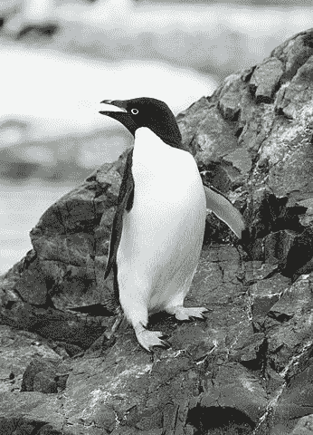
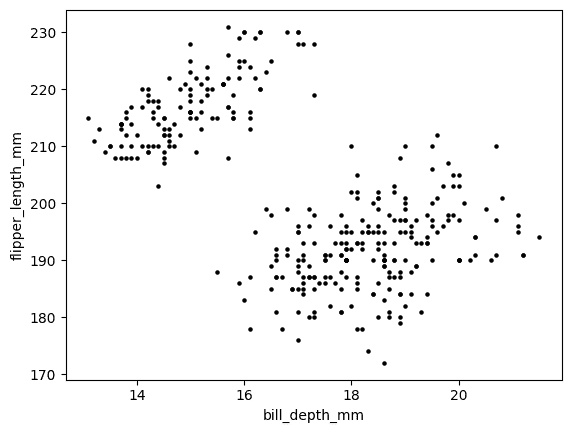
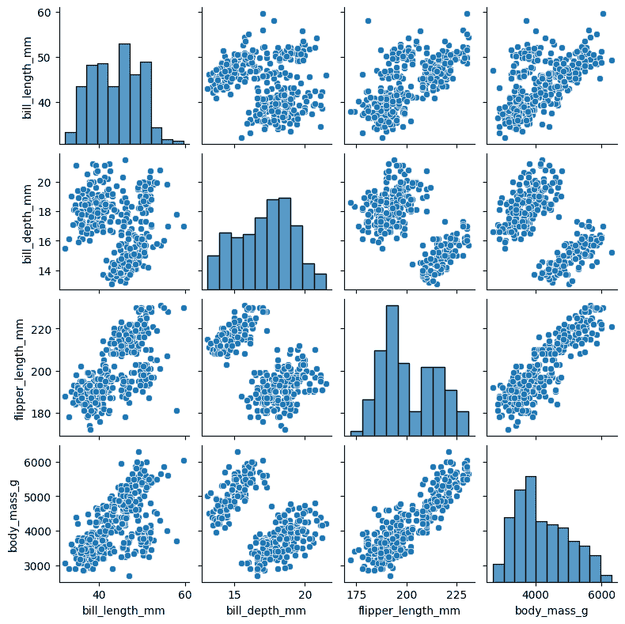

# 1.1. 激励示例：识别企鹅物种#

> 原文：[`mmids-textbook.github.io/chap01_intro/01_motiv/roch-mmids-intro-motiv.html`](https://mmids-textbook.github.io/chap01_intro/01_motiv/roch-mmids-intro-motiv.html)

想象一下，你是一位进化生物学家，正在研究企鹅。你已经收集了大量个体样本的测量数据。你的目标是根据这些测量数据，在这组样本中识别不同的[物种](https://en.wikipedia.org/wiki/Species)。

**图：** 一只阿德利企鹅。来源：Andrew Shiva. ([来源](https://commons.wikimedia.org/wiki/File:Hope_Bay-2016-Trinity_Peninsula%E2%80%93Ad%C3%A9lie_penguin_%28Pygoscelis_adeliae%29_04.jpg))



\(\bowtie\)

我们使用由[Dr. Kristen Gorman](https://www.uaf.edu/cfos/people/faculty/detail/kristen-gorman.php)和[南极洲帕默站 LTER](https://pallter.marine.rutgers.edu/)收集并提供的企鹅数据集。我们将数据以数据表（类似于电子表格）的形式上传到`pandas`中的`DataFrame`，其中列是不同的测量（或特征），行是不同的样本。下面，我们使用`pandas.read_csv`（[pandas.read_csv](https://pandas.pydata.org/docs/reference/api/pandas.read_csv.html?highlight=read_csv#)）加载数据，并显示数据集的前 5 行（使用`DataFrame.head`（[pandas.DataFrame.head](https://pandas.pydata.org/docs/reference/api/pandas.DataFrame.head.html)））。这个数据集是[Allison Horst](https://allisonhorst.com/)的[GitHub 页面](https://github.com/allisonhorst/palmerpenguins/blob/main/README.md)中完整数据集的一个简化版本（即，删除了一些列）。

```py
import pandas as pd
data = pd.read_csv('penguins-measurements.csv')
data.head() 
```

|  | 嘴唇长度 _mm | 嘴唇深度 _mm | 翼长 _mm | 体重 _g |
| --- | --- | --- | --- | --- |
| 0 | 39.1 | 18.7 | 181.0 | 3750.0 |
| 1 | 39.5 | 17.4 | 186.0 | 3800.0 |
| 2 | 40.3 | 18.0 | 195.0 | 3250.0 |
| 3 | NaN | NaN | NaN | NaN |
| 4 | 36.7 | 19.3 | 193.0 | 3450.0 |

注意到这个数据集有缺失值（即，上面的`NaN`条目）。处理这种问题的常见方法是从数据中删除所有包含缺失值的行。这可以通过使用`pandas.DataFrame.dropna`（[pandas.DataFrame.dropna](https://pandas.pydata.org/docs/reference/api/pandas.DataFrame.dropna.html)）来实现。这种预处理在数据科学中是基本的，但在这本书中我们不会过多讨论它。然而，了解这一点是很重要的。

```py
data = data.dropna()
data.head() 
```

|  | 嘴唇长度 _mm | 嘴唇深度 _mm | 翼长 _mm | 体重 _g |
| --- | --- | --- | --- | --- |
| 0 | 39.1 | 18.7 | 181.0 | 3750.0 |
| 1 | 39.5 | 17.4 | 186.0 | 3800.0 |
| 2 | 40.3 | 18.0 | 195.0 | 3250.0 |
| 4 | 36.7 | 19.3 | 193.0 | 3450.0 |
| 5 | 39.3 | 20.6 | 190.0 | 3650.0 |

有\(342\)个样本，如使用`pandas.DataFrame.shape`所示，它以元组的形式给出了 DataFrame 的维度。[pandas.DataFrame.shape](https://pandas.pydata.org/docs/reference/api/pandas.DataFrame.shape.html)。

```py
data.shape 
```

```py
(342, 4) 
```

让我们先使用`pandas.DataFrame.to_numpy`函数将列提取到一个 NumPy 数组中。[pandas.DataFrame.to_numpy](https://pandas.pydata.org/docs/reference/api/pandas.DataFrame.to_numpy.html)。我们将在后面更多地讨论 NumPy，这是一个 Python 的数值库，本质上允许操作向量和矩阵。

```py
X = data.to_numpy()
print(X) 
```

```py
[[  39.1   18.7  181\.  3750\. ]
 [  39.5   17.4  186\.  3800\. ]
 [  40.3   18\.   195\.  3250\. ]
 ...
 [  50.4   15.7  222\.  5750\. ]
 [  45.2   14.8  212\.  5200\. ]
 [  49.9   16.1  213\.  5400\. ]] 
```

我们在数据中可视化了两个测量值，即喙深和鳍长。（原始数据集使用了更精确的术语[culmen](https://en.wikipedia.org/wiki/Beak#Culmen)深度。）下面，每个点都是一个样本。这被称为散点图\(\idx{scatter plot}\xdi\)。引用[维基百科](https://en.wikipedia.org/wiki/Scatter_plot)：

> 数据以点的集合形式显示，每个点的一个变量的值决定了水平轴上的位置，另一个变量的值决定了垂直轴上的位置。

在本书中，我们使用`matplotlib.pyplot`来满足大部分绘图需求，只有少数例外。具体来说，这里我们使用了`matplotlib.pyplot.scatter`函数。[matplotlib.pyplot](https://matplotlib.org/stable/api/pyplot_summary.html)。

```py
import matplotlib.pyplot as plt
plt.scatter(X[:,1], X[:,2], s=5, c='k')
plt.xlabel('bill_depth_mm'), plt.ylabel('flipper_length_mm')
plt.show() 
```



我们观察到似乎在左上角和右下角分别有两个相当明确的样本簇。什么是[簇](https://en.wikipedia.org/wiki/Cluster_analysis)？直观地说，它是一组彼此靠近但与其他样本距离较远的样本。在这种情况下，这可能表明这些样本来自不同的物种。

现在，让我们看看完整的数据集。可视化完整的\(4\)维数据并不简单。一种方法是考虑所有成对的散点图。我们使用了来自[Seaborn](https://seaborn.pydata.org/index.html)库的函数`seaborn.pairplot`。[seaborn.pairplot](https://seaborn.pydata.org/generated/seaborn.pairplot.html)。

```py
import seaborn as sns
sns.pairplot(data, height=2)
plt.show() 
```



你认为这个数据集中有多少种企鹅？

有用的方法是一个可以**自动**识别簇的方法，无论数据的维度如何。在本章中，我们将讨论一种标准的方法：\(k\)-means 聚类。我们将在本章的后面部分回到企鹅数据集。

但首先我们需要回顾一些关于向量和距离的基本概念，以便将聚类表述为一个合适的**优化**问题，这个观点将在整个过程中反复出现。

**CHAT & LEARN** 向您喜欢的 AI 聊天机器人询问处理数据集中缺失值的其他方法。在企鹅数据集上实施这些替代方案之一（您可以要求聊天机器人提供代码！）([在 Colab 中打开](https://colab.research.google.com/github/MMiDS-textbook/MMiDS-textbook.github.io/blob/main/just_the_code/roch_mmids_chap_intro_notebook.ipynb)) \(\ddagger\)
