# 1.2\. 背景：矩阵代数、微分学和初等概率的快速复习

> 原文：[`mmids-textbook.github.io/chap01_intro/02_review/roch-mmids-intro-review.html`](https://mmids-textbook.github.io/chap01_intro/02_review/roch-mmids-intro-review.html)

我们首先回顾一些基本的数学概念。在本章中，我们重点关注向量代数和矩阵代数、一些基本的微积分和优化，以及初等概率。在这个过程中，我们还介绍了 Python，特别是将贯穿整个过程的 NumPy 库。

## 1.2.1\. 向量和矩阵#

在整个过程中，\(\mathbb{R}\) 和 \(\mathbb{R}_+\) 分别表示实数和正实数。

**向量和范数** 对于一个向量

$$\begin{split} \mathbf{x} = \begin{bmatrix} x_1 \\ x_2 \\ \vdots \\ x_d \end{bmatrix} \in \mathbb{R}^d \end{split}$$

\(\mathbf{x}\) 的欧几里得范数\(\idx{Euclidean norm}\xdi\)定义为

$$ \|\mathbf{x}\|_2 = \sqrt{ \sum_{i=1}^d x_i² } = \sqrt{\langle \mathbf{x}, \mathbf{x}\rangle} $$

其中

$$ \langle \mathbf{u}, \mathbf{v} \rangle = \sum_{i=1}^d u_i v_i $$

是 \(\mathbf{u}\) 和 \(\mathbf{v}\) 的 [内积](https://en.wikipedia.org/wiki/Inner_product_space)\(\idx{inner product}\xdi\)。这也被称为 \(\ell²\)-范数。在整个过程中，我们使用符号 \(\|\mathbf{x}\| = \|\mathbf{x}\|_2\) 来表示 \(\mathbf{x}\) 的 \(2\)-范数，除非另有说明。我们使用 \(x_i\) 和 \((\mathbf{x})_i\) 来表示 \(\mathbf{x}\) 的元素。我们还写 \(\mathbf{x} = (x_1, \ldots, x_d) = (x_{i})_{i\in [d]}\)，其中 \([d] := \{1,2,\ldots,d\}\)。

内积具有以下有用的性质（检查它们！）！首先，它在意义上是对称的

$$ \langle \mathbf{x}, \mathbf{y} \rangle = \langle \mathbf{y}, \mathbf{x} \rangle \qquad \forall \mathbf{x}, \mathbf{y} \in \mathbb{R}^d. $$

其次，它在每个输入上是线性的：对于任何 \(\mathbf{x}_1, \mathbf{x}_2, \mathbf{x}_3 \in \mathbb{R}^d\) 和 \(\beta \in \mathbb{R}\)，都有

$$ \langle \beta \,\mathbf{x}_1 + \mathbf{x}_2, \mathbf{x}_3 \rangle = \beta \,\langle \mathbf{x}_1,\mathbf{x}_3\rangle + \langle \mathbf{x}_2,\mathbf{x}_3\rangle. $$

重复应用后一个性质意味着例如：对于任何 \(\mathbf{x}_1, \ldots, \mathbf{x}_m, \mathbf{y}_1, \ldots, \mathbf{y}_\ell \in \mathbb{R}^d\)

$$ \left\langle \sum_{i=1}^m \mathbf{x}_i, \sum_{j=1}^\ell \mathbf{y}_j \right\rangle = \sum_{i=1}^m \sum_{j=1}^\ell \langle \mathbf{x}_i,\mathbf{y}_j\rangle. $$

\(\ell²\)-范数的三角不等式 [来源于](https://en.wikipedia.org/wiki/Cauchy%E2%80%93Schwarz_inequality#Analysis) [柯西-施瓦茨不等式](https://en.wikipedia.org/wiki/Cauchy%E2%80%93Schwarz_inequality)，这在证明许多事实时很有用。

**定理** **(柯西-施瓦茨不等式)** \(\idx{Cauchy-Schwarz inequality}\xdi\) 对于所有 \(\mathbf{u}, \mathbf{v} \in \mathbb{R}^d\)

$$ |\langle \mathbf{u}, \mathbf{v} \rangle| \leq \|\mathbf{u}\| \|\mathbf{v}\|. $$

\(\sharp\)

给定一个向量集合 \(\mathbf{u}_1,\ldots,\mathbf{u}_k \in \mathbb{R}^d\) 和实数 \(\alpha_1,\ldots,\alpha_k \in \mathbb{R}\)，\(\mathbf{u}_\ell\) 的线性组合（系数为 \(\alpha_\ell\)）是向量

$$ \mathbf{z} = \sum_{\ell=1}^k \alpha_\ell \mathbf{u}_\ell, $$

其元素为

$$ z_i = \sum_{\ell=1}^k \alpha_\ell (\mathbf{u}_\ell)_i, \quad i=1,\ldots,d. $$

我们还使用 \(u_{\ell, i} = (\mathbf{u}_\ell)_i\) 来表示 \(\mathbf{u}_\ell\) 的元素。

引入特殊符号表示常见向量将很方便。这些向量的维度通常从上下文中可以清楚看出。

+   \(d\) 维度中的所有-\(0\) 向量表示为 \(\mathbf{0}_d = \mathbf{0}\)。

+   \(d\) 维度中的所有-\(1\) 向量表示为 \(\mathbf{1}_d = \mathbf{1}\)。

+   标准或规范基表示为 \(\mathbf{e}_i\)，\(i=1,\ldots,d\)，其中

$$\begin{split} (\mathbf{e}_i)_j = \begin{cases} 1, & \text{如果 $j = i$，}\\ 0, & \text{否则。} \end{cases} \end{split}$$

两个向量 \(\mathbf{u}\) 和 \(\mathbf{v}\) 在 \(\mathbb{R}^d\) 中的 [欧几里得距离](https://en.wikipedia.org/wiki/Euclidean_distance) 是它们差分的 \(2\)-范数

$$ d(\mathbf{u},\mathbf{v}) = \|\mathbf{u} - \mathbf{v}\|_2. $$

更一般地，对于 \(p \geq 1\)，\(\mathbf{x}\) 的 \(\ell^p\)-范数（[lp-norm](https://en.wikipedia.org/wiki/Lp_space#The_p-norm_in_finite_dimensions)）由以下给出

$$ \|\mathbf{x}\|_p = \left( \sum_{i=1}^d |x_i|^p \right)^{1/p}. $$

最后，\(\ell^\infty\)-范数定义为

$$ \|\mathbf{x}\|_\infty = \max_{i=1,\ldots,d}|x_i|. $$

存在其他范数。形式上：

**定义** **（范数）** \(\idx{norm}\xdi\) 范数是从 \(\mathbb{R}^d\) 到 \(\mathbb{R}_+\) 的函数 \(\ell\)，它对所有 \(a \in \mathbb{R}\)，\(\mathbf{u}, \mathbf{v} \in \mathbb{R}^d\) 满足

+   *(绝对齐次性):* \(\idx{absolute homogeneity}\xdi\) \(\ell(a \mathbf{u}) = |a| \ell(\mathbf{u})\)

+   *(三角不等式):* \(\idx{triangle inequality}\xdi\) \(\ell(\mathbf{u}+\mathbf{v}) \leq \ell(\mathbf{u}) + \ell(\mathbf{v})\)

+   *(点分离性):* \(\idx{point-separating property}\xdi\) \(\ell(\mathbf{u}) = 0\) 意味着 \(\mathbf{u} =0\)。

\(\natural\)

**数值角:** 在 NumPy 中，向量被定义为 1d 数组。我们首先必须导入 [NumPy](https://numpy.org) 包，它通常缩写为 `np`。

```py
import numpy as np
u = np.array([1., 3., 5. ,7.])
print(u) 
```

```py
[1\. 3\. 5\. 7.] 
```

我们如下访问 `u` 的元素，注意 NumPy 中的索引从 \(0\) 开始。

```py
print(u[0])
print(u[1]) 
```

```py
1.0
3.0 
```

要获取向量的范数，我们可以使用函数 `linalg.norm`（[NumPy](https://numpy.org)），它需要 `numpy.linalg` 包（通常缩写为 `LA`）：

```py
from numpy import linalg as LA
LA.norm(u) 
```

```py
9.16515138991168 
```

我们接下来“手动”检查

```py
np.sqrt(np.sum(u ** 2)) 
```

```py
9.16515138991168 
```

在 NumPy 中，`**` 表示逐元素指数运算。

**尝试一下！** 不使用函数 `np.dot` 计算向量 \(u = (1,2,3,4)\) 和 \(v = (5, 4, 3, 2)\) 的内积。*提示*：两个实数 \(a\) 和 \(b\) 的乘积是 `a * b`。([在 Colab 中打开](https://colab.research.google.com/github/MMiDS-textbook/MMiDS-textbook.github.io/blob/main/just_the_code/roch_mmids_chap_intro_notebook.ipynb))

```py
u = np.array([1., 2., 3. ,4.])
# EDIT THIS LINE: define v
# EDIT THIS LINE: compute the inner product between u and v 
```

\(\unlhd\)

**矩阵** 对于一个具有实数元素的 \(n \times m\) 矩阵 \(A \in \mathbb{R}^{n \times m}\)，我们用 \(A_{i,j}\) 或 \(A_{ij}\) 表示其在第 \(i\) 行和第 \(j\) 列的元素（除非另有说明）。我们还可以将矩阵称为其所有元素的集合，如下所示

$$ A = (A_{ij})_{i\in [n],j \in [m]}. $$

我们偶尔会简化符号，当索引的范围从上下文中清楚时，将 \(A = (A_{ij})_{i,j}\)。我们使用以下符号

$$ A_{i,\cdot} = (A_{i1} \cdots A_{im}), $$

以表示 \(A\) 的第 \(i\) 行 – 作为行向量，即只有一个行的矩阵 – 类似地

$$\begin{split} A_{\cdot,j} = \begin{pmatrix} A_{1j}\\ \vdots\\ A_{nj} \end{pmatrix}, \end{split}$$

对于 \(A\) 的第 \(j\) 列 – 作为列向量，即只有一个列的矩阵。

**示例：** 假设

$$\begin{split} A = \begin{bmatrix} 2 & 5\\ 3 & 6\\ 1 & 1 \end{bmatrix}. \end{split}$$

然后第二行和列分别是

$$\begin{split} A_{2,\cdot} = \begin{bmatrix} 3 & 6 \end{bmatrix} \quad\text{and}\quad A_{\cdot,2} = \begin{bmatrix} 5\\ 6\\ 1 \end{bmatrix}. \end{split}$$

\(\lhd\)

矩阵可以与标量相乘：设 \(A \in \mathbb{R}^{n\times m} = (A_{ij})_{i\in [n],j \in [m]}\) 和 \(\gamma \in \mathbb{R}\)，则 \(\gamma A = (\gamma A_{ij})_{i\in [n],j \in [m]}\) 是一个矩阵，其元素都乘以 \(\gamma\)。矩阵也可以相互相加 – 假设它们具有相同的大小：设 \(A \in \mathbb{R}^{n\times m} = (A_{ij})_{i\in [n],j \in [m]}\) 和 \(B \in \mathbb{R}^{n\times m} = (B_{ij})_{i\in [n],j \in [m]}\)，则 \(C = A + B\) 是矩阵 \(C = (C_{ij})_{i\in [n],j \in [m]}\)，其中 \(C_{ij} = A_{ij} + B_{ij}\) 对于所有 \(i,j\) 都成立。

回想一下，矩阵 \(A \in \mathbb{R}^{n\times m}\) 的转置 \(A^T\) 定义为 \(\mathbb{R}^{m\times n}\) 中的矩阵，它交换 \(A\) 的行和列索引，即其元素是

$$ [A^T]_{ij} = A_{ji},\quad i=1,\ldots,m, j=1,\ldots,n. $$

**图：** 转置的说明 ([来源](https://commons.wikimedia.org/wiki/File:Matrix_transpose.gif))

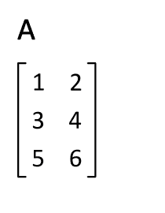

\(\bowtie\)

**示例：** 再次假设

$$\begin{split} A = \begin{bmatrix} 2 & 5\\ 3 & 6\\ 1 & 1 \end{bmatrix}. \end{split}$$

然后它的转置是

$$\begin{split} A^T = \begin{bmatrix} 2 & 3 & 1\\ 5 & 6 & 1 \end{bmatrix}. \end{split}$$

\(\lhd\)

我们列出转置的一些有用性质（检查它们！）！对于任何 \(\gamma \in \mathbb{R}\) 和 \(A, B \in \mathbb{R}^{n \times m}\)：

a) \((A^T)^T = A\)

b) \((\gamma A + B)^T = \gamma A^T + B^T\)

**定义** **(对称矩阵)** \(\idx{symmetric matrix}\xdi\) 一个 \(n \times n\) 的方阵 \(B \in \mathbb{R}^{n \times n}\) 是对称的，如果 \(B^T = B\)。\(\natural\)

特别的，转置可以用来将列向量转换为行向量，反之亦然。也就是说，如果 \(\mathbf{b} = (b_1, b_2, \ldots,b_n) \in \mathbb{R}^n\) 是一个列向量，那么 \(\mathbf{b}^T = \begin{pmatrix} b_1 & b_2 & \cdots & b_n \end{pmatrix}\) 是相应的行向量。注意后者中没有逗号。例如，

$$ \mathbf{b}^T \mathbf{b} = b_1² + \cdots + b_n² = \sum_{i=1}^n b_i² = \|\mathbf{b}\|² $$

是 \(\mathbf{b}\) 的欧几里得范数的平方。

**数值角:** 我们经常会处理 \(\mathbb{R}^d\) 中的 \(n\) 个向量 \(\mathbf{x}_1, \ldots, \mathbf{x}_n\) 的集合，并将它们堆叠成一个矩阵会更方便。

$$\begin{split} X = \begin{bmatrix} \mathbf{x}_1^T \\ \mathbf{x}_2^T \\ \vdots \\ \mathbf{x}_n^T \\ \end{bmatrix} = \begin{bmatrix} x_{11} & x_{12} & \cdots & x_{1d} \\ x_{21} & x_{22} & \cdots & x_{2d} \\ \vdots & \vdots & \ddots & \vdots \\ x_{n1} & x_{n2} & \cdots & x_{nd} \\ \end{bmatrix}. \end{split}$$

要从两个向量创建一个矩阵，我们使用函数 `numpy.stack`。

```py
u = np.array([1., 3., 5., 7.])
v = np.array([2., 4., 6., 8.])
X = np.stack((u,v),axis=0)
print(X) 
```

```py
[[1\. 3\. 5\. 7.]
 [2\. 4\. 6\. 8.]] 
```

引用文档：

> 轴参数指定了结果维度中新的轴的索引。例如，如果 axis=0，它将是第一个维度；如果 axis=-1，它将是最后一个维度。

或者，我们可以用以下方式定义相同的矩阵。

```py
Y = np.array([[1., 3., 5., 7.],[2., 4., 6., 8.]])
print(Y) 
```

```py
[[1\. 3\. 5\. 7.]
 [2\. 4\. 6\. 8.]] 
```

我们按照以下方式访问元素。

```py
print(Y[0,0])
print(Y[0,1]) 
```

```py
1.0
3.0 
```

\(\unlhd\)

对于向量，引入一个特殊符号来表示常见的矩阵将很方便。在某些情况下，维度可以省略。

+   维度为 \(m \times n\) 的所有元素为 \(0\) 的矩阵表示为 \(\mathbf{0}_{m \times n} = \mathbf{0}\).

+   维度为 \(m \times n\) 的所有元素为 \(1\) 的矩阵表示为 \(J_{m \times n} = J\).

+   一个 \(n \times n\) 的对角矩阵 \(A = (A_{ij}) \in \mathbb{R}^{n \times n}\) 是一个满足 \(A_{ij} = 0\) 对于所有 \(i \neq j\) 的矩阵。我们用 \(\mathrm{diag}(\lambda_1,\ldots,\lambda_n)\) 表示对角线元素为 \(\lambda_1,\ldots,\lambda_n\) 的对角矩阵。

+   维度为 \(n \times n\) 的单位矩阵表示为 \(I_{n \times n} = I\)。具体来说，这是其第 \(i\) 列是标准基向量 \(\mathbf{e}_i\) 的矩阵，\(i=1,\ldots,n\)。换句话说，它是一个对角线元素为 \(1\) 的平方对角矩阵。

**矩阵-向量乘积** 回想一下，对于一个矩阵 \(A = (A_{ij})_{i\in [n],j \in [m]} \in \mathbb{R}^{n \times m}\) 和一个列向量 \(\mathbf{b} = (b_{i})_{i\in [m]} \in \mathbb{R}^{m}\)，矩阵-向量乘积 \(\mathbf{c} = A \mathbf{b}\) 是具有以下元素的向量

$$ c_i = (A\mathbf{b})_i = \sum_{j=1}^m A_{ij} b_j. $$

以向量形式，

$$ A \mathbf{b} = \sum_{j=1}^m A_{\cdot,j} b_j, $$

即，\(A \mathbf{b}\) 是 \(A\) 的列的线性组合，其中系数是 \(\mathbf{b}\) 的元素。矩阵-向量乘积在以下意义上是线性的（检查它！）: 对于任何 \(\gamma \in \mathbb{R}\) 和 \(\mathbf{b}_1, \mathbf{b}_2 \in \mathbb{R}^m\)

$$ A(\gamma \mathbf{b}_1 + \mathbf{b}_2) = \gamma A\mathbf{b}_1 + A \mathbf{b}_2. $$

**示例：** **（继续）** 考虑列向量 \(\mathbf{b} = (1, 0)\)。那么

$$\begin{split} A \mathbf{b} = \begin{bmatrix} 2(1) + 5(0)\\ 3(1) + 6(0)\\ 1(1) + 1(0) \end{bmatrix} = \begin{bmatrix} 2\\ 3\\ 1 \end{bmatrix}, \end{split}$$

这也可以用向量形式表示为

$$\begin{split} (1) \begin{bmatrix} 2\\ 3\\ 1 \end{bmatrix} + (0) \begin{bmatrix} 5\\ 6\\ 1 \end{bmatrix} = \begin{bmatrix} 2\\ 3\\ 1 \end{bmatrix}. \end{split}$$

\(\lhd\)

**矩阵-矩阵乘积** 回想一下，对于矩阵 \(A \in \mathbb{R}^{n \times k}\) 和 \(B \in \mathbb{R}^{k \times m}\)，它们的矩阵乘积定义为矩阵 \(C = AB \in \mathbb{R}^{n \times m}\)，其元素为

$$ C_{i\ell} = (AB)_{i\ell} = \sum_{j=1}^k A_{ij} B_{j\ell}. $$

\(A\) 的列数和 \(B\) 的行数必须匹配。有几种不同的方式来理解这个公式，这些方式有助于在不同的上下文中解释矩阵-矩阵乘积。

首先，我们观察到 \(C_{i\ell}\) 是 \(A\) 的第 \(i\) 行和 \(B\) 的第 \(\ell\) 列的内积。也就是说，

$$ C_{i\ell} = A_{i,\cdot} B_{\cdot,\ell}. $$

以矩阵形式，

$$\begin{split} AB = \begin{bmatrix} A_{1,\cdot} B_{\cdot,1} & A_{1,\cdot} B_{\cdot,2} & \cdots & A_{1,\cdot} B_{\cdot,m} \\ A_{2,\cdot} B_{\cdot,1} & A_{2,\cdot} B_{\cdot,2} & \cdots & A_{2,\cdot} B_{\cdot,m} \\ \vdots & \vdots & \ddots & \vdots\\ A_{n,\cdot} B_{\cdot,1} & A_{n,\cdot} B_{\cdot,2} & \cdots & A_{n,\cdot} B_{\cdot,m} \end{bmatrix}. \end{split}$$

或者，

$$ AB = \begin{bmatrix} A (B_{\cdot,1}) & A (B_{\cdot,2}) & \cdots & A (B_{\cdot,m}) \end{bmatrix}, $$

其中我们通过其列的集合指定一个矩阵。换句话说，通过矩阵-向量乘积公式，乘积 \(AB\) 的第 \(j\) 列是 \(A\) 的列的线性组合，其中系数是 \(B\) 的第 \(j\) 列的元素。

$$ (AB)_{\cdot,j} = A B_{\cdot,j} = \sum_{\ell=1}^k A_{\cdot,\ell} B_{\ell j}. $$

类似地，乘积 \(AB\) 的第 \(i\) 行是 \(B\) 的行的线性组合，其中系数是 \(A\) 的第 \(i\) 行的元素。

$$ (AB)_{i,\cdot} = \sum_{\ell=1}^k A_{i\ell} B_{\ell,\cdot}. $$

**示例:** 回想一下，如果我们把向量 \(\mathbf{b} \in \mathbb{R}^n\) 当作列向量，那么它的转置 \(\mathbf{b}^T\) 是行向量。我们之前已经证明了 \(\mathbf{b}^T \mathbf{b} = \sum_{i=1}^n b_i²\) 是一个标量，即一个实数。这次，我们计算 \(\mathbf{b} \mathbf{b}^T\)。首先，让我们确保维度匹配。将这些向量视为矩阵，我们有 \(\mathbf{b} \in \mathbb{R}^{n\times 1}\) 和 \(\mathbf{b}^T \in \mathbb{R}^{1\times n}\)。因此，我们确实可以相乘，因为第一个矩阵的列数与第二个矩阵的行数相匹配。最终乘积的维度是什么？通过取第一个矩阵的行数和第二个矩阵的列数，我们看到它是 \(n \times n\)。

最后我们得到

$$\begin{split} \mathbf{b} \mathbf{b}^T = \begin{bmatrix} b_1\\ b_2\\ \vdots\\ b_n \end{bmatrix} \begin{bmatrix} b_1 & b_2 & \cdots & b_n \end{bmatrix} = \begin{bmatrix} b_{1} b_{1} & b_{1} b_{2} & \cdots & b_{1} b_{n} \\ b_{2} b_{1} & b_{2} b_{2} & \cdots & b_{2} b_{n} \\ \vdots & \vdots & \ddots & \vdots\\ b_{n} b_{1} & b_{n} b_{2} & \cdots & b_{n} b_{n} \end{bmatrix}. \end{split}$$

即，\((\mathbf{b} \mathbf{b}^T)_{i,j} = b_i b_j\). \(\lhd\)

我们列出矩阵-矩阵乘积的一些有用性质（检查它们！）对于任何 \(\gamma \in \mathbb{R}\), \(A, B \in \mathbb{R}^{n \times m}\) 和 \(C \in \mathbb{R}^{m \times \ell}\):

a) \((\gamma A)B = A (\gamma B) = \gamma A B\)

b) \((A + B)C = AC + BC\)

c) \((BC)^T = C^T B^T\)

**知识检查:** 设 \(A \in \mathbb{R}^{n \times m}\), \(B \in \mathbb{R}^{m \times n}\), \(C \in \mathbb{R}^{n \times \ell}\), 和 \(D \in \mathbb{R}^{\ell \times n}\)。确定矩阵的**转置**的维度：

$$ (A^T + B) C D $$

a) \(m \times m\)

b) \(n \times n\)

c) \(m \times n\)

d) \(n \times m\)

e) 该矩阵未定义。

\(\checkmark\)

**分块矩阵** 引入分块矩阵将非常方便。首先，对于向量 \(\mathbf{x} \in \mathbb{R}^n\)，我们写 \(\mathbf{x} = (\mathbf{x}_1, \mathbf{x}_2)\)，其中 \(\mathbf{x}_1 \in \mathbb{R}^{n_1}\) 和 \(\mathbf{x}_2 \in \mathbb{R}^{n_2}\) 且 \(n_1 + n_2 = n\)，以表示 \(\mathbf{x}\) 被划分为两个块：\(\mathbf{x}_1\) 对应 \(\mathbf{x}\) 的前 \(n_1\) 个坐标，而 \(\mathbf{x}_2\) 对应随后的 \(n_2\) 个坐标。

更一般地，一个分块矩阵\(\idx{block matrix}\xdi\) 是一个矩阵的行和列的划分，形式如下

$$\begin{split} A = \begin{pmatrix} A_{11} & A_{12}\\ A_{21} & A_{22} \end{pmatrix} \end{split}$$

其中 \(A \in \mathbb{R}^{n \times m}\), \(A_{ij} \in \mathbb{R}^{n_i \times m_j}\) 对于 \(i,j = 1, 2\)，满足条件 \(n_1 + n_2 = n\) 和 \(m_1 + m_2 = m\)。也可以考虑更多的块。

分块矩阵有一个方便的代数，类似于通常的矩阵代数。具体来说，如果 \(B_{ij} \in \mathbb{R}^{m_i \times p_j}\) 对于 \(i,j = 1, 2\)，那么它满足

$$\begin{split} \begin{pmatrix} A_{11} & A_{12}\\ A_{21} & A_{22} \end{pmatrix} \begin{pmatrix} B_{11} & B_{12}\\ B_{21} & B_{22} \end{pmatrix} = \begin{pmatrix} A_{11} B_{11} + A_{12} B_{21} & A_{11} B_{12} + A_{12} B_{22}\\ A_{21} B_{11} + A_{22} B_{21} & A_{21} B_{12} + A_{22} B_{22} \end{pmatrix}. \end{split}$$

注意，\(A\) 和 \(B\) 的块大小必须匹配，这个公式才有意义。你可以通过尝试一个简单的例子来证明这个恒等式。

**警告:** 虽然公式与通常的矩阵乘积类似，但乘法顺序很重要，因为块是矩阵，它们通常不交换！

**矩阵范数** 我们还需要矩阵范数\(\idx{matrix norm}\xdi\) 的概念。定义矩阵范数的一个自然方法是注意到一个 \(n \times m\) 矩阵 \(A\) 可以被视为一个 \(nm\) 向量，每个 \(A\) 的元素对应一个元素。确实，加法和标量乘法以完全相同的方式进行。因此，我们可以用其平方项的和来定义矩阵的 \(2\) 范数。（我们将在课程中遇到其他矩阵范数。）

**定义** **（弗罗贝尼乌斯范数）** \(\idx{Frobenius norm}\xdi\) 一个 \(n \times m\) 矩阵 \(A \in \mathbb{R}^{n \times m}\) 的弗罗贝尼乌斯范数定义为

$$ \|A\|_F = \sqrt{\sum_{i=1}^n \sum_{j=1}^m A_{ij}²}. $$

\(\natural\)

使用行表示法，我们看到弗罗贝尼乌斯范数的平方可以写成行欧几里得范数的平方和 \(\|A\|_F² = \sum_{i=1}^n \|A_{i,\cdot}\|²\)。类似地，在 \(A\) 的列 \(A_{\cdot,j}\)，\(j=1,\ldots,m\) 的意义上，我们有 \(\|A\|_F² = \sum_{j=1}^m \|A_{\cdot,j}\|²\)。

对于两个矩阵 \(A, B \in \mathbb{R}^{n \times m}\)，它们的差 \(\|A - B\|_F\) 的弗罗贝尼乌斯范数可以解释为 \(A\) 和 \(B\) 之间的距离，即它们差异的度量。

可以通过使用 *柯西-施瓦茨不等式* 证明（试试看！）对于任何 \(A, B\)，如果 \(AB\) 是良定义的，则它满足

$$ \|A B \|_F \leq \|A\|_F \|B\|_F. $$

这在 \(B\) 是一个列向量时尤其适用，在这种情况下，\(\|B\|_F\) 是其欧几里得范数。

**数值角落:** 在 NumPy 中，可以使用函数 `numpy.linalg.norm` 计算矩阵的弗罗贝尼乌斯范数（[链接](https://numpy.org/doc/stable/reference/generated/numpy.linalg.norm.html)）。

```py
A = np.array([[1., 0.],[0., 1.],[0., 0.]])
print(A) 
```

```py
[[1\. 0.]
 [0\. 1.]
 [0\. 0.]] 
```

```py
LA.norm(A) 
```

```py
1.4142135623730951 
```

\(\unlhd\)

**二次型** 设 \(B \in \mathbb{R}^{n \times n}\) 为一个方阵。相关的二次型\(\idx{quadratic form}\xdi\)

$$ \langle \mathbf{z}, B \mathbf{z} \rangle = \mathbf{z}^T B \mathbf{z} = \sum_{i=1}^n z_i \sum_{j=1}^n B_{i,j} z_j = \sum_{i=1}^n \sum_{j=1}^n z_i B_{i,j} z_j $$

定义为任何 \(\mathbf{z} = (z_1,\ldots,z_n)\)，将在整个过程中多次出现。

一个 [形式](https://en.wikipedia.org/wiki/Homogeneous_polynomial) 是一个齐次多项式 \(f(\mathbf{z})\)，被视为 \(\mathbf{z}\) 的函数。通过 [齐次](https://en.wikipedia.org/wiki/Homogeneous_function)，我们指的是对于任何 \(\mathbf{z} \in \mathbb{R}^n\) 和任何标量 \(\alpha \in \mathbb{R}\)

$$ f(\alpha \mathbf{z}) = \alpha^k f(\mathbf{z}), $$

对于某个称为齐次度 \(k\) 的整数 \(k\)。 (注意，这与范数的绝对齐次性不同。) 当 \(k=2\) 时，我们称之为二次型。让我们检查 \(\langle \mathbf{z}, B \mathbf{z} \rangle\) 是否确实满足这些性质。另一种表达方式 \(\sum_{i=1}^n \sum_{j=1}^n z_i B_{i,j} z_j\) 清楚地表明它是一个关于变量 \(z_1,\ldots,z_n\) 的多项式。此外，对于任何 \(\alpha \in \mathbb{R}\)，通过多次使用线性性质

$$ \langle \alpha \mathbf{z}, B (\alpha \mathbf{z}) \rangle = \langle \alpha \mathbf{z}, \alpha B \mathbf{z} \rangle = \alpha \langle \mathbf{z}, \alpha B \mathbf{z} \rangle = \alpha² \langle \mathbf{z}, B \mathbf{z} \rangle. $$

尤其是以下矩阵的性质将扮演重要的角色。它是通过相关的二次型来定义的。

**定义** **(正半定矩阵)** \(\idx{positive semidefinite matrix}\xdi\) 一个对称矩阵 \(B \in \mathbb{R}^{n \times n}\) 是正半定的，如果

$$ \langle \mathbf{z}, B \mathbf{z} \rangle \geq 0, \quad \forall \mathbf{z} \neq \mathbf{0}. $$

我们也在那种情况下写成 \(B \succeq 0\)。如果上述不等式是严格的，我们说 \(B\) 是正定的，在这种情况下我们写成 \(B \succ 0\)。 \(\natural\)

我们将在本节稍后看到一个重要的例子。

## 1.2.2\. 微分学#

接下来，我们回顾一些微分学的基本概念。我们关注这里与优化理论相关的定义和结果，优化理论在数据科学中扮演着核心角色。

**极限和连续性** \(\mathbf{x} \in \mathbb{R}^d\) 的开 \(r\)-球是距离 \(\mathbf{x}\) 欧几里得距离 \(r\) 内的点集，即，

$$ B_r(\mathbf{x}) = \{\mathbf{y} \in \mathbb{R}^d \,:\, \|\mathbf{y} - \mathbf{x}\| < r\}. $$

一个点 \(\mathbf{x} \in \mathbb{R}^d\) 是集合 \(A \subseteq \mathbb{R}^d\) 的内点，如果存在一个 \(r > 0\)，使得 \(B_r(\mathbf{x}) \subseteq A\)。一个集合 \(A\) 是 [开集](https://en.wikipedia.org/wiki/Open_set)\(\idx{开集}\xdi\)，如果它完全由内点组成。一个点 \(\mathbf{x} \in \mathbb{R}^d\) 是集合 \(A \subseteq \mathbb{R}^d\) 的极限点，如果围绕 \(\mathbf{x}\) 的每一个开球都包含 \(A\) 的一个元素 \(\mathbf{a}\)，使得 \(\mathbf{a} \neq \mathbf{x}\)。一个集合 \(A \subseteq \mathbb{R}^d\) 是有界的，如果存在一个 \(r > 0\)，使得 \(A \subseteq B_r(\mathbf{0})\)，其中 \(\mathbf{0} = (0,\ldots,0)^T\)。

**图：** 点 \(x\) 附近半径为 \(\varepsilon\) 的开球示意图。([来源](https://commons.wikimedia.org/wiki/File:Open_set_-_example.png))

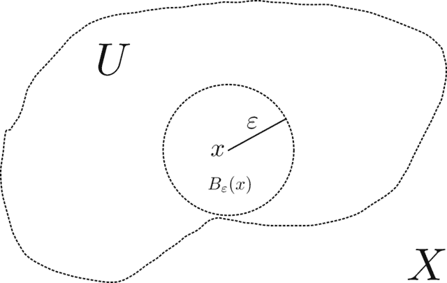

\(\bowtie\)

**定义** **(函数的极限)** 设 \(f: D \to \mathbb{R}\) 是定义在 \(D \subseteq \mathbb{R}^d\) 上的实值函数。那么当 \(\mathbf{x}\) 趋近于 \(\mathbf{a}\) 时，如果：对于任意 \(\varepsilon > 0\)，存在一个 \(\delta > 0\)，使得对于所有 \(\mathbf{x} \in D \cap B_\delta(\mathbf{a})\setminus \{\mathbf{a}\}\)，都有 \(|f(\mathbf{x}) - L| < \varepsilon\)。这可以表示为

$$ \lim_{\mathbf{x} \to \mathbf{a}} f(\mathbf{x}) = L. $$

\(\natural\)

注意，我们明确排除 \(\mathbf{a}\) 本身需要满足条件 \(|f(\mathbf{x}) - L| < \varepsilon\)。特别是，我们可能 \(f(\mathbf{a}) \neq L\)。我们也不限制 \(\mathbf{a}\) 必须在 \(D\) 中。

**定义** **(连续函数)** \(\idx{连续函数}\xdi\) 设 \(f: D \to \mathbb{R}\) 是定义在 \(D \subseteq \mathbb{R}^d\) 上的实值函数。那么 \(f\) 在 \(\mathbf{a} \in D\) 处是连续的，如果

$$ \lim_{\mathbf{x} \to \mathbf{a}} f(\mathbf{x}) = f(\mathbf{a}). $$

\(\natural\)

**图：** 连续函数。例如，在 \(2\) 附近的微小邻域内，函数变化很小。([来源](https://commons.wikimedia.org/wiki/File:Example_of_continuous_function.svg))

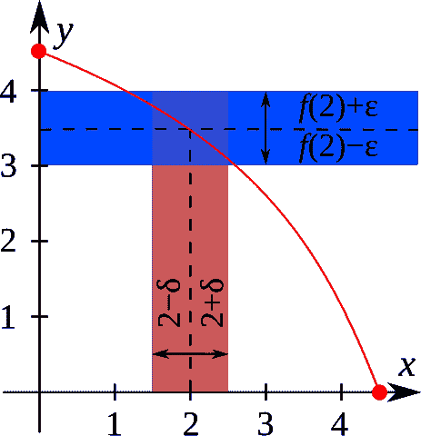

\(\bowtie\)

我们将不会证明以下基本分析结果，这个结果将在本课程中反复使用。（例如，参见[Wikipedia](https://en.wikipedia.org/wiki/Extreme_value_theorem)中的证明概要。）假设 \(f : D \to \mathbb{R}\) 定义在集合 \(D \subseteq \mathbb{R}^d\) 上。我们说 \(f\) 在 \(\mathbf{z}^*\) 处取得最大值 \(M\)，如果 \(f(\mathbf{z}^*) = M\) 且 \(M \geq f(\mathbf{x})\) 对所有 \(\mathbf{x} \in D\) 成立。类似地，我们说 \(f\) 在 \(\mathbf{z}_*\) 处取得最小值 \(m\)，如果 \(f(\mathbf{z}_*) = m\) 且 \(m \geq f(\mathbf{x})\) 对所有 \(\mathbf{x} \in D\) 成立。

**定理** **(极值定理)** \(\idx{extreme value theorem}\xdi\) 设 \(f : D \to \mathbb{R}\) 是定义在非空、闭、有界集合 \(D \subseteq \mathbb{R}^d\) 上的实值连续函数。那么 \(f\) 在 \(D\) 上取得最大值和最小值。 \(\sharp\)

**导数** 我们继续讨论导数。回顾一下，实变函数的导数是函数相对于变量变化的改变率。它给出了切线的斜率。形式上：

**定义** **(导数)** \(\idx{derivative}\xdi\) 设 \(f : D \to \mathbb{R}\) 其中 \(D \subseteq \mathbb{R}\)，并且设 \(x_0 \in D\) 是 \(D\) 的一个内部点。\(f\) 在 \(x_0\) 处的导数是

$$ f'(x_0) = \frac{\mathrm{d} f (x_0)}{\mathrm{d} x} = \lim_{h \to 0} \frac{f(x_0 + h) - f(x_0)}{h} $$

假设极限存在。 \(\natural\)

**图示:** 蓝色点的导数是该点曲线切线的斜率（借助 ChatGPT；受[来源](https://commons.wikimedia.org/wiki/File:Tangent_to_a_curve.svg)启发）。


\(\bowtie\)

以下引理总结了关于 \(f\) 在 \(x_0\) 处导数的一个关键洞察：它告诉我们如何找到更小的值。

**引理** **(下降方向)** \(\idx{descent direction lemma}\xdi\) 设 \(f : D \to \mathbb{R}\) 其中 \(D \subseteq \mathbb{R}\)，并且设 \(x_0 \in D\) 是 \(D\) 的一个内部点，且 \(f'(x_0)\) 存在。如果 \(f'(x_0) > 0\)，那么存在一个以 \(x_0\) 为中心的开球 \(B_\delta(x_0) \subseteq D\)，使得对于 \(B_\delta(x_0)\) 中的每个 \(x\)，都有：

a) 如果 \(x > x_0\)，则 \(f(x) > f(x_0)\)，

b) 如果 \(x < x_0\)，则 \(f(x) < f(x_0)\)。

如果 \(f'(x_0) < 0\)，则结果相反。 \(\flat\)

*证明思路:* 通过取足够小的 \(\varepsilon\)，根据导数的定义，可以得出 \(f'(x_0) - \varepsilon > 0\)。

*证明:* 取 \(\varepsilon = f'(x_0)/2\)。根据导数的定义，存在 \(\delta > 0\)，使得

$$ f'(x_0) - \frac{f(x_0 + h) - f(x_0)}{h} < \varepsilon $$

对于所有 \(0 < h < \delta\)。重新排列后得到

$$ f(x_0 + h) > f(x_0) + [f'(x_0) - \varepsilon] h > f(x_0) $$

由我们选择的 \(\varepsilon\)。另一方向类似。 \(\square\)

*下降方向引理* 的一个推论是 *平均值定理*，这将引导我们后来到 *泰勒定理*。首先，一个重要的特殊情况：

**定理** **(罗尔)** \(\idx{罗尔定理}\xdi\) 设 \(f : [a,b] \to \mathbb{R}\) 是一个连续函数，并且假设其在 \((a,b)\) 上存在导数。如果 \(f(a) = f(b)\)，那么存在 \(a < c < b\) 使得 \(f'(c) = 0\)。\(\sharp\)

*证明思路*: 考虑极值点，并使用 *下降方向引理* 来得到矛盾。

*证明*: 如果对于所有 \(x \in (a, b)\)，\(f(x) = f(a)\)，那么在 \((a, b)\) 上 \(f'(x) = 0\)，这样我们就完成了证明。所以假设存在 \(y \in (a, b)\) 使得 \(f(y) \neq f(a)\)。不失一般性，假设 \(f(y) > f(a)\)（否则考虑函数 \(-f\)）。根据 *极值定理*，\(f\) 在某个 \(c \in [a,b]\) 处达到最大值。根据我们的假设，\(a\) 和 \(b\) 不能是最大值的位置，因此 \(c \in (a, b)\)。

我们断言 \(f'(c) = 0\)。我们通过反证法来论证。假设 \(f'(c) > 0\)。根据 *下降方向引理*，存在一个 \(\delta > 0\)，使得对于某个 \(x \in B_\delta(c)\)，\(f(x) > f(c)\)，这与假设矛盾。如果 \(f'(c) < 0\)，类似的论证也成立。这就完成了证明。\(\square\)

**定理** **(平均值)** \(\idx{平均值定理}\xdi\) 设 \(f : [a,b] \to \mathbb{R}\) 是一个连续函数，并且假设其在 \((a,b)\) 上存在导数。那么存在 \(a < c < b\) 使得

$$ f(b) = f(a) + (b-a)f'(c), $$

或者换一种说法

$$ \frac{f(b) - f(a)}{b-a} = f'(c). $$

\(\sharp\)

**图示:** 平均值定理的插图（得益于 ChatGPT；受（来源）启发）([Source](https://commons.wikimedia.org/wiki/File:Mvt2.svg)))

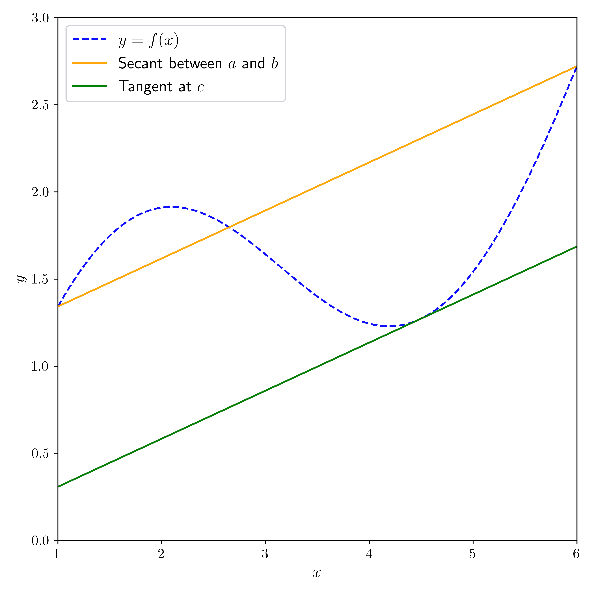

\(\bowtie\)

*证明思路*: 应用 *罗尔定理* 到

$$ \phi(x) = f(x) - \left[f(a) + \frac{f(b) - f(a)}{b - a} (x-a)\right]. $$

*证明*: 令 \(\phi(x) = f(x) - f(a) - \frac{f(b) - f(a)}{b - a} (x-a)\)。注意 \(\phi(a) = \phi(b) = 0\) 并且对于所有 \(x \in (a, b)\)，\(\phi'(x) = f'(x) - \frac{f(b) - f(a)}{b - a}\)。因此，根据 *罗尔定理*，存在 \(c \in (a, b)\) 使得 \(\phi'(c) = 0\)。这表明 \(\frac{f(b) - f(a)}{b - a} = f'(c)\)，从而得到结果。\(\square\)

我们还将使用 *泰勒定理*，这是 *平均值定理* 的一种推广，它提供了一个函数在一点的多项式近似。我们将限制自己使用带有二阶误差项的线性近似，这对于我们的目的来说是足够的。

**定理** **(泰勒)** \(\idx{泰勒定理}\xdi\) 设 \(f: D \to \mathbb{R}\) 其中 \(D \subseteq \mathbb{R}\)。假设 \(f\) 在 \([a,b]\) 上具有连续的导数，并且其二阶导数在 \((a,b)\) 上存在。那么对于任何 \(x \in [a, b]\)

$$ f(x) = f(a) + (x-a) f'(a) + \frac{1}{2} (x-a)² f''(\xi) $$

对于某些 \(a < \xi < x\)。\(\sharp\)

*证明思路:* *平均值定理* 意味着存在 \(a < \xi< x\) 使得

$$ f(x) = f(a) + (x - a)f'(\xi). $$

那个结果的一个证明思路如下：我们构造了一个在 \(a\) 和 \(x\) 处与 \(f\) 一致的仿射函数，然后使用 *罗尔定理* 来用 \(f'\) 表达线性项的系数。这里我们用二次多项式做同样的事情。但现在我们在选择这个多项式时有了额外的自由度。因为我们正在寻找一个接近 \(a\) 的良好近似，所以我们选择使 \(a\) 处的一阶导数也一致。应用 *罗尔定理* 两次得到结论。

*证明:* 设

$$ P(t) = \alpha_0 + \alpha_1 (t-a) + \alpha_2 (t-a)². $$

我们选择 \(\alpha_i\) 的值，使得 \(P(a) = f(a)\)，\(P'(a) = f'(a)\)，以及 \(P(x) = f(x)\)。前两个条件导致以下条件

$$ \alpha_0 = f(a), \quad \alpha_1 = f'(a). $$

设 \(\phi(t) = f(t) - P(t)\)。根据构造，\(\phi(a) = \phi(x) = 0\)。根据 *罗尔定理*，存在 \(\xi' \in (a, x)\) 使得 \(\phi'(\xi') = 0\)。此外，\(\phi'(a) = 0\)。因此我们可以再次应用 *罗尔定理* ——这次是对 \(\phi'\) 在 \([a, \xi']\) 上的应用。这意味着存在 \(\xi \in (a, \xi')\) 使得 \(\phi''(\xi) = 0\)。

\(\phi\) 在 \(\xi\) 处的二阶导数是

$$ 0 = \phi''(\xi) = f''(\xi) - P''(\xi) = f''(\xi) - 2 \alpha_2 $$

因此 \(\alpha_2 = f''(\xi)/2\)。将此代入 \(P\) 并使用 \(\phi(x) = 0\) 得到结论。 \(\square\)

**优化** 如前所述，优化问题在数据科学中起着无处不在的作用。这里我们研究无约束优化问题，即形式为：

$$ \min_{\mathbf{x} \in \mathbb{R}^d} f(\mathbf{x}) $$

其中 \(f : \mathbb{R}^d \to \mathbb{R}\)。

理想情况下，我们希望找到上述优化问题的全局最小值。

**定义** **（全局最小值或最大值）** \(\idx{全局最小值或最大值}\xdi\) 设 \(f : \mathbb{R}^d \to \mathbb{R}\)。如果点 \(\mathbf{x}^* \in \mathbb{R}^d\) 是 \(f\) 在 \(\mathbb{R}^d\) 上的全局最小值，则

$$ f(\mathbf{x}) \geq f(\mathbf{x}^*), \quad \forall \mathbf{x} \in \mathbb{R}^d. $$

\(\natural\)

全局最大值定义类似。

**数值角落:** 函数 \(f(x) = x²\) 在 \(\mathbb{R}\) 上在 \(x^* = 0\) 处有全局最小值。确实，对于所有 \(x\)，我们有 \(f(x) \geq 0\)，而 \(f(0) = 0\)。为了绘制函数，我们使用 Matplotlib 包，特别是它的函数 `matplotlib.pyplot.plot`。我们还使用函数 `numpy.linspace` 来创建一个均匀分布的数字数组，其中我们评估 \(f\)。

```py
import matplotlib.pyplot as plt

x = np.linspace(-2,2,100)
y = x ** 2

plt.plot(x, y, c='k')
plt.ylim(-0.25,4.25)
plt.show() 
```

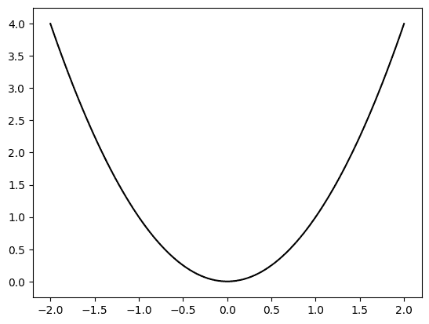

函数 \(f(x) = e^x\) 在 \(\mathbb{R}\) 上没有全局极小值。实际上，\(f(x) > 0\)，但没有 \(x\) 能达到 \(0\)。并且，对于任何 \(m > 0\)，都存在足够小的 \(x\) 使得 \(f(x) < m\)。注意，\(\mathbb{R}\) 是 *不是* 有界的，因此 *极值定理* 不适用于此处。

```py
x = np.linspace(-2,2,100)
y = np.exp(x)

plt.plot(x, y, c='k')
plt.ylim(-0.25,4.25)
plt.show() 
```

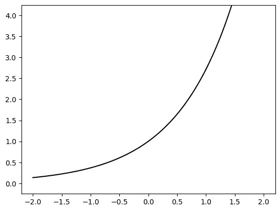

函数 \(f(x) = (x+1)² (x-1)²\) 在 \(\mathbb{R}\) 上有两个全局极小值点，分别是 \(x^* = -1\) 和 \(x^{**} = 1\)。实际上，\(f(x) \geq 0\)，且 \(f(x) = 0\) 当且仅当 \(x = x^*\) 或 \(x = x^{**}\)。

```py
x = np.linspace(-2,2,100)
y = ((x+1)**2) * ((x-1)**2)

plt.plot(x,y,c='k')
plt.ylim(-0.25,4.25)
plt.show() 
```

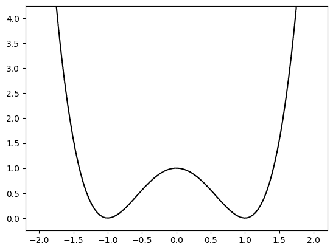

在 NumPy 中，[`*`](https://numpy.org/doc/stable/reference/generated/numpy.multiply.html) 是逐元素乘法。（关于其工作原理的更详细解释，请参阅 NumPy 的 [广播规则](https://numpy.org/doc/stable/user/basics.broadcasting.html)。）\(\unlhd\)

通常，找到全局极小值并证明已经找到它可能很困难，除非存在某种特殊结构。因此，引入了更弱的解的概念。

**定义** **(局部极小值点)** \(\idx{局部极小值点或极大值点}\xdi\) 设 \(f : \mathbb{R}^d \to \mathbb{R}\)。如果存在 \(\delta > 0\)，使得 \(\mathbf{x}^* \in \mathbb{R}^d\) 是 \(f\) 在 \(\mathbb{R}^d\) 上的局部极小值点，那么

$$ f(\mathbf{x}) \geq f(\mathbf{x}^*), \quad \forall \mathbf{x} \in B_{\delta}(\mathbf{x}^*) \setminus \{\mathbf{x}^*\}. $$

如果不等式是严格的，我们说 \(\mathbf{x}^*\) 是严格局部极小值点。\(\natural\)

用话来说，\(\mathbf{x}^*\) 是局部极小值点，如果存在一个以 \(\mathbf{x}^*\) 为中心的开球，在该开球内它达到最小值。局部极大值点的定义类似。在上面的最后一个例子中，\(x = 0\) 是局部极大值点。

**图：局部和全局最优解** ([来源](https://commons.wikimedia.org/wiki/File:Extrema_example_original.svg))


\(\bowtie\)

局部极小值点可以用导数来描述。

**定理** **(一阶必要最优性条件)** \(\idx{一阶必要最优性条件}\xdi\) 设 \(f : \mathbb{R} \to \mathbb{R}\) 在 \(\mathbb{R}\) 上可导（即其导数存在）。如果 \(x_0\) 是局部极小值点，那么 \(f'(x_0) = 0\)。 \(\sharp\)

**证明**：我们通过反证法来论证。假设 \(f'(x_0) \neq 0\)。假设 \(f'(x_0) > 0\)（另一种情况类似）。根据 *下降方向引理*，存在一个 \(\delta > 0\)，使得对于 \(B_\delta(x_0)\) 中的每个 \(x\)，如果 \(x < x_0\)，则 \(f(x) < f(x_0)\)。因此，每个以 \(x_0\) 为中心的开球都有一个点达到比 \(f(x_0)\) 更小的值。因此，\(x_0\) 不是局部极小值点，这是矛盾的。所以，必须 \(f'(x_0) = 0\)。\(\square\)

**多个变量的函数** 前述条件自然地推广到多个变量的函数。导数被梯度所取代。

**定义** **（偏导数）** \(\idx{partial derivative}\xdi\) 设 \(f : D \to \mathbb{R}\) 其中 \(D \subseteq \mathbb{R}^d\)，且 \(\mathbf{x}_0 = (x_{0,1},\ldots,x_{0,d}) \in D\) 是 \(D\) 的内点。\(f\) 在 \(\mathbf{x}_0\) 处关于 \(x_i\) 的偏导数是

$$\begin{align*} \frac{\partial f (\mathbf{x}_0)}{\partial x_i} &= \lim_{h \to 0} \frac{f(\mathbf{x}_0 + h \mathbf{e}_i) - f(\mathbf{x}_0)}{h}\\ &= \lim_{h \to 0} \frac{f(x_{0,1},\ldots,x_{0,i-1},x_{0,i} + h,x_{0,i+1},\ldots,x_{0,d}) - f(x_{0,1},\ldots,x_{0,d})}{h} \end{align*}$$

假设极限存在。如果 \(\frac{\partial f (\mathbf{x}_0)}{\partial x_i}\) 存在且在 \(\mathbf{x}_0\) 附近的开放球内对所有 \(i\) 连续，那么我们说 \(f\) 在 \(\mathbf{x}_0\) 处是连续可微的。 \(\natural\)

**定义** **（梯度）** \(\idx{gradient}\xdi\) 设 \(f : D \to \mathbb{R}\) 其中 \(D \subseteq \mathbb{R}^d\)，且 \(\mathbf{x}_0 \in D\) 是 \(D\) 的内点。假设 \(f\) 在 \(\mathbf{x}_0\) 处连续可微。向量

$$ \nabla f(\mathbf{x}_0) = \left(\frac{\partial f (\mathbf{x}_0)}{\partial x_1}, \ldots, \frac{\partial f (\mathbf{x}_0)}{\partial x_d}\right) $$

被称为 \(f\) 在 \(\mathbf{x}_0\) 处的梯度。 \(\natural\)

注意，梯度本身是 \(\mathbf{x}\) 的函数。实际上，与 \(f\) 不同，它是一个向量值函数。

我们将 *下降方向引理* 推广到多变量情况。我们首先需要定义什么是下降方向。

**定义** **（下降方向）** \(\idx{descent direction}\xdi\) 设 \(f : \mathbb{R}^d \to \mathbb{R}\)。如果存在 \(\alpha^* > 0\) 使得

$$ f(\mathbf{x}_0 + \alpha \mathbf{v}) < f(\mathbf{x}_0), \quad \forall \alpha \in (0,\alpha^*). $$

\(\natural\)

**引理** **（下降方向）** \(\idx{descent direction lemma}\xdi\) 设 \(f : \mathbb{R}^d \to \mathbb{R}\) 在 \(\mathbf{x}_0\) 处连续可微，并假设 \(\nabla f(\mathbf{x}_0) \neq 0\)。那么 \(f\) 在 \(\mathbf{x}_0\) 处有一个下降方向。 \(\flat\)

**定理** **（一阶必要最优性条件）** \(\idx{first-order necessary optimality condition}\xdi\) 设 \(f : \mathbb{R}^d \to \mathbb{R}\) 在 \(\mathbb{R}^d\) 上连续可微。如果 \(\mathbf{x}_0\) 是局部极小值点，那么 \(\nabla f(\mathbf{x}_0) = \mathbf{0}\)。 \(\sharp\)

## 1.2.3\. 概率#

最后，我们回顾一下概率论中的一些关键定义和结果。

**期望、方差和切比雪夫不等式** 回想一下，离散随机变量 \(X\) 的函数 \(h\) 的 [期望](https://en.wikipedia.org/wiki/Expected_value)（或均值）在 \(\mathcal{X}\) 中取值时，由以下公式给出

$$ \mathbb{E}[h(X)] = \sum_{x \in \mathcal{X}} h(x)\,p_X(x) $$

其中 \(p_X(x) = \mathbb{P}[X = x]\) 是 \(X\) 的 [概率质量函数](https://en.wikipedia.org/wiki/Probability_mass_function) (PMF)\(\idx{probability mass function}\xdi\)。在连续情况下，我们有

$$ \mathbb{E}[h(X)] = \int h(x) f_X(x)\,\mathrm{d}x $$

如果 \(f_X\) 是 \(X\) 的 [概率密度函数](https://en.wikipedia.org/wiki/Probability_density_function) (PDF)\(\idx{probability density function}\xdi\)。

这些定义通过使用联合 PMF 或 PDF 扩展到多变量函数。

我们有时用 \(\mu_X\) 表示 \(X\) 的期望。

期望的两个关键性质是：

+   *线性性*，即

$$ \mathbb{E}[\alpha_1 h_1(X) + \alpha_2 h_2(Y) + \beta] = \alpha_1 \,\mathbb{E}[h_1(X)] + \alpha_2 \,\mathbb{E}[h_2(Y)] + \beta $$

+   *单调性*，即如果对所有 \(x\) 有 \(h_1(x) \leq h_2(x)\)，那么

$$ \mathbb{E}[h_1(X)] \leq \mathbb{E}[h_2(X)]. $$

实值随机变量 \(X\) 的 [方差](https://en.wikipedia.org/wiki/Variance)\(\idx{variance}\xdi\) 是

$$ \mathrm{Var}[X] = \mathbb{E}[(X - \mathbb{E}[X])²] $$

其标准差是 \(\sigma_X = \sqrt{\mathrm{Var}[X]}\)。方差不满足线性，但我们有以下性质

$$ \mathrm{Var}[\alpha X + \beta] = \alpha² \,\mathrm{Var}[X]. $$

标准差是 \(X\) 围绕其均值典型偏差的度量，即分布的分散程度。

该陈述的定量版本由 *切比雪夫不等式* 给出。

**定理** **(切比雪夫)** \(\idx{Chebyshev's inequality}\xdi\) 对于具有有限方差的随机变量 \(X\)，对于任何 \(\alpha > 0\)，我们有

$$ \mathbb{P}[|X - \mathbb{E}[X]| \geq \alpha] \leq \frac{\mathrm{Var}[X]}{\alpha²}. $$

\(\sharp\)

直觉如下：如果期望平方偏差很小，那么绝对偏差不太可能很大。

为了形式化这一点，我们证明一个更一般的**马克夫不等式**。换句话说，如果一个非负随机变量的期望很小，那么它不太可能很大。

**引理** **(马尔可夫)** \(\idx{Markov's inequality}\xdi\) 设 \(Z\) 是一个具有有限期望的非负随机变量。那么，对于任何 \(\beta > 0\)，

$$ \mathbb{P}[Z \geq \beta] \leq \frac{\mathbb{E}[Z]}{\beta}. $$

\(\flat\)

*证明思路:* 量 \(\beta \,\mathbb{P}[Z \geq \beta]\) 是 \(Z\) 在范围 \(\{Z\geq \beta\}\) 上的期望的下界，根据非负性，它本身由 \(\mathbb{E}[Z]\) 下界限制。

*证明:* 形式上，设 \(\mathbf{1}_A\) 为事件 \(A\) 的指示函数，即当 \(A\) 发生时它为 \(1\)，否则为 \(0\)。根据定义，\(\mathbf{1}_A\) 的期望是

$$ \mathbb{E}[A] = 0\,\mathbb{P}[\mathbf{1}_A = 0] + 1\,\mathbb{P}[\mathbf{1}_A = 1] = \mathbb{P}[A] $$

其中 \(A^c\) 是 \(A\) 的补集。因此，根据线性性和单调性，

$$ \beta \,\mathbb{P}[Z \geq \beta] = \beta \,\mathbb{E}[\mathbf{1}_{Z \geq \beta}] = \mathbb{E}[\beta \mathbf{1}_{Z \geq \beta}] \leq \mathbb{E}[Z]. $$

重新排列给出结论。 \(\square\)

最后，我们回到 *切比雪夫不等式* 的证明。

*证明思路 (切比雪夫):* 简单地将 *马尔可夫不等式* 应用于 \(X\) 与其均值之差的平方。

*证明:* *(切比雪夫)* \(\idx{切比雪夫不等式}\xdi\) 设 \(Z = (X - \mathbb{E}[X])²\)，根据定义，\(Z\) 是非负的。因此，根据 *马尔可夫不等式*，对于任何 \(\beta = \alpha² > 0\)

$$\begin{align*} \mathbb{P}[|X - \mathbb{E}[X]| \geq \alpha] &= \mathbb{P}[(X - \mathbb{E}[X])² \geq \alpha²]\\ &= \mathbb{P}[Z \geq \beta]\\ &\leq \frac{\mathbb{E}[Z]}{\beta}\\ &= \frac{\mathrm{Var}[X]}{\alpha²} \end{align*}$$

其中我们在最后一个等式中使用了方差的定义。 \(\square\)

关于 *切比雪夫不等式* 的一些重要注释：

(1) 我们有时需要一种形式为单侧界的形式

$$ \mathbb{P}[X - \mathbb{E}[X] \geq \alpha]. $$

注意与 *切比雪夫不等式* 中出现的双向形式相比，这里没有绝对值。在这种情况下，我们可以使用事实，即事件 \(\{X - \mathbb{E}[X] \geq \alpha\}\) 从逻辑上意味着 \(\{|X - \mathbb{E}[X]| \geq \alpha\}\)，因此前者的事件概率小于后者的事件概率，即单调性，即

$$ \mathbb{P}[X - \mathbb{E}[X] \geq \alpha] \leq \mathbb{P}[|X - \mathbb{E}[X]| \geq \alpha]. $$

然后，我们可以对右侧应用 *切比雪夫不等式* 来得到

$$ \mathbb{P}[X - \mathbb{E}[X] \geq \alpha] \leq \frac{\mathrm{Var}[X]}{\alpha²}. $$

同样地，由于同样的原因，我们也有

$$ \mathbb{P}[X - \mathbb{E}[X] \leq - \alpha] \leq \frac{\mathrm{Var}[X]}{\alpha²}. $$

(2) 在 \(X\) 的标准差 \(\sigma_X = \sqrt{\mathrm{Var}[X]}\) 的意义上，不等式可以重新写为

$$ \mathbb{P}[|X - \mathbb{E}[X]| \geq \alpha] \leq \frac{\mathrm{Var}[X]}{\alpha²} = \left(\frac{\sigma_X}{\alpha}\right)². $$

因此，为了在右侧得到一个小界，需要均值之差 \(\alpha\) 显著大于标准差。换句话说，一个随机变量不太可能比其标准差大得多地偏离其均值。这一观察与标准差作为随机变量典型分布的解释是一致的。

*切比雪夫不等式*与独立性结合使用时特别有用。

**独立性与极限定理** \(\idx{independence}\xdi\) 回忆一下，如果离散随机变量 \(X\) 和 \(Y\) 的联合概率质量函数可以分解，则它们是独立的，即

$$ p_{X,Y}(x,y) = p_X(x) \,p_Y(y), \qquad \forall x, y $$

其中 \(p_{X,Y}(x,y) = \mathbb{P}[X=x, Y=y]\)。类似地，如果连续随机变量 \(X\) 和 \(Y\) 的联合概率密度函数可以分解，则它们是独立的。一个后果是，单变量函数乘积的期望也可以分解，即对于函数 \(g\) 和 \(h\)，我们有

$$ \mathbb{E}[g(X) h(Y)] = \mathbb{E}[g(X)] \,\mathbb{E}[h(Y)], $$

假设期望存在。

量化两个随机变量缺乏独立性的一个重要方法是协方差。

**定义** **(协方差)** \(\idx{covariance}\xdi\) 随机变量 \(X\) 和 \(Y\) 的协方差，假设它们具有有限的均值和方差，定义为

$$ \mathrm{Cov}[X,Y] = \mathbb{E}\left[(X - \mathbb{E}[X])(Y - \mathbb{E}[Y])\right]. $$

\(\natural\)

注意，根据定义，协方差是对称的：\(\mathrm{Cov}[X,Y] = \mathrm{Cov}[Y,X]\).

当 \(X\) 和 \(Y\) 相互独立时，它们的协方差为 \(0\):

$$\begin{align*} \mathrm{Cov}[X,Y] &= \mathbb{E}\left[(X - \mathbb{E}[X])(Y - \mathbb{E}[Y])\right]\\ &= \mathbb{E}\left[X - \mathbb{E}[X]\right]\mathbb{E}\left[Y - \mathbb{E}[Y]\right]\\ &= \left(\mathbb{E}[X] - \mathbb{E}[X]\right)\left(\mathbb{E}[Y] - \mathbb{E}[Y]\right)\\ &= 0, \end{align*}$$

其中我们在第二行使用了独立性，在第三行使用了期望的线性。

在数据科学中，一个相关的感兴趣量是相关系数，它是通过将协方差除以标准差的乘积得到的

$$ \rho_{X, Y} = \frac{\mathrm{Cov}[X,Y]}{\sigma_X \sigma_Y}. $$

根据柯西-施瓦茨不等式，它位于 \([-1,1]\) 之间（证明它！）。

协方差导致一个有用的恒等式，用于随机变量和的方差。

**引理** **(和的方差)** \(\idx{variance of a sum}\xdi\) 设 \(X_1,\ldots,X_n\) 是具有有限均值和方差的随机变量。那么我们有

$$ \mathrm{Var}[X_1 + \cdots + X_n] = \sum_{i=1} \mathrm{Var}[X_i] + 2 \sum_{i < j} \mathrm{Cov}[X_i, X_j]. $$

\(\flat\)

**证明**：根据方差的定义和期望的线性，

$$\begin{align*} &\mathrm{Var}[X_1 + \cdots + X_n]\\ &= \mathbb{E}\left[(X_1 + \cdots + X_n - \mathbb{E}[X_1 + \cdots + X_n])²\right]\\ &= \mathbb{E}\left[(X_1 + \cdots + X_n - \mathbb{E}[X_1] - \cdots - \mathbb{E}[X_n])²\right]\\ &= \mathbb{E}\left[(X_1 - \mathbb{E}[X_1]) + \cdots + (X_n - \mathbb{E}[X_n]))²\right]\\ &= \sum_{i=1}^n \mathbb{E}\left[(X_i - \mathbb{E}[X_i])²\right] + \sum_{i \neq j} \mathbb{E}\left[(X_i - \mathbb{E}[X_i]) (X_j - \mathbb{E}[X_j])\right]. \end{align*}$$

该结论可从方差和协方差的定义以及协方差的对称性得出。 \(\square\)

前面的引理有以下重要含义。如果 \(X_1, \ldots, X_n\) 是成对独立的、实值随机变量，那么

$$ \mathrm{Var}[X_1 + \cdots + X_n] = \mathrm{Var}[X_1] + \cdots + \mathrm{Var}[X_n]. $$

注意，与期望的情况不同，这个方差的线性性质需要独立性。

将其应用于 \(n\) 个独立同分布 (i.i.d.) 随机变量 \(X_1,\ldots,X_n\) 的样本均值，我们得到

$$\begin{align*} \mathrm{Var} \left[\frac{1}{n} \sum_{i=1}^n X_i\right] &= \frac{1}{n²} \sum_{i=1}^n \mathrm{Var}[X_i]\\ &= \frac{1}{n²} n \,\mathrm{Var}[X_1]\\ &= \frac{\mathrm{Var}[X_1]}{n}. \end{align*}$$

因此，当 \(n\) 变大时，样本均值的方差会减小，而其期望值由于线性性质保持不变

$$\begin{align*} \mathbb{E} \left[\frac{1}{n} \sum_{i=1}^n X_i\right] &= \frac{1}{n} \sum_{i=1}^n \mathbb{E}[X_i]\\ &= \frac{1}{n} n \,\mathbb{E}[X_1]\\ &= \mathbb{E}[X_1]. \end{align*}$$

结合**切比雪夫不等式**，我们立即得到样本均值在以下概率意义上的期望值。

**定理** **(大数定律)** \(\idx{weak law of large numbers}\xdi\) 设 \(X_1, \ldots, X_n\) 为独立同分布 (i.i.d.)。对于任何 \(\varepsilon > 0\)，当 \(n \to +\infty\) 时，

$$ \mathbb{P}\left[\left|\frac{1}{n} \sum_{i=1}^n X_i - \mathbb{E}[X_1]\right| \geq \varepsilon\right] \to 0. $$

\(\sharp\)

**证明**: 通过**切比雪夫不等式**和上述公式，

$$\begin{align*} \mathbb{P}\left[\left|\frac{1}{n} \sum_{i=1}^n X_i - \mathbb{E}[X_1]\right| \geq \varepsilon\right] &= \mathbb{P}\left[\left|\frac{1}{n} \sum_{i=1}^n X_i - \mathbb{E} \left[\frac{1}{n} \sum_{i=1}^n X_i\right]\right| \geq \varepsilon\right]\\ &\leq \frac{\mathrm{Var}\left[\frac{1}{n} \sum_{i=1}^n X_i\right]}{\varepsilon²}\\ &= \frac{\mathrm{Var}[X_1]}{n \varepsilon²}\\ &\to 0 \end{align*}$$

当 \(n \to +\infty\) 时。 \(\square\)

**数值角**: 我们可以使用模拟来验证**大数定律**。回忆一下，区间 \([a,b]\) 上的均匀随机变量具有密度

$$\begin{split} f_{X}(x) = \begin{cases} \frac{1}{b-a} & x \in [a,b] \\ 0 & \text{o.w.} \end{cases} \end{split}$$

我们写 \(X \sim \mathrm{U}[a,b]\)。我们可以通过使用函数 `numpy.random.Generator.uniform` 从 \(\mathrm{U}[0,1]\) 获取样本。[`numpy.random.default_rng`](https://numpy.org/doc/stable/reference/random/generator.html) 在 NumPy 中用于实例化随机数生成器 (RNG)。我们提供一个 [种子](https://numpy.org/doc/stable/reference/random/bit_generators/index.html#seeding-and-entropy) 作为 RNG 的初始状态。再次使用相同的种子可以确保可重复性。

```py
seed = 535
rng = np.random.default_rng(seed)
rng.uniform() 
```

```py
0.9836159914889122 
```

现在我们从 \(\mathrm{U}[0,1]\) 中抽取 \(n\) 个样本并计算它们的样本均值。我们重复 \(k\) 次，并使用 [直方图](https://en.wikipedia.org/wiki/Histogram) 显示样本均值的经验分布。我们从 \(n=10\) 开始。

```py
n, k = 10, 1000
sample_mean = [np.mean(rng.random(n)) for i in range(k)]
plt.hist(sample_mean, bins=10, color='lightblue', edgecolor='black')
plt.xlim(0,1)
plt.show() 
```

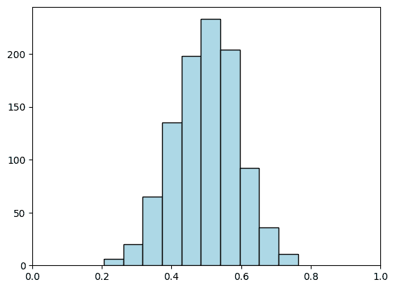

取 \(n\) 非常大时，会导致围绕均值的集中度更高。

```py
n, k = 100, 1000
sample_mean = [np.mean(rng.random(n)) for i in range(k)]
plt.hist(sample_mean, bins=10, color='lightblue', edgecolor='black')
plt.xlim(0,1)
plt.show() 
```

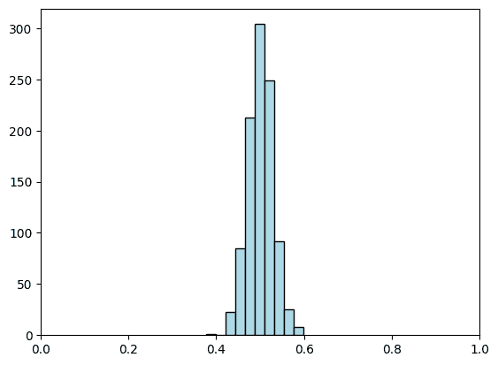

**尝试一下！** 回想一下，随机变量 \(X\) 的累积分布函数（CDF）\(\idx{累积分布函数}\xdi\) 定义为

$$ F_X(z) = \mathbb{P}[X \leq z], \qquad \forall z \in \mathbb{R}. $$

a) 设 \(\mathcal{Z}\) 为 \(F_X(z) \in (0,1)\) 的区间，并假设 \(F_X\) 在 \(\mathcal{Z}\) 上严格单调递增。设 \(U \sim \mathrm{U}[0,1]\)。证明：

$$ \mathbb{P}[F_X^{-1}(U) \leq z] = F_X(z). $$

b) 使用 `numpy.random.Generator.uniform` 和 a) 中的观察结果生成 \(\mathrm{U}[a,b]\) 的样本，对于任意的 \(a\)，\(b\)。这称为逆变换抽样方法\(\idx{逆变换抽样方法}\xdi\)。([在 Colab 中打开](https://colab.research.google.com/github/MMiDS-textbook/MMiDS-textbook.github.io/blob/main/just_the_code/roch_mmids_chap_intro_notebook.ipynb))

```py
a = -1
b = 1
X = rng.uniform()
# EDIT THIS LINE: transform X to obtain a random variable Y ~ U[a,b] 
```

\(\unlhd\)

**随机向量和矩阵** \(\mathbb{R}^d\) 中的随机向量 \(\bX = (X_1,\ldots,X_d)\) 是一个 \(d\)-维向量，其坐标 \(X_1,\ldots,X_d\) 是相关随机变量；形式上，它们位于同一个概率空间。

随机向量 \(\bX\) 的均值 \(\bmu_\bX\) 本身也是一个向量，其坐标是坐标的均值，

$$\begin{split} \bmu_\bX = \E[\bX] = \begin{pmatrix} \E[X_1]\\ \vdots\\ \E[X_d] \end{pmatrix}. \end{split}$$

期望的线性推广到（检查它！）

$$ \E[A \bX + \mathbf{b}] = A\,\E[\bX] + \mathbf{b} $$

对于一个确定性的（即非随机的）矩阵 \(A \in \mathbb{R}^{\ell \times d}\) 和向量 \(\mathbf{b} \in \mathbb{R}^{\ell}\)。

一个随机矩阵 \(\mathbf{M} = (M_{i,j})_{i,j} \in \mathbb{R}^{\ell \times d}\) 是一个矩阵，其条目是相关随机变量。随机矩阵的期望是（确定性的）矩阵，其条目是 \(\mathbf{M}\) 条目的期望

$$\begin{split} \mathbb{E}[\mathbf{M}] = \begin{pmatrix} \E[M_{1,1}] & \cdots & \E[M_{1,d}]\\ \vdots & \ddots & \vdots\\ \E[M_{\ell,1}] & \cdots & \E[M_{\ell,d}] \end{pmatrix}. \end{split}$$

期望的线性推广到（检查它！）

$$ \E[A \mathbf{M} + B] = A\,\E[\mathbf{M}] + B $$

对于确定性的矩阵 \(A \in \mathbb{R}^{k \times \ell}\) 和 \(B \in \mathbb{R}^{k \times d}\)。

随机向量 \(\bX\) 的协方差矩阵 \(\bSigma_{\bX}\)（也称为方差矩阵或协方差矩阵）是一个矩阵，其 \((i,j)\) 元素是坐标 \(i\) 和 \(j\) 的协方差

$$ (\bSigma_{\bX})_{i,j} = \mathrm{cov}[X_i,X_j] = \mathbb{E}\left[(X_i - \mathbb{E}[X_i])(X_j - \mathbb{E}[X_j])\right]. $$

我们有时也会将其表示为 \(\mathrm{K}_{\bX, \bX} := \bSigma_{\bX}\)，或者简单地表示为 \(\mathrm{Cov}[\bX]\)。

使用之前的例子，这可以写成以下更紧凑的矩阵形式

$$ \bSigma_\bX = \E\left[ (\bX - \bmu_\bX) (\bX - \bmu_\bX)^T \right], $$

其中我们将 \(\bX\) 视为一个列向量。观察在这个计算中，\((\bX - \bmu_\bX) (\bX - \bmu_\bX)^T\) 是一个随机矩阵。

协方差矩阵有两个特殊性质：它们是对称的，并且是正半定的。

对称性来自协方差的定义：

$$\begin{align*} \mathrm{Cov}[X_i,X_j] &= \mathbb{E}\left[(X_i - \mathbb{E}[X_i])(X_j - \mathbb{E}[X_j])\right]\\ &= \mathbb{E}\left[(X_j - \mathbb{E}[X_j])(X_i - \mathbb{E}[X_i])\right]\\ &=\mathrm{Cov}[X_j,X_i]. \end{align*}$$

**定理** **(协方差正定性)** \(\idx{positive semidefiniteness of the covariance}\xdi\) 随机向量 \(\bX\) 的协方差矩阵 \(\bSigma_\bX\) 是正半定的。 \(\sharp\)

*证明思路:* 表达式 \(\langle \mathbf{z}, \bSigma_\bX \mathbf{z} \rangle\) 可以重写为随机变量和的方差。方差总是非负的。

*证明:* 根据协方差的定义，

$$\begin{align*} \langle \mathbf{z}, \bSigma_\bX \mathbf{z} \rangle &= \sum_{i,j} z_i z_j \mathrm{Cov}[X_i, X_j]\\ &= \sum_{i,j} z_i z_j \mathbb{E}\left[(X_i - \mathbb{E}[X_i])(X_j - \mathbb{E}[X_j])\right]\\ &= \sum_{i,j} \mathbb{E}\left[(z_i X_i - \mathbb{E}[ z_iX_i])(z_j X_j - \mathbb{E}[z_j X_j])\right]\\ &= \sum_{i,j} \mathrm{Cov}[z_i X_i, z_j X_j]. \end{align*}$$

利用 \(\mathrm{Cov}[X, X] = \mathrm{Var}[X]\) 和 \(\mathrm{Cov}[X, Y] = \mathrm{Cov}[Y, X]\) 的性质，这个最后的和可以重新排列为

$$ \sum_{i=1}^d \mathrm{Var}[z_i X_i] + 2 \sum_{i < j} \mathrm{Cov}[z_i X_i, z_j X_j]. $$

我们之前遇到过这个表达式！根据“和的方差”，这可以写成

$$ \mathrm{Var}\left[\sum_{i=1}^d z_i X_i\right], $$

这是非负的。这就完成了证明。 \(\square\)

**知识检查:** 使用 \(\bSigma_\bX\) 的矩阵形式给出协方差正定性的简短证明。 \(\checkmark\)

之后，我们需要线性变换的协方差矩阵。我们首先注意到协方差具有方便的线性性质：

$$\begin{align*} \mathrm{Cov}[\alpha X + \beta, Y] &= \mathbb{E}\left[(\alpha X + \beta - \mathbb{E}[\alpha X + \beta])(Y - \mathbb{E}[Y])\right]\\ &= \mathbb{E}\left[(\alpha X - \mathbb{E}[\alpha X])(Y - \mathbb{E}[Y])\right]\\ &= \alpha \,\mathbb{E}\left[( X - \mathbb{E}[X])(Y - \mathbb{E}[Y])\right]\\ &= \alpha \,\mathrm{Cov}[X, Y]. \end{align*}$$

此外，

$$\begin{align*} \mathrm{Cov}[X + Z, Y] &= \mathbb{E}\left[(X + Z - \mathbb{E}[X + Z])(Y - \mathbb{E}[Y])\right]\\ &= \mathbb{E}\left[(X - \mathbb{E}[X] + Z - \mathbb{E}[Z])(Y - \mathbb{E}[Y])\right]\\ &= \mathbb{E}\left[(X - \mathbb{E}[X])(Y - \mathbb{E}[Y])\right] + \mathbb{E}\left[(Z - \mathbb{E}[Z])(Y - \mathbb{E}[Y])\right]\\ &= \mathrm{Cov}[X, Y] + \mathrm{Cov}[Z, Y]. \end{align*}$$

**引理** **(线性变换的协方差)** \(\idx{covariance of a linear transformation}\xdi\) 设 \(\bX = (X_1,\ldots,X_d)\) 是一个在 \(\mathbb{R}^d\) 中的随机向量，具有有限的方差（即，对于所有 \(i\)，\(\mathrm{Var}[X_i] < +\infty\)）。对于确定性（即，非随机）的 \(A \in \mathbb{R}^{\ell \times d}\)，我们有

$$ \mathrm{Cov}[A \mathbf{X}] = A \,\mathrm{Cov}[\mathbf{X}] \,A^T $$

\(\flat\)

*证明：* 以矩阵形式，令 \(\bmu_{\mathbf{X}}\) 和 \(\bmu_{\mathbf{Y}} = A \bmu_{\mathbf{X}}\) 分别为 \(\mathbf{X}\) 和 \(\mathbf{Y}\) 的均值，我们有

$$\begin{align*} \mathrm{Cov}[\mathbf{Y}] &= \mathbb{E}\left[(\mathbf{Y} - \bmu_{\mathbf{Y}})(\mathbf{Y} - \bmu_{\mathbf{Y}})^T\right]\\ &= \mathbb{E}\left[(A \mathbf{X} - A \bmu_{\mathbf{X}})(A \mathbf{X} - A \bmu_{\mathbf{X}})^T\right]\\ &= \mathbb{E}\left[A(\mathbf{X} - \bmu_{\mathbf{X}})(\mathbf{X} - \bmu_{\mathbf{X}})^T A^T\right]\\ &= A \,\mathbb{E}\left[(\mathbf{X} - \bmu_{\mathbf{X}})(\mathbf{X} - \bmu_{\mathbf{X}})^T\right] A^T\\ \end{align*}$$

其中我们两次使用了期望的线性性质。 \(\square\)

对于在同一概率空间上定义的两个随机向量 \(\mathbf{X} \in \mathbb{R}^{n}\) 和 \(\mathbf{Y} \in \mathbb{R}^m\)，我们定义交叉协方差矩阵为

$$ \mathrm{Cov}[\mathbf{X}, \mathbf{Y}] = \E[(\mathbf{X} - \E[\mathbf{X}])(\mathbf{Y} - \E[\mathbf{Y}])^T]. $$

这是一个 \(n \times m\) 维的矩阵。

一个随机向量与其自身的交叉协方差矩阵是协方差矩阵。

**正态分布** \(\idx{normal or Gaussian distribution}\xdi\) 回想一下，一个标准正态变量 \(X\) 的概率密度函数为

$$ f_X(x) = \frac{1}{\sqrt{2 \pi}} \exp\left( - x²/2 \right). $$

它的均值是 \(0\)，方差是 \(1\)。

要构建一个 \(d\)-维版本，我们取 \(d\) 个独立的标准正态变量 \(X_1, X_2, \ldots, X_d\) 并形成向量 \(\mathbf{X} = (X_1,\ldots,X_d)\)。我们将说 \(\mathbf{X}\) 是一个标准正态 \(d\)-向量。由于独立性，其联合概率密度函数由 \(X_i\) 的概率密度函数的乘积给出，即，

$$\begin{align*} f_{\mathbf{X}}(\mathbf{x}) &= \prod_{i=1}^d \frac{1}{\sqrt{2 \pi}} \exp\left( - x_i²/2 \right)\\ &= \frac{1}{\prod_{i=1}^d \sqrt{2 \pi}} \exp\left( - \sum_{i=1}^d x_i²/2 \right)\\ &= \frac{1}{(2 \pi)^{d/2}} \exp(-\|\mathbf{x}\|²/2). \end{align*}$$

我们也可以对其进行平移和缩放。

**定义** **（球面高斯）** \(\idx{spherical Gaussian}\xdi\) 设 \(\mathbf{Z}\) 为一个标准正态 \(d\) 向量，设 \(\bmu \in \mathbb{R}^d\) 和 \(\sigma \in \mathbb{R}_+\)。那么我们将变换后的随机变量 \(\mathbf{X} = \bmu + \sigma \mathbf{Z}\) 称为具有均值 \(\bmu\) 和方差 \(\sigma²\) 的球面高斯。我们使用符号 \(\mathbf{Z} \sim N_d(\bmu, \sigma² I)\)。\(\natural\)

**数值角落**：以下函数从具有方差 \(\sigma²\) 和均值 \(\bmu\) 的球面 \(d\) 维高斯分布中生成 \(n\) 个数据点。

以下，`rng.normal(0,1,(n,d))`（[链接](https://numpy.org/doc/stable/reference/random/generated/numpy.random.Generator.normal.html)）生成一个 `n` 个独立的 `d` 维球面高斯分布，均值为 \(\mathbf{0}\)（作为行向量）。

在整个过程中，当定义一个使用随机数生成器（RNG）的函数时，我们初始化 RNG 并将其传递给函数。这允许我们在更高层次上控制随机数生成过程，并确保多次运行的结果一致。

```py
def spherical_gaussian(rng, d, n, mu, sig):
    return mu + sig * rng.normal(0,1,(n,d)) 
```

我们在维度 \(d=2\) 中生成 \(100\) 个数据点。我们取 \(\sigma² = 1\) 和 \(\bmu = w \mathbf{e}_1\)。以下我们使用函数 `numpy.hstack`（[链接](https://numpy.org/doc/stable/reference/generated/numpy.hstack.html)）通过连接两个给定的向量来创建一个向量。我们使用 `[w]` 来创建一个只有一个条目 `w` 的向量。我们还使用函数 `numpy.zeros`（[链接](https://numpy.org/doc/stable/reference/generated/numpy.zeros.html)）来创建一个全零向量。

```py
d, n, w, sig = 2, 100, 3., 1.
mu = np.hstack(([w], np.zeros(d-1)))
X = spherical_gaussian(rng, d, n, mu, sig)
plt.scatter(X[:,0], X[:,1], s=5, c='k')
plt.axis([-1, 7, -4, 4])
plt.show() 
```

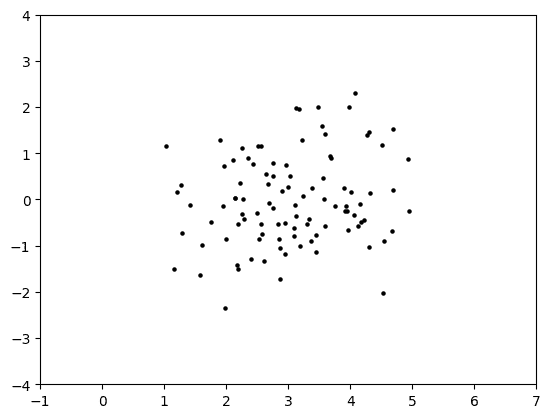

\(\unlhd\)

更一般地，我们考虑球面高斯混合\(\idx{mixture of spherical Gaussians}\xdi\)，这是高斯混合模型（GMM）的一个特例。为了简化问题，我们将限制自己到两个高斯的混合，但这很容易推广。

此模型具有多个参数。对于 \(i=0,1\)，我们有一个均值 \(\bmu_i \in \mathbb{R}^d\) 和一个正方差 \(\sigma_i \in \mathbb{R}_+\)。我们还有一个混合权重 \(\phi_0, \phi_1 \in (0,1)\)，使得 \(\phi_0 + \phi_1 = 1\)。假设我们想要生成总共 \(n\) 个样本。

对于每个样本 \(j=1,\ldots, n\)，独立于其他所有内容：

1.  我们首先随机选择一个分量 \(i \in \{0,1\}\)，根据混合权重，即 \(i=0\) 以概率 \(\phi_0\) 被选中，\(i=1\) 以概率 \(\phi_1\) 被选中。

1.  我们根据具有均值 \(\bmu_i\) 和方差 \(\sigma_i²\) 的球形高斯分布生成样本 \(\bX_j = (X_{j,1},\ldots,X_{j,d})\).

这可以通过使用 `numpy.random.Generator.choice` 函数来实现，以选择每个样本的分量。[链接](https://numpy.org/doc/stable/reference/random/generated/numpy.random.Generator.choice.html)

代码如下。它返回一个 `d` 行 `n` 列的数组 `X`，其中每一行是从一个 2 分量球形高斯混合模型中抽取的样本。

```py
def gmm2spherical(rng, d, n, phi0, phi1, mu0, sig0, mu1, sig1):

    phi, mu, sig = np.stack((phi0, phi1)), np.stack((mu0, mu1)), np.stack((sig0,sig1))

    X = np.zeros((n,d))
    component = rng.choice(2, size=n, p=phi)
    for i in range(n):
        X[i,:] = spherical_gaussian(rng, d, 1, mu[component[i],:], sig[component[i]])

    return X 
```

**数值角:** 让我们用以下参数尝试。

```py
d, n, w, sig0, sig1, phi0, phi1 = 2, 1000, 3., 1.5, 0.5, 0.2, 0.8
mu0, mu1 = np.hstack(([w], np.zeros(d-1))), np.hstack(([-w], np.zeros(d-1)))
X = gmm2spherical(rng, d, n, phi0, phi1, mu0, sig0, mu1, sig1)
plt.figure(figsize=(6,3))
plt.scatter(X[:,0], X[:,1], s=5, color='k')
plt.axis([-8, 8, -4, 4])
plt.show() 
```

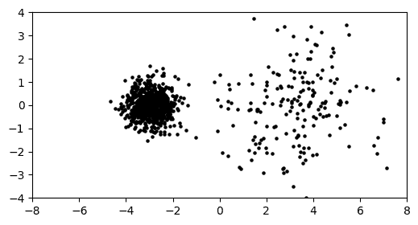

如预期，我们观察到两个簇。右侧的簇（组件 \(0\)）更稀疏（即包含的数据点更少），因为 `phi0` 比较小，而 `phi1` 较大。它也更大，因为其方差更大。

\(\unlhd\)

***自我评估测验*** *(在 Claude、Gemini 和 ChatGPT 的帮助下)*

**1** 设 \(A \in \mathbb{R}^{n \times m}\) 和 \(B \in \mathbb{R}^{m \times p}\)。矩阵乘积 \(AB\) 的维度是什么？

a) \(n \times m\)

b) \(m \times p\)

c) \(n \times p\)

d) \(p \times n\)

**2** 以下哪项不是矩阵转置的性质？

a) \((A^T)^T = A\)

b) 对于任何标量 \(\gamma \in \mathbb{R}\)，有 \((\gamma A)^T = \gamma A^T\)

c) \((A + B)^T = A^T + B^T\)

d) \((AB)^T = A^T B^T\)

**3** 设 \(A \in \mathbb{R}^{n \times m}\) 为一个矩阵，\(\bx \in \mathbb{R}^m\) 为一个列向量。以下哪项关于矩阵-向量乘积 \(A\bx\) 是正确的？

a) \(A\bx\) 是 \(A\) 的行向量的线性组合，其中系数是 \(\bx\) 的元素

b) \(A\bx\) 是 \(A\) 的列向量的线性组合，其中系数是 \(\bx\) 的元素

c) \(A\bx\) 是 \(A\) 的行向量的线性组合，其中系数是 \(A\) 的第一行的元素

d) \(A\bx\) 是 \(A\) 的列向量的线性组合，其中系数是 \(A\) 的第一列的元素

**4** 以下哪项不是随机变量方差的性质？

a) 对于 \(\alpha, \beta \in \mathbb{R}\)，有 \(\mathrm{Var}[\alpha X + \beta] = \alpha² \mathrm{Var}[X]\)

b) \(\mathrm{Var}[X] = \E[(X - \E[X])²]\)

c) \(\mathrm{Var}[X] \ge 0\)

d) 对于任何随机变量 \(X\) 和 \(Y\)，有 \(\mathrm{Var}[X + Y] = \mathrm{Var}[X] + \mathrm{Var}[Y]\)

**5** 如果 \(\mathbf{X}\) 是 \(\mathbb{R}^d\) 中的随机向量，具有均值向量 \(\boldsymbol{\mu}_{\mathbf{X}}\) 和协方差矩阵 \(\bSigma_{\mathbf{X}}\)，以下哪个表达式代表协方差矩阵 \(\bSigma_{\mathbf{X}}\)？

a) \(\E[(\mathbf{X} - \boldsymbol{\mu}_{\mathbf{X}})²]\)

b) \(\E[(\mathbf{X} - \boldsymbol{\mu}_{\mathbf{X}})(\mathbf{X} - \boldsymbol{\mu}_{\mathbf{X}})^T]\)

c) \(\E[(\mathbf{X} - \boldsymbol{\mu}_{\mathbf{X}})^T (\mathbf{X} - \boldsymbol{\mu}_{\mathbf{X}})]\)

d) \(\E[(\mathbf{X} - \boldsymbol{\mu}_{\mathbf{X}})^T] \E[(\mathbf{X} - \boldsymbol{\mu}_{\mathbf{X}})]\)

1 题的答案：c. 理由：通过观察第一个矩阵的行数和第二个矩阵的列数，我们可以看到 \(AB\) 的维度是 \(n \times p\)。

2 题的答案：d. 理由：文本中提到 \((BC)^T = C^T B^T\)，而不是 \(B^T C^T\)。

3 题的答案：b. 理由：文本中提到，“\(A\bx\) 是 \(A\) 的列的线性组合，其中系数是 \(\bx\) 的元素。在矩阵形式中，\(A\bx = \sum_{j=1}^m A_{\cdot,j}x_j\)。”

4 题的答案：d. 理由：文本中提到随机变量和的方差由 \(\mathrm{Var}[X_1 + ... + X_n] = \sum_{i=1}^n \mathrm{Var}[X_i] + 2 \sum_{i<j} \mathrm{Cov}[X_i, X_j]\) 给出，只有当协方差项为零时（例如，当 \(X\) 和 \(Y\) 相互独立时），它才等于 \(\mathrm{Var}[X] + \mathrm{Var}[Y]\)。

5 题的答案：b. 理由：随机向量 \(\mathbf{X}\) 的协方差矩阵 \(\bSigma_{\mathbf{X}}\) 由 \(\bSigma_{\mathbf{X}} = \E[(\mathbf{X} - \boldsymbol{\mu}_{\mathbf{X}})(\mathbf{X} - \boldsymbol{\mu}_{\mathbf{X}})^T]\) 给出。

## 1.2.1\. 向量与矩阵#

在整个文档中，\(\mathbb{R}\) 和 \(\mathbb{R}_+\) 分别表示实数和正实数。

**向量与范数** 对于一个向量

$$\begin{split} \mathbf{x} = \begin{bmatrix} x_1 \\ x_2 \\ \vdots \\ x_d \end{bmatrix} \in \mathbb{R}^d \end{split}$$

\(\mathbf{x}\) 的欧几里得范数\(\idx{Euclidean norm}\xdi\)定义为

$$ \|\mathbf{x}\|_2 = \sqrt{ \sum_{i=1}^d x_i² } = \sqrt{\langle \mathbf{x}, \mathbf{x}\rangle} $$

其中

$$ \langle \mathbf{u}, \mathbf{v} \rangle = \sum_{i=1}^d u_i v_i $$

是 \(\mathbf{u}\) 和 \(\mathbf{v}\) 的[内积](https://en.wikipedia.org/wiki/Inner_product_space)\(\idx{inner product}\xdi\)。这也被称为 \(\ell²\)-范数。在整个文档中，我们使用 \(\|\mathbf{x}\| = \|\mathbf{x}\|_2\) 来表示 \(\mathbf{x}\) 的 \(2\)-范数，除非有其他说明。我们使用 \(x_i\) 和 \((\mathbf{x})_i\) 来表示 \(\mathbf{x}\) 的元素。我们还写 \(\mathbf{x} = (x_1, \ldots, x_d) = (x_{i})_{i\in [d]}\)，其中 \([d] := \{1,2,\ldots,d\}\)。

内积有以下有用的性质（检查它们！）！首先，它在某种意义上是对称的，即

$$ \langle \mathbf{x}, \mathbf{y} \rangle = \langle \mathbf{y}, \mathbf{x} \rangle \qquad \forall \mathbf{x}, \mathbf{y} \in \mathbb{R}^d. $$

其次，它在每个输入上都是线性的：对于任意的 \(\mathbf{x}_1, \mathbf{x}_2, \mathbf{x}_3 \in \mathbb{R}^d\) 和 \(\beta \in \mathbb{R}\)，都有

$$ \langle \beta \,\mathbf{x}_1 + \mathbf{x}_2, \mathbf{x}_3 \rangle = \beta \,\langle \mathbf{x}_1,\mathbf{x}_3\rangle + \langle \mathbf{x}_2,\mathbf{x}_3\rangle. $$

后者性质的重复应用意味着例如：对于任何 \(\mathbf{x}_1, \ldots, \mathbf{x}_m, \mathbf{y}_1, \ldots, \mathbf{y}_\ell \in \mathbb{R}^d\),

$$ \left\langle \sum_{i=1}^m \mathbf{x}_i, \sum_{j=1}^\ell \mathbf{y}_j \right\rangle = \sum_{i=1}^m \sum_{j=1}^\ell \langle \mathbf{x}_i,\mathbf{y}_j\rangle. $$

\(\ell²\)-范数的三角不等式 [由柯西-施瓦茨不等式得出](https://en.wikipedia.org/wiki/Cauchy%E2%80%93Schwarz_inequality#Analysis)，这在证明许多事实时很有用。

**定理** **(柯西-施瓦茨不等式)** \(\idx{Cauchy-Schwarz inequality}\xdi\) 对于所有 \(\mathbf{u}, \mathbf{v} \in \mathbb{R}^d\)

$$ |\langle \mathbf{u}, \mathbf{v} \rangle| \leq \|\mathbf{u}\| \|\mathbf{v}\|. $$

\(\sharp\)

给定一个向量集合 \(\mathbf{u}_1,\ldots,\mathbf{u}_k \in \mathbb{R}^d\) 和实数 \(\alpha_1,\ldots,\alpha_k \in \mathbb{R}\)，\(\mathbf{u}_\ell\) 的线性组合，系数为 \(\alpha_\ell\)，是向量

$$ \mathbf{z} = \sum_{\ell=1}^k \alpha_\ell \mathbf{u}_\ell, $$

其元素为

$$ z_i = \sum_{\ell=1}^k \alpha_\ell (\mathbf{u}_\ell)_i, \quad i=1,\ldots,d. $$

我们还使用 \(u_{\ell, i} = (\mathbf{u}_\ell)_i\) 来表示 \(\mathbf{u}_\ell\) 的元素。

引入特殊符号表示常见向量将很方便。这些向量的维度通常从上下文中可以清楚看出。

+   \(d\) 维度的全 \(0\) 向量表示为 \(\mathbf{0}_d = \mathbf{0}\).

+   \(d\) 维度的全 \(1\) 向量表示为 \(\mathbf{1}_d = \mathbf{1}\).

+   标准或规范基表示为 \(\mathbf{e}_i\)，\(i=1,\ldots,d\)，其中

$$\begin{split} (\mathbf{e}_i)_j = \begin{cases} 1, & \text{if $j = i$,}\\ 0, & \text{o.w.} \end{cases} \end{split}$$

两个向量 \(\mathbf{u}\) 和 \(\mathbf{v}\) 在 \(\mathbb{R}^d\) 中的欧几里得距离 \(\idx{Euclidean distance}\xdi\) 是它们差的 \(2\) 范数

$$ d(\mathbf{u},\mathbf{v}) = \|\mathbf{u} - \mathbf{v}\|_2. $$

更一般地，对于 \(p \geq 1\)，\(\mathbf{x}\) 的 [\(\ell^p\)-范数](https://en.wikipedia.org/wiki/Lp_space#The_p-norm_in_finite_dimensions)\(\idx{lp-norm}\xdi\) 由以下给出

$$ \|\mathbf{x}\|_p = \left( \sum_{i=1}^d |x_i|^p \right)^{1/p}. $$

最后，\(\ell^\infty\)-范数定义为

$$ \|\mathbf{x}\|_\infty = \max_{i=1,\ldots,d}|x_i|. $$

存在其他范数。形式上：

**定义** **(范数)** \(\idx{norm}\xdi\) 范数是一个从 \(\mathbb{R}^d\) 到 \(\mathbb{R}_+\) 的函数 \(\ell\)，它对所有 \(a \in \mathbb{R}\)，\(\mathbf{u}, \mathbf{v} \in \mathbb{R}^d\) 满足

+   *(绝对齐次性):* \(\idx{absolute homogeneity}\xdi\) \(\ell(a \mathbf{u}) = |a| \ell(\mathbf{u})\)

+   *(三角不等式):* \(\idx{triangle inequality}\xdi\) \(\ell(\mathbf{u}+\mathbf{v}) \leq \ell(\mathbf{u}) + \ell(\mathbf{v})\)

+   *(点分离):* \(\idx{point-separating property}\xdi\) \(\ell(\mathbf{u}) = 0\) implies \(\mathbf{u} =0\).

\(\natural\)

**数值角:** 在 NumPy 中，向量被定义为 1d 数组。我们首先必须导入 [NumPy](https://numpy.org) 包，它通常缩写为 `np`。

```py
import numpy as np
u = np.array([1., 3., 5. ,7.])
print(u) 
```

```py
[1\. 3\. 5\. 7.] 
```

我们可以这样访问 `u` 的元素，注意 NumPy 中的索引从 \(0\) 开始。

```py
print(u[0])
print(u[1]) 
```

```py
1.0
3.0 
```

要获得向量的范数，我们可以使用函数 `linalg.norm`，它需要 `numpy.linalg` 包（通常缩写为 `LA`）：

```py
from numpy import linalg as LA
LA.norm(u) 
```

```py
9.16515138991168 
```

我们接下来“手动”检查

```py
np.sqrt(np.sum(u ** 2)) 
```

```py
9.16515138991168 
```

在 NumPy 中，`[`**`**](https://numpy.org/doc/stable/reference/generated/numpy.power.html)` 表示逐元素指数运算。

**尝试一下!** 不使用函数 `np.dot` 计算向量 \(u = (1,2,3,4)\) 和 \(v = (5, 4, 3, 2)\) 的内积。*提示*: 两个实数 \(a\) 和 \(b\) 的乘积是 `a * b`。([在 Colab 中打开](https://colab.research.google.com/github/MMiDS-textbook/MMiDS-textbook.github.io/blob/main/just_the_code/roch_mmids_chap_intro_notebook.ipynb))

```py
u = np.array([1., 2., 3. ,4.])
# EDIT THIS LINE: define v
# EDIT THIS LINE: compute the inner product between u and v 
```

\(\unlhd\)

**矩阵** 对于一个具有实数元素的 \(n \times m\) 矩阵 \(A \in \mathbb{R}^{n \times m}\)，我们用 \(A_{i,j}\) 或 \(A_{ij}\) 表示其在第 \(i\) 行和第 \(j\) 列的元素（除非另有说明）。我们还可以将矩阵称为其所有元素的集合，如下所示

$$ A = (A_{ij})_{i\in [n],j \in [m]}. $$

我们偶尔会简化符号到 \(A = (A_{ij})_{i,j}\)，当索引的范围从上下文中清楚时。我们使用以下符号

$$ A_{i,\cdot} = (A_{i1} \cdots A_{im}), $$

以表示 \(A\) 的第 \(i\) 行 - 作为行向量，即只有一行的矩阵 - 类似地

$$\begin{split} A_{\cdot,j} = \begin{pmatrix} A_{1j}\\ \vdots\\ A_{nj} \end{pmatrix}, \end{split}$$

对于 \(A\) 的第 \(j\) 列 - 作为列向量，即只有一列的矩阵。

**示例:** 假设

$$\begin{split} A = \begin{bmatrix} 2 & 5\\ 3 & 6\\ 1 & 1 \end{bmatrix}. \end{split}$$

然后第二行和列分别是

$$\begin{split} A_{2,\cdot} = \begin{bmatrix} 3 & 6 \end{bmatrix} \quad\text{and}\quad A_{\cdot,2} = \begin{bmatrix} 5\\ 6\\ 1 \end{bmatrix}. \end{split}$$

\(\lhd\)

矩阵可以乘以标量：设 \(A \in \mathbb{R}^{n\times m} = (A_{ij})_{i\in [n],j \in [m]}\) 和 \(\gamma \in \mathbb{R}\)，那么 \(\gamma A = (\gamma A_{ij})_{i\in [n],j \in [m]}\) 是一个矩阵，其元素都乘以 \(\gamma\)。如果矩阵具有相同的大小，它们也可以相加：设 \(A \in \mathbb{R}^{n\times m} = (A_{ij})_{i\in [n],j \in [m]}\) 和 \(B \in \mathbb{R}^{n\times m} = (B_{ij})_{i\in [n],j \in [m]}\)，那么 \(C = A + B\) 是矩阵 \(C = (C_{ij})_{i\in [n],j \in [m]}\)，其中 \(C_{ij} = A_{ij} + B_{ij}\) 对于所有 \(i,j\) 都成立。

回想一下，矩阵 \(A \in \mathbb{R}^{n\times m}\) 的转置 \(A^T\) 定义为 \(\mathbb{R}^{m\times n}\) 中的一个矩阵，它交换 \(A\) 的行和列索引，即其元素是

$$ [A^T]_{ij} = A_{ji},\quad i=1,\ldots,m, j=1,\ldots,n. $$

**图:** 转置的说明 ([来源](https://commons.wikimedia.org/wiki/File:Matrix_transpose.gif))


\(\bowtie\)

**示例:** 假设再次

$$\begin{split} A = \begin{bmatrix} 2 & 5\\ 3 & 6\\ 1 & 1 \end{bmatrix}. \end{split}$$

然后，它的转置是

$$\begin{split} A^T = \begin{bmatrix} 2 & 3 & 1\\ 5 & 6 & 1 \end{bmatrix}. \end{split}$$

\(\lhd\)

我们列出转置的一些有用性质（检查它们！）。对于任何 \(\gamma \in \mathbb{R}\) 和 \(A, B \in \mathbb{R}^{n \times m}\)：

a) \((A^T)^T = A\)

b) \((\gamma A + B)^T = \gamma A^T + B^T\)

**定义** **(对称矩阵)** \(\idx{symmetric matrix}\xdi\) 一个 \(n \times n\) 的方阵 \(B \in \mathbb{R}^{n \times n}\) 是对称的，如果 \(B^T = B\)。\(\natural\)

特别的，转置可以用来将列向量转换为行向量，反之亦然。也就是说，如果 \(\mathbf{b} = (b_1, b_2, \ldots,b_n) \in \mathbb{R}^n\) 是一个列向量，那么 \(\mathbf{b}^T = \begin{pmatrix} b_1 & b_2 & \cdots & b_n \end{pmatrix}\) 是相应的行向量。注意后者中没有逗号。例如，

$$ \mathbf{b}^T \mathbf{b} = b_1² + \cdots + b_n² = \sum_{i=1}^n b_i² = \|\mathbf{b}\|² $$

是 \(\mathbf{b}\) 的平方欧几里得范数。

**数值角:** 我们经常在 \(\mathbb{R}^d\) 中处理 \(n\) 个向量的集合 \(\mathbf{x}_1, \ldots, \mathbf{x}_n\)，并且将它们堆叠成一个矩阵将非常方便

$$\begin{split} X = \begin{bmatrix} \mathbf{x}_1^T \\ \mathbf{x}_2^T \\ \vdots \\ \mathbf{x}_n^T \\ \end{bmatrix} = \begin{bmatrix} x_{11} & x_{12} & \cdots & x_{1d} \\ x_{21} & x_{22} & \cdots & x_{2d} \\ \vdots & \vdots & \ddots & \vdots \\ x_{n1} & x_{n2} & \cdots & x_{nd} \\ \end{bmatrix}. \end{split}$$

要从两个向量创建一个矩阵，我们使用函数 `numpy.stack`。

```py
u = np.array([1., 3., 5., 7.])
v = np.array([2., 4., 6., 8.])
X = np.stack((u,v),axis=0)
print(X) 
```

```py
[[1\. 3\. 5\. 7.]
 [2\. 4\. 6\. 8.]] 
```

引用文档：

> 轴参数指定了结果维度中新轴的索引。例如，如果 axis=0，它将是第一个维度；如果 axis=-1，它将是最后一个维度。

或者，我们可以用以下方式定义相同的矩阵。

```py
Y = np.array([[1., 3., 5., 7.],[2., 4., 6., 8.]])
print(Y) 
```

```py
[[1\. 3\. 5\. 7.]
 [2\. 4\. 6\. 8.]] 
```

我们可以这样访问这些元素。

```py
print(Y[0,0])
print(Y[0,1]) 
```

```py
1.0
3.0 
```

\(\unlhd\)

对于向量，引入一个特殊的符号来表示常见的矩阵将非常方便。在某些情况下，维度可以省略。

+   维度为 \(m \times n\) 的所有 \(0\) 矩阵表示为 \(\mathbf{0}_{m \times n} = \mathbf{0}\)。

+   维度为 \(m \times n\) 的所有 \(1\) 矩阵表示为 \(J_{m \times n} = J\)。

+   一个方对角矩阵\(\idx{diagonal matrix}\xdi\) \(A = (A_{ij}) \in \mathbb{R}^{n \times n}\) 是一个矩阵，它满足 \(A_{ij} = 0\) 对于所有 \(i \neq j\)。我们用 \(\mathrm{diag}(\lambda_1,\ldots,\lambda_n)\) 表示对角线元素为 \(\lambda_1,\ldots,\lambda_n\) 的对角矩阵。

+   维度为 \(n \times n\) 的单位矩阵\(\idx{identity matrix}\xdi\) 用 \(I_{n \times n} = I\) 表示。具体来说，这是一个第 \(i\) 列是标准基向量 \(\mathbf{e}_i\) 的矩阵，\(i=1,\ldots,n\)。换句话说，它是一个对角线元素为 1 的方阵。

**矩阵-向量乘积** 回想一下，对于一个矩阵 \(A = (A_{ij})_{i\in [n],j \in [m]} \in \mathbb{R}^{n \times m}\) 和一个列向量 \(\mathbf{b} = (b_{i})_{i\in [m]} \in \mathbb{R}^{m}\)，矩阵-向量乘积 \(\mathbf{c} = A \mathbf{b}\) 是一个元素

$$ c_i = (A\mathbf{b})_i = \sum_{j=1}^m A_{ij} b_j. $$

以向量形式，

$$ A \mathbf{b} = \sum_{j=1}^m A_{\cdot,j} b_j, $$

即，\(A \mathbf{b}\) 是 \(A\) 的列的线性组合，其系数是 \(\mathbf{b}\) 的元素。矩阵-向量乘积在以下意义上是线性的（检查一下！）：对于任何 \(\gamma \in \mathbb{R}\) 和 \(\mathbf{b}_1, \mathbf{b}_2 \in \mathbb{R}^m\)

$$ A(\gamma \mathbf{b}_1 + \mathbf{b}_2) = \gamma A\mathbf{b}_1 + A \mathbf{b}_2. $$

**示例：** **（继续）** 考虑列向量 \(\mathbf{b} = (1, 0)\)。那么

$$\begin{split} A \mathbf{b} = \begin{bmatrix} 2(1) + 5(0)\\ 3(1) + 6(0)\\ 1(1) + 1(0) \end{bmatrix} = \begin{bmatrix} 2\\ 3\\ 1 \end{bmatrix}, \end{split}$$

这也可以写成向量形式，

$$\begin{split} (1) \begin{bmatrix} 2\\ 3\\ 1 \end{bmatrix} + (0) \begin{bmatrix} 5\\ 6\\ 1 \end{bmatrix} = \begin{bmatrix} 2\\ 3\\ 1 \end{bmatrix}. \end{split}$$

\(\lhd\)

**矩阵-矩阵乘积** 回想一下，对于矩阵 \(A \in \mathbb{R}^{n \times k}\) 和 \(B \in \mathbb{R}^{k \times m}\)，它们的矩阵乘积定义为矩阵 \(C = AB \in \mathbb{R}^{n \times m}\)，其元素是

$$ C_{i\ell} = (AB)_{i\ell} = \sum_{j=1}^k A_{ij} B_{j\ell}. $$

\(A\) 的列数和 \(B\) 的行数必须匹配。有许多不同的方式来理解这个公式，这些方式有助于在不同的上下文中解释矩阵-矩阵乘积。

首先，我们观察到元素 \(C_{i\ell}\) 是 \(A\) 的第 \(i\) 行和 \(B\) 的第 \(\ell\) 列的内积。也就是说，

$$ C_{i\ell} = A_{i,\cdot} B_{\cdot,\ell}. $$

以矩阵形式，

$$\begin{split} AB = \begin{bmatrix} A_{1,\cdot} B_{\cdot,1} & A_{1,\cdot} B_{\cdot,2} & \cdots & A_{1,\cdot} B_{\cdot,m} \\ A_{2,\cdot} B_{\cdot,1} & A_{2,\cdot} B_{\cdot,2} & \cdots & A_{2,\cdot} B_{\cdot,m} \\ \vdots & \vdots & \ddots & \vdots\\ A_{n,\cdot} B_{\cdot,1} & A_{n,\cdot} B_{\cdot,2} & \cdots & A_{n,\cdot} B_{\cdot,m} \end{bmatrix}. \end{split}$$

或者，

$$ AB = \begin{bmatrix} A (B_{\cdot,1}) & A (B_{\cdot,2}) & \cdots & A (B_{\cdot,m}) \end{bmatrix}, $$

其中我们通过其列的集合来指定一个矩阵。换句话说，通过矩阵-向量乘积公式，乘积 \(AB\) 的第 \(j\) 列是 \(A\) 的列的线性组合，其中系数是 \(B\) 的第 \(j\) 列的元素。

$$ (AB)_{\cdot,j} = A B_{\cdot,j} = \sum_{\ell=1}^k A_{\cdot,\ell} B_{\ell j}. $$

同样，乘积 \(AB\) 的第 \(i\) 行是 \(B\) 的行的线性组合，其中系数是 \(A\) 的第 \(i\) 行的元素。

$$ (AB)_{i,\cdot} = \sum_{\ell=1}^k A_{i\ell} B_{\ell,\cdot}. $$

**EXAMPLE:** 回想一下，如果我们把向量 \(\mathbf{b} \in \mathbb{R}^n\) 看作一个列向量，那么它的转置 \(\mathbf{b}^T\) 是一个行向量。我们之前已经证明了 \(\mathbf{b}^T \mathbf{b} = \sum_{i=1}^n b_i²\) 是一个标量，即一个实数。这次，我们计算 \(\mathbf{b} \mathbf{b}^T\)。首先，我们要确保维度匹配。将这些向量看作矩阵，我们有 \(\mathbf{b} \in \mathbb{R}^{n\times 1}\) 和 \(\mathbf{b}^T \in \mathbb{R}^{1\times n}\)。因此，我们确实可以相乘，因为第一个矩阵的列数与第二个矩阵的行数相匹配。最终乘积的维度是什么？通过取第一个矩阵的行数和第二个矩阵的列数，我们看到它是 \(n \times n\)。

最后我们得到

$$\begin{split} \mathbf{b} \mathbf{b}^T = \begin{bmatrix} b_1\\ b_2\\ \vdots\\ b_n \end{bmatrix} \begin{bmatrix} b_1 & b_2 & \cdots & b_n \end{bmatrix} = \begin{bmatrix} b_{1} b_{1} & b_{1} b_{2} & \cdots & b_{1} b_{n} \\ b_{2} b_{1} & b_{2} b_{2} & \cdots & b_{2} b_{n} \\ \vdots & \vdots & \ddots & \vdots\\ b_{n} b_{1} & b_{n} b_{2} & \cdots & b_{n} b_{n} \end{bmatrix}. \end{split}$$

那就是说，\((\mathbf{b} \mathbf{b}^T)_{i,j} = b_i b_j\)。\(\lhd\)

我们列出一些矩阵-矩阵乘积的有用性质（检查它们！）对于任何 \(\gamma \in \mathbb{R}\)，\(A, B \in \mathbb{R}^{n \times m}\) 和 \(C \in \mathbb{R}^{m \times \ell}\)：

a) \((\gamma A)B = A (\gamma B) = \gamma A B\)

b) \((A + B)C = AC + BC\)

c) \((BC)^T = C^T B^T\)

**KNOWLEDGE CHECK:** 设 \(A \in \mathbb{R}^{n \times m}\)，\(B \in \mathbb{R}^{m \times n}\)，\(C \in \mathbb{R}^{n \times \ell}\)，和 \(D \in \mathbb{R}^{\ell \times n}\)。确定矩阵的 *转置* 的维度：

$$ (A^T + B) C D $$

a) \(m \times m\)

b) \(n \times n\)

c) \(m \times n\)

d) \(n \times m\)

e) 矩阵未定义。

\(\checkmark\)

**分块矩阵** 引入分块矩阵将非常方便。首先，对于向量 \(\mathbf{x} \in \mathbb{R}^n\)，我们写成 \(\mathbf{x} = (\mathbf{x}_1, \mathbf{x}_2)\)，其中 \(\mathbf{x}_1 \in \mathbb{R}^{n_1}\) 和 \(\mathbf{x}_2 \in \mathbb{R}^{n_2}\) 且 \(n_1 + n_2 = n\)，以表明 \(\mathbf{x}\) 被划分为两个块：\(\mathbf{x}_1\) 对应 \(\mathbf{x}\) 的前 \(n_1\) 个坐标，而 \(\mathbf{x}_2\) 对应随后的 \(n_2\) 个坐标。

更一般地，一个分块矩阵\(\idx{block matrix}\xdi\)是对矩阵行和列的一种划分，其形式为

$$\begin{split} A = \begin{pmatrix} A_{11} & A_{12}\\ A_{21} & A_{22} \end{pmatrix} \end{split}$$

其中 \(A \in \mathbb{R}^{n \times m}\)，\(A_{ij} \in \mathbb{R}^{n_i \times m_j}\) 对于 \(i,j = 1, 2\)，且满足 \(n_1 + n_2 = n\) 和 \(m_1 + m_2 = m\) 的条件。也可以考虑更多块的情况。

分块矩阵具有方便的代数，类似于通常的矩阵代数。具体来说，如果 \(B_{ij} \in \mathbb{R}^{m_i \times p_j}\) 对于 \(i,j = 1, 2\)，那么它满足

$$\begin{split} \begin{pmatrix} A_{11} & A_{12}\\ A_{21} & A_{22} \end{pmatrix} \begin{pmatrix} B_{11} & B_{12}\\ B_{21} & B_{22} \end{pmatrix} = \begin{pmatrix} A_{11} B_{11} + A_{12} B_{21} & A_{11} B_{12} + A_{12} B_{22}\\ A_{21} B_{11} + A_{22} B_{21} & A_{21} B_{12} + A_{22} B_{22} \end{pmatrix}. \end{split}$$

注意，\(A\) 和 \(B\) 的块大小必须匹配，这个公式才有意义。你可以通过尝试一个简单的例子来证实这个恒等式。

*警告:* 虽然公式与通常的矩阵乘积相似，但乘法顺序很重要，因为块是矩阵，它们通常不交换！

**矩阵范数** 我们还需要矩阵范数\(\idx{matrix norm}\xdi\)的概念。定义矩阵范数的一种自然方式是注意到 \(n \times m\) 矩阵 \(A\) 可以被视为一个 \(nm\) 向量，每个 \(A\) 的元素对应一个 \(A\) 的元素。确实，加法和标量乘法以完全相同的方式进行。因此，我们可以用矩阵元素的平方和来定义矩阵的 \(2\) 范数。（我们将在课程中遇到其他矩阵范数。）

**定义** **(Frobenius 范数)** \(\idx{Frobenius norm}\xdi\) \(n \times m\) 矩阵 \(A \in \mathbb{R}^{n \times m}\) 的 Frobenius 范数定义为

$$ \|A\|_F = \sqrt{\sum_{i=1}^n \sum_{j=1}^m A_{ij}²}. $$

\(\natural\)

使用行表示法，我们可以看到 Frobenius 范数的平方可以写成行欧几里得范数平方的和 \(\|A\|_F² = \sum_{i=1}^n \|A_{i,\cdot}\|²\)。类似地，在\(A\)的列 \(A_{\cdot,j}\)，\(j=1,\ldots,m\) 的术语中，我们有 \(\|A\|_F² = \sum_{j=1}^m \|A_{\cdot,j}\|²\)。

对于两个矩阵 \(A, B \in \mathbb{R}^{n \times m}\)，它们的差 \(\|A - B\|_F\) 的弗罗贝尼乌斯范数可以解释为 \(A\) 和 \(B\) 之间的距离，即它们差异的度量。

可以通过使用 *柯西-施瓦茨不等式* 证明（试试看！）对于任何 \(A, B\)，如果 \(AB\) 是有定义的，则成立

$$ \|A B \|_F \leq \|A\|_F \|B\|_F. $$

这在 \(B\) 是列向量的情况下尤其适用，此时 \(\|B\|_F\) 是其欧几里得范数。

**数值角**: 在 NumPy 中，可以使用函数 `numpy.linalg.norm` 计算矩阵的弗罗贝尼乌斯范数（[链接](https://numpy.org/doc/stable/reference/generated/numpy.linalg.norm.html)）。

```py
A = np.array([[1., 0.],[0., 1.],[0., 0.]])
print(A) 
```

```py
[[1\. 0.]
 [0\. 1.]
 [0\. 0.]] 
```

```py
LA.norm(A) 
```

```py
1.4142135623730951 
```

\(\unlhd\)

**二次型** 设 \(B \in \mathbb{R}^{n \times n}\) 为一个方阵。相关的二次型\(\idx{二次型}\xdi\)

$$ \langle \mathbf{z}, B \mathbf{z} \rangle = \mathbf{z}^T B \mathbf{z} = \sum_{i=1}^n z_i \sum_{j=1}^n B_{i,j} z_j = \sum_{i=1}^n \sum_{j=1}^n z_i B_{i,j} z_j $$

将在全文中多次出现。

一个 [形式](https://en.wikipedia.org/wiki/Homogeneous_polynomial) 是一个齐次多项式 \(f(\mathbf{z})\)，被视为 \(\mathbf{z}\) 的函数。通过 [齐次](https://en.wikipedia.org/wiki/Homogeneous_function)，我们指的是对于任何 \(\mathbf{z} \in \mathbb{R}^n\) 和任何标量 \(\alpha \in \mathbb{R}\)

$$ f(\alpha \mathbf{z}) = \alpha^k f(\mathbf{z}), $$

对于某个整数 \(k\)，称为齐次度。 (注意，这与范数的绝对齐次性不同。) 当 \(k=2\) 时，我们称之为二次型。让我们检查 \(\langle \mathbf{z}, B \mathbf{z} \rangle\) 是否确实满足这些性质。另一种表达式 \(\sum_{i=1}^n \sum_{j=1}^n z_i B_{i,j} z_j\) 清楚地表明它是在变量 \(z_1,\ldots,z_n\) 上的多项式。此外，对于任何 \(\alpha \in \mathbb{R}\)，通过多次使用定义在任意 \(\mathbf{z} = (z_1,\ldots,z_n)\) 上的线性

$$ \langle \alpha \mathbf{z}, B (\alpha \mathbf{z}) \rangle = \langle \alpha \mathbf{z}, \alpha B \mathbf{z} \rangle = \alpha \langle \mathbf{z}, \alpha B \mathbf{z} \rangle = \alpha² \langle \mathbf{z}, B \mathbf{z} \rangle. $$

特别是，以下矩阵的性质将在其中发挥重要作用。它是通过相关的二次型定义的。

**定义** **(半正定矩阵)** \(\idx{半正定矩阵}\xdi\) 一个对称矩阵 \(B \in \mathbb{R}^{n \times n}\) 是半正定的，如果

$$ \langle \mathbf{z}, B \mathbf{z} \rangle \geq 0, \quad \forall \mathbf{z} \neq \mathbf{0}. $$

在那种情况下，我们也写 \(B \succeq 0\)。如果上述不等式是严格的，我们说 \(B\) 是正定的，在这种情况下我们写 \(B \succ 0\)。 \(\natural\)

我们将在本节后面看到一个重要的例子。

## 1.2.2\. 微分学#

接下来，我们回顾一些微分学的基本概念。在这里，我们关注与优化理论相关的定义和结果，优化理论在数据科学中起着核心作用。

**极限与连续性** \(\mathbf{x} \in \mathbb{R}^d\) 附近的 \(r\)-开球是所有与 \(\mathbf{x}\) 的欧几里得距离小于 \(r\) 的点的集合，即

$$ B_r(\mathbf{x}) = \{\mathbf{y} \in \mathbb{R}^d \,:\, \|\mathbf{y} - \mathbf{x}\| < r\}. $$

如果存在一个 \(r > 0\)，使得 \(B_r(\mathbf{x}) \subseteq A\)，则 \(\mathbf{x} \in \mathbb{R}^d\) 是集合 \(A \subseteq \mathbb{R}^d\) 的内点。如果集合 \(A\) 完全由内点组成，则 \(A\) 是 [开集](https://en.wikipedia.org/wiki/Open_set)\(\idx{开集}\xdi\)。如果 \(\mathbf{x} \in \mathbb{R}^d\) 是集合 \(A \subseteq \mathbb{R}^d\) 的极限点，那么 \(\mathbf{x}\) 附近的每一个开球都包含 \(A\) 的一个元素 \(\mathbf{a}\)，使得 \(\mathbf{a} \neq \mathbf{x}\)。如果集合 \(A \subseteq \mathbb{R}^d\) 的每一个极限点都属于 \(A\)，则 \(A\) 是 [闭集](https://en.wikipedia.org/wiki/Closed_set)\(\idx{闭集}\xdi\)。或者换句话说，如果集合的补集是开集，则该集合是 [闭集](https://en.wikipedia.org/wiki/Closed_set)。如果存在一个 \(r > 0\)，使得 \(A \subseteq B_r(\mathbf{0})\)，其中 \(\mathbf{0} = (0,\ldots,0)^T\)，则 \(A \subseteq \mathbb{R}^d\) 是有界的。

**图：** 点 \(x\) 附近半径为 \(\varepsilon\) 的开球示意图。([来源](https://commons.wikimedia.org/wiki/File:Open_set_-_example.png))


\(\bowtie\)

**定义** **(函数的极限)** 设 \(f: D \to \mathbb{R}\) 是定义在 \(D \subseteq \mathbb{R}^d\) 上的实值函数。如果当 \(\mathbf{x}\) 趋近于 \(\mathbf{a}\) 时，\(f\) 有极限 \(L \in \mathbb{R}\)，则称 \(f\) 在 \(\mathbf{a}\) 处有极限。这意味着：对于任意 \(\varepsilon > 0\)，存在一个 \(\delta > 0\)，使得对所有 \(\mathbf{x} \in D \cap B_\delta(\mathbf{a})\setminus \{\mathbf{a}\}\)，都有 \(|f(\mathbf{x}) - L| < \varepsilon\)。这可以表示为

$$ \lim_{\mathbf{x} \to \mathbf{a}} f(\mathbf{x}) = L. $$

\(\natural\)

注意，我们明确排除 \(\mathbf{a}\) 本身需要满足条件 \(|f(\mathbf{x}) - L| < \varepsilon\)。特别是，我们可能有 \(f(\mathbf{a}) \neq L\)。我们也不限制 \(\mathbf{a}\) 必须在 \(D\) 中。

**定义** **(连续函数)** \(\idx{连续函数}\xdi\) 设 \(f: D \to \mathbb{R}\) 是定义在 \(D \subseteq \mathbb{R}^d\) 上的实值函数。如果 \(f\) 在 \(D\) 中的 \(\mathbf{a} \in D\) 处是连续的，则称 \(f\) 在 \(\mathbf{a}\) 处连续。

$$ \lim_{\mathbf{x} \to \mathbf{a}} f(\mathbf{x}) = f(\mathbf{a}). $$

\(\natural\)

**图：** 连续函数。例如，在 \(2\) 附近的微小邻域内，函数变化很小。([来源](https://commons.wikimedia.org/wiki/File:Example_of_continuous_function.svg))


\(\bowtie\)

我们将不会证明以下基本分析结果，该结果将在本课程中反复使用。（例如，参见[Wikipedia](https://en.wikipedia.org/wiki/Extreme_value_theorem)中的证明概要。）假设 \(f : D \to \mathbb{R}\) 定义在集合 \(D \subseteq \mathbb{R}^d\) 上。我们说 \(f\) 在 \(\mathbf{z}^*\) 处达到最大值 \(M\)，如果 \(f(\mathbf{z}^*) = M\) 且 \(M \geq f(\mathbf{x})\) 对所有 \(\mathbf{x} \in D\) 成立。类似地，我们说 \(f\) 在 \(\mathbf{z}_*\) 处达到最小值 \(m\)，如果 \(f(\mathbf{z}_*) = m\) 且 \(m \geq f(\mathbf{x})\) 对所有 \(\mathbf{x} \in D\) 成立。

**定理** **（极值定理）** \(\idx{extreme value theorem}\xdi\) 设 \(f : D \to \mathbb{R}\) 是定义在非空、闭、有界集合 \(D \subseteq \mathbb{R}^d\) 上的实值连续函数。那么 \(f\) 在 \(D\) 上达到最大值和最小值。 \(\sharp\)

**导数** 我们继续讨论导数。回想一下，实变函数的导数是函数相对于变量变化的改变率。它给出了某点的切线斜率。形式上：

**定义** **（导数）** \(\idx{derivative}\xdi\) 设 \(f : D \to \mathbb{R}\) 且 \(D \subseteq \mathbb{R}\)，设 \(x_0 \in D\) 是 \(D\) 的一个内部点。\(f\) 在 \(x_0\) 处的导数是

$$ f'(x_0) = \frac{\mathrm{d} f (x_0)}{\mathrm{d} x} = \lim_{h \to 0} \frac{f(x_0 + h) - f(x_0)}{h} $$

假设极限存在。 \(\natural\)

**图示：** 蓝点处的导数是该曲线在该点处的切线斜率（借助 ChatGPT；灵感来源于[来源](https://commons.wikimedia.org/wiki/File:Tangent_to_a_curve.svg))。


\(\bowtie\)

以下引理总结了关于 \(f\) 在 \(x_0\) 处导数的一个关键洞察：它告诉我们如何找到更小的值。

**引理** **（下降方向）** \(\idx{descent direction lemma}\xdi\) 设 \(f : D \to \mathbb{R}\) 且 \(D \subseteq \mathbb{R}\)，设 \(x_0 \in D\) 是 \(D\) 的一个内部点，且 \(f'(x_0)\) 存在。如果 \(f'(x_0) > 0\)，则存在一个以 \(x_0\) 为中心的开球 \(B_\delta(x_0) \subseteq D\)，使得对于 \(B_\delta(x_0)\) 中的每个 \(x\)：

a) 当 \(x > x_0\) 时，\(f(x) > f(x_0)\)，

b) 当 \(x < x_0\) 时，\(f(x) < f(x_0)\)。

如果 \(f'(x_0) < 0\)，则结果相反。 \(\flat\)

*证明思路：* 通过取足够小的 \(\varepsilon\)，根据导数的定义，可以得到 \(f'(x_0) - \varepsilon > 0\)。

*证明：* 取 \(\varepsilon = f'(x_0)/2\)。根据导数的定义，存在 \(\delta > 0\)，使得

$$ f'(x_0) - \frac{f(x_0 + h) - f(x_0)}{h} < \varepsilon $$

对于所有 \(0 < h < \delta\)。重新排列给出

$$ f(x_0 + h) > f(x_0) + [f'(x_0) - \varepsilon] h > f(x_0) $$

根据我们选择的 \(\varepsilon\)。另一方向类似。 \(\square\)

*下降方向引理* 的一种推论是 *均值定理*，这将会引导我们到 *泰勒定理*。首先，一个重要的特殊情况：

**定理** **(罗尔)** \(\idx{罗尔定理}\xdi\) 设 \(f : [a,b] \to \mathbb{R}\) 是一个连续函数，并且假设其在 \((a,b)\) 上可导。如果 \(f(a) = f(b)\)，那么存在 \(a < c < b\) 使得 \(f'(c) = 0\)。 \(\sharp\)

*证明思路:* 考虑极值点，并使用 *下降方向引理* 来得到矛盾。

*证明:* 如果对于所有 \(x \in (a, b)\)，\(f(x) = f(a)\)，那么在 \((a, b)\) 上 \(f'(x) = 0\)，这样我们就完成了。所以假设存在 \(y \in (a, b)\) 使得 \(f(y) \neq f(a)\)。不失一般性，假设 \(f(y) > f(a)\)（否则考虑函数 \(-f\)）。根据 *极值定理*，\(f\) 在某个 \(c \in [a,b]\) 处达到最大值。根据我们的假设，\(a\) 和 \(b\) 不能是最大值的位置，因此 \(c \in (a, b)\)。

我们断言 \(f'(c) = 0\)。我们通过反证法来论证。假设 \(f'(c) > 0\)。根据 *下降方向引理*，存在一个 \(\delta > 0\)，使得对于某个 \(x \in B_\delta(c)\)，\(f(x) > f(c)\)，这与假设矛盾。如果 \(f'(c) < 0\)，也有类似的论证。这就完成了证明。 \(\square\)

**定理** **(均值定理)** \(\idx{均值定理}\xdi\) 设 \(f : [a,b] \to \mathbb{R}\) 是一个连续函数，并且假设其在 \((a,b)\) 上可导。那么存在 \(a < c < b\) 使得

$$ f(b) = f(a) + (b-a)f'(c), $$

或者换一种说法

$$ \frac{f(b) - f(a)}{b-a} = f'(c). $$

\(\sharp\)

**图示:** 均值定理的插图（得益于 ChatGPT；受（来源）启发）


\(\bowtie\)

*证明思路:* 应用 *罗尔定理* 到

$$ \phi(x) = f(x) - \left[f(a) + \frac{f(b) - f(a)}{b - a} (x-a)\right]. $$

*证明:* 令 \(\phi(x) = f(x) - f(a) - \frac{f(b) - f(a)}{b - a} (x-a)\)。注意 \(\phi(a) = \phi(b) = 0\) 并且对于所有 \(x \in (a, b)\)，\(\phi'(x) = f'(x) - \frac{f(b) - f(a)}{b - a}\)。因此，根据 *罗尔定理*，存在 \(c \in (a, b)\) 使得 \(\phi'(c) = 0\)。这表明 \(\frac{f(b) - f(a)}{b - a} = f'(c)\) 并给出了结果。 \(\square\)

我们还将使用 *泰勒定理*，这是均值定理的推广，它提供了一个函数在一点的多项式近似。我们将限制自己使用带有二阶误差项的线性近似，这对于我们的目的足够了。

**定理** **(泰勒)** \(\idx{泰勒定理}\xdi\) 设 \(f: D \to \mathbb{R}\) 其中 \(D \subseteq \mathbb{R}\)。假设 \(f\) 在 \([a,b]\) 上具有连续导数，并且其二阶导数在 \((a,b)\) 上存在。那么对于任何 \(x \in [a, b]\)

$$ f(x) = f(a) + (x-a) f'(a) + \frac{1}{2} (x-a)² f''(\xi) $$

对于某个 \(a < \xi < x\)。 \(\sharp\)

*证明思路:* **平均值定理**表明存在一个 \(a < \xi < x\)，使得

$$ f(x) = f(a) + (x - a)f'(\xi). $$

那个结果的一个证明思路如下：我们构造了一个与 \(f\) 在 \(a\) 和 \(x\) 处相等的仿射函数，然后使用**罗尔定理**用 \(f'\) 表达线性项的系数。在这里，我们用二次多项式做同样的事情。但现在我们在选择这个多项式时有了额外的自由度。因为我们正在寻找接近 \(a\) 的良好近似，所以我们选择使 \(a\) 处的一阶导数也相等。应用**罗尔定理**两次得到结论。

**证明:** 设

$$ P(t) = \alpha_0 + \alpha_1 (t-a) + \alpha_2 (t-a)². $$

我们选择 \(\alpha_i\) 的值，使得 \(P(a) = f(a)\)，\(P'(a) = f'(a)\)，以及 \(P(x) = f(x)\)。前两个条件导致以下条件

$$ \alpha_0 = f(a), \quad \alpha_1 = f'(a). $$

设 \(\phi(t) = f(t) - P(t)\)。根据构造，\(\phi(a) = \phi(x) = 0\)。根据**罗尔定理**，存在一个 \(\xi' \in (a, x)\)，使得 \(\phi'(\xi') = 0\)。此外，\(\phi'(a) = 0\)。因此我们可以再次应用**罗尔定理**——这次是对 \(\phi'\) 在 \([a, \xi']\) 上的应用。这意味着存在一个 \(\xi \in (a, \xi')\)，使得 \(\phi''(\xi) = 0\)。

在 \(\xi\) 处 \(\phi\) 的二阶导数是

$$ 0 = \phi''(\xi) = f''(\xi) - P''(\xi) = f''(\xi) - 2 \alpha_2 $$

因此 \(\alpha_2 = f''(\xi)/2\)。将 \(\alpha_2\) 代入 \(P\) 并使用 \(\phi(x) = 0\) 得到结论。 \(\square\)

**优化** 如前所述，优化问题在数据科学中扮演着无处不在的角色。在这里，我们研究无约束优化问题，即以下形式的问题：

$$ \min_{\mathbf{x} \in \mathbb{R}^d} f(\mathbf{x}) $$

其中 \(f : \mathbb{R}^d \to \mathbb{R}\)。

理想情况下，我们希望找到上述优化问题的全局最小化者。

**定义** **(全局最小化者)** \(\idx{全局最小化者或最大化者}\xdi\) 设 \(f : \mathbb{R}^d \to \mathbb{R}\)。如果点 \(\mathbf{x}^* \in \mathbb{R}^d\) 是 \(f\) 在 \(\mathbb{R}^d\) 上的全局最小化者，

$$ f(\mathbf{x}) \geq f(\mathbf{x}^*), \quad \forall \mathbf{x} \in \mathbb{R}^d. $$

\(\natural\)

全局最大化者的定义与此类似。

**数值角:** 函数 \(f(x) = x²\) 在 \(\mathbb{R}\) 上在 \(x^* = 0\) 处有全局最小化者。确实，对于所有 \(x\)，我们有 \(f(x) \geq 0\)，而 \(f(0) = 0\)。为了绘制函数，我们使用 Matplotlib 包，特别是它的函数 `matplotlib.pyplot.plot`。我们还使用函数 `numpy.linspace` 来创建一个等间距的数字数组，其中我们评估 \(f\)。

```py
import matplotlib.pyplot as plt

x = np.linspace(-2,2,100)
y = x ** 2

plt.plot(x, y, c='k')
plt.ylim(-0.25,4.25)
plt.show() 
```


函数 \(f(x) = e^x\) 在 \(\mathbb{R}\) 上没有全局最小值点。实际上，\(f(x) > 0\)，但没有 \(x\) 使得 \(f(x) = 0\)。并且，对于任何 \(m > 0\)，都存在足够小的 \(x\) 使得 \(f(x) < m\)。注意，\(\mathbb{R}\) 是 *未* 有界的，因此 *极值定理* 不适用于此处。

```py
x = np.linspace(-2,2,100)
y = np.exp(x)

plt.plot(x, y, c='k')
plt.ylim(-0.25,4.25)
plt.show() 
```


函数 \(f(x) = (x+1)² (x-1)²\) 在 \(\mathbb{R}\) 上有两个全局最小值点，分别是 \(x^* = -1\) 和 \(x^{**} = 1\)。实际上，\(f(x) \geq 0\)，且 \(f(x) = 0\) 当且仅当 \(x = x^*\) 或 \(x = x^{**}\)。

```py
x = np.linspace(-2,2,100)
y = ((x+1)**2) * ((x-1)**2)

plt.plot(x,y,c='k')
plt.ylim(-0.25,4.25)
plt.show() 
```


在 NumPy 中，[`*`](https://numpy.org/doc/stable/reference/generated/numpy.multiply.html) 是逐元素乘法。（关于其工作原理的更详细解释，请参阅 NumPy 的 [广播规则](https://numpy.org/doc/stable/user/basics.broadcasting.html)。） \(\unlhd\)

通常，找到全局最小值并证明已经找到它可能很困难，除非存在某些特殊结构。因此，引入了更弱的解的概念。

**定义** **(局部最小值点)** \(\idx{局部最小值点或最大值点}\xdi\) 设 \(f : \mathbb{R}^d \to \mathbb{R}\)。如果存在 \(\delta > 0\)，使得 \(\mathbf{x}^* \in \mathbb{R}^d\) 是 \(f\) 在 \(\mathbb{R}^d\) 上的局部最小值点，则称 \(\mathbf{x}^*\) 为 \(f\) 的局部最小值点。

$$ f(\mathbf{x}) \geq f(\mathbf{x}^*), \quad \forall \mathbf{x} \in B_{\delta}(\mathbf{x}^*) \setminus \{\mathbf{x}^*\}. $$

如果不等式是严格的，我们称 \(\mathbf{x}^*\) 是严格局部最小值点。 \(\natural\)

用话来说，\(\mathbf{x}^*\) 是局部最小值点，如果存在一个以 \(\mathbf{x}^*\) 为中心的开球，在该开球内 \(\mathbf{x}^*\) 取得最小值。局部最大值点的定义与此类似。在上面的最后一个例子中，\(x = 0\) 是一个局部最大值点。

**图示**：局部和全局最优。([来源](https://commons.wikimedia.org/wiki/File:Extrema_example_original.svg))


\(\bowtie\)

局部最小值点可以用导数来描述。

**定理** **(一阶必要最优性条件)** \(\idx{一阶必要最优性条件}\xdi\) 设 \(f : \mathbb{R} \to \mathbb{R}\) 在 \(\mathbb{R}\) 上可导（即其导数存在）。如果 \(x_0\) 是局部最小值点，则 \(f'(x_0) = 0\)。 \(\sharp\)

*证明*：我们通过反证法来论证。假设 \(f'(x_0) \neq 0\)。假设 \(f'(x_0) > 0\)（另一种情况类似）。根据 *下降方向引理*，存在一个 \(\delta > 0\)，使得对于 \(B_\delta(x_0)\) 中的每个 \(x\)，如果 \(x < x_0\)，则 \(f(x) < f(x_0)\)。因此，每个以 \(x_0\) 为中心的开球都有一个点取得比 \(f(x_0)\) 更小的值。因此，\(x_0\) 不是局部最小值点，这是矛盾的。所以，必须 \(f'(x_0) = 0\)。 \(\square\)

**多变量函数** 前述条件自然地推广到多变量函数。导数被梯度所取代。

**定义** **(偏导数)** \(\idx{partial derivative}\xdi\) 设 \(f : D \to \mathbb{R}\) 其中 \(D \subseteq \mathbb{R}^d\)，并且设 \(\mathbf{x}_0 = (x_{0,1},\ldots,x_{0,d}) \in D\) 是 \(D\) 的一个内点。\(f\) 在 \(\mathbf{x}_0\) 处关于 \(x_i\) 的偏导数是

$$\begin{align*} \frac{\partial f (\mathbf{x}_0)}{\partial x_i} &= \lim_{h \to 0} \frac{f(\mathbf{x}_0 + h \mathbf{e}_i) - f(\mathbf{x}_0)}{h}\\ &= \lim_{h \to 0} \frac{f(x_{0,1},\ldots,x_{0,i-1},x_{0,i} + h,x_{0,i+1},\ldots,x_{0,d}) - f(x_{0,1},\ldots,x_{0,d})}{h} \end{align*}$$

假设极限存在。如果 \(\frac{\partial f (\mathbf{x}_0)}{\partial x_i}\) 存在且在 \(\mathbf{x}_0\) 附近的每个 \(i\) 上连续，那么我们说 \(f\) 在 \(\mathbf{x}_0\) 处是连续可微的。 \(\natural\)

**定义** **(梯度)** \(\idx{gradient}\xdi\) 设 \(f : D \to \mathbb{R}\) 其中 \(D \subseteq \mathbb{R}^d\)，并且设 \(\mathbf{x}_0 \in D\) 是 \(D\) 的一个内点。假设 \(f\) 在 \(\mathbf{x}_0\) 处是连续可微的。该（列）向量

$$ \nabla f(\mathbf{x}_0) = \left(\frac{\partial f (\mathbf{x}_0)}{\partial x_1}, \ldots, \frac{\partial f (\mathbf{x}_0)}{\partial x_d}\right) $$

被称为 \(f\) 在 \(\mathbf{x}_0\) 处的梯度。 \(\natural\)

注意，梯度本身是 \(\mathbf{x}\) 的函数。事实上，与 \(f\) 不同，它是一个向量值函数。

我们将 **下降方向引理** 推广到多变量情况。我们首先需要定义什么是下降方向。

**定义** **(下降方向)** \(\idx{descent direction}\xdi\) 设 \(f : \mathbb{R}^d \to \mathbb{R}\)。如果存在 \(\alpha^* > 0\)，使得向量 \(\mathbf{v}\) 是 \(f\) 在 \(\mathbf{x}_0\) 处的下降方向，那么

$$ f(\mathbf{x}_0 + \alpha \mathbf{v}) < f(\mathbf{x}_0), \quad \forall \alpha \in (0,\alpha^*). $$

\(\natural\)

**引理** **(下降方向引理)** \(\idx{descent direction lemma}\xdi\) 设 \(f : \mathbb{R}^d \to \mathbb{R}\) 在 \(\mathbf{x}_0\) 处是连续可微的，并且假设 \(\nabla f(\mathbf{x}_0) \neq 0\)。那么 \(f\) 在 \(\mathbf{x}_0\) 处有一个下降方向。 \(\flat\)

**定理** **(一阶必要最优性条件)** \(\idx{first-order necessary optimality condition}\xdi\) 设 \(f : \mathbb{R}^d \to \mathbb{R}\) 在 \(\mathbb{R}^d\) 上是连续可微的。如果 \(\mathbf{x}_0\) 是一个局部极小值点，那么 \(\nabla f(\mathbf{x}_0) = \mathbf{0}\)。 \(\sharp\)

## 1.2.3\. 概率#

最后，我们回顾一下概率论中的一些关键定义和结果。

**期望、方差和切比雪夫不等式** 回想一下，离散随机变量 \(X\) 的函数 \(h\) 的[期望](https://en.wikipedia.org/wiki/Expected_value)（或均值）由以下公式给出

$$ \mathbb{E}[h(X)] = \sum_{x \in \mathcal{X}} h(x)\,p_X(x) $$

其中 \(p_X(x) = \mathbb{P}[X = x]\) 是 \(X\) 的[概率质量函数](https://en.wikipedia.org/wiki/Probability_mass_function) (PMF)\(\idx{probability mass function}\xdi\)。在连续情况下，我们有

$$ \mathbb{E}[h(X)] = \int h(x) f_X(x)\,\mathrm{d}x $$

如果 \(f_X\) 是 \(X\) 的[概率密度函数](https://en.wikipedia.org/wiki/Probability_density_function) (PDF)\(\idx{probability density function}\xdi\)。

这些定义通过使用联合 PMF 或 PDF 扩展到多个变量的函数。

我们有时用 \(\mu_X\) 表示 \(X\) 的期望。

期望的两个关键性质是：

+   *线性*，即，

$$ \mathbb{E}[\alpha_1 h_1(X) + \alpha_2 h_2(Y) + \beta] = \alpha_1 \,\mathbb{E}[h_1(X)] + \alpha_2 \,\mathbb{E}[h_2(Y)] + \beta $$

+   *单调性*，即，如果 \(h_1(x) \leq h_2(x)\) 对所有 \(x\) 成立，那么

$$ \mathbb{E}[h_1(X)] \leq \mathbb{E}[h_2(X)]. $$

实值随机变量 \(X\) 的[方差](https://en.wikipedia.org/wiki/Variance)\(\idx{variance}\xdi\)是

$$ \mathrm{Var}[X] = \mathbb{E}[(X - \mathbb{E}[X])²] $$

其标准差为 \(\sigma_X = \sqrt{\mathrm{Var}[X]}\)。方差不满足线性，但我们有以下性质

$$ \mathrm{Var}[\alpha X + \beta] = \alpha² \,\mathrm{Var}[X]. $$

标准差是 \(X\) 围绕其均值典型偏差的度量，即分布的分散程度。

该陈述的定量版本由 *Chebyshev 不等式* 给出。

**定理** **(Chebyshev)** \(\idx{Chebyshev's inequality}\xdi\) 对于具有有限方差的随机变量 \(X\)，对于任何 \(\alpha > 0\)，我们有

$$ \mathbb{P}[|X - \mathbb{E}[X]| \geq \alpha] \leq \frac{\mathrm{Var}[X]}{\alpha²}. $$

\(\sharp\)

直觉如下：如果从均值的期望平方偏差很小，那么绝对偏差不太可能很大。

为了形式化这一点，我们证明了一个更一般的不等式，*Makov 不等式*。换句话说，如果一个非负随机变量的期望值很小，那么它不太可能很大。

**引理** **(Markov)** \(\idx{Markov's inequality}\xdi\) 设 \(Z\) 是具有有限期望的非负随机变量。那么，对于任何 \(\beta > 0\)，

$$ \mathbb{P}[Z \geq \beta] \leq \frac{\mathbb{E}[Z]}{\beta}. $$

\(\flat\)

*证明思路*：量 \(\beta \,\mathbb{P}[Z \geq \beta]\) 是 \(Z\) 在 \(\{Z\geq \beta\}\) 范围内期望的下界，由于非负性，它本身至少被 \(\mathbb{E}[Z]\) 下界。

*证明:* 正式地，令 \(\mathbf{1}_A\) 为事件 \(A\) 的指示函数，即，当 \(A\) 发生时它为 \(1\)，否则为 \(0\)。根据定义，\(\mathbf{1}_A\) 的期望是

$$ \mathbb{E}[A] = 0\,\mathbb{P}[\mathbf{1}_A = 0] + 1\,\mathbb{P}[\mathbf{1}_A = 1] = \mathbb{P}[A] $$

其中 \(A^c\) 是 \(A\) 的补集。因此，根据线性性和单调性，

$$ \beta \,\mathbb{P}[Z \geq \beta] = \beta \,\mathbb{E}[\mathbf{1}_{Z \geq \beta}] = \mathbb{E}[\beta \mathbf{1}_{Z \geq \beta}] \leq \mathbb{E}[Z]. $$

重新排列给出所要求的结论。 \(\square\)

最后我们回到 *切比雪夫不等式* 的证明。

*证明思路（切比雪夫）:* 简单地将 *马尔可夫不等式* 应用于 \(X\) 与其均值之差的平方。

*证明:* *(切比雪夫)* \(\idx{切比雪夫不等式}\xdi\) 令 \(Z = (X - \mathbb{E}[X])²\)，根据定义，\(Z\) 是非负的。因此，根据 *马尔可夫不等式*，对于任何 \(\beta = \alpha² > 0\)

$$\begin{align*} \mathbb{P}[|X - \mathbb{E}[X]| \geq \alpha] &= \mathbb{P}[(X - \mathbb{E}[X])² \geq \alpha²]\\ &= \mathbb{P}[Z \geq \beta]\\ &\leq \frac{\mathbb{E}[Z]}{\beta}\\ &= \frac{\mathrm{Var}[X]}{\alpha²} \end{align*}$$

在最后一个等式中，我们使用了方差的定义。 \(\square\)

关于 *切比雪夫不等式* 的一些重要说明：

(1) 我们有时需要一种形式为单边界限

$$ \mathbb{P}[X - \mathbb{E}[X] \geq \alpha]. $$

注意与出现在 *切比雪夫不等式* 中的双边形式相比，这里没有绝对值。在这种情况下，我们可以使用以下事实：事件 \(\{X - \mathbb{E}[X] \geq \alpha\}\) 显然意味着 \(\{|X - \mathbb{E}[X]| \geq \alpha\}\)，因此，前者概率小于后者概率，这是单调性的结果，即，

$$ \mathbb{P}[X - \mathbb{E}[X] \geq \alpha] \leq \mathbb{P}[|X - \mathbb{E}[X]| \geq \alpha]. $$

然后，我们可以对右侧使用 *切比雪夫不等式* 来获得

$$ \mathbb{P}[X - \mathbb{E}[X] \geq \alpha] \leq \frac{\mathrm{Var}[X]}{\alpha²}. $$

同样地，由于同样的原因，我们也有

$$ \mathbb{P}[X - \mathbb{E}[X] \leq - \alpha] \leq \frac{\mathrm{Var}[X]}{\alpha²}. $$

(2) 在 \(X\) 的标准差 \(\sigma_X = \sqrt{\mathrm{Var}[X]}\) 的意义上，不等式可以重新写为

$$ \mathbb{P}[|X - \mathbb{E}[X]| \geq \alpha] \leq \frac{\mathrm{Var}[X]}{\alpha²} = \left(\frac{\sigma_X}{\alpha}\right)². $$

因此，为了对右侧进行小的界限，需要均值偏差 \(\alpha\) 显著大于标准差。换句话说，一个随机变量不太可能比其标准差远离其均值更多。这一观察结果与标准差作为随机变量典型分布的解释是一致的。

*切比雪夫不等式* 与独立性结合使用特别有用。

**独立性和极限定理** \(\idx{独立性}\xdi\) 回忆一下，如果离散随机变量 \(X\) 和 \(Y\) 的联合概率质量函数可以分解，即

$$ p_{X,Y}(x,y) = p_X(x) \,p_Y(y), \qquad \forall x, y $$

其中 \(p_{X,Y}(x,y) = \mathbb{P}[X=x, Y=y]\)。同样，如果连续随机变量 \(X\) 和 \(Y\) 的联合概率密度函数可以分解，那么 \(X\) 和 \(Y\) 是独立的。一个结果是单个变量函数的乘积的期望也可以分解，即对于函数 \(g\) 和 \(h\)，我们有

$$ \mathbb{E}[g(X) h(Y)] = \mathbb{E}[g(X)] \,\mathbb{E}[h(Y)], $$

假设期望存在。

量化两个随机变量缺乏独立性的一个重要方法是协方差。

**定义** **(协方差)** \(\idx{协方差}\xdi\) 具有有限均值和方差的随机变量 \(X\) 和 \(Y\) 的协方差定义为

$$ \mathrm{Cov}[X,Y] = \mathbb{E}\left[(X - \mathbb{E}[X])(Y - \mathbb{E}[Y])\right]. $$

\(\natural\)

注意，根据定义，协方差是对称的：\(\mathrm{Cov}[X,Y] = \mathrm{Cov}[Y,X]\)。

当 \(X\) 和 \(Y\) 独立时，它们的协方差为 \(0\):

$$\begin{align*} \mathrm{Cov}[X,Y] &= \mathbb{E}\left[(X - \mathbb{E}[X])(Y - \mathbb{E}[Y])\right]\\ &= \mathbb{E}\left[X - \mathbb{E}[X]\right]\mathbb{E}\left[Y - \mathbb{E}[Y]\right]\\ &= \left(\mathbb{E}[X] - \mathbb{E}[X]\right)\left(\mathbb{E}[Y] - \mathbb{E}[Y]\right)\\ &= 0, \end{align*}$$

其中我们在第二行使用了独立性，在第三行使用了期望的线性。 

在数据科学中，一个相关的感兴趣量是相关系数，它是通过将协方差除以标准差的乘积得到的。

$$ \rho_{X, Y} = \frac{\mathrm{Cov}[X,Y]}{\sigma_X \sigma_Y}. $$

根据柯西-施瓦茨不等式，它位于 \([-1,1]\) 之间（证明它！）。

协方差导致一个用于随机变量和的方差的有用的恒等式。

**引理** **(和的方差)** \(\idx{和的方差}\xdi\) 设 \(X_1,\ldots,X_n\) 是具有有限均值和方差的随机变量。那么我们有

$$ \mathrm{Var}[X_1 + \cdots + X_n] = \sum_{i=1} \mathrm{Var}[X_i] + 2 \sum_{i < j} \mathrm{Cov}[X_i, X_j]. $$

\(\flat\)

**证明**：根据方差和期望的线性定义，

$$\begin{align*} &\mathrm{Var}[X_1 + \cdots + X_n]\\ &= \mathbb{E}\left[(X_1 + \cdots + X_n - \mathbb{E}[X_1 + \cdots + X_n])²\right]\\ &= \mathbb{E}\left[(X_1 + \cdots + X_n - \mathbb{E}[X_1] - \cdots - \mathbb{E}[X_n])²\right]\\ &= \mathbb{E}\left[(X_1 - \mathbb{E}[X_1]) + \cdots + (X_n - \mathbb{E}[X_n]))²\right]\\ &= \sum_{i=1}^n \mathbb{E}\left[(X_i - \mathbb{E}[X_i])²\right] + \sum_{i \neq j} \mathbb{E}\left[(X_i - \mathbb{E}[X_i]) (X_j - \mathbb{E}[X_j])\right]. \end{align*}$$

该命题由方差和协方差的定义以及协方差的对称性得出。 \(\square\)

前面的引理有以下重要含义。如果 \(X_1, \ldots, X_n\) 是成对独立的、实值随机变量，那么

$$ \mathrm{Var}[X_1 + \cdots + X_n] = \mathrm{Var}[X_1] + \cdots + \mathrm{Var}[X_n]. $$

注意，与期望的情况不同，这个方差的线性性质需要独立性。

将其应用于 \(n\) 个独立同分布（i.i.d.）的随机变量 \(X_1,\ldots,X_n\) 的样本均值，我们得到

$$\begin{align*} \mathrm{Var} \left[\frac{1}{n} \sum_{i=1}^n X_i\right] &= \frac{1}{n²} \sum_{i=1}^n \mathrm{Var}[X_i]\\ &= \frac{1}{n²} n \,\mathrm{Var}[X_1]\\ &= \frac{\mathrm{Var}[X_1]}{n}. \end{align*}$$

因此，随着 \(n\) 的增大，样本均值的方差减小，而其期望保持不变，这是由线性性质决定的。

$$\begin{align*} \mathbb{E} \left[\frac{1}{n} \sum_{i=1}^n X_i\right] &= \frac{1}{n} \sum_{i=1}^n \mathbb{E}[X_i]\\ &= \frac{1}{n} n \,\mathbb{E}[X_1]\\ &= \mathbb{E}[X_1]. \end{align*}$$

与**切比雪夫不等式**结合，我们立即得到样本均值在以下概率意义上趋近于其期望。

**定理** **(大数定律的弱形式)** \(\idx{weak law of large numbers}\xdi\) 设 \(X_1, \ldots, X_n\) 为独立同分布的随机变量。对于任意 \(\varepsilon > 0\)，当 \(n \to +\infty\) 时，

$$ \mathbb{P}\left[\left|\frac{1}{n} \sum_{i=1}^n X_i - \mathbb{E}[X_1]\right| \geq \varepsilon\right] \to 0. $$

\(\sharp\)

**证明**: 通过**切比雪夫不等式**和上述公式，

$$\begin{align*} \mathbb{P}\left[\left|\frac{1}{n} \sum_{i=1}^n X_i - \mathbb{E}[X_1]\right| \geq \varepsilon\right] &= \mathbb{P}\left[\left|\frac{1}{n} \sum_{i=1}^n X_i - \mathbb{E} \left[\frac{1}{n} \sum_{i=1}^n X_i\right]\right| \geq \varepsilon\right]\\ &\leq \frac{\mathrm{Var}\left[\frac{1}{n} \sum_{i=1}^n X_i\right]}{\varepsilon²}\\ &= \frac{\mathrm{Var}[X_1]}{n \varepsilon²}\\ &\to 0 \end{align*}$$

当 \(n \to +\infty\) 时。 \(\square\)

**数值角**: 我们可以使用模拟来验证**大数定律的弱形式**。回忆一下，区间 \([a,b]\) 上的均匀随机变量具有密度

$$\begin{split} f_{X}(x) = \begin{cases} \frac{1}{b-a} & x \in [a,b] \\ 0 & \text{o.w.} \end{cases} \end{split}$$

我们写 \(X \sim \mathrm{U}[a,b]\)。我们可以通过使用函数 `numpy.random.Generator.uniform` 从 \(\mathrm{U}[0,1]\) 中获得样本。我们必须首先使用 NumPy 中的 `numpy.random.default_rng` 实例化一个随机数生成器（RNG）。我们提供一个 [种子](https://numpy.org/doc/stable/reference/random/bit_generators/index.html#seeding-and-entropy) 作为 RNG 的初始状态。使用相同的种子再次确保可重复性。

```py
seed = 535
rng = np.random.default_rng(seed)
rng.uniform() 
```

```py
0.9836159914889122 
```

现在我们从 \(\mathrm{U}[0,1]\) 中抽取 \(n\) 个样本并计算它们的样本均值。我们重复 \(k\) 次，并使用 [直方图](https://en.wikipedia.org/wiki/Histogram) 显示样本均值的经验分布。我们从 \(n=10\) 开始。

```py
n, k = 10, 1000
sample_mean = [np.mean(rng.random(n)) for i in range(k)]
plt.hist(sample_mean, bins=10, color='lightblue', edgecolor='black')
plt.xlim(0,1)
plt.show() 
```


当 \(n\) 取得很大时，结果会更集中在均值周围。

```py
n, k = 100, 1000
sample_mean = [np.mean(rng.random(n)) for i in range(k)]
plt.hist(sample_mean, bins=10, color='lightblue', edgecolor='black')
plt.xlim(0,1)
plt.show() 
```


**TRY IT!** 回想一下，随机变量 \(X\) 的累积分布函数（CDF）\(\idx{累积分布函数}\xdi\) 定义为

$$ F_X(z) = \mathbb{P}[X \leq z], \qquad \forall z \in \mathbb{R}. $$

a) 设 \(\mathcal{Z}\) 是 \(F_X(z) \in (0,1)\) 的区间，并假设 \(F_X\) 在 \(\mathcal{Z}\) 上是严格递增的。设 \(U \sim \mathrm{U}[0,1]\)。证明

$$ \mathbb{P}[F_X^{-1}(U) \leq z] = F_X(z). $$

b) 使用 `numpy.random.Generator.uniform` 和观察结果 a) 生成 \(\mathrm{U}[a,b]\) 的样本，对于任意的 \(a\)，\(b\)。这被称为逆变换抽样方法\(\idx{逆变换抽样方法}\xdi\)。([在 Colab 中打开](https://colab.research.google.com/github/MMiDS-textbook/MMiDS-textbook.github.io/blob/main/just_the_code/roch_mmids_chap_intro_notebook.ipynb))

```py
a = -1
b = 1
X = rng.uniform()
# EDIT THIS LINE: transform X to obtain a random variable Y ~ U[a,b] 
```

\(\unlhd\)

**随机向量和矩阵** 在 \(\mathbb{R}^d\) 中的随机向量 \(\bX = (X_1,\ldots,X_d)\) 是一个 \(d\)-维向量，其坐标 \(X_1,\ldots,X_d\) 是相关的随机变量；形式上，它们位于同一个概率空间中。

随机向量 \(\bX\) 的均值 \(\bmu_\bX\) 本身也是一个向量，其坐标是坐标的均值，

$$\begin{split} \bmu_\bX = \E[\bX] = \begin{pmatrix} \E[X_1]\\ \vdots\\ \E[X_d] \end{pmatrix}. \end{split}$$

期望的线性推广到（检查它！）

$$ \E[A \bX + \mathbf{b}] = A\,\E[\bX] + \mathbf{b} $$

对于一个确定性的（即非随机的）矩阵 \(A \in \mathbb{R}^{\ell \times d}\) 和向量 \(\mathbf{b} \in \mathbb{R}^{\ell}\)。

随机矩阵 \(\mathbf{M} = (M_{i,j})_{i,j} \in \mathbb{R}^{\ell \times d}\) 是一个矩阵，其条目是相关的随机变量。随机矩阵的期望是（确定的）矩阵，其条目是 \(\mathbf{M}\) 条目的期望

$$\begin{split} \mathbb{E}[\mathbf{M}] = \begin{pmatrix} \E[M_{1,1}] & \cdots & \E[M_{1,d}]\\ \vdots & \ddots & \vdots\\ \E[M_{\ell,1}] & \cdots & \E[M_{\ell,d}] \end{pmatrix}. \end{split}$$

期望的线性推广到（检查它！）

$$ \E[A \mathbf{M} + B] = A\,\E[\mathbf{M}] + B $$

对于确定性的矩阵 \(A \in \mathbb{R}^{k \times \ell}\) 和 \(B \in \mathbb{R}^{k \times d}\)。

随机向量 \(\bX\) 的协方差矩阵 \(\bSigma_{\bX}\)（也称为方差矩阵或协方差矩阵）是一个矩阵，其 \((i,j)\)-项是坐标 \(i\) 和 \(j\) 的协方差

$$ (\bSigma_{\bX})_{i,j} = \mathrm{cov}[X_i,X_j] = \mathbb{E}\left[(X_i - \mathbb{E}[X_i])(X_j - \mathbb{E}[X_j])\right]. $$

我们有时也会将其表示为 \(\mathrm{K}_{\bX, \bX} := \bSigma_{\bX}\)，或者简单地表示为 \(\mathrm{Cov}[\bX]\)。

使用之前的例子，这可以写成更紧凑的矩阵形式，如下所示

$$ \bSigma_\bX = \E\left[ (\bX - \bmu_\bX) (\bX - \bmu_\bX)^T \right], $$

在这个计算中，我们将 \(\bX\) 视为一个列向量。观察发现，\((\bX - \bmu_\bX) (\bX - \bmu_\bX)^T\) 是一个随机矩阵。

协方差矩阵具有两个特殊性质：它们是对称的，并且是正半定的。

对称性来自协方差的定义：

$$\begin{align*} \mathrm{Cov}[X_i,X_j] &= \mathbb{E}\left[(X_i - \mathbb{E}[X_i])(X_j - \mathbb{E}[X_j])\right]\\ &= \mathbb{E}\left[(X_j - \mathbb{E}[X_j])(X_i - \mathbb{E}[X_i])\right]\\ &=\mathrm{Cov}[X_j,X_i]. \end{align*}$$

**定理** **(协方差的正半定性)** \(\idx{positive semidefiniteness of the covariance}\xdi\) 随机向量 \(\bX\) 的协方差矩阵 \(\bSigma_\bX\) 是正半定的。 \(\sharp\)

*证明思路:* 表达式 \(\langle \mathbf{z}, \bSigma_\bX \mathbf{z} \rangle\) 可以重写为随机变量和的方差。方差总是非负的。

*证明:* 根据协方差的定义，

$$\begin{align*} \langle \mathbf{z}, \bSigma_\bX \mathbf{z} \rangle &= \sum_{i,j} z_i z_j \mathrm{Cov}[X_i, X_j]\\ &= \sum_{i,j} z_i z_j \mathbb{E}\left[(X_i - \mathbb{E}[X_i])(X_j - \mathbb{E}[X_j])\right]\\ &= \sum_{i,j} \mathbb{E}\left[(z_i X_i - \mathbb{E}[ z_iX_i])(z_j X_j - \mathbb{E}[z_j X_j])\right]\\ &= \sum_{i,j} \mathrm{Cov}[z_i X_i, z_j X_j]. \end{align*}$$

使用 \(\mathrm{Cov}[X, X] = \mathrm{Var}[X]\) 和 \(\mathrm{Cov}[X, Y] = \mathrm{Cov}[Y, X]\) 的性质，这个最后的和可以重新排列为

$$ \sum_{i=1}^d \mathrm{Var}[z_i X_i] + 2 \sum_{i < j} \mathrm{Cov}[z_i X_i, z_j X_j]. $$

我们之前遇到过这个表达式！根据**和的方差**，这可以写成

$$ \mathrm{Var}\left[\sum_{i=1}^d z_i X_i\right], $$

这是非负的。这就完成了证明。 \(\square\)

**知识检查:** 使用 \(\bSigma_\bX\) 的矩阵形式给出协方差**正半定性**的简短证明。 \(\checkmark\)

在后面的讨论中，我们需要线性变换的协方差矩阵。我们首先注意到协方差具有方便的线性性质：

$$\begin{align*} \mathrm{Cov}[\alpha X + \beta, Y] &= \mathbb{E}\left[(\alpha X + \beta - \mathbb{E}[\alpha X + \beta])(Y - \mathbb{E}[Y])\right]\\ &= \mathbb{E}\left[(\alpha X - \mathbb{E}[\alpha X])(Y - \mathbb{E}[Y])\right]\\ &= \alpha \,\mathbb{E}\left[( X - \mathbb{E}[X])(Y - \mathbb{E}[Y])\right]\\ &= \alpha \,\mathrm{Cov}[X, Y]. \end{align*}$$

此外，

$$\begin{align*} \mathrm{Cov}[X + Z, Y] &= \mathbb{E}\left[(X + Z - \mathbb{E}[X + Z])(Y - \mathbb{E}[Y])\right]\\ &= \mathbb{E}\left[(X - \mathbb{E}[X] + Z - \mathbb{E}[Z])(Y - \mathbb{E}[Y])\right]\\ &= \mathbb{E}\left[(X - \mathbb{E}[X])(Y - \mathbb{E}[Y])\right] + \mathbb{E}\left[(Z - \mathbb{E}[Z])(Y - \mathbb{E}[Y])\right]\\ &= \mathrm{Cov}[X, Y] + \mathrm{Cov}[Z, Y]. \end{align*}$$

**引理** **(线性变换的协方差)** \(\idx{线性变换的协方差}\xdi\) 设 \(\bX = (X_1,\ldots,X_d)\) 是 \(\mathbb{R}^d\) 中的一个随机向量，具有有限的方差（即，对于所有 \(i\)，\(\mathrm{Var}[X_i] < +\infty\)）。对于确定的（即，非随机的）\(A \in \mathbb{R}^{\ell \times d}\)，我们有

$$ \mathrm{Cov}[A \mathbf{X}] = A \,\mathrm{Cov}[\mathbf{X}] \,A^T $$

\(\flat\)

*证明* 以矩阵形式表示，令 \(\bmu_{\mathbf{X}}\) 和 \(\bmu_{\mathbf{Y}} = A \bmu_{\mathbf{X}}\) 分别为 \(\mathbf{X}\) 和 \(\mathbf{Y}\) 的均值，我们有

$$\begin{align*} \mathrm{Cov}[\mathbf{Y}] &= \mathbb{E}\left[(\mathbf{Y} - \bmu_{\mathbf{Y}})(\mathbf{Y} - \bmu_{\mathbf{Y}})^T\right]\\ &= \mathbb{E}\left[(A \mathbf{X} - A \bmu_{\mathbf{X}})(A \mathbf{X} - A \bmu_{\mathbf{X}})^T\right]\\ &= \mathbb{E}\left[A(\mathbf{X} - \bmu_{\mathbf{X}})(\mathbf{X} - \bmu_{\mathbf{X}})^T A^T\right]\\ &= A \,\mathbb{E}\left[(\mathbf{X} - \bmu_{\mathbf{X}})(\mathbf{X} - \bmu_{\mathbf{X}})^T\right] A^T\\ \end{align*}$$

其中我们两次使用了期望的线性性质。 \(\square\)

对于在相同概率空间上定义的两个随机向量 \(\mathbf{X} \in \mathbb{R}^{n}\) 和 \(\mathbf{Y} \in \mathbb{R}^m\)，我们定义交叉协方差矩阵为

$$ \mathrm{Cov}[\mathbf{X}, \mathbf{Y}] = \E[(\mathbf{X} - \E[\mathbf{X}])(\mathbf{Y} - \E[\mathbf{Y}])^T]. $$

这是一个 \(n \times m\) 维的矩阵。

随机向量与其自身的交叉协方差矩阵是协方差矩阵。

**正态分布** \(\idx{正态分布或高斯分布}\xdi\) 回忆一下，一个标准正态变量 \(X\) 的概率密度函数为

$$ f_X(x) = \frac{1}{\sqrt{2 \pi}} \exp\left( - x²/2 \right). $$

其均值为 \(0\)，方差为 \(1\)。

要构造一个 \(d\) 维版本，我们取 \(d\) 个独立的标准正态变量 \(X_1, X_2, \ldots, X_d\) 并形成向量 \(\mathbf{X} = (X_1,\ldots,X_d)\)。我们将说 \(\mathbf{X}\) 是一个标准正态 \(d\) 向量。由于独立性，其联合概率密度函数由 \(X_i\) 的概率密度函数的乘积给出，即，

$$\begin{align*} f_{\mathbf{X}}(\mathbf{x}) &= \prod_{i=1}^d \frac{1}{\sqrt{2 \pi}} \exp\left( - x_i²/2 \right)\\ &= \frac{1}{\prod_{i=1}^d \sqrt{2 \pi}} \exp\left( - \sum_{i=1}^d x_i²/2 \right)\\ &= \frac{1}{(2 \pi)^{d/2}} \exp(-\|\mathbf{x}\|²/2). \end{align*}$$

我们也可以对其进行平移和缩放。

**定义** **(球面高斯)** \(\idx{spherical Gaussian}\xdi\) 设 \(\mathbf{Z}\) 是一个标准正态 \(d\) 维向量，设 \(\bmu \in \mathbb{R}^d\) 和 \(\sigma \in \mathbb{R}_+\)。那么我们将称变换后的随机变量 \(\mathbf{X} = \bmu + \sigma \mathbf{Z}\) 为具有均值 \(\bmu\) 和方差 \(\sigma²\) 的球面高斯。我们使用符号 \(\mathbf{Z} \sim N_d(\bmu, \sigma² I)\)。\(\natural\)

**数值角落**：以下函数从具有方差 \(\sigma²\) 和均值 \(\bmu\) 的球面 \(d\) 维高斯中生成 \(n\) 个数据点。

下面，`rng.normal(0,1,(n,d))`（[链接](https://numpy.org/doc/stable/reference/random/generated/numpy.random.Generator.normal.html)）生成一个 `n` 个独立的 `d` 维球面高斯，均值为 \(\mathbf{0}\)（作为行向量）。

在整个过程中，当定义一个使用随机数生成器（RNG）的函数时，我们初始化 RNG 并将其传递给函数。这允许我们在更高层次上控制随机数生成过程，并确保多次运行的结果一致。

```py
def spherical_gaussian(rng, d, n, mu, sig):
    return mu + sig * rng.normal(0,1,(n,d)) 
```

我们在维度 \(d=2\) 中生成 \(100\) 个数据点。我们取 \(\sigma² = 1\) 和 \(\bmu = w \mathbf{e}_1\)。下面我们使用函数 `numpy.hstack`（[链接](https://numpy.org/doc/stable/reference/generated/numpy.hstack.html)）通过连接两个给定的向量来创建一个向量。我们使用 `[w]` 来创建一个只有一个条目 `w` 的向量。我们还使用函数 `numpy.zeros`（[链接](https://numpy.org/doc/stable/reference/generated/numpy.zeros.html)）来创建一个全零向量。

```py
d, n, w, sig = 2, 100, 3., 1.
mu = np.hstack(([w], np.zeros(d-1)))
X = spherical_gaussian(rng, d, n, mu, sig)
plt.scatter(X[:,0], X[:,1], s=5, c='k')
plt.axis([-1, 7, -4, 4])
plt.show() 
```


\(\unlhd\)

更一般地，我们考虑球面高斯混合（\(\idx{mixture of spherical Gaussians}\xdi\)），这是高斯混合模型（GMM）的一个特例。为了简化问题，我们将限制自己只考虑两个高斯的混合，但这很容易推广。

该模型具有多个参数。对于 \(i=0,1\)，我们有一个均值 \(\bmu_i \in \mathbb{R}^d\) 和一个正方差 \(\sigma_i \in \mathbb{R}_+\)。我们还有混合权重 \(\phi_0, \phi_1 \in (0,1)\)，使得 \(\phi_0 + \phi_1 = 1\)。假设我们想要生成总共 \(n\) 个样本。

对于每个样本 \(j=1,\ldots, n\)，独立于其他所有内容：

1.  我们首先根据混合权重随机选择一个组件 \(i \in \{0,1\}\)，即 \(i=0\) 以概率 \(\phi_0\) 被选中，\(i=1\) 以概率 \(\phi_1\) 被选中。

1.  我们根据具有均值 \(\bmu_i\) 和方差 \(\sigma_i²\) 的球面高斯分布生成一个样本 \(\bX_j = (X_{j,1},\ldots,X_{j,d})\)。

这可以通过使用 `numpy.random.Generator.choice` 来选择每个样本的组件来实现。

代码如下。它返回一个 `d` 行 `n` 列的数组 `X`，其中每一行是从一个 2 分量球面高斯混合分布中抽取的样本。

```py
def gmm2spherical(rng, d, n, phi0, phi1, mu0, sig0, mu1, sig1):

    phi, mu, sig = np.stack((phi0, phi1)), np.stack((mu0, mu1)), np.stack((sig0,sig1))

    X = np.zeros((n,d))
    component = rng.choice(2, size=n, p=phi)
    for i in range(n):
        X[i,:] = spherical_gaussian(rng, d, 1, mu[component[i],:], sig[component[i]])

    return X 
```

**数值角:** 让我们尝试以下参数。

```py
d, n, w, sig0, sig1, phi0, phi1 = 2, 1000, 3., 1.5, 0.5, 0.2, 0.8
mu0, mu1 = np.hstack(([w], np.zeros(d-1))), np.hstack(([-w], np.zeros(d-1)))
X = gmm2spherical(rng, d, n, phi0, phi1, mu0, sig0, mu1, sig1)
plt.figure(figsize=(6,3))
plt.scatter(X[:,0], X[:,1], s=5, color='k')
plt.axis([-8, 8, -4, 4])
plt.show() 
```


如预期，我们观察到两个簇。右侧的簇（组件 \(0\)）更稀疏（即包含的数据点更少），因为 `phi0` 比 `phi1` 小得多。它还更大，因为其方差更大。

\(\unlhd\)

***自我评估测验*** *(有克劳德、双子星和 ChatGPT 的帮助)*

**1** 设 \(A \in \mathbb{R}^{n \times m}\) 和 \(B \in \mathbb{R}^{m \times p}\)。矩阵乘积 \(AB\) 的维度是什么？

a) \(n \times m\)

b) \(m \times p\)

c) \(n \times p\)

d) \(p \times n\)

**2** 以下哪项不是矩阵转置的性质？

a) \((A^T)^T = A\)

b) \((\gamma A)^T = \gamma A^T\) 对于任何标量 \(\gamma \in \mathbb{R}\)

c) \((A + B)^T = A^T + B^T\)

d) \((AB)^T = A^T B^T\)

**3** 设 \(A \in \mathbb{R}^{n \times m}\) 是一个矩阵，\(\bx \in \mathbb{R}^m\) 是一个列向量。以下哪项关于矩阵-向量乘积 \(A\bx\) 是正确的？

a) \(A\bx\) 是 \(A\) 的行的线性组合，其中系数是 \(\bx\) 的元素

b) \(A\bx\) 是 \(A\) 的列的线性组合，其中系数是 \(\bx\) 的元素

c) \(A\bx\) 是 \(A\) 的行的线性组合，其中系数是 \(A\) 的第一行的元素

d) \(A\bx\) 是 \(A\) 的列的线性组合，其中系数是 \(A\) 的第一列的元素

**4** 以下哪项不是随机变量方差的性质？

a) \(\mathrm{Var}[\alpha X + \beta] = \alpha² \mathrm{Var}[X]\) 对于 \(\alpha, \beta \in \mathbb{R}\)

b) \(\mathrm{Var}[X] = \E[(X - \E[X])²]\)

c) \(\mathrm{Var}[X] \ge 0\)

d) \(\mathrm{Var}[X + Y] = \mathrm{Var}[X] + \mathrm{Var}[Y]\) 对于任意的随机变量 \(X\) 和 \(Y\)

**5** 如果 \(\mathbf{X}\) 是 \(\mathbb{R}^d\) 中的一个随机向量，具有均值向量 \(\boldsymbol{\mu}_{\mathbf{X}}\) 和协方差矩阵 \(\bSigma_{\mathbf{X}}\)，以下哪个表达式代表协方差矩阵 \(\bSigma_{\mathbf{X}}\)？

a) \(\E[(\mathbf{X} - \boldsymbol{\mu}_{\mathbf{X}})²]\)

b) \(\E[(\mathbf{X} - \boldsymbol{\mu}_{\mathbf{X}})(\mathbf{X} - \boldsymbol{\mu}_{\mathbf{X}})^T]\)

c) \(\E[(\mathbf{X} - \boldsymbol{\mu}_{\mathbf{X}})^T (\mathbf{X} - \boldsymbol{\mu}_{\mathbf{X}})]\)

d) \(\E[(\mathbf{X} - \boldsymbol{\mu}_{\mathbf{X}})^T] \E[(\mathbf{X} - \boldsymbol{\mu}_{\mathbf{X}})]\)

答案 1：c. 证明：取第一个矩阵的行数和第二个矩阵的列数，我们可以看到 \(AB\) 的维度是 \(n \times p\)。

答案 2：d. 证明：文本中说明 \((BC)^T = C^T B^T\)，而不是 \(B^T C^T\)。

答案 3：b. 证明：文本中说明，“\(A\bx\) 是 \(A\) 的列的线性组合，其中系数是 \(\bx\) 的元素。在矩阵形式中，\(A\bx = \sum_{j=1}^m A_{\cdot,j}x_j\)。”

答案 4：d. 证明：文本中说明随机变量和的方差由 \(\mathrm{Var}[X_1 + ... + X_n] = \sum_{i=1}^n \mathrm{Var}[X_i] + 2 \sum_{i<j} \mathrm{Cov}[X_i, X_j]\) 给出，这只有在协方差项为零时（例如，当 \(X\) 和 \(Y\) 相互独立时）才等于 \(\mathrm{Var}[X] + \mathrm{Var}[Y]\)。

答案 5：b. 证明：随机向量 \(\mathbf{X}\) 的协方差矩阵 \(\bSigma_{\mathbf{X}}\) 由 \(\bSigma_{\mathbf{X}} = \E[(\mathbf{X} - \boldsymbol{\mu}_{\mathbf{X}})(\mathbf{X} - \boldsymbol{\mu}_{\mathbf{X}})^T]\) 给出。
