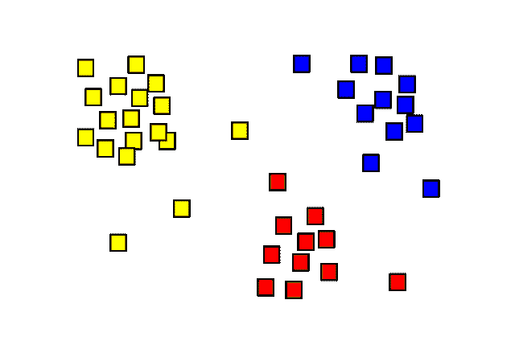
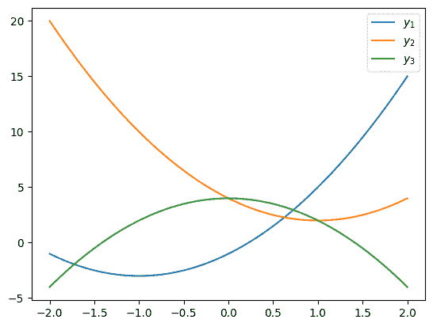
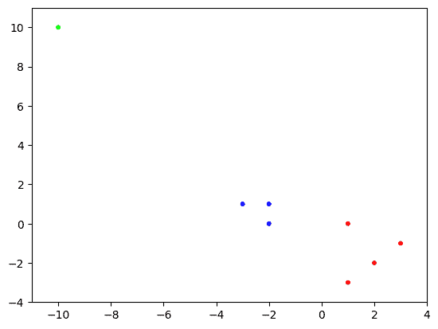
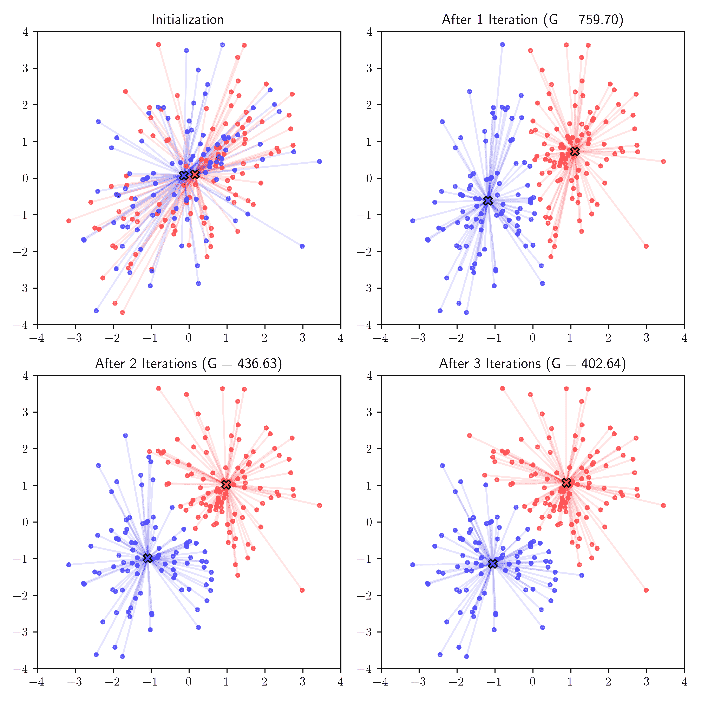
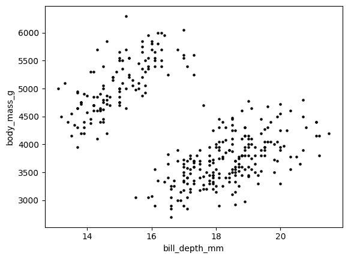
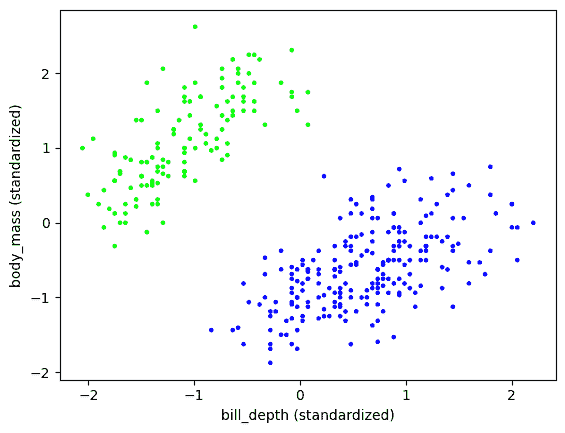
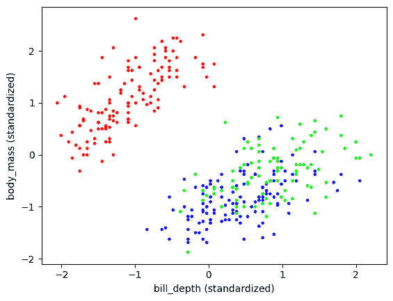
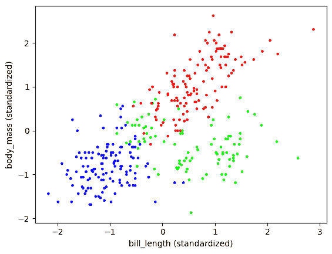
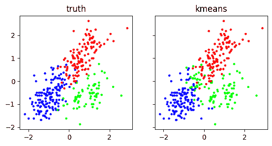

# 1.3\. 聚类：一个目标、一个算法和一个保证#

> 原文：[`mmids-textbook.github.io/chap01_intro/03_clustering/roch-mmids-intro-clustering.html`](https://mmids-textbook.github.io/chap01_intro/03_clustering/roch-mmids-intro-clustering.html)

考虑数据科学中的以下基本问题。

*输入:* 我们被给出 \(n\) 个在 \(\mathbb{R}^d\) 中的向量 \(\mathbf{x}_1,\ldots,\mathbf{x}_n\).

我们的目标是找到一个好的聚类\(\idx{clustering}\xdi\)：通俗地说，我们希望将这些数据点划分为 \(k\) 个不相交的子集——或聚类——在聚类内部有小的成对距离，在聚类之间有大的成对距离。为了使这个问题更加明确，我们考虑一个特定的目标函数，称为 \(k\)-均值目标。我们在这里的方法将是一个典型的数学数据科学问题的处理方法。我们首先将问题表述为一个优化问题，然后推导出一个算法来解决它，最后提供一些关于输出的严格保证。

**图:** 形成三个聚类的数据点 ([来源](https://commons.wikimedia.org/wiki/File:Cluster-2.svg))



\(\bowtie\)

*输出:* 但首先，我们需要精确地定义我们试图从数据中提取的内容。所求解的数学结构是什么？固定一个聚类的数量 \(k\)。形式上，我们定义聚类为一个划分。

**定义** **(划分)** \(\idx{partition}\xdi\) \([n] = \{1,\ldots,n\}\) 的一个大小为 \(k\) 的划分是一个非空子集的集合 \(C_1,\ldots,C_k \subseteq [n]\)，它：

+   是成对不相交的，即 \(C_i \cap C_j = \emptyset\)，\(\forall i \neq j\)

+   覆盖所有 \([n]\)，即 \(\cup_{i=1}^k C_i = [n]\).

\(\natural\)

**示例:** 假设我们被给出 \(\mathbb{R}²\) 中的 \(8\) 个数据点，如下所示：

\[\begin{align*} &\mathbf{x}_1 = \begin{pmatrix}1\\0\end{pmatrix}, \mathbf{x}_2 = \begin{pmatrix}-2\\0\end{pmatrix}, \mathbf{x}_3 = \begin{pmatrix}-2\\1\end{pmatrix}, \mathbf{x}_4 = \begin{pmatrix}1\\-3\end{pmatrix},\\ &\mathbf{x}_5 = \begin{pmatrix}-10\\10\end{pmatrix}, \mathbf{x}_6 = \begin{pmatrix}2\\-2\end{pmatrix}, \mathbf{x}_7 = \begin{pmatrix}-3\\1\end{pmatrix}, \mathbf{x}_8 = \begin{pmatrix}3\\-1\end{pmatrix}. \end{align*}\]

因此这里 \(n=8\) 且 \(d = 2\)。假设我们寻找 \(k = 3\) 个聚类。那么一个有效的聚类可以是例如：

\[ C_1 = \{1, 4, 6, 8\}, C_2 = \{2, 3, 7\}, C_3 = \{5\}, \]

这对应于将数据点\(\mathbf{x}_1, \mathbf{x}_4, \mathbf{x}_6, \mathbf{x}_8\)分配到第一个簇，数据点\(\mathbf{x}_2, \mathbf{x}_3, \mathbf{x}_7\)分配到第二个簇，数据点\(\mathbf{x}_5\)分配到第三个簇。特别注意的是，集合\(C_1, C_2, C_3\)满足划分的条件，即它们是互斥的，并且覆盖了所有\([8] = \{1,2,\ldots,8\}\)。或者换句话说，每个数据点被分配到且仅分配到一个簇。\(\lhd\)

为了方便表示，我们给簇编号为\(C_1,\ldots,C_k\)，但它们的顺序是没有意义的。如果两个划分具有相同的子集族，则它们是相同的。例如，在前面的例子中，\(C_1 = \{1, 4, 6, 8\}, C_2 = \{2, 3, 7\}, C_3 = \{5\}\)和\(C_1 = \{5\}, C_2 = \{1, 4, 6, 8\}, C_3 = \{2, 3, 7\}\)是等效的聚类。

## 1.3.1\. \(k\)-means 目标函数#

在\(k\)-means 目标函数\(\idx{k-means objective}\xdi\)下，\(C_1,\ldots,C_k\)的“成本”定义为

\[ \mathcal{G}(C_1,\ldots,C_k) = \min_{\boldsymbol{\mu}_1,\ldots,\boldsymbol{\mu}_k \in \mathbb{R}^d} \sum_{i=1}^k \sum_{j \in C_i} \|\mathbf{x}_j - \boldsymbol{\mu}_i\|². \]

这里\(\boldsymbol{\mu}_i \in \mathbb{R}^d\)是簇\(C_i\)的代表或中心。注意\(\boldsymbol{\mu}_i\)不必是\(\mathbf{x}_j\)之一。

我们的目标是找到一个划分\(C_1,\ldots,C_k\)，使得\(\mathcal{G}(C_1,\ldots,C_k)\)最小化，即解决以下问题

\[ \min_{C_1,\ldots,C_k} \mathcal{G}(C_1,\ldots,C_k) \]

在\([n]\)的所有大小为\(k\)的划分中。这是一个有限的优化问题，因为这样的划分数量是有限的。然而，需要注意的是，目标函数本身是在\(\mathbb{R}^d \times \cdots \times \mathbb{R}^{d}\)上的优化问题，即\(d\)个\(\mathbb{R}^d\)的副本。

引用[Wikipedia](https://en.wikipedia.org/wiki/Cluster_analysis#Centroid-based_clustering):

> 在基于质心的聚类中，簇由一个中心向量表示，这个向量不一定必须是数据集的成员。当簇的数量固定为 k 时，\(k\)-means 聚类给出了一个形式化的定义，即一个优化问题：找到 k 个簇中心并将对象分配到最近的簇中心，使得簇之间的平方距离最小化。

**知识检查:** \(k\)-means 聚类问题的全局解是否可能包含一个空簇？\(\checkmark\)

通常情况下，这个问题是[NP-hard](https://en.wikipedia.org/wiki/NP-hardness)\(\idx{NP-hardness}\xdi\), 即粗略地说，没有期望存在一个“快速”的算法来解决这个问题。Lloyd 算法（也称为\(k\)-means 算法）是一种流行的启发式算法。它基于以下两个子问题容易解决的观念：

1.  对于一个固定的划分找到最优的代表；

1.  对于一组固定的代表找到最优划分。

然后交替进行两次（或许直到进步低于容差）。这是合理的，因为我们的目标，如我们上面指出的，是解决最小化问题

\[ \min_{C_1,\ldots,C_k} \min_{\boldsymbol{\mu}_1,\ldots,\boldsymbol{\mu}_k \in \mathbb{R}^d} \sum_{i=1}^k \sum_{j \in C_i} \|\mathbf{x}_j - \boldsymbol{\mu}_i\|² \]

其中 \(C_1,\ldots,C_k\) 范围是 \([n]\) 的所有大小为 \(k\) 的划分。固定划分 \(C_1,\ldots,C_k\) 并在 \(\boldsymbol{\mu}_1,\ldots,\boldsymbol{\mu}_k \in \mathbb{R}^d\) 上进行最小化对应于解决上面的问题，而固定 \(\boldsymbol{\mu}_1,\ldots,\boldsymbol{\mu}_k \in \mathbb{R}^d\) 并在划分 \(C_1,\ldots,C_k\) 上进行最小化对应于解决第二个问题。

**CHAT & LEARN** 向你最喜欢的 AI 聊天机器人询问 \(k\)-means、\(k\)-medians 和 \(k\)-medoids 聚类之间的区别。 \(\ddagger\)

**一些有用的优化结果** 为了分析 Lloyd 算法，我们将依赖几个基本观察。

*最小化二次函数*: 为了阐述上面的第一步，我们回顾一个关于[二次函数](https://en.wikipedia.org/wiki/Quadratic_function)的基本事实。考虑函数

\[ q(x) = a x² + b x + c. \]

当 \(a > 0\) 时，\(q\) 有一个唯一的极小值。

**引理** **(二次函数的最小值)** \(\idx{二次函数的最小值}\xdi\) 设 \(q(x) = a x² + b x + c\)，其中 \(a > 0\) 且 \(x \in \mathbb{R}\)。\(q\) 的唯一全局最小值在

\[ x^* = -\frac{b}{2a}. \]

\(\flat\)

*证明*: 根据*一阶必要最优性条件*，\(q\) 的全局极小化器（必然是局部极小化器）满足条件

\[ \frac{\mathrm{d}}{\mathrm{d}x} q(x) = 2 a x + b = 0, \]

其唯一的解是

\[ x^*= -\frac{b}{2a}. \]

为了看出 \(x^*\) 确实是一个全局极小化器，我们将 \(q\) 重新写为

\[\begin{align*} q(x) &= a \left(x² + 2 \left[\frac{b}{2a}\right] x\right) + c\\ &= a \left(x² + 2 \left[\frac{b}{2a}\right] x + \left[\frac{b}{2a}\right]²\right) - a \left[\frac{b}{2a}\right]² + c\\ &= a (x - x^*)² + \left[c - \frac{b²}{4a}\right]. \end{align*}\]

显然，任何其他的 \(x\) 都会给 \(q\) 带来更高的值。上面第二行的步骤被称为[*完成平方*](https://en.wikipedia.org/wiki/Completing_the_square)。 \(\square\)

**数值角**: 这里有一个数值示例。我们首先定义一个二次函数。

```py
def q(a, b, c, x):
    return a * (x ** 2) + b * x + c 
```

我们为不同的系数值绘制它。注意 \(x\) 轴和 \(y\) 轴的刻度不同。

```py
x = np.linspace(-2, 2, 100)
plt.plot(x, q(2, 4, -1, x))
plt.plot(x, q(2, -4, 4, x))
plt.plot(x, q(-2, 0, 4, x))
plt.legend(['$y_1$', '$y_2$', '$y_3$'])
plt.show() 
```



\(\unlhd\)

*优化可加分离函数*: 可以写成坐标集合的并集之和的函数在优化中很常见，并且具有方便的“可分离”性质。

对于向量 \(\mathbf{x}_i \in \mathbb{R}^{d_i}\)，其中 \(i \in [\ell]\)，且 \(\sum_{i=1}^\ell d_i = d\)，它们的连接表示为 \((\mathbf{x}_1, \ldots, \mathbf{x}_\ell) \in \mathbb{R}^d\)。这就是通过将 \(\mathbf{x}_1, \ldots, \mathbf{x}_\ell\) 的坐标连接成一个单一向量得到的向量。另一种看待它的方法是，\((\mathbf{x}_1, \ldots, \mathbf{x}_\ell)\) 是一个由 \(\mathbf{x}_1, \ldots, \mathbf{x}_\ell\) 组成的块向量。例如，如果 \(\mathbf{x}_1 = (1, 2)\) 和 \(\mathbf{x}_2 = (-1, -3, -5)\)，那么 \((\mathbf{x}_1,\mathbf{x}_2) = (1, 2, -1, -3, -5)\)。

**引理** **(优化可分离函数)** \(\idx{优化可分离函数引理}\xdi\) 假设 \(\mathbf{z} \in \mathbb{R}^d\) 可以分解为子向量 \(\mathbf{x}_i \in \mathbb{R}^{d_i}\)，其中 \(i \in [\ell]\)，且 \(\sum_{i=1}^\ell d_i = d\)，如下所示 \(\mathbf{z} = (\mathbf{x}_1, \ldots, \mathbf{x}_\ell)\)。假设实值函数 \(h : \mathbb{R}^d \to \mathbb{R}\) 可以写成加性可分离的形式

\[ h(\mathbf{z}) = f_1(\mathbf{x}_1) + \cdots + f_\ell(\mathbf{x}_\ell), \]

对于函数集合 \(f_i : \mathbb{R}^{d_i} \to \mathbb{R}\)，其中 \(i \in [\ell]\)。如果对于每个 \(i \in [\ell]\)，\(\mathbf{x}_i^*\) 是 \(f_i\) 的全局最小值，那么 \(\mathbf{z}^* = (\mathbf{x}_1^*, \ldots, \mathbf{x}_\ell^*)\) 是 \(h\) 的全局最小值。 \(\flat\)

*证明思路：* \(h\) 定义中的每一项都依赖于一组独立的坐标，因此不受其他项选择的影响。

*证明：* 设 \(\mathbf{z} = (\mathbf{x}_1, \ldots, \mathbf{x}_\ell)\)。由于 \(\mathbf{x}_i^*\) 是 \(f_i\) 的全局最小值，因此对于所有 \(i\)，有 \(f_i(\mathbf{x}_i^*) \leq f_i(\mathbf{x}_i)\)。因此，

\[ h(\mathbf{z}^*) = f_1(\mathbf{x}_1^*) + \cdots + f_\ell(\mathbf{x}_\ell^*) \leq f_1(\mathbf{x}_1) + \cdots + f_\ell(\mathbf{x}_\ell) = h(\mathbf{z}). \]

由于 \(\mathbf{z}\) 是任意的，我们已经证明了该命题。 \(\square\)

*与非递减函数组合：* 回想一下，一个单变量实值函数 \(f\) 如果满足

\[ x \leq y \implies f(x) \leq f(y). \]

**引理** **(与非递减函数组合)** \(\idx{与非递减函数组合引理}\xdi\) 设 \(f : \mathbb{R} \to \mathbb{R}\) 是非递减的，设 \(g : \mathbb{R}^d \to \mathbb{R}\)，并定义 \(h(\mathbf{x}) = f(g(\mathbf{x}))\)。如果 \(\mathbf{x}^*\) 是 \(g\) 的全局最小值，那么它也是 \(h\) 的全局最小值。 \(\flat\)

*证明思路：* 这只是应用定义的结果。

*证明：* 设 \(\mathbf{x} \in \mathbb{R}^d\)。因为 \(\mathbf{x}^*\) 是 \(g\) 的全局最小值，所以 \(g(\mathbf{x}^*) \leq g(\mathbf{x})\)。进一步地，由于 \(f\) 是非递减的，

\[ h(\mathbf{x}^*) = f(g(\mathbf{x}^*)) \leq f(g(\mathbf{x})) = h(\mathbf{x}). \]

由于 \(\mathbf{x}\) 是任意的，我们已经证明了该命题。 \(\square\)

**子问题 1：寻找最优代表** 我们用 \(|C_i|\) 表示 \(C_i\) 中的元素数量。

**示例：** **(继续)** 继续上面的示例，簇的大小分别为 \(|C_1| = 4, |C_2| = 3, |C_3| = 1\)。特别注意的是 \(|C_1| + |C_2| + |C_3| = 8 = n\)，这是由于 \(C_1, C_2, C_3\) 是一个划分。 \(\lhd\)

**引理** **(最优代表)** \(\idx{optimal representatives lemma}\xdi\) 固定一个划分 \(C_1,\ldots,C_k\)。在目标

\[ G(C_1,\ldots,C_k; \boldsymbol{\mu}_1, \ldots, \boldsymbol{\mu}_k) = \sum_{i=1}^k \sum_{j \in C_i} \|\mathbf{x}_j - \boldsymbol{\mu}_i\|², \]

是 [质心](https://en.wikipedia.org/wiki/Centroid)\(\idx{centroid}\xdi\)

\[ \boldsymbol{\mu}_i^* = \frac{1}{|C_i|} \sum_{j\in C_i} \mathbf{x}_j. \]

\(\flat\)

*证明思路：* 目标 \(G\) 可以写成求和的形式，其中每一项是 \(\boldsymbol{\mu}_i\) 的一个分量上的二次函数。这些项中的每一项都通过 \(C_i\) 中属于 \(\mathbf{x}_j\) 的相应分量的平均值来最小化。

**示例：** **(继续)** 继续上一个示例，我们计算固定划分 \(C_1, C_2, C_3\) 的最优代表。我们得到

\[\begin{align*} \boldsymbol{\mu}_1^* &= \frac{1}{4}[\mathbf{x}_1 + \mathbf{x}_4 + \mathbf{x}_6 + \mathbf{x}_8]\\ &= \frac{1}{4}\left[\begin{pmatrix}1\\0\end{pmatrix} + \begin{pmatrix}1\\-3\end{pmatrix} + \begin{pmatrix}2\\-2\end{pmatrix} + \begin{pmatrix}3\\-1\end{pmatrix} \right] = \begin{pmatrix}7/4\\-3/2\end{pmatrix},\\ \boldsymbol{\mu}_2^* &= \frac{1}{3}[\mathbf{x}_2 + \mathbf{x}_3 + \mathbf{x}_7]\\ &= \frac{1}{3}\left[\begin{pmatrix}-2\\0\end{pmatrix}+ \begin{pmatrix}-2\\1\end{pmatrix}+ \begin{pmatrix}-3\\1\end{pmatrix} \right] = \begin{pmatrix}-7/3\\2/3\end{pmatrix},\\ \boldsymbol{\mu}_3^* &= \frac{1}{1}[\mathbf{x}_5] = \begin{pmatrix}-10\\10\end{pmatrix}. \end{align*}\]

\(\lhd\)

*证明：* *(最优代表)* 使用符号 \(\mathbf{x}_j = (x_{j1},\ldots,x_{jd})\) 以及类似地对于 \(\boldsymbol{\mu}_i\)，注意我们可以将 \(k\)-means 目标函数展开为

\[\begin{align*} \sum_{i=1}^k \sum_{j \in C_i} \|\mathbf{x}_j - \boldsymbol{\mu}_i\|² &= \sum_{i=1}^k \sum_{j \in C_i} \sum_{m=1}^d (x_{jm} - \mu_{im})²\\ &= \sum_{i=1}^k \sum_{m=1}^d \left[\sum_{j \in C_i} (x_{jm} - \mu_{im})²\right]. \end{align*}\]

方括号中的表达式是 \(\mu_{im}\) 上的二次函数

\[\begin{align*} q_{im}(\mu_{im}) &= \sum_{j \in C_i} (x_{jm} - \mu_{im})²\\ &= \left\{\sum_{j \in C_i} x_{jm}²\right\} + \left\{- 2 \sum_{j \in C_i} x_{jm}\right\} \mu_{im} + \left\{|C_i| \right\} \mu_{im}². \end{align*}\]

因此，根据二次函数的最小值公式，最小值在

\[ \mu_{im}^* = - \frac{- 2 \sum_{j \in C_i} x_{jm}}{2 |C_i|} = \frac{1}{|C_i|} \sum_{j \in C_i} x_{jm}. \]

由于目标函数 \(G\) 中由 \(i, m\) 组成的求和中的每个项 \(q_{im}(\mu_{im})\) 都在 \(\boldsymbol{\mu}_1^*,\ldots, \boldsymbol{\mu}_k^*\) 处最小化，因此根据 *可分离函数优化*，\(G\) 也最小化。\(\square\)

由于平方范数分解为坐标之和（由于平方根，范数本身并不分解），这是在这里使用它的一个原因，这在最后的证明中应该是显而易见的。

**子问题 2：寻找最优划分** 给定 \(\mathbb{R}^d\) 中的 \(n\) 个向量 \(\mathbf{x}_1,\ldots,\mathbf{x}_n\) 和一个划分 \(C_1, \ldots, C_k \subseteq [n]\)，对于相应的簇分配，将会有一些符号是有用的：我们定义 \(c(j) = i\) 如果 \(j \in C_i\)。

**示例：** **（继续）** 继续上面的例子，簇 \(C_1 = \{1, 4, 6, 8\}, C_2 = \{2, 3, 7\}, C_3 = \{5\}\) 对应的分配为

\[ c(1) = 1, c(2) = 2, c(3) = 2, c(4) = 1, c(5) = 3, c(6) = 1, c(7) = (2), c(8) = 1\. \]

\(\lhd\)

**引理** **（最优聚类）** \(\idx{optimal clustering lemma}\xdi\) 固定代表 \(\boldsymbol{\mu}_1,\ldots,\boldsymbol{\mu}_k\)。在目标函数下找到一个最优划分

\[ G(C_1,\ldots,C_k; \boldsymbol{\mu}_1, \ldots, \boldsymbol{\mu}_k) = \sum_{i=1}^k \sum_{j \in C_i} \|\mathbf{x}_j - \boldsymbol{\mu}_i\|², \]

如下获得。对于每个 \(j\)，找到使 \(\|\mathbf{x}_j - \boldsymbol{\mu}_i\|\) 最小的 \(\boldsymbol{\mu}_i\)（在存在平局的情况下任意选择一个）并将 \(\mathbf{x}_j\) 分配给 \(C_i\)（即，将 \(j\) 添加到 \(C_i\)）。\(\flat\)

*证明：* 如果 \(c\) 是与 \(C_1,\ldots,C_k\) 相关的簇分配，那么我们可以将目标函数重新写为

\[ \sum_{i=1}^k \sum_{j \in C_i} \|\mathbf{x}_j - \boldsymbol{\mu}_i\|² = \sum_{j=1}^n \|\mathbf{x}_j - \boldsymbol{\mu}_{c(j)}\|², \]

根据定义，当 \(\boldsymbol{\mu}_i\) 固定时，右侧求和中的每一项都通过陈述中的分配单独最小化。因此，根据 *可分离函数优化引理*，总和本身也最小化。注意，我们使用了平方根（以及平方）是非递减的事实，根据 *与一个非递减函数组合引理*，得出最小化 \(\|\mathbf{x}_j - \boldsymbol{\mu}_i\|²\) 或其平方根 \(\|\mathbf{x}_j - \boldsymbol{\mu}_i\|\) 是等价的。\(\square\)

**示例：** **（继续）** 继续上面的例子，假设我们选择了代表

\[\begin{split} \boldsymbol{\mu}_1 = \begin{pmatrix}-2\\1\end{pmatrix}, \boldsymbol{\mu}_2 = \begin{pmatrix}2\\-1\end{pmatrix}, \boldsymbol{\mu}_3 = \begin{pmatrix}-10\\10\end{pmatrix}. \end{split}\]

然后我们通过计算 \(\mathbf{x}_1\) 与每个代表之间的平方距离来找到其簇分配：

\[\begin{split} \|\mathbf{x}_1 - \boldsymbol{\mu}_1\| = \left\|\begin{pmatrix}1\\0\end{pmatrix} - \begin{pmatrix}-2\\1\end{pmatrix}\right\| = \sqrt{(1-(-2))² + (0-1)²} = \sqrt{10}, \end{split}\]\[\begin{split} \|\mathbf{x}_1 - \boldsymbol{\mu}_2\| = \left\|\begin{pmatrix}1\\0\end{pmatrix} - \begin{pmatrix}2\\-1\end{pmatrix}\right\| = \sqrt{(1-2)² + (0-(-1))²} = \sqrt{2}, \end{split}\]\[\begin{split} \|\mathbf{x}_1 - \boldsymbol{\mu}_3\| = \left\|\begin{pmatrix}1\\0\end{pmatrix} - \begin{pmatrix}-10\\10\end{pmatrix}\right\| = \sqrt{(1-(-10))² + (0-10)²} = \sqrt{221}. \end{split}\]

最小值是在 \(\boldsymbol{\mu}_2\) 处实现的，因此我们将 \(\mathbf{x}_1\) 分配给 \(C_2\)，即 \(1 \in C_2\) 且 \(c(1) = 2\)。\(\lhd\)

## 1.3.2. Lloyd 算法及其分析#

现在我们准备描述 Lloyd 算法\(\idx{Lloyd's algorithm}\xdi\)。我们从随机分配的簇开始。 (另一种 [初始化策略](https://en.wikipedia.org/wiki/K-means_clustering#Initialization_methods) 是在数据点中随机选择 \(k\) 个代表。) 然后，我们在引理中的最优选择之间交替。代替伪代码，我们用 Python 写出算法。我们将在整个书中使用这种方法。

输入 `X` 假设是一组 \(n\) 个向量 \(\mathbf{x}_1, \ldots, \mathbf{x}_n \in \mathbb{R}^d\)，堆叠成一个矩阵，每行一个数据点。另一个输入 `k` 是期望的簇数。有一个可选输入 `maxiter` 用于最大迭代次数，默认设置为 \(5\)。

我们首先为两个主要步骤定义了单独的函数。为了找到数组的最小值，我们使用函数 `numpy.argmin`。我们还使用 `numpy.linalg.norm` 来计算欧几里得距离。

```py
def opt_reps(X, k, assign):
    (n, d) = X.shape
    reps = np.zeros((k, d))
    for i in range(k):
        in_i = [j for j in range(n) if assign[j] == i]             
        reps[i,:] = np.sum(X[in_i,:],axis=0) / len(in_i)
    return reps

def opt_clust(X, k, reps):
    (n, d) = X.shape
    dist = np.zeros(n)
    assign = np.zeros(n, dtype=int)
    for j in range(n):
        dist_to_i = np.array([LA.norm(X[j,:] - reps[i,:]) for i in range(k)])
        assign[j] = np.argmin(dist_to_i)
        dist[j] = dist_to_i[assign[j]]
    G = np.sum(dist ** 2)
    print(G)
    return assign 
```

主要函数如下。下面，`rng.integers(0,k,n)` 是一个包含 `n` 个在 `0` 和 `k-1` 之间（包括两端）均匀选择的整数的数组。有关详细信息，请参阅 [random.Generator.integers](https://numpy.org/doc/stable/reference/random/generated/numpy.random.Generator.integers.html)。回想一下，在整个过程中，当定义一个使用随机数生成器 (RNG) 的函数时，我们将在函数外部初始化 RNG 并将其传递给它。这允许我们在更高层次上控制随机数生成过程，并确保多次运行的结果一致。

```py
def kmeans(rng, X, k, maxiter=5):
    (n, d) = X.shape
    assign = rng.integers(0,k,n)
    reps = np.zeros((k, d), dtype=int)
    for iter in range(maxiter):
        reps = opt_reps(X, k, assign) 
        assign = opt_clust(X, k, reps) 
    return assign 
```

**数值角**: 我们将我们的 \(k\)-means 实现应用于上面的例子。我们将 `k` 固定为 \(3\)。在这里，数据矩阵 `X` 如下所示：

```py
seed = 535
rng = np.random.default_rng(seed)
X = np.array([[1., 0.],[-2., 0.],[-2.,1.],[1.,-3.],
              [-10.,10.],[2.,-2.],[-3.,1.],[3.,-1.]])
assign = kmeans(rng, X, 3) 
```

```py
162.7
74.8611111111111
9.083333333333334
9.083333333333334
9.083333333333334 
```

我们通过根据它们的簇分配给点着色来可视化输出。

```py
plt.scatter(X[:,0], X[:,1], s=10, c=assign, cmap='brg')
plt.axis([-11,4,-4,11])
plt.show() 
```



我们可以通过使用子例程 `opt_reps` 来计算最终的代表（对于最终分配是最优的）。

```py
print(opt_reps(X, 3, assign)) 
```

```py
[[ -2.33333333   0.66666667]
 [  1.75        -1.5       ]
 [-10\.          10\.        ]] 
```

每一行是对应聚类的中心。注意这些与之前计算出的相匹配。确实，聚类是相同的（尽管不一定按相同的顺序）。

**尝试一下！**修改 `kmeans` 以接受一个容差 `tol` 作为输入，并在目标值 `G` 的改进低于容差时停止。([在 Colab 中打开](https://colab.research.google.com/github/MMiDS-textbook/MMiDS-textbook.github.io/blob/main/just_the_code/roch_mmids_chap_intro_notebook.ipynb))

\(\unlhd\)



**知识检查**：假设我们有无限的计算资源并且无限期地运行 Lloyd 算法，你认为它一定会收敛到全局最小值吗？如果你的答案是“不”，你能想到一个算法，该算法在足够的计算资源下保证输出全局最小值？\(\checkmark\)

Lloyd 算法只是一个启发式算法。特别是，它不能保证找到 \(k\)-means 目标的全局最小值。然而，它保证在每次迭代中改进目标值，或者更精确地说，不会使其变得更差。

**定理** **(k-means 成本收敛)** \(\idx{convergence of k-means cost theorem}\xdi\) \(k\)-means 算法产生的目标函数值序列是非递增的。\(\sharp\)

*证明思路*：根据**最优代表引理**和**最优聚类引理**，每一步都不会增加目标值。

*证明*：设 \(C_1',\ldots,C_k'\) 是当前的聚类，其代表为 \(\boldsymbol{\mu}_1',\ldots,\boldsymbol{\mu}_k'\)。在步骤 1 之后，新的代表是 \(\boldsymbol{\mu}_1'',\ldots,\boldsymbol{\mu}_k''\)。根据**最优代表引理**，它们满足

\[ \sum_{i=1}^k \sum_{j \in C_i'} \|\mathbf{x}_j - \boldsymbol{\mu}_i''\|² \leq \sum_{i=1}^k \sum_{j \in C_i'} \|\mathbf{x}_j - \boldsymbol{\mu}_i'\|². \]

在步骤 2 之后，新的聚类是 \(C_1'',\ldots,C_k''\)。根据**最优聚类引理**，它们满足

\[ \sum_{i=1}^k \sum_{j \in C_i''} \|\mathbf{x}_j - \boldsymbol{\mu}_i''\|² \leq \sum_{i=1}^k \sum_{j \in C_i'} \|\mathbf{x}_j - \boldsymbol{\mu}_i''\|². \]

结合这两个不等式得到

\[ \sum_{i=1}^k \sum_{j \in C_i''} \|\mathbf{x}_j - \boldsymbol{\mu}_i''\|² \leq \sum_{i=1}^k \sum_{j \in C_i'} \|\mathbf{x}_j - \boldsymbol{\mu}_i'\|², \]

如预期所示。\(\square\)

目标值的序列是单调的，并且从下方由\(0\)界定。[因此它收敛](https://en.wikipedia.org/wiki/Monotone_convergence_theorem#Convergence_of_a_monotone_sequence_of_real_numbers)。请注意，极限取决于起点。

**CHAT & LEARN** AI 聊天机器人可以成为优秀的个人导师，尤其是在编程方面，他们通常表现出色。特别是，他们可以提供关于本书中代码的额外信息。只需复制粘贴一段代码，然后问“这段代码在做什么？”不要犹豫，继续提问。[这里是一个使用 ChatGPT 的例子](https://chat.openai.com/share/66f9e704-c8e8-4489-9ab6-8e57740cab3b)。

**警告**：正如你可能知道的，AI 聊天机器人可能会出错，所以用批判性的思维评估他们告诉你的内容，并/或其他来源（例如，包文档）进行双重检查。

**提示工程**：[找到正确的提示](https://en.wikipedia.org/wiki/Prompt_engineering)，或一系列提示，可以产生重大影响。它也可以用来产生更有趣的答案。以下是通过 ChatGPT 用莎士比亚风格解释\(k\)-均值算法的例子：

> **场景：数值领域，在分析的魔法森林**
> 
> **进入向量大人，划分女士，以及一群低语的风**。
> 
> **向量大人（一个庄严的存在）**：
> 
> 倾听，低语的风，散布得远远的，
> 
> 我是向量大人，你的锚和你的向导。
> 
> 在簇中，你必须听从我的召唤，站在我的身边，
> 
> 你将靠近我，在统一中停留。
> 
> **划分女士（一位睿智的女巫）**：
> 
> 我，划分女士，有着清晰敏锐的视野，
> 
> 确定你们每个人将在哪个簇中倾斜。
> 
> 与向量大人一起，我们编排一场芭蕾，舞步如此精致，
> 
> 分类，聚集，对齐，在神圣的标志下。
> 
> **第一低语风**：
> 
> 但是，高贵的向量大人，你将如何找到你的正确位置？
> 
> 在这片多样化的空间，你如何安放你的床？
> 
> **向量大人**：
> 
> 通过循环和智慧，我寻求我的神圣之地，
> 
> 在我这里所有距离之和最少的地点。
> 
> 从你的本质中，我浮现，一个平均纯粹而响亮，
> 
> 一座最真实的光标，我以此加冕。
> 
> **第二低语风**：
> 
> 我们如何寻找我们的亲人，划分女士，
> 
> 在这众多之中，我们的旅程如何开始？
> 
> **划分女士**：
> 
> 通过度量亲和力，你会向最近的向量大人靠近，
> 
> 对他，你的忠诚，你将奉献。
> 
> 在群体中，你会聚集，因为相似而吸引，
> 
> 一场集体交响乐，从黄昏到黎明。
> 
> **向量大人和划分女士扮演他们的角色，引导低语的风们移动和重组**。
> 
> **向量大人**：
> 
> 现在观察我是如何穿越的，随着你的忠诚变得更加精细，
> 
> 在我的咒语中，一个更合适的中心。
> 
> **划分女士**：
> 
> 当你飘荡，亲爱的风，到你真正的领主那里，
> 
> 我们构建一个更紧密的联盟，一种新的平衡。
> 
> **低语的风们重新排列并对齐，从一个簇移动到另一个簇，随着向量大人优雅地调整他的位置**。
> 
> **第三低语风**：
> 
> 最后，我看到了我将居住的地方，
> 
> 与同伴相似，在良好的聚类中。
> 
> LORD VECTOR：
> 
> 因此，我们跳舞和编织，直到达到静止，
> 
> 当每一阵风都平息下来，我们如释重负。
> 
> LADY PARTITION：
> 
> 因此，最优的聚类出现，生动而宁静，
> 
> 中心位置良好，景象难见。
> 
> *低语的风现在在他们的主向量周围平静地休息在聚类中，分析的魔法森林是他们对有序芭蕾的见证。*
> 
> LORD VECTOR & LADY PARTITION（一起）：
> 
> 我们的任务在这里结束，和谐而优雅，
> 
> K-means 神奇效果，一个受欢迎的解决方案。
> 
> *所有人退出，随着低语的风在他们的主向量周围统一，数字领域的反映他们和谐的舞蹈。*
> 
> **场景结束**

\(\ddagger\)

**数值角落：** 我们将在本章前面介绍的企鹅数据集上测试我们的 \(k\)-means 实现。我们首先提取列并将它们组合成一个数据矩阵 `X`。像之前一样，我们也移除了有缺失值的行。

**图：** 哪种企鹅物种？(*来源：[Midjourney](https://www.midjourney.com/))


\(\bowtie\)

```py
data = pd.read_csv('penguins-measurements.csv')
data = data.dropna()
X = data[['bill_length_mm', 'bill_depth_mm', 
        'flipper_length_mm', 'body_mass_g']].to_numpy() 
```

我们可视化了数据的二维切片。

```py
plt.scatter(X[:,1], X[:,3], s=5, c='k')
plt.xlabel('bill_depth_mm'), plt.ylabel('body_mass_g')
plt.show() 
```



注意到特征具有相当不同的尺度（上图中的十与千）。在这种情况下，通常会对数据进行标准化，以便每个特征大致具有相同的尺度。对于 `X` 的每一列，我们减去其实验均值，然后除以其实验标准差。

```py
mean = np.mean(X, axis=0)
std = np.std(X, axis=0)
X = (X - mean) / std 
```

现在我们用 \(k=2\) 个聚类运行 Lloyd 算法。

```py
assign = kmeans(rng, X, 2) 
```

```py
1338.2046936914157
820.9361062178352
603.8787658966849
575.2587351391593
567.7837494880662 
```

我们像之前一样可视化输出，但这次根据它们的聚类分配给数据点着色。

```py
plt.scatter(X[:,1], X[:,3], s=5, c=assign, cmap='brg')
plt.xlabel('bill_depth (standardized)'), plt.ylabel('body_mass (standardized)')
plt.show() 
```



这种聚类看起来相当好。尽管如此，请记住：

1.  在这个图中，我们只查看四个变量中的两个，而 \(k\)-means 使用了所有这些变量，

1.  我们不能保证找到最佳解决方案，

1.  我们的目标函数有些任意，并且

1.  不清楚 \(k\) 的正确选择是什么。

事实上，原始数据集包含了生物学家提供的正确答案。尽管上图可能让我们相信，实际上有三个不同的物种。所以让我们尝试 \(k=3\) 个聚类。

```py
assign = kmeans(rng, X, 3) 
```

```py
1312.344945158482
577.1700837839458
428.50397345437966
392.2616692426171
383.3452894259011 
```

输出看起来并不完全正确。

```py
plt.scatter(X[:,1], X[:,3], s=5, c=assign, cmap='brg')
plt.xlabel('bill_depth (standardized)'), plt.ylabel('body_mass (standardized)')
plt.show() 
```



但是，记住之前提到的警告，让我们看看不同的二维切片。

```py
plt.scatter(X[:,0], X[:,3], s=5, c=assign, cmap='brg')
plt.xlabel('bill_length (standardized)'), plt.ylabel('body_mass (standardized)')
plt.show() 
```



让我们加载真实数据并进行比较。我们只保留那些没有因为缺失值而被移除的样本（参见 [pandas.DataFrame.iloc](https://pandas.pydata.org/docs/reference/api/pandas.DataFrame.iloc.html)）。

```py
data_truth = pd.read_csv('penguins-species.csv') 
data_truth = data_truth.iloc[data.index]
data_truth.head() 
```

|  | 物种 |
| --- | --- |
| 0 | Adelie |
| 1 | Adelie |
| 2 | Adelie |
| 4 | Adelie |
| 5 | Adelie |

物种如下：

```py
species = data_truth['species']
print(species.unique()) 
```

```py
['Adelie' 'Chinstrap' 'Gentoo'] 
```

为了绘制结果，我们使用 [字典](https://docs.python.org/3/tutorial/datastructures.html#dictionaries) 将物种颜色设置为蓝绿色-红色。

```py
species2color_dict = {'Adelie': 'blue', 'Chinstrap': 'lime', 'Gentoo': 'red'}
truth = [species2color_dict[a] for a in species] 
```

最后，我们可以将输出与真实数据进行比较。匹配度相当好——但当然不是完美的。

```py
f, (ax1, ax2) = plt.subplots(1, 2, sharex=True, sharey=True, figsize=(6.5, 3))
ax1.scatter(X[:,0], X[:,3], s=5, c=truth)
ax1.set_title('truth')
ax2.scatter(X[:,0], X[:,3], s=5, c=assign, cmap='brg')
ax2.set_title('kmeans')
plt.show() 
```



确定合适的聚类数量不是一个简单的问题。引用 [维基百科](https://en.wikipedia.org/wiki/Determining_the_number_of_clusters_in_a_data_set)：

> 正确选择 \(k\) 常常是模糊的，其解释取决于数据集中点的形状和尺度以及用户期望的聚类分辨率。此外，不进行惩罚地增加 \(k\) 将始终减少结果聚类的错误量，在极端情况下，如果每个数据点被视为自己的聚类（即当 \(k\) 等于数据点的数量 \(n\) 时），错误量将降至零。因此，从数据集的性质的先验知识中不明显地选择 \(k\) 的最佳值时，必须以某种方式选择。有几种方法类别用于做出这个决定。

在实践中，[几种启发式方法](https://en.wikipedia.org/wiki/Determining_the_number_of_clusters_in_a_data_set)正在使用。其他聚类方法，例如 [DBSCAN](https://en.wikipedia.org/wiki/DBSCAN) 和 [层次聚类](https://en.wikipedia.org/wiki/Hierarchical_clustering)，不需要输入聚类数量。

**TRY IT!** 再次运行分析，但这次 *不进行标准化步骤*。你观察到了什么？是否有某个特征比其他特征对最终输出更有影响？你为什么这么认为？([在 Colab 中打开](https://colab.research.google.com/github/MMiDS-textbook/MMiDS-textbook.github.io/blob/main/just_the_code/roch_mmids_chap_intro_notebook.ipynb))

\(\unlhd\)

## 1.3.3\. k-means 聚类的矩阵形式#

在本节中，我们展示 \(k\)-means 聚类目标可以写成矩阵形式。我们首先介绍一些在整个过程中将非常有用的符号和定义。

如我们之前所述，对于 \(\mathbb{R}^d\) 中的 \(n\) 个数据向量 \(\mathbf{x}_1, \ldots, \mathbf{x}_n\)，将它们堆叠成一个矩阵通常很方便。

\[\begin{split} X = \begin{bmatrix} \mathbf{x}_1^T \\ \mathbf{x}_2^T \\ \vdots \\ \mathbf{x}_n^T \\ \end{bmatrix} = \begin{bmatrix} x_{11} & x_{12} & \cdots & x_{1d} \\ x_{21} & x_{22} & \cdots & x_{2d} \\ \vdots & \vdots & \ddots & \vdots \\ x_{n1} & x_{n2} & \cdots & x_{nd} \\ \end{bmatrix}. \end{split}\]

我们可以用同样的方法处理簇代表。给定 \(\boldsymbol{\mu}_1,\ldots,\boldsymbol{\mu}_k\) 也位于 \(\mathbb{R}^d\) 中，我们形成矩阵

\[\begin{split} U = \begin{bmatrix} \boldsymbol{\mu}_1^T \\ \boldsymbol{\mu}_2^T \\ \vdots \\ \boldsymbol{\mu}_k^T \\ \end{bmatrix} = \begin{bmatrix} \mu_{11} & \mu_{12} & \cdots & \mu_{1d} \\ \mu_{21} & \mu_{22} & \cdots & \mu_{2d} \\ \vdots & \vdots & \ddots & \vdots \\ \mu_{k1} & \mu_{k2} & \cdots & \mu_{kd} \\ \end{bmatrix}. \end{split}\]

也许不那么明显的是，簇分配也可以用矩阵形式表示。回想一下，给定 \([n]\) 的划分 \(C_1,\ldots,C_k\)，我们定义 \(c(j) = i\) 如果 \(j \in C_i\)。对于 \(j=1,\ldots,n\) 和 \(\ell=1,\ldots,k\)，如果 \(c(j) = \ell\) 则设置 \(Z_{j\ell} = 1\)，否则为 \(0\)，并让 \(Z\) 是一个 \(n \times k\) 的矩阵，其元素 \(Z = [Z_{j\ell}]_{j,\ell}\)。也就是说，行 \(j\) 有且仅有一个值为 \(1\) 的元素，对应于数据点 \(\mathbf{x}_j\) 分配的簇 \(c(j)\)，其他所有元素为 \(0\)。

使用这个记号，数据点 \(\mathbf{x}_j\) 分配的簇的代表通过矩阵乘积得到

\[ \boldsymbol{\mu}_{c(j)}^T = \sum_{\ell = 1}^k Z_{j\ell} \boldsymbol{\mu}_{\ell}^T = \sum_{\ell = 1}^k Z_{j\ell} U_{\ell,\cdot} = \left(Z U\right)_{j,\cdot} \]

其中我们使用了矩阵乘积的第 \(j\) 行是第二个矩阵行的线性组合的性质，其中系数是第一个矩阵第 \(j\) 行的元素。

**EXAMPLE:** **(continued)** 继续我们之前的例子，簇 \(C_1 = \{1, 4, 6, 8\}, C_2 = \{2, 3, 7\}, C_3 = \{5\}\) 被编码为矩阵

\[\begin{split} Z = \begin{bmatrix} 1 & 0 & 0\\ 0 & 1 & 0\\ 0 & 1 & 0\\ 1 & 0 & 0\\ 0 & 0 & 1\\ 1 & 0 & 0\\ 0 & 1 & 0\\ 1 & 0 & 0 \end{bmatrix}. \end{split}\]

假设再次，代表是

\[\begin{split} \boldsymbol{\mu}_1 = \begin{pmatrix}-2\\1\end{pmatrix}, \boldsymbol{\mu}_2 = \begin{pmatrix}2\\-1\end{pmatrix}, \boldsymbol{\mu}_3 = \begin{pmatrix}-10\\10\end{pmatrix}. \end{split}\]

相应的矩阵 \(U\) 是

\[\begin{split} U = \begin{bmatrix} -2 & 1\\ 2 & -1\\ -10 & 10 \end{bmatrix}. \end{split}\]

因此，乘以 \(Z\) 和 \(U\) 得到的矩阵中，每一行都是对应数据点分配簇的代表

\[\begin{split} ZU = \begin{bmatrix} 1 & 0 & 0\\ 0 & 1 & 0\\ 0 & 1 & 0\\ 1 & 0 & 0\\ 0 & 0 & 1\\ 1 & 0 & 0\\ 0 & 1 & 0\\ 1 & 0 & 0 \end{bmatrix} \, \begin{bmatrix} -2 & 1\\ 2 & -1\\ -10 & 10 \end{bmatrix} = \begin{bmatrix} -2 & 1\\ 2 & -1\\ 2 & -1\\ -2 & 1\\ -10 & 10\\ -2 & 1\\ 2 & -1\\ -2 & 1 \end{bmatrix}. \end{split}\]

\(\lhd\)

回想一下，\(n \times m\) 矩阵 \(A \in \mathbb{R}^{n \times m}\) 的 Frobenius 范数定义为

\[ \|A\|_F = \sqrt{\sum_{i=1}^n \sum_{j=1}^m A_{ij}²}. \]

使用行表示法，它可以写成行欧几里得范数的平方和

\[ \|A\|_F² = \sum_{i=1}^n \|A_{i,\cdot}\|². \]

对于两个矩阵 \(A, B \in \mathbb{R}^{n \times m}\)，它们的差 \(\|A - B\|_F\) 的 Frobenius 范数可以解释为 \(A\) 和 \(B\) 之间的距离，即它们差异的度量。

最后，我们回到 \(k\)-means 目标函数。使用本节中引入的符号和证明 *最优聚类引理* 中推导出的目标 \(G\) 的等价公式，我们注意到

\[\begin{align*} G(C_1,\ldots,C_k; \boldsymbol{\mu}_1, \ldots, \boldsymbol{\mu}_k) &= \sum_{i=1}^n \|\mathbf{x}_i - \boldsymbol{\mu}_{c(i)}\|²\\ &= \sum_{i=1}^n \sum_{\ell=1}^d \left(x_{i\ell} - (Z U)_{i\ell}\right)²\\ &= \|X - Z U \|²_F, \end{align*}\]

其中我们使用了 Frobenius 范数的定义。

换句话说，最小化 \(k\)-means 目标函数等同于找到一个形式为 \(ZU\) 的矩阵分解，使其在 Frobenius 范数上很好地拟合数据矩阵 \(X\)。这种公式以更紧凑的形式表达了将 \(X\) 表示为少数几个代表者的想法。矩阵分解将在本课程中反复出现。

***自我评估测验*** *(有 Claude、Gemini 和 ChatGPT 的帮助)*

**1** 在 \(k\)-means 的上下文中，以下哪个不是有效分区 \(C_1, \ldots, C_k\) 的属性？

a) 子集是两两不相交的

b) 子集覆盖所有数据点

c) 每个子集非空

d) 每个子集包含相同数量的点

**2** 在 \(k\)-means 目标函数中，变量 \(\boldsymbol{\mu}_i\) 代表什么？

a) 聚类 \(i\) 的质心

b) 聚类 \(i\) 中的点数

c) 聚类 \(i\) 和 \(j\) 之间的距离

d) 点 \(j\) 分配到聚类

**3** \(k\)-means 目标函数衡量的是什么？

a) 聚类的总数。

b) 数据点之间的平均距离。

c) 每个数据点与其分配的聚类中心之间的平方距离之和。

d) 任意两个聚类中心之间的最大距离。

**4** \(k\)-means 算法产生的目标函数值序列的关键属性是什么？

a) 它是严格递减的

b) 它是非递增的

c) 它是严格递增的

d) 它在两个值之间交替。

**5** 在 \(k\)-means 的矩阵公式中，矩阵 \(Z\) 的解释是什么？

a) 它代表聚类中心。

b) 它代表数据点之间的距离。

c) 它编码了每个数据点的聚类分配。

d) 它代表数据的协方差矩阵。

1 的答案：d. 证明：“形式上，我们定义聚类为一个划分。大小为 \(k\) 的 \([n] = {1,\ldots,n}\) 的划分是一组非空子集 \(C_1,\ldots,C_k \subseteq [n]\)，它们是两两不相交的，即 \(C_i \cap C_j = \emptyset\)，\(\forall i \neq j\)；覆盖了 \([n]\)，即 \(\cup_{i=1}^k C_i = [n]\)。” 没有提到子集大小必须相等的要求。

2 的答案：a. 证明：“这里 \(\boldsymbol{\mu}_i \in \mathbb{R}^d\) 是簇 \(C_i\) 的代表或中心。”

3 的答案：c. 证明：文本中将 k-means 目标函数定义为最小化数据点与其分配的簇中心之间的平方距离之和。

4 的答案：b. 证明：“k-means 算法产生的目标函数值序列是非递增的。”

5 的答案：c. 证明：文本中将 \(Z\) 定义为一个矩阵，其中“每一行恰好有一个值为 1 的条目，对应于数据点的分配簇。”

## 1.3.1\. K-means 目标函数#

在 k-means 目标函数\(\idx{k-means objective}\xdi\) 下，\(C_1,\ldots,C_k\) 的“成本”定义为

\[ \mathcal{G}(C_1,\ldots,C_k) = \min_{\boldsymbol{\mu}_1,\ldots,\boldsymbol{\mu}_k \in \mathbb{R}^d} \sum_{i=1}^k \sum_{j \in C_i} \|\mathbf{x}_j - \boldsymbol{\mu}_i\|². \]

这里 \(\boldsymbol{\mu}_i \in \mathbb{R}^d\) 是簇 \(C_i\) 的代表或中心。注意，\(\boldsymbol{\mu}_i\) 不一定是 \(\mathbf{x}_j\) 中的一个。

我们的目标是找到一个划分 \(C_1,\ldots,C_k\)，使得 \(\mathcal{G}(C_1,\ldots,C_k)\) 最小化，即解决以下问题

\[ \min_{C_1,\ldots,C_k} \mathcal{G}(C_1,\ldots,C_k) \]

在所有大小为 \(k\) 的 \([n]\) 的划分中。这是一个有限优化问题，因为这样的划分数量是有限的。然而，请注意，目标函数本身是在 \(\mathbb{R}^d \times \cdots \times \mathbb{R}^{d}\) 上的优化问题，即 \(k\) 个 \(\mathbb{R}^d\) 的副本。

引用 [维基百科](https://en.wikipedia.org/wiki/Cluster_analysis#Centroid-based_clustering)：

> 在基于质心的聚类中，簇由一个中心向量表示，这个向量不一定是数据集的成员。当簇的数量固定为 \(k\) 时，k-means 聚类给出了一个形式化的定义，即优化问题：找到 \(k\) 个簇中心并将对象分配到最近的簇中心，使得从簇到簇的平方距离最小化。

**知识检查：** \(k\)-means 聚类问题的全局解是否可能包含一个空簇？\(\checkmark\)

在一般情况下，该问题是[NP-hard](https://en.wikipedia.org/wiki/NP-hardness)\(\idx{NP-hardness}\xdi\)，也就是说，粗略地说，没有“快速”算法被期望能解决它。Lloyd 算法（也称为\(k\)-means 算法）是一种流行的启发式算法。它基于以下两个子问题容易解决的观念：

1.  寻找固定划分的最优代表；

1.  寻找固定代表集的最优划分。

然后，在两个子问题之间交替（可能直到进步低于容差）。这是合理的，因为我们的目标，如我们上面所指出的，是解决最小化问题

\[ \min_{C_1,\ldots,C_k} \min_{\boldsymbol{\mu}_1,\ldots,\boldsymbol{\mu}_k \in \mathbb{R}^d} \sum_{i=1}^k \sum_{j \in C_i} \|\mathbf{x}_j - \boldsymbol{\mu}_i\|² \]

其中 \(C_1,\ldots,C_k\) 范围涵盖所有大小为\(k\)的\([n]\)的划分。固定划分 \(C_1,\ldots,C_k\) 并在 \(\boldsymbol{\mu}_1,\ldots,\boldsymbol{\mu}_k \in \mathbb{R}^d\) 上进行最小化对应于解决上述第一个问题，而固定 \(\boldsymbol{\mu}_1,\ldots,\boldsymbol{\mu}_k \in \mathbb{R}^d\) 并在划分 \(C_1,\ldots,C_k\) 上进行最小化对应于解决第二个问题。

**CHAT & LEARN** 向你最喜欢的 AI 聊天机器人询问\(k\)-means、\(k\)-medians 和\(k\)-medoids 聚类的区别。\(\ddagger\)

**一些有用的优化结果** 为了分析 Lloyd 算法，我们将依赖于几个基本观察。

*最小化二次函数:* 为了详细说明上述第一步，我们回顾关于[二次函数](https://en.wikipedia.org/wiki/Quadratic_function)的一个基本事实。考虑函数

\[ q(x) = a x² + b x + c. \]

当 \(a > 0\) 时，\(q\) 有一个唯一的极小值。

**引理** **（二次函数的最小值）** \(\idx{二次函数的最小值}\xdi\) 设 \(q(x) = a x² + b x + c\)，其中 \(a > 0\) 且 \(x \in \mathbb{R}\)。\(q\) 的唯一全局最小值在

\[ x^* = -\frac{b}{2a}. \]

\(\flat\)

*证明:* 根据**一阶必要最优性条件**，\(q\)的全局最小值（必然是局部最小值）满足该条件

\[ \frac{\mathrm{d}}{\mathrm{d}x} q(x) = 2 a x + b = 0, \]

其唯一解为

\[ x^*= -\frac{b}{2a}. \]

为了证明\(x^*\)确实是一个全局最小值，我们将\(q\)重新写为

\[\begin{align*} q(x) &= a \left(x² + 2 \left[\frac{b}{2a}\right] x\right) + c\\ &= a \left(x² + 2 \left[\frac{b}{2a}\right] x + \left[\frac{b}{2a}\right]²\right) - a \left[\frac{b}{2a}\right]² + c\\ &= a (x - x^*)² + \left[c - \frac{b²}{4a}\right]. \end{align*}\]

显然，任何其他的 \(x\) 都会给 \(q\) 带来更高的值。上面第二行的步骤被称为[*配方法*](https://en.wikipedia.org/wiki/Completing_the_square)。\(\square\)

**数值角:** 这里有一个数值示例。我们首先定义一个二次函数。

```py
def q(a, b, c, x):
    return a * (x ** 2) + b * x + c 
```

我们为不同的系数值绘制了图形。注意，\(x\) 轴和 \(y\) 轴的刻度不同。

```py
x = np.linspace(-2, 2, 100)
plt.plot(x, q(2, 4, -1, x))
plt.plot(x, q(2, -4, 4, x))
plt.plot(x, q(-2, 0, 4, x))
plt.legend(['$y_1$', '$y_2$', '$y_3$'])
plt.show() 
```


\(\unlhd\)

*优化可加分离函数：* 在优化中，可以表示为坐标集合之和的函数很常见，并且具有方便的“可分离”性质。

对于向量 \(\mathbf{x}_i \in \mathbb{R}^{d_i}\)，\(i \in [\ell]\)，且 \(\sum_{i=1}^\ell d_i = d\)，它们的连接表示为 \((\mathbf{x}_1, \ldots, \mathbf{x}_\ell) \in \mathbb{R}^d\)。也就是说，通过将 \(\mathbf{x}_1, \ldots, \mathbf{x}_\ell\) 的坐标连接成一个单一向量得到的向量。另一种看待它的方式是，\((\mathbf{x}_1, \ldots, \mathbf{x}_\ell)\) 是一个由 \(\mathbf{x}_1, \ldots, \mathbf{x}_\ell\) 组成的块向量。例如，如果 \(\mathbf{x}_1 = (1, 2)\) 和 \(\mathbf{x}_2 = (-1, -3, -5)\)，那么 \((\mathbf{x}_1,\mathbf{x}_2) = (1, 2, -1, -3, -5)\)。

**引理** **(优化可分离函数)** \(\idx{optimizing a separable function lemma}\xdi\) 假设 \(\mathbf{z} \in \mathbb{R}^d\) 可以分解为子向量 \(\mathbf{x}_i \in \mathbb{R}^{d_i}\)，\(i \in [\ell]\)，且 \(\sum_{i=1}^\ell d_i = d\)，如下所示 \(\mathbf{z} = (\mathbf{x}_1, \ldots, \mathbf{x}_\ell)\)。假设实值函数 \(h : \mathbb{R}^d \to \mathbb{R}\) 可以写成可加分离形式

\[ h(\mathbf{z}) = f_1(\mathbf{x}_1) + \cdots + f_\ell(\mathbf{x}_\ell), \]

对于一个函数集合 \(f_i : \mathbb{R}^{d_i} \to \mathbb{R}\)，\(i \in [\ell]\)。如果对于每个 \(i \in [\ell]\)，\(\mathbf{x}_i^*\) 是 \(f_i\) 的全局最小值，那么 \(\mathbf{z}^* = (\mathbf{x}_1^*, \ldots, \mathbf{x}_\ell^*)\) 是 \(h\) 的全局最小值。 \(\flat\)

*证明思路：* \(h\) 的定义中的每一项都依赖于一组独立的坐标，因此不受其他项中做出的选择的影响。

*证明：* 令 \(\mathbf{z} = (\mathbf{x}_1, \ldots, \mathbf{x}_\ell)\)。由于 \(\mathbf{x}_i^*\) 是 \(f_i\) 的全局最小值，因此对于所有 \(i\)，有 \(f_i(\mathbf{x}_i^*) \leq f_i(\mathbf{x}_i)\)。因此，

\[ h(\mathbf{z}^*) = f_1(\mathbf{x}_1^*) + \cdots + f_\ell(\mathbf{x}_\ell^*) \leq f_1(\mathbf{x}_1) + \cdots + f_\ell(\mathbf{x}_\ell) = h(\mathbf{z}). \]

由于 \(\mathbf{z}\) 是任意的，我们已经证明了该命题。 \(\square\)

*使用非递减函数进行创作：* 回想一下，一个单变量实值函数 \(f\) 如果满足以下条件，则称为非递减函数：

\[ x \leq y \implies f(x) \leq f(y). \]

**引理** **(与非递减函数的组合)** \(\idx{composing with a non-decreasing function lemma}\xdi\) 设 \(f : \mathbb{R} \to \mathbb{R}\) 是非递减的，设 \(g : \mathbb{R}^d \to \mathbb{R}\)，并定义 \(h(\mathbf{x}) = f(g(\mathbf{x}))\)。如果 \(\mathbf{x}^*\) 是 \(g\) 的全局最小值，那么它也是 \(h\) 的全局最小值。\(\flat\)

*证明思路:* 这只是应用定义的结果。

*证明:* 设 \(\mathbf{x} \in \mathbb{R}^d\)。因为 \(\mathbf{x}^*\) 是 \(g\) 的全局最小值，所以 \(g(\mathbf{x}^*) \leq g(\mathbf{x})\)。进一步，由于 \(f\) 是非递减的，

\[ h(\mathbf{x}^*) = f(g(\mathbf{x}^*)) \leq f(g(\mathbf{x})) = h(\mathbf{x}). \]

由于 \(\mathbf{x}\) 是任意的，我们已经证明了该命题。\(\square\)

**子问题 1: 寻找最优代表** 我们用 \(|C_i|\) 表示 \(C_i\) 中的元素数量。

**示例:** **(继续)** 继续上面的示例，簇的大小分别为 \(|C_1| = 4, |C_2| = 3, |C_3| = 1\)。特别注意的是 \(|C_1| + |C_2| + |C_3| = 8 = n\)，这是由于 \(C_1, C_2, C_3\) 是一个划分。\(\lhd\)

**引理** **(最优代表)** \(\idx{optimal representatives lemma}\xdi\) 固定一个划分 \(C_1,\ldots,C_k\)。在目标函数下，最优代表是

\[ G(C_1,\ldots,C_k; \boldsymbol{\mu}_1, \ldots, \boldsymbol{\mu}_k) = \sum_{i=1}^k \sum_{j \in C_i} \|\mathbf{x}_j - \boldsymbol{\mu}_i\|², \]

是 [质心](https://en.wikipedia.org/wiki/Centroid)\(\idx{centroid}\xdi\)

\[ \boldsymbol{\mu}_i^* = \frac{1}{|C_i|} \sum_{j\in C_i} \mathbf{x}_j. \]

\(\flat\)

*证明思路:* 目标 \(G\) 可以写成求和的形式，其中每一项是 \(\boldsymbol{\mu}_i\) 的一个分量上的二次函数。这些项中的每一项都通过 \(C_i\) 中属于 \(\mathbf{x}_j\) 的对应分量的平均值来最小化。

**示例:** **(继续)** 继续上一个示例，我们计算固定划分 \(C_1, C_2, C_3\) 的最优代表。我们得到

\[\begin{align*} \boldsymbol{\mu}_1^* &= \frac{1}{4}[\mathbf{x}_1 + \mathbf{x}_4 + \mathbf{x}_6 + \mathbf{x}_8]\\ &= \frac{1}{4}\left[\begin{pmatrix}1\\0\end{pmatrix} + \begin{pmatrix}1\\-3\end{pmatrix} + \begin{pmatrix}2\\-2\end{pmatrix} + \begin{pmatrix}3\\-1\end{pmatrix} \right] = \begin{pmatrix}7/4\\-3/2\end{pmatrix},\\ \boldsymbol{\mu}_2^* &= \frac{1}{3}[\mathbf{x}_2 + \mathbf{x}_3 + \mathbf{x}_7]\\ &= \frac{1}{3}\left[\begin{pmatrix}-2\\0\end{pmatrix}+ \begin{pmatrix}-2\\1\end{pmatrix}+ \begin{pmatrix}-3\\1\end{pmatrix} \right] = \begin{pmatrix}-7/3\\2/3\end{pmatrix},\\ \boldsymbol{\mu}_3^* &= \frac{1}{1}[\mathbf{x}_5] = \begin{pmatrix}-10\\10\end{pmatrix}. \end{align*}\]

\(\lhd\)

*证明:* *(最优代表)* 使用符号 \(\mathbf{x}_j = (x_{j1},\ldots,x_{jd})\) 和类似地对于 \(\boldsymbol{\mu}_i\)，注意我们可以将 \(k\)-means 目标展开为

\[\begin{align*} \sum_{i=1}^k \sum_{j \in C_i} \|\mathbf{x}_j - \boldsymbol{\mu}_i\|² &= \sum_{i=1}^k \sum_{j \in C_i} \sum_{m=1}^d (x_{jm} - \mu_{im})²\\ &= \sum_{i=1}^k \sum_{m=1}^d \left[\sum_{j \in C_i} (x_{jm} - \mu_{im})²\right]. \end{align*}\]

方括号中的表达式是 \(\mu_{im}\) 的二次函数

\[\begin{align*} q_{im}(\mu_{im}) &= \sum_{j \in C_i} (x_{jm} - \mu_{im})²\\ &= \left\{\sum_{j \in C_i} x_{jm}²\right\} + \left\{- 2 \sum_{j \in C_i} x_{jm}\right\} \mu_{im} + \left\{|C_i| \right\} \mu_{im}². \end{align*}\]

因此，根据**二次函数最小值**的公式，最小值在

\[ \mu_{im}^* = - \frac{- 2 \sum_{j \in C_i} x_{jm}}{2 |C_i|} = \frac{1}{|C_i|} \sum_{j \in C_i} x_{jm}. \]

由于目标函数 \(G\) 中构成总和的每个项 \(q_{im}(\mu_{im})\) 都在 \(\boldsymbol{\mu}_1^*,\ldots, \boldsymbol{\mu}_k^*\) 处最小化，因此通过**优化可分离函数**，\(G\) 也最小化。 \(\square\)

由于平方范数分解为坐标的总和（由于平方根，范数本身并不这样做），这是在这里使用它的一个原因，这在最后的证明中应该是显而易见的。

**子问题 2：寻找最优划分** 给定 \(\mathbb{R}^d\) 中的 \(n\) 个向量 \(\mathbf{x}_1,\ldots,\mathbf{x}_n\) 和划分 \(C_1, \ldots, C_k \subseteq [n]\)，对于相应的聚类分配，将会有一些符号很有用：我们定义 \(c(j) = i\) 如果 \(j \in C_i\)。

**示例：** **（继续）** 继续上面的例子，聚类 \(C_1 = \{1, 4, 6, 8\}, C_2 = \{2, 3, 7\}, C_3 = \{5\}\) 对应的分配

\[ c(1) = 1, c(2) = 2, c(3) = 2, c(4) = 1, c(5) = 3, c(6) = 1, c(7) = (2), c(8) = 1\. \]

\(\lhd\)

**引理** **（最优聚类）** \(\idx{optimal clustering lemma}\xdi\) 固定代表 \(\boldsymbol{\mu}_1,\ldots,\boldsymbol{\mu}_k\)。在目标

\[ G(C_1,\ldots,C_k; \boldsymbol{\mu}_1, \ldots, \boldsymbol{\mu}_k) = \sum_{i=1}^k \sum_{j \in C_i} \|\mathbf{x}_j - \boldsymbol{\mu}_i\|², \]

获得如下。对于每个 \(j\)，找到使 \(\|\mathbf{x}_j - \boldsymbol{\mu}_i\|\) 最小的 \(\boldsymbol{\mu}_i\)（在存在平局时任意选择一个）并将 \(\mathbf{x}_j\) 分配给 \(C_i\)（即，将 \(j\) 添加到 \(C_i\) 中）。\(\flat\)

*证明：* 如果 \(c\) 是与 \(C_1,\ldots,C_k\) 相关的聚类分配，那么我们可以将目标重新写为

\[ \sum_{i=1}^k \sum_{j \in C_i} \|\mathbf{x}_j - \boldsymbol{\mu}_i\|² = \sum_{j=1}^n \|\mathbf{x}_j - \boldsymbol{\mu}_{c(j)}\|², \]

根据定义，当 \(\boldsymbol{\mu}_i\) 固定时，右侧求和中的每一项都通过语句中的分配单独最小化。因此，根据*可分离函数优化引理*，求和本身也是最小化的。注意，我们使用了平方根（以及平方）是非递减的事实，根据*与非递减函数组合引理*，得出最小化 \(\|\mathbf{x}_j - \boldsymbol{\mu}_i\|²\) 或其平方根 \(\|\mathbf{x}_j - \boldsymbol{\mu}_i\|\) 是等价的。\(\square\)

**示例：** **（继续）** 继续上面的例子，假设我们选择代表

\[\begin{split} \boldsymbol{\mu}_1 = \begin{pmatrix}-2\\1\end{pmatrix}, \boldsymbol{\mu}_2 = \begin{pmatrix}2\\-1\end{pmatrix}, \boldsymbol{\mu}_3 = \begin{pmatrix}-10\\10\end{pmatrix}. \end{split}\]

然后我们通过计算 \(\mathbf{x}_1\) 与每个代表之间的平方距离来找到其簇分配：

\[\begin{split} \|\mathbf{x}_1 - \boldsymbol{\mu}_1\| = \left\|\begin{pmatrix}1\\0\end{pmatrix} - \begin{pmatrix}-2\\1\end{pmatrix}\right\| = \sqrt{(1-(-2))² + (0-1)²} = \sqrt{10}, \end{split}\]\[\begin{split} \|\mathbf{x}_1 - \boldsymbol{\mu}_2\| = \left\|\begin{pmatrix}1\\0\end{pmatrix} - \begin{pmatrix}2\\-1\end{pmatrix}\right\| = \sqrt{(1-2)² + (0-(-1))²} = \sqrt{2}, \end{split}\]\[\begin{split} \|\mathbf{x}_1 - \boldsymbol{\mu}_3\| = \left\|\begin{pmatrix}1\\0\end{pmatrix} - \begin{pmatrix}-10\\10\end{pmatrix}\right\| = \sqrt{(1-(-10))² + (0-10)²} = \sqrt{221}. \end{split}\]

最小值对应于 \(\boldsymbol{\mu}_2\)，因此我们将 \(\mathbf{x}_1\) 分配给 \(C_2\)，即 \(1 \in C_2\) 且 \(c(1) = 2\)。 \(\lhd\)

## 1.3.2. Lloyd 算法及其分析#

现在，我们准备描述 Lloyd 算法\(\idx{Lloyd's algorithm}\xdi\)。我们从随机分配的簇开始。（另一种[初始化策略](https://en.wikipedia.org/wiki/K-means_clustering#Initialization_methods)是在数据点中随机选择 \(k\) 个代表。）然后我们在引理中的最优选择之间交替。代替伪代码，我们用 Python 写出算法。我们将在整个书中使用这种方法。

输入 `X` 假设是一个由 \(n\) 个向量 \(\mathbf{x}_1, \ldots, \mathbf{x}_n \in \mathbb{R}^d\) 组成的集合，堆叠成一个矩阵，每行代表一个数据点。另一个输入 `k` 是期望的簇数。有一个可选输入 `maxiter` 用于最大迭代次数，默认设置为 \(5\)。

我们首先为两个主要步骤定义单独的函数。为了找到数组的最小值，我们使用函数 `numpy.argmin`。我们还使用 `numpy.linalg.norm` 来计算欧几里得距离。

```py
def opt_reps(X, k, assign):
    (n, d) = X.shape
    reps = np.zeros((k, d))
    for i in range(k):
        in_i = [j for j in range(n) if assign[j] == i]             
        reps[i,:] = np.sum(X[in_i,:],axis=0) / len(in_i)
    return reps

def opt_clust(X, k, reps):
    (n, d) = X.shape
    dist = np.zeros(n)
    assign = np.zeros(n, dtype=int)
    for j in range(n):
        dist_to_i = np.array([LA.norm(X[j,:] - reps[i,:]) for i in range(k)])
        assign[j] = np.argmin(dist_to_i)
        dist[j] = dist_to_i[assign[j]]
    G = np.sum(dist ** 2)
    print(G)
    return assign 
```

主要函数如下。下面，`rng.integers(0,k,n)`是一个包含`n`个在`0`和`k-1`之间（包含）均匀选择的整数的数组。有关详细信息，请参阅[随机生成器.integers](https://numpy.org/doc/stable/reference/random/generated/numpy.random.Generator.integers.html)。回想一下，在整个过程中，当定义一个使用随机数生成器（RNG）的函数时，我们初始化 RNG 并在函数外部传递它。这允许我们在更高层次上控制随机数生成过程，并确保多次运行的结果一致。

```py
def kmeans(rng, X, k, maxiter=5):
    (n, d) = X.shape
    assign = rng.integers(0,k,n)
    reps = np.zeros((k, d), dtype=int)
    for iter in range(maxiter):
        reps = opt_reps(X, k, assign) 
        assign = opt_clust(X, k, reps) 
    return assign 
```

**数值角落:** 我们将我们的\(k\)-means 实现应用于上面的例子。我们将`k`固定为\(3\)。这里的数据矩阵`X`如下：

```py
seed = 535
rng = np.random.default_rng(seed)
X = np.array([[1., 0.],[-2., 0.],[-2.,1.],[1.,-3.],
              [-10.,10.],[2.,-2.],[-3.,1.],[3.,-1.]])
assign = kmeans(rng, X, 3) 
```

```py
162.7
74.8611111111111
9.083333333333334
9.083333333333334
9.083333333333334 
```

我们通过根据点的聚类分配给点着色来可视化输出。

```py
plt.scatter(X[:,0], X[:,1], s=10, c=assign, cmap='brg')
plt.axis([-11,4,-4,11])
plt.show() 
```


我们可以通过使用子例程`opt_reps`来计算最终的代表（对于最终分配而言是最优的）。

```py
print(opt_reps(X, 3, assign)) 
```

```py
[[ -2.33333333   0.66666667]
 [  1.75        -1.5       ]
 [-10\.          10\.        ]] 
```

每一行是相应聚类的中心。注意这些与之前计算出的匹配。确实，聚类是相同的（尽管不一定按相同的顺序）。

**尝试一下!** 修改`kmeans`以接受一个容差`tol`作为输入，并在目标值`G`的改进低于容差时停止。([在 Colab 中打开](https://colab.research.google.com/github/MMiDS-textbook/MMiDS-textbook.github.io/blob/main/just_the_code/roch_mmids_chap_intro_notebook.ipynb))

\(\unlhd\)


**知识检查:** 假设我们拥有无限的计算资源并且无限期地运行 Lloyd 算法，你认为它一定会收敛到全局最小值吗？如果你的答案是“不”，你能想到一个在足够计算资源下保证输出全局最小值的替代算法吗？ \(\checkmark\)

Lloyd 算法只是一个启发式算法。特别是，它不能保证找到\(k\)-means 目标函数的全局最小值。然而，它保证在每次迭代中改进目标函数，或者更精确地说，不会使其变得更糟。

**定理** **(\(k\)-means 成本的收敛)** \(\idx{convergence of k-means cost theorem}\xdi\) \(k\)-means 算法产生的目标函数值序列是非递增的。 \(\sharp\)

*证明思路:* 通过*最优代表引理*和*最优聚类引理*，每一步都不会增加目标函数。

*证明*：设 \(C_1',\ldots,C_k'\) 为当前聚类，其代表为 \(\boldsymbol{\mu}_1',\ldots,\boldsymbol{\mu}_k'\)。在第一步之后，新的代表为 \(\boldsymbol{\mu}_1'',\ldots,\boldsymbol{\mu}_k''\)。根据*最优代表引理*，它们满足

\[ \sum_{i=1}^k \sum_{j \in C_i'} \|\mathbf{x}_j - \boldsymbol{\mu}_i''\|² \leq \sum_{i=1}^k \sum_{j \in C_i'} \|\mathbf{x}_j - \boldsymbol{\mu}_i'\|². \]

在第二步之后，新的聚类为 \(C_1'',\ldots,C_k''\)。根据*最优聚类引理*，它们满足

\[ \sum_{i=1}^k \sum_{j \in C_i''} \|\mathbf{x}_j - \boldsymbol{\mu}_i''\|² \leq \sum_{i=1}^k \sum_{j \in C_i'} \|\mathbf{x}_j - \boldsymbol{\mu}_i''\|². \]

将这两个不等式结合给出

\[ \sum_{i=1}^k \sum_{j \in C_i''} \|\mathbf{x}_j - \boldsymbol{\mu}_i''\|² \leq \sum_{i=1}^k \sum_{j \in C_i'} \|\mathbf{x}_j - \boldsymbol{\mu}_i'\|², \]

如所声称。 \(\square\)

目标值的序列是单调的，并且从下限 \(0\) 有界。[因此它收敛](https://en.wikipedia.org/wiki/Monotone_convergence_theorem#Convergence_of_a_monotone_sequence_of_real_numbers)。请注意，极限取决于起点。

**聊天与学习** AI 聊天机器人可以成为优秀的个人导师，尤其是在编程方面，它们通常表现出色。特别是，它们可以提供关于本书中代码的额外信息。只需复制粘贴一段代码并询问“这段代码在做什么？”不要犹豫继续提问。[这里是一个使用 ChatGPT 的例子](https://chat.openai.com/share/66f9e704-c8e8-4489-9ab6-8e57740cab3b)。

*警告*：正如你可能知道的，AI 聊天机器人可能会出错，所以用批判性的思维评估他们告诉你的内容，并且/或者用其他来源（例如，包文档）进行双重检查。

*提示工程*：[寻找正确的提示](https://en.wikipedia.org/wiki/Prompt_engineering)，或一系列提示，可以产生重大影响。它也可以用来产生更有趣的答案。以下是通过 ChatGPT 以莎士比亚风格解释 \(k\)-均值算法的说明：

> **场景：数值领域，在分析的魔法森林中**
> 
> *向量大人，分区女士，以及一群窃窃私语的微风*
> 
> **向量大人（一个庄严的存在）**：
> 
> 倾听，远处的窃窃私语的微风，
> 
> 我是向量大人，你的锚和你的向导。
> 
> 在聚类中，你必须根据我的召唤和我的陪伴定居，
> 
> 对我来说，你将靠近，在统一中居住。
> 
> **分区女士（一位睿智的魔法女巫）**：
> 
> 我，分区女士，目光清晰而敏锐，
> 
> 确定你们每个人在聚类中应该偏向何处。
> 
> 与向量大人一起，我们编排了一支芭蕾舞，舞步如此精致，
> 
> 要排序，要聚集，要对齐，在神圣的标志下。
> 
> **窃窃私语的微风 1**：
> 
> 但是，尊贵的向量，你将如何找到你的正确位置？
> 
> 在这片广阔的土地上，你将如何安放你的床？
> 
> **向量大人**：
> 
> 通过循环和智慧，我寻求我的神圣之地，
> 
> 在我这里找到所有距离之和最少的地点。
> 
> 从你们的本质中，我浮现，一个纯粹而平均的存在，
> 
> 一座最真实的灯塔，我以此加冕。
> 
> WHISPERING WIND 2:
> 
> 而 LADY PARTITION，我们如何寻找我们的亲人，
> 
> 在这众多之中，我们的旅程如何开始？
> 
> LADY PARTITION:
> 
> 通过度量与亲和力，你们将向你们最近的 LORD VECTORS 引力，
> 
> 向他，你们将奉献你们的忠诚。
> 
> 在群体中，你们将聚集，因相似而吸引，
> 
> 从黄昏到黎明的集体交响乐。
> 
> *LORD VECTOR 和 LADY PARTITION 扮演他们的角色，引导轻声细语的风移动和重组。*
> 
> LORD VECTOR:
> 
> 现在，我观察我如何穿越，随着你们的忠诚细化，
> 
> 在我的咒语中，一个更合适的中心。
> 
> LADY PARTITION:
> 
> 当你们飘向，亲爱的风，你们真正的君主，
> 
> 我们构建更紧密的联盟，重新平衡。
> 
> *轻声细语的风在 LORD VECTOR 优雅地调整位置的同时，从一个聚类移动到另一个聚类，重新排列。*
> 
> WHISPERING WIND 3:
> 
> 最后，我意识到我将居住在哪里，
> 
> 与相似者一起，在良好的聚类中。
> 
> LORD VECTOR:
> 
> 因此，我们跳舞和编织，直到我们达到静止，
> 
> 当每一阵风都平静下来，我们，在放松中。
> 
> LADY PARTITION:
> 
> 因此，最优的聚类出现，生动而宁静，
> 
> 中心位置良好，景象未见。
> 
> *现在，轻声细语的风在它们的主向量周围平静地休息，分析的魔幻森林是它们有序芭蕾的见证。*
> 
> LORD VECTOR & LADY PARTITION（一起）：
> 
> 我们的任务在这里结束，和谐而优雅，
> 
> K-means 魔法，一个被接受的解决方案。
> 
> *所有人退出，当轻声细语的风在它们的主向量周围统一休息时，数字领域反映了它们和谐的舞蹈。*
> 
> **场景结束**

\(\ddagger\)

**数值角落：**我们将测试我们在本章早期引入的企鹅数据集上对 k-means 的实现。我们首先提取列并将它们组合成一个数据矩阵`X`。像之前一样，我们也移除了有缺失值的行。

**图示：哪种企鹅物种？(*来源：Midjourney 制作*)**


\(\bowtie\)

```py
data = pd.read_csv('penguins-measurements.csv')
data = data.dropna()
X = data[['bill_length_mm', 'bill_depth_mm', 
        'flipper_length_mm', 'body_mass_g']].to_numpy() 
```

我们可视化数据的二维切片。

```py
plt.scatter(X[:,1], X[:,3], s=5, c='k')
plt.xlabel('bill_depth_mm'), plt.ylabel('body_mass_g')
plt.show() 
```


注意到特征具有相当不同的尺度（上图中的十与千）。在这种情况下，通常会对数据进行标准化，以便每个特征大致具有相同的尺度。对于`X`的每一列，我们减去其实验均值，然后除以其实验标准差。

```py
mean = np.mean(X, axis=0)
std = np.std(X, axis=0)
X = (X - mean) / std 
```

现在我们运行 Lloyd 算法，有 2 个聚类。

```py
assign = kmeans(rng, X, 2) 
```

```py
1338.2046936914157
820.9361062178352
603.8787658966849
575.2587351391593
567.7837494880662 
```

我们像之前一样可视化输出，但这次根据它们的聚类分配给数据点着色。

```py
plt.scatter(X[:,1], X[:,3], s=5, c=assign, cmap='brg')
plt.xlabel('bill_depth (standardized)'), plt.ylabel('body_mass (standardized)')
plt.show() 
```


这种聚类看起来相当不错。然而，请记住：

1.  在这个图中，我们只查看四个变量中的两个，而 \(k\)-means 使用所有这些变量，

1.  我们不能保证找到最佳解决方案，

1.  我们的目标函数有些随意，

1.  并不清楚正确的 \(k\) 值选择是什么。

事实上，原始数据集中包含了生物学家提供的正确答案。尽管上面的图可能让我们相信，实际上有三个不同的物种。所以让我们尝试使用 \(k=3\) 个聚类。

```py
assign = kmeans(rng, X, 3) 
```

```py
1312.344945158482
577.1700837839458
428.50397345437966
392.2616692426171
383.3452894259011 
```

输出看起来并不完全正确。

```py
plt.scatter(X[:,1], X[:,3], s=5, c=assign, cmap='brg')
plt.xlabel('bill_depth (standardized)'), plt.ylabel('body_mass (standardized)')
plt.show() 
```


但是，记住之前提到的警告，让我们看看不同的二维切片。

```py
plt.scatter(X[:,0], X[:,3], s=5, c=assign, cmap='brg')
plt.xlabel('bill_length (standardized)'), plt.ylabel('body_mass (standardized)')
plt.show() 
```


让我们加载真实情况并比较。我们只保留那些由于缺失值而没有被移除的样本（参见[`pandas.DataFrame.iloc`](https://pandas.pydata.org/docs/reference/api/pandas.DataFrame.iloc.html)）。

```py
data_truth = pd.read_csv('penguins-species.csv') 
data_truth = data_truth.iloc[data.index]
data_truth.head() 
```

|  | 物种 |
| --- | --- |
| 0 | 阿黛利企鹅 |
| 1 | 阿黛利企鹅 |
| 2 | 阿黛利企鹅 |
| 4 | 阿黛利企鹅 |
| 5 | 阿黛利企鹅 |

物种是：

```py
species = data_truth['species']
print(species.unique()) 
```

```py
['Adelie' 'Chinstrap' 'Gentoo'] 
```

为了绘制结果，我们使用[字典](https://docs.python.org/3/tutorial/datastructures.html#dictionaries)将物种颜色设置为蓝绿色-红色。

```py
species2color_dict = {'Adelie': 'blue', 'Chinstrap': 'lime', 'Gentoo': 'red'}
truth = [species2color_dict[a] for a in species] 
```

最后，我们可以将输出与真实情况进行比较。匹配度相当好——但当然不是完美的。

```py
f, (ax1, ax2) = plt.subplots(1, 2, sharex=True, sharey=True, figsize=(6.5, 3))
ax1.scatter(X[:,0], X[:,3], s=5, c=truth)
ax1.set_title('truth')
ax2.scatter(X[:,0], X[:,3], s=5, c=assign, cmap='brg')
ax2.set_title('kmeans')
plt.show() 
```


确定合适的聚类数量不是一个简单的问题。引用[维基百科](https://en.wikipedia.org/wiki/Determining_the_number_of_clusters_in_a_data_set)：

> 正确选择 \(k\) 值通常是不明确的，其解释取决于数据集中点的形状和尺度以及用户期望的聚类分辨率。此外，不进行惩罚地增加 \(k\) 值将始终减少结果聚类的错误量，在极端情况下，如果每个数据点被视为自己的聚类（即当 \(k\) 等于数据点的数量 \(n\) 时），错误量将降至零。因此，从数据集属性的前知知识中不明显地选择 \(k\) 值时，必须以某种方式选择。有几种方法类别用于做出这个决定。

实际上，[几种启发式方法](https://en.wikipedia.org/wiki/Determining_the_number_of_clusters_in_a_data_set)正在使用。其他聚类方法，例如[DBSCAN](https://en.wikipedia.org/wiki/DBSCAN)和[层次聚类](https://en.wikipedia.org/wiki/Hierarchical_clustering)，不需要输入聚类数量。

**尝试一下！** 再次运行分析，但这次 *不进行标准化步骤*。你观察到了什么？是否有某个特征比其他特征对最终输出更有影响？你为什么这么认为？([在 Colab 中打开](https://colab.research.google.com/github/MMiDS-textbook/MMiDS-textbook.github.io/blob/main/just_the_code/roch_mmids_chap_intro_notebook.ipynb))

\(\unlhd\)

## 1.3.3\. k-均值聚类的矩阵形式#

在本节中，我们展示 \(k\)-均值聚类的目标可以写成矩阵形式。我们首先介绍一些在整个过程中都会用到的符号和定义。

如我们之前所指示的，对于一组 \(n\) 个数据向量 \(\mathbf{x}_1, \ldots, \mathbf{x}_n\) 在 \(\mathbb{R}^d\) 中，将它们堆叠成一个矩阵通常很方便

\[\begin{split} X = \begin{bmatrix} \mathbf{x}_1^T \\ \mathbf{x}_2^T \\ \vdots \\ \mathbf{x}_n^T \\ \end{bmatrix} = \begin{bmatrix} x_{11} & x_{12} & \cdots & x_{1d} \\ x_{21} & x_{22} & \cdots & x_{2d} \\ \vdots & \vdots & \ddots & \vdots \\ x_{n1} & x_{n2} & \cdots & x_{nd} \\ \end{bmatrix}. \end{split}\]

我们也可以用簇代表来做同样的事情。给定 \(\boldsymbol{\mu}_1,\ldots,\boldsymbol{\mu}_k\) 也位于 \(\mathbb{R}^d\) 中，我们形成矩阵

\[\begin{split} U = \begin{bmatrix} \boldsymbol{\mu}_1^T \\ \boldsymbol{\mu}_2^T \\ \vdots \\ \boldsymbol{\mu}_k^T \\ \end{bmatrix} = \begin{bmatrix} \mu_{11} & \mu_{12} & \cdots & \mu_{1d} \\ \mu_{21} & \mu_{22} & \cdots & \mu_{2d} \\ \vdots & \vdots & \ddots & \vdots \\ \mu_{k1} & \mu_{k2} & \cdots & \mu_{kd} \\ \end{bmatrix}. \end{split}\]

可能不那么明显的是，簇分配也可以用矩阵形式表示。回想一下，给定 \([n]\) 的划分 \(C_1,\ldots,C_k\)，我们定义 \(c(j) = i\) 如果 \(j \in C_i\)。对于 \(j=1,\ldots,n\) 和 \(\ell=1,\ldots,k\)，如果 \(c(j) = \ell\) 则设置 \(Z_{j\ell} = 1\)，否则为 \(0\)，让 \(Z\) 是一个 \(n \times k\) 的矩阵，其元素 \(Z = [Z_{j\ell}]_{j,\ell}\)。也就是说，行 \(j\) 有且只有一个值为 \(1\) 的元素，对应于数据点 \(\mathbf{x}_j\) 分配的簇 \(c(j)\)，其他所有元素为 \(0\)。

使用这个符号，分配给数据点 \(\mathbf{x}_j\) 的簇的代表通过矩阵乘积获得

\[ \boldsymbol{\mu}_{c(j)}^T = \sum_{\ell = 1}^k Z_{j\ell} \boldsymbol{\mu}_{\ell}^T = \sum_{\ell = 1}^k Z_{j\ell} U_{\ell,\cdot} = \left(Z U\right)_{j,\cdot} \]

其中我们使用了矩阵乘积的第 \(j\) 行是第二个矩阵的行的线性组合的性质，其中系数是第一个矩阵第 \(j\) 行的元素。

**示例：** **（继续）** 继续使用我们之前的例子，簇 \(C_1 = \{1, 4, 6, 8\}, C_2 = \{2, 3, 7\}, C_3 = \{5\}\) 被编码为矩阵

\[\begin{split} Z = \begin{bmatrix} 1 & 0 & 0\\ 0 & 1 & 0\\ 0 & 1 & 0\\ 1 & 0 & 0\\ 0 & 0 & 1\\ 1 & 0 & 0\\ 0 & 1 & 0\\ 1 & 0 & 0 \end{bmatrix}. \end{split}\]

再次假设代表者是

\[\begin{split} \boldsymbol{\mu}_1 = \begin{pmatrix}-2\\1\end{pmatrix}, \boldsymbol{\mu}_2 = \begin{pmatrix}2\\-1\end{pmatrix}, \boldsymbol{\mu}_3 = \begin{pmatrix}-10\\10\end{pmatrix}. \end{split}\]

那么相应的矩阵 \(U\) 是

\[\begin{split} U = \begin{bmatrix} -2 & 1\\ 2 & -1\\ -10 & 10 \end{bmatrix}. \end{split}\]

因此，乘以 \(Z\) 和 \(U\) 产生一个矩阵，其中每一行是相应数据点分配的簇的代表

\[\begin{split} ZU = \begin{bmatrix} 1 & 0 & 0\\ 0 & 1 & 0\\ 0 & 1 & 0\\ 1 & 0 & 0\\ 0 & 0 & 1\\ 1 & 0 & 0\\ 0 & 1 & 0\\ 1 & 0 & 0 \end{bmatrix} \, \begin{bmatrix} -2 & 1\\ 2 & -1\\ -10 & 10 \end{bmatrix} = \begin{bmatrix} -2 & 1\\ 2 & -1\\ 2 & -1\\ -2 & 1\\ -10 & 10\\ -2 & 1\\ 2 & -1\\ -2 & 1 \end{bmatrix}. \end{split}\]

\(\lhd\)

回想一下，\(n \times m\) 矩阵 \(A \in \mathbb{R}^{n \times m}\) 的 Frobenius 范数定义为

\[ \|A\|_F = \sqrt{\sum_{i=1}^n \sum_{j=1}^m A_{ij}²}. \]

使用行表示法，它可以写成行平方欧几里得范数的和

\[ \|A\|_F² = \sum_{i=1}^n \|A_{i,\cdot}\|². \]

对于两个矩阵 \(A, B \in \mathbb{R}^{n \times m}\)，它们的差 \(A - B\) 的 Frobenius 范数 \(\|A - B\|_F\) 可以解释为 \(A\) 和 \(B\) 之间的距离，即它们差异的度量。

最后，我们回到 \(k\)-means 目标。使用本节中引入的符号和证明 *最优聚类引理* 中推导出的目标 \(G\) 的等价公式，我们注意到

\[\begin{align*} G(C_1,\ldots,C_k; \boldsymbol{\mu}_1, \ldots, \boldsymbol{\mu}_k) &= \sum_{i=1}^n \|\mathbf{x}_i - \boldsymbol{\mu}_{c(i)}\|²\\ &= \sum_{i=1}^n \sum_{\ell=1}^d \left(x_{i\ell} - (Z U)_{i\ell}\right)²\\ &= \|X - Z U \|²_F, \end{align*}\]

其中我们使用了 Frobenius 范数的定义。

换句话说，最小化 \(k\)-means 目标等价于找到一个形式为 \(ZU\) 的矩阵分解，使其与数据矩阵 \(X\) 在 Frobenius 范数下拟合良好。这种公式以更紧凑的形式表达了将 \(X\) 表示为少数几个代表者的想法。矩阵分解将在本课程中反复出现。

***自我评估测验*** *(在克劳德、双子星和 ChatGPT 的帮助下)*

**1** 以下哪项不是 \(k\)-means 上下文中有效划分 \(C_1, \ldots, C_k\) 的属性？

a) 子集是两两不相交的

b) 子集覆盖所有数据点

c) 每个子集非空

d) 每个子集包含相同数量的点

**2** 在 \(k\)-means 目标函数中，变量 \(\boldsymbol{\mu}_i\) 代表什么？

a) 簇 \(i\) 的质心

b) 簇 \(i\) 中的点数

c) 簇 \(i\) 和 \(j\) 之间的距离

d) 将点 \(j\) 分配到簇中

**3** \(k\)-means 目标函数是衡量什么的？

a) 簇的总数。

b) 数据点之间的平均距离。

c) 每个数据点到其分配的簇中心的平方距离之和。

d) 任何两个簇中心之间的最大距离。

**4** \(k\)-means 算法产生的目标函数值序列的关键属性是什么？

a) 它是严格递减的

b) 它是非递增的

c) 它是严格递增的

d) 它在两个值之间交替

**5** 在 \(k\)-means 的矩阵公式中，矩阵 \(Z\) 的解释是什么？

a) 它表示簇中心。

b) 它表示数据点之间的距离。

c) 它编码了每个数据点的簇分配。

d) 它表示数据的协方差矩阵。

1 的答案：d. 理由：“形式上，我们定义聚类为一个划分。大小为 \(k\) 的 \([n] = {1,\ldots,n}\) 的划分是一组非空子集 \(C_1,\ldots,C_k \subseteq [n]\)，它们：两两不相交，即 \(C_i \cap C_j = \emptyset\)，\(\forall i \neq j\)；覆盖所有 \([n]\)，即 \(\cup_{i=1}^k C_i = [n]\)。” 没有提到子集大小必须相等的要求。

2 的答案：a. 理由：“这里 \(\boldsymbol{\mu}_i \in \mathbb{R}^d\) 是簇 \(C_i\) 的代表——或中心。”

3 的答案：c. 理由：文本中将 \(k\)-means 的目标定义为最小化数据点到其分配的簇中心的平方距离之和。

4 的答案：b. 理由：“\(k\)-means 算法产生的目标函数值序列是非递减的。”

5 的答案：c. 理由：文本将 \(Z\) 定义为一个矩阵，其中“每一行恰好有一个值为 1 的条目，对应于数据点的分配簇。”
