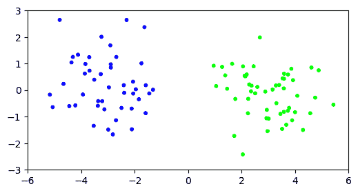
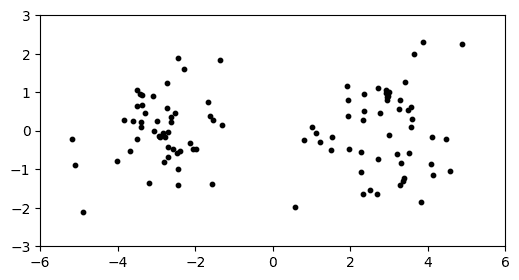
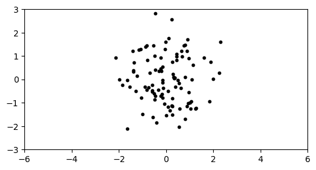
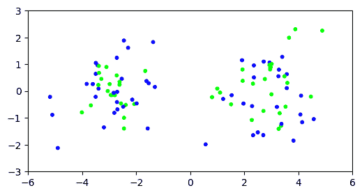
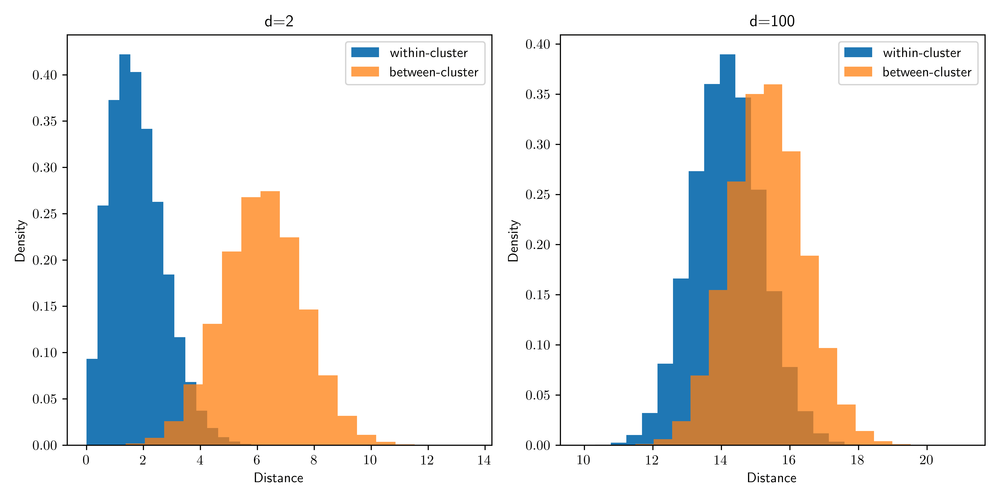
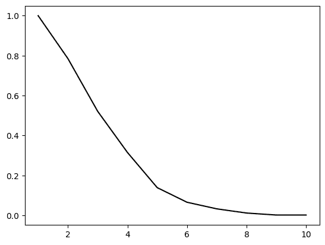

# 1.4\. 高维数据的一些观察#

> 原文：[`mmids-textbook.github.io/chap01_intro/04_highdim/roch-mmids-intro-highdim.html`](https://mmids-textbook.github.io/chap01_intro/04_highdim/roch-mmids-intro-highdim.html)

在本节中，我们首先将 \(k\)-means 聚类应用于一个高维示例，以说明在该背景下出现的问题。然后我们讨论一些高维中的惊人现象。

## 1.4.1\. 高维空间中的聚类#

在本节中，我们测试了我们在高维简单模拟数据集上实现的 \(k\)-means。

以下函数从两个等可能的、球形的 \(d\)-维高斯混合分布中生成 \(n\) 个数据点，方差为 \(1\)，一个以 \(-w\mathbf{e}_1\) 为均值，另一个以 \(w \mathbf{e}_1\) 为均值。我们使用来自前一个部分的 `gmm2spherical`。它在 `mmids.py` 中。

```py
def two_mixed_clusters(rng, d, n, w):
    mu0 = np.hstack(([w], np.zeros(d-1)))
    mu1 = np.hstack(([-w], np.zeros(d-1)))
    return mmids.gmm2spherical(rng, d, n, 0.5, 0.5, mu0, 1, mu1, 1) 
```

**数值角落:** 我们从 \(d=2\) 开始。

```py
seed = 535
rng = np.random.default_rng(seed)
d, n, w = 2, 100, 3.
X = two_mixed_clusters(rng, d, n, w) 
```

让我们在数据集上运行 \(k=2\) 的 \(k\)-means。我们使用来自 `mmids.py` 文件的 `kmeans()` 函数。

```py
assign = mmids.kmeans(rng, X, 2) 
```

```py
1044.8267883490312
208.5284166285488
204.02397716710018
204.02397716710018
204.02397716710018 
```

我们默认的 \(10\) 次迭代似乎已经足够算法收敛。我们可以通过根据分配给点着色来可视化结果。

```py
plt.figure(figsize=(6,3))
plt.scatter(X[:,0], X[:,1], s=10, c=assign, cmap='brg')
plt.axis([-6,6,-3,3])
plt.show() 
```



让我们看看在更高维度会发生什么。我们重复我们的实验，\(d=1000\)。

```py
d, n, w = 1000, 100, 3.
X = two_mixed_clusters(rng, d, n, w) 
```

再次，我们观察到两个清晰划分的簇。

```py
plt.figure(figsize=(6,3))
plt.scatter(X[:,0], X[:,1], s=10, c='k')
plt.axis([-6,6,-3,3])
plt.show() 
```



这个数据集有 \(1000\) 维，但我们只绘制了前两个维度的数据。如果我们绘制不包括第一个维度的任意两个维度，我们只能看到一个簇。

```py
plt.figure(figsize=(6,3))
plt.scatter(X[:,1], X[:,2], s=10, c='k')
plt.axis([-6,6,-3,3])
plt.show() 
```



让我们看看 \(k\)-means 在这个数据集上的表现如何。

```py
assign = mmids.kmeans(rng, X, 2) 
```

```py
99518.03165136592
99518.03165136592
99518.03165136592
99518.03165136592
99518.03165136592 
```

我们尝试的聚类似乎没有成功。

```py
plt.figure(figsize=(6,3))
plt.scatter(X[:,0], X[:,1], s=10, c=assign, cmap='brg')
plt.axis([-6,6,-3,3])
plt.show() 
```



\(\unlhd\)

发生了什么？虽然如果我们只看第一个坐标，簇很容易区分，但在整个空间中，簇内和簇间的距离变得难以区分：噪声压倒了信号。

随着维度的增加，簇内和簇间距离的分布显著重叠，变得或多或少无法区分。这为我们提供了关于为什么聚类可能在这里失败的一些见解。请注意，我们为所有模拟使用了相同的偏移量。另一方面，如果簇之间的分离足够大，人们会期望聚类即使在高维度下也能工作。



**尝试一下！** 以下内容（以及下一小节中的内容）并不是 \(k\)-means 聚类在这里将失败的形式化证明。算法的行为相当复杂，并且特别依赖于初始化和点的密度。在这里，增加数据点的数量最终会导致性能显著提高。通过修改代码来探索这种行为。（有关一些理论依据（超出本课程范围），请参阅[这里](https://arxiv.org/pdf/0912.0086.pdf)和[这里](http://www.stat.yale.edu/~pollard/Papers/Pollard81AS.pdf)。）

**聊天与学习** 根据克劳德的说法，一只猫可能会这样总结情况：

**图：** 太空中的小猫 (*来源：使用 [Midjourney](https://www.midjourney.com/) 制作*) 


\(\bowtie\)

“我在高维空间里”

所有这些数据点，无处不在

但无论我走得多远

对我来说，它们看起来都一样！”

\(\ddagger\)

## 1.4.2\. 高维空间中的惊人现象#

> 高维空间是一个孤独的地方
> 
> — Bernhard Schölkopf (@bschoelkopf) [2014 年 8 月 24 日](https://twitter.com/bschoelkopf/status/503554842829549568?ref_src=twsrc%5Etfw)

在上一节中，我们看到了大量“噪声维度”的贡献如何在聚类上下文中压倒“信号”。在本节中，我们将讨论与数据科学问题相关的高维空间的其他属性。

将 *切比雪夫不等式* 应用于独立随机变量的和，具有有用的统计意义：它表明，当样本数量 \(n\) 足够大时，样本均值接近总体均值。因此，它允许我们从样本中推断总体的性质。有趣的是，可以将类似的论点应用于不同的渐近区域：大维度 \(d\) 的极限。但正如我们将在本节中看到的，统计意义相当不同。

为了解释上述引言，我们考虑一个简单的实验。设 \(\mathcal{C} = [-1/2,1/2]^d\) 为以原点为中心、边长为 \(1\) 的 \(d\) 维立方体，设 \(\mathcal{B} = \{\mathbf{x} \in \mathbb{R}^d : \|\mathbf{x}\|\leq 1/2\}\) 为内嵌的 \(d\) 维球体。

现在在 \(\mathcal{C}\) 中随机均匀地选择一个点 \(\mathbf{X}\)。它落在 \(\mathcal{B}\) 中的概率是多少？

要生成 \(\mathbf{X}\)，我们选择 \(d\) 个独立的随机变量 \(X_1, \ldots, X_d \sim \mathrm{U}[-1/2, 1/2]\)，并形成向量 \(\mathbf{X} = (X_1, \ldots, X_d)\)。实际上，\(\mathbf{X}\) 的概率密度函数 \(f_{\mathbf{X}}(\mathbf{x})= 1^d = 1\) 如果 \(\mathbf{x} \in \mathcal{C}\) 并且否则为 \(0\)。

我们感兴趣的事件是 \(A = \left\{\|\mathbf{X}\| \leq 1/2\right\}\)。在集合 \(\mathcal{C}\) 上的均匀分布具有这样的性质：\(\mathbb{P}[A]\) 是 \(\mathcal{B}\) 的体积除以 \(\mathcal{C}\) 的体积。在这种情况下，\(\mathcal{C}\) 的体积是 \(1^d = 1\)，而 \(\mathcal{B}\) 的体积有一个 [显式公式](https://en.wikipedia.org/wiki/Volume_of_an_n-ball)。

这导致以下令人惊讶的事实：

**定理** **(高维立方体)** \(\idx{high-dimensional cube theorem}\xdi\) 设 \(\mathcal{B} = \{\mathbf{x} \in \mathbb{R}^d \,:\, \|\mathbf{x}\|\leq 1/2\}\) 和 \(\mathcal{C} = [-1/2,1/2]^d\)。选择 \(\mathbf{X} \sim \mathrm{U}[\mathcal{C}]\)。那么，当 \(d \to +\infty\) 时，

\[ \mathbb{P}[\mathbf{X} \in \mathcal{B}] \to 0. \]

\(\sharp\)

用话来说，在高维空间中，如果随机从立方体中选取一个点，它不太可能靠近原点。相反，它更有可能位于角落。几何解释是，高维立方体有点像“尖锐的球体。”

**图:** 高维立方体作为尖锐球体的可视化 (*来源:* 使用 [Midjourney](https://www.midjourney.com/))


\(\bowtie\)

我们基于 *切比雪夫不等式* 给出证明。它的优点是通过对独立随机变量和的集中现象进行联系，为这一反直觉现象提供了一些洞察，在这种情况下是 \(\mathbf{X}\) 的平方范数。

*证明思路:* 我们将 \(\|\mathbf{X}\|²\) 视为一个独立随机变量的和，并应用 *切比雪夫不等式*。它表明 \(\mathbf{X}\) 的范数集中在其均值附近，其增长类似于 \(\sqrt{d}\)。对于大的 \(d\)，后者大于 \(1/2\)。

*证明:* 为了看到 *切比雪夫不等式* 的相关性，我们计算 \(\mathbf{X}\) 的范数的均值和标准差。实际上，由于 \(\|\mathbf{X}\|\) 中的平方根，计算其期望是困难的。因此，我们处理平方范数

\[ \|\mathbf{X}\|² = X_1² + X_2² + \cdots + X_d², \]

这具有作为独立随机变量和的优势——对于这些变量的期望和方差更容易计算。进一步观察，感兴趣的事件的概率 \(\{\|\mathbf{X}\| \leq 1/2\}\) 可以用 \(\|\mathbf{X}\|²\) 表示如下

\[\begin{align*} \mathbb{P} \left[ \|\mathbf{X}\| \leq 1/2 \right] &= \mathbb{P} \left[ \|\mathbf{X}\|² \leq 1/4 \right]. \end{align*}\]

为了简化符号，我们使用 \(\tilde\mu = \mathbb{E}[X_1²]\) 和 \(\tilde\sigma = \sqrt{\mathrm{Var}[X_1²]}\) 分别表示 \(X_1²\) 的均值和标准差。利用期望的线性性和 \(X_i\) 的独立性，我们得到

\[ \mu_{\|\mathbf{X}\|²} = \mathbb{E}\left[ \|\mathbf{X}\|² \right] = \sum_{i=1}^d \mathbb{E}[X_i²] = d \,\mathbb{E}[X_1²] = \tilde\mu \, d, \]

和

\[ \mathrm{Var}\left[ \|\mathbf{X}\|² \right] = \sum_{i=1}^d \mathrm{Var}[X_i²] = d \,\mathrm{Var}[X_1²]. \]

取平方根，我们得到我们感兴趣的数量 \(\|\mathbf{X}\|²\) 的标准差的表达式，它是 \(X_1²\) 的标准差的函数

\[ \sigma_{\|\mathbf{X}\|²} = \tilde\sigma \, \sqrt{d}. \]

（注意，我们可以显式地计算 \(\tilde\mu\) 和 \(\tilde\sigma\)，但在这里将不是必要的。）

我们使用 *切比雪夫不等式* 来证明 \(\|\mathbf{X}\|²\) 很有可能接近其均值 \(\tilde\mu \, d\)，当 \(d\) 很大时，这个均值远大于 \(1/4\)。因此，\(\|\mathbf{X}\|²\) 很不可能小于 \(1/4\)。我们将在下文中给出详细说明。

根据标准差的单边版本 *切比雪夫不等式*，我们有

\[ \mathbb{P}\left[ \|\mathbf{X}\|² - \mu_{\|\mathbf{X}\|²} \leq - \alpha \right] \leq \left(\frac{\sigma_{\|\mathbf{X}\|²}}{\alpha}\right)². \]

那就是，使用上述公式并稍作整理，

\[ \mathbb{P}\left[ \|\mathbf{X}\|² \leq \tilde\mu \, d - \alpha \right] \leq \left(\frac{\tilde\sigma \, \sqrt{d}}{\alpha}\right)². \]

我们如何将此与感兴趣的概率 \(\mathbb{P}\left[\|\mathbf{X}\|² \leq 1/4\right]\) 相关联？回想一下，我们可以自由选择这个不等式中的 \(\alpha\)。因此，简单地取 \(\alpha\) 使得

\[ \tilde\mu \,d - \alpha = \frac{1}{4}, \]

即，\(\alpha = \tilde\mu \,d - 1/4\)。观察一下，一旦 \(d\) 足够大，就成立 \(\alpha > 0\)。

最后，将这个 \(\alpha\) 的选择代入上述不等式中

\[\begin{align*} \mathbb{P} \left[ \|\mathbf{X}\| \leq 1/2 \right] &= \mathbb{P}\left[\|\mathbf{X}\|² \leq 1/4\right]\\ &= \mathbb{P}\left[ \|\mathbf{X}\|² \leq \tilde\mu \, d - \alpha \right]\\ &\leq \left(\frac{\tilde\sigma \, \sqrt{d}}{\alpha}\right)²\\ &\leq \left(\frac{\tilde\sigma \, \sqrt{d}}{\tilde\mu \,d - 1/4}\right)². \end{align*}\]

关键的是，\(\tilde\mu\) 和 \(\tilde\sigma\) 不依赖于 \(d\)。因此，当 \(d \to +\infty\) 时，右侧趋于 \(0\)。实际上，当 \(d\) 很大时，\(d\) 远大于 \(\sqrt{d}\)。这证明了该命题。\(\square\)

在课程的后半部分，我们将看到这一高维现象对数据科学问题有影响。它是所谓的[维度诅咒](https://en.wikipedia.org/wiki/Curse_of_dimensionality)\(\idx{维度诅咒}\xdi\)的背景。

虽然 *切比雪夫不等式* 正确地暗示了 \(\mathbb{P}[\mathbf{X} \in \mathcal{B}]\) 趋向于 \(0\)，但它并没有给出正确的收敛速率。实际上，这个概率以比 \(1/d\) 更快的速度趋向于 \(0\)。具体来说，[可以证明](https://en.wikipedia.org/wiki/Volume_of_an_n-ball#High_dimensions) \(\mathbb{P}[\mathbf{X} \in \mathcal{B}]\) 大约以 \(d^{-d/2}\) 的速率趋向于 \(0\)。我们在这里不会推导（或需要）这个事实。

**数值角**：我们可以在模拟中检查定理。在这里，我们在 \(d\)-立方体 \(\mathcal{C}\) 中随机均匀地选择 \(n\) 个点，范围包括直到 `dmax` 的维度。然后我们绘制落在内切 \(d\)-球 \(\mathcal{B}\) 中的频率，并看到它迅速收敛到 \(0\)。或者，我们也可以只绘制 \(\mathcal{B}\) 的体积公式。但了解如何进行模拟在显式公式不可用或难以处理的情况下是有用的。我们绘制了直到维度 \(10\) 的结果。

```py
dmax, n = 10, 1000

in_ball = np.zeros(dmax)
for d in range(dmax):
    in_ball[d] = np.mean([(LA.norm(rng.random(d+1) - 1/2) < 1/2) for _ in range(n)])

plt.plot(np.arange(1,dmax+1), in_ball, c='k') 
plt.show() 
```



\(\unlhd\)

***自我评估测验*** *(有 Claude、Gemini 和 ChatGPT 的帮助)*

**1** \(d\)-维立方体 \(C = [-1/2, 1/2]^d\) 的体积是：

a) \(1/d\)

b) \(1/2^d\)

c) 1

d) \(2^d\)

**2** 在高维立方体 \(C = [-1/2, 1/2]^d\) 中，随着维度 \(d\) 的增加，随机选择一个点落在内切球 \(B = \{x \in \mathbb{R}^d : \|x\| \le 1/2\}\) 内的概率：

a) 接近 1

b) 接近 1/2

c) 接近 0

d) 保持不变

**3** 以下哪个选项最能描述高维立方体的外观？

a) 一个光滑的、圆形的球体

b) 大部分体积集中在角落的尖锐球体

c) 具有均匀体积分布的完美球体

d) 一个扁平的、类似饼干的形状

**4** 用来证明高维立方体定理的不等式是哪一个？

a) 库西-施瓦茨不等式

b) 三角不等式

c) 马尔可夫不等式

d) 切比雪夫不等式

**5** 在高维立方体定理的证明中，使用了平方范数 \(\|X\|²\) 的哪个性质？

a) 它是相关随机变量的和。

b) 它是独立随机变量的和。

c) 它是独立随机变量的乘积。

d) 它是相关随机变量的乘积。

1 题的答案：c. 证明：立方体的边长为 1，\(d\)-维立方体的体积是边长的 \(d\) 次幂。

2 题的答案：c. 证明：这是文中“高维立方体”定理的陈述。

3 题的答案：b. 证明：文中提到，“一个高维立方体有点像‘尖锐的球体’。”

4 题的答案：d. 证明：文中明确指出在证明中使用了切比雪夫不等式。

5 题的答案：b. 证明：证明中提到，“我们使用平方范数”

\[ \|\mathbf{X}\|² = X_1² + X_2² + \cdots + X_d², \]

这具有作为独立随机变量之和的优势。”

## 1.4.1\. 高维聚类#

在本节中，我们在高维的简单模拟数据集上测试我们的 \(k\)-means 实现。

以下函数从两个等可能的球形 \(d\) 维高斯混合分布中生成 \(n\) 个数据点，方差为 \(1\)，一个以 \(-w\mathbf{e}_1\) 为均值，另一个以 \(w \mathbf{e}_1\) 为均值。我们使用来自前一个部分的 `gmm2spherical`。它在 `mmids.py` 中。

```py
def two_mixed_clusters(rng, d, n, w):
    mu0 = np.hstack(([w], np.zeros(d-1)))
    mu1 = np.hstack(([-w], np.zeros(d-1)))
    return mmids.gmm2spherical(rng, d, n, 0.5, 0.5, mu0, 1, mu1, 1) 
```

**数值角:** 我们从 \(d=2\) 开始。

```py
seed = 535
rng = np.random.default_rng(seed)
d, n, w = 2, 100, 3.
X = two_mixed_clusters(rng, d, n, w) 
```

让我们使用 \(k=2\) 在这个数据集上运行 \(k\)-means。我们使用来自 `mmids.py` 文件的 `kmeans()` 函数。

```py
assign = mmids.kmeans(rng, X, 2) 
```

```py
1044.8267883490312
208.5284166285488
204.02397716710018
204.02397716710018
204.02397716710018 
```

我们默认的 \(10\) 次迭代似乎已经足够算法收敛。我们可以通过根据分配给点着色来可视化结果。

```py
plt.figure(figsize=(6,3))
plt.scatter(X[:,0], X[:,1], s=10, c=assign, cmap='brg')
plt.axis([-6,6,-3,3])
plt.show() 
```


让我们看看在高维度会发生什么。我们重复我们的实验，\(d=1000\)。

```py
d, n, w = 1000, 100, 3.
X = two_mixed_clusters(rng, d, n, w) 
```

再次，我们观察到两个清晰划分的簇。

```py
plt.figure(figsize=(6,3))
plt.scatter(X[:,0], X[:,1], s=10, c='k')
plt.axis([-6,6,-3,3])
plt.show() 
```


这个数据集在 \(1000\) 维，但我们只在前两个维度上绘制了数据。如果我们不在包括第一个维度在内的任意两个维度上绘制，我们只会看到一个簇。

```py
plt.figure(figsize=(6,3))
plt.scatter(X[:,1], X[:,2], s=10, c='k')
plt.axis([-6,6,-3,3])
plt.show() 
```


让我们看看 \(k\)-means 在这个数据集上的表现如何。

```py
assign = mmids.kmeans(rng, X, 2) 
```

```py
99518.03165136592
99518.03165136592
99518.03165136592
99518.03165136592
99518.03165136592 
```

我们尝试的聚类似乎没有成功。

```py
plt.figure(figsize=(6,3))
plt.scatter(X[:,0], X[:,1], s=10, c=assign, cmap='brg')
plt.axis([-6,6,-3,3])
plt.show() 
```


\(\unlhd\)

发生了什么？当只查看第一个坐标时，簇很容易区分，但在整个空间中，簇内和簇间的距离变得难以区分：噪声掩盖了信号。

随着维度的增加，簇内和簇间距离的分布重叠显著，变得或多或少无法区分。这为我们提供了关于为什么聚类可能在这里失败的一些见解。请注意，我们对所有模拟使用了相同的偏移量。另一方面，如果簇之间的分离足够大，人们会预期聚类即使在高维度下也能工作。


**尝试一下！** 以下（以及在下一个小节中跟随的）不是 \(k\)-means 聚类在这里将失败的形式证明。算法的行为相当复杂，并且特别依赖于初始化和点的密度。在这里，增加数据点的数量最终会导致性能大幅提升。通过修改代码来探索这种行为。（对于一些理论上的证明（超出本课程），请参阅[这里](https://arxiv.org/pdf/0912.0086.pdf)和[这里](http://www.stat.yale.edu/~pollard/Papers/Pollard81AS.pdf)。）

**聊天与学习** 根据 Claude，一只猫可能会这样总结情况：

**图：太空中的小猫（来源：使用 [Midjourney](https://www.midjourney.com/) 制作**）


\(\bowtie\)

“我身处高维空间中”

所有这些数据点，无处不在

但无论我走得多远

“它们对我来说看起来都一样！”

\(\ddagger\)

## 1.4.2\. 高维空间中的惊人现象#

> 高维空间是一个孤独的地方
> 
> — Bernhard Schölkopf (@bschoelkopf) [2014 年 8 月 24 日](https://twitter.com/bschoelkopf/status/503554842829549568?ref_src=twsrc%5Etfw)

在上一节中，我们看到了大量“噪声维度”的贡献如何在聚类中压倒“信号”。在本节中，我们讨论与数据科学问题相关的高维空间的其他性质。

将 *切比雪夫不等式* 应用于独立随机变量的和，具有有用的统计意义：它表明，当样本数量 \(n\) 足够大时，样本均值接近总体均值。因此，它允许我们从样本中推断总体的性质。有趣的是，可以将类似的论点应用于不同的渐近区域：大维度 \(d\) 的极限。但正如我们将在本节中看到的，统计意义相当不同。

要开始解释上面的引言，我们考虑一个简单的实验。设 \(\mathcal{C} = [-1/2,1/2]^d\) 为以原点为中心、边长为 \(1\) 的 \(d\) 维立方体，设 \(\mathcal{B} = \{\mathbf{x} \in \mathbb{R}^d : \|\mathbf{x}\|\leq 1/2\}\) 为内切 \(d\) 维球体。

现在随机选择一个点 \(\mathbf{X}\) 在 \(\mathcal{C}\) 中。它落在 \(\mathcal{B}\) 中的概率是多少？

要生成 \(\mathbf{X}\)，我们选择 \(d\) 个独立的随机变量 \(X_1, \ldots, X_d \sim \mathrm{U}[-1/2, 1/2]\)，并形成向量 \(\mathbf{X} = (X_1, \ldots, X_d)\)。实际上，\(\mathbf{X}\) 的概率密度函数 \(f_{\mathbf{X}}(\mathbf{x})= 1^d = 1\) 当 \(\mathbf{x} \in \mathcal{C}\) 时，否则为 \(0\)。

我们感兴趣的事件是 \(A = \left\{\|\mathbf{X}\| \leq 1/2\right\}\)。在集合 \(\mathcal{C}\) 上的均匀分布具有性质 \(\mathbb{P}[A]\) 是 \(\mathcal{B}\) 的体积除以 \(\mathcal{C}\) 的体积。在这种情况下，\(\mathcal{C}\) 的体积是 \(1^d = 1\)，而 \(\mathcal{B}\) 的体积有一个 [显式公式](https://en.wikipedia.org/wiki/Volume_of_an_n-ball)。

这导致以下令人惊讶的事实：

**定理** **(高维立方体)** \(\idx{高维立方体定理}\xdi\) 设 \(\mathcal{B} = \{\mathbf{x} \in \mathbb{R}^d \,:\, \|\mathbf{x}\|\leq 1/2\}\) 和 \(\mathcal{C} = [-1/2,1/2]^d\). 从 \(\mathrm{U}[\mathcal{C}]\) 中选取 \(\mathbf{X}\)。当 \(d \to +\infty\) 时，

\[ \mathbb{P}[\mathbf{X} \in \mathcal{B}] \to 0. \]

\(\sharp\)

用话来说，在高度维度中，如果从立方体中随机选择一个点，它不太可能接近原点。相反，它更有可能位于角落。几何解释是，高维立方体有点像“带刺的球体。”

**图：** 高维立方体的可视化，呈现为带刺的球体（*来源：使用 [Midjourney](https://www.midjourney.com/)*）


\(\bowtie\)

我们基于**切比雪夫不等式**给出一个证明。它具有通过将其与独立随机变量和的集中联系起来，从而提供一些对这种反直觉现象的洞察的优势，在这种情况下是 \(\mathbf{X}\) 的平方范数。

*证明思路：* 我们将 \(\|\mathbf{X}\|²\) 视为独立随机变量的和，并应用**切比雪夫不等式**。它表明 \(\mathbf{X}\) 的范数集中在其均值附近，其增长类似于 \(\sqrt{d}\)。对于大的 \(d\)，后者大于 \(1/2\)。

*证明：* 为了看到**切比雪夫不等式**的相关性，我们计算 \(\mathbf{X}\) 的范数的均值和标准差。实际上，由于 \(\|\mathbf{X}\|\) 中的平方根，计算其期望是困难的。因此，我们处理平方范数

\[ \|\mathbf{X}\|² = X_1² + X_2² + \cdots + X_d², \]

这具有将独立随机变量的和作为优势——对于这些变量的期望和方差更容易计算。进一步观察，感兴趣的事件的概率 \(\{\|\mathbf{X}\| \leq 1/2\}\) 可以用 \(\|\mathbf{X}\|²\) 表示如下

\[\begin{align*} \mathbb{P} \left[ \|\mathbf{X}\| \leq 1/2 \right] &= \mathbb{P} \left[ \|\mathbf{X}\|² \leq 1/4 \right]. \end{align*}\]

为了简化符号，我们分别用 \(\tilde\mu = \mathbb{E}[X_1²]\) 和 \(\tilde\sigma = \sqrt{\mathrm{Var}[X_1²]}\) 表示 \(X_1²\) 的均值和标准差。利用期望的线性性和 \(X_i\) 的独立性，我们得到

\[ \mu_{\|\mathbf{X}\|²} = \mathbb{E}\left[ \|\mathbf{X}\|² \right] = \sum_{i=1}^d \mathbb{E}[X_i²] = d \,\mathbb{E}[X_1²] = \tilde\mu \, d, \]

和

\[ \mathrm{Var}\left[ \|\mathbf{X}\|² \right] = \sum_{i=1}^d \mathrm{Var}[X_i²] = d \,\mathrm{Var}[X_1²]. \]

开平方，我们得到我们感兴趣的数量 \(\|\mathbf{X}\|²\) 的标准差的表达式，它是 \(X_1²\) 的标准差的函数

\[ \sigma_{\|\mathbf{X}\|²} = \tilde\sigma \, \sqrt{d}. \]

（注意，我们可以显式地计算 \(\tilde\mu\) 和 \(\tilde\sigma\)，但在这里并不必要。）

我们使用 *切比雪夫不等式* 来证明 \(\|\mathbf{X}\|²\) 很可能接近其均值 \(\tilde\mu \, d\)，当 \(d\) 很大时，这个均值远大于 \(1/4\)。因此，\(\|\mathbf{X}\|²\) 很不可能小于 \(1/4\)。我们将在下文中给出详细说明。

通过标准差的单侧版本 *切比雪夫不等式*，我们有

\[ \mathbb{P}\left[ \|\mathbf{X}\|² - \mu_{\|\mathbf{X}\|²} \leq - \alpha \right] \leq \left(\frac{\sigma_{\|\mathbf{X}\|²}}{\alpha}\right)². \]

也就是说，使用上述公式并稍作整理，

\[ \mathbb{P}\left[ \|\mathbf{X}\|² \leq \tilde\mu \, d - \alpha \right] \leq \left(\frac{\tilde\sigma \, \sqrt{d}}{\alpha}\right)². \]

我们如何将这个结果与感兴趣的概率 \(\mathbb{P}\left[\|\mathbf{X}\|² \leq 1/4\right]\) 相关联？回想一下，在这个不等式中我们可以自由选择 \(\alpha\)。所以只需取 \(\alpha\) 使得

\[ \tilde\mu \,d - \alpha = \frac{1}{4}, \]

即，\(\alpha = \tilde\mu \,d - 1/4\)。观察一下，一旦 \(d\) 足够大，就有 \(\alpha > 0\)。

最后，将上述不等式中的 \(\alpha\) 替换为这个选择

\[\begin{align*} \mathbb{P} \left[ \|\mathbf{X}\| \leq 1/2 \right] &= \mathbb{P}\left[\|\mathbf{X}\|² \leq 1/4\right]\\ &= \mathbb{P}\left[ \|\mathbf{X}\|² \leq \tilde\mu \, d - \alpha \right]\\ &\leq \left(\frac{\tilde\sigma \, \sqrt{d}}{\alpha}\right)²\\ &\leq \left(\frac{\tilde\sigma \, \sqrt{d}}{\tilde\mu \,d - 1/4}\right)². \end{align*}\]

关键的是，\(\tilde\mu\) 和 \(\tilde\sigma\) 不依赖于 \(d\)。因此，当 \(d \to +\infty\) 时，右侧趋于 \(0\)。实际上，当 \(d\) 很大时，\(d\) 远大于 \(\sqrt{d}\)。这证明了我们的断言。\(\square\)

我们将在课程后面的部分看到，这种高维现象对数据科学问题有影响。它是所谓的 [维度诅咒](https://en.wikipedia.org/wiki/Curse_of_dimensionality)\(\idx{维度诅咒}\xdi\) 的背后原因。

虽然*切比雪夫不等式*正确地暗示了\(\mathbb{P}[\mathbf{X} \in \mathcal{B}]\)趋近于 0，但它并没有给出正确的收敛速率。实际上，这个概率以比\(1/d\)快得多的速度趋近于 0。具体来说，[可以证明](https://en.wikipedia.org/wiki/Volume_of_an_n-ball#High_dimensions) \(\mathbb{P}[\mathbf{X} \in \mathcal{B}]\)大致以\(d^{-d/2}\)的速度趋近于 0。我们在这里不会推导（或需要）这个事实。

**数值角:** 我们可以在模拟中检查定理。在这里，我们在\(d\)-立方体\(\mathcal{C}\)中随机选择\(n\)个点，范围包括直到`dmax`的维度。然后我们绘制落在内切\(d\)-球体\(\mathcal{B}\)中的频率，并看到它迅速收敛到 0。或者，我们也可以只绘制\(\mathcal{B}\)体积的公式。但知道如何进行模拟在显式公式不可用或难以处理的情况下是有用的。我们绘制了直到维度 10 的结果。

```py
dmax, n = 10, 1000

in_ball = np.zeros(dmax)
for d in range(dmax):
    in_ball[d] = np.mean([(LA.norm(rng.random(d+1) - 1/2) < 1/2) for _ in range(n)])

plt.plot(np.arange(1,dmax+1), in_ball, c='k') 
plt.show() 
```


\(\unlhd\)

***自我评估测验*** *(由 Claude、Gemini 和 ChatGPT 协助)*

**1** \(d\)维立方体\(C = [-1/2, 1/2]^d\)的体积是：

a) \(1/d\)

b) \(1/2^d\)

c) 1

d) \(2^d\)

**2** 在高维立方体\(C = [-1/2, 1/2]^d\)中，随着维度\(d\)的增加，随机选择一个点落在内切球体\(B = \{x \in \mathbb{R}^d : \|x\| \le 1/2\}\)内的概率：

a) 方法 1

b) 趋近于 1/2

c) 方法 0

d) 保持不变

**3** 以下哪个最好地描述了高维立方体的外观？

a) 一个光滑、圆形的球体

b) 大部分体积集中在角落的尖锐球体

c) 具有均匀体积分布的完美球体

d) 一种扁平、类似薄饼的形状

**4** 用来证明高维立方体定理的不等式是哪个？

a) 库希不等式

b) 三角不等式

c) 马尔可夫不等式

d) 切比雪夫不等式

**5** 在高维立方体定理的证明中，使用了平方范数\(\|X\|²\)的哪个性质？

a) 它是相关随机变量的和。

b) 它是独立随机变量的和。

c) 它是独立随机变量的乘积。

d) 它是相关随机变量的乘积。

答案 1：c. 理由：立方体的边长为 1，\(d\)维立方体的体积是边长的\(d\)次幂。

答案 2：c. 理由：这是文本中“高维立方体”定理的陈述。

答案 3：b. 理由：文本提到，“一个几何解释是高维立方体有点像‘尖锐球体’。”

答案 4：d. 理由：文本明确指出在证明中使用了切比雪夫不等式。

答案 5：b. 理由：证明中提到，“我们处理平方范数”

\[ \|\mathbf{X}\|² = X_1² + X_2² + \cdots + X_d², \]

具有作为独立随机变量之和的优势。”
