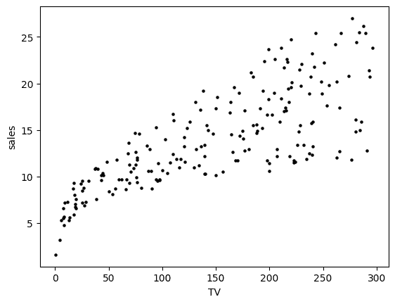
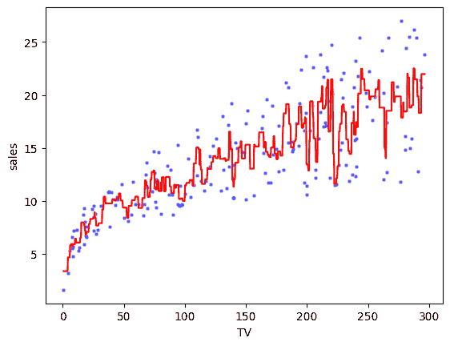
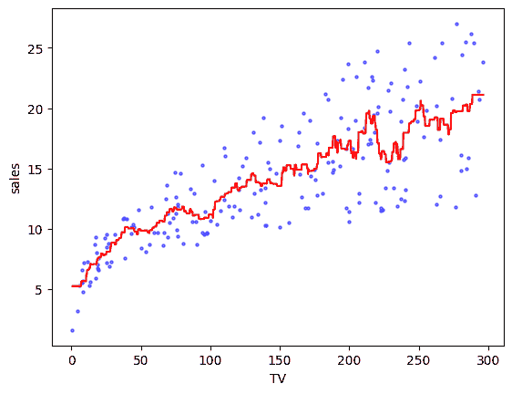

# 2.1. 激励示例：预测销售#

> 原文：[`mmids-textbook.github.io/chap02_ls/01_motiv/roch-mmids-ls-motiv.html`](https://mmids-textbook.github.io/chap02_ls/01_motiv/roch-mmids-ls-motiv.html)

**图：scikit-learn 提供的 ML 有帮助的地图（来源](https://scikit-learn.org/stable/tutorial/machine_learning_map/index.html))


\(\bowtie\)

下面的数据集来自优秀的教科书 [[ISLP]](https://www.statlearning.com/)。引用 [ISLP，第 2.1 节](https://www.statlearning.com/)：

> 假设我们是被客户雇佣的统计顾问，为客户提供如何提高特定产品销售的建议。`广告`数据集包含了该产品在 200 个不同市场的销售情况，以及每个市场针对三种不同媒体（`电视`、`广播`和`报纸`）的广告预算。 [...] 我们的客户无法直接增加产品的销售。另一方面，他们可以控制三种媒体中的广告支出。因此，如果我们确定广告和销售之间存在关联，那么我们可以指导客户调整广告预算，从而间接增加销售。换句话说，我们的目标是开发一个准确的模型，该模型可以根据三种媒体的预算预测销售。

这是一个 [回归](https://en.wikipedia.org/wiki/Regression_analysis)问题。也就是说，我们想要估计结果变量与一个或多个预测变量（或特征）之间的关系。我们加载数据。

```py
data = pd.read_csv('advertising.csv')
data.head() 
```

|  | TV | radio | newspaper | sales |
| --- | --- | --- | --- | --- |
| 0 | 230.1 | 37.8 | 69.2 | 22.1 |
| 1 | 44.5 | 39.3 | 45.1 | 10.4 |
| 2 | 17.2 | 45.9 | 69.3 | 9.3 |
| 3 | 151.5 | 41.3 | 58.5 | 18.5 |
| 4 | 180.8 | 10.8 | 58.4 | 12.9 |

我们现在将专注于电视预算。

```py
TV = data['TV'].to_numpy()
sales = data['sales'].to_numpy() 
```

我们制作一个散点图，显示这两个数量之间的关系。

```py
plt.scatter(TV, sales, s=5, c='k')
plt.xlabel('TV'), plt.ylabel('sales')
plt.show() 
```



看起来这两个变量之间确实存在某种关系。大致来说，较高的电视预算与较高的销售相关联，尽管这种对应关系并不完美。为了更定量地表达这种关系，我们寻求一个函数 \(f\)，使得

\[ y \approx f(x) \]

其中 \(x\) 表示样本电视预算，\(y\) 是相应的观察销售。例如，我们可能假设存在一个真实的 \(f\)，并且每个观察值都受到一些噪声 \(\varepsilon\) 的干扰

\[ y = f(x) + \varepsilon. \]

从数据中估计这样的 \(f\) 的一个自然方法是 [\(k\)-最近邻 (\(k\)-NN) 回归](https://en.wikipedia.org/wiki/K-nearest_neighbors_algorithm#k-NN_regression)\(\idx{k-NN 回归}\xdi\)。让数据的形式为 \(\{(\mathbf{x}_i, y_i)\}_{i=1}^n\)，其中 \(\mathbf{x}_i \in \mathbb{R}^d\) 且 \(y_i \in \mathbb{R}\)。在我们的情况下，\(\mathbf{x}_i\) 是第 \(i\) 个样本的（实值）电视预算（因此 \(d=1\)），而 \(y_i\) 是相应的销售额。对于每个 \(\mathbf{x}\)（不一定在数据中），我们执行以下操作：

+   找到与 \(\mathbf{x}\) 最接近的 \(k\) 个 \(\mathbf{x}_i\)。

+   对应的 \(y_i\) 取平均值。

我们在 Python 中实现这种方法。我们使用函数 `numpy.argsort` 对数组进行排序，并使用函数 `numpy.absolute` 计算绝对偏差。我们这里的快速实现假设 \(\mathbf{x}_i\) 是标量。

```py
def knnregression(x,y,k,xnew):
    n = len(x)
    closest = np.argsort([np.absolute(x[i]-xnew) for i in range(n)])
    return np.mean(y[closest[0:k]]) 
```

对于 \(k=3\) 和 \(1000\) 个点的网格，我们得到以下近似 \(\hat{f}\)。在这里，函数 `numpy.linspace` 创建了一个等间距点的数组。

```py
k = 3
xgrid = np.linspace(TV.min(), TV.max(), num=1000)
yhat = [knnregression(TV,sales,k,xnew) for xnew in xgrid]

plt.scatter(TV, sales, s=5, c='b', alpha=0.5)
plt.plot(xgrid, yhat, 'r')
plt.xlabel('TV'), plt.ylabel('sales')
plt.show() 
```



较高的 \(k\) 产生的东西不那么扭曲。

```py
k = 10
xgrid = np.linspace(TV.min(), TV.max(), num=1000)
yhat = [knnregression(TV,sales,k,xnew) for xnew in xgrid]

plt.scatter(TV, sales, s=5, c='b', alpha=0.5)
plt.plot(xgrid, yhat, 'r')
plt.xlabel('TV'), plt.ylabel('sales')
plt.show() 
```



\(k\)-NN 回归的一个缺点是它不提供易于解释的关系：如果我增加我的电视预算 \(\Delta\) 美元，它预计会如何影响销售额？在维度较高的情况下，我们之前章节中讨论的反直觉现象可能会产生重大影响。特别是回想一下*高维立方体定理*。如果我们有 \(d\) 个预测因子——其中 \(d\) 很大——并且我们的数据在有限区域内均匀分布，那么任何给定的 \(\mathbf{x}\) 都会远离我们的数据点。在这种情况下，最近的 \(\mathbf{x}_i\) 的 \(y\) 值可能不具有预测性。这被称为[维度诅咒](https://en.wikipedia.org/wiki/Curse_of_dimensionality)\(\idx{维度诅咒}\xdi\)。

**CHAT & LEARN** 向您最喜欢的 AI 聊天机器人询问有关维度诅咒的更多详细信息及其在数据科学中如何出现的细节。\(\ddagger\)

一种解决方案是对函数 \(f\) 做出更强的假设。例如，我们可以假设真实关系是（近似）线性的，即 \(y \approx \beta_0 + \beta_1 x\)，或者如果我们有 \(d\) 个预测因子

\[ y \approx \beta_0 + \sum_{j=1}^d \beta_j x_j. \]

我们如何估计适当的截距和系数？标准方法是使平方误差之和最小化

\[ \sum_{i=1}^n \left(y_i - \left\{\beta_0 + \sum_{j=1}^d \beta_j (\mathbf{x}_{i})_j\right\}\right)², \]

其中 \((\mathbf{x}_{i})_j\) 是输入向量 \(\mathbf{x}_i \in \mathbb{R}^d\) 的第 \(j\) 个元素，\(y_i \in \mathbb{R}\) 是相应的 \(y\) 值。这被称为[多元线性回归](https://en.wikipedia.org/wiki/Linear_regression)。

这是一个[最小二乘问题](https://en.wikipedia.org/wiki/Least_squares)。我们将它重写为更方便的矩阵形式，并通过向每个样本添加一个虚拟预测因子将 \(\beta_0\) 与其他 \(\beta_i\) 结合起来。令

\[\begin{split} \mathbf{y} = \begin{pmatrix} y_1 \\ y_2 \\ \vdots \\ y_n \end{pmatrix}, \quad\quad A = \begin{pmatrix} 1 & \mathbf{x}_1^T \\ 1 & \mathbf{x}_2^T \\ \vdots & \vdots \\ 1 & \mathbf{x}_n^T \end{pmatrix} \quad\text{and}\quad \boldsymbol{\beta} = \begin{pmatrix} \beta_0 \\ \beta_1 \\ \vdots \\ \beta_d \end{pmatrix}. \end{split}\]

然后，观察以下内容

\[\begin{align*} \|\mathbf{y} - A \boldsymbol{\beta}\|² &= \sum_{i=1}^n \left(y_i - (A \boldsymbol{\beta})_i\right)²\\ &= \sum_{i=1}^n \left(y_i - \left\{\beta_0 + \sum_{j=1}^d \beta_j (\mathbf{x}_{i})_j\right\}\right)². \end{align*}\]

线性最小二乘问题随后被表述为

\[ \min_{\boldsymbol{\beta} \in \mathbb{R}^{d+1}} \|\mathbf{y} - A \boldsymbol{\beta}\|². \]

用话来说，我们正在寻找 \(A\) 的列的线性组合，使其在欧几里得距离上最接近 \(\mathbf{y}\)。实际上，最小化平方欧几里得距离等同于最小化其平方根，因为后者是一个增函数。

可以通过微积分（我们将在本书的后面部分回到这种方法）来解决这个优化问题，但理解问题的几何和代数结构最终证明为解决其解决方案——以及数据科学中许多问题的解决方案——提供了强大的洞察力。这也会是一个回顾一些基本线性代数概念的机会。

我们将在本章的后面部分回到 `advertising` 数据集。
