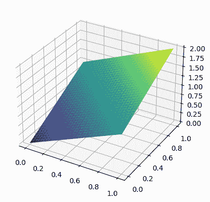

# 2.2\. 背景：向量空间和矩阵逆的复习

> 原文：[`mmids-textbook.github.io/chap02_ls/02_spaces/roch-mmids-ls-spaces.html`](https://mmids-textbook.github.io/chap02_ls/02_spaces/roch-mmids-ls-spaces.html)

在本节中，我们介绍一些将在本章和以后需要的基本线性代数概念。

## 2.2.1\. 子空间#

我们在向量空间 \(V = \mathbb{R}^n\) 上工作。我们首先介绍线性子空间的概念。

**定义** **(线性子空间)** \(\idx{linear subspace}\xdi\) \(\mathbb{R}^n\) 的线性子空间是 \(\mathbb{R}^n\) 的子集 \(U \subseteq \mathbb{R}^n\)，它对向量加法和数乘封闭。也就是说，对于所有 \(\mathbf{u}_1, \mathbf{u}_2 \in U\) 和 \(\alpha \in \mathbb{R}\)，它都成立

$$ \mathbf{u}_1 + \mathbf{u}_2 \in U \quad \text{和} \quad \alpha \,\mathbf{u}_1 \in U. $$

从这个条件可以得出 \(\mathbf{0} \in U\)。\(\natural\)

或者，我们可以通过证明 (1) \(\mathbf{0} \in U\) 和 (2) \(\mathbf{u}_1, \mathbf{u}_2 \in U\) 以及 \(\alpha \in \mathbb{R}\) 意味着 \(\alpha \mathbf{u}_1 + \mathbf{u}_2 \in U\) 来检查这些条件。确实，取 \(\alpha = 1\) 给出上述第一个条件，而选择 \(\mathbf{u}_2 = \mathbf{0}\) 给出第二个条件。

**数值角**: 由所有满足 \(z = x+y\) 的点 \((x,y,z) \in \mathbb{R}³\) 构成的平面 \(P\) 是一个线性子空间。确实，\(0 = 0 + 0\) 所以 \((0,0,0) \in P\)。并且，对于任何 \(\mathbf{u}_1 = (x_1, y_1, z_1)\) 和 \(\mathbf{u}_2 = (x_2, y_2, z_2)\) 满足 \(z_1 = x_1 + y_1\) 和 \(z_2 = x_2 + y_2\)，以及对于任何 \(\alpha \in \mathbb{R}\)，我们有

$$ \alpha z_1 + z_2 = \alpha (x_1 + y_1) + (x_2 + y_2) = (\alpha x_1 + x_2) + (\alpha y_1 + y_2). $$

那就是说，\(\alpha \mathbf{u}_1 + \mathbf{u}_2\) 满足定义 \(P\) 的条件，因此它本身也在 \(P\) 中。注意，\(P\) 通过原点。

在这个例子中，线性子空间 \(P\) 可以用另一种方式描述为所有形式为 \((x, y, x+y)\) 的向量的集合。

我们使用 `plot_surface` [链接](https://matplotlib.org/stable/api/_as_gen/mpl_toolkits.mplot3d.axes3d.Axes3D.plot_surface.html#mpl_toolkits.mplot3d.axes3d.Axes3D.plot_surface) 在使用 `numpy.meshgrid` [链接](https://numpy.org/doc/stable/reference/generated/numpy.meshgrid.html) 创建的点网格上绘制它。

```py
x = np.linspace(0,1,num=101)
y = np.linspace(0,1,num=101)
X, Y = np.meshgrid(x, y)
print(X) 
```

```py
[[0\.   0.01 0.02 ... 0.98 0.99 1\.  ]
 [0\.   0.01 0.02 ... 0.98 0.99 1\.  ]
 [0\.   0.01 0.02 ... 0.98 0.99 1\.  ]
 ...
 [0\.   0.01 0.02 ... 0.98 0.99 1\.  ]
 [0\.   0.01 0.02 ... 0.98 0.99 1\.  ]
 [0\.   0.01 0.02 ... 0.98 0.99 1\.  ]] 
```

```py
print(Y) 
```

```py
[[0\.   0\.   0\.   ... 0\.   0\.   0\.  ]
 [0.01 0.01 0.01 ... 0.01 0.01 0.01]
 [0.02 0.02 0.02 ... 0.02 0.02 0.02]
 ...
 [0.98 0.98 0.98 ... 0.98 0.98 0.98]
 [0.99 0.99 0.99 ... 0.99 0.99 0.99]
 [1\.   1\.   1\.   ... 1\.   1\.   1\.  ]] 
```

```py
Z = X + Y
print(Z) 
```

```py
[[0\.   0.01 0.02 ... 0.98 0.99 1\.  ]
 [0.01 0.02 0.03 ... 0.99 1\.   1.01]
 [0.02 0.03 0.04 ... 1\.   1.01 1.02]
 ...
 [0.98 0.99 1\.   ... 1.96 1.97 1.98]
 [0.99 1\.   1.01 ... 1.97 1.98 1.99]
 [1\.   1.01 1.02 ... 1.98 1.99 2\.  ]] 
```

```py
fig = plt.figure()
ax = fig.add_subplot(111, projection='3d')
ax.plot_surface(X, Y, Z, cmap='viridis')
plt.show() 
```



\(\unlhd\)

这是一个线性子空间的关键例子。

**定义** **(张量积)** \(\idx{span}\xdi\) 设 \(\mathbf{w}_1, \ldots, \mathbf{w}_m \in \mathbb{R}^n\)。\(\{\mathbf{w}_1, \ldots, \mathbf{w}_m\}\) 的张量积，记为 \(\mathrm{span}(\mathbf{w}_1, \ldots, \mathbf{w}_m)\)，是所有 \(\mathbf{w}_j\) 的线性组合的集合。也就是说，

$$ \mathrm{span}(\mathbf{w}_1, \ldots, \mathbf{w}_m) = \left\{ \sum_{j=1}^m \alpha_j \mathbf{w}_j\,:\, \alpha_1,\ldots, \alpha_m \in \mathbb{R} \right\}. $$

按照惯例，我们声明空列表的生成空间是 \(\{\mathbf{0}\}\)。 \(\natural\)

**示例：** 在上述数值角例中，我们注意到平面 \(P\) 是所有形式为 \((x, y, x+y)\) 的向量的集合。这些可以写成 \(x \,\mathbf{w}_1 + y \,\mathbf{w}_2\)，其中 \(\mathbf{w}_1 = (1,0,1)\) 和 \(\mathbf{w}_2 = (0,1,1)\)，反之亦然。因此 \(P = \mathrm{span}(\mathbf{w}_1,\mathbf{w}_2)\)。 \(\lhd\)

接下来我们检查一个生成空间确实是一个线性子空间。

**引理：** 设 \(W=\mathrm{span}(\mathbf{w}_1, \ldots, \mathbf{w}_m)\)。那么 \(W\) 是一个线性子空间。 \(\flat\)

我们说 \(\mathbf{w}_1, \ldots, \mathbf{w}_m\) 生成 \(W\)。

*证明：* 首先，\(\mathbf{0} = \sum_{j=1}^m 0\mathbf{w}_j \in W\)。其次，设 \(\mathbf{u}_1, \mathbf{u}_2 \in W\) 和 \(\alpha \in \mathbb{R}\)。对于 \(i=1,2\)，因为 \(\mathbf{u}_i\) 在 \(\mathbf{w}_j\) 的生成空间中，我们可以写成

$$ \mathbf{u}_i = \sum_{j=1}^m \beta_{ij} \mathbf{w}_j $$

对于某些 \(\beta_{ij} \in \mathbb{R}\) 对于 \(j=1,\ldots,m\)。

因此

$$ \alpha \mathbf{u}_1 + \mathbf{u}_2 = \alpha \sum_{j=1}^m \beta_{1j} \mathbf{w}_j + \sum_{j=1}^m \beta_{2j} \mathbf{w}_j = \sum_{j=1}^m (\alpha \beta_{1j} + \beta_{2j}) \mathbf{w}_j. $$

因此 \(\alpha \,\mathbf{u}_1 + \mathbf{u}_2 \in W\)。\(\square\)

**聊天与学习：** 考虑以下问题：

> 证明如果 \(\{\mathbf{v}_1,\ldots,\mathbf{v}_n\}\) 生成 \(U\)，那么列表
> 
> $$ \{\mathbf{v}_1-\mathbf{v}_2, \mathbf{v}_2-\mathbf{v}_3,\ldots,\mathbf{v}_{n-1}-\mathbf{v}_n,\mathbf{v}_n\}, $$
> 
> 通过从每个向量（除了最后一个）中减去以下向量得到。

一款流行的 AI 聊天机器人（此处不透露名称）提供了以下解决方案：

> 假设 \(U = \text{span}(\mathbf{v}_1, \ldots, \mathbf{v}_n)\)。那么对于 \(U\) 中的任意向量 \(\mathbf{v}\)，存在标量 \(a_1, \ldots, a_n \in \mathbb{R}\) 使得：
> 
> $$ \mathbf{v} = a_1\mathbf{v}_1 + a_2\mathbf{v}_2 + \ldots + a_n\mathbf{v}_n $$
> 
> 现在我们用给定的向量表示新列表中的每个向量：
> 
> +   \(\mathbf{v}_1-\mathbf{v}_2 = a_1(\mathbf{v}_1-\mathbf{v}_2)\)
> +   
> +   \(\mathbf{v}_2-\mathbf{v}_3 = (a_1 + a_2)(\mathbf{v}_2-\mathbf{v}_3)\)
> +   
> +   \(\mathbf{v}_3-\mathbf{v}_4 = (a_1 + a_2 + a_3)(\mathbf{v}_3-\mathbf{v}_4)\)
> +   
> +   \(\ldots\)
> +   
> +   \(\mathbf{v}_{n-1} - \mathbf{v}_n = (a_1 + a_2 + \ldots + a_{n-1})(\mathbf{v}_{n-1}-\mathbf{v}_n)\)
> +   
> 将所有这些表达式相加，我们得到：
> 
> $$ \mathbf{v} = a_1(\mathbf{v}_1-\mathbf{v}_2) + (a_1 + a_2)(\mathbf{v}_2-\mathbf{v}_3) + \ldots + (a_1 + a_2 + \ldots + a_{n-1})(\mathbf{v}_{n-1}-\mathbf{v}_n) + a_n\mathbf{v}_n $$
> 
> 这表明向量 \(\mathbf{v}\) 可以表示为新列表中向量的线性组合，这意味着新列表也张成了 \(U\)。因此，列表 \({\mathbf{v}_1-\mathbf{v}_2, \mathbf{v}_2-\mathbf{v}_3, \ldots, \mathbf{v}_{n-1}-\mathbf{v}_n, \mathbf{v}_n}\) 张成了 \(U\)，完成了证明。

修复这个证明。\(\ddagger\)

在矩阵形式中，我们讨论一个（不一定为方阵）矩阵的列空间。

**定义：** **（列空间）** \(\idx{column space}\xdi\) 设 \(A \in \mathbb{R}^{n\times m}\) 是一个 \(n\times m\) 矩阵，其列 \(\mathbf{a}_1,\ldots, \mathbf{a}_m \in \mathbb{R}^n\)。\(A\) 的列空间，记为 \(\mathrm{col}(A)\)，是 \(A\) 的列的张成，即 \(\mathrm{col}(A) = \mathrm{span}(\mathbf{a}_1,\ldots, \mathbf{a}_m)\)。\(\natural\)

当将 \(A\) 视为线性映射时，即向量值函数 \(f(\mathbf{x}) = A \mathbf{x}\) 将 \(\mathbb{R}^{m}\) 中的输入映射到 \(\mathbb{R}^n\) 中的输出，列空间被称为值域或像。

我们将需要另一个重要的线性子空间，它是通过矩阵定义的。

**定义：** **（零空间）** \(\idx{null space}\xdi\) 设 \(B \in \mathbb{R}^{n \times m}\)。\(B\) 的零空间是线性子空间

$$ \mathrm{null}(B) = \left\{\mathbf{x} \in \mathbb{R}^m\,:\, B\mathbf{x} = \mathbf{0}\right\}. $$

\(\natural\)

可以证明零空间是一个线性子空间。接下来我们给出一个简单的例子。

**例题：** **（继续）** 回到线性子空间 \(P = \{(x,y,z)^T \in \mathbb{R}³ : z = x + y\}\)，定义中的条件可以重新写为 \(x + y - z = 0\)。因此 \(P = \mathrm{null}(B)\) 对于单行矩阵 \(B = \begin{pmatrix} 1 & 1 & - 1\end{pmatrix}\)。 \(\lhd\)

## 2.2.2\. 线性无关性和基#

通常希望避免在线性子空间的描述中存在冗余。

我们从一个例子开始。

**例题：** 考虑线性子空间 \(\mathrm{span}(\mathbf{w}_1,\mathbf{w}_2,\mathbf{w}_3)\)，其中 \(\mathbf{w}_1 = (1,0,1)\)，\(\mathbf{w}_2 = (0,1,1)\)，和 \(\mathbf{w}_3 = (1,-1,0)\)。我们声称

$$ \mathrm{span}(\mathbf{w}_1,\mathbf{w}_2,\mathbf{w}_3) = \mathrm{span}(\mathbf{w}_1,\mathbf{w}_2). $$

回想一下，为了证明集合之间的等价性，只需证明两个方向上的包含关系。

首先，根据张成的定义，这是显而易见的

$$ \mathrm{span}(\mathbf{w}_1,\mathbf{w}_2) \subseteq \mathrm{span}(\mathbf{w}_1,\mathbf{w}_2,\mathbf{w}_3). $$

为了证明另一个方向，设 \(\mathbf{u} \in \mathrm{span}(\mathbf{w}_1,\mathbf{w}_2,\mathbf{w}_3)\) 使得

$$ \mathbf{u} = \beta_1\,(1,0,1) + \beta_2\,(0,1,1) + \beta_3\,(1,-1,0). $$

现在观察 \((1,-1,0) = (1,0,1) - (0,1,1)\)。换句话说，\(\mathbf{w}_3 \in \mathrm{span}(\mathbf{w}_1,\mathbf{w}_2)\)。替换上述内容给出

$$\begin{align*} \mathbf{u} &= \beta_1\,(1,0,1) + \beta_2\,(0,1,1) + \beta_3\,[(1,0,1) - (0,1,1)]\\ &= (\beta_1+\beta_3)\,(1,0,1) + (\beta_2-\beta_3)\,(0,1,1) \end{align*}$$

这表明 \(\mathbf{u} \in \mathrm{span}(\mathbf{w}_1,\mathbf{w}_2)\)。换句话说，\((1,-1,0)\) 是多余的。因此

$$ \mathrm{span}(\mathbf{w}_1,\mathbf{w}_2) \supseteq \mathrm{span}(\mathbf{w}_1,\mathbf{w}_2,\mathbf{w}_3) $$

这就完成了证明。\(\lhd\)

**定义** **(线性无关)** \(\idx{线性无关}\xdi\) 一组非零向量 \(\mathbf{u}_1,\ldots,\mathbf{u}_m\) 是线性无关的，如果它们中的任何一个都不能表示为其他向量的线性组合，也就是说，

$$ \forall i,\ \mathbf{u}_i \notin \mathrm{span}(\{\mathbf{u}_j:j\neq i\}). $$

按照惯例，我们宣布空列表是线性无关的。如果一个向量列表不是线性无关的，则称为线性相关。 \(\natural\)

**示例：** **(继续)** 在前面的例子中，\(\mathbf{w}_1,\mathbf{w}_2,\mathbf{w}_3\) 不是线性无关的，因为我们已经表明 \(\mathbf{w}_3\) 可以表示为 \(\mathbf{w}_1,\mathbf{w}_2\) 的线性组合。另一方面，\(\mathbf{w}_1,\mathbf{w}_2\) 是线性无关的，因为不存在 \(\alpha, \beta \in \mathbb{R}\) 使得 \((1,0,1) = \alpha\,(0,1,1)\) 或 \((0,1,1) = \beta\,(1,0,1)\)。实际上，第一个方程要求 \(1 = \alpha \, 0\)（第一个分量）和第二个方程要求 \(1 = \beta \, 0\)（第二个分量）——这两个方程都没有解。 \(\lhd\)

**知识检查：** 考虑 \(2 \times 2\) 矩阵

$$\begin{split} A = \begin{pmatrix} a & b\\ c & d \end{pmatrix}, \end{split}$$

其中所有条目均非零。在什么条件下 \(A\) 的列线性无关？解释你的答案。 \(\checkmark\)

**示例：** 考虑 \(2 \times 2\) 矩阵

$$\begin{split} A = \begin{pmatrix} a & b\\ c & d \end{pmatrix}. \end{split}$$

我们证明列

$$\begin{split} \mathbf{u}_1 = \begin{pmatrix} a\\ c \end{pmatrix} \quad \text{和} \quad \mathbf{u}_2 = \begin{pmatrix} b\\ d \end{pmatrix} \end{split}$$

如果 \(ad - bc = 0\)，则它们是线性相关的。你可能已经注意到 \(ad - bc\) 是 \(A\) 的行列式，这是一个重要的代数量，但在这本书中只扮演了很小的角色。

我们考虑两种情况。

*首先假设 \(A\) 的所有条目均非零。* 在这种情况下，\(ad = bc\) 意味着 \(d/c = b/a =: \gamma\)。将 \(\mathbf{u}_1\) 乘以 \(\gamma\) 得到

$$\begin{split} \gamma \mathbf{u}_1 = \gamma \begin{pmatrix} a\\ c \end{pmatrix} = \begin{pmatrix} \gamma a\\ \gamma c \end{pmatrix} = \begin{pmatrix} (b/a)a\\ (d/c)c \end{pmatrix} = \begin{pmatrix} b\\ d \end{pmatrix} = \mathbf{u}_2. \end{split}$$

因此 \(\mathbf{u}_2\) 是 \(\mathbf{u}_1\) 的倍数，因此这些向量因此不是线性无关的。

*假设 \(A\) 至少有一个元素为零.* 我们详细说明 \(a = 0\) 的情况，其他情况类似。根据条件 \(ad = bc\)，我们得到 \(bc = 0\)。也就是说，要么 \(b=0\)，要么 \(c=0\)。无论如何，\(A\) 的第二列将是第一列的倍数，从而证明了这个结论。 \(\lhd\)

**引理** **(线性无关性的等价定义)** \(\idx{equivalent definition of linear independence}\xdi\) 向量 \(\mathbf{u}_1,\ldots,\mathbf{u}_m\) 线性无关当且仅当

$$ \sum_{j=1}^m \alpha_j \mathbf{u}_j = \mathbf{0} \implies \alpha_j = 0,\ \forall j. $$

等价地，\(\mathbf{u}_1,\ldots,\mathbf{u}_m\) 线性相关当且仅当存在 \(\alpha_j\)，不全为零，使得 \(\sum_{j=1}^m \alpha_j \mathbf{u}_j = \mathbf{0}\)。

\(\flat\)

*证明:* 我们证明第二个陈述。

+   假设 \(\mathbf{u}_1,\ldots,\mathbf{u}_m\) 线性相关。那么对于某个 \(i\)，\(\mathbf{u}_i = \sum_{j\neq i} \alpha_j \mathbf{u}_j\)。取 \(\alpha_i = -1\) 得到 \(\sum_{j=1}^m \alpha_j \mathbf{u}_j = \mathbf{0}\)。

+   假设 \(\sum_{j=1}^m \alpha_j \mathbf{u}_j = \mathbf{0}\) 且 \(\alpha_j\) 不全为零。特别是对于某个 \(i\)，\(\alpha_i \neq 0\)。那么

$$ \mathbf{u}_i = - \frac{1}{\alpha_i} \sum_{j\neq i} \alpha_j \mathbf{u}_j = \sum_{j\neq i} \left(- \frac{\alpha_j}{\alpha_i}\right) \mathbf{u}_j. $$

\(\square\)

以矩阵形式：设 \(\mathbf{a}_1,\ldots,\mathbf{a}_m \in \mathbb{R}^n\) 并形成列向量是 \(\mathbf{a}_i\) 的矩阵

$$\begin{split} A = \begin{pmatrix} | & & | \\ \mathbf{a}_1 & \ldots & \mathbf{a}_m \\ | & & | \end{pmatrix}. \end{split}$$

注意到 \(A\mathbf{x}\) 是 \(A\) 的列向量的以下线性组合：\(\sum_{j=1}^m x_j \mathbf{a}_j\)。因此，\(\mathbf{a}_1,\ldots,\mathbf{a}_m\) 线性无关当且仅当 \(A \mathbf{x} = \mathbf{0} \implies \mathbf{x} = \mathbf{0}\)。从 \(A\) 的零空间的角度来看，这个最后条件转化为 \(\mathrm{null}(A) = \{\mathbf{0}\}\)。

等价地，\(\mathbf{a}_1,\ldots,\mathbf{a}_m\) 线性相关当且仅当存在 \(\mathbf{x}\neq \mathbf{0}\) 使得 \(A \mathbf{x} = \mathbf{0}\)。换句话说，这个最后条件意味着在 \(A\) 的零空间中存在一个非零向量。

在这本书中，我们通常 *不会* 对这些类型的条件通过手工进行检查，但这里有一个简单的例子。

**EXAMPLE:** **(通过手工检查线性无关性)** 假设我们有以下向量

$$\begin{split} \mathbf{v}_1 = \begin{pmatrix} 1 \\ 2 \\ 3 \end{pmatrix}, \quad \mathbf{v}_2 = \begin{pmatrix} 0 \\ 1 \\ 4 \end{pmatrix}, \quad \mathbf{v}_3 = \begin{pmatrix} 5 \\ 6 \\ 0 \end{pmatrix}. \end{split}$$

要确定这些向量是否线性无关，我们需要检查以下方程

$$ \alpha_1 \mathbf{v}_1 + \alpha_2 \mathbf{v}_2 + \alpha_3 \mathbf{v}_3 = \mathbf{0} $$

导致 \(\alpha_1 = 0\)，\(\alpha_2 = 0\)，和 \(\alpha_3 = 0\)。

代入向量，我们得到

$$\begin{split} \alpha_1 \begin{pmatrix} 1 \\ 2 \\ 3 \end{pmatrix} + \alpha_2 \begin{pmatrix} 0 \\ 1 \\ 4 \end{pmatrix} + \alpha_3 \begin{pmatrix} 5 \\ 6 \\ 0 \end{pmatrix} = \begin{pmatrix} 0 \\ 0 \\ 0 \end{pmatrix} \end{split}$$

这给我们以下方程组

$$\begin{split} \begin{cases} \alpha_1 + 5\alpha_3 = 0 \\ 2\alpha_1 + \alpha_2 + 6\alpha_3 = 0 \\ 3\alpha_1 + 4\alpha_2 = 0 \end{cases}. \end{split}$$

我们逐步解决这个问题。

从第一个方程，我们有

$$ \alpha_1 + 5\alpha_3 = 0 \implies \alpha_1 = -5\alpha_3. $$

将 \(\alpha_1 = -5\alpha_3\) 代入第二个方程

$$ 2(-5\alpha_3) + \alpha_2 + 6\alpha_3 = 0 \implies -10\alpha_3 + \alpha_2 + 6\alpha_3 = 0 \implies \alpha_2 - 4\alpha_3 = 0 \implies \alpha_2 = 4\alpha_3. $$

现在，将 \(\alpha_1 = -5\alpha_3\) 和 \(\alpha_2 = 4\alpha_3\) 代入第三个方程

$$ 3(-5\alpha_3) + 4(4\alpha_3) = 0 \implies -15\alpha_3 + 16\alpha_3 = 0 \implies \alpha_3 = 0. $$

由于 \(\alpha_3 = 0\)，我们也有

$$\begin{split} \alpha_1 = -5\alpha_3 = -5(0) = 0 \\ \alpha_2 = 4\alpha_3 = 4(0) = 0. \end{split}$$

因此，\(\alpha_1 = 0\)，\(\alpha_2 = 0\)，和 \(\alpha_3 = 0\)。

由于该系统的唯一解是平凡解，其中 \(\alpha_1 = \alpha_2 = \alpha_3 = 0\)，因此向量 \(\mathbf{v}_1, \mathbf{v}_2, \mathbf{v}_3\) 是线性无关的。 \(\lhd\)

基提供了一个方便的 – 非冗余 – 子空间的表示。

**定义** **(基)** \(\idx{basis}\xdi\) 设 \(U\) 是 \(\mathbb{R}^n\) 的一个线性子空间。\(U\) 的一个基是 \(U\) 中的一组向量 \(\mathbf{u}_1,\ldots,\mathbf{u}_m\)，它们满足： (1) 张成 \(U\)，即 \(U = \mathrm{span}(\mathbf{u}_1,\ldots,\mathbf{u}_m)\)；并且 (2) 线性无关。 \(\natural\)

我们用 \(\mathbf{e}_1, \ldots, \mathbf{e}_n\) 表示 \(\mathbb{R}^n\) 的标准基，其中 \(\mathbf{e}_i\) 在坐标 \(i\) 处有一个 1，在其他所有坐标处为 0（见下面的例子）。线性子空间 \(\{\mathbf{0}\}\) 的基是空列表（按照惯例，它是独立的，并且张成 \(\{\mathbf{0}\}\)）。

**示例** **(继续)** 本小节第一例中的向量 \(\mathbf{w}_1,\mathbf{w}_2\) 是它们张成的子空间 \(U = \mathrm{span}(\mathbf{w}_1,\mathbf{w}_2)\) 的一个基。实际上，第一个条件显然成立。此外，我们已经在上面证明了 \(\mathbf{w}_1,\mathbf{w}_2\) 是线性无关的。 \(\lhd\)

**示例** 对于 \(i=1,\ldots,n\)，回忆一下 \(\mathbf{e}_i \in \mathbb{R}^n\) 是一个具有以下元素的向量

$$\begin{split} (\mathbf{e}_i)_j = \begin{cases} 1, & \text{if } j = i,\\ 0, & \text{otherwise.} \end{cases} \end{split}$$

然后 \(\mathbf{e}_1, \ldots, \mathbf{e}_n\) 形成了 \(\mathbb{R}^n\) 的一个基，因为每个向量都在 \(\mathbb{R}^n\) 中。它被称为 \(\mathbb{R}^n\) 的标准基。实际上，显然 \(\mathrm{span}(\mathbf{e}_1, \ldots, \mathbf{e}_n) \subseteq \mathbb{R}^n\)。此外，任何向量 \(\mathbf{u} = (u_1,\ldots,u_n) \in \mathbb{R}^n\) 都可以写成

$$ \mathbf{u} = \sum_{i=1}^{n} u_i \mathbf{e}_i. $$

因此，\(\mathbf{e}_1, \ldots, \mathbf{e}_n\) 张成了 \(\mathbb{R}^n\)。此外，

$$ \mathbf{e}_i \notin \mathrm{span}(\{\mathbf{e}_j:j\neq i\}), \quad \forall i=1,\ldots,n, $$

由于 \(\mathbf{e}_i\) 在第 \(i\) 个位置有一个非零项，而右侧的所有向量在第 \(i\) 个位置都是零。因此，向量 \(\mathbf{e}_1, \ldots, \mathbf{e}_n\) 是线性无关的。 \(\lhd\)

基的一个关键属性是它提供了子空间中向量的 *唯一* 表示。实际上，设 \(U\) 是一个线性子空间，\(\mathbf{u}_1,\ldots,\mathbf{u}_m\) 是 \(U\) 的一个基。假设 \(\mathbf{w} \in U\) 可以写成 \(\mathbf{w} = \sum_{j=1}^m \alpha_j \mathbf{u}_j\) 和 \(\mathbf{w} = \sum_{j=1}^m \alpha_j' \mathbf{u}_j\)。从其中一个方程减去另一个方程，我们得到 \(\sum_{j=1}^m (\alpha_j - \alpha_j') \,\mathbf{u}_j = \mathbf{0}\)。根据线性无关性，我们有 \(\alpha_j - \alpha_j' = 0\) 对于每个 \(j\)。这意味着只有一种方式可以将 \(\mathbf{w}\) 表示为基的线性组合。

另一方面，基本身不是唯一的。

基的第二个关键属性是它总是有相同数量的元素，这被称为子空间的维度。

**定理** **(维度)** \(\idx{维度定理}\xdi\) 设 \(U \neq \{\mathbf{0}\}\) 是 \(\mathbb{R}^n\) 的一个线性子空间。那么 \(U\) 的所有基都有相同数量的元素。我们称这个数量为 \(U\) 的维度，并用 \(\mathrm{dim}(U)\) 表示。 \(\sharp\)

证明如下。它依赖于 *线性相关引理*。那个基本引理有许多有用的推论，其中一些我们现在陈述。

在子空间 \(U\) 中的线性无关向量的列表被称为 \(U\) 中的独立列表。其张成 \(U\) 的向量的列表被称为 \(U\) 的张成列表。在以下引理中，\(U\) 是 \(\mathbb{R}^n\) 的一个线性子空间。第一个和第二个引理如下证明。*维度定理*立即从第一个引理中得出（为什么？）。

**引理** **(独立列表短于张成列表)** \(\idx{独立列表短于张成列表引理}\xdi\) \(U\) 中任何独立列表的长度都不大于 \(U\) 任何张成列表的长度。 \(\flat\)

**引理** **(完成独立列表)** \(\idx{完成独立列表引理}\xdi\) \(U\) 中的任何独立列表都可以扩展成 \(U\) 的一个基。 \(\flat\)

**引理** **(减少生成集)** \(\idx{reducing a spanning list lemma}\xdi\) \(U\) 的任何生成集都可以被减少为 \(U\) 的一个基。 \(\flat\)

我们提到一些由前面的引理所隐含的观察。

**观察 D1:** \(\mathbb{R}^n\) 的任何线性子空间 \(U\) 都有一个基。为了证明这一点，从空列表开始，并使用 *完成独立列表引理* 来将其完成为 \(U\) 的一个基。进一步观察，我们不必从空列表开始，而是可以用 \(U\) 中的任何向量初始化过程。也就是说，对于 \(U\) 中的任何非零向量 \(\mathbf{u}\)，我们都可以构造一个包含 \(\mathbf{u}\) 的 \(U\) 的基。

**观察 D2:** \(\mathbb{R}^n\) 的任何线性子空间 \(U\) 的维度小于或等于 \(n\)。实际上，因为 \(U\) 的基是 \(\mathbb{R}^n\) 的一个独立列表，根据 *完成独立列表引理*，它可以被完成为一个 \(\mathbb{R}^n\) 的基，根据 *维度定理*（以及标准基有 \(n\) 个元素的事实），这个基有 \(n\) 个元素。更一般地，对于嵌套线性子空间 \(U \subseteq V\)，也有类似的陈述，即 \(\mathrm{dim}(U) \leq \mathrm{dim}(V)\)（证明它！）。

**观察 D3:** \(\mathrm{span}(\mathbf{u}_1,\ldots,\mathbf{u}_m)\) 的维度最多为 \(m\)。实际上，根据 *减少生成集引理*，生成集 \(\mathbf{u}_1,\ldots,\mathbf{u}_m\) 可以被减少为一个基，因此必然包含更少的元素。

**知识检查:** 矩阵

$$\begin{split} B=\begin{bmatrix}1& 2\\1 & 3\\2 & 4\end{bmatrix} \end{split}$$

有线性无关的列吗？请证明你的答案。 \(\checkmark\)

当应用于矩阵 \(A\) 时，\(A\) 的列空间的维度称为 \(A\) 的列秩。如果一个矩阵 \(A\) 的列线性无关，则称它具有满列秩\(\idx{full column rank}\xdi\)。类似地，\(A\) 的行秩是其行空间的维度。

**定义** **(行空间)** \(\idx{row space}\xdi\) \(A \in \mathbb{R}^{n \times m}\) 的行空间，记为 \(\mathrm{row}(A)\)，是 \(A\) 的行作为 \(\mathbb{R}^m\) 中的向量所张成的空间。 \(\natural\)

注意到 \(A\) 的行空间等于其转置 \(A^T\) 的列空间。事实上，这两个秩的概念是相同的。因此，我们简单地称 \(A\) 的行秩和列秩为秩，记为 \(\mathrm{rk}(A)\)。

**定理** **(行秩等于列秩)** \(\idx{row rank equals column rank theorem}\xdi\) 对于任何 \(A \in \mathbb{R}^{n \times m}\)，\(A\) 的行秩等于其列秩。此外，\(\mathrm{rk}(A) \leq \min\{n,m\}\)。 \(\idx{rank}\xdi\) \(\sharp\)

我们将在后面的章节中回到矩阵秩的概念，并证明上述定理。

**线性相关性引理及其含义** 我们给出了 *维度定理* 的证明。证明依赖于一个基本引理。它表明，我们可以总是从一组线性相关的向量中移除一个向量，而不会改变其张成的空间。

**引理** **(线性相关性)** \(\idx{线性相关性引理}\xdi\) 设 \(\mathbf{u}_1,\ldots,\mathbf{u}_m\) 是一组线性相关的向量，且 \(\mathbf{u}_1 \neq 0\)。那么存在一个 \(i\) 使得：

1.  \(\mathbf{u}_i \in \mathrm{span}(\mathbf{u}_1,\ldots,\mathbf{u}_{i-1})\)

1.  \(\mathrm{span}(\{\mathbf{u}_j:j \in [m]\}) = \mathrm{span}(\{\mathbf{u}_j:j \in [m],\ j\neq i\})\)

\(\flat\)

*证明思路:* *(线性相关性)* 通过线性相关性，\(\mathbf{0}\) 可以表示为 \(\mathbf{u}_j\) 的非平凡线性组合。然后，1\. 中的索引 \(i\) 是具有非零系数的最大索引。

*证明:* *(线性相关性)* 对于 1.，由于线性相关性，\(\sum_{j=1}^m \alpha_j \mathbf{u}_j = \mathbf{0}\)，其中 \(\alpha_j\) 不全为零。进一步地，因为 \(\mathbf{u}_1 \neq \mathbf{0}\)，所以 \(\alpha_2, \ldots, \alpha_m\) 中不全为零（为什么？）。取 \(\alpha_j\) 中非零的最大索引，设为 \(i\)。然后重新排列前面的表达式，并利用 \(\alpha_j=0\) 对于 \(j > i\) 的事实，给出

$$ \mathbf{u}_i = - \sum_{j=1}^{i-1} \frac{\alpha_j}{\alpha_i} \mathbf{u}_j \in \mathrm{span}(\mathbf{u}_1,\ldots,\mathbf{u}_{i-1}). $$

对于 2.，我们注意到对于任何 \(\mathbf{w} \in \mathrm{span}(\{\mathbf{u}_j:j \in [m]\})\)，我们可以将其表示为 \(\mathbf{w} = \sum_{j=1}^m \beta_j \mathbf{u}_j\)，并且我们可以用上面的方程替换 \(\mathbf{u}_i\)，从而得到 \(\mathbf{w}\) 以 \(\{\mathbf{u}_j:j \in [m], j\neq i\}\) 为基的表示。\(\square\)

我们使用 *线性相关性引理* 来证明我们的关键论断。

*证明：* *(独立列表比生成列表短)* \(\idx{independent is shorter than spanning lemma}\xdi\) 设 \(\{\mathbf{u}_j:j\in[m]\}\) 是 \(U\) 中的一个独立列表，设 \(\{\mathbf{w}_i:i\in [m']\}\) 是 \(U\) 的一个生成列表。首先考虑新的列表 \(\{\mathbf{u}_1,\mathbf{w}_1,\ldots,\mathbf{w}_{m'}\}\)。因为 \(\mathbf{w}_i\) 是生成向量，将 \(\mathbf{u}_1 \neq \mathbf{0}\) 添加到它们中必然会产生一个线性相关的列表。根据 *线性相关引理*，我们可以移除一个 \(\mathbf{w}_i\) 而不改变生成空间。新的列表 \(B\) 的长度再次是 \(m'\)。然后我们立即在 \(\mathbf{u}_1\) 后面添加 \(\mathbf{u}_2\)。根据 *线性相关引理*，这个列表中的一个向量在前面向量的生成空间内。由于 \(\{\mathbf{u}_1, \mathbf{u}_2\}\) 是线性无关的，所以它不能是 \(\mathbf{u}_2\)。因此，它必须是剩余的 \(\mathbf{w}_i\) 中的一个。我们再次根据 *线性相关引理*移除它，而不改变生成空间。这个过程可以继续进行，直到我们添加了所有的 \(\mathbf{u}_j\)，否则我们会在上面的论证中遇到矛盾。因此，必须有至少与 \(\mathbf{w}_i\) 一样多的 \(\mathbf{u}_j\)。\(\square\)

*证明：* *(维度)* \(\idx{dimension theorem}\xdi\) 设 \(\{\mathbf{b}_j:j\in[m]\}\) 和 \(\{\mathbf{b}'_j:j\in[m']\}\) 是 \(U\) 的两个基。因为它们都形成独立和生成列表，*独立列表比生成列表短* 引理表明每个列表的长度都不大于另一个列表的长度。所以它们的长度必须相等。这证明了该命题。 \(\square\)

*证明：* *(完成独立列表)* \(\idx{completing an independent list lemma}\xdi\) 设 \(\{\mathbf{u}_j:j\in[\ell]\}\) 是 \(U\) 中的一个独立列表。设 \(\{\mathbf{w}_i : i \in [m]\}\) 是 \(U\) 的一个生成列表，这被保证存在（证明它！）将生成列表中的向量逐个添加到独立列表中，如果它们不在先前构建的列表的生成空间内（否则丢弃它们）。根据 *线性相关引理*，列表在每一步都保持独立。经过 \(m\) 步后，得到的列表生成所有 \(\mathbf{w}_i\)。因此，它生成 \(U\)，并且是线性无关的——也就是说，它是 \(U\) 的一个基。 \(\square\)

*减少生成列表引理* 以类似的方式被证明（试试看！）。

## 2.2.3\. 逆矩阵#

回忆以下重要定义。

**定义** **(非奇异矩阵)** \(\idx{nonsingular matrix}\xdi\) 一个 \(n \times n\) 的方阵 \(A \in \mathbb{R}\) 是非奇异的，如果它具有满列秩。 \(\natural\)

这意味着 \(A\) 是非奇异的当且仅当其列形成 \(\mathbb{R}^n\) 的一个基。确实，假设 \(A\) 的列形成 \(\mathbb{R}^n\) 的一个基。那么 \(\mathrm{col}(A)\) 的维度是 \(n\)。反过来，假设 \(A\) 具有满列秩。

1.  我们首先证明一个一般性陈述：当 \(Z \in \mathbb{R}^{k \times m}\) 是满列秩时，\(Z\) 的列构成 \(\mathrm{col}(Z)\) 的一个基。实际上，根据定义，\(Z\) 的列张成 \(\mathrm{col}(Z)\)。根据 *Reducing a Spanning List Lemma*，它们可以被简化为 \(\mathrm{col}(Z)\) 的一个基。如果 \(Z\) 是满列秩的，那么 \(\mathrm{col}(Z)\) 的任何基的长度都等于 \(Z\) 的列数。因此，\(Z\) 的列必须已经构成一个基。

1.  将前面的结论应用于 \(Z = A\)。然后，由于 \(A\) 的列在 \(\mathbb{R}^n\) 中构成一个独立的列表，根据 *Completing an Independent List Lemma*，它们可以被补充为一个 \(\mathbb{R}^n\) 的基。但是，它们已经有 \(n\) 个，即 \(\mathbb{R}^n\) 的维度，因此它们必须已经构成了 \(\mathbb{R}^n\) 的一个基。换句话说，我们已经证明了另一个一般事实：\(\mathbb{R}^n\) 中长度为 \(n\) 的独立列表是一个基。

等价地：

**引理** **(可逆性)** \(\idx{invertibility lemma}\xdi\) 一个方阵 \(A \in \mathbb{R}^{n \times n}\) 是非奇异的当且仅当存在一个唯一的 \(A^{-1}\) 使得

$$ A A^{-1} = A^{-1} A = I_{n \times n}. $$

矩阵 \(A^{-1}\) 被称为 \(A\) 的逆。我们还说 \(A\) 是可逆的\(\idx{invertible matrix}\xdi\)。\(\flat\)

*证明思路：* 我们利用 \(A\) 的非奇异性将单位矩阵的列表示为 \(A\) 的列的唯一线性组合。

*证明：* 首先假设 \(A\) 是满列秩的。那么它的列是线性无关的，并构成 \(\mathbb{R}^n\) 的一个基。特别是，对于任意的 \(i\)，标准基向量 \(\mathbf{e}_i\) 可以被唯一线性组合 \(A\) 的列来表示，即存在 \(\mathbf{b}_i\) 使得 \(A \mathbf{b}_i = \mathbf{e}_i\)。令 \(B\) 为列向量为 \(\mathbf{b}_i\) 的矩阵，\(i=1,\ldots,n\)。通过构造，\(A B = I_{n\times n}\)。应用相同的思想到 \(A\) 的行（根据 *Row Rank Equals Column Rank Lemma*，它们也构成 \(\mathbb{R}^n\) 的一个基），存在一个唯一的 \(C\) 使得 \(C A = I_{n\times n}\)。将两边乘以 \(B\)，我们得到

$$ C = C A B = I_{n \times n} B = B. $$

因此我们取 \(A^{-1} = B = C\)。

在相反的方向上，按照相同的论证，方程 \(A A^{-1} = I_{n \times n}\) 意味着 \(\mathbb{R}^n\) 的标准基在 \(A\) 的列空间中。因此，\(A\) 的列构成了 \(\mathbb{R}^n\) 的张成列表，且 \(\mathrm{rk}(A) = n\)。这证明了所声称的事实。\(\square\)

**定理** **(非奇异系统的求逆)** \(\idx{inverting a nonsingular system theorem}\xdi\) 设 \(A \in \mathbb{R}^{n \times n}\) 为一个非奇异方阵。那么对于任意的 \(\mathbf{b} \in \mathbb{R}^n\)，存在一个唯一的 \(\mathbf{x} \in \mathbb{R}^n\) 使得 \(A \mathbf{x} = \mathbf{b}\)。此外 \(\mathbf{x} = A^{-1} \mathbf{b}\)。\(\sharp\)

*证明*：第一个结论直接来源于 \(A\) 的列向量构成了 \(\mathbb{R}^n\) 的一个基的事实。对于第二个结论，注意

$$ \mathbf{x} = A^{-1} A \mathbf{x} = A^{-1} \mathbf{b}. $$

\(\square\)

**例题:** 设 \(A \in \mathbb{R}^{n \times m}\) 且 \(n \geq m\) 具有满列秩。我们将证明此时平方矩阵 \(B = A^T A\) 是可逆的。

根据上述结论，\(A\) 的列向量构成了其列空间的一个基。特别是它们是线性无关的。我们将在下面使用这一点。

注意到 \(B\) 是一个 \(m \times m\) 的矩阵。根据定义，为了证明它是非奇异的，我们需要证明它具有满列秩，或者换句话说，它的列也是线性无关的。根据线性无关的等价定义的矩阵版本，我们只需要证明

$$ B \mathbf{x} = \mathbf{0} \implies \mathbf{x} = \mathbf{0}. $$

我们接下来证明这一点。

由于 \(B = A^T A\)，方程 \(B \mathbf{x} = \mathbf{0}\) 意味着

$$ A^T A \mathbf{x} = \mathbf{0}. $$

现在是关键思想：我们将等式的两边都乘以 \(\mathbf{x}^T\)。左边变为

$$ \mathbf{x}^T (A^T A \mathbf{x}) = (A \mathbf{x})^T (A \mathbf{x}) = \|A \mathbf{x}\|², $$

其中我们使用了，对于矩阵 \(C, D\)，我们有 \((CD)^T = D^T C^T\)。右边变为 \(\mathbf{x}^T \mathbf{0} = 0\)。因此，我们已经证明了 \(A^T A \mathbf{x} = \mathbf{0}\) 实际上意味着 \(\|A \mathbf{x}\|² = 0\)。

通过欧几里得范数的点分离性质，条件 \(\|A \mathbf{x}\|² = 0\) 意味着 \(A \mathbf{x} = \mathbf{0}\)。因为 \(A\) 的列向量线性无关，其矩阵形式的*线性无关的等价定义*再次意味着 \(\mathbf{x} = \mathbf{0}\)，这正是我们需要证明的。 \(\lhd\)

**例题:** **(推导 \(2 \times 2\) 矩阵逆的一般公式)** 考虑一个由下式给出的 \(2 \times 2\) 矩阵 \(A\)

$$\begin{split} A = \begin{pmatrix} a & b \\ c & d \end{pmatrix}. \end{split}$$

我们试图找到其逆 \(A^{-1}\)，使得 \(A A^{-1} = I_{2 \times 2}\)。我们猜测逆 \(A^{-1}\) 的形式为

$$\begin{split} A^{-1} = \frac{1}{ad - bc} \begin{pmatrix} d & -b \\ -c & a \end{pmatrix}, \end{split}$$

在前一个例子中，我们看到了逆矩阵存在的必要条件是 \(ad - bc \neq 0\)。

为了检查这个形式是否正确，我们将 \(A\) 乘以 \(A^{-1}\)，看看我们是否得到单位矩阵。

我们执行矩阵乘法 \(A A^{-1}\)

$$\begin{align*} A A^{-1} &= \begin{pmatrix} a & b \\ c & d \end{pmatrix} \frac{1}{ad - bc} \begin{pmatrix} d & -b \\ -c & a \end{pmatrix}\\ &= \frac{1}{ad - bc} \begin{pmatrix} a & b \\ c & d \end{pmatrix} \begin{pmatrix} d & -b \\ -c & a \end{pmatrix} \\ &= \frac{1}{ad - bc} \begin{pmatrix} ad - bc & -ab + ab \\ cd - cd & -bc + ad \end{pmatrix} \\ &= \frac{1}{ad - bc} \begin{pmatrix} ad - bc & 0 \\ 0 & ad - bc \end{pmatrix} \\ &= \begin{pmatrix} 1 & 0 \\ 0 & 1 \end{pmatrix}. \end{align*}$$

由于乘积结果是单位矩阵，我们的逆矩阵猜测形式在 \(ad - bc \neq 0\) 的条件下是正确的。

这里有一个简单的数值例子。设

$$\begin{split} A = \begin{pmatrix} 2 & 3 \\ 1 & 4 \end{pmatrix}. \end{split}$$

要找到 \(A^{-1}\)，我们计算

$$ ad - bc = 2 \cdot 4 - 3 \cdot 1 = 8 - 3 = 5 \neq 0. $$

使用推导出的公式，我们有

$$\begin{split} A^{-1} = \frac{1}{5} \begin{pmatrix} 4 & -3 \\ -1 & 2 \end{pmatrix} = \begin{pmatrix} 0.8 & -0.6 \\ -0.2 & 0.4 \end{pmatrix}. \end{split}$$

我们可以通过检查 \(A A^{-1}\) 来验证这一点：

$$\begin{split} \begin{pmatrix} 2 & 3 \\ 1 & 4 \end{pmatrix} \begin{pmatrix} 0.8 & -0.6 \\ -0.2 & 0.4 \end{pmatrix} = \begin{pmatrix} 2 \cdot 0.8 + 3 \cdot (-0.2) & 2 \cdot (-0.6) + 3 \cdot 0.4 \\ 1 \cdot 0.8 + 4 \cdot (-0.2) & 1 \cdot (-0.6) + 4 \cdot 0.4 \end{pmatrix} = \begin{pmatrix} 1 & 0 \\ 0 & 1 \end{pmatrix}. \end{split}$$

最后，这里有一个使用此公式求解两个未知数的两个方程线性系统的例子。考虑以下线性系统

$$\begin{split} \begin{cases} 2x_1 + 3x_2 = 5, \\ x_1 + 4x_2 = 6. \end{cases} \end{split}$$

我们可以将此系统表示为 \(A \mathbf{x} = \mathbf{b}\)，其中

$$\begin{split} A = \begin{pmatrix} 2 & 3 \\ 1 & 4 \end{pmatrix}, \quad \mathbf{x} = \begin{pmatrix} x_1 \\ x_2 \end{pmatrix}, \quad \mathbf{b} = \begin{pmatrix} 5 \\ 6 \end{pmatrix}. \end{split}$$

为了求解 \(\mathbf{x}\)，我们使用 \(A^{-1}\)

$$\begin{split} \mathbf{x} = A^{-1} \mathbf{b} = \begin{pmatrix} 0.8 & -0.6 \\ -0.2 & 0.4 \end{pmatrix} \begin{pmatrix} 5 \\ 6 \end{pmatrix}. \end{split}$$

进行矩阵乘法，我们得到

$$\begin{split} \mathbf{x} = \begin{pmatrix} 0.8 \cdot 5 + (-0.6) \cdot 6 \\ -0.2 \cdot 5 + 0.4 \cdot 6 \end{pmatrix} = \begin{pmatrix} 4 - 3.6 \\ -1 + 2.4 \end{pmatrix} = \begin{pmatrix} 0.4 \\ 1.4 \end{pmatrix}. \end{split}$$

因此，该系统的解为 \(x_1 = 0.4\) 和 \(x_2 = 1.4\)。 \(\lhd\)

***自我评估测验*** *(有克莱德、双子星和 ChatGPT 的帮助)*

**1** 向量 \(\mathbf{w}_1, \mathbf{w}_2, ..., \mathbf{w}_m \in \mathbb{R}^n\) 的张集是什么？

a) 所有 \(\mathbf{w}_j\) 的线性组合的集合。

b) 所有与 \(\mathbf{w}_j\) 正交的向量的集合。

c) 所有 \(\mathbf{w}_j\) 的标量倍数的集合。

d) 空集。

**2** 以下哪个是 \(\mathbb{R}^n\) 的子集 \(U\) 成为线性子空间的一个必要条件？

a) \(U\) 必须只包含非零向量。

b) \(U\) 必须对向量加法和数乘封闭。

c) \(U\) 必须是一个有限集。

d) \(U\) 必须是 \(\mathbb{R}^n\) 的真子集。

**3** 如果 \(\mathbf{v}_1, \mathbf{v}_2, \ldots, \mathbf{v}_m\) 是线性无关的向量，以下哪个是正确的？

a) 存在标量 \(\alpha_1, \alpha_2, \ldots, \alpha_m\)，使得 \(\sum_{i=1}^m \alpha_i \mathbf{v}_i = 0\)，并且至少有一个 \(\alpha_i \neq 0\)。

b) 不存在标量 \(\alpha_1, \alpha_2, \ldots, \alpha_m\)，使得 \(\sum_{i=1}^m \alpha_i \mathbf{v}_i = 0\)，除非对于所有 \(i\)，\(\alpha_i = 0\)。

c) 对于任何 \(n\)，向量 \(\mathbf{v}_1, \mathbf{v}_2, \ldots, \mathbf{v}_m\) 生成了 \(\mathbb{R}^n\)。

d) 向量 \(\mathbf{v}_1, \mathbf{v}_2, \ldots, \mathbf{v}_m\) 是正交的。

**4** 以下哪个矩阵具有满列秩？

a) \(\begin{pmatrix} 1 & 2 \\ 2 & 4 \end{pmatrix}\)

b) \(\begin{pmatrix} 1 & 0 \\ 1 & 1 \end{pmatrix}\)

c) \(\begin{pmatrix} 1 & 1 \\ 1 & 1 \end{pmatrix}\)

d) \(\begin{pmatrix} 1 & 2 & 3 \\ 4 & 5 & 9 \\ 7 & 8 & 15 \end{pmatrix}\)

**5** 线性子空间的维度是什么？

a) 子空间中任意生成集的向量数量。

b) 子空间中线性无关向量的数量。

c) 子空间中任意基的向量数量。

d) 子空间中正交向量的数量。

1 题的答案：a. 理由：文本将生成集定义为“\(\mathbf{w}_j\) 的所有线性组合的集合”。

2 题的答案：b. 理由：文本指出，“\(\mathbb{R}^n\) 的线性子空间 \(U \subseteq \mathbb{R}^n\) 是一个对向量加法和数乘封闭的子集”。

3 题的答案：b. 理由：文本指出，一个向量集是线性无关的，当且仅当 \(\sum_{i=1}^m \alpha_i \mathbf{v}_i = 0\) 的唯一解是对于所有 \(i\)，\(\alpha_i = 0\)。

4 题的答案：b. 理由：文本解释说，如果一个矩阵的列线性无关，则该矩阵具有满列秩，这是矩阵 \(\begin{pmatrix} 1 & 0 \\ 1 & 1 \end{pmatrix}\) 的特性。

5 题的答案：c. 理由：文本将线性子空间的维度定义为“任何基中的元素数量”，并指出“[线性子空间]的所有基具有相同数量的元素”。

## 2.2.1\. 子空间#

我们在向量空间 \(V = \mathbb{R}^n\) 上工作。我们首先从线性子空间的概念开始。

**定义** **(线性子空间)** \(\idx{线性子空间}\xdi\) \(\mathbb{R}^n\) 的线性子空间是 \(\mathbb{R}^n\) 的一个子集 \(U \subseteq \mathbb{R}^n\)，它对向量加法和数乘封闭。也就是说，对于所有 \(\mathbf{u}_1, \mathbf{u}_2 \in U\) 和 \(\alpha \in \mathbb{R}\)，都有

$$ \mathbf{u}_1 + \mathbf{u}_2 \in U \quad \text{和} \quad \alpha \,\mathbf{u}_1 \in U. $$

从这个条件可以得出 \(\mathbf{0} \in U\)。 \(\natural\)

或者，我们可以通过证明以下条件来检查这些条件：(1) \(\mathbf{0} \in U\) 和 (2) \(\mathbf{u}_1, \mathbf{u}_2 \in U\) 以及 \(\alpha \in \mathbb{R}\) 意味着 \(\alpha \mathbf{u}_1 + \mathbf{u}_2 \in U\)。实际上，取 \(\alpha = 1\) 给出上述第一个条件，而选择 \(\mathbf{u}_2 = \mathbf{0}\) 给出第二个条件。

**数值角** 由所有满足 \(z = x+y\) 的点 \((x,y,z) \in \mathbb{R}³\) 构成的平面 \(P\) 是一个线性子空间。实际上，\(0 = 0 + 0\) 所以 \((0,0,0) \in P\)。并且，对于任何满足 \(z_1 = x_1 + y_1\) 和 \(z_2 = x_2 + y_2\) 的 \(\mathbf{u}_1 = (x_1, y_1, z_1)\) 和 \(\mathbf{u}_2 = (x_2, y_2, z_2)\)，以及任何 \(\alpha \in \mathbb{R}\)，我们有

$$ \alpha z_1 + z_2 = \alpha (x_1 + y_1) + (x_2 + y_2) = (\alpha x_1 + x_2) + (\alpha y_1 + y_2). $$

即，\(\alpha \mathbf{u}_1 + \mathbf{u}_2\) 满足定义 \(P\) 的条件，因此它本身也在 \(P\) 中。注意，\(P\) 通过原点。

在这个例子中，线性子空间 \(P\) 可以用另一种方式描述为所有形式为 \((x, y, x+y)\) 的向量的集合。

我们使用 `plot_surface` [链接](https://matplotlib.org/stable/api/_as_gen/mpl_toolkits.mplot3d.axes3d.Axes3D.plot_surface.html#mpl_toolkits.mplot3d.axes3d.Axes3D.plot_surface) 在使用 `numpy.meshgrid` [链接](https://numpy.org/doc/stable/reference/generated/numpy.meshgrid.html) 创建的点网格上绘制它。

```py
x = np.linspace(0,1,num=101)
y = np.linspace(0,1,num=101)
X, Y = np.meshgrid(x, y)
print(X) 
```

```py
[[0\.   0.01 0.02 ... 0.98 0.99 1\.  ]
 [0\.   0.01 0.02 ... 0.98 0.99 1\.  ]
 [0\.   0.01 0.02 ... 0.98 0.99 1\.  ]
 ...
 [0\.   0.01 0.02 ... 0.98 0.99 1\.  ]
 [0\.   0.01 0.02 ... 0.98 0.99 1\.  ]
 [0\.   0.01 0.02 ... 0.98 0.99 1\.  ]] 
```

```py
print(Y) 
```

```py
[[0\.   0\.   0\.   ... 0\.   0\.   0\.  ]
 [0.01 0.01 0.01 ... 0.01 0.01 0.01]
 [0.02 0.02 0.02 ... 0.02 0.02 0.02]
 ...
 [0.98 0.98 0.98 ... 0.98 0.98 0.98]
 [0.99 0.99 0.99 ... 0.99 0.99 0.99]
 [1\.   1\.   1\.   ... 1\.   1\.   1\.  ]] 
```

```py
Z = X + Y
print(Z) 
```

```py
[[0\.   0.01 0.02 ... 0.98 0.99 1\.  ]
 [0.01 0.02 0.03 ... 0.99 1\.   1.01]
 [0.02 0.03 0.04 ... 1\.   1.01 1.02]
 ...
 [0.98 0.99 1\.   ... 1.96 1.97 1.98]
 [0.99 1\.   1.01 ... 1.97 1.98 1.99]
 [1\.   1.01 1.02 ... 1.98 1.99 2\.  ]] 
```

```py
fig = plt.figure()
ax = fig.add_subplot(111, projection='3d')
ax.plot_surface(X, Y, Z, cmap='viridis')
plt.show() 
```


\(\unlhd\)

这里是一个线性子空间的关键例子。

**定义** **(张成)** \(\idx{span}\xdi\) 设 \(\mathbf{w}_1, \ldots, \mathbf{w}_m \in \mathbb{R}^n\)。\(\{\mathbf{w}_1, \ldots, \mathbf{w}_m\}\) 的张成，记为 \(\mathrm{span}(\mathbf{w}_1, \ldots, \mathbf{w}_m)\)，是 \(\mathbf{w}_j\) 的所有线性组合的集合。也就是说，

$$ \mathrm{span}(\mathbf{w}_1, \ldots, \mathbf{w}_m) = \left\{ \sum_{j=1}^m \alpha_j \mathbf{w}_j\,:\, \alpha_1,\ldots, \alpha_m \in \mathbb{R} \right\}. $$

按照惯例，我们声明空列表的张成是 \(\{\mathbf{0}\}\)。 \(\natural\)

**示例** 在上面的数值角示例中，我们注意到平面 \(P\) 是所有形式为 \((x, y, x+y)\) 的向量的集合。这些可以写成 \(x \,\mathbf{w}_1 + y \,\mathbf{w}_2\)，其中 \(\mathbf{w}_1 = (1,0,1)\) 和 \(\mathbf{w}_2 = (0,1,1)\)，反之亦然。因此 \(P = \mathrm{span}(\mathbf{w}_1,\mathbf{w}_2)\)。 \(\lhd\)

我们接下来检查张成确实是一个线性子空间。

**引理** 设 \(W=\mathrm{span}(\mathbf{w}_1, \ldots, \mathbf{w}_m)\)。则 \(W\) 是一个线性子空间。 \(\flat\)

我们说 \(\mathbf{w}_1, \ldots, \mathbf{w}_m\) 张成 \(W\)。

*证明* 首先，\(\mathbf{0} = \sum_{j=1}^m 0\mathbf{w}_j \in W\)。其次，设 \(\mathbf{u}_1, \mathbf{u}_2 \in W\) 以及 \(\alpha \in \mathbb{R}\)。对于 \(i=1,2\)，因为 \(\mathbf{u}_i\) 在 \(\mathbf{w}_j\) 的张集中，我们可以写成

$$ \mathbf{u}_i = \sum_{j=1}^m \beta_{ij} \mathbf{w}_j $$

对于某些 \(\beta_{ij} \in \mathbb{R}\)（\(j=1,\ldots,m\)）。

因此

$$ \alpha \mathbf{u}_1 + \mathbf{u}_2 = \alpha \sum_{j=1}^m \beta_{1j} \mathbf{w}_j + \sum_{j=1}^m \beta_{2j} \mathbf{w}_j = \sum_{j=1}^m (\alpha \beta_{1j} + \beta_{2j}) \mathbf{w}_j. $$

因此 \(\alpha \,\mathbf{u}_1 + \mathbf{u}_2 \in W\).\(\square\)

**CHAT & LEARN** 考虑以下问题：

> 证明如果 \(\{\mathbf{v}_1,\ldots,\mathbf{v}_n\}\) 张成 \(U\)，那么列表
> 
> $$ \{\mathbf{v}_1-\mathbf{v}_2, \mathbf{v}_2-\mathbf{v}_3,\ldots,\mathbf{v}_{n-1}-\mathbf{v}_n,\mathbf{v}_n\}, $$
> 
> 通过从每个向量（除了最后一个）中减去以下向量得到。

一款流行的 AI 聊天机器人（我们将不透露其名称）提供了以下解决方案：

> 假设 \(U = \text{span}(\mathbf{v}_1, \ldots, \mathbf{v}_n)\)。那么对于 \(U\) 中的任意向量 \(\mathbf{v}\)，存在标量 \(a_1, \ldots, a_n \in \mathbb{R}\)，使得：
> 
> $$ \mathbf{v} = a_1\mathbf{v}_1 + a_2\mathbf{v}_2 + \ldots + a_n\mathbf{v}_n $$
> 
> 现在让我们用给定的向量表示新列表中的每个向量：
> 
> +   \(\mathbf{v}_1-\mathbf{v}_2 = a_1(\mathbf{v}_1-\mathbf{v}_2)\)
> +   
> +   \(\mathbf{v}_2-\mathbf{v}_3 = (a_1 + a_2)(\mathbf{v}_2-\mathbf{v}_3)\)
> +   
> +   \(\mathbf{v}_3-\mathbf{v}_4 = (a_1 + a_2 + a_3)(\mathbf{v}_3-\mathbf{v}_4)\)
> +   
> +   \(\ldots\)
> +   
> +   \(\mathbf{v}_{n-1} - \mathbf{v}_n = (a_1 + a_2 + \ldots + a_{n-1})(\mathbf{v}_{n-1}-\mathbf{v}_n)\)
> +   
> 将所有这些表达式相加，我们得到：
> 
> $$ \mathbf{v} = a_1(\mathbf{v}_1-\mathbf{v}_2) + (a_1 + a_2)(\mathbf{v}_2-\mathbf{v}_3) + \ldots + (a_1 + a_2 + \ldots + a_{n-1})(\mathbf{v}_{n-1}-\mathbf{v}_n) + a_n\mathbf{v}_n $$
> 
> 这表明 \(\mathbf{v}\) 可以表示为新列表中向量的线性组合，这意味着新列表也张成 \(U\)。因此，列表 \({\mathbf{v}_1-\mathbf{v}_2, \mathbf{v}_2-\mathbf{v}_3, \ldots, \mathbf{v}_{n-1}-\mathbf{v}_n, \mathbf{v}_n}\) 张成 \(U\)，完成了证明。

修正这个证明。\(\ddagger\)

在矩阵形式中，我们讨论的是一个（不一定为方阵）矩阵的列空间。

**定义** **(列空间)** \(\idx{column space}\xdi\) 设 \(A \in \mathbb{R}^{n\times m}\) 为一个 \(n\times m\) 矩阵，其列 \(\mathbf{a}_1,\ldots, \mathbf{a}_m \in \mathbb{R}^n\)。\(A\) 的列空间，记为 \(\mathrm{col}(A)\)，是 \(A\) 的列的张成，即 \(\mathrm{col}(A) = \mathrm{span}(\mathbf{a}_1,\ldots, \mathbf{a}_m)\)。\(\natural\)

当将 \(A\) 视为一个线性映射，即向量值函数 \(f(\mathbf{x}) = A \mathbf{x}\)，将输入映射到 \(\mathbb{R}^{m}\) 的输出映射到 \(\mathbb{R}^n\)，其列空间被称为范围或像。

我们将需要另一个重要的线性子空间，它是以矩阵的形式定义的。

**定义** **(零空间)** \(\idx{null space}\xdi\) 设 \(B \in \mathbb{R}^{n \times m}\)。\(B\) 的零空间是线性子空间

$$ \mathrm{null}(B) = \left\{\mathbf{x} \in \mathbb{R}^m\,:\, B\mathbf{x} = \mathbf{0}\right\}. $$

\(\natural\)

可以证明零空间是一个线性子空间。接下来我们给出一个简单的例子。

**EXAMPLE:** **(继续)** 回到线性子空间 \(P = \{(x,y,z)^T \in \mathbb{R}³ : z = x + y\}\)，定义中的条件可以重新写为 \(x + y - z = 0\)。因此 \(P = \mathrm{null}(B)\) 对于单行矩阵 \(B = \begin{pmatrix} 1 & 1 & - 1\end{pmatrix}\)。\(\lhd\)

## 2.2.2\. 线性无关与基#

在描述线性子空间时，通常希望避免冗余。

我们从一个例子开始。

**EXAMPLE:** 考虑线性子空间 \(\mathrm{span}(\mathbf{w}_1,\mathbf{w}_2,\mathbf{w}_3)\)，其中 \(\mathbf{w}_1 = (1,0,1)\)，\(\mathbf{w}_2 = (0,1,1)\)，和 \(\mathbf{w}_3 = (1,-1,0)\)。我们声称

$$ \mathrm{span}(\mathbf{w}_1,\mathbf{w}_2,\mathbf{w}_3) = \mathrm{span}(\mathbf{w}_1,\mathbf{w}_2). $$

回想一下，为了证明两个集合之间的等价性，只需证明它们在两个方向上的包含关系即可。

首先，根据张成的定义，这是显而易见的，

$$ \mathrm{span}(\mathbf{w}_1,\mathbf{w}_2) \subseteq \mathrm{span}(\mathbf{w}_1,\mathbf{w}_2,\mathbf{w}_3). $$

为了证明另一个方向，假设 \(\mathbf{u} \in \mathrm{span}(\mathbf{w}_1,\mathbf{w}_2,\mathbf{w}_3)\) 使得

$$ \mathbf{u} = \beta_1\,(1,0,1) + \beta_2\,(0,1,1) + \beta_3\,(1,-1,0). $$

现在观察 \((1,-1,0) = (1,0,1) - (0,1,1)\)。换句话说，\(\mathbf{w}_3 \in \mathrm{span}(\mathbf{w}_1,\mathbf{w}_2)\)。替换上面的表达式给出

$$\begin{align*} \mathbf{u} &= \beta_1\,(1,0,1) + \beta_2\,(0,1,1) + \beta_3\,[(1,0,1) - (0,1,1)]\\ &= (\beta_1+\beta_3)\,(1,0,1) + (\beta_2-\beta_3)\,(0,1,1) \end{align*}$$

这表明 \(\mathbf{u} \in \mathrm{span}(\mathbf{w}_1,\mathbf{w}_2)\)。换句话说，\((1,-1,0)\) 是冗余的。因此

$$ \mathrm{span}(\mathbf{w}_1,\mathbf{w}_2) \supseteq \mathrm{span}(\mathbf{w}_1,\mathbf{w}_2,\mathbf{w}_3) $$

这就完成了证明。\(\lhd\)

**DEFINITION** **(线性无关)** \(\idx{linear independence}\xdi\) 一个非零向量列表 \(\mathbf{u}_1,\ldots,\mathbf{u}_m\) 是线性无关的，如果其中没有一个向量可以被其他向量的线性组合表示，即，

$$ \forall i,\ \mathbf{u}_i \notin \mathrm{span}(\{\mathbf{u}_j:j\neq i\}). $$

按照惯例，我们将空列表声明为线性无关。如果一个向量列表不是线性无关的，则称其为线性相关。\(\natural\)

**示例：** **（继续）** 在前面的例子中，\(\mathbf{w}_1,\mathbf{w}_2,\mathbf{w}_3\) 不是线性无关的，因为我们已经证明 \(\mathbf{w}_3\) 可以写成 \(\mathbf{w}_1,\mathbf{w}_2\) 的线性组合。另一方面，\(\mathbf{w}_1,\mathbf{w}_2\) 是线性无关的，因为不存在 \(\alpha, \beta \in \mathbb{R}\) 使得 \((1,0,1) = \alpha\,(0,1,1)\) 或 \((0,1,1) = \beta\,(1,0,1)\)。确实，第一个方程要求 \(1 = \alpha \, 0\)（第一个分量）和第二个方程要求 \(1 = \beta \, 0\)（第二个分量）——这两个方程都没有解。 \(\lhd\)

**知识检查：** 考虑 \(2 \times 2\) 矩阵

$$\begin{split} A = \begin{pmatrix} a & b\\ c & d \end{pmatrix}, \end{split}$$

其中所有元素都不为零。在什么条件下，\(A\) 的列线性无关？解释你的答案。 \(\checkmark\)

**示例：** 考虑 \(2 \times 2\) 矩阵

$$\begin{split} A = \begin{pmatrix} a & b\\ c & d \end{pmatrix}. \end{split}$$

我们证明列

$$\begin{split} \mathbf{u}_1 = \begin{pmatrix} a\\ c \end{pmatrix} \quad \text{和} \quad \mathbf{u}_2 = \begin{pmatrix} b\\ d \end{pmatrix} \end{split}$$

当 \(ad - bc = 0\) 时线性相关。你可能认出 \(ad - bc\) 是 \(A\) 的行列式，这是一个重要的代数量，但在本书中只扮演了很小的角色。

我们考虑两种情况。

*首先假设 \(A\) 的所有元素都不为零。* 在这种情况下，\(ad = bc\) 意味着 \(d/c = b/a =: \gamma\)。将 \(\mathbf{u}_1\) 乘以 \(\gamma\) 得到

$$\begin{split} \gamma \mathbf{u}_1 = \gamma \begin{pmatrix} a\\ c \end{pmatrix} = \begin{pmatrix} \gamma a\\ \gamma c \end{pmatrix} = \begin{pmatrix} (b/a)a\\ (d/c)c \end{pmatrix} = \begin{pmatrix} b\\ d \end{pmatrix} = \mathbf{u}_2. \end{split}$$

因此 \(\mathbf{u}_2\) 是 \(\mathbf{u}_1\) 的倍数，因此这些向量不是线性无关的。

*假设 \(A\) 至少有一个元素为零。* 我们详细讨论 \(a = 0\) 的情况，其他情况类似。根据条件 \(ad = bc\)，我们得到 \(bc = 0\)。也就是说，要么 \(b=0\)，要么 \(c=0\)。无论哪种情况，\(A\) 的第二列都是第一列的倍数，从而证明了该结论。 \(\lhd\)

**引理** **（线性无关的等价定义）** \(\idx{equivalent definition of linear independence}\xdi\) 向量 \(\mathbf{u}_1,\ldots,\mathbf{u}_m\) 线性无关当且仅当

$$ \sum_{j=1}^m \alpha_j \mathbf{u}_j = \mathbf{0} \implies \alpha_j = 0,\ \forall j. $$

等价地，如果存在非全零的 \(\alpha_j\)，使得 \(\sum_{j=1}^m \alpha_j \mathbf{u}_j = \mathbf{0}\)，则 \(\mathbf{u}_1,\ldots,\mathbf{u}_m\) 线性相关。

\(\flat\)

*证明：* 我们证明第二个陈述。

+   假设 \(\mathbf{u}_1,\ldots,\mathbf{u}_m\) 是线性相关的。那么对于某个 \(i\)，\(\mathbf{u}_i = \sum_{j\neq i} \alpha_j \mathbf{u}_j\)。取 \(\alpha_i = -1\) 得到 \(\sum_{j=1}^m \alpha_j \mathbf{u}_j = \mathbf{0}\)。

+   假设 \(\sum_{j=1}^m \alpha_j \mathbf{u}_j = \mathbf{0}\) 且 \(\alpha_j\) 不全为零。特别是对于某个 \(i\)，\(\alpha_i \neq 0\)。那么

$$ \mathbf{u}_i = - \frac{1}{\alpha_i} \sum_{j\neq i} \alpha_j \mathbf{u}_j = \sum_{j\neq i} \left(- \frac{\alpha_j}{\alpha_i}\right) \mathbf{u}_j. $$

\(\square\)

以矩阵形式表示：设 \(\mathbf{a}_1,\ldots,\mathbf{a}_m \in \mathbb{R}^n\) 并形成列向量是 \(\mathbf{a}_i\) 的矩阵

$$\begin{split} A = \begin{pmatrix} | & & | \\ \mathbf{a}_1 & \ldots & \mathbf{a}_m \\ | & & | \end{pmatrix}. \end{split}$$

注意到 \(A\mathbf{x}\) 是 \(A\) 的列向量的以下线性组合：\(\sum_{j=1}^m x_j \mathbf{a}_j\)。因此，\(\mathbf{a}_1,\ldots,\mathbf{a}_m\) 线性无关当且仅当 \(A \mathbf{x} = \mathbf{0} \implies \mathbf{x} = \mathbf{0}\)。从 \(A\) 的零空间的角度来看，这个条件可以转化为 \(\mathrm{null}(A) = \{\mathbf{0}\}\)。

等价地，如果 \(\mathbf{a}_1,\ldots,\mathbf{a}_m\) 线性相关，则存在 \(\mathbf{x}\neq \mathbf{0}\) 使得 \(A \mathbf{x} = \mathbf{0}\)。换句话说，这个条件意味着 \(A\) 的零空间中存在非零向量。

在这本书中，我们通常不会对这类条件手动进行检查，但这里有一个简单的例子。

**示例：** **(手动检查线性无关性)** 假设我们有以下向量

$$\begin{split} \mathbf{v}_1 = \begin{pmatrix} 1 \\ 2 \\ 3 \end{pmatrix}, \quad \mathbf{v}_2 = \begin{pmatrix} 0 \\ 1 \\ 4 \end{pmatrix}, \quad \mathbf{v}_3 = \begin{pmatrix} 5 \\ 6 \\ 0 \end{pmatrix}. \end{split}$$

要确定这些向量是否线性无关，我们需要检查方程

$$ \alpha_1 \mathbf{v}_1 + \alpha_2 \mathbf{v}_2 + \alpha_3 \mathbf{v}_3 = \mathbf{0} $$

这意味着 \(\alpha_1 = 0\)，\(\alpha_2 = 0\)，和 \(\alpha_3 = 0\)。

代入向量，我们得到

$$\begin{split} \alpha_1 \begin{pmatrix} 1 \\ 2 \\ 3 \end{pmatrix} + \alpha_2 \begin{pmatrix} 0 \\ 1 \\ 4 \end{pmatrix} + \alpha_3 \begin{pmatrix} 5 \\ 6 \\ 0 \end{pmatrix} = \begin{pmatrix} 0 \\ 0 \\ 0 \end{pmatrix} \end{split}$$

这给我们以下方程组

$$\begin{split} \begin{cases} \alpha_1 + 5\alpha_3 = 0 \\ 2\alpha_1 + \alpha_2 + 6\alpha_3 = 0 \\ 3\alpha_1 + 4\alpha_2 = 0 \end{cases}. \end{split}$$

我们将逐步解决这个问题。

从第一个方程，我们有

$$ \alpha_1 + 5\alpha_3 = 0 \implies \alpha_1 = -5\alpha_3. $$

将 \(\alpha_1 = -5\alpha_3\) 代入第二个方程

$$ 2(-5\alpha_3) + \alpha_2 + 6\alpha_3 = 0 \implies -10\alpha_3 + \alpha_2 + 6\alpha_3 = 0 \implies \alpha_2 - 4\alpha_3 = 0 \implies \alpha_2 = 4\alpha_3. $$

现在，将 \(\alpha_1 = -5\alpha_3\) 和 \(\alpha_2 = 4\alpha_3\) 代入第三个方程

$$ 3(-5\alpha_3) + 4(4\alpha_3) = 0 \implies -15\alpha_3 + 16\alpha_3 = 0 \implies \alpha_3 = 0. $$

由于 \(\alpha_3 = 0\)，我们也有

$$\begin{split} \alpha_1 = -5\alpha_3 = -5(0) = 0 \\ \alpha_2 = 4\alpha_3 = 4(0) = 0. \end{split}$$

因此，\(\alpha_1 = 0\)，\(\alpha_2 = 0\)，以及 \(\alpha_3 = 0\)。

由于该系统的唯一解是平凡解，其中 \(\alpha_1 = \alpha_2 = \alpha_3 = 0\)，向量 \(\mathbf{v}_1, \mathbf{v}_2, \mathbf{v}_3\) 是线性无关的。\(\lhd\)

基底提供了一个方便的 – 非冗余 – 子空间的表示。

**定义：** **（基底）** \(\idx{basis}\xdi\) 设 \(U\) 是 \(\mathbb{R}^n\) 的一个线性子空间。\(U\) 的一个基底是一系列向量 \(\mathbf{u}_1,\ldots,\mathbf{u}_m\) 在 \(U\) 中，它们： (1) 张成 \(U\)，即 \(U = \mathrm{span}(\mathbf{u}_1,\ldots,\mathbf{u}_m)\)；并且 (2) 线性无关。\(\natural\)

我们用 \(\mathbf{e}_1, \ldots, \mathbf{e}_n\) 表示 \(\mathbb{R}^n\) 的标准基底，其中 \(\mathbf{e}_i\) 在坐标 \(i\) 处有一个分量，在其他所有坐标中为零（见下面的例子）。线性子空间 \(\{\mathbf{0}\}\) 的基底是空列表（按照惯例，它是独立的，并且张成 \(\{\mathbf{0}\}\)）。

**示例：** **（继续）** 本小节第一个例子中的向量 \(\mathbf{w}_1,\mathbf{w}_2\) 是它们张成的 \(U = \mathrm{span}(\mathbf{w}_1,\mathbf{w}_2)\) 的一个基底。实际上，第一个条件显然成立。此外，我们已经在上面证明了 \(\mathbf{w}_1,\mathbf{w}_2\) 是线性无关的。\(\lhd\)

**示例：** 对于 \(i=1,\ldots,n\)，回忆一下 \(\mathbf{e}_i \in \mathbb{R}^n\) 是一个分量如下

$$\begin{split} (\mathbf{e}_i)_j = \begin{cases} 1, & \text{if } j = i,\\ 0, & \text{otherwise.} \end{cases} \end{split}$$

然后 \(\mathbf{e}_1, \ldots, \mathbf{e}_n\) 构成了 \(\mathbb{R}^n\) 的一个基底，因为每个向量都在 \(\mathbb{R}^n\) 中。它被称为 \(\mathbb{R}^n\) 的标准基底。实际上，显然 \(\mathrm{span}(\mathbf{e}_1, \ldots, \mathbf{e}_n) \subseteq \mathbb{R}^n\)。此外，任何向量 \(\mathbf{u} = (u_1,\ldots,u_n) \in \mathbb{R}^n\) 都可以写成

$$ \mathbf{u} = \sum_{i=1}^{n} u_i \mathbf{e}_i. $$

因此，\(\mathbf{e}_1, \ldots, \mathbf{e}_n\) 张成 \(\mathbb{R}^n\)。此外，

$$ \mathbf{e}_i \notin \mathrm{span}(\{\mathbf{e}_j:j\neq i\}), \quad \forall i=1,\ldots,n, $$

因为 \(\mathbf{e}_i\) 的第 \(i\) 个分量非零，而右侧的所有向量在第 \(i\) 个分量中都是零。因此，向量 \(\mathbf{e}_1, \ldots, \mathbf{e}_n\) 是线性无关的。\(\lhd\)

基础的一个关键属性是它为子空间中的向量提供了一个**唯一**的表示。实际上，设 \(U\) 为一个线性子空间，\(\mathbf{u}_1,\ldots,\mathbf{u}_m\) 为 \(U\) 的一个基。假设 \(\mathbf{w} \in U\) 可以表示为 \(\mathbf{w} = \sum_{j=1}^m \alpha_j \mathbf{u}_j\) 和 \(\mathbf{w} = \sum_{j=1}^m \alpha_j' \mathbf{u}_j\)。然后从其中一个方程中减去另一个方程，我们得到 \(\sum_{j=1}^m (\alpha_j - \alpha_j') \,\mathbf{u}_j = \mathbf{0}\)。根据线性无关性，我们有 \(\alpha_j - \alpha_j' = 0\) 对于每个 \(j\)。也就是说，只有一种方法可以将 \(\mathbf{w}\) 表示为基的线性组合。

另一方面，基本身不是唯一的。

基础的一个关键属性是它总是具有**相同数量的元素**，这被称为子空间的维度。

**定理** **（维度）** \(\idx{维度定理}\xdi\) 设 \(U \neq \{\mathbf{0}\}\) 为 \(\mathbb{R}^n\) 的一个线性子空间。那么 \(U\) 的所有基都具有相同数量的元素。我们称这个数字为 \(U\) 的维度，并用 \(\mathrm{dim}(U)\) 表示。 \(\sharp\)

证明如下。它依赖于**线性相关引理**。这个基本引理有许多有用的推论，其中一些我们现在陈述。

在子空间 \(U\) 中的线性无关向量的列表被称为 \(U\) 中的独立列表。向量的张量积为 \(U\) 的列表被称为 \(U\) 的张量积列表。在以下引理中，\(U\) 是 \(\mathbb{R}^n\) 的一个线性子空间。第一个和第二个引理如下证明。从第一个引理可以直接得出**维度定理**（为什么？）。

**引理** **（独立列表短于张量积）** \(\idx{独立列表短于张量积引理}\xdi\) \(U\) 中任何独立列表的长度小于或等于 \(U\) 的任何张量积列表的长度。 \(\flat\)

**引理** **（完成一个独立列表）** \(\idx{完成一个独立列表引理}\xdi\) 任何 \(U\) 中的独立列表都可以扩展为 \(U\) 的一个基。 \(\flat\)

**引理** **（减少张量积列表）** \(\idx{减少张量积列表引理}\xdi\) \(U\) 的任何张量积列表都可以减少为 \(U\) 的一个基。 \(\flat\)

我们提到一些由前面的引理隐含的观察。

**观察 D1：** \(\mathbb{R}^n\) 中任何线性子空间 \(U\) 都有一个基。为了证明这一点，从空列表开始，并使用**完成一个独立列表引理**将其扩展为 \(U\) 的一个基。进一步观察，我们不必从空列表开始，而是可以用 \(U\) 中的任意向量初始化过程。也就是说，对于 \(U\) 中的任意非零向量 \(\mathbf{u}\)，我们可以构造一个包含 \(\mathbf{u}\) 的 \(U\) 的基。

**观察 D2:** \(\mathbb{R}^n\) 的任何线性子空间 \(U\) 的维度小于或等于 \(n\)。实际上，因为 \(U\) 的基是 \(\mathbb{R}^n\) 全空间中的一个独立列表，根据 *补全独立列表引理*，它可以被补全成一个 \(\mathbb{R}^n\) 的基，根据 *维度定理*（以及标准基有 \(n\) 个元素的事实），这个基有 \(n\) 个元素。一个类似的说法更普遍地适用于嵌套线性子空间 \(U \subseteq V\)，即 \(\mathrm{dim}(U) \leq \mathrm{dim}(V)\)（证明它！）。

**观察 D3:** \(\mathrm{span}(\mathbf{u}_1,\ldots,\mathbf{u}_m)\) 的维度最多为 \(m\)。实际上，根据 *减少生成列表引理*，生成列表 \(\mathbf{u}_1,\ldots,\mathbf{u}_m\) 可以被减少到一个基，因此必然有更少的元素。

**知识检查:** 该矩阵

$$\begin{split} B=\begin{bmatrix}1& 2\\1 & 3\\2 & 4\end{bmatrix} \end{split}$$

矩阵的列线性独立吗？请证明你的答案。 \(\checkmark\)

当应用于矩阵 \(A\) 时，\(A\) 的列空间的维度称为 \(A\) 的列秩。如果一个矩阵 \(A\) 的列线性无关，则称它具有满列秩\(\idx{满列秩}\xdi\)。类似地，\(A\) 的行秩是其行空间的维度。

**定义** **(行空间)** \(\idx{行空间}\xdi\) 矩阵 \(A \in \mathbb{R}^{n \times m}\) 的行空间，记为 \(\mathrm{row}(A)\)，是 \(A\) 的行作为 \(\mathbb{R}^m\) 中的向量所生成的空间。 \(\natural\)

注意到矩阵 \(A\) 的行空间等于其转置 \(A^T\) 的列空间。实际上，这两个秩的概念是相同的。因此，我们简单地将 \(A\) 的行秩和列秩称为秩，记为 \(\mathrm{rk}(A)\)。

**定理** **(行秩等于列秩)** \(\idx{行秩等于列秩定理}\xdi\) 对于任何 \(A \in \mathbb{R}^{n \times m}\)，\(A\) 的行秩等于其列秩。此外，\(\mathrm{rk}(A) \leq \min\{n,m\}\)。\(\idx{秩}\xdi\) \(\sharp\)

我们将在后面的章节中回到矩阵秩的概念，并证明上述定理。

**线性相关引理及其含义** 我们给出了 *维度定理* 的证明。证明依赖于一个基本引理。它表明我们可以总是从一组线性相关的向量中移除一个向量而不改变其生成空间。

**引理** **(线性相关)** \(\idx{线性相关引理}\xdi\) 设 \(\mathbf{u}_1,\ldots,\mathbf{u}_m\) 是一组线性相关的向量，其中 \(\mathbf{u}_1 \neq 0\)。那么存在一个 \(i\)，使得：

1.  \(\mathbf{u}_i \in \mathrm{span}(\mathbf{u}_1,\ldots,\mathbf{u}_{i-1})\)

1.  \(\mathrm{span}(\{\mathbf{u}_j:j \in [m]\}) = \mathrm{span}(\{\mathbf{u}_j:j \in [m],\ j\neq i\})\)

\(\flat\)

*证明思路：* *(线性相关)* 由于线性相关，\(\mathbf{0}\) 可以写成 \(\mathbf{u}_j\) 的非平凡线性组合。然后 1.中的索引 \(i\) 是具有非零系数的最大索引。

*证明：* *(线性相关)* 对于 1.，由于线性相关，\(\sum_{j=1}^m \alpha_j \mathbf{u}_j = \mathbf{0}\)，其中 \(\alpha_j\) 不全为零。进一步地，因为 \(\mathbf{u}_1 \neq \mathbf{0}\)，所以 \(\alpha_2, \ldots, \alpha_m\) 中不全为零（为什么？）。取 \(\alpha_j\) 中非零的最大索引，设为 \(i\)。然后重新排列前面的表达式，并使用 \(\alpha_j=0\) 对于 \(j > i\) 的事实给出

$$ \mathbf{u}_i = - \sum_{j=1}^{i-1} \frac{\alpha_j}{\alpha_i} \mathbf{u}_j \in \mathrm{span}(\mathbf{u}_1,\ldots,\mathbf{u}_{i-1}). $$

对于 2.，我们注意到对于任意的 \(\mathbf{w} \in \mathrm{span}(\{\mathbf{u}_j:j \in [m]\})\)，我们可以将其写成 \(\mathbf{w} = \sum_{j=1}^m \beta_j \mathbf{u}_j\)，并且我们可以用上面的方程替换 \(\mathbf{u}_i\)，从而得到一个以 \(\{\mathbf{u}_j:j \in [m], j\neq i\}\) 为基的 \(\mathbf{w}\) 的表示。\(\square\)

我们使用 *线性相关引理* 来证明我们的关键论断。

*证明：* *(独立比张成短)* \(\idx{独立比张成引理}\xdi\) 设 \(\{\mathbf{u}_j:j\in[m]\}\) 是 \(U\) 中的一个独立列表，设 \(\{\mathbf{w}_i:i\in [m']\}\) 是 \(U\) 的一个张成列表。首先考虑新的列表 \(\{\mathbf{u}_1,\mathbf{w}_1,\ldots,\mathbf{w}_{m'}\}\)。因为 \(\mathbf{w}_i\) 是张成的，所以将 \(\mathbf{u}_1 \neq \mathbf{0}\) 添加到它们中必然会产生一个线性相关的列表。根据 *线性相关引理*，我们可以移除一个 \(\mathbf{w}_i\) 而不改变张成。新的列表 \(B\) 的长度再次变为 \(m'\)。然后我们立即在 \(\mathbf{u}_1\) 之后添加 \(\mathbf{u}_2\)。根据 *线性相关引理*，这个列表中的一个向量在前面那些向量的张成中。由于 \(\{\mathbf{u}_1, \mathbf{u}_2\}\) 是线性无关的，所以它不能是 \(\mathbf{u}_2\)。因此，它必须是剩下的 \(\mathbf{w}_i\) 中的一个。我们再次根据 *线性相关引理* 移除它，而不改变张成。这个过程可以一直持续到我们添加了所有的 \(\mathbf{u}_j\)，否则我们会在上面的论证中遇到矛盾。因此，必须有至少与 \(\mathbf{u}_j\) 一样多的 \(\mathbf{w}_i\)。\(\square\)

*证明：* *(维度)* \(\idx{维度定理}\xdi\) 设 \(\{\mathbf{b}_j:j\in[m]\}\) 和 \(\{\mathbf{b}'_j:j\in[m']\}\) 是 \(U\) 的两个基。因为它们都形成了独立和张成的列表，*独立比张成引理* 意味着它们的长度必须小于或等于对方。所以它们的长度必须相等。这证明了所声称的。 \(\square\)

*证明:* *(完成独立列表)* \(\idx{完成独立列表引理}\xdi\) 设 \(\{\mathbf{u}_j:j\in[\ell]\}\) 是 \(U\) 中的一个独立列表。设 \(\{\mathbf{w}_i : i \in [m]\}\) 是 \(U\) 的一个张成列表，这被保证存在（证明它！）如果张成列表中的向量不在先前构造的列表的张成中（否则丢弃它们）。根据 *线性相关引理*，列表在每一步都保持独立。经过 \(m\) 步后，得到的列表张成了所有的 \(\mathbf{w}_i\)。因此，它张成了 \(U\)，并且是线性无关的——也就是说，它是一个基。 \(\square\)

*化简张成列表引理* 以类似的方式被证明（试试看！）。

## 2.2.3\. 逆矩阵#

回忆以下重要定义。

**定义** **(非奇异矩阵)** \(\idx{非奇异矩阵}\xdi\) 一个 \(n \times n\) 的方阵 \(A \in \mathbb{R}^{n \times n}\) 是非奇异的，如果它具有满列秩。 \(\natural\)

这意味着 \(A\) 是非奇异的当且仅当其列构成 \(\mathbb{R}^n\) 的一个基。确实，假设 \(A\) 的列构成 \(\mathbb{R}^n\) 的一个基。那么 \(\mathrm{col}(A)\) 的维度是 \(n\)。反过来，假设 \(A\) 具有满列秩。

1.  我们首先证明一个一般性陈述：当 \(Z \in \mathbb{R}^{k \times m}\) 具有满列秩时，\(Z\) 的列构成 \(\mathrm{col}(Z)\) 的一个基。确实，根据定义，\(Z\) 的列张成 \(\mathrm{col}(Z)\)。根据 *化简张成列表引理*，它们可以被化简为 \(\mathrm{col}(Z)\) 的一个基。如果 \(Z\) 具有满列秩，那么任何 \(\mathrm{col}(Z)\) 的基的长度等于 \(Z\) 的列数。因此，\(Z\) 的列必须已经构成一个基。

1.  将前面的结论应用于 \(Z = A\)。然后，由于 \(A\) 的列在 \(\mathbb{R}^n\) 中构成一个独立的列表，根据 *完成独立列表引理*，它们可以被补充为一个 \(\mathbb{R}^n\) 的基。但是，它们已经有 \(n\) 个，即 \(\mathbb{R}^n\) 的维度，因此它们必须已经构成 \(\mathbb{R}^n\) 的一个基。换句话说，我们证明了另一个一般事实：\(\mathbb{R}^n\) 中长度为 \(n\) 的独立列表是 \(\mathbb{R}^n\) 的一个基。

等价地：

**引理** **(可逆性)** \(\idx{可逆性引理}\xdi\) 一个 \(n \times n\) 的方阵 \(A \in \mathbb{R}^{n \times n}\) 是非奇异的当且仅当存在唯一的 \(A^{-1}\) 使得

$$ A A^{-1} = A^{-1} A = I_{n \times n}. $$

矩阵 \(A^{-1}\) 被称为 \(A\) 的逆。我们还说 \(A\) 是可逆的\(\idx{可逆矩阵}\xdi\)。\(\flat\)

*证明思路:* 我们利用 \(A\) 的非奇异性，将单位矩阵的列表示为 \(A\) 的列的唯一线性组合。

*证明* 首先假设 \(A\) 具有满列秩。那么它的列是线性无关的，并构成了 \(\mathbb{R}^n\) 的一个基。特别是，对于任何 \(i\)，标准基向量 \(\mathbf{e}_i\) 可以唯一地表示为 \(A\) 的列的线性组合，即存在 \(\mathbf{b}_i\) 使得 \(A \mathbf{b}_i = \mathbf{e}_i\)。令 \(B\) 为列向量为 \(\mathbf{b}_i\) 的矩阵，\(i=1,\ldots,n\)。通过构造，\(A B = I_{n \times n}\)。应用相同的思想到 \(A\) 的行（根据 *行秩等于列秩引理*，它们也构成了 \(\mathbb{R}^n\) 的一个基），存在唯一的 \(C\) 使得 \(C A = I_{n \times n}\)。将两边乘以 \(B\)，我们得到

$$ C = C A B = I_{n \times n} B = B. $$

因此，我们取 \(A^{-1} = B = C\).

在相反的方向上，按照相同的论证，方程 \(A A^{-1} = I_{n \times n}\) 意味着 \(\mathbb{R}^n\) 的标准基在 \(A\) 的列空间中。因此，\(A\) 的列构成了 \(\mathbb{R}^n\) 的一个生成集，并且 \(\mathrm{rk}(A) = n\)。这证明了命题。\(\square\)

**定理** **(非奇异系统的求逆)** \(\idx{inverting a nonsingular system theorem}\xdi\) 设 \(A \in \mathbb{R}^{n \times n}\) 是一个非奇异方阵。那么对于任何 \(\mathbf{b} \in \mathbb{R}^n\)，存在唯一的 \(\mathbf{x} \in \mathbb{R}^n\) 使得 \(A \mathbf{x} = \mathbf{b}\)。此外 \(\mathbf{x} = A^{-1} \mathbf{b}\)。\(\sharp\)

*证明* 第一个命题立即从 \(A\) 的列构成了 \(\mathbb{R}^n\) 的基这一事实中得出。对于第二个命题，注意

$$ \mathbf{x} = A^{-1} A \mathbf{x} = A^{-1} \mathbf{b}. $$

\(\square\)

**例题** 设 \(A \in \mathbb{R}^{n \times m}\) 且 \(n \geq m\) 具有满列秩。我们将证明此时方阵 \(B = A^T A\) 是可逆的。

根据上述命题，\(A\) 的列构成了其列空间的一个基。特别是它们是线性无关的。我们将在下面使用这一点。

注意到 \(B\) 是一个 \(m \times m\) 的矩阵。根据定义，为了证明它是非奇异的，我们需要证明它具有满列秩，或者换句话说，它的列也是线性无关的。根据线性无关的等价定义，我们只需要证明

$$ B \mathbf{x} = \mathbf{0} \implies \mathbf{x} = \mathbf{0}. $$

我们将在下面建立这一点。

由于 \(B = A^T A\)，方程 \(B \mathbf{x} = \mathbf{0}\) 意味着

$$ A^T A \mathbf{x} = \mathbf{0}. $$

现在是关键思想：我们将两边都乘以 \(\mathbf{x}^T\)。左边变为

$$ \mathbf{x}^T (A^T A \mathbf{x}) = (A \mathbf{x})^T (A \mathbf{x}) = \|A \mathbf{x}\|², $$

其中我们使用了，对于矩阵 \(C, D\)，我们有 \((CD)^T = D^T C^T\)。右边变为 \(\mathbf{x}^T \mathbf{0} = 0\)。因此，我们已经证明了 \(A^T A \mathbf{x} = \mathbf{0}\) 实际上意味着 \(\|A \mathbf{x}\|² = 0\)。

根据欧几里得范数的点分离性质，条件 \(\|A \mathbf{x}\|² = 0\) 意味着 \(A \mathbf{x} = \mathbf{0}\)。因为 \(A\) 的列线性无关，其矩阵形式的**线性无关的等价定义**再次意味着 \(\mathbf{x} = \mathbf{0}\)，这正是我们需要证明的。 \(\lhd\)

**EXAMPLE:** **(推导 \(2 \times 2\) 矩阵逆的一般公式)** 考虑一个由 \(A\) 给出的 \(2 \times 2\) 矩阵

$$\begin{split} A = \begin{pmatrix} a & b \\ c & d \end{pmatrix}. \end{split}$$

我们寻求找到一个逆矩阵 \(A^{-1}\)，使得 \(A A^{-1} = I_{2 \times 2}\)。我们猜测逆矩阵 \(A^{-1}\) 的形式为

$$\begin{split} A^{-1} = \frac{1}{ad - bc} \begin{pmatrix} d & -b \\ -c & a \end{pmatrix}, \end{split}$$

条件 \(ad - bc \neq 0\) 是逆矩阵存在性的必要条件，正如我们在前面的例子中看到的。

为了验证这种形式是否正确，我们将 \(A\) 乘以 \(A^{-1}\) 并查看是否得到单位矩阵。

我们执行矩阵乘法 \(A A^{-1}\)

$$\begin{align*} A A^{-1} &= \begin{pmatrix} a & b \\ c & d \end{pmatrix} \frac{1}{ad - bc} \begin{pmatrix} d & -b \\ -c & a \end{pmatrix}\\ &= \frac{1}{ad - bc} \begin{pmatrix} a & b \\ c & d \end{pmatrix} \begin{pmatrix} d & -b \\ -c & a \end{pmatrix} \\ &= \frac{1}{ad - bc} \begin{pmatrix} ad - bc & -ab + ab \\ cd - cd & -bc + ad \end{pmatrix} \\ &= \frac{1}{ad - bc} \begin{pmatrix} ad - bc & 0 \\ 0 & ad - bc \end{pmatrix} \\ &= \begin{pmatrix} 1 & 0 \\ 0 & 1 \end{pmatrix}. \end{align*}$$

由于乘法结果为单位矩阵，我们猜测的逆矩阵形式在 \(ad - bc \neq 0\) 的条件下是正确的。

这里有一个简单的数值例子。设

$$\begin{split} A = \begin{pmatrix} 2 & 3 \\ 1 & 4 \end{pmatrix}. \end{split}$$

为了找到 \(A^{-1}\)，我们计算

$$ ad - bc = 2 \cdot 4 - 3 \cdot 1 = 8 - 3 = 5 \neq 0. $$

使用推导出的公式，我们有

$$\begin{split} A^{-1} = \frac{1}{5} \begin{pmatrix} 4 & -3 \\ -1 & 2 \end{pmatrix} = \begin{pmatrix} 0.8 & -0.6 \\ -0.2 & 0.4 \end{pmatrix}. \end{split}$$

我们可以通过检查 \(A A^{-1}\) 来验证这一点：

$$\begin{split} \begin{pmatrix} 2 & 3 \\ 1 & 4 \end{pmatrix} \begin{pmatrix} 0.8 & -0.6 \\ -0.2 & 0.4 \end{pmatrix} = \begin{pmatrix} 2 \cdot 0.8 + 3 \cdot (-0.2) & 2 \cdot (-0.6) + 3 \cdot 0.4 \\ 1 \cdot 0.8 + 4 \cdot (-0.2) & 1 \cdot (-0.6) + 4 \cdot 0.4 \end{pmatrix} = \begin{pmatrix} 1 & 0 \\ 0 & 1 \end{pmatrix}. \end{split}$$

最后，这里是一个使用此公式求解两个未知数的两个方程线性系统的例子。考虑线性系统

$$\begin{split} \begin{cases} 2x_1 + 3x_2 = 5, \\ x_1 + 4x_2 = 6. \end{cases} \end{split}$$

我们可以将这个系统表示为 \(A \mathbf{x} = \mathbf{b}\)，其中

$$\begin{split} A = \begin{pmatrix} 2 & 3 \\ 1 & 4 \end{pmatrix}, \quad \mathbf{x} = \begin{pmatrix} x_1 \\ x_2 \end{pmatrix}, \quad \mathbf{b} = \begin{pmatrix} 5 \\ 6 \end{pmatrix}. \end{split}$$

为了求解 \(\mathbf{x}\)，我们使用 \(A^{-1}\)

$$\begin{split} \mathbf{x} = A^{-1} \mathbf{b} = \begin{pmatrix} 0.8 & -0.6 \\ -0.2 & 0.4 \end{pmatrix} \begin{pmatrix} 5 \\ 6 \end{pmatrix}. \end{split}$$

进行矩阵乘法，我们得到

$$\begin{split} \mathbf{x} = \begin{pmatrix} 0.8 \cdot 5 + (-0.6) \cdot 6 \\ -0.2 \cdot 5 + 0.4 \cdot 6 \end{pmatrix} = \begin{pmatrix} 4 - 3.6 \\ -1 + 2.4 \end{pmatrix} = \begin{pmatrix} 0.4 \\ 1.4 \end{pmatrix}. \end{split}$$

因此，该系统的解是 \(x_1 = 0.4\) 和 \(x_2 = 1.4\)。 \(\lhd\)

***自我评估测验*** *(在 Claude、Gemini 和 ChatGPT 的帮助下)*

**1** 向量 \(\mathbf{w}_1, \mathbf{w}_2, ..., \mathbf{w}_m \in \mathbb{R}^n\) 的张量是什么？

a) 所有 \(\mathbf{w}_j\) 的线性组合的集合。

b) 所有与 \(\mathbf{w}_j\) 正交的向量的集合。

c) 所有 \(\mathbf{w}_j\) 的标量倍数的集合。

d) 空集。

**2** 以下哪个是 \(\mathbb{R}^n\) 的子集 \(U\) 成为线性子空间的必要条件？

a) \(U\) 必须只包含非零向量。

b) \(U\) 必须在向量加法和数乘下封闭。

c) \(U\) 必须是一个有限集。

d) \(U\) 必须是 \(\mathbb{R}^n\) 的真子集。

**3** 如果 \(\mathbf{v}_1, \mathbf{v}_2, \ldots, \mathbf{v}_m\) 是线性无关的向量，以下哪个是正确的？

a) 存在标量 \(\alpha_1, \alpha_2, \ldots, \alpha_m\) 使得 \(\sum_{i=1}^m \alpha_i \mathbf{v}_i = 0\)，并且至少有一个 \(\alpha_i \neq 0\)。

b) 不存在标量 \(\alpha_1, \alpha_2, \ldots, \alpha_m\) 使得 \(\sum_{i=1}^m \alpha_i \mathbf{v}_i = 0\)，除非对于所有 \(i\)，\(\alpha_i = 0\)。

c) 对于任何 \(n\)，向量 \(\mathbf{v}_1, \mathbf{v}_2, \ldots, \mathbf{v}_m\) 张成 \(\mathbb{R}^n\)。

d) 向量 \(\mathbf{v}_1, \mathbf{v}_2, \ldots, \mathbf{v}_m\) 是正交的。

**4** 以下哪个矩阵具有满列秩？

a) \(\begin{pmatrix} 1 & 2 \\ 2 & 4 \end{pmatrix}\)

b) \(\begin{pmatrix} 1 & 0 \\ 1 & 1 \end{pmatrix}\)

c) \(\begin{pmatrix} 1 & 1 \\ 1 & 1 \end{pmatrix}\)

d) \(\begin{pmatrix} 1 & 2 & 3 \\ 4 & 5 & 9 \\ 7 & 8 & 15 \end{pmatrix}\)

**5** 线性子空间的维度是什么？

a) 子空间任何生成集的向量数量。

b) 子空间中线性无关向量的数量。

c) 子空间中任何基向量的数量。

d) 子空间中正交向量的数量。

1 的答案：a. 理由：文本将张量定义为“\(\mathbf{w}_j\) 的所有线性组合的集合。”

2 的答案：b. 理由：文本指出，“线性子空间 \(U \subseteq \mathbb{R}^n\) 是一个在向量加法和数乘下封闭的子集。”

3 的答案：b. 理由：文本指出，如果且仅如果 \(\sum_{i=1}^m \alpha_i \mathbf{v}_i = 0\) 的唯一解是对于所有 \(i\)，\(\alpha_i = 0\)，则向量集是线性无关的。

答案 4：b. 证明：文本解释说，如果一个矩阵的列线性无关，则该矩阵具有满列秩，这在矩阵 \(\begin{pmatrix} 1 & 0 \\ 1 & 1 \end{pmatrix}\) 中是正确的。

答案 5：c. 证明：文本将线性子空间的维度定义为“任何基中的元素数量”，并声明“[线性子空间]的所有基都具有相同数量的元素。”
