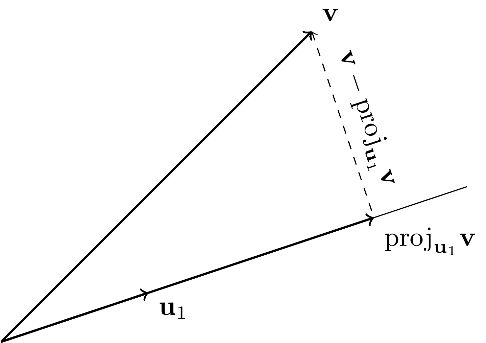
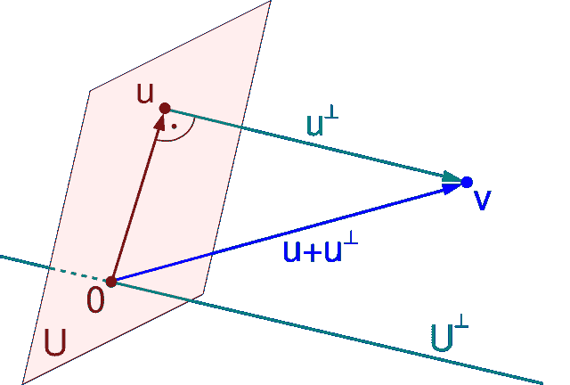

# 2.3\. 最小二乘法的几何学：正交投影

> 原文：[`mmids-textbook.github.io/chap02_ls/03_orthog/roch-mmids-ls-orthog.html`](https://mmids-textbook.github.io/chap02_ls/03_orthog/roch-mmids-ls-orthog.html)

我们考虑以下问题：我们给定 \(A \in \mathbb{R}^{n\times m}\) 一个 \(n\times m\) 的矩阵和 \(\mathbf{b} \in \mathbb{R}^n\) 一个向量。我们试图求解系统 \(A \mathbf{x} \approx \mathbf{b}\)。在 \(A\) 可逆的特殊情况下，存在一个唯一的精确解。然而，在一般情况下，解可能不存在或可能不是唯一的。我们专注于前者通常发生的情况，即过定的情况。我们首先回顾正交性的概念。

## 2.3.1\. 一个关键概念：正交性#

正交性由于其计算特性和与最小二乘问题的联系，在线性代数中在数据科学中扮演着关键角色。

**定义** **(正交性)** \(\idx{正交性}\xdi\) 在 \(\mathbb{R}^n\) 中（作为列向量）的向量 \(\mathbf{u}\) 和 \(\mathbf{v}\) 是正交的，如果它们的内积为零

$$ \langle \mathbf{u}, \mathbf{v} \rangle =\mathbf{u}^T \mathbf{v} = \sum_{i=1}^n u_i v_i = 0. $$

\(\natural\)

正交性有重要的含义。以下经典结果将在下面有用。在整个过程中，我们使用 \(\|\mathbf{u}\|\) 表示 \(\mathbf{u}\) 的欧几里得范数。

**定理** **(毕达哥拉斯)** \(\idx{毕达哥拉斯定理}\xdi\) 设 \(\mathbf{u}, \mathbf{v} \in \mathbb{R}^n\) 是正交的。那么 \(\|\mathbf{u} + \mathbf{v}\|² = \|\mathbf{u}\|² + \|\mathbf{v}\|²\). \(\sharp\)

**证明：** 使用 \(\|\mathbf{w}\|² = \langle \mathbf{w}, \mathbf{w}\rangle\)，我们得到

$$\begin{align*} \|\mathbf{u} + \mathbf{v}\|² &= \langle \mathbf{u} + \mathbf{v}, \mathbf{u} + \mathbf{v}\rangle\\ &= \langle \mathbf{u}, \mathbf{u}\rangle + 2 \,\langle \mathbf{u}, \mathbf{v}\rangle + \langle \mathbf{v}, \mathbf{v}\rangle\\ &= \|\mathbf{u}\|² + \|\mathbf{v}\|². \end{align*}$$

\(\square\)

**毕达哥拉斯定理**的应用是**柯西-施瓦茨不等式**的证明。

**证明：** *(柯西-施瓦茨)* \(\idx{柯西-施瓦茨不等式}\xdi\) 设 \(\mathbf{q} = \frac{\mathbf{v}}{\|\mathbf{v}\|}\) 为 \(\mathbf{v}\) 方向上的单位向量。我们要证明 \(|\langle \mathbf{u}, \mathbf{q}\rangle| \leq \|\mathbf{u}\|\)。如下分解 \(\mathbf{u}\)：

$$ \mathbf{u} = \left\langle \mathbf{u}, \mathbf{q}\right\rangle \mathbf{q} + \left\{\mathbf{u} - \left\langle \mathbf{u}, \mathbf{q}\right\rangle \mathbf{q}\right\}. $$

右侧的两个项是正交的：

$$ \left\langle \left\langle \mathbf{u}, \mathbf{q}\right\rangle \mathbf{q}, \mathbf{u} - \left\langle \mathbf{u}, \mathbf{q}\right\rangle \mathbf{q} \right\rangle = \left\langle \mathbf{u}, \mathbf{q}\right\rangle² - \left\langle \mathbf{u}, \mathbf{q}\right\rangle² \left\langle \mathbf{q}, \mathbf{q}\right\rangle = 0. $$

因此，**毕达哥拉斯**给出

$$ \|\mathbf{u}\|² = \left\|\left\langle \mathbf{u}, \mathbf{q}\right\rangle \mathbf{q}\right\|² + \left\|\mathbf{u} - \left\langle \mathbf{u}, \mathbf{q}\right\rangle \mathbf{q}\right\|² \geq \left\|\left\langle \mathbf{u}, \mathbf{q}\right\rangle \mathbf{q}\right\|² = \left\langle \mathbf{u}, \mathbf{q}\right\rangle². $$

开平方得到结论。\(\square\)

**正交基展开** 为了开始看到正交性的力量，考虑以下内容。向量列表\(\{\mathbf{u}_1,\ldots,\mathbf{u}_m\}\)是一个正交列表，如果\(\mathbf{u}_i\)是成对正交的，并且每个向量的范数为 1，即对于所有\(i\)和所有\(j \neq i\)，我们有\(\|\mathbf{u}_i\| = 1\)和\(\langle \mathbf{u}_i, \mathbf{u}_j \rangle = 0\)。或者，

$$\begin{split} \langle \mathbf{u}_i, \mathbf{u}_j \rangle = \begin{cases} 1 & \text{如果 } i=j\\ 0 & \text{如果 } i\neq j. \end{cases} \end{split}$$

**引理** **(正交列表的性质)** \(\idx{正交列表的性质}\xdi\) 设\(\{\mathbf{u}_1,\ldots,\mathbf{u}_m\}\)是一个正交列表。那么：

1.  对于任何\(\alpha_j \in \mathbb{R}\)，\(j=1,\ldots,m\)，我们有

$$ \left\|\sum_{j=1}^m \alpha_j \mathbf{u}_j\right\|² = \sum_{j=1}^m \alpha_j², $$

1.  向量\(\{\mathbf{u}_1,\ldots,\mathbf{u}_m\}\)是线性无关的。

\(\flat\)

*证明:* 对于 1，利用\(\|\mathbf{x}\|² = \langle \mathbf{x}, \mathbf{x} \rangle\)，我们有

$$\begin{align*} \left\|\sum_{j=1}^m \alpha_j \mathbf{u}_j\right\|² &= \left\langle \sum_{i=1}^m \alpha_i \mathbf{u}_i, \sum_{j=1}^m \alpha_j \mathbf{u}_j \right\rangle\\ &= \sum_{i=1}^m \alpha_i \left\langle \mathbf{u}_i, \sum_{j=1}^m \alpha_j \mathbf{u}_j \right\rangle\\ &= \sum_{i=1}^m \sum_{j=1}^m \alpha_i \alpha_j \left\langle \mathbf{u}_i, \mathbf{u}_j \right\rangle\\ &= \sum_{i=1}^m \alpha_i² \end{align*}$$

其中我们在最后一个等式中使用了正交性，即\(\langle \mathbf{u}_i, \mathbf{u}_j \rangle\)在\(i=j\)时为 1，否则为 0。

对于 2，假设\(\sum_{i=1}^m \beta_i \mathbf{u}_i = \mathbf{0}\)，那么根据 1，我们必须有\(\sum_{i=1}^m \beta_i² = 0\)。这意味着对于所有\(i\)，\(\beta_i = 0\)。因此，\(\mathbf{u}_i\)是线性无关的。\(\square\)

给定\(U\)的一个基\(\{\mathbf{u}_1,\ldots,\mathbf{u}_m\}\)，我们知道：对于\(U\)中的任何\(\mathbf{w}\)，\(\mathbf{w} = \sum_{i=1}^m \alpha_i \mathbf{u}_i\)，其中存在一些\(\alpha_i\)。在一般情况下，如何找到\(\alpha_i\)并不明显——必须解一个线性方程组。然而，在正交的情况下，有一个公式。我们说基\(\{\mathbf{u}_1,\ldots,\mathbf{u}_m\}\)是正交的，如果它形成一个正交列表。

**定理** **(正交展开定理)** \(\idx{正交展开定理}\xdi\) 设\(\mathbf{q}_1,\ldots,\mathbf{q}_m\)是\(U\)的一个正交基，并且设\(\mathbf{w} \in U\)。那么

$$ \mathbf{w} = \sum_{j=1}^m \langle \mathbf{w}, \mathbf{q}_j\rangle \,\mathbf{q}_j. $$

\(\sharp\)

*证明:* 因为 \(\mathbf{w} \in U\)，\(\mathbf{w} = \sum_{i=1}^m \alpha_i \mathbf{q}_i\) 对于某些 \(\alpha_i\)。与 \(\mathbf{q}_j\) 取内积并使用正交性：

$$ \langle \mathbf{w}, \mathbf{q}_j\rangle = \left\langle \sum_{i=1}^m \alpha_i \mathbf{q}_i, \mathbf{q}_j\right\rangle = \sum_{i=1}^m \alpha_i \langle \mathbf{q}_i, \mathbf{q}_j\rangle = \alpha_j. $$

因此，我们已经确定了 \(\mathbf{w}\) 的基展开中的所有 \(\alpha_j\)。 \(\square\)

**EXAMPLE:** 考虑再次线性子空间 \(W = \mathrm{span}(\mathbf{w}_1,\mathbf{w}_2,\mathbf{w}_3)\)，其中 \(\mathbf{w}_1 = (1,0,1)\)，\(\mathbf{w}_2 = (0,1,1)\)，和 \(\mathbf{w}_3 = (1,-1,0)\)。我们已经证明实际上

$$ \mathrm{span}(\mathbf{w}_1,\mathbf{w}_2,\mathbf{w}_3) = \mathrm{span}(\mathbf{w}_1,\mathbf{w}_2), $$

因为 \(\mathbf{w}_1,\mathbf{w}_2\) 形成 \(W\) 的一个基。另一方面，

$$ \langle\mathbf{w}_1,\mathbf{w}_2\rangle = (1)(0) + (0)(1) + (1)(1) = 0 + 0 + 1 = 1 \neq 0 $$

因此这个基不是正交归一的。实际上，一个正交归一的列表必然是一个独立的列表，但反之不一定成立。

为了生成 \(W\) 的一个正交归一基，我们首先可以通过标准化 \(\mathbf{w}_1\)

$$ \mathbf{q}_1 = \frac{\mathbf{w}_1}{\|\mathbf{w}_1\|} = \frac{\mathbf{w}_1}{\sqrt{1² + 0² + 1²}} = \frac{1}{\sqrt{2}} \mathbf{w}_1. $$

然后 \(\|\mathbf{q}_1\| = 1\)，因为，一般来说，由范数的绝对齐次性

$$ \left\|\frac{\mathbf{w}_1}{\|\mathbf{w}_1\|}\right\| = \frac{1}{\|\mathbf{w}_1\|} \|\mathbf{w}_1\| = 1. $$

我们接下来寻求第二个基向量。在这种情况下，它必须满足两个条件：

+   它必须具有单位范数并且与 \(\mathbf{q}_1\) 正交；并且

+   \(\mathbf{w}_2\) 必须是 \(\mathbf{q}_1\) 和 \(\mathbf{q}_2\) 的线性组合。

后者条件保证了 \(\mathrm{span}(\mathbf{q}_1,\mathbf{q}_2) = \mathrm{span}(\mathbf{w}_1,\mathbf{w}_2)\)。（形式上，这只会意味着 \(\mathrm{span}(\mathbf{w}_1,\mathbf{w}_2) \subseteq \mathrm{span}(\mathbf{q}_1,\mathbf{q}_2)\)。在这种情况下，很容易看出包含关系也必须相反。为什么？）

第一个条件转化为

$$ 1 = \|\mathbf{q}_2\|² = q_{21}² + q_{22}² + q_{23}², $$

其中 \(\mathbf{q}_2 = (q_{21}, q_{22}, q_{23})\)，并且

$$ 0 = \langle\mathbf{q}_1, \mathbf{q}_2\rangle = \frac{1}{\sqrt{2}}\left[1\cdot q_{21} + 0 \cdot q_{22} + 1 \cdot q_{23}\right] = \frac{1}{\sqrt{2}}\left[q_{21} + q_{23}\right]. $$

即，简化第二个显示并代入第一个，\(q_{23} = -q_{21}\) 和 \(q_{22} = \sqrt{1 - 2 q_{21}²}\)。

第二个条件转化为：存在 \(\beta_1, \beta_2 \in \mathbb{R}\) 使得

$$\begin{split} \mathbf{w}_2 = \begin{pmatrix} 0 \\ 1 \\ 1 \end{pmatrix} = \beta_1 \mathbf{q}_1 + \beta_2 \mathbf{q}_2 = \beta_1 \frac{1}{\sqrt{2}} \begin{pmatrix} 1 \\ 0 \\ 1 \end{pmatrix} + \beta_2 \begin{pmatrix} q_{21} \\ \sqrt{1-2 q_{21}²} \\ -q_{21} \end{pmatrix}. \end{split}$$

第一项给出 \(\beta_1/\sqrt{2} + \beta_2 q_{21} = 0\)，而第三项给出 \(\beta_1/\sqrt{2} - \beta_2 q_{21} = 1\)。将方程相加得到 \(\beta_1 = 1/\sqrt{2}\)。将这个值代入第一个方程中得到 \(\beta_2 = -1/(2q_{21})\)。回到 \(\mathbf{w}_2\) 的方程，从第二个方程中得到

$$ 1 = - \frac{1}{2 q_{21}} \sqrt{1 - 2 q_{21}²}. $$

通过重新排列并取平方，我们希望得到负解。

$$ 4 q_{21}² = 1 - 2 q_{21}², $$

即，\(q_{21} = - 1/\sqrt{6}\)。最后，我们得到 \(q_{23} = - q_{21} = 1/\sqrt{6}\) 和 \(q_{22} = \sqrt{1 - 2 q_{21}²} = \sqrt{1 - 1/3} = \sqrt{2/3} = 2/\sqrt{6}\)。

总结一下，我们有

$$\begin{split} \mathbf{q}_1 = \frac{1}{\sqrt{2}} \begin{pmatrix} 1\\ 0\\ 1 \end{pmatrix}, \quad \mathbf{q}_2 = \frac{1}{\sqrt{6}} \begin{pmatrix} -1\\ 2\\ 1 \end{pmatrix}. \end{split}$$

我们确认

$$ \langle \mathbf{q}_1, \mathbf{q}_2\rangle = \frac{1}{\sqrt{2}\sqrt{6}}[(1)(-1) + (0)(2) + (1)(1)] = 0 $$

和

$$ \|\mathbf{q}_2\|² = \left(-\frac{1}{\sqrt{6}}\right)² + \left(\frac{2}{\sqrt{6}}\right)² + \left(\frac{1}{\sqrt{6}}\right)² = \frac{1}{6} + \frac{4}{6} + \frac{1}{6} = 1. $$

我们可以使用 *正交展开定理* 将 \(\mathbf{w}_2\) 写成 \(\mathbf{q}_1\) 和 \(\mathbf{q}_2\) 的线性组合。内积是

$$ \langle \mathbf{w}_2, \mathbf{q}_1 \rangle = 0 \left(\frac{1}{\sqrt{2}}\right) + 1 \left(\frac{0}{\sqrt{2}}\right) + 1 \left(\frac{1}{\sqrt{2}}\right) = \frac{1}{\sqrt{2}}, $$$$ \langle \mathbf{w}_2, \mathbf{q}_2 \rangle = 0 \left(-\frac{1}{\sqrt{6}}\right) + 1 \left(\frac{2}{\sqrt{6}}\right) + 1 \left(\frac{1}{\sqrt{6}}\right) = \frac{3}{\sqrt{6}}. $$

所以

$$ \mathbf{w}_2 = \frac{1}{\sqrt{2}} \mathbf{q}_1 + \frac{3}{\sqrt{6}} \mathbf{q}_2. $$

检查它！尝试 \(\mathbf{w}_3\)。 \(\lhd\)

**Gram-Schmidt** 我们已经证明，使用正交归一基是可取的。如果我们没有这样的基怎么办？我们可以尝试手动构造一个，就像我们在前面的例子中所做的那样。但是，还有更好的方法。我们将在下一节中回顾 [Gram-Schmidt 算法](https://en.wikipedia.org/wiki/Gram%E2%80%93Schmidt_process)，这将意味着每个线性子空间都有一个正交归一基。也就是说，我们将证明以下定理。

**定理** **(Gram-Schmidt)** \(\idx{Gram-Schmidt 定理}\xdi\) 设 \(\mathbf{a}_1,\ldots,\mathbf{a}_m\) 是线性无关的。那么存在一个 \(\mathrm{span}(\mathbf{a}_1,\ldots,\mathbf{a}_m)\) 的正交归一基 \(\mathbf{q}_1,\ldots,\mathbf{q}_m\)。 \(\sharp\)

但是，首先，我们需要定义正交投影，这将在我们的应用中扮演关键角色。这将在下面进行。

## 2.3.2\. 正交投影#

为了解决超定情况，即当 \(n > m\) 时，我们首先考虑以下更一般的问题。我们有一个线性子空间 \(U \subseteq \mathbb{R}^n\) 和一个不在 \(U\) 中的向量 \(\mathbf{v}\)。我们想要找到 \(U\) 中与 \(\mathbf{v}\) 在欧几里得范数下最近的向量 \(\mathbf{p}\)，也就是说，我们想要解决

$$ \min_{\mathbf{p} \in U} \|\mathbf{p} - \mathbf{v}\|. $$

**示例：** 考虑二维情况，有一个一维子空间，比如 \(U = \mathrm{span}(\mathbf{u}_1)\)，其中 \(\|\mathbf{u}_1\|=1\)。几何直观如下面的图中所示。解 \(\mathbf{p} = \mathbf{v}^*\) 具有这样的性质，即 \(\mathbf{v} - \mathbf{v}^*\) 与 \(\mathbf{u}_1\) 形成直角，也就是说，它与 \(\mathbf{u}_1\) 正交。



令 \(\mathbf{v}^* = \alpha^* \,\mathbf{u}_1\)，上述几何条件转化为

$$ 0 = \langle \mathbf{u}_1, \mathbf{v} - \mathbf{v}^* \rangle = \langle \mathbf{u}_1, \mathbf{v} - \alpha^* \,\mathbf{u}_1 \rangle = \langle \mathbf{u}_1, \mathbf{v} \rangle - \alpha^* \,\langle \mathbf{u}_1, \mathbf{u}_1 \rangle = \langle \mathbf{u}_1, \mathbf{v} \rangle - \alpha^* $$

所以

$$ \mathbf{v}^* = \langle \mathbf{u}_1, \mathbf{v} \rangle \,\mathbf{u}_1. $$

通过 **毕达哥拉斯定理**，我们得到对于任何 \(\alpha \in \mathbb{R}\)

$$\begin{align*} \|\mathbf{v} - \alpha \,\mathbf{u}_1\|² &= \|\mathbf{v}- \mathbf{v}^* + \mathbf{v}^* - \alpha \,\mathbf{u}_1\|²\\ &= \|\mathbf{v}- \mathbf{v}^* + (\alpha^* - \alpha) \,\mathbf{u}_1\|²\\ &= \|\mathbf{v}- \mathbf{v}^*\|² + \| (\alpha^* - \alpha) \,\mathbf{u}_1\|²\\ &\geq \|\mathbf{v}- \mathbf{v}^*\|², \end{align*}$$

其中我们在第三行使用了 \(\mathbf{v} - \mathbf{v}^*\) 与 \(\mathbf{u}_1\) 正交（因此与 \((\alpha^* - \alpha) \mathbf{u}_1\) 正交）。

这证实了 \(\mathbf{v}^*\) 的最优性。这个例子中的论证在更高维的情况下也适用，我们将在下面展示。 \(\lhd\)

**定义** **（正交投影到正交列表）** \(\idx{正交投影到正交列表}\xdi\) 设 \(\mathbf{q}_1,\ldots,\mathbf{q}_m\) 为一个正交列表。向量 \(\mathbf{v} \in \mathbb{R}^n\) 在 \(\{\mathbf{q}_i\}_{i=1}^m\) 上的正交投影定义为

$$ \mathrm{proj}_{\{\mathbf{q}_i\}_{i=1}^m} \mathbf{v} = \sum_{j=1}^m \langle \mathbf{v}, \mathbf{q}_j \rangle \,\mathbf{q}_j. $$

\(\natural\)

**定理** **（正交投影）** \(\idx{正交投影定理}\xdi\) 设 \(U \subseteq V\) 为一个线性子空间，且 \(\mathbf{v} \in \mathbb{R}^n\)。那么：

a) 存在唯一解 \(\mathbf{p}^*\) 满足

$$ \min_{\mathbf{p} \in U} \|\mathbf{p} - \mathbf{v}\|. $$

我们将其表示为 \(\mathbf{p}^* = \mathrm{proj}_U \mathbf{v}\) 并将其称为 \(\mathbf{v}\) 在 \(U\) 上的正交投影。

b) 解 \(\mathbf{p}^* \in U\) 在几何上由

$$ (*) \qquad \left\langle \mathbf{v} - \mathbf{p}^*, \mathbf{u}\right\rangle =0, \quad \forall \mathbf{u} \in U. $$

c) 对于 \(U\) 的任意正交基 \(\mathbf{q}_1,\ldots,\mathbf{q}_m\),

$$ \mathrm{proj}_U \mathbf{v} = \mathrm{proj}_{\{\mathbf{q}_i\}_{i=1}^m} \mathbf{v}. $$

\(\sharp\)

*证明:* 设 \(\mathbf{p}^*\) 是 \(U\) 中满足 \((*)\) 的任意向量。我们首先证明它必然满足

$$ (**) \qquad \|\mathbf{p}^* - \mathbf{v}\| \leq \|\mathbf{p} - \mathbf{v}\|, \quad \forall \mathbf{p} \in U. $$

注意到对于任意 \(\mathbf{p} \in U\)，向量 \(\mathbf{u} = \mathbf{p} - \mathbf{p}^*\) 也在 \(U\) 中。因此，根据 \((*)\) 和 *毕达哥拉斯*，

$$\begin{align*} \|\mathbf{p} - \mathbf{v}\|² &= \|\mathbf{p} - \mathbf{p}^* + \mathbf{p}^* - \mathbf{v}\|²\\ &= \|\mathbf{p} - \mathbf{p}^*\|² + \|\mathbf{p}^* - \mathbf{v}\|²\\ &\geq \|\mathbf{p}^* - \mathbf{v}\|². \end{align*}$$

此外，等号成立仅当 \(\|\mathbf{p} - \mathbf{p}^*\|² = 0\)，这仅在 \(\mathbf{p} = \mathbf{p}^*\) 时成立，这是由欧几里得范数的点分离性质决定的。因此，如果这样的向量 \(\mathbf{p}^*\) 存在，它是唯一的。

接下来，我们证明任何最小化值必须满足 \((*)\)。设 \(\mathbf{p}^*\) 是一个最小化值，假设，为了矛盾，\((*)\) 不成立。那么存在 \(\mathbf{u} \in U\)，使得 \(\langle \mathbf{v} - \mathbf{p}^*, \mathbf{u} \rangle = c \neq 0\)。考虑 \(\mathbf{p}_t = \mathbf{p}^* + t\mathbf{u}\) 对于小的 \(t\)。那么：

$$\begin{align*} \|\mathbf{p}_t - \mathbf{v}\|² &= \|(\mathbf{p}^* - \mathbf{v}) + t\mathbf{u}\|²\\ &= \|\mathbf{p}^* - \mathbf{v}\|² + 2t\langle \mathbf{v} - \mathbf{p}^*, \mathbf{u} \rangle + t²\|\mathbf{u}\|²\\ &= \|\mathbf{p}^* - \mathbf{v}\|² + 2tc + t²\|\mathbf{u}\|². \end{align*}$$

对于小的 \(t\) 和适当的符号，这将小于 \(\|\mathbf{p}^* - \mathbf{v}\|²\)，与最小性矛盾。

剩下的工作是要证明 \(U\) 中至少存在一个向量满足 \((*)\)。根据 *Gram-Schmidt 定理*，线性子空间 \(U\) 有一个正交基 \(\mathbf{q}_1,\ldots,\mathbf{q}_m\)。根据定义，\(\mathrm{proj}_{\{\mathbf{q}_i\}_{i=1}^m} \mathbf{v} \in \mathrm{span}(\{\mathbf{q}_i\}_{i=1}^m) = U\)。我们证明 \(\mathrm{proj}_{\{\mathbf{q}_i\}_{i=1}^m} \mathbf{v}\) 满足 \((*)\)。我们可以将 \(U\) 中的任意向量 \(\mathbf{u}\) 写成 \(\sum_{i=1}^m \alpha_i \mathbf{q}_i\)，其中 \(\alpha_i = \langle \mathbf{u}, \mathbf{q}_i \rangle\)。因此，使用这种表示法，我们得到

$$\begin{align*} \left\langle \mathbf{v} - \sum_{j=1}^m \langle \mathbf{v}, \mathbf{q}_j \rangle \,\mathbf{q}_j, \sum_{i=1}^m \alpha_i \mathbf{q}_i \right\rangle &= \sum_{i=1}^m \langle \mathbf{v}, \mathbf{q}_i \rangle \,\alpha_i - \sum_{j=1}^m \sum_{i=1}^m \alpha_i \langle \mathbf{v}, \mathbf{q}_j \rangle \langle \mathbf{q}_j, \mathbf{q}_i \rangle\\ &= \sum_{i=1}^m \langle \mathbf{v}, \mathbf{q}_i \rangle \,\alpha_i - \sum_{j=1}^m \alpha_j \langle \mathbf{v}, \mathbf{q}_j \rangle\\ &= 0, \end{align*}$$

其中我们在第二行使用了 \(\mathbf{q}_j\) 的正交性。\(\square\)

**示例：** **（继续）** 再次考虑线性子空间 \(W = \mathrm{span}(\mathbf{w}_1,\mathbf{w}_2,\mathbf{w}_3)\)，其中 \(\mathbf{w}_1 = (1,0,1)\)，\(\mathbf{w}_2 = (0,1,1)\)，和 \(\mathbf{w}_3 = (1,-1,0)\)。我们已经证明

$$\begin{split} \mathbf{q}_1 = \frac{1}{\sqrt{2}} \begin{pmatrix} 1\\ 0\\ 1 \end{pmatrix}, \quad \mathbf{q}_2 = \frac{1}{\sqrt{6}} \begin{pmatrix} -1\\ 2\\ 1 \end{pmatrix}, \end{split}$$

是一个正交基。设 \(\mathbf{w}_4 = (0,0,2)\)。显然，\(\mathbf{w}_4 \notin \mathrm{span}(\mathbf{w}_1,\mathbf{w}_2)\)，因为该生成空间中的向量形式为 \((x,y,x+y)\)，其中 \(x,y \in \mathbb{R}\)。

然而，我们可以计算 \(\mathbf{w}_4\) 在 \(W\) 上的正交投影。内积为

$$ \langle \mathbf{w}_4, \mathbf{q}_1 \rangle = 0 \left(\frac{1}{\sqrt{2}}\right) + 0 \left(\frac{0}{\sqrt{2}}\right) + 2 \left(\frac{1}{\sqrt{2}}\right) = \frac{2}{\sqrt{2}}, $$$$ \langle \mathbf{w}_4, \mathbf{q}_2 \rangle = 0 \left(-\frac{1}{\sqrt{6}}\right) + 0 \left(\frac{2}{\sqrt{6}}\right) + 2 \left(\frac{1}{\sqrt{6}}\right) = \frac{2}{\sqrt{6}}. $$

因此

$$\begin{split} \mathrm{proj}_W \mathbf{w}_4 = \frac{2}{\sqrt{2}} \mathbf{q}_1 + \frac{2}{\sqrt{6}} \mathbf{q}_2 = \begin{pmatrix} 2/3\\ 2/3\\ 4/3 \end{pmatrix}. \end{split}$$

作为合理性检查，请注意，\(\mathbf{w}_4 \in W\)，因为它的第三个分量等于前两个分量的和。\(\lhd\)

映射 \(\mathrm{proj}_U\) 是线性的，即对于所有 \(\alpha \in \mathbb{R}\) 和 \(\mathbf{x}, \mathbf{y} \in \mathbb{R}^n\)，有 \(\mathrm{proj}_U (\alpha \,\mathbf{x} + \mathbf{y}) = \alpha \,\mathrm{proj}_U \mathbf{x} + \mathrm{proj}_U\mathbf{y}\)。实际上，

$$\begin{align*} \mathrm{proj}_U(\alpha \,\mathbf{x} + \mathbf{y}) &= \sum_{j=1}^m \langle \alpha \,\mathbf{x} + \mathbf{y}, \mathbf{q}_j \rangle \,\mathbf{q}_j\\ &= \sum_{j=1}^m \left\{\alpha \, \langle \mathbf{x}, \mathbf{q}_j \rangle + \langle \mathbf{y}, \mathbf{q}_j \rangle\right\} \mathbf{q}_j\\ &= \alpha \,\mathrm{proj}_U \mathbf{x} + \mathrm{proj}_U \mathbf{y}. \end{align*}$$

任何从 \(\mathbb{R}^n\) 到 \(\mathbb{R}^n\) 的线性映射都可以编码为一个 \(n \times n\) 的矩阵 \(P\)。

设

$$\begin{split} Q = \begin{pmatrix} | & & | \\ \mathbf{q}_1 & \ldots & \mathbf{q}_m \\ | & & | \end{pmatrix} \end{split}$$

并注意计算

$$\begin{split} Q^T \mathbf{v} = \begin{pmatrix} \langle \mathbf{v}, \mathbf{q}_1 \rangle \\ \cdots \\ \langle \mathbf{v}, \mathbf{q}_m \rangle \end{pmatrix} \end{split}$$

列出了 \(\mathrm{proj}_U \mathbf{v}\) 在基 \(\mathbf{q}_1,\ldots,\mathbf{q}_m\) 上的展开中的系数。

因此，我们看到

$$ P = Q Q^T. $$

事实上，对于任何向量 \(\mathbf{v}\),

$$ P \mathbf{v} = Q Q^T \mathbf{v} = Q [Q^T \mathbf{v}]. $$

因此，输出是 \(Q\) 的列（即 \(\mathbf{q}_i\)）的线性组合，其中系数是方括号中向量的元素 \(Q^T \mathbf{v}\)。

**示例：** **（续）** 再次考虑线性子空间 \(W = \mathrm{span}(\mathbf{w}_1,\mathbf{w}_2,\mathbf{w}_3)\)，其中 \(\mathbf{w}_1 = (1,0,1)\)，\(\mathbf{w}_2 = (0,1,1)\)，和 \(\mathbf{w}_3 = (1,-1,0)\)，具有正交归一基

$$\begin{split} \mathbf{q}_1 = \frac{1}{\sqrt{2}} \begin{pmatrix} 1\\ 0\\ 1 \end{pmatrix}, \quad \mathbf{q}_2 = \frac{1}{\sqrt{6}} \begin{pmatrix} -1\\ 2\\ 1 \end{pmatrix}. \end{split}$$

然后，\(W\) 上的正交投影可以写成以下矩阵形式。矩阵 \(Q\) 是

$$\begin{split} Q = \begin{pmatrix} 1/\sqrt{2} & -1/\sqrt{6}\\ 0 & 2/\sqrt{6}\\ 1/\sqrt{2} & 1/\sqrt{6} \end{pmatrix}. \end{split}$$

然后

$$\begin{align*} Q Q^T &= \begin{pmatrix} 1/\sqrt{2} & -1/\sqrt{6}\\ 0 & 2/\sqrt{6}\\ 1/\sqrt{2} & 1/\sqrt{6} \end{pmatrix} \begin{pmatrix} 1/\sqrt{2} & 0 & 1/\sqrt{2}\\ -1/\sqrt{6} & 2/\sqrt{6} & 1/\sqrt{6} \end{pmatrix}\\ &= \begin{pmatrix} 2/3 & -1/3 & 1/3\\ -1/3 & 2/3 & 1/3\\ 1/3 & 1/3 & 2/3 \end{pmatrix}. \end{align*}$$

因此，向量 \(\mathbf{w}_4 = (0,0,2)\) 的投影是

$$\begin{split} \begin{pmatrix} 2/3 & -1/3 & 1/3\\ -1/3 & 2/3 & 1/3\\ 1/3 & 1/3 & 2/3 \end{pmatrix} \begin{pmatrix} 0\\ 0\\ 2 \end{pmatrix} = \begin{pmatrix} 2/3\\ 2/3\\ 4/3 \end{pmatrix}, \end{split}$$

如前所述。 \(\lhd\)

矩阵 \(P= Q Q^T\) 不应与

$$\begin{split} Q^T Q = \begin{pmatrix} \langle \mathbf{q}_1, \mathbf{q}_1 \rangle & \cdots & \langle \mathbf{q}_1, \mathbf{q}_m \rangle \\ \langle \mathbf{q}_2, \mathbf{q}_1 \rangle & \cdots & \langle \mathbf{q}_2, \mathbf{q}_m \rangle \\ \vdots & \ddots & \vdots \\ \langle \mathbf{q}_m, \mathbf{q}_1 \rangle & \cdots & \langle \mathbf{q}_m, \mathbf{q}_m \rangle \end{pmatrix} = I_{m \times m} \end{split}$$

其中 \(I_{m \times m}\) 表示 \(m \times m\) 的单位矩阵。这源于 \(\mathbf{q}_i\) 是正交归一的事实。

**示例：** 设 \(\mathbf{q}_1,\ldots,\mathbf{q}_n\) 是 \(\mathbb{R}^n\) 的一个正交归一基，并形成矩阵

$$\begin{split} Q = \begin{pmatrix} | & & | \\ \mathbf{q}_1 & \ldots & \mathbf{q}_n \\ | & & | \end{pmatrix}. \end{split}$$

我们证明了 \(Q^{-1} = Q^T\).

我们刚才指出的是

$$\begin{split} Q^T Q = \begin{pmatrix} \langle \mathbf{q}_1, \mathbf{q}_1 \rangle & \cdots & \langle \mathbf{q}_1, \mathbf{q}_n \rangle \\ \langle \mathbf{q}_2, \mathbf{q}_1 \rangle & \cdots & \langle \mathbf{q}_2, \mathbf{q}_n \rangle \\ \vdots & \ddots & \vdots \\ \langle \mathbf{q}_n, \mathbf{q}_1 \rangle & \cdots & \langle \mathbf{q}_n, \mathbf{q}_n \rangle \end{pmatrix} = I_{n \times n} \end{split}$$

其中 \(I_{n \times n}\) 表示 \(n \times n\) 的单位矩阵。

在另一个方向上，我们声称 \(Q Q^T = I_{n \times n}\) 也成立。实际上，矩阵 \(Q Q^T\) 是 \(\mathbf{q}_i\) 的张成的正交投影，即 \(\mathbb{R}^n\)。根据 *正交投影定理*，正交投影 \(Q Q^T \mathbf{v}\) 找到 \(\mathbf{v}\) 在 \(\mathbf{q}_i\) 的张成中的最近向量。但是这个张成包含所有向量，包括 \(\mathbf{v}\)，因此我们必须有 \(Q Q^T \mathbf{v} = \mathbf{v}\)。由于这对所有 \(\mathbf{v} \in \mathbb{R}^n\) 都成立，矩阵 \(Q Q^T\) 是恒等映射，我们证明了这一说法。 \(\lhd\)

满足以下条件的矩阵

$$ Q^T Q = Q Q^T = I_{n \times n} $$

被称为正交矩阵。

**定义** **(正交矩阵)** \(\idx{orthogonal matrix}\xdi\) 如果一个方阵 \(Q \in \mathbb{R}^{m\times m}\) 满足 \(Q^T Q = Q Q^T = I_{m \times m}\)，则称其为正交矩阵。 \(\natural\)

**知识检查:** 设 \(\mathcal{Z}\) 为 \(\mathbb{R}^n\) 的一个线性子空间，设 \(\mathbf{v} \in \mathbb{R}^n\)。证明

$$ \|\mathrm{proj}_{\mathcal{Z}}\mathbf{v}\|_2 \leq \|\mathbf{v}\|_2. $$

[*提示:* 使用几何特征。] \(\checkmark\)

## 2.3.3\. 正交补#

在返回到超定系统之前，我们稍微偏离一下，推导出正交投影的一个后果，这个后果在以后会很有用。*正交投影定理*表明，任何 \(\mathbf{v} \in \mathbb{R}^n\) 都可以分解为其在 \(U\) 上的正交投影和一个与它正交的向量。

**定义** **(正交补)** \(\idx{orthogonal complement}\xdi\) 设 \(U \subseteq \mathbb{R}^n\) 为一个线性子空间。\(U\) 的正交补，记为 \(U^\perp\)，定义为

$$ U^\perp = \{\mathbf{w} \in \mathbb{R}^n\,:\, \langle \mathbf{w}, \mathbf{u}\rangle = 0, \forall \mathbf{u} \in U\}. $$

\(\natural\)

**示例:** 继续上一个例子，我们计算线性子空间 \(W = \mathrm{span}(\mathbf{w}_1,\mathbf{w}_2,\mathbf{w}_3)\) 的正交补，其中 \(\mathbf{w}_1 = (1,0,1)\)，\(\mathbf{w}_2 = (0,1,1)\)，和 \(\mathbf{w}_3 = (1,-1,0)\)。一种方法是找到所有与正交基

$$\begin{split} \mathbf{q}_1 = \frac{1}{\sqrt{2}} \begin{pmatrix} 1\\ 0\\ 1 \end{pmatrix}, \quad \mathbf{q}_2 = \frac{1}{\sqrt{6}} \begin{pmatrix} -1\\ 2\\ 1 \end{pmatrix}. \end{split}$$

我们需要

$$ 0 = \langle \mathbf{u}, \mathbf{q}_1 \rangle = u_1 \left(\frac{1}{\sqrt{2}}\right) + u_2 \left(\frac{0}{\sqrt{2}}\right) + u_3 \left(\frac{1}{\sqrt{2}}\right) = \frac{u_1 + u_3}{\sqrt{2}}, $$$$ 0= \langle \mathbf{u}, \mathbf{q}_2 \rangle = u_1 \left(-\frac{1}{\sqrt{6}}\right) + u_2 \left(\frac{2}{\sqrt{6}}\right) + u_3 \left(\frac{1}{\sqrt{6}}\right) = \frac{-u_1 + 2 u_2 + u_3}{\sqrt{6}}. $$

第一个方程意味着 \(u_3 = -u_1\)，将其代入第二个方程并重新排列后得到 \(u_2 = u_1\)。

因此，所有形式为 \((u_1,u_1,-u_1)\) 的向量，其中 \(u_1 \in \mathbb{R}\)，都与 \(W\) 正交。这是一个一维线性子空间。我们可以通过找到一个解来选择一个正交基

$$ 1 = (u_1)² + (u_1)² + (-u_1)² = 3 u_1², $$

取 \(u_1 = 1/\sqrt{3}\)，即

$$\begin{split} \mathbf{q}_3 = \frac{1}{\sqrt{3}} \begin{pmatrix} 1\\ 1\\ -1 \end{pmatrix}. \end{split}$$

然后，我们有

$$ W^\perp = \mathrm{span}(\mathbf{q}_3). $$

\(\lhd\)

**引理** **(正交分解)** \(\idx{orthogonal decomposition lemma}\xdi\) 设 \(U \subseteq \mathbb{R}^n\) 是一个线性子空间，且 \(\mathbf{v} \in \mathbb{R}^n\)。那么 \(\mathbf{v}\) 可以分解为 \(\mathrm{proj}_U \mathbf{v} + (\mathbf{v} - \mathrm{proj}_U\mathbf{v})\)，其中 \(\mathrm{proj}_U \mathbf{v} \in U\) 且 \((\mathbf{v} - \mathrm{proj}_U \mathbf{v}) \in U^\perp\)。此外，这种分解在以下意义上是唯一的：如果 \(\mathbf{v} = \mathbf{u} + \mathbf{u}^\perp\)，其中 \(\mathbf{u} \in U\) 且 \(\mathbf{u}^\perp \in U^\perp\)，则 \(\mathbf{u} = \mathrm{proj}_U \mathbf{v}\) 且 \(\mathbf{u}^\perp = \mathbf{v} - \mathrm{proj}_U \mathbf{v}\)。 \(\flat\)

*证明：* 第一部分是正交投影定理的直接结果。对于第二部分，假设 \(\mathbf{v} = \mathbf{u} + \mathbf{u}^\perp\)，其中 \(\mathbf{u} \in U\) 且 \(\mathbf{u}^\perp \in U^\perp\)。从 \(\mathbf{v} = \mathrm{proj}_U \mathbf{v} + (\mathbf{v} - \mathrm{proj}_U\mathbf{v})\) 中减去 \(\mathbf{v}\)，我们得到

$$ (*) \qquad \mathbf{0} = \mathbf{w}_1 + \mathbf{w}_2 $$

其中

$$ \mathbf{w}_1 = \mathbf{u} - \mathrm{proj}_U \mathbf{v} \in U, \qquad \mathbf{w}_2 = \mathbf{u}^\perp - (\mathbf{v} - \mathrm{proj}_U\mathbf{v}) \in U^\perp. $$

如果 \(\mathbf{w}_1 = \mathbf{w}_2 = \mathbf{0}\)，则已完成。否则，根据 \((*)\)，它们都必须是非零的。此外，根据正交归一列表的 *性质*，\(\mathbf{w}_1\) 和 \(\mathbf{w}_2\) 必须是线性无关的。但这与 \((*)\) 中的 \(\mathbf{w}_2 = - \mathbf{w}_1\) 的事实相矛盾。 \(\square\)

**图：** 正交分解 ([来源](https://commons.wikimedia.org/wiki/File:Orthogonal_Decomposition_qtl1.svg))



\(\bowtie\)

形式上，**正交分解引理**表明 \(\mathbb{R}^n\) 是任何线性子空间 \(U\) 和其正交补 \(U^\perp\) 的直和：也就是说，任何向量 \(\mathbf{v} \in \mathbb{R}^n\) 可以唯一地表示为 \(\mathbf{v} = \mathbf{u} + \mathbf{u}^\perp\)，其中 \(\mathbf{u} \in U\) 且 \(\mathbf{u}^\perp \in U^\perp\)。这表示为 \(\mathbb{R}^n = U \oplus U^\perp\)。

设 \(\mathbf{a}_1,\ldots,\mathbf{a}_\ell\) 是 \(U\) 的一个正交基，\(\mathbf{b}_1,\ldots,\mathbf{b}_k\) 是 \(U^\perp\) 的一个正交基。根据正交补的定义，该列表

$$ \mathcal{L} = \{\mathbf{a}_1,\ldots,\mathbf{a}_\ell, \mathbf{b}_1,\ldots,\mathbf{b}_k\} $$

是正交的，因此它形成了其张成的基。因为 \(\mathbb{R}^n\) 中的任何向量都可以写成 \(U\) 中的一个向量与 \(U^\perp\) 中的一个向量的和，所以整个 \(\mathbb{R}^n\) 都在 \(\mathcal{L}\) 的张成中。根据**维度定理**，\(n = \ell + k\)，即，

$$ \mathrm{dim}(U) + \mathrm{dim}(U^\perp) = n. $$

## 2.3.4\. 过定系统#

在本节中，我们讨论最小二乘问题。再次设 \(A \in \mathbb{R}^{n\times m}\) 是一个 \(n\times m\) 矩阵，其列线性无关，且 \(\mathbf{b} \in \mathbb{R}^n\) 是一个向量。我们正在求解以下系统

$$ A \mathbf{x} \approx \mathbf{b}. $$

如果 \(n=m\)，我们可以使用矩阵逆来求解该系统（当然，前提是 \(A\) 是非奇异的）。但我们感兴趣的是过定情况，即当 \(n > m\) 时：方程多于变量。那时我们不能使用矩阵逆。实际上，因为列没有张成整个 \(\mathbb{R}^n\)，存在一个向量 \(\mathbf{b} \in \mathbb{R}^n\) 不在 \(A\) 的列空间中。

使过定问题有意义的自然方法是将其视为[线性最小二乘问题](https://en.wikipedia.org/wiki/Least_squares)\(\idx{最小二乘问题}\xdi\)

$$ \min_{\mathbf{x} \in \mathbb{R}^m} \|A \mathbf{x} - \mathbf{b}\|². $$

用话来说，我们寻找在平方欧几里得范数下的最佳拟合解。等价地，写作

$$\begin{split} A = \begin{pmatrix} | & & | \\ \mathbf{a}_1 & \ldots & \mathbf{a}_m \\ | & & | \end{pmatrix} = \begin{pmatrix} a_{11} & \cdots & a_{1m} \\ a_{21} & \cdots & a_{2m} \\ \vdots & \ddots & \vdots \\ a_{n1} & \cdots & a_{nm} \end{pmatrix} \quad \text{和} \quad \mathbf{b} = \begin{pmatrix} b_1 \\ \vdots \\ b_n \end{pmatrix} \end{split}$$

我们寻求 \(A\) 的列的线性组合，以最小化目标

$$ \left\|\,\sum_{j=1}^m x_j \mathbf{a}_j - \mathbf{b}\,\right\|² = \sum_{i=1}^n \left( \sum_{j=1}^m a_{ij} x_j - b_i \right)². $$

当我们引入正交投影时，我们已经解决了一个与之密切相关的问题。我们将在下面明确建立这种联系。

**定理** **(正则方程)** \(\idx{normal equations}\xdi\) 设 \(A \in \mathbb{R}^{n\times m}\) 是一个 \(n\times m\) 矩阵，其中 \(n \geq m\)，并且设 \(\mathbf{b} \in \mathbb{R}^n\) 是一个向量。线性最小二乘问题的解 \(\mathbf{x}^*\)

$$ \min_{\mathbf{x} \in \mathbb{R}^m} \|A \mathbf{x} - \mathbf{b}\|² $$

满足正则方程

$$ A^T A \mathbf{x}^* = A^T \mathbf{b}. $$

如果 \(A\) 的列线性无关，那么存在唯一的解 \(\mathbf{x}^*\)。 \(\sharp\)

*证明思路*: 应用我们对 \(A\) 的列空间正交投影的描述。

*证明*: 设 \(U = \mathrm{col}(A) = \mathrm{span}(\mathbf{a}_1,\ldots,\mathbf{a}_m)\)。根据 *正交投影定理*，\(\mathbf{b}\) 在 \(U\) 上的正交投影 \(\mathbf{p}^* = \mathrm{proj}_{U} \mathbf{b}\) 是 \(U\) 中与 \(\mathbf{b}\) 最接近的唯一向量，即，

$$ \mathbf{p}^* = \arg\min_{\mathbf{p} \in U} \|\mathbf{p} - \mathbf{b}\| = \arg\min_{\mathbf{p} \in U} \|\mathbf{p} - \mathbf{b}\|², $$

其中我们使用了 *与不减函数组合引理* 来证明在最后一个表达式中取平方的合理性。因为 \(\mathbf{p}^*\) 在 \(U = \mathrm{col}(A)\) 中，所以它必须是形式 \(\mathbf{p}^* = A \mathbf{x}^*\)。这证明了 \(\mathbf{x}^*\) 是线性最小二乘问题中所述的解。根据 *正交投影定理*，它必须对所有 \(\mathbf{u} \in U\) 满足 \(\langle \mathbf{b} - A \mathbf{x}^*, \mathbf{u}\rangle = 0\)。因为列 \(\mathbf{a}_i\) 在 \(U\) 中，这意味着

$$ 0 = \langle \mathbf{b} - A \mathbf{x}^*, \mathbf{a}_i\rangle = \mathbf{a}_i^T (\mathbf{b} - A \mathbf{x}^*) ,\qquad \forall i\in [m]. $$

将这些方程堆叠起来，以矩阵形式给出

$$ A^T (\mathbf{b} - A\mathbf{x}^*) = \mathbf{0}, $$

如预期（重新排列后）。

重要观察：虽然我们已经通过 *正交投影定理* 证明了 \(\mathbf{p}^*\) 是唯一的，但 \(\mathbf{x}^*\)（即与 \(\mathbf{p}^*\) 对应的 \(A\) 的列的线性组合）是否唯一并不清楚。我们已经在先前的例子中看到，当 \(A\) 具有满列秩时，矩阵 \(A^T A\) 是可逆的。这暗示了唯一性的断言。 \(\square\)

**数值角**: 在 NumPy 中解决线性系统，请使用 `numpy.linalg.solve`（[numpy.linalg.solve](https://numpy.org/doc/stable/reference/generated/numpy.linalg.solve.html)）。例如，我们考虑超定系统

$$\begin{split} A = \begin{pmatrix} 1 & 0\\ 0 & 1\\ 1 & 1 \end{pmatrix} \quad \text{和} \quad \mathbf{b} = \begin{pmatrix} 0\\ 0\\ 2 \end{pmatrix}. \end{split}$$

我们使用 `numpy.ndarray.T`（[numpy.ndarray.T](https://numpy.org/doc/stable/reference/generated/numpy.ndarray.T.html)）进行转置，并使用 `@`（[numpy.matmul](https://numpy.org/doc/stable/reference/generated/numpy.matmul.html)）进行矩阵-矩阵或矩阵-向量乘积。

```py
w1 = np.array([1., 0., 1.])
w2 = np.array([0., 1., 1.])
A = np.stack((w1, w2),axis=-1)
b = np.array([0., 0., 2.])
x = LA.solve(A.T @ A, A.T @ b)
print(x) 
```

```py
[0.66666667 0.66666667] 
```

我们也可以直接在超定系统中使用 `numpy.linalg.lstsq`（https://numpy.org/doc/stable/reference/generated/numpy.linalg.lstsq.html）来计算最小二乘解。

```py
x = LA.lstsq(A, b)[0]
print(x) 
```

```py
[0.66666667 0.66666667] 
```

\(\unlhd\)

***自我评估测验*** *(在克劳德、双子座和 ChatGPT 的帮助下)*

**1** 设 \(\mathbf{q}_1, \dots, \mathbf{q}_m\) 是 \(\mathbb{R}^n\) 中的一组正交归一向量。以下哪个是向量 \(\mathbf{v} \in \mathbb{R}^n\) 在 \(\mathrm{span}(\mathbf{q}_1, \dots, \mathbf{q}_m)\) 上的正交投影？

a) \(\sum_{i=1}^m \mathbf{q}_i\)

b) \(\sum_{i=1}^m \langle \mathbf{v}, \mathbf{q}_i \rangle\)

c) \(\sum_{i=1}^m \langle \mathbf{v}, \mathbf{q}_i \rangle \mathbf{q}_i\)

d) \(\sum_{i=1}^m \langle \mathbf{q}_i, \mathbf{q}_i \rangle \mathbf{v}\)

**2** 根据正则方程定理，线性最小二乘问题的解 \(\bx^*\) 必须满足什么条件？

a) \(A^T A\bx^* = \bb\)

b) \(A^T A\bx^* = A^T \bb\)

c) \(A\bx^* = A^T \bb\)

d) \(A\bx^* = \bb\)

**3** 哪个性质描述了向量 \(\mathbf{v}\) 在子空间 \(U\) 上的正交投影 \(\mathrm{proj}_U \mathbf{v}\) 的特性？

a) \(\mathbf{v} - \mathrm{proj}_U \mathbf{v}\) 是 \(\mathbf{v}\) 的一个标量倍数。

b) \(\mathbf{v} - \mathrm{proj}_U \mathbf{v}\) 与 \(\mathbf{v}\) 正交。

c) \(\mathbf{v} - \mathrm{proj}_U \mathbf{v}\) 是与 \(U\) 正交的。

d) \(\mathrm{proj}_U \mathbf{v}\) 总是零向量。

**4** 从 \(A\) 的列空间的角度来看，线性最小二乘问题 \(A\mathbf{x} \approx \mathbf{b}\) 的解释是什么？

a) 寻找精确解 \(\mathbf{x}\)，使得 \(A\mathbf{x} = \mathbf{b}\)。

b) 寻找向量 \(\mathbf{x}\)，使得 \(A\) 的列向量的线性组合 \(A\mathbf{x}\) 在欧几里得范数下尽可能接近 \(\mathbf{b}\)。

c) 寻找 \(\mathbf{b}\) 在 \(A\) 的列空间上的正交投影。

d) 寻找 \(A\) 的列空间的正交补。

**5** 对于一个正交矩阵 \(Q\)，必须满足哪个矩阵方程？

a) \(Q Q^T = 0\).

b) \(Q Q^T = I\).

c) \(Q^T Q = 0\).

d) \(Q^T = Q\).

1 题的答案：c. 理由：这是文本中给出的正交投影到正交归一向量组的定义。

2 题的答案：b. 理由：正则方程定理指出，线性最小二乘问题的解 \(\bx^*\) 满足 \(A^T A\bx^* = A^T \bb\)。

3 题的答案：c. 理由：文本指出正交投影 \(\mathrm{proj}_U \mathbf{v}\) 具有性质“差 \(\mathbf{v} - \mathrm{proj}_U \mathbf{v}\) 与 \(U\) 正交。”

4 题的答案：b. 理由：文本将线性最小二乘问题定义为寻求 \(A\) 的列向量的一个线性组合，该组合在欧几里得范数下最小化到 \(\mathbf{b}\) 的距离。

5 题的答案：b. 理由：文本指出正交矩阵 \(Q\) 必须满足 \(Q Q^T = I\)。

## 2.3.1\. 一个关键概念：正交性#

正交性在数据科学中的线性代数中起着关键作用，这得益于其计算特性和与最小二乘问题的联系。

**定义** **(正交性)** \(\idx{orthogonality}\xdi\) 在 \(\mathbb{R}^n\) 中（作为列向量）的向量 \(\mathbf{u}\) 和 \(\mathbf{v}\) 是正交的，如果它们的内积为零

$$ \langle \mathbf{u}, \mathbf{v} \rangle =\mathbf{u}^T \mathbf{v} = \sum_{i=1}^n u_i v_i = 0. $$

\(\natural\)

正交性具有重要的意义。以下经典结果将在下面有用。在整个过程中，我们使用 \(\|\mathbf{u}\|\) 表示 \(\mathbf{u}\) 的欧几里得范数。

**定理** **(毕达哥拉斯)** \(\idx{Pythagoras' theorem}\xdi\) 设 \(\mathbf{u}, \mathbf{v} \in \mathbb{R}^n\) 是正交的。那么 \(\|\mathbf{u} + \mathbf{v}\|² = \|\mathbf{u}\|² + \|\mathbf{v}\|²\). \(\sharp\)

*证明* 使用 \(\|\mathbf{w}\|² = \langle \mathbf{w}, \mathbf{w}\rangle\)，我们得到

$$\begin{align*} \|\mathbf{u} + \mathbf{v}\|² &= \langle \mathbf{u} + \mathbf{v}, \mathbf{u} + \mathbf{v}\rangle\\ &= \langle \mathbf{u}, \mathbf{u}\rangle + 2 \,\langle \mathbf{u}, \mathbf{v}\rangle + \langle \mathbf{v}, \mathbf{v}\rangle\\ &= \|\mathbf{u}\|² + \|\mathbf{v}\|². \end{align*}$$

\(\square\)

毕达哥拉斯定理的应用是证明柯西-施瓦茨不等式。

*证明* *(柯西-施瓦茨不等式)* \(\idx{Cauchy-Schwarz inequality}\xdi\) 设 \(\mathbf{q} = \frac{\mathbf{v}}{\|\mathbf{v}\|}\) 是 \(\mathbf{v}\) 方向上的单位向量。我们要证明 \(|\langle \mathbf{u}, \mathbf{q}\rangle| \leq \|\mathbf{u}\|\)。如下分解 \(\mathbf{u}\)：

$$ \mathbf{u} = \left\langle \mathbf{u}, \mathbf{q}\right\rangle \mathbf{q} + \left\{\mathbf{u} - \left\langle \mathbf{u}, \mathbf{q}\right\rangle \mathbf{q}\right\}. $$

右侧的两个项是正交的：

$$ \left\langle \left\langle \mathbf{u}, \mathbf{q}\right\rangle \mathbf{q}, \mathbf{u} - \left\langle \mathbf{u}, \mathbf{q}\right\rangle \mathbf{q} \right\rangle = \left\langle \mathbf{u}, \mathbf{q}\right\rangle² - \left\langle \mathbf{u}, \mathbf{q}\right\rangle² \left\langle \mathbf{q}, \mathbf{q}\right\rangle = 0. $$

因此，毕达哥拉斯定理给出

$$ \|\mathbf{u}\|² = \left\|\left\langle \mathbf{u}, \mathbf{q}\right\rangle \mathbf{q}\right\|² + \left\|\mathbf{u} - \left\langle \mathbf{u}, \mathbf{q}\right\rangle \mathbf{q}\right\|² \geq \left\|\left\langle \mathbf{u}, \mathbf{q}\right\rangle \mathbf{q}\right\|² = \left\langle \mathbf{u}, \mathbf{q}\right\rangle². $$

取平方根给出所要求的结论。\(\square\)

**正交基展开** 为了开始看到正交性的力量，考虑以下内容。向量列表 \(\{\mathbf{u}_1,\ldots,\mathbf{u}_m\}\) 是一个正交列表，如果 \(\mathbf{u}_i\) 之间两两正交，并且每个向量的范数为 1，即对于所有 \(i\) 和所有 \(j \neq i\)，我们有 \(\|\mathbf{u}_i\| = 1\) 和 \(\langle \mathbf{u}_i, \mathbf{u}_j \rangle = 0\)。或者，

$$\begin{split} \langle \mathbf{u}_i, \mathbf{u}_j \rangle = \begin{cases} 1 & \text{如果 } i=j\\ 0 & \text{如果 } i\neq j. \end{cases} \end{split}$$

**引理** **(正交列表的性质)** \(\idx{properties of orthonormal lists}\xdi\) 设 \(\{\mathbf{u}_1,\ldots,\mathbf{u}_m\}\) 是一个正交列表。那么：

1.  对于任意的 \(\alpha_j \in \mathbb{R}\)，\(j=1,\ldots,m\)，我们有

$$ \left\|\sum_{j=1}^m \alpha_j \mathbf{u}_j\right\|² = \sum_{j=1}^m \alpha_j², $$

1.  向量 \(\{\mathbf{u}_1,\ldots,\mathbf{u}_m\}\) 是线性无关的。

\(\flat\)

*证明*：对于 1，使用 \(\|\mathbf{x}\|² = \langle \mathbf{x}, \mathbf{x} \rangle\)，我们有

$$\begin{align*} \left\|\sum_{j=1}^m \alpha_j \mathbf{u}_j\right\|² &= \left\langle \sum_{i=1}^m \alpha_i \mathbf{u}_i, \sum_{j=1}^m \alpha_j \mathbf{u}_j \right\rangle\\ &= \sum_{i=1}^m \alpha_i \left\langle \mathbf{u}_i, \sum_{j=1}^m \alpha_j \mathbf{u}_j \right\rangle\\ &= \sum_{i=1}^m \sum_{j=1}^m \alpha_i \alpha_j \left\langle \mathbf{u}_i, \mathbf{u}_j \right\rangle\\ &= \sum_{i=1}^m \alpha_i² \end{align*}$$

在最后一个等式中我们使用了正交性，即 \(\langle \mathbf{u}_i, \mathbf{u}_j \rangle\) 在 \(i=j\) 时为 \(1\)，否则为 \(0\)。

对于 2，假设 \(\sum_{i=1}^m \beta_i \mathbf{u}_i = \mathbf{0}\)，那么根据 1，我们必须有 \(\sum_{i=1}^m \beta_i² = 0\)。这表明对于所有 \(i\)，\(\beta_i = 0\)。因此，\(\mathbf{u}_i\) 是线性无关的。 \(\square\)

给定 \(U\) 的一个基 \(\{\mathbf{u}_1,\ldots,\mathbf{u}_m\}\)，我们知道：对于任意的 \(\mathbf{w} \in U\)，\(\mathbf{w} = \sum_{i=1}^m \alpha_i \mathbf{u}_i\)，其中存在某些 \(\alpha_i\)。在一般情况下，如何找到 \(\alpha_i\) 并不立即明显——必须解一个线性方程组。然而，在正交的情况下，存在一个公式。我们说基 \(\{\mathbf{u}_1,\ldots,\mathbf{u}_m\}\) 是正交的，如果它形成一个正交列表。

**定理** **(正交展开)** \(\idx{orthonormal expansion theorem}\xdi\) 设 \(\mathbf{q}_1,\ldots,\mathbf{q}_m\) 是 \(U\) 的一个正交基，且 \(\mathbf{w} \in U\)。那么

$$ \mathbf{w} = \sum_{j=1}^m \langle \mathbf{w}, \mathbf{q}_j\rangle \,\mathbf{q}_j. $$

\(\sharp\)

*证明*：因为 \(\mathbf{w} \in U\)，所以 \(\mathbf{w} = \sum_{i=1}^m \alpha_i \mathbf{q}_i\)，其中存在某些 \(\alpha_i\)。与 \(\mathbf{q}_j\) 取内积并使用正交性：

$$ \langle \mathbf{w}, \mathbf{q}_j\rangle = \left\langle \sum_{i=1}^m \alpha_i \mathbf{q}_i, \mathbf{q}_j\right\rangle = \sum_{i=1}^m \alpha_i \langle \mathbf{q}_i, \mathbf{q}_j\rangle = \alpha_j. $$

因此，我们已经确定了 \(\mathbf{w}\) 的基展开中的所有 \(\alpha_j\)。 \(\square\)

**示例：** 再次考虑线性子空间 \(W = \mathrm{span}(\mathbf{w}_1,\mathbf{w}_2,\mathbf{w}_3)\)，其中 \(\mathbf{w}_1 = (1,0,1)\)，\(\mathbf{w}_2 = (0,1,1)\)，和 \(\mathbf{w}_3 = (1,-1,0)\)。我们已经证明实际上

$$ \mathrm{span}(\mathbf{w}_1,\mathbf{w}_2,\mathbf{w}_3) = \mathrm{span}(\mathbf{w}_1,\mathbf{w}_2), $$

因为 \(\mathbf{w}_1,\mathbf{w}_2\) 形成了 \(W\) 的基。另一方面，

$$ \langle\mathbf{w}_1,\mathbf{w}_2\rangle = (1)(0) + (0)(1) + (1)(1) = 0 + 0 + 1 = 1 \neq 0 $$

因此，这个基不是正交归一的。实际上，一个正交归一列表必然是一个独立的列表，但反之不一定成立。

为了生成 \(W\) 的正交归一基，我们首先可以通过归一化 \(\mathbf{w}_1\)

$$ \mathbf{q}_1 = \frac{\mathbf{w}_1}{\|\mathbf{w}_1\|} = \frac{\mathbf{w}_1}{\sqrt{1² + 0² + 1²}} = \frac{1}{\sqrt{2}} \mathbf{w}_1. $$

然后 \(\|\mathbf{q}_1\| = 1\)，因为，一般来说，由范数的绝对齐次性

$$ \left\|\frac{\mathbf{w}_1}{\|\mathbf{w}_1\|}\right\| = \frac{1}{\|\mathbf{w}_1\|} \|\mathbf{w}_1\| = 1. $$

然后，我们寻求第二个基向量。在这种情况下，它必须满足两个条件：

+   它必须是单位范数并且与 \(\mathbf{q}_1\) 正交；并且

+   \(\mathbf{w}_2\) 必须是 \(\mathbf{q}_1\) 和 \(\mathbf{q}_2\) 的线性组合。

后者条件保证了 \(\mathrm{span}(\mathbf{q}_1,\mathbf{q}_2) = \mathrm{span}(\mathbf{w}_1,\mathbf{w}_2)\)。 (形式上，这只会意味着 \(\mathrm{span}(\mathbf{w}_1,\mathbf{w}_2) \subseteq \mathrm{span}(\mathbf{q}_1,\mathbf{q}_2)\)。在这种情况下，很容易看出包含关系必须相反。为什么？)

第一个条件可以转化为

$$ 1 = \|\mathbf{q}_2\|² = q_{21}² + q_{22}² + q_{23}², $$

其中 \(\mathbf{q}_2 = (q_{21}, q_{22}, q_{23})\)，并且

$$ 0 = \langle\mathbf{q}_1, \mathbf{q}_2\rangle = \frac{1}{\sqrt{2}}\left[1\cdot q_{21} + 0 \cdot q_{22} + 1 \cdot q_{23}\right] = \frac{1}{\sqrt{2}}\left[q_{21} + q_{23}\right]. $$

即，简化第二个公式并代入第一个，得到 \(q_{23} = -q_{21}\) 和 \(q_{22} = \sqrt{1 - 2 q_{21}²}\)。

第二个条件可以转化为：存在 \(\beta_1, \beta_2 \in \mathbb{R}\) 使得

$$\begin{split} \mathbf{w}_2 = \begin{pmatrix} 0 \\ 1 \\ 1 \end{pmatrix} = \beta_1 \mathbf{q}_1 + \beta_2 \mathbf{q}_2 = \beta_1 \frac{1}{\sqrt{2}} \begin{pmatrix} 1 \\ 0 \\ 1 \end{pmatrix} + \beta_2 \begin{pmatrix} q_{21} \\ \sqrt{1-2 q_{21}²} \\ -q_{21} \end{pmatrix}. \end{split}$$

第一个元素给出 \(\beta_1/\sqrt{2} + \beta_2 q_{21} = 0\)，而第三个元素给出 \(\beta_1/\sqrt{2} - \beta_2 q_{21} = 1\)。将方程相加给出 \(\beta_1 = 1/\sqrt{2}\)。将这个值代入第一个方程给出 \(\beta_2 = -1/(2q_{21})\)。回到 \(\mathbf{w}_2\) 的方程，从第二个元素得到

$$ 1 = - \frac{1}{2 q_{21}} \sqrt{1 - 2 q_{21}²}. $$

重新排列并取平方，我们希望得到负解

$$ 4 q_{21}² = 1 - 2 q_{21}², $$

即，\(q_{21} = - 1/\sqrt{6}\)。最后，我们得到 \(q_{23} = - q_{21} = 1/\sqrt{6}\) 和 \(q_{22} = \sqrt{1 - 2 q_{21}²} = \sqrt{1 - 1/3} = \sqrt{2/3} = 2/\sqrt{6}\)。

总结一下，我们有

$$\begin{split} \mathbf{q}_1 = \frac{1}{\sqrt{2}} \begin{pmatrix} 1\\ 0\\ 1 \end{pmatrix}, \quad \mathbf{q}_2 = \frac{1}{\sqrt{6}} \begin{pmatrix} -1\\ 2\\ 1 \end{pmatrix}. \end{split}$$

我们确认

$$ \langle \mathbf{q}_1, \mathbf{q}_2\rangle = \frac{1}{\sqrt{2}\sqrt{6}}[(1)(-1) + (0)(2) + (1)(1)] = 0 $$

并且

$$ \|\mathbf{q}_2\|² = \left(-\frac{1}{\sqrt{6}}\right)² + \left(\frac{2}{\sqrt{6}}\right)² + \left(\frac{1}{\sqrt{6}}\right)² = \frac{1}{6} + \frac{4}{6} + \frac{1}{6} = 1. $$

我们可以使用**正交归一展开定理**将 \(\mathbf{w}_2\) 写成 \(\mathbf{q}_1\) 和 \(\mathbf{q}_2\) 的线性组合。内积为

$$ \langle \mathbf{w}_2, \mathbf{q}_1 \rangle = 0 \left(\frac{1}{\sqrt{2}}\right) + 1 \left(\frac{0}{\sqrt{2}}\right) + 1 \left(\frac{1}{\sqrt{2}}\right) = \frac{1}{\sqrt{2}}, $$$$ \langle \mathbf{w}_2, \mathbf{q}_2 \rangle = 0 \left(-\frac{1}{\sqrt{6}}\right) + 1 \left(\frac{2}{\sqrt{6}}\right) + 1 \left(\frac{1}{\sqrt{6}}\right) = \frac{3}{\sqrt{6}}. $$

因此

$$ \mathbf{w}_2 = \frac{1}{\sqrt{2}} \mathbf{q}_1 + \frac{3}{\sqrt{6}} \mathbf{q}_2. $$

检查一下！尝试 \(\mathbf{w}_3\)。 \(\lhd\)

**Gram-Schmidt** 我们已经证明使用正交基是可取的。如果我们没有正交基怎么办？我们可以尝试像上一个例子那样手动构建一个。但是，有更好的方法。我们将在下一节回顾 [Gram-Schmidt 算法](https://en.wikipedia.org/wiki/Gram%E2%80%93Schmidt_process)，这将意味着每个线性子空间都有一个正交基。也就是说，我们将证明以下定理。

**定理** **(Gram-Schmidt)** \(\idx{Gram-Schmidt theorem}\xdi\) 设 \(\mathbf{a}_1,\ldots,\mathbf{a}_m\) 是线性无关的。那么存在一个正交基 \(\mathbf{q}_1,\ldots,\mathbf{q}_m\)，它是 \(\mathrm{span}(\mathbf{a}_1,\ldots,\mathbf{a}_m)\) 的基。 \(\sharp\)

但是，首先，我们需要定义正交投影，这在我们的应用中将扮演关键角色。这将在下面完成。

## 2.3.2\. 正交投影#

要解决超定情况，即当 \(n > m\) 时，我们首先考虑以下更一般的问题。我们有一个线性子空间 \(U \subseteq \mathbb{R}^n\) 和一个不在 \(U\) 中的向量 \(\mathbf{v}\)。我们想要找到 \(U\) 中与 \(\mathbf{v}\) 在欧几里得范数上最近的向量 \(\mathbf{p}\)，也就是说，我们想要求解

$$ \min_{\mathbf{p} \in U} \|\mathbf{p} - \mathbf{v}\|. $$

**示例：** 考虑二维情况，有一个一维子空间，例如 \(U = \mathrm{span}(\mathbf{u}_1)\)，其中 \(\|\mathbf{u}_1\|=1\)。几何直观如下图所示。解 \(\mathbf{p} = \mathbf{v}^*\) 具有这样的性质，即 \(\mathbf{v} - \mathbf{v}^*\) 与 \(\mathbf{u}_1\) 形成直角，即它与 \(\mathbf{u}_1\) 正交。


令 \(\mathbf{v}^* = \alpha^* \,\mathbf{u}_1\)，上述几何条件转化为

$$ 0 = \langle \mathbf{u}_1, \mathbf{v} - \mathbf{v}^* \rangle = \langle \mathbf{u}_1, \mathbf{v} - \alpha^* \,\mathbf{u}_1 \rangle = \langle \mathbf{u}_1, \mathbf{v} \rangle - \alpha^* \,\langle \mathbf{u}_1, \mathbf{u}_1 \rangle = \langle \mathbf{u}_1, \mathbf{v} \rangle - \alpha^* $$

因此

$$ \mathbf{v}^* = \langle \mathbf{u}_1, \mathbf{v} \rangle \,\mathbf{u}_1. $$

通过 **毕达哥拉斯定理**，我们得到对于任何 \(\alpha \in \mathbb{R}\)

$$\begin{align*} \|\mathbf{v} - \alpha \,\mathbf{u}_1\|² &= \|\mathbf{v}- \mathbf{v}^* + \mathbf{v}^* - \alpha \,\mathbf{u}_1\|²\\ &= \|\mathbf{v}- \mathbf{v}^* + (\alpha^* - \alpha) \,\mathbf{u}_1\|²\\ &= \|\mathbf{v}- \mathbf{v}^*\|² + \| (\alpha^* - \alpha) \,\mathbf{u}_1\|²\\ &\geq \|\mathbf{v}- \mathbf{v}^*\|², \end{align*}$$

其中我们在第三行使用了 \(\mathbf{v} - \mathbf{v}^*\) 与 \(\mathbf{u}_1\) 正交（因此与 \((\alpha^* - \alpha) \mathbf{u}_1\)）的事实。

这证实了 \(\mathbf{v}^*\) 的最优性。这个例子中的论证在更高维的情况下也成立，我们将在下文中展示。 \(\lhd\)

**定义** **（正交投影到正交列表）** \(\idx{orthogonal projection on an orthonormal list}\xdi\) 设 \(\mathbf{q}_1,\ldots,\mathbf{q}_m\) 是一个正交列表。\(\mathbf{v} \in \mathbb{R}^n\) 在 \(\{\mathbf{q}_i\}_{i=1}^m\) 上的正交投影定义为

$$ \mathrm{proj}_{\{\mathbf{q}_i\}_{i=1}^m} \mathbf{v} = \sum_{j=1}^m \langle \mathbf{v}, \mathbf{q}_j \rangle \,\mathbf{q}_j. $$

\(\natural\)

**定理** **（正交投影）** \(\idx{orthogonal projection theorem}\xdi\) 设 \(U \subseteq V\) 是一个线性子空间，且 \(\mathbf{v} \in \mathbb{R}^n\)。那么：

a) 存在唯一的解 \(\mathbf{p}^*\) 满足

$$ \min_{\mathbf{p} \in U} \|\mathbf{p} - \mathbf{v}\|. $$

我们用 \(\mathbf{p}^* = \mathrm{proj}_U \mathbf{v}\) 表示它，并称其为 \(\mathbf{v}\) 投影到 \(U\) 上的正交投影。

b) 解 \(\mathbf{p}^* \in U\) 在几何上由

$$ (*) \qquad \left\langle \mathbf{v} - \mathbf{p}^*, \mathbf{u}\right\rangle =0, \quad \forall \mathbf{u} \in U. $$

c) 对于 \(U\) 的任何正交归一基 \(\mathbf{q}_1,\ldots,\mathbf{q}_m\)，

$$ \mathrm{proj}_U \mathbf{v} = \mathrm{proj}_{\{\mathbf{q}_i\}_{i=1}^m} \mathbf{v}. $$

\(\sharp\)

*证明*: 设 \(\mathbf{p}^*\) 是 \(U\) 中满足 \((*)\) 的任意向量。我们首先证明它必然满足

$$ (**) \qquad \|\mathbf{p}^* - \mathbf{v}\| \leq \|\mathbf{p} - \mathbf{v}\|, \quad \forall \mathbf{p} \in U. $$

注意，对于任何 \(\mathbf{p} \in U\)，向量 \(\mathbf{u} = \mathbf{p} - \mathbf{p}^*\) 也属于 \(U\)。因此，根据 \((*)\) 和 *毕达哥拉斯* 定理，

$$\begin{align*} \|\mathbf{p} - \mathbf{v}\|² &= \|\mathbf{p} - \mathbf{p}^* + \mathbf{p}^* - \mathbf{v}\|²\\ &= \|\mathbf{p} - \mathbf{p}^*\|² + \|\mathbf{p}^* - \mathbf{v}\|²\\ &\geq \|\mathbf{p}^* - \mathbf{v}\|². \end{align*}$$

此外，等式仅在 \(\|\mathbf{p} - \mathbf{p}^*\|² = 0\) 时成立，这仅在 \(\mathbf{p} = \mathbf{p}^*\) 时成立，这是由欧几里得范数的点分离性质决定的。因此，如果这样的向量 \(\mathbf{p}^*\) 存在，它是唯一的。

接下来，我们证明任何最小化值必须满足 \((*)\)。设 \(\mathbf{p}^*\) 是一个最小化值，假设，为了矛盾，\((*)\) 不成立。那么存在 \(\mathbf{u} \in U\)，使得 \(\langle \mathbf{v} - \mathbf{p}^*, \mathbf{u} \rangle = c \neq 0\)。考虑 \(\mathbf{p}_t = \mathbf{p}^* + t\mathbf{u}\) 对于小的 \(t\)。那么：

$$\begin{align*} \|\mathbf{p}_t - \mathbf{v}\|² &= \|(\mathbf{p}^* - \mathbf{v}) + t\mathbf{u}\|²\\ &= \|\mathbf{p}^* - \mathbf{v}\|² + 2t\langle \mathbf{v} - \mathbf{p}^*, \mathbf{u} \rangle + t²\|\mathbf{u}\|²\\ &= \|\mathbf{p}^* - \mathbf{v}\|² + 2tc + t²\|\mathbf{u}\|². \end{align*}$$

对于小的 \(t\) 和适当的符号，这比 \(\|\mathbf{p}^* - \mathbf{v}\|²\) 小，这与最小性相矛盾。

剩下要证明至少存在一个向量在 \(U\) 中满足 \((*)\)。根据 *格拉姆-施密特定理*，线性子空间 \(U\) 有一个正交归一基 \(\mathbf{q}_1,\ldots,\mathbf{q}_m\)。根据定义，\(\mathrm{proj}_{\{\mathbf{q}_i\}_{i=1}^m} \mathbf{v} \in \mathrm{span}(\{\mathbf{q}_i\}_{i=1}^m) = U\)。我们证明 \(\mathrm{proj}_{\{\mathbf{q}_i\}_{i=1}^m} \mathbf{v}\) 满足 \((*)\)。我们可以将任何 \(\mathbf{u} \in U\) 写成 \(\sum_{i=1}^m \alpha_i \mathbf{q}_i\)，其中 \(\alpha_i = \langle \mathbf{u}, \mathbf{q}_i \rangle\)。所以，使用这种表示，我们得到

$$\begin{align*} \left\langle \mathbf{v} - \sum_{j=1}^m \langle \mathbf{v}, \mathbf{q}_j \rangle \,\mathbf{q}_j, \sum_{i=1}^m \alpha_i \mathbf{q}_i \right\rangle &= \sum_{i=1}^m \langle \mathbf{v}, \mathbf{q}_i \rangle \,\alpha_i - \sum_{j=1}^m \sum_{i=1}^m \alpha_i \langle \mathbf{v}, \mathbf{q}_j \rangle \langle \mathbf{q}_j, \mathbf{q}_i \rangle\\ &= \sum_{i=1}^m \langle \mathbf{v}, \mathbf{q}_i \rangle \,\alpha_i - \sum_{j=1}^m \alpha_j \langle \mathbf{v}, \mathbf{q}_j \rangle\\ &= 0, \end{align*}$$

其中我们在第二行使用了 \(\mathbf{q}_j\) 的正交性。 \(\square\)

**示例：** **（继续）** 再次考虑线性子空间 \(W = \mathrm{span}(\mathbf{w}_1,\mathbf{w}_2,\mathbf{w}_3)\)，其中 \(\mathbf{w}_1 = (1,0,1)\)，\(\mathbf{w}_2 = (0,1,1)\)，和 \(\mathbf{w}_3 = (1,-1,0)\)。我们已经证明

$$\begin{split} \mathbf{q}_1 = \frac{1}{\sqrt{2}} \begin{pmatrix} 1\\ 0\\ 1 \end{pmatrix}, \quad \mathbf{q}_2 = \frac{1}{\sqrt{6}} \begin{pmatrix} -1\\ 2\\ 1 \end{pmatrix}, \end{split}$$

是一个正交基。设 \(\mathbf{w}_4 = (0,0,2)\). 显然，\(\mathbf{w}_4 \notin \mathrm{span}(\mathbf{w}_1,\mathbf{w}_2)\)，因为该张量中的向量形式为 \((x,y,x+y)\)，其中 \(x,y \in \mathbb{R}\)。

我们可以计算 \(W\) 上的正交投影 \(\mathbf{w}_4\). 内积如下

$$ \langle \mathbf{w}_4, \mathbf{q}_1 \rangle = 0 \left(\frac{1}{\sqrt{2}}\right) + 0 \left(\frac{0}{\sqrt{2}}\right) + 2 \left(\frac{1}{\sqrt{2}}\right) = \frac{2}{\sqrt{2}}, $$$$ \langle \mathbf{w}_4, \mathbf{q}_2 \rangle = 0 \left(-\frac{1}{\sqrt{6}}\right) + 0 \left(\frac{2}{\sqrt{6}}\right) + 2 \left(\frac{1}{\sqrt{6}}\right) = \frac{2}{\sqrt{6}}. $$

因此

$$\begin{split} \mathrm{proj}_W \mathbf{w}_4 = \frac{2}{\sqrt{2}} \mathbf{q}_1 + \frac{2}{\sqrt{6}} \mathbf{q}_2 = \begin{pmatrix} 2/3\\ 2/3\\ 4/3 \end{pmatrix}. \end{split}$$

作为合理性检查，请注意，\(\mathbf{w}_4 \in W\)，因为它的第三个元素等于前两个元素的和。 \(\lhd\)

映射 \(\mathrm{proj}_U\) 是线性的，即对于所有 \(\alpha \in \mathbb{R}\) 和 \(\mathbf{x}, \mathbf{y} \in \mathbb{R}^n\)，有 \(\mathrm{proj}_U (\alpha \,\mathbf{x} + \mathbf{y}) = \alpha \,\mathrm{proj}_U \mathbf{x} + \mathrm{proj}_U\mathbf{y}\)。实际上，

$$\begin{align*} \mathrm{proj}_U(\alpha \,\mathbf{x} + \mathbf{y}) &= \sum_{j=1}^m \langle \alpha \,\mathbf{x} + \mathbf{y}, \mathbf{q}_j \rangle \,\mathbf{q}_j\\ &= \sum_{j=1}^m \left\{\alpha \, \langle \mathbf{x}, \mathbf{q}_j \rangle + \langle \mathbf{y}, \mathbf{q}_j \rangle\right\} \mathbf{q}_j\\ &= \alpha \,\mathrm{proj}_U \mathbf{x} + \mathrm{proj}_U \mathbf{y}. \end{align*}$$

从 \(\mathbb{R}^n\) 到 \(\mathbb{R}^n\) 的任何线性映射都可以编码为一个 \(n \times n\) 矩阵 \(P\)。

设

$$\begin{split} Q = \begin{pmatrix} | & & | \\ \mathbf{q}_1 & \ldots & \mathbf{q}_m \\ | & & | \end{pmatrix} \end{split}$$

并注意计算

$$\begin{split} Q^T \mathbf{v} = \begin{pmatrix} \langle \mathbf{v}, \mathbf{q}_1 \rangle \\ \cdots \\ \langle \mathbf{v}, \mathbf{q}_m \rangle \end{pmatrix} \end{split}$$

列出了 \(\mathrm{proj}_U \mathbf{v}\) 在基 \(\mathbf{q}_1,\ldots,\mathbf{q}_m\) 上的展开式中的系数。

因此，我们看到

$$ P = Q Q^T. $$

的确，对于任何向量 \(\mathbf{v}\)，

$$ P \mathbf{v} = Q Q^T \mathbf{v} = Q [Q^T \mathbf{v}]. $$

因此，输出是 \(Q\) 的列（即 \(\mathbf{q}_i\)）的线性组合，其中系数是方括号中向量的条目 \(Q^T \mathbf{v}\)。

**示例：** **（继续）** 再次考虑线性子空间 \(W = \mathrm{span}(\mathbf{w}_1,\mathbf{w}_2,\mathbf{w}_3)\)，其中 \(\mathbf{w}_1 = (1,0,1)\)，\(\mathbf{w}_2 = (0,1,1)\)，和 \(\mathbf{w}_3 = (1,-1,0)\)，具有正交归一基

$$\begin{split} \mathbf{q}_1 = \frac{1}{\sqrt{2}} \begin{pmatrix} 1\\ 0\\ 1 \end{pmatrix}, \quad \mathbf{q}_2 = \frac{1}{\sqrt{6}} \begin{pmatrix} -1\\ 2\\ 1 \end{pmatrix}. \end{split}$$

然后，\(W\) 上的正交投影可以写成以下矩阵形式。矩阵 \(Q\) 是

$$\begin{split} Q = \begin{pmatrix} 1/\sqrt{2} & -1/\sqrt{6}\\ 0 & 2/\sqrt{6}\\ 1/\sqrt{2} & 1/\sqrt{6} \end{pmatrix}. \end{split}$$

然后

$$\begin{align*} Q Q^T &= \begin{pmatrix} 1/\sqrt{2} & -1/\sqrt{6}\\ 0 & 2/\sqrt{6}\\ 1/\sqrt{2} & 1/\sqrt{6} \end{pmatrix} \begin{pmatrix} 1/\sqrt{2} & 0 & 1/\sqrt{2}\\ -1/\sqrt{6} & 2/\sqrt{6} & 1/\sqrt{6} \end{pmatrix}\\ &= \begin{pmatrix} 2/3 & -1/3 & 1/3\\ -1/3 & 2/3 & 1/3\\ 1/3 & 1/3 & 2/3 \end{pmatrix}. \end{align*}$$

因此，\(\mathbf{w}_4 = (0,0,2)\) 的投影是

$$\begin{split} \begin{pmatrix} 2/3 & -1/3 & 1/3\\ -1/3 & 2/3 & 1/3\\ 1/3 & 1/3 & 2/3 \end{pmatrix} \begin{pmatrix} 0\\ 0\\ 2 \end{pmatrix} = \begin{pmatrix} 2/3\\ 2/3\\ 4/3 \end{pmatrix}, \end{split}$$

如前所述计算。\(\lhd\)

矩阵 \(P= Q Q^T\) 不要与

$$\begin{split} Q^T Q = \begin{pmatrix} \langle \mathbf{q}_1, \mathbf{q}_1 \rangle & \cdots & \langle \mathbf{q}_1, \mathbf{q}_m \rangle \\ \langle \mathbf{q}_2, \mathbf{q}_1 \rangle & \cdots & \langle \mathbf{q}_2, \mathbf{q}_m \rangle \\ \vdots & \ddots & \vdots \\ \langle \mathbf{q}_m, \mathbf{q}_1 \rangle & \cdots & \langle \mathbf{q}_m, \mathbf{q}_m \rangle \end{pmatrix} = I_{m \times m} \end{split}$$

其中 \(I_{m \times m}\) 表示 \(m \times m\) 的单位矩阵。这是由于 \(\mathbf{q}_i\) 是正交归一的事实。

**示例：** 设 \(\mathbf{q}_1,\ldots,\mathbf{q}_n\) 是 \(\mathbb{R}^n\) 的一个正交归一基，并形成矩阵

$$\begin{split} Q = \begin{pmatrix} | & & | \\ \mathbf{q}_1 & \ldots & \mathbf{q}_n \\ | & & | \end{pmatrix}. \end{split}$$

我们证明 \(Q^{-1} = Q^T\)。

我们刚才指出，

$$\begin{split} Q^T Q = \begin{pmatrix} \langle \mathbf{q}_1, \mathbf{q}_1 \rangle & \cdots & \langle \mathbf{q}_1, \mathbf{q}_n \rangle \\ \langle \mathbf{q}_2, \mathbf{q}_1 \rangle & \cdots & \langle \mathbf{q}_2, \mathbf{q}_n \rangle \\ \vdots & \ddots & \vdots \\ \langle \mathbf{q}_n, \mathbf{q}_1 \rangle & \cdots & \langle \mathbf{q}_n, \mathbf{q}_n \rangle \end{pmatrix} = I_{n \times n} \end{split}$$

其中 \(I_{n \times n}\) 表示 \(n \times n\) 的单位矩阵。

在相反的方向上，我们断言 \(Q Q^T = I_{n \times n}\) 也成立。实际上，矩阵 \(Q Q^T\) 是 \(\mathbf{q}_i\) 的张成的正交投影，即 \(\mathbb{R}^n\)。根据**正交投影定理**，正交投影 \(Q Q^T \mathbf{v}\) 找到 \(\mathbf{v}\) 在 \(\mathbf{q}_i\) 的张成中的最近向量。但是这个张成包含所有向量，包括 \(\mathbf{v}\)，因此我们必须有 \(Q Q^T \mathbf{v} = \mathbf{v}\)。由于这对所有 \(\mathbf{v} \in \mathbb{R}^n\) 都成立，矩阵 \(Q Q^T\) 是恒等映射，我们证明了这个断言。\(\lhd\)

满足

$$ Q^T Q = Q Q^T = I_{n \times n} $$

的矩阵称为正交矩阵。

**定义** **(正交矩阵)** \(\idx{orthogonal matrix}\xdi\) 一个方阵 \(Q \in \mathbb{R}^{m\times m}\) 是正交的，如果 \(Q^T Q = Q Q^T = I_{m \times m}\)。\(\natural\)

**知识检查:** 设 \(\mathcal{Z}\) 是 \(\mathbb{R}^n\) 的一个线性子空间，且 \(\mathbf{v} \in \mathbb{R}^n\)。证明

$$ \|\mathrm{proj}_{\mathcal{Z}}\mathbf{v}\|_2 \leq \|\mathbf{v}\|_2. $$

[*提示:* 使用几何特征。] \(\checkmark\)

## 2.3.3\. 正交补#

在返回到超定系统之前，我们稍微偏离一下，推导出正交投影的一个后果，这个后果以后会很有用。**正交投影定理**表明，任何 \(\mathbf{v} \in \mathbb{R}^n\) 都可以分解为其在 \(U\) 上的正交投影和一个与它正交的向量。

**定义** **(正交补)** \(\idx{orthogonal complement}\xdi\) 设 \(U \subseteq \mathbb{R}^n\) 是一个线性子空间。\(U\) 的正交补，记为 \(U^\perp\)，定义为

$$ U^\perp = \{\mathbf{w} \in \mathbb{R}^n\,:\, \langle \mathbf{w}, \mathbf{u}\rangle = 0, \forall \mathbf{u} \in U\}. $$

\(\natural\)

**示例:** 继续上一个例子，我们计算线性子空间 \(W = \mathrm{span}(\mathbf{w}_1,\mathbf{w}_2,\mathbf{w}_3)\) 的正交补，其中 \(\mathbf{w}_1 = (1,0,1)\)，\(\mathbf{w}_2 = (0,1,1)\)，和 \(\mathbf{w}_3 = (1,-1,0)\)。一种方法是找到所有与正交基

$$\begin{split} \mathbf{q}_1 = \frac{1}{\sqrt{2}} \begin{pmatrix} 1\\ 0\\ 1 \end{pmatrix}, \quad \mathbf{q}_2 = \frac{1}{\sqrt{6}} \begin{pmatrix} -1\\ 2\\ 1 \end{pmatrix}. \end{split}$$

我们需要

$$ 0 = \langle \mathbf{u}, \mathbf{q}_1 \rangle = u_1 \left(\frac{1}{\sqrt{2}}\right) + u_2 \left(\frac{0}{\sqrt{2}}\right) + u_3 \left(\frac{1}{\sqrt{2}}\right) = \frac{u_1 + u_3}{\sqrt{2}}, $$$$ 0= \langle \mathbf{u}, \mathbf{q}_2 \rangle = u_1 \left(-\frac{1}{\sqrt{6}}\right) + u_2 \left(\frac{2}{\sqrt{6}}\right) + u_3 \left(\frac{1}{\sqrt{6}}\right) = \frac{-u_1 + 2 u_2 + u_3}{\sqrt{6}}. $$

第一个方程意味着 \(u_3 = -u_1\)，将此代入第二个方程并重新排列后得到 \(u_2 = u_1\)。

因此，所有形式为 \((u_1,u_1,-u_1)\) 的向量，其中 \(u_1 \in \mathbb{R}\)，都与 \(W\) 正交。这是一个一维线性子空间。我们可以通过找到一个解来选择一个正交基

$$ 1 = (u_1)² + (u_1)² + (-u_1)² = 3 u_1², $$

取 \(u_1 = 1/\sqrt{3}\)，即

$$\begin{split} \mathbf{q}_3 = \frac{1}{\sqrt{3}} \begin{pmatrix} 1\\ 1\\ -1 \end{pmatrix}. \end{split}$$

然后，我们有

$$ W^\perp = \mathrm{span}(\mathbf{q}_3). $$

\(\lhd\)

**引理** **(正交分解)** \(\idx{orthogonal decomposition lemma}\xdi\) 设 \(U \subseteq \mathbb{R}^n\) 是一个线性子空间，且 \(\mathbf{v} \in \mathbb{R}^n\)。那么 \(\mathbf{v}\) 可以分解为 \(\mathrm{proj}_U \mathbf{v} + (\mathbf{v} - \mathrm{proj}_U\mathbf{v})\)，其中 \(\mathrm{proj}_U \mathbf{v} \in U\) 且 \((\mathbf{v} - \mathrm{proj}_U \mathbf{v}) \in U^\perp\)。此外，这种分解在以下意义上是唯一的：如果 \(\mathbf{v} = \mathbf{u} + \mathbf{u}^\perp\)，其中 \(\mathbf{u} \in U\) 且 \(\mathbf{u}^\perp \in U^\perp\)，那么 \(\mathbf{u} = \mathrm{proj}_U \mathbf{v}\) 且 \(\mathbf{u}^\perp = \mathbf{v} - \mathrm{proj}_U \mathbf{v}\)。\(\flat\)

*证明:* 第一部分是正交投影定理的直接结果。对于第二部分，假设 \(\mathbf{v} = \mathbf{u} + \mathbf{u}^\perp\)，其中 \(\mathbf{u} \in U\) 和 \(\mathbf{u}^\perp \in U^\perp\)。从 \(\mathbf{v} = \mathrm{proj}_U \mathbf{v} + (\mathbf{v} - \mathrm{proj}_U\mathbf{v})\) 中减去，我们得到

$$ (*) \qquad \mathbf{0} = \mathbf{w}_1 + \mathbf{w}_2 $$

与

$$ \mathbf{w}_1 = \mathbf{u} - \mathrm{proj}_U \mathbf{v} \in U, \qquad \mathbf{w}_2 = \mathbf{u}^\perp - (\mathbf{v} - \mathrm{proj}_U\mathbf{v}) \in U^\perp. $$

如果 \(\mathbf{w}_1 = \mathbf{w}_2 = \mathbf{0}\)，则已完成。否则，根据 \((*)\)，它们都必须是非零的。此外，根据正交列表的性质，\(\mathbf{w}_1\) 和 \(\mathbf{w}_2\) 必须是线性无关的。但这与 \((*)\) 中 \(\mathbf{w}_2 = - \mathbf{w}_1\) 的事实相矛盾。\(\square\)

**图:** 正交分解 ([来源](https://commons.wikimedia.org/wiki/File:Orthogonal_Decomposition_qtl1.svg))


\(\bowtie\)

正式地，**正交分解引理**表明 \(\mathbb{R}^n\) 是任何线性子空间 \(U\) 和其正交补 \(U^\perp\) 的直和：即，任何 \(\mathbb{R}^n\) 中的向量 \(\mathbf{v}\) 可以唯一地写成 \(\mathbf{v} = \mathbf{u} + \mathbf{u}^\perp\)，其中 \(\mathbf{u} \in U\) 且 \(\mathbf{u}^\perp \in U^\perp\)。这表示为 \(\mathbb{R}^n = U \oplus U^\perp\)。

设 \(\mathbf{a}_1,\ldots,\mathbf{a}_\ell\) 是 \(U\) 的一个正交基，\(\mathbf{b}_1,\ldots,\mathbf{b}_k\) 是 \(U^\perp\) 的一个正交基。根据正交补的定义，列表

$$ \mathcal{L} = \{\mathbf{a}_1,\ldots,\mathbf{a}_\ell, \mathbf{b}_1,\ldots,\mathbf{b}_k\} $$

是正交归一的，因此它构成了其张成的基。因为 \(\mathbb{R}^n\) 中的任何向量都可以写成 \(U\) 中一个向量与 \(U^\perp\) 中一个向量的和，所以整个 \(\mathbb{R}^n\) 都在 \(\mathcal{L}\) 的张成中。根据**维度定理**，\(n = \ell + k\)，即，

$$ \mathrm{dim}(U) + \mathrm{dim}(U^\perp) = n. $$

## 2.3.4\. 过定系统#

在本节中，我们讨论最小二乘问题。再次设 \(A \in \mathbb{R}^{n\times m}\) 是一个 \(n\times m\) 矩阵，其列线性无关，并且设 \(\mathbf{b} \in \mathbb{R}^n\) 是一个向量。我们正在寻找解这个系统

$$ A \mathbf{x} \approx \mathbf{b}. $$

如果 \(n=m\)，我们可以使用矩阵逆来解这个系统（当然，前提是 \(A\) 是非奇异的）。但我们感兴趣的是过定情况，即当 \(n > m\) 时：方程多于变量。那时我们不能使用矩阵逆。实际上，因为列没有张成整个 \(\mathbb{R}^n\)，存在一个不在 \(A\) 的列空间中的向量 \(\mathbf{b} \in \mathbb{R}^n\)。

将过定问题视为[线性最小二乘问题](https://en.wikipedia.org/wiki/Least_squares)\(\idx{最小二乘问题}\xdi\)

$$ \min_{\mathbf{x} \in \mathbb{R}^m} \|A \mathbf{x} - \mathbf{b}\|². $$

换句话说，我们寻找在平方欧几里得范数下的最佳拟合解。等价地，写作

$$\begin{split} A = \begin{pmatrix} | & & | \\ \mathbf{a}_1 & \ldots & \mathbf{a}_m \\ | & & | \end{pmatrix} = \begin{pmatrix} a_{11} & \cdots & a_{1m} \\ a_{21} & \cdots & a_{2m} \\ \vdots & \ddots & \vdots \\ a_{n1} & \cdots & a_{nm} \end{pmatrix} \quad \text{和} \quad \mathbf{b} = \begin{pmatrix} b_1 \\ \vdots \\ b_n \end{pmatrix} \end{split}$$

我们寻求 \(A\) 的列的线性组合，以最小化目标

$$ \left\|\,\sum_{j=1}^m x_j \mathbf{a}_j - \mathbf{b}\,\right\|² = \sum_{i=1}^n \left( \sum_{j=1}^m a_{ij} x_j - b_i \right)². $$

我们在介绍正交投影时已经解决了一个与之密切相关的问题。我们将在下文中明确这一联系。

**定理** **（正则方程）** \(\idx{normal equations}\xdi\) 设 \(A \in \mathbb{R}^{n\times m}\) 是一个 \(n\times m\) 的矩阵，其中 \(n \geq m\)，并且设 \(\mathbf{b} \in \mathbb{R}^n\) 是一个向量。线性最小二乘问题的解 \(\mathbf{x}^*\)

$$ \min_{\mathbf{x} \in \mathbb{R}^m} \|A \mathbf{x} - \mathbf{b}\|² $$

满足正则方程

$$ A^T A \mathbf{x}^* = A^T \mathbf{b}. $$

如果 \(A\) 的列线性无关，那么存在唯一的解 \(\mathbf{x}^*\)。 \(\sharp\)

**证明思路**：应用我们对 \(A\) 的列空间正交投影的描述。

**证明**：设 \(U = \mathrm{col}(A) = \mathrm{span}(\mathbf{a}_1,\ldots,\mathbf{a}_m)\)。根据**正交投影定理**，\(\mathbf{b}\) 在 \(U\) 上的正交投影 \(\mathbf{p}^* = \mathrm{proj}_{U} \mathbf{b}\) 是 \(U\) 中与 \(\mathbf{b}\) 最接近的唯一向量，即，

$$ \mathbf{p}^* = \arg\min_{\mathbf{p} \in U} \|\mathbf{p} - \mathbf{b}\| = \arg\min_{\mathbf{p} \in U} \|\mathbf{p} - \mathbf{b}\|², $$

其中我们使用了**非递减函数组合引理**来证明在最后一个表达式中取平方的合理性。因为 \(\mathbf{p}^*\) 在 \(U = \mathrm{col}(A)\) 中，它必须具有形式 \(\mathbf{p}^* = A \mathbf{x}^*\)。这证明了 \(\mathbf{x}^*\) 是线性最小二乘问题陈述中的解。根据**正交投影定理**，它必须满足对所有 \(\mathbf{u} \in U\) 有 \(\langle \mathbf{b} - A \mathbf{x}^*, \mathbf{u}\rangle = 0\)。因为列 \(\mathbf{a}_i\) 在 \(U\) 中，这意味着

$$ 0 = \langle \mathbf{b} - A \mathbf{x}^*, \mathbf{a}_i\rangle = \mathbf{a}_i^T (\mathbf{b} - A \mathbf{x}^*) ,\qquad \forall i\in [m]. $$

将这些方程堆叠起来，得到矩阵形式

$$ A^T (\mathbf{b} - A\mathbf{x}^*) = \mathbf{0}, $$

如所声称的（经过重新排列）。

**重要观察**：虽然我们已经通过**正交投影定理**证明了 \(\mathbf{p}^*\) 是唯一的，但 \(\mathbf{x}^*\)（即与 \(\mathbf{p}^*\) 对应的 \(A\) 的列的线性组合）是否唯一并不清楚。我们在先前的例子中看到，当 \(A\) 具有满列秩时，矩阵 \(A^T A\) 是可逆的。这暗示了唯一性的断言。 \(\square\)

**数值角**：在 NumPy 中解决线性系统，使用 `numpy.linalg.solve`。作为一个例子，我们考虑具有

$$\begin{split} A = \begin{pmatrix} 1 & 0\\ 0 & 1\\ 1 & 1 \end{pmatrix} \quad \text{和} \quad \mathbf{b} = \begin{pmatrix} 0\\ 0\\ 2 \end{pmatrix}. \end{split}$$

我们使用 `numpy.ndarray.T` 进行转置，使用 `@` 进行矩阵-矩阵或矩阵-向量乘积。

```py
w1 = np.array([1., 0., 1.])
w2 = np.array([0., 1., 1.])
A = np.stack((w1, w2),axis=-1)
b = np.array([0., 0., 2.])
x = LA.solve(A.T @ A, A.T @ b)
print(x) 
```

```py
[0.66666667 0.66666667] 
```

我们也可以直接在超定系统中使用 `numpy.linalg.lstsq`（https://numpy.org/doc/stable/reference/generated/numpy.linalg.lstsq.html）来计算最小二乘解。

```py
x = LA.lstsq(A, b)[0]
print(x) 
```

```py
[0.66666667 0.66666667] 
```

\(\unlhd\)

***自我评估测验*** *(在 Claude、Gemini 和 ChatGPT 的帮助下)*

**1** 设 \(\mathbf{q}_1, \dots, \mathbf{q}_m\) 是 \(\mathbb{R}^n\) 中的一组正交归一向量。以下哪个是向量 \(\mathbf{v} \in \mathbb{R}^n\) 在 \(\mathrm{span}(\mathbf{q}_1, \dots, \mathbf{q}_m)\) 上的正交投影？

a) \(\sum_{i=1}^m \mathbf{q}_i\)

b) \(\sum_{i=1}^m \langle \mathbf{v}, \mathbf{q}_i \rangle\)

c) \(\sum_{i=1}^m \langle \mathbf{v}, \mathbf{q}_i \rangle \mathbf{q}_i\)

d) \(\sum_{i=1}^m \langle \mathbf{q}_i, \mathbf{q}_i \rangle \mathbf{v}\)

**2** 根据正则方程定理，线性最小二乘问题的解 \(\bx^*\) 必须满足什么条件？

a) \(A^T A\bx^* = \bb\)

b) \(A^T A\bx^* = A^T \bb\)

c) \(A\bx^* = A^T \bb\)

d) \(A\bx^* = \bb\)

**3** 哪个性质描述了向量 \(\mathbf{v}\) 在子空间 \(U\) 上的正交投影 \(\mathrm{proj}_U \mathbf{v}\)？

a) \(\mathbf{v} - \mathrm{proj}_U \mathbf{v}\) 是 \(\mathbf{v}\) 的一个标量倍。

b) \(\mathbf{v} - \mathrm{proj}_U \mathbf{v}\) 与 \(\mathbf{v}\) 正交。

c) \(\mathbf{v} - \mathrm{proj}_U \mathbf{v}\) 与 \(U\) 正交。

d) \(\mathrm{proj}_U \mathbf{v}\) 总是零向量。

**4** 从 \(A\) 的列空间的角度来看，线性最小二乘问题 \(A\mathbf{x} \approx \mathbf{b}\) 的含义是什么？

a) 找到精确解 \(\mathbf{x}\) 使得 \(A\mathbf{x} = \mathbf{b}\)。

b) 找到向量 \(\mathbf{x}\)，使得 \(A\) 的列向量的线性组合 \(A\mathbf{x}\) 在欧几里得范数下尽可能接近 \(\mathbf{b}\)。

c) 找到 \(\mathbf{b}\) 在 \(A\) 的列空间上的正交投影。

d) 找到 \(A\) 的列空间的正交补。

**5** 哪个矩阵方程对于矩阵 \(Q\) 是正交的必须成立？

a) \(Q Q^T = 0\).

b) \(Q Q^T = I\).

c) \(Q^T Q = 0\).

d) \(Q^T = Q\).

答案 1：c. 理由：这是文本中给出的关于正交投影到正交归一列表的定义。

答案 2：b. 理由：正则方程定理指出，线性最小二乘问题的解 \(\bx^*\) 满足 \(A^T A\bx^* = A^T \bb\)。

答案 3：c. 理由：文本中提到，正交投影 \(\mathrm{proj}_U \mathbf{v}\) 的性质是“差 \(\mathbf{v} - \mathrm{proj}_U \mathbf{v}\) 与 \(U\) 正交。”

答案 4：b. 理由：文本中将线性最小二乘问题定义为寻找 \(A\) 的列向量的线性组合，以最小化到 \(\mathbf{b}\) 的欧几里得距离。

答案 5：b. 理由：文本中提到，正交矩阵 \(Q\) 必须满足 \(Q Q^T = I\)。
