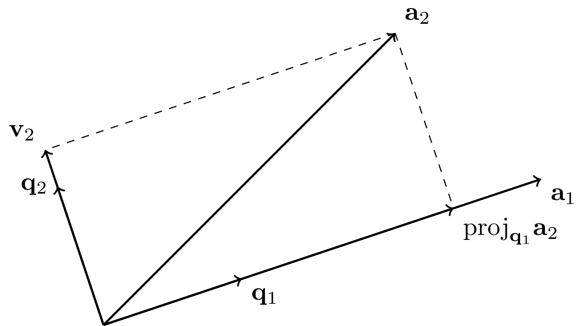
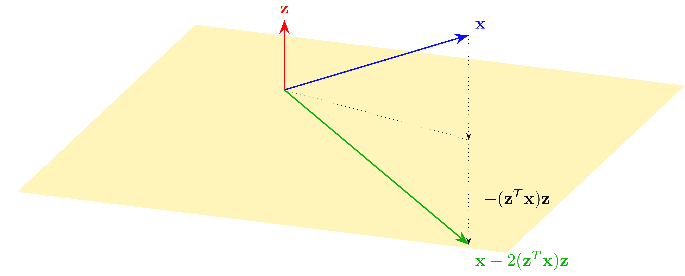
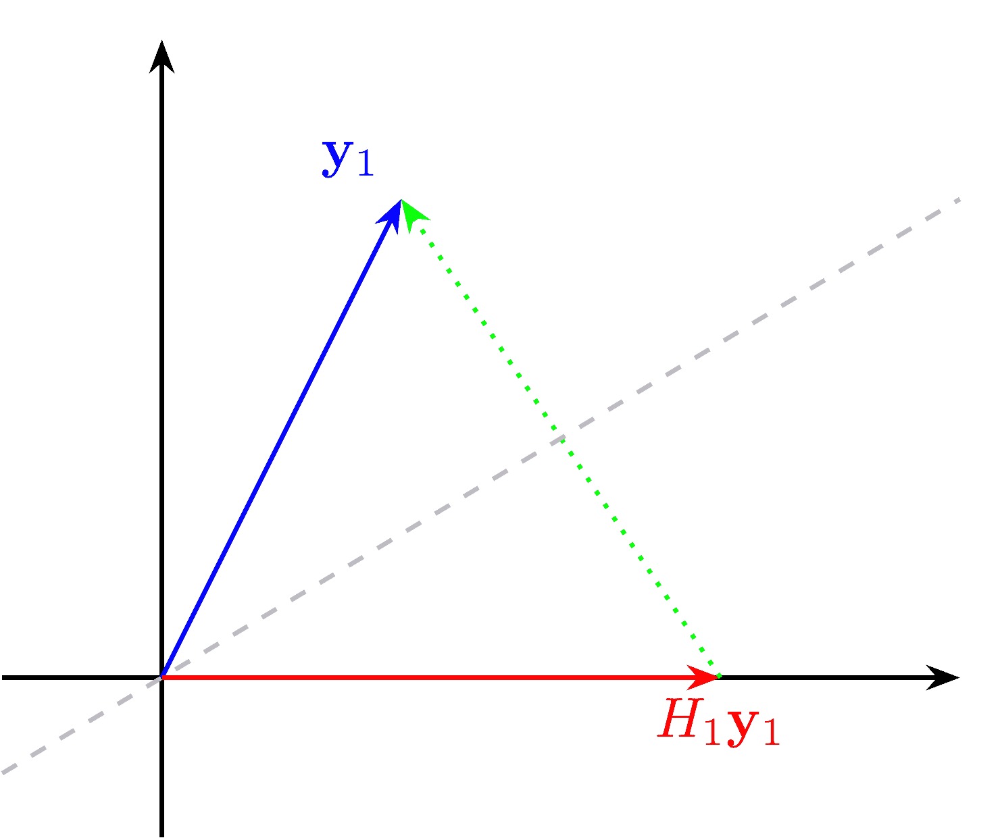

# 2.4\. QR 分解和 Householder 变换

> 原文：[`mmids-textbook.github.io/chap02_ls/04_qr/roch-mmids-ls-qr.html`](https://mmids-textbook.github.io/chap02_ls/04_qr/roch-mmids-ls-qr.html)

我们有一些来自前几节遗留的业务：构造正交归一基。下面我们将介绍 Gram-Schmidt 算法。通过矩阵分解的视角，我们给出了解决线性最小二乘问题的另一种方法。

## 2.4.1\. Gram-Schmidt 算法的矩阵形式#

在本小节中，我们证明 *Gram-Schmidt 定理* 并介绍一个有成效的矩阵视角。

**Gram-Schmidt 算法** 设 \(\mathbf{a}_1,\ldots,\mathbf{a}_m\) 是线性无关的。我们使用 Gram-Schmidt 算法\(\idx{Gram-Schmidt algorithm}\xdi\)来获得 \(\mathrm{span}(\mathbf{a}_1,\ldots,\mathbf{a}_m)\) 的正交归一基。这个过程利用了上面推导出的正交投影的性质。本质上，我们逐个添加向量 \(\mathbf{a}_i\)，但在添加之前先取出它们在先前包含的向量上的正交投影。结果生成的空间与之前相同，*正交投影定理* 确保了正交性。

*证明思路：* *(Gram-Schmidt)* 首先假设 \(m=1\)。在这种情况下，需要做的只是将 \(\mathbf{a}_1\) 除以其范数，以获得一个单位向量，其生成的空间与 \(\mathbf{a}_1\) 相同，即我们设 \(\mathbf{q}_1 = \frac{\mathbf{a}_1}{\|\mathbf{a}_1\|}\)。

假设现在 \(m=2\)。我们首先让 \(\mathbf{q}_1 = \frac{\mathbf{a}_1}{\|\mathbf{a}_1\|}\)，就像前一种情况一样。然后我们从 \(\mathbf{a}_2\) 中减去其在 \(\mathbf{q}_1\) 上的投影，即我们设 \(\mathbf{v}_2 = \mathbf{a}_2 - \langle \mathbf{q}_1, \mathbf{a}_2 \rangle \,\mathbf{q}_1\)。很容易验证 \(\mathbf{v}_2\) 与 \(\mathbf{q}_1\) 正交（参见 *正交投影定理* 的证明中类似的计算）。此外，因为 \(\mathbf{a}_2\) 是 \(\mathbf{q}_1\) 和 \(\mathbf{v}_2\) 的线性组合，所以我们有 \(\mathrm{span}(\mathbf{q}_1,\mathbf{v}_2) = \mathrm{span}(\mathbf{a}_1,\mathbf{a}_2)\)。剩下的是除以结果向量的范数：\(\mathbf{q}_2 = \frac{\mathbf{v}_2}{\|\mathbf{v}_2\|}\)。

对于一般的 \(m\)，我们按类似的方式进行，但在每一步都投影到之前添加的向量的子空间上。



*证明：* *(Gram-Schmidt)* 归纳的第一步已在上面描述。然后一般的归纳步骤如下。假设我们已经构造了正交归一向量 \(\mathbf{q}_1,\ldots,\mathbf{q}_{j-1}\)，使得

$$ U_{j-1} := \mathrm{span}(\mathbf{q}_1,\ldots,\mathbf{q}_{j-1}) = \mathrm{span}(\mathbf{a}_1,\ldots,\mathbf{a}_{j-1}). $$

*构造 \(\mathbf{q}_j\):* 根据正交归一列表的性质，\(\{\mathbf{q}\}_{i=1}^{j-1}\) 是一个独立的列表，因此它形成了 \(U_{j-1}\) 的正交归一基。因此，我们可以计算 \(\mathbf{a}_j\) 在 \(U_{j-1}\) 上的正交投影。

$$ \mathrm{proj}_{U_{j-1}}\mathbf{a}_j = \sum_{i=1}^{j-1} r_{ij} \,\mathbf{q}_i, $$

其中我们定义 \(r_{ij} = \langle \mathbf{q}_i , \mathbf{a}_j\rangle\)。并且我们设定

$$ \mathbf{v}_j = \mathbf{a}_j - \mathrm{proj}_{U_{j-1}}\mathbf{a}_j = \mathbf{a}_j - \sum_{i=1}^{j-1} r_{ij} \,\mathbf{q}_i \quad \text{and} \quad \mathbf{q}_j = \frac{\mathbf{v}_j}{\|\mathbf{v}_j\|}. $$

最后一步之所以可能，是因为：

**引理** \(\|\mathbf{v}_j\| > 0\). \(\flat\)

*证明：* 确实，否则 \(\mathbf{a}_j\) 将等于其投影 \(\mathrm{proj}_{U_{j-1}}\mathbf{a}_j \in \mathrm{span}(\mathbf{a}_1,\ldots,\mathbf{a}_{j-1})\)，这将与 \(\mathbf{a}_k\) 的线性无关性相矛盾。\(\square\)

向量 \(\mathbf{q}_j\) 通过构造具有单位范数。根据 \(\mathbf{v}_j\) 的定义和正交投影定理，它也垂直于 \(\mathrm{span}(\mathbf{q}_1,\ldots,\mathbf{q}_{j-1})\)。因此，\(\mathbf{q}_1,\ldots,\mathbf{q}_j\) 形成一个正交归一列表。

*通过归纳法推进：* 剩下的工作是要证明 \(\mathrm{span}(\mathbf{q}_1,\ldots,\mathbf{q}_j) = \mathrm{span}(\mathbf{a}_1,\ldots,\mathbf{a}_j)\)。因为通过归纳 \(\mathrm{span}(\mathbf{q}_1,\ldots,\mathbf{q}_{j-1}) = \mathrm{span}(\mathbf{a}_1,\ldots,\mathbf{a}_{j-1})\)，我们只需要证明以下两个命题。

**引理** \(\mathbf{q}_j \in \mathrm{span}(\mathbf{a}_1,\ldots,\mathbf{a}_j)\). \(\flat\)

*证明：* 通过构造，

$$ \mathbf{q}_j = \frac{1}{\|\mathbf{v}_j\|} \left\{\mathbf{a}_j - \mathrm{proj}_{U_{j-1}}\mathbf{a}_j\right\} = \frac{1}{\|\mathbf{v}_j\|} \mathbf{a}_j + \frac{1}{\|\mathbf{v}_j\|} \mathrm{proj}_{U_{j-1}}\mathbf{a}_j. $$

根据正交投影的定义，

$$ \mathrm{proj}_{U_{j-1}}\mathbf{a}_j \in U_{j-1}= \mathrm{span} (\mathbf{a}_1,\ldots,\mathbf{a}_{j-1}) \subseteq \mathrm{span}(\mathbf{a}_1,\ldots,\mathbf{a}_{j}). $$

因此，我们将 \(\mathbf{q}_j\) 写成了 \(\mathrm{span}(\mathbf{a}_1,\ldots,\mathbf{a}_{j})\) 中向量的线性组合。这证明了命题。\(\square\)

**引理** \(\mathbf{a}_j \in \mathrm{span}(\mathbf{q}_1,\ldots,\mathbf{q}_j)\). \(\flat\)

*证明：* 展开上述计算，\(\mathbf{a}_j\) 可以重新表示为以下 \(\mathbf{q}_1,\ldots,\mathbf{q}_j\) 的线性组合

$$\begin{align*} \mathbf{a}_j &= \mathrm{proj}_{U_{j-1}}\mathbf{a}_j + \mathbf{v}_j\\ &= \mathrm{proj}_{U_{j-1}}\mathbf{a}_j + \|\mathbf{v}_j\| \mathbf{q}_j\\ &= \mathrm{proj}_{U_{j-1}}\mathbf{a}_j + \|\mathbf{a}_j - \mathrm{proj}_{U_{j-1}}\mathbf{a}_j\| \mathbf{q}_j\\ &= \sum_{i=1}^{j-1} r_{ij} \,\mathbf{q}_i + \left\|\mathbf{a}_j - \sum_{i=1}^{j-1} r_{ij}\,\mathbf{q}_i\right\| \,\mathbf{q}_j\\ &= \sum_{i=1}^{j-1} r_{ij} \,\mathbf{q}_i + r_{jj} \,\mathbf{q}_j, \end{align*}$$

其中我们定义 \(r_{jj} = \left\|\mathbf{a}_j - \sum_{i=1}^{j-1} r_{ij}\,\mathbf{q}_i\right\| = \|\mathbf{v}_j\|\)。 \(\square\)

因此 \(\mathbf{q}_1,\ldots,\mathbf{q}_j\) 形成一个与 \(\mathrm{span}(\mathbf{a}_1,\ldots,\mathbf{a}_{j})\) 正交的列表。因此，归纳成立。这就完成了定理的证明。 \(\square\)

我们在 Python 中实现了 Gram-Schmidt 算法。由于原因将在下一小节中变得清晰，我们以矩阵形式输出 \(\mathbf{q}_j\) 和 \(r_{ij}\)，每个都是矩阵形式。在这里，我们使用 `numpy.dot` 来计算内积。

```py
def gramschmidt(A):
    (n,m) = A.shape
    Q = np.zeros((n,m))
    R = np.zeros((m,m))
    for j in range(m):
        v = np.copy(A[:,j])
        for i in range(j):
            R[i,j] = np.dot(Q[:,i], A[:,j])
            v -= R[i,j]*Q[:,i]
        R[j,j] = LA.norm(v)
        Q[:,j] = v/R[j,j]
    return Q, R 
```

**数值角** 让我们尝试一个简单的例子。

```py
w1 = np.array([1., 0., 1.])
w2 = np.array([0., 1., 1.])
A = np.stack((w1, w2),axis=-1)
print(A) 
```

```py
[[1\. 0.]
 [0\. 1.]
 [1\. 1.]] 
```

```py
Q, R = gramschmidt(A)
print(Q) 
```

```py
[[ 0.70710678 -0.40824829]
 [ 0\.          0.81649658]
 [ 0.70710678  0.40824829]] 
```

```py
print(R) 
```

```py
[[1.41421356 0.70710678]
 [0\.         1.22474487]] 
```

\(\unlhd\)

**矩阵形式** 设 \(\mathbf{a}_1,\ldots,\mathbf{a}_m \in \mathbb{R}^n\) 是线性无关的。在上面，我们介绍了 Gram-Schmidt 算法来获得 \(\mathrm{span}(\mathbf{a}_1,\ldots,\mathbf{a}_m)\) 的正交基。我们以矩阵形式重新审视它。

让

$$\begin{split} A = \begin{pmatrix} | & & | \\ \mathbf{a}_1 & \ldots & \mathbf{a}_m \\ | & & | \end{pmatrix} \quad \text{和} \quad Q = \begin{pmatrix} | & & | \\ \mathbf{q}_1 & \ldots & \mathbf{q}_m \\ | & & | \end{pmatrix}. \end{split}$$

回想一下，对于所有 \(j\)，

$$ \mathbf{a}_j = \sum_{i=1}^{j-1} r_{ij} \,\mathbf{q}_i + r_{jj} \,\mathbf{q}_j, $$

Gram-Schmidt 算法的输出可以写成以下紧凑形式，称为 [QR 分解](https://en.wikipedia.org/wiki/QR_decomposition)\(\idx{QR decomposition}\xdi\)，

$$ A = QR $$

矩阵 \(R\) 的第 \(i\) 列包含 \(\mathbf{q}_j\) 的线性组合系数，该组合产生 \(\mathbf{a}_i\)。

通过 **Gram-Schmidt 定理** 的证明，\(\mathbf{a}_i \in \mathrm{span}(\mathbf{q}_1,\ldots,\mathbf{q}_i)\)。因此，\(R\) 的第 \(i\) 列在对角线以下只有零。因此，\(R\) 具有我们之前遇到过的特殊结构：它是上三角矩阵。证明还确立了 \(R\) 的对角线元素是严格正的。

**定义** **（三角矩阵）** \(\idx{triangular matrix}\xdi\) 矩阵 \(R = (r_{ij})_{i,j} \in \mathbb{R}^{n \times m}\) 是上三角矩阵，如果对角线以下的全部项都是零，即如果 \(i > j\) 则 \(r_{ij} = 0\)。类似地，下三角矩阵的对角线上方为零。 \(\natural\)

上三角矩阵看起来是这样的

$$\begin{split} R = \begin{bmatrix} r_{1,1} & r_{1,2} & r_{1,3} & \ldots & r_{1,n} \\ 0 & r_{2,2} & r_{2,3} & \ldots & r_{2,n} \\ & 0 & \ddots & \ddots & \vdots \\ & & \ddots & \ddots & r_{n-1,n} \\ 0 & & & 0 & r_{n,n} \end{bmatrix}. \end{split}$$

**备注：**

a) 如果输入向量 \(\mathbf{a}_1,\ldots,\mathbf{a}_m\) 不是线性无关的（在这种情况下，我们说矩阵 \(A\) 是秩亏的），则克莱姆-施密特算法将失败。确实，在某个时刻我们将有 \(\mathbf{a}_j \in U_{j-1}\)，并且 \(\mathbf{v}_j\) 的归一化将不可能。在这种情况下，可以使用一种称为[列主元](https://en.wikipedia.org/wiki/QR_decomposition#Column_pivoting)的技术，我们将在后面描述。

b) 我们在这里推导出的 QR 分解在技术上称为简化 QR 分解。在完全 QR 分解\(\idx{full QR decomposition}\xdi\) 中，矩阵 \(Q\) 是方阵且正交。换句话说，这样的 \(Q\) 的列构成了 \(\mathbb{R}^n\) 的完整空间的正交基。设 \(A = Q_1 R_1\) 是通过克莱姆-施密特算法获得的简化 QR 分解。那么 \(Q_1\) 的列构成了 \(\mathrm{col}(A)\) 的正交基，并且可以通过添加更多的向量 \(\mathbf{q}_{m+1},\ldots,\mathbf{q}_{n}\) 来完成 \(\mathbb{R}^n\) 的正交基。设 \(Q_2\) 是具有列 \(\mathbf{q}_{m+1},\ldots,\mathbf{q}_{n}\) 的矩阵。那么 \(A\) 的完全 QR 分解是

$$\begin{split} Q = \begin{pmatrix} Q_1 & Q_2 \end{pmatrix} \qquad R = \begin{pmatrix} R_1\\ \mathbf{0}_{(n-m)\times m} \end{pmatrix} \end{split}$$

其中 \(\mathbf{0}_{(n-m)\times m}\) 是大小为 \((n-m)\times m\) 的全零矩阵。在后面的子节中，将介绍计算完全 QR 分解的数值方法。

c) 克莱姆-施密特算法在几何上很有吸引力，但众所周知，它存在数值问题。存在其他方法可以计算具有更好数值特性的 QR 分解。我们将在后面的子节中讨论这样的方法。（参见该子节中关于由克莱姆-施密特算法产生的 \(\mathbf{q}_j\) 远非正交的例子。）

## 2.4.2\. 通过 QR 进行最小二乘法#

设 \(A \in \mathbb{R}^{n\times m}\) 是一个 \(n\times m\) 的矩阵，其列线性无关，并且设 \(\mathbf{b} \in \mathbb{R}^n\) 是一个向量。回忆一下，线性最小二乘问题的解 \(\mathbf{x}^*\) 是

$$ \min_{\mathbf{x} \in \mathbb{R}^m} \|A \mathbf{x} - \mathbf{b}\|² $$

满足正则方程

$$ A^T A \mathbf{x}^* = A^T \mathbf{b}. $$

**求解正则方程** 在第一门线性代数课程中，人们学习如何求解如正则方程之类的线性系统。为此，一个常见的方法是高斯消元法或行简化。引用 [维基百科](https://en.wikipedia.org/wiki/Gaussian_elimination)：

> 要对一个矩阵进行行简化，可以使用一系列初等行操作来修改矩阵，直到尽可能多地填充矩阵的左下角为零。 [...] 一旦所有主系数（每行的最左边的非零项）都是 1，并且包含主系数的每一列在其他地方都是零，则该矩阵被称为简化行阶梯形。 [...] 行简化 [...] 可以分为两部分。第一部分（有时称为前向消元）将给定的系统简化为行阶梯形，从其中可以判断是否存在无解、唯一解或无限多解。第二部分（有时称为回代）继续使用行操作直到找到解；换句话说，它将矩阵置于简化行阶梯形。

**图：高斯消元法的示例 ([来源](https://en.wikipedia.org/wiki/Gaussian_elimination))


\(\bowtie\)

我们在这里不会介绍高斯消元法。在本小节中，我们将通过 QR 分解开发求解正则方程的另一种方法。我们需要高斯消元法的一个组成部分，回代\(\idx{back substitution}\xdi\)。它基于观察，三角方程组是容易解决的。我们从例子开始。

**示例：**以下是一个回代的具体例子。考虑方程组 \(R \mathbf{x} = \mathbf{b}\) 与

$$\begin{split} R = \begin{pmatrix} 2 & -1 & 2\\ 0 & 1 & 1\\ 0 & 0 & 2 \end{pmatrix} \qquad \mathbf{b} = \begin{pmatrix} 0\\ -2\\ 0 \end{pmatrix}. \end{split}$$

这对应于线性方程

$$\begin{align*} &2 x_1 - x_2 + 2x_3 = 0\\ &x_2 + x_3 = -2\\ &2 x_3 = 0 \end{align*}$$

第三个方程给出 \(x_3 = 0/2 = 0\)。将其代入第二个方程，我们得到 \(x_2 = -2 - x_3 = -2\)。将其代入第一个方程，我们最终得到 \(x_1 = (x_2 - 2 x_3)/2 = -1\)。因此，解为 \(\mathbf{x} = (-1,-2,0)\)。 \(\lhd\)

通常，解三角方程组的工作方式如下。设 \(R = (r_{i,j})_{i,j} \in \mathbb{R}^{m \times m}\) 为上三角矩阵，设 \(\mathbf{b} \in \mathbb{R}^m\) 为左侧向量，即我们想要解的方程组

$$ R \mathbf{x} = \mathbf{b}. $$

从系统的最后一行开始，\(r_{m,m} x_m = b_m\) 或 \(x_m = b_m/r_{m,m}\)，假设 \(r_{m,m} \neq 0\)。移动到倒数第二行，\(r_{m-1,m-1} x_{m-1} + r_{m-1,m} x_m = b_{m-1}\) 或 \(x_{m-1} = (b_{m-1} - r_{m-1,m} x_m)/r_{m-1,m-1}\)，假设 \(r_{m-1,m-1} \neq 0\)。依此类推。这个过程被称为[回代](https://en.wikipedia.org/wiki/Triangular_matrix#Forward_and_back_substitution)。

类似地，在下三角情况 \(L \in \mathbb{R}^{m \times m}\) 中，我们有 [前向替换](https://en.wikipedia.org/wiki/Triangular_matrix#Forward_substitution)\(\idx{forward substitution}\xdi\)。这些过程隐式地定义了 \(R\) 和 \(L\) 的逆（当对角元素全不为零时）。我们在这里不会明确写出。

我们在 Python 中实现了回代。在我们的原始实现中，我们假设对角元素不为零，这对我们的目的来说足够了。

```py
def backsubs(R,b):
    m = b.shape[0]
    x = np.zeros(m)
    for i in reversed(range(m)):
        x[i] = (b[i] - np.dot(R[i,i+1:m],x[i+1:m]))/R[i,i]
    return x 
```

前向替换以类似的方式实现。

```py
def forwardsubs(L,b):
    m = b.shape[0]
    x = np.zeros(m)
    for i in range(m):
        x[i] = (b[i] - np.dot(L[i,0:i],x[0:i]))/L[i,i]
    return x 
```

**使用 QR** 我们展示了如何通过 QR 分解求解正则方程。

1- 通过 QR 分解构建 \(\mathrm{col}(A)\) 的一个正交基

$$ A = QR. $$

2- 通过 QR 分解形成一个 \(\mathrm{col}(A)\) 的正交基

$$ P = Q Q^T. $$

3- 将投影应用于 \(\mathbf{b}\)，并观察到，根据 *正则方程* 的证明，\(\mathbf{x}^*\) 满足

$$ A \mathbf{x}^* = Q Q^T \mathbf{b}. $$

4- 将 \(A\) 的 QR 分解代入以获得

$$ QR \mathbf{x}^* = Q Q^T \mathbf{b}. $$

5- 两边乘以 \(Q^T\) 并使用 \(Q^T Q = I_{m \times m}\)

$$ R \mathbf{x}^* = Q^T \mathbf{b}. $$

6- 解这个系统以获得 \(\mathbf{x}^*\) 是直接的，因为通过回代 \(R\) 是上三角矩阵。

**定理** **(通过 QR 的最小二乘法)** \(\idx{least squares via QR}\xdi\) 设 \(A \in \mathbb{R}^{n\times m}\) 是一个 \(n\times m\) 矩阵，其列线性无关，设 \(\mathbf{b} \in \mathbb{R}^n\) 是一个向量，设 \(A = QR\) 是 \(A\) 的 QR 分解。线性最小二乘问题的解

$$ \min_{\mathbf{x} \in \mathbb{R}^m} \|A \mathbf{x} - \mathbf{b}\|². $$

满足

$$ R \mathbf{x}^* = Q^T \mathbf{b}. $$

\(\sharp\)

注意，在现实中，我们不需要形成矩阵 \(Q Q^T\)。

我们实现了最小二乘法的 QR 方法。

```py
def ls_by_qr(A, b):
    Q, R = gramschmidt(A)
    return backsubs(R, Q.T @ b) 
```

**数值角:** 我们回到我们简单的超定系统示例。

```py
w1 = np.array([1., 0., 1.])
w2 = np.array([0., 1., 1.])
A = np.stack((w1, w2),axis=-1)
b = np.array([0., 0., 2.])

x = ls_by_qr(A, b)
print(x) 
```

```py
[0.66666667 0.66666667] 
```

\(\unlhd\)

## 2.4.3\. Householder 变换#

虽然 Gram-Schmidt 算法给出了计算（简化）QR 分解的自然方法，但还有许多其他用于此目的的数值算法。其中一些具有更好的数值行为，特别是在处理舍入误差方面。引用 [维基百科](https://en.wikipedia.org/wiki/Round-off_error):

> 舍入误差，也称为舍入误差，是使用精确算术和有限精度舍入算术产生的相同算法的结果之间的差异。舍入误差是由于实数表示的不精确性和使用它们的算术运算造成的。 [...] 当进行涉及舍入误差的输入的连续计算时，错误可能会累积，有时会主导计算。

我们在这里不证明这一点，但以下基于豪斯霍尔德反射的方法在数值上更[稳定](https://en.wikipedia.org/wiki/Numerical_stability#Stability_in_numerical_linear_algebra)。

回想一下，一个方阵 \(Q \in \mathbb{R}^{m\times m}\) 是正交的，如果 \(Q^T Q = Q Q^T = I_{m \times m}\)。换句话说，\(Q\) 的矩阵逆是其转置。这等价于 \(Q\) 的列形成 \(\mathbb{R}^m\) 的一个正交基（为什么？）。

可以证明两个正交矩阵 \(Q_1\) 和 \(Q_2\) 的乘积也是正交的。（试一试！）

正交矩阵的一个重要性质是它们保持内积：如果 \(Q \in \mathbb{R}^{m\times m}\) 是正交的，那么对于任何 \(\mathbf{x}, \mathbf{y} \in \mathbb{R}^m\)

$$ \langle Q \mathbf{x}, Q \mathbf{y} \rangle = (Q \mathbf{x})^T Q \mathbf{y} = \mathbf{x}^T Q^T Q \mathbf{y} = \mathbf{x}^T \mathbf{y} = \langle \mathbf{x}, \mathbf{y} \rangle. $$

特别地，正交矩阵保持范数和角度。

**反射** 一类这样的变换是反射。

**定义** **(超平面)** \(\idx{hyperplane}\xdi\) 超平面 \(W\) 是 \(\mathbb{R}^m\) 的一个维度为 \(m-1\) 的线性子空间。\(\natural\)

**定义** **(豪斯霍尔德反射)** \(\idx{Householder reflection}\xdi\) 设 \(\mathbf{z} \in \mathbb{R}^m\) 为一个单位向量，设 \(W\) 为与它正交的超平面。\(W\) 上的反射由以下公式给出

$$ H = I_{m \times m} - 2 \mathbf{z} \mathbf{z}^T. $$

这被称为豪斯霍尔德反射。\(\natural\)

换句话说，我们减去两次在 \(\mathbf{z}\) 上的投影，如图所示。



**引理** 设 \(H = I_{m\times m} - 2\mathbf{z}\mathbf{z}^T\) 为一个豪斯霍尔德反射。那么 \(H\) 是一个正交矩阵。\(\flat\)

*证明:* 我们检查定义：

$$\begin{align*} H^T H &= (I_{m\times m} - 2\mathbf{z}\mathbf{z}^T)^T (I_{m\times m} - 2\mathbf{z}\mathbf{z}^T)\\ &= (I_{m\times m} - 2\mathbf{z}\mathbf{z}^T) (I_{m\times m} - 2\mathbf{z}\mathbf{z}^T)\\ &= I_{m\times m} - 2\mathbf{z}\mathbf{z}^T - 2\mathbf{z}\mathbf{z}^T + 4 \mathbf{z}\mathbf{z}^T\mathbf{z}\mathbf{z}^T\\ &= I_{m\times m} - 2\mathbf{z}\mathbf{z}^T - 2\mathbf{z}\mathbf{z}^T + 4 \mathbf{z}\mathbf{z}^T \end{align*}$$

这等于 \(I_{m\times m}\)。\(H H^T\) 的计算是相同的。\(\square\)

**通过引入零的 QR 分解** 我们回到 QR 分解。构造矩阵 \(A \in \mathbb{R}^{n \times m}\) 的 (满) QR 分解的一种方法是通过找到一个正交矩阵序列 \(H_1, \ldots, H_m\)，使得 \(A\) 三角化：

$$ H_m \cdots H_2 H_1 A = R $$

对于一个上三角矩阵 \(R\)。实际上，根据正交矩阵的性质，我们随后有

$$ A = H_1^T H_2^T \cdots H_m^T H_m \cdots H_2 H_1 A = H_1^T H_2^T \cdots H_m^T R $$

其中 \(Q = H_1^T H_2^T \cdots H_m^T\) 本身作为正交矩阵的乘积也是正交的。因此，为了继续进行，我们需要识别出那些能够引入对角线下方零的正交矩阵，如图所示：

$$\begin{split} H_2 H_1 A = \begin{pmatrix} \times & \times & \times & \times & \times\\ 0 & \times & \times & \times & \times\\ 0 & 0 & \times & \times & \times\\ 0 & 0 & \boxed{\times} & \times & \times\\ 0 & 0 & \boxed{\times} & \times & \times\\ 0 & 0 & \boxed{\times} & \times & \times\\ \end{pmatrix}. \end{split}$$

结果表明，一个精心选择的 Householder 反射可以完成这项工作。设 \(\mathbf{y}_1\) 为 \(A\) 的第一列，并取

$$ \mathbf{z}_1 = \frac{\|\mathbf{y}_1\| \,\mathbf{e}_1^{(n)} - \mathbf{y}_1}{\|\|\mathbf{y}_1\| \,\mathbf{e}_1^{(n)} - \mathbf{y}_1\|} \quad \text{和} \quad H_1 = I_{n\times n} - 2\mathbf{z}_1\mathbf{z}_1^T $$

其中 \(\mathbf{e}_1^{(n)}\) 是 \(\mathbb{R}^n\) 的标准基中的第一个向量。如图所示，这个选择将 \(\mathbf{y}_1\) 映射到

$$\begin{split} \|\mathbf{y}_1\| \mathbf{e}_1^{(n)} = \begin{pmatrix} \|\mathbf{y}_1\|\\ 0 \\ \vdots \\ 0 \end{pmatrix}. \end{split}$$

（显然，如果 \(H_1 \mathbf{y}_1\) 与 \(\mathbf{e}_1^{(n)}\) 成比例，那么它只能是 \(\|\mathbf{y}_1\| \mathbf{e}_1^{(n)}\) 或 \(-\|\mathbf{y}_1\| \mathbf{e}_1^{(n)}\)。证明它！）



**引理** **(Householder)** \(\idx{Householder lemma}\xdi\) 设 \(\mathbf{y}_1\), \(\mathbf{z}_1\) 和 \(H_1\) 如上所述。那么

$$ H_1 \mathbf{y}_1 = \|\mathbf{y}_1\| \mathbf{e}_1^{(n)}. $$

\(\flat\)

*证明思路:* 证明过程如图所示。

*证明:* 注意到

$$\begin{align*} \|\|\mathbf{y}_1\| \,\mathbf{e}_1^{(n)} - \mathbf{y}_1\|² &= (\|\mathbf{y}_1\| - y_{1,1})² + \sum_{j=2}^n y_{1,j}²\\ &= \|\mathbf{y}_1\|² -2 \|\mathbf{y}_1\| y_{1,1} + y_{1,1}² + \sum_{j=2}^n y_{1,j}²\\ &= 2(\|\mathbf{y}_1\|² - \|\mathbf{y}_1\| y_{1,1}) \end{align*}$$

并且

$$\begin{align*} 2 \mathbf{z}_1 \mathbf{z}_1^T \mathbf{y}_1 &= 2 \mathbf{z}_1 \frac{\|\mathbf{y}_1\| \,(\mathbf{e}_1^{(n)})^T \mathbf{y}_1 - \mathbf{y}_1^T \mathbf{y}_1}{\|\|\mathbf{y}_1\| \,\mathbf{e}_1^{(n)} - \mathbf{y}_1\|}\\ &= 2 \frac{\|\mathbf{y}_1\| y_{1,1} - \|\mathbf{y}_1\|²}{\|\|\mathbf{y}_1\| \,\mathbf{e}_1^{(n)} - \mathbf{y}_1\|²} (\|\mathbf{y}_1\| \,\mathbf{e}_1^{(n)} - \mathbf{y}_1)\\ &= - (\|\mathbf{y}_1\| \,\mathbf{e}_1^{(n)} - \mathbf{y}_1) \end{align*}$$

其中我们使用了之前的方程。因此

$$ H_1 \mathbf{y}_1 = (I_{n\times n} - 2\mathbf{z}_1\mathbf{z}_1^T) \,\mathbf{y}_1 = \mathbf{y}_1 + (\|\mathbf{y}_1\| \,\mathbf{e}_1^{(n)} - \mathbf{y}_1) = \|\mathbf{y}_1\| \,\mathbf{e}_1^{(n)}. $$

这就证明了命题。 \(\square\)

结果是，将 \(A\) 乘以 \(H_1\) 在第一列的下方引入了零。为了看到这一点，回忆矩阵-矩阵乘积的一种解释是，第二个矩阵的每一列都乘以第一个矩阵。根据 *Householder 引理*，将 \(H_1\) 应用到 \(A\) 上给出

$$ H_1 A = \begin{pmatrix} H_1 \mathbf{y}_1 & H_1 A_{\cdot,2} & \cdots & H_1 A_{\cdot,m} \end{pmatrix} = \begin{pmatrix} \|\mathbf{y}_1\| \mathbf{e}_1^{(n)} & H_1 A_{\cdot,2} & \cdots & H_1 A_{\cdot,m} \end{pmatrix} $$

因此，第一列现在与 \(\mathbf{e}_1\) 成比例，除了第一个元素外，其余元素都是零。（如果 \(\mathbf{y}_1\) 已经等于 \(\|\mathbf{y}_1\| \mathbf{e}_1^{(n)}\)，我们应该怎么办？）

结果表明，还有另一种 Householder 反射的选择。实际上，可以证明

$$ \tilde{\mathbf{z}}_1 = \frac{\|\mathbf{y}_1\| \,\mathbf{e}_1^{(n)} + \mathbf{y}_1}{\| \|\mathbf{y}_1\| \,\mathbf{e}_1^{(n)} + \mathbf{y}_1\|} \quad \text{和} \quad \tilde{H}_1 = I_{n\times n} - 2\tilde{\mathbf{z}}_1 \tilde{\mathbf{z}}_1^T $$

是这样的，使得 \(\tilde{H}_1 \mathbf{y}_1 = - \|\mathbf{y}_1\| \,\mathbf{e}_1^{(n)}\)（试试看！）。

**综合以上内容** 我们已经展示了如何在矩阵的第一列下方引入零。为了在第二列下方引入零，我们使用分块矩阵。回想一下，如果 \(A_{ij} \in \mathbb{R}^{n_i \times m_j}\) 和 \(B_{ij} \in \mathbb{R}^{m_i \times p_j}\) 对于 \(i,j = 1, 2\)，那么我们有以下公式

$$\begin{split} \begin{pmatrix} A_{11} & A_{12}\\ A_{21} & A_{22} \end{pmatrix} \begin{pmatrix} B_{11} & B_{12}\\ B_{21} & B_{22} \end{pmatrix} = \begin{pmatrix} A_{11} B_{11} + A_{12} B_{21} & A_{11} B_{12} + A_{12} B_{22}\\ A_{21} B_{11} + A_{22} B_{21} & A_{21} B_{12} + A_{22} B_{22} \end{pmatrix}. \end{split}$$

现在考虑以下分块矩阵

$$\begin{split} H_2 = \begin{pmatrix} 1 & \mathbf{0} \\ \mathbf{0} & F_2 \end{pmatrix} \end{split}$$

其中 \(F_2\) 是以下 Householder 反射。将 \(H_1 A\) 的第二列写成 \((y^{(2)}, \mathbf{y}_2)\)。也就是说，\(\mathbf{y}_2\) 是该列的 \(2,\ldots, n\) 个条目。定义

$$ F_2 = I_{(n-1) \times (n-1)} - 2 \mathbf{z}_2 \mathbf{z}_2^T \quad \text{其中} \quad \mathbf{z}_2 = \frac{\|\mathbf{y}_2\| \,\mathbf{e}_1^{(n-1)} - \mathbf{y}_2}{\|\|\mathbf{y}_2\| \,\mathbf{e}_1^{(n-1)} - \mathbf{y}_2\|} $$

其中现在 \(\mathbf{e}_1^{(n-1)} \in \mathbb{R}^{n-1}\)。根据 *Householder 引理*，我们有 \(F_2 \mathbf{y}_2 = \|\mathbf{y}_2\| \mathbf{e}_1^{(n-1)}\)。可以证明当 \(A\) 的列线性无关时，\(\mathbf{y}_2 \neq \mathbf{0}\)。（试试看！）

将 \(H_2\) 应用到 \(H_1 A\) 上保持第一行和第一列，并在第二列下方引入零。为了看到这一点，首先将 \(H_1 A\) 重写为分块形式

$$\begin{split} H_1 A = \begin{pmatrix} \|\mathbf{y}_1\| & \mathbf{g}_2^T \\ \mathbf{0} & G_2 \end{pmatrix} \end{split}$$

其中我们使用了关于 \(H_1 A\) 的第一列的先前观察，并且 \(\mathbf{g}_2 \in \mathbb{R}^{m-1}\)，\(G_2 \in \mathbb{R}^{(n-1)\times (m-1)}\)。一个需要注意的重要点是：\(G_2\) 的第一列等于 \(\mathbf{y}_2\)。现在乘以 \(H_2\) 来得到

$$\begin{split} H_2 H_1 A = \begin{pmatrix} 1 & \mathbf{0} \\ \mathbf{0} & F_2 \end{pmatrix} \begin{pmatrix} \|\mathbf{y}_1\| & \mathbf{g}_2^T \\ \mathbf{0} & G_2 \end{pmatrix} = \begin{pmatrix} \|\mathbf{y}_1\| & \mathbf{g}_2^T \\ \mathbf{0} & F_2 G_2 \end{pmatrix}. \end{split}$$

通过逐列计算 \(F_2 G_2\) 我们得到

$$ F_2 G_2 = \begin{pmatrix} F_2 \mathbf{y}_2 & F_2 (G_2)_{\cdot,2} & \cdots & F_2 (G_2)_{\cdot,m-1} \end{pmatrix} = \begin{pmatrix} \|\mathbf{y}_2\| \mathbf{e}_1^{(n-1)} & F_2 (G_2)_{\cdot,2} & \cdots & F_2 (G_2)_{\cdot,m-1}, \end{pmatrix} $$

\((G_2)_{\cdot,j}\) 是 \(G_2\) 的第 \(j\) 列。因此，\(H_2 H_1 A\) 的第二列除了前两个元素外，其余都是零。

以此类推。在第 \(k\) 步，我们将 \(H_{k-1} \cdots H_1 A\) 的第 \(k\) 列分为前 \(k-1\) 个和最后 \(n-k+1\) 个元素 \((\mathbf{y}^{(k)}, \mathbf{y}_k)\)，并形成矩阵

$$\begin{split} H_k = \begin{pmatrix} I_{(k-1)\times (k-1)} & \mathbf{0} \\ \mathbf{0} & F_k \end{pmatrix} \end{split}$$

其中

$$ F_k = I_{(n-k+1) \times (n-k+1)} - 2 \mathbf{z}_k \mathbf{z}_k^T \quad \text{其中} \quad \mathbf{z}_k = \frac{\|\mathbf{y}_k\| \,\mathbf{e}_1^{(n-k+1)} - \mathbf{y}_k}{\|\|\mathbf{y}_k\| \,\mathbf{e}_1^{(n-k+1)} - \mathbf{y}_k\|}. $$

这次保留了前 \(k-1\) 行和列，同时在第 \(k\) 列的对角线下方引入了零。我们省略了细节（试试看！）。

我们在 Python 中实现上述过程。我们需要以下函数。对于 \(\alpha \in \mathbb{R}\)，令 \(\alpha\) 的符号为

$$\begin{split} \mathrm{sign}(\alpha) = \begin{cases} 1 & \text{如果} \alpha > 0\\ 0 & \text{如果} \alpha = 0\\ -1 & \text{如果} \alpha < 0 \end{cases} \end{split}$$

在 Python 中，这是通过使用函数 `numpy.sign` 来实现的。

以下函数通过迭代修改 \(A\) 的相关块来构建上三角矩阵 \(R\)。另一方面，计算矩阵 \(Q\) 实际上需要额外的计算工作，而这通常是不必要的。我们注意到，在最小二乘问题的背景下，我们实际上只需要计算某些输入向量 \(\mathbf{b}\) 的 \(Q^T \mathbf{b}\)。这可以在构建 \(R\) 的同时完成，如下所示。需要注意的是，\(Q^T \mathbf{b} = H_m \cdots H_1 \mathbf{b}\)。

在我们实现`householder`时，我们使用上面定义的两种反射。我们在这里不进行证明，但所做出的特定选择具有良好的数值特性。引用[TB, 第 10 讲]（其中 \(H^+\) 指的是当 \(z=1\) 时用于反射的超平面）：

> 从数学上讲，两种符号的选择都是令人满意的。然而，这是一个数值稳定性——对舍入误差不敏感——决定应该选择一个而不是另一个的情况。为了数值稳定性，最好将 \(\mathbf{x}\) 反射到 \(z \|\mathbf{x}\| \mathbf{e}_1\) 这个向量上，这个向量不太接近 \(\mathbf{x}\) 本身。 [...] 假设在上面的图中，\(H^+\) 和 \(\mathbf{e}_1\) 轴之间的角度非常小。那么向量 \(\mathbf{v} = \|\mathbf{x}\| \mathbf{e}_1 - \mathbf{x}\) 比较小，比 \(\mathbf{x}\) 或 \(\|\mathbf{x}\| \mathbf{e}_1\) 小得多。因此，\(\mathbf{v}\) 的计算代表了附近量的减法，并且可能会受到舍入误差的影响。

我们使用[`numpy.outer`](https://numpy.org/doc/stable/reference/generated/numpy.outer.html)来计算 \(\mathbf{z} \mathbf{z}^T\)，这被称为外积。有关`numpy.copy`的解释，请参阅[这里](https://numpy.org/doc/stable/reference/generated/numpy.copy.html)。

```py
def householder(A, b):
    n, m = A.shape
    R = np.copy(A)
    Qtb = np.copy(b)
    for k in range(m):

        y = R[k:n,k]
        e1 = np.zeros(n-k)
        e1[0] = 1
        z = np.sign(y[0]) * LA.norm(y) * e1 + y
        z = z / LA.norm(z)

        R[k:n,k:m] = R[k:n,k:m] - 2 * np.outer(z, z) @ R[k:n,k:m]
        Qtb[k:n] = Qtb[k:n] - 2 * np.outer(z, z) @ Qtb[k:n]

    return R[0:m,0:m], Qtb[0:m] 
```

**数值角**: 我们回到我们的超定系统示例。

```py
w1 = np.array([1., 0., 1.])
w2 = np.array([0., 1., 1.])
A = np.stack((w1, w2),axis=-1)
b = np.array([0., 0., 2.])
R, Qtb = householder(A, b)
x = backsubs(R, Qtb)
print(x) 
```

```py
[0.66666667 0.66666667] 
```

Householder 方法的一个优点是它产生一个具有非常好的正交性的矩阵 \(Q\)，即 \(Q^T Q \approx I\)。以下是一个快速示例，比较了 Gram-Schmidt 和 Householder 方法。（矩阵 \(A\) 的选择在我们讨论后续章节中的奇异值分解时会变得清晰。）

```py
seed = 535
rng = np.random.default_rng(seed)

n = 50
U, W = LA.qr(rng.normal(0,1,(n,n)))
V, W = LA.qr(rng.normal(0,1,(n,n)))
S = np.diag((1/2) ** np.arange(1,n+1))
A = U @ S @ V.T

Qgs, Rgs = gramschmidt(A)
print(LA.norm(A - Qgs @ Rgs))
print(LA.norm(Qgs.T @ Qgs - np.identity(n))) 
```

```py
1.4369568046009742e-16
19.745599060592102 
```

如上图所示，Gram-Schmidt 算法产生的 \(Q\) 和 \(R\) 因子确实具有 \(QR \approx A\) 的性质。然而，\(Q\) 远非正交。（回想一下，`LA.norm` 计算了之前引入的 Frobenius 范数。）

另一方面，Householder 反射在这方面表现更好，我们将在下面展示。这里我们使用`numpy.linalg.qr`中的 Householder 变换实现。

```py
Qhh, Rhh = LA.qr(A)
print(LA.norm(A - Qhh @ Rhh))
print(LA.norm(Qhh.T @ Qhh - np.identity(n))) 
```

```py
4.739138228891714e-16
5.33506987519293e-15 
```

\(\unlhd\)

***自我评估测验*** *(有 Claude、Gemini 和 ChatGPT 的帮助)*

**1** 以下哪个矩阵是上三角矩阵？

a) \(\begin{pmatrix} 1 & 2 \\ 0 & 3 \end{pmatrix}\)

b) \(\begin{pmatrix} 1 & 0 \\ 2 & 3 \end{pmatrix}\)

c) \(\begin{pmatrix} 0 & 1 \\ 1 & 0 \end{pmatrix}\)

d) \(\begin{pmatrix} 1 & 2 \\ 3 & 4 \end{pmatrix}\)

**2** 当将 Gram-Schmidt 算法应用于一组线性无关的向量时，其输出是什么？

a) 向量所张成的子空间的一个正交基。

b) 向量所张成的子空间的一个正交基。

c) 一组线性相关的向量。

d) 一个与所有输入向量都正交的单个向量。

**3** 在 \(\mathbb{R}^m\) 中超平面的维度是多少？

a) \(m\)

b) \(m - 1\)

c) \(m - 2\)

d) 1

**4** 关于 Householder 反射，以下哪项是正确的？

a) 它是围绕一个与单位向量正交的超平面的反射。

b) 它是围绕一个单位向量的反射。

c) 它是围绕一个与单位向量正交的超平面的旋转。

d) 它是围绕一个单位向量的旋转。

**5** 如何使用一系列 Householder 反射来计算矩阵\(A\)的 QR 分解？

a) 通过在\(A\)的上三角线上迭代引入零。

b) 通过在\(A\)的下三角线上迭代引入零。

c) 通过在\(A\)的对角线上迭代引入零。

d) 通过在矩阵\(A\)的整个矩阵中迭代引入零。

答案 1：a. 证明：文本定义上三角矩阵为所有对角线下方元素都为零的矩阵。

答案 2：b. 证明：文本中提到“Gram-Schmidt 算法“产生\(\mathrm{span}(a_1, \dots, a_m)\)的正交基”。”

答案 3：b. 证明：文本定义超平面为\(\mathbb{R}^m\)的维度为\(m - 1\)的线性子空间。

答案 4：a. 证明：文本如下定义 Householder 反射：“设\(\mathbf{z} \in \mathbb{R}^m\)为一个单位向量，设\(W\)为与它正交的超平面。\(W\)上的反射由\(H = I_{m \times m} - 2\mathbf{z}\mathbf{z}^T\)给出。”

答案 5：b. 证明：文本中提到，“构造矩阵\(A \in \mathbb{R}^{n \times m}\)的（满）QR 分解的一种方法是要找到一个正交矩阵序列\(H_1,\ldots,H_m\)，使得\(A\)三角化：\(H_m \cdots H_2H_1A = R\)，其中\(R\)是一个上三角矩阵。”

## 2.4.1\. Gram-Schmidt 算法的矩阵形式#

在本小节中，我们证明 Gram-Schmidt 定理并介绍一个有成效的矩阵视角。

**Gram-Schmidt 算法** 设\(\mathbf{a}_1,\ldots,\mathbf{a}_m\)是线性无关的。我们使用 Gram-Schmidt 算法\(\idx{Gram-Schmidt algorithm}\xdi\)来获得\(\mathrm{span}(\mathbf{a}_1,\ldots,\mathbf{a}_m)\)的正交基。这个过程利用了上面推导出的正交投影的性质。本质上，我们逐个添加向量\(\mathbf{a}_i\)，但是在添加之前，先从之前包含的向量中取出它们的正交投影。结果生成的空间与之前相同，并且正交投影定理确保了正交性。

**证明思路：** *(Gram-Schmidt)* 首先假设\(m=1\)。在这种情况下，需要做的只是将\(\mathbf{a}_1\)除以其范数以获得一个单位向量，其生成的空间与\(\mathbf{a}_1\)相同，即我们设\(\mathbf{q}_1 = \frac{\mathbf{a}_1}{\|\mathbf{a}_1\|}\)。

假设现在 \(m=2\)。我们首先让 \(\mathbf{q}_1 = \frac{\mathbf{a}_1}{\|\mathbf{a}_1\|}\) 如前所述。然后我们从 \(\mathbf{a}_2\) 中减去其在 \(\mathbf{q}_1\) 上的投影，即我们设定 \(\mathbf{v}_2 = \mathbf{a}_2 - \langle \mathbf{q}_1, \mathbf{a}_2 \rangle \,\mathbf{q}_1\)。很容易验证 \(\mathbf{v}_2\) 与 \(\mathbf{q}_1\) 正交（参见正交投影定理的证明中的类似计算）。此外，因为 \(\mathbf{a}_2\) 是 \(\mathbf{q}_1\) 和 \(\mathbf{v}_2\) 的线性组合，所以我们有 \(\mathrm{span}(\mathbf{q}_1,\mathbf{v}_2) = \mathrm{span}(\mathbf{a}_1,\mathbf{a}_2)\)。剩下的是除以结果向量的范数：\(\mathbf{q}_2 = \frac{\mathbf{v}_2}{\|\mathbf{v}_2\|}\)。

对于一般的 \(m\)，我们采取类似的步骤，但在每一步都投影到由之前添加的向量张成的子空间。


*证明：* *(Gram-Schmidt)* 归纳的第一步已在上面描述。然后一般的归纳步骤如下。假设我们已经构造了正交向量 \(\mathbf{q}_1,\ldots,\mathbf{q}_{j-1}\)，使得

$$ U_{j-1} := \mathrm{span}(\mathbf{q}_1,\ldots,\mathbf{q}_{j-1}) = \mathrm{span}(\mathbf{a}_1,\ldots,\mathbf{a}_{j-1}). $$

*构造 \(\mathbf{q}_j\):* 根据 *正交列表的性质*，\(\{\mathbf{q}\}_{i=1}^{j-1}\) 是一个独立的列表，因此形成 \(U_{j-1}\) 的正交基。因此，我们可以计算 \(\mathbf{a}_j\) 在 \(U_{j-1}\) 上的正交投影：

$$ \mathrm{proj}_{U_{j-1}}\mathbf{a}_j = \sum_{i=1}^{j-1} r_{ij} \,\mathbf{q}_i, $$

其中我们定义 \(r_{ij} = \langle \mathbf{q}_i , \mathbf{a}_j\rangle\)。并且我们设定

$$ \mathbf{v}_j = \mathbf{a}_j - \mathrm{proj}_{U_{j-1}}\mathbf{a}_j = \mathbf{a}_j - \sum_{i=1}^{j-1} r_{ij} \,\mathbf{q}_i \quad \text{和} \quad \mathbf{q}_j = \frac{\mathbf{v}_j}{\|\mathbf{v}_j\|}. $$

最后一步之所以可能，是因为：

**引理** \(\|\mathbf{v}_j\| > 0\). \(\flat\)

*证明：* 确实，否则 \(\mathbf{a}_j\) 将等于其投影 \(\mathrm{proj}_{U_{j-1}}\mathbf{a}_j \in \mathrm{span}(\mathbf{a}_1,\ldots,\mathbf{a}_{j-1})\)，这将与 \(\mathbf{a}_k\) 的线性无关性相矛盾。\(\square\)

向量 \(\mathbf{q}_j\) 的范数为单位，这是通过构造得到的。根据 \(\mathbf{v}_j\) 的定义和正交投影定理，它也正交于 \(\mathrm{span}(\mathbf{q}_1,\ldots,\mathbf{q}_{j-1})\)。因此，\(\mathbf{q}_1,\ldots,\mathbf{q}_j\) 形成一个正交列表。

*通过归纳推进：* 剩下要证明的是 \(\mathrm{span}(\mathbf{q}_1,\ldots,\mathbf{q}_j) = \mathrm{span}(\mathbf{a}_1,\ldots,\mathbf{a}_j)\)。因为通过归纳 \(\mathrm{span}(\mathbf{q}_1,\ldots,\mathbf{q}_{j-1}) = \mathrm{span}(\mathbf{a}_1,\ldots,\mathbf{a}_{j-1})\)，我们只需要证明以下两个命题。

**引理** \(\mathbf{q}_j \in \mathrm{span}(\mathbf{a}_1,\ldots,\mathbf{a}_j)\). \(\flat\)

*证明：* 通过构造，

$$ \mathbf{q}_j = \frac{1}{\|\mathbf{v}_j\|} \left\{\mathbf{a}_j - \mathrm{proj}_{U_{j-1}}\mathbf{a}_j\right\} = \frac{1}{\|\mathbf{v}_j\|} \mathbf{a}_j + \frac{1}{\|\mathbf{v}_j\|} \mathrm{proj}_{U_{j-1}}\mathbf{a}_j. $$

根据正交投影的定义，

$$ \mathrm{proj}_{U_{j-1}}\mathbf{a}_j \in U_{j-1}= \mathrm{span} (\mathbf{a}_1,\ldots,\mathbf{a}_{j-1}) \subseteq \mathrm{span}(\mathbf{a}_1,\ldots,\mathbf{a}_{j}). $$

因此，我们将 \(\mathbf{q}_j\) 写成了 \(\mathrm{span}(\mathbf{a}_1,\ldots,\mathbf{a}_{j})\) 中向量的线性组合。这就证明了该命题。 \(\square\)

**引理** \(\mathbf{a}_j \in \mathrm{span}(\mathbf{q}_1,\ldots,\mathbf{q}_j)\). \(\flat\)

*证明：* 展开上述计算，\(\mathbf{a}_j\) 可以重新写成以下 \(\mathbf{q}_1,\ldots,\mathbf{q}_j\) 的线性组合

$$\begin{align*} \mathbf{a}_j &= \mathrm{proj}_{U_{j-1}}\mathbf{a}_j + \mathbf{v}_j\\ &= \mathrm{proj}_{U_{j-1}}\mathbf{a}_j + \|\mathbf{v}_j\| \mathbf{q}_j\\ &= \mathrm{proj}_{U_{j-1}}\mathbf{a}_j + \|\mathbf{a}_j - \mathrm{proj}_{U_{j-1}}\mathbf{a}_j\| \mathbf{q}_j\\ &= \sum_{i=1}^{j-1} r_{ij} \,\mathbf{q}_i + \left\|\mathbf{a}_j - \sum_{i=1}^{j-1} r_{ij}\,\mathbf{q}_i\right\| \,\mathbf{q}_j\\ &= \sum_{i=1}^{j-1} r_{ij} \,\mathbf{q}_i + r_{jj} \,\mathbf{q}_j, \end{align*}$$

其中我们定义了 \(r_{jj} = \left\|\mathbf{a}_j - \sum_{i=1}^{j-1} r_{ij}\,\mathbf{q}_i\right\| = \|\mathbf{v}_j\|\). \(\square\)

因此，\(\mathbf{q}_1,\ldots,\mathbf{q}_j\) 形成了一个与 \(\mathrm{span}(\mathbf{a}_1,\ldots,\mathbf{a}_{j})\) 正交的列表。因此，归纳成立。这就完成了定理的证明。 \(\square\)

我们在 Python 中实现 Gram-Schmidt 算法。由于原因将在下一小节中变得清晰，我们以矩阵形式输出 \(\mathbf{q}_j\) 和 \(r_{ij}\)，每个都是矩阵形式。在这里，我们使用 `numpy.dot` 来计算内积。

```py
def gramschmidt(A):
    (n,m) = A.shape
    Q = np.zeros((n,m))
    R = np.zeros((m,m))
    for j in range(m):
        v = np.copy(A[:,j])
        for i in range(j):
            R[i,j] = np.dot(Q[:,i], A[:,j])
            v -= R[i,j]*Q[:,i]
        R[j,j] = LA.norm(v)
        Q[:,j] = v/R[j,j]
    return Q, R 
```

**数值角：* 让我们尝试一个简单的例子。

```py
w1 = np.array([1., 0., 1.])
w2 = np.array([0., 1., 1.])
A = np.stack((w1, w2),axis=-1)
print(A) 
```

```py
[[1\. 0.]
 [0\. 1.]
 [1\. 1.]] 
```

```py
Q, R = gramschmidt(A)
print(Q) 
```

```py
[[ 0.70710678 -0.40824829]
 [ 0\.          0.81649658]
 [ 0.70710678  0.40824829]] 
```

```py
print(R) 
```

```py
[[1.41421356 0.70710678]
 [0\.         1.22474487]] 
```

\(\unlhd\)

**矩阵形式** 设 \(\mathbf{a}_1,\ldots,\mathbf{a}_m \in \mathbb{R}^n\) 是线性无关的。在上面，我们介绍了 Gram-Schmidt 算法来获得 \(\mathrm{span}(\mathbf{a}_1,\ldots,\mathbf{a}_m)\) 的正交基。我们以矩阵形式重新审视它。

让

$$\begin{split} A = \begin{pmatrix} | & & | \\ \mathbf{a}_1 & \ldots & \mathbf{a}_m \\ | & & | \end{pmatrix} \quad \text{和} \quad Q = \begin{pmatrix} | & & | \\ \mathbf{q}_1 & \ldots & \mathbf{q}_m \\ | & & | \end{pmatrix}. \end{split}$$

回想一下，对于所有的 \(j\)，

$$ \mathbf{a}_j = \sum_{i=1}^{j-1} r_{ij} \,\mathbf{q}_i + r_{jj} \,\mathbf{q}_j, $$

Gram-Schmidt 算法的输出可以写成以下紧凑形式，称为 [QR 分解](https://en.wikipedia.org/wiki/QR_decomposition)\(\idx{QR decomposition}\xdi\)。

$$ A = QR $$

其中 \(m \times m\) 矩阵 \(R\) 的第 \(i\) 列包含产生 \(\mathbf{a}_i\) 的 \(\mathbf{q}_j\) 的线性组合的系数。

通过 *Gram-Schmidt 定理* 的证明，\(\mathbf{a}_i \in \mathrm{span}(\mathbf{q}_1,\ldots,\mathbf{q}_i)\)。因此 \(R\) 的第 \(i\) 列对角线以下只有零。因此 \(R\) 具有我们之前遇到过的特殊结构：它是上三角矩阵。证明还确立了 \(R\) 的对角线元素是严格正的。

**定义** **(三角矩阵)** \(\idx{triangular matrix}\xdi\) 一个矩阵 \(R = (r_{ij})_{i,j} \in \mathbb{R}^{n \times m}\) 是上三角矩阵，如果其对角线以下的全部元素都是零，即如果 \(i > j\) 则 \(r_{ij} = 0\)。同样，下三角矩阵的对角线上方元素为零。 \(\natural\)

一个上三角矩阵看起来是这样的

$$\begin{split} R = \begin{bmatrix} r_{1,1} & r_{1,2} & r_{1,3} & \ldots & r_{1,n} \\ 0 & r_{2,2} & r_{2,3} & \ldots & r_{2,n} \\ & 0 & \ddots & \ddots & \vdots \\ & & \ddots & \ddots & r_{n-1,n} \\ 0 & & & 0 & r_{n,n} \end{bmatrix}. \end{split}$$

**备注：**

a) 如果输入向量 \(\mathbf{a}_1,\ldots,\mathbf{a}_m\) 不是线性无关的（在这种情况下我们说矩阵 \(A\) 是秩不足的），Gram-Schmidt 算法将失败。实际上，在某个时刻我们将有 \(\mathbf{a}_j \in U_{j-1}\) 并且 \(\mathbf{v}_j\) 的归一化将不可能。在这种情况下，可以使用一种称为[列主元](https://en.wikipedia.org/wiki/QR_decomposition#Column_pivoting)的技术，我们将在后面不进行描述。

b) 我们在这里推导出的 QR 分解在技术上称为简化 QR 分解。在完全 QR 分解\(\idx{full QR decomposition}\xdi\)中，矩阵 \(Q\) 是方阵且正交。换句话说，这样的 \(Q\) 的列构成了 \(\mathbb{R}^n\) 的完整空间的正交基。设 \(A = Q_1 R_1\) 是通过 Gram-Schmidt 算法获得的简化 QR 分解。那么 \(Q_1\) 的列构成了 \(\mathrm{col}(A)\) 的正交基，并且可以通过添加更多的向量 \(\mathbf{q}_{m+1},\ldots,\mathbf{q}_{n}\) 来完成 \(\mathbb{R}^n\) 的正交基。设 \(Q_2\) 是列向量为 \(\mathbf{q}_{m+1},\ldots,\mathbf{q}_{n}\) 的矩阵。那么 \(A\) 的完全 QR 分解是

$$\begin{split} Q = \begin{pmatrix} Q_1 & Q_2 \end{pmatrix} \qquad R = \begin{pmatrix} R_1\\ \mathbf{0}_{(n-m)\times m} \end{pmatrix} \end{split}$$

其中 \(\mathbf{0}_{(n-m)\times m}\) 是大小为 \((n-m)\times m\) 的全零矩阵。计算完全 QR 分解的数值方法将在后面的子节中介绍。

c) 格拉姆-施密特算法在几何上很有吸引力，但众所周知，它存在数值问题。存在其他方法可以计算具有更好数值特性的 QR 分解。我们将在后面的子节中讨论这样的方法。（参见该子节中，由格拉姆-施密特产生的 \(\mathbf{q}_j\) 远非正交的示例。）

## 2.4.2\. 通过 QR 进行最小二乘法#

设 \(A \in \mathbb{R}^{n\times m}\) 为一个 \(n\times m\) 的矩阵，其列线性无关，且设 \(\mathbf{b} \in \mathbb{R}^n\) 为一个向量。回忆一下，线性最小二乘问题的解 \(\mathbf{x}^*\) 满足

$$ \min_{\mathbf{x} \in \mathbb{R}^m} \|A \mathbf{x} - \mathbf{b}\|² $$

满足正则方程

$$ A^T A \mathbf{x}^* = A^T \mathbf{b}. $$

**求解正则方程** 在第一门线性代数课程中，人们学习如何求解线性系统，如正则方程。为此，一个常见的方法是高斯消元法或行简化。引用 [维基百科](https://en.wikipedia.org/wiki/Gaussian_elimination)：

> 要对一个矩阵进行行简化，可以使用一系列初等行操作来修改矩阵，直到矩阵的左下角尽可能多地填充零。 [...] 一旦所有主系数（每行的最左边的非零项）都是 1，并且包含主系数的每一列在其他地方都有零，则该矩阵被称为简化行阶梯形。 [...] 行简化的过程 [...] 可以分为两部分。第一部分（有时称为前向消元）将给定的系统简化为行阶梯形，从其中可以判断是否存在无解、唯一解或无限多解。第二部分（有时称为回代）继续使用行操作直到找到解；换句话说，它将矩阵置于简化行阶梯形。

**图示：高斯消元法的示例 ([来源](https://en.wikipedia.org/wiki/Gaussian_elimination))


\(\bowtie\)

我们在这里不会介绍高斯消元法。在本节中，我们将开发一种使用 QR 分解求解正则方程的替代方法。我们需要高斯消元法的一个组成部分，回代\(\idx{回代}\xdi\)。它基于这样的观察：三角方程组是容易求解的。我们从例子开始。

**示例：** 这里有一个回代的具体示例。考虑系统 \(R \mathbf{x} = \mathbf{b}\)，其中

$$\begin{split} R = \begin{pmatrix} 2 & -1 & 2\\ 0 & 1 & 1\\ 0 & 0 & 2 \end{pmatrix} \qquad \mathbf{b} = \begin{pmatrix} 0\\ -2\\ 0 \end{pmatrix}. \end{split}$$

这对应于线性方程

$$\begin{align*} &2 x_1 - x_2 + 2x_3 = 0\\ &x_2 + x_3 = -2\\ &2 x_3 = 0 \end{align*}$$

第三个方程给出 \(x_3 = 0/2 = 0\)。将其代入第二个方程，我们得到 \(x_2 = -2 - x_3 = -2\)。将其代入第一个方程，我们最终得到 \(x_1 = (x_2 - 2 x_3)/2 = -1\)。所以解是 \(\mathbf{x} = (-1,-2,0)\)。\(\lhd\)

通常，解三角方程组的工作方式如下。设 \(R = (r_{i,j})_{i,j} \in \mathbb{R}^{m \times m}\) 是上三角矩阵，设 \(\mathbf{b} \in \mathbb{R}^m\) 是左端向量，即我们想要解这个系统

$$ R \mathbf{x} = \mathbf{b}. $$

从系统的最后一行开始，\(r_{m,m} x_m = b_m\) 或 \(x_m = b_m/r_{m,m}\)，假设 \(r_{m,m} \neq 0\)。移动到倒数第二行，\(r_{m-1,m-1} x_{m-1} + r_{m-1,m} x_m = b_{m-1}\) 或 \(x_{m-1} = (b_{m-1} - r_{m-1,m} x_m)/r_{m-1,m-1}\)，假设 \(r_{m-1,m-1} \neq 0\)。依此类推。这个过程被称为[回代](https://en.wikipedia.org/wiki/Triangular_matrix#Forward_and_back_substitution)。

类似地，在下三角情况 \(L \in \mathbb{R}^{m \times m}\) 中，我们有 [前向代数](https://en.wikipedia.org/wiki/Triangular_matrix#Forward_substitution)\(\idx{forward substitution}\xdi\)。这些过程隐式地定义了 \(R\) 和 \(L\) 的逆（当对角线元素全部非零时）。我们在这里不会明确写出它们。

我们在 Python 中实现了回代。在我们的原始实现中，我们假设对角线元素不为零，这对于我们的目的来说是足够的。

```py
def backsubs(R,b):
    m = b.shape[0]
    x = np.zeros(m)
    for i in reversed(range(m)):
        x[i] = (b[i] - np.dot(R[i,i+1:m],x[i+1:m]))/R[i,i]
    return x 
```

前向代数也是类似实现的。

```py
def forwardsubs(L,b):
    m = b.shape[0]
    x = np.zeros(m)
    for i in range(m):
        x[i] = (b[i] - np.dot(L[i,0:i],x[0:i]))/L[i,i]
    return x 
```

**使用 QR** 我们展示了如何通过 QR 分解求解正则方程。

1- 通过 QR 分解构造 \(\mathrm{col}(A)\) 的正交基

$$ A = QR. $$

2- 构造正交投影矩阵

$$ P = Q Q^T. $$

3- 将投影应用于 \(\mathbf{b}\) 并观察，根据正则方程的证明，\(\mathbf{x}^*\) 满足

$$ A \mathbf{x}^* = Q Q^T \mathbf{b}. $$

4- 将 \(A\) 的 QR 分解代入以得到

$$ QR \mathbf{x}^* = Q Q^T \mathbf{b}. $$

5- 两边乘以 \(Q^T\) 并使用 \(Q^T Q = I_{m \times m}\)

$$ R \mathbf{x}^* = Q^T \mathbf{b}. $$

6- 由于 \(R\) 通过回代是上三角的，解这个系统对于 \(\mathbf{x}^*\) 来说是直接的。

**定理** **(通过 QR 的最小二乘法)** \(\idx{least squares via QR}\xdi\) 设 \(A \in \mathbb{R}^{n\times m}\) 是一个 \(n\times m\) 矩阵，其列线性无关，设 \(\mathbf{b} \in \mathbb{R}^n\) 是一个向量，设 \(A = QR\) 是 \(A\) 的 QR 分解。线性最小二乘问题的解

$$ \min_{\mathbf{x} \in \mathbb{R}^m} \|A \mathbf{x} - \mathbf{b}\|². $$

满足

$$ R \mathbf{x}^* = Q^T \mathbf{b}. $$

\(\sharp\)

注意，实际上我们不需要形成矩阵 \(Q Q^T\)。

我们实现了最小二乘法的 QR 方法。

```py
def ls_by_qr(A, b):
    Q, R = gramschmidt(A)
    return backsubs(R, Q.T @ b) 
```

**数值角:** 我们回到我们的简单超定系统示例。

```py
w1 = np.array([1., 0., 1.])
w2 = np.array([0., 1., 1.])
A = np.stack((w1, w2),axis=-1)
b = np.array([0., 0., 2.])

x = ls_by_qr(A, b)
print(x) 
```

```py
[0.66666667 0.66666667] 
```

\(\unlhd\)

## 2.4.3\. Householder 变换#

虽然 Gram-Schmidt 算法提供了一种自然的方式来计算（简化的）QR 分解，但还有许多其他数值算法用于此目的。其中一些在处理舍入误差方面表现更好。引用[Wikipedia](https://en.wikipedia.org/wiki/Round-off_error)：

> 舍入误差，也称为舍入误差，是使用精确算术和有限精度、舍入算术产生的相同算法的结果之间的差异。舍入误差是由于实数表示的不精确性和与之相关的算术运算造成的。 [...] 当进行涉及舍入误差的输入的计算序列时，错误可能会累积，有时会主导计算。

我们在这里不证明这一点，但以下基于 Householder 反射的方法在数值上更[稳定](https://en.wikipedia.org/wiki/Numerical_stability#Stability_in_numerical_linear_algebra)。

回想一下，一个方阵 \(Q \in \mathbb{R}^{m\times m}\) 是正交的，如果 \(Q^T Q = Q Q^T = I_{m \times m}\)。换句话说，\(Q\) 的矩阵逆就是它的转置。这等价于 \(Q\) 的列构成 \(\mathbb{R}^m\) 的一个正交基（为什么？）。

可以证明两个正交矩阵 \(Q_1\) 和 \(Q_2\) 的乘积也是正交的。（试试看！）

正交矩阵的一个重要性质是它们保持内积：如果 \(Q \in \mathbb{R}^{m\times m}\) 是正交的，那么对于任何 \(\mathbf{x}, \mathbf{y} \in \mathbb{R}^m\)

$$ \langle Q \mathbf{x}, Q \mathbf{y} \rangle = (Q \mathbf{x})^T Q \mathbf{y} = \mathbf{x}^T Q^T Q \mathbf{y} = \mathbf{x}^T \mathbf{y} = \langle \mathbf{x}, \mathbf{y} \rangle. $$

特别地，正交矩阵保持范数和角度。

**反射** 其中一类变换是反射。

**定义** **(超平面)** \(\idx{hyperplane}\xdi\) 超平面 \(W\) 是 \(\mathbb{R}^m\) 的一个维度为 \(m-1\) 的线性子空间。\(\natural\)

**定义** **(Householder 反射)** \(\idx{Householder reflection}\xdi\) 设 \(\mathbf{z} \in \mathbb{R}^m\) 为一个单位向量，设 \(W\) 为与它正交的超平面。通过 \(W\) 的反射由以下给出

$$ H = I_{m \times m} - 2 \mathbf{z} \mathbf{z}^T. $$

这被称为 Householder 反射。\(\natural\)

换句话说，我们减去两次在 \(\mathbf{z}\) 上的投影，如下所示。


**引理** 设 \(H = I_{m\times m} - 2\mathbf{z}\mathbf{z}^T\) 为一个 Householder 反射。那么 \(H\) 是一个正交矩阵。\(\flat\)

*证明* 我们检查定义：

$$\begin{align*} H^T H &= (I_{m\times m} - 2\mathbf{z}\mathbf{z}^T)^T (I_{m\times m} - 2\mathbf{z}\mathbf{z}^T)\\ &= (I_{m\times m} - 2\mathbf{z}\mathbf{z}^T) (I_{m\times m} - 2\mathbf{z}\mathbf{z}^T)\\ &= I_{m\times m} - 2\mathbf{z}\mathbf{z}^T - 2\mathbf{z}\mathbf{z}^T + 4 \mathbf{z}\mathbf{z}^T\mathbf{z}\mathbf{z}^T\\ &= I_{m\times m} - 2\mathbf{z}\mathbf{z}^T - 2\mathbf{z}\mathbf{z}^T + 4 \mathbf{z}\mathbf{z}^T \end{align*}$$

这等于 \(I_{m\times m}\)。计算 \(H H^T\) 的过程是相同的。\(\square\)

**通过引入零进行 QR 分解** 我们回到 QR 分解。构造矩阵 \(A \in \mathbb{R}^{n \times m}\) 的 (满) QR 分解的一种方法是找到一个正交矩阵序列 \(H_1, \ldots, H_m\)，使得 \(A\) 三角化：

$$ H_m \cdots H_2 H_1 A = R $$

对于上三角矩阵 \(R\)。事实上，根据正交矩阵的性质，我们随后有

$$ A = H_1^T H_2^T \cdots H_m^T H_m \cdots H_2 H_1 A = H_1^T H_2^T \cdots H_m^T R $$

其中 \(Q = H_1^T H_2^T \cdots H_m^T\) 本身作为正交矩阵的乘积也是正交的。因此，为了继续进行，我们需要识别出具有在主对角线下方引入零的效果的正交矩阵，如图所示：

$$\begin{split} H_2 H_1 A = \begin{pmatrix} \times & \times & \times & \times & \times\\ 0 & \times & \times & \times & \times\\ 0 & 0 & \times & \times & \times\\ 0 & 0 & \boxed{\times} & \times & \times\\ 0 & 0 & \boxed{\times} & \times & \times\\ 0 & 0 & \boxed{\times} & \times & \times\\ \end{pmatrix}. \end{split}$$

结果表明，一个精心选择的豪斯霍尔德反射可以做到这一点。设 \(\mathbf{y}_1\) 为 \(A\) 的第一列，并取

$$ \mathbf{z}_1 = \frac{\|\mathbf{y}_1\| \,\mathbf{e}_1^{(n)} - \mathbf{y}_1}{\|\|\mathbf{y}_1\| \,\mathbf{e}_1^{(n)} - \mathbf{y}_1\|} \quad \text{and} \quad H_1 = I_{n\times n} - 2\mathbf{z}_1\mathbf{z}_1^T $$

其中 \(\mathbf{e}_1^{(n)}\) 是 \(\mathbb{R}^n\) 的标准基中的第一个向量。如图所示，这个选择将 \(\mathbf{y}_1\) 映射到

$$\begin{split} \|\mathbf{y}_1\| \mathbf{e}_1^{(n)} = \begin{pmatrix} \|\mathbf{y}_1\|\\ 0 \\ \vdots \\ 0 \end{pmatrix}. \end{split}$$

(显然，如果 \(H_1 \mathbf{y}_1\) 与 \(\mathbf{e}_1^{(n)}\) 成比例，那么它只能是 \(\|\mathbf{y}_1\| \mathbf{e}_1^{(n)}\) 或 \(-\|\mathbf{y}_1\| \mathbf{e}_1^{(n)}\)。证明它！)


**引理** **(豪斯霍尔德)** \(\idx{Householder lemma}\xdi\) 设 \(\mathbf{y}_1\), \(\mathbf{z}_1\) 和 \(H_1\) 如上所述。那么

$$ H_1 \mathbf{y}_1 = \|\mathbf{y}_1\| \mathbf{e}_1^{(n)}. $$

\(\flat\)

*证明思路：* 证明的图示见上图。

*证明：* 注意到

$$\begin{align*} \|\|\mathbf{y}_1\| \,\mathbf{e}_1^{(n)} - \mathbf{y}_1\|² &= (\|\mathbf{y}_1\| - y_{1,1})² + \sum_{j=2}^n y_{1,j}²\\ &= \|\mathbf{y}_1\|² -2 \|\mathbf{y}_1\| y_{1,1} + y_{1,1}² + \sum_{j=2}^n y_{1,j}²\\ &= 2(\|\mathbf{y}_1\|² - \|\mathbf{y}_1\| y_{1,1}) \end{align*}$$

和

$$\begin{align*} 2 \mathbf{z}_1 \mathbf{z}_1^T \mathbf{y}_1 &= 2 \mathbf{z}_1 \frac{\|\mathbf{y}_1\| \,(\mathbf{e}_1^{(n)})^T \mathbf{y}_1 - \mathbf{y}_1^T \mathbf{y}_1}{\|\|\mathbf{y}_1\| \,\mathbf{e}_1^{(n)} - \mathbf{y}_1\|}\\ &= 2 \frac{\|\mathbf{y}_1\| y_{1,1} - \|\mathbf{y}_1\|²}{\|\|\mathbf{y}_1\| \,\mathbf{e}_1^{(n)} - \mathbf{y}_1\|²} (\|\mathbf{y}_1\| \,\mathbf{e}_1^{(n)} - \mathbf{y}_1)\\ &= - (\|\mathbf{y}_1\| \,\mathbf{e}_1^{(n)} - \mathbf{y}_1) \end{align*}$$

其中我们使用了之前的方程。因此

$$ H_1 \mathbf{y}_1 = (I_{n\times n} - 2\mathbf{z}_1\mathbf{z}_1^T) \,\mathbf{y}_1 = \mathbf{y}_1 + (\|\mathbf{y}_1\| \,\mathbf{e}_1^{(n)} - \mathbf{y}_1) = \|\mathbf{y}_1\| \,\mathbf{e}_1^{(n)}. $$

这就证明了该命题。 \(\square\)

结果表明，将 \(A\) 乘以 \(H_1\) 在第一列下方引入了零。为了看到这一点，回想一下矩阵-矩阵乘积的一种解释是，第二个矩阵的每一列都乘以第一个矩阵。根据**豪斯霍尔德引理**，将 \(H_1\) 应用到 \(A\) 上给出

$$ H_1 A = \begin{pmatrix} H_1 \mathbf{y}_1 & H_1 A_{\cdot,2} & \cdots & H_1 A_{\cdot,m} \end{pmatrix} = \begin{pmatrix} \|\mathbf{y}_1\| \mathbf{e}_1^{(n)} & H_1 A_{\cdot,2} & \cdots & H_1 A_{\cdot,m} \end{pmatrix} $$

因此，第一列现在与 \(\mathbf{e}_1\) 成正比，除了第一个元素外，其余元素都是零。（如果 \(\mathbf{y}_1\) 已经等于 \(\|\mathbf{y}_1\| \mathbf{e}_1^{(n)}\)，我们应该怎么办？）

结果表明，还有另一种豪斯霍尔德反射的选择。实际上，可以证明

$$ \tilde{\mathbf{z}}_1 = \frac{\|\mathbf{y}_1\| \,\mathbf{e}_1^{(n)} + \mathbf{y}_1}{\| \|\mathbf{y}_1\| \,\mathbf{e}_1^{(n)} + \mathbf{y}_1\|} \quad \text{和} \quad \tilde{H}_1 = I_{n\times n} - 2\tilde{\mathbf{z}}_1 \tilde{\mathbf{z}}_1^T $$

\(\tilde{H}_1 \mathbf{y}_1 = - \|\mathbf{y}_1\| \,\mathbf{e}_1^{(n)}\)（试试看！）

**将所有内容整合在一起** 我们已经展示了如何在矩阵的第一列下方引入零。要在第二列下方引入零，我们使用一个分块矩阵。回想一下，如果 \(A_{ij} \in \mathbb{R}^{n_i \times m_j}\) 且 \(B_{ij} \in \mathbb{R}^{m_i \times p_j}\) 对于 \(i,j = 1, 2\)，那么我们有以下公式

$$\begin{split} \begin{pmatrix} A_{11} & A_{12}\\ A_{21} & A_{22} \end{pmatrix} \begin{pmatrix} B_{11} & B_{12}\\ B_{21} & B_{22} \end{pmatrix} = \begin{pmatrix} A_{11} B_{11} + A_{12} B_{21} & A_{11} B_{12} + A_{12} B_{22}\\ A_{21} B_{11} + A_{22} B_{21} & A_{21} B_{12} + A_{22} B_{22} \end{pmatrix}. \end{split}$$

现在考虑以下分块矩阵

$$\begin{split} H_2 = \begin{pmatrix} 1 & \mathbf{0} \\ \mathbf{0} & F_2 \end{pmatrix} \end{split}$$

其中 \(F_2\) 是以下豪斯霍尔德反射。将 \(H_1 A\) 的第二列写成 \((y^{(2)}, \mathbf{y}_2)\)。也就是说，\(\mathbf{y}_2\) 是该列的第 \(2,\ldots, n\) 个条目。定义

$$ F_2 = I_{(n-1) \times (n-1)} - 2 \mathbf{z}_2 \mathbf{z}_2^T \quad \text{with} \quad \mathbf{z}_2 = \frac{\|\mathbf{y}_2\| \,\mathbf{e}_1^{(n-1)} - \mathbf{y}_2}{\|\|\mathbf{y}_2\| \,\mathbf{e}_1^{(n-1)} - \mathbf{y}_2\|} $$

其中现在 \(\mathbf{e}_1^{(n-1)} \in \mathbb{R}^{n-1}\)。根据 *豪斯霍尔德引理*，我们有 \(F_2 \mathbf{y}_2 = \|\mathbf{y}_2\| \mathbf{e}_1^{(n-1)}\)。可以证明，当 \(A\) 的列线性无关时，\(\mathbf{y}_2 \neq \mathbf{0}\)。（试试看！）

应用 \(H_2\) 到 \(H_1 A\) 保持第一行和列，并在第二列的下方引入零。为了看到这一点，首先将 \(H_1 A\) 重写为分块形式

$$\begin{split} H_1 A = \begin{pmatrix} \|\mathbf{y}_1\| & \mathbf{g}_2^T \\ \mathbf{0} & G_2 \end{pmatrix} \end{split}$$

其中我们使用了我们之前关于 \(H_1 A\) 的第一列的观察，并且 \(\mathbf{g}_2 \in \mathbb{R}^{m-1}\)，\(G_2 \in \mathbb{R}^{(n-1)\times (m-1)}\)。一个需要注意的重要点是：\(G_2\) 的第一列等于 \(\mathbf{y}_2\)。现在乘以 \(H_2\) 得到

$$\begin{split} H_2 H_1 A = \begin{pmatrix} 1 & \mathbf{0} \\ \mathbf{0} & F_2 \end{pmatrix} \begin{pmatrix} \|\mathbf{y}_1\| & \mathbf{g}_2^T \\ \mathbf{0} & G_2 \end{pmatrix} = \begin{pmatrix} \|\mathbf{y}_1\| & \mathbf{g}_2^T \\ \mathbf{0} & F_2 G_2 \end{pmatrix}. \end{split}$$

按列计算分块 \(F_2 G_2\) 我们得到

$$ F_2 G_2 = \begin{pmatrix} F_2 \mathbf{y}_2 & F_2 (G_2)_{\cdot,2} & \cdots & F_2 (G_2)_{\cdot,m-1} \end{pmatrix} = \begin{pmatrix} \|\mathbf{y}_2\| \mathbf{e}_1^{(n-1)} & F_2 (G_2)_{\cdot,2} & \cdots & F_2 (G_2)_{\cdot,m-1}, \end{pmatrix} $$

其中 \((G_2)_{\cdot,j}\) 是 \(G_2\) 的第 \(j\) 列。因此，\(H_2 H_1 A\) 的第二列除了前两个元素外都是零。

以此类推。在第 \(k\) 步，我们将 \(H_{k-1} \cdots H_1 A\) 的第 \(k\) 列拆分为其前 \(k-1\) 个和最后 \(n-k+1\) 个条目 \((\mathbf{y}^{(k)}, \mathbf{y}_k)\)，并形成矩阵

$$\begin{split} H_k = \begin{pmatrix} I_{(k-1)\times (k-1)} & \mathbf{0} \\ \mathbf{0} & F_k \end{pmatrix} \end{split}$$

其中

$$ F_k = I_{(n-k+1) \times (n-k+1)} - 2 \mathbf{z}_k \mathbf{z}_k^T \quad \text{with} \quad \mathbf{z}_k = \frac{\|\mathbf{y}_k\| \,\mathbf{e}_1^{(n-k+1)} - \mathbf{y}_k}{\|\|\mathbf{y}_k\| \,\mathbf{e}_1^{(n-k+1)} - \mathbf{y}_k\|}. $$

这次保留了前 \(k-1\) 行和列，而在第 \(k\) 列的下方引入了零。我们省略了细节（试试看！）

我们在 Python 中实现上述过程。我们需要以下函数。对于 \(\alpha \in \mathbb{R}\)，让 \(\alpha\) 的符号为

$$\begin{split} \mathrm{sign}(\alpha) = \begin{cases} 1 & \text{if $\alpha > 0$}\\ 0 & \text{if $\alpha = 0$}\\ -1 & \text{if $\alpha < 0$} \end{cases} \end{split}$$

在 Python 中，这是通过使用函数 `numpy.sign` ([numpy.sign](https://numpy.org/doc/stable/reference/generated/numpy.sign.html)) 来实现的。

以下函数通过迭代修改 \(A\) 的相关块来构建上三角矩阵 \(R\)。另一方面，计算矩阵 \(Q\) 实际上需要额外的计算工作，这通常是不必要的。我们注意到，在最小二乘问题的背景下，我们实际上只需要为某些输入向量 \(\mathbf{b}\) 计算 \(Q^T \mathbf{b}\)。这可以在构建 \(R\) 的同时完成，如下所示。需要注意的是，\(Q^T \mathbf{b} = H_m \cdots H_1 \mathbf{b}\)。

在我们实现 `householder` 的过程中，我们使用了上面定义的两个反射。我们在此不进行证明，但所做出的特定选择具有良好的数值特性。引用 [TB, Lecture 10]（其中 \(H^+\) 指的是当 \(z=1\) 时用于反射的超平面）：

> 从数学上讲，两种符号的选择都是令人满意的。然而，这是一个数值稳定性——对舍入误差不敏感——决定应该选择一种而不是另一种的情况。为了数值稳定性，最好将 \(\mathbf{x}\) 反射到 \(z \|\mathbf{x}\| \mathbf{e}_1\) 这个向量上，这个向量不太接近 \(\mathbf{x}\) 本身。 [...] 假设在上面的图中，\(H^+\) 和 \(\mathbf{e}_1\) 轴之间的角度非常小。那么向量 \(\mathbf{v} = \|\mathbf{x}\| \mathbf{e}_1 - \mathbf{x}\) 比较小，比 \(\mathbf{x}\) 或 \(\|\mathbf{x}\| \mathbf{e}_1\) 都要小得多。因此，\(\mathbf{v}\) 的计算代表了附近量的减法，并且可能会受到舍入误差的影响。

我们使用 `numpy.outer` ([numpy.outer](https://numpy.org/doc/stable/reference/generated/numpy.outer.html)) 来计算 \(\mathbf{z} \mathbf{z}^T\)，这被称为外积。有关 `numpy.copy` 的解释，请参阅 [这里](https://numpy.org/doc/stable/reference/generated/numpy.copy.html)。

```py
def householder(A, b):
    n, m = A.shape
    R = np.copy(A)
    Qtb = np.copy(b)
    for k in range(m):

        y = R[k:n,k]
        e1 = np.zeros(n-k)
        e1[0] = 1
        z = np.sign(y[0]) * LA.norm(y) * e1 + y
        z = z / LA.norm(z)

        R[k:n,k:m] = R[k:n,k:m] - 2 * np.outer(z, z) @ R[k:n,k:m]
        Qtb[k:n] = Qtb[k:n] - 2 * np.outer(z, z) @ Qtb[k:n]

    return R[0:m,0:m], Qtb[0:m] 
```

**数值角**: 我们回到我们的超定系统示例。

```py
w1 = np.array([1., 0., 1.])
w2 = np.array([0., 1., 1.])
A = np.stack((w1, w2),axis=-1)
b = np.array([0., 0., 2.])
R, Qtb = householder(A, b)
x = backsubs(R, Qtb)
print(x) 
```

```py
[0.66666667 0.66666667] 
```

Householder 方法的一个优点是它产生了一个具有非常好的正交性的矩阵 \(Q\)，即 \(Q^T Q \approx I\)。下面我们给出一个快速示例，比较 Gram-Schmidt 和 Householder。 (当我们讨论后续章节中的奇异值分解时，矩阵 \(A\) 的选择将变得更加清晰。)

```py
seed = 535
rng = np.random.default_rng(seed)

n = 50
U, W = LA.qr(rng.normal(0,1,(n,n)))
V, W = LA.qr(rng.normal(0,1,(n,n)))
S = np.diag((1/2) ** np.arange(1,n+1))
A = U @ S @ V.T

Qgs, Rgs = gramschmidt(A)
print(LA.norm(A - Qgs @ Rgs))
print(LA.norm(Qgs.T @ Qgs - np.identity(n))) 
```

```py
1.4369568046009742e-16
19.745599060592102 
```

如上图所示，Gram-Schmidt 算法产生的 \(Q\) 和 \(R\) 因子确实具有 \(QR \approx A\) 的性质。然而，\(Q\) 远非正交的。 (回想一下，`LA.norm` 计算了之前引入的 Frobenius 范数。)

另一方面，正如我们接下来要展示的，豪斯霍尔德反射在这方面表现得更好。这里我们使用 `numpy.linalg.qr` 中的豪斯霍尔德变换实现。

```py
Qhh, Rhh = LA.qr(A)
print(LA.norm(A - Qhh @ Rhh))
print(LA.norm(Qhh.T @ Qhh - np.identity(n))) 
```

```py
4.739138228891714e-16
5.33506987519293e-15 
```

\(\unlhd\)

***自我评估测验*** *(有克莱德、双子星和 ChatGPT 的帮助)*

**1** 以下哪个矩阵是上三角矩阵？

a) \(\begin{pmatrix} 1 & 2 \\ 0 & 3 \end{pmatrix}\)

b) \(\begin{pmatrix} 1 & 0 \\ 2 & 3 \end{pmatrix}\)

c) \(\begin{pmatrix} 0 & 1 \\ 1 & 0 \end{pmatrix}\)

d) \(\begin{pmatrix} 1 & 2 \\ 3 & 4 \end{pmatrix}\)

**2** 将 Gram-Schmidt 算法应用于一组线性无关向量时，其输出是什么？

a) 由这些向量张成的子空间的正交基。

b) 由这些向量张成的子空间的正交基。

c) 一组线性相关向量。

d) 一个与所有输入向量都正交的单个向量。

**3** \(\mathbb{R}^m\) 中超平面的维度是多少？

a) \(m\)

b) \(m - 1\)

c) \(m - 2\)

d) 1

**4** 关于豪斯霍尔德反射，以下哪个说法是正确的？

a) 它是一个单位向量正交的超平面上的反射。

b) 它是一个单位向量上的反射。

c) 它是一个围绕单位向量正交的超平面的旋转。

d) 它是一个围绕单位向量的旋转。

**5** 如何使用一系列豪斯霍尔德反射来计算矩阵 \(A\) 的 QR 分解？

a) 通过在 \(A\) 的对角线上方迭代引入零。

b) 通过在 \(A\) 的对角线下方迭代引入零。

c) 通过在 \(A\) 的对角线上迭代引入零。

d) 通过在矩阵 \(A\) 的整个矩阵中迭代引入零。

1 的答案：a. 理由：文本定义上三角矩阵为对角线下方的所有元素都等于零的矩阵。

2 的答案：b. 理由：文本指出，Gram-Schmidt 算法“生成 \(\mathrm{span}(a_1, \dots, a_m)\) 的正交基。”

3 的答案：b. 理由：文本定义超平面为 \(\mathbb{R}^m\) 的一个维度为 \(m - 1\) 的线性子空间。

4 的答案：a. 理由：文本如下定义豪斯霍尔德反射：“设 \(\mathbf{z} \in \mathbb{R}^m\) 是一个单位向量，设 \(W\) 是与它正交的超平面。\(W\) 上的反射由 \(H = I_{m \times m} - 2\mathbf{z}\mathbf{z}^T\) 给出。”

5 的答案：b. 理由：文本指出，“构造矩阵 \(A \in \mathbb{R}^{n \times m}\) 的（满）QR 分解的一种方法是通过找到一个正交矩阵序列 \(H_1,\ldots,H_m\)，使得 \(A\) 被三角化：\(H_m \cdots H_2H_1A = R\)，其中 \(R\) 是一个上三角矩阵。”
