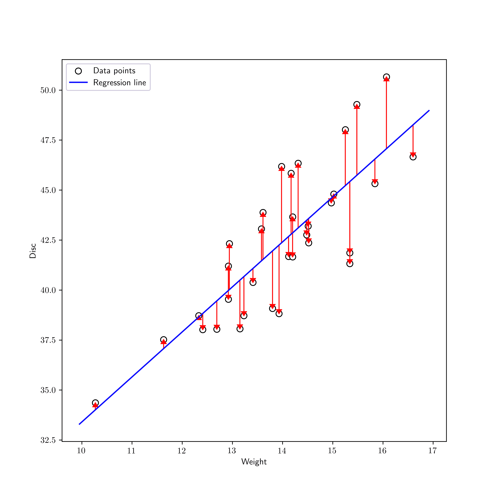
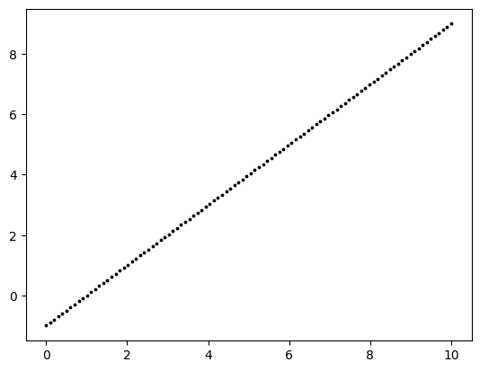
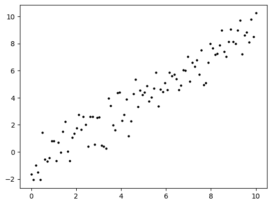
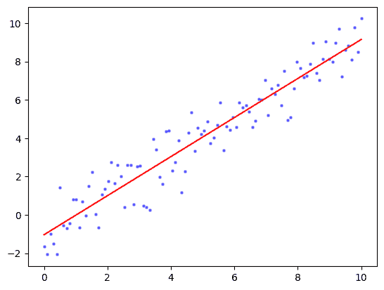
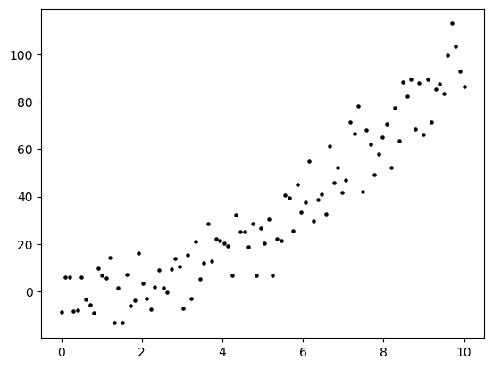
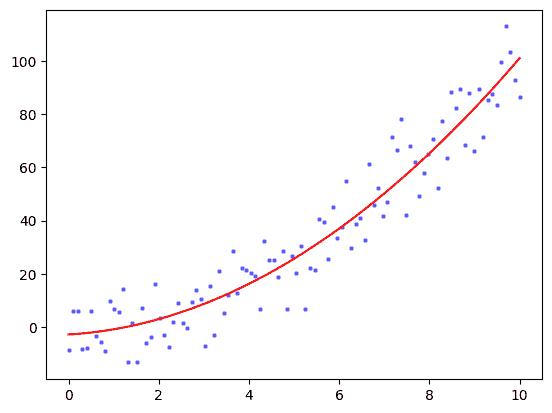
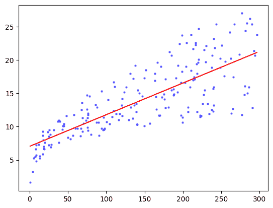
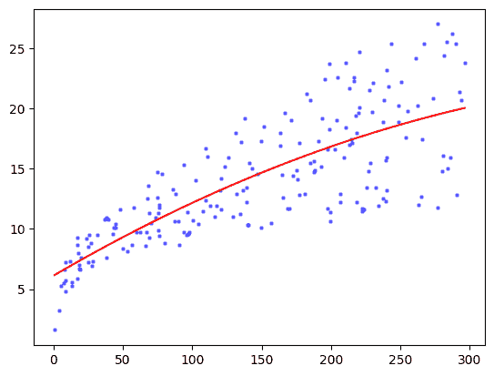
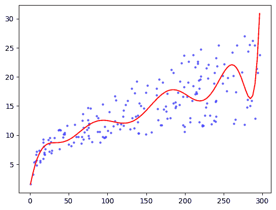

# 2.5\. 应用：回归分析#

> 原文：[`mmids-textbook.github.io/chap02_ls/05_regression/roch-mmids-ls-regression.html`](https://mmids-textbook.github.io/chap02_ls/05_regression/roch-mmids-ls-regression.html)

我们回到我们的动机示例，回归问题，并应用最小二乘法。

## 2.5.1\. 线性回归#

**线性回归** \(\idx{linear regression}\xdi\) 我们寻求一个仿射函数来拟合输入数据点 \(\{(\mathbf{x}_i, y_i)\}_{i=1}^n\)，其中 \(\mathbf{x}_i = (x_{i,1}, \ldots, x_{i,d}) \in \mathbb{R}^d\) 且 \(y_i \in \mathbb{R}\) 对所有 \(i\) 都成立。常见的方法是找到系数 \(\beta_j\)，使得标准最小化

\[ \sum_{i=1}^n \left(y_i - \left\{\beta_0 + \sum_{j=1}^d \beta_j x_{i,j}\right\}\right)². \]

这确实是一个线性最小二乘问题。



以矩阵形式，设

\[\begin{split} \mathbf{y} = \begin{pmatrix} y_1 \\ y_2 \\ \vdots \\ y_n \end{pmatrix}, \quad\quad A = \begin{pmatrix} 1 & \mathbf{x}_1^T \\ 1 & \mathbf{x}_2^T \\ \vdots & \vdots \\ 1 & \mathbf{x}_n^T \end{pmatrix} \quad\text{and}\quad \boldsymbol{\beta} = \begin{pmatrix} \beta_0 \\ \beta_1 \\ \vdots \\ \beta_d \end{pmatrix}. \end{split}\]

然后问题变为

\[ \min_{\boldsymbol{\beta} \in \mathbb{R}^{d+1}} \|\mathbf{y} - A \boldsymbol{\beta}\|². \]

我们假设 \(A\) 的列线性无关，这在实际数据中通常是情况（除非某些列之间存在代数关系）。因此，正则方程如下

\[ A^T A \boldsymbol{\beta} = A^T \mathbf{y}. \]

设 \(\boldsymbol{\hat\beta} = (\hat{\beta}_0,\ldots,\hat{\beta}_d)\) 为该系统的唯一解。它给出了我们拟合模型中的系数向量。我们称之为

\[ \hat{y}_i = \beta_0 + \sum_{j=1}^d \beta_j x_{i,j}, \quad i = 1,\ldots,n \]

作为拟合值，并到

\[ r_i = y_i - \hat{y}_i, \quad i = 1,\ldots,n \]

作为残差\(\idx{residuals}\xdi\). 以向量形式，我们得到 \(\hat{\mathbf{y}} = (\hat{y}_1,\ldots,\hat{y}_n)\) 和 \(\mathbf{r} = (r_1,\ldots,r_n)\) 如下

\[ \hat{\mathbf{y}} = A \boldsymbol{\hat\beta} \quad \text{and} \quad \mathbf{r} = \mathbf{y} - \hat{\mathbf{y}}. \]

残差平方和（RSS）\(\idx{residual sum of squares}\xdi\) 由以下给出

\[ \sum_{i=1}^n r_i² = \sum_{i=1}^n \left(y_i - \left\{\hat{\beta}_0 + \sum_{j=1}^d \hat{\beta}_j x_{i,j}\right\}\right)² \]

或者，以向量形式，

\[ \|\mathbf{r}\|² = \|\mathbf{y} - \hat{\mathbf{y}}\|² = \|\mathbf{y} - A \boldsymbol{\hat\beta}\|². \]

**数值角:** 我们在我们的模拟数据上测试我们的最小二乘法。这有一个优点，即我们知道真实值。

假设真实值是一个变量的线性函数。

```py
n, b0, b1 = 100, -1, 1
x = np.linspace(0,10,num=n)
y = b0 + b1*x

plt.scatter(x, y, s=3, c='k')
plt.show() 
```



一条完美的直线有点太简单了。所以让我们添加一些噪声。也就是说，对每个 \(y_i\) 我们添加一个具有标准正态分布（均值 \(0\)，方差 \(1\)）的独立随机变量 \(\varepsilon_i\)。

```py
seed = 535
rng = np.random.default_rng(seed)

y += rng.normal(0,1,n)

plt.scatter(x, y, s=5, c='k')
plt.show() 
```



我们形成矩阵 \(A\) 并使用我们的最小二乘法代码来求解 \(\boldsymbol{\hat\beta}\)。我们之前实现的函数 `ls_by_qr` 在 [mmids.py](https://raw.githubusercontent.com/MMiDS-textbook/MMiDS-textbook.github.io/main/utils/mmids.py) 中，该文件可在书的 [GitHub](https://github.com/MMiDS-textbook/MMiDS-textbook.github.io/tree/main) 上找到。

```py
A = np.stack((np.ones(n),x),axis=-1)
coeff = mmids.ls_by_qr(A,y)
print(coeff) 
```

```py
[-1.03381171  1.01808039] 
```

```py
plt.scatter(x, y, s=5, c='b', alpha=0.5)
plt.plot(x, coeff[0]+coeff[1]*x, 'r')
plt.show() 
```



\(\unlhd\)

## 2.5.2\. 多项式回归（以及过拟合）#

**超越线性** \(\idx{多项式回归}\xdi\) 线性假设并不像最初看起来那么严格。同样的方法可以简单地扩展到拟合多项式或更复杂的函数组合。例如，假设 \(d=1\)。为了将二次多项式拟合到数据 \(\{(x_i, y_i)\}_{i=1}^n\)，我们在 \(A\) 矩阵中添加一个列，包含 \(x_i\) 的平方。也就是说，我们让

\[\begin{split} A = \begin{pmatrix} 1 & x_1 & x_1² \\ 1 & x_2 & x_2² \\ \vdots & \vdots & \vdots \\ 1 & x_n & x_n² \end{pmatrix}. \end{split}\]

然后，我们确实是在拟合以下二次多项式

\[ (A \boldsymbol{\beta})_i = \beta_0 + \beta_1 x_i + \beta_2 x_i². \]

解决方案保持不变。

这种添加列的想法也可以用来建模预测变量之间的交互。假设 \(d=2\)。那么我们可以考虑以下 \(A\) 矩阵，其中最后一列将两个预测变量组合成它们的乘积，

\[\begin{split} A = \begin{pmatrix} 1 & x_{11} & x_{12} & x_{11} x_{12} \\ 1 & x_{21} & x_{22} & x_{21} x_{22} \\ \vdots & \vdots & \vdots & \vdots\\ 1 & x_{n1} & x_{n2} & x_{n1} x_{n2} \end{pmatrix}. \end{split}\]

**数值角**: 假设真实情况实际上是一个一变量的二次多项式，带有高斯噪声。

```py
n, b0, b1, b2 = 100, 0, 0, 1
x = np.linspace(0,10,num=n)
y = b0 + b1 * x + b2 * x**2 + 10*rng.normal(0,1,n)

plt.scatter(x, y, s=5, c='k')
plt.show() 
```



我们形成矩阵 \(A\) 并使用我们的最小二乘法代码来求解 \(\boldsymbol{\hat\beta}\)。

```py
A = np.stack((np.ones(n), x, x**2), axis=-1)
coeff = mmids.ls_by_qr(A,y)
print(coeff) 
```

```py
[-2.76266982  1.01627798  0.93554204] 
```

<details class="hide above-input"><summary aria-label="切换隐藏内容">显示代码单元格源代码 隐藏代码单元格源代码</summary>

```py
plt.scatter(x, y, s=5, c='b', alpha=0.5)
plt.plot(x, coeff[0] + coeff[1] * x + coeff[2] * x**2, 'r')
plt.show() 
```</details> 

\(\unlhd\)

**多项式回归中的过度拟合** 在添加更多参数时，必须担心 [过度拟合](https://en.wikipedia.org/wiki/Overfitting#cite_note-1)\(\idx{overfitting}\xdi\)。引用维基百科：

> 在统计学中，过度拟合是“产生的一种分析结果与特定数据集过于接近或完全一致，因此可能无法拟合附加数据或可靠地预测未来观察结果”[[1](https://en.wikipedia.org/wiki/Overfitting#cite_note-1)]。一个过度拟合的模型是一个包含比数据可以证明的更多参数的统计模型[[2](https://en.wikipedia.org/wiki/Overfitting#cite_note-CDS-2)]。过度拟合的本质是无意中提取了一些残差变异（即噪声），好像这种变异代表了潜在模型结构[[3](https://en.wikipedia.org/wiki/Overfitting#cite_note-BA2002-3)]）

**数值角**: 我们回到 [[ISLP]](https://www.statlearning.com/) 教科书中的 `Advertising` 数据集。我们再次加载数据集。

**图**: 饼图 (*来源:* 使用 [Midjourney](https://www.midjourney.com/) 制作)


\(\bowtie\)

```py
data = pd.read_csv('advertising.csv') 
```

目前我们将关注电视预算。我们形成矩阵 \(A\) 并使用我们的最小二乘法代码求解 \(\boldsymbol{\beta}\)。

```py
TV = data['TV'].to_numpy()
sales = data['sales'].to_numpy()
n = np.size(TV)
A = np.stack((np.ones(n),TV),axis=-1)
coeff = mmids.ls_by_qr(A,sales)
print(coeff) 
```

```py
[7.03259355 0.04753664] 
```

<details class="hide above-input"><summary aria-label="Toggle hidden content">显示代码单元格源代码 隐藏代码单元格源代码</summary>

```py
TVgrid = np.linspace(TV.min(), TV.max(), num=100)
plt.scatter(TV, sales, s=5, c='b', alpha=0.5)
plt.plot(TVgrid, coeff[0]+coeff[1]*TVgrid, 'r')
plt.show() 
``` 

二次多项式可能是一个更好的拟合。

```py
A = np.stack((np.ones(n), TV, TV**2), axis=-1)
coeff = mmids.ls_by_qr(A,sales)
print(coeff) 
```

```py
[ 6.11412013e+00  6.72659270e-02 -6.84693373e-05] 
```

<details class="hide above-input"><summary aria-label="Toggle hidden content">显示代码单元格源代码 隐藏代码单元格源代码</summary>

```py
plt.scatter(TV, sales, s=5, c='b', alpha=0.5)
plt.plot(TVgrid, coeff[0] + coeff[1] * TVgrid + coeff[2] * TVgrid**2, 'r')
plt.show() 
``` 

这个拟合看起来比线性拟合略好。但这并不完全令人惊讶，因为线性模型是二次模型的子集。但是，正如我们之前提到的，当我们添加更多参数时，我们必须担心数据过度拟合。为了说明，让我们看看 \(20\) 次多项式拟合会发生什么。

```py
deg = 20
A = np.stack([TV**i for i in range(deg+1)], axis=-1)
coeff = mmids.ls_by_qr(A,sales)
print(coeff) 
```

```py
[ 1.06538698e+00  6.72896471e-01 -1.53138969e-02 -2.74088516e-04
  1.83651714e-05 -3.40080020e-07  3.17915742e-09 -1.64042005e-11
  4.43633296e-14 -4.25654490e-17 -5.28727398e-20  1.11822932e-22
 -3.47096893e-27 -2.44665112e-30 -2.79435976e-33 -4.05263859e-36
 -6.83137511e-39 -1.27993830e-41 -2.59569760e-44 -5.59960687e-47
 -1.26949578e-49] 
```

```py
saleshat = np.sum([coeff[i] * TVgrid**i for i in range(deg+1)], axis=0)

plt.scatter(TV, sales, s=5, c='b', alpha=0.5)
plt.plot(TVgrid, saleshat, 'r')
plt.show() 
```



现在的结果似乎变化无常，似乎是由数据的随机性驱动的。

**聊天与学习**: 向你喜欢的 AI 聊天机器人询问如何使用交叉验证来选择合适的度数。请求代码并将其应用于此数据集。([在 Colab 中打开](https://colab.research.google.com/github/MMiDS-textbook/MMiDS-textbook.github.io/blob/main/just_the_code/roch_mmids_chap_ls_notebook.ipynb)) \(\ddagger\)

\(\unlhd\)

***自我评估测验*** *(有 Claude、Gemini 和 ChatGPT 的帮助)*

**1** 在线性回归中，目标是找到系数 \(\beta_j\)，以最小化以下哪个标准？

a) \(\sum_{i=1}^n (y_i - \beta_0 - \sum_{j=1}^d \beta_j x_{ij})\)

b) \(\sum_{i=1}^n (y_i - \beta_0 - \sum_{j=1}^d \beta_j x_{ij})²\)

c) \(\sum_{i=1}^n (y_i - \{\beta_0 + \sum_{j=1}^d \beta_j x_{ij}\}²)\)

d) \(\sum_{i=1}^n |y_i - \beta_0 - \sum_{j=1}^d \beta_j x_{ij}|\)

**2** 线性回归的正则方程如下：

a) \(A^T A \boldsymbol{\beta} = A^T \mathbf{y}\)

b) \(A A^T \boldsymbol{\beta} = A \mathbf{y}\)

c) \(A^T A \boldsymbol{\beta} = A \mathbf{y}\)

d) \(A A^T \boldsymbol{\beta} = A^T \mathbf{y}\)

**3** 在 20 次多项式拟合的数值示例中，拟合曲线：

a) 完美拟合数据。

b) 无法捕捉数据的整体趋势。

c) 将数据中的噪声视为潜在结构。

d) 是一条直线。

**4** 使用模拟数据测试最小二乘法的主要优势是什么？

a) 模拟数据消除了对现实世界数据的需求。

b) 模拟数据提供了无噪声的完美拟合。

c) 模拟数据使我们能够了解真实情况。

d) 模拟数据降低了计算复杂性。

**5** 以下哪项最能描述过度拟合？

a) 该模型对训练数据拟合良好，但泛化到新数据较差。

b) 模型对训练数据和新的数据都拟合良好。

c) 模型对训练数据拟合不良，但泛化到新数据良好。

d) 模型忽略了训练数据中的随机噪声。

1 题的答案：b. 理由：文本指出，在线性回归中，我们寻求找到系数 \(\beta_j\)，以最小化以下标准 \(\sum_{i=1}^n (y_i - \beta_0 - \sum_{j=1}^d \beta_j x_{ij})²\)。

2 题的答案：a. 理由：文本指出，“正则方程是 \(A^T A \boldsymbol{\beta} = A^T \mathbf{y}\)。”

3 题的答案：c. 理由：文本指出，“过度拟合的本质是无意中提取了一些残差变化（即噪声），好像这种变化代表了潜在模型结构。”

4 题的答案：c. 理由：文本指出，“这有一个优势，即我们知道真相。”

5 题的答案：a. 理由：文本引用维基百科：“过度拟合的模型是一个包含比数据可以证明的更多参数的统计模型。”

## 2.5.1\. 线性回归#

**线性回归** \(\idx{linear regression}\xdi\) 我们寻求一个仿射函数来拟合输入数据点 \(\{(\mathbf{x}_i, y_i)\}_{i=1}^n\)，其中 \(\mathbf{x}_i = (x_{i,1}, \ldots, x_{i,d}) \in \mathbb{R}^d\) 且 \(y_i \in \mathbb{R}\) 对所有 \(i\) 都成立。常见的方法是找到系数 \(\beta_j\)，以最小化以下标准

\[ \sum_{i=1}^n \left(y_i - \left\{\beta_0 + \sum_{j=1}^d \beta_j x_{i,j}\right\}\right)². \]

这确实是一个线性最小二乘问题。


以矩阵形式，设

\[\begin{split} \mathbf{y} = \begin{pmatrix} y_1 \\ y_2 \\ \vdots \\ y_n \end{pmatrix}, \quad\quad A = \begin{pmatrix} 1 & \mathbf{x}_1^T \\ 1 & \mathbf{x}_2^T \\ \vdots & \vdots \\ 1 & \mathbf{x}_n^T \end{pmatrix} \quad\text{and}\quad \boldsymbol{\beta} = \begin{pmatrix} \beta_0 \\ \beta_1 \\ \vdots \\ \beta_d \end{pmatrix}. \end{split}\]

然后，问题变为

\[ \min_{\boldsymbol{\beta} \in \mathbb{R}^{d+1}} \|\mathbf{y} - A \boldsymbol{\beta}\|². \]

我们假设 \(A\) 的列线性无关，这在真实数据中通常是情况（除非某些列之间存在代数关系）。因此，正则方程是

\[ A^T A \boldsymbol{\beta} = A^T \mathbf{y}. \]

令 \(\boldsymbol{\hat\beta} = (\hat{\beta}_0,\ldots,\hat{\beta}_d)\) 为该系统的唯一解。它给出了我们拟合模型中的系数向量。我们称之为

\[ \hat{y}_i = \beta_0 + \sum_{j=1}^d \beta_j x_{i,j}, \quad i = 1,\ldots,n \]

作为拟合值，并且到

\[ r_i = y_i - \hat{y}_i, \quad i = 1,\ldots,n \]

作为残差\(\idx{residuals}\xdi\)。以向量形式，我们得到 \(\hat{\mathbf{y}} = (\hat{y}_1,\ldots,\hat{y}_n)\) 和 \(\mathbf{r} = (r_1,\ldots,r_n)\) 如下

\[ \hat{\mathbf{y}} = A \boldsymbol{\hat\beta} \quad \text{and} \quad \mathbf{r} = \mathbf{y} - \hat{\mathbf{y}}. \]

残差平方和（RSS）\(\idx{residual sum of squares}\xdi\) 由下式给出

\[ \sum_{i=1}^n r_i² = \sum_{i=1}^n \left(y_i - \left\{\hat{\beta}_0 + \sum_{j=1}^d \hat{\beta}_j x_{i,j}\right\}\right)² \]

或者，以向量形式，

\[ \|\mathbf{r}\|² = \|\mathbf{y} - \hat{\mathbf{y}}\|² = \|\mathbf{y} - A \boldsymbol{\hat\beta}\|². \]

**数值角落：** 我们在模拟数据上测试我们的最小二乘法。这有一个优点，即我们知道真相。

假设真理是一个一元线性函数。

```py
n, b0, b1 = 100, -1, 1
x = np.linspace(0,10,num=n)
y = b0 + b1*x

plt.scatter(x, y, s=3, c='k')
plt.show() 
```


完美的直线过于简单。因此，让我们添加一些噪声。也就是说，对每个 \(y_i\) 我们添加一个具有标准正态分布（均值 \(0\)，方差 \(1\)）的独立随机变量 \(\varepsilon_i\)。

```py
seed = 535
rng = np.random.default_rng(seed)

y += rng.normal(0,1,n)

plt.scatter(x, y, s=5, c='k')
plt.show() 
```


我们构建矩阵 \(A\) 并使用我们的最小二乘法代码求解 \(\boldsymbol{\hat\beta}\)。之前我们实现的函数 `ls_by_qr` 在 [mmids.py](https://raw.githubusercontent.com/MMiDS-textbook/MMiDS-textbook.github.io/main/utils/mmids.py) 中，该文件可在[本书的 GitHub 仓库](https://github.com/MMiDS-textbook/MMiDS-textbook.github.io/tree/main)找到。

```py
A = np.stack((np.ones(n),x),axis=-1)
coeff = mmids.ls_by_qr(A,y)
print(coeff) 
```

```py
[-1.03381171  1.01808039] 
```

```py
plt.scatter(x, y, s=5, c='b', alpha=0.5)
plt.plot(x, coeff[0]+coeff[1]*x, 'r')
plt.show() 
```


\(\unlhd\)

## 2.5.2\. 多项式回归（以及过拟合）#

**超越线性** \(\idx{多项式回归}\xdi\) 线性假设并不像最初看起来那么严格。同样的方法可以简单地扩展到拟合多项式或更复杂的函数组合。例如，假设 \(d=1\)。为了将二次多项式拟合到数据 \(\{(x_i, y_i)\}_{i=1}^n\)，我们在 \(A\) 矩阵中添加一个列，包含 \(x_i\) 的平方。也就是说，我们让

\[\begin{split} A = \begin{pmatrix} 1 & x_1 & x_1² \\ 1 & x_2 & x_2² \\ \vdots & \vdots & \vdots \\ 1 & x_n & x_n² \end{pmatrix}. \end{split}\]

然后，我们确实在以下方式中拟合了一个二次多项式

\[ (A \boldsymbol{\beta})_i = \beta_0 + \beta_1 x_i + \beta_2 x_i². \]

解决方案否则保持不变。

这种添加列的想法也可以用来建模预测变量之间的交互。假设 \(d=2\)。那么我们可以考虑以下 \(A\) 矩阵，其中最后一列将两个预测变量组合成它们的乘积，

\[\begin{split} A = \begin{pmatrix} 1 & x_{11} & x_{12} & x_{11} x_{12} \\ 1 & x_{21} & x_{22} & x_{21} x_{22} \\ \vdots & \vdots & \vdots & \vdots\\ 1 & x_{n1} & x_{n2} & x_{n1} x_{n2} \end{pmatrix}. \end{split}\]

**数值角落**：假设真相实际上是一个变量的二次多项式，带有高斯噪声。

```py
n, b0, b1, b2 = 100, 0, 0, 1
x = np.linspace(0,10,num=n)
y = b0 + b1 * x + b2 * x**2 + 10*rng.normal(0,1,n)

plt.scatter(x, y, s=5, c='k')
plt.show() 
```


我们形成矩阵 \(A\) 并使用我们的最小二乘法代码来求解 \(\boldsymbol{\hat\beta}\)。

```py
A = np.stack((np.ones(n), x, x**2), axis=-1)
coeff = mmids.ls_by_qr(A,y)
print(coeff) 
```

```py
[-2.76266982  1.01627798  0.93554204] 
```

<details class="hide above-input"><summary aria-label="切换隐藏内容">显示代码单元格源代码 隐藏代码单元格源代码</summary>

```py
plt.scatter(x, y, s=5, c='b', alpha=0.5)
plt.plot(x, coeff[0] + coeff[1] * x + coeff[2] * x**2, 'r')
plt.show() 
```</details> 

\(\unlhd\)

**多项式回归中的过拟合** 在添加更多参数时，必须担心 [过拟合](https://en.wikipedia.org/wiki/Overfitting#cite_note-1)\(\idx{过拟合}\xdi\)。引用维基百科的话：

> 在统计学中，过拟合是“分析结果与特定数据集过于接近或完全一致，因此可能无法拟合附加数据或可靠地预测未来观察结果”[[1](https://en.wikipedia.org/wiki/Overfitting#cite_note-1)]。一个过拟合的模型是一个包含比数据可以证明的更多参数的统计模型[[2](https://en.wikipedia.org/wiki/Overfitting#cite_note-CDS-2)]。过拟合的本质是在不知不觉中提取了一些残差变异（即噪声），好像这种变异代表了潜在模型结构[[3](https://en.wikipedia.org/wiki/Overfitting#cite_note-BA2002-3)]）

**数值角落**：我们回到 [[ISLP]](https://www.statlearning.com/) 教科书中的 `Advertising` 数据集。我们再次加载数据集。

**图：饼图 (*来源：[Midjourney](https://www.midjourney.com/))**


\(\bowtie\)

```py
data = pd.read_csv('advertising.csv') 
```

我们现在将专注于电视预算。我们形成矩阵 \(A\) 并使用我们的最小二乘法代码来求解 \(\boldsymbol{\beta}\)。

```py
TV = data['TV'].to_numpy()
sales = data['sales'].to_numpy()
n = np.size(TV)
A = np.stack((np.ones(n),TV),axis=-1)
coeff = mmids.ls_by_qr(A,sales)
print(coeff) 
```

```py
[7.03259355 0.04753664] 
```

<details class="hide above-input"><summary aria-label="Toggle hidden content">显示代码单元格源 隐藏代码单元格源</summary>

```py
TVgrid = np.linspace(TV.min(), TV.max(), num=100)
plt.scatter(TV, sales, s=5, c='b', alpha=0.5)
plt.plot(TVgrid, coeff[0]+coeff[1]*TVgrid, 'r')
plt.show() 
```</details> 

二次多项式可能是一个更好的拟合。

```py
A = np.stack((np.ones(n), TV, TV**2), axis=-1)
coeff = mmids.ls_by_qr(A,sales)
print(coeff) 
```

```py
[ 6.11412013e+00  6.72659270e-02 -6.84693373e-05] 
```

<details class="hide above-input"><summary aria-label="Toggle hidden content">显示代码单元格源 隐藏代码单元格源</summary>

```py
plt.scatter(TV, sales, s=5, c='b', alpha=0.5)
plt.plot(TVgrid, coeff[0] + coeff[1] * TVgrid + coeff[2] * TVgrid**2, 'r')
plt.show() 
```</details> 

拟合看起来比线性拟合略好。但这并不完全令人惊讶，因为线性模型是二次模型的一个子集。但是，正如我们之前提到的，当我们添加更多参数时，我们必须担心数据过拟合。为了说明这一点，让我们看看二次多项式拟合度数为 \(20\) 时会发生什么。

```py
deg = 20
A = np.stack([TV**i for i in range(deg+1)], axis=-1)
coeff = mmids.ls_by_qr(A,sales)
print(coeff) 
```

```py
[ 1.06538698e+00  6.72896471e-01 -1.53138969e-02 -2.74088516e-04
  1.83651714e-05 -3.40080020e-07  3.17915742e-09 -1.64042005e-11
  4.43633296e-14 -4.25654490e-17 -5.28727398e-20  1.11822932e-22
 -3.47096893e-27 -2.44665112e-30 -2.79435976e-33 -4.05263859e-36
 -6.83137511e-39 -1.27993830e-41 -2.59569760e-44 -5.59960687e-47
 -1.26949578e-49] 
```

```py
saleshat = np.sum([coeff[i] * TVgrid**i for i in range(deg+1)], axis=0)

plt.scatter(TV, sales, s=5, c='b', alpha=0.5)
plt.plot(TVgrid, saleshat, 'r')
plt.show() 
```


结果现在似乎变化无常，似乎是由数据的随机性驱动的。

**CHAT & LEARN:** 向你喜欢的 AI 聊天机器人询问如何使用交叉验证来选择合适的度数。请求代码并将其应用于此数据集。（[在 Colab 中打开](https://colab.research.google.com/github/MMiDS-textbook/MMiDS-textbook.github.io/blob/main/just_the_code/roch_mmids_chap_ls_notebook.ipynb)) \(\ddagger\)

\(\unlhd\)

***自我评估测验*** *(由 Claude、Gemini 和 ChatGPT 协助)*

**1** 在线性回归中，目标是找到使以下哪个标准最小化的系数 \(\beta_j\)？

a) \(\sum_{i=1}^n (y_i - \beta_0 - \sum_{j=1}^d \beta_j x_{ij})\)

b) \(\sum_{i=1}^n (y_i - \beta_0 - \sum_{j=1}^d \beta_j x_{ij})²\)

c) \(\sum_{i=1}^n (y_i - \{\beta_0 + \sum_{j=1}^d \beta_j x_{ij}\}²)\)

d) \(\sum_{i=1}^n |y_i - \beta_0 - \sum_{j=1}^d \beta_j x_{ij}|\)

**2** 线性回归的正则方程如下：

a) \(A^T A \boldsymbol{\beta} = A^T \mathbf{y}\)

b) \(A A^T \boldsymbol{\beta} = A \mathbf{y}\)

c) \(A^T A \boldsymbol{\beta} = A \mathbf{y}\)

d) \(A A^T \boldsymbol{\beta} = A^T \mathbf{y}\)

**3** 在度数为 \(20\) 的多项式拟合的数值示例中，拟合曲线：

a) 完美地拟合数据。

b) 无法捕捉数据中的整体趋势。

c) 将数据中的噪声捕捉得像潜在结构一样。

d) 是一条直线。

**4** 使用模拟数据测试最小二乘法的主要优势是什么？

a) 模拟数据消除了对真实世界数据的需求。

b) 模拟数据提供了无噪声的完美拟合。

c) 模拟数据使我们能够知道真实情况。

d) 模拟数据降低了计算复杂度。

**5** 以下哪项最能描述过度拟合？

a) 模型很好地拟合了训练数据，但对新数据泛化能力较差。

b) 模型对训练数据和新的数据都拟合得很好。

c) 模型对训练数据拟合较差，但对新数据泛化能力较好。

d) 模型忽略了训练数据中的随机噪声。

1 题答案：b. 理由：文本指出，在线性回归中，我们寻求找到系数 \(\beta_j\)，使得准则 \(\sum_{i=1}^n (y_i - \beta_0 - \sum_{j=1}^d \beta_j x_{ij})²\) 最小化。

2 题答案：a. 理由：文本指出，“然后正则方程是 \(A^T A \boldsymbol{\beta} = A^T \mathbf{y}\)。”

3 题答案：c. 理由：文本指出，“过度拟合的本质是无意中提取了一些残留变异（即噪声），好像这种变异代表了潜在模型结构。”

4 题答案：c. 理由：文本指出，“这有一个优点，那就是我们知道真相。”

5 题答案：a. 理由：文本引用维基百科：“过度拟合的模型是一个包含比数据可以证明的更多参数的统计模型。”
