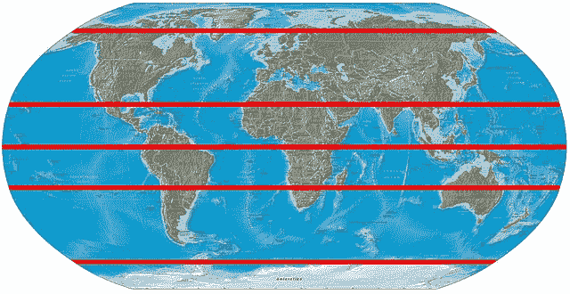
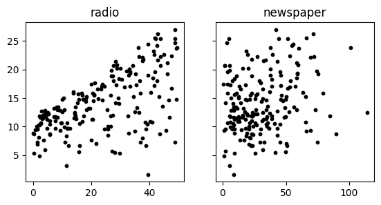
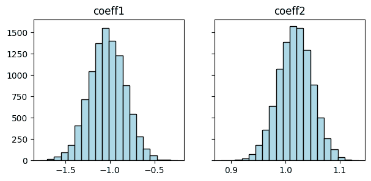
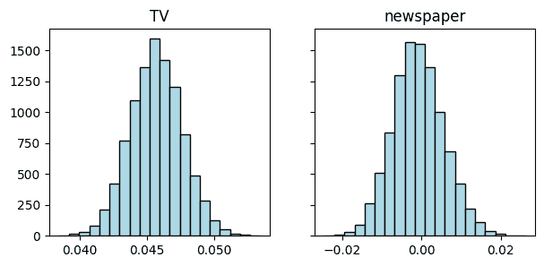

# 2.7\. 在线补充材料

> 原文：[`mmids-textbook.github.io/chap02_ls/supp/roch-mmids-ls-supp.html`](https://mmids-textbook.github.io/chap02_ls/supp/roch-mmids-ls-supp.html)

## 2.7.1\. 问答、解答、代码等。#

### 2.7.1.1\. 仅代码。#

本章代码的交互式 Jupyter 笔记本可以在此访问（推荐使用 Google Colab）。鼓励您对其进行实验。一些建议的计算练习散布在笔记本中。笔记本也可以作为幻灯片查看。

+   [笔记本](https://github.com/MMiDS-textbook/MMiDS-textbook.github.io/blob/main/just_the_code/roch_mmids_chap_ls_notebook.ipynb) ([在 Colab 中打开](https://colab.research.google.com/github/MMiDS-textbook/MMiDS-textbook.github.io/blob/main/just_the_code/roch_mmids_chap_ls_notebook.ipynb))

+   [幻灯片](https://raw.githack.com/MMiDS-textbook/MMiDS-textbook.github.io/main/just_the_code/roch_mmids_chap_ls_notebook_slides.slides.html)

### 2.7.1.2\. 自我评估问答。#

通过以下链接可以获得自我评估问答的更广泛的网络版本。

+   [第 2.2 节](https://raw.githack.com/MMiDS-textbook/MMiDS-textbook.github.io/main/quizzes/self-assessment/quiz_2_2.html)

+   [第 2.3 节](https://raw.githack.com/MMiDS-textbook/MMiDS-textbook.github.io/main/quizzes/self-assessment/quiz_2_3.html)

+   [第 2.4 节](https://raw.githack.com/MMiDS-textbook/MMiDS-textbook.github.io/main/quizzes/self-assessment/quiz_2_4.html)

+   [第 2.5 节](https://raw.githack.com/MMiDS-textbook/MMiDS-textbook.github.io/main/quizzes/self-assessment/quiz_2_5.html)

### 2.7.1.3\. 自动问答。#

本章的自动生成的问答可以通过以下链接访问（推荐使用 Google Colab）。

+   [自动问答](https://github.com/MMiDS-textbook/MMiDS-textbook.github.io/blob/main/quizzes/auto_quizzes/roch-mmids-ls-autoquiz.ipynb) ([在 Colab 中打开](https://colab.research.google.com/github/MMiDS-textbook/MMiDS-textbook.github.io/blob/main/quizzes/auto_quizzes/roch-mmids-ls-autoquiz.ipynb))

### 2.7.1.4\. 奇数练习题的解答。#

*(由 Claude、Gemini 和 ChatGPT 协助)*

E2.2.1 的答案和解释：是的，\(U\)是\(\mathbb{R}³\)的线性子空间。设\(u_1 = (x_1, y_1, z_1), u_2 = (x_2, y_2, z_2) \in U\)且\(\alpha \in \mathbb{R}\)。那么

$$\begin{align*} x_1 + 2y_1 - z_1 &= 0 \\ x_2 + 2y_2 - z_2 &= 0 \\ \alpha(x_1 + 2y_1 - z_1) + (x_2 + 2y_2 - z_2) &= 0 \\ (\alpha x_1 + x_2) + 2(\alpha y_1 + y_2) - (\alpha z_1 + z_2) &= 0 \end{align*}$$

因此\(\alpha u_1 + u_2 \in U\)，证明了\(U\)是一个线性子空间。

E2.2.3 的答案和解释：\(U\)的一个基是\(\{(1, 1, 0), (-1, 0, 1)\}\)。任何属于\(U\)的向量\((x, y, z)\)可以写成

$$\begin{align*} (x, y, z) &= (y-z, y, z) \\ &= y(1, 1, 0) + z(-1, 0, 1) \end{align*}$$

因此，\(\{(1, 1, 0), (-1, 0, 1)\}\) 张成 \(U\)。它们也是线性无关的，因为 \(\alpha(1, 1, 0) + \beta(-1, 0, 1) = \mathbf{0}\) 意味着 \(\alpha = \beta = 0\)。因此，这是 \(U\) 的一个基。

对 E2.2.5 的答案和解释：是的，\(u_1\) 和 \(u_2\) 形成一个正交归一列表。我们有

$$\begin{align*} \|u_1\| &= \sqrt{(1/\sqrt{2})² + (1/\sqrt{2})²} = 1 \\ \|u_2\| &= \sqrt{(1/\sqrt{2})² + (-1/\sqrt{2})²} = 1 \\ \langle u_1, u_2 \rangle &= (1/\sqrt{2})(1/\sqrt{2}) + (1/\sqrt{2})(-1/\sqrt{2}) = 0 \end{align*}$$

所以 \(u_1\) 和 \(u_2\) 是单位向量，并且彼此正交。

对 E2.2.7 的答案和解释：\(A\) 是非奇异的。它的列是 \((1, 3)\) 和 \((2, 4)\)，它们是线性无关的

$$\begin{align*} \alpha(1, 3) + \beta(2, 4) &= (0, 0) \\ \alpha + 2\beta &= 0 \\ 3\alpha + 4\beta &= 0 \end{align*}$$

这个系统只有平凡解 \(\alpha = \beta = 0\)。所以 \(A\) 的列是线性无关的，并且由于 \(A\) 是一个 \(2 \times 2\) 矩阵，这意味着它有秩 2 并且是非奇异的。

对 E2.2.9 的答案和解释：

$$ \mathbf{v} = \alpha \mathbf{w}_1 + \beta \mathbf{w}_2 \implies (2, 3, 5) = \alpha (1, 0, 1) + \beta (0, 1, 1). $$

解这个方程组

$$ 2 = \alpha, \quad 3 = \beta, \quad 5 = \alpha + \beta. $$

将 \(\alpha = 2\) 和 \(\beta = 3\) 代入第三个方程

$$ 5 = 2 + 3 \implies \alpha = 2, \beta = 3. $$

因此，\(\mathbf{v} = 2\mathbf{w}_1 + 3\mathbf{w}_2\).

对 E2.2.11 的答案和解释：为了找到零空间，我们需要解齐次系统 \(B\mathbf{x} = \mathbf{0}\)：

$$\begin{split} \begin{pmatrix} 1 & 2 & 3 \\ 4 & 5 & 6 \end{pmatrix} \begin{pmatrix} x_1 \\ x_2 \\ x_3 \end{pmatrix} = \begin{pmatrix} 0 \\ 0 \end{pmatrix} \end{split}$$

这给我们提供了两个方程和三个未知数：

$$\begin{align*} x_1 + 2x_2 + 3x_3 &= 0 \tag{1}\\ 4x_1 + 5x_2 + 6x_3 &= 0 \tag{2} \end{align*}$$

将方程（1）乘以 4：

$$ 4x_1 + 8x_2 + 12x_3 = 0 \tag{3} $$

从方程（2）中减去方程（3）：

$$ (5-8)x_2 + (6-12)x_3 = 0 $$

这简化为：

$$ -3x_2 - 6x_3 = 0 $$

除以 -3：\( x_2 = -2x_3 \)

现在，将这个结果代入方程（1）：

$$\begin{align*} x_1 + 2(-2x_3) + 3x_3 &= 0 \\ x_1 - 4x_3 + 3x_3 &= 0 \\ x_1 - x_3 &= 0 \end{align*}$$

因此：

$$ x_1 = x_3 $$

设 \(x_3 = t\)（一个自由参数），我们得到：

$$\begin{split} \begin{pmatrix} x_1 \\ x_2 \\ x_3 \end{pmatrix} = \begin{pmatrix} t \\ -2t \\ t \end{pmatrix} = t \begin{pmatrix} 1 \\ -2 \\ 1 \end{pmatrix} \end{split}$$

\(B\) 的零空间是向量 \(\begin{pmatrix} 1 \\ -2 \\ 1 \end{pmatrix}\) 的张成。

对 E2.2.13 的答案和解释：为了确定线性无关性，我们需要检查 \(\alpha_1\mathbf{u}_1 + \alpha_2\mathbf{u}_2 + \alpha_3\mathbf{u}_3 = \mathbf{0}\) 的唯一解是否是 \(\alpha_1 = \alpha_2 = \alpha_3 = 0\)。

让我们写出这个向量方程：

$$\begin{split} \alpha_1 \begin{pmatrix} 1 \\ 2 \\ 3 \end{pmatrix} + \alpha_2 \begin{pmatrix} 2 \\ -1 \\ 0 \end{pmatrix} + \alpha_3 \begin{pmatrix} 1 \\ 8 \\ 6 \end{pmatrix} = \begin{pmatrix} 0 \\ 0 \\ 0 \end{pmatrix} \end{split}$$

这给我们一个包含三个方程的系统：

$$\begin{align*} \alpha_1 + 2\alpha_2 + \alpha_3 &= 0 \tag{1}\\ 2\alpha_1 - \alpha_2 + 8\alpha_3 &= 0 \tag{2}\\ 3\alpha_1 + 0\alpha_2 + 6\alpha_3 &= 0 \tag{3} \end{align*}$$

从方程（3）：

$$ 3\alpha_1 + 6\alpha_3 = 0 $$

这给我们：

$$ \alpha_1 = -2\alpha_3 \tag{4} $$

将此代入方程（1）：

$$\begin{align*} -2\alpha_3 + 2\alpha_2 + \alpha_3 &= 0\\ 2\alpha_2 - \alpha_3 &= 0\\ \alpha_2 &= \frac{\alpha_3}{2} \tag{5} \end{align*}$$

现在我们通过代入方程（4）和（5）来检查方程（2）：

$$\begin{align*} 2(-2\alpha_3) - \frac{\alpha_3}{2} + 8\alpha_3 &= 0\\ -4\alpha_3 - \frac{\alpha_3}{2} + 8\alpha_3 &= 0\\ \end{align*}$$

简化：

$$\begin{align*} -4\alpha_3 - \frac{\alpha_3}{2} + 8\alpha_3 &= 0\\ \frac{-8\alpha_3 - \alpha_3 + 16\alpha_3}{2} &= 0\\ \frac{7\alpha_3}{2} &= 0 \end{align*}$$

由于 \(\frac{7\alpha_3}{2} = 0\) 意味着 \(\alpha_3 = 0\)，并且从方程（4）和（5）中，我们得到 \(\alpha_1 = 0\) 和 \(\alpha_2 = 0\)。

因此，该系统的唯一解是平凡解 \(\alpha_1 = \alpha_2 = \alpha_3 = 0\)，这意味着向量 \(\mathbf{u}_1\)，\(\mathbf{u}_2\) 和 \(\mathbf{u}_3\) 是线性无关的。

考虑方程 \(\alpha_1\mathbf{u}_1 + \alpha_2\mathbf{u}_2 + \alpha_3\mathbf{u}_3 = 0\)。这导致以下方程组

$$ \alpha_1 + 2\alpha_2 + \alpha_3 = 0 $$$$ 2\alpha_1 - \alpha_2 + 8\alpha_3 = 0 $$$$ 3\alpha_1 + 6\alpha_3 = 0 $$

解这个系统，我们得到 \(\alpha_1 = -2\alpha_3\) 和 \(\alpha_2 = \alpha_3\)。选择 \(\alpha_3 = 1\)，我们得到一个非平凡解 \(\alpha_1 = -2\)，\(\alpha_2 = 1\)，\(\alpha_3 = 1\)。因此，这些向量是线性相关的。

E2.2.15 的答案和证明：我们可以将这个系统写成 \(A\mathbf{x} = \mathbf{b}\)，其中 \(A = \begin{bmatrix} 2 & 1 \\ 1 & -1 \end{bmatrix}\)，\(\mathbf{x} = \begin{bmatrix} x \\ y \end{bmatrix}\)，和 \(\mathbf{b} = \begin{bmatrix} 3 \\ 1 \end{bmatrix}\)。由于 \(\det(A) = -3 \neq 0\)，\(A\) 是可逆的。我们发现 \(A^{-1} = \frac{1}{-3} \begin{bmatrix} -1 & -1 \\ -1 & 2 \end{bmatrix}\)。

然后，解为

$$\begin{split} \mathbf{x} = A^{-1}\mathbf{b} = \frac{1}{-3} \begin{bmatrix} -1 & -1 \\ -1 & 2 \end{bmatrix} \begin{bmatrix} 3 \\ 1 \end{bmatrix} = \begin{bmatrix} \frac{4}{3} \\ -\frac{1}{3} \end{bmatrix}. \end{split}$$

E2.3.1 的答案和证明：虽然

$$\begin{split} Q^T Q = \begin{pmatrix} 1 & 0\\ 0 & 1 \end{pmatrix} = I_{2 \times 2}, \end{split}$$

矩阵 \(Q\) 不是方阵。因此，\(Q\) 不是正交矩阵。

E2.3.3 的答案和证明：

$$ \mathrm{proj}_{U} \mathbf{v} = \frac{\langle \mathbf{v}, \mathbf{u} \rangle}{\|\mathbf{u}\|²} \mathbf{u} = \frac{(2 \cdot 1 + 3 \cdot 1)}{(1² + 1²)} \mathbf{u} = \frac{5}{2} (1, 1) = \left(\frac{5}{2}, \frac{5}{2}\right). $$

E2.3.5 的答案和解释：向量 \(\mathbf{v}\) 在 \(\mathbf{u}\) 上的投影由以下公式给出

$$\begin{split} \text{proj}_{\mathbf{u}} \mathbf{v} = \frac{\langle \mathbf{u}, \mathbf{v} \rangle}{\|\mathbf{u}\|²} \mathbf{u} = \frac{(1)(1) + (1)(2) + (0)(1)}{1² + 1² + 0²} \begin{bmatrix} 1 \\ 1 \\ 0 \end{bmatrix} = \frac{3}{2} \begin{bmatrix} 1 \\ 1 \\ 0 \end{bmatrix} = \begin{bmatrix} \frac{3}{2} \\ \frac{3}{2} \\ 0 \end{bmatrix}. \end{split}$$

E2.3.7 的答案和解释：使用文本中给出的 \(U\) 的正交基 \(\{\mathbf{q}_1, \mathbf{q}_2\}\)，我们有：$\(\mathrm{proj}_U \mathbf{v} = \langle \mathbf{v}, \mathbf{q}_1 \rangle \mathbf{q}_1 + \langle \mathbf{v}, \mathbf{q}_2 \rangle \mathbf{q}_2 = \frac{4}{\sqrt{2}} \cdot \frac{1}{\sqrt{2}}(1, 0, 1) + \frac{5}{\sqrt{6}} \cdot \frac{1}{\sqrt{6}}(-1, 2, 1) = (\frac{7}{3}, \frac{10}{3}, \frac{13}{3}).\)$

E2.3.9 的答案和解释：从 E2.3.7 和 E2.3.8，我们有：

$$ \mathrm{proj}_U \mathbf{v} = (\frac{7}{3}, \frac{10}{3}, \frac{13}{3}), \quad \mathbf{v} - \mathrm{proj}_U \mathbf{v} = (-\frac{1}{3}, -\frac{1}{3}, \frac{2}{3}). $$

计算平方范数：

$$ \|\mathbf{v}\|² = 1² + 2² + 3² = 14, \quad \|\mathrm{proj}_U \mathbf{v}\|² = (\frac{7}{3})² + (\frac{10}{3})² + (\frac{13}{3})² = \frac{146}{3}, \quad \|\mathbf{v} - \mathrm{proj}_U \mathbf{v}\|² = (-\frac{1}{3})² + (-\frac{1}{3})² + (\frac{2}{3})² = \frac{2}{3}. $$

事实上，\(\|\mathbf{v}\|² = 14 = \frac{146}{3} + \frac{2}{3} = \|\mathrm{proj}_U \mathbf{v}\|² + \|\mathbf{v} - \mathrm{proj}_U \mathbf{v}\|²\)，验证了勾股定理。

E2.3.11 的答案和解释：由于 \(\mathbf{u}_1\) 不是一个单位向量，我们首先对其进行归一化：\(\mathbf{q}_1 = \frac{\mathbf{u}_1}{\|\mathbf{u}_1\|} = \frac{1}{3}\begin{pmatrix} 2 \\ 1 \\ -2 \end{pmatrix}\)。然后，\(\mathrm{proj}_{\mathbf{u}_1} \mathbf{u}_2 = \langle \mathbf{u}_2, \mathbf{q}_1 \rangle \mathbf{q}_1 = \frac{1}{9} \begin{pmatrix} 2 \\ 1 \\ -2 \end{pmatrix}\)。

E2.3.13 的答案和解释：我们要找到所有满足 \(\begin{pmatrix} x \\ y \\ z \end{pmatrix} \cdot \begin{pmatrix} 1 \\ 1 \\ 0 \end{pmatrix} = 0\) 的向量 \(\begin{pmatrix} x \\ y \\ z \end{pmatrix}\)。这给出了方程 \(x + y = 0\)，或者 \(x = -y\)。因此，任何形式为 \(\begin{pmatrix} -y \\ y \\ z \end{pmatrix} = y\begin{pmatrix} -1 \\ 1 \\ 0 \end{pmatrix} + z\begin{pmatrix} 0 \\ 0 \\ 1 \end{pmatrix}\) 的向量都在 \(W^\perp\) 中。所以，\(W^\perp\) 的一个基是 \(\left\{\begin{pmatrix} -1 \\ 1 \\ 0 \end{pmatrix}, \begin{pmatrix} 0 \\ 0 \\ 1 \end{pmatrix}\right\}\)。

E2.3.15 的答案和解释：

$$\begin{split} A^T A = \begin{pmatrix} 1 & 1 \\ 1 & -1 \end{pmatrix}^T \begin{pmatrix} 1 & 1 \\ 1 & -1 \end{pmatrix} = \begin{pmatrix} 2 & 0 \\ 0 & 2 \end{pmatrix}, \quad A^T \mathbf{b} = \begin{pmatrix} 1 & 1 \\ 1 & -1 \end{pmatrix}^T \begin{pmatrix} 3 \\ 1 \end{pmatrix} = \begin{pmatrix} 4 \\ 2 \end{pmatrix}. \end{split}$$

因此，\(\mathbf{x} = (A^T A)^{-1} A^T \mathbf{b} = \begin{pmatrix} 2 & 0 \\ 0 & 2 \end{pmatrix}^{-1} \begin{pmatrix} 4 \\ 2 \end{pmatrix} = \begin{pmatrix} 2 \\ 1 \end{pmatrix}\).

E2.4.1 的答案和证明：\(\mathbf{q}_1 = \frac{\mathbf{a}_1}{\|\mathbf{a}_1\|} = (1, 0)\)，\(\mathbf{v}_2 = \mathbf{a}_2 - \langle \mathbf{q}_1, \mathbf{a}_2 \rangle \mathbf{q}_1 = (0, 1)\)，\(\mathbf{q}_2 = \frac{\mathbf{v}_2}{\|\mathbf{v}_2\|} = (0, 1)\).

E2.4.3 的答案和证明：设\(\mathbf{w}_1 = (1, 1)\)和\(\mathbf{w}_2 = (1, 0)\)。然后

$$\begin{align*} \mathbf{q}_1 &= \frac{\mathbf{w}_1}{\|\mathbf{w}_1\|} = (\frac{1}{\sqrt{2}}, \frac{1}{\sqrt{2}}) \\ \mathbf{q}_2 &= \frac{\mathbf{w}_2 - \langle \mathbf{w}_2, \mathbf{q}_1 \rangle \mathbf{q}_1}{\|\mathbf{w}_2 - \langle \mathbf{w}_2, q_1 \rangle q_1\|} \\ &= \frac{(1, 0) - (\frac{1}{\sqrt{2}})(\frac{1}{\sqrt{2}}, \frac{1}{\sqrt{2}})}{\sqrt{1 - (\frac{1}{\sqrt{2}})²}} \\ &= (\frac{1}{\sqrt{2}}, -\frac{1}{\sqrt{2}}) \end{align*}$$

因此\(\{\mathbf{q}_1, \mathbf{q}_2\}\)是一个正交基。

E2.4.5 的答案和证明：使用 E2.4.4 中的正交基\(\{\mathbf{q}_1, \mathbf{q}_2\}\)，我们有\(Q = [\mathbf{q}_1\ \mathbf{q}_2]\)。为了找到\(R\)，我们观察到\(\mathbf{a}_1 = \sqrt{3}\mathbf{q}_1\)和\(\mathbf{a}_2 = \frac{1}{\sqrt{3}}\mathbf{q}_1 + \frac{5}{\sqrt{21}}\mathbf{q}_2\)。因此，\(R = \begin{pmatrix} \sqrt{3} & \frac{1}{\sqrt{3}} \\ 0 & \frac{5}{\sqrt{21}} \end{pmatrix}\).

E2.4.7 的答案和证明：\(\mathbf{x} = (2, 1)\)。从第二个方程，\(3x_2 = 3\)，所以\(x_2 = 1\)。将\(x_2\)代入第一个方程，\(2x_1 - 1 = 4\)，所以\(x_1 = 2\).

E2.4.9 的答案和证明：\(H = I_{3 \times 3} - 2\mathbf{z}\mathbf{z}^T/\|\mathbf{z}\|² = \begin{pmatrix} 0 & 1 & 0 \\ 1 & 0 & 0 \\ 0 & 0 & 1 \end{pmatrix}\).

E2.4.11 的答案和证明：为了验证\(H_1\)是正交的，我们检查\(H_1^T H_1 = I_{2 \times 2}\)是否成立：

$$\begin{split} H_1^T H_1 = \begin{pmatrix} \frac{7}{5} & -\frac{6}{5} \\ -\frac{6}{5} & -\frac{1}{5} \end{pmatrix} \begin{pmatrix} \frac{7}{5} & -\frac{6}{5} \\ -\frac{6}{5} & -\frac{1}{5} \end{pmatrix} = \begin{pmatrix} 1 & 0 \\ 0 & 1 \end{pmatrix} = I_{2 \times 2}. \end{split}$$

为了验证\(H_1\)是对称的，我们检查\(H_1^T = H_1\)是否成立，通过观察可以知道这是真的。

对 E2.4.13 的答案和解释：我们有 \(H_1 A = R\)，其中 \(R = \begin{pmatrix} -\frac{\sqrt{10}}{5} & -\frac{2}{\sqrt{10}} \\ 0 & \frac{14}{5} \end{pmatrix}\) 是上三角矩阵。因此，\(Q^T = H_1\)，且 \(Q = H_1^T = \begin{pmatrix} \frac{7}{5} & \frac{6}{5} \\ -\frac{6}{5} & \frac{1}{5} \end{pmatrix}\)。

对 E2.4.15 的答案和解释：设 \(\mathbf{y}_1 = (3, 4)^T\) 为 \(A\) 的第一列。那么 \(\mathbf{z}_1 = \|\mathbf{y}_1\| \mathbf{e}_1^{(2)} - \mathbf{y}_1 = (5, -4)^T\) 和 \(H_1 = I_{2 \times 2} - 2\mathbf{z}_1\mathbf{z}_1^T / \|\mathbf{z}_1\|² = \begin{pmatrix} 3/5 & 4/5 \\ 4/5 & -3/5 \end{pmatrix}\)。我们可以验证 \(H_1 A = \begin{pmatrix} 5 & 1 \\ 0 & -2/5 \end{pmatrix}\)。

对 E2.4.17 的答案和解释：

$$\begin{align*} Q &= \begin{pmatrix} \frac{1}{\sqrt{2}} & \frac{1}{\sqrt{2}} \\ \frac{1}{\sqrt{2}} & -\frac{1}{\sqrt{2}} \end{pmatrix}, \\ R &= Q^T A = \begin{pmatrix} \sqrt{2} & 0 \\ 0 & \sqrt{2} \end{pmatrix}, \\ Q^T \mathbf{b} &= \begin{pmatrix} \frac{1}{\sqrt{2}} & \frac{1}{\sqrt{2}} \\ \frac{1}{\sqrt{2}} & -\frac{1}{\sqrt{2}} \end{pmatrix} \begin{pmatrix} 2 \\ 0 \end{pmatrix} = \begin{pmatrix} \sqrt{2} \\ \sqrt{2} \end{pmatrix}, \\ R \mathbf{x} &= Q^T \mathbf{b}, \quad \begin{pmatrix} \sqrt{2} & 0 \\ 0 & \sqrt{2} \end{pmatrix} \mathbf{x} = \begin{pmatrix} \sqrt{2} \\ \sqrt{2} \end{pmatrix}, \\ \mathbf{x} &= \begin{pmatrix} 1 \\ 1 \end{pmatrix}. \end{align*}$$

解是 \(\mathbf{x} = \begin{pmatrix} 1 \\ 1 \end{pmatrix}\)。

对 E2.5.1 的答案和解释：

$$\begin{split} A = \begin{bmatrix} 1 & 1 \\ 1 & 2 \\ 1 & 3 \\ 1 & 4 \end{bmatrix}, \quad \mathbf{y} = \begin{bmatrix} 2 \\ 4 \\ 5 \\ 7 \end{bmatrix}. \end{split}$$

正则方程是：

$$\begin{split} A^T A \boldsymbol{\beta} = A^T \mathbf{y} \Rightarrow \begin{pmatrix} 4 & 10 \\ 10 & 30 \end{pmatrix} \begin{pmatrix} \beta_0 \\ \beta_1 \end{pmatrix} = \begin{pmatrix} 18 \\ 47 \end{pmatrix}. \end{split}$$

解这个方程组得到 \(\beta_0 = \frac{1}{2}\) 和 \(\beta_1 = \frac{3}{2}\)。

对 E2.5.3 的答案和解释：

$$\begin{split} A = \begin{bmatrix} 1 & 1 \\ 1 & 2 \\ 1 & 3 \end{bmatrix} \quad \mathbf{y} = \begin{bmatrix} 3 \\ 5 \\ 8 \end{bmatrix} \end{split}$$

对 E2.5.5 的答案和解释：

$$\begin{split} \boldsymbol{\beta} = \begin{bmatrix} \beta_0 \\ \beta_1 \end{bmatrix} = (A^T A)^{-1} A^T \mathbf{y} = \begin{bmatrix} 1 \\ 2 \end{bmatrix} \end{split}$$

我们通过求 \(A^T A\) 的逆并乘以 \(A^T \mathbf{y}\) 来解这个线性方程组。

对 E2.5.7 的答案和解释：

$$\begin{split} A = \begin{bmatrix} 1 & -1 & 1 \\ 1 & 0 & 0 \\ 1 & 1 & 1 \end{bmatrix} \end{split}$$

对于一个二次模型，我们需要为 \(1\)、\(x\) 和 \(x²\) 准备列。

对 E2.5.9 的答案和解释：我们解正则方程 \(A^T A \boldsymbol{\beta} = A^T \mathbf{y}\)。

$$\begin{align*} A^T A &= \begin{pmatrix} 1 & 1 & 1 \\ 1 & 2 & 3 \end{pmatrix} \begin{pmatrix} 1 & 1 \\ 1 & 2 \\ 1 & 3 \end{pmatrix} = \begin{pmatrix} 3 & 6 \\ 6 & 14 \end{pmatrix}, \\ A^T \mathbf{y} &= \begin{pmatrix} 1 & 1 & 1 \\ 1 & 2 & 3 \end{pmatrix} \begin{pmatrix} 1 \\ 2 \\ 3 \end{pmatrix} = \begin{pmatrix} 6 \\ 14 \end{pmatrix}. \end{align*}$$

解方程 \(\begin{pmatrix} 3 & 6 \\ 6 & 14 \end{pmatrix} \boldsymbol{\beta} = \begin{pmatrix} 6 \\ 14 \end{pmatrix}\)：

$$\begin{align*} \boldsymbol{\beta} &= \begin{pmatrix} \beta_0 \\ \beta_1 \end{pmatrix} = \begin{pmatrix} 0 \\ 1 \end{pmatrix}. \end{align*}$$

回答并证明 E2.5.11：计算预测的 \(y\) 值：

$$\begin{align*} \hat{y}_1 &= 2(1) + 1 = 3, \\ \hat{y}_2 &= 2(2) + 1 = 5, \\ \hat{y}_3 &= 2(3) + 1 = 7. \end{align*}$$

计算残差：

$$\begin{align*} r_1 &= 3 - 3 = 0, \\ r_2 &= 5 - 5 = 0, \\ r_3 &= 7 - 7 = 0. \end{align*}$$

RSS 是：

$$\begin{align*} \mathrm{RSS} &= 0² + 0² + 0² = 0. \end{align*}$$

### 2.7.1.5\. 学习成果#

+   定义向量空间中的线性子空间、张成和基的概念。

+   检查一组向量线性无关或形成向量空间基的条件。

+   定义非奇异矩阵的逆，并证明其唯一性。

+   定义线性子空间的维度。

+   陈述毕达哥拉斯定理。

+   验证给定的向量列表是否为正交归一。

+   推导向量在正交基展开中的系数。

+   应用格拉姆-施密特过程将一组基转换为正交基。

+   证明与向量空间和矩阵逆相关的关键定理，例如正交向量的毕达哥拉斯定理和矩阵列线性无关的条件。

+   使用理论定义和数值示例说明线性子空间及其基的例子。

+   定义向量在线性子空间上的正交投影，并从几何上描述它。

+   计算向量在由正交向量列表张成的线性子空间上的正交投影。

+   使用几何直觉说明寻找向量在子空间上正交投影的过程。

+   证明正交投影的唯一性。

+   以矩阵形式表示正交投影。

+   定义线性子空间的正交补，并找到它的正交基。

+   陈述并证明正交分解引理，并使用它将一个向量分解为其正交投影和一个正交补中的向量。

+   将线性最小二乘问题表述为优化问题，并推导出正则方程。

+   应用正交投影和正交补的概念，使用最小二乘法求解超定系统。

+   根据矩阵列的线性无关性确定最小二乘解的唯一性。

+   实现 Gram-Schmidt 算法，从一组线性无关的向量中获得正交归一基。

+   使用矩阵分解的视角，即 QR 分解，表达 Gram-Schmidt 算法。

+   将 QR 分解应用于求解线性最小二乘问题，作为正则方程方法的替代方案。

+   定义豪斯霍尔德反射并解释它们在引入矩阵下三角零元素中的作用。

+   使用一系列豪斯霍尔德变换构建 QR 分解。

+   比较 Gram-Schmidt 算法和豪斯霍尔德变换方法在计算 QR 分解时的数值稳定性。

+   将线性回归问题表述为线性最小二乘优化问题。

+   通过在设计矩阵中引入高阶项和交互项来扩展线性回归模型为多项式回归。

+   识别并解释多项式回归中的过拟合问题及其潜在后果。

+   将最小二乘法应用于模拟数据和现实世界数据集，例如广告数据集，以估计回归系数。

+   理解并实现线性回归的 bootstrap 方法，以评估估计系数的变异性并确定结果的统计显著性。

\(\aleph\)

## 2.7.2\. 其他部分#

### 2.7.2.1\. 高维正交性#

在高维中，正交性——或者更准确地说，近正交性——比人们预期的更为常见。我们在此展示这一现象。

设 \(\mathbf{X}\) 为标准正态 \(d\) 向量。其联合概率密度函数仅依赖于其范数 \(\|\mathbf{X}\|\)。因此，\(\mathbf{Y} = \frac{\mathbf{X}}{\|\mathbf{X}\|}\) 在 \((d-1)\)-球面 \(\mathcal{S} = \{\mathbf{x}\in \mathbb{R}^d:\|\mathbf{x}\|=1\}\) 上均匀分布，即以原点为中心的单位 \(d\) 球面的表面。我们记 \(\mathbf{Y} \sim \mathrm{U}[\mathcal{S}]\)。以下定理表明，如果我们取两个独立的样本 \(\mathbf{Y}_1, \mathbf{Y}_2 \sim \mathrm{U}[\mathcal{S}]\)，当 \(d\) 很大时，它们很可能是近正交的，即 \(|\langle\mathbf{Y}_1, \mathbf{Y}_2\rangle|\) 很可能是小的。由于对称性，取其中一个向量作为北极 \(\mathbf{e}_d = (0,\ldots,0,1)\) 并不失一般性。另一种表述定理的方式是，\((d-1)\)-球面的大部分质量集中在赤道附近的一个小带状区域内。

**图：赤道附近的带状区域 ([来源](https://commons.wikimedia.org/wiki/File:World_map_with_major_latitude_circles.jpg))



\(\bowtie\)

**定理** **（高维正交性）** 设 \(\mathcal{S} = \{\mathbf{x}\in \mathbb{R}^d:\|\mathbf{x}\|=1\}\) 和 \(\mathbf{Y} \sim \mathrm{U}[\mathcal{S}]\)。那么对于任意 \(\varepsilon > 0\)，当 \(d \to +\infty\) 时，

$$ \mathbb{P}[|\langle\mathbf{Y}, \mathbf{e}_d\rangle| \geq \varepsilon] \to 0. $$

\(\sharp\)

*证明思路:* 我们将 \(\mathbf{Y}\) 用标准正态分布表示。其平方范数是独立随机变量的和。在将其带入分子后，我们可以应用 *切比雪夫* 不等式。

*证明:* 回想一下，\(\mathbf{Y}\) 是 \(\frac{\mathbf{X}}{\|\mathbf{X}\|}\)，其中 \(\mathbf{X}\) 是标准正态 \(d\) 向量。我们想要界定的概率可以重新写为

$$\begin{align*} \mathbb{P}[|\langle\mathbf{Y}, \mathbf{e}_d\rangle| \geq \varepsilon] &= \mathbb{P}\left[\left|\left\langle\frac{\mathbf{X}}{\|\mathbf{X}\|}, \mathbf{e}_d\right\rangle\right|² \geq \varepsilon²\right]\\ &= \mathbb{P}\left[\left|\frac{\langle\mathbf{X},\mathbf{e}_d\rangle}{\|\mathbf{X}\|}\right|² \geq \varepsilon²\right]\\ &= \mathbb{P}\left[\frac{X_d²}{\sum_{j=1}^d X_j²} \geq \varepsilon²\right]\\ &= \mathbb{P}\left[X_d² \geq \varepsilon² \sum_{j=1}^d X_j²\right]\\ &= \mathbb{P}\left[\sum_{j=1}^{d-1} (-\varepsilon² X_j²) + (1-\varepsilon²) X_d² \geq 0\right]. \end{align*}$$

我们现在正在观察一个独立（但非同分布）的随机变量的和

$$ Z = \sum_{j=1}^{d-1} (-\varepsilon² X_j²) + (1-\varepsilon²) X_d² $$

我们可以求助于我们常用的切比雪夫工具。期望值，根据线性性质，

$$ \mathbb{E}[Z] = - \sum_{j=1}^{d-1} \varepsilon² \mathbb{E}[X_j²] + (1-\varepsilon²) \mathbb{E}[X_d²] = \{- (d-1) \,\varepsilon² + (1-\varepsilon²)\} $$

其中我们使用了 \(X_1,\ldots,X_d\) 是标准正态变量，并且特别地，它们的均值是 \(0\)，它们的方差是 \(1\)，因此 \(\mathbb{E}[X_1²] = 1\)。

方差是由 \(X_j\) 的独立性决定的，

$$\begin{align*} \mathrm{Var}[Z] &= \sum_{j=1}^{d-1} \varepsilon⁴ \mathrm{Var}[X_j²] + (1-\varepsilon²)² \mathrm{Var}[X_d²]\\ &= \{(d-1) \,\varepsilon⁴ + (1-\varepsilon²)²\}\mathrm{Var}[X_1²]. \end{align*}$$

因此，通过切比雪夫不等式

$$\begin{align*} \mathbb{P}\left[Z \geq 0\right] &\leq \mathbb{P}\left[\left|Z - \mathbb{E}[Z]\right|\geq |\mathbb{E}[Z]|\right]\\ &\leq \frac{\mathrm{Var}[Z]}{\mathbb{E}[Z]²}\\ &= \frac{\{(d-1) \,\varepsilon⁴ + (1-\varepsilon²)²\} \mathrm{Var}[X_1²]}{\{- (d-1) \,\varepsilon² + (1-\varepsilon²)\}²}\\ &\to 0 \end{align*}$$

当 \(d \to +\infty\) 时。为了得到我们观察到的极限，我们注意到，对于大的 \(d\)，分母的规模类似于 \(d²\)，而分子仅类似于 \(d\)。 \(\square\)

### 2.7.2.2\. 线性回归的 Bootstrapping#

我们回到线性情况，但这次是使用完整的预测变量集。

```py
data = pd.read_csv('advertising.csv')
TV = data['TV'].to_numpy()
sales = data['sales'].to_numpy()
n = np.size(TV) 
```

```py
radio = data['radio'].to_numpy()
newspaper = data['newspaper'].to_numpy()

f, (ax1, ax2) = plt.subplots(1, 2, sharex=False, sharey=True, figsize=(6.5,3))
ax1.scatter(radio, sales, s=10, c='k')
ax2.scatter(newspaper, sales, s=10, c='k')
ax1.set_title('radio'), ax2.set_title('newspaper')
plt.show() 
```



```py
A = np.stack((np.ones(n), TV, radio, newspaper), axis=-1)
coeff = mmids.ls_by_qr(A,sales)
print(coeff) 
```

```py
[ 2.93888937e+00  4.57646455e-02  1.88530017e-01 -1.03749304e-03] 
```

报纸广告（最后一个系数）似乎对每美元销售额的影响要弱得多。接下来，我们简要概述一种评估此类结论[统计显著性](https://en.wikipedia.org/wiki/Statistical_significance)的方法。

我们的系数是从样本中估计的。我们的采样过程存在内在的变异性。我们想了解我们的估计系数与真实系数相比如何。这在[[Data8](https://www.inferentialthinking.com/chapters/13/2/Bootstrap.html)，第 13.2 节]]中设置得非常好：

> 数据科学家正在使用随机样本中的数据来估计一个未知参数。她使用样本来计算她将用作估计值的统计量。一旦她计算出了她的统计量的观测值，她就可以将其作为她的估计值并继续前进。但她是一位数据科学家。她知道她的随机样本只是众多可能的随机样本之一，因此她的估计值只是众多可能的估计值之一。这些估计值可以有多少变化？为了回答这个问题，她似乎需要从总体中抽取另一个样本，并基于新的样本计算一个新的估计值。但她没有资源回到总体中抽取另一个样本。看起来数据科学家陷入了困境。幸运的是，一个叫做*bootstrap*的绝妙想法可以帮助她。由于从总体中生成新的样本不可行，bootstrap 通过一种叫做*重采样*的方法生成新的随机样本：新的样本是从原始样本中随机抽取的。

不深入细节（更多内容请参阅[[DS100](http://www.textbook.ds100.org/ch/17/inf_pred_gen_boot.html)，第 17.3 节]），它的工作原理如下。设 \(\{(\mathbf{x}_i, y_i)\}_{i=1}^n\) 为我们的数据。我们假设我们的样本代表总体，并通过从样本中重采样来模拟我们的采样过程。也就是说，我们随机抽取一个有放回的样本 \(\mathcal{X}_{\mathrm{boot},1} = \{(\mathbf{x}_i, y_i)\,:\,i \in I\}\)，其中 \(I\) 是从 \([n]\) 中元素的一个[多重集](https://en.wikipedia.org/wiki/Multiset)，大小为 \(n\)。我们在 \(\mathcal{X}_{\mathrm{boot},1}\) 上重新计算我们的估计系数。然后我们独立地重复进行所需数量的复制 \(\mathcal{X}_{\mathrm{boot},1}, \ldots, \mathcal{X}_{\mathrm{boot},r}\)。绘制结果的系数直方图可以给出我们估计值变异性的某种概念。

接下来，我们在 Python 中实现线性回归的 bootstrap 方法。

```py
def linregboot(rng, A, b, replicates = np.int32(10000)):
    n,m = A.shape
    coeff_boot = np.zeros((m,replicates))
    for i in range(replicates):
        resample = rng.integers(0,n,n)
        Aboot = A[resample,:]
        bboot = b[resample]
        coeff_boot[:,i] = mmids.ls_by_qr(Aboot,bboot)
    return coeff_boot 
```

首先，让我们用一个已知真实情况的简单例子来说明。

```py
seed = 535
rng = np.random.default_rng(seed)

n, b0, b1 = 100, -1, 1
x = np.linspace(0,10,num=n)
y = b0 + b1*x + rng.normal(0,1,n)
A = np.stack((np.ones(n),x),axis=-1) 
```

估计系数如下。

```py
coeff = mmids.ls_by_qr(A,y)
print(coeff) 
```

```py
[-1.03381171  1.01808039] 
```

现在我们应用 bootstrap 并绘制两个系数的直方图。

```py
coeff_boot = linregboot(rng, A,y)

f, (ax1, ax2) = plt.subplots(1, 2, sharex=False, sharey=True, figsize=(7,3))
ax1.hist(coeff_boot[0,:], bins=20, color='lightblue', edgecolor='black')
ax2.hist(coeff_boot[1,:], bins=20, color='lightblue', edgecolor='black')
ax1.set_title('coeff1'), ax2.set_title('coeff2')
plt.show() 
```



我们从直方图中看到，真实的系数值 \(-1\) 和 \(1\) 落在可能的范围内。

我们回到`Advertising`数据集并应用自助法。绘制与报纸广告相对应的系数的直方图显示，\(0\) 是一个合理的值，而对于电视广告则不是。

```py
n = np.size(TV)
A = np.stack((np.ones(n), TV, radio, newspaper), axis=-1)
coeff = mmids.ls_by_qr(A,sales)
print(coeff) 
```

```py
[ 2.93888937e+00  4.57646455e-02  1.88530017e-01 -1.03749304e-03] 
```

```py
coeff_boot = linregboot(rng, A,sales)

f, (ax1, ax2) = plt.subplots(1, 2, sharex=False, sharey=True, figsize=(7,3))
ax1.hist(coeff_boot[1,:], bins=20, color='lightblue', edgecolor='black')
ax2.hist(coeff_boot[3,:], bins=20, color='lightblue', edgecolor='black')
ax1.set_title('TV'), ax2.set_title('newspaper')
plt.show() 
```



## 2.7.1\. 测验、解答、代码等。#

### 2.7.1.1\. 仅代码。#

以下是可以访问的交互式 Jupyter 笔记本，其中包含本章的代码（推荐使用 Google Colab）。鼓励您对其进行实验。一些建议的计算练习散布在其中。笔记本也可以作为幻灯片查看。

+   [笔记本](https://github.com/MMiDS-textbook/MMiDS-textbook.github.io/blob/main/just_the_code/roch_mmids_chap_ls_notebook.ipynb) ([在 Colab 中打开](https://colab.research.google.com/github/MMiDS-textbook/MMiDS-textbook.github.io/blob/main/just_the_code/roch_mmids_chap_ls_notebook.ipynb))

+   [幻灯片](https://raw.githack.com/MMiDS-textbook/MMiDS-textbook.github.io/main/just_the_code/roch_mmids_chap_ls_notebook_slides.slides.html)

### 2.7.1.2\. 自我评估测验。#

通过以下链接可以获取更广泛的自我评估测验的网络版本。

+   [第 2.2 节](https://raw.githack.com/MMiDS-textbook/MMiDS-textbook.github.io/main/quizzes/self-assessment/quiz_2_2.html)

+   [第 2.3 节](https://raw.githack.com/MMiDS-textbook/MMiDS-textbook.github.io/main/quizzes/self-assessment/quiz_2_3.html)

+   [第 2.4 节](https://raw.githack.com/MMiDS-textbook/MMiDS-textbook.github.io/main/quizzes/self-assessment/quiz_2_4.html)

+   [第 2.5 节](https://raw.githack.com/MMiDS-textbook/MMiDS-textbook.github.io/main/quizzes/self-assessment/quiz_2_5.html)

### 2.7.1.3\. 自动测验。#

可以在此处访问本章的自动生成的测验（推荐使用 Google Colab）。

+   [自动测验](https://github.com/MMiDS-textbook/MMiDS-textbook.github.io/blob/main/quizzes/auto_quizzes/roch-mmids-ls-autoquiz.ipynb) ([在 Colab 中打开](https://colab.research.google.com/github/MMiDS-textbook/MMiDS-textbook.github.io/blob/main/quizzes/auto_quizzes/roch-mmids-ls-autoquiz.ipynb))

### 2.7.1.4\. 奇数编号的预热练习的解答。#

*(得益于 Claude、Gemini 和 ChatGPT 的帮助)*

对 E2.2.1 的答案和解释：是的，\(U\) 是 \(\mathbb{R}³\) 的线性子空间。设 \(u_1 = (x_1, y_1, z_1), u_2 = (x_2, y_2, z_2) \in U\) 且 \(\alpha \in \mathbb{R}\)。那么

$$\begin{align*} x_1 + 2y_1 - z_1 &= 0 \\ x_2 + 2y_2 - z_2 &= 0 \\ \alpha(x_1 + 2y_1 - z_1) + (x_2 + 2y_2 - z_2) &= 0 \\ (\alpha x_1 + x_2) + 2(\alpha y_1 + y_2) - (\alpha z_1 + z_2) &= 0 \end{align*}$$

因此，\(\alpha u_1 + u_2 \in U\)，这证明了 \(U\) 是一个线性子空间。

E2.2.3 的答案和解释：\(U\) 的一个基是 \(\{(1, 1, 0), (-1, 0, 1)\}\)。任何属于 \(U\) 的向量 \((x, y, z)\) 可以表示为

$$\begin{align*} (x, y, z) &= (y-z, y, z) \\ &= y(1, 1, 0) + z(-1, 0, 1) \end{align*}$$

因此，\(\{(1, 1, 0), (-1, 0, 1)\}\) 张成 \(U\)。它们也是线性无关的，因为 \(\alpha(1, 1, 0) + \beta(-1, 0, 1) = \mathbf{0}\) 意味着 \(\alpha = \beta = 0\)。因此，这是 \(U\) 的一个基。

E2.2.5 的答案和解释：是的，\(u_1\) 和 \(u_2\) 形成一个正交归一列表。我们有

$$\begin{align*} \|u_1\| &= \sqrt{(1/\sqrt{2})² + (1/\sqrt{2})²} = 1 \\ \|u_2\| &= \sqrt{(1/\sqrt{2})² + (-1/\sqrt{2})²} = 1 \\ \langle u_1, u_2 \rangle &= (1/\sqrt{2})(1/\sqrt{2}) + (1/\sqrt{2})(-1/\sqrt{2}) = 0 \end{align*}$$

所以 \(u_1\) 和 \(u_2\) 是单位向量，并且彼此正交。

E2.2.7 的答案和解释：\(A\) 是非奇异的。它的列是 \((1, 3)\) 和 \((2, 4)\)，它们是线性无关的

$$\begin{align*} \alpha(1, 3) + \beta(2, 4) &= (0, 0) \\ \alpha + 2\beta &= 0 \\ 3\alpha + 4\beta &= 0 \end{align*}$$

这个系统只有一个平凡解 \(\alpha = \beta = 0\)。所以 \(A\) 的列是线性无关的，并且由于 \(A\) 是一个 \(2 \times 2\) 矩阵，这意味着它有秩 2 并且是非奇异的。

E2.2.9 的答案和解释：

$$ \mathbf{v} = \alpha \mathbf{w}_1 + \beta \mathbf{w}_2 \implies (2, 3, 5) = \alpha (1, 0, 1) + \beta (0, 1, 1). $$

解这个方程组

$$ 2 = \alpha, \quad 3 = \beta, \quad 5 = \alpha + \beta. $$

将 \(\alpha = 2\) 和 \(\beta = 3\) 代入第三个方程

$$ 5 = 2 + 3 \implies \alpha = 2, \beta = 3. $$

因此，\(\mathbf{v} = 2\mathbf{w}_1 + 3\mathbf{w}_2\).

E2.2.11 的答案和解释：为了找到零空间，我们需要解齐次系统 \(B\mathbf{x} = \mathbf{0}\)：

$$\begin{split} \begin{pmatrix} 1 & 2 & 3 \\ 4 & 5 & 6 \end{pmatrix} \begin{pmatrix} x_1 \\ x_2 \\ x_3 \end{pmatrix} = \begin{pmatrix} 0 \\ 0 \end{pmatrix} \end{split}$$

这给我们带来了两个未知数的两个方程：

$$\begin{align*} x_1 + 2x_2 + 3x_3 &= 0 \tag{1}\\ 4x_1 + 5x_2 + 6x_3 &= 0 \tag{2} \end{align*}$$

将方程 (1) 乘以 4：

$$ 4x_1 + 8x_2 + 12x_3 = 0 \tag{3} $$

从方程 (3) 中减去方程 (2)：

$$ (5-8)x_2 + (6-12)x_3 = 0 $$

这简化为：

$$ -3x_2 - 6x_3 = 0 $$

除以 -3：\( x_2 = -2x_3 \)$

现在，将这个结果代入方程 (1)：

$$\begin{align*} x_1 + 2(-2x_3) + 3x_3 &= 0 \\ x_1 - 4x_3 + 3x_3 &= 0 \\ x_1 - x_3 &= 0 \end{align*}$$

因此：

$$ x_1 = x_3 $$

设 \(x_3 = t\)（一个自由参数），我们得到：

$$\begin{split} \begin{pmatrix} x_1 \\ x_2 \\ x_3 \end{pmatrix} = \begin{pmatrix} t \\ -2t \\ t \end{pmatrix} = t \begin{pmatrix} 1 \\ -2 \\ 1 \end{pmatrix} \end{split}$$

\(B\)的零空间是向量\(\begin{pmatrix} 1 \\ -2 \\ 1 \end{pmatrix}\)的生成空间。

E2.2.13 的答案和证明：为了确定线性无关性，我们需要检查\(\alpha_1\mathbf{u}_1 + \alpha_2\mathbf{u}_2 + \alpha_3\mathbf{u}_3 = \mathbf{0}\)的唯一解是否是\(\alpha_1 = \alpha_2 = \alpha_3 = 0\)。

让我们写出这个向量方程：

$$\begin{split} \alpha_1 \begin{pmatrix} 1 \\ 2 \\ 3 \end{pmatrix} + \alpha_2 \begin{pmatrix} 2 \\ -1 \\ 0 \end{pmatrix} + \alpha_3 \begin{pmatrix} 1 \\ 8 \\ 6 \end{pmatrix} = \begin{pmatrix} 0 \\ 0 \\ 0 \end{pmatrix} \end{split}$$

这给我们一个包含三个方程的系统：

$$\begin{align*} \alpha_1 + 2\alpha_2 + \alpha_3 &= 0 \tag{1}\\ 2\alpha_1 - \alpha_2 + 8\alpha_3 &= 0 \tag{2}\\ 3\alpha_1 + 0\alpha_2 + 6\alpha_3 &= 0 \tag{3} \end{align*}$$

从方程(3)：

$$ 3\alpha_1 + 6\alpha_3 = 0 $$

这给我们：

$$ \alpha_1 = -2\alpha_3 \tag{4} $$

将这个代入方程(1)：

$$\begin{align*} -2\alpha_3 + 2\alpha_2 + \alpha_3 &= 0\\ 2\alpha_2 - \alpha_3 &= 0\\ \alpha_2 &= \frac{\alpha_3}{2} \tag{5} \end{align*}$$

现在我们通过代入方程(4)和(5)来检查方程(2)：

$$\begin{align*} 2(-2\alpha_3) - \frac{\alpha_3}{2} + 8\alpha_3 &= 0\\ -4\alpha_3 - \frac{\alpha_3}{2} + 8\alpha_3 &= 0\\ \end{align*}$$

简化：

$$\begin{align*} -4\alpha_3 - \frac{\alpha_3}{2} + 8\alpha_3 &= 0\\ \frac{-8\alpha_3 - \alpha_3 + 16\alpha_3}{2} &= 0\\ \frac{7\alpha_3}{2} &= 0 \end{align*}$$

由于\(\frac{7\alpha_3}{2} = 0\)意味着\(\alpha_3 = 0\)，并且从方程(4)和(5)中，我们得到\(\alpha_1 = 0\)和\(\alpha_2 = 0\)。

因此，该系统的唯一解是平凡解\(\alpha_1 = \alpha_2 = \alpha_3 = 0\)，这意味着向量\(\mathbf{u}_1\)、\(\mathbf{u}_2\)和\(\mathbf{u}_3\)是线性无关的。

考虑方程\(\alpha_1\mathbf{u}_1 + \alpha_2\mathbf{u}_2 + \alpha_3\mathbf{u}_3 = 0\)。这导致以下方程组

$$ \alpha_1 + 2\alpha_2 + \alpha_3 = 0 $$$$ 2\alpha_1 - \alpha_2 + 8\alpha_3 = 0 $$$$ 3\alpha_1 + 6\alpha_3 = 0 $$

解这个系统，我们得到\(\alpha_1 = -2\alpha_3\)和\(\alpha_2 = \alpha_3\)。选择\(\alpha_3 = 1\)，我们得到一个非平凡解\(\alpha_1 = -2\)、\(\alpha_2 = 1\)、\(\alpha_3 = 1\)。因此，这些向量是线性相关的。

E2.2.15 的答案和证明：我们可以将这个系统写成\(A\mathbf{x} = \mathbf{b}\)，其中\(A = \begin{bmatrix} 2 & 1 \\ 1 & -1 \end{bmatrix}\)，\(\mathbf{x} = \begin{bmatrix} x \\ y \end{bmatrix}\)，和\(\mathbf{b} = \begin{bmatrix} 3 \\ 1 \end{bmatrix}\)。由于\(\det(A) = -3 \neq 0\)，\(A\)是可逆的。我们找到\(A^{-1} = \frac{1}{-3} \begin{bmatrix} -1 & -1 \\ -1 & 2 \end{bmatrix}\)。

然后，解是

$$\begin{split} \mathbf{x} = A^{-1}\mathbf{b} = \frac{1}{-3} \begin{bmatrix} -1 & -1 \\ -1 & 2 \end{bmatrix} \begin{bmatrix} 3 \\ 1 \end{bmatrix} = \begin{bmatrix} \frac{4}{3} \\ -\frac{1}{3} \end{bmatrix}. \end{split}$$

E2.3.1 的答案和解释：虽然

$$\begin{split} Q^T Q = \begin{pmatrix} 1 & 0\\ 0 & 1 \end{pmatrix} = I_{2 \times 2}, \end{split}$$

矩阵\(Q\)不是方阵。因此，\(Q\)不是一个正交矩阵。

E2.3.3 的答案和解释：

$$ \mathrm{proj}_{U} \mathbf{v} = \frac{\langle \mathbf{v}, \mathbf{u} \rangle}{\|\mathbf{u}\|²} \mathbf{u} = \frac{(2 \cdot 1 + 3 \cdot 1)}{(1² + 1²)} \mathbf{u} = \frac{5}{2} (1, 1) = \left(\frac{5}{2}, \frac{5}{2}\right). $$

E2.3.5 的答案和解释：向量\(\mathbf{v}\)在\(\mathbf{u}\)上的投影由

$$\begin{split} \text{proj}_{\mathbf{u}} \mathbf{v} = \frac{\langle \mathbf{u}, \mathbf{v} \rangle}{\|\mathbf{u}\|²} \mathbf{u} = \frac{(1)(1) + (1)(2) + (0)(1)}{1² + 1² + 0²} \begin{bmatrix} 1 \\ 1 \\ 0 \end{bmatrix} = \frac{3}{2} \begin{bmatrix} 1 \\ 1 \\ 0 \end{bmatrix} = \begin{bmatrix} \frac{3}{2} \\ \frac{3}{2} \\ 0 \end{bmatrix}. \end{split}$$

E2.3.7 的答案和解释：使用文本中给出的\(U\)的正交基\(\{\mathbf{q}_1, \mathbf{q}_2\}\)，我们有：$\(\mathrm{proj}_U \mathbf{v} = \langle \mathbf{v}, \mathbf{q}_1 \rangle \mathbf{q}_1 + \langle \mathbf{v}, \mathbf{q}_2 \rangle \mathbf{q}_2 = \frac{4}{\sqrt{2}} \cdot \frac{1}{\sqrt{2}}(1, 0, 1) + \frac{5}{\sqrt{6}} \cdot \frac{1}{\sqrt{6}}(-1, 2, 1) = (\frac{7}{3}, \frac{10}{3}, \frac{13}{3}).\)$

E2.3.9 的答案和解释：从 E2.3.7 和 E2.3.8 中，我们有：

$$ \mathrm{proj}_U \mathbf{v} = (\frac{7}{3}, \frac{10}{3}, \frac{13}{3}), \quad \mathbf{v} - \mathrm{proj}_U \mathbf{v} = (-\frac{1}{3}, -\frac{1}{3}, \frac{2}{3}). $$

计算平方范数：

$$ \|\mathbf{v}\|² = 1² + 2² + 3² = 14, \quad \|\mathrm{proj}_U \mathbf{v}\|² = (\frac{7}{3})² + (\frac{10}{3})² + (\frac{13}{3})² = \frac{146}{3}, \quad \|\mathbf{v} - \mathrm{proj}_U \mathbf{v}\|² = (-\frac{1}{3})² + (-\frac{1}{3})² + (\frac{2}{3})² = \frac{2}{3}. $$

事实上，\(\|\mathbf{v}\|² = 14 = \frac{146}{3} + \frac{2}{3} = \|\mathrm{proj}_U \mathbf{v}\|² + \|\mathbf{v} - \mathrm{proj}_U \mathbf{v}\|²\)，验证了勾股定理。

E2.3.11 的答案和解释：由于\(\mathbf{u}_1\)不是一个单位向量，我们首先将其归一化：\(\mathbf{q}_1 = \frac{\mathbf{u}_1}{\|\mathbf{u}_1\|} = \frac{1}{3}\begin{pmatrix} 2 \\ 1 \\ -2 \end{pmatrix}\)。然后，\(\mathrm{proj}_{\mathbf{u}_1} \mathbf{u}_2 = \langle \mathbf{u}_2, \mathbf{q}_1 \rangle \mathbf{q}_1 = \frac{1}{9} \begin{pmatrix} 2 \\ 1 \\ -2 \end{pmatrix}\)。

对 E2.3.13 的答案和解释：我们想要找到所有满足 \(\begin{pmatrix} x \\ y \\ z \end{pmatrix} \cdot \begin{pmatrix} 1 \\ 1 \\ 0 \end{pmatrix} = 0\) 的向量 \(\begin{pmatrix} x \\ y \\ z \end{pmatrix}\)。这给出了方程 \(x + y = 0\)，或者 \(x = -y\)。因此，任何形式为 \(\begin{pmatrix} -y \\ y \\ z \end{pmatrix} = y\begin{pmatrix} -1 \\ 1 \\ 0 \end{pmatrix} + z\begin{pmatrix} 0 \\ 0 \\ 1 \end{pmatrix}\) 的向量都在 \(W^\perp\) 中。所以，\(W^\perp\) 的一个基是 \(\left\{\begin{pmatrix} -1 \\ 1 \\ 0 \end{pmatrix}, \begin{pmatrix} 0 \\ 0 \\ 1 \end{pmatrix}\right\}\).

对 E2.3.15 的答案和解释：

$$\begin{split} A^T A = \begin{pmatrix} 1 & 1 \\ 1 & -1 \end{pmatrix}^T \begin{pmatrix} 1 & 1 \\ 1 & -1 \end{pmatrix} = \begin{pmatrix} 2 & 0 \\ 0 & 2 \end{pmatrix}, \quad A^T \mathbf{b} = \begin{pmatrix} 1 & 1 \\ 1 & -1 \end{pmatrix}^T \begin{pmatrix} 3 \\ 1 \end{pmatrix} = \begin{pmatrix} 4 \\ 2 \end{pmatrix}. \end{split}$$

因此，\(\mathbf{x} = (A^T A)^{-1} A^T \mathbf{b} = \begin{pmatrix} 2 & 0 \\ 0 & 2 \end{pmatrix}^{-1} \begin{pmatrix} 4 \\ 2 \end{pmatrix} = \begin{pmatrix} 2 \\ 1 \end{pmatrix}\).

对 E2.4.1 的答案和解释：\(\mathbf{q}_1 = \frac{\mathbf{a}_1}{\|\mathbf{a}_1\|} = (1, 0)\)，\(\mathbf{v}_2 = \mathbf{a}_2 - \langle \mathbf{q}_1, \mathbf{a}_2 \rangle \mathbf{q}_1 = (0, 1)\)，\(\mathbf{q}_2 = \frac{\mathbf{v}_2}{\|\mathbf{v}_2\|} = (0, 1)\).

对 E2.4.3 的答案和解释：设 \(\mathbf{w}_1 = (1, 1)\) 和 \(\mathbf{w}_2 = (1, 0)\)。然后

$$\begin{align*} \mathbf{q}_1 &= \frac{\mathbf{w}_1}{\|\mathbf{w}_1\|} = (\frac{1}{\sqrt{2}}, \frac{1}{\sqrt{2}}) \\ \mathbf{q}_2 &= \frac{\mathbf{w}_2 - \langle \mathbf{w}_2, \mathbf{q}_1 \rangle \mathbf{q}_1}{\|\mathbf{w}_2 - \langle \mathbf{w}_2, q_1 \rangle q_1\|} \\ &= \frac{(1, 0) - (\frac{1}{\sqrt{2}})(\frac{1}{\sqrt{2}}, \frac{1}{\sqrt{2}})}{\sqrt{1 - (\frac{1}{\sqrt{2}})²}} \\ &= (\frac{1}{\sqrt{2}}, -\frac{1}{\sqrt{2}}) \end{align*}$$

因此，\(\{\mathbf{q}_1, \mathbf{q}_2\}\) 是一个正交基。

对 E2.4.5 的答案和解释：使用 E2.4.4 中的正交基 \(\{\mathbf{q}_1, \mathbf{q}_2\}\)，我们有 \(Q = [\mathbf{q}_1\ \mathbf{q}_2]\)。为了找到 \(R\)，我们观察到 \(\mathbf{a}_1 = \sqrt{3}\mathbf{q}_1\) 和 \(\mathbf{a}_2 = \frac{1}{\sqrt{3}}\mathbf{q}_1 + \frac{5}{\sqrt{21}}\mathbf{q}_2\)。因此，\(R = \begin{pmatrix} \sqrt{3} & \frac{1}{\sqrt{3}} \\ 0 & \frac{5}{\sqrt{21}} \end{pmatrix}\).

对 E2.4.7 的答案和解释：\(\mathbf{x} = (2, 1)\)。从第二个方程，\(3x_2 = 3\)，所以 \(x_2 = 1\)。将 \(x_2\) 代入第一个方程，\(2x_1 - 1 = 4\)，所以 \(x_1 = 2\)。

对 E2.4.9 的答案和解释：\(H = I_{3 \times 3} - 2\mathbf{z}\mathbf{z}^T/\|\mathbf{z}\|² = \begin{pmatrix} 0 & 1 & 0 \\ 1 & 0 & 0 \\ 0 & 0 & 1 \end{pmatrix}\).

对 E2.4.11 的答案和解释：为了验证 \(H_1\) 是正交的，我们检查 \(H_1^T H_1 = I_{2 \times 2}\):

$$\begin{split} H_1^T H_1 = \begin{pmatrix} \frac{7}{5} & -\frac{6}{5} \\ -\frac{6}{5} & -\frac{1}{5} \end{pmatrix} \begin{pmatrix} \frac{7}{5} & -\frac{6}{5} \\ -\frac{6}{5} & -\frac{1}{5} \end{pmatrix} = \begin{pmatrix} 1 & 0 \\ 0 & 1 \end{pmatrix} = I_{2 \times 2}. \end{split}$$

为了验证 \(H_1\) 是否对称，我们检查 \(H_1^T = H_1\)，通过观察可知这是真的。

E2.4.13 的答案和解释：我们有 \(H_1 A = R\)，其中 \(R = \begin{pmatrix} -\frac{\sqrt{10}}{5} & -\frac{2}{\sqrt{10}} \\ 0 & \frac{14}{5} \end{pmatrix}\) 是上三角矩阵。因此，\(Q^T = H_1\)，且 \(Q = H_1^T = \begin{pmatrix} \frac{7}{5} & \frac{6}{5} \\ -\frac{6}{5} & \frac{1}{5} \end{pmatrix}\)。

E2.4.15 的答案和解释：设 \(\mathbf{y}_1 = (3, 4)^T\) 为 \(A\) 的第一列。那么 \(\mathbf{z}_1 = \|\mathbf{y}_1\| \mathbf{e}_1^{(2)} - \mathbf{y}_1 = (5, -4)^T\)，并且 \(H_1 = I_{2 \times 2} - 2\mathbf{z}_1\mathbf{z}_1^T / \|\mathbf{z}_1\|² = \begin{pmatrix} 3/5 & 4/5 \\ 4/5 & -3/5 \end{pmatrix}\)。我们可以验证 \(H_1 A = \begin{pmatrix} 5 & 1 \\ 0 & -2/5 \end{pmatrix}\)。

E2.4.17 的答案和解释：

$$\begin{align*} Q &= \begin{pmatrix} \frac{1}{\sqrt{2}} & \frac{1}{\sqrt{2}} \\ \frac{1}{\sqrt{2}} & -\frac{1}{\sqrt{2}} \end{pmatrix}, \\ R &= Q^T A = \begin{pmatrix} \sqrt{2} & 0 \\ 0 & \sqrt{2} \end{pmatrix}, \\ Q^T \mathbf{b} &= \begin{pmatrix} \frac{1}{\sqrt{2}} & \frac{1}{\sqrt{2}} \\ \frac{1}{\sqrt{2}} & -\frac{1}{\sqrt{2}} \end{pmatrix} \begin{pmatrix} 2 \\ 0 \end{pmatrix} = \begin{pmatrix} \sqrt{2} \\ \sqrt{2} \end{pmatrix}, \\ R \mathbf{x} &= Q^T \mathbf{b}, \quad \begin{pmatrix} \sqrt{2} & 0 \\ 0 & \sqrt{2} \end{pmatrix} \mathbf{x} = \begin{pmatrix} \sqrt{2} \\ \sqrt{2} \end{pmatrix}, \\ \mathbf{x} &= \begin{pmatrix} 1 \\ 1 \end{pmatrix}. \end{align*}$$

解是 \(\mathbf{x} = \begin{pmatrix} 1 \\ 1 \end{pmatrix}\)。

E2.5.1 的答案和解释：

$$\begin{split} A = \begin{pmatrix} 1 & 1 \\ 1 & 2 \\ 1 & 3 \\ 1 & 4 \end{pmatrix}, \quad \mathbf{y} = \begin{pmatrix} 2 \\ 4 \\ 5 \\ 7 \end{pmatrix}. \end{split}$$

正则方程是：

$$\begin{split} A^T A \boldsymbol{\beta} = A^T \mathbf{y} \Rightarrow \begin{pmatrix} 4 & 10 \\ 10 & 30 \end{pmatrix} \begin{pmatrix} \beta_0 \\ \beta_1 \end{pmatrix} = \begin{pmatrix} 18 \\ 47 \end{pmatrix}. \end{split}$$

解这个方程组得到 \(\beta_0 = \frac{1}{2}\) 和 \(\beta_1 = \frac{3}{2}\)。

E2.5.3 的答案和解释：

$$\begin{split} A = \begin{bmatrix} 1 & 1 \\ 1 & 2 \\ 1 & 3 \end{bmatrix} \quad \mathbf{y} = \begin{bmatrix} 3 \\ 5 \\ 8 \end{bmatrix} \end{split}$$

E2.5.5 的答案和解释：

$$\begin{split} \boldsymbol{\beta} = \begin{bmatrix} \beta_0 \\ \beta_1 \end{bmatrix} = (A^T A)^{-1} A^T \mathbf{y} = \begin{bmatrix} 1 \\ 2 \end{bmatrix} \end{split}$$

我们通过求逆 \(A^T A\) 并乘以 \(A^T \mathbf{y}\) 来解这个线性方程组。

E2.5.7 的答案和解释：

$$\begin{split} A = \begin{bmatrix} 1 & -1 & 1 \\ 1 & 0 & 0 \\ 1 & 1 & 1 \end{bmatrix} \end{split}$$

对于一个二次模型，我们需要 \(1\)、\(x\) 和 \(x²\) 的列。

对 E2.5.9 的答案和证明：我们解正则方程 \(A^T A \boldsymbol{\beta} = A^T \mathbf{y}\)。

$$\begin{align*} A^T A &= \begin{pmatrix} 1 & 1 & 1 \\ 1 & 2 & 3 \end{pmatrix} \begin{pmatrix} 1 & 1 \\ 1 & 2 \\ 1 & 3 \end{pmatrix} = \begin{pmatrix} 3 & 6 \\ 6 & 14 \end{pmatrix}, \\ A^T \mathbf{y} &= \begin{pmatrix} 1 & 1 & 1 \\ 1 & 2 & 3 \end{pmatrix} \begin{pmatrix} 1 \\ 2 \\ 3 \end{pmatrix} = \begin{pmatrix} 6 \\ 14 \end{pmatrix}. \end{align*}$$

解 \(\begin{pmatrix} 3 & 6 \\ 6 & 14 \end{pmatrix} \boldsymbol{\beta} = \begin{pmatrix} 6 \\ 14 \end{pmatrix}\)：

$$\begin{align*} \boldsymbol{\beta} &= \begin{pmatrix} \beta_0 \\ \beta_1 \end{pmatrix} = \begin{pmatrix} 0 \\ 1 \end{pmatrix}. \end{align*}$$

对 E2.5.11 的答案和证明：计算预测的 \(y\) 值：

$$\begin{align*} \hat{y}_1 &= 2(1) + 1 = 3, \\ \hat{y}_2 &= 2(2) + 1 = 5, \\ \hat{y}_3 &= 2(3) + 1 = 7. \end{align*}$$

计算残差：

$$\begin{align*} r_1 &= 3 - 3 = 0, \\ r_2 &= 5 - 5 = 0, \\ r_3 &= 7 - 7 = 0. \end{align*}$$

RSS 是：

$$\begin{align*} \mathrm{RSS} &= 0² + 0² + 0² = 0. \end{align*}$$

### 2.7.1.5\. 学习成果#

+   定义向量空间中线性子空间、张成和基的概念。

+   检查一组向量是否线性无关或形成一个向量空间的基的条件。

+   定义非奇异矩阵的逆并证明其唯一性。

+   定义线性子空间的维度。

+   陈述毕达哥拉斯定理。

+   验证给定的向量列表是否为正交的。

+   推导向量在正交基展开中的系数。

+   应用格拉姆-施密特过程将基转换为正交基。

+   证明与向量空间和矩阵逆相关的关键定理，例如正交向量的毕达哥拉斯定理和矩阵列线性无关的条件。

+   举例说明线性子空间及其基，使用理论定义和数值示例。

+   定义向量到线性子空间的正交投影，并从几何上描述它。

+   计算一个向量在由正交向量列表张成的线性子空间上的正交投影。

+   使用几何直觉说明找到向量到子空间正交投影的过程。

+   证明正交投影的唯一性。

+   以矩阵形式表达正交投影。

+   定义线性子空间的正交补，并找到它的一个正交基。

+   陈述并证明正交分解引理，并使用它将一个向量分解为其正交投影和正交补中的向量。

+   将线性最小二乘问题表述为优化问题，并推导出正则方程。

+   将正交投影和正交补的概念应用于使用最小二乘法解决超定系统。

+   根据矩阵列的线性无关性确定最小二乘解的唯一性。

+   实现 Gram-Schmidt 算法，从一组线性无关的向量中获得正交基。

+   使用称为 QR 分解的矩阵分解视角表达 Gram-Schmidt 算法。

+   将 QR 分解应用于解决线性最小二乘问题，作为正则方程方法的替代方案。

+   定义 Householder 反射并解释它们在引入矩阵对角线下方零中的作用。

+   使用一系列 Householder 变换构建 QR 分解。

+   比较 Gram-Schmidt 算法和 Householder 变换方法在计算 QR 分解时的数值稳定性。

+   将线性回归问题表述为线性最小二乘优化问题。

+   通过在设计矩阵中包含更高次项和交互项来扩展线性回归模型为多项式回归。

+   识别并解释多项式回归中的过拟合问题及其潜在后果。

+   将最小二乘法应用于模拟数据和现实世界数据集，例如广告数据集，以估计回归系数。

+   理解并实现线性回归的 bootstrap 方法，以评估估计系数的变异性并确定结果的统计显著性。

\(\aleph\)

### 2.7.1.1\. 仅代码#

本章代码的交互式 Jupyter 笔记本可以在此处访问（推荐使用 Google Colab）。鼓励您对其进行实验。一些建议的计算练习散布在其中。笔记本也可作为幻灯片使用。

+   [笔记本](https://github.com/MMiDS-textbook/MMiDS-textbook.github.io/blob/main/just_the_code/roch_mmids_chap_ls_notebook.ipynb) ([在 Colab 中打开](https://colab.research.google.com/github/MMiDS-textbook/MMiDS-textbook.github.io/blob/main/just_the_code/roch_mmids_chap_ls_notebook.ipynb))

+   [幻灯片](https://raw.githack.com/MMiDS-textbook/MMiDS-textbook.github.io/main/just_the_code/roch_mmids_chap_ls_notebook_slides.slides.html)

### 2.7.1.2\. 自我评估测验#

通过以下链接可以获得更全面的自我评估测验的网页版本。

+   [第 2.2 节](https://raw.githack.com/MMiDS-textbook/MMiDS-textbook.github.io/main/quizzes/self-assessment/quiz_2_2.html)

+   [第 2.3 节](https://raw.githack.com/MMiDS-textbook/MMiDS-textbook.github.io/main/quizzes/self-assessment/quiz_2_3.html)

+   [第 2.4 节](https://raw.githack.com/MMiDS-textbook/MMiDS-textbook.github.io/main/quizzes/self-assessment/quiz_2_4.html)

+   [第 2.5 节](https://raw.githack.com/MMiDS-textbook/MMiDS-textbook.github.io/main/quizzes/self-assessment/quiz_2_5.html)

### 2.7.1.3\. 自动测验#

本章自动生成的测验可以在此处访问（推荐使用 Google Colab）。

+   [自动测验](https://github.com/MMiDS-textbook/MMiDS-textbook.github.io/blob/main/quizzes/auto_quizzes/roch-mmids-ls-autoquiz.ipynb) ([在 Colab 中打开](https://colab.research.google.com/github/MMiDS-textbook/MMiDS-textbook.github.io/blob/main/quizzes/auto_quizzes/roch-mmids-ls-autoquiz.ipynb))

### 2.7.1.4\. 奇数编号预热练习的解答#

*(在 Claude，Gemini 和 ChatGPT 的帮助下)*

E2.2.1 的答案和解释：是的，\(U\)是\(\mathbb{R}³\)的一个线性子空间。设\(u_1 = (x_1, y_1, z_1), u_2 = (x_2, y_2, z_2) \in U\)且\(\alpha \in \mathbb{R}\)。那么

$$\begin{align*} x_1 + 2y_1 - z_1 &= 0 \\ x_2 + 2y_2 - z_2 &= 0 \\ \alpha(x_1 + 2y_1 - z_1) + (x_2 + 2y_2 - z_2) &= 0 \\ (\alpha x_1 + x_2) + 2(\alpha y_1 + y_2) - (\alpha z_1 + z_2) &= 0 \end{align*}$$

所以\(\alpha u_1 + u_2 \in U\)，这证明了\(U\)是一个线性子空间。

E2.2.3 的答案和解释：\(U\)的一个基是\(\{(1, 1, 0), (-1, 0, 1)\}\)。任何向量\((x, y, z) \in U\)都可以写成

$$\begin{align*} (x, y, z) &= (y-z, y, z) \\ &= y(1, 1, 0) + z(-1, 0, 1) \end{align*}$$

所以\(\{(1, 1, 0), (-1, 0, 1)\}\)张成\(U\)。它们也是线性无关的，因为\(\alpha(1, 1, 0) + \beta(-1, 0, 1) = \mathbf{0}\)意味着\(\alpha = \beta = 0\)。因此，这是\(U\)的一个基。

E2.2.5 的答案和解释：是的，\(u_1\)和\(u_2\)构成一个正交归一列表。我们有

$$\begin{align*} \|u_1\| &= \sqrt{(1/\sqrt{2})² + (1/\sqrt{2})²} = 1 \\ \|u_2\| &= \sqrt{(1/\sqrt{2})² + (-1/\sqrt{2})²} = 1 \\ \langle u_1, u_2 \rangle &= (1/\sqrt{2})(1/\sqrt{2}) + (1/\sqrt{2})(-1/\sqrt{2}) = 0 \end{align*}$$

因此，\(u_1\)和\(u_2\)是单位向量，并且彼此正交。

E2.2.7 的答案和解释：\(A\)是非奇异的。它的列是\((1, 3)\)和\((2, 4)\)，它们是线性无关的。

$$\begin{align*} \alpha(1, 3) + \beta(2, 4) &= (0, 0) \\ \alpha + 2\beta &= 0 \\ 3\alpha + 4\beta &= 0 \end{align*}$$

这个系统只有平凡解\(\alpha = \beta = 0\)。因此，\(A\)的列是线性无关的，由于\(A\)是一个\(2 \times 2\)矩阵，这意味着它的秩为 2，是非奇异的。

E2.2.9 的答案和解释：

$$ \mathbf{v} = \alpha \mathbf{w}_1 + \beta \mathbf{w}_2 \implies (2, 3, 5) = \alpha (1, 0, 1) + \beta (0, 1, 1). $$

解方程组

$$ 2 = \alpha, \quad 3 = \beta, \quad 5 = \alpha + \beta. $$

将\(\alpha = 2\)和\(\beta = 3\)代入第三个方程

$$ 5 = 2 + 3 \implies \alpha = 2, \beta = 3. $$

因此，\(\mathbf{v} = 2\mathbf{w}_1 + 3\mathbf{w}_2\)。

E2.2.11 的答案和解释：为了找到零空间，我们需要解齐次系统 \(B\mathbf{x} = \mathbf{0}\)：

$$\begin{split} \begin{pmatrix} 1 & 2 & 3 \\ 4 & 5 & 6 \end{pmatrix} \begin{pmatrix} x_1 \\ x_2 \\ x_3 \end{pmatrix} = \begin{pmatrix} 0 \\ 0 \end{pmatrix} \end{split}$$

这给我们两个方程和三个未知数：

$$\begin{align*} x_1 + 2x_2 + 3x_3 &= 0 \tag{1}\\ 4x_1 + 5x_2 + 6x_3 &= 0 \tag{2} \end{align*}$$

将方程（1）乘以 4：

$$ 4x_1 + 8x_2 + 12x_3 = 0 \tag{3} $$

从方程（2）中减去方程（3）：

$$ (5-8)x_2 + (6-12)x_3 = 0 $$

这简化为：

$$ -3x_2 - 6x_3 = 0 $$

除以-3：\( x_2 = -2x_3 \)

现在，将这个结果代入方程（1）：

$$\begin{align*} x_1 + 2(-2x_3) + 3x_3 &= 0 \\ x_1 - 4x_3 + 3x_3 &= 0 \\ x_1 - x_3 &= 0 \end{align*}$$

因此：

$$ x_1 = x_3 $$

设置 \(x_3 = t\)（一个自由参数），我们得到：

$$\begin{split} \begin{pmatrix} x_1 \\ x_2 \\ x_3 \end{pmatrix} = \begin{pmatrix} t \\ -2t \\ t \end{pmatrix} = t \begin{pmatrix} 1 \\ -2 \\ 1 \end{pmatrix} \end{split}$$

\(B\) 的零空间是向量 \(\begin{pmatrix} 1 \\ -2 \\ 1 \end{pmatrix}\) 的张成。

E2.2.13 的答案和解释：为了确定线性无关性，我们需要检查 \(\alpha_1\mathbf{u}_1 + \alpha_2\mathbf{u}_2 + \alpha_3\mathbf{u}_3 = \mathbf{0}\) 的唯一解是否是 \(\alpha_1 = \alpha_2 = \alpha_3 = 0\)。

让我们写出这个向量方程：

$$\begin{split} \alpha_1 \begin{pmatrix} 1 \\ 2 \\ 3 \end{pmatrix} + \alpha_2 \begin{pmatrix} 2 \\ -1 \\ 0 \end{pmatrix} + \alpha_3 \begin{pmatrix} 1 \\ 8 \\ 6 \end{pmatrix} = \begin{pmatrix} 0 \\ 0 \\ 0 \end{pmatrix} \end{split}$$

这给我们一个由三个方程组成的系统：

$$\begin{align*} \alpha_1 + 2\alpha_2 + \alpha_3 &= 0 \tag{1}\\ 2\alpha_1 - \alpha_2 + 8\alpha_3 &= 0 \tag{2}\\ 3\alpha_1 + 0\alpha_2 + 6\alpha_3 &= 0 \tag{3} \end{align*}$$

从方程（3）：

$$ 3\alpha_1 + 6\alpha_3 = 0 $$

这给我们：

$$ \alpha_1 = -2\alpha_3 \tag{4} $$

将这个结果代入方程（1）：

$$\begin{align*} -2\alpha_3 + 2\alpha_2 + \alpha_3 &= 0\\ 2\alpha_2 - \alpha_3 &= 0\\ \alpha_2 &= \frac{\alpha_3}{2} \tag{5} \end{align*}$$

现在，通过代入方程（4）和（5）来检查方程（2）：

$$\begin{align*} 2(-2\alpha_3) - \frac{\alpha_3}{2} + 8\alpha_3 &= 0\\ -4\alpha_3 - \frac{\alpha_3}{2} + 8\alpha_3 &= 0\\ \end{align*}$$

简化：

$$\begin{align*} -4\alpha_3 - \frac{\alpha_3}{2} + 8\alpha_3 &= 0\\ \frac{-8\alpha_3 - \alpha_3 + 16\alpha_3}{2} &= 0\\ \frac{7\alpha_3}{2} &= 0 \end{align*}$$

由于 \(\frac{7\alpha_3}{2} = 0\) 意味着 \(\alpha_3 = 0\)，并且从方程（4）和（5）中，我们得到 \(\alpha_1 = 0\) 和 \(\alpha_2 = 0\)。

因此，该系统的唯一解是平凡解 \(\alpha_1 = \alpha_2 = \alpha_3 = 0\)，这意味着向量 \(\mathbf{u}_1\)、\(\mathbf{u}_2\) 和 \(\mathbf{u}_3\) 是线性无关的。

考虑方程 \(\alpha_1\mathbf{u}_1 + \alpha_2\mathbf{u}_2 + \alpha_3\mathbf{u}_3 = 0\)。这导致以下方程组

$$ \alpha_1 + 2\alpha_2 + \alpha_3 = 0 $$$$ 2\alpha_1 - \alpha_2 + 8\alpha_3 = 0 $$$$ 3\alpha_1 + 6\alpha_3 = 0 $$

解这个系统，我们得到 \(\alpha_1 = -2\alpha_3\) 和 \(\alpha_2 = \alpha_3\)。选择 \(\alpha_3 = 1\)，我们得到一个非平凡解 \(\alpha_1 = -2\)，\(\alpha_2 = 1\)，\(\alpha_3 = 1\)。因此，这些向量是线性相关的。

对 E2.2.15 的答案和解释：我们可以将这个系统写成 \(A\mathbf{x} = \mathbf{b}\)，其中 \(A = \begin{bmatrix} 2 & 1 \\ 1 & -1 \end{bmatrix}\)，\(\mathbf{x} = \begin{bmatrix} x \\ y \end{bmatrix}\)，和 \(\mathbf{b} = \begin{bmatrix} 3 \\ 1 \end{bmatrix}\)。由于 \(\det(A) = -3 \neq 0\)，\(A\) 是可逆的。我们发现 \(A^{-1} = \frac{1}{-3} \begin{bmatrix} -1 & -1 \\ -1 & 2 \end{bmatrix}\)。

然后，解是

$$\begin{split} \mathbf{x} = A^{-1}\mathbf{b} = \frac{1}{-3} \begin{bmatrix} -1 & -1 \\ -1 & 2 \end{bmatrix} \begin{bmatrix} 3 \\ 1 \end{bmatrix} = \begin{bmatrix} \frac{4}{3} \\ -\frac{1}{3} \end{bmatrix}. \end{split}$$

对 E2.3.1 的答案和解释：虽然

$$\begin{split} Q^T Q = \begin{pmatrix} 1 & 0\\ 0 & 1 \end{pmatrix} = I_{2 \times 2}, \end{split}$$

矩阵 \(Q\) 不是方阵。因此，\(Q\) 不是一个正交矩阵。

对 E2.3.3 的答案和解释：

$$ \mathrm{proj}_{U} \mathbf{v} = \frac{\langle \mathbf{v}, \mathbf{u} \rangle}{\|\mathbf{u}\|²} \mathbf{u} = \frac{(2 \cdot 1 + 3 \cdot 1)}{(1² + 1²)} \mathbf{u} = \frac{5}{2} (1, 1) = \left(\frac{5}{2}, \frac{5}{2}\right). $$

对 E2.3.5 的答案和解释：\(\mathbf{v}\) 在 \(\mathbf{u}\) 上的投影由以下给出

$$\begin{split} \text{proj}_{\mathbf{u}} \mathbf{v} = \frac{\langle \mathbf{u}, \mathbf{v} \rangle}{\|\mathbf{u}\|²} \mathbf{u} = \frac{(1)(1) + (1)(2) + (0)(1)}{1² + 1² + 0²} \begin{bmatrix} 1 \\ 1 \\ 0 \end{bmatrix} = \frac{3}{2} \begin{bmatrix} 1 \\ 1 \\ 0 \end{bmatrix} = \begin{bmatrix} \frac{3}{2} \\ \frac{3}{2} \\ 0 \end{bmatrix}. \end{split}$$

对 E2.3.7 的答案和解释：使用文本中给出的 \(U\) 的正交基 \(\{\mathbf{q}_1, \mathbf{q}_2\}\)，我们有：$\(\mathrm{proj}_U \mathbf{v} = \langle \mathbf{v}, \mathbf{q}_1 \rangle \mathbf{q}_1 + \langle \mathbf{v}, \mathbf{q}_2 \rangle \mathbf{q}_2 = \frac{4}{\sqrt{2}} \cdot \frac{1}{\sqrt{2}}(1, 0, 1) + \frac{5}{\sqrt{6}} \cdot \frac{1}{\sqrt{6}}(-1, 2, 1) = (\frac{7}{3}, \frac{10}{3}, \frac{13}{3}).\)$

对 E2.3.9 的答案和解释：从 E2.3.7 和 E2.3.8，我们有：

$$ \mathrm{proj}_U \mathbf{v} = (\frac{7}{3}, \frac{10}{3}, \frac{13}{3}), \quad \mathbf{v} - \mathrm{proj}_U \mathbf{v} = (-\frac{1}{3}, -\frac{1}{3}, \frac{2}{3}). $$

计算平方范数：

$$ \|\mathbf{v}\|² = 1² + 2² + 3² = 14, \quad \|\mathrm{proj}_U \mathbf{v}\|² = (\frac{7}{3})² + (\frac{10}{3})² + (\frac{13}{3})² = \frac{146}{3}, \quad \|\mathbf{v} - \mathrm{proj}_U \mathbf{v}\|² = (-\frac{1}{3})² + (-\frac{1}{3})² + (\frac{2}{3})² = \frac{2}{3}. $$

事实上，\(\|\mathbf{v}\|² = 14 = \frac{146}{3} + \frac{2}{3} = \|\mathrm{proj}_U \mathbf{v}\|² + \|\mathbf{v} - \mathrm{proj}_U \mathbf{v}\|²\)，验证了勾股定理。

对 E2.3.11 的答案和解释：由于 \(\mathbf{u}_1\) 不是一个单位向量，我们首先将其归一化：\(\mathbf{q}_1 = \frac{\mathbf{u}_1}{\|\mathbf{u}_1\|} = \frac{1}{3}\begin{pmatrix} 2 \\ 1 \\ -2 \end{pmatrix}\)。然后，\(\mathrm{proj}_{\mathbf{u}_1} \mathbf{u}_2 = \langle \mathbf{u}_2, \mathbf{q}_1 \rangle \mathbf{q}_1 = \frac{1}{9} \begin{pmatrix} 2 \\ 1 \\ -2 \end{pmatrix}\)。

对 E2.3.13 的答案和解释：我们要找到所有满足 \(\begin{pmatrix} x \\ y \\ z \end{pmatrix} \cdot \begin{pmatrix} 1 \\ 1 \\ 0 \end{pmatrix} = 0\) 的向量 \(\begin{pmatrix} x \\ y \\ z \end{pmatrix}\)。这给出了方程 \(x + y = 0\)，或 \(x = -y\)。因此，任何形式为 \(\begin{pmatrix} -y \\ y \\ z \end{pmatrix} = y\begin{pmatrix} -1 \\ 1 \\ 0 \end{pmatrix} + z\begin{pmatrix} 0 \\ 0 \\ 1 \end{pmatrix}\) 的向量都在 \(W^\perp\) 中。所以，\(W^\perp\) 的一个基是 \(\left\{\begin{pmatrix} -1 \\ 1 \\ 0 \end{pmatrix}, \begin{pmatrix} 0 \\ 0 \\ 1 \end{pmatrix}\right\}\)。

对 E2.3.15 的答案和解释：

$$\begin{split} A^T A = \begin{pmatrix} 1 & 1 \\ 1 & -1 \end{pmatrix}^T \begin{pmatrix} 1 & 1 \\ 1 & -1 \end{pmatrix} = \begin{pmatrix} 2 & 0 \\ 0 & 2 \end{pmatrix}, \quad A^T \mathbf{b} = \begin{pmatrix} 1 & 1 \\ 1 & -1 \end{pmatrix}^T \begin{pmatrix} 3 \\ 1 \end{pmatrix} = \begin{pmatrix} 4 \\ 2 \end{pmatrix}. \end{split}$$

因此，\(\mathbf{x} = (A^T A)^{-1} A^T \mathbf{b} = \begin{pmatrix} 2 & 0 \\ 0 & 2 \end{pmatrix}^{-1} \begin{pmatrix} 4 \\ 2 \end{pmatrix} = \begin{pmatrix} 2 \\ 1 \end{pmatrix}\)。

对 E2.4.1 的答案和解释：\(\mathbf{q}_1 = \frac{\mathbf{a}_1}{\|\mathbf{a}_1\|} = (1, 0)\)，\(\mathbf{v}_2 = \mathbf{a}_2 - \langle \mathbf{q}_1, \mathbf{a}_2 \rangle \mathbf{q}_1 = (0, 1)\)，\(\mathbf{q}_2 = \frac{\mathbf{v}_2}{\|\mathbf{v}_2\|} = (0, 1)\)。

对 E2.4.3 的答案和解释：令 \(\mathbf{w}_1 = (1, 1)\) 和 \(\mathbf{w}_2 = (1, 0)\)。然后

$$\begin{align*} \mathbf{q}_1 &= \frac{\mathbf{w}_1}{\|\mathbf{w}_1\|} = (\frac{1}{\sqrt{2}}, \frac{1}{\sqrt{2}}) \\ \mathbf{q}_2 &= \frac{\mathbf{w}_2 - \langle \mathbf{w}_2, \mathbf{q}_1 \rangle \mathbf{q}_1}{\|\mathbf{w}_2 - \langle \mathbf{w}_2, q_1 \rangle q_1\|} \\ &= \frac{(1, 0) - (\frac{1}{\sqrt{2}})(\frac{1}{\sqrt{2}}, \frac{1}{\sqrt{2}})}{\sqrt{1 - (\frac{1}{\sqrt{2}})²}} \\ &= (\frac{1}{\sqrt{2}}, -\frac{1}{\sqrt{2}}) \end{align*}$$

所以 \(\{\mathbf{q}_1, \mathbf{q}_2\}\) 是一个正交归一基。

E2.4.5 的答案和证明：使用 E2.4.4 中的正交基\(\{\mathbf{q}_1, \mathbf{q}_2\}\)，我们有\(Q = [\mathbf{q}_1\ \mathbf{q}_2]\)。为了找到\(R\)，我们观察到\(\mathbf{a}_1 = \sqrt{3}\mathbf{q}_1\)和\(\mathbf{a}_2 = \frac{1}{\sqrt{3}}\mathbf{q}_1 + \frac{5}{\sqrt{21}}\mathbf{q}_2\)。因此，\(R = \begin{pmatrix} \sqrt{3} & \frac{1}{\sqrt{3}} \\ 0 & \frac{5}{\sqrt{21}} \end{pmatrix}\)。

E2.4.7 的答案和证明：\(\mathbf{x} = (2, 1)\)。从第二个方程，\(3x_2 = 3\)，所以\(x_2 = 1\)。代入第一个方程，\(2x_1 - 1 = 4\)，所以\(x_1 = 2\)。

E2.4.9 的答案和证明：\(H = I_{3 \times 3} - 2\mathbf{z}\mathbf{z}^T/\|\mathbf{z}\|² = \begin{pmatrix} 0 & 1 & 0 \\ 1 & 0 & 0 \\ 0 & 0 & 1 \end{pmatrix}\)。

E2.4.11 的答案和证明：为了验证\(H_1\)是正交的，我们检查\(H_1^T H_1 = I_{2 \times 2}\)：

$$\begin{split} H_1^T H_1 = \begin{pmatrix} \frac{7}{5} & -\frac{6}{5} \\ -\frac{6}{5} & -\frac{1}{5} \end{pmatrix} \begin{pmatrix} \frac{7}{5} & -\frac{6}{5} \\ -\frac{6}{5} & -\frac{1}{5} \end{pmatrix} = \begin{pmatrix} 1 & 0 \\ 0 & 1 \end{pmatrix} = I_{2 \times 2}. \end{split}$$

为了验证\(H_1\)是对称的，我们检查\(H_1^T = H_1\)，这是通过观察得出的。

E2.4.13 的答案和证明：我们有\(H_1 A = R\)，其中\(R = \begin{pmatrix} -\frac{\sqrt{10}}{5} & -\frac{2}{\sqrt{10}} \\ 0 & \frac{14}{5} \end{pmatrix}\)是上三角矩阵。因此，\(Q^T = H_1\)，且\(Q = H_1^T = \begin{pmatrix} \frac{7}{5} & \frac{6}{5} \\ -\frac{6}{5} & \frac{1}{5} \end{pmatrix}\)。

E2.4.15 的答案和证明：设\(\mathbf{y}_1 = (3, 4)^T\)为\(A\)的第一列。那么\(\mathbf{z}_1 = \|\mathbf{y}_1\| \mathbf{e}_1^{(2)} - \mathbf{y}_1 = (5, -4)^T\)和\(H_1 = I_{2 \times 2} - 2\mathbf{z}_1\mathbf{z}_1^T / \|\mathbf{z}_1\|² = \begin{pmatrix} 3/5 & 4/5 \\ 4/5 & -3/5 \end{pmatrix}\)。我们可以验证\(H_1 A = \begin{pmatrix} 5 & 1 \\ 0 & -2/5 \end{pmatrix}\)。

E2.4.17 的答案和证明：

$$\begin{align*} Q &= \begin{pmatrix} \frac{1}{\sqrt{2}} & \frac{1}{\sqrt{2}} \\ \frac{1}{\sqrt{2}} & -\frac{1}{\sqrt{2}} \end{pmatrix}, \\ R &= Q^T A = \begin{pmatrix} \sqrt{2} & 0 \\ 0 & \sqrt{2} \end{pmatrix}, \\ Q^T \mathbf{b} &= \begin{pmatrix} \frac{1}{\sqrt{2}} & \frac{1}{\sqrt{2}} \\ \frac{1}{\sqrt{2}} & -\frac{1}{\sqrt{2}} \end{pmatrix} \begin{pmatrix} 2 \\ 0 \end{pmatrix} = \begin{pmatrix} \sqrt{2} \\ \sqrt{2} \end{pmatrix}, \\ R \mathbf{x} &= Q^T \mathbf{b}, \quad \begin{pmatrix} \sqrt{2} & 0 \\ 0 & \sqrt{2} \end{pmatrix} \mathbf{x} = \begin{pmatrix} \sqrt{2} \\ \sqrt{2} \end{pmatrix}, \\ \mathbf{x} &= \begin{pmatrix} 1 \\ 1 \end{pmatrix}. \end{align*}$$

解是\(\mathbf{x} = \begin{pmatrix} 1 \\ 1 \end{pmatrix}\)。

E2.5.1 的答案和证明：

$$\begin{split} A = \begin{pmatrix} 1 & 1 \\ 1 & 2 \\ 1 & 3 \\ 1 & 4 \end{pmatrix}, \quad \mathbf{y} = \begin{pmatrix} 2 \\ 4 \\ 5 \\ 7 \end{pmatrix}. \end{split}$$

正则方程是：

$$\begin{split} A^T A \boldsymbol{\beta} = A^T \mathbf{y} \Rightarrow \begin{pmatrix} 4 & 10 \\ 10 & 30 \end{pmatrix} \begin{pmatrix} \beta_0 \\ \beta_1 \end{pmatrix} = \begin{pmatrix} 18 \\ 47 \end{pmatrix}. \end{split}$$

解这个方程组得到 \(\beta_0 = \frac{1}{2}\) 和 \(\beta_1 = \frac{3}{2}\)。

对 E2.5.3 的答案和解释：

$$\begin{split} A = \begin{bmatrix} 1 & 1 \\ 1 & 2 \\ 1 & 3 \end{bmatrix} \quad \mathbf{y} = \begin{bmatrix} 3 \\ 5 \\ 8 \end{bmatrix} \end{split}$$

对 E2.5.5 的答案和解释：

$$\begin{split} \boldsymbol{\beta} = \begin{bmatrix} \beta_0 \\ \beta_1 \end{bmatrix} = (A^T A)^{-1} A^T \mathbf{y} = \begin{bmatrix} 1 \\ 2 \end{bmatrix} \end{split}$$

我们通过求 \(A^T A\) 的逆并乘以 \(A^T \mathbf{y}\) 来解线性方程组。

对 E2.5.7 的答案和解释：

$$\begin{split} A = \begin{bmatrix} 1 & -1 & 1 \\ 1 & 0 & 0 \\ 1 & 1 & 1 \end{bmatrix} \end{split}$$

对于一个二次模型，我们需要 \(1\)、\(x\) 和 \(x²\) 的列。

对 E2.5.9 的答案和解释：我们解正则方程 \(A^T A \boldsymbol{\beta} = A^T \mathbf{y}\)。

$$\begin{align*} A^T A &= \begin{pmatrix} 1 & 1 & 1 \\ 1 & 2 & 3 \end{pmatrix} \begin{pmatrix} 1 & 1 \\ 1 & 2 \\ 1 & 3 \end{pmatrix} = \begin{pmatrix} 3 & 6 \\ 6 & 14 \end{pmatrix}, \\ A^T \mathbf{y} &= \begin{pmatrix} 1 & 1 & 1 \\ 1 & 2 & 3 \end{pmatrix} \begin{pmatrix} 1 \\ 2 \\ 3 \end{pmatrix} = \begin{pmatrix} 6 \\ 14 \end{pmatrix}. \end{align*}$$

解方程 \(\begin{pmatrix} 3 & 6 \\ 6 & 14 \end{pmatrix} \boldsymbol{\beta} = \begin{pmatrix} 6 \\ 14 \end{pmatrix}\):

$$\begin{align*} \boldsymbol{\beta} &= \begin{pmatrix} \beta_0 \\ \beta_1 \end{pmatrix} = \begin{pmatrix} 0 \\ 1 \end{pmatrix}. \end{align*}$$

对 E2.5.11 的答案和解释：计算预测的 \(y\) 值：

$$\begin{align*} \hat{y}_1 &= 2(1) + 1 = 3, \\ \hat{y}_2 &= 2(2) + 1 = 5, \\ \hat{y}_3 &= 2(3) + 1 = 7. \end{align*}$$

计算残差：

$$\begin{align*} r_1 &= 3 - 3 = 0, \\ r_2 &= 5 - 5 = 0, \\ r_3 &= 7 - 7 = 0. \end{align*}$$

均方误差（RSS）是：

$$\begin{align*} \mathrm{RSS} &= 0² + 0² + 0² = 0. \end{align*}$$

### 2.7.1.5\. 学习成果#

+   定义向量空间中线性子空间、张成和基的概念。

+   检查一组向量是否线性无关或形成一个向量空间的基。

+   定义非奇异矩阵的逆并证明其唯一性。

+   定义线性子空间的维度。

+   陈述勾股定理。

+   验证给定的向量列表是否为正交归一。

+   推导向量在正交基展开中的系数。

+   应用格拉姆-施密特过程将基转换为正交基。

+   证明与向量空间和矩阵逆相关的关键定理，例如正交向量的勾股定理和矩阵列线性无关的条件。

+   使用理论定义和数值示例说明线性子空间及其基的例子。

+   定义向量到线性子空间的正交投影，并从几何上描述它。

+   计算向量到由正交向量列表张成的线性子空间的正交投影。

+   使用几何直觉说明寻找向量到子空间正交投影的过程。

+   证明正交投影的唯一性。

+   以矩阵形式表达正交投影。

+   定义线性子空间的正交补，并为其找到一个正交基。

+   陈述并证明正交分解引理，并使用它将向量分解为其正交投影和正交补中的向量。

+   将线性最小二乘问题表述为优化问题，并推导出正则方程。

+   将正交投影和正交补的概念应用于使用最小二乘法解决超定系统。

+   根据矩阵列的线性无关性确定最小二乘解的唯一性。

+   实现 Gram-Schmidt 算法，从一组线性无关的向量中获得一个正交基。

+   使用矩阵分解视角，即 QR 分解，表达 Gram-Schmidt 算法。

+   将 QR 分解应用于解决线性最小二乘问题，作为正则方程方法的一种替代。

+   定义 Householder 反射并解释其在引入矩阵下三角零元素中的作用。

+   使用一系列 Householder 变换构建 QR 分解。

+   比较 Gram-Schmidt 算法和 Householder 变换方法在计算 QR 分解时的数值稳定性。

+   将线性回归问题表述为线性最小二乘优化问题。

+   通过在设计矩阵中包含高阶项和交互项来扩展线性回归模型到多项式回归。

+   识别并解释多项式回归中的过拟合问题及其潜在后果。

+   将最小二乘法应用于模拟数据和现实世界数据集，如广告数据集，以估计回归系数。

+   理解并实现线性回归的 bootstrap 方法，以评估估计系数的变异性并确定结果的统计显著性。

\(\aleph\)

## 2.7.2\. 其他部分#

### 2.7.2.1\. 高维中的正交性#

在高维中，正交性——或者更准确地说，近似正交性——比人们预期的更为常见。我们在这里说明这一现象。

设 \(\mathbf{X}\) 是标准正态 \(d\) 向量。其联合概率密度函数仅依赖于其范数 \(\|\mathbf{X}\|\)。因此，\(\mathbf{Y} = \frac{\mathbf{X}}{\|\mathbf{X}\|}\) 在 \((d-1)\) 球面 \(\mathcal{S} = \{\mathbf{x}\in \mathbb{R}^d:\|\mathbf{x}\|=1\}\) 上均匀分布，即以原点为中心的单位 \(d\) 球面的表面。我们写 \(\mathbf{Y} \sim \mathrm{U}[\mathcal{S}]\)。以下定理表明，如果我们取两个独立的样本 \(\mathbf{Y}_1, \mathbf{Y}_2 \sim \mathrm{U}[\mathcal{S}]\)，当 \(d\) 很大时，它们很可能是近似的正交的，即 \(|\langle\mathbf{Y}_1, \mathbf{Y}_2\rangle|\) 很可能是小的。由于对称性，取其中一个向量作为北极 \(\mathbf{e}_d = (0,\ldots,0,1)\) 并不失一般性。另一种表述定理的方式是，\((d-1)\) 球面的大部分质量集中在赤道附近的一个小带状区域内。

**图示：** 赤道周围的带状区域 ([来源](https://commons.wikimedia.org/wiki/File:World_map_with_major_latitude_circles.jpg))


\(\bowtie\)

**定理** **(高维正交性)** 设 \(\mathcal{S} = \{\mathbf{x}\in \mathbb{R}^d:\|\mathbf{x}\|=1\}\) 和 \(\mathbf{Y} \sim \mathrm{U}[\mathcal{S}]\)。那么对于任意 \(\varepsilon > 0\)，当 \(d \to +\infty\) 时，

$$ \mathbb{P}[|\langle\mathbf{Y}, \mathbf{e}_d\rangle| \geq \varepsilon] \to 0. $$

\(\sharp\)

*证明思路:* 我们将 \(\mathbf{Y}\) 用标准正态分布表示。其平方范数是独立随机变量的和。在将其带到分子后，我们可以应用 *切比雪夫*。

*证明:* 回想一下，\(\mathbf{Y}\) 是 \(\frac{\mathbf{X}}{\|\mathbf{X}\|}\)，其中 \(\mathbf{X}\) 是标准正态 \(d\) 向量。我们想要界定的概率可以重新写为

$$\begin{align*} \mathbb{P}[|\langle\mathbf{Y}, \mathbf{e}_d\rangle| \geq \varepsilon] &= \mathbb{P}\left[\left|\left\langle\frac{\mathbf{X}}{\|\mathbf{X}\|}, \mathbf{e}_d\right\rangle\right|² \geq \varepsilon²\right]\\ &= \mathbb{P}\left[\left|\frac{\langle\mathbf{X},\mathbf{e}_d\rangle}{\|\mathbf{X}\|}\right|² \geq \varepsilon²\right]\\ &= \mathbb{P}\left[\frac{X_d²}{\sum_{j=1}^d X_j²} \geq \varepsilon²\right]\\ &= \mathbb{P}\left[X_d² \geq \varepsilon² \sum_{j=1}^d X_j²\right]\\ &= \mathbb{P}\left[\sum_{j=1}^{d-1} (-\varepsilon² X_j²) + (1-\varepsilon²) X_d² \geq 0\right]. \end{align*}$$

我们现在正在观察一组独立的（但不是同分布的）随机变量的和

$$ Z = \sum_{j=1}^{d-1} (-\varepsilon² X_j²) + (1-\varepsilon²) X_d² $$

我们可以求助于我们常用的切比雪夫工具。期望值，根据线性性质，

$$ \mathbb{E}[Z] = - \sum_{j=1}^{d-1} \varepsilon² \mathbb{E}[X_j²] + (1-\varepsilon²) \mathbb{E}[X_d²] = \{- (d-1) \,\varepsilon² + (1-\varepsilon²)\} $$

在这里，我们使用了 \(X_1,\ldots,X_d\) 是标准正态变量的假设，并且特别地，它们的均值是 \(0\)，方差是 \(1\)，因此 \(\mathbb{E}[X_1²] = 1\)。

方差，由于 \(X_j\) 的独立性，

$$\begin{align*} \mathrm{Var}[Z] &= \sum_{j=1}^{d-1} \varepsilon⁴ \mathrm{Var}[X_j²] + (1-\varepsilon²)² \mathrm{Var}[X_d²]\\ &= \{(d-1) \,\varepsilon⁴ + (1-\varepsilon²)²\}\mathrm{Var}[X_1²]. \end{align*}$$

因此，根据切比雪夫不等式

$$\begin{align*} \mathbb{P}\left[Z \geq 0\right] &\leq \mathbb{P}\left[\left|Z - \mathbb{E}[Z]\right|\geq |\mathbb{E}[Z]|\right]\\ &\leq \frac{\mathrm{Var}[Z]}{\mathbb{E}[Z]²}\\ &= \frac{\{(d-1) \,\varepsilon⁴ + (1-\varepsilon²)²\} \mathrm{Var}[X_1²]}{\{- (d-1) \,\varepsilon² + (1-\varepsilon²)\}²}\\ &\to 0 \end{align*}$$

当 \(d \to +\infty\) 时。为了得到观察到的极限，我们注意到，对于大的 \(d\)，分母的规模类似于 \(d²\)，而分子仅类似于 \(d\)。 \(\square\)

### 2.7.2.2\. 线性回归的自助法#

我们回到线性情况，但这次使用的是完整的预测变量集。

```py
data = pd.read_csv('advertising.csv')
TV = data['TV'].to_numpy()
sales = data['sales'].to_numpy()
n = np.size(TV) 
```

```py
radio = data['radio'].to_numpy()
newspaper = data['newspaper'].to_numpy()

f, (ax1, ax2) = plt.subplots(1, 2, sharex=False, sharey=True, figsize=(6.5,3))
ax1.scatter(radio, sales, s=10, c='k')
ax2.scatter(newspaper, sales, s=10, c='k')
ax1.set_title('radio'), ax2.set_title('newspaper')
plt.show() 
```


```py
A = np.stack((np.ones(n), TV, radio, newspaper), axis=-1)
coeff = mmids.ls_by_qr(A,sales)
print(coeff) 
```

```py
[ 2.93888937e+00  4.57646455e-02  1.88530017e-01 -1.03749304e-03] 
```

报纸广告（最后一个系数）似乎对每美元销售额的影响要弱得多。接下来，我们将简要描述一种评估这种结论的 [统计显著性](https://en.wikipedia.org/wiki/Statistical_significance) 的方法。

我们的系数是从样本中估计的。我们的抽样过程存在内在的变异性。我们希望了解我们的估计系数与真实系数的比较情况。这在 [[Data8](https://www.inferentialthinking.com/chapters/13/2/Bootstrap.html)，第 13.2 节]] 中被完美地设置：

> 数据科学家正在使用随机样本中的数据来估计一个未知参数。她使用样本来计算她将用作估计值的统计量。一旦她计算出了她的统计量的观察值，她就可以将其作为她的估计值展示出来并继续前进。但她是一位数据科学家。她知道她的随机样本只是众多可能的随机样本之一，因此她的估计值只是众多可能的估计值之一。这些估计值可能会变化多少？为了回答这个问题，她似乎需要从总体中抽取另一个样本，并基于新的样本计算一个新的估计值。但她没有资源回到总体并抽取另一个样本。看起来数据科学家陷入了困境。幸运的是，一个叫做 *自助法* 的绝妙想法可以帮助她。由于从总体中生成新的样本是不切实际的，自助法通过一种称为 *重采样* 的方法生成新的随机样本：新的样本是从原始样本中随机抽取的。

不深入细节（更多内容请参阅[[DS100](http://www.textbook.ds100.org/ch/17/inf_pred_gen_boot.html)，第 17.3 节]），它的工作原理如下。设\(\{(\mathbf{x}_i, y_i)\}_{i=1}^n\)是我们的数据。我们假设我们的样本代表总体，并通过从样本中重新采样来模拟我们的采样过程。也就是说，我们随机抽取一个有放回的样本\(\mathcal{X}_{\mathrm{boot},1} = \{(\mathbf{x}_i, y_i)\,:\,i \in I\}\)，其中\(I\)是从\([n]\)中元素的一个大小为\(n\)的多集。我们在\(\mathcal{X}_{\mathrm{boot},1}\)上重新计算我们的估计系数。然后我们独立地重复进行所需数量的复制\(\mathcal{X}_{\mathrm{boot},1}, \ldots, \mathcal{X}_{\mathrm{boot},r}\)。绘制结果的系数直方图可以给出我们估计的变异性的某些概念。

接下来，我们在 Python 中实现线性回归的自助法。

```py
def linregboot(rng, A, b, replicates = np.int32(10000)):
    n,m = A.shape
    coeff_boot = np.zeros((m,replicates))
    for i in range(replicates):
        resample = rng.integers(0,n,n)
        Aboot = A[resample,:]
        bboot = b[resample]
        coeff_boot[:,i] = mmids.ls_by_qr(Aboot,bboot)
    return coeff_boot 
```

首先，让我们用一个已知真实情况的简单例子来说明。

```py
seed = 535
rng = np.random.default_rng(seed)

n, b0, b1 = 100, -1, 1
x = np.linspace(0,10,num=n)
y = b0 + b1*x + rng.normal(0,1,n)
A = np.stack((np.ones(n),x),axis=-1) 
```

估计的系数如下。

```py
coeff = mmids.ls_by_qr(A,y)
print(coeff) 
```

```py
[-1.03381171  1.01808039] 
```

现在我们应用自助法并绘制两个系数的直方图。

```py
coeff_boot = linregboot(rng, A,y)

f, (ax1, ax2) = plt.subplots(1, 2, sharex=False, sharey=True, figsize=(7,3))
ax1.hist(coeff_boot[0,:], bins=20, color='lightblue', edgecolor='black')
ax2.hist(coeff_boot[1,:], bins=20, color='lightblue', edgecolor='black')
ax1.set_title('coeff1'), ax2.set_title('coeff2')
plt.show() 
```


我们在直方图中看到，真实的系数值\(-1\)和\(1\)落在可能的范围内。

我们回到`广告`数据集并应用自助法。绘制对应报纸广告系数的直方图显示，\(0\)是一个合理的值，而对于电视广告则不是。

```py
n = np.size(TV)
A = np.stack((np.ones(n), TV, radio, newspaper), axis=-1)
coeff = mmids.ls_by_qr(A,sales)
print(coeff) 
```

```py
[ 2.93888937e+00  4.57646455e-02  1.88530017e-01 -1.03749304e-03] 
```

```py
coeff_boot = linregboot(rng, A,sales)

f, (ax1, ax2) = plt.subplots(1, 2, sharex=False, sharey=True, figsize=(7,3))
ax1.hist(coeff_boot[1,:], bins=20, color='lightblue', edgecolor='black')
ax2.hist(coeff_boot[3,:], bins=20, color='lightblue', edgecolor='black')
ax1.set_title('TV'), ax2.set_title('newspaper')
plt.show() 
```


### 2.7.2.1. 高维正交性#

在高维中，正交性——或者更准确地说，近似正交性——比人们预期的更为常见。我们在这里说明这一现象。

设\(\mathbf{X}\)为一个标准正态\(d\)向量。它的联合概率密度函数只依赖于它的范数\(\|\mathbf{X}\|\)。因此\(\mathbf{Y} = \frac{\mathbf{X}}{\|\mathbf{X}\|}\)在\((d-1)\)-球面\(\mathcal{S} = \{\mathbf{x}\in \mathbb{R}^d:\|\mathbf{x}\|=1\}\)上均匀分布，即以原点为中心的单位\(d\)球面的表面。我们写\(\mathbf{Y} \sim \mathrm{U}[\mathcal{S}]\)。以下定理表明，如果我们取两个独立的样本\(\mathbf{Y}_1, \mathbf{Y}_2 \sim \mathrm{U}[\mathcal{S}]\)，当\(d\)很大时，它们很可能是近似正交的，即\(|\langle\mathbf{Y}_1, \mathbf{Y}_2\rangle|\)很可能是小的。由于对称性，取两个向量中的一个为北极\(\mathbf{e}_d = (0,\ldots,0,1)\)没有损失一般性。另一种表述定理的方式是，\((d-1)\)-球面的大部分质量位于赤道附近的一个小带中。

**图：赤道附近的带状区域**([来源](https://commons.wikimedia.org/wiki/File:World_map_with_major_latitude_circles.jpg))


\(\bowtie\)

**定理** **(高维正交性)** 设 \(\mathcal{S} = \{\mathbf{x}\in \mathbb{R}^d:\|\mathbf{x}\|=1\}\) 和 \(\mathbf{Y} \sim \mathrm{U}[\mathcal{S}]\)。那么对于任意 \(\varepsilon > 0\)，当 \(d \to +\infty\) 时，

$$ \mathbb{P}[|\langle\mathbf{Y}, \mathbf{e}_d\rangle| \geq \varepsilon] \to 0. $$

\(\sharp\)

*证明思路：* 我们将 \(\mathbf{Y}\) 用标准正态表示。它的平方范数是独立随机变量的和。在将其带到分子后，我们可以应用 *切比雪夫*。

*证明：* 回想一下，\(\mathbf{Y}\) 是 \(\frac{\mathbf{X}}{\|\mathbf{X}\|}\)，其中 \(\mathbf{X}\) 是标准正态 \(d\) 向量。我们想要界定的概率可以重新写为

$$\begin{align*} \mathbb{P}[|\langle\mathbf{Y}, \mathbf{e}_d\rangle| \geq \varepsilon] &= \mathbb{P}\left[\left|\left\langle\frac{\mathbf{X}}{\|\mathbf{X}\|}, \mathbf{e}_d\right\rangle\right|² \geq \varepsilon²\right]\\ &= \mathbb{P}\left[\left|\frac{\langle\mathbf{X},\mathbf{e}_d\rangle}{\|\mathbf{X}\|}\right|² \geq \varepsilon²\right]\\ &= \mathbb{P}\left[\frac{X_d²}{\sum_{j=1}^d X_j²} \geq \varepsilon²\right]\\ &= \mathbb{P}\left[X_d² \geq \varepsilon² \sum_{j=1}^d X_j²\right]\\ &= \mathbb{P}\left[\sum_{j=1}^{d-1} (-\varepsilon² X_j²) + (1-\varepsilon²) X_d² \geq 0\right]. \end{align*}$$

我们现在正在观察独立随机变量之和（但不是同分布）

$$ Z = \sum_{j=1}^{d-1} (-\varepsilon² X_j²) + (1-\varepsilon²) X_d² $$

我们可以求助于我们常用的切比雪夫工具。期望值，根据线性，

$$ \mathbb{E}[Z] = - \sum_{j=1}^{d-1} \varepsilon² \mathbb{E}[X_j²] + (1-\varepsilon²) \mathbb{E}[X_d²] = \{- (d-1) \,\varepsilon² + (1-\varepsilon²)\} $$

其中我们使用了 \(X_1,\ldots,X_d\) 是标准正态变量，并且特别地，它们的均值是 \(0\)，它们的方差是 \(1\)，因此 \(\mathbb{E}[X_1²] = 1\)。

由于 \(X_j\) 的独立性，

$$\begin{align*} \mathrm{Var}[Z] &= \sum_{j=1}^{d-1} \varepsilon⁴ \mathrm{Var}[X_j²] + (1-\varepsilon²)² \mathrm{Var}[X_d²]\\ &= \{(d-1) \,\varepsilon⁴ + (1-\varepsilon²)²\}\mathrm{Var}[X_1²]. \end{align*}$$

因此，根据切比雪夫不等式

$$\begin{align*} \mathbb{P}\left[Z \geq 0\right] &\leq \mathbb{P}\left[\left|Z - \mathbb{E}[Z]\right|\geq |\mathbb{E}[Z]|\right]\\ &\leq \frac{\mathrm{Var}[Z]}{\mathbb{E}[Z]²}\\ &= \frac{\{(d-1) \,\varepsilon⁴ + (1-\varepsilon²)²\} \mathrm{Var}[X_1²]}{\{- (d-1) \,\varepsilon² + (1-\varepsilon²)\}²}\\ &\to 0 \end{align*}$$

当 \(d \to +\infty\)。为了得到我们观察到的极限，我们注意到，对于大的 \(d\)，分母的规模类似于 \(d²\)，而分子仅类似于 \(d\)。\(\square\)

### 2.7.2.2\. 线性回归的 Bootstrapping#

我们回到线性情况，但使用完整的预测变量集。

```py
data = pd.read_csv('advertising.csv')
TV = data['TV'].to_numpy()
sales = data['sales'].to_numpy()
n = np.size(TV) 
```

```py
radio = data['radio'].to_numpy()
newspaper = data['newspaper'].to_numpy()

f, (ax1, ax2) = plt.subplots(1, 2, sharex=False, sharey=True, figsize=(6.5,3))
ax1.scatter(radio, sales, s=10, c='k')
ax2.scatter(newspaper, sales, s=10, c='k')
ax1.set_title('radio'), ax2.set_title('newspaper')
plt.show() 
```


```py
A = np.stack((np.ones(n), TV, radio, newspaper), axis=-1)
coeff = mmids.ls_by_qr(A,sales)
print(coeff) 
```

```py
[ 2.93888937e+00  4.57646455e-02  1.88530017e-01 -1.03749304e-03] 
```

报纸广告（最后一个系数）似乎对每美元支出的销售影响要弱得多。接下来，我们将简要概述一种评估此类结论[统计显著性](https://en.wikipedia.org/wiki/Statistical_significance)的方法。

我们的系数是从样本中估计的。我们的抽样过程存在固有的变异性。我们希望了解我们的估计系数与真实系数的比较情况。这在 [[Data8](https://www.inferentialthinking.com/chapters/13/2/Bootstrap.html)，第 13.2 节] 中设置得非常好：

> 数据科学家正在使用随机样本中的数据来估计一个未知参数。她使用样本来计算她将用作估计值的统计量。一旦她计算出了她的统计量的观测值，她就可以将其作为她的估计值并继续前进。但她是一位数据科学家。她知道她的随机样本只是众多可能的随机样本之一，因此她的估计值只是众多可能的估计值之一。这些估计值可能会变化多少？为了回答这个问题，她似乎需要从总体中抽取另一个样本，并基于新的样本计算一个新的估计值。但她没有回到总体并抽取另一个样本的资源。看起来数据科学家陷入了困境。幸运的是，一个被称为*bootstrap*的绝妙想法可以帮助她。由于从总体中生成新的样本是不切实际的，bootstrap 通过一种称为*重抽样*的方法生成新的随机样本：新的样本是从原始样本中随机抽取的。

没有深入细节（更多内容请参阅 [[DS100](http://www.textbook.ds100.org/ch/17/inf_pred_gen_boot.html)，第 17.3 节]），它的工作原理如下。设 \(\{(\mathbf{x}_i, y_i)\}_{i=1}^n\) 为我们的数据。我们假设我们的样本代表总体，并通过从样本中重新抽样来模拟我们的抽样过程。也就是说，我们随机抽取一个有放回的样本 \(\mathcal{X}_{\mathrm{boot},1} = \{(\mathbf{x}_i, y_i)\,:\,i \in I\}\)，其中 \(I\) 是从 \([n]\) 中元素的一个大小为 \(n\) 的[多重集](https://en.wikipedia.org/wiki/Multiset)。我们在 \(\mathcal{X}_{\mathrm{boot},1}\) 上重新计算我们的估计系数。然后，我们独立地重复进行所需数量的复制 \(\mathcal{X}_{\mathrm{boot},1}, \ldots, \mathcal{X}_{\mathrm{boot},r}\)。绘制结果的系数直方图可以给出我们估计变异性的某些概念。

我们将在 Python 中实现线性回归的 bootstrap。

```py
def linregboot(rng, A, b, replicates = np.int32(10000)):
    n,m = A.shape
    coeff_boot = np.zeros((m,replicates))
    for i in range(replicates):
        resample = rng.integers(0,n,n)
        Aboot = A[resample,:]
        bboot = b[resample]
        coeff_boot[:,i] = mmids.ls_by_qr(Aboot,bboot)
    return coeff_boot 
```

首先，让我们用一个具有已知真实情况的简单例子来演示。

```py
seed = 535
rng = np.random.default_rng(seed)

n, b0, b1 = 100, -1, 1
x = np.linspace(0,10,num=n)
y = b0 + b1*x + rng.normal(0,1,n)
A = np.stack((np.ones(n),x),axis=-1) 
```

估计的系数如下。

```py
coeff = mmids.ls_by_qr(A,y)
print(coeff) 
```

```py
[-1.03381171  1.01808039] 
```

现在我们应用自助法，并绘制两个系数的直方图。

```py
coeff_boot = linregboot(rng, A,y)

f, (ax1, ax2) = plt.subplots(1, 2, sharex=False, sharey=True, figsize=(7,3))
ax1.hist(coeff_boot[0,:], bins=20, color='lightblue', edgecolor='black')
ax2.hist(coeff_boot[1,:], bins=20, color='lightblue', edgecolor='black')
ax1.set_title('coeff1'), ax2.set_title('coeff2')
plt.show() 
```


我们在直方图中看到，真实的系数值\(-1\)和\(1\)落在可能的范围内。

我们回到`广告`数据集并应用自助法。绘制对应报纸广告系数的直方图显示，\(0\)是一个合理的值，而对于电视广告则不然。

```py
n = np.size(TV)
A = np.stack((np.ones(n), TV, radio, newspaper), axis=-1)
coeff = mmids.ls_by_qr(A,sales)
print(coeff) 
```

```py
[ 2.93888937e+00  4.57646455e-02  1.88530017e-01 -1.03749304e-03] 
```

```py
coeff_boot = linregboot(rng, A,sales)

f, (ax1, ax2) = plt.subplots(1, 2, sharex=False, sharey=True, figsize=(7,3))
ax1.hist(coeff_boot[1,:], bins=20, color='lightblue', edgecolor='black')
ax2.hist(coeff_boot[3,:], bins=20, color='lightblue', edgecolor='black')
ax1.set_title('TV'), ax2.set_title('newspaper')
plt.show() 
```


