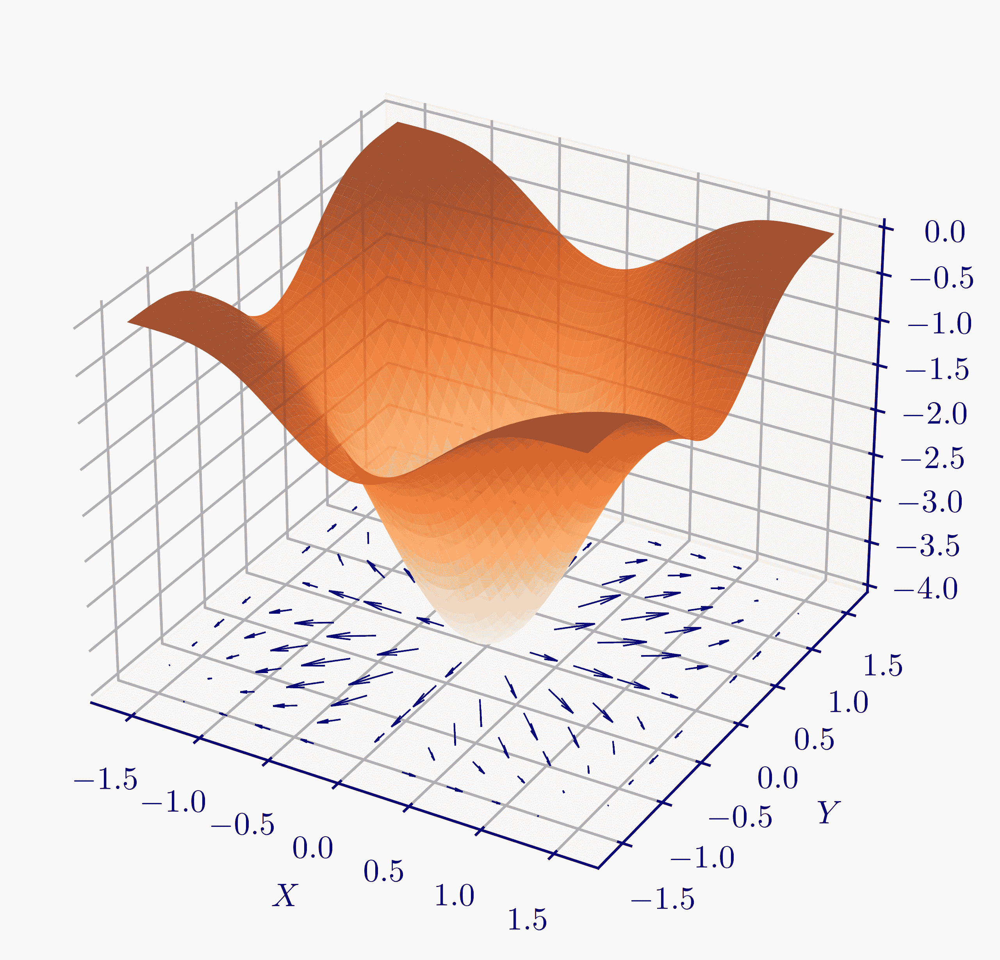

# 3.2\. 背景知识：可微多变量函数的回顾#

> 原文：[`mmids-textbook.github.io/chap03_opt/02_several/roch-mmids-opt-several.html`](https://mmids-textbook.github.io/chap03_opt/02_several/roch-mmids-opt-several.html)

我们回顾了多变量微分学的微分学。我们强调了一些将发挥重要作用的关键结果：**链式法则**和**平均值定理**。

## 3.2.1\. 梯度#

回忆梯度的定义。

**定义** **（梯度）** \(\idx{gradient}\xdi\) 设 \(f : D \to \mathbb{R}\) 其中 \(D \subseteq \mathbb{R}^d\)，且 \(\mathbf{x}_0 \in D\) 是 \(D\) 的一个内点。假设 \(f\) 在 \(\mathbf{x}_0\) 处连续可微。该（列）向量

\[ \nabla f(\mathbf{x}_0) = \left(\frac{\partial f (\mathbf{x}_0)}{\partial x_1}, \ldots, \frac{\partial f (\mathbf{x}_0)}{\partial x_d}\right) \]

被称为 \(f\) 在 \(\mathbf{x}_0\) 处的梯度。\(\natural\)

注意到梯度本身是 \(\mathbf{x}\) 的函数。事实上，与 \(f\) 不同，它是一个向量值函数。

**示例：** 考虑仿射函数

\[ f(\mathbf{x}) = \mathbf{q}^T \mathbf{x} + r \]

其中 \(\mathbf{x} = (x_1, \ldots, x_d), \mathbf{q} = (q_1, \ldots, q_d) \in \mathbb{R}^d\)。线性项的偏导数由以下给出

\[ \frac{\partial}{\partial x_i} [\mathbf{q}^T \mathbf{x}] = \frac{\partial}{\partial x_i} \left[\sum_{j=1}^d q_j x_j \right] = \frac{\partial}{\partial x_i} \left[q_i x_i \right] = q_i. \]

因此，\(f\) 的梯度为

\[ \nabla f(\mathbf{x}) = \mathbf{q}. \]

\(\lhd\)

**示例：** 考虑二次函数

\[ f(\mathbf{x}) = \frac{1}{2} \mathbf{x}^T P \mathbf{x} + \mathbf{q}^T \mathbf{x} + r, \]

其中 \(\mathbf{x} = (x_1, \ldots, x_d), \mathbf{q} = (q_1, \ldots, q_d) \in \mathbb{R}^d\) 且 \(P \in \mathbb{R}^{d \times d}\)。二次项的偏导数由以下给出

\[\begin{align*} \frac{\partial}{\partial x_i} [\mathbf{x}^T P \mathbf{x}] &= \frac{\partial}{\partial x_i} \left[\sum_{j, k=1}^d P_{jk} x_j x_k \right]\\ &= \frac{\partial}{\partial x_i} \left[P_{ii} x_i² + \sum_{j=1, j\neq i}^d P_{ji} x_j x_i + \sum_{k=1, k\neq i}^d P_{ik} x_i x_k \right], \end{align*}\]

其中我们使用了所有不包含 \(x_i\) 的项的偏导数为 \(0\)。

这个最后的表达式是

\[\begin{align*} &= 2 P_{ii} x_i + \sum_{j=1, j\neq i}^d P_{ji} x_j + \sum_{k=1, k\neq i}^d P_{ik} x_k\\ &= \sum_{j=1}^d [P^T]_{ij} x_j + \sum_{k=1}^d [P]_{ik} x_k\\ &= ([P^T + P]\mathbf{x})_i. \end{align*}\]

因此，\(f\) 的梯度为

\[ \nabla f(\mathbf{x}) = \frac{1}{2}[P + P^T] \,\mathbf{x} + \mathbf{q}. \]

如果 \(P\) 是对称的，这进一步简化为 \(\nabla f(\mathbf{x}) = P \,\mathbf{x} + \mathbf{q}\)。\(\lhd\)

计算一个多变量函数 \(f(\mathbf{x})\) 沿着参数曲线 \(\mathbf{g}(t) = (g_1(t), \ldots, g_d(t)) \in \mathbb{R}^d\) 的导数，其中 \(t\) 在 \(\mathbb{R}\) 的某个闭区间内，这将是重要事实的一个特例。我们将使用以下符号 \(\mathbf{g}'(t) = (g_1'(t), \ldots, g_m'(t))\)，其中 \(g_i'\) 是 \(g_i\) 的导数。如果 \(\mathbf{g}(t)\) 的每个分量在 \(t = t_0\) 处连续可微，我们说 \(\mathbf{g}(t)\) 在 \(t = t_0\) 处连续可微。

**例：** **(参数线)** 在 \(\mathbb{R}^d\) 中，从 \(\mathbf{x}_0 = (x_{0,1},\ldots,x_{0,d})\) 到 \(\mathbf{x}_1 = (x_{1,1},\ldots,x_{1,d})\) 的直线可以参数化为

\[ \mathbf{g}(t) = \mathbf{x}_0 + t (\mathbf{x}_1 - \mathbf{x}_0), \]

其中 \(t\) 从 \(0\)（此时 \(\mathbf{g}(0) = \mathbf{x}_0\)）到 \(1\)（此时 \(\mathbf{g}(1) = \mathbf{x}_1\)）。

然后

\[ g_i'(t) = \frac{\mathrm{d}}{\mathrm{d}t} [x_{0,i} + t (x_{1,i} - x_{0,i})] = x_{1,i} - x_{0,i}, \]

因此

\[ \mathbf{g}'(t) = \mathbf{x}_1 - \mathbf{x}_0. \]

\(\lhd\)

回忆一下单变量情况下的链式法则。引用 [维基百科](https://en.wikipedia.org/wiki/Chain_rule)：

> 链式法则的最简单形式是针对一个实变量的实值函数。它表明，如果 \(g\) 是在点 \(c\) 可微的函数（即导数 \(g'(c)\) 存在），并且 \(f\) 是在 \(g(c)\) 可微的函数，那么复合函数 \({\displaystyle f\circ g}\) 在 \(c\) 处可微，其导数为 \({\displaystyle (f\circ g)'(c)=f'(g(c))\cdot g'(c)}\).

这里是链式法则的一个直接推广。

**定理** **(链式法则)** \(\idx{chain rule}\xdi\) 设 \(f : D_1 \to \mathbb{R}\)，其中 \(D_1 \subseteq \mathbb{R}\)，设 \(g : D_2 \to \mathbb{R}\)，其中 \(D_2 \subseteq \mathbb{R}^d\)。假设 \(f\) 在 \(g(\mathbf{x}_0)\) 处连续可微，\(g(\mathbf{x}_0)\) 是 \(D_1\) 的一个内点，且 \(g\) 在 \(\mathbf{x}_0\) 处连续可微，\(\mathbf{x}_0\) 是 \(D_2\) 的一个内点。那么

\[ \nabla (f\circ g) (\mathbf{x}_0) = f'(g(\mathbf{x}_0)) \nabla g(\mathbf{x}_0). \]

\(\sharp\)

*证明：* 我们将一元函数的链式法则应用于偏导数。对于所有的 \(i\)，

\[ \frac{\partial}{\partial x_i}f (g(\mathbf{x}_0)) = f'(g(\mathbf{x}_0)) \frac{\partial}{\partial x_i} g(\mathbf{x}_0). \]

将偏导数收集到一个向量中，就得到了这个结论。 \(\square\)

这里是链式法则的一个不同的一般化。同样，复合 \(f \circ \mathbf{g}\) 表示函数 \(f \circ \mathbf{g}(t) = f (\mathbf{g}(t))\)。

**定理** **(链式法则)** 设 \(f : D_1 \to \mathbb{R}\)，其中 \(D_1 \subseteq \mathbb{R}^d\)，设 \(\mathbf{g} : D_2 \to \mathbb{R}^d\)，其中 \(D_2 \subseteq \mathbb{R}\)。假设 \(f\) 在 \(\mathbf{g}(t_0)\) 处连续可微，\(\mathbf{g}(t_0)\) 是 \(D_1\) 的内点，并且 \(\mathbf{g}\) 在 \(t_0\) 处连续可微，\(t_0\) 是 \(D_2\) 的内点。那么

\[ (f\circ \mathbf{g})'(t_0) = \nabla f (\mathbf{g}(t_0))^T \mathbf{g}'(t_0). \]

\(\sharp\)

*证明*: 为了简化符号，假设 \(f\) 是一个关于 \(\mathbf{x} = (x_1, \ldots, x_d)\) 的实值函数，其中这些分量本身是 \(t \in \mathbb{R}\) 的函数。假设 \(f\) 在 \(\mathbf{x}(t)\) 处连续可微。为了计算全导数 \(\idx{total derivative}\xdi\) \(\frac{\mathrm{d} f(t)}{\mathrm{d} t}\)，令 \(\Delta x_k = x_k(t + \Delta t) - x_k(t)\)，\(x_k = x_k(t)\) 和

\[ \Delta f = f(x_1 + \Delta x_1, \ldots, x_d + \Delta x_d) - f(x_1, \ldots, x_d). \]

我们需要计算极限 \(\lim_{\Delta t \to 0} \frac{\Delta f}{\Delta t}\)。为了将这个极限与 \(f\) 的偏导数联系起来，我们将 \(\Delta f\) 重写为一个望远镜求和，其中每个项只涉及单个变量 \(x_k\) 的变化。也就是说，

\[\begin{align*} \Delta f = & [f(x_1 + \Delta x_1, \ldots, x_d + \Delta x_d) - f(x_1, x_2 + \Delta x_2, \ldots, x_d + \Delta x_d)]\\ &+ [f(x_1, x_2 + \Delta x_2, \ldots, x_d + \Delta x_d) - f(x_1, x_2, x_3 + \Delta x_3, \ldots, x_d + \Delta x_d)] \\ &+ \cdots + [f(x_1, \cdots, x_{d-1}, x_d + \Delta x_d) - f(x_1, \ldots, x_d)]. \end{align*}\]

将平均值定理应用于每个项给出

\[\begin{align*} \Delta f = & \Delta x_1 \frac{\partial f(x_1 + \theta_1 \Delta x_1, x_2 + \Delta x_2, \ldots, x_d + \Delta x_d)} {\partial x_1}\\ &+ \Delta x_2 \frac{\partial f(x_1, x_2 + \theta_2 \Delta x_2, x_3 + \Delta x_3, \ldots, x_d + \Delta x_d)} {\partial x_2}\\ &+ \cdots + \Delta x_d \frac{\partial f(x_1, \cdots, x_{d-1}, x_d + \theta_d \Delta x_d)} {\partial x_d} \end{align*}\]

其中 \(0 < \theta_k < 1\) 对于 \(k=1,\ldots,d\)。除以 \(\Delta t\)，取极限 \(\Delta t \to 0\) 并使用 \(f\) 连续可微的事实，我们得到

\[ \frac{\mathrm{d} f (t)}{\mathrm{d} t} = \sum_{k=1}^d \frac{\partial f(\mathbf{x}(t))} {\partial x_k} \frac{\mathrm{d} x_k(t)}{\mathrm{d} t}. \]

\(\square\)

作为链式法则的第一个应用，我们将平均值定理推广到多个变量的情况。我们将使用这个结果来证明一个多变量泰勒展开的结果，这个结果将在本章中扮演核心角色。

**定理** **(平均值定理)** \(\idx{mean value theorem}\xdi\) 设 \(f : D \to \mathbb{R}\) 其中 \(D \subseteq \mathbb{R}^d\)。设 \(\mathbf{x}_0 \in D\) 和 \(\delta > 0\) 使得 \(B_\delta(\mathbf{x}_0) \subseteq D\)。如果 \(f\) 在 \(B_\delta(\mathbf{x}_0)\) 上是连续可微的，那么对于 \(B_\delta(\mathbf{x}_0)\) 中的任意 \(\mathbf{x}\)

\[ f(\mathbf{x}) = f(\mathbf{x}_0) + \nabla f(\mathbf{x}_0 + \xi \mathbf{p})^T \mathbf{p} \]

对于某个 \(\xi \in (0,1)\)，其中 \(\mathbf{p} = \mathbf{x} - \mathbf{x}_0\)。 \(\sharp\)

可以将 *平均值定理* 视为 \(0\) 阶泰勒展开。它表明，当 \(\mathbf{x}\) 接近 \(\mathbf{x}_0\) 时，\(f(\mathbf{x})\) 的值接近 \(f(\mathbf{x}_0)\)，这种接近可以通过 \(\mathbf{x}_0\) 邻域中的梯度来控制。从这个角度来看，项 \(\nabla f(\mathbf{x}_0 + \xi \mathbf{p})^T \mathbf{p}\) 被称为拉格朗日余项。

*证明思路* 我们应用单变量结果和 *链式法则*。

*证明* 设 \(\phi(t) = f(\boldsymbol{\alpha}(t))\)，其中 \(\boldsymbol{\alpha}(t) = \mathbf{x}_0 + t \mathbf{p}\)。观察 \(\phi(0) = f(\mathbf{x}_0)\) 和 \(\phi(1) = f(\mathbf{x})\)。根据 *链式法则* 和参数线示例，

\[ \phi'(t) = \nabla f(\boldsymbol{\alpha}(t))^T \boldsymbol{\alpha}'(t) = \nabla f(\boldsymbol{\alpha}(t))^T \mathbf{p} = \nabla f(\mathbf{x}_0 + t \mathbf{p})^T \mathbf{p}. \]

特别地，\(\phi\) 在 \([0,1]\) 上具有连续的一阶导数。根据单变量情况下的 *平均值定理*，

\[ \phi(t) = \phi(0) + t \phi'(\xi) \]

对于某个 \(\xi \in (0,t)\)。将 \(\phi(0)\) 和 \(\phi'(\xi)\) 的表达式代入，并取 \(t=1\)，即可得到结论。 \(\square\)

## 3.2.2\. 二阶导数#

也可以定义高阶导数。我们从单变量情况开始，其中 \(f : D \to \mathbb{R}\) 且 \(D \subseteq \mathbb{R}\)，\(x_0 \in D\) 是 \(D\) 的一个内点。注意，如果 \(f'\) 在 \(D\) 中存在，那么它本身就是一个关于 \(x\) 的函数。那么 \(x_0\) 处的二阶导数是

\[ f''(x_0) = \frac{\mathrm{d}² f(x_0)}{\mathrm{d} x²} = \lim_{h \to 0} \frac{f'(x_0 + h) - f'(x_0)}{h} \]

假设极限存在。

在多变量情况下，我们有以下结论：

**定义** **(二阶偏导数和海森矩阵)** \(\idx{second partial derivatives}\xdi\) \(\idx{Hessian}\xdi\) 设 \(f : D \to \mathbb{R}\) 其中 \(D \subseteq \mathbb{R}^d\)，并且设 \(\mathbf{x}_0 \in D\) 是 \(D\) 的一个内点。假设 \(f\) 在 \(\mathbf{x}_0\) 附近的某个开球内是连续可微的。那么 \(\partial f(\mathbf{x})/\partial x_i\) 本身是一个关于 \(\mathbf{x}\) 的函数，并且如果它存在，其关于 \(x_j\) 的偏导数表示为

\[ \frac{\partial² f(\mathbf{x}_0)}{\partial x_j \partial x_i} = \lim_{h \to 0} \frac{\frac{\partial f}{\partial x_i}(\mathbf{x}_0 + h \mathbf{e}_j) - \frac{\partial f}{\partial x_i}(\mathbf{x}_0)}{h}. \]

为了简化符号，当 \(j = i\) 时，我们将其写作 \(\partial² f(\mathbf{x}_0)/\partial x_i²\)。如果 \(\partial² f(\mathbf{x})/\partial x_j \partial x_i\) 和 \(\partial² f(\mathbf{x})/\partial x_i²\) 在 \(\mathbf{x}_0\) 附近的某个开球内对所有 \(i, j\) 都存在且连续，那么我们说 \(f\) 在 \(\mathbf{x}_0\) 处是连续两次可微的。

二阶偏导数的矩阵称为 Hessian，并记为

\[\begin{split} \mathbf{H}_f(\mathbf{x}_0) = \begin{pmatrix} \frac{\partial² f(\mathbf{x}_0)}{\partial x_1²} & \cdots & \frac{\partial² f(\mathbf{x}_0)}{\partial x_d \partial x_1}\\ \vdots & \ddots & \vdots\\ \frac{\partial² f(\mathbf{x}_0)}{\partial x_1 \partial x_d} & \cdots & \frac{\partial² f(\mathbf{x}_0)}{\partial x_d²} \end{pmatrix}. \end{split}\]

\(\natural\)

与 \(f\) 和梯度 \(\nabla f\) 一样，Hessian \(\mathbf{H}_f\) 是 \(\mathbf{x}\) 的函数。然而，它是一个矩阵值函数。

当 \(f\) 在 \(\mathbf{x}_0\) 处连续两次可微时，其 Hessian 是一个对称矩阵。

**定理** **(Hessian 的对称性)** \(\idx{symmetry of the Hessian}\xdi\) 设 \(f : D \to \mathbb{R}\)，其中 \(D \subseteq \mathbb{R}^d\)，且 \(\mathbf{x}_0 \in D\) 是 \(D\) 的一个内点。假设 \(f\) 在 \(\mathbf{x}_0\) 处连续两次可微。那么对于所有 \(i \neq j\)

\[ \frac{\partial² f(\mathbf{x}_0)}{\partial x_j \partial x_i} = \frac{\partial² f(\mathbf{x}_0)}{\partial x_i \partial x_j}. \]

\(\sharp\)

*证明思路:* 应用两次**平均值定理**可以证明极限可以互换。

*证明:* 根据偏导数的定义，

\[\begin{align*} \frac{\partial² f(\mathbf{x}_0)}{\partial x_j \partial x_i} &= \lim_{h_j \to 0} \frac{\frac{\partial f}{\partial x_i}(\mathbf{x}_0 + h_j \mathbf{e}_j) - \frac{\partial f}{\partial x_i}(\mathbf{x}_0)}{h_j}\\ &= \lim_{h_j \to 0} \lim_{h_i \to 0} \frac{1}{h_j h_i} \left\{ [f(\mathbf{x}_0 + h_j \mathbf{e}_j + h_i \mathbf{e}_i) - f(\mathbf{x}_0 + h_j \mathbf{e}_j)] - [f(\mathbf{x}_0 + h_i \mathbf{e}_i) - f(\mathbf{x}_0)] \right\}\\ &= \lim_{h_j \to 0} \lim_{h_i \to 0} \frac{1}{h_i} \left\{ \frac{[f(\mathbf{x}_0 + h_i \mathbf{e}_i + h_j \mathbf{e}_j) - f(\mathbf{x}_0 + h_i \mathbf{e}_i)] - [f(\mathbf{x}_0 + h_j \mathbf{e}_j) - f(\mathbf{x}_0)]}{h_j} \right\}\\ &= \lim_{h_j \to 0} \lim_{h_i \to 0} \frac{1}{h_i} \left\{\frac{\partial}{\partial x_j}[f(\mathbf{x}_0 + h_i \mathbf{e}_i + \theta_j h_j \mathbf{e}_j) - f(\mathbf{x}_0 + \theta_j h_j \mathbf{e}_j)] \right\}\\ &= \lim_{h_j \to 0} \lim_{h_i \to 0} \frac{1}{h_i} \left\{\frac{\partial f}{\partial x_j}(\mathbf{x}_0 + h_i \mathbf{e}_i + \theta_j h_j \mathbf{e}_j) - \frac{\partial f}{\partial x_j}(\mathbf{x}_0 + \theta_j h_j \mathbf{e}_j) \right\} \end{align*}\]

对于某个 \(\theta_j \in (0,1)\)。注意，在第三行中，我们重新排列了项，在第四行中，我们将 \(f(\mathbf{x}_0 + h_i \mathbf{e}_i + h_j \mathbf{e}_j) - f(\mathbf{x}_0 + h_j \mathbf{e}_j)\) 作为 \(h_j\) 的连续可微函数应用了 \(\text{Mean Value Theorem}\)。

因为 \(\partial f/\partial x_j\) 在 \(\mathbf{x}_0\) 附近的开球内是连续可微的，所以对 \(\text{Mean Value Theorem}\) 进行第二次应用，对于某个 \(\theta_i \in (0,1)\)

\[\begin{align*} &\lim_{h_j \to 0} \lim_{h_i \to 0} \frac{1}{h_i} \left\{\frac{\partial f}{\partial x_j}(\mathbf{x}_0 + h_i \mathbf{e}_i + \theta_j h_j \mathbf{e}_j) - \frac{\partial f}{\partial x_j}(\mathbf{x}_0 + \theta_j h_j \mathbf{e}_j) \right\}\\ &= \lim_{h_j \to 0} \lim_{h_i \to 0} \frac{\partial}{\partial x_i}\left[\frac{\partial f}{\partial x_j}(\mathbf{x}_0 + \theta_j h_j \mathbf{e}_j + \theta_i h_i \mathbf{e}_i)\right]\\ &= \lim_{h_j \to 0} \lim_{h_i \to 0} \frac{\partial² f(\mathbf{x}_0 + \theta_j h_j \mathbf{e}_j + \theta_i h_i \mathbf{e}_i)}{\partial x_i \partial x_j}. \end{align*}\]

然后从 \(\partial² f/\partial x_i \partial x_j\) 的连续性得出结论。 \(\square\)

**示例：** 考虑二次函数

\[ f(\mathbf{x}) = \frac{1}{2} \mathbf{x}^T P \mathbf{x} + \mathbf{q}^T \mathbf{x} + r. \]

回想一下，函数 \(f\) 的梯度是

\[ \nabla f(\mathbf{x}) = \frac{1}{2}[P + P^T] \,\mathbf{x} + \mathbf{q}. \]

为了简化计算，设 \(B = \frac{1}{2}[P + P^T]\) 并用 \(\mathbf{b}_1^T, \ldots,\mathbf{b}_d^T\) 表示 \(B\) 的行。

\(\nabla f\) 的每个分量都是 \(\mathbf{x}\) 的仿射函数，具体来说，

\[ \frac{\partial f (\mathbf{x})}{\partial x_i} = \mathbf{b}_i^T \mathbf{x} + q_i. \]

海森矩阵的第 \(i\) 行仅仅是 \(\frac{\partial f (\mathbf{x})}{\partial x_i}\) 的转置梯度，根据我们之前的结果，它是

\[ \left(\nabla \frac{\partial f (\mathbf{x})}{\partial x_i}\right)^T = \mathbf{b}_i^T. \]

将这些放在一起，我们得到

\[ \mathbf{H}_f(\mathbf{x}) = \frac{1}{2}[P + P^T]. \]

注意这确实是一个对称矩阵。 \(\lhd\)

***自我评估测验*** *(在 Claude、Gemini 和 ChatGPT 的帮助下)*

**1** 函数 \(f\) 在 \(x_0\) 处连续可微意味着什么？

a) \(f\) 在 \(x_0\) 处是连续的。

b) \(f\) 在 \(x_0\) 处所有偏导数都存在。

c) \(f\) 在 \(x_0\) 附近的开放球体内所有偏导数都存在且连续。

d) \(f\) 在 \(x_0\) 处的梯度为零。

**2** 函数 \(f : D \to \mathbb{R}\)，其中 \(D \subseteq \mathbb{R}^d\)，在点 \(x_0 \in D\) 处的梯度是什么？

a) \(f\) 关于 \(x\) 在 \(x_0\) 处的变化率

b) \(f\) 在 \(x_0\) 处所有二阶偏导数的向量

c) \(f\) 在 \(x_0\) 处所有一阶偏导数的向量

d) \(f\) 在 \(x_0\) 处所有二阶偏导数的矩阵

**3** 关于二阶连续可微函数的海森矩阵，以下哪个陈述是正确的？

a) 它始终是一个对角矩阵。

b) 它始终是一个对称矩阵。

c) 它始终是一个可逆矩阵。

d) 它始终是一个正定矩阵。

**4** 设 \(f(x, y, z) = x² + y² - z²\)。\(f\) 的海森矩阵是什么？

a) \(\begin{pmatrix} 2 & 0 & 0 \\ 0 & 2 & 0 \\ 0 & 0 & -2 \end{pmatrix}\)

b) \(\begin{pmatrix} 2x & 2y & -2z \end{pmatrix}\)

c) \(\begin{pmatrix} 2 & 0 \\ 0 & 2 \end{pmatrix}\)

d) \(\begin{pmatrix} 0 & 0 & 0 \\ 0 & 0 & 0 \\ 0 & 0 & 0 \end{pmatrix}\)

**5** 二次函数 \(f(x) = \frac{1}{2}x^TPx + q^Tx + r\) 的海森矩阵是什么，其中 \(P \in \mathbb{R}^{d \times d}\) 且 \(q \in \mathbb{R}^d\)？

a) \(H_f(x) = P\)

b) \(H_f(x) = P^T\)

c) \(H_f(x) = \frac{1}{2}[P + P^T]\)

d) \(H_f(x) = [P + P^T]\)

1 的答案：c。理由：文本中提到，“如果 \(f\) 在 \(x_0\) 附近的开放球体内对所有 \(i\) 存在且连续，那么我们说 \(f\) 在 \(x_0\) 处是连续可微的。”

2 的答案：c。理由：从文本中：“向量 \(\nabla f(x_0) = ( \frac{\partial f(x_0)}{\partial x_1}, \ldots, \frac{\partial f(x_0)}{\partial x_d})\) 被称为 \(f\) 在 \(x_0\) 处的梯度。”

3 的答案：b）。理由：文本中提到：“当 \(f\) 在 \(x_0\) 处二阶连续可微时，其海森矩阵是对称矩阵。”

4 的答案：a）。理由：海森矩阵是二阶偏导数的矩阵：

\[\begin{split} \begin{pmatrix} \frac{\partial² f}{\partial x²} & \frac{\partial² f}{\partial x \partial y} & \frac{\partial² f}{\partial x \partial z} \\ \frac{\partial² f}{\partial y \partial x} & \frac{\partial² f}{\partial y²} & \frac{\partial² f}{\partial y \partial z} \\ \frac{\partial² f}{\partial z \partial x} & \frac{\partial² f}{\partial z \partial y} & \frac{\partial² f}{\partial z²} \end{pmatrix} = \begin{pmatrix} 2 & 0 & 0 \\ 0 & 2 & 0 \\ 0 & 0 & -2 \end{pmatrix} \end{split}\]

5 题的答案为 c。理由：文本表明二次函数的海森矩阵为 \(H_f(x) = \frac{1}{2}[P + P^T]\)。

## 3.2.1\. 梯度#

回忆梯度的定义。

**定义** **（梯度）** \(\idx{gradient}\xdi\) 设 \(f : D \to \mathbb{R}\) 其中 \(D \subseteq \mathbb{R}^d\)，且 \(\mathbf{x}_0 \in D\) 是 \(D\) 的一个内点。假设 \(f\) 在 \(\mathbf{x}_0\) 处连续可微。向量

\[ \nabla f(\mathbf{x}_0) = \left(\frac{\partial f (\mathbf{x}_0)}{\partial x_1}, \ldots, \frac{\partial f (\mathbf{x}_0)}{\partial x_d}\right) \]

被称为在 \(\mathbf{x}_0\) 处 \(f\) 的梯度。\(\natural\)

注意，梯度本身也是 \(\mathbf{x}\) 的函数。实际上，与 \(f\) 不同，它是一个向量值函数。

**示例：** 考虑仿射函数

\[ f(\mathbf{x}) = \mathbf{q}^T \mathbf{x} + r \]

其中 \(\mathbf{x} = (x_1, \ldots, x_d), \mathbf{q} = (q_1, \ldots, q_d) \in \mathbb{R}^d\)。线性项的偏导数由以下给出

\[ \frac{\partial}{\partial x_i} [\mathbf{q}^T \mathbf{x}] = \frac{\partial}{\partial x_i} \left[\sum_{j=1}^d q_j x_j \right] = \frac{\partial}{\partial x_i} \left[q_i x_i \right] = q_i. \]

因此，\(f\) 的梯度为

\[ \nabla f(\mathbf{x}) = \mathbf{q}. \]

\(\lhd\)

**示例：** 考虑二次函数

\[ f(\mathbf{x}) = \frac{1}{2} \mathbf{x}^T P \mathbf{x} + \mathbf{q}^T \mathbf{x} + r, \]

其中 \(\mathbf{x} = (x_1, \ldots, x_d), \mathbf{q} = (q_1, \ldots, q_d) \in \mathbb{R}^d\) 且 \(P \in \mathbb{R}^{d \times d}\)。二次项的偏导数由以下给出

\[\begin{align*} \frac{\partial}{\partial x_i} [\mathbf{x}^T P \mathbf{x}] &= \frac{\partial}{\partial x_i} \left[\sum_{j, k=1}^d P_{jk} x_j x_k \right]\\ &= \frac{\partial}{\partial x_i} \left[P_{ii} x_i² + \sum_{j=1, j\neq i}^d P_{ji} x_j x_i + \sum_{k=1, k\neq i}^d P_{ik} x_i x_k \right], \end{align*}\]

其中我们使用了所有不包含 \(x_i\) 的项的偏导数为 \(0\)。

最后这个表达式是

\[\begin{align*} &= 2 P_{ii} x_i + \sum_{j=1, j\neq i}^d P_{ji} x_j + \sum_{k=1, k\neq i}^d P_{ik} x_k\\ &= \sum_{j=1}^d [P^T]_{ij} x_j + \sum_{k=1}^d [P]_{ik} x_k\\ &= ([P^T + P]\mathbf{x})_i. \end{align*}\]

因此，\(f\) 的梯度为

\[ \nabla f(\mathbf{x}) = \frac{1}{2}[P + P^T] \,\mathbf{x} + \mathbf{q}. \]

如果 \(P\) 是对称的，这进一步简化为 \(\nabla f(\mathbf{x}) = P \,\mathbf{x} + \mathbf{q}\)。 \(\lhd\)

计算一个多变量函数 \(f(\mathbf{x})\) 沿着参数曲线 \(\mathbf{g}(t) = (g_1(t), \ldots, g_d(t)) \in \mathbb{R}^d\) 的导数，其中 \(t\) 在 \(\mathbb{R}\) 的某个闭区间内，将会很有用。以下结果是一个重要事实的特殊情况。我们将使用以下符号 \(\mathbf{g}'(t) = (g_1'(t), \ldots, g_m'(t))\)，其中 \(g_i'\) 是 \(g_i\) 的导数。我们说 \(\mathbf{g}(t)\) 在 \(t = t_0\) 处连续可微，如果它的每个分量都是。

**例：** **(参数线)** 在 \(\mathbb{R}^d\) 中，从 \(\mathbf{x}_0 = (x_{0,1},\ldots,x_{0,d})\) 到 \(\mathbf{x}_1 = (x_{1,1},\ldots,x_{1,d})\) 的直线可以参数化为

\[ \mathbf{g}(t) = \mathbf{x}_0 + t (\mathbf{x}_1 - \mathbf{x}_0), \]

其中 \(t\) 从 \(0\)（此时 \(\mathbf{g}(0) = \mathbf{x}_0\)）到 \(1\)（此时 \(\mathbf{g}(1) = \mathbf{x}_1\)）。

然后

\[ g_i'(t) = \frac{\mathrm{d}}{\mathrm{d}t} [x_{0,i} + t (x_{1,i} - x_{0,i})] = x_{1,i} - x_{0,i}, \]

因此

\[ \mathbf{g}'(t) = \mathbf{x}_1 - \mathbf{x}_0. \]

\(\lhd\)

回忆一下单变量情况下的**链式法则**。引用 [维基百科](https://en.wikipedia.org/wiki/Chain_rule)：

> 链式法则的最简单形式是针对一个实变量的实值函数。它表明，如果 \(g\) 是在点 \(c\) 可微的函数（即导数 \(g'(c)\) 存在），并且 \(f\) 是在 \(g(c)\) 可微的函数，那么复合函数 \({\displaystyle f\circ g}\) 在 \(c\) 处可微，其导数为 \({\displaystyle (f\circ g)'(c)=f'(g(c))\cdot g'(c)}\)。

这里是**链式法则**的一个直接推广。

**定理** **(链式法则)** \(\idx{chain rule}\xdi\) 设 \(f : D_1 \to \mathbb{R}\)，其中 \(D_1 \subseteq \mathbb{R}\)，设 \(g : D_2 \to \mathbb{R}\)，其中 \(D_2 \subseteq \mathbb{R}^d\)。假设 \(f\) 在 \(D_1\) 的内点 \(g(\mathbf{x}_0)\) 处连续可微，且 \(g\) 在 \(D_2\) 的内点 \(\mathbf{x}_0\) 处连续可微。那么

\[ \nabla (f\circ g) (\mathbf{x}_0) = f'(g(\mathbf{x}_0)) \nabla g(\mathbf{x}_0). \]

\(\sharp\)

*证明：* 我们将一元函数的**链式法则**应用于偏导数。对于所有的 \(i\)，

\[ \frac{\partial}{\partial x_i}f (g(\mathbf{x}_0)) = f'(g(\mathbf{x}_0)) \frac{\partial}{\partial x_i} g(\mathbf{x}_0). \]

将偏导数收集到一个向量中，就得到了这个结论。 \(\square\)

这里是**链式法则**的一个不同推广。再次，复合函数 \(f \circ \mathbf{g}\) 表示函数 \(f \circ \mathbf{g}(t) = f (\mathbf{g}(t))\)。

**定理** **（链式法则）** 设 \(f : D_1 \to \mathbb{R}\)，其中 \(D_1 \subseteq \mathbb{R}^d\)，且设 \(\mathbf{g} : D_2 \to \mathbb{R}^d\)，其中 \(D_2 \subseteq \mathbb{R}\)。假设 \(f\) 在 \(\mathbf{g}(t_0)\) 处连续可微，\(\mathbf{g}(t_0)\) 是 \(D_1\) 的内点，并且 \(\mathbf{g}\) 在 \(t_0\) 处连续可微，\(t_0\) 是 \(D_2\) 的内点。那么

\[ (f\circ \mathbf{g})'(t_0) = \nabla f (\mathbf{g}(t_0))^T \mathbf{g}'(t_0). \]

\(\sharp\)

**证明**：为了简化符号，假设 \(f\) 是一个关于 \(\mathbf{x} = (x_1, \ldots, x_d)\) 的实值函数，其分量本身是 \(t \in \mathbb{R}\) 的函数。假设 \(f\) 在 \(\mathbf{x}(t)\) 处连续可微。为了计算 [全导数](https://en.wikipedia.org/wiki/Total_derivative)\(\idx{全导数}\xdi\) \(\frac{\mathrm{d} f(t)}{\mathrm{d} t}\)，设 \(\Delta x_k = x_k(t + \Delta t) - x_k(t)\)，\(x_k = x_k(t)\) 和

\[ \Delta f = f(x_1 + \Delta x_1, \ldots, x_d + \Delta x_d) - f(x_1, \ldots, x_d). \]

我们寻求计算极限 \(\lim_{\Delta t \to 0} \frac{\Delta f}{\Delta t}\)。为了将这个极限与 \(f\) 的偏导数联系起来，我们将 \(\Delta f\) 重写为一个望远镜求和，其中每一项涉及单个变量 \(x_k\) 的变化。也就是说，

\[\begin{align*} \Delta f = & [f(x_1 + \Delta x_1, \ldots, x_d + \Delta x_d) - f(x_1, x_2 + \Delta x_2, \ldots, x_d + \Delta x_d)]\\ &+ [f(x_1, x_2 + \Delta x_2, \ldots, x_d + \Delta x_d) - f(x_1, x_2, x_3 + \Delta x_3, \ldots, x_d + \Delta x_d)] \\ &+ \cdots + [f(x_1, \cdots, x_{d-1}, x_d + \Delta x_d) - f(x_1, \ldots, x_d)]. \end{align*}\]

将 **平均值定理** 应用于每一项得到

\[\begin{align*} \Delta f = & \Delta x_1 \frac{\partial f(x_1 + \theta_1 \Delta x_1, x_2 + \Delta x_2, \ldots, x_d + \Delta x_d)} {\partial x_1}\\ &+ \Delta x_2 \frac{\partial f(x_1, x_2 + \theta_2 \Delta x_2, x_3 + \Delta x_3, \ldots, x_d + \Delta x_d)} {\partial x_2}\\ &+ \cdots + \Delta x_d \frac{\partial f(x_1, \cdots, x_{d-1}, x_d + \theta_d \Delta x_d)} {\partial x_d} \end{align*}\]

其中 \(0 < \theta_k < 1\) 对于 \(k=1,\ldots,d\)。将 \(\Delta t\) 除以，取极限 \(\Delta t \to 0\) 并使用 \(f\) 连续可微的事实，我们得到

\[ \frac{\mathrm{d} f (t)}{\mathrm{d} t} = \sum_{k=1}^d \frac{\partial f(\mathbf{x}(t))} {\partial x_k} \frac{\mathrm{d} x_k(t)}{\mathrm{d} t}. \]

\(\square\)

作为 **链式法则** 的第一次应用，我们将 **平均值定理** 推广到多个变量的情况。我们将使用这个结果来证明一个多变量泰勒展开结果，这个结果将在本章中扮演核心角色。

**定理** **(平均值)** \(\idx{mean value theorem}\xdi\) 设 \(f : D \to \mathbb{R}\) 其中 \(D \subseteq \mathbb{R}^d\)。设 \(\mathbf{x}_0 \in D\) 且 \(\delta > 0\) 使得 \(B_\delta(\mathbf{x}_0) \subseteq D\)。如果 \(f\) 在 \(B_\delta(\mathbf{x}_0)\) 上连续可微，那么对于 \(B_\delta(\mathbf{x}_0)\) 中的任意 \(\mathbf{x}\)

\[ f(\mathbf{x}) = f(\mathbf{x}_0) + \nabla f(\mathbf{x}_0 + \xi \mathbf{p})^T \mathbf{p} \]

对于某个 \(\xi \in (0,1)\)，其中 \(\mathbf{p} = \mathbf{x} - \mathbf{x}_0\)。\(\sharp\)

考虑**平均值定理**的一种方式是将其视为 \(0\) 阶泰勒展开。它表明，当 \(\mathbf{x}\) 接近 \(\mathbf{x}_0\) 时，\(f(\mathbf{x})\) 的值接近 \(f(\mathbf{x}_0)\)，这种接近可以通过 \(\mathbf{x}_0\) 附近的梯度来控制。从这个角度来看，\(\nabla f(\mathbf{x}_0 + \xi \mathbf{p})^T \mathbf{p}\) 被称为拉格朗日余项。

**证明思路**：我们应用单变量结果和**链式法则**。

**证明**：设 \(\phi(t) = f(\boldsymbol{\alpha}(t))\)，其中 \(\boldsymbol{\alpha}(t) = \mathbf{x}_0 + t \mathbf{p}\)。观察 \(\phi(0) = f(\mathbf{x}_0)\) 和 \(\phi(1) = f(\mathbf{x})\)。通过**链式法则**和参数线示例，

\[ \phi'(t) = \nabla f(\boldsymbol{\alpha}(t))^T \boldsymbol{\alpha}'(t) = \nabla f(\boldsymbol{\alpha}(t))^T \mathbf{p} = \nabla f(\mathbf{x}_0 + t \mathbf{p})^T \mathbf{p}. \]

特别地，\(\phi\) 在 \([0,1]\) 上具有连续的一阶导数。根据单变量情况下的**平均值定理**

\[ \phi(t) = \phi(0) + t \phi'(\xi) \]

对于某个 \(\xi \in (0,t)\)。将 \(\phi(0)\) 和 \(\phi'(\xi)\) 的表达式代入，并取 \(t=1\)，得到所声称的结论。\(\square\)

## 3.2.2\. 二阶导数#

也可以定义更高阶的导数。我们从单变量情况开始，其中 \(f : D \to \mathbb{R}\) 且 \(D \subseteq \mathbb{R}\)，\(x_0 \in D\) 是 \(D\) 的一个内点。注意，如果 \(f'\) 在 \(D\) 中存在，那么它本身是 \(x\) 的函数。那么在 \(x_0\) 处的二阶导数是

\[ f''(x_0) = \frac{\mathrm{d}² f(x_0)}{\mathrm{d} x²} = \lim_{h \to 0} \frac{f'(x_0 + h) - f'(x_0)}{h} \]

假设极限存在。

在多变量情况下，我们有以下结果：

**定义** **(二阶偏导数和海森矩阵)** \(\idx{second partial derivatives}\xdi\) \(\idx{Hessian}\xdi\) 设 \(f : D \to \mathbb{R}\) 其中 \(D \subseteq \mathbb{R}^d\)，且 \(\mathbf{x}_0 \in D\) 是 \(D\) 的一个内点。假设 \(f\) 在 \(\mathbf{x}_0\) 附近的某个开球内连续可微。那么 \(\partial f(\mathbf{x})/\partial x_i\) 本身是 \(\mathbf{x}\) 的函数，并且如果它存在，其关于 \(x_j\) 的偏导数表示为

\[ \frac{\partial² f(\mathbf{x}_0)}{\partial x_j \partial x_i} = \lim_{h \to 0} \frac{\frac{\partial f}{\partial x_i}(\mathbf{x}_0 + h \mathbf{e}_j) - \frac{\partial f}{\partial x_i}(\mathbf{x}_0)}{h}. \]

为了简化符号，当 \(j = i\) 时，我们将其写作 \(\partial² f(\mathbf{x}_0)/\partial x_i²\)。如果 \(\partial² f(\mathbf{x})/\partial x_j \partial x_i\) 和 \(\partial² f(\mathbf{x})/\partial x_i²\) 在以 \(\mathbf{x}_0\) 为中心的开球内对所有 \(i, j\) 都存在且连续，那么我们说 \(f\) 在 \(\mathbf{x}_0\) 处是二阶连续可微的。

二阶导数的矩阵被称为 Hessian，表示为

\[\begin{split} \mathbf{H}_f(\mathbf{x}_0) = \begin{pmatrix} \frac{\partial² f(\mathbf{x}_0)}{\partial x_1²} & \cdots & \frac{\partial² f(\mathbf{x}_0)}{\partial x_d \partial x_1}\\ \vdots & \ddots & \vdots\\ \frac{\partial² f(\mathbf{x}_0)}{\partial x_1 \partial x_d} & \cdots & \frac{\partial² f(\mathbf{x}_0)}{\partial x_d²} \end{pmatrix}. \end{split}\]

\(\natural\)

与 \(f\) 和梯度 \(\nabla f\) 一样，Hessian \(\mathbf{H}_f\) 是 \(\mathbf{x}\) 的函数。然而，它是一个矩阵值函数。

当 \(f\) 在 \(\mathbf{x}_0\) 处是二阶连续可微的，其 Hessian 矩阵是对称的。

**定理** **(Hessian 矩阵的对称性)** \(\idx{symmetry of the Hessian}\xdi\) 设 \(f : D \to \mathbb{R}\)，其中 \(D \subseteq \mathbb{R}^d\)，且 \(\mathbf{x}_0 \in D\) 是 \(D\) 的一个内点。假设 \(f\) 在 \(\mathbf{x}_0\) 处是二阶连续可微的。那么对于所有 \(i \neq j\)

\[ \frac{\partial² f(\mathbf{x}_0)}{\partial x_j \partial x_i} = \frac{\partial² f(\mathbf{x}_0)}{\partial x_i \partial x_j}. \]

\(\sharp\)

*证明思路:* 两次应用**平均值定理**表明极限可以互换。

*证明:* 根据偏导数的定义，

\[\begin{align*} \frac{\partial² f(\mathbf{x}_0)}{\partial x_j \partial x_i} &= \lim_{h_j \to 0} \frac{\frac{\partial f}{\partial x_i}(\mathbf{x}_0 + h_j \mathbf{e}_j) - \frac{\partial f}{\partial x_i}(\mathbf{x}_0)}{h_j}\\ &= \lim_{h_j \to 0} \lim_{h_i \to 0} \frac{1}{h_j h_i} \left\{ [f(\mathbf{x}_0 + h_j \mathbf{e}_j + h_i \mathbf{e}_i) - f(\mathbf{x}_0 + h_j \mathbf{e}_j)] - [f(\mathbf{x}_0 + h_i \mathbf{e}_i) - f(\mathbf{x}_0)] \right\}\\ &= \lim_{h_j \to 0} \lim_{h_i \to 0} \frac{1}{h_i} \left\{ \frac{[f(\mathbf{x}_0 + h_i \mathbf{e}_i + h_j \mathbf{e}_j) - f(\mathbf{x}_0 + h_i \mathbf{e}_i)] - [f(\mathbf{x}_0 + h_j \mathbf{e}_j) - f(\mathbf{x}_0)]}{h_j} \right\}\\ &= \lim_{h_j \to 0} \lim_{h_i \to 0} \frac{1}{h_i} \left\{\frac{\partial}{\partial x_j}[f(\mathbf{x}_0 + h_i \mathbf{e}_i + \theta_j h_j \mathbf{e}_j) - f(\mathbf{x}_0 + \theta_j h_j \mathbf{e}_j)] \right\}\\ &= \lim_{h_j \to 0} \lim_{h_i \to 0} \frac{1}{h_i} \left\{\frac{\partial f}{\partial x_j}(\mathbf{x}_0 + h_i \mathbf{e}_i + \theta_j h_j \mathbf{e}_j) - \frac{\partial f}{\partial x_j}(\mathbf{x}_0 + \theta_j h_j \mathbf{e}_j) \right\} \end{align*}\]

对于某个 \(\theta_j \in (0,1)\)。注意，在第三行中，我们重新排列了项，在第四行中，我们将 \(f(\mathbf{x}_0 + h_i \mathbf{e}_i + h_j \mathbf{e}_j) - f(\mathbf{x}_0 + h_j \mathbf{e}_j)\) 作为 \(h_j\) 的连续可微函数应用了**平均值定理**。

因为 \(\partial f/\partial x_j\) 在 \(\mathbf{x}_0\) 附近的开球内连续可微，根据**平均值定理**，对于某个 \(\theta_i \in (0,1)\)

\[\begin{align*} &\lim_{h_j \to 0} \lim_{h_i \to 0} \frac{1}{h_i} \left\{\frac{\partial f}{\partial x_j}(\mathbf{x}_0 + h_i \mathbf{e}_i + \theta_j h_j \mathbf{e}_j) - \frac{\partial f}{\partial x_j}(\mathbf{x}_0 + \theta_j h_j \mathbf{e}_j) \right\}\\ &= \lim_{h_j \to 0} \lim_{h_i \to 0} \frac{\partial}{\partial x_i}\left[\frac{\partial f}{\partial x_j}(\mathbf{x}_0 + \theta_j h_j \mathbf{e}_j + \theta_i h_i \mathbf{e}_i)\right]\\ &= \lim_{h_j \to 0} \lim_{h_i \to 0} \frac{\partial² f(\mathbf{x}_0 + \theta_j h_j \mathbf{e}_j + \theta_i h_i \mathbf{e}_i)}{\partial x_i \partial x_j}. \end{align*}\]

该结论可从 \(\partial² f/\partial x_i \partial x_j\) 的连续性得出。 \(\square\)

**示例：** 考虑二次函数

\[ f(\mathbf{x}) = \frac{1}{2} \mathbf{x}^T P \mathbf{x} + \mathbf{q}^T \mathbf{x} + r. \]

回想一下，\(f\) 的梯度是

\[ \nabla f(\mathbf{x}) = \frac{1}{2}[P + P^T] \,\mathbf{x} + \mathbf{q}. \]

为了简化计算，设 \(B = \frac{1}{2}[P + P^T]\) 并用 \(\mathbf{b}_1^T, \ldots,\mathbf{b}_d^T\) 表示 \(B\) 的行。

\(\nabla f\) 的每个分量都是 \(\mathbf{x}\) 的仿射函数，具体来说，

\[ \frac{\partial f (\mathbf{x})}{\partial x_i} = \mathbf{b}_i^T \mathbf{x} + q_i. \]

Hessian 矩阵的第 \(i\) 行简单地是 \(\frac{\partial f (\mathbf{x})}{\partial x_i}\) 的转置梯度，根据我们之前的结果，它是

\[ \left(\nabla \frac{\partial f (\mathbf{x})}{\partial x_i}\right)^T = \mathbf{b}_i^T. \]

将这些放在一起，我们得到

\[ \mathbf{H}_f(\mathbf{x}) = \frac{1}{2}[P + P^T]. \]

注意，这确实是一个对称矩阵。 \(\lhd\)

***自我评估测验*** *(在 Claude、Gemini 和 ChatGPT 的帮助下)*

**1** 函数 \(f\) 在 \(x_0\) 处连续可微意味着什么？

a) \(f\) 在 \(x_0\) 处是连续的。

b) \(f\) 在 \(x_0\) 处的所有偏导数都存在。

c) \(f\) 在 \(x_0\) 附近的开放球体内所有偏导数都存在且连续。

d) \(f\) 的梯度在 \(x_0\) 处为零。

**2** 函数 \(f : D \to \mathbb{R}\)，其中 \(D \subseteq \mathbb{R}^d\)，在点 \(x_0 \in D\) 处的梯度是什么？

a) \(f\) 在 \(x_0\) 处相对于 \(x\) 的变化率

b) \(f\) 在 \(x_0\) 处的所有二阶偏导数的向量

c) \(f\) 在 \(x_0\) 处的所有一阶偏导数的向量

d) \(f\) 在 \(x_0\) 处的所有二阶偏导数的矩阵

**3** 关于一个连续两次可微函数的 Hessian 矩阵，以下哪个陈述是正确的？

a) 它始终是一个对角矩阵。

b) 它始终是一个对称矩阵。

c) 它始终是一个可逆矩阵。

d) 它始终是一个正定矩阵。

**4** 设 \(f(x, y, z) = x² + y² - z²\)。\(f\) 的 Hessian 矩阵是什么？

a) \(\begin{pmatrix} 2 & 0 & 0 \\ 0 & 2 & 0 \\ 0 & 0 & -2 \end{pmatrix}\)

b) \(\begin{pmatrix} 2x & 2y & -2z \end{pmatrix}\)

c) \(\begin{pmatrix} 2 & 0 \\ 0 & 2 \end{pmatrix}\)

d) \(\begin{pmatrix} 0 & 0 & 0 \\ 0 & 0 & 0 \\ 0 & 0 & 0 \end{pmatrix}\)

**5** 二次函数 \(f(x) = \frac{1}{2}x^TPx + q^Tx + r\)，其中 \(P \in \mathbb{R}^{d \times d}\) 和 \(q \in \mathbb{R}^d\) 的 Hessian 矩阵是什么？

a) \(H_f(x) = P\)

b) \(H_f(x) = P^T\)

c) \(H_f(x) = \frac{1}{2}[P + P^T]\)

d) \(H_f(x) = [P + P^T]\)

1 的答案：c. 理由：文本中提到，“如果 \(f\) 在 \(x_0\) 附近的开放球体内对所有 \(i\) 都存在且连续，那么我们说 \(f\) 在 \(x_0\) 处是连续可微的。”

2 的答案：c. 理由：从文本中：“向量 \(\nabla f(x_0) = ( \frac{\partial f(x_0)}{\partial x_1}, \ldots, \frac{\partial f(x_0)}{\partial x_d})\) 被称为 \(f\) 在 \(x_0\) 处的梯度。”

3 的答案：b). 理由：文本中提到：“当 \(f\) 在 \(x_0\) 处连续两次可微时，其 Hessian 矩阵是对称矩阵。”

4 的答案：a). 理由：Hessian 矩阵是二阶偏导数的矩阵：

\[\begin{split} \begin{pmatrix} \frac{\partial² f}{\partial x²} & \frac{\partial² f}{\partial x \partial y} & \frac{\partial² f}{\partial x \partial z} \\ \frac{\partial² f}{\partial y \partial x} & \frac{\partial² f}{\partial y²} & \frac{\partial² f}{\partial y \partial z} \\ \frac{\partial² f}{\partial z \partial x} & \frac{\partial² f}{\partial z \partial y} & \frac{\partial² f}{\partial z²} \end{pmatrix} = \begin{pmatrix} 2 & 0 & 0 \\ 0 & 2 & 0 \\ 0 & 0 & -2 \end{pmatrix} \end{split}\]

答案为 5：c. 证明：文本显示二次函数的 Hessian 矩阵为 \(H_f(x) = \frac{1}{2}[P + P^T]\)。
