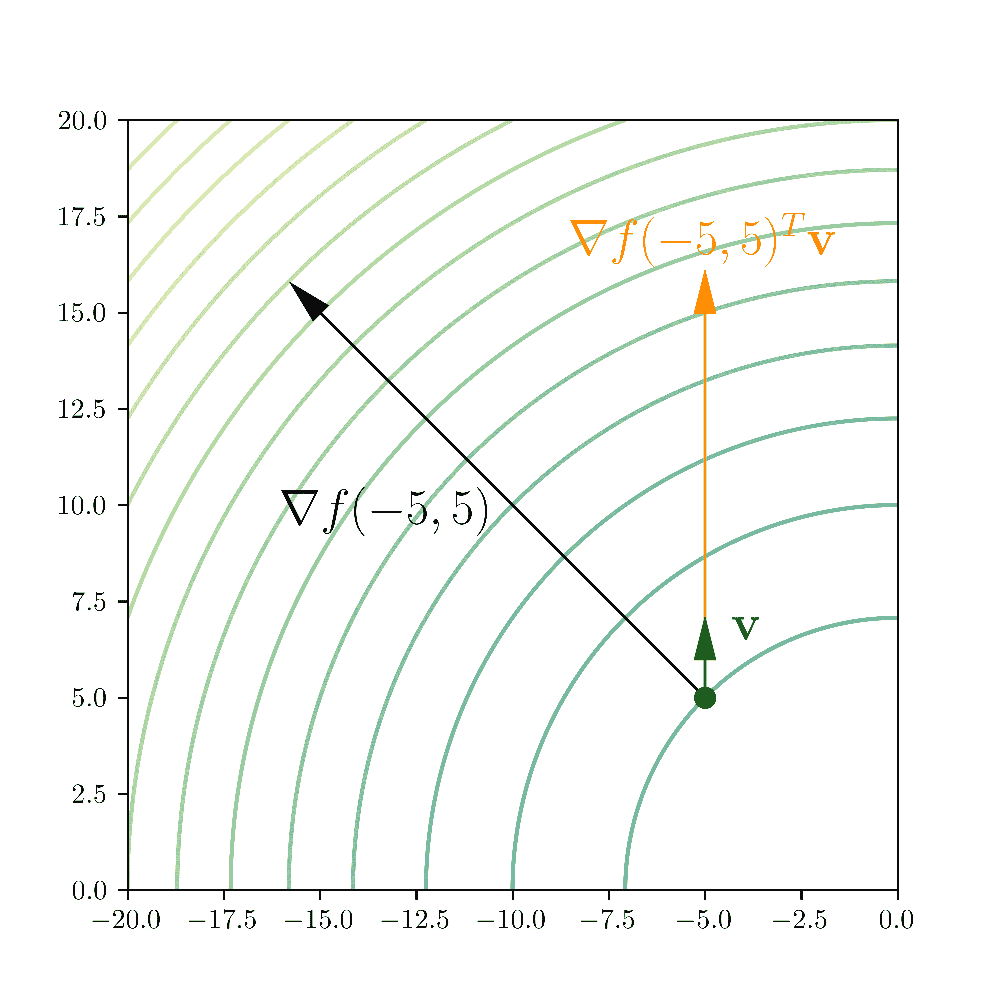
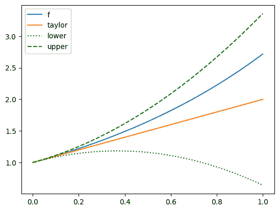
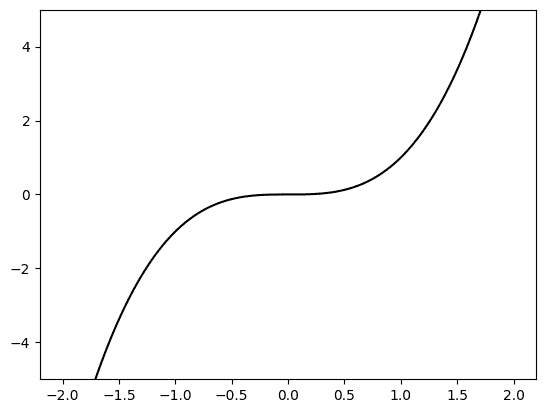
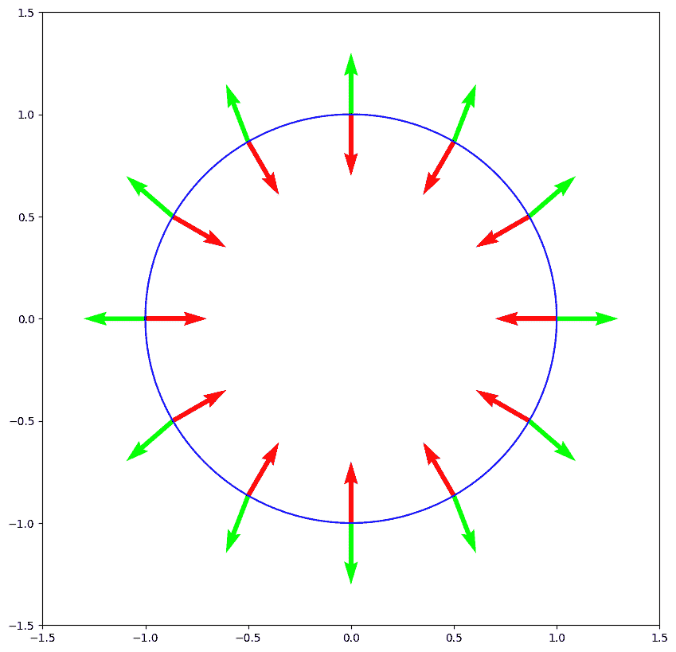

# 3.3\. 最优性条件#

> 原文：[`mmids-textbook.github.io/chap03_opt/03_optimality/roch-mmids-opt-optimality.html`](https://mmids-textbook.github.io/chap03_opt/03_optimality/roch-mmids-opt-optimality.html)

在本节中，我们推导无约束连续优化问题的最优性条件。

我们将关注以下形式的无约束优化：

\[ \min_{\mathbf{x} \in \mathbb{R}^d} f(\mathbf{x}) \]

其中 \(f : \mathbb{R}^d \to \mathbb{R}\)。在本小节中，我们定义了几种解的概念并推导了它们的特征。

我们之前已经观察到，在一般情况下，找到全局最小值并证明已经找到它可能很困难，除非存在某种特殊结构。因此需要更弱的概念。我们之前介绍了局部最小值的概念。换句话说，如果存在一个以 \(\mathbf{x}^*\) 为中心的开球，使得 \(\mathbf{x}^*\) 在该开球内达到最小值，那么 \(\mathbf{x}^*\) 是一个局部最小值。全局最小值和局部最小值之间的区别在下图中说明。

## 3.3.1\. 一阶条件#

局部最小值可以通过梯度来描述。我们首先定义方向导数的概念。

**方向导数** 偏导数测量函数沿轴的变化率。更一般地：

**定义** **(方向导数)** \(\idx{directional derivative}\xdi\) 设 \(f : D \to \mathbb{R}\) 其中 \(D \subseteq \mathbb{R}^d\)，设 \(\mathbf{x}_0 = (x_{0,1},\ldots,x_{0,d}) \in D\) 是 \(D\) 的一个内点，设 \(\mathbf{v} = (v_1,\ldots,v_d) \in \mathbb{R}^d\) 是一个非零向量。函数 \(f\) 在 \(\mathbf{x}_0\) 点沿 \(\mathbf{v}\) 方向的方向导数是

\[\begin{align*} \frac{\partial f (\mathbf{x}_0)}{\partial \mathbf{v}} &= \lim_{h \to 0} \frac{f(\mathbf{x}_0 + h \mathbf{v}) - f(\mathbf{x}_0)}{h}\\ &= \lim_{h \to 0} \frac{f(x_{0,1} + h v_1,\ldots,x_{0,d} + h v_d) - f(x_{0,1},\ldots,x_{0,d})}{h} \end{align*}\]

假设极限存在。 \(\natural\)

通常，\(\mathbf{v}\) 是一个单位向量。

注意，取 \(\mathbf{v} = \mathbf{e}_i\) 可以恢复第 \(i\) 个偏导数

\[ \frac{\partial f (\mathbf{x}_0)}{\partial \mathbf{e}_i} = \lim_{h \to 0} \frac{f(\mathbf{x}_0 + h \mathbf{e}_i) - f(\mathbf{x}_0)}{h} = \frac{\partial f (\mathbf{x}_0)}{\partial x_i}. \]

相反，一般方向导数可以用偏导数来表示。

**定理** **(方向导数和梯度)** \(\idx{directional derivative and gradient theorem}\xdi\) 设 \(f : D \to \mathbb{R}\) 其中 \(D \subseteq \mathbb{R}^d\)，设 \(\mathbf{x}_0 \in D\) 是 \(D\) 的一个内点，设 \(\mathbf{v} \in \mathbb{R}^d\) 是一个向量。假设 \(f\) 在 \(\mathbf{x}_0\) 点是连续可微的。那么 \(f\) 在 \(\mathbf{x}_0\) 点沿 \(\mathbf{v}\) 方向的方向导数由下式给出

\[ \frac{\partial f (\mathbf{x}_0)}{\partial \mathbf{v}} = \nabla f(\mathbf{x}_0)^T \mathbf{v}. \]

\(\sharp\)

换句话说，当 \(\mathbf{v}\) 是一个单位向量时，方向导数是梯度在 \(\mathbf{v}\) 上的正交投影的长度。

*证明思路:* 为了突出偏导数，我们将方向导数重新写为 \(f\) 与仿射函数复合的导数。然后我们使用**链式法则**。

*证明:* 考虑复合函数 \(\beta(h) = f(\boldsymbol{\alpha}(h))\)，其中 \(\boldsymbol{\alpha}(h) = \mathbf{x}_0 + h \mathbf{v}\)。注意到 \(\boldsymbol{\alpha}(0)= \mathbf{x}_0\) 和 \(\beta(0)= f(\mathbf{x}_0)\)。然后，根据导数的定义，

\[ \frac{\mathrm{d} \beta(0)}{\mathrm{d} h} = \lim_{h \to 0} \frac{\beta(h) - \beta(0)}{h} = \lim_{h \to 0} \frac{f(\mathbf{x}_0 + h \mathbf{v}) - f(\mathbf{x}_0)}{h} = \frac{\partial f (\mathbf{x}_0)}{\partial \mathbf{v}}. \]

应用上一节中的**链式法则**和参数线示例，我们得到

\[ \frac{\mathrm{d} \beta(0)}{\mathrm{d} h} = \nabla f(\boldsymbol{\alpha}(0))^T \boldsymbol{\alpha}'(0) = \nabla f(\mathbf{x}_0)^T \mathbf{v}. \]

\(\square\)



**知识检查:** 设 \(f : \mathbb{R}² \to \mathbb{R}\) 在 \(\mathbb{R}²\) 上连续可微。假设

\[ \frac{\partial f (\mathbf{x}_0)}{\partial \mathbf{v}} = \frac{3}{\sqrt{5}} \qquad \text{和} \qquad \frac{\partial f (\mathbf{x}_0)}{\partial \mathbf{w}} = \frac{5}{\sqrt{5}} \]

其中 \(\mathbf{v} = (1,2)/\sqrt{5}\) 和 \(\mathbf{w} = (2,1)/\sqrt{5}\)。计算 \(f\) 在 \(\mathbf{x}_0\) 处的梯度。 \(\checkmark\)

**下降方向** 在本书的早期，我们证明了关于单变量函数 \(f\) 在点 \(x_0\) 处的导数的一个关键洞察：它告诉我们如何找到更小的值。我们将**下降方向引理**推广到多变量情况。

首先，我们观察到在连续可微的情况下，方向导数给出了下降方向的判据。

**引理** **(下降方向和方向导数)** \(\idx{下降方向和方向导数引理}\xdi\) 设 \(f : \mathbb{R}^d \to \mathbb{R}\) 在 \(\mathbf{x}_0\) 处连续可微。如果向量 \(\mathbf{v}\) 是 \(f\) 在 \(\mathbf{x}_0\) 处的下降方向，则

\[ \frac{\partial f (\mathbf{x}_0)}{\partial \mathbf{v}} = \nabla f(\mathbf{x}_0)^T \mathbf{v} < 0 \]

即，如果 \(f\) 在 \(\mathbf{x}_0\) 处沿 \(\mathbf{v}\) 方向的方向导数是负的。 \(\flat\)

*证明思路*: 为了证明二阶条件，我们使用**平均值定理**来证明 \(f\) 在方向 \(\mathbf{v}\) 上取更小的值。基于方向导数定义的更简单的证明也是可能的（试一试！）。

*证明*: 假设存在 \(\mathbf{v} \in \mathbb{R}^d\) 使得 \(\nabla f(\mathbf{x}_0)^T \mathbf{v} = -\eta < 0\). 对于 \(\alpha > 0\)，根据**平均值定理**，存在 \(\xi_\alpha \in (0,1)\) 使得

\[ f(\mathbf{x}_0 + \alpha \mathbf{v}) = f(\mathbf{x}_0) + \nabla f(\mathbf{x}_0 + \xi_\alpha \alpha \mathbf{v})^T(\alpha \mathbf{v}) = f(\mathbf{x}_0) + \alpha \nabla f(\mathbf{x}_0 + \xi_\alpha \alpha \mathbf{v})^T \mathbf{v}. \]

我们想证明右侧的第二项是负的。我们不能立即应用我们对 \(\mathbf{v}\) 的条件，因为前一个方程中的梯度是在 \(\mathbf{x}_0 + \xi_\alpha \alpha \mathbf{v}\) 处取的，而不是在 \(\mathbf{x}_0\) 处。

梯度是连续的（在所有分量都是连续的意义上）。特别是，函数 \(\nabla f(\mathbf{x})^T \mathbf{v}\) 作为连续函数的线性组合是连续的。根据连续性的定义，对于任意 \(\epsilon > 0\) – 例如 \(\epsilon = \eta/2\) – 存在 \(\delta > 0\) 足够小，使得所有 \(\mathbf{x} \in B_\delta(\mathbf{x}_0)\) 满足

\[\begin{align*} \left|\nabla f(\mathbf{x})^T \mathbf{v} - \nabla f(\mathbf{x}_0)^T \mathbf{v}\,\right| &< \epsilon = \eta/2. \end{align*}\]

取 \(\alpha^* > 0\) 足够小，使得 \(\mathbf{x}_0 + \alpha^* \mathbf{v} \in B_\delta(\mathbf{x}_0)\)。然后，对于所有 \(\alpha \in (0,\alpha^*)\)，无论 \(\xi_\alpha \in (0,1)\) 是什么，都有 \(\mathbf{x}_0 + \xi_\alpha \alpha \mathbf{v} \in B_\delta(\mathbf{x}_0)\)。因此，

\[\begin{align*} \nabla f(\mathbf{x}_0 + \xi_\alpha \alpha \mathbf{v})^T \mathbf{v} &= \nabla f(\mathbf{x}_0)^T \mathbf{v} + (\nabla f(\mathbf{x}_0 + \xi_\alpha \alpha \mathbf{v})^T \mathbf{v} - \nabla f(\mathbf{x}_0)^T \mathbf{v})\\ &\leq \nabla f(\mathbf{x}_0)^T \mathbf{v} + \left|\nabla f(\mathbf{x}_0 + \xi_\alpha \alpha \mathbf{v})^T \mathbf{v} - \nabla f(\mathbf{x}_0)^T \mathbf{v}\,\right|\\ &< -\eta + \eta/2\\ &= - \eta/2 < 0. \end{align*}\]

根据定义的 \(\eta\)。这表明

\[ f(\mathbf{x}_0 + \alpha \mathbf{v}) < f(\mathbf{x}_0) - \alpha \eta/2 < f(\mathbf{x}_0), \quad \forall \alpha \in (0,\alpha^*) \]

并证明了该命题。 \(\square\)

**引理** **(下降方向)** \(\idx{descent direction lemma}\xdi\) 设 \(f : \mathbb{R}^d \to \mathbb{R}\) 在 \(\mathbf{x}_0\) 处连续可微，并假设 \(\nabla f(\mathbf{x}_0) \neq 0\)。那么 \(f\) 在 \(\mathbf{x}_0\) 处有一个下降方向。 \(\flat\)

*证明*: 取 \(\mathbf{v} = - \nabla f(\mathbf{x}_0)\)。那么 \(\nabla f(\mathbf{x}_0)^T \mathbf{v} = - \|\nabla f(\mathbf{x}_0)\|² < 0\)，因为 \(\nabla f(\mathbf{x}_0) \neq \mathbf{0}\)。 \(\square\)

这导致了以下基本结果。

**定理:** **(一阶必要最优性条件)** \(\idx{first-order necessary optimality condition}\xdi\) 设 \(f : \mathbb{R}^d \to \mathbb{R}\) 在 \(\mathbb{R}^d\) 上是连续可微的。如果 \(\mathbf{x}_0\) 是一个局部极小值点，那么 \(\nabla f(\mathbf{x}_0) = \mathbf{0}\)。 \(\sharp\)

*证明思路:* 在下降方向上，\(f\) 减小，因此局部极小值点处不可能存在。

*证明:* 我们通过反证法进行论证。假设 \(\nabla f(\mathbf{x}_0) \neq \mathbf{0}\)。根据 *下降方向引理*，在 \(\mathbf{x}_0\) 处存在一个下降方向 \(\mathbf{v} \in \mathbb{R}^d\)。这意味着

\[ f(\mathbf{x}_0 + \alpha \mathbf{v}) < f(\mathbf{x}_0), \quad \forall \alpha \in (0, \alpha^*) \]

对于某个 \(\alpha^* > 0\)。因此，\(\mathbf{x}_0\) 附近的每一个开球都有一个点比 \(f(\mathbf{x}_0)\) 的值更小。因此 \(\mathbf{x}_0\) 不是局部极小值点，这是矛盾的。因此，必须 \(\nabla f(\mathbf{x}_0) = \mathbf{0}\)。 \(\square\)

满足一阶必要条件的点称为驻点。

**定义:** **(驻点)** \(\idx{stationary point}\xdi\) 设 \(f : D \to \mathbb{R}\) 在 \(\mathbb{R}^d\) 中的一个开集 \(D \subseteq \mathbb{R}^d\) 上是连续可微的。如果 \(\nabla f(\mathbf{x}_0) = \mathbf{0}\)，我们说 \(\mathbf{x}_0 \in D\) 是 \(f\) 的一个驻点。 \(\natural\)

**示例:** **(瑞利商)** 设 \(A \in \mathbb{R}^{d \times d}\) 为一个对称矩阵。相关的瑞利商\(\idx{Rayleigh quotient}\xdi\) 定义为

\[ \mathcal{R}_A(\mathbf{u}) = \frac{\langle \mathbf{u}, A \mathbf{u} \rangle}{\langle \mathbf{u}, \mathbf{u} \rangle} \]

它对于 \(\mathbb{R}^{d}\) 中的任意 \(\mathbf{u} = (u_1,\ldots,u_d) \neq \mathbf{0}\) 都有定义。作为一个从 \(\mathbb{R}^{d} \setminus \{\mathbf{0}\}\) 到 \(\mathbb{R}\) 的函数，\(\mathcal{R}_A(\mathbf{u})\) 是连续可微的。我们找到它的驻点。

我们使用 [商法则](https://en.wikipedia.org/wiki/Quotient_rule) 和我们之前关于二次函数梯度的结果。具体来说，注意（使用 \(A\) 是对称的）

\[\begin{align*} \frac{\partial}{\partial u_i} \mathcal{R}_A(\mathbf{u}) &= \frac{\left(\frac{\partial}{\partial u_i} \langle \mathbf{u}, A \mathbf{u} \rangle\right) \langle \mathbf{u}, \mathbf{u} \rangle - \langle \mathbf{u}, A \mathbf{u} \rangle \left( \frac{\partial}{\partial u_i} \langle \mathbf{u}, \mathbf{u} \rangle\right)}{\langle \mathbf{u}, \mathbf{u} \rangle²}\\ &= \frac{2\left(\frac{\partial}{\partial u_i} \frac{1}{2}\mathbf{u}^T A \mathbf{u}\right) \|\mathbf{u}\|² - \mathbf{u}^T A \mathbf{u} \left( \frac{\partial}{\partial u_i} \sum_{j=1}^d u_j²\right)}{\|\mathbf{u}\|⁴}\\ &= \frac{2\left(A \mathbf{u}\right)_i \|\mathbf{u}\|² - \mathbf{u}^T A \mathbf{u} \left( 2 u_i \right)}{\|\mathbf{u}\|⁴}\\ &= \frac{2}{\|\mathbf{u}\|²}\left\{\left(A \mathbf{u}\right)_i - \mathcal{R}_A(\mathbf{u}) u_i \right\}. \end{align*}\]

以向量形式，这是

\[ \nabla \mathcal{R}_A(\mathbf{u}) = \frac{2}{\|\mathbf{u}\|²} \left\{A \mathbf{u} - \mathcal{R}_A(\mathbf{u}) \,\mathbf{u} \right\}. \]

稳定点满足 \(\nabla \mathcal{R}_A(\mathbf{u}) = \mathbf{0}\)，或者去掉分母并重新排列后，

\[ A \mathbf{u} = \mathcal{R}_A(\mathbf{u}) \,\mathbf{u}. \]

该系统的解是 \(A\) 的特征向量，即它们满足 \(A\mathbf{u} = \lambda \mathbf{u}\) 对于某个特征值 \(\lambda\)。如果 \(\mathbf{q}_i\) 是 \(A\) 的单位特征向量，其特征值为 \(\lambda_i\)，那么我们有 \(\mathcal{R}_A(\mathbf{q}_i) = \lambda_i\)（检查一下！）并且

\[ A \mathbf{q}_i = \mathcal{R}_A(\mathbf{q}_i) \,\mathbf{q}_i = \lambda_i \mathbf{q}_i. \]

\(A\) 的特征向量通常不是其雷利商的局部极小值。事实上，其中之一——最大的一个——是全局最大值！\(\lhd\)

## 3.3.2\. 第二阶条件#

局部极小值也可以用 Hessian 来描述。

我们将利用 *泰勒定理*，它是 *平均值定理* 的一种推广，它提供了函数在一点附近的多项式近似。我们限制自己使用带有二阶误差项的线性近似，这足以满足我们的目的。

**泰勒定理** 我们首先回顾单变量情况，我们将用它来证明一般版本。

**定理** **(泰勒)** \(\idx{泰勒定理}\xdi\) 设 \(f: D \to \mathbb{R}\) 其中 \(D \subseteq \mathbb{R}\)。假设 \(f\) 在 \([a,b]\) 上有连续的导数，并且其二阶导数在 \((a,b)\) 上存在。那么对于任何 \(x \in [a, b]\)

\[ f(x) = f(a) + (x-a) f'(a) + \frac{1}{2} (x-a)² f''(\xi) \]

对于某个 \(a < \xi < x\)。\(\sharp\)

*泰勒定理* 右侧的第三项称为拉格朗日余项。它可以看作是 \(f(x)\) 和线性近似 \(f(a) + (x-a) f'(a)\) 之间的误差项。余项有 [其他形式](https://en.wikipedia.org/wiki/Taylor%27s_theorem#Explicit_formulas_for_the_remainder)。当我们对二阶导数有界时，这里给出的形式是有用的。这里有一个例子。

**数值角**: 考虑 \(f(x) = e^x\)。那么 \(f'(x) = f''(x) = e^x\)。假设我们感兴趣的是在区间 \([0,1]\) 内逼近 \(f\)。我们在 *泰勒定理* 中取 \(a=0\) 和 \(b=1\)。线性项是

\[ f(a) + (x-a) f'(a) = 1 + x e⁰ = 1 + x. \]

然后，对于任何 \(x \in [0,1]\)

\[ f(x) = 1 + x + \frac{1}{2}x² e^{\xi_x} \]

其中 \(\xi_x \in (0,1)\) 依赖于 \(x\)。通过将 \(\xi_x\) 替换为其在 \([0,1]\) 上的最坏可能值，我们得到对 \([0,1]\) 上误差的统一界限

\[ |f(x) - (1+x)| \leq \frac{1}{2}x² e^{\xi_x} \leq \frac{e}{2} x². \]

```py
x = np.linspace(0,1,100)
y = np.exp(x)
taylor = 1 + x
err = (np.exp(1)/2) * x**2 
```

如果我们绘制上界和下界，我们会看到 \(f\) 确实落在这个范围内。

```py
plt.plot(x,y,label='f')
plt.plot(x,taylor,label='taylor')
plt.plot(x,taylor-err,linestyle=':',color='green',label='lower')
plt.plot(x,taylor+err,linestyle='--',color='green',label='upper')
plt.legend()
plt.show() 
```



\(\unlhd\)

在多个变量的情况下，我们再次将自身限制在二阶。对于更一般的情况，请参阅例如 [维基百科](https://en.wikipedia.org/wiki/Taylor's_theorem#Taylor's_theorem_for_multivariate_functions)。

**THEOREM** **(Taylor)** \(\idx{泰勒定理}\xdi\) 设 \(f : D \to \mathbb{R}\) 其中 \(D \subseteq \mathbb{R}^d\)。设 \(\mathbf{x}_0 \in D\) 和 \(\delta > 0\) 使得 \(B_\delta(\mathbf{x}_0) \subseteq D\)。如果 \(f\) 在 \(B_\delta(\mathbf{x}_0)\) 上是二阶连续可微的，那么对于 \(B_\delta(\mathbf{x}_0)\) 中的任意 \(\mathbf{x}\)

\[ f(\mathbf{x}) = f(\mathbf{x}_0) + \nabla f(\mathbf{x}_0)^T (\mathbf{x} - \mathbf{x}_0) + \frac{1}{2} (\mathbf{x} - \mathbf{x}_0)^T \,\mathbf{H}_f(\mathbf{x}_0 + \xi (\mathbf{x} - \mathbf{x}_0)) \,(\mathbf{x} - \mathbf{x}_0), \]

对于某个 \(\xi \in (0,1)\)。\(\sharp\)

与单变量情况类似，我们将 \(f(\mathbf{x}_0) + \nabla f(\mathbf{x}_0)^T (\mathbf{x} - \mathbf{x}_0)\) 视为固定 \(\mathbf{x}_0\) 时 \(f\) 在 \(\mathbf{x}_0\) 处的线性（或更准确地说，仿射）近似。上式中右侧的第三项量化了这个近似的误差。

*证明思路:* 我们将单变量结果应用于 \(\phi(t) = f(\boldsymbol{\alpha}(t))\)。我们使用 *链式法则* 来计算所需的导数。

*证明:* 令 \(\mathbf{p} = \mathbf{x} - \mathbf{x}_0\) 和 \(\phi(t) = f(\boldsymbol{\alpha}(t))\) 其中 \(\boldsymbol{\alpha}(t) = \mathbf{x}_0 + t \mathbf{p}\)。观察 \(\phi(0) = f(\mathbf{x}_0)\) 和 \(\phi(1) = f(\mathbf{x})\)。正如在 *平均值定理* 的证明中所观察到的，\(\phi'(t) = \nabla f(\boldsymbol{\alpha}(t))^T \mathbf{p}\)。通过 *链式法则* 和我们之前的 *参数线示例*，

\[\begin{align*} \phi''(t) &= \frac{\mathrm{d}}{\mathrm{d} t} \left[\sum_{i=1}^d \frac{\partial f(\boldsymbol{\alpha}(t))}{\partial x_i} p_i \right]\\ &= \sum_{i=1}^d \left(\nabla \frac{\partial f(\boldsymbol{\alpha}(t))}{\partial x_i}\right)^T \boldsymbol{\alpha}'(t) \,p_i \\ &= \sum_{i=1}^d \sum_{j=1}^d \frac{\partial² f(\boldsymbol{\alpha}(t))}{\partial x_j \partial x_i} p_j p_i\\ &= \mathbf{p}^T \,\mathbf{H}_f(\mathbf{x}_0 + t \mathbf{p}) \,\mathbf{p}. \end{align*}\]

特别地，\(\phi\) 在 \([0,1]\) 上具有连续的一阶和二阶导数。

通过单变量情况下的 *泰勒定理*

\[ \phi(t) = \phi(0) + t \phi'(0) + \frac{1}{2} t² \phi''(\xi) \]

对于某个 \(\xi \in (0,t)\)。将 \(\phi(0)\)，\(\phi'(0)\) 和 \(\phi''(\xi)\) 的表达式代入，并取 \(t=1\)，即可得到所声称的。\(\square\)

**EXAMPLE:** 考虑函数 \(f(x_1, x_2) = x_1 x_2 + x_1² + e^{x_1} \cos x_2\). 我们应用 *泰勒定理*，取 \(\mathbf{x}_0 = (0, 0)\) 和 \(\mathbf{x} = (x_1, x_2)\)。梯度为

\[ \nabla f(x_1, x_2) = (x_2 + 2 x_1 + e^{x_1} \cos x_2, x_1 - e^{x_1} \sin x_2 ) \]

而 Hessian 矩阵是

\[\begin{split} \mathbf{H}_f(x_1, x_2) = \begin{pmatrix} 2 + e^{x_1} \cos x_2 & 1 - e^{x_1} \sin x_2\\ 1 - e^{x_1} \sin x_2 & - e^{x_1} \cos x_2 \end{pmatrix}. \end{split}\]

因此，\(f(0,0) = 1\) 且 \(\nabla f(0,0) = (1, 0)\)。因此，根据 *泰勒定理*，存在 \(\xi \in (0,1)\) 使得

\[ f(x_1, x_2) = 1 + x_1 + \frac{1}{2}[2 x_1² + 2 x_1 x_2 + (x_1² - x_2²) \,e^{\xi x_1} \cos(\xi x_2) - 2 x_1 x_2 e^{\xi x_1} \sin(\xi x_2)]. \]

\(\lhd\)

**二阶方向导数** 为了控制 *泰勒定理* 中的误差项，引入二阶方向导数的概念将很方便。

**定义** **(二阶方向导数)** \(\idx{second directional derivative}\xdi\) 设 \(f : D \to \mathbb{R}\) 其中 \(D \subseteq \mathbb{R}^d\)，设 \(\mathbf{x}_0 \in D\) 是 \(D\) 的一个内点，设 \(\mathbf{v} \in \mathbb{R}^d\) 是一个非零向量。函数 \(f\) 在 \(\mathbf{x}_0\) 处沿 \(\mathbf{v}\) 方向的二阶方向导数是

\[ \frac{\partial² f (\mathbf{x}_0)}{\partial \mathbf{v}²} = \lim_{h \to 0} \frac{1}{h} \left[\frac{\partial f(\mathbf{x}_0 + h \mathbf{v})}{\partial \mathbf{v}} - \frac{\partial f(\mathbf{x}_0)}{\partial \mathbf{v}}\right] \]

假设极限存在。 \(\natural\)

通常，\(\mathbf{v}\) 是一个单位向量。

**定理** **(二阶方向导数与 Hessian 矩阵)** \(\idx{second directional derivative and Hessian theorem}\xdi\) 设 \(f : D \to \mathbb{R}\) 其中 \(D \subseteq \mathbb{R}^d\)，设 \(\mathbf{x}_0 \in D\) 是 \(D\) 的一个内点，设 \(\mathbf{v} \in \mathbb{R}^d\) 是一个向量。假设 \(f\) 在 \(\mathbf{x}_0\) 处是二阶连续可微的。那么 \(f\) 在 \(\mathbf{x}_0\) 处沿 \(\mathbf{v}\) 方向的二阶方向导数由下式给出

\[ \frac{\partial² f (\mathbf{x}_0)}{\partial \mathbf{v}²} = \mathbf{v}^T H_f(\mathbf{x}_0) \,\mathbf{v}. \]

\(\sharp\)

注意这与 *泰勒定理* 中的二次项相似。

*证明思路:* 我们已经在 *泰勒定理* 的证明中做过这个计算。

*证明:* 然后，根据导数的定义，

\[\begin{align*} \lim_{h \to 0} \frac{1}{h} \left[\frac{\partial f(\mathbf{x}_0 + h \mathbf{v})}{\partial \mathbf{v}} - \frac{\partial f(\mathbf{x}_0)}{\partial \mathbf{v}}\right] &= \lim_{h \to 0} \frac{1}{h} \left[\nabla f(\mathbf{x}_0 + h \mathbf{v})^T \mathbf{v} - \nabla f(\mathbf{x}_0)^T \mathbf{v}\right]\\ &= \lim_{h \to 0} \frac{1}{h} \sum_{i=1}^n v_i \left[\frac{\partial f(\mathbf{x}_0 + h \mathbf{v})}{\partial x_i} - \frac{\partial f(\mathbf{x}_0)}{\partial x_i} \right]\\ &= \sum_{i=1}^n v_i \lim_{h \to 0} \frac{1}{h} \left[\frac{\partial f(\mathbf{x}_0 + h \mathbf{v})}{\partial x_i} - \frac{\partial f(\mathbf{x}_0)}{\partial x_i} \right]\\ &= \sum_{i=1}^n v_i \frac{\partial g_i (\mathbf{x}_0)}{\partial \mathbf{v}}, \end{align*}\]

其中 \(g_i(\mathbf{x}_0) = \frac{\partial f(\mathbf{x}_0)}{\partial x_i}\)。因此

\[ \frac{\partial g_i (\mathbf{x}_0)}{\partial \mathbf{v}} = \nabla g_i(\mathbf{x}_0)^T \mathbf{v} = \sum_{j=1}^n v_j \frac{\partial² f(\mathbf{x}_0)}{\partial x_i\partial x_j} \]

根据方向导数和梯度定理。将上述结果代入，我们得到

\[ \frac{\partial² f (\mathbf{x}_0)}{\partial \mathbf{v}²} = \sum_{i=1}^n v_i \sum_{j=1}^n v_j \frac{\partial² f(\mathbf{x}_0)}{\partial x_i\partial x_j} = \mathbf{v}^T H_f(\mathbf{x}_0) \,\mathbf{v}. \]

\(\square\)

因此回到 *泰勒定理*

\[ f(\mathbf{x}) = f(\mathbf{x}_0) + \nabla f(\mathbf{x}_0)^T (\mathbf{x} - \mathbf{x}_0) + \frac{1}{2} (\mathbf{x} - \mathbf{x}_0)^T \,\mathbf{H}_f(\mathbf{x}_0 + \xi (\mathbf{x} - \mathbf{x}_0)) \,(\mathbf{x} - \mathbf{x}_0), \]

我们看到等式右边的第二项是 \(\mathbf{x}_0\) 处沿 \(\mathbf{x} - \mathbf{x}_0\) 方向的方向导数，而第三项是 \(\mathbf{x}_0 + \xi (\mathbf{x} - \mathbf{x}_0)\) 处沿同一方向的二阶方向导数的一半。

**必要条件** 当 \(f\) 在 \(\mathbb{R}^d\) 上连续二阶可微时，我们根据 Hessian 矩阵得到一个必要条件。

**定理** **(二阶必要最优性条件)** \(\idx{second-order necessary optimality condition}\xdi\) 设 \(f : \mathbb{R}^d \to \mathbb{R}\) 在 \(\mathbb{R}^d\) 上连续二阶可微。如果 \(\mathbf{x}_0\) 是局部极小值点，那么 \(\nabla f(\mathbf{x}_0) = \mathbf{0}\) 且 \(\mathbf{H}_f(\mathbf{x}_0)\) 是正半定的。 \(\sharp\)

*证明思路：* 通过 *泰勒定理* 和 *一阶必要最优性条件*，

\[\begin{align*} f(\mathbf{x}_0 + \alpha \mathbf{v}) &= f(\mathbf{x}_0) + \nabla f(\mathbf{x}_0)^T(\alpha \mathbf{v}) + \frac{1}{2}(\alpha \mathbf{v})^T \mathbf{H}_f(\mathbf{x}_0 + \xi_\alpha \alpha \mathbf{v}) (\alpha \mathbf{v})\\ &= f(\mathbf{x}_0) + \frac{1}{2}\alpha² \mathbf{v}^T \mathbf{H}_f(\mathbf{x}_0 + \xi_\alpha \alpha \mathbf{v})\,\mathbf{v}. \end{align*}\]

如果 \(\mathbf{H}_f\) 在 \(\mathbf{x}_0\) 附近的邻域内是正半定的，那么等式右边的第二项是非负的，这是 \(\mathbf{x}_0\) 成为局部极小值点的必要条件。形式上我们通过反证法来论证：确实，如果 \(\mathbf{H}_f\) 不是正半定的，那么必须存在一个方向，在该方向上二阶方向导数是负的；由于梯度在 \(\mathbf{x}_0\) 处是 \(\mathbf{0}\)，直观上在该方向上的方向导数也必须变为负，函数必须减小。

*证明：* 我们通过反证法来论证。假设 \(\mathbf{H}_f(\mathbf{x}_0)\) 不是正半定。根据定义，必须存在一个单位向量 \(\mathbf{v}\) 使得

\[ \langle \mathbf{v}, \mathbf{H}_f(\mathbf{x}_0) \,\mathbf{v} \rangle = - \eta < 0. \]

即，\(\mathbf{v}\) 是一个二阶方向导数为负的方向。

对于\(\alpha > 0\)，*泰勒定理*表明存在\(\xi_\alpha \in (0,1)\)，使得

\[\begin{align*} f(\mathbf{x}_0 + \alpha \mathbf{v}) &= f(\mathbf{x}_0) + \nabla f(\mathbf{x}_0)^T(\alpha \mathbf{v}) + \frac{1}{2} (\alpha \mathbf{v})^T \mathbf{H}_f(\mathbf{x}_0 + \xi_\alpha \alpha \mathbf{v}) (\alpha \mathbf{v})\\ &= f(\mathbf{x}_0) + \frac{1}{2} \alpha² \mathbf{v}^T \mathbf{H}_f(\mathbf{x}_0 + \xi_\alpha \alpha \mathbf{v})\,\mathbf{v} \end{align*}\]

其中我们使用了\(\nabla f(\mathbf{x}_0) = \mathbf{0}\)根据*一阶必要最优性条件*。我们想证明右侧的第二项是负的。

赫 essian 矩阵是连续的（在所有项都是\(\mathbf{x}\)的连续函数的意义上）。特别是，二阶方向导数\(\mathbf{v}^T \mathbf{H}_f(\mathbf{x}) \,\mathbf{v}\)作为一个连续函数的线性组合是连续的。因此，根据连续性的定义，对于任何\(\epsilon > 0\)——比如说\(\epsilon = \eta/2\)——存在一个足够小的\(\delta > 0\)，

\[\begin{align*} \left| \mathbf{v}^T \mathbf{H}_f(\mathbf{x}) \,\mathbf{v} - \mathbf{v}^T \mathbf{H}_f(\mathbf{x}_0) \,\mathbf{v} \right| &< \eta/2 \end{align*}\]

对于所有 \(\mathbf{x} \in B_\delta(\mathbf{x}_0)\)。

取\(\alpha^* > 0\)足够小，使得\(\mathbf{x}_0 + \alpha^* \mathbf{v} \in B_\delta(\mathbf{x}_0)\)。然后，对于所有\(\alpha \in (0,\alpha^*)\)，无论\(\xi_\alpha \in (0,1)\)是什么，都有\(\mathbf{x}_0 + \xi_\alpha \alpha \mathbf{v} \in B_\delta(\mathbf{x}_0)\)。因此，

\[\begin{align*} \mathbf{v}^T \mathbf{H}_f(\mathbf{x}_0 + \xi_\alpha \alpha \mathbf{v}) \,\mathbf{v} &= \mathbf{v}^T \mathbf{H}_f(\mathbf{x}_0) \,\mathbf{v} + (\mathbf{v}^T \mathbf{H}_f(\mathbf{x}_0 + \xi_\alpha \alpha \mathbf{v}) \,\mathbf{v} - \mathbf{v}^T \mathbf{H}_f(\mathbf{x}_0) \,\mathbf{v} )\\ &\leq \mathbf{v}^T \mathbf{H}_f(\mathbf{x}_0) \,\mathbf{v} + |\mathbf{v}^T \mathbf{H}_f(\mathbf{x}_0 + \xi_\alpha \alpha \mathbf{v}) \,\mathbf{v} - \mathbf{v}^T \mathbf{H}_f(\mathbf{x}_0) \,\mathbf{v}|\\ &< -\eta + \eta/2\\ &< - \eta/2 < 0. \end{align*}\]

根据η的定义。这表明

\[ f(\mathbf{x}_0 + \alpha \mathbf{v}) < f(\mathbf{x}_0) - \alpha² \eta/4 < f(\mathbf{x}_0). \]

由于这对于所有足够小的\(\alpha\)都成立，因此\(\mathbf{x}_0\)周围的每一个开球都有一个点，其值低于\(f(\mathbf{x}_0)\)。因此\(\mathbf{x}_0\)不是局部极小值点，这是一个矛盾。所以必须是\(\mathbf{H}_f(\mathbf{x}_0) \succeq \mathbf{0}\)。 \(\square\)

**充分条件** 上述必要条件在一般情况下并不充分，以下例子可以说明。

**数值角:** 令\(f(x) = x³\)。则\(f'(x) = 3 x²\)和\(f''(x) = 6 x\)，因此\(f'(0) = 0\)且\(f''(0) \geq 0\)。因此\(x=0\)是一个驻点。但\(x=0\)不是局部极小值点。实际上\(f(0) = 0\)，但对于任何\(\delta > 0\)，\(f(-\delta) < 0\)。

```py
x = np.linspace(-2,2,100)
y = x**3

plt.plot(x,y, c='k')
plt.ylim(-5,5)
plt.show() 
```



\(\unlhd\)

我们给出一个点成为局部最小值点的充分条件。

**定理** **(二阶充分优化条件)** \(\idx{second-order sufficient optimality condition}\xdi\) 设 \(f : \mathbb{R}^d \to \mathbb{R}\) 在 \(\mathbb{R}^d\) 上是两次连续可微的。如果 \(\nabla f(\mathbf{x}_0) = \mathbf{0}\) 且 \(\mathbf{H}_f(\mathbf{x}_0)\) 是正定的，那么 \(\mathbf{x}_0\) 是一个严格局部最小值点。\(\sharp\)

*证明思路:* 我们再次使用 *泰勒定理*。这次我们使用 Hessian 的正定性来从下限界定函数的值。

我们需要一个引理。

**引理** **(二次型和弗罗贝尼乌斯范数)** \(\idx{quadratic form and Frobenius norm lemma}\xdi\) 设 \(A = (a_{i,j})_{i,j}\) 和 \(B = (b_{i,j})_{i,j}\) 是 \(\mathbb{R}^{n \times m}\) 中的矩阵。对于任意单位向量 \(\mathbf{u} \in \mathbb{R}^n\) 和 \(\mathbf{v} \in \mathbb{R}^m\)

\[ \left| \mathbf{u}^T A \,\mathbf{v} - \mathbf{u}^T B \,\mathbf{v} \right| \leq \|A - B\|_F. \]

\(\flat\)

*证明:* 通过 *柯西-施瓦茨不等式*，

\[\begin{align*} \left| \mathbf{u}^T A \,\mathbf{v} - \mathbf{u}^T B \,\mathbf{v} \right| &= \left| \sum_{i=1}^n \sum_{j=1}^m u_i v_j (a_{i,j} - b_{i,j}) \right|\\ &\leq \sqrt{\sum_{i=1}^n \sum_{j=1}^m u_i² v_j²} \sqrt{\sum_{i=1}^n \sum_{j=1}^m (a_{i,j} - b_{i,j})²}\\ &= \|A - B\|_F, \end{align*}\]

其中我们在最后一行使用了 \(\mathbf{u}\) 和 \(\mathbf{v}\) 在最后具有单位范数。\(\square\)

*证明:* *(二阶充分优化条件)* 通过 *泰勒定理*，对于所有单位向量 \(\mathbf{v} \in \mathbb{R}^d\) 和 \(\alpha \in \mathbb{R}\)，存在 \(\xi_{\alpha} \in (0,1)\) 使得

\[\begin{align*} f(\mathbf{x}_0 + \alpha \mathbf{v}) &= f(\mathbf{x}_0) + \nabla f(\mathbf{x}_0)^T(\alpha \mathbf{v}) + \frac{1}{2}(\alpha \mathbf{v})^T \mathbf{H}_f(\mathbf{x}_0 + \xi_\alpha \alpha \mathbf{v}) (\alpha \mathbf{v})\\ &= f(\mathbf{x}_0) + \frac{1}{2}\alpha² \mathbf{v}^T \mathbf{H}_f(\mathbf{x}_0 + \xi_\alpha \alpha \mathbf{v})\,\mathbf{v}, \end{align*}\]

其中我们使用了 \(\nabla f(\mathbf{x}_0) = \mathbf{0}\)。最后一行的第二项在 \(\mathbf{v} = \mathbf{0}\) 时为 \(0\)。我们的目标是证明它在 \(\mathbf{0}\) 的邻域内严格为正（除了在 \(\mathbf{0}\) 处）。

\(\mathbb{R}^d\) 中的单位向量集合 \(\mathbb{S}^{d-1}\) 是闭且有界的。表达式 \(\mathbf{v}^T \mathbf{H}_f(\mathbf{x}_0) \,\mathbf{v}\)，作为 \(\mathbf{v}\) 的函数，是连续的，因为它是一个多项式。因此，根据 *极值定理*，它在 \(\mathbb{S}^{d-1}\) 上达到其最小值。根据我们假设 \(\mathbf{H}_f(\mathbf{x}_0)\) 是正定的，这个最小值必须是严格正的，比如说 \(\mu > 0\)。

根据 *二次型和弗罗贝尼乌斯范数引理*（忽略绝对值），

\[ \mathbf{v}^T \mathbf{H}_f(\mathbf{x}_0) \,\mathbf{v} - \mathbf{v}^T \mathbf{H}_f(\mathbf{x}_0 + \mathbf{w})\,\mathbf{v} \leq \|\mathbf{H}_f(\mathbf{x}_0) - \mathbf{H}_f(\mathbf{x}_0 + \mathbf{w})\|_F. \]

上述的 Frobenius 范数作为连续函数的复合是关于 \(\mathbf{w}\) 连续的。此外，在 \(\mathbf{w} = \mathbf{0}\) 时，这个 Frobenius 范数是 \(0\)。因此，根据连续性的定义，对于任何 \(\epsilon > 0\) - 例如 \(\epsilon := \mu/2\) - 存在 \(\delta > 0\)，使得 \(\mathbf{w} \in B_{\delta}(\mathbf{0})\) 意味着 \(\|\mathbf{H}_f(\mathbf{x}_0) - \mathbf{H}_f(\mathbf{x}_0 + \mathbf{w})\|_F < \epsilon = \mu/2\)。

由于 \(\mathbf{v}^T \mathbf{H}_f(\mathbf{x}_0) \,\mathbf{v} > \mu\)，前面的不等式意味着

\[ \mathbf{v}^T \mathbf{H}_f(\mathbf{x}_0 + \mathbf{w})\,\mathbf{v} \geq \mathbf{v}^T \mathbf{H}_f(\mathbf{x}_0) \,\mathbf{v} - \|\mathbf{H}_f(\mathbf{x}_0) - \mathbf{H}_f(\mathbf{x}_0 + \mathbf{w})\|_F > \frac{\mu}{2}. \]

这对任何单位向量 \(\mathbf{v}\) 和任何 \(\mathbf{w} \in B_{\delta}(\mathbf{0})\) 都成立。

回到我们的泰勒展开，对于足够小的 \(\alpha > 0\)（不依赖于 \(\mathbf{v}\)；为什么？），有 \(\mathbf{w} = \xi_\alpha \alpha \mathbf{v} \in B_{\delta}(\mathbf{0})\)，因此从前面的不等式得到

\[\begin{align*} f(\mathbf{x}_0 + \alpha \mathbf{v}) &= f(\mathbf{x}_0) + \frac{1}{2}\alpha² \mathbf{v}^T \mathbf{H}_f(\mathbf{x}_0 + \xi_\alpha \alpha \mathbf{v})\,\mathbf{v}\\ &> f(\mathbf{x}_0) + \frac{1}{4} \alpha² \mu \\ &> f(\mathbf{x}_0). \end{align*}\]

因此 \(\mathbf{x}_0\) 是一个严格局部最小化器。\(\square\)

## 3.3.3\. 添加等式约束#

到目前为止，我们考虑的是 *无约束* 优化问题，即变量 \(\mathbf{x}\) 可以取 \(\mathbb{R}^d\) 中的任何值。然而，通常会对 \(\mathbf{x}\) 施加条件。因此，我们考虑 *约束*\(\idx{约束优化}\xdi\) 最小化问题

\[ \min_{\mathbf{x} \in \mathscr{X}} f(\mathbf{x}) \]

其中 \(\mathscr{X} \subset \mathbb{R}^d\)。

**示例**：例如，\(\mathbf{x}\) 的元素可能必须满足某些界限。在这种情况下，我们将有

\[ \mathscr{X} = \{\mathbf{x} = (x_1,\ldots,x_d) \in \mathbb{R}^d:x_i \in [a_i, b_i], \forall i\} \]

对于某些常数 \(a_i < b_i\)，\(i=1,\ldots,d\)。\(\lhd\)

在这个更一般的问题中，全局和局部最小化器的概念可以直接适应。注意，为了简单起见，我们将假设 \(f\) 在整个 \(\mathbb{R}^d\) 上定义。当 \(\mathbf{x} \in \mathscr{X}\) 时，它被称为可行。

**定义** **(全局最小化器)** \(\idx{全局最小化器或最大化器}\xdi\) 设 \(f : \mathbb{R}^d \to \mathbb{R}\)。如果点 \(\mathbf{x}^* \in \mathscr{X}\) 是 \(f\) 在 \(\mathscr{X}\) 上的全局最小化器，

\[ f(\mathbf{x}) \geq f(\mathbf{x}^*), \quad \forall \mathbf{x} \in \mathscr{X}. \]

\(\natural\)

**定义** **（局部极小值点）** \(\idx{局部极小值点或极大值点}\xdi\) 设 \(f : \mathbb{R}^d \to \mathbb{R}\)。如果存在 \(\delta > 0\)，使得 \(\mathbf{x}^* \in \mathscr{X}\) 是 \(f\) 在 \(\mathscr{X}\) 上的局部极小值点，则称 \(\mathbf{x}^*\) 为 \(f\) 的局部极小值点。

\[ f(\mathbf{x}) \geq f(\mathbf{x}^*), \quad \forall \mathbf{x} \in (B_{\delta}(\mathbf{x}^*) \setminus \{\mathbf{x}^*\}) \cap \mathscr{X}. \]

如果不等式是严格的，我们称 \(\mathbf{x}^*\) 是严格的局部极小值点。 \(\natural\)

在本小节中，我们限制自己考虑一类重要的约束：等式约束。也就是说，我们考虑最小化问题

\[\begin{align*} &\text{最小化} f(\mathbf{x})\\ &\text{约束条件}\ h_i(\mathbf{x}) = 0,\ \forall i \in [\ell] \end{align*}\]

其中 s.t. 表示“在约束条件下”。换句话说，我们只允许那些 \(h_i(\mathbf{x}) = 0\) 的 \(\mathbf{x}'s\)。这里 \(f : \mathbb{R}^d \to \mathbb{R}\) 和 \(h_i : \mathbb{R}^d \to \mathbb{R}\)，\(i\in [\ell]\)。我们有时会使用 \(\mathbf{h} : \mathbb{R}^d \to \mathbb{R}^\ell\) 的记法，其中 \(\mathbf{h}(\mathbf{x}) = (h_1(\mathbf{x}), \ldots, h_\ell(\mathbf{x}))\).

**示例：** 如果我们想要在所有二维单位向量 \(\mathbf{x} = (x_1, x_2)\) 上最小化 \(2 x_1² + 3 x_2²\)，那么我们可以设

\[ f(\mathbf{x}) = 2 x_1² + 3 x_2² \]

和

\[ h_1(\mathbf{x}) = 1 - x_1² - x_2² = 1 - \|\mathbf{x}\|². \]

注意，我们可以选择不同的等式约束来表示相同的最小化问题。 \(\lhd\)

以下定理推广了**一阶必要最优性条件**。证明从略。

**定理** **（拉格朗日乘数法）** \(\idx{拉格朗日乘数定理}\xdi\) 假设 \(f : \mathbb{R}^d \to \mathbb{R}\) 和 \(h_i : \mathbb{R}^d \to \mathbb{R}\)，\(i\in [\ell]\)，是连续可微的。设 \(\mathbf{x}^*\) 是 \(f\) 的局部极小值点，且满足 \(\mathbf{h}(\mathbf{x}) = \mathbf{0}\)。进一步假设向量 \(\nabla h_i (\mathbf{x}^*)\)，\(i \in [\ell]\)，是线性无关的。那么存在一个唯一的向量

\[ \blambda^* = (\lambda_1^*, \ldots, \lambda_\ell^*) \]

满足

\[ \nabla f(\mathbf{x}^*) + \sum_{i=1}^\ell \lambda^*_i \nabla h_i(\mathbf{x}^*) = \mathbf{0}. \]

\(\sharp\)

量 \(\lambda_1^*, \ldots, \lambda_\ell^*\) 被称为拉格朗日乘数\(\idx{拉格朗日乘数}\xdi\)。

**示例：** **（继续）** 回到前面的例子，

\[ \nabla f(\mathbf{x}) = \left( \frac{\partial f(\mathbf{x})}{\partial x_1}, \frac{\partial f(\mathbf{x})}{\partial x_2} \right) = (4 x_1, 6 x_2) \]

和

\[ \nabla h_1(\mathbf{x}) = \left( \frac{\partial h_1(\mathbf{x})}{\partial x_1}, \frac{\partial h_1(\mathbf{x})}{\partial x_2} \right) = (- 2 x_1, - 2 x_2). \]

该定理中的条件表述为

\[\begin{align*} &4 x_1 - 2 \lambda_1 x_1 = 0\\ &6 x_2 - 2 \lambda_1 x_2 = 0. \end{align*}\]

约束 \(x_1² + x_2² = 1\) 也必须满足。观察发现，由于只有一个约束，线性无关条件自动满足。

有几种情况需要考虑。

1- 如果 \(x_1\) 和 \(x_2\) 都不是 \(0\)，那么第一个方程给出 \(\lambda_1 = 2\)，而第二个方程给出 \(\lambda_1 = 3\)。所以这种情况不可能发生。

2- 如果 \(x_1 = 0\)，那么根据约束条件 \(x_2 = 1\) 或 \(x_2 = -1\)，第二个方程在两种情况下都给出 \(\lambda_1 = 3\)。

3- 如果 \(x_2 = 0\)，那么根据约束条件 \(x_1 = 1\) 或 \(x_1 = -1\)，第一个方程在两种情况下都给出 \(\lambda_1 = 2\)。

这些最后四个解中的任何一个，即 \((x_1,x_2,\lambda_1) = (0,1,3)\)，\((x_1,x_2,\lambda_1) = (0,-1,3)\)，\((x_1,x_2,\lambda_1) = (1,0,2)\) 和 \((x_1,x_2,\lambda_1) = (-1,0,2)\)，实际上对应于局部最小值吗？

这个问题可以通过手工解决。实际上，将 \(x_2² = 1 - x_1²\) 代入目标函数，可以得到

\[ 2 x_1² + 3(1 - x_1²) = -x_1² + 3. \]

这是在 \(x_1²\) 可以取的最大值时最小化的，即当 \(x_1 = 1\) 或 \(x_1 = -1\) 时。确实，我们必须有 \(0 \leq x_1² \leq x_1² + x_2² = 1\)。因此，\((x_1, x_2) = (1,0)\) 和 \((x_1, x_2) = (-1,0)\) 都是全局最小值。更不用说，它们必须是局部最小值。

那么 \((x_1,x_2) = (0,1)\) 和 \((x_1,x_2) = (0,-1)\) 呢？按照上述方式进行论证，它们实际上对应于目标函数的全局**最大化者**。 \(\lhd\)

假设 \(\mathbf{x}\) 是可行的，即 \(\mathbf{h}(\mathbf{x}) = \mathbf{0}\)。我们让

\[ \mathscr{F}_{\mathbf{h}}(\mathbf{x}) = \left\{ \mathbf{v} \in \mathbb{R}^d \,:\, \nabla h_i(\mathbf{x})^T \mathbf{v} = \mathbf{0},\ \forall i \in [\ell] \right\} \]

是 \(\mathbf{x}\) 处的一阶可行方向**一阶可行方向**的线性子空间\(\idx{一阶可行方向}\xdi\)。为了解释这个名称，请注意，通过一阶泰勒展开，如果 \(\mathbf{v} \in \mathscr{F}_{\mathbf{h}}(\mathbf{x})\)，那么它满足以下条件

\[ h_i(\mathbf{x} + \delta \mathbf{v}) \approx h_i(\mathbf{x}) + \delta \nabla h_i(\mathbf{x})^T \mathbf{v} = \mathbf{0} \]

对于所有 \(i\)。

该定理表明，如果 \(\mathbf{x}^*\) 是局部最小值，那么 \(f\) 的梯度与 \(\mathbf{x}^*\) 处的一阶可行方向集正交。确实，任何 \(\mathbf{v} \in \mathscr{F}_{\mathbf{h}}(\mathbf{x}^*)\) 都满足定理，即

\[ \nabla f(\mathbf{x}^*)^T \mathbf{v} = \left(- \sum_{i=1}^\ell \lambda^*_i \nabla h_i(\mathbf{x}^*)\right)^T \mathbf{v} = - \sum_{i=1}^\ell \lambda^*_i \nabla h_i(\mathbf{x}^*)^T \mathbf{v} = 0. \]

直观上，沿着第一阶可行方向进行不会改变目标函数值，直到二阶误差。

\[ f(\mathbf{x}^* + \alpha \mathbf{v}) \approx f(\mathbf{x}^*) + \alpha \nabla f(\mathbf{x}^*)^T \mathbf{v} = f(\mathbf{x}^*). \]

**数值角**: 回到先前的例子，满足 \(h_1(\mathbf{x}) = 0\) 的点位于原点半径为 \(1\) 的圆上。我们已经看到

\[ \nabla h_1(\mathbf{x}) = \left( \frac{\partial h_1(\mathbf{x})}{\partial x_1}, \frac{\partial h_1(\mathbf{x})}{\partial x_2} \right) = (- 2 x_1, - 2 x_2). \]

这里是说明该定理的代码（在 ChatGPT 的帮助下）。我们首先使用 `numpy.meshgrid` ([numpy.meshgrid](https://numpy.org/doc/stable/reference/generated/numpy.meshgrid.html)) 在点阵上计算函数 \(h_1\)。

```py
def h1(x1, x2):
    return 1 - x1**2 - x2**2

x1, x2 = np.linspace(-1.5, 1.5, 400), np.linspace(-1.5, 1.5, 400)
X1, X2 = np.meshgrid(x1, x2)
H1 = h1(X1, X2) 
```

我们使用 `matplotlib.pyplot.contour` ([matplotlib.pyplot.contour](https://matplotlib.org/stable/api/_as_gen/matplotlib.pyplot.contour.html)) 来绘制约束集作为 \(h_1\) 的 [等高线](https://en.wikipedia.org/wiki/Contour_line)（对于常数值 \(0\)）。我们使用 `matplotlib.pyplot.quiver` ([matplotlib.pyplot.quiver](https://matplotlib.org/stable/api/_as_gen/matplotlib.pyplot.quiver.html)) 函数在一系列 `points` 上绘制 \(h_1\) 的梯度，该函数用于以箭头形式绘制向量。我们看到一阶可行方向的向量与箭头垂直，因此它们是约束集的切线。

在这些相同的 `points` 上，我们还绘制了 \(f\) 的梯度，回忆起来是

\[ \nabla f(\mathbf{x}) = \left( \frac{\partial f(\mathbf{x})}{\partial x_1}, \frac{\partial f(\mathbf{x})}{\partial x_2} \right) = (4 x_1, 6 x_2). \]

我们将所有梯度转换为单位向量。

```py
plt.figure(figsize=(10, 10))
plt.contour(X1, X2, H1, levels=[0], colors='b')
points = [(0.5, np.sqrt(3)/2), (-0.5, np.sqrt(3)/2), 
          (0.5, -np.sqrt(3)/2), (-0.5, -np.sqrt(3)/2), 
          (1, 0), (-1, 0), (0, 1), (0, -1),
          (np.sqrt(3)/2, 0.5), (-np.sqrt(3)/2, 0.5), 
          (np.sqrt(3)/2, -0.5), (-np.sqrt(3)/2, -0.5)]
for x1, x2 in points:
    plt.quiver(x1, x2, -x1/np.sqrt(x1**2 + x2**2), -x2/np.sqrt(x1**2 + x2**2), 
               scale=10, color='r')
    plt.quiver(x1, x2, 4*x1/np.sqrt(16 * x1**2 + 36 * x2**2), 
               6*x2/np.sqrt(16 * x1**2 + 36 * x2**2), scale=10, color='lime')
plt.show() 
```



我们看到，在 \((-1,0)\) 和 \((1,0)\) 处，梯度确实与一阶可行方向正交。

\(\unlhd\)

如果向量 \(\nabla h_i (\mathbf{x}^*)\)（\(i \in [\ell]\)）线性无关，则可行向量 \(\mathbf{x}\) 被称为正则。我们用拉格朗日函数重新表述先前的定理，该函数定义为

\[ L(\mathbf{x}, \blambda) = f(\mathbf{x}) + \sum_{i=1}^\ell \lambda_i h_i(\mathbf{x}), \]

其中 \(\blambda = (\lambda_1,\ldots,\lambda_\ell)\)。然后，根据定理，正则局部极小值满足

\[\begin{align*} &\nabla_{\mathbf{x}} L(\mathbf{x}, \blambda) = \mathbf{0}\\ &\nabla_{\blambda} L(\mathbf{x}, \blambda) = \mathbf{0}. \end{align*}\]

这里符号 \(\nabla_{\mathbf{x}}\)（分别 \(\nabla_{\blambda}\)）表示我们只对 \(\mathbf{x}\)（分别 \(\blambda\)）中的变量求偏导数的向量。

要证明这些方程成立，请注意

\[ \nabla_{\mathbf{x}} L(\mathbf{x}, \blambda) = \nabla f(\mathbf{x}) + \sum_{i=1}^\ell \lambda_i \nabla h_i(\mathbf{x}) \]

并且

\[ \nabla_{\blambda} L(\mathbf{x}, \blambda) = \mathbf{h}(\mathbf{x}). \]

因此，\(\nabla_{\mathbf{x}} L(\mathbf{x}, \blambda) = \mathbf{0}\) 是拉格朗日乘数条件的另一种表述，而 \(\nabla_{\blambda} L(\mathbf{x}, \blambda) = \mathbf{0}\) 是可行性的另一种表述。它们共同构成了 \(d + \ell\) 个变量中的 \(d + \ell\) 个方程的系统。

**例题** 考虑在 \(\mathbb{R}³\) 上的约束最小化问题，其中目标函数是

\[ f(\mathbf{x}) = \frac{1}{2}(x_1² + x_2² + x_3²) \]

唯一的约束函数是

\[ h_1(\mathbf{x}) = 3 - x_1 - x_2 - x_3. \]

梯度是

\[ \nabla f(\mathbf{x}) = (x_1, x_2, x_3) \]

和

\[ \nabla h_1(\mathbf{x}) = (-1, -1, -1). \]

特别地，由于只有一个非零向量需要考虑，所以总是满足正则性。

因此，我们正在寻找方程组的解

\[\begin{align*} &x_1 - \lambda_1 = 0\\ &x_2 - \lambda_1 = 0\\ &x_3 - \lambda_1 = 0\\ &3 - x_1 - x_2 - x_3 = 0. \end{align*}\]

前三个方程意味着 \(x_1 = x_2 = x_3 = \lambda\)。将它们代入第四个方程得到 \(3 - 3 \lambda_1 = 0\)，因此 \(\lambda_1 = 1\)。因此，\(x_1 = x_2 = x_3 = 1\)，这是唯一的解。

因此，任何局部极小值（如果存在），必须是向量 \((1,1,1)\) 与拉格朗日乘数 \(1\)。我们如何确定这是否是这种情况？ \(\lhd\)

与无约束情况一样，存在*充分*条件。同样，它们涉及二阶导数。我们将在下面给出一个不证明的定理。

**定理** 假设 \(f : \mathbb{R}^d \to \mathbb{R}\) 和 \(h_i : \mathbb{R}^d \to \mathbb{R}\)，\(i\in [\ell]\)，是二阶连续可微的。令 \(\mathbf{x}^* \in \mathbb{R}^d\) 和 \(\blambda^* \in \mathbb{R}^\ell\) 满足

\[\begin{align*} \nabla f(\mathbf{x}^*) + \sum_{i=1}^\ell \lambda^*_i \nabla h_i(\mathbf{x}^*) &= \mathbf{0}\\ \mathbf{h}(\mathbf{x}^*) &= \mathbf{0} \end{align*}\]

和

\[ \mathbf{v}^T\left( \mathbf{H}_f(\mathbf{x}^*) + \sum_{i=1}^\ell \lambda^*_i \mathbf{H}_{h_i}(\mathbf{x}^*) \right) \mathbf{v} > 0 \]

对于所有 \(\mathbf{v} \in \mathscr{F}_{\mathbf{h}}(\mathbf{x})\)。因此，\(\mathbf{x}^*\) 是 \(f\) 的严格局部极小值，使得 \(\mathbf{h}(\mathbf{x}) = \mathbf{0}\)。 \(\sharp\)

**例题** **（继续）** 我们回到前面的例子。我们找到了一个唯一解

\[ (x_1^*, x_2^*, x_3^*, \lambda_1^*) = (1,1,1,1) \]

到系统

\[\begin{align*} \nabla f(\mathbf{x}^*) + \sum_{i=1}^\ell \lambda^*_i \nabla h_i(\mathbf{x}^*) &= \mathbf{0}\\ \mathbf{h}(\mathbf{x}^*) &= \mathbf{0} \end{align*}\]

为了检查二阶条件，我们需要 Hessian 矩阵。计算二阶偏导数是直接的，它们不依赖于 \(\mathbf{x}\)。我们得到

\[ \mathbf{H}_{f}(\mathbf{x}) = I_{3 \times 3} \]

和

\[ \mathbf{H}_{h_1}(\mathbf{x}) = \mathbf{0}_{3 \times 3}. \]

因此

\[ \mathbf{H}_f(\mathbf{x}^*) + \sum_{i=1}^\ell \lambda^*_i \mathbf{H}_{h_i}(\mathbf{x}^*) = I_{3 \times 3} \]

并且由此得出

\[ \mathbf{v}^T\left( \mathbf{H}_f(\mathbf{x}^*) + \sum_{i=1}^\ell \lambda^*_i \mathbf{H}_{h_i}(\mathbf{x}^*) \right) \mathbf{v} = \mathbf{v}^T I_{3 \times 3} \mathbf{v} = \|\mathbf{v}\|² > 0 \]

对于任何非零向量，包括 \(\mathscr{F}_{\mathbf{h}}(\mathbf{x})\) 中的向量。

从前面的定理可以得出，\(\mathbf{x}^*\) 是约束问题的严格局部最小值。\(\lhd\)

***自我评估测验*** *(在 Claude、Gemini 和 ChatGPT 的帮助下)*

**1** 以下哪个是函数 \(f: \mathbb{R}^d \to \mathbb{R}\) 的全局最小值 \(\mathbf{x}^*\) 的正确定义？

a) 对于 \(\mathbf{x}^*\) 附近某个开球内的所有 \(x\)，\(f(\mathbf{x}) \geq f(\mathbf{x}^*)\)。

b) 对于所有 \(\mathbf{x} \in \mathbb{R}^d\)，\(f(\mathbf{x}) \geq f(\mathbf{x}^*)\).

c) \(\nabla f(\mathbf{x}^*) = 0\).

d) 对于所有 \(\mathbf{v} \in \mathbb{R}^d\)，\(\mathbf{v}^T \mathbf{H}_f(\mathbf{x}^*) \mathbf{v} > 0\)。

**2** 设 \(f: \mathbb{R}^d \to \mathbb{R}\) 在 \(\mathbf{x}_0\) 处连续可微。\(f\) 在 \(\mathbf{x}_0\) 处沿 \(\mathbb{R}^d\) 中的方向 \(\mathbf{v}\) 的方向导数 NOT 由以下给出：

a) \(\frac{\partial f(\mathbf{x}_0)}{\partial \mathbf{v}} = \nabla f(\mathbf{x}_0)^T \mathbf{v}\).

b) \(\frac{\partial f(\mathbf{x}_0)}{\partial \mathbf{v}} = \mathbf{v}^T \nabla f(\mathbf{x}_0)\)。

c) \(\frac{\partial f(\mathbf{x}_0)}{\partial \mathbf{v}} = \mathbf{v}^T \mathbf{H}_f(\mathbf{x}_0) \mathbf{v}\).

d) \(\frac{\partial f(\mathbf{x}_0)}{\partial \mathbf{v}} = \lim_{h \to 0} \frac{f(\mathbf{x}_0 + h\mathbf{v}) - f(\mathbf{x}_0)}{h}\).

**3** 设 \(f: \mathbb{R}^d \to \mathbb{R}\) 是二阶连续可微的。如果 \(\nabla f(\mathbf{x}_0) = 0\) 且 \(\mathbf{H}_f(\mathbf{x}_0)\) 是正定的，那么 \(\mathbf{x}_0\) 是：

a) \(f\) 的全局最小值。

b) \(f\) 的局部最小值，但不一定是严格局部最小值。

c) \(f\) 的严格局部最小值。

d) \(f\) 的鞍点。

**4** 考虑优化问题 \(\min_\mathbf{x} f(\mathbf{x})\) 在约束 \(\mathbf{h}(\mathbf{x}) = 0\) 下，其中 \(f: \mathbb{R}^d \to \mathbb{R}\) 和 \(h: \mathbb{R}^d \to \mathbb{R}^\ell\) 是连续可微的。设 \(\mathbf{x}^*\) 是一个局部最小值，并假设向量 \(\nabla h_i(\mathbf{x}^*), i \in [\ell]\) 是线性无关的。根据拉格朗日乘数法，以下哪个必须成立？

a) \(\nabla f(\mathbf{x}^*) = \mathbf{0}\)。

b) \(\nabla f(\mathbf{x}^*) + \sum_{i=1}^\ell \lambda_i^* \nabla h_i(\mathbf{x}^*) = \mathbf{0}\) 对于某个 \(\lambda^* \in \mathbb{R}^\ell\).

c) \(\mathbf{h}(\mathbf{x}^*) = \mathbf{0}\)。

d) b 和 c 都正确。

**5** 以下哪个是关于二阶连续可微函数 \(f: D \to \mathbb{R}\)（其中 \(D \subseteq \mathbb{R}^d\)）在内部点 \(\mathbf{x}_0 \in D\) 的泰勒定理（二阶）的正确陈述？

a) 对于任何 \(\mathbf{x} \in B_\delta(\mathbf{x}_0)\)，\(f(\mathbf{x}) = f(\mathbf{x}_0) + \nabla f(\mathbf{x}_0)^T (\mathbf{x} - \mathbf{x}_0) + \frac{1}{2}(\mathbf{x} - \mathbf{x}_0)^T \mathbf{H}_f(\mathbf{x}_0 + \xi(\mathbf{x} - \mathbf{x}_0))(\mathbf{x} - \mathbf{x}_0)\) 对于某个 \(\xi \in (0,1)\).

b) 对于任何 \(\mathbf{x} \in B_\delta(\mathbf{x}_0)\)，\(f(\mathbf{x}) = f(\mathbf{x}_0) + \nabla f(\mathbf{x}_0 + \xi(\mathbf{x} - \mathbf{x}_0))^T (\mathbf{x} - \mathbf{x}_0) + \frac{1}{2}(\mathbf{x} - \mathbf{x}_0)^T \mathbf{H}_f(\mathbf{x}_0 + \xi(\mathbf{x} - \mathbf{x}_0))(\mathbf{x} - \mathbf{x}_0)\).

c) 对于任何 \(\mathbf{x} \in B_\delta(\mathbf{x}_0)\)，\(f(\mathbf{x}) = f(\mathbf{x}_0) + \nabla f(\mathbf{x}_0 + \xi(\mathbf{x} - \mathbf{x}_0))^T (\mathbf{x} - \mathbf{x}_0)\).

d) 对于任何 \(\mathbf{x} \in B_\delta(\mathbf{x}_0)\)，\(f(\mathbf{x}) = f(\mathbf{x}_0) + \frac{1}{2}(\mathbf{x}_0 + \xi(\mathbf{x} - \mathbf{x}_0))^T \mathbf{H}_f(\mathbf{x}_0)(\mathbf{x}_0 + \xi(\mathbf{x} - \mathbf{x}_0))\).

Q3.3.1 的答案：b. 证明：文本中提到，“如果 \(\mathbf{x}^* \in \mathbb{R}^d\) 是 \(f\) 在 \(\mathbb{R}^d\) 上的全局最小值，那么 \(f(\mathbf{x}) \geq f(\mathbf{x}^*), \forall \mathbf{x} \in \mathbb{R}^d\).”

Q3.3.7 的答案：c. 证明：文本中陈述了梯度定理的方向导数：“假设 \(f\) 在 \(\mathbf{x}_0\) 处连续可微。那么 \(f\) 在 \(\mathbf{x}_0\) 处沿方向 \(\mathbf{v}\) 的方向导数为 \(\frac{\partial f(\mathbf{x}_0)}{\partial \mathbf{v}} = \nabla f(\mathbf{x}_0)^T \mathbf{v}\).”

Q3.3.9 的答案：c. 证明：文本中陈述了二阶充分条件定理：“如果 \(\nabla f(\mathbf{x}_0) = \mathbf{0}\) 且 \(\mathbf{H}_f(\mathbf{x}_0)\) 是正定的，那么 \(\mathbf{x}_0\) 是一个严格局部最小值。”

Q3.3.12 的答案：d. 证明：拉格朗日乘数法定理表明，在给定条件下，存在一个唯一的向量 \(\boldsymbol{\lambda}^* = (\lambda_1^*, \ldots, \lambda_\ell^*)\) 满足 \(\nabla f(\mathbf{x}^*) + \sum_{i=1}^\ell \lambda_i^* \nabla h_i(\mathbf{x}^*) = \mathbf{0}\) 和 \(\mathbf{h}(\mathbf{x}^*) = \mathbf{0}\).

Q3.3.14 的答案：a. 证明：这是文本中呈现的泰勒定理的陈述。

## 3.3.1\. 一阶条件#

局部最小值可以用梯度来描述。我们首先定义方向导数的概念。

**方向导数** 偏导数测量函数沿轴的变化率。更一般地：

**定义** **(方向导数)** \(\idx{directional derivative}\xdi\) 设\(f : D \to \mathbb{R}\)，其中\(D \subseteq \mathbb{R}^d\)，设\(\mathbf{x}_0 = (x_{0,1},\ldots,x_{0,d}) \in D\)是\(D\)的内点，设\(\mathbf{v} = (v_1,\ldots,v_d) \in \mathbb{R}^d\)是一个非零向量。\(f\)在\(\mathbf{x}_0\)沿\(\mathbf{v}\)方向的方向导数是

\[\begin{align*} \frac{\partial f (\mathbf{x}_0)}{\partial \mathbf{v}} &= \lim_{h \to 0} \frac{f(\mathbf{x}_0 + h \mathbf{v}) - f(\mathbf{x}_0)}{h}\\ &= \lim_{h \to 0} \frac{f(x_{0,1} + h v_1,\ldots,x_{0,d} + h v_d) - f(x_{0,1},\ldots,x_{0,d})}{h} \end{align*}\]

假设极限存在。 \(\natural\)

通常，\(\mathbf{v}\)是一个单位向量。

注意，取\(\mathbf{v} = \mathbf{e}_i\)可以恢复第\(i\)个偏导数

\[ \frac{\partial f (\mathbf{x}_0)}{\partial \mathbf{e}_i} = \lim_{h \to 0} \frac{f(\mathbf{x}_0 + h \mathbf{e}_i) - f(\mathbf{x}_0)}{h} = \frac{\partial f (\mathbf{x}_0)}{\partial x_i}. \]

相反，一般方向导数可以用偏导数来表示。

**定理** **(方向导数与梯度)** \(\idx{directional derivative and gradient theorem}\xdi\) 设\(f : D \to \mathbb{R}\)，其中\(D \subseteq \mathbb{R}^d\)，设\(\mathbf{x}_0 \in D\)是\(D\)的内点，设\(\mathbf{v} \in \mathbb{R}^d\)是一个向量。假设\(f\)在\(\mathbf{x}_0\)处是连续可微的。那么\(f\)在\(\mathbf{x}_0\)沿\(\mathbf{v}\)方向的方向导数由下式给出

\[ \frac{\partial f (\mathbf{x}_0)}{\partial \mathbf{v}} = \nabla f(\mathbf{x}_0)^T \mathbf{v}. \]

\(\sharp\)

换句话说，当\(\mathbf{v}\)是单位向量时，方向导数是梯度在\(\mathbf{v}\)上的正交投影的长度。

**证明思路**：为了突出偏导数，我们将方向导数重新写为函数\(f\)与仿射函数复合的导数。然后我们使用**链式法则**。

**证明**：考虑复合函数\(\beta(h) = f(\boldsymbol{\alpha}(h))\)，其中\(\boldsymbol{\alpha}(h) = \mathbf{x}_0 + h \mathbf{v}\)。观察\(\boldsymbol{\alpha}(0)= \mathbf{x}_0\)和\(\beta(0)= f(\mathbf{x}_0)\)。然后，根据导数的定义，

\[ \frac{\mathrm{d} \beta(0)}{\mathrm{d} h} = \lim_{h \to 0} \frac{\beta(h) - \beta(0)}{h} = \lim_{h \to 0} \frac{f(\mathbf{x}_0 + h \mathbf{v}) - f(\mathbf{x}_0)}{h} = \frac{\partial f (\mathbf{x}_0)}{\partial \mathbf{v}}. \]

应用**链式法则**和上一节中的参数线示例，我们得到

\[ \frac{\mathrm{d} \beta(0)}{\mathrm{d} h} = \nabla f(\boldsymbol{\alpha}(0))^T \boldsymbol{\alpha}'(0) = \nabla f(\mathbf{x}_0)^T \mathbf{v}. \]

\(\square\)


**知识检查:** 设 \(f : \mathbb{R}² \to \mathbb{R}\) 在 \(\mathbb{R}²\) 上连续可微。假设

\[ \frac{\partial f (\mathbf{x}_0)}{\partial \mathbf{v}} = \frac{3}{\sqrt{5}} \qquad \text{和} \qquad \frac{\partial f (\mathbf{x}_0)}{\partial \mathbf{w}} = \frac{5}{\sqrt{5}} \]

其中 \(\mathbf{v} = (1,2)/\sqrt{5}\) 和 \(\mathbf{w} = (2,1)/\sqrt{5}\)。计算 \(f\) 在 \(\mathbf{x}_0\) 处的梯度。 \(\checkmark\)

**下降方向** 在本书的早期，我们证明了关于单变量函数 \(f\) 在点 \(x_0\) 的导数的一个关键洞察：它告诉我们在哪里可以找到更小的值。我们将**下降方向引理**推广到多变量情况。

首先，我们观察到在连续可微的情况下，方向导数给出了下降方向的判据。

**引理** **(下降方向和方向导数)** \(\idx{下降方向和方向导数引理}\xdi\) 设 \(f : \mathbb{R}^d \to \mathbb{R}\) 在 \(\mathbf{x}_0\) 处连续可微。如果向量 \(\mathbf{v}\) 是 \(f\) 在 \(\mathbf{x}_0\) 处的下降方向，则

\[ \frac{\partial f (\mathbf{x}_0)}{\partial \mathbf{v}} = \nabla f(\mathbf{x}_0)^T \mathbf{v} < 0 \]

即，如果 \(f\) 在 \(\mathbf{x}_0\) 处沿方向 \(\mathbf{v}\) 的方向导数是负的。 \(\flat\)

*证明思路:* 为了证明二阶条件，我们使用**平均值定理**来证明 \(f\) 在方向 \(\mathbf{v}\) 上取更小的值。也可以基于方向导数的定义进行一个更简单的证明（试试看！）。

*证明:* 假设存在 \(\mathbf{v} \in \mathbb{R}^d\) 使得 \(\nabla f(\mathbf{x}_0)^T \mathbf{v} = -\eta < 0\)。对于 \(\alpha > 0\)，**平均值定理**意味着存在 \(\xi_\alpha \in (0,1)\) 使得

\[ f(\mathbf{x}_0 + \alpha \mathbf{v}) = f(\mathbf{x}_0) + \nabla f(\mathbf{x}_0 + \xi_\alpha \alpha \mathbf{v})^T(\alpha \mathbf{v}) = f(\mathbf{x}_0) + \alpha \nabla f(\mathbf{x}_0 + \xi_\alpha \alpha \mathbf{v})^T \mathbf{v}. \]

我们要证明的是右手边的第二项是负的。我们不能立即应用我们对 \(\mathbf{v}\) 的条件，因为前一个方程中的梯度是在 \(\mathbf{x}_0 + \xi_\alpha \alpha \mathbf{v}\) 处取的，而不是在 \(\mathbf{x}_0\) 处。

梯度是连续的（在所有分量都是连续的意义上）。特别是，函数 \(\nabla f(\mathbf{x})^T \mathbf{v}\) 作为连续函数的线性组合是连续的。根据连续性的定义，对于任意 \(\epsilon > 0\) – 例如 \(\epsilon = \eta/2\) – 存在 \(\delta > 0\) 足够小，使得所有 \(\mathbf{x} \in B_\delta(\mathbf{x}_0)\) 满足

\[\begin{align*} \left|\nabla f(\mathbf{x})^T \mathbf{v} - \nabla f(\mathbf{x}_0)^T \mathbf{v}\,\right| &< \epsilon = \eta/2. \end{align*}\]

取 \(\alpha^* > 0\) 足够小，使得 \(\mathbf{x}_0 + \alpha^* \mathbf{v} \in B_\delta(\mathbf{x}_0)\)。然后，对于所有 \(\alpha \in (0,\alpha^*)\)，无论 \(\xi_\alpha \in (0,1)\) 是什么，都有 \(\mathbf{x}_0 + \xi_\alpha \alpha \mathbf{v} \in B_\delta(\mathbf{x}_0)\)。因此，

\[\begin{align*} \nabla f(\mathbf{x}_0 + \xi_\alpha \alpha \mathbf{v})^T \mathbf{v} &= \nabla f(\mathbf{x}_0)^T \mathbf{v} + (\nabla f(\mathbf{x}_0 + \xi_\alpha \alpha \mathbf{v})^T \mathbf{v} - \nabla f(\mathbf{x}_0)^T \mathbf{v})\\ &\leq \nabla f(\mathbf{x}_0)^T \mathbf{v} + \left|\nabla f(\mathbf{x}_0 + \xi_\alpha \alpha \mathbf{v})^T \mathbf{v} - \nabla f(\mathbf{x}_0)^T \mathbf{v}\,\right|\\ &< -\eta + \eta/2\\ &= - \eta/2 < 0. \end{align*}\]

根据定义的 \(\eta\)。这意味着

\[ f(\mathbf{x}_0 + \alpha \mathbf{v}) < f(\mathbf{x}_0) - \alpha \eta/2 < f(\mathbf{x}_0), \quad \forall \alpha \in (0,\alpha^*) \]

并证明了该命题。 \(\square\)

**引理** **(下降方向)** \(\idx{descent direction lemma}\xdi\) 设 \(f : \mathbb{R}^d \to \mathbb{R}\) 在 \(\mathbf{x}_0\) 处连续可微，并假设 \(\nabla f(\mathbf{x}_0) \neq 0\)。那么 \(f\) 在 \(\mathbf{x}_0\) 处有一个下降方向。 \(\flat\)

*证明*：取 \(\mathbf{v} = - \nabla f(\mathbf{x}_0)\)。那么 \(\nabla f(\mathbf{x}_0)^T \mathbf{v} = - \|\nabla f(\mathbf{x}_0)\|² < 0\)，因为 \(\nabla f(\mathbf{x}_0) \neq \mathbf{0}\)。 \(\square\)

这导致了以下基本结果。

**定理** **(一阶必要最优性条件)** \(\idx{first-order necessary optimality condition}\xdi\) 设 \(f : \mathbb{R}^d \to \mathbb{R}\) 在 \(\mathbb{R}^d\) 上连续可微。如果 \(\mathbf{x}_0\) 是局部极小值点，那么 \(\nabla f(\mathbf{x}_0) = \mathbf{0}\)。 \(\sharp\)

*证明思路*：在下降方向上，\(f\) 减小，因此在局部极小值点处不可能存在下降方向。

*证明*：我们通过反证法进行论证。假设 \(\nabla f(\mathbf{x}_0) \neq \mathbf{0}\)。根据 *下降方向引理*，在 \(\mathbf{x}_0\) 处存在一个下降方向 \(\mathbf{v} \in \mathbb{R}^d\)。这意味着

\[ f(\mathbf{x}_0 + \alpha \mathbf{v}) < f(\mathbf{x}_0), \quad \forall \alpha \in (0, \alpha^*) \]

对于某个 \(\alpha^* > 0\)。所以 \(\mathbf{x}_0\) 附近的每一个开球都存在一个点，其函数值比 \(f(\mathbf{x}_0)\) 更小。因此 \(\mathbf{x}_0\) 不是局部极小值点，这与假设矛盾。所以必须有 \(\nabla f(\mathbf{x}_0) = \mathbf{0}\)。 \(\square\)

满足一阶必要条件的点称为驻点。

**定义** **(驻点)** \(\idx{stationary point}\xdi\) 设 \(f : D \to \mathbb{R}\) 在 \(\mathbb{R}^d\) 的开集 \(D \subseteq \mathbb{R}^d\) 上连续可微。如果 \(\nabla f(\mathbf{x}_0) = \mathbf{0}\)，则称 \(\mathbf{x}_0 \in D\) 是 \(f\) 的驻点。 \(\natural\)

**示例：** **（雷利商）** 设 \(A \in \mathbb{R}^{d \times d}\) 为一个对称矩阵。相关的雷利商\(\idx{雷利商}\xdi\)是

\[ \mathcal{R}_A(\mathbf{u}) = \frac{\langle \mathbf{u}, A \mathbf{u} \rangle}{\langle \mathbf{u}, \mathbf{u} \rangle} \]

这是在 \(\mathbb{R}^{d}\) 中对任何 \(\mathbf{u} = (u_1,\ldots,u_d) \neq \mathbf{0}\) 定义的。作为一个从 \(\mathbb{R}^{d} \setminus \{\mathbf{0}\}\) 到 \(\mathbb{R}\) 的函数，\(\mathcal{R}_A(\mathbf{u})\) 是连续可微的。我们找到它的驻点。

我们使用[商规则](https://en.wikipedia.org/wiki/Quotient_rule)和我们对二次函数梯度的先前结果。具体来说，注意（使用 \(A\) 是对称的）

\[\begin{align*} \frac{\partial}{\partial u_i} \mathcal{R}_A(\mathbf{u}) &= \frac{\left(\frac{\partial}{\partial u_i} \langle \mathbf{u}, A \mathbf{u} \rangle\right) \langle \mathbf{u}, \mathbf{u} \rangle - \langle \mathbf{u}, A \mathbf{u} \rangle \left( \frac{\partial}{\partial u_i} \langle \mathbf{u}, \mathbf{u} \rangle\right)}{\langle \mathbf{u}, \mathbf{u} \rangle²}\\ &= \frac{2\left(\frac{\partial}{\partial u_i} \frac{1}{2}\mathbf{u}^T A \mathbf{u}\right) \|\mathbf{u}\|² - \mathbf{u}^T A \mathbf{u} \left( \frac{\partial}{\partial u_i} \sum_{j=1}^d u_j²\right)}{\|\mathbf{u}\|⁴}\\ &= \frac{2\left(A \mathbf{u}\right)_i \|\mathbf{u}\|² - \mathbf{u}^T A \mathbf{u} \left( 2 u_i \right)}{\|\mathbf{u}\|⁴}\\ &= \frac{2}{\|\mathbf{u}\|²}\left\{\left(A \mathbf{u}\right)_i - \mathcal{R}_A(\mathbf{u}) u_i \right\}. \end{align*}\]

以向量形式表示为

\[ \nabla \mathcal{R}_A(\mathbf{u}) = \frac{2}{\|\mathbf{u}\|²} \left\{A \mathbf{u} - \mathcal{R}_A(\mathbf{u}) \,\mathbf{u} \right\}. \]

稳定点满足 \(\nabla \mathcal{R}_A(\mathbf{u}) = \mathbf{0}\)，或者去掉分母并重新排列后，

\[ A \mathbf{u} = \mathcal{R}_A(\mathbf{u}) \,\mathbf{u}. \]

该系统的解是 \(A\) 的特征向量，即它们满足 \(A\mathbf{u} = \lambda \mathbf{u}\) 对于某个特征值 \(\lambda\)。如果 \(\mathbf{q}_i\) 是 \(A\) 的单位特征向量，其特征值为 \(\lambda_i\)，那么我们有 \(\mathcal{R}_A(\mathbf{q}_i) = \lambda_i\)（检查一下！）并且

\[ A \mathbf{q}_i = \mathcal{R}_A(\mathbf{q}_i) \,\mathbf{q}_i = \lambda_i \mathbf{q}_i. \]

\(A\) 的特征向量通常不是其雷利商的局部极小值。事实上，其中之一——最大的一个——是全局最大值！\(\lhd\)

## 3.3.2\. 第二阶条件#

局部极小值也可以用 Hessian 来描述。

我们将利用*泰勒定理*，这是*平均值定理*的推广，它提供了函数在一点的多项式近似。我们限制自己使用带有二阶误差项的线性近似，这对于我们的目的足够了。

**泰勒定理**: 我们首先回顾单变量情况，我们将用它来证明一般形式。

**定理** **(泰勒)** \(\idx{泰勒定理}\xdi\) 设 \(f: D \to \mathbb{R}\) 其中 \(D \subseteq \mathbb{R}\). 假设 \(f\) 在 \([a,b]\) 上具有连续的导数，并且其二阶导数在 \((a,b)\) 上存在。那么对于任何 \(x \in [a, b]\)

\[ f(x) = f(a) + (x-a) f'(a) + \frac{1}{2} (x-a)² f''(\xi) \]

对于某个 \(a < \xi < x\). \(\sharp\)

泰勒定理右侧的第三项称为拉格朗日余项。它可以看作是 \(f(x)\) 和线性近似 \(f(a) + (x-a) f'(a)\) 之间的误差项。余项有 [其他形式](https://en.wikipedia.org/wiki/Taylor%27s_theorem#Explicit_formulas_for_the_remainder)。我们这里陈述的形式在二阶导数有界时很有用。这里有一个例子。

**数值角**: 考虑 \(f(x) = e^x\). 然后 \(f'(x) = f''(x) = e^x\). 假设我们感兴趣的是在区间 \([0,1]\) 上逼近 \(f\). 我们在 *泰勒定理* 中取 \(a=0\) 和 \(b=1\). 线性项是

\[ f(a) + (x-a) f'(a) = 1 + x e⁰ = 1 + x. \]

然后，对于任何 \(x \in [0,1]\)

\[ f(x) = 1 + x + \frac{1}{2}x² e^{\xi_x} \]

其中 \(\xi_x \in (0,1)\) 依赖于 \(x\)。通过将 \(\xi_x\) 替换为其在 \([0,1]\) 上的最坏可能值，我们得到对误差在 \([0,1]\) 上的统一界限

\[ |f(x) - (1+x)| \leq \frac{1}{2}x² e^{\xi_x} \leq \frac{e}{2} x². \]

```py
x = np.linspace(0,1,100)
y = np.exp(x)
taylor = 1 + x
err = (np.exp(1)/2) * x**2 
```

如果我们绘制上界和下界，我们会看到 \(f\) 确实落在这个范围内。

```py
plt.plot(x,y,label='f')
plt.plot(x,taylor,label='taylor')
plt.plot(x,taylor-err,linestyle=':',color='green',label='lower')
plt.plot(x,taylor+err,linestyle='--',color='green',label='upper')
plt.legend()
plt.show() 
```


\(\unlhd\)

在多个变量的情况下，我们再次将自身限制在二阶。对于更一般的形式，请参见例如 [维基百科](https://en.wikipedia.org/wiki/Taylor's_theorem#Taylor's_theorem_for_multivariate_functions)。

**定理** **(泰勒)** \(\idx{泰勒定理}\xdi\) 设 \(f : D \to \mathbb{R}\) 其中 \(D \subseteq \mathbb{R}^d\)。设 \(\mathbf{x}_0 \in D\) 和 \(\delta > 0\) 使得 \(B_\delta(\mathbf{x}_0) \subseteq D\)。如果 \(f\) 在 \(B_\delta(\mathbf{x}_0)\) 上是二阶连续可微的，那么对于任何 \(\mathbf{x} \in B_\delta(\mathbf{x}_0)\)

\[ f(\mathbf{x}) = f(\mathbf{x}_0) + \nabla f(\mathbf{x}_0)^T (\mathbf{x} - \mathbf{x}_0) + \frac{1}{2} (\mathbf{x} - \mathbf{x}_0)^T \,\mathbf{H}_f(\mathbf{x}_0 + \xi (\mathbf{x} - \mathbf{x}_0)) \,(\mathbf{x} - \mathbf{x}_0), \]

对于某个 \(\xi \in (0,1)\). \(\sharp\)

与单变量情况一样，我们将 \(f(\mathbf{x}_0) + \nabla f(\mathbf{x}_0)^T (\mathbf{x} - \mathbf{x}_0)\) 对于固定的 \(\mathbf{x}_0\) 视为 \(f\) 在 \(\mathbf{x}_0\) 处的线性近似——或者更准确地说，是仿射近似。上面右侧的第三项量化了这个近似的误差。

*证明思路:* 我们将单变量结果应用于 \(\phi(t) = f(\boldsymbol{\alpha}(t))\)。我们使用*链式法则*来计算所需的导数。

*证明*: 令 \(\mathbf{p} = \mathbf{x} - \mathbf{x}_0\) 和 \(\phi(t) = f(\boldsymbol{\alpha}(t))\) 其中 \(\boldsymbol{\alpha}(t) = \mathbf{x}_0 + t \mathbf{p}\)。观察 \(\phi(0) = f(\mathbf{x}_0)\) 和 \(\phi(1) = f(\mathbf{x})\)。正如在*平均值定理*的证明中所观察到的，\(\phi'(t) = \nabla f(\boldsymbol{\alpha}(t))^T \mathbf{p}\)。通过*链式法则*和我们的先前*参数线示例*，

\[\begin{align*} \phi''(t) &= \frac{\mathrm{d}}{\mathrm{d} t} \left[\sum_{i=1}^d \frac{\partial f(\boldsymbol{\alpha}(t))}{\partial x_i} p_i \right]\\ &= \sum_{i=1}^d \left(\nabla \frac{\partial f(\boldsymbol{\alpha}(t))}{\partial x_i}\right)^T \boldsymbol{\alpha}'(t) \,p_i \\ &= \sum_{i=1}^d \sum_{j=1}^d \frac{\partial² f(\boldsymbol{\alpha}(t))}{\partial x_j \partial x_i} p_j p_i\\ &= \mathbf{p}^T \,\mathbf{H}_f(\mathbf{x}_0 + t \mathbf{p}) \,\mathbf{p}. \end{align*}\]

特别地，\(\phi\) 在 \([0,1]\) 上具有连续的一阶和二阶导数。

在单变量情况下的*泰勒定理*

\[ \phi(t) = \phi(0) + t \phi'(0) + \frac{1}{2} t² \phi''(\xi) \]

对于某个 \(\xi \in (0,t)\)。将 \(\phi(0)\)，\(\phi'(0)\) 和 \(\phi''(\xi)\) 的表达式代入，并取 \(t=1\)，得到所声称的。 \(\square\)

**例题:** 考虑函数 \(f(x_1, x_2) = x_1 x_2 + x_1² + e^{x_1} \cos x_2\)。我们应用 \(\mathbf{x}_0 = (0, 0)\) 和 \(\mathbf{x} = (x_1, x_2)\) 的*泰勒定理*。梯度是

\[ \nabla f(x_1, x_2) = (x_2 + 2 x_1 + e^{x_1} \cos x_2, x_1 - e^{x_1} \sin x_2 ) \]

和 Hessian 矩阵存在的情况下。

\[\begin{split} \mathbf{H}_f(x_1, x_2) = \begin{pmatrix} 2 + e^{x_1} \cos x_2 & 1 - e^{x_1} \sin x_2\\ 1 - e^{x_1} \sin x_2 & - e^{x_1} \cos x_2 \end{pmatrix}. \end{split}\]

因此 \(f(0,0) = 1\) 和 \(\nabla f(0,0) = (1, 0)\)。因此，根据*泰勒定理*，存在 \(\xi \in (0,1)\) 使得

\[ f(x_1, x_2) = 1 + x_1 + \frac{1}{2}[2 x_1² + 2 x_1 x_2 + (x_1² - x_2²) \,e^{\xi x_1} \cos(\xi x_2) - 2 x_1 x_2 e^{\xi x_1} \sin(\xi x_2)]. \]

\(\lhd\)

**第二个方向导数** 为了控制*泰勒定理*中的误差项，引入第二个方向导数的概念将是有用的。

**定义** **(第二个方向导数)** \(\idx{second directional derivative}\xdi\) 设 \(f : D \to \mathbb{R}\) 其中 \(D \subseteq \mathbb{R}^d\)，设 \(\mathbf{x}_0 \in D\) 是 \(D\) 的一个内点，设 \(\mathbf{v} \in \mathbb{R}^d\) 是一个非零向量。\(f\) 在 \(\mathbf{x}_0\) 处沿 \(\mathbf{v}\) 方向的第二个方向导数是

\[ \frac{\partial² f (\mathbf{x}_0)}{\partial \mathbf{v}²} = \lim_{h \to 0} \frac{1}{h} \left[\frac{\partial f(\mathbf{x}_0 + h \mathbf{v})}{\partial \mathbf{v}} - \frac{\partial f(\mathbf{x}_0)}{\partial \mathbf{v}}\right] \]

\(\natural\)

通常，\(\mathbf{v}\) 是一个单位向量。

**定理** **(二阶方向导数和海森矩阵)** \(\idx{second directional derivative and Hessian theorem}\xdi\) 设 \(f : D \to \mathbb{R}\) 其中 \(D \subseteq \mathbb{R}^d\)，设 \(\mathbf{x}_0 \in D\) 是 \(D\) 的一个内点，设 \(\mathbf{v} \in \mathbb{R}^d\) 是一个向量。假设 \(f\) 在 \(\mathbf{x}_0\) 处是二阶连续可微的。那么 \(f\) 在 \(\mathbf{x}_0\) 处沿 \(\mathbf{v}\) 方向的二阶方向导数由下式给出

\[ \frac{\partial² f (\mathbf{x}_0)}{\partial \mathbf{v}²} = \mathbf{v}^T H_f(\mathbf{x}_0) \,\mathbf{v}. \]

\(\sharp\)

注意这与**泰勒定理**中的二次项的相似性。

**证明思路：** 我们已经在**泰勒定理**的证明中完成了这个计算。

**证明：** 然后，根据导数的定义，

\[\begin{align*} \lim_{h \to 0} \frac{1}{h} \left[\frac{\partial f(\mathbf{x}_0 + h \mathbf{v})}{\partial \mathbf{v}} - \frac{\partial f(\mathbf{x}_0)}{\partial \mathbf{v}}\right] &= \lim_{h \to 0} \frac{1}{h} \left[\nabla f(\mathbf{x}_0 + h \mathbf{v})^T \mathbf{v} - \nabla f(\mathbf{x}_0)^T \mathbf{v}\right]\\ &= \lim_{h \to 0} \frac{1}{h} \sum_{i=1}^n v_i \left[\frac{\partial f(\mathbf{x}_0 + h \mathbf{v})}{\partial x_i} - \frac{\partial f(\mathbf{x}_0)}{\partial x_i} \right]\\ &= \sum_{i=1}^n v_i \lim_{h \to 0} \frac{1}{h} \left[\frac{\partial f(\mathbf{x}_0 + h \mathbf{v})}{\partial x_i} - \frac{\partial f(\mathbf{x}_0)}{\partial x_i} \right]\\ &= \sum_{i=1}^n v_i \frac{\partial g_i (\mathbf{x}_0)}{\partial \mathbf{v}}, \end{align*}\]

其中 \(g_i(\mathbf{x}_0) = \frac{\partial f(\mathbf{x}_0)}{\partial x_i}\)。因此

\[ \frac{\partial g_i (\mathbf{x}_0)}{\partial \mathbf{v}} = \nabla g_i(\mathbf{x}_0)^T \mathbf{v} = \sum_{j=1}^n v_j \frac{\partial² f(\mathbf{x}_0)}{\partial x_i\partial x_j} \]

通过**方向导数和梯度定理**。将上述内容代入，我们得到

\[ \frac{\partial² f (\mathbf{x}_0)}{\partial \mathbf{v}²} = \sum_{i=1}^n v_i \sum_{j=1}^n v_j \frac{\partial² f(\mathbf{x}_0)}{\partial x_i\partial x_j} = \mathbf{v}^T H_f(\mathbf{x}_0) \,\mathbf{v}. \]

\(\square\)

因此，回到**泰勒定理**

\[ f(\mathbf{x}) = f(\mathbf{x}_0) + \nabla f(\mathbf{x}_0)^T (\mathbf{x} - \mathbf{x}_0) + \frac{1}{2} (\mathbf{x} - \mathbf{x}_0)^T \,\mathbf{H}_f(\mathbf{x}_0 + \xi (\mathbf{x} - \mathbf{x}_0)) \,(\mathbf{x} - \mathbf{x}_0), \]

我们看到等式右侧的第二项是 \(\mathbf{x}_0\) 点沿 \(\mathbf{x} - \mathbf{x}_0\) 方向的方向导数，而第三项是 \(\mathbf{x}_0 + \xi (\mathbf{x} - \mathbf{x}_0)\) 点沿相同方向的第二方向导数的一半。

**必要条件** 当 \(f\) 是二阶连续可微时，我们根据海森矩阵得到一个必要条件。

**定理** **(二阶必要最优性条件)** **(second-order necessary optimality condition)** \(\idx{second-order necessary optimality condition}\xdi\) 设 \(f : \mathbb{R}^d \to \mathbb{R}\) 在 \(\mathbb{R}^d\) 上是两次连续可微的。如果 \(\mathbf{x}_0\) 是局部极小值点，那么 \(\nabla f(\mathbf{x}_0) = \mathbf{0}\) 且 \(\mathbf{H}_f(\mathbf{x}_0)\) 是正半定的。 \(\sharp\)

*证明思路:* 通过 *泰勒定理* 和 *一阶必要最优性条件*，

\[\begin{align*} f(\mathbf{x}_0 + \alpha \mathbf{v}) &= f(\mathbf{x}_0) + \nabla f(\mathbf{x}_0)^T(\alpha \mathbf{v}) + \frac{1}{2}(\alpha \mathbf{v})^T \mathbf{H}_f(\mathbf{x}_0 + \xi_\alpha \alpha \mathbf{v}) (\alpha \mathbf{v})\\ &= f(\mathbf{x}_0) + \frac{1}{2}\alpha² \mathbf{v}^T \mathbf{H}_f(\mathbf{x}_0 + \xi_\alpha \alpha \mathbf{v})\,\mathbf{v}. \end{align*}\]

如果在 \(\mathbf{x}_0\) 附近的邻域内 \(\mathbf{H}_f\) 是正半定的，那么右侧的第二项是非负的，这对于 \(\mathbf{x}_0\) 成为局部极小值点是必要的。形式上，我们通过反证法来论证：确实，如果 \(\mathbf{H}_f\) 不是正半定的，那么必须存在一个方向，在该方向上二阶方向导数是负的；由于梯度在 \(\mathbf{x}_0\) 处是 \(\mathbf{0}\)，直观上，在该方向上的方向导数也必须变为负，并且函数必须减小。

*证明:* 我们通过反证法来论证。假设 \(\mathbf{H}_f(\mathbf{x}_0)\) 不是正半定的。根据定义，必须存在一个单位向量 \(\mathbf{v}\) 使得

\[ \langle \mathbf{v}, \mathbf{H}_f(\mathbf{x}_0) \,\mathbf{v} \rangle = - \eta < 0. \]

这意味着 \(\mathbf{v}\) 是一个二阶方向导数为负的方向。

对于 \(\alpha > 0\)，*泰勒定理* 意味着存在 \(\xi_\alpha \in (0,1)\)，

\[\begin{align*} f(\mathbf{x}_0 + \alpha \mathbf{v}) &= f(\mathbf{x}_0) + \nabla f(\mathbf{x}_0)^T(\alpha \mathbf{v}) + \frac{1}{2} (\alpha \mathbf{v})^T \mathbf{H}_f(\mathbf{x}_0 + \xi_\alpha \alpha \mathbf{v}) (\alpha \mathbf{v})\\ &= f(\mathbf{x}_0) + \frac{1}{2} \alpha² \mathbf{v}^T \mathbf{H}_f(\mathbf{x}_0 + \xi_\alpha \alpha \mathbf{v})\,\mathbf{v} \end{align*}\]

其中我们使用了由 *一阶必要最优性条件* 得出的 \(\nabla f(\mathbf{x}_0) = \mathbf{0}\)。我们想要证明右侧的第二项是负的。

赫 essian 矩阵是连续的（在所有项都是 \(\mathbf{x}\) 的连续函数的意义上）。特别是，二阶方向导数 \(\mathbf{v}^T \mathbf{H}_f(\mathbf{x}) \,\mathbf{v}\) 作为连续函数的线性组合是连续的。因此，根据连续性的定义，对于任何 \(\epsilon > 0\) ——比如说 \(\epsilon = \eta/2\) ——存在一个足够小的 \(\delta > 0\)，使得

\[\begin{align*} \left| \mathbf{v}^T \mathbf{H}_f(\mathbf{x}) \,\mathbf{v} - \mathbf{v}^T \mathbf{H}_f(\mathbf{x}_0) \,\mathbf{v} \right| &< \eta/2 \end{align*}\]

对于所有 \(\mathbf{x} \in B_\delta(\mathbf{x}_0)\)。

取 \(\alpha^* > 0\) 足够小，使得 \(\mathbf{x}_0 + \alpha^* \mathbf{v} \in B_\delta(\mathbf{x}_0)\)。然后，对于所有 \(\alpha \in (0,\alpha^*)\)，无论 \(\xi_\alpha \in (0,1)\) 是什么，都有 \(\mathbf{x}_0 + \xi_\alpha \alpha \mathbf{v} \in B_\delta(\mathbf{x}_0)\)。因此，

\[\begin{align*} \mathbf{v}^T \mathbf{H}_f(\mathbf{x}_0 + \xi_\alpha \alpha \mathbf{v}) \,\mathbf{v} &= \mathbf{v}^T \mathbf{H}_f(\mathbf{x}_0) \,\mathbf{v} + (\mathbf{v}^T \mathbf{H}_f(\mathbf{x}_0 + \xi_\alpha \alpha \mathbf{v}) \,\mathbf{v} - \mathbf{v}^T \mathbf{H}_f(\mathbf{x}_0) \,\mathbf{v} )\\ &\leq \mathbf{v}^T \mathbf{H}_f(\mathbf{x}_0) \,\mathbf{v} + |\mathbf{v}^T \mathbf{H}_f(\mathbf{x}_0 + \xi_\alpha \alpha \mathbf{v}) \,\mathbf{v} - \mathbf{v}^T \mathbf{H}_f(\mathbf{x}_0) \,\mathbf{v}|\\ &< -\eta + \eta/2\\ &< - \eta/2 < 0. \end{align*}\]

根据定义，\(\eta\)。这表明

\[ f(\mathbf{x}_0 + \alpha \mathbf{v}) < f(\mathbf{x}_0) - \alpha² \eta/4 < f(\mathbf{x}_0). \]

由于这对所有足够小的 \(\alpha\) 都成立，\(\mathbf{x}_0\) 附近的每一个开球都有一个点比 \(f(\mathbf{x}_0)\) 的值更低。因此，\(\mathbf{x}_0\) 不是一个局部极小值点，这与假设矛盾。因此，必须有 \(\mathbf{H}_f(\mathbf{x}_0) \succeq \mathbf{0}\)。 \(\square\)

**充分条件** 上述必要条件在一般情况下并不充分，如下例所示。

**数值角**：设 \(f(x) = x³\)。那么 \(f'(x) = 3 x²\) 和 \(f''(x) = 6 x\)，所以 \(f'(0) = 0\) 和 \(f''(0) \geq 0\)。因此 \(x=0\) 是一个驻点。但 \(x=0\) 不是一个局部极小值点。实际上 \(f(0) = 0\)，但对于任何 \(\delta > 0\)，\(f(-\delta) < 0\)。

```py
x = np.linspace(-2,2,100)
y = x**3

plt.plot(x,y, c='k')
plt.ylim(-5,5)
plt.show() 
```


\(\unlhd\)

我们给出了一个点成为局部极小值的充分条件。

**定理** **(二阶充分最优性条件)** \(\idx{second-order sufficient optimality condition}\xdi\) 设 \(f : \mathbb{R}^d \to \mathbb{R}\) 在 \(\mathbb{R}^d\) 上是二阶连续可微的。如果 \(\nabla f(\mathbf{x}_0) = \mathbf{0}\) 且 \(\mathbf{H}_f(\mathbf{x}_0)\) 是正定的，那么 \(\mathbf{x}_0\) 是一个严格局部极小值点。 \(\sharp\)

*证明思路* 我们再次使用 *泰勒定理*。这次我们使用 Hessian 的正定性来从下限约束函数的值。

我们将需要一条引理。

**引理** **(二次型和 Frobenius 范数)** \(\idx{quadratic form and Frobenius norm lemma}\xdi\) 设 \(A = (a_{i,j})_{i,j}\) 和 \(B = (b_{i,j})_{i,j}\) 是 \(\mathbb{R}^{n \times m}\) 中的矩阵。对于任意的单位向量 \(\mathbf{u} \in \mathbb{R}^n\) 和 \(\mathbf{v} \in \mathbb{R}^m\)

\[ \left| \mathbf{u}^T A \,\mathbf{v} - \mathbf{u}^T B \,\mathbf{v} \right| \leq \|A - B\|_F. \]

\(\flat\)

*证明* 通过 *柯西-施瓦茨不等式*，

\[\begin{align*} \left| \mathbf{u}^T A \,\mathbf{v} - \mathbf{u}^T B \,\mathbf{v} \right| &= \left| \sum_{i=1}^n \sum_{j=1}^m u_i v_j (a_{i,j} - b_{i,j}) \right|\\ &\leq \sqrt{\sum_{i=1}^n \sum_{j=1}^m u_i² v_j²} \sqrt{\sum_{i=1}^n \sum_{j=1}^m (a_{i,j} - b_{i,j})²}\\ &= \|A - B\|_F, \end{align*}\]

其中我们使用了在最后一行 \(\mathbf{u}\) 和 \(\mathbf{v}\) 具有单位范数。 \(\square\)

*证明：* *(二阶充分优化条件)* 通过 *泰勒定理*，对于所有单位向量 \(\mathbf{v} \in \mathbb{R}^d\) 和 \(\alpha \in \mathbb{R}\)，存在 \(\xi_{\alpha} \in (0,1)\) 使得

\[\begin{align*} f(\mathbf{x}_0 + \alpha \mathbf{v}) &= f(\mathbf{x}_0) + \nabla f(\mathbf{x}_0)^T(\alpha \mathbf{v}) + \frac{1}{2}(\alpha \mathbf{v})^T \mathbf{H}_f(\mathbf{x}_0 + \xi_\alpha \alpha \mathbf{v}) (\alpha \mathbf{v})\\ &= f(\mathbf{x}_0) + \frac{1}{2}\alpha² \mathbf{v}^T \mathbf{H}_f(\mathbf{x}_0 + \xi_\alpha \alpha \mathbf{v})\,\mathbf{v}, \end{align*}\]

在这里我们使用了 \(\nabla f(\mathbf{x}_0) = \mathbf{0}\)。最后一行的第二个项在 \(\mathbf{v} = \mathbf{0}\) 时为 \(0\)。我们的目标是证明它在 \(\mathbf{0}\) 的邻域内严格为正（除了在 \(\mathbf{0}\) 处）。

\(\mathbb{R}^d\) 中的单位向量集合 \(\mathbb{S}^{d-1}\) 是闭集且有界。表达式 \(\mathbf{v}^T \mathbf{H}_f(\mathbf{x}_0) \,\mathbf{v}\)，作为 \(\mathbf{v}\) 的函数，是连续的，因为它是一个多项式。因此，根据 *极值定理*，它在 \(\mathbb{S}^{d-1}\) 上达到其最小值。根据我们假设 \(\mathbf{H}_f(\mathbf{x}_0)\) 是正定的，这个最小值必须是严格正的，比如说 \(\mu > 0\)。

根据二次型和 Frobenius 范数引理（忽略绝对值），

\[ \mathbf{v}^T \mathbf{H}_f(\mathbf{x}_0) \,\mathbf{v} - \mathbf{v}^T \mathbf{H}_f(\mathbf{x}_0 + \mathbf{w})\,\mathbf{v} \leq \|\mathbf{H}_f(\mathbf{x}_0) - \mathbf{H}_f(\mathbf{x}_0 + \mathbf{w})\|_F. \]

上述的 Frobenius 范数作为连续函数的复合是关于 \(\mathbf{w}\) 连续的。此外，当 \(\mathbf{w} = \mathbf{0}\) 时，这个 Frobenius 范数为 \(0\)。因此，根据连续性的定义，对于任何 \(\epsilon > 0\) – 比如说 \(\epsilon := \mu/2\) – 存在 \(\delta > 0\)，使得 \(\mathbf{w} \in B_{\delta}(\mathbf{0})\) 意味着 \(\|\mathbf{H}_f(\mathbf{x}_0) - \mathbf{H}_f(\mathbf{x}_0 + \mathbf{w})\|_F < \epsilon = \mu/2\)。

由于 \(\mathbf{v}^T \mathbf{H}_f(\mathbf{x}_0) \,\mathbf{v} > \mu\)，上述不等式意味着

\[ \mathbf{v}^T \mathbf{H}_f(\mathbf{x}_0 + \mathbf{w})\,\mathbf{v} \geq \mathbf{v}^T \mathbf{H}_f(\mathbf{x}_0) \,\mathbf{v} - \|\mathbf{H}_f(\mathbf{x}_0) - \mathbf{H}_f(\mathbf{x}_0 + \mathbf{w})\|_F > \frac{\mu}{2}. \]

这对于任何单位向量 \(\mathbf{v}\) 和任何 \(\mathbf{w} \in B_{\delta}(\mathbf{0})\) 都成立。

回到我们的泰勒展开，对于足够小的 \(\alpha > 0\)（不依赖于 \(\mathbf{v}\)；为什么？），有 \(\mathbf{w} = \xi_\alpha \alpha \mathbf{v} \in B_{\delta}(\mathbf{0})\)，因此我们可以从前面的不等式得到

\[\begin{align*} f(\mathbf{x}_0 + \alpha \mathbf{v}) &= f(\mathbf{x}_0) + \frac{1}{2}\alpha² \mathbf{v}^T \mathbf{H}_f(\mathbf{x}_0 + \xi_\alpha \alpha \mathbf{v})\,\mathbf{v}\\ &> f(\mathbf{x}_0) + \frac{1}{4} \alpha² \mu \\ &> f(\mathbf{x}_0). \end{align*}\]

因此 \(\mathbf{x}_0\) 是一个严格局部极小值点。\(\square\)

## 3.3.3\. 添加等式约束#

到目前为止，我们考虑了 *无约束* 最优化问题，即变量 \(\mathbf{x}\) 可以取 \(\mathbb{R}^d\) 中的任何值。然而，对 \(\mathbf{x}\) 施加条件是很常见的。因此，我们考虑 *约束*\(\idx{约束优化}\xdi\) 最小化问题

\[ \min_{\mathbf{x} \in \mathscr{X}} f(\mathbf{x}) \]

其中 \(\mathscr{X} \subset \mathbb{R}^d\)。

**示例：** 例如，\(\mathbf{x}\) 的元素可能必须满足某些界限。在这种情况下，我们将有

\[ \mathscr{X} = \{\mathbf{x} = (x_1,\ldots,x_d) \in \mathbb{R}^d:x_i \in [a_i, b_i], \forall i\} \]

对于一些常数 \(a_i < b_i\)，\(i=1,\ldots,d\)。\(\lhd\)

在这个更一般的问题中，全局和局部极小值的概念可以简单地适应。注意，为了简单起见，我们将假设 \(f\) 在整个 \(\mathbb{R}^d\) 上定义。当 \(\mathbf{x} \in \mathscr{X}\) 时，它被称为可行点。

**定义** **（全局极小值点）** \(\idx{全局极小值点或极大值点}\xdi\) 设 \(f : \mathbb{R}^d \to \mathbb{R}\)。如果 \(\mathbf{x}^* \in \mathscr{X}\) 是 \(f\) 在 \(\mathscr{X}\) 上的全局极小值点，

\[ f(\mathbf{x}) \geq f(\mathbf{x}^*), \quad \forall \mathbf{x} \in \mathscr{X}. \]

\(\natural\)

**定义** **（局部极小值点）** \(\idx{局部极小值点或极大值点}\xdi\) 设 \(f : \mathbb{R}^d \to \mathbb{R}\)。如果存在 \(\delta > 0\)，使得 \(\mathbf{x}^* \in \mathscr{X}\) 是 \(f\) 在 \(\mathscr{X}\) 上的局部极小值点。

\[ f(\mathbf{x}) \geq f(\mathbf{x}^*), \quad \forall \mathbf{x} \in (B_{\delta}(\mathbf{x}^*) \setminus \{\mathbf{x}^*\}) \cap \mathscr{X}. \]

如果不等式是严格的，我们说 \(\mathbf{x}^*\) 是一个严格局部极小值点。\(\natural\)

在本小节中，我们限制自己考虑一类重要的约束：等式约束。也就是说，我们考虑最小化问题

\[\begin{align*} &\text{min} f(\mathbf{x})\\ &\text{s.t.}\ h_i(\mathbf{x}) = 0,\ \forall i \in [\ell] \end{align*}\]

其中 s.t. 表示“受限于”。换句话说，我们只允许那些 \(\mathbf{x}'s\) 满足 \(h_i(\mathbf{x}) = 0\) 对于所有 \(i\)。这里 \(f : \mathbb{R}^d \to \mathbb{R}\) 和 \(h_i : \mathbb{R}^d \to \mathbb{R}\)，\(i\in [\ell]\)。我们有时会使用符号 \(\mathbf{h} : \mathbb{R}^d \to \mathbb{R}^\ell\)，其中 \(\mathbf{h}(\mathbf{x}) = (h_1(\mathbf{x}), \ldots, h_\ell(\mathbf{x}))\).

**示例**：如果我们想要在所有二维单位向量 \(\mathbf{x} = (x_1, x_2)\) 上最小化 \(2 x_1² + 3 x_2²\)，那么我们可以设

\[ f(\mathbf{x}) = 2 x_1² + 3 x_2² \]

和

\[ h_1(\mathbf{x}) = 1 - x_1² - x_2² = 1 - \|\mathbf{x}\|². \]

注意到我们可以选择不同的等式约束来表达相同的极小化问题。\(\lhd\)

以下定理推广了**一阶必要最优性条件**。证明从略。

**定理** **(拉格朗日乘数)** \(\idx{Lagrange multipliers theorem}\xdi\) 假设 \(f : \mathbb{R}^d \to \mathbb{R}\) 和 \(h_i : \mathbb{R}^d \to \mathbb{R}\)，\(i\in [\ell]\)，是连续可微的。设 \(\mathbf{x}^*\) 是 \(f\) 的局部极小值点，且满足 \(\mathbf{h}(\mathbf{x}) = \mathbf{0}\)。进一步假设向量 \(\nabla h_i (\mathbf{x}^*)\)，\(i \in [\ell]\)，是线性无关的。那么存在一个唯一的向量

\[ \blambda^* = (\lambda_1^*, \ldots, \lambda_\ell^*) \]

满足

\[ \nabla f(\mathbf{x}^*) + \sum_{i=1}^\ell \lambda^*_i \nabla h_i(\mathbf{x}^*) = \mathbf{0}. \]

\(\sharp\)

量 \(\lambda_1^*, \ldots, \lambda_\ell^*\) 被称为拉格朗日乘数\(\idx{Lagrange multipliers}\xdi\)。

**示例** **(继续)** 回到之前的例子，

\[ \nabla f(\mathbf{x}) = \left( \frac{\partial f(\mathbf{x})}{\partial x_1}, \frac{\partial f(\mathbf{x})}{\partial x_2} \right) = (4 x_1, 6 x_2) \]

和

\[ \nabla h_1(\mathbf{x}) = \left( \frac{\partial h_1(\mathbf{x})}{\partial x_1}, \frac{\partial h_1(\mathbf{x})}{\partial x_2} \right) = (- 2 x_1, - 2 x_2). \]

定理中的条件如下

\[\begin{align*} &4 x_1 - 2 \lambda_1 x_1 = 0\\ &6 x_2 - 2 \lambda_1 x_2 = 0. \end{align*}\]

约束 \(x_1² + x_2² = 1\) 也必须满足。注意到线性无关条件自动满足，因为只有一个约束。

有几种情况需要考虑。

1- 如果 \(x_1\) 和 \(x_2\) 都不为 \(0\)，则第一个方程给出 \(\lambda_1 = 2\)，而第二个方程给出 \(\lambda_1 = 3\)。所以这种情况不可能发生。

2- 如果 \(x_1 = 0\)，则根据约束条件，\(x_2 = 1\) 或 \(x_2 = -1\)，并且第二个方程在两种情况下都给出 \(\lambda_1 = 3\)。

3- 如果 \(x_2 = 0\)，则根据约束条件，\(x_1 = 1\) 或 \(x_1 = -1\)，并且第一个方程在两种情况下都给出 \(\lambda_1 = 2\)。

这些最后的四个解，即 \((x_1,x_2,\lambda_1) = (0,1,3)\)，\((x_1,x_2,\lambda_1) = (0,-1,3)\)，\((x_1,x_2,\lambda_1) = (1,0,2)\) 和 \((x_1,x_2,\lambda_1) = (-1,0,2)\)，实际上是否对应于一个局部最小值点？

这个问题可以通过手工解决。实际上，将 \(x_2² = 1 - x_1²\) 代入目标函数中，可以得到

\[ 2 x_1² + 3(1 - x_1²) = -x_1² + 3. \]

当 \(x_1²\) 取最大值时，这个问题达到最小值，即当 \(x_1 = 1\) 或 \(x_1 = -1\) 时。实际上，我们必须有 \(0 \leq x_1² \leq x_1² + x_2² = 1\)。因此，\((x_1, x_2) = (1,0)\) 和 \((x_1, x_2) = (-1,0)\) 都是全局最小值点。更不用说，它们必须是局部最小值点。

关于 \((x_1,x_2) = (0,1)\) 和 \((x_1,x_2) = (0,-1)\) 呢？按照上述方式进行论证，它们实际上对应于目标函数的全局**最大化者**。\(\lhd\)

假设 \(\mathbf{x}\) 是可行的，即 \(\mathbf{h}(\mathbf{x}) = \mathbf{0}\)。我们设

\[ \mathscr{F}_{\mathbf{h}}(\mathbf{x}) = \left\{ \mathbf{v} \in \mathbb{R}^d \,:\, \nabla h_i(\mathbf{x})^T \mathbf{v} = \mathbf{0},\ \forall i \in [\ell] \right\} \]

为 \(\mathbf{x}\) 处的一阶可行方向**一阶可行方向**的线性子空间。为了解释这个名称，请注意，通过一阶泰勒展开，如果 \(\mathbf{v} \in \mathscr{F}_{\mathbf{h}}(\mathbf{x})\)，则它满足

\[ h_i(\mathbf{x} + \delta \mathbf{v}) \approx h_i(\mathbf{x}) + \delta \nabla h_i(\mathbf{x})^T \mathbf{v} = \mathbf{0} \]

对于所有 \(i\)。

该定理表明，如果 \(\mathbf{x}^*\) 是一个局部最小值点，那么 \(f\) 的梯度与 \(\mathbf{x}^*\) 处的一阶可行方向集正交。确实，任何 \(\mathbf{v} \in \mathscr{F}_{\mathbf{h}}(\mathbf{x}^*)\) 都满足定理中的条件，

\[ \nabla f(\mathbf{x}^*)^T \mathbf{v} = \left(- \sum_{i=1}^\ell \lambda^*_i \nabla h_i(\mathbf{x}^*)\right)^T \mathbf{v} = - \sum_{i=1}^\ell \lambda^*_i \nabla h_i(\mathbf{x}^*)^T \mathbf{v} = 0. \]

直观上，沿着一阶可行方向前进不会改变目标函数值，直到二阶误差

\[ f(\mathbf{x}^* + \alpha \mathbf{v}) \approx f(\mathbf{x}^*) + \alpha \nabla f(\mathbf{x}^*)^T \mathbf{v} = f(\mathbf{x}^*). \]

**数值角**：回到前面的例子，满足 \(h_1(\mathbf{x}) = 0\) 的点位于原点半径为 \(1\) 的圆上。我们已经看到，

\[ \nabla h_1(\mathbf{x}) = \left( \frac{\partial h_1(\mathbf{x})}{\partial x_1}, \frac{\partial h_1(\mathbf{x})}{\partial x_2} \right) = (- 2 x_1, - 2 x_2). \]

下面是说明该定理的代码（得益于 ChatGPT 的帮助）。我们首先使用 `numpy.meshgrid` 在一系列点处计算函数 \(h_1\)，[请参阅 `numpy.meshgrid` 的文档](https://numpy.org/doc/stable/reference/generated/numpy.meshgrid.html)。

```py
def h1(x1, x2):
    return 1 - x1**2 - x2**2

x1, x2 = np.linspace(-1.5, 1.5, 400), np.linspace(-1.5, 1.5, 400)
X1, X2 = np.meshgrid(x1, x2)
H1 = h1(X1, X2) 
```

我们使用 `matplotlib.pyplot.contour` 来绘制约束集作为 \(h_1\) 的 [等高线](https://en.wikipedia.org/wiki/Contour_line)（对于常数值 \(0\)）。使用 `matplotlib.pyplot.quiver` 函数绘制 \(h_1\) 的梯度，该函数用于绘制箭头表示的向量。我们看到一阶可行方向的方向与箭头垂直，因此它们与约束集相切。

在那些相同的 `点上`，我们还绘制了 \(f\) 的梯度，回忆一下它是

\[ \nabla f(\mathbf{x}) = \left( \frac{\partial f(\mathbf{x})}{\partial x_1}, \frac{\partial f(\mathbf{x})}{\partial x_2} \right) = (4 x_1, 6 x_2). \]

我们将所有梯度都转换为单位向量。

```py
plt.figure(figsize=(10, 10))
plt.contour(X1, X2, H1, levels=[0], colors='b')
points = [(0.5, np.sqrt(3)/2), (-0.5, np.sqrt(3)/2), 
          (0.5, -np.sqrt(3)/2), (-0.5, -np.sqrt(3)/2), 
          (1, 0), (-1, 0), (0, 1), (0, -1),
          (np.sqrt(3)/2, 0.5), (-np.sqrt(3)/2, 0.5), 
          (np.sqrt(3)/2, -0.5), (-np.sqrt(3)/2, -0.5)]
for x1, x2 in points:
    plt.quiver(x1, x2, -x1/np.sqrt(x1**2 + x2**2), -x2/np.sqrt(x1**2 + x2**2), 
               scale=10, color='r')
    plt.quiver(x1, x2, 4*x1/np.sqrt(16 * x1**2 + 36 * x2**2), 
               6*x2/np.sqrt(16 * x1**2 + 36 * x2**2), scale=10, color='lime')
plt.show() 
```


我们看到，在 \((-1,0)\) 和 \((1,0)\) 处，梯度确实垂直于一阶可行方向。

\(\unlhd\)

如果向量 \(\nabla h_i (\mathbf{x}^*)\)，\(i \in [\ell]\)，是线性无关的，则称可行向量 \(\mathbf{x}\) 是正则的。我们用拉格朗日函数重新表述先前的定理，拉格朗日函数定义为

\[ L(\mathbf{x}, \blambda) = f(\mathbf{x}) + \sum_{i=1}^\ell \lambda_i h_i(\mathbf{x}), \]

其中 \(\blambda = (\lambda_1,\ldots,\lambda_\ell)\)。然后，根据定理，一个正则局部极小值满足

\[\begin{align*} &\nabla_{\mathbf{x}} L(\mathbf{x}, \blambda) = \mathbf{0}\\ &\nabla_{\blambda} L(\mathbf{x}, \blambda) = \mathbf{0}. \end{align*}\]

这里符号 \(\nabla_{\mathbf{x}}\)（分别 \(\nabla_{\blambda}\)）表示我们只对 \(\mathbf{x}\)（分别 \(\blambda\)）中的变量求偏导数。

为了看出这些方程成立，注意

\[ \nabla_{\mathbf{x}} L(\mathbf{x}, \blambda) = \nabla f(\mathbf{x}) + \sum_{i=1}^\ell \lambda_i \nabla h_i(\mathbf{x}) \]

并且

\[ \nabla_{\blambda} L(\mathbf{x}, \blambda) = \mathbf{h}(\mathbf{x}). \]

因此 \(\nabla_{\mathbf{x}} L(\mathbf{x}, \blambda) = \mathbf{0}\) 是拉格朗日乘数条件的另一种表述，而 \(\nabla_{\blambda} L(\mathbf{x}, \blambda) = \mathbf{0}\) 是可行性的另一种表述。它们共同构成一个 \(d + \ell\) 个变量中的 \(d + \ell\) 个方程的系统。

**示例：** 考虑在 \(\mathbb{R}³\) 上的约束最小化问题，其中目标函数是

\[ f(\mathbf{x}) = \frac{1}{2}(x_1² + x_2² + x_3²) \]

并且只有约束函数

\[ h_1(\mathbf{x}) = 3 - x_1 - x_2 - x_3. \]

梯度是

\[ \nabla f(\mathbf{x}) = (x_1, x_2, x_3) \]

并且

\[ \nabla h_1(\mathbf{x}) = (-1, -1, -1). \]

特别是，正则性总是满足的，因为只有一个非零向量需要考虑。

So we are looking for solutions to the system of equations

\[\begin{align*} &x_1 - \lambda_1 = 0\\ &x_2 - \lambda_1 = 0\\ &x_3 - \lambda_1 = 0\\ &3 - x_1 - x_2 - x_3 = 0. \end{align*}\]

The first three equations imply that \(x_1 = x_2 = x_3 = \lambda\). Replacing in the fourth equation gives \(3 - 3 \lambda_1 = 0\) so \(\lambda_1 = 1\). Hence, \(x_1 = x_2 = x_3 = 1\) and this is the only solution.

So any local minimizer, if it exists, must be the vector \((1,1,1)\) with Lagrange multiplier \(1\). How can we know for sure whether this is the case? \(\lhd\)

As in the unconstrained case, there are *sufficient* conditions. As in that case as well, they involve second-order derivatives. We give one such theorem next without proof.

**THEOREM** Assume \(f : \mathbb{R}^d \to \mathbb{R}\) and \(h_i : \mathbb{R}^d \to \mathbb{R}\), \(i\in [\ell]\), are twice continuously differentiable. Let \(\mathbf{x}^* \in \mathbb{R}^d\) and \(\blambda^* \in \mathbb{R}^\ell\) satisfy

\[\begin{align*} \nabla f(\mathbf{x}^*) + \sum_{i=1}^\ell \lambda^*_i \nabla h_i(\mathbf{x}^*) &= \mathbf{0}\\ \mathbf{h}(\mathbf{x}^*) &= \mathbf{0} \end{align*}\]

and

\[ \mathbf{v}^T\left( \mathbf{H}_f(\mathbf{x}^*) + \sum_{i=1}^\ell \lambda^*_i \mathbf{H}_{h_i}(\mathbf{x}^*) \right) \mathbf{v} > 0 \]

for all \(\mathbf{v} \in \mathscr{F}_{\mathbf{h}}(\mathbf{x})\). Then \(\mathbf{x}^*\) a strict local minimizer of \(f\) s.t. \(\mathbf{h}(\mathbf{x}) = \mathbf{0}\). \(\sharp\)

**EXAMPLE:** **(continued)** We return to the previous example. We found a unique solution

\[ (x_1^*, x_2^*, x_3^*, \lambda_1^*) = (1,1,1,1) \]

to the system

\[\begin{align*} \nabla f(\mathbf{x}^*) + \sum_{i=1}^\ell \lambda^*_i \nabla h_i(\mathbf{x}^*) &= \mathbf{0}\\ \mathbf{h}(\mathbf{x}^*) &= \mathbf{0} \end{align*}\]

To check the second-order condition, we need the Hessians. It is straighforward to compute the second-order partial derivatives, which do not depend on \(\mathbf{x}\). We obtain

\[ \mathbf{H}_{f}(\mathbf{x}) = I_{3 \times 3} \]

and

\[ \mathbf{H}_{h_1}(\mathbf{x}) = \mathbf{0}_{3 \times 3}. \]

So

\[ \mathbf{H}_f(\mathbf{x}^*) + \sum_{i=1}^\ell \lambda^*_i \mathbf{H}_{h_i}(\mathbf{x}^*) = I_{3 \times 3} \]

and it follows that

\[ \mathbf{v}^T\left( \mathbf{H}_f(\mathbf{x}^*) + \sum_{i=1}^\ell \lambda^*_i \mathbf{H}_{h_i}(\mathbf{x}^*) \right) \mathbf{v} = \mathbf{v}^T I_{3 \times 3} \mathbf{v} = \|\mathbf{v}\|² > 0 \]

for any non-zero vector, including those in \(\mathscr{F}_{\mathbf{h}}(\mathbf{x})\).

It follows from the previous theorem that \(\mathbf{x}^*\) is a strict local minimizer of the constrained problem. \(\lhd\)

***Self-assessment quiz*** *(with help from Claude, Gemini, and ChatGPT)*

**1** Which of the following is the correct definition of a global minimizer \(\mathbf{x}^*\) of a function \(f: \mathbb{R}^d \to \mathbb{R}\)?

a) \(f(\mathbf{x}) \geq f(\mathbf{x}^*)\) for all \(x\) in some open ball around \(\mathbf{x}^*\).

b) 对于所有 \(\mathbf{x} \in \mathbb{R}^d\)，有 \(f(\mathbf{x}) \geq f(\mathbf{x}^*)\)。

c) \(\nabla f(\mathbf{x}^*) = 0\)。

d) 对于所有 \(\mathbf{v} \in \mathbb{R}^d\)，有 \(\mathbf{v}^T \mathbf{H}_f(\mathbf{x}^*) \mathbf{v} > 0\).

**2** 设 \(f: \mathbb{R}^d \to \mathbb{R}\) 在 \(\mathbf{x}_0\) 处连续可微。函数 \(f\) 在 \(\mathbf{x}_0\) 处沿方向 \(\mathbf{v} \in \mathbb{R}^d\) 的方向导数不是以下哪个表达式：

a) \(\frac{\partial f(\mathbf{x}_0)}{\partial \mathbf{v}} = \nabla f(\mathbf{x}_0)^T \mathbf{v}\).

b) \(\frac{\partial f(\mathbf{x}_0)}{\partial \mathbf{v}} = \mathbf{v}^T \nabla f(\mathbf{x}_0)\)。

c) \(\frac{\partial f(\mathbf{x}_0)}{\partial \mathbf{v}} = \mathbf{v}^T \mathbf{H}_f(\mathbf{x}_0) \mathbf{v}\)。

d) \(\frac{\partial f(\mathbf{x}_0)}{\partial \mathbf{v}} = \lim_{h \to 0} \frac{f(\mathbf{x}_0 + h\mathbf{v}) - f(\mathbf{x}_0)}{h}\).

**3** 设 \(f: \mathbb{R}^d \to \mathbb{R}\) 是二阶连续可微的。如果 \(\nabla f(\mathbf{x}_0) = 0\) 且 \(\mathbf{H}_f(\mathbf{x}_0)\) 是正定的，那么 \(\mathbf{x}_0\) 是：

a) \(f\) 的全局最小值。

b) \(f\) 的局部最小值，但不一定是严格局部最小值。

c) \(f\) 的严格局部最小值。

d) \(f\) 的鞍点。

**4** 考虑优化问题 \(\min_\mathbf{x} f(\mathbf{x})\)，受约束于 \(\mathbf{h}(\mathbf{x}) = 0\)，其中 \(f: \mathbb{R}^d \to \mathbb{R}\) 和 \(h: \mathbb{R}^d \to \mathbb{R}^\ell\) 是连续可微的。设 \(\mathbf{x}^*\) 是一个局部最小值点，并且假设向量 \(\nabla h_i(\mathbf{x}^*), i \in [\ell]\) 是线性无关的。根据拉格朗日乘数法，以下哪个必须成立？

a) \(\nabla f(\mathbf{x}^*) = \mathbf{0}\)。

b) \(\nabla f(\mathbf{x}^*) + \sum_{i=1}^\ell \lambda_i^* \nabla h_i(\mathbf{x}^*) = \mathbf{0}\) 对于某个 \(\lambda^* \in \mathbb{R}^\ell\)。

c) \(\mathbf{h}(\mathbf{x}^*) = \mathbf{0}\).

d) b 和 c 都成立。

**5** 以下哪个是关于二阶泰勒定理的正确陈述，适用于在 \(\mathbb{R}^d\) 内部点 \(\mathbf{x}_0 \in D\) 的二阶连续可微函数 \(f: D \to \mathbb{R}\)？

a) 对于任何 \(\mathbf{x} \in B_\delta(\mathbf{x}_0)\)，有 \(f(\mathbf{x}) = f(\mathbf{x}_0) + \nabla f(\mathbf{x}_0)^T (\mathbf{x} - \mathbf{x}_0) + \frac{1}{2}(\mathbf{x} - \mathbf{x}_0)^T \mathbf{H}_f(\mathbf{x}_0 + \xi(\mathbf{x} - \mathbf{x}_0))(\mathbf{x} - \mathbf{x}_0)\)，其中 \(\xi \in (0,1)\).

b) 对于任何 \(\mathbf{x} \in B_\delta(\mathbf{x}_0)\)，有 \(f(\mathbf{x}) = f(\mathbf{x}_0) + \nabla f(\mathbf{x}_0 + \xi(\mathbf{x} - \mathbf{x}_0))^T (\mathbf{x} - \mathbf{x}_0) + \frac{1}{2}(\mathbf{x} - \mathbf{x}_0)^T \mathbf{H}_f(\mathbf{x}_0 + \xi(\mathbf{x} - \mathbf{x}_0))(\mathbf{x} - \mathbf{x}_0)\).

c) 对于任意 \(\mathbf{x} \in B_\delta(\mathbf{x}_0)\)，\(f(\mathbf{x}) = f(\mathbf{x}_0) + \nabla f(\mathbf{x}_0 + \xi(\mathbf{x} - \mathbf{x}_0))^T (\mathbf{x} - \mathbf{x}_0)\)。

d) 对于任意 \(\mathbf{x} \in B_\delta(\mathbf{x}_0)\)，\(f(\mathbf{x}) = f(\mathbf{x}_0) + \frac{1}{2}(\mathbf{x}_0 + \xi(\mathbf{x} - \mathbf{x}_0))^T \mathbf{H}_f(\mathbf{x}_0)(\mathbf{x}_0 + \xi(\mathbf{x} - \mathbf{x}_0))\)。

Q3.3.1 的答案：b. 证明：文本中提到，“如果 \(\mathbf{x}^* \in \mathbb{R}^d\) 是 \(f\) 在 \(\mathbb{R}^d\) 上的全局最小值，那么对于所有 \(\mathbf{x} \in \mathbb{R}^d\)，都有 \(f(\mathbf{x}) \geq f(\mathbf{x}^*)\)。”

Q3.3.7 的答案：c. 证明：文本中陈述了梯度方向导数定理：“假设 \(f\) 在 \(\mathbf{x}_0\) 处连续可微。那么 \(f\) 在 \(\mathbf{x}_0\) 处沿 \(\mathbf{v}\) 方向的方向导数为 \(\frac{\partial f(\mathbf{x}_0)}{\partial \mathbf{v}} = \nabla f(\mathbf{x}_0)^T \mathbf{v}\)。”

Q3.3.9 的答案：c. 证明：文本中陈述了二阶充分条件定理：“如果 \(\nabla f(\mathbf{x}_0) = \mathbf{0}\) 并且 \(\mathbf{H}_f(\mathbf{x}_0)\) 是正定的，那么 \(\mathbf{x}_0\) 是一个严格局部最小值。”

Q3.3.12 的答案：d. 证明：拉格朗日乘数定理表明，在给定条件下，存在一个唯一的向量 \(\boldsymbol{\lambda}^* = (\lambda_1^*, \ldots, \lambda_\ell^*)\)，满足 \(\nabla f(\mathbf{x}^*) + \sum_{i=1}^\ell \lambda_i^* \nabla h_i(\mathbf{x}^*) = \mathbf{0}\) 和 \(\mathbf{h}(\mathbf{x}^*) = \mathbf{0}\)。

Q3.3.14 的答案：a. 证明：这是文本中呈现的泰勒定理的陈述。
