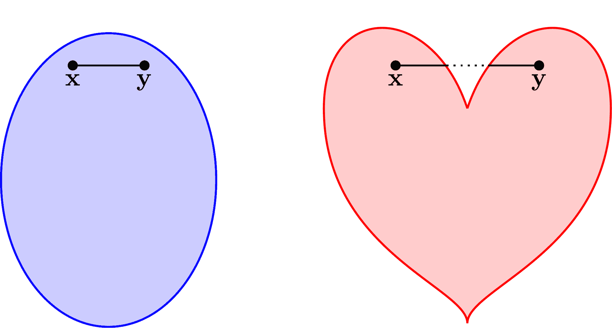
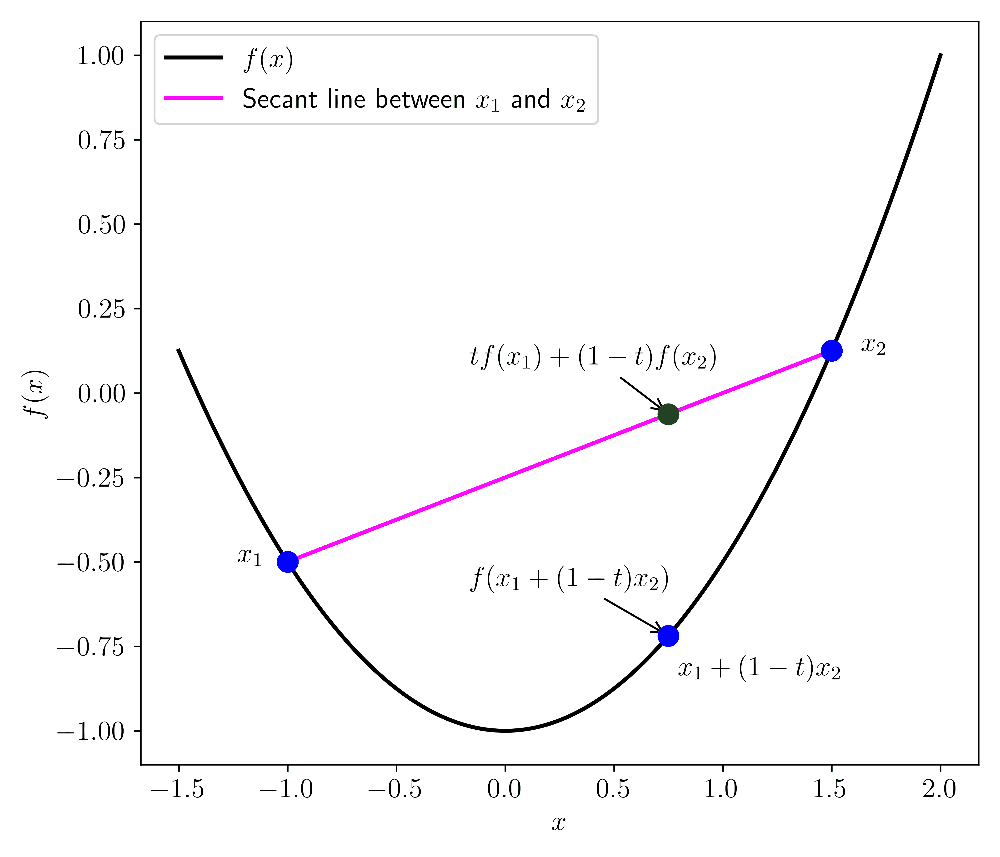
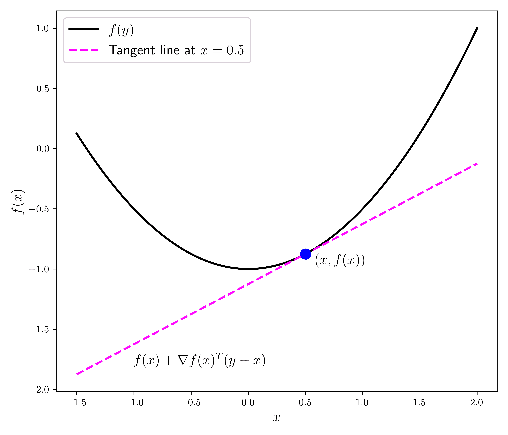

# 3.4\. 凸性#

> 原文：[`mmids-textbook.github.io/chap03_opt/04_convexity/roch-mmids-opt-convexity.html`](https://mmids-textbook.github.io/chap03_opt/04_convexity/roch-mmids-opt-convexity.html)

我们的最优性条件只关注局部极小值。事实上，在没有全局结构的情况下，局部信息，如梯度和 Hessian 矩阵，只能告诉我们点的直接邻域。在这里，我们引入凸性，这是一种常见的条件，在凸性条件下，局部极小值成为全局极小值。

## 3.4.1\. 定义#

**凸集** 我们从凸集开始。

**定义** **（凸集）** \(\idx{convex set}\xdi\) 一个集合 \(D \subseteq \mathbb{R}^d\) 是凸的，如果对于所有 \(\mathbf{x}, \mathbf{y} \in D\) 和所有 \(\alpha \in (0,1)\)

\[ (1-\alpha) \mathbf{x} + \alpha \mathbf{y} \in D. \]

\(\natural\)

注意，当 \(\alpha\) 从 \(0\) 变到 \(1\) 时，

\[ (1-\alpha) \mathbf{x} + \alpha \mathbf{y} = \mathbf{x} + \alpha (\mathbf{y} - \mathbf{x}), \]

画了一条连接 \(\mathbf{x}\) 和 \(\mathbf{y}\) 的线。换句话说，一个集合是凸的，如果集合中任意两点之间的所有线段也都在其中。

**知识检查：** 香蕉是一个凸集吗？ \(\checkmark\)

**例证：** \(\mathbb{R}^d\) 中的开球是凸的。确实，设 \(\delta > 0\) 和 \(\mathbf{x}_0 \in \mathbb{R}^d\)。对于任何 \(\mathbf{x}, \mathbf{y} \in B_{\delta}(\mathbf{x}_0)\) 和任何 \(\alpha \in [0,1]\)，我们有

\[\begin{align*} \|[(1-\alpha) \mathbf{x} + \alpha \mathbf{y}] - \mathbf{x}_0\|_2 &= \|(1-\alpha) (\mathbf{x} - \mathbf{x}_0) + \alpha (\mathbf{y} - \mathbf{x}_0)\|_2\\ &\leq \|(1-\alpha) (\mathbf{x} - \mathbf{x}_0)\|_2 + \|\alpha (\mathbf{y} - \mathbf{x}_0)\|_2\\ &= (1-\alpha) \|\mathbf{x} - \mathbf{x}_0\|_2 + \alpha \|\mathbf{y} - \mathbf{x}_0\|_2\\ &< (1-\alpha) \delta + \alpha \delta\\ &= \delta \end{align*}\]

其中我们在第二行使用了三角不等式。因此，我们已经证明了 \((1-\alpha) \mathbf{x} + \alpha \mathbf{y} \in B_{\delta}(\mathbf{x}_0)\)。

一个备注。在这个论证中，我们只使用了欧几里得范数是齐次的并且满足三角不等式。这是每个范数的特性。因此，我们得出结论，任何范数下的开球都是凸的。同样，集合的开性也没有起作用。对于任何范数下的闭球也是如此。 \(\lhd\)

**例证：** 这里有一个重要的推广。考虑 \(n \times n\) 对称矩阵的空间

\[ \mathbf{S}^n = \left\{ X \in \mathbb{R}^{n \times n}\,:\, X = X^T \right\}, \]

作为 \(\mathbb{R}^{n²}\) 的线性子空间（如何？）。\(\mathbf{S}^n\) 的维度是 \({n \choose 2} + n\)，在对称假设下的自由参数数量。现在考虑 \(\mathbf{S}^n\) 中所有正定矩阵的集合

\[ \mathbf{S}_+^n = \left\{ X \in \mathbf{S}^n \,:\, X \succeq \mathbf{0} \right\}. \]

(注意，\(\mathbf{S}_+^n\) 与具有非负元素的对称矩阵集合不同。)

我们断言集合 \(\mathbf{S}_+^n\) 是凸的。事实上，设 \(X, Y \in \mathbf{S}_+^n\) 且 \(\alpha \in [0,1]\)。那么，根据 \(X\) 和 \(Y\) 的正定性质，对于任何 \(\mathbf{v} \in \mathbb{R}^n\)

\[ \langle \mathbf{v}, [(1-\alpha) X + \alpha Y] \mathbf{v}\rangle = (1-\alpha) \langle \mathbf{v}, X \mathbf{v}\rangle + \alpha \langle \mathbf{v}, Y \mathbf{v}\rangle \geq 0. \]

这表明 \((1-\alpha) X + \alpha Y \succeq \mathbf{0}\)，因此 \(\mathbf{S}_+^n\) 是凸的。 \(\lhd\)

许多运算可以保持凸性。在符号滥用的情况下，我们将一对向量 \((\mathbf{x}_1, \mathbf{x}_2) \in \mathbb{R}^d \times \mathbb{R}^{f}\) 视为一个 \(\mathbb{R}^{d+f}\) 中的向量。换句话说，\((\mathbf{x}_1, \mathbf{x}_2)\) 是列向量 \(\mathbf{x}_1\) 和 \(\mathbf{x}_2\) 的垂直连接。这不要与 \(\begin{pmatrix}\mathbf{x}_1 & \mathbf{x}_2\end{pmatrix}\) 混淆，后者是一个 \(d \times 2\) 的矩阵，其列是 \(\mathbf{x}_1\) 和 \(\mathbf{x}_2\) – 假设 \(f = d\)（否则它不是一个定义良好的矩阵）。

**引理** **（保持凸性的运算）** \(\idx{operations that preserve convexity}\xdi\) 设 \(S_1, S_2 \subseteq \mathbb{R}^d\)，\(S_3 \subseteq \mathbb{R}^{f}\)，\(S_4 \subseteq \mathbb{R}^{d+f}\) 是凸集。设 \(\beta \in \mathbb{R}\) 和 \(\mathbf{b} \in \mathbb{R}^d\)。以下集合也是凸的：

a) *缩放:* \(\beta S_1 = \{\beta \mathbf{x}\,:\, \mathbf{x} \in S_1\}\)

b) *平移:* \(S_1 + \mathbf{b} = \{\mathbf{x} + \mathbf{b}\,:\, \mathbf{x} \in S_1\}\)

c) *和:* \(S_1 + S_2 = \{\mathbf{x}_1 + \mathbf{x}_2\,:\, \mathbf{x}_1 \in S_1 \text{ and } \mathbf{x}_2 \in S_2\}\)

d) *笛卡尔积:* \(S_1 \times S_3 = \{(\mathbf{x}_1, \mathbf{x}_2) \,:\, \mathbf{x}_1 \in S_1 \text{ and } \mathbf{x}_2 \in S_3\}\)

e) *投影:* \(T = \{\mathbf{x}_1\,:\, (\mathbf{x}_1, \mathbf{x}_2) \in S_4 \text{ for some }\mathbf{x}_2 \in \mathbb{R}^f\}\)

f) *交集:* \(S_1 \cap S_2\)

\(\flat\)

*证明:* 我们只证明 f)。其他陈述留作练习。假设 \(\mathbf{x}, \mathbf{y} \in S_1 \cap S_2\) 且 \(\alpha \in [0,1]\)。那么，根据 \(S_1\) 的凸性，\((1-\alpha) \mathbf{x} + \alpha \mathbf{y} \in S_1\)，根据 \(S_2\) 的凸性，\((1-\alpha) \mathbf{x} + \alpha \mathbf{y} \in S_2\)。因此

\[ (1-\alpha) \mathbf{x} + \alpha \mathbf{y} \in S_1 \cap S_2. \]

这种性质可以扩展到任意多个凸集的交集。 \(\square\)

**凸函数** 我们主要关注凸函数。

这里是定义。

**定义** **(凸函数)** \(\idx{凸函数}\xdi\) 如果对于所有 \(\mathbf{x}, \mathbf{y} \in \mathbb{R}^d\) 和所有 \(\alpha \in (0,1)\)

\[ f((1-\alpha) \mathbf{x} + \alpha \mathbf{y}) \leq (1-\alpha) f(\mathbf{x}) + \alpha f(\mathbf{y}). \]

更一般地，一个具有凸定义域 \(D \subseteq \mathbb{R}^d\) 的函数 \(f : D \to \mathbb{R}\) 被称为在 \(D\) 上是凸的，如果上述定义对所有 \(\mathbf{x}, \mathbf{y} \in D\) 都成立。一个函数被称为严格凸的\(\idx{严格凸函数}\xdi\) 如果存在严格不等式。如果 \(-f\) 是凸的（分别，严格凸的），那么 \(f\) 被称为凹的\(\idx{凹函数}\xdi\)（分别，严格凹的）。 \(\natural\)

上面的定义有时被称为[割线定义](https://en.wikipedia.org/wiki/Secant_line)。

**引理** **(仿射函数是凸函数)** \(\idx{仿射函数是凸函数引理}\xdi\) 设 \(\mathbf{w} \in \mathbb{R}^d\) 和 \(b \in \mathbb{R}\)。函数 \(f(\mathbf{x}) = \mathbf{w}^T \mathbf{x} + b\) 是凸函数。 \(\flat\)

*证明:* 对于任意的 \(\mathbf{x}, \mathbf{y} \in \mathbb{R}^d\) 和 \(\alpha \in [0,1]\)，

\[ f((1-\alpha) \mathbf{x} + \alpha \mathbf{y}) = \mathbf{w}^T [(1-\alpha) \mathbf{x} + \alpha \mathbf{y}] + b = (1-\alpha)[\mathbf{w}^T \mathbf{x} + b] + \alpha [\mathbf{w}^T \mathbf{y} + b] \]

这证明了该命题。 \(\square\)

这里有一个不那么直接的例子。下面给出一个具体的应用。

**引理** **(凸集上的下确界)** \(\idx{凸集上的下确界引理}\xdi\) 设 \(f : \mathbb{R}^{d+f} \to \mathbb{R}\) 是一个凸函数，并且设 \(C \subseteq \mathbb{R}^{f}\) 是一个凸集。函数

\[ g(\mathbf{x}) = \inf_{\mathbf{y} \in C} f(\mathbf{x},\mathbf{y}), \]

当且仅当对所有 \(\mathbf{x} \in \mathbb{R}^d\)，\(g(\mathbf{x}) > -\infty\) 时，它是凸函数。 \(\flat\)

*证明:* 设 \(\mathbf{x}_1, \mathbf{x}_2 \in \mathbb{R}^d\) 和 \(\alpha \in [0,1]\)。对于 \(i=1,2\)，根据 \(g\) 的定义，对于任意的 \(\epsilon > 0\)，存在 \(\mathbf{y}_i \in C\) 使得 \(f(\mathbf{x}_i, \mathbf{y}_i) \leq g(\mathbf{x}_i) + \epsilon\)。

由于 \(C\) 的凸性，\(\alpha \mathbf{y}_1 + (1- \alpha)\mathbf{y}_2 \in C\)。因此，因为 \(g\) 是 \(C\) 中点的下确界，我们有

\[\begin{align*} g(\alpha \mathbf{x}_1 + (1- \alpha)\mathbf{x}_2) &\leq f(\alpha \mathbf{x}_1 + (1- \alpha)\mathbf{x}_2, \alpha \mathbf{y}_1 + (1- \alpha)\mathbf{y}_2)\\ &= f(\alpha (\mathbf{x}_1, \mathbf{y}_1) + (1- \alpha)(\mathbf{x}_2, \mathbf{y}_2))\\ &\leq \alpha f(\mathbf{x}_1, \mathbf{y}_1) + (1- \alpha)f(\mathbf{x}_2, \mathbf{y}_2)\\ &\leq \alpha [g(\mathbf{x}_1) + \epsilon] + (1- \alpha)[g(\mathbf{x}_2) + \epsilon]\\ &\leq \alpha g(\mathbf{x}_1) + (1- \alpha) g(\mathbf{x}_2) + \epsilon, \end{align*}\]

其中我们在第二行使用了 \(f\) 的凸性。因为 \(\epsilon > 0\) 是任意的，所以结论成立。 \(\square\)

**示例** **(到凸集的距离)** 设 \(C\) 是 \(\mathbb{R}^d\) 中的一个凸集。我们证明到 \(C\) 的距离

\[ g(\mathbf{x}) = \inf_{\mathbf{y} \in C} \|\mathbf{x} - \mathbf{y}\|_2, \]

是凸的。

要应用 *在凸集上的下确界引理*，我们首先需要证明 \(f(\mathbf{x},\mathbf{y}) := \|\mathbf{x} - \mathbf{y}\|_2\) 作为 \((\mathbf{x}, \mathbf{y})\) 的函数是凸的。设 \(\mathbf{x}_1, \mathbf{x}_2 \in \mathbb{R}^d\)，\(\mathbf{y}_1, \mathbf{y}_2 \in C\)，\(\alpha \in [0,1]\)。我们想要证明 \(f\) 在凸组合

\[ \alpha (\mathbf{x}_1,\mathbf{y}_1) + (1-\alpha) (\mathbf{x}_2,\mathbf{y}_2) = (\alpha \mathbf{x}_1 + (1-\alpha)\mathbf{x}_2, \alpha \mathbf{y}_1 + (1-\alpha)\mathbf{y}_2), \]

的值被 \((\mathbf{x}_1,\mathbf{y}_1)\) 和 \((\mathbf{x}_2,\mathbf{y}_2)\) 的相同凸组合的值所上界。

通过三角不等式和范数的绝对齐次性，

\[\begin{align*} &f(\alpha \mathbf{x}_1 + (1-\alpha)\mathbf{x}_2, \alpha \mathbf{y}_1 + (1-\alpha)\mathbf{y}_2)\\ &=\|[\alpha \mathbf{x}_1 + (1-\alpha)\mathbf{x}_2] - [\alpha \mathbf{y}_1 + (1-\alpha)\mathbf{y}_2]\|_2\\ &= \|\alpha (\mathbf{x}_1 - \mathbf{y}_1 ) + (1-\alpha)(\mathbf{x}_2 - \mathbf{y}_2)\|_2\\ &\leq \alpha\|\mathbf{x}_1 - \mathbf{y}_1\|_2 + (1-\alpha)\|\mathbf{x}_2 - \mathbf{y}_2\|_2\\ &= \alpha f(\mathbf{x}_1, \mathbf{y}_1) + (1-\alpha)f(\mathbf{x}_2, \mathbf{y}_2). \end{align*}\]

需要证明对于所有 \(\mathbf{x}\)，都有 \(g(\mathbf{x}) > -\infty\)。但这很容易证明，因为 \(\|\mathbf{x} - \mathbf{y}\|_2 \geq 0\)。因此，前面的引理给出了这个结论。 \(\lhd\)

**基于梯度和 Hessian 的条件** 证明一个函数是凸的常见方法之一是查看其 Hessian（或单变量情况下的二阶导数）。我们从凸性的第一阶特征开始。

在整个过程中，当我们说一个函数 \(f : D \to \mathbb{R}\) 是连续可微的，我们隐含地假设 \(D\) 是开集，或者 \(D\) 包含在一个 \(f\) 在其中连续可微的开集中。同样适用于二阶连续可微。

**引理** **(一阶凸性条件)** \(\idx{first-order convexity condition}\xdi\) 设 \(f : D \to \mathbb{R}\) 在 \(D \subseteq \mathbb{R}^d\) 上连续可微，其中 \(D\) 是凸集。那么 \(f\) 在 \(D\) 上是凸的，当且仅当

\[ f(\mathbf{y}) \geq f(\mathbf{x}) + \nabla f(\mathbf{x})^T (\mathbf{y}-\mathbf{x}), \qquad \forall \mathbf{x}, \mathbf{y} \in D. \]

\(\flat\)

在上面的右侧，你应该能认出这是从 *泰勒定理* 中得到的 \(f\) 在 \(\mathbf{x}\) 处的线性近似，没有余项。

*证明:* *(一阶凸性条件)* 首先假设对于所有 \(\mathbf{z}_1, \mathbf{z}_2 \in D\)，有 \(f(\mathbf{z}_2) \geq f(\mathbf{z}_1) + \nabla f(\mathbf{z}_1)^T (\mathbf{z}_2-\mathbf{z}_1)\)。对于任意的 \(\mathbf{x}, \mathbf{y} \in D\) 和 \(\alpha \in [0,1]\)，令 \(\mathbf{w} = (1-\alpha) \mathbf{x} + \alpha \mathbf{y}\)（由于凸性，\(\mathbf{w}\) 也在 \(D\) 中）。然后取 \(\mathbf{z}_1 = \mathbf{w}\) 和 \(\mathbf{z}_2 = \mathbf{x}\) 得到

\[ f(\mathbf{x}) \geq f(\mathbf{w}) + \nabla f(\mathbf{w})^T (\mathbf{x}-\mathbf{w}) \]

然后取 \(\mathbf{z}_1 = \mathbf{w}\) 和 \(\mathbf{z}_2 = \mathbf{y}\) 得到

\[ f(\mathbf{y}) \geq f(\mathbf{w}) + \nabla f(\mathbf{w})^T (\mathbf{y}-\mathbf{w}). \]

将第一个不等式乘以 \((1-\alpha)\)，第二个不等式乘以 \(\alpha\)，并将它们相加得到

\[ (1-\alpha) f(\mathbf{x}) + \alpha f(\mathbf{y}) \geq f(\mathbf{w}) + \nabla f(\mathbf{w})^T ([(1-\alpha) \mathbf{x} + \alpha \mathbf{y}] - \mathbf{w}) = f(\mathbf{w}) \]

证明凸性。

对于另一个方向，假设 \(f\) 在 \(D\) 上是凸的。对于任意的 \(\mathbf{x}, \mathbf{y} \in D\) 和 \(\alpha \in (0,1)\)，根据 *平均值定理*，存在 \(\xi_\alpha \in (0,1)\)，使得

\[ f(\mathbf{w}) = f(\mathbf{x} + \alpha (\mathbf{y} - \mathbf{x})) = f(\mathbf{x}) + \alpha (\mathbf{y} - \mathbf{x})^T \nabla f (\mathbf{x} + \xi_\alpha \alpha (\mathbf{y} - \mathbf{x})) \]

而凸性意味着

\[ f(\mathbf{w}) \leq (1-\alpha) f(\mathbf{x}) + \alpha f(\mathbf{y}). \]

结合、重新排列并除以 \(\alpha\) 得到

\[ (\mathbf{y} - \mathbf{x})^T \nabla f (\mathbf{x} + \xi_\alpha \alpha (\mathbf{y} - \mathbf{x})) \leq f(\mathbf{y}) - f(\mathbf{x}). \]

当 \(\alpha \to 0\) 时取极限得到结论。 \(\square\)

我们继续讨论二阶条件。我们从 \(D = \mathbb{R}^d\) 的情况开始。

**引理** **(二阶凸性条件)** \(\idx{second-order convexity condition}\xdi\) 设 \(f : \mathbb{R}^d \to \mathbb{R}\) 是二阶连续可微的。那么 \(f\) 在 \(\mathbb{R}^d\) 上是凸的当且仅当对于所有 \(\mathbf{x} \in \mathbb{R}^d\)，\(\mathbf{H}_f(\mathbf{x})\) 是正半定的。 \(\flat\)

*证明:* 首先假设对于所有 \(\mathbf{z}_1\)，有 \(\mathbf{H}_f(\mathbf{z}_1) \succeq 0\)。对于任意的 \(\mathbf{x}, \mathbf{y}\)，根据 *泰勒展开*，存在 \(\xi \in (0,1)\)，使得

\[\begin{align*} f(\mathbf{y}) &= f(\mathbf{x}) + \nabla f(\mathbf{x})^T (\mathbf{y}-\mathbf{x}) + (\mathbf{y}-\mathbf{x})^T \mathbf{H}_f(\mathbf{x} + \xi(\mathbf{y} - \mathbf{x})) \,(\mathbf{y}-\mathbf{x})\\ &\geq f(\mathbf{x}) + \nabla f(\mathbf{x})^T (\mathbf{y}-\mathbf{x}) \end{align*}\]

其中我们使用了 Hessian 矩阵的正半定性质。根据 *一阶凸性条件*，它意味着 \(f\) 是凸的。

对于另一个方向，假设 \(f\) 是凸的。对于任意的 \(\mathbf{x}, \mathbf{w}\) 和 \(\alpha \in (0,1)\)，再次根据 *泰勒展开*，存在 \(\xi_\alpha \in (0,1)\)，使得

\[\begin{align*} f(\mathbf{x} + \alpha \mathbf{w}) = f(\mathbf{x}) + \alpha \mathbf{w}^T \nabla f (\mathbf{x}) + \alpha² \mathbf{w}^T \mathbf{H}_f(\mathbf{x} + \xi_\alpha \alpha \mathbf{w}) \,\mathbf{w} \end{align*}\]

而一阶凸性条件意味着

\[ f(\mathbf{x} + \alpha \mathbf{w}) \geq f(\mathbf{x}) + \alpha \mathbf{w}^T \nabla f (\mathbf{x}). \]

结合、重新排列并除以 \(\alpha²\) 得到

\[ \mathbf{w}^T \mathbf{H}_f(\mathbf{x} + \xi_\alpha \alpha \mathbf{w}) \,\mathbf{w} \geq 0. \]

当 \(\alpha \to 0\) 时，利用 Hessian 的连续性可以证明 \(\mathbf{w}^T \mathbf{H}_f(\mathbf{x}) \,\mathbf{w} \geq 0\)。由于 \(\mathbf{w}\) 是任意的，这表明 Hessian 在 \(\mathbf{x}\) 处是正半定的。这对于任何 \(\mathbf{x}\) 都成立，这证明了该命题。 \(\square\)

**示例** 考虑二次函数

\[ f(\mathbf{x}) = \frac{1}{2} \mathbf{x}^T P \mathbf{x} + \mathbf{q}^T \mathbf{x} + r, \]

其中 \(P\) 是一个对称矩阵。我们之前已经证明了 Hessian 是

\[ \mathbf{H}_f(\mathbf{x}) = \frac{1}{2}[P + P^T] = P. \]

因此，\(f\) 是凸的当且仅当矩阵 \(P\) 是正半定的。\(\lhd\)

在更一般的凸集上，我们有以下陈述。证明基本上没有变化。

**引理** **(二阶凸性条件)** \(\idx{二阶凸性条件}\xdi\) 设 \(f : D \to \mathbb{R}\) 是在 \(D \subseteq \mathbb{R}^d\) 上两次连续可微的凸函数。如果对于所有 \(\mathbf{x} \in D\)，\(\mathbf{H}_f(\mathbf{x})\) 是正半定（分别正定）的，那么 \(f\) 在 \(D\) 上是凸（分别严格凸）的。 \(\flat\)

以下示例展示了在相反方向可能发生什么。

**示例** 考虑函数

\[ f(\mathbf{x}) = x_1² - x_2² \]

在凸集

\[ D = \{\mathbf{x} : x_2 = 0\}. \]

在 \(D\) 上，函数简化为 \(x_1²\)，它是凸的。Hessian 矩阵为

\[\begin{split} H_f(\mathbf{x}) = \begin{pmatrix} 1 & 0\\ 0 & -1 \end{pmatrix} \end{split}\]

它不是正半定矩阵（为什么？）。\(\lhd\)

## 3.4.2\. 凸性和无约束优化#

现在是凸函数的关键性质（至少对我们来说是这样）。

**凸情况下的全局最小化** 在凸情况下，全局最小化简化为局部最小化。

**定理** **(凸函数的全局最小值)** \(\idx{凸函数全局最小值定理}\xdi\) 设 \(f : D \to \mathbb{R}\) 是一个凸函数，其中 \(D \subseteq \mathbb{R}^d\) 是凸集。那么 \(f\) 在 \(D\) 上的任意局部最小值也是全局最小值。 \(\sharp\)

*证明* 通过反证法，假设 \(\mathbf{x}_0\) 是局部最小值，但不是全局最小值。那么存在 \(\mathbf{y} \in D\)，使得

\[ f(\mathbf{y}) < f(\mathbf{x}_0). \]

由于 \(f\) 和 \(D\) 的凸性，对于任意的 \(\alpha \in (0,1)\)

\[ f(\mathbf{x}_0 + \alpha (\mathbf{y} - \mathbf{x}_0)) \leq (1-\alpha) f(\mathbf{x}_0) + \alpha f(\mathbf{y}) < f(\mathbf{x}_0). \]

但这表明，\(\mathbf{x}_0\) 附近的每一个开球都包含一个取值小于 \(f(\mathbf{x}_0)\) 的点，这是矛盾的。 \(\square\)

当 \(f\) 是严格凸时，全局最小化器是唯一的（如果存在）。（为什么？）

对于我们的目的，我们需要一个严格凸性的统一版本，称为强凸性，我们将在下一小节中定义。

在 \(\mathbb{R}^d\) 上的连续可微情况下，我们得到一个额外的结论，即在 \(\mathbf{x}_0\) 处梯度消失现在是 \(\mathbf{x}_0\) 是一个局部——因此也是一个全局——最小化器的充分条件。

**定理** **（无约束凸函数的一阶最优性条件）** \(\idx{无约束凸函数的一阶最优性条件}\xdi\) 设 \(f : \mathbb{R}^d \to \mathbb{R}\) 是一个连续可微、凸的函数。那么 \(\mathbf{x}_0\) 是一个局部最小化器——因此也是一个全局最小化器——当且仅当 \(\nabla f(\mathbf{x}_0) = \mathbf{0}\) . \(\sharp\)

**证明** 假设 \(\nabla f(\mathbf{x}_0) = \mathbf{0}\)。根据 **一阶凸性条件**，对于任意的 \(\mathbf{y}\)

\[ f(\mathbf{y}) - f(\mathbf{x}_0) \geq \nabla f(\mathbf{x}_0)^T (\mathbf{y} - \mathbf{x}_0) = 0. \]

因此 \(\mathbf{x}_0\) 是一个全局最小化器。

从 **一阶必要最优性条件** 可以立即得到另一个方向。 \(\square\)

**例** **（二次函数）** 考虑二次函数

\[ f(\mathbf{x}) = \frac{1}{2} \mathbf{x}^T P \mathbf{x} + \mathbf{q}^T \mathbf{x} + r \]

其中 \(P\) 是对称和正半定的。因此，Hessian 矩阵是

\[ \mathbf{H}_f(\mathbf{x}) = \frac{1}{2}[P + P^T] = P \]

对于任意的 \(\mathbf{x}\)。因此 \(f\) 是凸的。进一步地，梯度是

\[ \nabla f(\mathbf{x}) = P\mathbf{x} + \mathbf{q} \]

对于所有的 \(\mathbf{x}\)。

任何满足

\[ P\mathbf{x} = - \mathbf{q} \]

是一个全局最小化器。\(\lhd\)

更一般地，我们有以下结论。

**定理** **（凸集上凸函数的一阶最优性条件）** \(\idx{凸集上凸函数的一阶最优性条件}\xdi\) 设 \(f : D \to \mathbb{R}\) 是一个在 \(D \subseteq \mathbb{R}^d\) 上连续可微、凸的函数。那么 \(\mathbf{x}_0\) 是一个局部最小化器——因此也是一个全局最小化器——当且仅当对于 \(D\) 中的任意 \(\mathbf{y}\)

\[ \nabla f(\mathbf{x}_0)^T (\mathbf{y} - \mathbf{x}_0) \geq 0. \]

\(\sharp\)

*证明思路:* 换句话说，上述条件表明，对于任何形式为 \(\mathbf{y} - \mathbf{x}_0\) 的方向 \(\mathbf{v}\)（其中 \(\mathbf{y} \in D\)），方向导数 \(\frac{\partial f(\mathbf{x}_0)}{\partial \mathbf{v}}\) 是非负的。实际上，否则 \(\mathbf{v}\) 将是一个下降方向，我们可以在 \(D\) 中找到任意接近 \(\mathbf{x}_0\) 的点，使得 \(f\) 的值更小。

*证明:* 假设该条件成立。根据 *一阶凸性条件*，对于任何 \(\mathbf{y} \in D\)

\[ f(\mathbf{y}) - f(\mathbf{x}_0) \geq \nabla f(\mathbf{x}_0)^T (\mathbf{y} - \mathbf{x}_0) \geq 0. \]

因此，\(\mathbf{x}_0\) 是一个全局最小值点。

对于另一个方向，假设存在 \(\mathbf{y} \in D\) 使得

\[ \nabla f(\mathbf{x}_0)^T (\mathbf{y} - \mathbf{x}_0) < 0. \]

对于任何 \(\alpha \in (0,1)\)，根据 *平均值定理*，存在某个 \(\xi_\alpha \in (0,1)\)，使得

\[ f(\mathbf{x}_0 + \alpha (\mathbf{y} - \mathbf{x}_0)) = f(\mathbf{x}_0) + \alpha (\mathbf{y} - \mathbf{x}_0)^T \nabla f (\mathbf{x}_0 + \xi_\alpha \alpha (\mathbf{y} - \mathbf{x}_0)). \]

由于梯度的连续性，对于足够小的 \(\alpha\)，根据上述假设，我们有

\[ \nabla f (\mathbf{x}_0 + \xi_\alpha \alpha (\mathbf{y} - \mathbf{x}_0))^T (\mathbf{y} - \mathbf{x}_0) < 0. \]

将这个结果代入上述方程，可以得出对于所有这样的 \(\alpha\)

\[ f(\mathbf{x}_0 + \alpha (\mathbf{y} - \mathbf{x}_0)) < f(\mathbf{x}_0), \]

与 \(\mathbf{x}_0\) 是局部最小值点的这一事实相矛盾。 \(\square\)

**示例:** 考虑函数 \(f(x) = \frac{1}{2} x²\)，其中 \(x \in D = \{x : x \geq 1\}\)。对于任何 \(x\)，函数 \(f\) 是凸函数，因为 \(f''(x) = 1 > 0\)。

在 \(D\) 上，全局最小值点是 \(x^* = 1\)，但导数是 \(f'(1) = 1 \neq 0\)。实际上，因为 \(x^*\) 在域 \(D\) 的边界上，所以当从 \(x^*\) 向左移动时函数值减小并不重要。我们只关心那些将我们带入域 \(D\) 的方向，在这种情况下是 \(x^*\) 处的右方向。

该定理中的条件是

\[ f'(1) (y - 1) \geq 0, \qquad \forall y \geq 1. \]

这等价于 \(f'(1) \geq 0\)，这确实在这里得到了满足。

如果 \(x > 1\)，那么条件是

\[ f'(x) (y - x) \geq 0. \]

取 \(y = x+ 1\)，我们得到 \(f'(x) \geq 0\)，而取 \(y = \frac{1}{2} (1 + x)\) 给出 \(f'(x) \frac{1}{2}(1-x) \geq 0\)，这暗示 \(f'(x) \leq 0\)（为什么？）。结合这两个结果，我们得到 \(f'(x) = 0\)。没有 \(x > 1\) 满足这个条件。 \(\lhd\)

**强凸性** 在更强的假设下，我们可以获得更强的保证。其中一种假设是强凸性，我们将在以下特殊情况下定义它，即对于二阶连续可微函数。它推广了单变量条件，即对于所有 \(x \in \mathbb{R}\)，要求二阶导数 \(f''(x) > m > 0\)。具体来说，我们要求“每个方向”的二阶导数都有下界。为此，我们使用二阶方向导数。

强凸函数是指沿所有单位向量方向的所有二阶方向导数都均匀地有下界，远离 \(0\)。也就是说，存在 \(m > 0\) 使得

\[ \frac{\partial² f (\mathbf{x})}{\partial \mathbf{v}²} = \mathbf{v}^T \mathbf{H}_f(\mathbf{x}) \,\mathbf{v} \geq m \]

对于所有 \(\mathbf{x} \in \mathbb{R}^d\) 和所有单位向量 \(\mathbf{v} \in \mathbb{R}^d\).

我们将使用以下符号来正式表述。设 \(A, B \in \mathbb{R}^{d \times d}\) 为对称矩阵。回忆一下，\(A \succeq 0\) 表示 \(A\) 是正半定的。我们写 \(A \preceq B\)（分别 \(A \succeq B\)）来表示 \(B - A \succeq 0\)（分别 \(A - B \succeq 0\)）。另一种不同的、有用的表述方式如下。回忆一下，\(B - A \succeq 0\) 表示

\[ \mathbf{z}^T (B - A)\mathbf{z} = \mathbf{z}^T B\mathbf{z} - \mathbf{z}^T A\mathbf{z} \geq 0 \]

对于所有 \(\mathbf{z} \in \mathbb{R}^{d}\)。因此，重新排列，

\[ A \preceq B \iff \mathbf{z}^T A\,\mathbf{z} \leq \mathbf{z}^T B\,\mathbf{z}, \qquad \forall \mathbf{z} \in \mathbb{R}^{d}. \]

同样地，

\[ A \succeq B \iff \mathbf{z}^T A\,\mathbf{z} \geq \mathbf{z}^T B\,\mathbf{z}, \qquad \forall \mathbf{z} \in \mathbb{R}^{d}. \]

**定义** **(强凸函数)** \(\idx{strongly convex function}\xdi\) 设 \(f : \mathbb{R}^d \to \mathbb{R}\) 为二阶连续可微，且 \(m > 0\)。我们说 \(f\) 是 \(m\)-强凸的，如果

\[ \mathbf{H}_f(\mathbf{x}) \succeq m I_{d \times d}, \quad \forall \mathbf{x} \in \mathbb{R}^d. \]

\(\natural\)

通过上述观察，注意到 \(\mathbf{z}^T I_{d \times d} \mathbf{z} = \|\mathbf{z}\|²\)，我们得到上述条件等价于

\[ \mathbf{z}^T \mathbf{H}_f(\mathbf{x}) \,\mathbf{z} \geq m \|\mathbf{z}\|², \quad \forall \mathbf{x}, \mathbf{z} \in \mathbb{R}^d. \]

特别地，对于单位向量 \(\mathbf{v}\)，我们得到 \(\mathbf{v}^T \mathbf{H}_f(\mathbf{x}) \,\mathbf{v} \geq m\)。反之，如果对于所有 \(\mathbf{x} \in \mathbb{R}^d\) 和所有单位向量 \(\mathbf{v} \in \mathbb{R}^d\)，\(\mathbf{v}^T \mathbf{H}_f(\mathbf{x}) \,\mathbf{v} \geq m\)，那么对于任何非零向量 \(\mathbf{z} \in \mathbb{R}^d\)

\[ \left(\frac{\mathbf{z}}{\|\mathbf{z}\|}\right)^T \mathbf{H}_f(\mathbf{x}) \,\left(\frac{\mathbf{z}}{\|\mathbf{z}\|}\right) \geq m, \]

重新排列后给出 \(\mathbf{z}^T \mathbf{H}_f(\mathbf{x}) \,\mathbf{z} \geq m \|\mathbf{z}\|²\).

结合 *泰勒定理*，这立即给出以下结果。证明留给读者作为练习。

**引理** **（强凸函数的二次界）** \(\idx{quadratic bound for strongly convex functions}\xdi\) 设 \(f : \mathbb{R}^d \to \mathbb{R}\) 是二阶连续可微的。那么 \(f\) 是 \(m\)-强凸的当且仅当

\[ f(\mathbf{y}) \geq f(\mathbf{x}) + \nabla f(\mathbf{x})^T(\mathbf{y} - \mathbf{x}) + \frac{m}{2} \|\mathbf{y} - \mathbf{x}\|², \qquad \forall \mathbf{x}, \mathbf{y} \in \mathbb{R}^d. \]

\(\flat\)

之前的引理立即导致以下基本结果。

**定理** **（强凸函数的全局最小值）** \(\idx{global minimizer of a strongly convex function theorem}\xdi\) 设 \(f : \mathbb{R}^d \to \mathbb{R}\) 是二阶连续可微的，并且是 \(m\)-强凸的，其中 \(m>0\)。如果 \(\nabla f(\mathbf{x}^*) = \mathbf{0}\)，则 \(\mathbf{x}^*\) 是 \(f\) 的唯一全局最小值。 \(\sharp\)

*证明：* 如果 \(\nabla f(\mathbf{x}^*) = \mathbf{0}\)，根据 *强凸函数的二次界*，

\[ f(\mathbf{y}) \geq f(\mathbf{x}^*) + \frac{m}{2} \|\mathbf{y} - \mathbf{x}^*\|² > f(\mathbf{x}^*) \]

对于所有 \(\mathbf{y} \neq \mathbf{x}^*\)，这证明了该命题。 \(\square\)

**示例：** **（二次函数，继续）** 再次考虑二次函数

\[ f(\mathbf{x}) = \frac{1}{2} \mathbf{x}^T P \mathbf{x} + \mathbf{q}^T \mathbf{x} + r \]

其中 \(P\) 是对称的，这次是正定的。再次，对于任何 \(\mathbf{x}\)，Hessian 矩阵是

\[ \mathbf{H}_f(\mathbf{x}) = \frac{1}{2}[P + P^T] = P. \]

表达式 \(\mathbf{v}^T P \,\mathbf{v}\)，作为 \(\mathbf{v}\) 的函数是连续的，它通过 *极值定理* 在 \(\mathbb{S}^{d-1}\) 上达到其最小值。根据我们假设 \(P\) 是正定的，这个最小值必须是严格正的，即 \(\mu > 0\)。因此，\(f\) 是 \(\mu\)-强凸的。*强凸函数的全局最小值定理* 指出，在这种情况下存在唯一的全局最小值。通过之前的计算，它通过计算 \(\mathbf{x}^* = - P^{-1} \mathbf{q}\) 来获得。（为什么 \(P\) 是可逆的？）\(\lhd\)

**示例：** 考虑最小二乘目标函数

\[ f(\mathbf{x}) = \|A \mathbf{x} - \mathbf{b}\|², \]

其中 \(A \in \mathbb{R}^{n \times d}\) 具有满列秩，且 \(\mathbf{b} \in \mathbb{R}^n\)。这个目标函数可以重写为一个二次函数

\[\begin{align*} f(\mathbf{x}) &= \|A \mathbf{x} - \mathbf{b}\|²\\ &= (A \mathbf{x} - \mathbf{b})^T(A \mathbf{x} - \mathbf{b})\\ &= \mathbf{x}^T A^T A \mathbf{x} - 2 \mathbf{b}^T A \mathbf{x} + \mathbf{b}^T \mathbf{b}\\ &= \frac{1}{2} \mathbf{x}^T P \mathbf{x} + \mathbf{q}^T \mathbf{x} + r \end{align*}\]

其中 \(P = 2 A^T A\) 是对称的，\(\mathbf{q} = - 2 A^T \mathbf{b}\)，且 \(r= \mathbf{b}^T \mathbf{b} = \|\mathbf{b}\|²\).

函数 \(f\) 的 Hessian 矩阵是

\[ \mathbf{H}_f(\mathbf{x}) = 2 A^T A. \]

这个 Hessian 是正定的。实际上，我们之前已经证明，对于任何 \(\mathbf{z} \in \mathbb{R}^d\)，

\[ \langle \mathbf{z}, 2 A^T A \mathbf{z}\rangle = 2 (A \mathbf{z})^T (A \mathbf{z}) = 2 \|A \mathbf{z}\|² > 0, \]

因为根据满列秩假设，\(A \mathbf{z} = \mathbf{0}\) 意味着 \(\mathbf{z} = \mathbf{0}\)。

通过前一个例子，\(f\) 对于某个 \(\mu > 0\) 是 \(\mu\)-强凸的。因此，*强凸函数的全局最小值定理* 表明，在这种情况下，最小二乘目标函数存在唯一的全局最小值。\(\lhd\)

**EXAMPLE:** 设 \(D \subseteq \mathbb{R}^d\) 为一个非空、闭、凸集。对于 \(\mathbf{x}\in\mathbb{R}^d\)，我们定义 \(\mathbf{x}\) 在 \(D\) 上的投影为

\[ \mathrm{proj}_{D}(\mathbf{x}) = \arg\min\left\{\|\mathbf{x} - \mathbf{z}\| : \mathbf{z} \in D\right\}. \]

设 \(\mathbf{w} \in D\)。通过将 \(\|\mathbf{x} - \mathbf{z}\|\) 应用于闭、有界集合 \(\{\mathbf{z} \in D: \|\mathbf{x} - \mathbf{z}\| \leq \|\mathbf{x} - \mathbf{w}\|\}\) 的 *极值定理*，该问题存在全局最小值。此外，该问题等价于最小化 \(\|\mathbf{x} - \mathbf{z}\|²\) 的 *平方* 范数，因为

\[ \|\mathbf{x} - \mathbf{z}\|² = \mathbf{z}^T\mathbf{z} - 2 \mathbf{x}^T\mathbf{z} + \|\mathbf{x}\|². \]

因此，最小值是唯一的。

我们使用 *凸集上凸函数的一阶最优性条件* 来描述它。根据我们之前关于二次函数的公式，\(\|\mathbf{x} - \mathbf{z}\|²\) 关于 \(\mathbf{z}\) 的梯度是 \(2\mathbf{z} - 2 \mathbf{x}\)。因此，最优性条件可以简化为

\[ (\mathrm{proj}_{D}(\mathbf{x}) - \mathbf{x})^T(\mathbf{y} - \mathrm{proj}_{D}(\mathbf{x})) \geq 0, \qquad \forall \mathbf{y} \in D. \]

这个公式将 *正交投影定理* 推广到线性子空间之外的情况。\(\lhd\)

**KNOWLEDGE CHECK:** 从前一个例子中恢复到线性子空间正交投影的几何特征。\(\checkmark\)

***自我评估测验*** *(由 Claude、Gemini 和 ChatGPT 协助)*

**1** 以下哪个操作不是保持集合凸性的操作？

a) 通过一个实数缩放凸集。

b) 通过一个向量平移凸集。

c) 两个凸集的并集。

d) 两个凸集的交集。

**2** 设 \(f : \mathbb{R}^d \to \mathbb{R}\) 是二阶连续可微的。以下哪个条件是 \(f\) 为凸函数的充分条件？

a) 对于所有 \(\mathbf{x} \in \mathbb{R}^d\)，\(\mathbf{H}_f(\mathbf{x}) \prec \mathbf{0}\)

b) 对于所有 \(\mathbf{x} \in \mathbb{R}^d\)，\(\mathbf{H}_f(\mathbf{x}) \preceq \mathbf{0}\)

c) 对于所有 \(\mathbf{x} \in \mathbb{R}^d\)，\(\mathbf{H}_f(\mathbf{x}) \succeq \mathbf{0}\)

d) \(\mathbf{H}_f(\mathbf{x}) \succ \mathbf{0}\)，对于所有 \(\mathbf{x} \in \mathbb{R}^d\)

**3** 设 \(f : \mathbb{R}^d \to \mathbb{R}\) 是一个连续可微的凸函数。以下哪一个是 \(\mathbf{x}_0\) 成为 \(f\) 的全局最小值的必要且充分条件？

a) \(\nabla f(\mathbf{x}_0) \neq \mathbf{0}\)

b) \(\nabla f(\mathbf{x}_0) = \mathbf{0}\)

c) \(\mathbf{H}_f(\mathbf{x}_0) \succeq \mathbf{0}\)

d) \(\mathbf{H}_f(\mathbf{x}_0) \succ \mathbf{0}\)

**4** 如果一个函数 \(f : \mathbb{R}^d \to \mathbb{R}\) 是 \(m\)-强凸的，那么：

a) \(\mathbf{H}_f(\mathbf{x}) \succeq mI_{d \times d}\)，对于所有 \(\mathbf{x} \in \mathbb{R}^d\) 和某个 \(m > 0\)

b) \(\mathbf{H}_f(\mathbf{x}) \preceq mI_{d \times d}\)，对于所有 \(\mathbf{x} \in \mathbb{R}^d\) 和某个 \(m > 0\)

c) \(\mathbf{H}_f(\mathbf{x}) \succeq -mI_{d \times d}\)，对于所有 \(\mathbf{x} \in \mathbb{R}^d\) 和某个 \(m > 0\)

d) \(\mathbf{H}_f(\mathbf{x}) \preceq -mI_{d \times d}\)，对于所有 \(\mathbf{x} \in \mathbb{R}^d\) 和某个 \(m > 0\)

**5** 以下关于最小二乘目标函数 \(f(\mathbf{x}) = \|A\mathbf{x} - \mathbf{b}\|_2²\) 的哪个陈述是正确的，其中 \(A \in \mathbb{R}^{n \times d}\) 具有满列秩且 \(\mathbf{b} \in \mathbb{R}^n\)？

a) \(f(\mathbf{x})\) 是凸的但不一定是强凸的。

b) \(f(\mathbf{x})\) 是强凸的。

c) \(f(\mathbf{x})\) 是凸的当且仅当 \(\mathbf{b} = \mathbf{0}\)。

d) \(f(\mathbf{x})\) 是强凸的当且仅当 \(\mathbf{b} = \mathbf{0}\)。

1 的答案：c. 理由：文本指出缩放、平移、加法、笛卡尔积、投影和交集保持凸性。它没有提到并集。实际上，两个凸集的并集不一定凸（例如，取两个不同点的并集）。

2 的答案：c. 理由：文本陈述了二阶凸性条件：如果 \(f : \mathbb{R}^d \to \mathbb{R}\) 是二阶连续可微的，那么 \(f\) 是凸的当且仅当对所有 \(\mathbf{x} \in \mathbb{R}^d\)，\(\mathbf{H}_f(\mathbf{x}) \succeq 0\)。

3 的答案：b. 理由：文本陈述并证明了 \(\mathbb{R}^d\) 上凸函数的一阶最优性条件：如果 \(f : \mathbb{R}^d \to \mathbb{R}\) 是一个连续可微的凸函数，那么 \(\mathbf{x}_0\) 是全局最小值当且仅当 \(\nabla f(\mathbf{x}_0) = 0\)。

4 的答案：a. 理由：文本定义了一个 \(m\)-强凸函数 \(f : \mathbb{R}^d \to \mathbb{R}\) 为满足对所有 \(\mathbf{x} \in \mathbb{R}^d\) 和某个 \(m > 0\)，\(\mathbf{H}_f(\mathbf{x}) \succeq mI_{d \times d}\) 的函数。

5 的答案：b. 理由：文本表明最小二乘目标函数的 Hessian 矩阵是 \(2A^TA\)，当 \(A\) 具有满列秩时，它是正定的。因此，最小二乘目标函数是强凸的。

## 3.4.1\. 定义#

**凸集** 我们从凸集开始。

**定义** **(凸集)** \(\idx{convex set}\xdi\) 一个集合 \(D \subseteq \mathbb{R}^d\) 是凸的，如果对于所有 \(\mathbf{x}, \mathbf{y} \in D\) 和所有 \(\alpha \in (0,1)\)

\[ (1-\alpha) \mathbf{x} + \alpha \mathbf{y} \in D. \]

\(\natural\)

注意，当 \(\alpha\) 从 \(0\) 变到 \(1\) 时，

\[ (1-\alpha) \mathbf{x} + \alpha \mathbf{y} = \mathbf{x} + \alpha (\mathbf{y} - \mathbf{x}), \]

画一条连接 \(\mathbf{x}\) 和 \(\mathbf{y}\) 的线。换句话说，如果一个集合中任意两点之间的所有线段也都在该集合中，那么这个集合是凸的。

**知识检查：** 香蕉是一个凸集吗？\(\checkmark\)

**EXAMPLE:** 在 \(\mathbb{R}^d\) 中的一个开球是凸集。实际上，设 \(\delta > 0\) 和 \(\mathbf{x}_0 \in \mathbb{R}^d\)。对于任何 \(\mathbf{x}, \mathbf{y} \in B_{\delta}(\mathbf{x}_0)\) 和任何 \(\alpha \in [0,1]\)，我们有

\[\begin{align*} \left\|[(1-\alpha) \mathbf{x} + \alpha \mathbf{y}] - \mathbf{x}_0\right\|_2 &= \left\|(1-\alpha) (\mathbf{x} - \mathbf{x}_0) + \alpha (\mathbf{y} - \mathbf{x}_0)\right\|_2\\ &\leq \left\|(1-\alpha) (\mathbf{x} - \mathbf{x}_0)\right\|_2 + \left\|\alpha (\mathbf{y} - \mathbf{x}_0)\right\|_2\\ &= (1-\alpha) \left\|\mathbf{x} - \mathbf{x}_0\right\|_2 + \alpha \left\|\mathbf{y} - \mathbf{x}_0\right\|_2\\ &< (1-\alpha) \delta + \alpha \delta\\ &= \delta \end{align*}\]

其中我们在第二行使用了三角不等式。因此，我们已证明 \((1-\alpha) \mathbf{x} + \alpha \mathbf{y} \in B_{\delta}(\mathbf{x}_0)\)。

一个备注。在这个论证中，我们只使用了欧几里得范数是齐次的并且满足三角不等式。这是每个范数的特性。因此，我们得出结论，任何范数下的开球都是凸集。此外，集合的开性没有发挥作用。对于任何范数下的闭球也是如此。\(\lhd\)

**EXAMPLE:** 这里有一个重要的推广。考虑 \(n \times n\) 对称矩阵的空间

\[ \mathbf{S}^n = \left\{ X \in \mathbb{R}^{n \times n}\,:\, X = X^T \right\}, \]

作为 \(\mathbb{R}^{n²}\) 的一个线性子空间（如何？）。\(\mathbf{S}^n\) 的维度是 \({n \choose 2} + n\)，这是在对称性假设下的自由参数数量。现在考虑 \(\mathbf{S}^n\) 中所有正定矩阵的集合

\[ \mathbf{S}_+^n = \left\{ X \in \mathbf{S}^n \,:\, X \succeq \mathbf{0} \right\}. \]

(注意，\(\mathbf{S}_+^n\) 并不等于具有非负元素的对称矩阵的集合。)

我们断言集合 \(\mathbf{S}_+^n\) 是凸的。实际上，设 \(X, Y \in \mathbf{S}_+^n\) 且 \(\alpha \in [0,1]\)。然后，由于 \(X\) 和 \(Y\) 的正定性，对于任何 \(\mathbf{v} \in \mathbb{R}^n\)

\[ \left\langle \mathbf{v}, [(1-\alpha) X + \alpha Y] \mathbf{v}\right\rangle = (1-\alpha) \left\langle \mathbf{v}, X \mathbf{v}\right\rangle + \alpha \left\langle \mathbf{v}, Y \mathbf{v}\right\rangle \geq 0. \]

这表明 \((1-\alpha) X + \alpha Y \succeq \mathbf{0}\)，因此 \(\mathbf{S}_+^n\) 是凸的。 \(\lhd\)

许多操作保持凸性。在符号滥用的情况下，我们将一对向量 \((\mathbf{x}_1, \mathbf{x}_2) \in \mathbb{R}^d \times \mathbb{R}^{f}\) 视为一个 \(\mathbb{R}^{d+f}\) 中的向量。换句话说，\((\mathbf{x}_1, \mathbf{x}_2)\) 是列向量 \(\mathbf{x}_1\) 和 \(\mathbf{x}_2\) 的垂直连接。这不应与 \(\begin{pmatrix}\mathbf{x}_1 & \mathbf{x}_2\end{pmatrix}\) 混淆，后者是一个 \(d \times 2\) 的矩阵，其列是 \(\mathbf{x}_1\) 和 \(\mathbf{x}_2\) – 假设 \(f = d\)（否则它不是一个定义良好的矩阵）。

**引理** **(保持凸性的操作)** \(\idx{operations that preserve convexity}\xdi\) 设 \(S_1, S_2 \subseteq \mathbb{R}^d\)，\(S_3 \subseteq \mathbb{R}^{f}\)，\(S_4 \subseteq \mathbb{R}^{d+f}\) 是凸集。设 \(\beta \in \mathbb{R}\) 和 \(\mathbf{b} \in \mathbb{R}^d\)。以下集合也是凸的：

a) *缩放*: \(\beta S_1 = \{\beta \mathbf{x}\,:\, \mathbf{x} \in S_1\}\)

b) *平移*: \(S_1 + \mathbf{b} = \{\mathbf{x} + \mathbf{b}\,:\, \mathbf{x} \in S_1\}\)

c) *和*: \(S_1 + S_2 = \{\mathbf{x}_1 + \mathbf{x}_2\,:\, \mathbf{x}_1 \in S_1 \text{ and } \mathbf{x}_2 \in S_2\}\)

d) *笛卡尔积*: \(S_1 \times S_3 = \{(\mathbf{x}_1, \mathbf{x}_2) \,:\, \mathbf{x}_1 \in S_1 \text{ and } \mathbf{x}_2 \in S_3\}\)

e) *投影*: \(T = \{\mathbf{x}_1\,:\, (\mathbf{x}_1, \mathbf{x}_2) \in S_4 \text{ for some }\mathbf{x}_2 \in \mathbb{R}^f\}\)

f) *交集*: \(S_1 \cap S_2\)

\(\flat\)

*证明*: 我们只证明 f)。其他陈述留作练习。假设 \(\mathbf{x}, \mathbf{y} \in S_1 \cap S_2\) 且 \(\alpha \in [0,1]\)。那么，根据 \(S_1\) 的凸性，\((1-\alpha) \mathbf{x} + \alpha \mathbf{y} \in S_1\)，根据 \(S_2\) 的凸性，\((1-\alpha) \mathbf{x} + \alpha \mathbf{y} \in S_2\)。因此

\[ (1-\alpha) \mathbf{x} + \alpha \mathbf{y} \in S_1 \cap S_2. \]

这种性质可以扩展到任意多个凸集的交集。 \(\square\)

**凸函数** 我们主要关注凸函数。

这里是定义。

**定义** **(凸函数)** \(\idx{convex function}\xdi\) 一个函数 \(f : \mathbb{R}^d \to \mathbb{R}\) 是凸的，如果对于所有 \(\mathbf{x}, \mathbf{y} \in \mathbb{R}^d\) 和所有 \(\alpha \in (0,1)\)

\[ f((1-\alpha) \mathbf{x} + \alpha \mathbf{y}) \leq (1-\alpha) f(\mathbf{x}) + \alpha f(\mathbf{y}). \]

更一般地，一个具有凸定义域 \(D \subseteq \mathbb{R}^d\) 的函数 \(f : D \to \mathbb{R}\) 被称为在 \(D\) 上是凸的，如果上述定义对所有 \(\mathbf{x}, \mathbf{y} \in D\) 都成立。一个函数被称为严格凸的\(\idx{严格凸函数}\xdi\) 如果存在严格不等式。如果 \(-f\) 是凸的（分别，严格凸的），则 \(f\) 被称为凹的\(\idx{凹函数}\xdi\)（分别，严格凹的）。 \(\natural\)

上述定义有时被称为[割线](https://en.wikipedia.org/wiki/Secant_line)定义。

**引理** **(仿射函数是凸函数)** \(\idx{仿射函数是凸函数引理}\xdi\) 设 \(\mathbf{w} \in \mathbb{R}^d\) 和 \(b \in \mathbb{R}\)。函数 \(f(\mathbf{x}) = \mathbf{w}^T \mathbf{x} + b\) 是凸函数。 \(\flat\)

**证明**：对于任意 \(\mathbf{x}, \mathbf{y} \in \mathbb{R}^d\) 和 \(\alpha \in [0,1]\)，

\[ f((1-\alpha) \mathbf{x} + \alpha \mathbf{y}) = \mathbf{w}^T [(1-\alpha) \mathbf{x} + \alpha \mathbf{y}] + b = (1-\alpha)[\mathbf{w}^T \mathbf{x} + b] + \alpha [\mathbf{w}^T \mathbf{y} + b] \]

这证明了结论。 \(\square\)

这里有一个不那么直接的例子。下面给出一个具体的应用。

**引理** **(凸集上的下确界)** \(\idx{凸集上的下确界引理}\xdi\) 设 \(f : \mathbb{R}^{d+f} \to \mathbb{R}\) 是一个凸函数，并且设 \(C \subseteq \mathbb{R}^{f}\) 是一个凸集。函数

\[ g(\mathbf{x}) = \inf_{\mathbf{y} \in C} f(\mathbf{x},\mathbf{y}), \]

当 \(g(\mathbf{x}) > -\infty\) 对所有 \(\mathbf{x} \in \mathbb{R}^d\) 成立时，是凸的。 \(\flat\)

**证明**：设 \(\mathbf{x}_1, \mathbf{x}_2 \in \mathbb{R}^d\) 和 \(\alpha \in [0,1]\)。根据 \(g\) 的定义，对于任意 \(\epsilon > 0\)，存在 \(\mathbf{y}_i \in C\) 使得 \(f(\mathbf{x}_i, \mathbf{y}_i) \leq g(\mathbf{x}_i) + \epsilon\)。

由于 \(C\) 的凸性，\(\alpha \mathbf{y}_1 + (1- \alpha)\mathbf{y}_2 \in C\)。因此，因为 \(g\) 是 \(C\) 中点 \(\mathbf{y}\) 的下确界，我们有

\[\begin{align*} g(\alpha \mathbf{x}_1 + (1- \alpha)\mathbf{x}_2) &\leq f(\alpha \mathbf{x}_1 + (1- \alpha)\mathbf{x}_2, \alpha \mathbf{y}_1 + (1- \alpha)\mathbf{y}_2)\\ &= f(\alpha (\mathbf{x}_1, \mathbf{y}_1) + (1- \alpha)(\mathbf{x}_2, \mathbf{y}_2))\\ &\leq \alpha f(\mathbf{x}_1, \mathbf{y}_1) + (1- \alpha)f(\mathbf{x}_2, \mathbf{y}_2)\\ &\leq \alpha [g(\mathbf{x}_1) + \epsilon] + (1- \alpha)[g(\mathbf{x}_2) + \epsilon]\\ &\leq \alpha g(\mathbf{x}_1) + (1- \alpha) g(\mathbf{x}_2) + \epsilon, \end{align*}\]

其中我们在第二行使用了 \(f\) 的凸性。因为 \(\epsilon > 0\) 是任意的，所以结论成立。 \(\square\)

**例题** **(到凸集的距离)** 设 \(C\) 是 \(\mathbb{R}^d\) 中的一个凸集。我们证明到 \(C\) 的距离

\[ g(\mathbf{x}) = \inf_{\mathbf{y} \in C} \|\mathbf{x} - \mathbf{y}\|_2, \]

是凸的。

要应用 **“在凸集上的下确界引理”**，我们首先需要证明 \(f(\mathbf{x},\mathbf{y}) := \|\mathbf{x} - \mathbf{y}\|_2\) 作为 \((\mathbf{x}, \mathbf{y})\) 的函数是凸的。设 \(\mathbf{x}_1, \mathbf{x}_2 \in \mathbb{R}^d\)，\(\mathbf{y}_1, \mathbf{y}_2 \in C\)，且 \(\alpha \in [0,1]\)。我们想要证明 \(f\) 在凸组合

\[ \alpha (\mathbf{x}_1,\mathbf{y}_1) + (1-\alpha) (\mathbf{x}_2,\mathbf{y}_2) = (\alpha \mathbf{x}_1 + (1-\alpha)\mathbf{x}_2, \alpha \mathbf{y}_1 + (1-\alpha)\mathbf{y}_2), \]

被相同的凸组合 \((\mathbf{x}_1,\mathbf{y}_1)\) 和 \((\mathbf{x}_2,\mathbf{y}_2)\) 在 \(f\) 的值上所上界。

通过三角不等式和范数的绝对齐次性，

\[\begin{align*} &f(\alpha \mathbf{x}_1 + (1-\alpha)\mathbf{x}_2, \alpha \mathbf{y}_1 + (1-\alpha)\mathbf{y}_2)\\ &=\|[\alpha \mathbf{x}_1 + (1-\alpha)\mathbf{x}_2] - [\alpha \mathbf{y}_1 + (1-\alpha)\mathbf{y}_2]\|_2\\ &= \|\alpha (\mathbf{x}_1 - \mathbf{y}_1 ) + (1-\alpha)(\mathbf{x}_2 - \mathbf{y}_2)\|_2\\ &\leq \alpha\|\mathbf{x}_1 - \mathbf{y}_1\|_2 + (1-\alpha)\|\mathbf{x}_2 - \mathbf{y}_2\|_2\\ &= \alpha f(\mathbf{x}_1, \mathbf{y}_1) + (1-\alpha)f(\mathbf{x}_2, \mathbf{y}_2). \end{align*}\]

剩下的需要证明的是 \(g(\mathbf{x}) > -\infty\) 对所有 \(\mathbf{x}\) 都成立。但是这是显然的，因为 \(\|\mathbf{x} - \mathbf{y}\|_2 \geq 0\)。因此，前面的引理给出了所要求的结论。 \(\lhd\)

**基于梯度和 Hessian 的条件** 证明一个函数是凸的常见方法是通过观察其 Hessian（或单变量情况下的二阶导数）。我们从凸性的第一阶特征开始。

在整个过程中，当我们说一个函数 \(f : D \to \mathbb{R}\) 是连续可微的，我们隐含地假设 \(D\) 是开集，或者 \(D\) 包含在一个 \(f\) 在其中连续可微的开集中。同样适用于二阶连续可微的情况。

**引理** **(一阶凸性条件)** \(\idx{first-order convexity condition}\xdi\) 设 \(f : D \to \mathbb{R}\) 在 \(D \subseteq \mathbb{R}^d\) 上连续可微，其中 \(D\) 是凸集。那么 \(f\) 在 \(D\) 上是凸的，当且仅当

\[ f(\mathbf{y}) \geq f(\mathbf{x}) + \nabla f(\mathbf{x})^T (\mathbf{y}-\mathbf{x}), \qquad \forall \mathbf{x}, \mathbf{y} \in D. \]

\(\flat\)

在上式中，你应该能认出这是从 **泰勒定理** 中得到的 \(f\) 在 \(\mathbf{x}\) 处的线性近似，没有余项。

*证明:* *(一阶凸性条件)* 首先假设对于所有 \(\mathbf{z}_1, \mathbf{z}_2 \in D\)，\(f(\mathbf{z}_2) \geq f(\mathbf{z}_1) + \nabla f(\mathbf{z}_1)^T (\mathbf{z}_2-\mathbf{z}_1)\)。对于任意的 \(\mathbf{x}, \mathbf{y} \in D\) 和 \(\alpha \in [0,1]\)，令 \(\mathbf{w} = (1-\alpha) \mathbf{x} + \alpha \mathbf{y}\)（由于凸性，\(\mathbf{w}\) 在 \(D\) 中），然后取 \(\mathbf{z}_1 = \mathbf{w}\) 和 \(\mathbf{z}_2 = \mathbf{x}\) 得到

\[ f(\mathbf{x}) \geq f(\mathbf{w}) + \nabla f(\mathbf{w})^T (\mathbf{x}-\mathbf{w}) \]

并取 \(\mathbf{z}_1 = \mathbf{w}\) 和 \(\mathbf{z}_2 = \mathbf{y}\) 得到

\[ f(\mathbf{y}) \geq f(\mathbf{w}) + \nabla f(\mathbf{w})^T (\mathbf{y}-\mathbf{w}). \]

将第一个不等式乘以 \((1-\alpha)\) 并将第二个不等式乘以 \(\alpha\)，然后相加得到

\[ (1-\alpha) f(\mathbf{x}) + \alpha f(\mathbf{y}) \geq f(\mathbf{w}) + \nabla f(\mathbf{w})^T ([(1-\alpha) \mathbf{x} + \alpha \mathbf{y}] - \mathbf{w}) = f(\mathbf{w}) \]

证明凸性。

对于另一个方向，假设 \(f\) 在 \(D\) 上是凸函数。对于任意的 \(\mathbf{x}, \mathbf{y} \in D\) 和 \(\alpha \in (0,1)\)，根据 *平均值定理*，存在 \(\xi_\alpha \in (0,1)\) 使得

\[ f(\mathbf{w}) = f(\mathbf{x} + \alpha (\mathbf{y} - \mathbf{x})) = f(\mathbf{x}) + \alpha (\mathbf{y} - \mathbf{x})^T \nabla f (\mathbf{x} + \xi_\alpha \alpha (\mathbf{y} - \mathbf{x})) \]

而凸性意味着

\[ f(\mathbf{w}) \leq (1-\alpha) f(\mathbf{x}) + \alpha f(\mathbf{y}). \]

结合、重新排列并除以 \(\alpha\) 得到

\[ (\mathbf{y} - \mathbf{x})^T \nabla f (\mathbf{x} + \xi_\alpha \alpha (\mathbf{y} - \mathbf{x})) \leq f(\mathbf{y}) - f(\mathbf{x}). \]

当 \(\alpha \to 0\) 时得到结论。 \(\square\)

我们继续讨论二阶条件。我们首先考虑 \(D = \mathbb{R}^d\) 的情况。

**引理** **(二阶凸性条件)** \(\idx{second-order convexity condition}\xdi\) 设 \(f : \mathbb{R}^d \to \mathbb{R}\) 是二阶连续可微的。那么 \(f\) 在 \(\mathbb{R}^d\) 上是凸函数当且仅当对所有 \(\mathbf{x} \in \mathbb{R}^d\)，\(\mathbf{H}_f(\mathbf{x})\) 是正半定矩阵。 \(\flat\)

*证明:* 首先假设对所有 \(\mathbf{z}_1\)，\(\mathbf{H}_f(\mathbf{z}_1) \succeq 0\)。对于任意的 \(\mathbf{x}, \mathbf{y}\)，通过 *Taylor* 展开，存在 \(\xi \in (0,1)\) 使得

\[\begin{align*} f(\mathbf{y}) &= f(\mathbf{x}) + \nabla f(\mathbf{x})^T (\mathbf{y}-\mathbf{x}) + (\mathbf{y}-\mathbf{x})^T \mathbf{H}_f(\mathbf{x} + \xi(\mathbf{y} - \mathbf{x})) \,(\mathbf{y}-\mathbf{x})\\ &\geq f(\mathbf{x}) + \nabla f(\mathbf{x})^T (\mathbf{y}-\mathbf{x}) \end{align*}\]

其中我们使用了 Hessian 矩阵的正半定性。根据 *一阶凸性条件*，它意味着 \(f\) 是凸函数。

对于另一个方向，假设 \(f\) 是凸函数。对于任意的 \(\mathbf{x}, \mathbf{w}\) 和 \(\alpha \in (0,1)\)，通过再次使用 *Taylor* 展开，存在 \(\xi_\alpha \in (0,1)\) 使得

\[\begin{align*} f(\mathbf{x} + \alpha \mathbf{w}) = f(\mathbf{x}) + \alpha \mathbf{w}^T \nabla f (\mathbf{x}) + \alpha² \mathbf{w}^T \mathbf{H}_f(\mathbf{x} + \xi_\alpha \alpha \mathbf{w}) \,\mathbf{w} \end{align*}\]

而一阶凸性条件则意味着

\[ f(\mathbf{x} + \alpha \mathbf{w}) \geq f(\mathbf{x}) + \alpha \mathbf{w}^T \nabla f (\mathbf{x}). \]

结合、重新排列并除以 \(\alpha²\) 得到

\[ \mathbf{w}^T \mathbf{H}_f(\mathbf{x} + \xi_\alpha \alpha \mathbf{w}) \,\mathbf{w} \geq 0. \]

取 \(\alpha \to 0\) 并利用 Hessian 矩阵的连续性，可以得出 \(\mathbf{w}^T \mathbf{H}_f(\mathbf{x}) \,\mathbf{w} \geq 0\)。由于 \(\mathbf{w}\) 是任意的，这表明在 \(\mathbf{x}\) 处 Hessian 矩阵是正半定的。这对于任何 \(\mathbf{x}\) 都成立，这证明了该命题。 \(\square\)

**例：** 考虑以下二次函数

\[ f(\mathbf{x}) = \frac{1}{2} \mathbf{x}^T P \mathbf{x} + \mathbf{q}^T \mathbf{x} + r, \]

其中 \(P\) 是一个对称矩阵。我们之前已经证明了 Hessian 矩阵是

\[ \mathbf{H}_f(\mathbf{x}) = \frac{1}{2}[P + P^T] = P. \]

因此，\(f\) 是凸的当且仅当矩阵 \(P\) 是正半定的。 \(\lhd\)

在更一般的凸集上，我们有以下陈述。证明基本上没有变化。

**引理** **(二阶凸性条件)** \(\idx{second-order convexity condition}\xdi\) 设 \(f : D \to \mathbb{R}\) 是二阶连续可微的，其中 \(D \subseteq \mathbb{R}^d\) 是凸集。如果对于所有 \(\mathbf{x} \in D\)，\(\mathbf{H}_f(\mathbf{x})\) 是正半定（分别正定）的，那么 \(f\) 在 \(D\) 上是凸（分别严格凸）的。 \(\flat\)

以下例子展示了在相反方向可能发生什么。

**例：** 考虑以下函数

\[ f(\mathbf{x}) = x_1² - x_2² \]

在凸集合上

\[ D = \{\mathbf{x} : x_2 = 0\}. \]

在 \(D\) 上，该函数简化为 \(x_1²\)，它是凸的。Hessian 矩阵是

\[\begin{split} H_f(\mathbf{x}) = \begin{pmatrix} 1 & 0\\ 0 & -1 \end{pmatrix} \end{split}\]

这不是正半定的（为什么？）。 \(\lhd\)

## 3.4.2\. 凸性和无约束优化#

现在是凸函数的关键性质（至少对我们来说是这样）。

**凸情况下的全局最小化** 在凸情况下，全局最小化简化为局部最小化。

**定理** **(凸函数的全局最小值)** \(\idx{global minimizers of a convex function theorem}\xdi\) 设 \(f : D \to \mathbb{R}\) 是一个凸函数，其中 \(D \subseteq \mathbb{R}^d\) 是凸集。那么 \(f\) 在 \(D\) 上的任何局部最小值点也是全局最小值点。 \(\sharp\)

*证明：* 通过反证法，假设 \(\mathbf{x}_0\) 是一个局部极小值点，但不是全局极小值点。那么存在 \(\mathbf{y} \in D\) 使得

\[ f(\mathbf{y}) < f(\mathbf{x}_0). \]

由于 \(f\) 和 \(D\) 的凸性，对于任意 \(\alpha \in (0,1)\)

\[ f(\mathbf{x}_0 + \alpha (\mathbf{y} - \mathbf{x}_0)) \leq (1-\alpha) f(\mathbf{x}_0) + \alpha f(\mathbf{y}) < f(\mathbf{x}_0). \]

但是这表明，\(\mathbf{x}_0\) 附近的每一个开球都包含一个比 \(f(\mathbf{x}_0)\) 更小的值的点，这是矛盾的。 \(\square\)

当 \(f\) 是严格凸函数时，全局最小值是唯一的（如果存在）。(为什么？)

对于我们的目的，我们需要一个严格凸性的统一版本，称为强凸性，我们将在下一小节中定义。

在 \(\mathbb{R}^d\) 上的连续可微情况下，我们得到，\(\mathbf{x}_0\) 处的梯度消失现在是 \(\mathbf{x}_0\) 是一个局部——因此也是一个全局——最小值点的充分条件。

**定理：** **(无约束凸函数的一阶最优性条件)** \(\idx{无约束凸函数的一阶最优性条件}\xdi\) 设 \(f : \mathbb{R}^d \to \mathbb{R}\) 是一个连续可微且凸的函数。那么 \(\mathbf{x}_0\) 是一个局部最小值点——因此也是一个全局最小值点——当且仅当 \(\nabla f(\mathbf{x}_0) = \mathbf{0}\) . \(\sharp\)

**证明：** 假设 \(\nabla f(\mathbf{x}_0) = \mathbf{0}\)。根据 *一阶凸性条件*，对于任意 \(\mathbf{y}\)

\[ f(\mathbf{y}) - f(\mathbf{x}_0) \geq \nabla f(\mathbf{x}_0)^T (\mathbf{y} - \mathbf{x}_0) = 0. \]

因此 \(\mathbf{x}_0\) 是一个全局最小值点。

从 *一阶必要最优性条件* 可以立即得到另一个方向。 \(\square\)

**例题：** **(二次函数)** 考虑二次函数

\[ f(\mathbf{x}) = \frac{1}{2} \mathbf{x}^T P \mathbf{x} + \mathbf{q}^T \mathbf{x} + r \]

其中 \(P\) 是对称和正半定的。Hessian 矩阵是

\[ \mathbf{H}_f(\mathbf{x}) = \frac{1}{2}[P + P^T] = P \]

对于所有 \(\mathbf{x}\)。所以 \(f\) 是凸的。进一步，梯度是

\[ \nabla f(\mathbf{x}) = P\mathbf{x} + \mathbf{q} \]

对于所有 \(\mathbf{x}\)。

任何满足

\[ P\mathbf{x} = - \mathbf{q} \]

是一个全局最小值点。 \(\lhd\)

更一般地，我们有以下结论。

**定理：** **(凸集上凸函数的一阶最优性条件)** \(\idx{凸集上凸函数的一阶最优性条件}\xdi\) 设 \(f : D \to \mathbb{R}\) 是一个在 \(D \subseteq \mathbb{R}^d\) 上连续可微且凸的函数，其中 \(D\) 是凸集。那么 \(\mathbf{x}_0\) 是一个局部最小值点——因此也是一个全局最小值点——当且仅当对于 \(D\) 中的任意 \(\mathbf{y}\)

\[ \nabla f(\mathbf{x}_0)^T (\mathbf{y} - \mathbf{x}_0) \geq 0. \]

\(\sharp\)

**证明思路：** 换句话说，上述条件表明，在任意方向 \(\mathbf{v}\) 上，其中 \(\mathbf{v}\) 是某个 \(\mathbf{y} \in D\) 的形式 \(\mathbf{y} - \mathbf{x}_0\)，方向导数 \(\frac{\partial f(\mathbf{x}_0)}{\partial \mathbf{v}}\) 是非负的。实际上，否则 \(\mathbf{v}\) 将是一个下降方向，我们可以在 \(D\) 中找到任意接近 \(\mathbf{x}_0\) 的点，使得 \(f\) 的值更小。

**证明：** 假设条件成立。根据**一阶凸性条件**，对于任意 \(\mathbf{y} \in D\)

\[ f(\mathbf{y}) - f(\mathbf{x}_0) \geq \nabla f(\mathbf{x}_0)^T (\mathbf{y} - \mathbf{x}_0) \geq 0. \]

因此 \(\mathbf{x}_0\) 是全局最小值。

对于另一个方向，假设存在 \(\mathbf{y} \in D\) 使得

\[ \nabla f(\mathbf{x}_0)^T (\mathbf{y} - \mathbf{x}_0) < 0. \]

对于任意的 \(\alpha \in (0,1)\)，根据**平均值定理**，存在某个 \(\xi_\alpha \in (0,1)\)，使得

\[ f(\mathbf{x}_0 + \alpha (\mathbf{y} - \mathbf{x}_0)) = f(\mathbf{x}_0) + \alpha (\mathbf{y} - \mathbf{x}_0)^T \nabla f (\mathbf{x}_0 + \xi_\alpha \alpha (\mathbf{y} - \mathbf{x}_0)). \]

由于梯度的连续性，对于足够小的 \(\alpha\)，根据上述假设，我们有

\[ \nabla f (\mathbf{x}_0 + \xi_\alpha \alpha (\mathbf{y} - \mathbf{x}_0))^T (\mathbf{y} - \mathbf{x}_0) < 0. \]

将这个结果代入上面的式子，可以得出对于所有这样的 \(\alpha\)

\[ f(\mathbf{x}_0 + \alpha (\mathbf{y} - \mathbf{x}_0)) < f(\mathbf{x}_0), \]

与 \(\mathbf{x}_0\) 是局部最小值的事实相矛盾。 \(\square\)

**例：** 考虑函数 \(f(x) = \frac{1}{2} x²\)，其中 \(x \in D = \{x : x \geq 1\}\)。对于任意 \(x\)，函数 \(f\) 是凸函数，因为 \(f''(x) = 1 > 0\)。

在 \(D\) 上，全局最小值是 \(x^* = 1\)，但导数是 \(f'(1) = 1 \neq 0\)。实际上，因为 \(x^*\) 位于定义域 \(D\) 的边界上，所以当从 \(x^*\) 向左移动时函数的减少并不重要。我们只关心那些能将我们带入定义域 \(D\) 的方向，在这种情况下是 \(x^*\) 处的右方向。

定理中的条件是

\[ f'(1) (y - 1) \geq 0, \qquad \forall y \geq 1. \]

这等价于 \(f'(1) \geq 0\)，这确实在这里得到了满足。

如果 \(x > 1\)，那么条件是

\[ f'(x) (y - x) \geq 0. \]

取 \(y = x+ 1\)，我们得到 \(f'(x) \geq 0\)，而取 \(y = \frac{1}{2} (1 + x)\) 则给出 \(f'(x) \frac{1}{2}(1-x) \geq 0\)，这意味着 \(f'(x) \leq 0\)（为什么？）。结合这两个结果，我们得到 \(f'(x) = 0\)。没有 \(x > 1\) 满足这个条件。 \(\lhd\)

**强凸性** 在更强的假设下，我们获得更强的保证。其中一个假设是强凸性，我们将在以下特殊情况下定义它，即对于二阶连续可微函数。它推广了单变量条件，即对于所有 \(x \in \mathbb{R}\)，要求二阶导数 \(f''(x) > m > 0\)。具体来说，我们要求“每个方向”的二阶导数都有下界。为此，我们使用二阶方向导数。

强凸函数是指所有单位向量方向上的二阶方向导数都远离 \(0\) 统一有下界。也就是说，存在 \(m > 0\) 使得

\[ \frac{\partial² f (\mathbf{x})}{\partial \mathbf{v}²} = \mathbf{v}^T \mathbf{H}_f(\mathbf{x}) \,\mathbf{v} \geq m \]

对于所有 \(\mathbf{x} \in \mathbb{R}^d\) 和所有单位向量 \(\mathbf{v} \in \mathbb{R}^d\)。

我们将使用以下符号来正式表述。设 \(A, B \in \mathbb{R}^{d \times d}\) 为对称矩阵。回忆一下，\(A \succeq 0\) 表示 \(A\) 是正半定矩阵。我们写 \(A \preceq B\)（分别 \(A \succeq B\)）来表示 \(B - A \succeq 0\)（分别 \(A - B \succeq 0\)）。另一种不同的、有用的表述方式如下。回忆一下，\(B - A \succeq 0\) 表示

\[ \mathbf{z}^T (B - A)\mathbf{z} = \mathbf{z}^T B\mathbf{z} - \mathbf{z}^T A\mathbf{z} \geq 0 \]

对于所有 \(\mathbf{z} \in \mathbb{R}^{d}\)。因此，重新排列，

\[ A \preceq B \iff \mathbf{z}^T A\,\mathbf{z} \leq \mathbf{z}^T B\,\mathbf{z}, \qquad \forall \mathbf{z} \in \mathbb{R}^{d}. \]

类似地，

\[ A \succeq B \iff \mathbf{z}^T A\,\mathbf{z} \geq \mathbf{z}^T B\,\mathbf{z}, \qquad \forall \mathbf{z} \in \mathbb{R}^{d}. \]

**定义** **(强凸函数)** \(\idx{strongly convex function}\xdi\) 设 \(f : \mathbb{R}^d \to \mathbb{R}\) 为二阶连续可微，且 \(m > 0\)。我们说 \(f\) 是 \(m\)-强凸的，如果

\[ \mathbf{H}_f(\mathbf{x}) \succeq m I_{d \times d}, \quad \forall \mathbf{x} \in \mathbb{R}^d. \]

\(\natural\)

根据上述观察，注意到 \(\mathbf{z}^T I_{d \times d} \mathbf{z} = \|\mathbf{z}\|²\)，我们得到上述条件等价于

\[ \mathbf{z}^T \mathbf{H}_f(\mathbf{x}) \,\mathbf{z} \geq m \|\mathbf{z}\|², \quad \forall \mathbf{x}, \mathbf{z} \in \mathbb{R}^d. \]

特别地，对于单位向量 \(\mathbf{v}\) 我们得到 \(\mathbf{v}^T \mathbf{H}_f(\mathbf{x}) \,\mathbf{v} \geq m\)。反之，如果对于所有 \(\mathbf{x} \in \mathbb{R}^d\) 和所有单位向量 \(\mathbf{v} \in \mathbb{R}^d\)，\(\mathbf{v}^T \mathbf{H}_f(\mathbf{x}) \,\mathbf{v} \geq m\)，那么对于任何非零向量 \(\mathbf{z} \in \mathbb{R}^d\)

\[ \left(\frac{\mathbf{z}}{\|\mathbf{z}\|}\right)^T \mathbf{H}_f(\mathbf{x}) \,\left(\frac{\mathbf{z}}{\|\mathbf{z}\|}\right) \geq m, \]

经过重新排列后给出 \(\mathbf{z}^T \mathbf{H}_f(\mathbf{x}) \,\mathbf{z} \geq m \|\mathbf{z}\|²\).

结合**泰勒定理**，这立即给出以下结论。证明留给读者作为练习。

**引理** **(强凸函数的二次界)** \(\idx{强凸函数的二次界}\xdi\) 设 \(f : \mathbb{R}^d \to \mathbb{R}\) 是二阶连续可微的。那么 \(f\) 是 \(m\)-强凸的当且仅当

\[ f(\mathbf{y}) \geq f(\mathbf{x}) + \nabla f(\mathbf{x})^T(\mathbf{y} - \mathbf{x}) + \frac{m}{2} \|\mathbf{y} - \mathbf{x}\|², \qquad \forall \mathbf{x}, \mathbf{y} \in \mathbb{R}^d. \]

\(\flat\)

之前的引理立即导致以下基本结果。

**定理** **(强凸函数的全局最小值)** \(\idx{强凸函数的全局最小值定理}\xdi\) 设 \(f : \mathbb{R}^d \to \mathbb{R}\) 是二阶连续可微的，并且是 \(m\)-强凸的，其中 \(m>0\)。如果 \(\nabla f(\mathbf{x}^*) = \mathbf{0}\)，那么 \(\mathbf{x}^*\) 是 \(f\) 的唯一全局最小值。 \(\sharp\)

**证明**：如果 \(\nabla f(\mathbf{x}^*) = \mathbf{0}\)，根据**强凸函数的二次界**，

\[ f(\mathbf{y}) \geq f(\mathbf{x}^*) + \frac{m}{2} \|\mathbf{y} - \mathbf{x}^*\|² > f(\mathbf{x}^*) \]

对于所有 \(\mathbf{y} \neq \mathbf{x}^*\)，这证明了该命题。 \(\square\)

**例题** **(二次函数，继续)** 再次考虑二次函数

\[ f(\mathbf{x}) = \frac{1}{2} \mathbf{x}^T P \mathbf{x} + \mathbf{q}^T \mathbf{x} + r \]

其中 \(P\) 是对称的，这次是正定的。同样，对于任何 \(\mathbf{x}\)，Hessian 矩阵是

\[ \mathbf{H}_f(\mathbf{x}) = \frac{1}{2}[P + P^T] = P. \]

将 \(\mathbf{v}^T P \,\mathbf{v}\) 视为 \(\mathbf{v}\) 的函数是连续的，根据**极值定理**，它在 \(\mathbb{S}^{d-1}\) 上达到其最小值。根据我们假设 \(P\) 是正定的，这个最小值必须是严格正的，即 \(\mu > 0\)。因此，\(f\) 是 \(\mu\)-强凸的。**强凸函数的全局最小值定理**表明，在这种情况下存在唯一的全局最小值。使用之前的计算，它通过计算 \(\mathbf{x}^* = - P^{-1} \mathbf{q}\) 得到。（为什么 \(P\) 是可逆的？）\(\lhd\)

**例题** 考虑最小二乘目标函数

\[ f(\mathbf{x}) = \|A \mathbf{x} - \mathbf{b}\|², \]

其中 \(A \in \mathbb{R}^{n \times d}\) 具有满列秩，\(\mathbf{b} \in \mathbb{R}^n\)。这个目标函数可以重写为一个二次函数

\[\begin{align*} f(\mathbf{x}) &= \|A \mathbf{x} - \mathbf{b}\|²\\ &= (A \mathbf{x} - \mathbf{b})^T(A \mathbf{x} - \mathbf{b})\\ &= \mathbf{x}^T A^T A \mathbf{x} - 2 \mathbf{b}^T A \mathbf{x} + \mathbf{b}^T \mathbf{b}\\ &= \frac{1}{2} \mathbf{x}^T P \mathbf{x} + \mathbf{q}^T \mathbf{x} + r \end{align*}\]

其中 \(P = 2 A^T A\) 是对称的，\(\mathbf{q} = - 2 A^T \mathbf{b}\)，且 \(r= \mathbf{b}^T \mathbf{b} = \|\mathbf{b}\|²\)。

\(f\) 的 Hessian 矩阵是

\[ \mathbf{H}_f(\mathbf{x}) = 2 A^T A. \]

这个 Hessian 是正定的。实际上，我们之前已经证明，对于任何 \(\mathbf{z} \in \mathbb{R}^d\)，

\[ \langle \mathbf{z}, 2 A^T A \mathbf{z}\rangle = 2 (A \mathbf{z})^T (A \mathbf{z}) = 2 \|A \mathbf{z}\|² > 0, \]

由于 \(A \mathbf{z} = \mathbf{0}\) 由满列秩假设意味着 \(\mathbf{z} = \mathbf{0}\)。

通过前一个例子，\(f\) 对于某个 \(\mu > 0\) 是 \(\mu\)-强凸的。因此，**强凸函数的全局最小值定理**表明，在这种情况下，最小二乘目标函数存在唯一的全局最小值。\(\lhd\)

**EXAMPLE:** 设 \(D \subseteq \mathbb{R}^d\) 是一个非空、闭、凸集。对于 \(\mathbf{x}\in\mathbb{R}^d\)，我们定义 \(\mathbf{x}\) 在 \(D\) 上的投影为

\[ \mathrm{proj}_{D}(\mathbf{x}) = \arg\min\left\{\|\mathbf{x} - \mathbf{z}\| : \mathbf{z} \in D\right\}. \]

设 \(\mathbf{w} \in D\)。通过在闭、有界集合 \(\{\mathbf{z} \in D: \|\mathbf{x} - \mathbf{z}\| \leq \|\mathbf{x} - \mathbf{w}\|\}\) 上对 \(\|\mathbf{x} - \mathbf{z}\|\) 应用**极值定理**，该问题存在全局最小值。此外，该问题等价于最小化 \(\|\mathbf{x} - \mathbf{z}\|²\) 的**平方**范数，因为作为 \(\mathbf{z}\) 的函数它是强凸的，

\[ \|\mathbf{x} - \mathbf{z}\|² = \mathbf{z}^T\mathbf{z} - 2 \mathbf{x}^T\mathbf{z} + \|\mathbf{x}\|². \]

因此，最小值是唯一的。

我们使用**凸集上凸函数的一阶最优性条件**来描述它。根据我们之前关于二次函数的公式，\(\|\mathbf{x} - \mathbf{z}\|²\) 作为 \(\mathbf{z}\) 的函数的梯度是 \(2\mathbf{z} - 2 \mathbf{x}\)。因此，最优性条件可以表示为（在简化了 \(2\) 的因子之后）

\[ (\mathrm{proj}_{D}(\mathbf{x}) - \mathbf{x})^T(\mathbf{y} - \mathrm{proj}_{D}(\mathbf{x})) \geq 0, \qquad \forall \mathbf{y} \in D. \]

这个公式将**正交投影定理**推广到了线性子空间之外的情况。\(\lhd\)

**KNOWLEDGE CHECK:** 从前一个例子中恢复到线性子空间上的正交投影的几何特征。\(\checkmark\)

***自我评估测验*** *(由 Claude、Gemini 和 ChatGPT 协助)*

**1** 以下哪项不是保持集合凸性的操作？

a) 用实数缩放凸集。

b) 用向量平移凸集。

c) 两个凸集的并集。

d) 两个凸集的交集。

**2** 设 \(f : \mathbb{R}^d \to \mathbb{R}\) 是二阶连续可微的。以下哪个条件是 \(f\) 为凸的充分条件？

a) 对于所有 \(\mathbf{x} \in \mathbb{R}^d\)，\(\mathbf{H}_f(\mathbf{x}) \prec \mathbf{0}\)

b) 对于所有 \(\mathbf{x} \in \mathbb{R}^d\)，\(\mathbf{H}_f(\mathbf{x}) \preceq \mathbf{0}\)

c) 对于所有 \(\mathbf{x} \in \mathbb{R}^d\)，\(\mathbf{H}_f(\mathbf{x}) \succeq \mathbf{0}\)

d) \(\mathbf{H}_f(\mathbf{x}) \succ \mathbf{0}\)，对于所有 \(\mathbf{x} \in \mathbb{R}^d\)

**3** 设 \(f : \mathbb{R}^d \to \mathbb{R}\) 是一个连续可微的凸函数。以下哪个是 \(\mathbf{x}_0\) 成为 \(f\) 的全局最小值的必要且充分条件？

a) \(\nabla f(\mathbf{x}_0) \neq \mathbf{0}\)

b) \(\nabla f(\mathbf{x}_0) = \mathbf{0}\)

c) \(\mathbf{H}_f(\mathbf{x}_0) \succeq \mathbf{0}\)

d) \(\mathbf{H}_f(\mathbf{x}_0) \succ \mathbf{0}\)

**4** 一个函数 \(f : \mathbb{R}^d \to \mathbb{R}\) 是 \(m\)-强凸的，如果：

a) \(\mathbf{H}_f(\mathbf{x}) \succeq mI_{d \times d}\)，对于所有 \(\mathbf{x} \in \mathbb{R}^d\) 和某个 \(m > 0\)

b) \(\mathbf{H}_f(\mathbf{x}) \preceq mI_{d \times d}\)，对于所有 \(\mathbf{x} \in \mathbb{R}^d\) 和某个 \(m > 0\)

c) \(\mathbf{H}_f(\mathbf{x}) \succeq -mI_{d \times d}\)，对于所有 \(\mathbf{x} \in \mathbb{R}^d\) 和某个 \(m > 0\)

d) \(\mathbf{H}_f(\mathbf{x}) \preceq -mI_{d \times d}\)，对于所有 \(\mathbf{x} \in \mathbb{R}^d\) 和某个 \(m > 0\)

**5** 关于最小二乘目标函数 \(f(\mathbf{x}) = \|A\mathbf{x} - \mathbf{b}\|_2²\) 的以下哪个陈述是正确的，其中 \(A \in \mathbb{R}^{n \times d}\) 具有满列秩且 \(\mathbf{b} \in \mathbb{R}^n\)？

a) \(f(\mathbf{x})\) 是凸函数但不是强凸。

b) \(f(\mathbf{x})\) 是强凸。

c) \(f(\mathbf{x})\) 是凸函数当且仅当 \(\mathbf{b} = \mathbf{0}\)。

d) \(f(\mathbf{x})\) 是强凸函数当且仅当 \(\mathbf{b} = \mathbf{0}\)。

答案 1：c. 证明：文本指出缩放、平移、加法、笛卡尔积、投影和交集保持凸性。它没有提到并集。实际上，两个凸集的并集不一定保持凸性（例如，取两个不同点的并集）。

答案 2：c. 证明：文本陈述了二阶凸性条件：如果 \(f : \mathbb{R}^d \to \mathbb{R}\) 是二阶连续可微的，那么 \(f\) 是凸函数当且仅当 \(\mathbf{H}_f(\mathbf{x}) \succeq 0\)，对于所有 \(\mathbf{x} \in \mathbb{R}^d\)。

答案 3：b. 证明：文本陈述并证明了 \(\mathbb{R}^d\) 上凸函数的一阶最优性条件：如果 \(f : \mathbb{R}^d \to \mathbb{R}\) 是一个连续可微的凸函数，那么 \(\mathbf{x}_0\) 是全局最小值当且仅当 \(\nabla f(\mathbf{x}_0) = 0\)。

答案 4：a. 证明：文本定义了一个 \(m\)-强凸函数 \(f : \mathbb{R}^d \to \mathbb{R}\) 为满足 \(\mathbf{H}_f(\mathbf{x}) \succeq mI_{d \times d}\)，对于所有 \(\mathbf{x} \in \mathbb{R}^d\) 和某个 \(m > 0\)。

答案 5：b. 证明：文本表明最小二乘目标函数的 Hessian 矩阵是 \(2A^TA\)，当 \(A\) 具有满列秩时，它是正定的。因此，最小二乘目标函数是强凸的。
