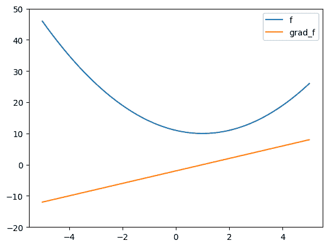
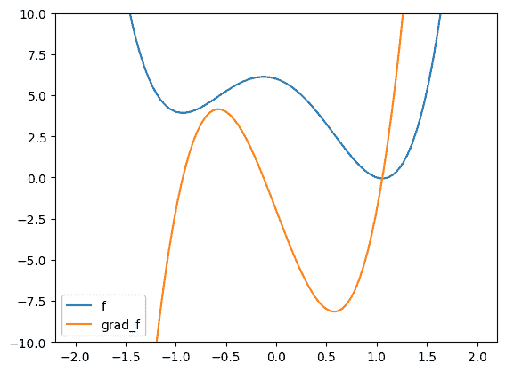
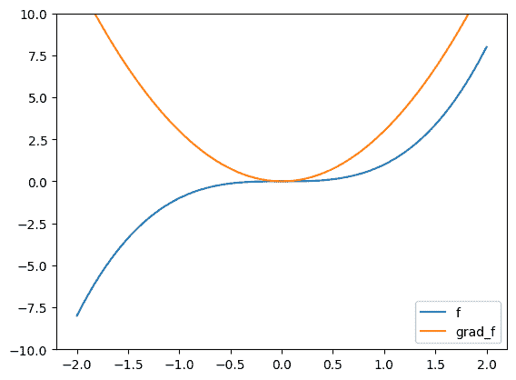

# 3.5\. 梯度下降及其收敛性分析#

> 原文：[`mmids-textbook.github.io/chap03_opt/05_gd/roch-mmids-opt-gd.html`](https://mmids-textbook.github.io/chap03_opt/05_gd/roch-mmids-opt-gd.html)

我们考虑一种自然的方法来解决优化问题的数值问题：一类被称为下降法的算法。

设 \(f : \mathbb{R}^d \to \mathbb{R}\) 是连续可微的。我们限制自己于无约束最小化问题，形式如下

\[ \min_{\mathbf{x} \in \mathbb{R}^d} f(\mathbf{x}). \]

理想情况下，人们希望识别 \(f\) 的全局最小值。一种天真（naive）的方法可能是评估 \(f\) 在大量点 \(\mathbf{x}\) 上的值，比如在一个密集的网格上。然而，即使我们满足于一个近似解，并限制自己只考虑 \(f\) 的定义域的一个有界子集，这种类型的 [穷举搜索](https://en.wikipedia.org/wiki/Brute-force_search) 在高维 \(d\) 的情况下也是浪费时间和不切实际的，因为被查询的点数会随着 \(d\) 的增长而指数级增长。

一种不太天真（naive）的方法可能是找到 \(f\) 的所有驻点，即那些 \(\mathbf{x}\) 使得 \(\nabla f(\mathbf{x}) = \mathbf{0}\)。然后从这些中选一个 \(\mathbf{x}\)，使得 \(f(\mathbf{x})\) 的值最小。这在许多问题中确实有效，例如我们之前遇到的一个例子。

**例（最小二乘法）** 再次考虑最小二乘问题（least squares problem）

\[ \min_{\mathbf{x} \in \mathbb{R}^d} \|A \mathbf{x} - \mathbf{b}\|² \]

其中 \(A \in \mathbb{R}^{n \times d}\) 具有满列秩，\(\mathbf{b} \in \mathbb{R}^n\)。特别是，\(d \leq n\)。在先前的例子中，我们看到了目标函数是一个二次函数

\[ f(\mathbf{x}) = \frac{1}{2} \mathbf{x}^T P \mathbf{x} + \mathbf{q}^T \mathbf{x} + r, \]

其中 \(P = 2 A^T A\) 是对称的，\(\mathbf{q} = - 2 A^T \mathbf{b}\)，且 \(r= \mathbf{b}^T \mathbf{b} = \|\mathbf{b}\|²\)。我们还证明了 \(f\) 是 \(\mu\)-强凸的。因此存在唯一的全局最小值。

通过之前的计算，

\[ \nabla f(\mathbf{x}) = P \mathbf{x} + \mathbf{q} = 2 A^T A \mathbf{x} - 2 A^T \mathbf{b}. \]

所以驻点满足

\[ A^T A \mathbf{x} = A^T \mathbf{b} \]

这可能被你识别为最小二乘问题（least squares problem）的正则方程（normal equations）。\(\lhd\)

不幸的是，识别驻点通常会导致没有显式解的非线性方程组。因此我们采取不同的方法。

## 3.5.1\. 梯度下降#

在梯度下降中，我们试图通过依次跟随 \(f\) 在局部减少的方向来找到 \(f\) 的较小值。正如我们在 *一阶必要最优性条件* 的证明中所看到的，\(- \nabla f\) 提供了这样的方向。实际上，它是在以下意义上的最速下降方向。

回忆一下从**下降方向和方向导数引理**中得知，如果 \(f\) 在 \(\mathbf{x}_0\) 处沿 \(\mathbf{v}\) 方向的方向导数是负的，那么 \(\mathbf{v}\) 是 \(\mathbf{x}_0\) 处的一个下降方向。

**引理** **(最速下降)** \(\idx{steepest descent lemma}\xdi\) 设 \(f : \mathbb{R}^d \to \mathbb{R}\) 在 \(\mathbf{x}_0\) 处是连续可微的。对于 \(\mathbb{R}^d\) 中的任意单位向量 \(\mathbf{v} \in \mathbb{R}^d\)，

\[ \frac{\partial f (\mathbf{x}_0)}{\partial \mathbf{v}} \geq \frac{\partial f (\mathbf{x}_0)}{\partial \mathbf{v}^*} \]

其中

\[ \mathbf{v}^* = - \frac{\nabla f(\mathbf{x}_0)}{\|\nabla f(\mathbf{x}_0)\|}. \]

\(\flat\)

*证明思路:* 这是对**柯西-施瓦茨不等式**的直接应用。

*证明:* 通过**柯西-施瓦茨不等式**，由于 \(\mathbf{v}\) 的范数为单位，

\[\begin{align*} \left|\frac{\partial f (\mathbf{x}_0)}{\partial \mathbf{v}}\right| &= \left|\nabla f(\mathbf{x}_0)^T \mathbf{v}\right|\\ &\leq \|\nabla f(\mathbf{x}_0)\| \|\mathbf{v}\|\\ &= \|\nabla f(\mathbf{x}_0)\|. \end{align*}\]

或者，换一种说法，

\[ - \|\nabla f(\mathbf{x}_0)\| \leq \frac{\partial f (\mathbf{x}_0)}{\partial \mathbf{v}} \leq \|\nabla f(\mathbf{x}_0)\|. \]

另一方面，根据 \(\mathbf{v}^*\) 的选择，

\[\begin{align*} \frac{\partial f (\mathbf{x}_0)}{\partial \mathbf{v}^*} &= \nabla f(\mathbf{x}_0)^T \left(- \frac{\nabla f(\mathbf{x}_0)}{\|\nabla f(\mathbf{x}_0)\|}\right)\\ &= - \left(\frac{\nabla f(\mathbf{x}_0)^T \nabla f(\mathbf{x}_0)}{\|\nabla f(\mathbf{x}_0)\|}\right)\\ &= - \left(\frac{\|\nabla f(\mathbf{x}_0)\|²}{\|\nabla f(\mathbf{x}_0)\|}\right)\\ &= - \|\nabla f(\mathbf{x}_0)\|. \end{align*}\]

最后两个显示的结果合并给出。\(\square\)

在梯度下降的每次迭代中，我们沿着梯度的负方向迈出一步，即，

\[ \mathbf{x}^{t+1} = \mathbf{x}^t - \alpha_t \nabla f(\mathbf{x}^t), \quad t=0,1,2\ldots \]

对于一系列步长 \(\alpha_t > 0\)。选择合适的步长（也称为步长或学习率）本身就是一个很大的主题。在这里，我们只考虑固定步长的情况。

**CHAT & LEARN** 向你最喜欢的 AI 聊天机器人询问梯度下降方法中选择步长不同方法的细节。\(\ddagger\)

通常情况下，我们无法保证在极限情况下能够达到全局最小值，即使它确实存在。我们现在的目标更为谦逊：找到梯度 \(f\) 大致消失的点。

我们在 Python 中实现了梯度下降\(\idx{gradient descent}\xdi\)。我们假设提供了一个函数 `f` 和它的梯度 `grad_f`。我们首先用步长\(\idx{step size}\xdi\) \(\idx{learning rate}\xdi\) \(\alpha =\) `alpha` 编写基本的梯度下降步骤。

```py
def desc_update(grad_f, x, alpha):
    return x - alpha*grad_f(x)

def gd(f, grad_f, x0, alpha=1e-3, niters=int(1e6)):

    xk = x0
    for _ in range(niters):
        xk = desc_update(grad_f, xk, alpha)

    return xk, f(xk) 
```

**数值角:** 我们用一个简单的例子来说明。

```py
def f(x): 
    return (x-1)**2 + 10

def grad_f(x):
    return 2*(x-1)

xgrid = np.linspace(-5,5,100)
plt.plot(xgrid, f(xgrid), label='f')
plt.plot(xgrid, grad_f(xgrid), label='grad_f')
plt.ylim((-20,50)), plt.legend()
plt.show() 
```



```py
gd(f, grad_f, 0) 
```

```py
(0.9999999999999722, 10.0) 
```

在这种情况下，我们找到了一个全局最小值。

下一个例子表明，根据起始点不同，可能达到不同的局部最小值。

```py
def f(x): 
    return 4 * (x-1)**2 * (x+1)**2 - 2*(x-1)

def grad_f(x): 
    return 8 * (x-1) * (x+1)**2 + 8 * (x-1)**2 * (x+1) - 2

xgrid = np.linspace(-2,2,100)
plt.plot(xgrid, f(xgrid), label='f')
plt.plot(xgrid, grad_f(xgrid), label='grad_f')
plt.ylim((-10,10)), plt.legend()
plt.show() 
```



```py
gd(f, grad_f, 0) 
```

```py
(1.057453770738375, -0.0590145651028224) 
```

```py
gd(f, grad_f, -2) 
```

```py
(-0.9304029265558538, 3.933005966859003) 
```

**尝试一下！** 在这个最后一个例子中，改变步长会影响结果吗？ ([在 Colab 中打开](https://colab.research.google.com/github/MMiDS-textbook/MMiDS-textbook.github.io/blob/main/just_the_code/roch_mmids_chap_opt_notebook.ipynb)) \(\ddagger\)

在最后一个例子中，我们最终到达一个不是局部最小值的驻点。这里一阶和二阶导数都是零。这被称为 [鞍点](https://en.wikipedia.org/wiki/Saddle_point)。

```py
def f(x):
    return x**3

def grad_f(x):
    return 3 * x**2

xgrid = np.linspace(-2,2,100)
plt.plot(xgrid, f(xgrid), label='f')
plt.plot(xgrid, grad_f(xgrid), label='grad_f')
plt.ylim((-10,10)), plt.legend()
plt.show() 
```



```py
gd(f, grad_f, 2) 
```

```py
(0.00033327488712690107, 3.701755838398568e-11) 
```

```py
gd(f, grad_f, -2, niters=100) 
```

```py
(-4.93350410883896, -120.0788396909241) 
```

\(\unlhd\)

## 3.5.2\. 收敛性分析#

在本节中，我们证明关于梯度下降的收敛性\(\idx{convergence analysis}\xdi\)的一些结果。我们首先从光滑情况开始。

**光滑情况** 非正式地说，如果一个函数的梯度变化不是太快，那么这个函数是光滑的。我们在这里将使用以下正式定义。我们限制自己到二阶连续可微的情况。

**定义** **（光滑函数）** \(\idx{smooth function}\xdi\) 设 \(f : \mathbb{R}^d \to \mathbb{R}\) 是二阶连续可微的。我们说 \(f\) 是 \(L\)-光滑的，如果

\[ - L I_{d \times d} \preceq H_f(\mathbf{x}) \preceq L I_{d \times d}, \quad \forall \mathbf{x} \in \mathbb{R}^d. \]

\(\natural\)

在单变量情况下，这可以简化为对于所有 \(x \in \mathbb{R}\)，有 \(- L \leq f''(x) \leq L\)。更一般地，回忆一下

\[ A \preceq B \iff \mathbf{z}^T A\mathbf{z} \leq \mathbf{z}^T B\mathbf{z}, \qquad \forall \mathbf{z} \in \mathbb{R}^{d}. \]

因此，上述条件等价于

\[ - L \|\mathbf{z}\|² \leq \mathbf{z}^T H_f(\mathbf{x}) \,\mathbf{z} \leq L \|\mathbf{z}\|², \quad \forall \mathbf{x}, \mathbf{z} \in \mathbb{R}^d. \]

另一种表述方式是，二阶方向导数满足

\[ - L \leq \frac{\partial² f (\mathbf{x})}{\partial \mathbf{v}²} \leq L \]

对于所有 \(\mathbf{x} \in \mathbb{R}^d\) 和所有单位向量 \(\mathbf{v} \in \mathbb{R}^d\).

结合 *泰勒定理*，这立即给出以下结论。

**引理** **（光滑函数的二次界限）** \(\idx{quadratic bound for smooth functions}\xdi\) 设 \(f : \mathbb{R}^d \to \mathbb{R}\) 是二阶连续可微的。那么 \(f\) 是 \(L\)-光滑的，当且仅当对于所有 \(\mathbf{x}, \mathbf{y} \in \mathbb{R}^d\)，它满足

\[ \left|f(\mathbf{y}) - \{f(\mathbf{x}) + \nabla f(\mathbf{x})^T(\mathbf{y} - \mathbf{x})\}\right| \leq \frac{L}{2} \|\mathbf{y} - \mathbf{x}\|². \]

\(\flat\)

*证明思路：* 我们应用 *泰勒定理*，然后对二阶项进行界定。

*证明:* 通过 *泰勒定理*，对于任意 \(\alpha > 0\)，存在 \(\xi_\alpha \in (0,1)\)

\[ f(\mathbf{x} + \alpha \mathbf{p}) = f(\mathbf{x}) + \alpha \nabla f(\mathbf{x})^T \mathbf{p} + \frac{1}{2} \alpha² \mathbf{p}^T \,H_f(\mathbf{x} + \xi_\alpha \alpha \mathbf{p}) \,\mathbf{p} \]

其中 \(\mathbf{p} = \mathbf{y} - \mathbf{x}\).

如果 \(f\) 是 \(L\)-平滑的，那么在 \(\alpha = 1\) 时，通过上述观察

\[ - L \|\mathbf{p}\|² \leq \mathbf{p}^T \,H_f(\mathbf{x} + \xi_1 \mathbf{p}) \,\mathbf{p} \leq L \|\mathbf{p}\|². \]

这意味着陈述中的不等式。

另一方面，如果这个不等式成立，通过结合上述泰勒展开，我们得到

\[ \left|\,\frac{1}{2} \alpha² \mathbf{p}^T \,H_f(\mathbf{x} + \xi_\alpha \alpha \mathbf{p}) \,\mathbf{p}\,\right| \leq \frac{L}{2} \alpha² \|\mathbf{p}\|² \]

其中我们使用了由范数的绝对齐次性得出的 \(\|\alpha \mathbf{p}\| = \alpha \|\mathbf{p}\|\)。除以 \(\alpha²/2\)，然后取 \(\alpha \to 0\) 并使用 Hessian 的连续性给出

\[ \left|\, \mathbf{p}^T \,H_f(\mathbf{x}) \,\mathbf{p} \,\right| \leq L \|\mathbf{p}\|². \]

通过上述观察再次，这意味着 \(f\) 是 \(L\)-平滑的。 \(\square\)

我们接下来将证明，在平滑的情况下，使用适当选择的步长进行最速下降法会产生一个目标值递减（或保持不变）且梯度在极限中消失的点的序列。我们还将给出一个定量的收敛率。请注意，这个结果并不意味着收敛到局部（或全局）最小值。

**定理** **(平滑情况下梯度下降的收敛性)** \(\idx{convergence of gradient descent in the smooth case}\xdi\) 假设 \(f : \mathbb{R}^d \to \mathbb{R}\) 是 \(L\)-平滑且有下界，即存在 \(\bar{f} > - \infty\) 使得 \(f(\mathbf{x}) \geq \bar{f}\)，\(\forall \mathbf{x} \in \mathbb{R}^d\)。那么从任意 \(\mathbf{x}⁰\) 开始的梯度下降法，步长为 \(\alpha_t = \alpha := 1/L\)，将产生一个序列 \(\mathbf{x}^t\)，\(t=1,2,\ldots\)，使得

\[ f(\mathbf{x}^{t+1}) \leq f(\mathbf{x}^t), \quad \forall t \]

并且

\[ \lim_{t \to +\infty} \|\nabla f(\mathbf{x}^t)\| = 0. \]

此外，在 \(S\) 步之后，存在一个 \(t\) 在 \(\{0,\ldots,S\}\) 中，使得

\[ \|\nabla f(\mathbf{x}^t)\| \leq \sqrt{\frac{2 L \left[\,f(\mathbf{x}⁰) - \bar{f}\,\right]}{S}}. \]

\(\sharp\)

假设 \(f\) 的下界是已知的，这似乎有些牵强。但实际上，有许多情况下这是自然的。例如，在最小二乘问题的案例中，目标函数 \(f\) 由定义是非负的，因此我们可以取 \(\bar{f} = 0\)。

关于上述收敛率的另一种表述方式如下。取任意 \(\epsilon > 0\)。如果我们的目标是找到一个点 \(\mathbf{x}\)，使得 \(\|\nabla f(\mathbf{x})\| \leq \epsilon\)，那么如果我们执行 \(S\) 步，就能保证找到这样一个点。

\[ \min_{t = 0,\ldots, S-1} \|\nabla f(\mathbf{x}^t)\| \leq \sqrt{\frac{2 L \left[\,f(\mathbf{x}⁰) - \bar{f}\,\right]}{S}} \leq \epsilon, \]

即，重新排列后，

\[ S \geq \frac{2L [f(\mathbf{x}⁰) - \bar{f}]}{\epsilon²}. \]

证明的核心是以下基本不等式。它还说明了步长的选择。

**引理** **(光滑情况下的下降保证)** \(\idx{descent guarantee in the smooth case}\xdi\) 假设 \(f : \mathbb{R}^d \to \mathbb{R}\) 是 \(L\)-光滑的。对于任何 \(\mathbf{x} \in \mathbb{R}^d\)，

\[ f\left(\mathbf{x} - \frac{1}{L} \nabla f(\mathbf{x})\right) \leq f(\mathbf{x}) - \frac{1}{2 L} \|\nabla f(\mathbf{x})\|². \]

\(\flat\)

*证明思路（光滑情况下的下降保证）：* 直观上，*光滑函数的二次界*表明 \(f\) 在 \(\mathbf{x}\) 的邻域内被一个二次函数很好地近似，其大小取决于光滑参数 \(L\)。选择最小化这种近似的步长可以保证改进。这里采取的方法是所谓的[主元最小化（MM）算法](https://en.wikipedia.org/wiki/MM_algorithm)\(\idx{Majorize-Minimization}\xdi\)的一个特例。

*证明：* *(光滑情况下的下降保证)* 根据 *光滑函数的二次界*，令 \(\mathbf{p} = - \nabla f(\mathbf{x})\)

\[\begin{align*} f(\mathbf{x} + \alpha \mathbf{p}) &\leq f(\mathbf{x}) + \nabla f(\mathbf{x})^T (\alpha \mathbf{p}) + \frac{L}{2} \|\alpha \mathbf{p}\|²\\ &= f(\mathbf{x}) - \alpha \|\nabla f(\mathbf{x})\|² + \alpha² \frac{L}{2} \|\nabla f(\mathbf{x})\|²\\ &= f(\mathbf{x}) + \left( - \alpha + \alpha² \frac{L}{2} \right) \|\nabla f(\mathbf{x})\|². \end{align*}\]

括号中的二次函数是凸函数，并在满足 \(\alpha\) 的驻点处最小化

\[ \frac{\mathrm{d}}{\mathrm{d} \alpha}\left( - \alpha + \alpha² \frac{L}{2} \right) = -1 + \alpha L = 0\. \]

取 \(\alpha = 1/L\)，其中 \(-\alpha + \alpha² \frac{L}{2} = - \frac{1}{2L}\)，并将此代入上述不等式中给出

\[ f\left(\mathbf{x} - \frac{1}{L} \nabla f(\mathbf{x})\right) \leq f(\mathbf{x}) - \frac{1}{2L}\|\nabla f(\mathbf{x})\|², \]

如所声称。 \(\square\)

我们回到定理的证明。

*证明思路（光滑情况下的梯度下降收敛）：* 我们使用望远镜论证将 \(f(\mathbf{x}^S)\) 写成一系列步进增量之和，每个增量都可以由前面的引理进行界定。因为 \(f(\mathbf{x}^S)\) 从下限是有界的，因此可以得出梯度必须在极限中消失的结论。

*证明：* *(光滑情况下的梯度下降收敛)* 根据 *光滑情况下的下降保证*，

\[ f(\mathbf{x}^{t+1}) \leq f(\mathbf{x}^t) - \frac{1}{2 L}\|\nabla f(\mathbf{x}^t)\|² \leq f(\mathbf{x}^t), \quad \forall t. \]

此外，使用望远镜求和，我们得到

\[\begin{align*} f(\mathbf{x}^S) &= f(\mathbf{x}⁰) + \sum_{t=0}^{S-1} [f(\mathbf{x}^{t+1}) - f(\mathbf{x}^t)]\\ &\leq f(\mathbf{x}⁰) - \frac{1}{2 L}\sum_{t=0}^{S-1} \|\nabla f(\mathbf{x}^t)\|²\. \end{align*}\]

通过重新排列并使用 \(f(\mathbf{x}^S) \geq \bar{f}\) 得到

\[ \sum_{t=0}^{S-1} \|\nabla f(\mathbf{x}^t)\|² \leq 2L [f(\mathbf{x}⁰) - \bar{f}]. \]

我们得到一个定量的界

\[\begin{align*} \min_{t=0,\ldots, S-1} \|\nabla f(\mathbf{x}^t)\|² & \leq \frac{1}{S} \sum_{t=0}^{S-1} \|\nabla f(\mathbf{x}^t)\|²\\ &\leq \frac{2L [f(\mathbf{x}⁰) - \bar{f}]}{S} \end{align*}\]

因为最小值必然小于或等于平均值。此外，当 \(S \to +\infty\) 时，根据标准的 [分析](https://math.stackexchange.com/questions/62389/relationships-between-bounded-and-convergent-series) [论证](https://math.stackexchange.com/questions/107961/if-a-series-converges-then-the-sequence-of-terms-converges-to-0)，我们必须有 \(\|\nabla f(\mathbf{x}^S)\|² \to 0\)。这证明了该命题。 \(\square\)

**光滑且强凸的情况** 在更强的假设下，我们可以获得更强的收敛结果。其中一个假设是强凸性，我们在上一节中为二阶连续可微函数定义了它。

我们为光滑、强凸函数证明了一个收敛结果。这次我们展示了更强的事实。我们控制了 \(f\) 的值并获得了更快的收敛速度。如果 \(f\) 是 \(m\)-强凸的并且有一个全局最小值 \(\mathbf{x}^*\)，那么全局最小值是唯一的，并且由 \(\nabla f(\mathbf{x}^*) = \mathbf{0}\) 来描述。强凸性允许我们将函数在点 \(\mathbf{x}\) 的值与该点 \(f\) 的梯度联系起来。这将在以下引理中证明，它是我们收敛结果的关键。

**引理** **(函数及其梯度的关系)** \(\idx{relating a function and its gradient lemma}\xdi\) 设 \(f : \mathbb{R}^d \to \mathbb{R}\) 是二阶连续可微的，\(m\)-强凸，并在 \(\mathbf{x}^*\) 处有全局最小值。那么对于任意的 \(\mathbf{x} \in \mathbb{R}^d\)

\[ f(\mathbf{x}) - f(\mathbf{x}^*) \leq \frac{\|\nabla f(\mathbf{x})\|²}{2 m}. \]

\(\flat\)

*证明:* 根据 *强凸函数的二次界*，

\[\begin{align*} f(\mathbf{x}^*) &\geq f(\mathbf{x}) + \nabla f(\mathbf{x})^T (\mathbf{x}^* - \mathbf{x}) + \frac{m}{2} \|\mathbf{x}^* - \mathbf{x}\|²\\ &= f(\mathbf{x}) + \nabla f(\mathbf{x})^T \mathbf{w} + \frac{1}{2} \mathbf{w}^T (m I_{d \times d}) \,\mathbf{w}\\ &=: r + \mathbf{q}^T \mathbf{w} + \frac{1}{2} \mathbf{w}^T P \,\mathbf{w} \end{align*}\]

其中在第二行我们定义了 \(\mathbf{w} = \mathbf{x}^* - \mathbf{x}\)。右侧是一个关于 \(\mathbf{w}\) 的二次函数（对于固定的 \(\mathbf{x}\)），在第三行我们使用了我们之前的符号 \(P\)，\(\mathbf{q}\) 和 \(r\) 来表示这样的函数。因此，如果我们用全局最小值 \(\mathbf{w}^*\) 替换 \(\mathbf{w}\)，不等式仍然成立。

矩阵 \(P = m I_{d \times d}\) 是正定的。通过之前的例子，我们知道当梯度 \(\frac{1}{2}[P + P^T]\mathbf{w}^* + \mathbf{q} = \mathbf{0}\) 时，最小值被达到，这等价于

\[ \mathbf{w}^* = - (m I_{d \times d})^{-1} \nabla f(\mathbf{x}) = - (m^{-1} I_{d \times d}) \nabla f(\mathbf{x}) = - \frac{1}{m} \nabla f(\mathbf{x}). \]

因此，用 \(\mathbf{w}^*\) 替换 \(\mathbf{w}\)，我们得到不等式

\[\begin{align*} f(\mathbf{x}^*) & \geq f(\mathbf{x}) + \nabla f(\mathbf{x})^T \left\{- \frac{1}{m} \nabla f(\mathbf{x})\right\}\\ & \quad \quad+ \frac{1}{2} \left\{- \frac{1}{m} \nabla f(\mathbf{x})\right\}^T (m I_{d \times d}) \left\{- \frac{1}{m} \nabla f(\mathbf{x})\right\}\\ & = f(\mathbf{x}) - \frac{1}{2m} \|\nabla f(\mathbf{x})\|². \end{align*}\]

重新排列后得到结论。 \(\square\)

我们现在可以陈述我们的收敛结果。

**定理** **(强凸情况下梯度下降的收敛性)** \(\idx{强凸情况下梯度下降的收敛性}\xdi\) 假设 \(f : \mathbb{R}^d \to \mathbb{R}\) 是 \(L\)-光滑和 \(m\)-强凸的，并且全局最小值在 \(\mathbf{x}^*\) 处。那么从任意 \(\mathbf{x}⁰\) 开始的步长为 \(\alpha = 1/L\) 的梯度下降算法会产生一个序列 \(\mathbf{x}^t\)，\(t=1,2,\ldots\)，使得

\[ \lim_{t \to +\infty} f(\mathbf{x}^t) = f(\mathbf{x}^*). \]

此外，经过 \(S\) 次迭代后，我们有

\[ f(\mathbf{x}^S) - f(\mathbf{x}^*) \leq \left(1 - \frac{m}{L}\right)^S [f(\mathbf{x}⁰) - f(\mathbf{x}^*)]. \]

\(\sharp\)

注意到 \(f(\mathbf{x}^S) - f(\mathbf{x}^*)\) 在 \(S\) 上以指数速度下降。可以证明 \(\|\mathbf{x}^S - \mathbf{x}^*\|\) 的一个相关界限。

换句话说，固定任意 \(\epsilon > 0\)。如果我们的目标是找到一个点 \(\mathbf{x}\)，使得 \(f(\mathbf{x}) - f(\mathbf{x}^*) \leq \epsilon\)，那么如果我们执行 \(S\) 次迭代，我们就能保证找到这样一个点

\[ f(\mathbf{x}^S) - f(\mathbf{x}^*) \leq \left(1 - \frac{m}{L}\right)^S [f(\mathbf{x}⁰) - f(\mathbf{x}^*)] \leq \epsilon \]

即，重新排列后，

\[ S \geq \frac{\log \epsilon^{-1} + \log(f(\mathbf{x}⁰) - \bar{f})}{\log \left(1 - \frac{m}{L}\right)^{-1}}. \]

*证明思路（强凸情况下梯度下降的收敛性）:* 我们将应用 *光滑函数的下降保证* 以及上述引理。

*证明:* *(强凸情况下梯度下降的收敛性)* 通过 *光滑函数的下降保证* 以及上述引理，对于所有 \(t\)，我们有

\[ f(\mathbf{x}^{t+1}) \leq f(\mathbf{x}^t) - \frac{1}{2L} \|\nabla f(\mathbf{x}^t)\|² \leq f(\mathbf{x}^t) - \frac{m}{L} [f(\mathbf{x}^t) - f(\mathbf{x}^*)]. \]

两边减去 \(f(\mathbf{x}^*)\) 得到

\[ f(\mathbf{x}^{t+1}) - f(\mathbf{x}^*) \leq \left(1 - \frac{m}{L}\right)[f(\mathbf{x}^t) - f(\mathbf{x}^*)]. \]

递归这个过程

\[ \leq \left(1 - \frac{m}{L}\right)²[f(\mathbf{x}^{t-1}) - f(\mathbf{x}^*)], \]

等等。这给出了结论。 \(\square\)

**数值角:** 我们重新审视我们的第一个简单的单变量例子。

```py
def f(x): 
    return (x-1)**2 + 10

def grad_f(x):
    return 2*(x-1) 
```

二阶导数是 \(f''(x) = 2\)。因此，这个 \(f\) 是 \(L\)-平滑和 \(m\)-强凸的，\(L = m = 2\)。我们发展的理论建议取步长 \(\alpha_t = \alpha = 1/L = 1/2\)。这也意味着

\[ f(x¹) - f(x^*) \leq \left(1 - \frac{m}{L}\right) [f(x⁰) - f(x^*)] = 0. \]

我们一步就收敛了！这对于任何起始点 \(x⁰\) 都成立。

让我们试试这个！

```py
gd(f, grad_f, 0, alpha=0.5, niters=1) 
```

```py
(1.0, 10.0) 
```

让我们尝试一个不同的起始点。

```py
gd(f, grad_f, 100, alpha=0.5, niters=1) 
```

```py
(1.0, 10.0) 
```

\(\unlhd\)

***自我评估测验*** *(由 Claude, Gemini 和 ChatGPT 协助)*

**1** 在梯度下降更新规则 \(\mathbf{x}^{t+1} = \mathbf{x}^t - \alpha_t \nabla f(\mathbf{x}^t)\) 中，\(\alpha_t\) 代表什么？

a) 在 \(\mathbf{x}^t\) 处 \(f\) 的梯度

b) 步长或学习率

c) 最速上升方向

d) 在 \(\mathbf{x}^t\) 处 \(f\) 的 Hessian 矩阵

**2** 如果一个函数 \(f : \mathbb{R}^d \to \mathbb{R}\) 是 \(L\)-平滑的，那么：

a) 对于所有 \(\mathbf{x} \in \mathbb{R}^d\)，有 \(\|\nabla f(\mathbf{x})\| \leq L\)

b) \( -LI_{d\times d} \preceq \mathbf{H}_f(\mathbf{x}) \preceq LI_{d\times d} \) 对于所有 \(\mathbf{x} \in \mathbb{R}^d\)

c) \(f(\mathbf{y}) \leq f(\mathbf{x}) + \nabla f(\mathbf{x})^T(\mathbf{y} - \mathbf{x}) + \frac{L}{2}\|\mathbf{y} - \mathbf{x}\|²\) 对于所有 \(\mathbf{x}, \mathbf{y} \in \mathbb{R}^d\)

d) b) 和 c) 都对

**3** 假设 \(f : \mathbb{R}^d \to \mathbb{R}\) 是 \(L\)-平滑且有下界。根据 *平滑情况下的梯度下降收敛定理*，以步长 \(\alpha_t = 1/L\) 从任意 \(\mathbf{x}⁰\) 开始的梯度下降产生一个序列 \(\{\mathbf{x}^t\}\)，使得

a) \(\lim_{t \to +\infty} f(\mathbf{x}^t) = 0\)

b) \(\lim_{t \to +\infty} \|\nabla f(\mathbf{x}^t)\| = 0\)

c) 在 \(S\) 步之后 \(\min_{t=0,\ldots,S-1} \|\nabla f(\mathbf{x}^t)\| \leq \sqrt{\frac{2L[f(\mathbf{x}⁰) - \bar{f}]}{S}}\)

d) b) 和 c) 都对

**4** 假设 \(f : \mathbb{R}^d \to \mathbb{R}\) 是 \(L\)-平滑和 \(m\)-强凸的，并且全局最小值在 \(\mathbf{x}^*\)。根据 *强凸情况下的梯度下降收敛定理*，以步长 \(\alpha = 1/L\) 从任意 \(\mathbf{x}⁰\) 开始的梯度下降产生一个序列 \(\{\mathbf{x}^t\}\)，在 \(S\) 步之后：

a) \(f(\mathbf{x}^S) - f(\mathbf{x}^*) \leq (1 - \frac{m}{L})^S[f(\mathbf{x}⁰) - f(\mathbf{x}^*)]\)

b) \(f(\mathbf{x}^S) - f(\mathbf{x}^*) \geq (1 - \frac{m}{L})^S[f(\mathbf{x}⁰) - f(\mathbf{x}^*)]\)

c) \(f(\mathbf{x}^S) - f(\mathbf{x}^*) \leq (1 + \frac{m}{L})^S[f(\mathbf{x}⁰) - f(\mathbf{x}^*)]\)

d) \(f(\mathbf{x}^S) - f(\mathbf{x}^*) \geq (1 + \frac{m}{L})^S[f(\mathbf{x}⁰) - f(\mathbf{x}^*)]\)

**5** 如果一个函数 \(f\) 是 \(m\)-强凸的，我们可以对其全局最小值说些什么？

a) 它可能不存在。

b) 它存在且是唯一的。

c) 它存在，但不一定是唯一的。

d) 它总是在原点发生。

1 的答案：b. 证明：文本中提到“在梯度下降的每次迭代中，我们沿着梯度的负方向迈出一步，即 \(\mathbf{x}^{t+1} = \mathbf{x}^t - \alpha_t \nabla f(\mathbf{x}^t), t = 0, 1, 2, \ldots\) 对于一系列步长 \(\alpha_t > 0\)。”

2 的答案：d. 证明：文本提供了关于 Hessian 矩阵的定义（选项 b）以及关于二次界限的等价描述（选项 c）。

3 的答案：d. 证明：定理既说明了梯度趋于零的渐近收敛（选项 b），也说明了 \(S\) 次迭代后最小梯度范数的定量界限（选项 c）。

4 的答案：a. 证明：这是定理中提到的收敛速度。

5 的答案：b. 证明：文本中提到，如果 \(f\) 是 \(m\)-强凸的，那么“全局最小值是唯一的。”

## 3.5.1\. 梯度下降#

在梯度下降中，我们试图通过依次跟随 \(f\) 局部减少的方向来找到 \(f\) 的较小值。正如我们在**一阶必要最优性条件**的证明中所看到的，\(- \nabla f\) 提供了这样的方向。实际上，它是在以下意义上的最速下降方向。

回忆一下从**下降方向和方向导数引理**中，\(\mathbf{v}\) 是 \(\mathbf{x}_0\) 处的下降方向，如果 \(f\) 在 \(\mathbf{x}_0\) 处沿 \(\mathbf{v}\) 方向的方向导数是负的。

**引理** **(最速下降)** \(\idx{steepest descent lemma}\xdi\) 设 \(f : \mathbb{R}^d \to \mathbb{R}\) 在 \(\mathbf{x}_0\) 处是连续可微的。对于任何单位向量 \(\mathbf{v} \in \mathbb{R}^d\)，

\[ \frac{\partial f (\mathbf{x}_0)}{\partial \mathbf{v}} \geq \frac{\partial f (\mathbf{x}_0)}{\partial \mathbf{v}^*} \]

在哪里

\[ \mathbf{v}^* = - \frac{\nabla f(\mathbf{x}_0)}{\|\nabla f(\mathbf{x}_0)\|}. \]

\(\flat\)

*证明思路:* 这是对**柯西-施瓦茨不等式**的直接应用。

*证明:* 通过**柯西-施瓦茨不等式**，由于 \(\mathbf{v}\) 的范数为单位，

\[\begin{align*} \left|\frac{\partial f (\mathbf{x}_0)}{\partial \mathbf{v}}\right| &= \left|\nabla f(\mathbf{x}_0)^T \mathbf{v}\right|\\ &\leq \|\nabla f(\mathbf{x}_0)\| \|\mathbf{v}\|\\ &= \|\nabla f(\mathbf{x}_0)\|. \end{align*}\]

或者，换一种说法，

\[ - \|\nabla f(\mathbf{x}_0)\| \leq \frac{\partial f (\mathbf{x}_0)}{\partial \mathbf{v}} \leq \|\nabla f(\mathbf{x}_0)\|. \]

另一方面，根据 \(\mathbf{v}^*\) 的选择，

\[\begin{align*} \frac{\partial f (\mathbf{x}_0)}{\partial \mathbf{v}^*} &= \nabla f(\mathbf{x}_0)^T \left(- \frac{\nabla f(\mathbf{x}_0)}{\|\nabla f(\mathbf{x}_0)\|}\right)\\ &= - \left(\frac{\nabla f(\mathbf{x}_0)^T \nabla f(\mathbf{x}_0)}{\|\nabla f(\mathbf{x}_0)\|}\right)\\ &= - \left(\frac{\|\nabla f(\mathbf{x}_0)\|²}{\|\nabla f(\mathbf{x}_0)\|}\right)\\ &= - \|\nabla f(\mathbf{x}_0)\|. \end{align*}\]

最后两个显示结合给出了结果。\(\square\)

在梯度下降的每次迭代中，我们沿着梯度的负方向迈出一步，即，

\[ \mathbf{x}^{t+1} = \mathbf{x}^t - \alpha_t \nabla f(\mathbf{x}^t), \quad t=0,1,2\ldots \]

对于一系列步长\(\alpha_t > 0\)。选择合适的步长（也称为步长或学习率）本身就是一个很大的主题。在这里，我们只考虑固定步长的情况。

**CHAT & LEARN** 向你喜欢的 AI 聊天机器人询问梯度下降法中选择步长不同方法的细节。\(\ddagger\)

通常情况下，我们无法保证在极限情况下达到全局最小值，即使存在这样的最小值。我们现在的目标是更谦虚的：找到一个梯度大约为零的点。

我们在 Python 中实现了梯度下降\(\idx{梯度下降}\xdi\)。我们假设提供了一个函数`f`及其梯度`grad_f`。我们首先用步长\(\idx{步长}\xdi\) \(\idx{学习率}\xdi\) \(\alpha =\) `alpha`编写基本的梯度下降步骤。

```py
def desc_update(grad_f, x, alpha):
    return x - alpha*grad_f(x)

def gd(f, grad_f, x0, alpha=1e-3, niters=int(1e6)):

    xk = x0
    for _ in range(niters):
        xk = desc_update(grad_f, xk, alpha)

    return xk, f(xk) 
```

**数值角落:** 我们用一个简单的例子来说明。

```py
def f(x): 
    return (x-1)**2 + 10

def grad_f(x):
    return 2*(x-1)

xgrid = np.linspace(-5,5,100)
plt.plot(xgrid, f(xgrid), label='f')
plt.plot(xgrid, grad_f(xgrid), label='grad_f')
plt.ylim((-20,50)), plt.legend()
plt.show() 
```


```py
gd(f, grad_f, 0) 
```

```py
(0.9999999999999722, 10.0) 
```

在这种情况下，我们找到了全局最小值。

下一个例子表明，根据起始点，可能达到不同的局部最小值。

```py
def f(x): 
    return 4 * (x-1)**2 * (x+1)**2 - 2*(x-1)

def grad_f(x): 
    return 8 * (x-1) * (x+1)**2 + 8 * (x-1)**2 * (x+1) - 2

xgrid = np.linspace(-2,2,100)
plt.plot(xgrid, f(xgrid), label='f')
plt.plot(xgrid, grad_f(xgrid), label='grad_f')
plt.ylim((-10,10)), plt.legend()
plt.show() 
```


```py
gd(f, grad_f, 0) 
```

```py
(1.057453770738375, -0.0590145651028224) 
```

```py
gd(f, grad_f, -2) 
```

```py
(-0.9304029265558538, 3.933005966859003) 
```

**TRY IT!** 在这个最后的例子中，改变步长是否会影响结果？（[在 Colab 中打开](https://colab.research.google.com/github/MMiDS-textbook/MMiDS-textbook.github.io/blob/main/just_the_code/roch_mmids_chap_opt_notebook.ipynb)) \(\ddagger\)

在最后的例子中，我们最终到达一个不是局部最小值点的平衡点。在这里，一阶和二阶导数都为零。这被称为[saddle point](https://en.wikipedia.org/wiki/Saddle_point)。

```py
def f(x):
    return x**3

def grad_f(x):
    return 3 * x**2

xgrid = np.linspace(-2,2,100)
plt.plot(xgrid, f(xgrid), label='f')
plt.plot(xgrid, grad_f(xgrid), label='grad_f')
plt.ylim((-10,10)), plt.legend()
plt.show() 
```


```py
gd(f, grad_f, 2) 
```

```py
(0.00033327488712690107, 3.701755838398568e-11) 
```

```py
gd(f, grad_f, -2, niters=100) 
```

```py
(-4.93350410883896, -120.0788396909241) 
```

\(\unlhd\)

## 3.5.2\. 收敛性分析#

在本节中，我们证明了一些关于梯度下降\(\idx{收敛性分析}\xdi\)的结论。我们首先从光滑情况开始。

**光滑情况** 非正式地说，如果一个函数的梯度变化不是太快，那么这个函数是光滑的。我们在这里将使用正式的定义。我们限制自己到二阶连续可微的情况。

**定义** **（光滑函数）** \(\idx{smooth function}\xdi\) 设 \(f : \mathbb{R}^d \to \mathbb{R}\) 是二阶连续可微的。我们说 \(f\) 是 \(L\)-光滑的，如果

\[ - L I_{d \times d} \preceq H_f(\mathbf{x}) \preceq L I_{d \times d}, \quad \forall \mathbf{x} \in \mathbb{R}^d. \]

\(\natural\)

在单变量情况下，这简化为对于所有 \(x \in \mathbb{R}\)，有 \(- L \leq f''(x) \leq L\)。更一般地，回忆一下

\[ A \preceq B \iff \mathbf{z}^T A\mathbf{z} \leq \mathbf{z}^T B\mathbf{z}, \qquad \forall \mathbf{z} \in \mathbb{R}^{d}. \]

因此，上述条件等价于

\[ - L \|\mathbf{z}\|² \leq \mathbf{z}^T H_f(\mathbf{x}) \,\mathbf{z} \leq L \|\mathbf{z}\|², \quad \forall \mathbf{x}, \mathbf{z} \in \mathbb{R}^d. \]

另一种表述方式是，二阶方向导数满足

\[ - L \leq \frac{\partial² f (\mathbf{x})}{\partial \mathbf{v}²} \leq L \]

对于所有 \(\mathbf{x} \in \mathbb{R}^d\) 和所有单位向量 \(\mathbf{v} \in \mathbb{R}^d\)。

结合 **泰勒定理**，这立即给出以下结论。

**引理** **（光滑函数的二次界定）** \(\idx{quadratic bound for smooth functions}\xdi\) 设 \(f : \mathbb{R}^d \to \mathbb{R}\) 是二阶连续可微的。那么 \(f\) 是 \(L\)-光滑的，当且仅当对于所有 \(\mathbf{x}, \mathbf{y} \in \mathbb{R}^d\)，它满足

\[ \left|f(\mathbf{y}) - \{f(\mathbf{x}) + \nabla f(\mathbf{x})^T(\mathbf{y} - \mathbf{x})\}\right| \leq \frac{L}{2} \|\mathbf{y} - \mathbf{x}\|². \]

\(\flat\)

**证明思路**：我们应用 **泰勒定理**，然后对二阶项进行界定。

**证明**：通过 **泰勒定理**，对于任何 \(\alpha > 0\)，存在 \(\xi_\alpha \in (0,1)\)

\[ f(\mathbf{x} + \alpha \mathbf{p}) = f(\mathbf{x}) + \alpha \nabla f(\mathbf{x})^T \mathbf{p} + \frac{1}{2} \alpha² \mathbf{p}^T \,H_f(\mathbf{x} + \xi_\alpha \alpha \mathbf{p}) \,\mathbf{p} \]

其中 \(\mathbf{p} = \mathbf{y} - \mathbf{x}\)。

如果 \(f\) 是 \(L\)-光滑的，那么在 \(\alpha = 1\) 时，根据上述观察

\[ - L \|\mathbf{p}\|² \leq \mathbf{p}^T \,H_f(\mathbf{x} + \xi_1 \mathbf{p}) \,\mathbf{p} \leq L \|\mathbf{p}\|². \]

这意味着陈述中的不等式。

另一方面，如果该不等式成立，通过结合上述泰勒展开，我们得到

\[ \left|\,\frac{1}{2} \alpha² \mathbf{p}^T \,H_f(\mathbf{x} + \xi_\alpha \alpha \mathbf{p}) \,\mathbf{p}\,\right| \leq \frac{L}{2} \alpha² \|\mathbf{p}\|² \]

其中我们使用了范数的绝对齐次性，即 \(\|\alpha \mathbf{p}\| = \alpha \|\mathbf{p}\|\)。除以 \(\alpha²/2\)，然后取 \(\alpha \to 0\) 并利用 Hessian 的连续性给出

\[ \left|\, \mathbf{p}^T \,H_f(\mathbf{x}) \,\mathbf{p} \,\right| \leq L \|\mathbf{p}\|². \]

根据上述观察，这意味着 \(f\) 是 \(L\)-光滑。 \(\square\)

我们接下来证明，在光滑的情况下，使用适当选择的步长进行最速下降法会产生一个目标值递减（或保持不变）且梯度在极限下消失的点序列。我们还给出了一个定量的收敛速度。请注意，这个结果并不意味着收敛到局部（或全局）最小值。

**定理** **(光滑情况下梯度下降的收敛性)** \(\idx{光滑情况下梯度下降的收敛性}\xdi\) 假设 \(f : \mathbb{R}^d \to \mathbb{R}\) 是 \(L\)-光滑且有下界，即存在 \(\bar{f} > - \infty\) 使得 \(f(\mathbf{x}) \geq \bar{f}\)，对所有 \(\mathbf{x} \in \mathbb{R}^d\) 成立。那么从任意 \(\mathbf{x}⁰\) 开始的步长为 \(\alpha_t = \alpha := 1/L\) 的梯度下降法会产生一个序列 \(\mathbf{x}^t\)，\(t=1,2,\ldots\)，使得

\[ f(\mathbf{x}^{t+1}) \leq f(\mathbf{x}^t), \quad \forall t \]

and

\[ \lim_{t \to +\infty} \|\nabla f(\mathbf{x}^t)\| = 0. \]

此外，经过 \(S\) 步后，存在一个 \(t\) 在 \(\{0,\ldots,S\}\) 中，使得

\[ \|\nabla f(\mathbf{x}^t)\| \leq \sqrt{\frac{2 L \left[\,f(\mathbf{x}⁰) - \bar{f}\,\right]}{S}}. \]

\(\sharp\)

假设已知 \(f\) 的下界可能看起来有些牵强。但实际上，有许多情况下这是自然的。例如，在最小二乘问题的案例中，目标函数 \(f\) 由定义是非负的，因此我们可以取 \(\bar{f} = 0\)。

关于收敛速度的上述断言的另一种表述方式如下。取任意 \(\epsilon > 0\)。如果我们的目标是找到一个点 \(\mathbf{x}\) 使得 \(\|\nabla f(\mathbf{x})\| \leq \epsilon\)，那么如果我们执行 \(S\) 步，我们就能保证找到这样一个点，

\[ \min_{t = 0,\ldots, S-1} \|\nabla f(\mathbf{x}^t)\| \leq \sqrt{\frac{2 L \left[\,f(\mathbf{x}⁰) - \bar{f}\,\right]}{S}} \leq \epsilon, \]

即，经过重新排列后，

\[ S \geq \frac{2L [f(\mathbf{x}⁰) - \bar{f}]}{\epsilon²}. \]

证明的核心是以下基本不等式。它也说明了步长的选择。

**引理** **(光滑情况下的下降保证)** \(\idx{光滑情况下的下降保证}\xdi\) 假设 \(f : \mathbb{R}^d \to \mathbb{R}\) 是 \(L\)-光滑。对于任意 \(\mathbf{x} \in \mathbb{R}^d\)，

\[ f\left(\mathbf{x} - \frac{1}{L} \nabla f(\mathbf{x})\right) \leq f(\mathbf{x}) - \frac{1}{2 L} \|\nabla f(\mathbf{x})\|². \]

\(\flat\)

*证明思路（光滑情况下的下降保证）:* 直观上，*光滑函数的二次界限*表明，\(f\) 在 \(\mathbf{x}\) 的邻域内被一个二次函数很好地逼近，其大小取决于光滑性参数 \(L\)。选择一个最小化这种逼近的步长会导致保证的改进。这里采取的方法是所谓的 [主元最小化 (MM)](https://en.wikipedia.org/wiki/MM_algorithm)\(\idx{Majorize-Minimization}\xdi\) 的一个特例。

*证明:* *(光滑情况下的下降保证)* 根据 *光滑函数的二次界限*，令 \(\mathbf{p} = - \nabla f(\mathbf{x})\)

\[\begin{align*} f(\mathbf{x} + \alpha \mathbf{p}) &\leq f(\mathbf{x}) + \nabla f(\mathbf{x})^T (\alpha \mathbf{p}) + \frac{L}{2} \|\alpha \mathbf{p}\|²\\ &= f(\mathbf{x}) - \alpha \|\nabla f(\mathbf{x})\|² + \alpha² \frac{L}{2} \|\nabla f(\mathbf{x})\|²\\ &= f(\mathbf{x}) + \left( - \alpha + \alpha² \frac{L}{2} \right) \|\nabla f(\mathbf{x})\|². \end{align*}\]

括号中的二次函数是凸函数，并在满足

\[ \frac{\mathrm{d}}{\mathrm{d} \alpha}\left( - \alpha + \alpha² \frac{L}{2} \right) = -1 + \alpha L = 0\. \]

取 \(\alpha = 1/L\)，其中 \(-\alpha + \alpha² \frac{L}{2} = - \frac{1}{2L}\)，并将此代入上述不等式中给出

\[ f\left(\mathbf{x} - \frac{1}{L} \nabla f(\mathbf{x})\right) \leq f(\mathbf{x}) - \frac{1}{2L}\|\nabla f(\mathbf{x})\|², \]

如所声称。 \(\square\)

我们回到定理的证明。

*证明思路（光滑情况下的梯度下降收敛）:* 我们使用望远镜论证将 \(f(\mathbf{x}^S)\) 写成一系列步进增量之和，每个增量都可以由前面的引理进行界定。因为 \(f(\mathbf{x}^S)\) 从下限有界，因此可以得出结论，梯度在极限中必须消失。

*证明:* *(光滑情况下的梯度下降收敛)* 根据 *光滑情况下的下降保证*，

\[ f(\mathbf{x}^{t+1}) \leq f(\mathbf{x}^t) - \frac{1}{2 L}\|\nabla f(\mathbf{x}^t)\|² \leq f(\mathbf{x}^t), \quad \forall t. \]

此外，使用望远镜求和，我们得到

\[\begin{align*} f(\mathbf{x}^S) &= f(\mathbf{x}⁰) + \sum_{t=0}^{S-1} [f(\mathbf{x}^{t+1}) - f(\mathbf{x}^t)]\\ &\leq f(\mathbf{x}⁰) - \frac{1}{2 L}\sum_{t=0}^{S-1} \|\nabla f(\mathbf{x}^t)\|²\. \end{align*}\]

重新排列并使用 \(f(\mathbf{x}^S) \geq \bar{f}\) 导致

\[ \sum_{t=0}^{S-1} \|\nabla f(\mathbf{x}^t)\|² \leq 2L [f(\mathbf{x}⁰) - \bar{f}]. \]

我们得到定量界限

\[\begin{align*} \min_{t=0,\ldots, S-1} \|\nabla f(\mathbf{x}^t)\|² & \leq \frac{1}{S} \sum_{t=0}^{S-1} \|\nabla f(\mathbf{x}^t)\|²\\ &\leq \frac{2L [f(\mathbf{x}⁰) - \bar{f}]}{S} \end{align*}\]

因为最小值必然小于或等于平均值。此外，当 \(S \to +\infty\) 时，根据标准的 [分析](https://math.stackexchange.com/questions/62389/relationships-between-bounded-and-convergent-series) [论证](https://math.stackexchange.com/questions/107961/if-a-series-converges-then-the-sequence-of-terms-converges-to-0)，我们必须有 \(\|\nabla f(\mathbf{x}^S)\|² \to 0\)。这证明了该命题。 \(\square\)

**平滑且强凸情况** 在更强的假设下，我们获得了更强的收敛结果。其中一个假设是强凸性，我们在上一节中为二阶连续可微函数定义了它。

我们为平滑、强凸函数证明了收敛结果。这次我们展示了更强的一点。我们控制了 \(f\) 的值并获得了更快的收敛速度。如果 \(f\) 是 \(m\)-强凸的并且有一个全局最小值 \(\mathbf{x}^*\)，那么全局最小值是唯一的，并且由 \(\nabla f(\mathbf{x}^*) = \mathbf{0}\) 来描述。强凸性允许我们将函数在点 \(\mathbf{x}\) 的值与该点 \(f\) 的梯度联系起来。这将在以下引理中证明，它是我们收敛结果的关键。

**引理** **(函数及其梯度的关系)** \(\idx{relating a function and its gradient lemma}\xdi\) 设 \(f : \mathbb{R}^d \to \mathbb{R}\) 是二阶连续可微的，\(m\)-强凸，并在 \(\mathbf{x}^*\) 处有全局最小值。那么对于任何 \(\mathbf{x} \in \mathbb{R}^d\)

\[ f(\mathbf{x}) - f(\mathbf{x}^*) \leq \frac{\|\nabla f(\mathbf{x})\|²}{2 m}. \]

\(\flat\)

*证明:* 通过 *强凸函数的二次界*，

\[\begin{align*} f(\mathbf{x}^*) &\geq f(\mathbf{x}) + \nabla f(\mathbf{x})^T (\mathbf{x}^* - \mathbf{x}) + \frac{m}{2} \|\mathbf{x}^* - \mathbf{x}\|²\\ &= f(\mathbf{x}) + \nabla f(\mathbf{x})^T \mathbf{w} + \frac{1}{2} \mathbf{w}^T (m I_{d \times d}) \,\mathbf{w}\\ &=: r + \mathbf{q}^T \mathbf{w} + \frac{1}{2} \mathbf{w}^T P \,\mathbf{w} \end{align*}\]

在第二行中，我们定义了 \(\mathbf{w} = \mathbf{x}^* - \mathbf{x}\)。右侧是 \(\mathbf{w}\) 的二次函数（对于固定的 \(\mathbf{x}\)），在第三行中，我们使用了我们之前为这种函数定义的 \(P\)、\(\mathbf{q}\) 和 \(r\)。因此，如果我们用那个二次函数的全局最小值 \(\mathbf{w}^*\) 替换 \(\mathbf{w}\)，不等式仍然成立。

矩阵 \(P = m I_{d \times d}\) 是正定的。通过之前的例子，我们知道当梯度 \(\frac{1}{2}[P + P^T]\mathbf{w}^* + \mathbf{q} = \mathbf{0}\) 时，最小值被实现，这等价于

\[ \mathbf{w}^* = - (m I_{d \times d})^{-1} \nabla f(\mathbf{x}) = - (m^{-1} I_{d \times d}) \nabla f(\mathbf{x}) = - \frac{1}{m} \nabla f(\mathbf{x}). \]

因此，用 \(\mathbf{w}^*\) 替换 \(\mathbf{w}\)，我们得到不等式

\[\begin{align*} f(\mathbf{x}^*) & \geq f(\mathbf{x}) + \nabla f(\mathbf{x})^T \left\{- \frac{1}{m} \nabla f(\mathbf{x})\right\}\\ & \quad \quad+ \frac{1}{2} \left\{- \frac{1}{m} \nabla f(\mathbf{x})\right\}^T (m I_{d \times d}) \left\{- \frac{1}{m} \nabla f(\mathbf{x})\right\}\\ & = f(\mathbf{x}) - \frac{1}{2m} \|\nabla f(\mathbf{x})\|². \end{align*}\]

重新排列后给出结论。 \(\square\)

我们现在可以陈述我们的收敛结果。

**定理** **(强凸情况下梯度下降的收敛性)** \(\idx{梯度下降在强凸情况下的收敛性}\xdi\) 假设 \(f : \mathbb{R}^d \to \mathbb{R}\) 是 \(L\)-光滑和 \(m\)-强凸的，并且全局最小值在 \(\mathbf{x}^*\) 处。那么从任意 \(\mathbf{x}⁰\) 开始的步长为 \(\alpha = 1/L\) 的梯度下降会产生一个序列 \(\mathbf{x}^t\)，\(t=1,2,\ldots\)，使得

\[ \lim_{t \to +\infty} f(\mathbf{x}^t) = f(\mathbf{x}^*). \]

此外，经过 \(S\) 步后，我们有

\[ f(\mathbf{x}^S) - f(\mathbf{x}^*) \leq \left(1 - \frac{m}{L}\right)^S [f(\mathbf{x}⁰) - f(\mathbf{x}^*)]. \]

\(\sharp\)

注意到 \(f(\mathbf{x}^S) - f(\mathbf{x}^*)\) 在 \(S\) 中以指数速度下降。对于 \(\|\mathbf{x}^S - \mathbf{x}^*\|\) 也可以证明一个相关的界限。

换句话说，固定任意 \(\epsilon > 0\)。如果我们的目标是找到一个点 \(\mathbf{x}\)，使得 \(f(\mathbf{x}) - f(\mathbf{x}^*) \leq \epsilon\)，那么如果我们执行 \(S\) 步，我们就能保证找到这样一个点，

\[ f(\mathbf{x}^S) - f(\mathbf{x}^*) \leq \left(1 - \frac{m}{L}\right)^S [f(\mathbf{x}⁰) - f(\mathbf{x}^*)] \leq \epsilon \]

即，重新排列后，

\[ S \geq \frac{\log \epsilon^{-1} + \log(f(\mathbf{x}⁰) - \bar{f})}{\log \left(1 - \frac{m}{L}\right)^{-1}}. \]

*证明思路（强凸情况下梯度下降的收敛性）：* 我们应用平滑函数的下降保证和上述引理。

*证明：* *(强凸情况下梯度下降的收敛性)* 通过结合平滑函数的下降保证和上述引理，对于所有的 \(t\)，我们有

\[ f(\mathbf{x}^{t+1}) \leq f(\mathbf{x}^t) - \frac{1}{2L} \|\nabla f(\mathbf{x}^t)\|² \leq f(\mathbf{x}^t) - \frac{m}{L} [f(\mathbf{x}^t) - f(\mathbf{x}^*)]. \]

两边减去 \(f(\mathbf{x}^*)\) 得到

\[ f(\mathbf{x}^{t+1}) - f(\mathbf{x}^*) \leq \left(1 - \frac{m}{L}\right)[f(\mathbf{x}^t) - f(\mathbf{x}^*)]. \]

递归这个不等式，

\[ \leq \left(1 - \frac{m}{L}\right)²[f(\mathbf{x}^{t-1}) - f(\mathbf{x}^*)], \]

以此类推。这证明了我们的结论。 \(\square\)

**数值角落：** 我们重新审视我们的第一个简单的单变量例子。

```py
def f(x): 
    return (x-1)**2 + 10

def grad_f(x):
    return 2*(x-1) 
```

二阶导数是 \(f''(x) = 2\)。因此，这个 \(f\) 是 \(L\)-光滑和 \(m\)-强凸的，其中 \(L = m = 2\)。我们发展的理论建议取步长 \(\alpha_t = \alpha = 1/L = 1/2\)。这也意味着

\[ f(x¹) - f(x^*) \leq \left(1 - \frac{m}{L}\right) [f(x⁰) - f(x^*)] = 0. \]

我们一步就收敛了！这对于任何起始点 \(x⁰\) 都成立。

让我们试试这个！

```py
gd(f, grad_f, 0, alpha=0.5, niters=1) 
```

```py
(1.0, 10.0) 
```

让我们尝试一个不同的起始点。

```py
gd(f, grad_f, 100, alpha=0.5, niters=1) 
```

```py
(1.0, 10.0) 
```

\(\unlhd\)

***自我评估测验*** *(由 Claude、Gemini 和 ChatGPT 协助)*

**1** 在梯度下降更新规则 \(\mathbf{x}^{t+1} = \mathbf{x}^t - \alpha_t \nabla f(\mathbf{x}^t)\) 中，\(\alpha_t\) 代表什么？

a) \(f\) 在 \(\mathbf{x}^t\) 处的梯度

b) 步长或学习率

c) 最速上升方向

d) \(f\) 在 \(\mathbf{x}^t\) 处的 Hessian 矩阵

**2** 如果一个函数 \(f : \mathbb{R}^d \to \mathbb{R}\) 是 \(L\)-光滑的，那么它满足以下哪个条件？

a) 对于所有 \(\mathbf{x} \in \mathbb{R}^d\)，有 \(\|\nabla f(\mathbf{x})\| \leq L\)

b) 对于所有 \(\mathbf{x} \in \mathbb{R}^d\)，有 \(-LI_{d\times d} \preceq \mathbf{H}_f(\mathbf{x}) \preceq LI_{d\times d}\)

c) 对于所有 \(\mathbf{x}, \mathbf{y} \in \mathbb{R}^d\)，有 \(f(\mathbf{y}) \leq f(\mathbf{x}) + \nabla f(\mathbf{x})^T(\mathbf{y} - \mathbf{x}) + \frac{L}{2}\|\mathbf{y} - \mathbf{x}\|²\)

d) b) 和 c)

**3** 假设 \(f : \mathbb{R}^d \to \mathbb{R}\) 是 \(L\)-光滑且有下界。根据 *光滑情况下梯度下降的收敛定理*，以步长 \(\alpha_t = 1/L\) 从任意 \(\mathbf{x}⁰\) 开始的梯度下降产生一个序列 \(\{\mathbf{x}^t\}\)，使得：

a) \(\lim_{t \to +\infty} f(\mathbf{x}^t) = 0\)

b) \(\lim_{t \to +\infty} \|\nabla f(\mathbf{x}^t)\| = 0\)

c) 经过 \(S\) 步后，\(\min_{t=0,\ldots,S-1} \|\nabla f(\mathbf{x}^t)\| \leq \sqrt{\frac{2L[f(\mathbf{x}⁰) - \bar{f}]}{S}}\)

d) b) 和 c)

**4** 假设 \(f : \mathbb{R}^d \to \mathbb{R}\) 是 \(L\)-光滑和 \(m\)-强凸的，并且在 \(\mathbf{x}^*\) 处有全局最小值。根据 *强凸情况下梯度下降的收敛定理*，以步长 \(\alpha = 1/L\) 从任意 \(\mathbf{x}⁰\) 开始的梯度下降产生一个序列 \(\{\mathbf{x}^t\}\)，在 \(S\) 步后：

a) \(f(\mathbf{x}^S) - f(\mathbf{x}^*) \leq (1 - \frac{m}{L})^S[f(\mathbf{x}⁰) - f(\mathbf{x}^*)]\)

b) \(f(\mathbf{x}^S) - f(\mathbf{x}^*) \geq (1 - \frac{m}{L})^S[f(\mathbf{x}⁰) - f(\mathbf{x}^*)]\)

c) \(f(\mathbf{x}^S) - f(\mathbf{x}^*) \leq (1 + \frac{m}{L})^S[f(\mathbf{x}⁰) - f(\mathbf{x}^*)]\)

d) \(f(\mathbf{x}^S) - f(\mathbf{x}^*) \geq (1 + \frac{m}{L})^S[f(\mathbf{x}⁰) - f(\mathbf{x}^*)]\)

**5** 如果一个函数 \(f\) 是 \(m\)-强凸的，我们可以对其全局最小值说些什么？

a) 它可能不存在。

b) 它存在且唯一。

c) 它存在，但不一定唯一。

d) 它总是出现在原点。

1 的答案：b. 理由：文本中提到“在梯度下降的每次迭代中，我们沿着梯度的负方向迈出一步，即 \(\mathbf{x}^{t+1} = \mathbf{x}^t - \alpha_t \nabla f(\mathbf{x}^t), t = 0, 1, 2, \ldots\) 对于一系列步长 \(\alpha_t > 0\)。”

答案 2：d. 理由：文本提供了关于 Hessian 矩阵的定义（选项 b）以及关于二次界限的等价描述（选项 c）。

答案 3：d. 理由：定理既说明了梯度趋于零的渐近收敛（选项 b），也说明了在 \(S\) 步之后最小梯度范数的定量界限（选项 c）。

答案 4：a. 理由：这是定理中指出的收敛速率。

答案 5：b. 理由：文本指出，如果 \(f\) 是 \(m\)-强凸的，那么“全局最小值是唯一的。”
