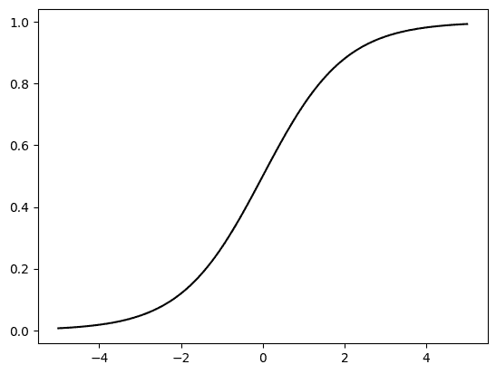
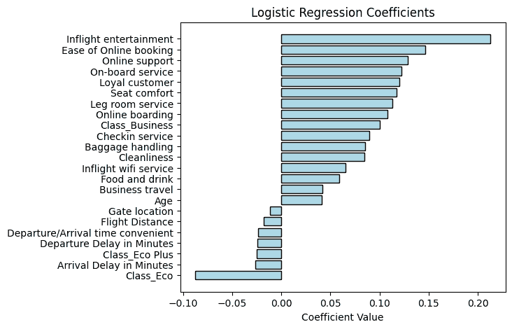

# 3.6\. 应用：逻辑回归

> 原文：[`mmids-textbook.github.io/chap03_opt/06_logistic/roch-mmids-opt-logistic.html`](https://mmids-textbook.github.io/chap03_opt/06_logistic/roch-mmids-opt-logistic.html)

我们回到逻辑回归\(\idx{逻辑回归}\xdi\)，这是我们在本章的动机示例中提到的。输入数据的形式为 \(\{(\boldsymbol{\alpha}_i, b_i) : i=1,\ldots, n\}\)，其中 \(\boldsymbol{\alpha}_i = (\alpha_{i,1}, \ldots, \alpha_{i,d}) \in \mathbb{R}^d\) 是特征，\(b_i \in \{0,1\}\) 是标签。和之前一样，我们使用矩阵表示：\(A \in \mathbb{R}^{n \times d}\) 的行是 \(\boldsymbol{\alpha}_i^T\)，\(i = 1,\ldots, n\)，而 \(\mathbf{b} = (b_1, \ldots, b_n) \in \{0,1\}^n\)。

## 3.6.1\. 定义#

我们总结了逻辑回归方法。我们的目标是找到一个特征函数，该函数近似于标签 \(1\) 的概率。为此，我们将标签 \(1\) 的概率的对数几率（或 logit 函数）建模为特征 \(\boldsymbol{\alpha} \in \mathbb{R}^d\) 的线性函数

$$ \log \frac{p(\mathbf{x}; \boldsymbol{\alpha})}{1-p(\mathbf{x}; \boldsymbol{\alpha})} = \boldsymbol{\alpha}^T \mathbf{x} $$

其中 \(\mathbf{x} \in \mathbb{R}^d\) 是系数向量（即参数）。通过反转这个表达式，我们得到

$$ p(\mathbf{x}; \boldsymbol{\alpha}) = \sigma(\boldsymbol{\alpha}^T \mathbf{x}) $$

其中 sigmoid 函数\(\idx{sigmoid 函数}\xdi\)是

$$ \sigma(z) = \frac{1}{1 + e^{-z}} $$

对于 \(z \in \mathbb{R}\)。

**数值角**: 我们绘制了 S 形函数。

```py
def sigmoid(z): 
    return 1/(1+np.exp(-z))

grid = np.linspace(-5, 5, 100)
plt.plot(grid, sigmoid(grid), c='k')
plt.show() 
```



\(\unlhd\)

我们寻求最大化观察数据的概率（也称为[似然函数](https://en.wikipedia.org/wiki/Likelihood_function)），假设在给定特征的情况下标签是独立的，这由以下公式给出（详见第六章以获取更多详细信息；现在我们只是设置相关的优化问题）

$$ \mathcal{L}(\mathbf{x}; A, \mathbf{b}) = \prod_{i=1}^n p(\boldsymbol{\alpha}_i; \mathbf{x})^{b_i} (1- p(\boldsymbol{\alpha}_i; \mathbf{x}))^{1-b_i}. $$

取对数，乘以 \(-1/n\) 并代入 S 形函数，我们希望最小化[交叉熵损失](https://en.wikipedia.org/wiki/Cross_entropy#Cross-entropy_loss_function_and_logistic_regression)\(\idx{交叉熵损失}\xdi\)

$$ \ell(\mathbf{x}; A, \mathbf{b}) = \frac{1}{n} \sum_{i=1}^n \left\{- b_i \log(\sigma(\boldsymbol{\alpha}_i^T \mathbf{x})) - (1-b_i) \log(1- \sigma(\boldsymbol{\alpha}_i^T \mathbf{x}))\right\}. $$

我们使用了对数的标准性质：对于 \(x, y > 0\)，\(\log(xy) = \log x + \log y\) 和 \(\log(x^y) = y \log x\)。

因此，我们希望解决最小化问题

$$ \min_{\mathbf{x} \in \mathbb{R}^d} \ell(\mathbf{x}; A, \mathbf{b}). $$

我们在这里隐含地使用了对数是严格单调递增的函数，因此不会改变函数的全局最优；乘以 \(-1/n\) 将全局最大值变为全局最小值。

要使用梯度下降，我们需要 \(\ell\) 的梯度。我们使用链式法则，并首先计算 \(\sigma\) 的导数，即

$$ \sigma'(z) = \frac{e^{-z}}{(1 + e^{-z})²} = \frac{1}{1 + e^{-z}}\left(1 - \frac{1}{1 + e^{-z}}\right) = \sigma(z) (1 - \sigma(z)). $$

后者表达式被称为[逻辑微分方程](https://en.wikipedia.org/wiki/Logistic_function#Logistic_differential_equation)。它在各种应用中出现，包括[人口动力学](https://towardsdatascience.com/covid-19-in-italy-mathematical-models-and-predictions-7784b4d7dd8d)的建模。在这里，它将是一种方便计算梯度的方法。

注意到，对于 \(\boldsymbol{\alpha} = (\alpha_{1}, \ldots, \alpha_{d}) \in \mathbb{R}^d\)，通过链式法则

$$ \nabla\sigma(\boldsymbol{\alpha}^T \mathbf{x}) = \sigma'(\boldsymbol{\alpha}^T \mathbf{x}) \nabla (\boldsymbol{\alpha}^T \mathbf{x}) = \sigma'(\boldsymbol{\alpha}^T \mathbf{x}) \boldsymbol{\alpha} $$

在整个过程中，梯度是相对于 \(\mathbf{x}\) 的。

或者，我们可以通过应用单变量链式法则得到相同的公式

$$\begin{align*} \frac{\partial}{\partial x_j} \sigma(\boldsymbol{\alpha}^T \mathbf{x}) &= \sigma'(\boldsymbol{\alpha}^T \mathbf{x}) \frac{\partial}{\partial x_j}(\boldsymbol{\alpha}^T \mathbf{x})\\ &= \sigma'(\boldsymbol{\alpha}^T \mathbf{x}) \frac{\partial}{\partial x_j}\left(\alpha_{j} x_{j} + \sum_{\ell=1, \ell \neq j}^d \alpha_{\ell} x_{\ell}\right)\\ &= \sigma(\boldsymbol{\alpha}^T \mathbf{x}) (1 - \sigma(\boldsymbol{\alpha}^T \mathbf{x}))\, \alpha_{j} \end{align*}$$

所以

$$\begin{align*} \nabla\sigma(\boldsymbol{\alpha}^T \mathbf{x}) &= \left(\sigma(\boldsymbol{\alpha}^T \mathbf{x}) (1 - \sigma(\boldsymbol{\alpha}^T \mathbf{x}))\, \alpha_{1}, \ldots, \sigma(\boldsymbol{\alpha}^T \mathbf{x}) (1 - \sigma(\boldsymbol{\alpha}^T \mathbf{x}))\, \alpha_{d}\right)\\ &= \sigma(\boldsymbol{\alpha}^T \mathbf{x}) (1 - \sigma(\boldsymbol{\alpha}^T \mathbf{x}))\, (\alpha_{1}, \ldots, \alpha_{d})\\ &= \sigma(\boldsymbol{\alpha}^T \mathbf{x}) (1 - \sigma(\boldsymbol{\alpha}^T \mathbf{x}))\, \boldsymbol{\alpha}. \end{align*}$$

通过应用链式法则的另一个例子，因为 \(\frac{\mathrm{d}}{\mathrm{d} z} \log z = \frac{1}{z}\),

$$\begin{align*} \nabla\ell(\mathbf{x}; A, \mathbf{b}) &= \nabla\left[\frac{1}{n} \sum_{i=1}^n \left\{- b_i \log(\sigma(\boldsymbol{\alpha}_i^T \mathbf{x})) - (1-b_i) \log(1- \sigma(\boldsymbol{\alpha}_i^T \mathbf{x}))\right\}\right]\\ &= - \frac{1}{n} \sum_{i=1}^n \frac{b_i}{\sigma(\boldsymbol{\alpha}_i^T \mathbf{x})} \nabla\sigma(\boldsymbol{\alpha}_i^T \mathbf{x}) - \frac{1}{n} \sum_{i=1}^n \frac{1-b_i}{1- \sigma(\boldsymbol{\alpha}_i^T \mathbf{x})} \nabla(1 - \sigma(\boldsymbol{\alpha}_i^T \mathbf{x}))\\ &= - \frac{1}{n} \sum_{i=1}^n \frac{b_i}{\sigma(\boldsymbol{\alpha}_i^T \mathbf{x})} \nabla\sigma(\boldsymbol{\alpha}_i^T \mathbf{x}) + \frac{1}{n} \sum_{i=1}^n \frac{1-b_i}{1- \sigma(\boldsymbol{\alpha}_i^T \mathbf{x})} \nabla\sigma(\boldsymbol{\alpha}_i^T \mathbf{x}). \end{align*}$$

使用 sigmoid 函数梯度的表达式，这等于

$$\begin{align*} &- \frac{1}{n} \sum_{i=1}^n \frac{b_i}{\sigma(\boldsymbol{\alpha}_i^T \mathbf{x})} \sigma(\boldsymbol{\alpha}_i^T \mathbf{x}) (1 - \sigma(\boldsymbol{\alpha}_i^T \mathbf{x})) \,\boldsymbol{\alpha}_i\\ &\quad\quad + \frac{1}{n} \sum_{i=1}^n \frac{1-b_i}{1- \sigma(\boldsymbol{\alpha}_i^T \mathbf{x})} \sigma(\boldsymbol{\alpha}_i^T \mathbf{x}) (1 - \sigma(\boldsymbol{\alpha}_i^T \mathbf{x})) \,\boldsymbol{\alpha}_i\\ &= - \frac{1}{n} \sum_{i=1}^n \left( b_i (1 - \sigma(\boldsymbol{\alpha}_i^T \mathbf{x})) - (1-b_i)\sigma(\boldsymbol{\alpha}_i^T \mathbf{x}) \right)\,\boldsymbol{\alpha}_i\\ &= - \frac{1}{n} \sum_{i=1}^n ( b_i - \sigma(\boldsymbol{\alpha}_i^T \mathbf{x}) ) \,\boldsymbol{\alpha}_i. \end{align*}$$

要实现这个公式，将其用矩阵表示 \(A \in \mathbb{R}^{n \times d}\)（其行是 \(\boldsymbol{\alpha}_i^T\)，\(i = 1,\ldots, n\)）和 \(\mathbf{b} = (b_1, \ldots, b_n) \in \{0,1\}^n\) 来重新编写将是有用的。设 \(\bsigma : \mathbb{R}^n \to \mathbb{R}\) 是一个向量值函数，它逐项应用 sigmoid \(\sigma\)，即 \(\bsigma(\mathbf{z}) = (\sigma(z_1),\ldots,\sigma(z_n))\) 其中 \(\mathbf{z} = (z_1,\ldots,z_n)\)。将 \(\sum_{i=1}^n (b_i - \sigma(\boldsymbol{\alpha}_i^T \mathbf{x})\,\boldsymbol{\alpha}_i\) 视为 \(A^T\) 的列的线性组合，其系数是向量 \(\mathbf{b} - \bsigma(A \mathbf{x})\) 的项，我们得到

$$ \nabla\ell(\mathbf{x}; A, \mathbf{b}) = - \frac{1}{n} \sum_{i=1}^n ( b_i - \sigma(\boldsymbol{\alpha}_i^T \mathbf{x}) ) \,\boldsymbol{\alpha}_i = -\frac{1}{n} A^T [\mathbf{b} - \bsigma(A \mathbf{x})]. $$

我们转向 Hessian 矩阵。由于对称性，我们可以将 Hessian 矩阵的第 \(j\) 列视为关于 \(x_j\) 的偏导数的梯度。因此，我们首先计算 \(\ell\) 的梯度中项的和的 \(j\) 项的梯度。我们注意到，对于 \(\boldsymbol{\alpha} = (\alpha_{1}, \ldots, \alpha_{d}) \in \mathbb{R}^d\)，

$$ \nabla [(b - \sigma(\boldsymbol{\alpha}^T \mathbf{x}))\, \alpha_{j}] = - \nabla [\sigma(\boldsymbol{\alpha}^T \mathbf{x})] \, \alpha_{j} = - \sigma(\boldsymbol{\alpha}^T \mathbf{x}) (1 - \sigma(\boldsymbol{\alpha}^T \mathbf{x}))\, \boldsymbol{\alpha}\alpha_{j}. $$

因此，利用 \(\boldsymbol{\alpha} \alpha_{j}\) 是矩阵 \(\boldsymbol{\alpha} \boldsymbol{\alpha}^T\) 的第 \(j\) 列这一事实，我们得到

$$ \mathbf{H}_{\ell}(\mathbf{x}; A, \mathbf{b}) = \frac{1}{n} \sum_{i=1}^n \sigma(\boldsymbol{\alpha}_i^T \mathbf{x}) (1 - \sigma(\boldsymbol{\alpha}_i^T \mathbf{x}))\, \boldsymbol{\alpha}_i \boldsymbol{\alpha}_i^T $$

其中 \(\mathbf{H}_{\ell}(\mathbf{x}; A, \mathbf{b})\) 表示相对于 \(\mathbf{x}\) 变量的 Hessian 矩阵，对于固定的 \(A, \mathbf{b}\)。

**引理** **(逻辑回归的凸性)** \(\idx{逻辑回归的凸性}\xdi\) 函数 \(\ell(\mathbf{x}; A, \mathbf{b})\) 作为 \(\mathbf{x} \in \mathbb{R}^d\) 的函数是凸的。 \(\flat\)

*证明:* 事实上，Hessian 矩阵是正半定的：对于任何 \(\mathbf{z} \in \mathbb{R}^d\)

$$\begin{align*} \mathbf{z}^T \,\mathbf{H}_{\ell}(\mathbf{x}; A, \mathbf{b}) \,\mathbf{z} &= \frac{1}{n} \sum_{i=1}^n \sigma(\boldsymbol{\alpha}_i^T \mathbf{x}) (1 - \sigma(\boldsymbol{\alpha}_i^T \mathbf{x}))\, \mathbf{z}^T \boldsymbol{\alpha}_i \boldsymbol{\alpha}_i^T \mathbf{z}\\ &= \frac{1}{n} \sum_{i=1}^n \sigma(\boldsymbol{\alpha}_i^T \mathbf{x}) (1 - \sigma(\boldsymbol{\alpha}_i^T \mathbf{x}))\, (\mathbf{z}^T \boldsymbol{\alpha}_i)²\\ &\geq 0 \end{align*}$$

由于对于所有 \(t\)，\(\sigma(t) \in [0,1]\)。 \(\square\)

凸性是使用交叉熵损失（例如，而不是均方误差 [https://math.stackexchange.com/questions/1582452/logistic-regression-prove-that-the-cost-function-is-convex]）的原因之一。

**引理** **(逻辑回归的平滑性)** 函数 \(\ell(\mathbf{x}; A, \mathbf{b})\) 对于

$$ L= \frac{1}{4n} \sum_{i=1}^n \|\boldsymbol{\alpha}_i\|² = \frac{1}{4n} \|A\|_F². $$

\(\flat\)

*证明:* 我们使用凸性和 Hessian 的表达式推导出，对于任何单位向量 \(\mathbf{z} \in \mathbb{R}^d\)，

$$\begin{align*} 0 \leq \mathbf{z}^T \,\mathbf{H}_{\ell}(\mathbf{x}; A, \mathbf{b}) \,\mathbf{z} &= \frac{1}{n} \sum_{i=1}^n \sigma(\boldsymbol{\alpha}_i^T \mathbf{x}) (1 - \sigma(\boldsymbol{\alpha}_i^T \mathbf{x}))\, (\mathbf{z}^T \boldsymbol{\alpha}_i)². \end{align*}$$

我们需要找到因子 \(\sigma(\boldsymbol{\alpha}_i^T \mathbf{x}) (1 - \sigma(\boldsymbol{\alpha}_i^T \mathbf{x}))\) 可以取的最大值。注意，对于所有 \(t\)，\(\sigma(t) \in [0,1]\)，且 \(\sigma(t) + (1 - \sigma(t)) = 1\)。对函数 \(f(w) = w (1 - w) = w - w²\) 求导得到 \(f'(w) = 1 - 2 w\) 和 \(f''(w) = -2\)。因此，\(f\) 是凹函数，并在 \(w^* = 1/2\) 处达到最大值，此时 \(f(1/2) = 1/4\)。我们已经证明了

$$ \sigma(\boldsymbol{\alpha}_i^T \mathbf{x}) (1 - \sigma(\boldsymbol{\alpha}_i^T \mathbf{x})) \leq 1/4 $$

对于任何 \(\mathbf{z}\)。

返回到 \(\mathbf{z}^T \,\mathbf{H}_{\ell}(\mathbf{x}; A, \mathbf{b}) \,\mathbf{z}\) 的上界，我们得到

$$\begin{align*} \mathbf{z}^T \,\mathbf{H}_{\ell}(\mathbf{x}; A, \mathbf{b}) \,\mathbf{z} &= \frac{1}{n} \sum_{i=1}^n \sigma(\boldsymbol{\alpha}_i^T \mathbf{x}) (1 - \sigma(\boldsymbol{\alpha}_i^T \mathbf{x}))\, (\mathbf{z}^T \boldsymbol{\alpha}_i)²\\ &\leq \frac{1}{4n} \sum_{i=1}^n (\mathbf{z}^T \boldsymbol{\alpha}_i)²\\ &\leq \frac{1}{4n} \sum_{i=1}^n \|\mathbf{z}\|² \|\boldsymbol{\alpha}_i\|²\\ &\leq \frac{1}{4n} \sum_{i=1}^n \|\boldsymbol{\alpha}_i\|², \end{align*}$$

在第三行中，我们使用了 *柯西-施瓦茨不等式*，在第四行中，我们使用了 \(\mathbf{z}\) 是一个单位向量的事实。

这意味着 \(L\)-平滑性。 \(\square\)

对于步长 \(\beta\)，梯度下降的一步因此是

$$ \mathbf{x}^{t+1} = \mathbf{x}^{t} +\beta \frac{1}{n} \sum_{i=1}^n ( b_i - \sigma(\boldsymbol{\alpha}_i^T \mathbf{x}^t) ) \,\boldsymbol{\alpha}_i. $$

## 3.6.2\. 实现方法#

我们修改了梯度下降的实现，使其接受数据集作为输入。回想一下，为了运行梯度下降，我们首先实现一个计算下降更新的函数。它接受一个计算梯度的函数 `grad_fn`，以及一个当前迭代和步长。我们现在还提供数据集作为额外的输入。

```py
def desc_update_for_logreg(grad_fn, A, b, curr_x, beta):
    gradient = grad_fn(curr_x, A, b)
    return curr_x - beta*gradient 
```

我们已经准备好实现梯度下降。我们的函数接受一个计算目标函数的函数 `loss_fn`，一个计算梯度的函数 `grad_fn`，数据集 `A` 和 `b`，以及一个初始猜测 `init_x`。可选参数是步长和迭代次数。

```py
def gd_for_logreg(loss_fn, grad_fn, A, b, init_x, beta=1e-3, niters=int(1e5)):
    curr_x = init_x

    for iter in range(niters):
        curr_x = desc_update_for_logreg(grad_fn, A, b, curr_x, beta)

    return curr_x 
```

要实现 `loss_fn` 和 `grad_fn`，我们定义了上述的 sigmoid 函数。下面，`pred_fn` 是 \(\bsigma(A \mathbf{x})\)。这里我们将损失函数写为

$$\begin{align*} \ell(\mathbf{x}; A, \mathbf{b}) &= \frac{1}{n} \sum_{i=1}^n \left\{- b_i \log(\sigma(\boldsymbol{\alpha_i}^T \mathbf{x})) - (1-b_i) \log(1- \sigma(\boldsymbol{\alpha_i}^T \mathbf{x}))\right\}\\ &= \mathrm{mean}\left(-\mathbf{b} \odot \mathbf{log}(\bsigma(A \mathbf{x})) - (\mathbf{1} - \mathbf{b}) \odot \mathbf{log}(\mathbf{1} - \bsigma(A \mathbf{x}))\right), \end{align*}$$

其中 \(\odot\) 是哈达玛积，或逐元素乘积（例如 \(\mathbf{u} \odot \mathbf{v} = (u_1 v_1, \ldots,u_n v_n)\)），对数（用粗体表示）是逐元素应用，\(\mathrm{mean}(\mathbf{z})\) 是 \(\mathbf{z}\) 的元素平均值（即，\(\mathrm{mean}(\mathbf{z}) = n^{-1} \sum_{i=1}^n z_i\))。

```py
def pred_fn(x, A): 
    return sigmoid(A @ x)

def loss_fn(x, A, b): 
    return np.mean(-b*np.log(pred_fn(x, A)) - (1 - b)*np.log(1 - pred_fn(x, A)))

def grad_fn(x, A, b):
    return -A.T @ (b - pred_fn(x, A))/len(b) 
```

我们可以根据目标函数的平滑性选择步长，如上所述。回想一下，[`numpy.linalg.norm`](https://numpy.org/doc/stable/reference/generated/numpy.linalg.norm.html) 默认计算 Frobenius 范数。

```py
def stepsize_for_logreg(A, b):
    L = LA.norm(A)**2 / (4 * len(b))
    return 1/L 
```

**NUMERICAL CORNER:** 我们回到最初的动力，即[航空公司客户满意度](https://www.kaggle.com/datasets/sjleshrac/airlines-customer-satisfaction)数据集。我们首先加载数据集。稍后我们需要列名。

```py
data = pd.read_csv('customer_airline_satisfaction.csv')
column_names = data.columns.tolist()
print(column_names) 
```

```py
['Satisfied', 'Age', 'Class_Business', 'Class_Eco', 'Class_Eco Plus', 'Business travel', 'Loyal customer', 'Flight Distance', 'Departure Delay in Minutes', 'Arrival Delay in Minutes', 'Seat comfort', 'Departure/Arrival time convenient', 'Food and drink', 'Gate location', 'Inflight wifi service', 'Inflight entertainment', 'Online support', 'Ease of Online booking', 'On-board service', 'Leg room service', 'Baggage handling', 'Checkin service', 'Cleanliness', 'Online boarding'] 
```

我们的目标将是预测第一列，即`Satisfied`，从其余列中。为此，我们将数据转换为 NumPy 数组。我们还通过减去均值并除以标准差来标准化列，这将允许我们比较不同特征对预测的影响。并且我们添加一列 1s 来考虑截距。

```py
y = data['Satisfied'].to_numpy()
X = data.drop(columns=['Satisfied']).to_numpy()

means = np.mean(X, axis=0)
stds = np.std(X, axis=0)
X_standardized = (X - means) / stds

A = np.concatenate((np.ones((len(y),1)), X_standardized), axis=1)
b = y 
```

我们使用为一般逻辑回归问题编写的函数`loss_fn`和`grad_fn`。

```py
init_x = np.zeros(A.shape[1])
best_x = gd_for_logreg(loss_fn, grad_fn, A, b, init_x, beta=1e-3, niters=int(1e3))
print(best_x) 
```

```py
[ 0.03622497  0.04123861  0.10020177 -0.08786108 -0.02485893  0.0420605
  0.11995567 -0.01799992 -0.02399636 -0.02653084  0.1176043  -0.02382631
  0.05909378 -0.01161711  0.06553672  0.21313777  0.12883519  0.14631027
  0.12239595  0.11282894  0.08556647  0.08954403  0.08447245  0.108043  ] 
```

为了解释结果，我们按降序排列系数。

```py
coefficients, features = best_x[1:], column_names[1:]

sorted_indices = np.argsort(coefficients)
sorted_coefficients = coefficients[sorted_indices]
sorted_features = np.array(features)[sorted_indices]

plt.figure(figsize=(6, 5))
plt.barh(sorted_features, sorted_coefficients, color='lightblue', edgecolor='black')
plt.xlabel('Coefficient Value'), plt.title('Logistic Regression Coefficients')
plt.show() 
```



从前十个条形图或类似的位置我们可以看到，正如预期的那样，航班各方面的高评级通常有助于提高预测满意度的可能性（有一个例外是`Gate location`，其系数为负，但可能不是[统计上显著](https://en.wikipedia.org/wiki/Statistical_significance)）。`机上娱乐`似乎特别有影响力。`Age`也显示出相同的模式，这是我们通过不同的分析在介绍部分注意到的。另一方面，`Departure Delay in Minutes`和`Arrival Delay in Minutes`对预测满意度的可能性有负面影响，这也是一个预期的模式。然而，最负面的影响似乎来自`Class_Eco`。

**CHAT & LEARN** 对于逻辑回归，有更快的方法。向你的心仪 AI 聊天机器人询问迭代加权最小二乘法的解释和实现。尝试在这个数据集上应用它。（[在 Colab 中打开](https://colab.research.google.com/github/MMiDS-textbook/MMiDS-textbook.github.io/blob/main/just_the_code/roch_mmids_chap_opt_notebook.ipynb)) \(\ddagger\)

**TRY IT!** 可以尝试使用预测函数 \(p(\mathbf{x}; \boldsymbol{\alpha}) = \sigma(\boldsymbol{\alpha}^T \mathbf{x})\) 来预测一个新客户（其特征向量为 \(\boldsymbol{\alpha}\)）是否会满意，其中 \(\mathbf{x}\) 是拟合系数。如果一个客户被预测为满意，如果 \(\sigma(\boldsymbol{\alpha}^T \mathbf{x}) > 0.5\)。实现这个预测器并计算它在数据集上的准确率。（[在 Colab 中打开](https://colab.research.google.com/github/MMiDS-textbook/MMiDS-textbook.github.io/blob/main/just_the_code/roch_mmids_chap_opt_notebook.ipynb))

**CHAT & LEARN** 由于过拟合的问题，在用于估计系数的数据集上计算预测器的准确度是有问题的。向你的心仪 AI 聊天机器人询问 scikit-learn 的`train_test_split`函数以及它是如何帮助解决这个问题，并在该数据集上实现它。([在 Colab 中打开](https://colab.research.google.com/github/MMiDS-textbook/MMiDS-textbook.github.io/blob/main/just_the_code/roch_mmids_chap_opt_notebook.ipynb)) \(\ddagger\)

\(\unlhd\)

***自我评估测验*** *(由 Claude, Gemini 和 ChatGPT 协助)*

**1** 逻辑回归的主要目标是什么？

a) 预测连续的因变量。

b) 将数据点分类到多个类别。

c) 建立二元结果的概率模型。

d) 找到特征的最佳线性组合。

**2** 在逻辑回归中，最大化似然函数和最小化交叉熵损失之间有什么关系？

a) 它们是无关的概念。

b) 最大化似然等价于最小化交叉熵损失。

c) 最小化交叉熵损失是最大化似然的第一步。

d) 最大化似然是最小化交叉熵损失的一种特殊情况。

**3** 以下哪个是逻辑回归目标函数（交叉熵损失）的正确公式？

a) \(\ell(\mathbf{x}; A, \mathbf{b}) = \frac{1}{n} \sum_{i=1}^n \log(1 + \exp(-b_i \boldsymbol{\alpha}_i^T \mathbf{x}))\)

b) \(\ell(\mathbf{x}; A, \mathbf{b}) = \frac{1}{n} \sum_{i=1}^n (b_i - \sigma(\boldsymbol{\alpha}_i^T \mathbf{x}))²\)

c) \(\ell(\mathbf{x}; A, \mathbf{b}) = \frac{1}{n} \sum_{i=1}^n \{-b_i \log(\sigma(\boldsymbol{\alpha}_i^T \mathbf{x})) - (1 - b_i) \log(1 - \sigma(\boldsymbol{\alpha}_i^T \mathbf{x}))\}\)

d) \(\ell(\mathbf{x}; A, \mathbf{b}) = \frac{1}{n} \sum_{i=1}^n b_i \boldsymbol{\alpha}_i^T \mathbf{x}\)

**4** 在航空公司客户满意度数据集示例中，标准化输入特征的目的是什么？

a) 确保目标函数是凸的。

b) 加速梯度下降的收敛速度。

c) 允许比较不同特征对预测的影响。

d) 处理数据集中的缺失数据。

**5** 在逻辑回归中，向特征矩阵中添加一列 1 的以下哪个是有效的理由？

a) 确保目标函数是凸的。

b) 在模型中允许有截距项。

c) 标准化输入特征。

d) 处理数据集中的缺失数据。

1 题答案：c. 理由：文本中提到逻辑回归的目标是“找到一个特征函数来近似标签的概率。”

2 题答案：b. 理由：文本中提到：“我们寻求最大化观察数据的概率……这由……给出……取对数，乘以\(-1/n\)并替换 sigmoid 函数，我们想要最小化交叉熵损失。”

3 的答案：c. 理由：文本中提到：“因此，我们想要解决最小化问题 \(\min_{x \in \mathbb{R}^d} \ell(\mathbf{x}; A, \mathbf{b})\)，” 其中 \(\ell(\mathbf{x}; A, \mathbf{b}) = \frac{1}{n} \sum_{i=1}^n \{-b_i \log(\sigma(\boldsymbol{\alpha}_i^T \mathbf{x})) - (1 - b_i) \log(1 - \sigma(\boldsymbol{\alpha}_i^T \mathbf{x}))\}\)。

4 的答案：c. 理由：文本中提到：“我们还通过减去它们的均值并除以它们的标准差来标准化列。这将允许比较不同特征对预测的影响。”

5 的答案：b. 理由：文本中提到：“为了允许特征的一个仿射函数，我们添加了一个 1 的列，就像我们之前做的那样。”

## 3.6.1\. 定义#

我们总结逻辑回归方法。我们的目标是找到一个近似标签 1 的概率的特征函数。为此，我们将标签 1 的概率的对数几率（或 logit 函数）建模为特征 \(\boldsymbol{\alpha} \in \mathbb{R}^d\) 的线性函数

$$ \log \frac{p(\mathbf{x}; \boldsymbol{\alpha})}{1-p(\mathbf{x}; \boldsymbol{\alpha})} = \boldsymbol{\alpha}^T \mathbf{x} $$

其中 \(\mathbf{x} \in \mathbb{R}^d\) 是系数向量（即参数）。通过反转这个表达式给出

$$ p(\mathbf{x}; \boldsymbol{\alpha}) = \sigma(\boldsymbol{\alpha}^T \mathbf{x}) $$

其中 sigmoid 函数是

$$ \sigma(z) = \frac{1}{1 + e^{-z}} $$

对于 \(z \in \mathbb{R}\)。

**数值角**: 我们绘制了 sigmoid 函数。

```py
def sigmoid(z): 
    return 1/(1+np.exp(-z))

grid = np.linspace(-5, 5, 100)
plt.plot(grid, sigmoid(grid), c='k')
plt.show() 
```


\(\unlhd\)

我们寻求最大化观察数据的概率（也称为 [似然函数](https://en.wikipedia.org/wiki/Likelihood_function)），假设在给定特征的情况下标签是独立的，这由以下公式给出（详见第六章，目前我们只是在设置相关的优化问题）。

$$ \mathcal{L}(\mathbf{x}; A, \mathbf{b}) = \prod_{i=1}^n p(\boldsymbol{\alpha}_i; \mathbf{x})^{b_i} (1- p(\boldsymbol{\alpha}_i; \mathbf{x}))^{1-b_i}. $$

取对数，乘以 \(-1/n\) 并代入 sigmoid 函数，我们希望最小化 [交叉熵损失](https://en.wikipedia.org/wiki/Cross_entropy#Cross-entropy_loss_function_and_logistic_regression)\(\idx{交叉熵损失}\xdi\)。

$$ \ell(\mathbf{x}; A, \mathbf{b}) = \frac{1}{n} \sum_{i=1}^n \left\{- b_i \log(\sigma(\boldsymbol{\alpha}_i^T \mathbf{x})) - (1-b_i) \log(1- \sigma(\boldsymbol{\alpha}_i^T \mathbf{x}))\right\}. $$

我们使用了对数的标准性质：对于 \(x, y > 0\)，\(\log(xy) = \log x + \log y\) 和 \(\log(x^y) = y \log x\)。

因此，我们想要解决最小化问题

$$ \min_{\mathbf{x} \in \mathbb{R}^d} \ell(\mathbf{x}; A, \mathbf{b}). $$

在这里我们隐含地使用了对数是一个严格递增函数的事实，因此它不会改变函数的全局最优解；乘以 \(-1/n\) 将全局最大值变成了全局最小值。

要使用梯度下降，我们需要 \(\ell\) 的梯度。我们使用**链式法则**，首先计算 \(\sigma\) 的导数，它是

$$ \sigma'(z) = \frac{e^{-z}}{(1 + e^{-z})²} = \frac{1}{1 + e^{-z}}\left(1 - \frac{1}{1 + e^{-z}}\right) = \sigma(z) (1 - \sigma(z)). $$

后一个表达式被称为[逻辑微分方程](https://en.wikipedia.org/wiki/Logistic_function#Logistic_differential_equation)。它在各种应用中都有出现，包括[人口动力学](https://towardsdatascience.com/covid-19-in-italy-mathematical-models-and-predictions-7784b4d7dd8d)的建模。在这里，它将是一个方便计算梯度的方法。

注意到，对于 \(\boldsymbol{\alpha} = (\alpha_{1}, \ldots, \alpha_{d}) \in \mathbb{R}^d\)，通过**链式法则**

$$ \nabla\sigma(\boldsymbol{\alpha}^T \mathbf{x}) = \sigma'(\boldsymbol{\alpha}^T \mathbf{x}) \nabla (\boldsymbol{\alpha}^T \mathbf{x}) = \sigma'(\boldsymbol{\alpha}^T \mathbf{x}) \boldsymbol{\alpha} $$

其中，梯度始终是相对于 \(\mathbf{x}\) 的。

或者，我们可以通过应用单变量**链式法则**得到相同的公式

$$\begin{align*} \frac{\partial}{\partial x_j} \sigma(\boldsymbol{\alpha}^T \mathbf{x}) &= \sigma'(\boldsymbol{\alpha}^T \mathbf{x}) \frac{\partial}{\partial x_j}(\boldsymbol{\alpha}^T \mathbf{x})\\ &= \sigma'(\boldsymbol{\alpha}^T \mathbf{x}) \frac{\partial}{\partial x_j}\left(\alpha_{j} x_{j} + \sum_{\ell=1, \ell \neq j}^d \alpha_{\ell} x_{\ell}\right)\\ &= \sigma(\boldsymbol{\alpha}^T \mathbf{x}) (1 - \sigma(\boldsymbol{\alpha}^T \mathbf{x}))\, \alpha_{j} \end{align*}$$

因此

$$\begin{align*} \nabla\sigma(\boldsymbol{\alpha}^T \mathbf{x}) &= \left(\sigma(\boldsymbol{\alpha}^T \mathbf{x}) (1 - \sigma(\boldsymbol{\alpha}^T \mathbf{x}))\, \alpha_{1}, \ldots, \sigma(\boldsymbol{\alpha}^T \mathbf{x}) (1 - \sigma(\boldsymbol{\alpha}^T \mathbf{x}))\, \alpha_{d}\right)\\ &= \sigma(\boldsymbol{\alpha}^T \mathbf{x}) (1 - \sigma(\boldsymbol{\alpha}^T \mathbf{x}))\, (\alpha_{1}, \ldots, \alpha_{d})\\ &= \sigma(\boldsymbol{\alpha}^T \mathbf{x}) (1 - \sigma(\boldsymbol{\alpha}^T \mathbf{x}))\, \boldsymbol{\alpha}. \end{align*}$$

通过**链式法则**的另一种应用，因为 \(\frac{\mathrm{d}}{\mathrm{d} z} \log z = \frac{1}{z}\)，

$$\begin{align*} \nabla\ell(\mathbf{x}; A, \mathbf{b}) &= \nabla\left[\frac{1}{n} \sum_{i=1}^n \left\{- b_i \log(\sigma(\boldsymbol{\alpha}_i^T \mathbf{x})) - (1-b_i) \log(1- \sigma(\boldsymbol{\alpha}_i^T \mathbf{x}))\right\}\right]\\ &= - \frac{1}{n} \sum_{i=1}^n \frac{b_i}{\sigma(\boldsymbol{\alpha}_i^T \mathbf{x})} \nabla\sigma(\boldsymbol{\alpha}_i^T \mathbf{x}) - \frac{1}{n} \sum_{i=1}^n \frac{1-b_i}{1- \sigma(\boldsymbol{\alpha}_i^T \mathbf{x})} \nabla(1 - \sigma(\boldsymbol{\alpha}_i^T \mathbf{x}))\\ &= - \frac{1}{n} \sum_{i=1}^n \frac{b_i}{\sigma(\boldsymbol{\alpha}_i^T \mathbf{x})} \nabla\sigma(\boldsymbol{\alpha}_i^T \mathbf{x}) + \frac{1}{n} \sum_{i=1}^n \frac{1-b_i}{1- \sigma(\boldsymbol{\alpha}_i^T \mathbf{x})} \nabla\sigma(\boldsymbol{\alpha}_i^T \mathbf{x}). \end{align*}$$

使用 sigmoid 函数的梯度表达式，这等于

$$\begin{align*} &- \frac{1}{n} \sum_{i=1}^n \frac{b_i}{\sigma(\boldsymbol{\alpha}_i^T \mathbf{x})} \sigma(\boldsymbol{\alpha}_i^T \mathbf{x}) (1 - \sigma(\boldsymbol{\alpha}_i^T \mathbf{x})) \,\boldsymbol{\alpha}_i\\ &\quad\quad + \frac{1}{n} \sum_{i=1}^n \frac{1-b_i}{1- \sigma(\boldsymbol{\alpha}_i^T \mathbf{x})} \sigma(\boldsymbol{\alpha}_i^T \mathbf{x}) (1 - \sigma(\boldsymbol{\alpha}_i^T \mathbf{x})) \,\boldsymbol{\alpha}_i\\ &= - \frac{1}{n} \sum_{i=1}^n \left( b_i (1 - \sigma(\boldsymbol{\alpha}_i^T \mathbf{x})) - (1-b_i)\sigma(\boldsymbol{\alpha}_i^T \mathbf{x}) \right)\,\boldsymbol{\alpha}_i\\ &= - \frac{1}{n} \sum_{i=1}^n ( b_i - \sigma(\boldsymbol{\alpha}_i^T \mathbf{x}) ) \,\boldsymbol{\alpha}_i. \end{align*}$$

为了实现这个公式，将其用矩阵表示 \(A \in \mathbb{R}^{n \times d}\)（其行是 \(\boldsymbol{\alpha}_i^T\)，\(i = 1,\ldots, n\)）和 \(\mathbf{b} = (b_1, \ldots, b_n) \in \{0,1\}^n\) 来重写将是有用的。设 \(\bsigma : \mathbb{R}^n \to \mathbb{R}\) 是一个向量值函数，它逐项应用 sigmoid \(\sigma\)，即 \(\bsigma(\mathbf{z}) = (\sigma(z_1),\ldots,\sigma(z_n))\) 其中 \(\mathbf{z} = (z_1,\ldots,z_n)\)。将 \(\sum_{i=1}^n (b_i - \sigma(\boldsymbol{\alpha}_i^T \mathbf{x})\,\boldsymbol{\alpha}_i\) 视为 \(A^T\) 的列的线性组合，其系数是向量 \(\mathbf{b} - \bsigma(A \mathbf{x})\) 的元素，我们得到

$$ \nabla\ell(\mathbf{x}; A, \mathbf{b}) = - \frac{1}{n} \sum_{i=1}^n ( b_i - \sigma(\boldsymbol{\alpha}_i^T \mathbf{x}) ) \,\boldsymbol{\alpha}_i = -\frac{1}{n} A^T [\mathbf{b} - \bsigma(A \mathbf{x})]. $$

我们转向 Hessian 矩阵。由于对称性，我们可以将 Hessian 矩阵的第 \(j\) 列视为关于 \(x_j\) 的偏导数的梯度。因此，我们首先计算梯度中求和项的第 \(j\) 个元素的梯度。我们注意到，对于 \(\boldsymbol{\alpha} = (\alpha_{1}, \ldots, \alpha_{d}) \in \mathbb{R}^d\)，

$$ \nabla [(b - \sigma(\boldsymbol{\alpha}^T \mathbf{x}))\, \alpha_{j}] = - \nabla [\sigma(\boldsymbol{\alpha}^T \mathbf{x})] \, \alpha_{j} = - \sigma(\boldsymbol{\alpha}^T \mathbf{x}) (1 - \sigma(\boldsymbol{\alpha}^T \mathbf{x}))\, \boldsymbol{\alpha}\alpha_{j}. $$

因此，利用 \(\boldsymbol{\alpha} \alpha_{j}\) 是矩阵 \(\boldsymbol{\alpha} \boldsymbol{\alpha}^T\) 的第 \(j\) 列这一事实，我们得到

$$ \mathbf{H}_{\ell}(\mathbf{x}; A, \mathbf{b}) = \frac{1}{n} \sum_{i=1}^n \sigma(\boldsymbol{\alpha}_i^T \mathbf{x}) (1 - \sigma(\boldsymbol{\alpha}_i^T \mathbf{x}))\, \boldsymbol{\alpha}_i \boldsymbol{\alpha}_i^T $$

其中 \(\mathbf{H}_{\ell}(\mathbf{x}; A, \mathbf{b})\) 表示相对于 \(\mathbf{x}\) 变量的 Hessian，对于固定的 \(A, \mathbf{b}\)。

**引理** **(逻辑回归的凸性)** \(\idx{convexity of logistic regression}\xdi\) 函数 \(\ell(\mathbf{x}; A, \mathbf{b})\) 作为 \(\mathbf{x} \in \mathbb{R}^d\) 的函数是凸的。\(\flat\)

*证明*: 事实上，Hessian 是正半定的：对于任何 \(\mathbf{z} \in \mathbb{R}^d\)

$$\begin{align*} \mathbf{z}^T \,\mathbf{H}_{\ell}(\mathbf{x}; A, \mathbf{b}) \,\mathbf{z} &= \frac{1}{n} \sum_{i=1}^n \sigma(\boldsymbol{\alpha}_i^T \mathbf{x}) (1 - \sigma(\boldsymbol{\alpha}_i^T \mathbf{x}))\, \mathbf{z}^T \boldsymbol{\alpha}_i \boldsymbol{\alpha}_i^T \mathbf{z}\\ &= \frac{1}{n} \sum_{i=1}^n \sigma(\boldsymbol{\alpha}_i^T \mathbf{x}) (1 - \sigma(\boldsymbol{\alpha}_i^T \mathbf{x}))\, (\mathbf{z}^T \boldsymbol{\alpha}_i)²\\ &\geq 0 \end{align*}$$

由于对于所有 \(t\)，\(\sigma(t) \in [0,1]\)。\(\square\)

凸性是使用交叉熵损失（例如，而不是均方误差 [https://math.stackexchange.com/questions/1582452/logistic-regression-prove-that-the-cost-function-is-convex]）的原因之一。

**引理** **(逻辑回归的平滑性)** 函数 \(\ell(\mathbf{x}; A, \mathbf{b})\) 对于

$$ L= \frac{1}{4n} \sum_{i=1}^n \|\boldsymbol{\alpha}_i\|² = \frac{1}{4n} \|A\|_F². $$

\(\flat\)

*证明*: 我们使用凸性和 Hessian 的表达式推导出，对于任何单位向量 \(\mathbf{z} \in \mathbb{R}^d\),

$$\begin{align*} 0 \leq \mathbf{z}^T \,\mathbf{H}_{\ell}(\mathbf{x}; A, \mathbf{b}) \,\mathbf{z} &= \frac{1}{n} \sum_{i=1}^n \sigma(\boldsymbol{\alpha}_i^T \mathbf{x}) (1 - \sigma(\boldsymbol{\alpha}_i^T \mathbf{x}))\, (\mathbf{z}^T \boldsymbol{\alpha}_i)². \end{align*}$$

我们需要找到因子 \(\sigma(\boldsymbol{\alpha}_i^T \mathbf{x}) (1 - \sigma(\boldsymbol{\alpha}_i^T \mathbf{x}))\) 可以取的最大值。注意，对于所有 \(t\)，\(\sigma(t) \in [0,1]\)，且 \(\sigma(t) + (1 - \sigma(t)) = 1\)。对函数 \(f(w) = w (1 - w) = w - w²\) 求导，我们得到 \(f'(w) = 1 - 2 w\) 和 \(f''(w) = -2\)。因此，\(f\) 是凹函数，并在 \(w^* = 1/2\) 处达到最大值，此时 \(f(1/2) = 1/4\)。我们已经证明了

$$ \sigma(\boldsymbol{\alpha}_i^T \mathbf{x}) (1 - \sigma(\boldsymbol{\alpha}_i^T \mathbf{x})) \leq 1/4 $$

对于任何 \(\mathbf{z}\)。

回到 \(\mathbf{z}^T \,\mathbf{H}_{\ell}(\mathbf{x}; A, \mathbf{b}) \,\mathbf{z}\) 的上界，我们得到

$$\begin{align*} \mathbf{z}^T \,\mathbf{H}_{\ell}(\mathbf{x}; A, \mathbf{b}) \,\mathbf{z} &= \frac{1}{n} \sum_{i=1}^n \sigma(\boldsymbol{\alpha}_i^T \mathbf{x}) (1 - \sigma(\boldsymbol{\alpha}_i^T \mathbf{x}))\, (\mathbf{z}^T \boldsymbol{\alpha}_i)²\\ &\leq \frac{1}{4n} \sum_{i=1}^n (\mathbf{z}^T \boldsymbol{\alpha}_i)²\\ &\leq \frac{1}{4n} \sum_{i=1}^n \|\mathbf{z}\|² \|\boldsymbol{\alpha}_i\|²\\ &\leq \frac{1}{4n} \sum_{i=1}^n \|\boldsymbol{\alpha}_i\|², \end{align*}$$

其中，我们在第三行使用了柯西-施瓦茨不等式，在第四行使用了 \(\mathbf{z}\) 是单位向量的事实。

这意味着 \(L\)-平滑性。 \(\square\)

对于步长 \(\beta\)，梯度下降的一步因此是

$$ \mathbf{x}^{t+1} = \mathbf{x}^{t} +\beta \frac{1}{n} \sum_{i=1}^n ( b_i - \sigma(\boldsymbol{\alpha}_i^T \mathbf{x}^t) ) \,\boldsymbol{\alpha}_i. $$

## 3.6.2\. 实现方法#

我们修改了梯度下降的实现，使其接受一个数据集作为输入。回想一下，要运行梯度下降，我们首先实现一个计算下降更新的函数。它接受一个计算梯度的 `grad_fn` 函数，以及当前迭代和步长。我们现在还提供数据集作为额外的输入。

```py
def desc_update_for_logreg(grad_fn, A, b, curr_x, beta):
    gradient = grad_fn(curr_x, A, b)
    return curr_x - beta*gradient 
```

我们准备实现梯度下降。我们的函数接受一个计算目标函数的 `loss_fn` 函数，一个计算梯度的 `grad_fn` 函数，数据集 `A` 和 `b`，以及一个初始猜测 `init_x`。可选参数是步长和迭代次数。

```py
def gd_for_logreg(loss_fn, grad_fn, A, b, init_x, beta=1e-3, niters=int(1e5)):
    curr_x = init_x

    for iter in range(niters):
        curr_x = desc_update_for_logreg(grad_fn, A, b, curr_x, beta)

    return curr_x 
```

要实现 `loss_fn` 和 `grad_fn`，我们定义了上述的 sigmoid 函数。下面，`pred_fn` 是 \(\bsigma(A \mathbf{x})\)。在这里，我们将损失函数写成

$$\begin{align*} \ell(\mathbf{x}; A, \mathbf{b}) &= \frac{1}{n} \sum_{i=1}^n \left\{- b_i \log(\sigma(\boldsymbol{\alpha_i}^T \mathbf{x})) - (1-b_i) \log(1- \sigma(\boldsymbol{\alpha_i}^T \mathbf{x}))\right\}\\ &= \mathrm{mean}\left(-\mathbf{b} \odot \mathbf{log}(\bsigma(A \mathbf{x})) - (\mathbf{1} - \mathbf{b}) \odot \mathbf{log}(\mathbf{1} - \bsigma(A \mathbf{x}))\right), \end{align*}$$

其中，\(\odot\) 是哈达玛积，或逐元素乘积（例如 \(\mathbf{u} \odot \mathbf{v} = (u_1 v_1, \ldots,u_n v_n)\)），对数（用粗体表示）是逐元素应用，\(\mathrm{mean}(\mathbf{z})\) 是 \(\mathbf{z}\) 的元素平均值（即，\(\mathrm{mean}(\mathbf{z}) = n^{-1} \sum_{i=1}^n z_i\))。

```py
def pred_fn(x, A): 
    return sigmoid(A @ x)

def loss_fn(x, A, b): 
    return np.mean(-b*np.log(pred_fn(x, A)) - (1 - b)*np.log(1 - pred_fn(x, A)))

def grad_fn(x, A, b):
    return -A.T @ (b - pred_fn(x, A))/len(b) 
```

我们可以根据上述目标函数的平滑性选择一个步长。回想一下，`numpy.linalg.norm` 默认计算 Frobenius 范数。

```py
def stepsize_for_logreg(A, b):
    L = LA.norm(A)**2 / (4 * len(b))
    return 1/L 
```

**数值角**: 我们回归到我们的原始动机，即[航空公司客户满意度](https://www.kaggle.com/datasets/sjleshrac/airlines-customer-satisfaction)数据集。我们首先加载这个数据集。我们稍后会需要列名。

```py
data = pd.read_csv('customer_airline_satisfaction.csv')
column_names = data.columns.tolist()
print(column_names) 
```

```py
['Satisfied', 'Age', 'Class_Business', 'Class_Eco', 'Class_Eco Plus', 'Business travel', 'Loyal customer', 'Flight Distance', 'Departure Delay in Minutes', 'Arrival Delay in Minutes', 'Seat comfort', 'Departure/Arrival time convenient', 'Food and drink', 'Gate location', 'Inflight wifi service', 'Inflight entertainment', 'Online support', 'Ease of Online booking', 'On-board service', 'Leg room service', 'Baggage handling', 'Checkin service', 'Cleanliness', 'Online boarding'] 
```

我们的目标将是预测第一列，即`Satisfied`，从其余的列中。为此，我们将数据转换为 NumPy 数组。我们还通过减去它们的平均值并除以它们的标准差来标准化列。这将允许我们比较不同特征对预测的影响。并且我们添加一列 1 来考虑截距。

```py
y = data['Satisfied'].to_numpy()
X = data.drop(columns=['Satisfied']).to_numpy()

means = np.mean(X, axis=0)
stds = np.std(X, axis=0)
X_standardized = (X - means) / stds

A = np.concatenate((np.ones((len(y),1)), X_standardized), axis=1)
b = y 
```

我们使用为一般逻辑回归问题编写的函数 `loss_fn` 和 `grad_fn`。

```py
init_x = np.zeros(A.shape[1])
best_x = gd_for_logreg(loss_fn, grad_fn, A, b, init_x, beta=1e-3, niters=int(1e3))
print(best_x) 
```

```py
[ 0.03622497  0.04123861  0.10020177 -0.08786108 -0.02485893  0.0420605
  0.11995567 -0.01799992 -0.02399636 -0.02653084  0.1176043  -0.02382631
  0.05909378 -0.01161711  0.06553672  0.21313777  0.12883519  0.14631027
  0.12239595  0.11282894  0.08556647  0.08954403  0.08447245  0.108043  ] 
```

为了解释结果，我们按降序排列系数进行绘图。

```py
coefficients, features = best_x[1:], column_names[1:]

sorted_indices = np.argsort(coefficients)
sorted_coefficients = coefficients[sorted_indices]
sorted_features = np.array(features)[sorted_indices]

plt.figure(figsize=(6, 5))
plt.barh(sorted_features, sorted_coefficients, color='lightblue', edgecolor='black')
plt.xlabel('Coefficient Value'), plt.title('Logistic Regression Coefficients')
plt.show() 
```


从前十个条形图或更多可以看出，正如预期的那样，飞行各方面的高评分通常有助于提高预测的满意度可能性（有一个例外是`登机口位置`，其系数为负，但可能不是[统计上显著的](https://en.wikipedia.org/wiki/Statistical_significance)）。`机上娱乐`似乎特别有影响力。`年龄`也显示出相同的模式，这是我们通过不同的分析在介绍部分注意到的。另一方面，`出发延误时间（分钟）`和`到达延误时间（分钟）`对预测的满意度可能性有负面影响，这也是一个预期的模式。然而，最负面的影响似乎来自`Class_Eco`。

**聊天与学习**: 对于逻辑回归，有更快的方法。向你的喜欢的 AI 聊天机器人询问迭代加权最小二乘法的解释和实现。尝试在这个数据集上使用它。([在 Colab 中打开](https://colab.research.google.com/github/MMiDS-textbook/MMiDS-textbook.github.io/blob/main/just_the_code/roch_mmids_chap_opt_notebook.ipynb)) \(\ddagger\)

**尝试一下！** 可以尝试使用预测函数 \(p(\mathbf{x}; \boldsymbol{\alpha}) = \sigma(\boldsymbol{\alpha}^T \mathbf{x})\) 来预测一个新客户（其特征向量为 \(\boldsymbol{\alpha}\)）是否会满意，其中 \(\mathbf{x}\) 是拟合的系数。如果一个客户被预测为满意，如果 \(\sigma(\boldsymbol{\alpha}^T \mathbf{x}) > 0.5\)。实现这个预测器并计算其在数据集上的准确率。([在 Colab 中打开](https://colab.research.google.com/github/MMiDS-textbook/MMiDS-textbook.github.io/blob/main/just_the_code/roch_mmids_chap_opt_notebook.ipynb))

**CHAT & LEARN** 由于过拟合的问题，在用于估计系数的数据集上计算预测器的准确度是有问题的。向你的首选 AI 聊天机器人询问 scikit-learn 的`train_test_split`函数以及它是如何帮助解决这个问题，并在该数据集上实现它。([在 Colab 中打开](https://colab.research.google.com/github/MMiDS-textbook/MMiDS-textbook.github.io/blob/main/just_the_code/roch_mmids_chap_opt_notebook.ipynb)) \(\ddagger\)

\(\unlhd\)

***自我评估测验*** *(由 Claude, Gemini 和 ChatGPT 协助)*

**1** 逻辑回归的主要目标是什么？

a) 预测一个连续的因变量。

b) 将数据点分类到多个类别。

c) 建模二元结果的概率。

d) 找到特征的最优线性组合。

**2** 在逻辑回归中，最大化似然函数和最小化交叉熵损失之间的关系是什么？

a) 它们是无关的概念。

b) 最大化似然等价于最小化交叉熵损失。

c) 最小化交叉熵损失是最大化似然的第一步。

d) 最大化似然是最小化交叉熵损失的特殊情况。

**3** 以下哪个是逻辑回归目标函数（交叉熵损失）的正确公式？

a) \(\ell(\mathbf{x}; A, \mathbf{b}) = \frac{1}{n} \sum_{i=1}^n \log(1 + \exp(-b_i \boldsymbol{\alpha}_i^T \mathbf{x}))\)

b) \(\ell(\mathbf{x}; A, \mathbf{b}) = \frac{1}{n} \sum_{i=1}^n (b_i - \sigma(\boldsymbol{\alpha}_i^T \mathbf{x}))²\)

c) \(\ell(\mathbf{x}; A, \mathbf{b}) = \frac{1}{n} \sum_{i=1}^n \{-b_i \log(\sigma(\boldsymbol{\alpha}_i^T \mathbf{x})) - (1 - b_i) \log(1 - \sigma(\boldsymbol{\alpha}_i^T \mathbf{x}))\}\)

d) \(\ell(\mathbf{x}; A, \mathbf{b}) = \frac{1}{n} \sum_{i=1}^n b_i \boldsymbol{\alpha}_i^T \mathbf{x}\)

**4** 在航空公司客户满意度数据集示例中，标准化输入特征的目的是什么？

a) 确保目标函数是凸的。

b) 加速梯度下降的收敛速度。

c) 允许比较不同特征对预测的影响。

d) 处理数据集中的缺失数据。

**5** 以下哪个是向逻辑回归特征矩阵中添加一列 1 的有效理由？

a) 确保目标函数是凸的。

b) 在模型中允许截距项。

c) 标准化输入特征。

d) 处理数据集中的缺失数据。

1 题的答案：c. 理由：文本中提到逻辑回归的目的是“找到一个特征函数来近似标签的概率。”

2 题的答案：b. 理由：文本中提到：“我们寻求最大化观察数据的概率……这由……给出……取对数，乘以 \(-1/n\) 并代入 sigmoid 函数，我们想要最小化交叉熵损失。”

答案 3：c. 证明：文本中提到：“因此，我们想要解决最小化问题 \(\min_{x \in \mathbb{R}^d} \ell(\mathbf{x}; A, \mathbf{b})\),” 其中 \(\ell(\mathbf{x}; A, \mathbf{b}) = \frac{1}{n} \sum_{i=1}^n \{-b_i \log(\sigma(\boldsymbol{\alpha}_i^T \mathbf{x})) - (1 - b_i) \log(1 - \sigma(\boldsymbol{\alpha}_i^T \mathbf{x}))\}\).

答案 4：c. 证明：文本中提到：“我们还通过减去它们的均值并除以标准差来标准化列。这将允许我们比较不同特征对预测的影响。”

答案 5：b. 证明：文本中提到：“为了允许特征的一个仿射函数，我们添加了一个 1 的列，就像我们之前做的那样。”
