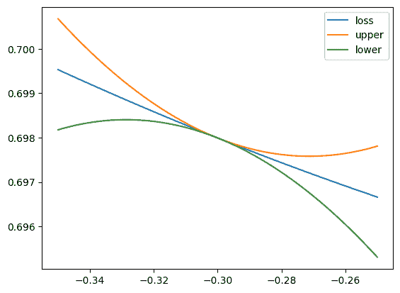
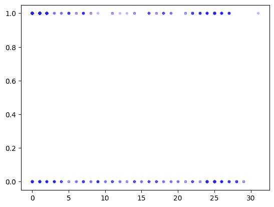
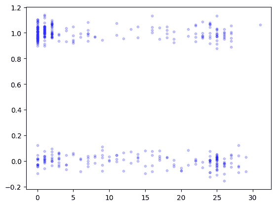
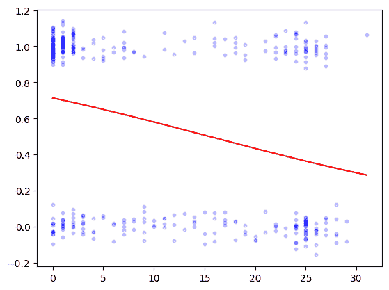

# 3.8\. 在线补充材料#

> 原文：[`mmids-textbook.github.io/chap03_opt/supp/roch-mmids-opt-supp.html`](https://mmids-textbook.github.io/chap03_opt/supp/roch-mmids-opt-supp.html)

## 3.8.1\. 测验、解答、代码等。#

### 3.8.1.1\. 仅代码#

本章中包含的代码的交互式 Jupyter 笔记本可以通过以下链接访问（推荐使用 Google Colab）。鼓励您对其进行实验。一些建议的计算练习散布在其中。笔记本也可以作为幻灯片查看。

+   [笔记本](https://github.com/MMiDS-textbook/MMiDS-textbook.github.io/blob/main/just_the_code/roch_mmids_chap_opt_notebook.ipynb) ([在 Colab 中打开](https://colab.research.google.com/github/MMiDS-textbook/MMiDS-textbook.github.io/blob/main/just_the_code/roch_mmids_chap_opt_notebook.ipynb))

+   [幻灯片](https://raw.githack.com/MMiDS-textbook/MMiDS-textbook.github.io/main/just_the_code/roch_mmids_chap_opt_notebook_slides.slides.html)

### 3.8.1.2\. 自我评估测验#

通过以下链接可以获取更广泛的自我评估测验的网络版本。

+   [第 3.2 节](https://raw.githack.com/MMiDS-textbook/MMiDS-textbook.github.io/main/quizzes/self-assessment/quiz_3_2.html)

+   [第 3.3 节](https://raw.githack.com/MMiDS-textbook/MMiDS-textbook.github.io/main/quizzes/self-assessment/quiz_3_3.html)

+   [第 3.4 节](https://raw.githack.com/MMiDS-textbook/MMiDS-textbook.github.io/main/quizzes/self-assessment/quiz_3_4.html)

+   [第 3.5 节](https://raw.githack.com/MMiDS-textbook/MMiDS-textbook.github.io/main/quizzes/self-assessment/quiz_3_5.html)

+   [第 3.6 节](https://raw.githack.com/MMiDS-textbook/MMiDS-textbook.github.io/main/quizzes/self-assessment/quiz_3_6.html)

### 3.8.1.3\. 自动测验#

本章自动生成的测验可以通过以下链接访问（推荐使用 Google Colab）。

+   [自动测验](https://github.com/MMiDS-textbook/MMiDS-textbook.github.io/blob/main/quizzes/auto_quizzes/roch-mmids-opt-autoquiz.ipynb) ([在 Colab 中打开](https://colab.research.google.com/github/MMiDS-textbook/MMiDS-textbook.github.io/blob/main/quizzes/auto_quizzes/roch-mmids-opt-autoquiz.ipynb))

### 3.8.1.4\. 奇数编号预热练习的解答#

*(在 Claude、Gemini 和 ChatGPT 的帮助下)*

E3.2.1 的答案和解释：

\[\begin{align*} \nabla f(x_1, x_2) &= \left(\frac{\partial f}{\partial x_1}, \frac{\partial f}{\partial x_2}\right) \\ &= (6x_1 - 2x_2 - 5, -2x_1 + 8x_2 + 2). \end{align*}\]

在点 \((1, -1)\)，我们有：

\[ \nabla f(1, -1) = (6(1) - 2(-1) - 5, -2(1) + 8(-1) + 2) = (3, -8). \]

E3.2.3 的答案和解释：

\[\begin{align*} \frac{\partial f}{\partial x_1} &= \cos(x_1) \cos(x_2), \\ \frac{\partial f}{\partial x_2} &= -\sin(x_1) \sin(x_2). \end{align*}\]

在点 \((\frac{\pi}{4}, \frac{\pi}{3})\) 处，我们有：

\[\begin{align*} \frac{\partial f}{\partial x_1}(\frac{\pi}{4}, \frac{\pi}{3}) &= \cos(\frac{\pi}{4}) \cos(\frac{\pi}{3}) = \frac{\sqrt{2}}{2} \cdot \frac{1}{2} = \frac{\sqrt{2}}{4}, \\ \frac{\partial f}{\partial x_2}(\frac{\pi}{4}, \frac{\pi}{3}) &= -\sin(\frac{\pi}{4}) \sin(\frac{\pi}{3}) = -\frac{\sqrt{2}}{2} \cdot \frac{\sqrt{3}}{2} = -\frac{\sqrt{6}}{4}. \end{align*}\]

对 E3.2.5 的答案和解释：函数 \(f(x_1, x_2)\) 的 Hessian 矩阵为：

\[\begin{split} \mathbf{H}_f(x_1, x_2) = \begin{pmatrix} 6x_1 & 6x_2 \\ 6x_2 & 6x_1 - 12x_2 \end{pmatrix}. \end{split}\]

在点 \((1, 2)\) 处，我们有：

\[\begin{split} \mathbf{H}_f(1, 2) = \begin{pmatrix} 6 & 12 \\ 12 & -18 \end{pmatrix}. \end{split}\]

我们可以看到 \(\frac{\partial² f}{\partial x_1 \partial x_2}(1, 2) = \frac{\partial² f}{\partial x_2 \partial x_1}(1, 2) = 12\)，这证实了 Hessian 矩阵对称定理。

对 E3.2.7 的答案和解释：

\[\begin{align*} \frac{\partial² f}{\partial x_1²} &= 2 \sin(x_2), \\ \frac{\partial² f}{\partial x_1 \partial x_2} &= 2x_1 \cos(x_2), \\ \frac{\partial² f}{\partial x_2 \partial x_1} &= 2x_1 \cos(x_2), \\ \frac{\partial² f}{\partial x_2²} &= -x_1² \sin(x_2). \end{align*}\]

对 E3.2.9 的答案和解释：Hessian 矩阵如下：

\[\begin{split} \mathbf{H}_f(x_1, x_2, x_3) = \begin{pmatrix} 2 & -2 & 4 \\ -2 & 4 & -6 \\ 4 & -6 & 6 \end{pmatrix}. \end{split}\]

对 E3.2.11 的答案和解释：\(\frac{\partial f}{\partial x} = 3x²y² - 2y³\) 和 \(\frac{\partial f}{\partial y} = 2x³y - 6xy² + 4y³\)，这是通过对 \(f\) 分别对每个变量求导，同时保持其他变量不变得到的。

对 E3.2.13 的答案和解释：Hessian 矩阵如下：

\[\begin{split} \mathbf{H}_g(x, y) = \begin{pmatrix} -\sin(x) \cos(y) & -\cos(x) \sin(y) \\ -\cos(x) \sin(y) & -\sin(x) \cos(y) \end{pmatrix}. \end{split}\]

对 E3.2.15 的答案和解释：\(\frac{\partial² q}{\partial x²} = 6x\) 和 \(\frac{\partial² q}{\partial y²} = -6x\)。将这两个结果相加得到 \(6x - 6x = 0\)，因此 \(q\) 满足拉普拉斯方程。

对 E3.2.17 的答案和解释：根据链式法则，粒子经历的温度变化率为

\[ \frac{d}{dt}u(\mathbf{c}(t)) = \nabla u(\mathbf{c}(t))^T \mathbf{c}'(t). \]

我们有 \(\nabla u(x, y) = (-2xe^{-x² - y²}, -2ye^{-x² - y²})\) 和 \(\mathbf{c}'(t) = (2t, 3t²)\)。在 \(t = 1\) 处求值得到

\[ \frac{d}{dt}u(\mathbf{c}(1)) = (-2e^{-2}, -2e^{-2})^T (2, 3) = -10e^{-2}. \]

对 E3.2.19 的答案和解释：\(\frac{d}{dt} f(\mathbf{g}(t)) = 2t \cos t - t² \sin t\)。解释：\(\nabla f = (y, x)\)，且 \(\mathbf{g}'(t) = (2t, -\sin t)\)。因此，\(\frac{d}{dt} f(\mathbf{g}(t)) = \cos t \cdot 2t + t² \cdot (-\sin t)\)。

E3.3.1 的答案和证明：\(\nabla f(x_1, x_2) = (2x_1, 4x_2)\)。将其设为零得到\(2x_1 = 0\)和\(4x_2 = 0\)，这意味着\(x_1 = 0\)和\(x_2 = 0\)。因此，\(\nabla f(x_1, x_2) = 0\)的唯一点是\((0, 0)\)。

E3.3.3 的答案和证明：二阶方向导数由\(\frac{\partial² f(\mathbf{x}_0)}{\partial \mathbf{v}²} = \mathbf{v}^T \mathbf{H}_f(\mathbf{x}_0) \mathbf{v}\)给出。我们有\(\mathbf{H}_f(x_1, x_2) = \begin{pmatrix} 2 & 2 \\ 2 & 2 \end{pmatrix}\)。因此，

\[\begin{split} \frac{\partial² f(1, 1)}{\partial \mathbf{v}²} = (\frac{1}{\sqrt{2}}, \frac{1}{\sqrt{2}})^T \begin{pmatrix} 2 & 2 \\ 2 & 2 \end{pmatrix} (\frac{1}{\sqrt{2}}, \frac{1}{\sqrt{2}}) = \frac{1}{2}(2 + 2 + 2 + 2) = 4. \end{split}\]

E3.3.5 的答案和证明：一阶必要条件为：

\[\begin{align*} \nabla_{x_1, x_2} L(x_1, x_2, \lambda) &= 0, \\ h(x_1, x_2) &= 0. \end{align*}\]

计算梯度：

\[\begin{align*} \frac{\partial L}{\partial x_1} &= 2x_1 + \lambda = 0, \\ \frac{\partial L}{\partial x_2} &= 2x_2 + \lambda = 0, \\ x_1 + x_2 &= 1. \end{align*}\]

从前两个方程中，我们得到\(x_1 = x_2 = -\frac{\lambda}{2}\)。将其代入第三个方程：

\[ -\frac{\lambda}{2} - \frac{\lambda}{2} = 1 \implies \lambda = -1. \]

因此，\(x_1 = x_2 = \frac{1}{2}\)，满足一阶必要条件的唯一点是\((\frac{1}{2}, \frac{1}{2}, -1)\)。

E3.3.7 的答案和证明：拉格朗日函数为\(L(x_1, x_2, x_3, \lambda) = x_1² + x_2² + x_3² + \lambda(x_1 + 2x_2 + 3x_3 - 6)\)。一阶必要条件为：

\[\begin{align*} 2x_1 + \lambda &= 0, \\ 2x_2 + 2\lambda &= 0, \\ 2x_3 + 3\lambda &= 0, \\ x_1 + 2x_2 + 3x_3 &= 6. \end{align*}\]

从前三个方程中，我们得到\(x_1 = -\frac{\lambda}{2}\)，\(x_2 = -\lambda\)，\(x_3 = -\frac{3\lambda}{2}\)。将其代入第四个方程：

\[ -\frac{\lambda}{2} - 2\lambda - \frac{9\lambda}{2} = 6 \implies -6\lambda = 6 \implies \lambda = -1. \]

因此，\(x_1 = \frac{1}{2}\)，\(x_2 = 1\)，\(x_3 = \frac{3}{2}\)，满足一阶必要条件的唯一点是\((\frac{1}{2}, 1, \frac{3}{2}, -1)\)。

E3.3.9 的答案和证明：函数\(f\)的梯度为\(\nabla f(x_1, x_2) = (3x_1² - 3x_2², -6x_1x_2)\)。在点\((1, 0)\)，梯度为\(\nabla f(1, 0) = (3, 0)\)。在\((1, 0)\)处沿方向\(\mathbf{v} = (1, 1)\)的函数\(f\)的方向导数为\(\nabla f(1, 0)^T \mathbf{v} = (3, 0)^T (1, 1) = 3\)。由于这是正的，因此\(v\)不是下降方向。

E3.3.11 的答案和证明：函数\(f\)的 Hessian 矩阵为

\[\begin{split} \mathbf{H}_f(x_1, x_2) = \begin{bmatrix} -2 & 0 \\ 0 & -2 \end{bmatrix}. \end{split}\]

因此，\(f\)在\((0, 0)\)处的第二方向导数在方向\(v = (1, 0)\)上是\(\mathbf{v}^T \mathbf{H}_f(0, 0) \mathbf{v} = (1, 0) \begin{bmatrix} -2 & 0 \\ 0 & -2 \end{bmatrix} \begin{pmatrix} 1 \\ 0 \end{pmatrix} = -2\)。

E3.3.13 的答案和证明：Hessian 矩阵是

\[\begin{split} \mathbf{H}_f(1,1) = \begin{pmatrix} 6 & -3 \\ -3 & 6 \end{pmatrix}. \end{split}\]

证明：计算二阶偏导数：

\[ \frac{\partial² f}{\partial x²} = 6x, \quad \frac{\partial² f}{\partial y²} = 6y, \quad \frac{\partial² f}{\partial x \partial y} = \frac{\partial² f}{\partial y \partial x} = -3. \]

在\((1,1)\)处，这些值分别是\(6\)，\(6\)，和\(-3\)。

E3.4.1 的答案和证明：凸组合是：

\[ (1 - \alpha)(2, 3) + \alpha(4, 5) = 0.7(2, 3) + 0.3(4, 5) = (0.7 \cdot 2 + 0.3 \cdot 4, 0.7 \cdot 3 + 0.3 \cdot 5) = (2.6, 3.6). \]

E3.4.3 的答案和证明：\(S_1\)和\(S_2\)是半空间，它们是凸集。根据文本中的引理，凸集的交集也是凸集。因此，\(S_1 \cap S_2\)是凸集。

E3.4.5 的答案和证明：函数\(f\)是一个二次函数，\(P = 2\)，\(q = 2\)，\(r = 1\)。由于\(P > 0\)，\(f\)是严格凸的。通过将梯度设为零找到唯一的全局最小值：

\[ \nabla f(x) = 2x + 2 = 0 \implies x^* = -1. \]

E3.4.7 的答案和证明：\(f\)的 Hessian 矩阵是：

\[\begin{split} \nabla² f(x, y) = \begin{pmatrix} 2 & 0 \\ 0 & 4 \end{pmatrix}. \end{split}\]

对于任意的\((x, y) \in \mathbb{R}²\)，我们有：

\[ \nabla² f(x, y) \succeq 2I_{2 \times 2}, \]

因此，\(f\)是具有\(m = 2\)的强凸函数。

E3.4.9 的答案和证明：\(f\)不是凸的。我们有\(f''(x) = 12x² - 4\)，对于\(x \in (-\frac{1}{\sqrt{3}}, \frac{1}{\sqrt{3}})\)是负的。由于二阶导数不总是非负的，\(f\)不是凸的。

E3.4.11 的答案和证明：\(f\)是强凸的。我们有\(f''(x) = 2 > 0\)，所以\(f\)是 2-强凸的。

E3.4.13 的答案和证明：\(D\)是凸集。为了证明这一点，令\((x_1, y_1), (x_2, y_2) \in D\)和\(\alpha \in (0, 1)\)。我们需要证明\((1 - \alpha)(x_1, y_1) + \alpha(x_2, y_2) \in D\)。计算：

\[ (1 - \alpha)(x_1, y_1) + \alpha(x_2, y_2) = ((1 - \alpha)x_1 + \alpha x_2, (1 - \alpha)y_1 + \alpha y_2). \]

现在，

\[ ((1 - \alpha)x_1 + \alpha x_2)² + ((1 - \alpha)y_1 + \alpha y_2)² < (1 - \alpha)(x_1² + y_1²) + \alpha(x_2² + y_2²) < 4. \]

因此，\(D\)是凸集。

E3.4.15 的答案和证明：\(D\)不是凸集。例如，令\((x_1, y_1) = (2, \sqrt{3})\)和\((x_2, y_2) = (2, -\sqrt{3})\)，它们都在\(D\)中。对于\(\alpha = \frac{1}{2}\)，

\[ (1 - \alpha)(2, \sqrt{3}) + \alpha(2, -\sqrt{3}) = \left(2, 0\right). \]

现在，

\[ \left(2\right)² - \left(0\right)² = 4 > 1. \]

E3.5.1 的答案和解释：梯度是 \(\nabla f(x, y) = (2x, 8y)\)。在 \((1, 1)\) 处，它是 \((2, 8)\)。最速下降的方向是 \(-\nabla f(1, 1) = (-2, -8)\)。

E3.5.3 的答案和解释：\(\nabla f(x) = 3x² - 12x + 9\)。在 \(x_0 = 0\) 处，\(\nabla f(0) = 9\)。第一次迭代给出 \(x_1 = x_0 - \alpha \nabla f(x_0) = 0 - 0.1 \cdot 9 = -0.9\)。在 \(x_1 = -0.9\) 处，\(\nabla f(-0.9) = 3 \cdot (-0.9)² - 12 \cdot (-0.9) + 9 = 2.43 + 10.8 + 9 = 22.23\)。第二次迭代给出 \(x_2 = x_1 - \alpha \nabla f(x_1) = -0.9 - 0.1 \cdot 22.23 = -3.123\)。

E3.5.5 的答案和解释：我们有 \(\nabla f(x) = 2x\)，所以 \(\nabla f(2) = 4\)。因此，梯度下降更新是 \(x_1 = x_0 - \alpha \nabla f(x_0) = 2 - 0.1 \cdot 4 = 1.6\)。

E3.5.7 的答案和解释：对于所有 \(x \in \mathbb{R}\)，\(f''(x) = 4\)。因此，对于所有 \(x \in \mathbb{R}\)，\(f''(x) \geq 4\)，这意味着 \(f\) 是 \(4\)-强凸的。

E3.5.9 的答案和解释：不。我们有 \(f''(x) = 12x²\)，随着 \(x\) 的增加，它可以任意大。因此，不存在常数 \(L\)，使得对于所有 \(x \in \mathbb{R}\)，有 \(-L \le f''(x) \le L\)。

E3.5.11 的答案和解释：对于所有 \(x \in \mathbb{R}\)，我们有 \(f''(x) = 2\)。因此，我们可以取 \(m = 2\)，并且对于所有 \(x \in \mathbb{R}\)，我们有 \(f''(x) \ge 2\)，这是 \(m\)-强凸性的条件。

E3.5.13 的答案和解释：梯度是 \(\nabla f(x, y) = (2x, 2y)\)。在 \((1, 1)\) 处，它是 \((2, 2)\)。第一次更新是 \((0.8, 0.8)\)。在 \((0.8, 0.8)\) 处的梯度是 \((1.6, 1.6)\)。第二次更新是 \((0.64, 0.64)\)。

E3.6.1 的答案和解释：对数几率由 \(\log \frac{p}{1-p} = \log \frac{0.25}{0.75} = \log \frac{1}{3} = -\log 3\) 给出。

E3.6.3 的答案和解释：

\[ \boldsymbol{\alpha}^T \mathbf{x} = (-0.2 \cdot 1) + (0.4 \cdot 3) = -0.2 + 1.2 = 1.0 \]\[ p(\mathbf{x}; \boldsymbol{\alpha}) = \sigma(1.0) = \frac{1}{1 + e^{-1}} \approx 0.731 \]

E3.6.5 的答案和解释：根据商规则，

\[\begin{align*} \sigma'(z) &= \frac{e^{-z}}{(1 + e^{-z})²} = \frac{1}{1 + e^{-z}} \cdot \frac{e^{-z}}{1 + e^{-z}} \\ &= \sigma(z) (1 - \sigma(z)). \end{align*}\]

E3.6.7 的答案和解释：我们有 \(b_1 - \sigma(\boldsymbol{\alpha}_1^T \mathbf{x}) \approx 0.05\)，\(b_2 - \sigma(\boldsymbol{\alpha}_2^T \mathbf{x}) \approx -0.73\)，\(b_3 - \sigma(\boldsymbol{\alpha}_3^T \mathbf{x}) \approx 0.73\)。因此，

\[\begin{align*} \nabla \ell(\mathbf{x}; A, b) &= -\frac{1}{3} \sum_{i=1}³ (b_i - \sigma(\boldsymbol{\alpha}_i^T \mathbf{x})) \boldsymbol{\alpha}_i \\ &\approx -\frac{1}{3} \{(0.05)(1, 2) + (-0.73)(-1, 1) + 0.73(0, -1)\}. \end{align*}\]

E3.6.9 的答案和解释：我们有 \(b_1 - \sigma(\boldsymbol{\alpha}_1^T \mathbf{x}⁰) = 1 - \sigma(0) = 0.5\)，\(b_2 - \sigma(\boldsymbol{\alpha}_2^T \mathbf{x}⁰) = -0.5\)，\(b_3 - \sigma(\boldsymbol{\alpha}_3^T \mathbf{x}⁰) = 0.5\)。因此，

\[\begin{align*} \mathbf{x}¹ &= \mathbf{x}⁰ - \beta \nabla \ell(\mathbf{x}⁰; A, \mathbf{b}) \\ &= (0, 0) + \frac{0.1}{3} \{0.5(1, 2) + (-0.5)(-1, 1) + 0.5(0, -1)\} \\ &= (0.1, 0.05). \end{align*}\]

### 3.8.1.5\. 学习成果#

+   定义多个变量的函数的偏导数和梯度，并计算它们。

+   计算二次连续可微函数的二阶偏导数并构建 Hessian 矩阵。

+   应用链式法则计算多个变量的复合函数的导数。

+   使用链式法则表述并证明多元均值定理的多变量版本。

+   计算多个变量的仿射函数和二次函数的梯度和 Hessian 矩阵。

+   定义无约束优化问题的全局和局部最小值。

+   使用梯度推导局部最小值的一阶必要条件。

+   解释下降方向的概念及其与梯度的关系。

+   解释方向导数的概念，并使用梯度计算方向导数。

+   使用 Hessian 矩阵表述局部最小值的二阶必要和充分条件。

+   计算给定多元函数的梯度和 Hessian 矩阵。

+   表述具有等式约束的优化问题。

+   应用拉格朗日乘数法推导约束局部最小值的一阶必要条件。

+   使用 Hessian 矩阵和拉格朗日乘数验证约束局部最小值的二阶充分条件。

+   分析约束优化问题中的正则性条件。

+   通过找到满足一阶必要条件并检查二阶充分条件的点来解决约束优化问题。

+   定义凸集和凸函数，并给出每个的例子。

+   确定保持集合和函数凸性的操作。

+   使用基于梯度的第一阶凸性条件来表征凸函数。

+   使用基于 Hessian 矩阵的二阶凸性条件确定函数的凸性。

+   解释凸性与优化的关系，特别是凸函数的局部最小值也是全局最小值。

+   表述并证明在 R^d 和凸集上的凸函数的一阶最优性条件。

+   定义强凸性及其对全局最小值存在性和唯一性的影响。

+   分析二次函数和最小二乘目标函数的凸性和强凸性。

+   应用凸性概念解决优化问题，例如找到点在凸集上的投影。

+   定义梯度下降，并解释其作为数值优化方法的动机。

+   证明负梯度是连续可微函数的最速下降方向。

+   分析平滑函数的梯度下降收敛性，证明它产生了一系列具有递减目标值和消失梯度的点。

+   推导出梯度下降在平滑函数上的收敛率，以迭代次数来表示。

+   定义二阶连续可微函数的强凸性，并将其与函数值和梯度联系起来。

+   证明当应用于平滑和强凸函数时，梯度下降具有更快的收敛率，并显示出指数收敛到全局最小值。

+   在 Python 中实现梯度下降，并将其应用于简单示例以说明理论收敛结果。

+   解释 sigmoid 函数在将特征线性函数转换为概率中的作用。

+   推导逻辑回归目标函数（交叉熵损失）的梯度和 Hessian 矩阵。

+   证明逻辑回归目标函数是凸的和光滑的。

+   在 Python 中实现梯度下降以最小化逻辑回归目标函数。

+   将逻辑回归应用于实际数据集。

\(\aleph\)

## 3.8.2. 附加章节#

### 3.8.2.1. 逻辑回归：收敛结果的展示#

我们回到平滑函数收敛性的证明，使用逻辑回归的特殊情况。我们首先定义函数\(\hat{f}\)，\(\mathcal{L}\)和\(\frac{\partial}{\partial x}\mathcal{L}\)。

```py
def fhat(x,a):
    return 1 / ( 1 + np.exp(-np.outer(x,a)) )

def loss(x,a,b): 
    return np.mean(-b*np.log(fhat(x,a)) - (1 - b)*np.log(1 - fhat(x,a)), axis=1)

def grad(x,a,b):
    return -np.mean((b - fhat(x,a))*a, axis=1) 
```

我们在随机数据集上展示 GD（梯度下降）。

```py
seed = 535
rng = np.random.default_rng(seed)

n = 10000
a, b = 2*rng.uniform(0,1,n) - 1, rng.integers(2, size=n) 
```

我们在\(x = x_0\)附近的*平滑函数的二次界限*中绘制上界和下界。结果是我们可以将\(L=1\)，因为所有特征在\(-1\)和\(1\)之间均匀随机。观察发现，最小化上界二次界限会导致\(\mathcal{L}\)的减少。

```py
x0 = -0.3
x = np.linspace(x0-0.05,x0+0.05,100)
upper = loss(x0,a,b) + (x - x0)*grad(x0,a,b) + (1/2)*(x - x0)**2
lower = loss(x0,a,b) + (x - x0)*grad(x0,a,b) - (1/2)*(x - x0)**2

plt.plot(x, loss(x,a,b), label='loss')
plt.plot(x, upper, label='upper')
plt.plot(x, lower, label='lower')
plt.legend()
plt.show() 
```



### 3.8.2.2. 逻辑回归：另一个数据集#

回想一下，为了运行梯度下降，我们首先实现一个计算下降更新的函数。该函数接受一个计算梯度的函数`grad_fn`作为输入，以及当前迭代和步长。现在我们还将数据集作为额外的输入。

```py
def sigmoid(z): 
    return 1/(1+np.exp(-z))

def desc_update_for_logreg(grad_fn, A, b, curr_x, beta):
    gradient = grad_fn(curr_x, A, b)
    return curr_x - beta*gradient

def gd_for_logreg(loss_fn, grad_fn, A, b, init_x, beta=1e-3, niters=int(1e5)):
    curr_x = init_x

    for iter in range(niters):
        curr_x = desc_update_for_logreg(grad_fn, A, b, curr_x, beta)

    return curr_x

def pred_fn(x, A): 
    return sigmoid(A @ x)

def loss_fn(x, A, b): 
    return np.mean(-b*np.log(pred_fn(x, A)) - (1 - b)*np.log(1 - pred_fn(x, A)))

def grad_fn(x, A, b):
    return -A.T @ (b - pred_fn(x, A))/len(b)

def stepsize_for_logreg(A, b):
    L = LA.norm(A)**2 / (4 * len(b))
    return 1/L 
```

我们使用 UC Berkeley 的[DS100](http://www.ds100.org)课程的一个简单数据集进行分析。文件`lebron.csv`可在[此处](https://github.com/MMiDS-textbook/MMiDS-textbook.github.io/tree/main/utils/datasets)找到。引用课程教科书的前一个版本：

> 在篮球中，球员通过将球投进篮筐来得分。勒布朗·詹姆斯就是这样一位球员，他因其惊人的得分能力而被广泛认为是史上最伟大的篮球运动员之一。勒布朗效力于美国最顶级的篮球联赛——国家篮球协会（NBA）。我们使用 NBA 统计网站（[`stats.nba.com/`](https://stats.nba.com/)）收集了 2017 年 NBA 季后赛中勒布朗的所有尝试数据集。

我们首先加载数据并查看其摘要。

```py
data = pd.read_csv('lebron.csv')
data.head() 
```

|  | game_date | minute | opponent | action_type | shot_type | shot_distance | shot_made |
| --- | --- | --- | --- | --- | --- | --- | --- |
| 0 | 20170415 | 10 | IND | 驱动上篮 | 2 分投篮 | 0 | 0 |
| 1 | 20170415 | 11 | IND | 驱动上篮 | 2 分投篮 | 0 | 1 |
| 2 | 20170415 | 14 | IND | 上篮 | 2 分投篮 | 0 | 1 |
| 3 | 20170415 | 15 | IND | 驱动上篮 | 2 分投篮 | 0 | 1 |
| 4 | 20170415 | 18 | IND | 快攻扣篮 | 2 分投篮 | 0 | 1 |

```py
data.describe() 
```

|  | game_date | minute | shot_distance | shot_made |
| --- | --- | --- | --- | --- |
| count | 3.840000e+02 | 384.00000 | 384.000000 | 384.000000 |
| mean | 2.017052e+07 | 24.40625 | 10.695312 | 0.565104 |
| std | 6.948501e+01 | 13.67304 | 10.547586 | 0.496390 |
| min | 2.017042e+07 | 1.00000 | 0.000000 | 0.000000 |
| 25% | 2.017050e+07 | 13.00000 | 1.000000 | 0.000000 |
| 50% | 2.017052e+07 | 25.00000 | 6.500000 | 1.000000 |
| 75% | 2.017060e+07 | 35.00000 | 23.000000 | 1.000000 |
| max | 2.017061e+07 | 48.00000 | 31.000000 | 1.000000 |

我们将关注的两个列是 `shot_distance`（投篮时勒布朗距离篮筐的距离（英尺））和 `shot_made`（如果投篮未命中为 0，如果投篮命中为 1）。如上表所示，平均距离为 `10.6953`，投篮命中的频率为 `0.565104`。我们提取这两个列，并在散点图上显示。

```py
feature = data['shot_distance']
label = data['shot_made']

plt.scatter(feature, label, s=10, color='b', alpha=0.2)
plt.show() 
```



如您所见，这种数据由于具有相同 \(x\) 和 \(y\) 值的点重叠而难以可视化。一个技巧是通过添加高斯噪声稍微抖动 \(y\) 值。我们接下来这样做，并再次绘制。

```py
seed = 535
rng = np.random.default_rng(seed)

label_jitter = label + 0.05*rng.normal(0,1,len(label))

plt.scatter(feature, label_jitter, s=10, color='b', alpha=0.2)
plt.show() 
```



我们将 GD 应用于逻辑回归。我们首先构建数据矩阵 \(A\) 和 \(\mathbf{b}\)。为了允许特征的一次函数，我们添加了一个列，就像之前做的那样。

```py
A = np.stack((np.ones(len(label)),feature),axis=-1)
b = label 
```

我们从 \((0,0)\) 开始运行 GD，步长由上述目标函数的平滑度计算得出。

```py
stepsize = stepsize_for_logreg(A, b)
print(stepsize) 
```

```py
0.017671625306319678 
```

```py
init_x = np.zeros(A.shape[1])
best_x = gd_for_logreg(loss_fn, grad_fn, A, b, init_x, beta=stepsize)
print(best_x) 
```

```py
[ 0.90959003 -0.05890828] 
```

最后我们绘制结果。

```py
grid = np.linspace(np.min(feature), np.max(feature), 100)
feature_grid = np.stack((np.ones(len(grid)),grid),axis=-1)
predict_grid = sigmoid(feature_grid @ best_x)

plt.scatter(feature, label_jitter, s=10, color='b', alpha=0.2)
plt.plot(grid,predict_grid,'r')
plt.show() 
```



## 3.8.1\. 测验、解答、代码等。#

### 3.8.1.1\. 仅代码#

本章中的代码可以在以下位置找到交互式的 Jupyter 笔记本（推荐使用 Google Colab）。鼓励您对其进行尝试。一些建议的计算练习散布在其中。笔记本也可以作为幻灯片查看。

+   [笔记本](https://github.com/MMiDS-textbook/MMiDS-textbook.github.io/blob/main/just_the_code/roch_mmids_chap_opt_notebook.ipynb) ([在 Colab 中打开](https://colab.research.google.com/github/MMiDS-textbook/MMiDS-textbook.github.io/blob/main/just_the_code/roch_mmids_chap_opt_notebook.ipynb))

+   [幻灯片](https://raw.githack.com/MMiDS-textbook/MMiDS-textbook.github.io/main/just_the_code/roch_mmids_chap_opt_notebook_slides.slides.html)

### 3.8.1.2\. 自我评估测验#

通过以下链接可以获取更广泛的自我评估测验的网络版本。

+   [第 3.2 节](https://raw.githack.com/MMiDS-textbook/MMiDS-textbook.github.io/main/quizzes/self-assessment/quiz_3_2.html)

+   [第 3.3 节](https://raw.githack.com/MMiDS-textbook/MMiDS-textbook.github.io/main/quizzes/self-assessment/quiz_3_3.html)

+   [第 3.4 节](https://raw.githack.com/MMiDS-textbook/MMiDS-textbook.github.io/main/quizzes/self-assessment/quiz_3_4.html)

+   [第 3.5 节](https://raw.githack.com/MMiDS-textbook/MMiDS-textbook.github.io/main/quizzes/self-assessment/quiz_3_5.html)

+   [第 3.6 节](https://raw.githack.com/MMiDS-textbook/MMiDS-textbook.github.io/main/quizzes/self-assessment/quiz_3_6.html)

### 3.8.1.3\. 自动测验#

本章的自动生成的测验可以在此处访问（推荐使用 Google Colab）。

+   [自动测验](https://github.com/MMiDS-textbook/MMiDS-textbook.github.io/blob/main/quizzes/auto_quizzes/roch-mmids-opt-autoquiz.ipynb) ([在 Colab 中打开](https://colab.research.google.com/github/MMiDS-textbook/MMiDS-textbook.github.io/blob/main/quizzes/auto_quizzes/roch-mmids-opt-autoquiz.ipynb))

### 3.8.1.4\. 奇数编号预热练习的解答#

*(有 Claude、Gemini 和 ChatGPT 的帮助)*

E3.2.1 的答案和理由：

\[\begin{align*} \nabla f(x_1, x_2) &= \left(\frac{\partial f}{\partial x_1}, \frac{\partial f}{\partial x_2}\right) \\ &= (6x_1 - 2x_2 - 5, -2x_1 + 8x_2 + 2). \end{align*}\]

在点 \((1, -1)\)，我们有：

\[ \nabla f(1, -1) = (6(1) - 2(-1) - 5, -2(1) + 8(-1) + 2) = (3, -8). \]

E3.2.3 的答案和理由：

\[\begin{align*} \frac{\partial f}{\partial x_1} &= \cos(x_1) \cos(x_2), \\ \frac{\partial f}{\partial x_2} &= -\sin(x_1) \sin(x_2). \end{align*}\]

在点 \((\frac{\pi}{4}, \frac{\pi}{3})\)，我们有：

\[\begin{align*} \frac{\partial f}{\partial x_1}(\frac{\pi}{4}, \frac{\pi}{3}) &= \cos(\frac{\pi}{4}) \cos(\frac{\pi}{3}) = \frac{\sqrt{2}}{2} \cdot \frac{1}{2} = \frac{\sqrt{2}}{4}, \\ \frac{\partial f}{\partial x_2}(\frac{\pi}{4}, \frac{\pi}{3}) &= -\sin(\frac{\pi}{4}) \sin(\frac{\pi}{3}) = -\frac{\sqrt{2}}{2} \cdot \frac{\sqrt{3}}{2} = -\frac{\sqrt{6}}{4}. \end{align*}\]

E3.2.5 的答案和解释：函数 \(f(x_1, x_2)\) 的 Hessian 矩阵为：

\[\begin{split} \mathbf{H}_f(x_1, x_2) = \begin{pmatrix} 6x_1 & 6x_2 \\ 6x_2 & 6x_1 - 12x_2 \end{pmatrix}. \end{split}\]

在点 \((1, 2)\) 处，我们有：

\[\begin{split} \mathbf{H}_f(1, 2) = \begin{pmatrix} 6 & 12 \\ 12 & -18 \end{pmatrix}. \end{split}\]

我们可以看到 \(\frac{\partial² f}{\partial x_1 \partial x_2}(1, 2) = \frac{\partial² f}{\partial x_2 \partial x_1}(1, 2) = 12\)，这证实了 Hessian 矩阵对称定理。

E3.2.7 的答案和解释：

\[\begin{align*} \frac{\partial² f}{\partial x_1²} &= 2 \sin(x_2), \\ \frac{\partial² f}{\partial x_1 \partial x_2} &= 2x_1 \cos(x_2), \\ \frac{\partial² f}{\partial x_2 \partial x_1} &= 2x_1 \cos(x_2), \\ \frac{\partial² f}{\partial x_2²} &= -x_1² \sin(x_2). \end{align*}\]

E3.2.9 的答案和解释：Hessian 矩阵由以下给出：

\[\begin{split} \mathbf{H}_f(x_1, x_2, x_3) = \begin{pmatrix} 2 & -2 & 4 \\ -2 & 4 & -6 \\ 4 & -6 & 6 \end{pmatrix}. \end{split}\]

E3.2.11 的答案和解释：通过对 \(f\) 分别对每个变量求导（保持其他变量不变），得到 \(\frac{\partial f}{\partial x} = 3x²y² - 2y³\) 和 \(\frac{\partial f}{\partial y} = 2x³y - 6xy² + 4y³\)。

E3.2.13 的答案和解释：Hessian 矩阵由以下给出：

\[\begin{split} \mathbf{H}_g(x, y) = \begin{pmatrix} -\sin(x) \cos(y) & -\cos(x) \sin(y) \\ -\cos(x) \sin(y) & -\sin(x) \cos(y) \end{pmatrix}. \end{split}\]

E3.2.15 的答案和解释：\(\frac{\partial² q}{\partial x²} = 6x\) 和 \(\frac{\partial² q}{\partial y²} = -6x\)。将这两个结果相加得到 \(6x - 6x = 0\)，因此 \(q\) 满足拉普拉斯方程。

E3.2.17 的答案和解释：根据链式法则，粒子所经历的温度变化率为

\[ \frac{d}{dt}u(\mathbf{c}(t)) = \nabla u(\mathbf{c}(t))^T \mathbf{c}'(t). \]

我们有 \(\nabla u(x, y) = (-2xe^{-x² - y²}, -2ye^{-x² - y²})\) 和 \(\mathbf{c}'(t) = (2t, 3t²)\)。在 \(t = 1\) 时计算得

\[ \frac{d}{dt}u(\mathbf{c}(1)) = (-2e^{-2}, -2e^{-2})^T (2, 3) = -10e^{-2}. \]

E3.2.19 的答案和解释：\(\frac{d}{dt} f(\mathbf{g}(t)) = 2t \cos t - t² \sin t\)。解释：\(\nabla f = (y, x)\)，且 \(\mathbf{g}'(t) = (2t, -\sin t)\)。因此，\(\frac{d}{dt} f(\mathbf{g}(t)) = \cos t \cdot 2t + t² \cdot (-\sin t)\)。

对 E3.3.1 的答案和解释：\(\nabla f(x_1, x_2) = (2x_1, 4x_2)\)。将其设为零得到 \(2x_1 = 0\) 和 \(4x_2 = 0\)，这意味着 \(x_1 = 0\) 和 \(x_2 = 0\)。因此，唯一使 \(\nabla f(x_1, x_2) = 0\) 的点是 \((0, 0)\)。

对 E3.3.3 的答案和解释：二阶偏导数由 \(\frac{\partial² f(\mathbf{x}_0)}{\partial \mathbf{v}²} = \mathbf{v}^T \mathbf{H}_f(\mathbf{x}_0) \mathbf{v}\) 给出。我们有 \(\mathbf{H}_f(x_1, x_2) = \begin{pmatrix} 2 & 2 \\ 2 & 2 \end{pmatrix}\)。因此，

\[\begin{split} \frac{\partial² f(1, 1)}{\partial \mathbf{v}²} = (\frac{1}{\sqrt{2}}, \frac{1}{\sqrt{2}})^T \begin{pmatrix} 2 & 2 \\ 2 & 2 \end{pmatrix} (\frac{1}{\sqrt{2}}, \frac{1}{\sqrt{2}}) = \frac{1}{2}(2 + 2 + 2 + 2) = 4. \end{split}\]

对 E3.3.5 的答案和解释：一阶必要条件是：

\[\begin{align*} \nabla_{x_1, x_2} L(x_1, x_2, \lambda) &= 0, \\ h(x_1, x_2) &= 0. \end{align*}\]

计算梯度：

\[\begin{align*} \frac{\partial L}{\partial x_1} &= 2x_1 + \lambda = 0, \\ \frac{\partial L}{\partial x_2} &= 2x_2 + \lambda = 0, \\ x_1 + x_2 &= 1. \end{align*}\]

从前两个方程中，我们得到 \(x_1 = x_2 = -\frac{\lambda}{2}\)。将其代入第三个方程：

\[ -\frac{\lambda}{2} - \frac{\lambda}{2} = 1 \implies \lambda = -1. \]

因此，\(x_1 = x_2 = \frac{1}{2}\)，并且满足一阶必要条件的唯一点是 \((\frac{1}{2}, \frac{1}{2}, -1)\)。

对 E3.3.7 的答案和解释：拉格朗日函数是 \(L(x_1, x_2, x_3, \lambda) = x_1² + x_2² + x_3² + \lambda(x_1 + 2x_2 + 3x_3 - 6)\)。一阶必要条件是：

\[\begin{align*} 2x_1 + \lambda &= 0, \\ 2x_2 + 2\lambda &= 0, \\ 2x_3 + 3\lambda &= 0, \\ x_1 + 2x_2 + 3x_3 &= 6. \end{align*}\]

从前三个方程中，我们得到 \(x_1 = -\frac{\lambda}{2}\)，\(x_2 = -\lambda\)，\(x_3 = -\frac{3\lambda}{2}\)。将这些值代入第四个方程：

\[ -\frac{\lambda}{2} - 2\lambda - \frac{9\lambda}{2} = 6 \implies -6\lambda = 6 \implies \lambda = -1. \]

因此，\(x_1 = \frac{1}{2}\)，\(x_2 = 1\)，\(x_3 = \frac{3}{2}\)，并且满足一阶必要条件的唯一点是 \((\frac{1}{2}, 1, \frac{3}{2}, -1)\)。

对 E3.3.9 的答案和解释：函数 \(f\) 的梯度是 \(\nabla f(x_1, x_2) = (3x_1² - 3x_2², -6x_1x_2)\)。在点 \((1, 0)\) 处，梯度是 \(\nabla f(1, 0) = (3, 0)\)。在方向 \(\mathbf{v} = (1, 1)\) 上，函数 \(f\) 在点 \((1, 0)\) 的方向导数是 \(\nabla f(1, 0)^T \mathbf{v} = (3, 0)^T (1, 1) = 3\)。由于这是正的，因此 \(v\) 不是下降方向。

对 E3.3.11 的答案和解释：函数 \(f\) 的 Hessian 矩阵是

\[\begin{split} \mathbf{H}_f(x_1, x_2) = \begin{bmatrix} -2 & 0 \\ 0 & -2 \end{bmatrix}. \end{split}\]

因此，\(f\) 在 \((0, 0)\) 处沿方向 \(v = (1, 0)\) 的二阶方向导数是 \(\mathbf{v}^T \mathbf{H}_f(0, 0) \mathbf{v} = (1, 0) \begin{bmatrix} -2 & 0 \\ 0 & -2 \end{bmatrix} \begin{pmatrix} 1 \\ 0 \end{pmatrix} = -2\).

E3.3.13 的答案和证明：Hessian 矩阵是

\[\begin{split} \mathbf{H}_f(1,1) = \begin{pmatrix} 6 & -3 \\ -3 & 6 \end{pmatrix}. \end{split}\]

证明：计算二阶偏导数：

\[ \frac{\partial² f}{\partial x²} = 6x, \quad \frac{\partial² f}{\partial y²} = 6y, \quad \frac{\partial² f}{\partial x \partial y} = \frac{\partial² f}{\partial y \partial x} = -3. \]

在 \((1,1)\) 处，这些值分别是 \(6\)，\(6\) 和 \(-3\)。

E3.4.1 的答案和证明：凸组合是：

\[ (1 - \alpha)(2, 3) + \alpha(4, 5) = 0.7(2, 3) + 0.3(4, 5) = (0.7 \cdot 2 + 0.3 \cdot 4, 0.7 \cdot 3 + 0.3 \cdot 5) = (2.6, 3.6). \]

E3.4.3 的答案和证明：\(S_1\) 和 \(S_2\) 是半空间，它们是凸集。根据文本中的引理，凸集的交集也是凸的。因此，\(S_1 \cap S_2\) 是一个凸集。

E3.4.5 的答案和证明：函数 \(f\) 是一个二次函数，具有 \(P = 2\)，\(q = 2\)，和 \(r = 1\)。由于 \(P > 0\)，\(f\) 是严格凸的。通过将梯度设为零找到唯一的全局最小值：

\[ \nabla f(x) = 2x + 2 = 0 \implies x^* = -1. \]

E3.4.7 的答案和证明：\(f\) 的 Hessian 矩阵是：

\[\begin{split} \nabla² f(x, y) = \begin{pmatrix} 2 & 0 \\ 0 & 4 \end{pmatrix}. \end{split}\]

对于任意的 \((x, y) \in \mathbb{R}²\)，我们有：

\[ \nabla² f(x, y) \succeq 2I_{2 \times 2}, \]

因此，\(f\) 是具有 \(m = 2\) 的强凸函数。

E3.4.9 的答案和证明：\(f\) 不是凸函数。我们有 \(f''(x) = 12x² - 4\)，对于 \(x \in (-\frac{1}{\sqrt{3}}, \frac{1}{\sqrt{3}})\) 是负的。由于二阶导数不总是非负的，\(f\) 不是凸函数。

E3.4.11 的答案和证明：\(f\) 是强凸的。我们有 \(f''(x) = 2 > 0\)，所以 \(f\) 是 2-强凸的。

E3.4.13 的答案和证明：\(D\) 是凸的。为了证明这一点，设 \((x_1, y_1), (x_2, y_2) \in D\) 和 \(\alpha \in (0, 1)\)。我们需要证明 \((1 - \alpha)(x_1, y_1) + \alpha(x_2, y_2) \in D\)。计算：

\[ (1 - \alpha)(x_1, y_1) + \alpha(x_2, y_2) = ((1 - \alpha)x_1 + \alpha x_2, (1 - \alpha)y_1 + \alpha y_2). \]

现在，

\[ ((1 - \alpha)x_1 + \alpha x_2)² + ((1 - \alpha)y_1 + \alpha y_2)² < (1 - \alpha)(x_1² + y_1²) + \alpha(x_2² + y_2²) < 4. \]

因此，\(D\) 是凸的。

E3.4.15 的答案和证明：\(D\) 不是凸的。例如，设 \((x_1, y_1) = (2, \sqrt{3})\) 和 \((x_2, y_2) = (2, -\sqrt{3})\)，它们都在 \(D\) 中。对于 \(\alpha = \frac{1}{2}\)，

\[ (1 - \alpha)(2, \sqrt{3}) + \alpha(2, -\sqrt{3}) = \left(2, 0\right). \]

现在，

\[ \left(2\right)² - \left(0\right)² = 4 > 1. \]

E3.5.1 的答案和解释：梯度是 \(\nabla f(x, y) = (2x, 8y)\)。在 \((1, 1)\) 处，它是 \((2, 8)\)。最速下降的方向是 \(-\nabla f(1, 1) = (-2, -8)\)。

E3.5.3 的答案和解释：\(\nabla f(x) = 3x² - 12x + 9\)。在 \(x_0 = 0\) 时，\(\nabla f(0) = 9\)。第一次迭代给出 \(x_1 = x_0 - \alpha \nabla f(x_0) = 0 - 0.1 \cdot 9 = -0.9\)。在 \(x_1 = -0.9\) 时，\(\nabla f(-0.9) = 3 \cdot (-0.9)² - 12 \cdot (-0.9) + 9 = 2.43 + 10.8 + 9 = 22.23\)。第二次迭代给出 \(x_2 = x_1 - \alpha \nabla f(x_1) = -0.9 - 0.1 \cdot 22.23 = -3.123\)。

E3.5.5 的答案和解释：我们有 \(\nabla f(x) = 2x\)，所以 \(\nabla f(2) = 4\)。因此，梯度下降更新为 \(x_1 = x_0 - \alpha \nabla f(x_0) = 2 - 0.1 \cdot 4 = 1.6\)。

E3.5.7 的答案和解释：对于所有 \(x \in \mathbb{R}\)，\(f''(x) = 4\)。因此，对于所有 \(x \in \mathbb{R}\)，\(f''(x) \geq 4\)，这意味着 \(f\) 是 \(4\)-强凸的。

E3.5.9 的答案和解释：不。我们有 \(f''(x) = 12x²\)，随着 \(x\) 的增加，它可以变得任意大。因此，不存在常数 \(L\)，使得对于所有 \(x \in \mathbb{R}\)，\(-L \le f''(x) \le L\)。

E3.5.11 的答案和解释：对于所有 \(x \in \mathbb{R}\)，\(f''(x) = 2\)。因此，我们可以取 \(m = 2\)，并且对于所有 \(x \in \mathbb{R}\)，\(f''(x) \ge 2\)，这是 \(m\)-强凸的条件。

E3.5.13 的答案和解释：梯度是 \(\nabla f(x, y) = (2x, 2y)\)。在 \((1, 1)\) 处，它是 \((2, 2)\)。第一次更新是 \((0.8, 0.8)\)。在 \((0.8, 0.8)\) 处的梯度是 \((1.6, 1.6)\)。第二次更新是 \((0.64, 0.64)\)。

E3.6.1 的答案和解释：对数几率由 \(\log \frac{p}{1-p} = \log \frac{0.25}{0.75} = \log \frac{1}{3} = -\log 3\) 给出。

E3.6.3 的答案和解释：

\[ \boldsymbol{\alpha}^T \mathbf{x} = (-0.2 \cdot 1) + (0.4 \cdot 3) = -0.2 + 1.2 = 1.0 \]\[ p(\mathbf{x}; \boldsymbol{\alpha}) = \sigma(1.0) = \frac{1}{1 + e^{-1}} \approx 0.731 \]

E3.6.5 的答案和解释：根据商规则，

\[\begin{align*} \sigma'(z) &= \frac{e^{-z}}{(1 + e^{-z})²} = \frac{1}{1 + e^{-z}} \cdot \frac{e^{-z}}{1 + e^{-z}} \\ &= \sigma(z) (1 - \sigma(z)). \end{align*}\]

E3.6.7 的答案和解释：我们有 \(b_1 - \sigma(\boldsymbol{\alpha}_1^T \mathbf{x}) \approx 0.05\), \(b_2 - \sigma(\boldsymbol{\alpha}_2^T \mathbf{x}) \approx -0.73\), \(b_3 - \sigma(\boldsymbol{\alpha}_3^T \mathbf{x}) \approx 0.73\)。因此，

\[\begin{align*} \nabla \ell(\mathbf{x}; A, b) &= -\frac{1}{3} \sum_{i=1}³ (b_i - \sigma(\boldsymbol{\alpha}_i^T \mathbf{x})) \boldsymbol{\alpha}_i \\ &\approx -\frac{1}{3} \{(0.05)(1, 2) + (-0.73)(-1, 1) + 0.73(0, -1)\}. \end{align*}\]

E3.6.9 的答案和解释：我们有 \(b_1 - \sigma(\boldsymbol{\alpha}_1^T \mathbf{x}⁰) = 1 - \sigma(0) = 0.5\), \(b_2 - \sigma(\boldsymbol{\alpha}_2^T \mathbf{x}⁰) = -0.5\), \(b_3 - \sigma(\boldsymbol{\alpha}_3^T \mathbf{x}⁰) = 0.5\)。因此，

\[\begin{align*} \mathbf{x}¹ &= \mathbf{x}⁰ - \beta \nabla \ell(\mathbf{x}⁰; A, \mathbf{b}) \\ &= (0, 0) + \frac{0.1}{3} \{0.5(1, 2) + (-0.5)(-1, 1) + 0.5(0, -1)\} \\ &= (0.1, 0.05). \end{align*}\]

### 3.8.1.5\. 学习成果#

+   定义并计算多个变量函数的偏导数和梯度。

+   计算二次连续可微函数的二阶偏导数并构建 Hessian 矩阵。

+   将链式法则应用于计算多个变量的复合函数的导数。

+   使用链式法则陈述并证明多元函数的平均值定理。

+   计算多个变量的仿射函数和二次函数的梯度和 Hessian 矩阵。

+   定义无约束优化问题的全局和局部最小值。

+   使用梯度推导局部最小值的一阶必要条件。

+   解释下降方向的概念及其与梯度的关系。

+   解释方向导数的概念，并使用梯度计算方向导数。

+   使用 Hessian 矩阵陈述局部最小值的二阶必要和充分条件。

+   计算给定多变量函数的梯度和 Hessian 矩阵。

+   表达具有等式约束的优化问题。

+   应用拉格朗日乘数法推导约束局部最小值的一阶必要条件。

+   使用 Hessian 矩阵和拉格朗日乘数验证约束局部最小值的二阶充分条件。

+   在约束优化问题的背景下分析正则性条件。

+   通过找到满足一阶必要条件并检查二阶充分条件的点来解决约束优化问题。

+   定义凸集和凸函数，并给出每个的例子。

+   识别保持集合和函数凸性的操作。

+   基于梯度定义凸函数的一阶凸性条件。

+   使用基于 Hessian 矩阵的二阶凸性条件确定函数的凸性。

+   解释凸性与优化之间的关系，特别是凸函数的局部最小值也是全局最小值。

+   陈述并证明在 R^d 和凸集上的凸函数的一阶最优条件。

+   定义强凸性及其对全局最小值存在性和唯一性的影响。

+   分析二次函数和最小二乘目标函数的凸性和强凸性。

+   应用凸性概念解决优化问题，例如找到点在凸集上的投影。

+   定义梯度下降并解释其作为数值优化方法的动机。

+   证明负梯度是连续可微函数的最速下降方向。

+   分析平滑函数梯度下降的收敛性，证明它产生了一系列具有递减目标值和消失梯度的点。

+   以迭代次数为标准，推导出平滑函数梯度下降的收敛速度。

+   为二阶连续可微函数定义强凸性，并将其与函数值和梯度联系起来。

+   证明当梯度下降应用于平滑且强凸函数时，其收敛速度更快，并展示出指数级收敛到全局最小值。

+   在 Python 中实现梯度下降并将其应用于简单示例，以说明理论收敛结果。

+   解释 sigmoid 函数在将特征线性函数转换为概率中的作用。

+   推导逻辑回归目标函数（交叉熵损失）的梯度和 Hessian 矩阵。

+   证明逻辑回归目标函数是凸函数且光滑。

+   在 Python 中实现梯度下降以最小化逻辑回归目标函数。

+   将逻辑回归应用于实际数据集。

\(\aleph\)

### 3.8.1.1\. 仅代码#

以下可以访问一个包含本章代码的交互式 Jupyter 笔记本（推荐使用 Google Colab）。鼓励您对其进行实验。一些建议的计算练习散布在笔记本中。笔记本也可以作为幻灯片查看。

+   [笔记本](https://github.com/MMiDS-textbook/MMiDS-textbook.github.io/blob/main/just_the_code/roch_mmids_chap_opt_notebook.ipynb) ([在 Colab 中打开](https://colab.research.google.com/github/MMiDS-textbook/MMiDS-textbook.github.io/blob/main/just_the_code/roch_mmids_chap_opt_notebook.ipynb))

+   [幻灯片](https://raw.githack.com/MMiDS-textbook/MMiDS-textbook.github.io/main/just_the_code/roch_mmids_chap_opt_notebook_slides.slides.html)

### 3.8.1.2\. 自我评估测验#

通过以下链接可以访问更全面的自我评估测验的网页版本。

+   [第 3.2 节](https://raw.githack.com/MMiDS-textbook/MMiDS-textbook.github.io/main/quizzes/self-assessment/quiz_3_2.html)

+   [第 3.3 节](https://raw.githack.com/MMiDS-textbook/MMiDS-textbook.github.io/main/quizzes/self-assessment/quiz_3_3.html)

+   [第 3.4 节](https://raw.githack.com/MMiDS-textbook/MMiDS-textbook.github.io/main/quizzes/self-assessment/quiz_3_4.html)

+   [第 3.5 节](https://raw.githack.com/MMiDS-textbook/MMiDS-textbook.github.io/main/quizzes/self-assessment/quiz_3_5.html)

+   [第 3.6 节](https://raw.githack.com/MMiDS-textbook/MMiDS-textbook.github.io/main/quizzes/self-assessment/quiz_3_6.html)

### 3.8.1.3\. 自动测验#

本章自动生成的测验可以在以下链接中访问（推荐使用 Google Colab）。

+   [自动测验](https://github.com/MMiDS-textbook/MMiDS-textbook.github.io/blob/main/quizzes/auto_quizzes/roch-mmids-opt-autoquiz.ipynb) ([在 Colab 中打开](https://colab.research.google.com/github/MMiDS-textbook/MMiDS-textbook.github.io/blob/main/quizzes/auto_quizzes/roch-mmids-opt-autoquiz.ipynb))

### 3.8.1.4\. 奇数练习题的解答#

*(在 Claude、Gemini 和 ChatGPT 的帮助下)*

E3.2.1 的答案和解释：

\[\begin{align*} \nabla f(x_1, x_2) &= \left(\frac{\partial f}{\partial x_1}, \frac{\partial f}{\partial x_2}\right) \\ &= (6x_1 - 2x_2 - 5, -2x_1 + 8x_2 + 2). \end{align*}\]

在点\((1, -1)\)处，我们有：

\[ \nabla f(1, -1) = (6(1) - 2(-1) - 5, -2(1) + 8(-1) + 2) = (3, -8). \]

E3.2.3 的答案和解释：

\[\begin{align*} \frac{\partial f}{\partial x_1} &= \cos(x_1) \cos(x_2), \\ \frac{\partial f}{\partial x_2} &= -\sin(x_1) \sin(x_2). \end{align*}\]

在点\((\frac{\pi}{4}, \frac{\pi}{3})\)处，我们有：

\[\begin{align*} \frac{\partial f}{\partial x_1}\left(\frac{\pi}{4}, \frac{\pi}{3}\right) &= \cos\left(\frac{\pi}{4}\right) \cos\left(\frac{\pi}{3}\right) = \frac{\sqrt{2}}{2} \cdot \frac{1}{2} = \frac{\sqrt{2}}{4}, \\ \frac{\partial f}{\partial x_2}\left(\frac{\pi}{4}, \frac{\pi}{3}\right) &= -\sin\left(\frac{\pi}{4}\right) \sin\left(\frac{\pi}{3}\right) = -\frac{\sqrt{2}}{2} \cdot \frac{\sqrt{3}}{2} = -\frac{\sqrt{6}}{4}. \end{align*}\]

E3.2.5 的答案和解释：函数\(f(x_1, x_2)\)的 Hessian 矩阵为：

\[\begin{split} \mathbf{H}_f(x_1, x_2) = \begin{pmatrix} 6x_1 & 6x_2 \\ 6x_2 & 6x_1 - 12x_2 \end{pmatrix}. \end{split}\]

在点\((1, 2)\)处，我们有：

\[\begin{split} \mathbf{H}_f(1, 2) = \begin{pmatrix} 6 & 12 \\ 12 & -18 \end{pmatrix}. \end{split}\]

我们可以看到\(\frac{\partial² f}{\partial x_1 \partial x_2}(1, 2) = \frac{\partial² f}{\partial x_2 \partial x_1}(1, 2) = 12\)，这证实了 Hessian 矩阵对称定理。

E3.2.7 的答案和解释：

\[\begin{align*} \frac{\partial² f}{\partial x_1²} &= 2 \sin(x_2), \\ \frac{\partial² f}{\partial x_1 \partial x_2} &= 2x_1 \cos(x_2), \\ \frac{\partial² f}{\partial x_2 \partial x_1} &= 2x_1 \cos(x_2), \\ \frac{\partial² f}{\partial x_2²} &= -x_1² \sin(x_2). \end{align*}\]

E3.2.9 的答案和解释：Hessian 矩阵如下：

\[\begin{split} \mathbf{H}_f(x_1, x_2, x_3) = \begin{pmatrix} 2 & -2 & 4 \\ -2 & 4 & -6 \\ 4 & -6 & 6 \end{pmatrix}. \end{split}\]

E3.2.11 的答案和解释：通过对\(f\)分别对每个变量求导，同时保持其他变量不变，得到\(\frac{\partial f}{\partial x} = 3x²y² - 2y³\)和\(\frac{\partial f}{\partial y} = 2x³y - 6xy² + 4y³\)。

E3.2.13 的答案和解释：Hessian 矩阵如下

\[\begin{split} \mathbf{H}_g(x, y) = \begin{pmatrix} -\sin(x) \cos(y) & -\cos(x) \sin(y) \\ -\cos(x) \sin(y) & -\sin(x) \cos(y) \end{pmatrix}. \end{split}\]

E3.2.15 的答案和解释：\(\frac{\partial² q}{\partial x²} = 6x\) 和 \(\frac{\partial² q}{\partial y²} = -6x\)。将它们相加得到 \(6x - 6x = 0\)，因此 \(q\) 满足拉普拉斯方程。

E3.2.17 的答案和解释：根据链式法则，粒子经历的温度变化率为

\[ \frac{d}{dt}u(\mathbf{c}(t)) = \nabla u(\mathbf{c}(t))^T \mathbf{c}'(t). \]

我们有 \(\nabla u(x, y) = (-2xe^{-x² - y²}, -2ye^{-x² - y²})\) 和 \(\mathbf{c}'(t) = (2t, 3t²)\)。在 \(t = 1\) 时计算得到

\[ \frac{d}{dt}u(\mathbf{c}(1)) = (-2e^{-2}, -2e^{-2})^T (2, 3) = -10e^{-2}. \]

E3.2.19 的答案和解释：\(\frac{d}{dt} f(\mathbf{g}(t)) = 2t \cos t - t² \sin t\). 解释：\(\nabla f = (y, x)\)，且 \(\mathbf{g}'(t) = (2t, -\sin t)\)。然后，\(\frac{d}{dt} f(\mathbf{g}(t)) = \cos t \cdot 2t + t² \cdot (-\sin t)\)。

E3.3.1 的答案和解释：\(\nabla f(x_1, x_2) = (2x_1, 4x_2)\)。将其设置为等于零得到 \(2x_1 = 0\) 和 \(4x_2 = 0\)，这意味着 \(x_1 = 0\) 和 \(x_2 = 0\)。因此，\(\nabla f(x_1, x_2) = 0\) 的唯一点是 \((0, 0)\)。

E3.3.3 的答案和解释：二阶方向导数由 \(\frac{\partial² f(\mathbf{x}_0)}{\partial \mathbf{v}²} = \mathbf{v}^T \mathbf{H}_f(\mathbf{x}_0) \mathbf{v}\) 给出。我们有 \(\mathbf{H}_f(x_1, x_2) = \begin{pmatrix} 2 & 2 \\ 2 & 2 \end{pmatrix}\)。因此，

\[\begin{split} \frac{\partial² f(1, 1)}{\partial \mathbf{v}²} = (\frac{1}{\sqrt{2}}, \frac{1}{\sqrt{2}})^T \begin{pmatrix} 2 & 2 \\ 2 & 2 \end{pmatrix} (\frac{1}{\sqrt{2}}, \frac{1}{\sqrt{2}}) = \frac{1}{2}(2 + 2 + 2 + 2) = 4. \end{split}\]

E3.3.5 的答案和解释：一阶必要条件为：

\[\begin{align*} \nabla_{x_1, x_2} L(x_1, x_2, \lambda) &= 0, \\ h(x_1, x_2) &= 0. \end{align*}\]

计算梯度：

\[\begin{align*} \frac{\partial L}{\partial x_1} &= 2x_1 + \lambda = 0, \\ \frac{\partial L}{\partial x_2} &= 2x_2 + \lambda = 0, \\ x_1 + x_2 &= 1. \end{align*}\]

从前两个方程，我们得到 \(x_1 = x_2 = -\frac{\lambda}{2}\)。将其代入第三个方程：

\[ -\frac{\lambda}{2} - \frac{\lambda}{2} = 1 \implies \lambda = -1. \]

因此，\(x_1 = x_2 = \frac{1}{2}\)，唯一满足一阶必要条件的点是 \((\frac{1}{2}, \frac{1}{2}, -1)\)。

E3.3.7 的答案和解释：拉格朗日函数为 \(L(x_1, x_2, x_3, \lambda) = x_1² + x_2² + x_3² + \lambda(x_1 + 2x_2 + 3x_3 - 6)\)。一阶必要条件为：

\[\begin{align*} 2x_1 + \lambda &= 0, \\ 2x_2 + 2\lambda &= 0, \\ 2x_3 + 3\lambda &= 0, \\ x_1 + 2x_2 + 3x_3 &= 6. \end{align*}\]

从前三个方程，我们得到 \(x_1 = -\frac{\lambda}{2}\)，\(x_2 = -\lambda\)，\(x_3 = -\frac{3\lambda}{2}\)。将其代入第四个方程：

\[ -\frac{\lambda}{2} - 2\lambda - \frac{9\lambda}{2} = 6 \implies -6\lambda = 6 \implies \lambda = -1. \]

因此，\(x_1 = \frac{1}{2}\)，\(x_2 = 1\)，\(x_3 = \frac{3}{2}\)，并且唯一满足一阶必要条件的点是 \((\frac{1}{2}, 1, \frac{3}{2}, -1)\)。

E3.3.9 的答案和证明：\(f\) 的梯度是 \(\nabla f(x_1, x_2) = (3x_1² - 3x_2², -6x_1x_2)\)。在点 \((1, 0)\) 处，梯度是 \(\nabla f(1, 0) = (3, 0)\)。\(f\) 在 \((1, 0)\) 处沿 \(\mathbf{v} = (1, 1)\) 方向的方向导数是 \(\nabla f(1, 0)^T \mathbf{v} = (3, 0)^T (1, 1) = 3\)。由于这是正的，\(v\) 不是下降方向。

E3.3.11 的答案和证明：\(f\) 的 Hessian 矩阵是

\[\begin{split} \mathbf{H}_f(x_1, x_2) = \begin{bmatrix} -2 & 0 \\ 0 & -2 \end{bmatrix}. \end{split}\]

因此，\(f\) 在 \((0, 0)\) 处沿 \(v = (1, 0)\) 方向的二阶方向导数是 \(\mathbf{v}^T \mathbf{H}_f(0, 0) \mathbf{v} = (1, 0) \begin{bmatrix} -2 & 0 \\ 0 & -2 \end{bmatrix} \begin{pmatrix} 1 \\ 0 \end{pmatrix} = -2\).

E3.3.13 的答案和证明：Hessian 矩阵是

\[\begin{split} \mathbf{H}_f(1,1) = \begin{pmatrix} 6 & -3 \\ -3 & 6 \end{pmatrix}. \end{split}\]

证明：计算二阶偏导数：

\[ \frac{\partial² f}{\partial x²} = 6x, \quad \frac{\partial² f}{\partial y²} = 6y, \quad \frac{\partial² f}{\partial x \partial y} = \frac{\partial² f}{\partial y \partial x} = -3. \]

在 \((1,1)\) 处，这些值分别是 \(6\)，\(6\)，和 \(-3\)。

E3.4.1 的答案和证明：凸组合是：

\[ (1 - \alpha)(2, 3) + \alpha(4, 5) = 0.7(2, 3) + 0.3(4, 5) = (0.7 \cdot 2 + 0.3 \cdot 4, 0.7 \cdot 3 + 0.3 \cdot 5) = (2.6, 3.6). \]

E3.4.3 的答案和证明：\(S_1\) 和 \(S_2\) 是半空间，它们是凸集。根据文本中的引理，凸集的交集也是凸集。因此，\(S_1 \cap S_2\) 是一个凸集。

E3.4.5 的答案和证明：函数 \(f\) 是一个二次函数，\(P = 2\)，\(q = 2\)，\(r = 1\)。由于 \(P > 0\)，\(f\) 是严格凸函数。通过将梯度设为零找到唯一的全局最小值：

\[ \nabla f(x) = 2x + 2 = 0 \implies x^* = -1. \]

E3.4.7 的答案和证明：\(f\) 的 Hessian 矩阵是：

\[\begin{split} \nabla² f(x, y) = \begin{pmatrix} 2 & 0 \\ 0 & 4 \end{pmatrix}. \end{split}\]

对于任意的 \((x, y) \in \mathbb{R}²\)，我们有：

\[ \nabla² f(x, y) \succeq 2I_{2 \times 2}, \]

因此，\(f\) 是具有 \(m = 2\) 的强凸函数。

E3.4.9 的答案和证明：\(f\) 不是凸函数。我们有 \(f''(x) = 12x² - 4\)，对于 \(x \in (-\frac{1}{\sqrt{3}}, \frac{1}{\sqrt{3}})\) 是负的。由于二阶导数不总是非负的，\(f\) 不是凸函数。

E3.4.11 的答案和证明：\(f\) 是强凸函数。我们有 \(f''(x) = 2 > 0\)，所以 \(f\) 是 2-强凸函数。

E3.4.13 的答案和解释：\(D\) 是凸的。为了证明这一点，设 \((x_1, y_1), (x_2, y_2) \in D\) 且 \(\alpha \in (0, 1)\)。我们需要证明 \((1 - \alpha)(x_1, y_1) + \alpha(x_2, y_2) \in D\)。计算：

\[ (1 - \alpha)(x_1, y_1) + \alpha(x_2, y_2) = ((1 - \alpha)x_1 + \alpha x_2, (1 - \alpha)y_1 + \alpha y_2). \]

现在，

\[ ((1 - \alpha)x_1 + \alpha x_2)² + ((1 - \alpha)y_1 + \alpha y_2)² < (1 - \alpha)(x_1² + y_1²) + \alpha(x_2² + y_2²) < 4. \]

因此，\(D\) 是凸的。

E3.4.15 的答案和解释：\(D\) 不是凸的。例如，设 \((x_1, y_1) = (2, \sqrt{3})\) 和 \((x_2, y_2) = (2, -\sqrt{3})\)，它们都在 \(D\) 中。对于 \(\alpha = \frac{1}{2}\)，

\[ (1 - \alpha)(2, \sqrt{3}) + \alpha(2, -\sqrt{3}) = \left(2, 0\right). \]

现在，

\[ \left(2\right)² - \left(0\right)² = 4 > 1. \]

E3.5.1 的答案和解释：梯度是 \(\nabla f(x, y) = (2x, 8y)\)。在 \((1, 1)\) 处，它是 \((2, 8)\)。最速下降的方向是 \(-\nabla f(1, 1) = (-2, -8)\)。

E3.5.3 的答案和解释：\(\nabla f(x) = 3x² - 12x + 9\)。在 \(x_0 = 0\) 时，\(\nabla f(0) = 9\)。第一次迭代给出 \(x_1 = x_0 - \alpha \nabla f(x_0) = 0 - 0.1 \cdot 9 = -0.9\)。在 \(x_1 = -0.9\) 时，\(\nabla f(-0.9) = 3 \cdot (-0.9)² - 12 \cdot (-0.9) + 9 = 2.43 + 10.8 + 9 = 22.23\)。第二次迭代给出 \(x_2 = x_1 - \alpha \nabla f(x_1) = -0.9 - 0.1 \cdot 22.23 = -3.123\)。

E3.5.5 的答案和解释：我们有 \(\nabla f(x) = 2x\)，所以 \(\nabla f(2) = 4\)。因此，梯度下降更新为 \(x_1 = x_0 - \alpha \nabla f(x_0) = 2 - 0.1 \cdot 4 = 1.6\)。

E3.5.7 的答案和解释：对于所有 \(x \in \mathbb{R}\)，\(f''(x) = 4\)。因此，对于所有 \(x \in \mathbb{R}\)，\(f''(x) \geq 4\)，这意味着 \(f\) 是 \(4\)-强凸的。

E3.5.9 的答案和解释：不是。我们有 \(f''(x) = 12x²\)，随着 \(x\) 的增加，它可以任意大。因此，不存在常数 \(L\)，使得对于所有 \(x \in \mathbb{R}\)，\(-L \le f''(x) \le L\)。

E3.5.11 的答案和解释：对于所有 \(x \in \mathbb{R}\)，我们有 \(f''(x) = 2\)。因此，我们可以取 \(m = 2\)，并且对于所有 \(x \in \mathbb{R}\)，\(f''(x) \ge 2\)，这是 \(m\)-强凸性的条件。

E3.5.13 的答案和解释：梯度是 \(\nabla f(x, y) = (2x, 2y)\)。在 \((1, 1)\) 处，它是 \((2, 2)\)。第一次更新是 \((0.8, 0.8)\)。在 \((0.8, 0.8)\) 处的梯度是 \((1.6, 1.6)\)。第二次更新是 \((0.64, 0.64)\)。

E3.6.1 的答案和解释：对数似然由 \(\log \frac{p}{1-p} = \log \frac{0.25}{0.75} = \log \frac{1}{3} = -\log 3\) 给出。

E3.6.3 的答案和解释：

\[ \boldsymbol{\alpha}^T \mathbf{x} = (-0.2 \cdot 1) + (0.4 \cdot 3) = -0.2 + 1.2 = 1.0 \]\[ p(\mathbf{x}; \boldsymbol{\alpha}) = \sigma(1.0) = \frac{1}{1 + e^{-1}} \approx 0.731 \]

E3.6.5 的答案和解释：根据商规则，

\[\begin{align*} \sigma'(z) &= \frac{e^{-z}}{(1 + e^{-z})²} = \frac{1}{1 + e^{-z}} \cdot \frac{e^{-z}}{1 + e^{-z}} \\ &= \sigma(z) (1 - \sigma(z)). \end{align*}\]

回答并证明 E3.6.7：我们有 \(b_1 - \sigma(\boldsymbol{\alpha}_1^T \mathbf{x}) \approx 0.05\)，\(b_2 - \sigma(\boldsymbol{\alpha}_2^T \mathbf{x}) \approx -0.73\)，\(b_3 - \sigma(\boldsymbol{\alpha}_3^T \mathbf{x}) \approx 0.73\)。因此，

\[\begin{align*} \nabla \ell(\mathbf{x}; A, b) &= -\frac{1}{3} \sum_{i=1}³ (b_i - \sigma(\boldsymbol{\alpha}_i^T \mathbf{x})) \boldsymbol{\alpha}_i \\ &\approx -\frac{1}{3} \{(0.05)(1, 2) + (-0.73)(-1, 1) + 0.73(0, -1)\}. \end{align*}\]

回答并证明 E3.6.9：我们有 \(b_1 - \sigma(\boldsymbol{\alpha}_1^T \mathbf{x}⁰) = 1 - \sigma(0) = 0.5\)，\(b_2 - \sigma(\boldsymbol{\alpha}_2^T \mathbf{x}⁰) = -0.5\)，\(b_3 - \sigma(\boldsymbol{\alpha}_3^T \mathbf{x}⁰) = 0.5\)。因此，

\[\begin{align*} \mathbf{x}¹ &= \mathbf{x}⁰ - \beta \nabla \ell(\mathbf{x}⁰; A, \mathbf{b}) \\ &= (0, 0) + \frac{0.1}{3} \{0.5(1, 2) + (-0.5)(-1, 1) + 0.5(0, -1)\} \\ &= (0.1, 0.05). \end{align*}\]

### 3.8.1.5\. 学习成果#

+   定义并计算多个变量函数的偏导数和梯度。

+   计算二阶偏导数，并构建两次连续可微函数的 Hessian 矩阵。

+   应用链式法则计算多个变量复合函数的导数。

+   使用链式法则陈述并证明多元版本的平均值定理。

+   计算多个变量的仿射函数和二次函数的梯度及 Hessian 矩阵。

+   定义无约束优化问题的全局和局部最小值。

+   使用梯度推导局部最小值的一阶必要条件。

+   解释下降方向的概念及其与梯度的关系。

+   解释方向导数的概念，并使用梯度计算方向导数。

+   使用 Hessian 矩阵陈述局部最小值的二阶必要和充分条件。

+   计算给定多变量函数的梯度和 Hessian 矩阵。

+   表达具有等式约束的优化问题。

+   应用拉格朗日乘数法推导约束局部最小值的一阶必要条件。

+   使用 Hessian 矩阵和拉格朗日乘数验证约束局部最小值的二阶充分条件。

+   在约束优化问题的背景下分析正则性条件。

+   通过找到满足一阶必要条件并检查二阶充分条件的点来解决约束优化问题。

+   定义凸集和凸函数，并给出每个的例子。

+   识别保持集合和函数凸性的操作。

+   基于梯度的一阶凸性条件来描述凸函数。

+   使用基于 Hessian 矩阵的二次凸性条件确定函数的凸性。

+   解释凸性与优化之间的关系，特别是凸函数的局部最小值也是全局最小值。

+   在 R^d 和凸集上对凸函数陈述并证明一阶最优性条件。

+   定义强凸性及其对全局最小值存在性和唯一性的影响。

+   分析二次函数和最小二乘目标函数的凸性和强凸性。

+   将凸性的概念应用于解决优化问题，例如找到点在凸集上的投影。

+   定义梯度下降并解释其作为数值优化方法的动机。

+   证明负梯度是连续可微函数的最速下降方向。

+   分析光滑函数梯度下降的收敛性，证明它产生了一系列具有递减目标值和消失梯度的点。

+   以迭代次数为依据推导光滑函数梯度下降的收敛率。

+   为两次连续可微函数定义强凸性并将其与函数值和梯度联系起来。

+   证明当应用于光滑和强凸函数时，梯度下降具有更快的收敛率，并显示出指数收敛到全局最小值。

+   在 Python 中实现梯度下降并将其应用于简单示例以说明理论收敛结果。

+   解释 sigmoid 函数在将特征线性函数转换为概率中的作用。

+   推导逻辑回归目标函数（交叉熵损失）的梯度和 Hessian。

+   证明逻辑回归目标函数是凸的和光滑的。

+   在 Python 中实现梯度下降以最小化逻辑回归目标函数。

+   将逻辑回归应用于实际数据集。

\(\aleph\)

## 3.8.2\. 其他部分#

### 3.8.2.1\. 逻辑回归：收敛结果的说明#

我们回到使用逻辑回归的特殊情况来证明光滑函数收敛性的证明。我们首先定义函数 \(\hat{f}\)，\(\mathcal{L}\) 和 \(\frac{\partial}{\partial x}\mathcal{L}\)。

```py
def fhat(x,a):
    return 1 / ( 1 + np.exp(-np.outer(x,a)) )

def loss(x,a,b): 
    return np.mean(-b*np.log(fhat(x,a)) - (1 - b)*np.log(1 - fhat(x,a)), axis=1)

def grad(x,a,b):
    return -np.mean((b - fhat(x,a))*a, axis=1) 
```

我们在随机数据集上说明 GD。

```py
seed = 535
rng = np.random.default_rng(seed)

n = 10000
a, b = 2*rng.uniform(0,1,n) - 1, rng.integers(2, size=n) 
```

我们在 \(x = x_0\) 附近的 *光滑函数的二次界限* 中绘制上界和下界。结果是我们可以将 \(L=1\)，因为所有特征在 \(-1\) 和 \(1\) 之间均匀随机。观察最小化上界二次界限会导致 \(\mathcal{L}\) 的减少。

```py
x0 = -0.3
x = np.linspace(x0-0.05,x0+0.05,100)
upper = loss(x0,a,b) + (x - x0)*grad(x0,a,b) + (1/2)*(x - x0)**2
lower = loss(x0,a,b) + (x - x0)*grad(x0,a,b) - (1/2)*(x - x0)**2

plt.plot(x, loss(x,a,b), label='loss')
plt.plot(x, upper, label='upper')
plt.plot(x, lower, label='lower')
plt.legend()
plt.show() 
```


### 3.8.2.2\. 逻辑回归：另一个数据集#

记住，为了运行梯度下降，我们首先实现一个计算下降更新的函数。该函数接受一个计算梯度的函数 `grad_fn`、一个当前迭代和一个步长作为输入。我们现在还提供一个数据集作为额外的输入。

```py
def sigmoid(z): 
    return 1/(1+np.exp(-z))

def desc_update_for_logreg(grad_fn, A, b, curr_x, beta):
    gradient = grad_fn(curr_x, A, b)
    return curr_x - beta*gradient

def gd_for_logreg(loss_fn, grad_fn, A, b, init_x, beta=1e-3, niters=int(1e5)):
    curr_x = init_x

    for iter in range(niters):
        curr_x = desc_update_for_logreg(grad_fn, A, b, curr_x, beta)

    return curr_x

def pred_fn(x, A): 
    return sigmoid(A @ x)

def loss_fn(x, A, b): 
    return np.mean(-b*np.log(pred_fn(x, A)) - (1 - b)*np.log(1 - pred_fn(x, A)))

def grad_fn(x, A, b):
    return -A.T @ (b - pred_fn(x, A))/len(b)

def stepsize_for_logreg(A, b):
    L = LA.norm(A)**2 / (4 * len(b))
    return 1/L 
```

我们使用加州大学伯克利分校 [DS100](http://www.ds100.org) 课程的一个简单数据集进行分析。文件 `lebron.csv` 可在此处获取 [here](https://github.com/MMiDS-textbook/MMiDS-textbook.github.io/tree/main/utils/datasets)。引用课程教材的先前版本：

> 在篮球比赛中，球员通过将球投进篮筐来得分。其中一位球员，勒布朗·詹姆斯，因其惊人的得分能力而被广泛认为是史上最优秀的篮球运动员之一。勒布朗效力于美国最顶级的篮球联赛——美国职业篮球联赛（NBA）。我们使用 NBA 统计网站（[`stats.nba.com/`](https://stats.nba.com/)）收集了 2017 年 NBA 季后赛中勒布朗所有尝试的数据集。

我们首先加载数据并查看其摘要。

```py
data = pd.read_csv('lebron.csv')
data.head() 
```

|  | game_date | minute | opponent | action_type | shot_type | shot_distance | shot_made |
| --- | --- | --- | --- | --- | --- | --- | --- |
| 0 | 20170415 | 10 | IND | Driving Layup Shot | 2PT Field Goal | 0 | 0 |
| 1 | 20170415 | 11 | IND | Driving Layup Shot | 2PT Field Goal | 0 | 1 |
| 2 | 20170415 | 14 | IND | Layup Shot | 2PT Field Goal | 0 | 1 |
| 3 | 20170415 | 15 | IND | Driving Layup Shot | 2PT Field Goal | 0 | 1 |
| 4 | 20170415 | 18 | IND | Alley Oop Dunk Shot | 2PT Field Goal | 0 | 1 |

```py
data.describe() 
```

|  | game_date | minute | shot_distance | shot_made |
| --- | --- | --- | --- | --- |
| count | 3.840000e+02 | 384.00000 | 384.000000 | 384.000000 |
| 平均值 | 2.017052e+07 | 24.40625 | 10.695312 | 0.565104 |
| std | 6.948501e+01 | 13.67304 | 10.547586 | 0.496390 |
| 最小值 | 2.017042e+07 | 1.00000 | 0.000000 | 0.000000 |
| 25% | 2.017050e+07 | 13.00000 | 1.000000 | 0.000000 |
| 50% | 2.017052e+07 | 25.00000 | 6.500000 | 1.000000 |
| 75% | 2.017060e+07 | 35.00000 | 23.000000 | 1.000000 |
| 最大值 | 2.017061e+07 | 48.00000 | 31.000000 | 1.000000 |

我们将关注的两个列是 `shot_distance`（勒布朗在投篮时距离篮筐的距离（英尺））和 `shot_made`（如果投篮未命中则为 0，如果投篮命中则为 1）。如上表所示，平均距离为 `10.6953`，投篮命中的频率为 `0.565104`。我们提取这两个列，并在散点图上显示。

```py
feature = data['shot_distance']
label = data['shot_made']

plt.scatter(feature, label, s=10, color='b', alpha=0.2)
plt.show() 
```


如您所见，这种数据难以可视化，因为具有相同 \(x\) 和 \(y\) 值的点重叠在一起。一个技巧是通过添加高斯噪声稍微抖动 \(y\) 值。我们接下来这样做，并再次绘图。

```py
seed = 535
rng = np.random.default_rng(seed)

label_jitter = label + 0.05*rng.normal(0,1,len(label))

plt.scatter(feature, label_jitter, s=10, color='b', alpha=0.2)
plt.show() 
```


我们将 GD 应用于逻辑回归。我们首先构建数据矩阵 \(A\) 和 \(\mathbf{b}\)。为了允许特征是仿射函数，我们添加了一个 \(1\) 的列，就像我们之前做的那样。

```py
A = np.stack((np.ones(len(label)),feature),axis=-1)
b = label 
```

我们从 \((0,0)\) 开始运行 GD，步长由上述目标函数的平滑度计算得出。

```py
stepsize = stepsize_for_logreg(A, b)
print(stepsize) 
```

```py
0.017671625306319678 
```

```py
init_x = np.zeros(A.shape[1])
best_x = gd_for_logreg(loss_fn, grad_fn, A, b, init_x, beta=stepsize)
print(best_x) 
```

```py
[ 0.90959003 -0.05890828] 
```

最后我们绘制结果图。

```py
grid = np.linspace(np.min(feature), np.max(feature), 100)
feature_grid = np.stack((np.ones(len(grid)),grid),axis=-1)
predict_grid = sigmoid(feature_grid @ best_x)

plt.scatter(feature, label_jitter, s=10, color='b', alpha=0.2)
plt.plot(grid,predict_grid,'r')
plt.show() 
```


### 3.8.2.1\. 逻辑回归：收敛结果的说明#

我们回到使用逻辑回归的特殊情况来证明平滑函数收敛性的证明。我们首先定义函数 \(\hat{f}\)，\(\mathcal{L}\) 和 \(\frac{\partial}{\partial x}\mathcal{L}\)。

```py
def fhat(x,a):
    return 1 / ( 1 + np.exp(-np.outer(x,a)) )

def loss(x,a,b): 
    return np.mean(-b*np.log(fhat(x,a)) - (1 - b)*np.log(1 - fhat(x,a)), axis=1)

def grad(x,a,b):
    return -np.mean((b - fhat(x,a))*a, axis=1) 
```

我们在一个随机数据集上说明 GD。

```py
seed = 535
rng = np.random.default_rng(seed)

n = 10000
a, b = 2*rng.uniform(0,1,n) - 1, rng.integers(2, size=n) 
```

我们在 \(x = x_0\) 附近的平滑函数的**二次边界**中绘制上下界。结果是我们可以将 \(L=1\)，因为所有特征都在 \(-1\) 和 \(1\) 之间均匀随机。观察发现，最小化上二次边界会导致 \(\mathcal{L}\) 减小。

```py
x0 = -0.3
x = np.linspace(x0-0.05,x0+0.05,100)
upper = loss(x0,a,b) + (x - x0)*grad(x0,a,b) + (1/2)*(x - x0)**2
lower = loss(x0,a,b) + (x - x0)*grad(x0,a,b) - (1/2)*(x - x0)**2

plt.plot(x, loss(x,a,b), label='loss')
plt.plot(x, upper, label='upper')
plt.plot(x, lower, label='lower')
plt.legend()
plt.show() 
```


### 3.8.2.2\. 逻辑回归：另一个数据集#

回想一下，为了运行梯度下降，我们首先实现一个计算下降更新的函数。它接受一个计算梯度的函数 `grad_fn` 作为输入，以及当前迭代和步长。我们现在还提供一个数据集作为额外的输入。

```py
def sigmoid(z): 
    return 1/(1+np.exp(-z))

def desc_update_for_logreg(grad_fn, A, b, curr_x, beta):
    gradient = grad_fn(curr_x, A, b)
    return curr_x - beta*gradient

def gd_for_logreg(loss_fn, grad_fn, A, b, init_x, beta=1e-3, niters=int(1e5)):
    curr_x = init_x

    for iter in range(niters):
        curr_x = desc_update_for_logreg(grad_fn, A, b, curr_x, beta)

    return curr_x

def pred_fn(x, A): 
    return sigmoid(A @ x)

def loss_fn(x, A, b): 
    return np.mean(-b*np.log(pred_fn(x, A)) - (1 - b)*np.log(1 - pred_fn(x, A)))

def grad_fn(x, A, b):
    return -A.T @ (b - pred_fn(x, A))/len(b)

def stepsize_for_logreg(A, b):
    L = LA.norm(A)**2 / (4 * len(b))
    return 1/L 
```

我们使用加州大学伯克利分校[DS100](http://www.ds100.org)课程的一个简单数据集进行分析。文件 `lebron.csv` 可在[此处](https://github.com/MMiDS-textbook/MMiDS-textbook.github.io/tree/main/utils/datasets)找到。引用课程教材的先前版本：

> 在篮球中，球员通过将球投进篮筐来得分。这样的球员，勒布朗·詹姆斯，因其惊人的得分能力而被广泛认为是史上最伟大的篮球运动员之一。勒布朗在美国最顶级的篮球联赛——NBA 中打球。我们收集了 2017 年 NBA 季后赛中勒布朗所有尝试的数据集，数据来源于 NBA 统计网站([`stats.nba.com/`](https://stats.nba.com/))。

我们首先加载数据并查看其摘要。

```py
data = pd.read_csv('lebron.csv')
data.head() 
```

|  | game_date | minute | opponent | action_type | shot_type | shot_distance | shot_made |
| --- | --- | --- | --- | --- | --- | --- | --- |
| 0 | 20170415 | 10 | IND | 驱动上篮 | 2 分投篮 | 0 | 0 |
| 1 | 20170415 | 11 | IND | 驱动上篮 | 2 分投篮 | 0 | 1 |
| 2 | 20170415 | 14 | IND | 上篮 | 2 分投篮 | 0 | 1 |
| 3 | 20170415 | 15 | IND | 驱动上篮 | 2 分投篮 | 0 | 1 |
| 4 | 20170415 | 18 | IND | 转身扣篮 | 2 分投篮 | 0 | 1 |

```py
data.describe() 
```

|  | game_date | minute | shot_distance | shot_made |
| --- | --- | --- | --- | --- |
| count | 3.840000e+02 | 384.00000 | 384.000000 | 384.000000 |
| mean | 2.017052e+07 | 24.40625 | 10.695312 | 0.565104 |
| std | 6.948501e+01 | 13.67304 | 10.547586 | 0.496390 |
| min | 2.017042e+07 | 1.00000 | 0.000000 | 0.000000 |
| 25% | 2.017050e+07 | 13.00000 | 1.000000 | 0.000000 |
| 50% | 2.017052e+07 | 25.00000 | 6.500000 | 1.000000 |
| 75% | 2.017060e+07 | 35.00000 | 23.000000 | 1.000000 |
| max | 2.017061e+07 | 48.00000 | 31.000000 | 1.000000 |

我们将关注的两列是 `shot_distance`（投篮时勒布朗距离篮筐的距离（英尺））和 `shot_made`（如果投篮未中则为 0，如果投篮命中则为 1）。如上表所示，平均距离为 `10.6953`，投篮命中的频率为 `0.565104`。我们提取这两列，并在散点图上显示。

```py
feature = data['shot_distance']
label = data['shot_made']

plt.scatter(feature, label, s=10, color='b', alpha=0.2)
plt.show() 
```


如您所见，这种数据难以可视化，因为具有相同 \(x\) 和 \(y\) 值的点重叠在一起。一个技巧是通过添加高斯噪声稍微调整 \(y\) 值。我们接下来这样做，然后再次绘图。

```py
seed = 535
rng = np.random.default_rng(seed)

label_jitter = label + 0.05*rng.normal(0,1,len(label))

plt.scatter(feature, label_jitter, s=10, color='b', alpha=0.2)
plt.show() 
```


我们将 GD 应用到逻辑回归中。我们首先构建数据矩阵 \(A\) 和 \(\mathbf{b}\)。为了允许特征是仿射函数，我们添加了一个 \(1\) 的列，就像之前做的那样。

```py
A = np.stack((np.ones(len(label)),feature),axis=-1)
b = label 
```

我们从 \((0,0)\) 开始运行 GD，步长由上述目标函数的平滑度计算得出。

```py
stepsize = stepsize_for_logreg(A, b)
print(stepsize) 
```

```py
0.017671625306319678 
```

```py
init_x = np.zeros(A.shape[1])
best_x = gd_for_logreg(loss_fn, grad_fn, A, b, init_x, beta=stepsize)
print(best_x) 
```

```py
[ 0.90959003 -0.05890828] 
```

最后，我们绘制结果。

```py
grid = np.linspace(np.min(feature), np.max(feature), 100)
feature_grid = np.stack((np.ones(len(grid)),grid),axis=-1)
predict_grid = sigmoid(feature_grid @ best_x)

plt.scatter(feature, label_jitter, s=10, color='b', alpha=0.2)
plt.plot(grid,predict_grid,'r')
plt.show() 
```


