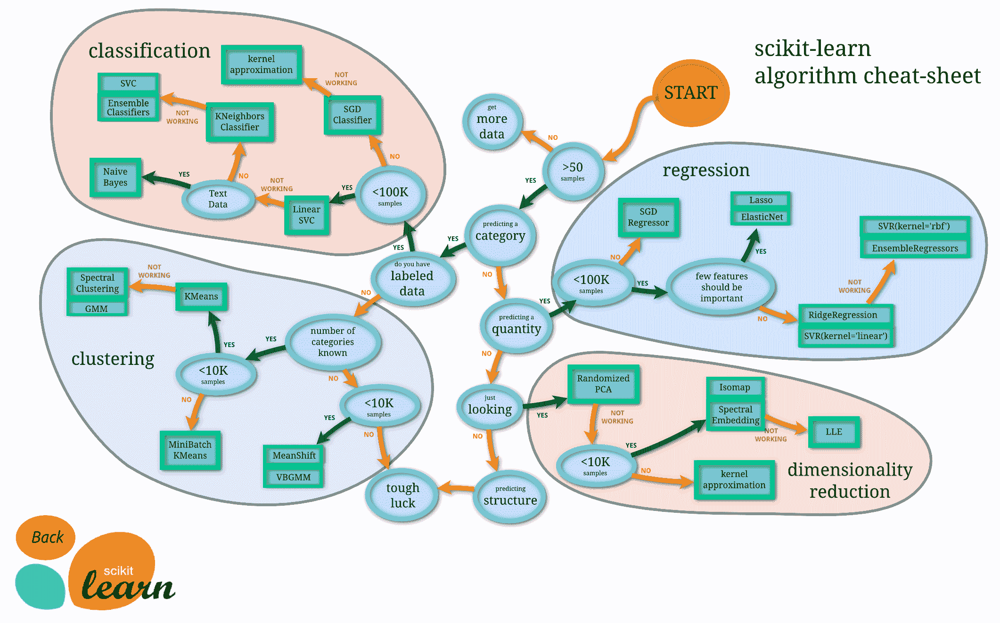

# 4.1. 激励示例：可视化病毒进化#

> 原文：[`mmids-textbook.github.io/chap04_svd/01_motiv/roch-mmids-svd-motiv.html`](https://mmids-textbook.github.io/chap04_svd/01_motiv/roch-mmids-svd-motiv.html)

**图示：scikit-learn 的机器学习地图（来源：[scikit-learn.org](https://scikit-learn.org/stable/tutorial/machine_learning_map/index.html))**



\(\bowtie\)

我们考虑在生物学中应用降维。我们将查看病毒的单核苷酸多态性（SNP）数据。首先是一些背景知识。[维基百科](https://en.wikipedia.org/wiki/Single-nucleotide_polymorphism):

> 单核苷酸多态性（SNP）是指在基因组中特定位置发生的单个核苷酸替换，其中每个变异在人群中的水平超过 1%。例如，在人类基因组的一个特定碱基位置，C 核苷酸可能出现在大多数个体中，但在少数个体中，该位置被 A 核苷酸占据。这意味着在这个特定位置存在一个 SNP，两种可能的核苷酸变异——C 或 A——被认为是该特定位置的等位基因。

引用 [Jombart 等人，BMC Genetics (2010)](https://bmcgenet.biomedcentral.com/articles/10.1186/1471-2156-11-94)，我们分析了：

> 使用血凝素（HA）序列分析季节性流感 A/H3N2 病毒的种群结构。HA 基因的变化在很大程度上负责病毒的免疫逃逸（抗原漂移），并允许季节性流感通过每年达到冬季的高峰流行而持续存在。这些遗传变化还迫使流感疫苗每年都要更新。[……]通过连续的流行病评估病原体的遗传进化在流行病学上具有重要意义。在季节性流感的情况下，我们希望确定从一次冬季流行到下一次流行期间，菌株之间的遗传变化是如何积累的。

关于 Jombart 等人的数据集的一些细节：

> 为了这个目的，我们从 Genbank 获取了 2001 年至 2007 年间收集的所有 H3N2 血凝素（HA）序列。仅保留那些有位置（国家）和日期（年份和月份）的序列，这使得我们可以将菌株分类为每年的冬季流行病。

我们加载了一个数据集，其中包含上述数据集的子集。

```py
data = pd.read_csv('h3n2-snp.csv') 
```

这是一个大型数据集。以下是前五行和前 10 列。

```py
print(data.iloc[:5, :10]) 
```

```py
 strain  s6a  s6c  s6g  s17a  s17g  s17t  s39a  s39c  s39g
0  AB434107  1.0  0.0  0.0   1.0   0.0   0.0   0.0   0.0   1.0
1  AB434108  1.0  0.0  0.0   1.0   0.0   0.0   0.0   0.0   1.0
2  CY000113  1.0  0.0  0.0   1.0   0.0   0.0   0.0   0.0   1.0
3  CY000209  1.0  0.0  0.0   1.0   0.0   0.0   0.0   0.0   1.0
4  CY000217  1.0  0.0  0.0   1.0   0.0   0.0   0.0   0.0   1.0 
```

对于位置 `6`、`17`、`39` 等，相应的列表明菌株中存在哪种核苷酸（`a`、`c`、`g`、`t`）以 `1.0` 表示。例如，菌株 `AB434107` 在位置 `6` 和 `17` 处有 `a`，在位置 `39` 处有 `g`。

总共包含 \(1642\) 个菌株（其名称列在第一列）。数据存在于一个 \(317\) 维的空间中（不包括菌株名称，即第一列）。

```py
data.shape 
```

```py
(1642, 318) 
```

显然，可视化这些数据并不简单。我们如何理解它们？更具体地说，我们如何探索可能存在的任何潜在结构。引用[Wikipedia](https://en.wikipedia.org/wiki/Exploratory_data_analysis)：

> 在统计学中，探索性数据分析（EDA）是一种分析数据集以总结其主要特征的方法，通常使用统计图形和其他数据可视化方法。[...] 自 1970 年以来，约翰·图基（John Tukey）推广了探索性数据分析，以鼓励统计学家探索数据，并可能提出可能导致新的数据收集和实验的假设。

在本章中，我们将遇到一种重要的降维数学技术，它允许我们在\(2\)（而不是\(317\)！）个维度中探索这些数据——并找到有趣的结构。
