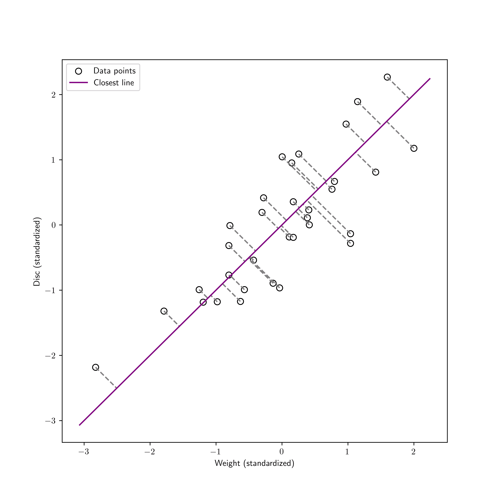
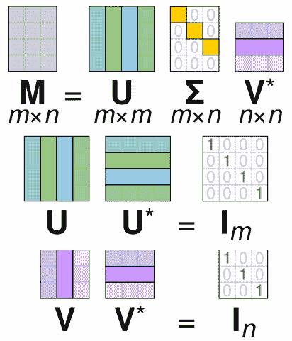
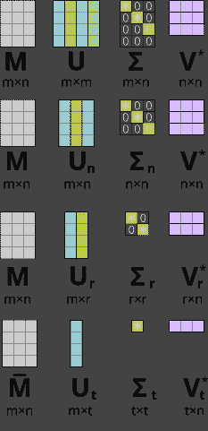
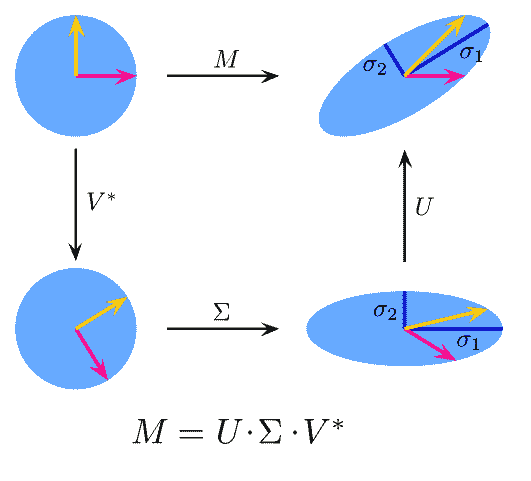

# 4.3\. 近似子空间和奇异值分解#

> 原文：[`mmids-textbook.github.io/chap04_svd/03_svd/roch-mmids-svd-svd.html`](https://mmids-textbook.github.io/chap04_svd/03_svd/roch-mmids-svd-svd.html)

在本节中，我们介绍了奇异值分解（SVD）。我们通过寻找数据点集合的最佳近似子空间的问题来激发其动机——尽管它的应用远不止于此。

## 4.3.1\. 一个目标，一个算法和一个保证#

设 \(\boldsymbol{\alpha}_1,\dots,\boldsymbol{\alpha}_n\) 是 \(\mathbb{R}^m\) 中的 \(n\) 个数据点集合。提取该数据集低维结构的一种自然方法是找到一个 \(\mathbb{R}^m\) 的低维线性子空间 \(\mathcal{Z}\)，使得 \(\boldsymbol{\alpha}_i\) 的点“接近”它。

**问题的数学表述** 再次，平方欧几里得范数在计算上很方便。因此，我们寻找一个线性子空间 \(\mathcal{Z}\)，它最小化

\[ \sum_{i=1}^n \|\boldsymbol{\alpha}_i - \mathrm{proj}_\mathcal{Z}(\boldsymbol{\alpha}_i)\|² \]

在 \(\mathbb{R}^m\) 的所有维度为 \(k\) 的线性子空间上。为了解决这个问题，我们称之为最佳近似子空间问题\(\idx{best approximating subspace problem}\xdi\)，我们进行了一系列观察。

**知识检查:** 考虑数据点 \(\boldsymbol{\alpha}_1 = (-1,1)\) 和 \(\boldsymbol{\alpha}_2 = (1,-1)\)。对于 \(k=1\)，最佳近似子空间的解是什么？

a) \(\mathcal{Z} = \{(x,y) \in \mathbb{R}² : y = x\}\)

b) \(\mathcal{Z} = \{(x,y) \in \mathbb{R}² : y = -x\}\)

c) \(\mathcal{Z} = \{(x,y) \in \mathbb{R}² : y = x + 1\}\)

d) \(\mathcal{Z} = \{(x,y) \in \mathbb{R}² : y = x - 1\}\)

e) 以上皆非

\(\checkmark\)

第一个观察结果给出了一个与最优解相关的有用特征。

**引理** **（最佳子空间作为最大化）** \(\idx{best subspace as maximization lemma}\xdi\) 设 \(\boldsymbol{\alpha}_i\), \(i =1\ldots,n\)，是 \(\mathbb{R}^m\) 中的向量。一个 \(\mathbb{R}^m\) 的线性子空间 \(\mathcal{Z}\)，它最小化

\[ \sum_{i=1}^n \|\boldsymbol{\alpha}_i - \mathrm{proj}_\mathcal{Z}(\boldsymbol{\alpha}_i)\|² \]

在所有维度不超过 \(k\) 的线性子空间中也是最大化的

\[ \sum_{i=1}^n \|\mathrm{proj}_\mathcal{Z}(\boldsymbol{\alpha}_i)\|² \]

在相同的线性子空间上。反之亦然。 \(\flat\)

*证明思路:* 这是对三角不等式的一个直接应用。

*证明:* 通过**毕达哥拉斯定理**，

\[ \|\boldsymbol{\alpha}_i - \mathrm{proj}_{\mathcal{Z}}(\boldsymbol{\alpha}_i)\|² + \|\mathrm{proj}_{\mathcal{Z}}(\boldsymbol{\alpha}_i)\|² = \|\boldsymbol{\alpha}_i\|² \]

因为，根据 *正交投影定理*，\(\mathrm{proj}_{\mathcal{Z}}(\boldsymbol{\alpha}_i)\) 与 \(\boldsymbol{\alpha}_i - \mathrm{proj}_{\mathcal{Z}}(\boldsymbol{\alpha}_i)\) 正交。重新排列，

\[ \|\boldsymbol{\alpha}_i - \mathrm{proj}_{\mathcal{Z}}(\boldsymbol{\alpha}_i)\|² = \|\boldsymbol{\alpha}_i\|² - \|\mathrm{proj}_{\mathcal{Z}}(\boldsymbol{\alpha}_i)\|². \]

结果源于右侧第一个项不依赖于 \(\mathcal{Z}\) 的选择。更具体地说，在维度为 \(k\) 的线性子空间 \(\mathcal{Z}\) 上进行优化，

\[\begin{align*} \min_{\mathcal{Z}} \sum_{i=1}^n \|\boldsymbol{\alpha}_i - \mathrm{proj}_\mathcal{Z}(\boldsymbol{\alpha}_i)\|² &= \min_{\mathcal{Z}} \sum_{i=1}^n \left\{\|\boldsymbol{\alpha}_i\|² - \|\mathrm{proj}_{\mathcal{Z}}(\boldsymbol{\alpha}_i)\|²\right\}\\ &= \sum_{i=1}^n \|\boldsymbol{\alpha}_i\|² + \min_{\mathcal{Z}} \left\{- \sum_{i=1}^n\|\mathrm{proj}_{\mathcal{Z}}(\boldsymbol{\alpha}_i)\|²\right\}\\ &= \sum_{i=1}^n \|\boldsymbol{\alpha}_i\|² - \max_{\mathcal{Z}} \sum_{i=1}^n \|\mathrm{proj}_{\mathcal{Z}}(\boldsymbol{\alpha}_i)\|². \end{align*}\]

\(\square\)

我们如何指定一个 \(k\) 维线性子空间？通过它的基，或者——甚至更好——一个正交基。在后一种情况下，我们也有一个正交投影的显式公式。线性子空间的维度由基的元素数量通过 *维度定理* 来捕捉。换句话说，最佳逼近子空间可以通过求解以下问题获得

\[ \max_{\mathbf{w}_1,\ldots,\mathbf{w}_k} \sum_{i=1}^n \left\|\sum_{j=1}^k \langle \boldsymbol{\alpha}_i, \mathbf{w}_j \rangle \,\mathbf{w}_j\right\|² \]

在所有长度为 \(k\) 的正交归一列表 \(\mathbf{w}_1,\ldots,\mathbf{w}_k\) 上。我们的下一个观察将问题重新写成矩阵形式。

**引理** **(矩阵形式下的最佳子空间)** \(\idx{best subpace in matrix form lemma}\xdi\) 考虑矩阵 \(A \in \mathbb{R}^{n \times m}\) 的行 \(\boldsymbol{\alpha}_i^T\)。通过求解以下问题获得最佳逼近子空间问题的解

\[ \max_{\mathbf{w}_1,\ldots,\mathbf{w}_k} \sum_{j=1}^k \|A \mathbf{w}_j\|² \]

在所有长度为 \(k\) 的正交归一列表 \(\mathbf{w}_1,\ldots,\mathbf{w}_k\) 上。

*证明思路:* 我们从一维情况开始。一维空间 \(\mathcal{Z}\) 由一个单位向量 \(\mathbf{w}_1\) 确定。\(\boldsymbol{\alpha}_i\) 投影到 \(\mathbf{w}_1\) 的张成空间由内积公式 \(\langle \boldsymbol{\alpha}_i, \mathbf{w}_1 \rangle \,\mathbf{w}_1\) 给出。因此

\[\begin{align*} \sum_{i=1}^n \|\langle \boldsymbol{\alpha}_i, \mathbf{w}_1 \rangle \,\mathbf{w}_1 \|² &= \sum_{i=1}^n \langle \boldsymbol{\alpha}_i, \mathbf{w}_1 \rangle ²\\ &= \sum_{i=1}^n (\boldsymbol{\alpha}_i^T \mathbf{w}_1)²\\ &= \|A \mathbf{w}_1\|² \end{align*}\]

其中，再次强调，\(A\) 是具有行 \(\boldsymbol{\alpha}_i ^T\) 的矩阵，\(i=1,\ldots, n\)。因此，一维问题的解是

\[ \mathbf{v}_1 \in \arg\max\{\|A \mathbf{w}_1\|²:\|\mathbf{w}_1\| = 1\}. \]

这里 \(\arg\max\) 意味着 \(\mathbf{v}_1\) 是一个向量 \(\mathbf{w}_1\)，它实现了最大值。请注意，可能存在多个这样的 \(\mathbf{w}_1\)，因此右侧是一个包含所有这些解的集合。根据*极值定理*（因为集合 \(\{\mathbf{w}_1 : \|\mathbf{w}_1\| = 1\}\) 是闭集且有界，并且此外函数 \(\|A \mathbf{w}_1\|²\) 在 \(\mathbf{w}_1\) 上是连续的），至少存在一个解。

*证明*：对于一般的 \(k\)，我们正在寻找一个长度为 \(k\) 的正交列表 \(\mathbf{w}_1,\ldots,\mathbf{w}_k\)，它最大化

\[\begin{align*} \sum_{i=1}^n \left\|\sum_{j=1}^k \langle \boldsymbol{\alpha}_i, \mathbf{w}_j \rangle \,\mathbf{w}_j\right\|² &= \sum_{i=1}^n \sum_{j=1}^k \langle \boldsymbol{\alpha}_i, \mathbf{w}_j \rangle ²\\ &= \sum_{j=1}^k \left(\sum_{i=1}^n (\boldsymbol{\alpha}_i^T \mathbf{w}_j)²\right)\\ &= \sum_{j=1}^k \|A \mathbf{w}_j\|² \end{align*}\]

其中 \(\mathcal{Z}\) 是由 \(\mathbf{w}_1,\ldots,\mathbf{w}_k\) 张成的子空间。在第二行，我们使用了*正交列表的性质*。这证明了我们的主张。 \(\square\)

我们接下来将展示一个简单的算法可以解决这个问题。

**贪心算法** \(\idx{greedy algorithm}\xdi\) 非常明显，这个问题接受一个贪心解。在讨论这个解之前，我们先稍微偏离一下，给出一个经典例子。实际上，[贪心方法](https://en.wikipedia.org/wiki/Greedy_algorithm)是优化问题的一个标准算法工具。维基百科这样描述它们：

> 贪心算法是指任何在每个阶段都遵循局部最优解问题求解启发式的算法。在许多问题中，贪心策略不会产生最优解，但贪心启发式可以产生局部最优解，这些解在合理的时间内近似全局最优解。

**图**：古董店中的小偷（*来源：Gemini 制作；这里也提醒您，AI 生成图像还有很长的路要走…）

\(\bowtie\)

**示例**：假设你是一名小偷，在夜间闯入了一家古董店。（*法律声明：* 贪心算法仅应用于合法的资源分配问题。）你不能偷走店里所有的物品。你估计你可以携带价值 10 磅的货物，并且还能跑得足够快以逃脱。假设有 4 件感兴趣的物品，其重量和价值如下

| 物品 | 重量（磅） | 价值（美元） |
| --- | --- | --- |
| 1 | 8 | 1600 |
| 2 | 6 | 1100 |
| 3 | 4 | 700 |
| 4 | 1 | 100 |

每种物品恰好只有一个。你将选择哪些物品？警报声正在响起，你无法尝试每一种组合。一个快速的方法是首先选择价值最高的物品，即物品 1。现在你的包里已经有 8 磅的商品了。然后，考虑剩余的物品，并选择其中价值最高的一个，即那些重量为 2 磅或更轻的物品。这仅剩下一种选择，即物品 4。然后你继续选择——总价值为 1700。

这被称为贪婪或短视策略，因为你选择了第一个物品以最大化你的利润，而不考虑它对未来选择的约束。实际上，在这种情况下，有一个更好的组合：你可以选择物品 2 和 3，总价值为 1800。

这里可能有其他的贪婪方案。一个稍微聪明一点的方法是选择单位重量价值高的物品，而不仅仅是考虑价值。但在这种特定例子中，这并不会产生影响（试试看！）\(\lhd\)

回到逼近子空间问题，我们为它推导出一个贪婪解。回想一下，我们正在寻找一个解决方案来

\[ \max_{\mathbf{w}_1,\ldots,\mathbf{w}_k} \|A \mathbf{w}_1\|² + \|A \mathbf{w}_2\|² + \cdots + \|A \mathbf{w}_k\|² \]

在所有长度为\(k\)的正交归一列表\(\mathbf{w}_1,\ldots,\mathbf{w}_k\)中。

在贪婪方法中，我们首先单独求解\(\mathbf{w}_1\)，而不考虑它将对下一步施加的约束。也就是说，我们计算

\[ \mathbf{v}_1 \in \arg\max\{\|A \mathbf{w}_1\|²:\|\mathbf{w}_1\| = 1\}. \]

如前所述，根据*极值定理*，这样的\(\mathbf{v}_1\)存在，但可能不是唯一的（在这种情况下，我们可以选择任意一个）。然后，固定\(\mathbf{w}_1 = \mathbf{v}_1\)，我们考虑所有与\(\mathbf{v}_1\)正交的单位向量\(\mathbf{w}_2\)，并最大化\(\mathbf{w}_2\)对目标函数的贡献。也就是说，我们求解

\[ \mathbf{v}_2\in \arg\max \{\|A \mathbf{w}_2\|² :\|\mathbf{w}_2\| = 1,\ \langle \mathbf{w}_2, \mathbf{v}_1 \rangle = 0\}. \]

再次，根据*极值定理*，这样的\(\mathbf{v}_2\)存在。然后通过归纳法，对于每个\(i = 3, \ldots, k\)，我们计算

\[ \mathbf{v}_i\in \arg\max \{\|A \mathbf{w}_i\|² :\|\mathbf{w}_i\| = 1, \ \langle \mathbf{w}_i, \mathbf{v}_j \rangle = 0, \forall j \leq i-1\}. \]

另一种写约束的方法是

\[ \mathbf{v}_i\in \arg\max \{\|A \mathbf{w}_i\|² :\|\mathbf{w}_i\| = 1, \mathbf{w}_i \in \mathrm{span}(\mathbf{v}_1,\ldots,\mathrm{v}_{i-1})^\perp\}. \]

虽然，经过 \(k\) 步后，这个程序构建了一个大小为 \(k\) 的正交归一集，但它远非显而易见的是它最大化了 \(\sum_{j=1}^k \|A \mathbf{v}_j\|²\) 在所有这样的集合上。令人惊讶的是它确实做到了。这个断言——需要证明——是，最佳的 \(k\) 维逼近子空间是通过找到最佳的 \(1\) 维子空间，然后是第一个子空间正交的 \(1\) 维子空间，以此类推来获得的。这可以从下一个定理中得出。

**定理** **（贪婪寻找最佳子空间）** \(\idx{greedy finds best subspace theorem}\xdi\) 设 \(A \in \mathbb{R}^{n \times m}\) 是一个矩阵，其行是 \(\boldsymbol{\alpha}_i^T\)，\(i=1,\ldots,n\)。对于任何 \(k \leq m\)，设 \(\mathbf{v}_1,\ldots,\mathbf{v}_k\) 是如上所述构建的贪婪序列。那么 \(\mathcal{Z}^* = \mathrm{span}(\mathbf{v}_1,\ldots,\mathbf{v}_k)\) 是最小化问题的解

\[ \min \left\{ \sum_{i=1}^n \|\boldsymbol{\alpha}_i - \mathrm{proj}_{\mathcal{Z}}(\boldsymbol{\alpha}_i)\|²\ :\ \text{$\mathcal{Z}$ 是一个维度为 $k$ 的线性子空间} \right\}. \]

\(\sharp\)

除了解决多个低维问题而不是一个高维问题的潜在计算优势之外，贪婪序列还有一个更微妙但强大的特性。它允许我们同时解决所有目标维度 \(k\) 的选择的问题。为了解释这一点，请注意，最大的 \(k\) 值，即 \(k=m\)，导致了一个平凡的问题。确实，数据点 \(\boldsymbol{\alpha}_i\)，\(i=1,\ldots,n\)，已经位于一个 \(m\) 维线性子空间中，即 \(\mathbb{R}^m\) 本身。因此，我们可以取 \(\mathcal{Z} = \mathbb{R}^m\)，并且我们有一个目标值

\[ \sum_{i=1}^n \|\boldsymbol{\alpha}_i - \mathrm{proj}_{\mathcal{Z}}(\boldsymbol{\alpha}_i)\|² = \sum_{i=1}^n \|\boldsymbol{\alpha}_i - \boldsymbol{\alpha}_i\|² = 0, \]

这显然无法改进。所以任何 \(\mathbb{R}^m\) 的正交基都将适用。比如说 \(\mathbf{e}_1,\ldots,\mathbf{e}_m\)。

另一方面，贪婪序列 \(\mathbf{v}_1,\ldots,\mathbf{v}_m\) 有一个非常特殊的性质。对于任何 \(k \leq m\)，截断 \(\mathbf{v}_1,\ldots,\mathbf{v}_k\) 解决了 \(k\) 维逼近子空间问题。这直接来自 *Greedy Finds Best Subspace Theorem*。基 \(\mathbf{e}_1,\ldots,\mathbf{e}_m\)（或者任何旧的 \(\mathbb{R}^m\) 的基）没有这个性质。截断的想法非常有用，在许多数据科学应用中起着重要作用；我们将在本节和下一节中稍后回到它。

我们通过 *谱定理* 简要地描述了一个较弱断言的证明，这种方法揭示了解决方案中的额外结构。

我们将目标函数重新写为

\[ \sum_{j=1}^k \|A \mathbf{w}_j\|² = \sum_{j=1}^k \mathbf{w}_j^T A^T A \mathbf{w}_j \]

我们观察到 \(A^T A \in \mathbb{R}^{m \times m}\) 是一个方阵，对称矩阵（为什么？）。它也是正定半定的（为什么？）。因此，根据**谱定理**，矩阵 \(A^T A\) 有 \(m\) 个正交归一特征向量 \(\mathbf{q}_1, \ldots, \mathbf{q}_m \in \mathbb{R}^m\)，对应于实特征值 \(\lambda_1 \geq \lambda_2 \geq \cdots \geq \lambda_m \geq 0\)。这种特征值的排序将发挥关键作用。此外

\[ A^T A = \sum_{i=1}^m \lambda_i \mathbf{q}_i \mathbf{q}_i^T. \]

将其代入目标函数中，我们得到

\[ \sum_{j=1}^k \|A \mathbf{w}_j\|² = \sum_{j=1}^k \mathbf{w}_j^T \left(\sum_{i=1}^m \lambda_i \mathbf{q}_i \mathbf{q}_i^T\right) \mathbf{w}_j = \sum_{j=1}^k \sum_{i=1}^m \lambda_i (\mathbf{w}_j^T\mathbf{q}_i)². \]

这里是我们要证明的。虽然贪婪序列 \(\mathbf{v}_1,\ldots,\mathbf{v}_k\) 在一般情况下不是唯一的，但我们可以总是选择 \(\mathbf{v}_i = \mathbf{q}_i\) 对于所有的 \(i\)。此外，这种特定的选择确实解决了 \(k\) 维最佳逼近子空间问题。我们限制自己考虑 \(k = 2\) 的情况。

***特征向量形成贪婪序列：*** 回想一下，\(\mathbf{v}_1\) 在所有单位向量 \(\mathbf{w}_1\) 中最大化 \(\|A \mathbf{w}_1\|\)。现在注意，在特征向量（它们形成一个正交基）上展开，我们有

\[ \|A \mathbf{w}_1\|² = \sum_{i=1}^m \lambda_i (\mathbf{w}_1^T\mathbf{q}_i)² \]

和

\[ \|\mathbf{w}_1\|² = \sum_{i=1}^m (\mathbf{w}_1^T\mathbf{q}_i)² = 1. \]

写作 \(x_i = (\mathbf{w}_1^T\mathbf{q}_i)²\)，这归结为在约束 \(\sum_{i=1}^m x_i = 1\) 和 \(x_i \geq 0\) 对于所有 \(i\) 的条件下，最大化 \(\sum_{i=1}^m \lambda_i x_i\)。但是，在约束和特征值排序的假设下，

\[ \sum_{i=1}^m \lambda_i x_i \leq \lambda_1 \sum_{i=1}^m x_i = \lambda_1. \]

形式上，我们已经证明了对于任何单位向量 \(\mathbf{w}_1\)，\(\|A \mathbf{w}_1\|² \leq \lambda_1\)。现在，注意这个上界实际上是通过取 \(\mathbf{v}_1 = \mathbf{w}_1 = \mathbf{q}_1\) 来实现的，这对应于 \(\mathbf{x} = (x_1,\ldots,x_m) = \mathbf{e}_1\)。

在给定选择的情况下，向量 \(\mathbf{v}_2\) 在所有单位向量 \(\mathbf{w}_2\) 中最大化 \(\|A \mathbf{w}_2\|\)，且满足 \(\mathbf{w}_2^T\mathbf{v}_1 = \mathbf{w}_2^T\mathbf{q}_1 = 0\)，这次

\[ \|A \mathbf{w}_2\|² = \sum_{i=1}^m \lambda_i (\mathbf{w}_2^T\mathbf{q}_i)² = \sum_{i=2}^m \lambda_i (\mathbf{w}_2^T\mathbf{q}_i)² \]

和

\[ \|\mathbf{w}_2\|² = \sum_{i=1}^m (\mathbf{w}_2^T\mathbf{q}_i)² = \sum_{i=2}^m (\mathbf{w}_2^T\mathbf{q}_i)² = 1. \]

在上述两个方程中，我们使用了正交约束。这简化为没有依赖于 \(\mathbf{q}_1\) 的项的先前问题。否则，解是相同的，即最优目标函数是 \(\lambda_2\)，通过取 \(\mathbf{v}_2 = \mathbf{w}_2 = \mathbf{q}_2\) 来实现。

***特征向量解决了逼近子空间问题：*** 当 \(k = 2\) 时，逼近子空间问题涉及最大化

\[ \|A \mathbf{w}_1\|² + \|A \mathbf{w}_2\|² = \sum_{i=1}^m \lambda_i (\mathbf{w}_1^T\mathbf{q}_i)² + \sum_{i=1}^m \lambda_i (\mathbf{w}_2^T\mathbf{q}_i)² \]

在正交归一列表 \(\mathbf{w}_1, \mathbf{w}_2\) 上。特别是，我们要求

\[ \|\mathbf{w}_1\|² = \sum_{i=1}^m (\mathbf{w}_1^T\mathbf{q}_i)² = 1. \]

和

\[ \|\mathbf{w}_2\|² = \sum_{i=1}^m (\mathbf{w}_2^T\mathbf{q}_i)² = 1. \]

此外，对于每个 \(i\)，根据子空间 \(\mathcal{W} = \mathrm{span}(\mathbf{w}_1, \mathbf{w}_2)\) 上的正交投影的定义和 *正交归一列表的性质*

\[ (\mathbf{w}_1^T\mathbf{q}_i)² + (\mathbf{w}_2^T\mathbf{q}_i)² = \|\mathrm{proj}_{\mathcal{W}} \mathbf{q}_i\|² \leq \|\mathbf{q}_i\|² = 1. \]

（证明不等式！）设 \(x_i = (\mathbf{w}_1^T\mathbf{q}_i)²\) 和 \(y_i = (\mathbf{w}_2^T\mathbf{q}_i)²\)。目标函数可以写成 \(\sum_{i=1}^m \lambda_i (x_i + y_i)\)，而我们推导出的约束条件是 \(\sum_{i=1}^m x_i = \sum_{i=1}^m y_i = 1\) 和 \(x_i + y_i \leq 1\) 对于所有 \(i\) 都成立。显然，对于所有 \(i\)，有 \(x_i, y_i \geq 0\)。因此

\[\begin{align*} \sum_{i=1}^m \lambda_i (x_i + y_i) &= \lambda_1 (x_1 + y_1) + \lambda_2 (x_2 + y_2) + \sum_{i=3}^m \lambda_i (x_i + y_i)\\ &\leq \lambda_1 (x_1 + y_1) + \lambda_2 (x_2 + y_2) + \lambda_2 \sum_{i=3}^m (x_i + y_i)\\ &= \lambda_1 (x_1 + y_1) + \lambda_2 (x_2 + y_2) + \lambda_2 \left([1 - x_1 - x_2] + [1 - y_1 - y_2]\right)\\ &= (\lambda_1 - \lambda_2) (x_1 + y_1) + (\lambda_2 - \lambda_2) (x_2 + y_2) + 2 \lambda_2\\ &\leq \lambda_1 - \lambda_2 + 2 \lambda_2\\ &= \lambda_1 + \lambda_2. \end{align*}\]

形式上，我们已经证明了对于任何正交归一列表 \(\mathbf{w}_1, \mathbf{w}_2\)，有 \(\|A \mathbf{w}_1\|² + \|A \mathbf{w}_2\|² \leq \lambda_1 + \lambda_2\)。这个上界可以通过取 \(\mathbf{w}_1 = \mathbf{q}_1\) 和 \(\mathbf{w}_2 = \mathbf{q}_2\) 来达到，从而证明了该命题。

**知识检查：** 通过归纳法证明该命题对于任何 \(k\) 都成立。 \(\checkmark\)

注意，从计算的角度来看，我们并没有完全解决最佳逼近子空间问题，因为我们没有给出一个明确的构造解的步骤来构建低维子问题的解，即构造特征向量。我们只证明了这些解存在并且具有正确的性质。我们将在本章的后面部分处理计算问题。

## 4.3.2\. 从逼近子空间到奇异值分解（SVD）#

在上一节解决逼近子空间问题时，我们推导出了矩阵分解的构建块，这种分解在许多应用中得到了应用，即 [奇异值分解 (SVD)](https://en.wikipedia.org/wiki/Singular_value_decomposition)。在本节中，我们正式定义 SVD。在下一节中，我们将描述计算它的简单方法，同时也会回到降维的应用。

**奇异值分解的定义和存在性** 我们现在来到我们的主要定义。

**定义** **(奇异值分解)** \(\idx{singular value decomposition}\xdi\) 设 \(A \in \mathbb{R}^{n\times m}\) 是一个矩阵。\(A\) 的奇异值分解是一个矩阵分解

\[ A = U \Sigma V^T = \sum_{j=1}^r \sigma_j \mathbf{u}_j \mathbf{v}_j^T \]

其中 \(U \in \mathbb{R}^{n \times r}\) 的列和 \(V \in \mathbb{R}^{m \times r}\) 的列是正交归一的，且 \(\Sigma \in \mathbb{R}^{r \times r}\) 是一个对角矩阵。这里 \(\mathbf{u}_j\) 是 \(U\) 的列，被称为左奇异向量\(\idx{singular vector}\xdi\)。同样地，\(\mathbf{v}_j\) 是 \(V\) 的列，被称为右奇异向量。\(\sigma_j\) 是正数，且按非递增顺序排列，即，

\[ \sigma_1 \geq \sigma_2 \geq \cdots \geq \sigma_r > 0, \]

是 \(\Sigma\) 的对角元素，被称为奇异值\(\idx{singular value}\xdi\)。 \(\natural\)

为了看到等式 \(U \Sigma V^T = \sum_{j=1}^r \sigma_j \mathbf{u}_j \mathbf{v}_j^T\) 的来源，我们将其分解为两个步骤。

1.  首先注意矩阵乘积 \(U \Sigma\) 的列是 \(\sigma_1 \mathbf{u}_1,\ldots,\sigma_r \mathbf{u}_r\).

1.  \(V^T\) 的行是 \(V\) 的列，作为行向量。

1.  从外积的角度来看，矩阵乘积 \(U \Sigma V^T = (U \Sigma) V^T\) 是 \(U \Sigma\) 的列和外积以及 \(V^T\) 的行（即 \(V\) 的列作为行向量）的外积之和。

这就证明了等式。

**知识检查:** 设 \(A \in \mathbb{R}^{n\times m}\) 是一个具有奇异值分解的矩阵

\[ A = U \Sigma V^T = \sum_{j=1}^r \sigma_j \mathbf{u}_j \mathbf{v}_j^T. \]

哪个陈述在一般情况下是正确的？

a) \(\mathrm{col}(A) = \mathrm{col}(V)\)

b) \(\mathrm{col}(A) = \mathrm{col}(V^T)\)

c) \(\mathrm{col}(A) = \mathrm{col}(U)\)

d) \(\mathrm{col}(A) = \mathrm{col}(U^T)\)

e) \(\mathrm{col}(A) = \mathrm{col}(\Sigma)\)

\(\checkmark\)

值得注意的是，任何矩阵都有一个 SVD。

**定理** **(SVD 的存在性)** \(\idx{existence of an SVD}\xdi\) 任何矩阵 \(A \in \mathbb{R}^{n\times m}\) 都有一个奇异值分解。 \(\sharp\)

我们通过 *谱定理* 给出证明。

*构造方法:* 设 \(A \in \mathbb{R}^{n \times m}\) 并回忆 \(A^T A\) 是对称和正半定的。因此，后者有一个谱分解

\[ A^T A = Q \Lambda Q^T. \]

将特征值按非递减顺序排列 \(\lambda_1 \geq \cdots \geq \lambda_m \geq 0\)。假设特征值 \(\lambda_1,\ldots,\lambda_r\) 是非零的，而 \(\lambda_{r+1} = \cdots = \lambda_m = 0\)。设 \(\mathbf{q}_1,\ldots,\mathbf{q}_n\) 是相应的特征向量。设 \(Q_1 \in \mathbb{R}^{m \times r}\) 是列向量分别为 \(\mathbf{q}_1,\ldots,\mathbf{q}_r\) 的矩阵，且 \(\Lambda_1 \in \mathbb{R}^{r \times r}\) 是对角矩阵，其对角线上的元素为 \(\lambda_1,\ldots,\lambda_r\)。类似地，设 \(Q_2 \in \mathbb{R}^{m \times (m-r)}\) 是列向量分别为 \(\mathbf{q}_{r+1},\ldots,\mathbf{q}_m\) 的矩阵，且 \(\Lambda_2 = \mathbf{0} \in \mathbb{R}^{(m-r) \times (m-r)}\).

由所有数据点的内积组成的矩阵 \(A^T A\) 被称为 Gram 矩阵。

现在我们准备提出我们的主要论断。对于一个对角矩阵 \(D\)，其对角线上的元素非负，我们让 \(D^{1/2}\) 表示通过对每个对角线元素开平方得到的对角矩阵。类似地，当 \(D\) 的对角线元素为正时，我们定义 \(D^{-1/2}\) 为对角线元素为 \(D\) 的对应对角线元素的平方根的倒数的对角矩阵。

**定理** **(通过谱分解的奇异值分解)** \(\idx{SVD via spectral decomposition}\xdi\) 设 \(A \in \mathbb{R}^{n \times m}\) 且 \(Q_1, \Lambda_1\) 如上所述。定义

\[ U = A Q_1 \Lambda_1^{-1/2} \quad \text{和} \quad \Sigma = \Lambda_1^{1/2} \quad \text{和} \quad V = Q_1. \]

然后 \(A = U \Sigma V^T\) 是 \(A\) 的奇异值分解。 \(\sharp\)

*证明思路:* 通过手工检查上述构造满足 SVD 的所有性质。

*证明:* 通过构造，\(V = Q_1\) 的列是正交归一的。矩阵 \(\Sigma = \Lambda_1^{1/2}\) 是对角矩阵，并且由于 \(A^T A\) 是正半定矩阵，其特征值是非负的。因此，剩下要证明两件事：\(U\) 的列是正交归一的，最后，\(A = U \Sigma V^T\).

**知识检查:** 证明

a) \(A^T A Q_1 = Q_1 \Lambda_1\) 和 \(A^T A Q_2 = Q_2 \Lambda_2 = \mathbf{0}\),

b) \(Q_1 Q_1^T + Q_2 Q_2^T = I_{m \times m}\).

\(\checkmark\)

**引理** **(步骤 1)** \(U\) 的列是正交归一的。\(\flat\)

*证明:* 通过直接计算，

\[ U^T U = (A Q_1 \Lambda_1^{-1/2})^T A Q_1 \Lambda_1^{-1/2} = \Lambda_1^{-1/2} Q_1^T A^T A Q_1 \Lambda_1^{-1/2}. \]

因为 \(Q_1\) 的列是 \(A^T A\) 的特征向量，所以我们有 \(A^T A Q_1 = Q_1 \Lambda_1\)。进一步，这些特征向量是正交归一的，因此 \(Q_1^T Q_1 = I_{r \times r}\)。将上述内容代入并简化给出

\[ \Lambda_1^{-1/2} Q_1^T A^T A Q_1 \Lambda_1^{-1/2} = \Lambda_1^{-1/2} Q_1^T Q_1 \Lambda_1 \Lambda_1^{-1/2} = \Lambda_1^{-1/2} I_{r \times r} \Lambda_1 \Lambda_1^{-1/2} = I_{r \times r}, \]

如所声称。 \(\square\)

**引理** **(步骤 2)** 成立 \(A = U \Sigma V^T\). \(\flat\)

*证明:* 通过直接计算，我们有

\[ U \Sigma V^T = A Q_1 \Lambda_1^{-1/2} \Lambda_1^{1/2} Q_1^T = A Q_1 Q_1^T. \]

矩阵 \(Q_1 Q_1^T\) 是由向量 \(\mathbf{q}_1,\ldots,\mathbf{q}_r\) 张成的子空间上的正交投影。同样，矩阵 \(Q_2 Q_2^T\) 是由 \(\mathbf{q}_{r+1},\ldots,\mathbf{q}_m\) 张成的正交补（子空间）上的正交投影。因此 \(Q_1 Q_1^T + Q_2 Q_2^T = I_{m \times m}\)。替换上述内容我们得到

\[ U \Sigma V^T = A (I_{n \times n} - Q_2 Q_2^T) = A - A Q_2 Q_2^T. \]

现在注意到对于任何 \(\mathbf{q}_i\)，\(i=r+1,\ldots,m\)，我们有 \(A^T A \mathbf{q}_i = \mathbf{0}\)，因此 \(\mathbf{q}_i^T A^T A \mathbf{q}_i = \|A \mathbf{q}_i\|² = 0\)。这表明 \(A \mathbf{q}_i = \mathbf{0}\) 并且进一步 \(A Q_2 = \mathbf{0}\)。代入上述内容完成证明。\(\square\)

这就完成了定理的证明。\(\square\)

我们记录以下重要后果。

**引理** **(奇异值分解与秩)** \(\idx{SVD and rank lemma}\xdi\) 设 \(A \in \mathbb{R}^{n\times m}\) 有奇异值分解 \(A = U \Sigma V^T\)，其中 \(U \in \mathbb{R}^{n \times r}\) 和 \(V \in \mathbb{R}^{m \times r}\)。那么 \(U\) 的列构成 \(\mathrm{col}(A)\) 的一个正交基，\(V\) 的列构成 \(\mathrm{row}(A)\) 的一个正交基。特别是，\(A\) 的秩是 \(r\)。\(\flat\)

**证明思路：** 我们使用奇异值分解来证明 \(U\) 的列的张成是 \(\mathrm{col}(A)\)，对 \(V\) 同样适用。

**证明：** 我们首先证明 \(A\) 的任何一列都可以写成 \(U\) 的列的线性组合。实际上，这直接从奇异值分解得出，注意到对于任何标准基向量 \(\mathbf{e}_i \in \mathbb{R}^m\)（它产生 \(A\) 的第 \(i\) 列，即 \(A \mathbf{e}_i\))

\[\begin{align*} A \mathbf{e}_i =\left(\sum_{j=1}^r \sigma_j \mathbf{u}_j \mathbf{v}_j^T\right)\mathbf{e}_i = \sum_{j=1}^r (\sigma_j \mathbf{v}_j^T \mathbf{e}_i) \,\mathbf{u}_j. \end{align*}\]

反之，\(U\) 的任何一列都可以写成 \(A\) 的列的线性组合。为了看到这一点，我们使用 \(\mathbf{v}_j\) 的正交性和奇异值的正定性来获得

\[\begin{align*} A (\sigma_i^{-1} \mathbf{v}_i) = \sigma_i^{-1}\left(\sum_{j=1}^r \sigma_j \mathbf{u}_j \mathbf{v}_j^T\right)\mathbf{v}_i = \sigma_i^{-1} \sum_{j=1}^r (\sigma_j \mathbf{v}_j^T \mathbf{v}_i) \,\mathbf{u}_j = \sigma_i^{-1} (\sigma_i \mathbf{v}_i^T \mathbf{v}_i) \,\mathbf{u}_i = \mathbf{u}_i. \end{align*}\]

即，\(\mathrm{col}(U) = \mathrm{col}(A)\)。我们已经证明了 \(U\) 的列是正交的。由于它们的张成是 \(\mathrm{col}(A)\)，它们构成了它的一个正交基。将相同的论点应用于 \(A^T\) 得到 \(V\) 的结论（试试看！）。\(\square\)

**示例：** 让

\[\begin{split} A = \begin{pmatrix} 1 & 0\\ -1 & 0 \end{pmatrix}. \end{split}\]

我们计算其奇异值分解（SVD）。在这种情况下，我们可以利用我们对 SVD 的了解来完成（或猜测）它。首先要注意的是，\(A\)是不可逆的。确实，它的行是彼此的倍数。特别是，它们不是线性无关的。事实上，这告诉我们\(A\)的秩是\(1\)，即其行空间的维度。在秩为 1 的情况下，计算 SVD 归结为将矩阵\(A\)写成外积形式

\[ A = \sigma_1 \mathbf{u}_1 \mathbf{v}_1^T \]

其中我们要求\(\sigma_1 > 0\)，并且\(\mathbf{u}_1, \mathbf{v}_1\)是单位范数。

回想一下，外积的列都是同一个向量的倍数。在这里，因为\(A\)的第二列是\(\mathbf{0}\)，所以\(\mathbf{v}_1\)的第二分量必须是\(0\)。为了是单位范数，其第一分量必须是\(1\)或\(-1\)。（这里的选项并不重要，因为将所有左奇异向量和右奇异向量乘以\(-1\)会产生另一个 SVD。）我们选择\(1\)，即我们让

\[\begin{split} \mathbf{v}_1 = \begin{pmatrix} 1\\ 0 \end{pmatrix}. \end{split}\]

那个向量确实是\(A\)的行空间的一个正交归一基。然后我们需要

\[\begin{split} \sigma_1 \mathbf{u}_1 = \begin{pmatrix} 1\\ -1 \end{pmatrix}. \end{split}\]

为了使\(\mathbf{u}_1\)是单位范数，我们必须有

\[\begin{split} \mathbf{u}_1 = \begin{pmatrix} 1/\sqrt{2}\\ -1/\sqrt{2} \end{pmatrix} \quad \text{和} \quad \sigma_1 = \sqrt{2}. \end{split}\]

注意到\(\mathbf{u}_1\)确实是\(A\)的列空间的一个正交归一基。\(\lhd\)

人们可能希望对称矩阵的 SVD 生成相同的左奇异向量和右奇异向量。然而，情况并非如此。

**例证：** \(A = (-1)\)的 SVD 是\(A = (1)\,(1)\,(-1)\)。也就是说，\(\mathbf{u}_1 = (1)\)和\(\mathbf{v} = (-1)\)。\(\lhd\)

在接下来的引理中，我们收集了一些关于奇异向量和奇异值之间关系的一些关系，这些关系将被反复使用。它还进一步阐明了\(A\)的 SVD 与\(A^T A\)和\(A A^T\)的谱分解之间的联系。

**引理** **(SVD 关系)** \(\idx{SVD relations}\xdi\) 设\(A = \sum_{j=1}^r \sigma_j \mathbf{u}_j \mathbf{v}_j^T\)是\(A \in \mathbb{R}^{n \times m}\)的 SVD，其中\(\sigma_1 \geq \sigma_2 \geq \cdots \geq \sigma_r > 0\)。那么，对于\(i=1,\ldots,r\)，

\[ A \mathbf{v}_i = \sigma_i \mathbf{u}_i, \qquad A^T \mathbf{u}_i = \sigma_i \mathbf{v}_i, \qquad \|A \mathbf{v}_i\| = \sigma_i, \qquad \|A^T \mathbf{u}_i\| = \sigma_i. \]

当然

\[ A^T A \mathbf{v}_i = \sigma_i² \mathbf{v}_i, \qquad A A^T \mathbf{u}_i = \sigma_i² \mathbf{u}_i. \]

和，对于\(j \neq i\)，

\[ \langle A \mathbf{v}_i, A \mathbf{v}_j \rangle = 0, \qquad \langle A^T \mathbf{u}_i, A^T \mathbf{u}_j \rangle = 0. \]

\(\flat\)

我们之前通过 \(A^T A\) 的谱分解建立了奇异值分解的存在性。前面的引理表明，实际上，在任何奇异值分解中，\(\mathbf{v}_i\) 是 \(A^T A\) 的正交特征向量。然而，它们并不构成整个空间 \(\mathbb{R}^m\) 的正交基，因为秩 \(r\) 可以严格小于 \(m\)。但请注意，任何与 \(\mathrm{span}(\mathbf{v}_1,\ldots,\mathbf{v}_r)\) 正交的向量 \(\mathbf{w}\) 都满足

\[ A\mathbf{w} = \sum_{j=1}^r \sigma_j \mathbf{u}_j \mathbf{v}_j^T\mathbf{w} = \mathbf{0} \]

并且，更不用说

\[ A^T A \mathbf{w} = \mathbf{0}. \]

因此，\(\mathbf{w}\) 实际上是 \(A^T A\) 的特征向量，特征值为 \(0\)。令 \(\mathbf{v}_{r+1}, \ldots, \mathbf{v}_m\) 为 \(\mathrm{span}(\mathbf{v}_1,\ldots,\mathbf{v}_r)^\perp\) 的任意正交基。那么，\(\mathbf{v}_1,\ldots,\mathbf{v}_m\) 是 \(A^T A\) 的特征向量的正交基。

该引理还表明，\(\mathbf{u}_i\) 是 \(A A^T\) 的正交特征向量！

**完整奇异值分解与紧凑奇异值分解** 我们上面介绍的是所谓的紧凑奇异值分解。相比之下，在完整奇异值分解（[full SVD](https://en.wikipedia.org/wiki/Singular_value_decomposition#Compact_SVD)）中，矩阵 \(U\) 和 \(V\) 是方阵且正交，矩阵 \(\Sigma\) 是对角矩阵，但不一定是方阵，并且对角线上可能有零。特别是，在这种情况下，\(U \in \mathbb{R}^{n \times n}\) 的列构成 \(\mathbb{R}^n\) 的一个正交基，而 \(V \in \mathbb{R}^{m \times m}\) 的列构成 \(\mathbb{R}^m\) 的一个正交基。

**图示：** 完整形式的奇异值分解 ([来源](https://commons.wikimedia.org/wiki/File:Singular_value_decomposition_visualisation.svg))

\(\bowtie\)

设 \(A = U_1 \Sigma_1 V_1^T\) 为一个紧凑的奇异值分解。将 \(U_1\) 的列扩展为 \(\mathbb{R}^n\) 的一个正交基，并令 \(U_2\) 为其列是额外基向量的矩阵。类似地，将 \(V_1\) 的列扩展为 \(\mathbb{R}^m\) 的一个正交基，并令 \(V_2\) 为其列是额外基向量的矩阵。然后，一个完整的奇异值分解由以下给出

\[\begin{split} U = \begin{pmatrix} U_1 & U_2 \end{pmatrix} \quad V = \begin{pmatrix} V_1 & V_2 \end{pmatrix} \quad \Sigma = \begin{pmatrix} \Sigma_1 & \mathbf{0}_{r \times (m-r)}\\ \mathbf{0}_{(n-r)\times r} & \mathbf{0}_{(n-r)\times (m-r)} \end{pmatrix}. \end{split}\]

根据 SVD 和秩引理，\(U_1\) 的列构成 \(\mathrm{col}(A)\) 的正交基。因为 \(\mathrm{col}(A)^\perp = \mathrm{null}(A^T)\)，所以 \(U_2\) 的列构成 \(\mathrm{null}(A^T)\) 的正交基。类似地，\(V_1\) 的列构成 \(\mathrm{col}(A^T)\) 的正交基。因为 \(\mathrm{col}(A^T)^\perp = \mathrm{null}(A)\)，所以 \(V_2\) 的列构成 \(\mathrm{null}(A)\) 的正交基。因此，完整的 SVD 为 \(A\) 的所有四个基本子空间提供了正交基。

反之，给定一个完整的 SVD \(A = U \Sigma V^T\)，可以通过仅保留 \(\Sigma\) 的严格正对角线元素的平方子矩阵，以及相应的 \(U\) 和 \(V\) 的列来获得紧凑的 SVD。

**图：SVD 的不同变体 ([来源](https://commons.wikimedia.org/wiki/File:Reduced_Singular_Value_Decompositions.svg**))

\(\bowtie\)

**示例：** **(继续**) 再次

\[\begin{split} A = \begin{pmatrix} 1 & 0\\ -1 & 0 \end{pmatrix}. \end{split}\]

我们之前已经计算了它的紧凑 SVD

\[ A = \sigma_1 \mathbf{u}_1 \mathbf{v}_1^T \]

where

\[\begin{split} \mathbf{u}_1 = \begin{pmatrix} 1/\sqrt{2}\\ -1/\sqrt{2} \end{pmatrix}, \quad \quad \mathbf{v}_1 = \begin{pmatrix} 1\\ 0 \end{pmatrix}, \quad \text{和} \quad \sigma_1 = \sqrt{2}. \end{split}\]

我们现在计算一个完整的 SVD。为此，我们需要完成基。我们可以选择（为什么？）

\[\begin{split} \mathbf{u}_2 = \begin{pmatrix} 1/\sqrt{2}\\ 1/\sqrt{2} \end{pmatrix}, \quad \quad \mathbf{v}_2 = \begin{pmatrix} 0\\ 1 \end{pmatrix}, \quad \text{和} \quad \sigma_2 = 0. \end{split}\]

然后，完整的 SVD 可以表示为

\[\begin{split} U = \begin{pmatrix} 1/\sqrt{2} & 1/\sqrt{2}\\ -1/\sqrt{2} & 1/\sqrt{2} \end{pmatrix}, \quad \quad V = \begin{pmatrix} 1 & 0\\ 0 & 1 \end{pmatrix}, \quad \text{和} \quad \Sigma = \begin{pmatrix} \sqrt{2} & 0\\ 0 & 0 \end{pmatrix}. \end{split}\]

事实上，\(A = U \Sigma V^T\) (检查它!) \(\lhd\)

完整的 SVD 也有一个自然的几何解释。引用 [Sol, p. 133]：

> SVD 提供了 \(A\) 作用的完整几何特征。由于 \(U\) 和 \(V\) 是正交的，它们对长度和角度没有影响；作为对角矩阵，\(\Sigma\) 放缩各个坐标轴。由于 SVD 总是存在的，所有 \(A \in \mathbb{R}^{n \times m}\) 的矩阵都是等距变换、每个坐标的缩放和第二个等距变换的合成。

**图：SVD 的几何解释 ([来源](https://commons.wikimedia.org/wiki/File:Singular-Value-Decomposition.svg**))

\(\bowtie\)

**完整闭环：通过 SVD 解决逼近子空间问题** 将矩阵 \(A \in \mathbb{R}^{n \times m}\) 的行 \(\boldsymbol{\alpha}_i^T\) 视为 \(\mathbb{R}^m\) 中的 \(n\) 个数据点的集合。令

\[ A = \sum_{j=1}^r \sigma_j \mathbf{u}_j \mathbf{v}_j^T \]

是 \(A\) 的一个（紧致）奇异值分解。固定 \(k \leq \mathrm{rk}(A)\)。我们正在寻找一个线性子空间 \(\mathcal{Z}\)，使其

\[ \sum_{i=1}^n \|\boldsymbol{\alpha}_i - \mathrm{proj}_\mathcal{Z}(\boldsymbol{\alpha}_i)\|² \]

在 \(\mathbb{R}^m\) 的所有线性子空间中，其维度最多为 \(k\)。根据上述观察，一个解由以下给出

\[ \mathcal{Z} = \mathrm{span}(\mathbf{v}_1,\ldots,\mathbf{v}_k). \]

通过**最佳子空间最大化**和**矩阵形式中的最佳子空间**引理的证明，所达到的目标值

\[\begin{align*} \sum_{i=1}^n \|\boldsymbol{\alpha}_i - \mathrm{proj}_\mathcal{Z}(\boldsymbol{\alpha}_i)\|² &= \sum_{i=1}^n \|\boldsymbol{\alpha}_i\|² - \sum_{j=1}^k \|A\mathbf{v}_j\|²\\ &= \sum_{i=1}^n \|\boldsymbol{\alpha}_i\|² - \sum_{j=1}^k \sigma_j². \end{align*}\]

因此，与右奇异向量 \(\mathbf{v}_j\) 相关的奇异值 \(\sigma_j\) 捕获了其对逼近子空间的贡献。奇异值越大，贡献越大。

为了获得原始数据集的低维嵌入，我们计算每个 \(i\) 的 \(\mathbf{z}_i := \mathrm{proj}_\mathcal{Z}(\boldsymbol{\alpha}_i)\) 如下（以行形式）

\[\begin{align*} \mathbf{z}_i^T &= \sum_{j=1}^k \langle \boldsymbol{\alpha}_i, \mathbf{v}_j\rangle \,\mathbf{v}_j^T\\ &= \sum_{j=1}^k \boldsymbol{\alpha}_i^T \mathbf{v}_j \mathbf{v}_j^T\\ &= A_{i,\cdot} V_{(k)} V_{(k)}^T, \end{align*}\]

其中 \(V_{(k)}\) 是包含 \(V\) 的前 \(k\) 列的矩阵。设 \(Z\) 为包含行 \(\mathbf{z}_i^T\) 的矩阵。那么我们有

\[ Z = A V_{(k)} V_{(k)}^T = U_{(k)} \Sigma_{(k)} V_{(k)}^T = \sum_{j=1}^k \sigma_j \mathbf{u}_j \mathbf{v}_j^T, \]

其中 \(U_{(k)}\) 是包含 \(U\) 的前 \(k\) 列的矩阵，而 \(\Sigma_{(k)}\) 是包含 \(\Sigma\) 的前 \(k\) 行和列的矩阵。实际上，回想一下 \(A \mathbf{v}_j = \sigma_j \mathbf{u}_j\)，或者用矩阵形式 \(A V_{(k)} = U_{(k)} \Sigma_{(k)}\)。\(Z\) 的最右表达式表明它实际上是一个截断的奇异值分解。我们可以将 \(U_{(k)} \Sigma_{(k)}\) 的行解释为每个数据点在基 \(\mathbf{v}_1,\ldots,\mathbf{v}_k\) 中的系数。这些系数提供了所需的低维表示。

我们可以通过使用 Frobenius 范数将目标函数重写为更紧凑的矩阵形式，如下所示

\[\begin{align*} \sum_{i=1}^n \|\boldsymbol{\alpha}_i - \mathrm{proj}_\mathcal{Z}(\boldsymbol{\alpha}_i)\|² &= \sum_{i=1}^n \|\boldsymbol{\alpha}_i - \mathbf{z}_i\|² = \sum_{i=1}^n \|\boldsymbol{\alpha}_i^T - \mathbf{z}_i^T\|² = \|A - Z\|_F². \end{align*}\]

我们注意到矩阵 \(Z\) 的秩小于或等于 \(k\)。实际上，它的所有行都位于由构造得到的最优子空间 \(\mathcal{Z}\) 中，该子空间的维度为 \(k\)。我们将在后面看到，\(Z\) 是在 Frobenius 范数下所有秩为 \(k\) 的矩阵中最佳逼近 \(A\) 的矩阵，

\[ \|A - Z\|_F \leq \|A - B\|_F \]

对于任何秩最多为 \(k\) 的矩阵 \(B\)。

***自我评估测验*** *(由克劳德、双子星和 ChatGPT 协助)*

**1** 设 \(\boldsymbol{\alpha}_1, \dots, \boldsymbol{\alpha}_n\) 是 \(\mathbb{R}^m\) 中的数据点。最佳逼近子空间问题的目标是什么？

a) 找到一个线性子空间 \(\mathcal{Z}\) 属于 \(\mathbb{R}^m\)，使得 \(\boldsymbol{\alpha}_i\) 与 \(\mathcal{Z}\) 之间的距离之和最小。

b) 找到一个线性子空间 \(\mathcal{Z}\) 属于 \(\mathbb{R}^m\)，使得 \(\boldsymbol{\alpha}_i\) 与其在 \(\mathcal{Z}\) 上的正交投影之间的平方距离之和最小。

c) 找到一个线性子空间 \(\mathcal{Z}\) 属于 \(\mathbb{R}^m\)，使得 \(\boldsymbol{\alpha}_i\) 在 \(\mathcal{Z}\) 上的正交投影的平方范数之和最大。

d) b 和 c 都正确。

**2** 考虑数据点 \(\boldsymbol{\alpha}_1 = (-2,2)\) 和 \(\boldsymbol{\alpha}_2 = (3,-3)\)。对于 \(k=1\)，最佳逼近子空间问题的解是什么？

a) \(\mathcal{Z} = \{(x,y) \in \mathbb{R}² : y = x\}\)

b) \(\mathcal{Z} = \{(x,y) \in \mathbb{R}² : y = -x\}\)

c) \(\mathcal{Z} = \{(x,y) \in \mathbb{R}² : y = x+1\}\)

d) \(\mathcal{Z} = \{(x,y) \in \mathbb{R}² : y = x-1\}\)

**3** 以下关于矩阵 \(A\) 的奇异值分解的哪个说法是正确的？

a) \(A\) 的奇异值分解是唯一的。

b) \(A\) 的右奇异向量是 \(A^TA\) 的特征向量。

c) \(A\) 的左奇异向量是 \(AA^T\) 的特征向量。

d) b 和 c 都正确。

**4** 设 \(A = U \Sigma V^T\) 是 \(A\) 的奇异值分解。以下哪个说法是正确的？

a) 对于所有 \(i\)，\(A \mathbf{v}_i = \sigma_i \mathbf{u}_i\)。

b) 对于所有 \(i\)，\(A^T \mathbf{u}_i = \sigma_i \mathbf{v}_i\)。

c) \(\|A\mathbf{v}_i\| = \sigma_i\) 对于所有 \(i\)。

d) 所有上述说法都正确。

**5** 在紧凑的奇异值分解形式中，\(U\) 的列构成以下空间的正交基：

a) \(\mathrm{col}(A)\)

b) \(\mathrm{row}(A)\)

c) \(\mathrm{null}(A)\)

d) \(\mathrm{null}(A^T)\)

1 的答案：d. 理由：文本将最佳逼近子空间问题定义为最小化数据点与其在子空间上的投影之间的平方距离之和，并且还提到一个引理，即该问题等价于最大化投影的平方范数之和。

2 的答案：b. 理由：由于对称性，最佳逼近线必须通过原点并平分两点之间的角度。这就是线 \(y=-x\)。

3 的答案：c 和 d. 理由：奇异值分解在一般情况下不是唯一的。其他两个陈述是正确的，并在文本中提到。

4 的答案：d. 理由：这是文本中陈述的一个引理。

5 的答案：a. 理由：文本在 SVD 和秩引理中声明：“\(U\) 的列构成了 \(A\) 的列空间的正交基”。

## 4.3.1\. 一个目标，一个算法和一个保证#

设 \(\boldsymbol{\alpha}_1,\dots,\boldsymbol{\alpha}_n\) 是 \(\mathbb{R}^m\) 中的 \(n\) 个数据点。从这些数据集中提取低维结构的一种自然方式是找到一个 \(\mathbb{R}^m\) 的低维线性子空间 \(\mathcal{Z}\)，使得 \(\boldsymbol{\alpha}_i\) 是“接近”它的。

**问题的数学表述** 再次，平方欧几里得范数在计算上很方便。因此，我们寻找一个线性子空间 \(\mathcal{Z}\)，它使

\[ \sum_{i=1}^n \|\boldsymbol{\alpha}_i - \mathrm{proj}_\mathcal{Z}(\boldsymbol{\alpha}_i)\|² \]

在 \(\mathbb{R}^m\) 的所有维度为 \(k\) 的线性子空间上。为了解决这个问题，我们称之为最佳逼近子空间问题\(\idx{best approximating subspace problem}\xdi\)，我们进行了一系列观察。

**知识检查：** 考虑数据点 \(\boldsymbol{\alpha}_1 = (-1,1)\) 和 \(\boldsymbol{\alpha}_2 = (1,-1)\)。对于 \(k=1\)，最佳逼近子空间的解是什么？

a) \(\mathcal{Z} = \{(x,y) \in \mathbb{R}² : y = x\}\)

b) \(\mathcal{Z} = \{(x,y) \in \mathbb{R}² : y = -x\}\)

c) \(\mathcal{Z} = \{(x,y) \in \mathbb{R}² : y = x + 1\}\)

d) \(\mathcal{Z} = \{(x,y) \in \mathbb{R}² : y = x - 1\}\)

e) 以上皆非

\(\checkmark\)

第一个观察结果给出了一个与最优解相关的、有用的特征描述。

**引理** **（最佳子空间最大化）** \(\idx{best subspace as maximization lemma}\xdi\) 设 \(\boldsymbol{\alpha}_i\)，\(i =1\ldots,n\)，是 \(\mathbb{R}^m\) 中的向量。一个 \(\mathbb{R}^m\) 的线性子空间 \(\mathcal{Z}\)，它使

\[ \sum_{i=1}^n \|\boldsymbol{\alpha}_i - \mathrm{proj}_\mathcal{Z}(\boldsymbol{\alpha}_i)\|² \]

在维度最多为 \(k\) 的所有线性子空间上也是最大化的

\[ \sum_{i=1}^n \|\mathrm{proj}_\mathcal{Z}(\boldsymbol{\alpha}_i)\|² \]

在相同的线性子空间上。反之亦然。\(\flat\)

**证明思路**：这是对三角不等式的一个直接应用。

**证明**：根据**毕达哥拉斯定理**，

\[ \|\boldsymbol{\alpha}_i - \mathrm{proj}_{\mathcal{Z}}(\boldsymbol{\alpha}_i)\|² + \|\mathrm{proj}_{\mathcal{Z}}(\boldsymbol{\alpha}_i)\|² = \|\boldsymbol{\alpha}_i\|² \]

因为，根据**正交投影定理**，\(\mathrm{proj}_{\mathcal{Z}}(\boldsymbol{\alpha}_i)\)与\(\boldsymbol{\alpha}_i - \mathrm{proj}_{\mathcal{Z}}(\boldsymbol{\alpha}_i)\)正交。重新排列，

\[ \|\boldsymbol{\alpha}_i - \mathrm{proj}_{\mathcal{Z}}(\boldsymbol{\alpha}_i)\|² = \|\boldsymbol{\alpha}_i\|² - \|\mathrm{proj}_{\mathcal{Z}}(\boldsymbol{\alpha}_i)\|². \]

结果来自于右侧第一个项不依赖于 \(\mathcal{Z}\) 的选择。更具体地说，优化线性子空间 \(\mathcal{Z}\) 的维度 \(k\)，

\[\begin{align*} \min_{\mathcal{Z}} \sum_{i=1}^n \|\boldsymbol{\alpha}_i - \mathrm{proj}_\mathcal{Z}(\boldsymbol{\alpha}_i)\|² &= \min_{\mathcal{Z}} \sum_{i=1}^n \left\{\|\boldsymbol{\alpha}_i\|² - \|\mathrm{proj}_{\mathcal{Z}}(\boldsymbol{\alpha}_i)\|²\right\}\\ &= \sum_{i=1}^n \|\boldsymbol{\alpha}_i\|² + \min_{\mathcal{Z}} \left\{- \sum_{i=1}^n\|\mathrm{proj}_{\mathcal{Z}}(\boldsymbol{\alpha}_i)\|²\right\}\\ &= \sum_{i=1}^n \|\boldsymbol{\alpha}_i\|² - \max_{\mathcal{Z}} \sum_{i=1}^n \|\mathrm{proj}_{\mathcal{Z}}(\boldsymbol{\alpha}_i)\|². \end{align*}\]

\(\square\)

我们如何指定一个 \(k\) 维线性子空间？通过它的基，或者——甚至更好——一个正交基。在后一种情况下，我们也有一个正交投影的显式公式。线性子空间的维度由基中的元素数量捕获，由 *维度定理*。换句话说，最佳逼近子空间可以通过解决以下问题获得

\[ \max_{\mathbf{w}_1,\ldots,\mathbf{w}_k} \sum_{i=1}^n \left\|\sum_{j=1}^k \langle \boldsymbol{\alpha}_i, \mathbf{w}_j \rangle \,\mathbf{w}_j\right\|² \]

在所有长度为 \(k\) 的正交归一列表 \(\mathbf{w}_1,\ldots,\mathbf{w}_k\) 上。我们的下一个观察将问题重新写成矩阵形式。

**引理** **（矩阵形式下的最佳子空间）** \(\idx{best subpace in matrix form lemma}\xdi\) 考虑矩阵 \(A \in \mathbb{R}^{n \times m}\) 的行 \(\boldsymbol{\alpha}_i^T\)。通过解决

\[ \max_{\mathbf{w}_1,\ldots,\mathbf{w}_k} \sum_{j=1}^k \|A \mathbf{w}_j\|² \]

在所有长度为 \(k\) 的正交归一列表 \(\mathbf{w}_1,\ldots,\mathbf{w}_k\) 上。\(\flat\)

*证明思路:* 我们从一维情况开始。一维空间 \(\mathcal{Z}\) 由一个单位向量 \(\mathbf{w}_1\) 确定。\(\boldsymbol{\alpha}_i\) 投影到 \(\mathbf{w}_1\) 张成的空间由内积公式 \(\langle \boldsymbol{\alpha}_i, \mathbf{w}_1 \rangle \,\mathbf{w}_1\) 给出。因此

\[\begin{align*} \sum_{i=1}^n \|\langle \boldsymbol{\alpha}_i, \mathbf{w}_1 \rangle \,\mathbf{w}_1 \|² &= \sum_{i=1}^n \langle \boldsymbol{\alpha}_i, \mathbf{w}_1 \rangle ²\\ &= \sum_{i=1}^n (\boldsymbol{\alpha}_i^T \mathbf{w}_1)²\\ &= \|A \mathbf{w}_1\|² \end{align*}\]

在这里，再次，\(A\) 是由行 \(\boldsymbol{\alpha}_i ^T\) 组成的矩阵，\(i=1,\ldots, n\)。因此，一维问题的解是

\[ \mathbf{v}_1 \in \arg\max\{\|A \mathbf{w}_1\|²:\|\mathbf{w}_1\| = 1\}. \]

这里 \(\arg\max\) 表示 \(\mathbf{v}_1\) 是一个向量 \(\mathbf{w}_1\)，它实现了最大值。请注意，可能存在多个这样的 \(\mathbf{w}_1\)，因此右侧是一个包含所有这些解的集合。根据*极值定理*（因为集合 \(\{\mathbf{w}_1 : \|\mathbf{w}_1\| = 1\}\) 是闭集且有界，并且由于函数 \(\|A \mathbf{w}_1\|²\) 在 \(\mathbf{w}_1\) 上是连续的），至少存在一个解。

*证明：* 对于一般的 \(k\)，我们正在寻找一个长度为 \(k\) 的正交归一列表 \(\mathbf{w}_1,\ldots,\mathbf{w}_k\)，它使最大化

\[\begin{align*} \sum_{i=1}^n \left\|\sum_{j=1}^k \langle \boldsymbol{\alpha}_i, \mathbf{w}_j \rangle \,\mathbf{w}_j\right\|² &= \sum_{i=1}^n \sum_{j=1}^k \langle \boldsymbol{\alpha}_i, \mathbf{w}_j \rangle ²\\ &= \sum_{j=1}^k \left(\sum_{i=1}^n (\boldsymbol{\alpha}_i^T \mathbf{w}_j)²\right)\\ &= \sum_{j=1}^k \|A \mathbf{w}_j\|² \end{align*}\]

其中 \(\mathcal{Z}\) 是由 \(\mathbf{w}_1,\ldots,\mathbf{w}_k\) 张成的子空间。在第二行，我们使用了*正交归一列表的性质*。这证明了该命题。\(\square\)

我们接下来将展示一个简单的算法可以解决这个问题。

**贪婪算法** \(\idx{greedy algorithm}\xdi\) 值得注意的是，这个问题接受一个贪婪解。在讨论这个解之前，我们先稍微偏离一下，给出一个经典例子。确实，[贪婪方法](https://en.wikipedia.org/wiki/Greedy_algorithm)是优化问题的一个标准算法工具。维基百科这样描述它们：

> 贪婪算法是任何遵循在每个阶段做出局部最优选择的解决问题的启发式算法。在许多问题中，贪婪策略不会产生最优解，但贪婪启发式可以在合理的时间内产生局部最优解，这些解可以近似全局最优解。

**图：** 古董店中的小偷（*来源：Gemini 制作；这里也是你提醒，AI 生成图像还有很长的路要走…）

\(\bowtie\)

**示例：** 假设你是一名小偷，在夜间闯入了一家古董店。（*法律免责声明：* 贪婪算法仅应用于合法的资源分配问题。）你不能偷走店里所有的物品。你估计你可以携带价值 10 磅的货物，并且还能跑得足够快以逃脱。假设有 4 件感兴趣的物品，其重量和价值如下

| 项目 | 重量（磅） | 价值（美元） |
| --- | --- | --- |
| 1 | 8 | 1600 |
| 2 | 6 | 1100 |
| 3 | 4 | 700 |
| 4 | 1 | 100 |

每种物品恰好只有一个。你会选择哪些？警报声此起彼伏，你无法尝试每一种组合。一个快速的方法是首先选择价值最高的物品，即物品 1。现在你的包里已经有 8 磅的商品了。然后，考虑剩余的物品，并选择其中价值最高的那些，即那些重量为 2 磅或更轻的物品。这仅剩下一种选择，即物品 4。然后你继续前进——总价值为 1700。

这被称为贪婪或近视策略，因为你选择了第一个物品以最大化你的利润，而不考虑它对未来选择的约束。实际上，在这种情况下，有一个更好的组合：你可以选择物品 2 和 3，总价值为 1800。

在这里，还有其他的贪婪方案是可能的。一个稍微聪明一点的方法是选择单位重量价值高的物品，而不仅仅是考虑价值。但是，在这个特定的例子中，这不会产生影响（试试看！）\(\lhd\)

回到逼近子空间问题，我们为其推导出一个贪婪解。回想一下，我们正在寻找一个解来

\[ \max_{\mathbf{w}_1,\ldots,\mathbf{w}_k} \|A \mathbf{w}_1\|² + \|A \mathbf{w}_2\|² + \cdots + \|A \mathbf{w}_k\|² \]

在所有长度为 \(k\) 的正交归一列表 \(\mathbf{w}_1,\ldots,\mathbf{w}_k\) 上。

在贪婪方法中，我们首先单独求解 \(\mathbf{w}_1\)，而不考虑它将对下一步施加的约束。也就是说，我们计算

\[ \mathbf{v}_1 \in \arg\max\{\|A \mathbf{w}_1\|²:\|\mathbf{w}_1\| = 1\}. \]

如前所述，根据*极值定理*，这样的 \(\mathbf{v}_1\) 存在，但可能不是唯一的（在这种情况下，我们选择任意一个）。然后，固定 \(\mathbf{w}_1 = \mathbf{v}_1\)，我们考虑所有与 \(\mathbf{v}_1\) 正交的单位向量 \(\mathbf{w}_2\)，并最大化 \(\mathbf{w}_2\) 对目标函数的贡献。也就是说，我们解决

\[ \mathbf{v}_2\in \arg\max \{\|A \mathbf{w}_2\|² :\|\mathbf{w}_2\| = 1,\ \langle \mathbf{w}_2, \mathbf{v}_1 \rangle = 0\}. \]

同样，根据*极值定理*，这样的 \(\mathbf{v}_2\) 存在。然后通过归纳法，对于每个 \(i = 3, \ldots, k\)，我们计算

\[ \mathbf{v}_i\in \arg\max \{\|A \mathbf{w}_i\|² :\|\mathbf{w}_i\| = 1, \ \langle \mathbf{w}_i, \mathbf{v}_j \rangle = 0, \forall j \leq i-1\}. \]

另一种表达约束的方法是

\[ \mathbf{v}_i\in \arg\max \{\|A \mathbf{w}_i\|² :\|\mathbf{w}_i\| = 1, \mathbf{w}_i \in \mathrm{span}(\mathbf{v}_1,\ldots,\mathrm{v}_{i-1})^\perp\}. \]

虽然很明显，经过 \(k\) 步后，这个程序构建了一个大小为 \(k\) 的正交集，但它远非显而易见的是它最大化了 \(\sum_{j=1}^k \|A \mathbf{v}_j\|²\) 在所有这样的集合上。令人惊讶的是它确实做到了。这个断言——需要证明——是，通过找到最佳 \(1\) 维子空间，然后找到第一个子空间正交的最佳 \(1\) 维子空间，以此类推，可以得到最佳的 \(k\) 维逼近子空间。这来自于下一个定理。

**定理** **(贪婪寻找最佳子空间)** \(\idx{greedy finds best subspace theorem}\xdi\) 设 \(A \in \mathbb{R}^{n \times m}\) 是一个矩阵，其行是 \(\boldsymbol{\alpha}_i^T\)，\(i=1,\ldots,n\)。对于任何 \(k \leq m\)，设 \(\mathbf{v}_1,\ldots,\mathbf{v}_k\) 是如上所述构建的贪婪序列。那么 \(\mathcal{Z}^* = \mathrm{span}(\mathbf{v}_1,\ldots,\mathbf{v}_k)\) 是最小化问题的解

\[ \min \left\{ \sum_{i=1}^n \|\boldsymbol{\alpha}_i - \mathrm{proj}_{\mathcal{Z}}(\boldsymbol{\alpha}_i)\|²\ :\ \text{$\mathcal{Z}$ 是一个维度为 $k$ 的线性子空间} \right\}. \]

\(\sharp\)

除了解决多个低维问题而不是一个高维问题的潜在计算优势之外，贪婪序列还有一个更微妙但强大的性质。它允许我们同时解决所有目标维度 \(k\) 的选择问题。为了解释，请注意，最大的 \(k\) 值，即 \(k=m\)，导致了一个平凡问题。确实，数据点 \(\boldsymbol{\alpha}_i\)，\(i=1,\ldots,n\)，已经位于一个 \(m\) 维线性子空间中，即 \(\mathbb{R}^m\) 本身。因此，我们可以取 \(\mathcal{Z} = \mathbb{R}^m\)，并且我们有一个目标值

\[ \sum_{i=1}^n \|\boldsymbol{\alpha}_i - \mathrm{proj}_{\mathcal{Z}}(\boldsymbol{\alpha}_i)\|² = \sum_{i=1}^n \|\boldsymbol{\alpha}_i - \boldsymbol{\alpha}_i\|² = 0, \]

这显然无法改进。因此，任何 \(\mathbb{R}^m\) 的正交基都将适用。比如说 \(\mathbf{e}_1,\ldots,\mathbf{e}_m\)。

另一方面，一个贪婪序列 \(\mathbf{v}_1,\ldots,\mathbf{v}_m\) 具有一个非常特殊的性质。对于任何 \(k \leq m\)，截断序列 \(\mathbf{v}_1,\ldots,\mathbf{v}_k\) 在 \(k\) 维度上解决了逼近子空间问题。这直接来自于 *贪婪寻找最佳子空间定理*。基 \(\mathbf{e}_1,\ldots,\mathbf{e}_m\)（或者任何旧的 \(\mathbb{R}^m\) 的基）并不具备这个性质。截断的想法非常有用，在许多数据科学应用中扮演着重要的角色；我们将在本节和下一节中稍后回到它。

我们通过 *谱定理* 简要描述了一个较弱断言的证明，这种方法揭示了解决方案中的额外结构。

我们将目标函数重新写为

\[ \sum_{j=1}^k \|A \mathbf{w}_j\|² = \sum_{j=1}^k \mathbf{w}_j^T A^T A \mathbf{w}_j \]

并且我们观察到 \(A^T A \in \mathbb{R}^{m \times m}\) 是一个平方、对称矩阵（为什么？）。它也是正定半定的（为什么？）。因此，根据**谱定理**，矩阵 \(A^T A\) 有 \(m\) 个正交归一特征向量 \(\mathbf{q}_1, \ldots, \mathbf{q}_m \in \mathbb{R}^m\)，对应于实特征值 \(\lambda_1 \geq \lambda_2 \geq \cdots \geq \lambda_m \geq 0\)。这种特征值的排序将发挥关键作用。此外

\[ A^T A = \sum_{i=1}^m \lambda_i \mathbf{q}_i \mathbf{q}_i^T. \]

将此代入目标函数中，我们得到

\[ \sum_{j=1}^k \|A \mathbf{w}_j\|² = \sum_{j=1}^k \mathbf{w}_j^T \left(\sum_{i=1}^m \lambda_i \mathbf{q}_i \mathbf{q}_i^T\right) \mathbf{w}_j = \sum_{j=1}^k \sum_{i=1}^m \lambda_i (\mathbf{w}_j^T\mathbf{q}_i)². \]

这里是我们要提出的主张。虽然贪婪序列 \(\mathbf{v}_1,\ldots,\mathbf{v}_k\) 在一般情况下不是唯一的，但人们总是可以选择对于所有 \(i\)，\(\mathbf{v}_i = \mathbf{q}_i\)。此外，这种特定的选择确实解决了 \(k\) 维最佳逼近子空间问题。我们限制自己考虑 \(k = 2\) 的情况。

***特征向量形成贪婪序列：*** 回想一下，\(\mathbf{v}_1\) 在所有单位向量 \(\mathbf{w}_1\) 中最大化 \(\|A \mathbf{w}_1\|\)。现在请注意，展开到特征向量（它们形成一个正交基），我们有

\[ \|A \mathbf{w}_1\|² = \sum_{i=1}^m \lambda_i (\mathbf{w}_1^T\mathbf{q}_i)² \]

并且

\[ \|\mathbf{w}_1\|² = \sum_{i=1}^m (\mathbf{w}_1^T\mathbf{q}_i)² = 1. \]

写作 \(x_i = (\mathbf{w}_1^T\mathbf{q}_i)²\)，这归结为在约束 \(\sum_{i=1}^m x_i = 1\) 和 \(x_i \geq 0\) 对于所有 \(i\) 的条件下，最大化 \(\sum_{i=1}^m \lambda_i x_i\)。但是，在约束和关于特征值排序的假设下，

\[ \sum_{i=1}^m \lambda_i x_i \leq \lambda_1 \sum_{i=1}^m x_i = \lambda_1. \]

形式上，我们已经证明了对于任何单位向量 \(\mathbf{w}_1\)，\(\|A \mathbf{w}_1\|² \leq \lambda_1\)。现在，请注意，这个上界实际上是通过取 \(\mathbf{v}_1 = \mathbf{w}_1 = \mathbf{q}_1\) 来实现的，这对应于 \(\mathbf{x} = (x_1,\ldots,x_m) = \mathbf{e}_1\)。

在给定选择的情况下，向量 \(\mathbf{v}_2\) 在所有满足进一步 \(\mathbf{w}_2^T\mathbf{v}_1 = \mathbf{w}_2^T\mathbf{q}_1 = 0\) 的单位向量 \(\mathbf{w}_2\) 中最大化 \(\|A \mathbf{w}_2\|\)，其中这次

\[ \|A \mathbf{w}_2\|² = \sum_{i=1}^m \lambda_i (\mathbf{w}_2^T\mathbf{q}_i)² = \sum_{i=2}^m \lambda_i (\mathbf{w}_2^T\mathbf{q}_i)² \]

并且

\[ \|\mathbf{w}_2\|² = \sum_{i=1}^m (\mathbf{w}_2^T\mathbf{q}_i)² = \sum_{i=2}^m (\mathbf{w}_2^T\mathbf{q}_i)² = 1. \]

在上述两个方程中，我们使用了正交约束。这简化为没有依赖于 \(\mathbf{q}_1\) 的项的先前问题。解决方案否则相同，即最优目标函数是 \(\lambda_2\)，通过取 \(\mathbf{v}_2 = \mathbf{w}_2 = \mathbf{q}_2\) 来实现。

**特征向量解决了逼近子空间问题：** 当 \(k = 2\) 时，逼近子空间问题涉及最大化

\[ \|A \mathbf{w}_1\|² + \|A \mathbf{w}_2\|² = \sum_{i=1}^m \lambda_i (\mathbf{w}_1^T\mathbf{q}_i)² + \sum_{i=1}^m \lambda_i (\mathbf{w}_2^T\mathbf{q}_i)² \]

在正交归一列表 \(\mathbf{w}_1, \mathbf{w}_2\) 上。特别是，我们需要

\[ \|\mathbf{w}_1\|² = \sum_{i=1}^m (\mathbf{w}_1^T\mathbf{q}_i)² = 1. \]

和

\[ \|\mathbf{w}_2\|² = \sum_{i=1}^m (\mathbf{w}_2^T\mathbf{q}_i)² = 1. \]

此外，对于每个 \(i\)，根据子空间 \(\mathcal{W} = \mathrm{span}(\mathbf{w}_1, \mathbf{w}_2)\) 上的正交投影和**正交归一列表的性质**

\[ (\mathbf{w}_1^T\mathbf{q}_i)² + (\mathbf{w}_2^T\mathbf{q}_i)² = \|\mathrm{proj}_{\mathcal{W}} \mathbf{q}_i\|² \leq \|\mathbf{q}_i\|² = 1. \]

（证明不等式！）将 \(x_i = (\mathbf{w}_1^T\mathbf{q}_i)²\) 和 \(y_i = (\mathbf{w}_2^T\mathbf{q}_i)²\)。目标函数可以写成 \(\sum_{i=1}^m \lambda_i (x_i + y_i)\)，我们推导出的约束条件是 \(\sum_{i=1}^m x_i = \sum_{i=1}^m y_i = 1\) 和 \(x_i + y_i \leq 1\) 对所有 \(i\) 成立。显然，\(x_i, y_i \geq 0\) 对所有 \(i\) 成立。因此

\[\begin{align*} \sum_{i=1}^m \lambda_i (x_i + y_i) &= \lambda_1 (x_1 + y_1) + \lambda_2 (x_2 + y_2) + \sum_{i=3}^m \lambda_i (x_i + y_i)\\ &\leq \lambda_1 (x_1 + y_1) + \lambda_2 (x_2 + y_2) + \lambda_2 \sum_{i=3}^m (x_i + y_i)\\ &= \lambda_1 (x_1 + y_1) + \lambda_2 (x_2 + y_2) + \lambda_2 \left([1 - x_1 - x_2] + [1 - y_1 - y_2]\right)\\ &= (\lambda_1 - \lambda_2) (x_1 + y_1) + (\lambda_2 - \lambda_2) (x_2 + y_2) + 2 \lambda_2\\ &\leq \lambda_1 - \lambda_2 + 2 \lambda_2\\ &= \lambda_1 + \lambda_2. \end{align*}\]

形式上，我们已经证明了对于任何正交归一列表 \(\mathbf{w}_1, \mathbf{w}_2\)，\(\|A \mathbf{w}_1\|² + \|A \mathbf{w}_2\|² \leq \lambda_1 + \lambda_2\)。这个上界通过取 \(\mathbf{w}_1 = \mathbf{q}_1\) 和 \(\mathbf{w}_2 = \mathbf{q}_2\) 来实现，从而证明了该命题。

**知识检查：** 通过归纳法来证明该命题对任何 \(k\) 都成立。 \(\checkmark\)

注意，从计算的角度来看，我们并没有完全解决最佳逼近子空间问题，因为我们没有给出一个明确的构造解的步骤来构建低维子问题的解，即构造特征向量。我们只证明了这些解存在并且具有正确的性质。我们将在本章的后面部分处理计算问题。

## 4.3.2\. 从逼近子空间到奇异值分解#

在上一节解决逼近子空间问题时，我们推导出了矩阵分解的构建块，这种分解已经找到了许多应用，即 [奇异值分解 (SVD)](https://en.wikipedia.org/wiki/Singular_value_decomposition)。在本节中，我们正式定义 SVD。我们将在下一节描述计算它的简单方法，同时我们也将回到降维的应用。

**定义和奇异值分解的存在性** 我们现在来到我们的主要定义。

**定义** **(奇异值分解)** \(\idx{奇异值分解}\xdi\) 设 \(A \in \mathbb{R}^{n\times m}\) 是一个矩阵。\(A\) 的奇异值分解是一个矩阵分解

\[ A = U \Sigma V^T = \sum_{j=1}^r \sigma_j \mathbf{u}_j \mathbf{v}_j^T \]

其中 \(U \in \mathbb{R}^{n \times r}\) 的列和 \(V \in \mathbb{R}^{m \times r}\) 的列是正交归一的，且 \(\Sigma \in \mathbb{R}^{r \times r}\) 是一个对角矩阵。这里 \(\mathbf{u}_j\) 是 \(U\) 的列，被称为左奇异向量\(\idx{奇异向量}\xdi\)。同样地，\(\mathbf{v}_j\) 是 \(V\) 的列，被称为右奇异向量。\(\sigma_j\) 是正数，且按非递增顺序排列，即，

\[ \sigma_1 \geq \sigma_2 \geq \cdots \geq \sigma_r > 0, \]

是 \(\Sigma\) 的对角元素，被称为奇异值\(\idx{奇异值}\xdi\)。 \(\natural\)

要看到等式 \(U \Sigma V^T = \sum_{j=1}^r \sigma_j \mathbf{u}_j \mathbf{v}_j^T\) 的来源，我们将其分解为两个步骤。

1.  首先注意矩阵乘积 \(U \Sigma\) 的列是 \(\sigma_1 \mathbf{u}_1,\ldots,\sigma_r \mathbf{u}_r\)。

1.  \(V^T\) 的行是 \(V\) 作为行向量的列。

1.  从外积的角度来看，矩阵乘积 \(U \Sigma V^T = (U \Sigma) V^T\) 是 \(U \Sigma\) 的列和外积以及 \(V^T\) 的行（即 \(V\) 的列向量）的外积之和。

这就证明了等式。

**知识检查:** 设 \(A \in \mathbb{R}^{n\times m}\) 是一个具有奇异值分解的矩阵

\[ A = U \Sigma V^T = \sum_{j=1}^r \sigma_j \mathbf{u}_j \mathbf{v}_j^T. \]

哪个陈述在一般情况下是正确的？

a) \(\mathrm{col}(A) = \mathrm{col}(V)\)

b) \(\mathrm{col}(A) = \mathrm{col}(V^T)\)

c) \(\mathrm{col}(A) = \mathrm{col}(U)\)

d) \(\mathrm{col}(A) = \mathrm{col}(U^T)\)

e) \(\mathrm{col}(A) = \mathrm{col}(\Sigma)\)

\(\checkmark\)

令人惊讶的是，任何矩阵都有一个奇异值分解。

**定理** **(奇异值分解的存在性)** \(\idx{存在性}\xdi\) 任何矩阵 \(A \in \mathbb{R}^{n\times m}\) 都有一个奇异值分解。 \(\sharp\)

我们通过 *谱定理* 给出证明。

*构造方法:* 设 \(A \in \mathbb{R}^{n \times m}\) 并回忆 \(A^T A\) 是对称和正半定的。因此后者有一个谱分解

\[ A^T A = Q \Lambda Q^T. \]

将特征值按非递减顺序排列 \(\lambda_1 \geq \cdots \geq \lambda_m \geq 0\)。假设特征值 \(\lambda_1,\ldots,\lambda_r\) 是非零的，而 \(\lambda_{r+1} = \cdots = \lambda_m = 0\)。令 \(\mathbf{q}_1,\ldots,\mathbf{q}_n\) 为相应的特征向量。令 \(Q_1 \in \mathbb{R}^{m \times r}\) 为列向量为 \(\mathbf{q}_1,\ldots,\mathbf{q}_r\) 的矩阵，且 \(\Lambda_1 \in \mathbb{R}^{r \times r}\) 为对角矩阵，其对角线元素为 \(\lambda_1,\ldots,\lambda_r\)。类似地，令 \(Q_2 \in \mathbb{R}^{m \times (m-r)}\) 为列向量为 \(\mathbf{q}_{r+1},\ldots,\mathbf{q}_m\) 的矩阵，且 \(\Lambda_2 = \mathbf{0} \in \mathbb{R}^{(m-r) \times (m-r)}\)。

矩阵 \(A^T A\)，它由所有数据点的内积组成，被称为 Gram 矩阵。

我们现在可以准备我们的主要论断了。对于一个对角矩阵 \(D\)，其对角线元素非负，我们让 \(D^{1/2}\) 表示通过对角线每个元素开平方得到的对角矩阵。类似地，当 \(D\) 的对角线元素为正时，我们定义 \(D^{-1/2}\) 为对角线元素是 \(D\) 对应对角线元素平方根的倒数的对角矩阵。

**定理** **(通过谱分解的 SVD)** \(\idx{SVD via spectral decomposition}\xdi\) 设 \(A \in \mathbb{R}^{n \times m}\) 且 \(Q_1, \Lambda_1\) 如上所述。定义

\[ U = A Q_1 \Lambda_1^{-1/2} \quad \text{和} \quad \Sigma = \Lambda_1^{1/2} \quad \text{和} \quad V = Q_1. \]

然后 \(A = U \Sigma V^T\) 是 \(A\) 的奇异值分解。 \(\sharp\)

*证明思路:* 通过手工检查，验证上述构造满足 SVD 的所有性质。

*证明:* 通过构造，\(V = Q_1\) 的列向量是正交归一的。矩阵 \(\Sigma = \Lambda_1^{1/2}\) 是对角矩阵，并且因为 \(A^T A\) 是正半定矩阵，所以特征值是非负的。因此，需要证明两件事：\(U\) 的列向量是正交归一的，最后，\(A = U \Sigma V^T\)。

**知识检查:** 证明以下内容

a) \(A^T A Q_1 = Q_1 \Lambda_1\) 和 \(A^T A Q_2 = Q_2 \Lambda_2 = \mathbf{0}\)，

b) \(Q_1 Q_1^T + Q_2 Q_2^T = I_{m \times m}\)。

\(\checkmark\)

**引理** **(步骤 1)** \(U\) 的列向量是正交归一的。 \(\flat\)

*证明:* 通过直接计算，

\[ U^T U = (A Q_1 \Lambda_1^{-1/2})^T A Q_1 \Lambda_1^{-1/2} = \Lambda_1^{-1/2} Q_1^T A^T A Q_1 \Lambda_1^{-1/2}. \]

因为 \(Q_1\) 的列向量是 \(A^T A\) 的特征向量，所以我们有 \(A^T A Q_1 = Q_1 \Lambda_1\)。进一步，这些特征向量是正交归一的，因此 \(Q_1^T Q_1 = I_{r \times r}\)。将上述结果代入并简化得到

\[ \Lambda_1^{-1/2} Q_1^T A^T A Q_1 \Lambda_1^{-1/2} = \Lambda_1^{-1/2} Q_1^T Q_1 \Lambda_1 \Lambda_1^{-1/2} = \Lambda_1^{-1/2} I_{r \times r} \Lambda_1 \Lambda_1^{-1/2} = I_{r \times r}, \]

如所声称。 \(\square\)

**引理** **(步骤 2)** 成立 \(A = U \Sigma V^T\)。 \(\flat\)

*证明:* 通过直接计算，我们得到

\[ U \Sigma V^T = A Q_1 \Lambda_1^{-1/2} \Lambda_1^{1/2} Q_1^T = A Q_1 Q_1^T. \]

矩阵 \(Q_1 Q_1^T\) 是由向量 \(\mathbf{q}_1,\ldots,\mathbf{q}_r\) 张成的子空间上的正交投影。同样，矩阵 \(Q_2 Q_2^T\) 是由 \(\mathbf{q}_{r+1},\ldots,\mathbf{q}_m\) 张成的正交补空间的正交投影。因此 \(Q_1 Q_1^T + Q_2 Q_2^T = I_{m \times m}\)。替换上述公式我们得到

\[ U \Sigma V^T = A (I_{n \times n} - Q_2 Q_2^T) = A - A Q_2 Q_2^T. \]

现在注意到对于任何 \(\mathbf{q}_i\)，\(i=r+1,\ldots,m\)，我们有 \(A^T A \mathbf{q}_i = \mathbf{0}\)，因此 \(\mathbf{q}_i^T A^T A \mathbf{q}_i = \|A \mathbf{q}_i\|² = 0\)。这意味着 \(A \mathbf{q}_i = \mathbf{0}\) 并且进一步 \(A Q_2 = \mathbf{0}\)。替换上述公式完成证明。\(\square\)

这完成了定理的证明。\(\square\)

我们记录以下重要结论。

**引理** **(SVD 和秩)** \(\idx{SVD and rank lemma}\xdi\) 设 \(A \in \mathbb{R}^{n\times m}\) 有奇异值分解 \(A = U \Sigma V^T\)，其中 \(U \in \mathbb{R}^{n \times r}\) 和 \(V \in \mathbb{R}^{m \times r}\)。那么 \(U\) 的列构成 \(\mathrm{col}(A)\) 的正交基，\(V\) 的列构成 \(\mathrm{row}(A)\) 的正交基。特别是，\(A\) 的秩是 \(r\)。\(\flat\)

*证明思路：* 我们使用奇异值分解（SVD）来证明 \(U\) 的列的张成是 \(\mathrm{col}(A)\)，对 \(V\) 同样如此。

*证明：* 我们首先证明 \(A\) 的任意一列可以表示为 \(U\) 的列的线性组合。实际上，这直接从奇异值分解（SVD）得出，注意到对于任何标准基向量 \(\mathbf{e}_i \in \mathbb{R}^m\)（它产生 \(A\) 的第 \(i\) 列，即 \(A \mathbf{e}_i\))

\[\begin{align*} A \mathbf{e}_i =\left(\sum_{j=1}^r \sigma_j \mathbf{u}_j \mathbf{v}_j^T\right)\mathbf{e}_i = \sum_{j=1}^r (\sigma_j \mathbf{v}_j^T \mathbf{e}_i) \,\mathbf{u}_j. \end{align*}\]

反之，\(U\) 的任意一列也可以表示为 \(A\) 的列的线性组合。为了看到这一点，我们使用 \(\mathbf{v}_j\) 的正交性和奇异值的正性来获得

\[\begin{align*} A (\sigma_i^{-1} \mathbf{v}_i) = \sigma_i^{-1}\left(\sum_{j=1}^r \sigma_j \mathbf{u}_j \mathbf{v}_j^T\right)\mathbf{v}_i = \sigma_i^{-1} \sum_{j=1}^r (\sigma_j \mathbf{v}_j^T \mathbf{v}_i) \,\mathbf{u}_j = \sigma_i^{-1} (\sigma_i \mathbf{v}_i^T \mathbf{v}_i) \,\mathbf{u}_i = \mathbf{u}_i. \end{align*}\]

即，\(\mathrm{col}(U) = \mathrm{col}(A)\)。我们已经证明 \(U\) 的列是正交归一的。由于它们的张成是 \(\mathrm{col}(A)\)，它们构成了它的正交基。将相同的论点应用于 \(A^T\) 得到 \(V\) 的结论（试试看！）。\(\square\)

**例：** 设

\[\begin{split} A = \begin{pmatrix} 1 & 0\\ -1 & 0 \end{pmatrix}. \end{split}\]

我们计算它的奇异值分解。在这种情况下，可以使用我们关于奇异值分解的知识来完成（或猜测）。首先，注意到 \(A\) 不是可逆的。确实，它的行是彼此的倍数。特别是，它们不是线性独立的。事实上，这告诉我们 \(A\) 的秩是 \(1\)，它是其行空间的维度。在秩为 \(1\) 的情况下，计算奇异值分解归结为将矩阵 \(A\) 写成外积形式

\[ A = \sigma_1 \mathbf{u}_1 \mathbf{v}_1^T \]

其中我们要求 \(\sigma_1 > 0\)，并且 \(\mathbf{u}_1, \mathbf{v}_1\) 是单位范数。

回想一下，外积的列都是同一个向量的倍数。在这里，因为 \(A\) 的第二列是 \(\mathbf{0}\)，所以 \(\mathbf{v}_1\) 的第二分量必须是 \(0\)。为了成为单位范数，其第一分量必须是 \(1\) 或 \(-1\)。（这里的选取并不重要，因为将所有左奇异向量和右奇异向量乘以 \(-1\) 会产生另一个奇异值分解。）我们选择 \(1\)，即我们让

\[\begin{split} \mathbf{v}_1 = \begin{pmatrix} 1\\ 0 \end{pmatrix}. \end{split}\]

那个向量确实是 \(A\) 的行空间的正交归一基。然后我们需要

\[\begin{split} \sigma_1 \mathbf{u}_1 = \begin{pmatrix} 1\\ -1 \end{pmatrix}. \end{split}\]

对于 \(\mathbf{u}_1\) 要成为单位范数，我们必须有

\[\begin{split} \mathbf{u}_1 = \begin{pmatrix} 1/\sqrt{2}\\ -1/\sqrt{2} \end{pmatrix} \quad \text{和} \quad \sigma_1 = \sqrt{2}. \end{split}\]

注意到 \(\mathbf{u}_1\) 确实是 \(A\) 的列空间的正交归一基。 \(\lhd\)

人们可能希望对称矩阵的奇异值分解产生相同的左奇异向量和右奇异向量。然而情况并非如此。

**示例：** \(A = (-1)\) 的奇异值分解是 \(A = (1)\,(1)\,(-1)\)。也就是说，\(\mathbf{u}_1 = (1)\) 和 \(\mathbf{v} = (-1)\)。 \(\lhd\)

在下一个引理中，我们收集了一些关于奇异向量和奇异值之间的一些关系，这些关系将被反复使用。它还进一步阐明了 \(A\) 的奇异值分解与 \(A^T A\) 和 \(A A^T\) 的谱分解之间的联系。

**引理** **（奇异值分解关系）** \(\idx{SVD relations}\xdi\) 设 \(A = \sum_{j=1}^r \sigma_j \mathbf{u}_j \mathbf{v}_j^T\) 是 \(A \in \mathbb{R}^{n \times m}\) 的奇异值分解，其中 \(\sigma_1 \geq \sigma_2 \geq \cdots \geq \sigma_r > 0\)。那么，对于 \(i=1,\ldots,r\)，

\[ A \mathbf{v}_i = \sigma_i \mathbf{u}_i, \qquad A^T \mathbf{u}_i = \sigma_i \mathbf{v}_i, \qquad \|A \mathbf{v}_i\| = \sigma_i, \qquad \|A^T \mathbf{u}_i\| = \sigma_i. \]

A fortiori

\[ A^T A \mathbf{v}_i = \sigma_i² \mathbf{v}_i, \qquad A A^T \mathbf{u}_i = \sigma_i² \mathbf{u}_i. \]

对于 \(j \neq i\)，

\[ \langle A \mathbf{v}_i, A \mathbf{v}_j \rangle = 0, \qquad \langle A^T \mathbf{u}_i, A^T \mathbf{u}_j \rangle = 0. \]

\(\flat\)

我们之前通过 \(A^T A\) 的谱分解证明了奇异值分解的存在性。前述引理表明，实际上，在任何奇异值分解中，\(\mathbf{v}_i\) 是 \(A^T A\) 的正交特征向量。然而，它们并不构成 \(\mathbb{R}^m\) 的正交基，因为秩 \(r\) 可以严格小于 \(m\)。但请注意，任何与 \(\mathrm{span}(\mathbf{v}_1,\ldots,\mathbf{v}_r)\) 正交的向量 \(\mathbf{w}\) 都满足

\[ A\mathbf{w} = \sum_{j=1}^r \sigma_j \mathbf{u}_j \mathbf{v}_j^T\mathbf{w} = \mathbf{0} \]

并且，更不用说

\[ A^T A \mathbf{w} = \mathbf{0}. \]

所以 \(\mathbf{w}\) 实际上是 \(A^T A\) 的一个特征向量，其特征值为 \(0\)。设 \(\mathbf{v}_{r+1}, \ldots, \mathbf{v}_m\) 是 \(\mathrm{span}(\mathbf{v}_1,\ldots,\mathbf{v}_r)^\perp\) 的任意正交基。那么 \(\mathbf{v}_1,\ldots,\mathbf{v}_m\) 是 \(A^T A\) 的特征向量的正交基。

该引理还表明，\(\mathbf{u}_i\) 是 \(A A^T\) 的正交特征向量！

**完全 SVD 与紧凑 SVD** 我们上面介绍的是所谓的 [紧凑 SVD](https://en.wikipedia.org/wiki/Singular_value_decomposition#Compact_SVD)。相比之下，在 [完全 SVD](https://en.wikipedia.org/wiki/Singular_value_decomposition)\(\idx{full SVD}\xdi\) 中，矩阵 \(U\) 和 \(V\) 是方阵且正交，矩阵 \(\Sigma\) 是对角矩阵，但不一定是方阵，并且对角线上可能有零。特别是，在这种情况下，\(U \in \mathbb{R}^{n \times n}\) 的列向量构成 \(\mathbb{R}^n\) 的正交基，而 \(V \in \mathbb{R}^{m \times m}\) 的列向量构成 \(\mathbb{R}^m\) 的正交基。

**图：完全形式的 SVD** ([来源](https://commons.wikimedia.org/wiki/File:Singular_value_decomposition_visualisation.svg))

\(\bowtie\)

设 \(A = U_1 \Sigma_1 V_1^T\) 为紧凑 SVD。将 \(U_1\) 的列向量补全为 \(\mathbb{R}^n\) 的正交基，并令 \(U_2\) 为列向量是额外基向量的矩阵。类似地，将 \(V_1\) 的列向量补全为 \(\mathbb{R}^m\) 的正交基，并令 \(V_2\) 为列向量是额外基向量的矩阵。那么完全 SVD 由以下给出

\[\begin{split} U = \begin{pmatrix} U_1 & U_2 \end{pmatrix} \quad V = \begin{pmatrix} V_1 & V_2 \end{pmatrix} \quad \Sigma = \begin{pmatrix} \Sigma_1 & \mathbf{0}_{r \times (m-r)}\\ \mathbf{0}_{(n-r)\times r} & \mathbf{0}_{(n-r)\times (m-r)} \end{pmatrix}. \end{split}\]

根据 SVD 和秩引理，\(U_1\)的列构成了\(\mathrm{col}(A)\)的一个正交基。因为\(\mathrm{col}(A)^\perp = \mathrm{null}(A^T)\)，\(U_2\)的列构成了\(\mathrm{null}(A^T)\)的一个正交基。类似地，\(V_1\)的列构成了\(\mathrm{col}(A^T)\)的一个正交基。因为\(\mathrm{col}(A^T)^\perp = \mathrm{null}(A)\)，\(V_2\)的列构成了\(\mathrm{null}(A)\)的一个正交基。因此，完整的 SVD 为\(A\)的所有四个基本子空间提供了一个正交基。

反之，给定一个完整的 SVD \(A = U \Sigma V^T\)，可以通过只保留\(\Sigma\)的严格正对角线元素的平方子矩阵，以及相应的\(U\)和\(V\)的列来获得紧凑 SVD。

**图示：SVD 的不同变体([来源](https://commons.wikimedia.org/wiki/File:Reduced_Singular_Value_Decompositions.svg))**

\(\bowtie\)

**示例：** **(继续)** 再次

\[\begin{split} A = \begin{pmatrix} 1 & 0\\ -1 & 0 \end{pmatrix}. \end{split}\]

我们之前计算了它的紧凑 SVD

\[ A = \sigma_1 \mathbf{u}_1 \mathbf{v}_1^T \]

其中

\[\begin{split} \mathbf{u}_1 = \begin{pmatrix} 1/\sqrt{2}\\ -1/\sqrt{2} \end{pmatrix}, \quad \quad \mathbf{v}_1 = \begin{pmatrix} 1\\ 0 \end{pmatrix}, \quad \text{和} \quad \sigma_1 = \sqrt{2}. \end{split}\]

我们现在计算一个完整的 SVD。为此，我们需要完成基的构建。我们可以选择（为什么？）

\[\begin{split} \mathbf{u}_2 = \begin{pmatrix} 1/\sqrt{2}\\ 1/\sqrt{2} \end{pmatrix}, \quad \quad \mathbf{v}_2 = \begin{pmatrix} 0\\ 1 \end{pmatrix}, \quad \text{和} \quad \sigma_2 = 0. \end{split}\]

然后，完整的 SVD 由以下给出

\[\begin{split} U = \begin{pmatrix} 1/\sqrt{2} & 1/\sqrt{2}\\ -1/\sqrt{2} & 1/\sqrt{2} \end{pmatrix}, \quad \quad V = \begin{pmatrix} 1 & 0\\ 0 & 1 \end{pmatrix}, \quad \text{和} \quad \Sigma = \begin{pmatrix} \sqrt{2} & 0\\ 0 & 0 \end{pmatrix}. \end{split}\]

事实上，\(A = U \Sigma V^T\)（检查它！）\(\lhd\)

完整的 SVD 也有一个自然的几何解释。引用[索尔，第 133 页]：

> SVD 提供了对\(A\)作用的完整几何描述。由于\(U\)和\(V\)是正交的，它们对长度和角度没有影响；作为对角矩阵，\(\Sigma\)缩放各个坐标轴。由于 SVD 总是存在的，所有矩阵\(A \in \mathbb{R}^{n \times m}\)都是等距变换、每个坐标的缩放和第二个等距变换的组合。

**图示：SVD 的几何解释([来源](https://commons.wikimedia.org/wiki/File:Singular-Value-Decomposition.svg))**

\(\bowtie\)

**回到起点：通过 SVD 解决逼近子空间问题** 将矩阵\(A \in \mathbb{R}^{n \times m}\)的行\(\boldsymbol{\alpha}_i^T\)视为\(\mathbb{R}^m\)中的\(n\)个数据点的集合。让

\[ A = \sum_{j=1}^r \sigma_j \mathbf{u}_j \mathbf{v}_j^T \]

是 \(A\) 的一个（紧凑的）奇异值分解。固定 \(k \leq \mathrm{rk}(A)\)。我们正在寻找一个线性子空间 \(\mathcal{Z}\)，它使以下最小化

\[ \sum_{i=1}^n \|\boldsymbol{\alpha}_i - \mathrm{proj}_\mathcal{Z}(\boldsymbol{\alpha}_i)\|² \]

在 \(\mathbb{R}^m\) 的所有线性子空间中，其维度最多为 \(k\)。根据上述观察，一个解由以下给出

\[ \mathcal{Z} = \mathrm{span}(\mathbf{v}_1,\ldots,\mathbf{v}_k). \]

根据最佳子空间最大化定理和最佳子空间矩阵形式引理的证明，所达到的目标值是

\[\begin{align*} \sum_{i=1}^n \|\boldsymbol{\alpha}_i - \mathrm{proj}_\mathcal{Z}(\boldsymbol{\alpha}_i)\|² &= \sum_{i=1}^n \|\boldsymbol{\alpha}_i\|² - \sum_{j=1}^k \|A\mathbf{v}_j\|²\\ &= \sum_{i=1}^n \|\boldsymbol{\alpha}_i\|² - \sum_{j=1}^k \sigma_j². \end{align*}\]

因此，与右奇异向量 \(\mathbf{v}_j\) 相关的奇异值 \(\sigma_j\) 捕获了它对逼近子空间的拟合的贡献。奇异值越大，贡献就越大。

为了获得原始数据集的低维嵌入，我们计算每个 \(i\) 的 \(\mathbf{z}_i := \mathrm{proj}_\mathcal{Z}(\boldsymbol{\alpha}_i)\) 如下（以行形式）

\[\begin{align*} \mathbf{z}_i^T &= \sum_{j=1}^k \langle \boldsymbol{\alpha}_i, \mathbf{v}_j\rangle \,\mathbf{v}_j^T\\ &= \sum_{j=1}^k \boldsymbol{\alpha}_i^T \mathbf{v}_j \mathbf{v}_j^T\\ &= A_{i,\cdot} V_{(k)} V_{(k)}^T, \end{align*}\]

其中 \(V_{(k)}\) 是由 \(V\) 的前 \(k\) 列组成的矩阵。设 \(Z\) 为具有行 \(\mathbf{z}_i^T\) 的矩阵。然后我们有

\[ Z = A V_{(k)} V_{(k)}^T = U_{(k)} \Sigma_{(k)} V_{(k)}^T = \sum_{j=1}^k \sigma_j \mathbf{u}_j \mathbf{v}_j^T, \]

其中 \(U_{(k)}\) 是由 \(U\) 的前 \(k\) 列组成的矩阵，而 \(\Sigma_{(k)}\) 是由 \(\Sigma\) 的前 \(k\) 行和列组成的矩阵。实际上，回想一下 \(A \mathbf{v}_j = \sigma_j \mathbf{u}_j\)，或者用矩阵形式表示为 \(A V_{(k)} = U_{(k)} \Sigma_{(k)}\)。\(Z\) 的最右侧表达式表明它实际上是一个截断的奇异值分解。我们可以将 \(U_{(k)} \Sigma_{(k)}\) 的行解释为每个数据点在基 \(\mathbf{v}_1,\ldots,\mathbf{v}_k\) 中的系数。这些系数提供了所需的低维表示。

我们可以通过使用 Frobenius 范数将目标函数重写为更紧凑的矩阵形式，如下所示

\[\begin{align*} \sum_{i=1}^n \|\boldsymbol{\alpha}_i - \mathrm{proj}_\mathcal{Z}(\boldsymbol{\alpha}_i)\|² &= \sum_{i=1}^n \|\boldsymbol{\alpha}_i - \mathbf{z}_i\|² = \sum_{i=1}^n \|\boldsymbol{\alpha}_i^T - \mathbf{z}_i^T\|² = \|A - Z\|_F². \end{align*}\]

我们注意到矩阵 \(Z\) 的秩小于或等于 \(k\)。实际上，它的所有行都位于由构造得到的最优子空间 \(\mathcal{Z}\) 中，该子空间的维度为 \(k\)。我们将在后面看到，\(Z\) 是在 Frobenius 范数下所有秩为 \(k\) 的矩阵中最佳逼近 \(A\) 的矩阵，

\[ \|A - Z\|_F \leq \|A - B\|_F \]

对于任何秩最多为 \(k\) 的矩阵 \(B\)。

***自我评估测验*** *(在 Claude、Gemini 和 ChatGPT 的帮助下)*

**1** 设 \(\boldsymbol{\alpha}_1, \dots, \boldsymbol{\alpha}_n\) 是 \(\mathbb{R}^m\) 中的数据点。最佳逼近子空间问题的目标是什么？

a) 找到一个线性子空间 \(\mathcal{Z}\) 属于 \(\mathbb{R}^m\)，使得 \(\boldsymbol{\alpha}_i\) 与 \(\mathcal{Z}\) 之间的距离最小化。

b) 找到一个线性子空间 \(\mathcal{Z}\) 属于 \(\mathbb{R}^m\)，使得 \(\boldsymbol{\alpha}_i\) 与其投影到 \(\mathcal{Z}\) 上的距离平方和最小化。

c) 找到一个线性子空间 \(\mathcal{Z}\) 属于 \(\mathbb{R}^m\)，使得 \(\boldsymbol{\alpha}_i\) 投影到 \(\mathcal{Z}\) 上的正交投影的平方范数之和最大化。

d) b 和 c。

**2** 考虑数据点 \(\boldsymbol{\alpha}_1 = (-2,2)\) 和 \(\boldsymbol{\alpha}_2 = (3,-3)\)。对于 \(k=1\)，最佳逼近子空间问题的解是什么？

a) \(\mathcal{Z} = \{(x,y) \in \mathbb{R}² : y = x\}\)

b) \(\mathcal{Z} = \{(x,y) \in \mathbb{R}² : y = -x\}\)

c) \(\mathcal{Z} = \{(x,y) \in \mathbb{R}² : y = x+1\}\)

d) \(\mathcal{Z} = \{(x,y) \in \mathbb{R}² : y = x-1\}\)

**3** 关于矩阵 \(A\) 的奇异值分解（SVD），以下哪个说法是正确的？

a) \(A\) 的 SVD 是唯一的。

b) \(A\) 的右奇异向量是 \(A^TA\) 的特征向量。

c) \(A\) 的左奇异向量是 \(AA^T\) 的特征向量。

d) b 和 c。

**4** 设 \(A = U \Sigma V^T\) 是 \(A\) 的一个 SVD。以下哪个说法是正确的？

a) 对于所有 \(i\)，\(A \mathbf{v}_i = \sigma_i \mathbf{u}_i\)。

b) 对于所有 \(i\)，\(A^T \mathbf{u}_i = \sigma_i \mathbf{v}_i\)。

c) 对于所有 \(i\)，\(\|A\mathbf{v}_i\| = \sigma_i\)。

d) 所有上述说法。

**5** 紧凑 SVD 形式中 \(U\) 的列构成以下哪个的正交基：

a) \(\mathrm{col}(A)\)

b) \(\mathrm{row}(A)\)

c) \(\mathrm{null}(A)\)

d) \(\mathrm{null}(A^T)\)

答案 1：d. 理由：文本将最佳逼近子空间问题定义为最小化数据点与其子空间投影之间的距离平方和，并且还提到一个引理，即该问题等价于最大化投影的平方范数之和。

答案 2：b. 理由：由于对称性，最佳逼近线必须通过原点并平分两点之间的角度。这就是线 \(y=-x\)。

答案 3：c 和 d. 理由：SVD 在一般情况下不是唯一的。其他两个说法是正确的，并在文本中提到。

答案 4：d. 证明：这是文本中陈述的一个引理。

答案 5：a. 证明：文本在 SVD 和秩引理中提到：“\(U\)的列构成\(\mathrm{col}(A)\)的正交归一基”。
