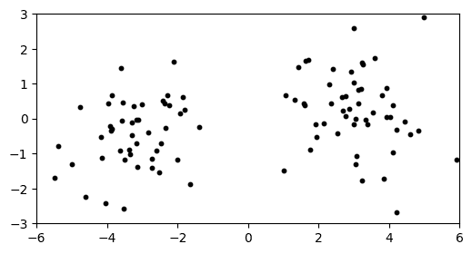
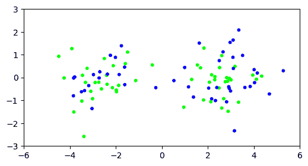
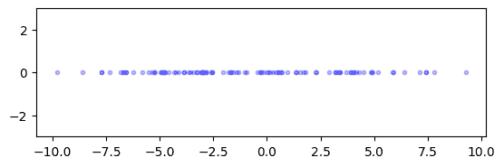
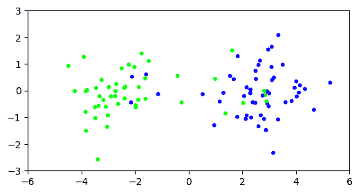

# 4.4\. 力迭代

> 原文：[`mmids-textbook.github.io/chap04_svd/04_power/roch-mmids-svd-power.html`](https://mmids-textbook.github.io/chap04_svd/04_power/roch-mmids-svd-power.html)

通常情况下，[没有精确的方法](https://math.stackexchange.com/questions/2582300/what-does-the-author-mean-by-no-method-exists-for-exactly-computing-the-eigenva)来计算奇异值分解。相反，我们必须依赖于迭代方法，即逐步接近解的方法。在本节中，我们描述了力迭代方法。这种方法是计算奇异值分解的有效数值方法背后的方法。

这里关注的是数值方法，我们不会花太多时间手动计算奇异值分解。但请注意，SVD 与 $A^T A$ 的谱分解之间的联系可以用于小例子的这个目的。

## 4.4.1\. 关键引理#

我们现在推导出计算奇异向量的算法背后的主要思想。设 $U \Sigma V^T$ 是 $A$ 的一个（紧凑）奇异值分解。由于 $U$ 和 $V$ 的正交性，$A^T A$ 的幂有简单的表示。确实

$$ B = A^T A = (U \Sigma V^T)^T (U \Sigma V^T) = V \Sigma^T U^T U \Sigma V^T = V \Sigma^T \Sigma V^T. $$

注意，这个公式与我们之前未发现的 SVD 与 $A^T A$ 的谱分解之间的联系密切相关——尽管它并不是 $A^T A$ 的谱分解，因为 $V$ 不是正交的。

迭代，

$$ B² = (V \Sigma^T \Sigma V^T) (V \Sigma^T \Sigma V^T) = V (\Sigma^T \Sigma)² V^T, $$

并且，对于一般的 $k$,

$$ B^{k} = V (\Sigma^T \Sigma)^{k} V^T. $$

因此，定义

$$\begin{split} \widetilde{\Sigma} = \Sigma^T \Sigma = \begin{pmatrix} \sigma_1² & 0 & \cdots & 0\\ 0 & \sigma_2² & \cdots & 0\\ \vdots & \vdots & \ddots & \vdots\\ 0 & 0 & \cdots & \sigma_r² \end{pmatrix}, \end{split}$$

我们可以看到

$$\begin{split} \widetilde{\Sigma}^k = \begin{pmatrix} \sigma_1^{2k} & 0 & \cdots & 0\\ 0 & \sigma_2^{2k} & \cdots & 0\\ \vdots & \vdots & \ddots & \vdots\\ 0 & 0 & \cdots & \sigma_r^{2k} \end{pmatrix}. \end{split}$$

当 $\sigma_1 > \sigma_2, \ldots, \sigma_r$ 时，这在现实数据集中通常是情况，当 $k$ 很大时，我们得到 $\sigma_1^{2k} \gg \sigma_2^{2k}, \ldots, \sigma_r^{2k}$。然后，我们得到近似

$$ B^{k} = \sum_{j=1}^r \sigma_j^{2k} \mathbf{v}_j \mathbf{v}_j^T \approx \sigma_1^{2k} \mathbf{v}_1 \mathbf{v}_1^T. $$

最后，我们得到：

**引理** **(力迭代)** $\idx{power iteration lemma}\xdi$ 设 $A \in \mathbb{R}^{n\times m}$ 是一个矩阵，并且设 $U \Sigma V^T$ 是 $A$ 的一个（紧凑）奇异值分解，使得 $\sigma_1 > \sigma_2 > 0$。定义 $B = A^T A$ 并假设 $\mathbf{x} \in \mathbb{R}^m$ 是一个向量，满足 $\langle \mathbf{v}_1, \mathbf{x} \rangle > 0$。那么

$$ \frac{B^{k} \mathbf{x}}{\|B^{k} \mathbf{x}\|} \to \mathbf{v}_1 $$

当 $k \to +\infty$。如果 $\langle \mathbf{v}_1, \mathbf{x} \rangle < 0$，则极限是 $- \mathbf{v}_1$。$\flat$

*证明思路*: 我们使用上述近似并除以范数，以获得一个单位范数向量，其方向为 $\mathbf{v}_1$。

*证明*: 我们有

$$ B^{k}\mathbf{x} = \sum_{j=1}^r \sigma_j^{2k} \mathbf{v}_j \mathbf{v}_j^T \mathbf{x} = \sum_{j=1}^r \sigma_j^{2k} (\mathbf{v}_j^T \mathbf{x}) \mathbf{v}_j. $$

所以

$$\begin{align*} \frac{B^{k} \mathbf{x}}{\|B^{k} \mathbf{x}\|} &= \sum_{j=1}^r \mathbf{v}_j \frac{\sigma_j^{2k} (\mathbf{v}_j^T \mathbf{x})} {\|B^{k} \mathbf{x}\|}\\ &= \mathbf{v}_1 \left\{\frac{\sigma_1^{2k} (\mathbf{v}_1^T \mathbf{x})} {\|B^{k} \mathbf{x}\|}\right\} + \sum_{j=2}^r \mathbf{v}_j \left\{\frac{\sigma_j^{2k} (\mathbf{v}_j^T \mathbf{x})} {\|B^{k} \mathbf{x}\|}\right\}. \end{align*}$$

当 $k\to +\infty$ 时，如果第一个括号中的表达式趋于 $1$，第二个括号中的表达式趋于 $0$，则该表达式趋于 $\mathbf{v}_1$。我们将在下一个引理中证明这一点。

**引理:** 当 $k\to +\infty$ 时，

$$ \frac{\sigma_1^{2k} (\mathbf{v}_1^T \mathbf{x})} {\|B^{k} \mathbf{x}\|} \to 1 \qquad \text{and} \qquad \frac{\sigma_j^{2k} (\mathbf{v}_j^T \mathbf{x})} {\|B^{k} \mathbf{x}\|} \to 0, \ j = 2,\ldots,r. $$

$\flat$

*证明*: 因为 $\mathbf{v}_j$ 是一个正交归一基，

$$ \|B^{k}\mathbf{x}\|² = \sum_{j=1}^r \left[\sigma_j^{2k} (\mathbf{v}_j^T \mathbf{x})\right]² = \sum_{j=1}^r \sigma_j^{4k} (\mathbf{v}_j^T \mathbf{x})². $$

因此，当 $k\to +\infty$ 时，利用 $\mathbf{v}_1^T \mathbf{x} = \langle \mathbf{v}_1, \mathbf{x} \rangle \neq 0$ 这一假设

$$\begin{align*} \frac{\|B^{k}\mathbf{x}\|²}{\sigma_1^{4k} (\mathbf{v}_1^T \mathbf{x})²} &= 1 + \sum_{j=2}^r \frac{\sigma_j^{4k} (\mathbf{v}_j^T \mathbf{x})²}{\sigma_1^{4k} (\mathbf{v}_1^T \mathbf{x})²}\\ &= 1 + \sum_{j=2}^r \left(\frac{\sigma_j}{\sigma_1}\right)^{4k} \frac{(\mathbf{v}_j^T \mathbf{x})²}{(\mathbf{v}_1^T \mathbf{x})²}\\ &\to 1, \end{align*}$$

因为对于所有 $j =2,\ldots,r$，$\sigma_j < \sigma_1$。这意味着通过取平方根并使用 $\langle \mathbf{v}_1, \mathbf{x} \rangle > 0$，可以得出断言的第一部分。第二部分基本上是从相同的论证中得出的。$\square$ $\square$

**示例:** 我们重新审视这个例子

$$\begin{split} A = \begin{pmatrix} 1 & 0\\ -1 & 0 \end{pmatrix}. \end{split}$$

我们之前计算了它的奇异值分解（SVD）并发现

$$\begin{split} \mathbf{v}_1 = \begin{pmatrix} 1\\ 0 \end{pmatrix}. \end{split}$$

这次我们使用 *幂迭代引理*。这里

$$\begin{split} B = A^T A = \begin{pmatrix} 2 & 0\\ 0 & 0 \end{pmatrix}. \end{split}$$

计算这个矩阵的幂是容易的

$$\begin{split} B^k = \begin{pmatrix} 2^k & 0\\ 0 & 0 \end{pmatrix}. \end{split}$$

让我们选择一个任意的初始向量 $\mathbf{x}$，比如说 $(-1, 2)$。然后

$$\begin{split} B^k \mathbf{x} = \begin{pmatrix} -2^k\\ 0 \end{pmatrix} \quad \text{和} \quad \|B^k \mathbf{x}\| = 2^k. \end{split}$$

因此

$$\begin{split} \frac{B^{k} \mathbf{x}}{\|B^{k} \mathbf{x}\|} \to \begin{pmatrix} -1\\ 0 \end{pmatrix} = - \mathbf{v}_1, \end{split}$$

当 $k \to +\infty$。实际上，在这种情况下，收敛发生在一步之后。$\lhd$

导致 **幂迭代引理** 的论据也普遍适用于正半定矩阵的特征向量。设 $A$ 是一个在 $\mathbb{R}^{d \times d}$ 中的对称、正半定矩阵。根据 **谱定理**，它有一个特征向量分解

$$ A = Q \Lambda Q^T = \sum_{i=1}^d \lambda_i \mathbf{q}_i \mathbf{q}_i^T $$

其中，进一步地，由于 **正半定性的特征**，有 $0 \leq \lambda_d \leq \cdots \leq \lambda_1$。由于 $Q$ 的正交性，$A$ 的幂有一个简单的表示。平方给出

$$ A² = (Q \Lambda Q^T) (Q \Lambda Q^T) = Q \Lambda² Q^T. $$

重复，我们得到

$$ A^{k} = Q \Lambda^{k} Q^T. $$

这导致以下结果：

**引理** **（幂迭代法）** $\idx{power iteration lemma}\xdi$ 设 $A$ 是一个在 $\mathbb{R}^{d \times d}$ 中的对称、正半定矩阵，其特征向量分解为 $A= Q \Lambda Q^T$，其中特征值满足 $0 \leq \lambda_d \leq \cdots \leq \lambda_2 < \lambda_1$。假设 $\mathbf{x} \in \mathbb{R}^d$ 是一个向量，使得 $\langle \mathbf{q}_1, \mathbf{x} \rangle > 0$。那么

$$ \frac{A^{k} \mathbf{x}}{\|A^{k} \mathbf{x}\|} \to \mathbf{q}_1 $$

当 $k \to +\infty$。如果 $\langle \mathbf{q}_1, \mathbf{x} \rangle < 0$，则极限是 $- \mathbf{q}_1$。$\flat$

证明与奇异向量的情况类似。

## 4.4.2\. 计算最高奇异向量#

幂迭代法为我们提供了一种计算 $\mathbf{v}_1$ 的方法——至少如果我们使用足够大的 $k$，可以得到一个近似值。但如何找到符合 **幂迭代引理** 要求的适当向量 $\mathbf{x}$？结果是一个随机向量就可以。例如，设 $\mathbf{X}$ 是一个 $m$ 维球面高斯，均值为 $0$，方差为 $1$。那么，$\mathbb{P}[\langle \mathbf{v}_1, \mathbf{X} \rangle = 0] = 0$。

我们实现了由 **幂迭代引理** 提出的算法。也就是说，我们计算 $B^{k} \mathbf{x}$，然后对其进行归一化。为了获得相应的奇异值和左奇异向量，我们使用 $\sigma_1 = \|A \mathbf{v}_1\|$ 和 $\mathbf{u}_1 = A \mathbf{v}_1/\sigma_1$。

```py
def topsing(rng, A, maxiter=10):
    x = rng.normal(0,1,np.shape(A)[1])
    B = A.T @ A
    for _ in range(maxiter):
        x = B @ x
    v = x / LA.norm(x)
    s = LA.norm(A @ v)
    u = A @ v / s
    return u, s, v 
```

**数值角**：我们将将其应用于我们之前提到的两个簇示例。必要的函数在 [mmids.py](https://raw.githubusercontent.com/MMiDS-textbook/MMiDS-textbook.github.io/main/utils/mmids.py) 中，该文件可在 [本书的 GitHub](https://github.com/MMiDS-textbook/MMiDS-textbook.github.io/tree/main) 上找到。

```py
seed = 42
rng = np.random.default_rng(seed)
d, n, w = 10, 100, 3.
X = mmids.two_mixed_clusters(rng, d, n, w)
plt.figure(figsize=(6,3))
plt.scatter(X[:,0], X[:,1], s=10, c='k')
plt.axis([-6,6,-3,3])
plt.show() 
```



让我们计算最大的奇异向量。

```py
u, s, v = topsing(rng, X)
print(v) 
```

```py
[ 0.99257882  0.10164805  0.01581003  0.03202184  0.02075852  0.02798115
 -0.02920916 -0.028189   -0.0166094  -0.00648726] 
```

这大约是 $-\mathbf{e}_1$。我们从 Python 的 `numpy.linalg.svd` 函数（[链接](https://numpy.org/doc/stable/reference/generated/numpy.linalg.svd.html)）中得到大致相同的答案（可能包括符号）。

```py
u, s, vh = LA.svd(X)
print(vh.T[:,0]) 
```

```py
[ 0.99257882  0.10164803  0.01581003  0.03202184  0.02075851  0.02798112
 -0.02920917 -0.028189   -0.01660938 -0.00648724] 
```

回想一下，当我们将 $k$-means 聚类应用于 $d=1000$ 维的示例时，我们得到了一个非常差的聚类结果。

```py
d, n, w = 1000, 100, 3.
X = mmids.two_mixed_clusters(rng, d, n, w)

assign = mmids.kmeans(rng, X, 2) 
```

```py
99423.42794703908
99423.42794703908
99423.42794703908
99423.42794703908
99423.42794703908 
```

```py
plt.figure(figsize=(6,3))
plt.scatter(X[:,0], X[:,1], s=10, c=assign, cmap='brg')
plt.axis([-6,6,-3,3])
plt.show() 
```



让我们再次尝试，但这次在投影到最大的奇异向量之后。回想一下，这对应于找到最佳的一维逼近子空间。投影可以使用截断奇异值分解 $Z= U_{(1)} \Sigma_{(1)} V_{(1)}^T$ 来计算。我们可以将 $U_{(1)} \Sigma_{(1)}$ 的行解释为每个数据点在基 $\mathbf{v}_1$ 中的系数。我们将在这个基上工作。我们需要一个小技巧：因为我们的 $k$-means 聚类实现期望数据点至少在 $2$ 维，所以我们添加了一列 $0$。

```py
u, s, v = topsing(rng, X)
Xproj = np.stack((u*s, np.zeros(np.shape(X)[0])), axis=-1)
fig = plt.figure()
ax = fig.add_subplot(111, aspect='equal')
ax.scatter(Xproj[:,0], Xproj[:,1], s=10, c='b', alpha=0.25)
plt.ylim([-3,3])
plt.show() 
```



在 0 附近有一个小而明显的间隙。我们在投影数据上运行 $k$-means 聚类。

```py
assign = mmids.kmeans(rng, Xproj, 2) 
```

```py
1779.020119584778
514.1899426112672
514.1899426112672
514.1899426112672
514.1899426112672 
```

<details class="hide above-input"><summary aria-label="Toggle hidden content">显示代码单元格源代码 隐藏代码单元格源代码</summary>

```py
plt.figure(figsize=(6,3))
plt.scatter(X[:,0], X[:,1], s=10, c=assign, cmap='brg')
plt.axis([-6,6,-3,3])
plt.show() 
```[详情] 

好多了。我们将在后续部分更正式地解释这一结果。本质上，引用 [BHK，第 7.5.1 节]：

> […] 让我们理解进行投影到 [前 $k$ 个右奇异向量] 的中心优势。简单地说，对于任何合理（未知）的数据点聚类，投影将数据点带到其簇中心附近。

最后，查看最大的右上奇异向量（或由于空间不足而只查看其前十个条目），我们看到它与第一个维度相当一致（但不是完美一致）。

```py
print(v[:10]) 
```

```py
[-0.55564563 -0.02433674  0.02193487 -0.0333936  -0.00445505 -0.00243003
  0.02576056  0.02523275 -0.00682153  0.02524646] 
```

$\unlhd$

**CHAT & LEARN** 计算奇异值分解（SVD）还有其他方法。向您最喜欢的 AI 聊天机器人询问 SVD 的随机算法。它们在处理大型矩阵时在计算效率方面的优势是什么？$\ddagger$

***自我评估测验*** *(由 Claude、Gemini 和 ChatGPT 协助)*

**1** 在正半定情况下的幂迭代引理中，如果初始向量 $\mathbf{x}$ 满足 $\langle \mathbf{q}_1, \mathbf{x} \rangle < 0$，会发生什么？

a) 迭代收敛到 $\mathbf{q}_1$。

b) 迭代收敛到 $-\mathbf{q}_1$。

c) 迭代没有收敛。

d) 迭代收敛到一个随机特征向量。

**2** 在 SVD 情况下的幂迭代引理中，随机向量 $\mathbf{x}$ 的收敛结果是什么？

a) $B^k \mathbf{x} / \|B^k \mathbf{x}\|$ 收敛到 $\mathbf{u}_1$。

b) $B^k \mathbf{x} / \|B^k \mathbf{x}\|$ 收敛到 $\mathbf{v}_1$ 或 $-\mathbf{v}_1$。

c) $(B^k \mathbf{x}) / \|B^k \mathbf{x}\|$ 收敛到 $\sigma_1$。

d) $(B^k \mathbf{x}) / \|B^k \mathbf{x}\|$ 不收敛。

**3** 假设你对矩阵 $A$ 应用幂迭代法并得到一个向量 $\mathbf{v}$。你如何计算相应的奇异值 $\sigma$ 和左奇异向量 $\mathbf{u}$?

a) $\sigma = \|A\mathbf{v}\|$ 和 $\mathbf{u} = A\mathbf{v}/\sigma$

b) $\sigma = \|A^T\mathbf{v}\|$ 和 $\mathbf{u} = A^T\mathbf{v}/\sigma$

c) $\sigma = \|\mathbf{v}\|$ 和 $\mathbf{u} = \mathbf{v}/\sigma$

d) $\sigma = 1$ 和 $\mathbf{u} = A\mathbf{v}$

**4** 在幂迭代法中，初始向量 $\mathbf{x}$ 需要满足什么条件才能确保收敛到最大的特征向量？

a) $\mathbf{x}$ 必须是零向量。

b) $\mathbf{x}$ 必须与最大的特征向量正交。

c) $\langle \mathbf{q}_1, \mathbf{x} \rangle \neq 0$。

d) $\mathbf{x}$ 必须是最大的特征向量本身。

**5** 截断 SVD $Z = U_{(2)} \Sigma_{(2)} V_{(2)}^T$ 对应的是什么？[使用第 4.8.2.1 节]

a) 最佳一维逼近子空间

b) 最佳二维逼近子空间

c) 数据在最大奇异向量上的投影

d) 数据在最大两个奇异向量上的投影

1 的答案：b. 证明：引理表明，如果 $\langle \mathbf{q}_1, \mathbf{x} \rangle < 0$，则 $A^k \mathbf{x} / \|A^k \mathbf{x}\|$ 的极限是 $-\mathbf{q}_1$。

2 的答案：b. 证明：引理表明，如果 $\langle \mathbf{v}_1, \mathbf{x} \rangle > 0$，则 $B^k \mathbf{x} / \|B^k \mathbf{x}\|$ 收敛到 $\mathbf{v}_1$，如果 $\langle \mathbf{v}_1, \mathbf{x} \rangle < 0$，则极限是 $-\mathbf{v}_1$。

3 的答案：a. 证明：文本在“数值角落”部分提供了这些公式。

4 的答案：c. 证明：关键引理表明，如果 $\mathbf{x}$ 满足 $\langle \mathbf{q}_1, \mathbf{x} \rangle \neq 0$，则可以保证收敛。

5 的答案：d. 证明：文本中提到，“在最大的两个奇异向量上投影……对应于找到最佳二维逼近子空间。投影可以使用截断 SVD $Z = U_{(2)} \Sigma_{(2)} V_{(2)}^T$ 来计算。”

## 4.4.1\. 关键引理#

我们现在推导出计算奇异向量的算法背后的主要思想。设 $U \Sigma V^T$ 是 $A$ 的（紧凑）奇异值分解。由于 $U$ 和 $V$ 的正交性，$A^T A$ 的幂有简单的表示。确实

$$ B = A^T A = (U \Sigma V^T)^T (U \Sigma V^T) = V \Sigma^T U^T U \Sigma V^T = V \Sigma^T \Sigma V^T. $$

注意，这个公式与我们之前未发现的 SVD 与 $A^T A$ 的谱分解之间的联系密切相关——尽管它并不是 $A^T A$ 的谱分解，因为 $V$ 不是正交的。

迭代，

$$ B² = (V \Sigma^T \Sigma V^T) (V \Sigma^T \Sigma V^T) = V (\Sigma^T \Sigma)² V^T, $$

对于一般的 $k$，

$$ B^{k} = V (\Sigma^T \Sigma)^{k} V^T. $$

因此，定义

$$\begin{split} \widetilde{\Sigma} = \Sigma^T \Sigma = \begin{pmatrix} \sigma_1² & 0 & \cdots & 0\\ 0 & \sigma_2² & \cdots & 0\\ \vdots & \vdots & \ddots & \vdots\\ 0 & 0 & \cdots & \sigma_r² \end{pmatrix}, \end{split}$$

我们可以看到，

$$\begin{split} \widetilde{\Sigma}^k = \begin{pmatrix} \sigma_1^{2k} & 0 & \cdots & 0\\ 0 & \sigma_2^{2k} & \cdots & 0\\ \vdots & \vdots & \ddots & \vdots\\ 0 & 0 & \cdots & \sigma_r^{2k} \end{pmatrix}. \end{split}$$

当 $\sigma_1 > \sigma_2, \ldots, \sigma_r$ 时，这在实数据集中通常是情况，当 $k$ 很大时，我们得到 $\sigma_1^{2k} \gg \sigma_2^{2k}, \ldots, \sigma_r^{2k}$。然后，我们得到近似

$$ B^{k} = \sum_{j=1}^r \sigma_j^{2k} \mathbf{v}_j \mathbf{v}_j^T \approx \sigma_1^{2k} \mathbf{v}_1 \mathbf{v}_1^T. $$

最后，我们得到：

**引理** **(幂迭代)** $\idx{power iteration lemma}\xdi$ 设 $A \in \mathbb{R}^{n\times m}$ 是一个矩阵，并且设 $U \Sigma V^T$ 是 $A$ 的一个（紧凑的）奇异值分解，使得 $\sigma_1 > \sigma_2 > 0$。定义 $B = A^T A$ 并假设 $\mathbf{x} \in \mathbb{R}^m$ 是一个向量，满足 $\langle \mathbf{v}_1, \mathbf{x} \rangle > 0$。那么

$$ \frac{B^{k} \mathbf{x}}{\|B^{k} \mathbf{x}\|} \to \mathbf{v}_1 $$

当 $k \to +\infty$ 时。如果 $\langle \mathbf{v}_1, \mathbf{x} \rangle < 0$，则极限为 $- \mathbf{v}_1$。 $\flat$

*证明思路：* 我们使用上述近似并除以范数，得到一个方向为 $\mathbf{v}_1$ 的单位范数向量。

*证明：* 我们有

$$ B^{k}\mathbf{x} = \sum_{j=1}^r \sigma_j^{2k} \mathbf{v}_j \mathbf{v}_j^T \mathbf{x} = \sum_{j=1}^r \sigma_j^{2k} (\mathbf{v}_j^T \mathbf{x}) \mathbf{v}_j. $$

所以

$$\begin{align*} \frac{B^{k} \mathbf{x}}{\|B^{k} \mathbf{x}\|} &= \sum_{j=1}^r \mathbf{v}_j \frac{\sigma_j^{2k} (\mathbf{v}_j^T \mathbf{x})} {\|B^{k} \mathbf{x}\|}\\ &= \mathbf{v}_1 \left\{\frac{\sigma_1^{2k} (\mathbf{v}_1^T \mathbf{x})} {\|B^{k} \mathbf{x}\|}\right\} + \sum_{j=2}^r \mathbf{v}_j \left\{\frac{\sigma_j^{2k} (\mathbf{v}_j^T \mathbf{x})} {\|B^{k} \mathbf{x}\|}\right\}. \end{align*}$$

当第一个括号中的表达式趋近于 1，第二个括号中的表达式趋近于 0 时，随着 $k\to +\infty$，这趋向于 $\mathbf{v}_1$。我们将在下一个命题中证明这一点。

**引理** 当 $k\to +\infty$ 时，

$$ \frac{\sigma_1^{2k} (\mathbf{v}_1^T \mathbf{x})} {\|B^{k} \mathbf{x}\|} \to 1 \qquad \text{和} \qquad \frac{\sigma_j^{2k} (\mathbf{v}_j^T \mathbf{x})} {\|B^{k} \mathbf{x}\|} \to 0, \ j = 2,\ldots,r. $$

$\flat$

**证明：** 因为 $\mathbf{v}_j$ 是一个正交基，

$$ \|B^{k}\mathbf{x}\|² = \sum_{j=1}^r \left[\sigma_j^{2k} (\mathbf{v}_j^T \mathbf{x})\right]² = \sum_{j=1}^r \sigma_j^{4k} (\mathbf{v}_j^T \mathbf{x})². $$

因此，当 $k\to +\infty$ 时，利用假设 $\mathbf{v}_1^T \mathbf{x} = \langle \mathbf{v}_1, \mathbf{x} \rangle \neq 0$

$$\begin{align*} \frac{\|B^{k}\mathbf{x}\|²}{\sigma_1^{4k} (\mathbf{v}_1^T \mathbf{x})²} &= 1 + \sum_{j=2}^r \frac{\sigma_j^{4k} (\mathbf{v}_j^T \mathbf{x})²}{\sigma_1^{4k} (\mathbf{v}_1^T \mathbf{x})²}\\ &= 1 + \sum_{j=2}^r \left(\frac{\sigma_j}{\sigma_1}\right)^{4k} \frac{(\mathbf{v}_j^T \mathbf{x})²}{(\mathbf{v}_1^T \mathbf{x})²}\\ &\to 1, \end{align*}$$

因为对于所有 $j =2,\ldots,r$，$\sigma_j < \sigma_1$。这表明通过取平方根并使用 $\langle \mathbf{v}_1, \mathbf{x} \rangle > 0$，可以得出断言的第一部分。断言的第二部分基本上是从相同的论证中得出的。$\square$ $\square$

**示例：** 我们重新审视这个例子

$$\begin{split} A = \begin{pmatrix} 1 & 0\\ -1 & 0 \end{pmatrix}. \end{split}$$

我们之前计算了它的奇异值分解（SVD）并发现

$$\begin{split} \mathbf{v}_1 = \begin{pmatrix} 1\\ 0 \end{pmatrix}. \end{split}$$

这次我们使用**幂迭代引理**。在这里

$$\begin{split} B = A^T A = \begin{pmatrix} 2 & 0\\ 0 & 0 \end{pmatrix}. \end{split}$$

计算这个矩阵的幂是容易的

$$\begin{split} B^k = \begin{pmatrix} 2^k & 0\\ 0 & 0 \end{pmatrix}. \end{split}$$

让我们选择一个任意的初始向量 $\mathbf{x}$，比如说 $(-1, 2)$。然后

$$\begin{split} B^k \mathbf{x} = \begin{pmatrix} -2^k\\ 0 \end{pmatrix} \quad \text{and} \quad \|B^k \mathbf{x}\| = 2^k. \end{split}$$

因此

$$\begin{split} \frac{B^{k} \mathbf{x}}{\|B^{k} \mathbf{x}\|} \to \begin{pmatrix} -1\\ 0 \end{pmatrix} = - \mathbf{v}_1, \end{split}$$

随着 $k \to +\infty$。事实上，在这种情况下，收敛发生在第一步之后。$\lhd$

导致**幂迭代引理**的论据也普遍适用于正半定矩阵的特征向量。设 $A$ 是 $\mathbb{R}^{d \times d}$ 中的一个对称、正半定矩阵。根据**谱定理**，它有一个特征向量分解

$$ A = Q \Lambda Q^T = \sum_{i=1}^d \lambda_i \mathbf{q}_i \mathbf{q}_i^T $$

其中，进一步地，由于**正半定性的特征**，有 $0 \leq \lambda_d \leq \cdots \leq \lambda_1$。由于 $Q$ 的正交性，$A$ 的幂有一个简单的表示。平方给出

$$ A² = (Q \Lambda Q^T) (Q \Lambda Q^T) = Q \Lambda² Q^T. $$

重复进行，我们得到

$$ A^{k} = Q \Lambda^{k} Q^T. $$

这导致以下结果：

**引理** **(幂迭代)** $\idx{power iteration lemma}\xdi$ 设 $A$ 是一个在 $\mathbb{R}^{d \times d}$ 中的对称、正半定矩阵，其特征向量分解为 $A= Q \Lambda Q^T$，其中特征值满足 $0 \leq \lambda_d \leq \cdots \leq \lambda_2 < \lambda_1$。假设 $\mathbf{x} \in \mathbb{R}^d$ 是一个向量，使得 $\langle \mathbf{q}_1, \mathbf{x} \rangle > 0$。那么

$$ \frac{A^{k} \mathbf{x}}{\|A^{k} \mathbf{x}\|} \to \mathbf{q}_1 $$

随着 $k \to +\infty$。如果 $\langle \mathbf{q}_1, \mathbf{x} \rangle < 0$，则极限是 $- \mathbf{q}_1$。 $\flat$

证明与奇异向量的情况类似。

## 4.4.2. 计算最大的奇异向量#

幂迭代为我们提供了一种计算 $\mathbf{v}_1$ 的方法——至少如果我们使用足够大的 $k$，可以得到一个近似值。但是，我们如何找到符合 *幂迭代引理* 要求的适当向量 $\mathbf{x}$ 呢？实际上，一个随机向量就可以。例如，设 $\mathbf{X}$ 是一个 $m$-维球面高斯分布，均值为 $0$，方差为 $1$。那么，$\mathbb{P}[\langle \mathbf{v}_1, \mathbf{X} \rangle = 0] = 0$。

我们实现了由 *幂迭代引理* 提出的算法。也就是说，我们计算 $B^{k} \mathbf{x}$，然后对其进行归一化。为了获得相应的奇异值和左奇异向量，我们使用 $\sigma_1 = \|A \mathbf{v}_1\|$ 和 $\mathbf{u}_1 = A \mathbf{v}_1/\sigma_1$。

```py
def topsing(rng, A, maxiter=10):
    x = rng.normal(0,1,np.shape(A)[1])
    B = A.T @ A
    for _ in range(maxiter):
        x = B @ x
    v = x / LA.norm(x)
    s = LA.norm(A @ v)
    u = A @ v / s
    return u, s, v 
```

**数值角落:** 我们将把它应用到我们之前的两个簇的例子中。必要的函数在 [mmids.py](https://raw.githubusercontent.com/MMiDS-textbook/MMiDS-textbook.github.io/main/utils/mmids.py) 中，该文件可在书的 [GitHub](https://github.com/MMiDS-textbook/MMiDS-textbook.github.io/tree/main) 上找到。

```py
seed = 42
rng = np.random.default_rng(seed)
d, n, w = 10, 100, 3.
X = mmids.two_mixed_clusters(rng, d, n, w)
plt.figure(figsize=(6,3))
plt.scatter(X[:,0], X[:,1], s=10, c='k')
plt.axis([-6,6,-3,3])
plt.show() 
```


让我们计算最大的奇异向量。

```py
u, s, v = topsing(rng, X)
print(v) 
```

```py
[ 0.99257882  0.10164805  0.01581003  0.03202184  0.02075852  0.02798115
 -0.02920916 -0.028189   -0.0166094  -0.00648726] 
```

这大约是 $-\mathbf{e}_1$。我们从 Python 的 `numpy.linalg.svd` 函数（[链接](https://numpy.org/doc/stable/reference/generated/numpy.linalg.svd.html)）中得到的答案（可能包括符号）大致相同。

```py
u, s, vh = LA.svd(X)
print(vh.T[:,0]) 
```

```py
[ 0.99257882  0.10164803  0.01581003  0.03202184  0.02075851  0.02798112
 -0.02920917 -0.028189   -0.01660938 -0.00648724] 
```

回想一下，当我们用 $d=1000$ 维度的 $k$-means 聚类算法处理这个例子时，我们得到了一个非常差的聚类结果。

```py
d, n, w = 1000, 100, 3.
X = mmids.two_mixed_clusters(rng, d, n, w)

assign = mmids.kmeans(rng, X, 2) 
```

```py
99423.42794703908
99423.42794703908
99423.42794703908
99423.42794703908
99423.42794703908 
```

```py
plt.figure(figsize=(6,3))
plt.scatter(X[:,0], X[:,1], s=10, c=assign, cmap='brg')
plt.axis([-6,6,-3,3])
plt.show() 
```


让我们再次尝试，但这次在投影到最高奇异向量之后。回想一下，这对应于找到最佳一维逼近子空间。投影可以使用截断奇异值分解 $Z= U_{(1)} \Sigma_{(1)} V_{(1)}^T$ 来计算。我们可以将 $U_{(1)} \Sigma_{(1)}$ 的行解释为每个数据点在基 $\mathbf{v}_1$ 中的系数。我们将在这个基上工作。我们需要一个小技巧：因为我们的 $k$-means 聚类实现期望数据点至少在 $2$ 维，所以我们添加了一列 0。

```py
u, s, v = topsing(rng, X)
Xproj = np.stack((u*s, np.zeros(np.shape(X)[0])), axis=-1)
fig = plt.figure()
ax = fig.add_subplot(111, aspect='equal')
ax.scatter(Xproj[:,0], Xproj[:,1], s=10, c='b', alpha=0.25)
plt.ylim([-3,3])
plt.show() 
```


在 0 附近有一个小——但明显——的间隙。我们在投影数据上运行 $k$-means 聚类。

```py
assign = mmids.kmeans(rng, Xproj, 2) 
```

```py
1779.020119584778
514.1899426112672
514.1899426112672
514.1899426112672
514.1899426112672 
```

<details class="hide above-input"><summary aria-label="Toggle hidden content">显示代码单元格源 隐藏代码单元格源</summary>

```py
plt.figure(figsize=(6,3))
plt.scatter(X[:,0], X[:,1], s=10, c=assign, cmap='brg')
plt.axis([-6,6,-3,3])
plt.show() 
```</details> 

更好了。我们将在后续章节中给出这个结果的更正式解释。本质上，引用[BHK，第 7.5.1 节]：

> […] 让我们理解将投影做到[前 $k$ 个右奇异向量]的中心优势。简单地说，对于任何合理的（未知）数据点聚类，投影会使数据点更接近它们的簇中心。

最后，查看右上奇异向量（或由于空间不足而只查看其前十个条目），我们看到它与第一维相当一致（但不是完美一致）。

```py
print(v[:10]) 
```

```py
[-0.55564563 -0.02433674  0.02193487 -0.0333936  -0.00445505 -0.00243003
  0.02576056  0.02523275 -0.00682153  0.02524646] 
```

$\unlhd$

**CHAT & LEARN** 计算奇异值分解（SVD）还有其他方法。向你的心仪 AI 聊天机器人询问 SVD 的随机算法。它们在处理大型矩阵时在计算效率方面的优势是什么？ $\ddagger$

***自我评估测验*** *(由 Claude、Gemini 和 ChatGPT 协助)*

**1** 在正半定情况的幂迭代引理中，当初始向量 $\mathbf{x}$ 满足 $\langle \mathbf{q}_1, \mathbf{x} \rangle < 0$ 时会发生什么？

a) 迭代收敛到 $\mathbf{q}_1$.

b) 迭代收敛到 $-\mathbf{q}_1$.

c) 迭代没有收敛。

d) 迭代收敛到一个随机特征向量。

**2** 在 SVD 情况的幂迭代引理中，对于随机向量 $\mathbf{x}$ 的收敛结果是什么？

a) $\frac{B^k \mathbf{x}}{\|B^k \mathbf{x}\|}$ 收敛到 $\mathbf{u}_1$.

b) $\frac{B^k \mathbf{x}}{\|B^k \mathbf{x}\|}$ 收敛到 $\mathbf{v}_1$ 或 $-\mathbf{v}_1$.

c) $\frac{B^k \mathbf{x}}{\|B^k \mathbf{x}\|}$ 收敛到 $\sigma_1$.

d) $\frac{B^k \mathbf{x}}{\|B^k \mathbf{x}\|}$ 没有收敛。

**3** 假设你将幂迭代方法应用于矩阵 $A$ 并得到向量 $\mathbf{v}$。你如何计算相应的奇异值 $\sigma$ 和左奇异向量 $\mathbf{u}$？

a) $\sigma = \|A\mathbf{v}\|$ 和 $\mathbf{u} = A\mathbf{v}/\sigma$

b) $\sigma = \|A^T\mathbf{v}\|$ 和 $\mathbf{u} = A^T\mathbf{v}/\sigma$

c) $\sigma = \|\mathbf{v}\|$ 和 $\mathbf{u} = \mathbf{v}/\sigma$

d) $\sigma = 1$ 和 $\mathbf{u} = A\mathbf{v}$

**4** 在幂迭代法中，为了确保初始向量 $\mathbf{x}$ 收敛到最大的特征向量，需要满足什么条件？

a) $\mathbf{x}$ 必须是零向量。

b) $\mathbf{x}$ 必须与最大的特征向量正交。

c) $\langle \mathbf{q}_1, \mathbf{x} \rangle \neq 0$

d) $\mathbf{x}$ 必须是最大的特征向量本身。

**5** 截断奇异值分解 $Z = U_{(2)} \Sigma_{(2)} V_{(2)}^T$ 对应的是什么？[使用第 4.8.2.1 节。]

a) 最佳一维逼近子空间

b) 最佳二维逼近子空间

c) 将数据投影到最大的奇异向量上

d) 将数据投影到前两个奇异向量上

1 的答案：b. 理由：引理表明，如果 $\langle \mathbf{q}_1, \mathbf{x} \rangle < 0$，那么 $A^k \mathbf{x} / \|A^k \mathbf{x}\|$ 的极限是 $-\mathbf{q}_1$。

2 的答案：b. 理由：引理表明，如果 $\langle \mathbf{v}_1, \mathbf{x} \rangle > 0$，那么 $B^k \mathbf{x} / \|B^k \mathbf{x}\|$ 收敛到 $\mathbf{v}_1$，如果 $\langle \mathbf{v}_1, \mathbf{x} \rangle < 0$，则极限是 $-\mathbf{v}_1$。

3 的答案：a. 理由：文本在“数值角落”部分提供了这些公式。

4 的答案：c. 理由：关键引理表明，如果 $\mathbf{x}$ 满足 $\langle \mathbf{q}_1, \mathbf{x} \rangle \neq 0$，则可以保证收敛。

5 的答案：d. 理由：文本指出，“投影到前两个奇异向量……对应于找到最佳二维逼近子空间。投影可以使用截断奇异值分解 $Z = U_{(2)} \Sigma_{(2)} V_{(2)}^T$ 来计算。”
