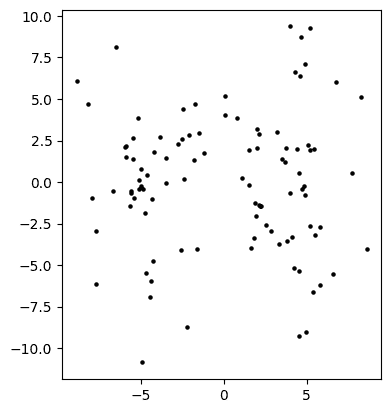
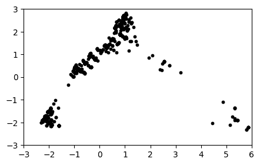
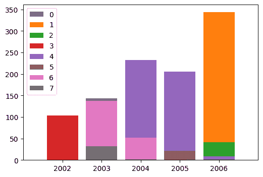
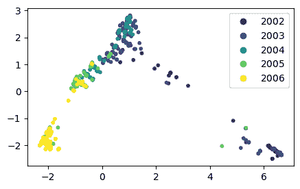

# 4.5. 应用：主成分分析#

> 原文：[`mmids-textbook.github.io/chap04_svd/05_pca/roch-mmids-svd-pca.html`](https://mmids-textbook.github.io/chap04_svd/05_pca/roch-mmids-svd-pca.html)

我们讨论了主成分分析的应用，并回顾了本章早期提到的我们的基因数据集。

## 4.5.1. 通过主成分分析（PCA）进行降维\#

主成分分析（PCA）\(\idx{主成分分析}\xdi\) 是一种常用的降维方法，与我们前几节中描述的方法密切相关。我们正式化这种联系。

*数据矩阵:* 在 PCA 中，我们给出了 \(n\) 个数据点 \(\mathbf{x}_1,\ldots,\mathbf{x}_n \in \mathbb{R}^p\)，其中 \(p\) 是特征（即坐标）。我们用 \((x_{i1},\ldots,x_{ip})\) 表示 \(\mathbf{x}_i\) 的分量。像往常一样，我们将它们堆叠成一个矩阵 \(X\)，其第 \(i\) 行是 \(\mathbf{x}_i^T\)。

主成分分析（PCA）的第一步是对数据进行中心化，即我们假设\(\idx{均值中心化}\xdi\)

\[ \frac{1}{n} \sum_{i=1}^n x_{ij} = 0, \qquad \forall j=1,\ldots,p \]

换句话说，每一列的样本均值是 \(0\)。引用 [维基百科](https://en.wikipedia.org/wiki/Principal_component_analysis#Further_considerations)（以下内容将变得更加清晰）：

> 均值减法（也称为“均值中心化”）是执行经典 PCA 所必需的，以确保第一个主成分描述的是最大方差的方向。如果不执行均值减法，第一个主成分可能更多地或更少地对应于数据的均值。为了找到最小化数据近似均方误差的基，需要零均值。

可选步骤是将每一列除以其 [样本方差](https://en.wikipedia.org/wiki/Variance#Unbiased_sample_variance)，即假设

\[ \frac{1}{n-1} \sum_{i=1}^n x_{ij}² = 1, \qquad \forall j=1,\ldots,p. \]

正如我们在前一章中提到的，当特征以不同的单位测量时，这一点尤为重要，以确保它们的变异性可以有意义地比较。

*第一个主成分:* 第一个主成分是特征的线性组合

\[ t_{i1} = \phi_{11} x_{i1} + \cdots + \phi_{p1} x_{ip} \]

具有最大的样本方差。为了使这一点有意义，我们需要约束 \(\phi_{j1}\)s。具体来说，我们要求

\[ \sum_{j=1}^p \phi_{j1}² = 1. \]

\(\phi_{j1}\)s 被称为 *载荷*，而 \(t_{i1}\)s 被称为 *得分*。

形式上，我们试图解决

\[ \max\left\{\frac{1}{n-1} \sum_{i=1}^n \left(\sum_{j=1}^p \phi_{j1} x_{ij}\right)²\ :\ \sum_{j=1}^p \phi_{j1}² = 1\right\}, \]

其中我们使用了 \(t_{i1}\)s 是中心化的这一事实

\[\begin{align*} \frac{1}{n} \sum_{i=1}^n t_{i1} &= \frac{1}{n} \sum_{i=1}^n [\phi_{11} x_{i1} + \cdots + \phi_{p1} x_{ip}]\\ &= \phi_{11} \frac{1}{n} \sum_{i=1}^n x_{i1} + \cdots + \phi_{p1} \frac{1}{n} \sum_{i=1}^n x_{ip}\\ &= 0, \end{align*}\]

计算它们的样本方差作为它们的平方的平均值

\[ \frac{1}{n-1}\sum_{i=1}^n t_{i1}² = \frac{1}{n-1} \sum_{i=1}^n \left(\sum_{j=1}^p \phi_{j1} x_{ij}\right)². \]

设 \(\boldsymbol{\phi}_1 = (\phi_{11},\ldots,\phi_{p1})\) 和 \(\mathbf{t}_1 = (t_{11},\ldots,t_{n1})\)。那么对于所有 \(i\)

\[ t_{i1} = \mathbf{x}_i^T \boldsymbol{\phi}_1, \]

或者以向量形式

\[ \mathbf{t}_1 = X \boldsymbol{\phi}_1. \]

也

\[ \frac{1}{n-1}\sum_{i=1}^n t_{i1}² = \frac{1}{n-1} \|\mathbf{t}_1\|² = \frac{1}{n-1} \|X \boldsymbol{\phi}_1\|². \]

将上述最大化问题重新写成向量形式，

\[ \max\left\{\frac{1}{n-1} \|X \boldsymbol{\phi}_1\|² : \|\boldsymbol{\phi}_1\|² = 1\right\}, \]

我们看到我们已经遇到过这个问题（直到 \(1/(n-1)\) 的因子，它不影响解）。解决方案是将 \(\boldsymbol{\phi}_1\) 取为 \(\frac{1}{\sqrt{n-1}}X\) 的右上奇异向量（或者简单地 \(X\)）。正如我们所知，这相当于计算矩阵 \(\frac{1}{n-1} X^T X\) 的最大特征向量，这是数据的样本协方差矩阵（考虑到数据已经中心化）。

*第二个主成分:* 第二个主成分是特征的线性组合

\[ t_{i2} = \phi_{12} x_{i1} + \cdots + \phi_{p2} x_{ip} \]

具有最大的样本方差，并且与第一个主成分不相关，即

\[ \frac{1}{n-1} \sum_{i=1}^n t_{i1} t_{i2} = 0. \]

下一个引理展示了如何处理这个条件。同样，我们还需要

\[ \sum_{j=1}^p \phi_{j2}² = 1. \]

如前所述，设 \(\boldsymbol{\phi}_2 = (\phi_{12},\ldots,\phi_{p2})\) 和 \(\mathbf{t}_2 = (t_{12},\ldots,t_{n2})\)。

**引理** **(不相关主成分)** 假设 \(X \neq \mathbf{0}\)。令 \(t_{i1}\)，\(t_{i2}\)，\(\boldsymbol{\phi}_1\)，\(\boldsymbol{\phi}_2\) 如上所述（特别是，\(\boldsymbol{\phi}_1\) 是 \(X\) 的右上奇异向量）。那么

\[ \frac{1}{n-1} \sum_{i=1}^n t_{i1} t_{i2} = 0. \]

成立当且仅当

\[ \langle \boldsymbol{\phi}_1, \boldsymbol{\phi}_2 \rangle = 0. \]

\(\flat\)

*证明:* 条件

\[ \frac{1}{n-1} \sum_{i=1}^n t_{i1} t_{i2} = 0 \]

等价于

\[ \langle \mathbf{t}_1, \mathbf{t}_2 \rangle = 0, \]

其中我们省略了 \(1/(n-1)\) 的因子，因为它不起任何作用。使用 \(\mathbf{t}_1 = X \boldsymbol{\phi}_1\)，以及类似地，\(\mathbf{t}_2 = X \boldsymbol{\phi}_2\)，这反过来又相当于

\[ \langle X \boldsymbol{\phi}_1, X \boldsymbol{\phi}_2 \rangle = 0. \]

因为 \(\boldsymbol{\phi}_1\) 可以选择为 \(X\) 的奇异值分解中的右上奇异向量，根据 *SVD 关系*，有 \(X^T X \boldsymbol{\phi}_1 = \sigma_1² \boldsymbol{\phi}_1\)，其中 \(\sigma_1\) 是与 \(\boldsymbol{\phi}_1\) 相关的奇异值。由于 \(X \neq 0\)，\(\sigma_1 > 0\)。将此代入上面左边的内积中，我们得到

\[\begin{align*} \langle X \boldsymbol{\phi}_1, X \boldsymbol{\phi}_2 \rangle &= \langle X \boldsymbol{\phi}_2, X \boldsymbol{\phi}_1 \rangle\\ &= (X \boldsymbol{\phi}_2)^T (X \boldsymbol{\phi}_1)\\ &= \boldsymbol{\phi}_2^T X^T X \boldsymbol{\phi}_1\\ &= \boldsymbol{\phi}_2^T (\sigma_1² \boldsymbol{\phi}_1)\\ &= \langle \boldsymbol{\phi}_2, \sigma_1² \boldsymbol{\phi}_1 \rangle\\ &= \sigma_1² \langle \boldsymbol{\phi}_1, \boldsymbol{\phi}_2 \rangle. \end{align*}\]

因为 \(\sigma_1 \neq 0\)，这只有在 \(\langle \boldsymbol{\phi}_1, \boldsymbol{\phi}_2 \rangle = 0\) 时才成立。 \(\square\)

因此，我们可以将第二个主成分的最大化问题写成矩阵形式，

\[ \max\left\{\frac{1}{n-1} \|X \boldsymbol{\phi}_2\|² : \|\boldsymbol{\phi}_2\|² = 1, \langle \boldsymbol{\phi}_1, \boldsymbol{\phi}_2 \rangle = 0\right\}. \]

再次，我们看到我们之前遇到过这个问题。解决方案是将 \(\boldsymbol{\phi}_2\) 取为 \(\frac{1}{\sqrt{n-1}}X\)（或简单地 \(X\)）的奇异值分解中的第二个右奇异向量。再次，这相当于计算样本协方差矩阵 \(\frac{1}{n-1} X^T X\) 的第二个特征向量。

*进一步的主成分*：我们可以以类似的方式继续进行，并定义进一步的主成分。

引用[维基百科](https://en.wikipedia.org/wiki/Principal_component_analysis#Further_considerations)：

> 主成分分析（PCA）本质上是在点的均值周围旋转点集，以与主成分对齐。这尽可能地将方差（使用正交变换）移动到前几个维度。因此，剩余维度的值往往很小，并且可以最小损失信息地删除 [...] PCA 通常以这种方式用于降维。PCA 的特点是它是保持具有最大“方差”子空间的最佳正交变换 [...]

形式上，设

\[ X = U \Sigma V^T \]

是数据矩阵 \(X\) 的奇异值分解。截断到第 \(\ell\) 个成分的主成分变换是

\[ T = X V_{(\ell)}, \]

其中 \(T\) 是列向量 \(\mathbf{t}_1,\ldots,\mathbf{t}_\ell\) 的矩阵。回忆一下，\(V_{(\ell)}\) 是由 \(V\) 的前 \(k\) 列组成的矩阵。

然后，利用右奇异向量的正交性，

\[\begin{split} T = U \Sigma V^T V_{(\ell)} = U \Sigma \begin{bmatrix} I_{\ell \times \ell}\\ \mathbf{0}_{(p-\ell)\times \ell}\end{bmatrix} = U \begin{bmatrix}\Sigma_{(\ell)}\\ \mathbf{0}_{(p-\ell)\times \ell}\end{bmatrix} = U_{(\ell)} \Sigma_{(\ell)}. \end{split}\]

换句话说，向量 \(\mathbf{t}_i\) 是由相应的奇异值 \(\sigma_i\) 缩放的左奇异向量 \(\mathbf{u}_i\)。

在建立了 PCA 和 SVD 之间的正式联系后，我们使用 SVD 算法实现 PCA，即 `numpy.linalg.svd`。我们执行均值中心化（现在是时候再次阅读关于均值中心化重要性的那段引言了），但不进行可选的标准化。我们利用在 NumPy 中，从矩阵中减去一个与列数匹配的向量执行行减法的事实。

```py
def pca(X, l):
    mean = np.mean(X, axis=0)
    Y = X - mean
    U, S, Vt = LA.svd(Y, full_matrices=False)
    return U[:, :l] @ np.diag(S[:l]) 
```

**数值角**: 我们将其应用于高斯混合模型。

```py
seed = 535
rng = np.random.default_rng(seed)
d, n, w = 1000, 100, 3.
X = mmids.two_mixed_clusters(rng, d, n, w)
T = pca(X, 2) 
```

绘制结果，我们看到 PCA 确实成功地找到了主要的变化方向。注意中间的差距。

```py
fig = plt.figure()
ax = fig.add_subplot(111,aspect='equal')
ax.scatter(T[:,0], T[:,1], s=5, c='k')
plt.show() 
```



然而，请注意，前两个主成分实际上“捕获了比原始前两个坐标中可见的更多噪声”，这是一种过度拟合的形式。

**尝试一下！** 计算均值中心化后 \(X\) 的前两个右奇异向量 \(\mathbf{v}_1\) 和 \(\mathbf{v}_2\)。它们是否与第一个和第二个标准基向量 \(\mathbf{e}_1\) 和 \(\mathbf{e}_2\) 对齐得很好？为什么或为什么不？([在 Colab 中打开](https://colab.research.google.com/github/MMiDS-textbook/MMiDS-textbook.github.io/blob/main/just_the_code/roch_mmids_chap_svd_notebook.ipynb))

\(\unlhd\)

我们回到我们的动机示例。我们对我们的遗传数据集应用 PCA。

**图**: 病毒 (*来源:* 使用 [Midjourney](https://www.midjourney.com/) 制作)


\(\bowtie\)

**数值角**: 我们再次加载数据集。回想一下，它包含 \(1642\) 个菌株，存在于一个 \(317\) 维的空间中。

```py
data = pd.read_csv('h3n2-snp.csv') 
```

我们的目标是找到数据的一个“良好”的低维表示。我们使用 PCA 在十个维度上工作。

```py
A = data[[data.columns[i] for i in range(1,len(data.columns))]].to_numpy()
n_dims = 10
T = pca(A, n_dims) 
```

我们绘制前两个主成分，并看到似乎有一些潜在的结构。

```py
plt.figure(figsize=(5,3))
plt.scatter(T[:,0], T[:,1], s=10, c='k')
plt.axis([-3,6,-3,3])
plt.show() 
```



在这个投影中似乎有一些定义合理的簇。我们使用 \(k\)-means 来识别簇。我们利用 scikit-learn 中的实现，[`sklearn.cluster.KMeans`](https://scikit-learn.org/stable/modules/generated/sklearn.cluster.KMeans.html)。默认情况下，它找到 \(8\) 个簇。簇可以从属性 `labels_` 中提取。

```py
from sklearn.cluster import KMeans

n_clusters = 8
kmeans = KMeans(n_clusters=n_clusters, init='k-means++', 
                random_state=seed, n_init=10).fit(T)
assign = kmeans.labels_ 
```

为了进一步揭示结构，我们查看我们的簇在年份上的分布。这些信息在另一个文件中。

```py
data_oth = pd.read_csv('h3n2-other.csv')
data_oth.head() 
```

|  | 菌株 | 长度 | 国家 | 年份 | 经度 | 纬度 | 日期 |
| --- | --- | --- | --- | --- | --- | --- | --- |
| 0 | AB434107 | 1701 | 日本 | 2002 | 137.215474 | 35.584176 | 2002/02/25 |
| 1 | AB434108 | 1701 | 日本 | 2002 | 137.215474 | 35.584176 | 2002/03/01 |
| 2 | CY000113 | 1762 | 美国 | 2002 | -73.940000 | 40.670000 | 2002/01/29 |
| 3 | CY000209 | 1760 | 美国 | 2002 | -73.940000 | 40.670000 | 2002/01/17 |
| 4 | CY000217 | 1760 | 美国 | 2002 | -73.940000 | 40.670000 | 2002/02/26 |

```py
year = data_oth['year'].to_numpy() 
```

对于每个簇，我们绘制其数据点中有多少来自特定年份。每个簇都有不同的颜色。

```py
fig, ax = plt.subplots(figsize=(6,4))

for i in range(n_clusters):
    unique, counts = np.unique(year[assign == i], return_counts=True)
    ax.bar(unique, counts, label=i)

ax.set(xlim=(2001, 2007), xticks=np.arange(2002, 2007))
ax.legend()
plt.show() 
```



令人惊讶的是，我们看到每个簇主要来自一年或两年连续的年份。换句话说，在这个低维投影中的聚类捕捉到了一些真正的潜在结构，而这些结构并没有明确地体现在计算它的遗传数据中。

回到前两个主成分，我们根据年份给散点图上的点着色。（我们使用[`legend_elements()`](https://matplotlib.org/stable/api/collections_api.html#matplotlib.collections.PathCollection.legend_elements)来自动创建图例。）

```py
fig = plt.figure(figsize=(5,3))
ax = fig.add_subplot(111, aspect='equal')
scatter = ax.scatter(T[:,0], T[:,1], s=10,  c=year, label=year)
plt.legend(*scatter.legend_elements())
plt.show() 
```



在一定程度上，可以看到病毒从一年到一年地进化。特别是，x 轴似乎与年份有很强的相关性，即后来的年份的样本倾向于图表的一侧。

为了进一步量化这一观察结果，我们使用[`numpy.corrcoef`](https://numpy.org/doc/stable/reference/generated/numpy.corrcoef.html)来计算年份和前 10 个主成分之间的相关系数。

```py
corr = np.zeros(n_dims)
for i in range(n_dims):
    corr[i] = np.corrcoef(np.stack((T[:,i], year)))[0,1]

print(corr) 
```

```py
[-0.7905001  -0.42806325  0.0870437  -0.16839491  0.05757342 -0.06046913
 -0.07920042  0.01436618 -0.02544749  0.04314641] 
```

的确，我们看到前三个或四个主成分与年份的相关性很好。

使用[相关技术](https://bmcgenet.biomedcentral.com/articles/10.1186/1471-2156-11-94/figures/8)，也可以确定哪些突变区分了不同的流行病（即，年份）。

\(\unlhd\)

**CHAT & LEARN** 向您最喜欢的 AI 聊天机器人询问主成分分析（PCA）和线性判别分析（LDA）之间的区别。 \(\ddagger\)

***自我评估测验*** *(由 Claude、Gemini 和 ChatGPT 协助)*

**1** 主成分分析（PCA）的目标是什么？

a) 在数据中找到簇。

b) 找到数据中特征的最大方差的低维表示。

c) 找到数据中每个特征的平均值。

d) 找到数据中特征之间的相关性。

**2** 形式上，第一个主成分是特征 \(t_{i1} = \sum_{j=1}^p \phi_{j1} x_{ij}\) 的线性组合，它解决了哪个优化问题？

a) \(\max \left\{ \frac{1}{n-1} \|X\boldsymbol{\phi}_1\|² : \|\boldsymbol{\phi}_1\|² = 1\right\}\)

b) \(\min \left\{ \frac{1}{n-1} \|X\boldsymbol{\phi}_1\|² : \|\boldsymbol{\phi}_1\|² = 1\right\}\)

c) \(\max \left\{ \frac{1}{n-1} \|X\boldsymbol{\phi}_1\|² : \|\boldsymbol{\phi}_1\|² \leq 1\right\}\)

d) \(\min \left\{ \frac{1}{n-1} \|X\boldsymbol{\phi}_1\|² : \|\boldsymbol{\phi}_1\|² \leq 1\right\}\)

**3** PCA 中的载荷与数据矩阵的奇异向量之间的关系是什么？

a) 载荷是左奇异向量。

b) 载荷是右奇异向量。

c) 载荷是奇异值。

d) 载荷与奇异向量之间没有直接关系。

**4** 主成分变换 \(T = XV^{(l)}\) 中的矩阵 \(T\) 的维度是多少？

a) \(n \times p\)

b) \(n \times l\)

c) \(l \times p\)

d) \(p \times l\)

**5** PCA 中数据中心化的目的是什么？

a) 为了使计算更简单。

b) 确保第一个主成分描述最大方差的方向。

c) 为了归一化数据。

d) 为了去除异常值。

1 的答案：b. 理由：文本指出，“主成分分析（PCA）是一种常用的降维方法”，并且“第一个主成分是特征的最大样本方差的线性组合……”

2 的答案：a. 理由：文本指出，“形式上，我们寻求解决 \(\max \left\{ \frac{1}{n-1} \|X\boldsymbol{\phi}_1\|² : \|\boldsymbol{\phi}_1\|² = 1\right\}\)。”

3 的答案：b. 理由：文本解释说，PCA 优化问题的解是将载荷取为数据矩阵右上角的奇异向量。

4 的答案：b. 理由：矩阵 \(T\) 包含数据点在第一个 \(l\) 个主成分上的得分。由于有 \(n\) 个数据点和 \(l\) 个主成分，\(T\) 的维度是 \(n \times l\)。

5 的答案：b. 理由：文本提到，“均值减法（也称为‘均值中心化’）对于执行经典 PCA 是必要的，以确保第一个主成分描述最大方差的方向。”

## 4.5.1\. 通过主成分分析（PCA）进行降维#

主成分分析（PCA）\(\idx{principal components analysis}\xdi\) 是一种常用的降维方法，它与我们在前几节中描述的内容密切相关。我们正式化这种联系。

*数据矩阵：* 在 PCA 中，我们给出了 \(n\) 个数据点 \(\mathbf{x}_1,\ldots,\mathbf{x}_n \in \mathbb{R}^p\)，其中 \(p\) 是特征（即坐标）。我们用 \((x_{i1},\ldots,x_{ip})\) 表示 \(\mathbf{x}_i\) 的分量。像往常一样，我们将它们堆叠成一个矩阵 \(X\)，其第 \(i\) 行是 \(\mathbf{x}_i^T\)。

主成分分析（PCA）的第一步是对数据进行中心化，即我们假设\(\idx{均值中心化}\xdi\)

\[ \frac{1}{n} \sum_{i=1}^n x_{ij} = 0, \qquad \forall j=1,\ldots,p \]

换句话说，每一列的经验均值是 \(0\)。引用 [维基百科](https://en.wikipedia.org/wiki/Principal_component_analysis#Further_considerations)（以下将变得更加清晰）：

> 均值减法（也称为“均值中心化”）对于执行经典 PCA 是必要的，以确保第一个主成分描述的是最大方差的方向。如果没有执行均值减法，第一个主成分可能更多地或更少地对应于数据的均值。为了找到最小化数据近似均方误差的基，需要零均值。

可选步骤是将每一列除以其样本方差的平方根，即假设

\[ \frac{1}{n-1} \sum_{i=1}^n x_{ij}² = 1, \qquad \forall j=1,\ldots,p. \]

正如我们在前一章中提到的，当特征以不同的单位测量时，这一点尤为重要，以确保它们的变异性可以有意义地比较。

*第一主成分:* 第一主成分是特征向量的线性组合

\[ t_{i1} = \phi_{11} x_{i1} + \cdots + \phi_{p1} x_{ip} \]

具有最大的样本方差。为了使这一点有意义，我们需要约束 \(\phi_{j1}\)s。具体来说，我们要求

\[ \sum_{j=1}^p \phi_{j1}² = 1. \]

\(\phi_{j1}\)s 被称为 *载荷*，而 \(t_{i1}\)s 被称为 *得分*。

形式上，我们试图解决

\[ \max\left\{\frac{1}{n-1} \sum_{i=1}^n \left(\sum_{j=1}^p \phi_{j1} x_{ij}\right)²\ :\ \sum_{j=1}^p \phi_{j1}² = 1\right\}, \]

其中我们使用了 \(t_{i1}\)s 已经中心化的事实

\[\begin{align*} \frac{1}{n} \sum_{i=1}^n t_{i1} &= \frac{1}{n} \sum_{i=1}^n [\phi_{11} x_{i1} + \cdots + \phi_{p1} x_{ip}]\\ &= \phi_{11} \frac{1}{n} \sum_{i=1}^n x_{i1} + \cdots + \phi_{p1} \frac{1}{n} \sum_{i=1}^n x_{ip}\\ &= 0, \end{align*}\]

计算它们的样本方差作为它们平方的平均值

\[ \frac{1}{n-1}\sum_{i=1}^n t_{i1}² = \frac{1}{n-1} \sum_{i=1}^n \left(\sum_{j=1}^p \phi_{j1} x_{ij}\right)². \]

设 \(\boldsymbol{\phi}_1 = (\phi_{11},\ldots,\phi_{p1})\) 和 \(\mathbf{t}_1 = (t_{11},\ldots,t_{n1})\)。然后对于所有的 \(i\)

\[ t_{i1} = \mathbf{x}_i^T \boldsymbol{\phi}_1, \]

或者以向量形式表示

\[ \mathbf{t}_1 = X \boldsymbol{\phi}_1. \]

此外

\[ \frac{1}{n-1}\sum_{i=1}^n t_{i1}² = \frac{1}{n-1} \|\mathbf{t}_1\|² = \frac{1}{n-1} \|X \boldsymbol{\phi}_1\|². \]

将上述最大化问题重新写成向量形式，

\[ \max\left\{\frac{1}{n-1} \|X \boldsymbol{\phi}_1\|² : \|\boldsymbol{\phi}_1\|² = 1\right\}, \]

我们看到我们已经遇到过这个问题（直到 \(1/(n-1)\) 的因子，它不影响解）。解决方案是将 \(\boldsymbol{\phi}_1\) 取为 \(\frac{1}{\sqrt{n-1}}X\) 的右上角奇异向量（或者简单地取 \(X\)）。正如我们所知，这等价于计算矩阵 \(\frac{1}{n-1} X^T X\) 的最大特征向量，这是数据的样本协方差矩阵（考虑到数据已经中心化）。

*第二个主成分:* 第二个主成分是特征的线性组合

\[ t_{i2} = \phi_{12} x_{i1} + \cdots + \phi_{p2} x_{ip} \]

具有最大的样本方差，并且与第一个主成分不相关，即

\[ \frac{1}{n-1} \sum_{i=1}^n t_{i1} t_{i2} = 0. \]

下一个引理展示了如何处理这个条件。同样，我们还需要

\[ \sum_{j=1}^p \phi_{j2}² = 1. \]

如前所述，设 \(\boldsymbol{\phi}_2 = (\phi_{12},\ldots,\phi_{p2})\) 和 \(\mathbf{t}_2 = (t_{12},\ldots,t_{n2})\)。

**引理** **(不相关的主成分)** 假设 \(X \neq \mathbf{0}\)。设 \(t_{i1}\)，\(t_{i2}\)，\(\boldsymbol{\phi}_1\)，\(\boldsymbol{\phi}_2\) 如上所述（特别是，\(\boldsymbol{\phi}_1\) 是 \(X\) 的右上角奇异向量）。那么

\[ \frac{1}{n-1} \sum_{i=1}^n t_{i1} t_{i2} = 0 \]

成立当且仅当

\[ \langle \boldsymbol{\phi}_1, \boldsymbol{\phi}_2 \rangle = 0. \]

\(\flat\)

*证明:* 条件

\[ \frac{1}{n-1} \sum_{i=1}^n t_{i1} t_{i2} = 0 \]

等价于

\[ \langle \mathbf{t}_1, \mathbf{t}_2 \rangle = 0, \]

其中我们省略了 \(1/(n-1)\) 的因子，因为它不起任何作用。使用 \(\mathbf{t}_1 = X \boldsymbol{\phi}_1\)，以及类似地，\(\mathbf{t}_2 = X \boldsymbol{\phi}_2\)，这反过来又相当于

\[ \langle X \boldsymbol{\phi}_1, X \boldsymbol{\phi}_2 \rangle = 0. \]

因为 \(\boldsymbol{\phi}_1\) 可以被选作 \(X\) 的奇异值分解中的右上角奇异向量，根据 *奇异值分解关系*，有 \(X^T X \boldsymbol{\phi}_1 = \sigma_1² \boldsymbol{\phi}_1\)，其中 \(\sigma_1\) 是与 \(\boldsymbol{\phi}_1\) 相关的奇异值。由于 \(X \neq 0\)，\(\sigma_1 > 0\)。将此代入上述内积的左侧，我们得到

\[\begin{align*} \langle X \boldsymbol{\phi}_1, X \boldsymbol{\phi}_2 \rangle &= \langle X \boldsymbol{\phi}_2, X \boldsymbol{\phi}_1 \rangle\\ &= (X \boldsymbol{\phi}_2)^T (X \boldsymbol{\phi}_1)\\ &= \boldsymbol{\phi}_2^T X^T X \boldsymbol{\phi}_1\\ &= \boldsymbol{\phi}_2^T (\sigma_1² \boldsymbol{\phi}_1)\\ &= \langle \boldsymbol{\phi}_2, \sigma_1² \boldsymbol{\phi}_1 \rangle\\ &= \sigma_1² \langle \boldsymbol{\phi}_1, \boldsymbol{\phi}_2 \rangle. \end{align*}\]

因为 \(\sigma_1 \neq 0\)，这只有在 \(\langle \boldsymbol{\phi}_1, \boldsymbol{\phi}_2 \rangle = 0\) 时才成立。 \(\square\)

因此，我们可以将第二个主成分的最大化问题写成矩阵形式

\[ \max\left\{\frac{1}{n-1} \|X \boldsymbol{\phi}_2\|² : \|\boldsymbol{\phi}_2\|² = 1, \langle \boldsymbol{\phi}_1, \boldsymbol{\phi}_2 \rangle = 0\right\}. \]

再次，我们看到我们之前遇到过这个问题。解决方案是将 \(\boldsymbol{\phi}_2\) 设为 \(\frac{1}{\sqrt{n-1}}X\)（或简单地 \(X\)）的 SVD 中的第二个右奇异向量。同样，这相当于计算样本协方差矩阵 \(\frac{1}{n-1} X^T X\) 的第二个特征向量。

*进一步的主成分分析：* 我们可以以类似的方式继续进行，并定义进一步的主成分。

引用 [维基百科](https://en.wikipedia.org/wiki/Principal_component_analysis#Further_considerations)：

> PCA 本质上是在点的均值周围旋转点集，以与主成分对齐。这尽可能地将方差（使用正交变换）移动到前几个维度。因此，剩余维度的值往往很小，并且可以最小损失信息地删除 [...] PCA 通常以这种方式用于降维。PCA 的特点是它是保持具有最大“方差”子空间的最佳正交变换 [...]

形式上，让

\[ X = U \Sigma V^T \]

成为数据矩阵 \(X\) 的 SVD。截断到第 \(\ell\) 个成分的主成分变换是

\[ T = X V_{(\ell)}, \]

其中 \(T\) 是其列是向量 \(\mathbf{t}_1,\ldots,\mathbf{t}_\ell\) 的矩阵。回想一下，\(V_{(\ell)}\) 是由 \(V\) 的前 \(k\) 列组成的矩阵。

然后，利用右奇异向量的正交性，

\[\begin{split} T = U \Sigma V^T V_{(\ell)} = U \Sigma \begin{bmatrix} I_{\ell \times \ell}\\ \mathbf{0}_{(p-\ell)\times \ell}\end{bmatrix} = U \begin{bmatrix}\Sigma_{(\ell)}\\ \mathbf{0}_{(p-\ell)\times \ell}\end{bmatrix} = U_{(\ell)} \Sigma_{(\ell)}. \end{split}\]

换句话说，向量 \(\mathbf{t}_i\) 是由相应的奇异值 \(\sigma_i\) 缩放的左奇异向量 \(\mathbf{u}_i\)。

在建立了 PCA 和 SVD 之间的正式联系后，我们使用 SVD 算法 `numpy.linalg.svd` 实现 PCA。我们执行均值中心（现在是时候再次阅读关于均值中心重要性的那段引言了），但不进行可选的标准化。我们使用在 NumPy 中，从矩阵中减去一个与列数匹配的向量执行行减法的事实。

```py
def pca(X, l):
    mean = np.mean(X, axis=0)
    Y = X - mean
    U, S, Vt = LA.svd(Y, full_matrices=False)
    return U[:, :l] @ np.diag(S[:l]) 
```

**数值角：** 我们将其应用于高斯混合模型。

```py
seed = 535
rng = np.random.default_rng(seed)
d, n, w = 1000, 100, 3.
X = mmids.two_mixed_clusters(rng, d, n, w)
T = pca(X, 2) 
```

绘制结果，我们看到 PCA 确实成功地找到了主要变化方向。注意中间的差距。

```py
fig = plt.figure()
ax = fig.add_subplot(111,aspect='equal')
ax.scatter(T[:,0], T[:,1], s=5, c='k')
plt.show() 
```


然而，请注意，前两个主成分实际上“捕捉到的噪声”比原始前两个坐标中看到的要多，这是一种过度拟合的形式。

**尝试！** 计算均值中心化后的 \(X\) 的前两个右奇异向量 \(\mathbf{v}_1\) 和 \(\mathbf{v}_2\)。它们是否与第一个和第二个标准基向量 \(\mathbf{e}_1\) 和 \(\mathbf{e}_2\) 对齐得很好？为什么或为什么不？([在 Colab 中打开](https://colab.research.google.com/github/MMiDS-textbook/MMiDS-textbook.github.io/blob/main/just_the_code/roch_mmids_chap_svd_notebook.ipynb))

\(\unlhd\)

我们回到我们的动机示例。我们对我们的遗传数据集应用 PCA。

**图：病毒 (*来源：使用 [Midjourney](https://www.midjourney.com/))**


\(\bowtie\)

**数值角：** 我们再次加载数据集。回想一下，它包含 \(1642\) 个菌株，存在于 \(317\) 维空间中。

```py
data = pd.read_csv('h3n2-snp.csv') 
```

我们的目标是找到数据的一个“良好”的低维表示。我们使用 PCA 在十个维度上工作。

```py
A = data[[data.columns[i] for i in range(1,len(data.columns))]].to_numpy()
n_dims = 10
T = pca(A, n_dims) 
```

我们绘制前两个主成分，并看到似乎有一些潜在的结构。

```py
plt.figure(figsize=(5,3))
plt.scatter(T[:,0], T[:,1], s=10, c='k')
plt.axis([-3,6,-3,3])
plt.show() 
```


在这个投影中似乎有一些相当明确定义的簇。我们使用 \(k\)-means 来识别簇。我们利用 scikit-learn 中的实现，[`sklearn.cluster.KMeans`](https://scikit-learn.org/stable/modules/generated/sklearn.cluster.KMeans.html)。默认情况下，它找到 \(8\) 个簇。簇可以从属性 `labels_` 中提取。

```py
from sklearn.cluster import KMeans

n_clusters = 8
kmeans = KMeans(n_clusters=n_clusters, init='k-means++', 
                random_state=seed, n_init=10).fit(T)
assign = kmeans.labels_ 
```

为了进一步揭示结构，我们查看这些簇在年份上的分布。这些信息在另一个文件中。

```py
data_oth = pd.read_csv('h3n2-other.csv')
data_oth.head() 
```

|  | 应力 | 长度 | 国家 | 年份 | 经度 | 纬度 | 日期 |
| --- | --- | --- | --- | --- | --- | --- | --- |
| 0 | AB434107 | 1701 | Japan | 2002 | 137.215474 | 35.584176 | 2002/02/25 |
| 1 | AB434108 | 1701 | Japan | 2002 | 137.215474 | 35.584176 | 2002/03/01 |
| 2 | CY000113 | 1762 | USA | 2002 | -73.940000 | 40.670000 | 2002/01/29 |
| 3 | CY000209 | 1760 | USA | 2002 | -73.940000 | 40.670000 | 2002/01/17 |
| 4 | CY000217 | 1760 | USA | 2002 | -73.940000 | 40.670000 | 2002/02/26 |

```py
year = data_oth['year'].to_numpy() 
```

对于每个簇，我们绘制其数据点来自特定年份的数量。每个簇都有不同的颜色。

```py
fig, ax = plt.subplots(figsize=(6,4))

for i in range(n_clusters):
    unique, counts = np.unique(year[assign == i], return_counts=True)
    ax.bar(unique, counts, label=i)

ax.set(xlim=(2001, 2007), xticks=np.arange(2002, 2007))
ax.legend()
plt.show() 
```


非常引人注目的是，我们发现每个簇主要来自一年或两年连续的年份。换句话说，在这个低维投影中的聚类捕捉到了一些真正的潜在结构，而这些结构并没有明确地体现在计算它的遗传数据中。

回到前两个主成分，我们在散点图上根据年份给点着色。（我们使用 `legend_elements()` [链接](https://matplotlib.org/stable/api/collections_api.html#matplotlib.collections.PathCollection.legend_elements) 来自动创建图例。）

```py
fig = plt.figure(figsize=(5,3))
ax = fig.add_subplot(111, aspect='equal')
scatter = ax.scatter(T[:,0], T[:,1], s=10,  c=year, label=year)
plt.legend(*scatter.legend_elements())
plt.show() 
```


在一定程度上，人们可以“看到”病毒逐年演变。特别是，\(x\) 轴似乎与年份有很强的相关性，即后期年份的样本倾向于图表的一侧。

为了进一步量化这一观察结果，我们使用 `numpy.corrcoef`（[链接](https://numpy.org/doc/stable/reference/generated/numpy.corrcoef.html)）来计算年份与第一个 \(10\) 个主成分之间的相关系数。

```py
corr = np.zeros(n_dims)
for i in range(n_dims):
    corr[i] = np.corrcoef(np.stack((T[:,i], year)))[0,1]

print(corr) 
```

```py
[-0.7905001  -0.42806325  0.0870437  -0.16839491  0.05757342 -0.06046913
 -0.07920042  0.01436618 -0.02544749  0.04314641] 
```

事实上，我们看到前三个或四个主成分与年份的相关性很好。

使用 [相关技术](https://bmcgenet.biomedcentral.com/articles/10.1186/1471-2156-11-94/figures/8)，人们还可以确定哪些突变区分了不同的流行病（即，年份）。

\(\unlhd\)

**CHAT & LEARN** 向你最喜欢的 AI 聊天机器人询问主成分分析（PCA）和线性判别分析（LDA）之间的区别。 \(\ddagger\)

***自我评估测验*** *(有 Claude、Gemini 和 ChatGPT 的帮助)*

**1** 主成分分析（PCA）的目标是什么？

a) 在数据中找到聚类。

b) 找到数据的低维表示，该表示能够捕捉到最大的方差。

c) 找到数据中每个特征的均值。

d) 找到数据中特征之间的相关性。

**2** 形式上，第一个主成分是特征 \(t_{i1} = \sum_{j=1}^p \phi_{j1} x_{ij}\) 的线性组合，它解决了哪个优化问题？

a) \(\max \left\{ \frac{1}{n-1} \|X\boldsymbol{\phi}_1\|² : \|\boldsymbol{\phi}_1\|² = 1\right\}\)

b) \(\min \left\{ \frac{1}{n-1} \|X\boldsymbol{\phi}_1\|² : \|\boldsymbol{\phi}_1\|² = 1\right\}\)

c) \(\max \left\{ \frac{1}{n-1} \|X\boldsymbol{\phi}_1\|² : \|\boldsymbol{\phi}_1\|² \leq 1\right\}\)

d) \(\min \left\{ \frac{1}{n-1} \|X\boldsymbol{\phi}_1\|² : \|\boldsymbol{\phi}_1\|² \leq 1\right\}\)

**3** PCA 中的加载量与数据矩阵的奇异向量之间的关系是什么？

a) 加载量是左奇异向量。

b) 加载量是右奇异向量。

c) 加载量是奇异值。

d) 加载量和奇异向量之间没有直接关系。

**4** 主成分变换 \(T = XV^{(l)}\) 中的矩阵 \(T\) 的维度是多少？

a) \(n \times p\)

b) \(n \times l\)

c) \(l \times p\)

d) \(p \times l\)

**5** PCA 中数据中心化的目的是什么？

a) 为了使计算更容易。

b) 确保第一个主成分描述了最大方差的方向。

c) 为了归一化数据。

d) 去除异常值。

答案 1：b. 证明：文本中提到“主成分分析（PCA）是一种常用的降维方法”，并且“第一个主成分是特征 … 的线性组合，具有最大的样本方差。”

答案 2：a. 证明：文本中提到“形式上，我们寻求解决 \(\max \left\{ \frac{1}{n-1} \|X\boldsymbol{\phi}_1\|² : \|\boldsymbol{\phi}_1\|² = 1\right\}\)。”

答案 3：b. 证明：文本解释说，PCA 优化问题的解是取数据矩阵的右上角奇异向量作为负载量。

答案 4：b. 证明：矩阵 \(T\) 包含了数据点在第一个 \(l\) 个主成分上的得分。由于有 \(n\) 个数据点，\(l\) 个主成分，因此 \(T\) 的维度是 \(n \times l\)。

答案 5：b. 证明：文本提到“减去均值（也称为‘均值中心化’）对于执行经典 PCA 是必要的，以确保第一个主成分描述了最大方差的方向。”
