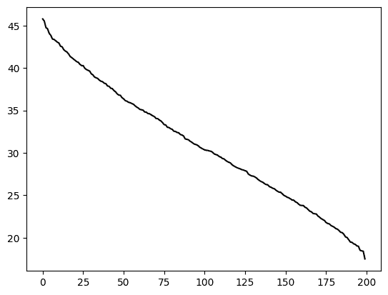

# 4.6\. SVD 的进一步应用：低秩逼近和岭回归

> 原文：[`mmids-textbook.github.io/chap04_svd/06_further/roch-mmids-svd-further.html`](https://mmids-textbook.github.io/chap04_svd/06_further/roch-mmids-svd-further.html)

在本节中，我们将进一步讨论 SVD 的性质。我们首先介绍额外的矩阵范数。

## 4.6.1\. 矩阵范数#

回想一下，$n \times m$矩阵$A = (a_{i,j})_{i,j} \in \mathbb{R}^{n \times m}$的 Frobenius 范数$\idx{Frobenius norm}\xdi$定义为

$$ \|A\|_F = \sqrt{\sum_{i=1}^n \sum_{j=1}^m a_{i,j}²}. $$

在这里，我们介绍了一种不同的矩阵范数概念，它在数据科学（及其他领域）中有许多用途。

**诱导范数** Frobenius 范数并不直接与$A$作为[线性映射](https://en.wikipedia.org/wiki/Linear_map)的代表相关。在许多情况下，我们希望量化两个矩阵在如何作用于向量方面的差异。例如，人们通常对以下形式的量感兴趣。设$B, B' \in \mathbb{R}^{n \times m}$，设$\mathbf{x} \in \mathbb{R}^m$为单位范数。关于$\|B \mathbf{x} - B' \mathbf{x}\|$可以说什么？直观上，我们希望的是：如果$B - B'$的范数很小，那么$B$在作为线性映射时接近$B'$，也就是说，对于任何单位向量$\mathbf{x}$，向量范数$\|B \mathbf{x} - B' \mathbf{x}\|$都很小。以下定义为我们提供了这样的概念。定义$m$维度的单位球$\mathbb{S}^{m-1} = \{\mathbf{x} \in \mathbb{R}^m\,:\,\|\mathbf{x}\| = 1\}$。

**定义** **($2$-范数)** 矩阵$A \in \mathbb{R}^{n \times m}$的$2$-范数$\idx{2-norm}\xdi$定义为

$$ \|A\|_2 := \max_{\mathbf{0} \neq \mathbf{x} \in \mathbb{R}^m} \frac{\|A \mathbf{x}\|}{\|\mathbf{x}\|} = \max_{\mathbf{x} \in \mathbb{S}^{m-1}} \|A \mathbf{x}\|. $$

$\natural$

定义中的等式使用了向量范数的绝对齐次性。同时，定义隐含地使用了*极值定理*。在这种情况下，我们使用函数$f(\mathbf{x}) = \|A \mathbf{x}\|$是连续的，集合$\mathbb{S}^{m-1}$是闭且有界的这一事实，得出存在$\mathbf{x}^* \in \mathbb{S}^{m-1}$，使得对于所有$\mathbf{x} \in \mathbb{S}^{m-1}$，有$f(\mathbf{x}^*) \geq f(\mathbf{x})$。

矩阵的$2$-范数具有许多其他有用的性质。下面列出的前四个性质是使其成为[范数](https://en.wikipedia.org/wiki/Matrix_norm#Preliminaries)的原因。

**引理** **($2$-范数的性质)** 设$A, B \in \mathbb{R}^{n \times m}$且$\alpha \in \mathbb{R}$。以下性质成立：

a) $\|A\|_2 \geq 0$

b) $\|A\|_2 = 0$当且仅当$A = 0$

c) $\|\alpha A\|_2 = |\alpha| \|A\|_2$

d) $\|A + B \|_2 \leq \|A\|_2 + \|B\|_2$

e) $\|A B \|_2 \leq \|A\|_2 \|B\|_2$.

f) $\|A \mathbf{x}\| \leq \|A\|_2 \|\mathbf{x}\|$, $\forall \mathbf{0} \neq \mathbf{x} \in \mathbb{R}^m$

$\flat$

*证明* 这些性质都遵循 $2$-范数的定义以及向量范数的相应性质：

+   声明 a) 和 f) 是直接的。

+   对于 b)，注意 $\|A\|_2 = 0$ 意味着 $\|A \mathbf{x}\|_2 = 0, \forall \mathbf{x} \in \mathbb{S}^{m-1}$，因此 $A \mathbf{x} = \mathbf{0}, \forall \mathbf{x} \in \mathbb{S}^{m-1}$。特别是，$a_{ij} = \mathbf{e}_i^T A \mathbf{e}_j = 0, \forall i,j$.

+   对于 c)，d)，e)，观察对于所有 $\mathbf{x} \in \mathbb{S}^{m-1}$

$$ \|\alpha A \mathbf{x}\| = |\alpha| \|A \mathbf{x}\|, $$$$\|(A+B)\mathbf{x}\| = \|A\mathbf{x} + B\mathbf{x}\| \leq \|A\mathbf{x}\| + \|B\mathbf{x}\| \leq \|A\|_2 + \|B\|_2 $$$$ \|(AB)\mathbf{x}\| = \|A(B\mathbf{x})\| \leq \|A\|_2 \|B\mathbf{x}\| \leq \|A\|_2 \|B\|_2.$$

然后应用 $2$-范数的定义。例如，对于 ©，

$$\begin{align*} \|\alpha A\|_2 &= \max_{\mathbf{x} \in \mathbb{S}^{m-1}} \|\alpha A \mathbf{x}\|\\ &= \max_{\mathbf{x} \in \mathbb{S}^{m-1}} |\alpha| \|A \mathbf{x}\|\\ &= |\alpha| \max_{\mathbf{x} \in \mathbb{S}^{m-1}} \|A \mathbf{x}\|\\ &= |\alpha| \|A\|_2, \end{align*}$$

其中我们使用了 $|\alpha|$ 不依赖于 $\mathbf{x}$。$\square$

**数值角落:** 在 NumPy 中，可以使用函数 `numpy.linalg.norm` 的默认值来计算矩阵的 Frobenius 范数，而诱导范数可以通过将相同的函数的 `ord` 参数设置为 `2` 来计算（[链接](https://numpy.org/doc/stable/reference/generated/numpy.linalg.norm.html)）。

```py
A = np.array([[1., 0.],[0., 1.],[0., 0.]])
print(A) 
```

```py
[[1\. 0.]
 [0\. 1.]
 [0\. 0.]] 
```

```py
LA.norm(A) 
```

```py
1.4142135623730951 
```

```py
LA.norm(A, 2) 
```

```py
1.0 
```

$\unlhd$

**矩阵范数与 SVD** 如我们所见，我们引入的两个矩阵范数的概念可以用矩阵的奇异值简单地表示。

**引理** **(矩阵范数与奇异值)** $\idx{matrix norms and singular values lemma}\xdi$ 设 $A \in \mathbb{R}^{n \times m}$ 是一个具有紧奇异值分解的矩阵

$$ A = \sum_{\ell=1}^r \sigma_\ell \mathbf{u}_\ell \mathbf{v}_\ell^T $$

其中回忆一下 $\sigma_1 \geq \sigma_2 \geq \cdots \sigma_r > 0$。然后

$$ \|A\|²_F = \sum_{\ell=1}^r \sigma_\ell² $$

以及

$$ \|A\|²_2 = \sigma_{1}². $$

$\flat$

*证明:* 我们将使用符号 $\mathbf{v}_\ell = (v_{\ell,1},\ldots,v_{\ell,m})$。利用 $A$ 的平方 Frobenius 范数是其列的平方范数的和，我们有

$$ \|A\|²_F = \left\|\sum_{\ell=1}^r \sigma_\ell \mathbf{u}_\ell \mathbf{v}_\ell^T\right\|_F² = \sum_{j=1}^m \left\|\sum_{\ell=1}^r \sigma_\ell v_{\ell,j} \mathbf{u}_\ell \right\|². $$

因为 $\mathbf{u}_\ell$ 是正交归一的，所以这是

$$ \sum_{j=1}^m \sum_{\ell=1}^r \sigma_\ell² v_{\ell,j}² = \sum_{\ell=1}^r \sigma_\ell² \left(\sum_{j=1}^m v_{\ell,j}²\right) = \sum_{\ell=1}^r \sigma_\ell² \|\mathbf{v}_{\ell}\|² = \sum_{\ell=1}^r \sigma_\ell², $$

其中我们使用了 $\mathbf{v}_\ell$ 也是正交归一的。

对于第二个断言，回忆一下，$2$范数定义为

$$ \|A\|_2² = \max_{\mathbf{x} \in \mathbb{S}^{m-1}} \|A \mathbf{x}\|². $$

我们之前已经证明$\mathbf{v}_1$解决了这个问题。因此$\|A\|_2² = \|A \mathbf{v}_1\|² = \sigma_1²$。$\square$

## 4.6.2\. 低秩近似#

现在我们已经定义了矩阵之间距离的概念，我们将考虑在所有秩最多为$k$的矩阵中寻找矩阵$A$的良好近似的问题。我们将从更容易处理的 Frobenius 范数开始，稍后我们将证明在诱导范数下解是相同的。这个问题的解将是熟悉的。本质上，我们将重新解释我们对于最佳逼近子空间的解作为低秩近似。

**Frobenius 范数下的低秩近似** $\idx{low-rank approximation}\xdi$ 从 *行秩等于列秩引理* 的证明中可以得出，秩为$r$的矩阵$A$可以表示为$r$个秩为$1$的矩阵之和

$$ A = \sum_{i=1}^r \mathbf{b}_i \mathbf{c}_i^T. $$

我们现在将考虑寻找$A$的“更简单”近似的问题

$$ A \approx \sum_{i=1}^k \mathbf{b}'_i (\mathbf{c}'_i)^T $$

其中$k < r$。在这里，我们使用矩阵范数来衡量这个近似的质量。

我们现在准备陈述我们的关键观察。换句话说，在 Frobenius 范数下，$A$的最佳秩$k$近似是通过将$A$的行投影到维度为$k$的线性子空间中获得的。我们将在下面回到如何找到这样的最佳子空间。(*提示:* 我们已经解决了这个问题。)

**引理** **(投影和秩-$k$近似)** $\idx{projection and rank-k approximation lemma}\xdi$ 设$A = (a_{i,j})_{i,j} \in \mathbb{R}^{n \times m}$。对于任何秩$k \leq \min\{n,m\}$的矩阵$B = (b_{i,j})_{i,j} \in \mathbb{R}^{n \times m}$，

$$ \|A - B_{\perp}\|_F \leq \|A - B\|_F $$

其中$B_{\perp} \in \mathbb{R}^{n \times m}$是秩最多为$k$的矩阵，其获得方式如下。分别用$\boldsymbol{\alpha}_i^T$、$\mathbf{b}_{i}^T$和$\mathbf{b}_{\perp,i}^T$表示$A$、$B$和$B_{\perp}$的行，$i=1,\ldots, n$。将$\mathbf{b}_{\perp,i}$设置为$\boldsymbol{\alpha}_i$在$\mathcal{Z} = \mathrm{span}(\mathbf{b}_1,\ldots,\mathbf{b}_n)$上的正交投影。$\flat$

*证明思路:* Frobenius 范数的平方可以分解为平方行范数的和。和中的每一项都通过正交投影最小化。

*证明:* 根据 Frobenius 范数的定义，我们注意到

$$ \|A - B\|_F² = \sum_{i=1}^n \sum_{j=1}^m (a_{i,j} - b_{i,j})² = \sum_{i=1}^n \|\boldsymbol{\alpha}_i - \mathbf{b}_{i}\|² $$

类似地对于$\|A - B_{\perp}\|_F$。我们做出两个观察：

1.  因为 $\boldsymbol{\alpha}_i$ 在 $\mathcal{Z}$ 上的正交投影最小化了到 $\mathcal{Z}$ 的距离，所以逐项 $\|\boldsymbol{\alpha}_i - \mathbf{b}_{\perp,i}\| \leq \|\boldsymbol{\alpha}_i - \mathbf{b}_{i}\|$，因此

$$ \|A - B_\perp\|_F² = \sum_{i=1}^n \|\boldsymbol{\alpha}_i - \mathbf{b}_{\perp,i}\|² \leq \sum_{i=1}^n \|\boldsymbol{\alpha}_i - \mathbf{b}_{i}\|² = \|A - B\|_F². $$

1.  此外，因为投影满足 $\mathbf{b}_{\perp,i} \in \mathcal{Z}$ 对于所有 $i$，$\mathrm{row}(B_\perp) \subseteq \mathrm{row}(B)$ 并且因此 $B_\perp$ 的秩至多是 $B$ 的秩。

这就完成了证明。 $\square$

回想一下逼近子空间问题。也就是说，将 $A \in \mathbb{R}^{n \times m}$ 的行 $\boldsymbol{\alpha}_i^T$ 视为 $\mathbb{R}^m$ 中的 $n$ 个数据点的集合。我们正在寻找一个线性子空间 $\mathcal{Z}$，它在所有维度至多为 $k$ 的 $\mathbb{R}^m$ 线性子空间中，最小化 $\sum_{i=1}^n \|\boldsymbol{\alpha}_i - \mathrm{proj}_\mathcal{Z}(\boldsymbol{\alpha}_i)\|²$。根据**投影和秩-$k$ 逼近引理**，这个问题等价于找到一个矩阵 $B$，它在所有秩至多为 $k$ 的 $\mathbb{R}^{n \times m}$ 矩阵中，最小化 $\|A - B\|_F$。当然，我们之前已经解决了这个问题。

设 $A \in \mathbb{R}^{n \times m}$ 是一个具有奇异值分解 $A = \sum_{j=1}^r \sigma_j \mathbf{u}_j \mathbf{v}_j^T$ 的矩阵。对于 $k < r$，截断和到第 $k$ 项 $A_k = \sum_{j=1}^k \sigma_j \mathbf{u}_j \mathbf{v}_j^T$。$A_k$ 的秩正好是 $k$。实际上，通过构造，

1.  向量 $\{\mathbf{u}_j\,:\,j = 1,\ldots,k\}$ 是正交归一的，并且

1.  由于 $\sigma_j > 0$ 对于 $j=1,\ldots,k$，并且向量 $\{\mathbf{v}_j\,:\,j = 1,\ldots,k\}$ 是正交归一的，$\{\mathbf{u}_j\,:\,j = 1,\ldots,k\}$ 张成 $A_k$ 的列空间。

我们之前已经证明 $A_k$ 是在 Frobenius 范数下，在秩至多为 $k$ 的矩阵中 $A$ 的最佳逼近。具体来说，**贪婪最佳拟合定理**意味着，对于任何秩至多为 $k$ 的矩阵 $B \in \mathbb{R}^{n \times m}$，

$$ \|A - A_k\|_F \leq \|A - B\|_F. $$

这个结果被称为**Eckart-Young 定理**($\idx{Eckart-Young theorem}\xdi$)。它也适用于诱导的 $2$-范数，正如我们接下来要展示的。

**诱导范数中的低秩逼近** 在本节中，我们展示在诱导范数中同样成立。首先，一些观察。

**引理** **(矩阵范数和奇异值：截断)** 设 $A \in \mathbb{R}^{n \times m}$ 是一个具有奇异值分解的矩阵。

$$ A = \sum_{j=1}^r \sigma_j \mathbf{u}_j \mathbf{v}_j^T $$

其中，回想一下 $\sigma_1 \geq \sigma_2 \geq \cdots \sigma_r > 0$，并让 $A_k$ 是上面定义的截断。然后

$$ \|A - A_k\|²_F = \sum_{j=k+1}^r \sigma_j² $$

和

$$ \|A - A_k\|²_2 = \sigma_{k+1}². $$

$\flat$

*证明:* 对于第一个断言，根据定义，对 $A - A_k$ 的列求和

$$ \|A - A_k\|²_F = \left\|\sum_{j=k+1}^r \sigma_j \mathbf{u}_j \mathbf{v}_j^T\right\|_F² = \sum_{i=1}^m \left\|\sum_{j=k+1}^r \sigma_j v_{j,i} \mathbf{u}_j \right\|². $$

因为 $\mathbf{u}_j$ 是正交归一的，所以这是

$$ \sum_{i=1}^m \sum_{j=k+1}^r \sigma_j² v_{j,i}² = \sum_{j=k+1}^r \sigma_j² \left(\sum_{i=1}^m v_{j,i}²\right) = \sum_{j=k+1}^r \sigma_j² $$

其中我们使用了 $\mathbf{v}_j$ 也是正交归一的。

对于第二个断言，回忆一下诱导范数的定义

$$ \|B\|_2 = \max_{\mathbf{x} \in \mathbb{S}^{m-1}} \|B \mathbf{x}\|. $$

对于任何 $\mathbf{x} \in \mathbb{S}^{m-1}$

$$ \left\|(A - A_k)\mathbf{x}\right\|² = \left\| \sum_{j=k+1}^r \sigma_j \mathbf{u}_j (\mathbf{v}_j^T \mathbf{x}) \right\|² = \sum_{j=k+1}^r \sigma_j² \langle \mathbf{v}_j, \mathbf{x}\rangle². $$

因为 $\sigma_j$ 是递减的，所以当 $j=k+1$ 时，$\langle \mathbf{v}_j, \mathbf{x}\rangle = 1$，否则为 $0$ 时，这是最大化的。也就是说，我们取 $\mathbf{x} = \mathbf{v}_{k+1}$，此时范数为 $\sigma_{k+1}²$，正如所声称的。 $\square$

**定理** **(诱导范数中的低秩逼近)** $\idx{low-rank approximation in the induced norm theorem}\xdi$ 设 $A \in \mathbb{R}^{n \times m}$ 是一个具有奇异值分解的矩阵

$$ A = \sum_{j=1}^r \sigma_j \mathbf{u}_j \mathbf{v}_j^T $$

并令 $A_k$ 为上面定义的截断，其中 $k < r$。对于任何秩最多为 $k$ 的矩阵 $B \in \mathbb{R}^{n \times m}$

$$ \|A - A_k\|_2 \leq \|A - B\|_2. $$

$\sharp$

*证明思路:* 我们知道 $\|A - A_k\|_2² = \sigma_{k+1}²$. 因此，我们希望用 $\sigma_{k+1}²$ 来下界 $\|A - B\|_2²$. 为了做到这一点，我们必须为任何给定的秩最多为 $k$ 的 $B$ 找到一个合适的 $\mathbf{z}$. 策略是取一个向量 $\mathbf{z}$，它在 $B$ 的零空间和奇异向量 $\mathbf{v}_1,\ldots,\mathbf{v}_{k+1}$ 的张成空间中。通过前者，$(A - B)\mathbf{z}$ 的平方范数等于 $A\mathbf{z}$ 的平方范数，这为 $\|A\|_2²$ 提供了下界。通过后者，$\|A \mathbf{z}\|²$ 至少为 $\sigma_{k+1}²$.

*证明:* 通过 *秩-零度定理*，$\mathrm{null}(B)$ 的维度至少为 $m-k$，因此存在一个单位向量 $\mathbf{z}$ 在交集中

$$ \mathbf{z} \in \mathrm{null}(B) \cap \mathrm{span}(\mathbf{v}_1,\ldots,\mathbf{v}_{k+1}). $$

(证明它!) 然后 $(A-B)\mathbf{z} = A\mathbf{z}$ 因为 $\mathbf{z} \in \mathrm{null}(B)$. 同时，由于 $\mathbf{z} \in \mathrm{span}(\mathbf{v}_1,\ldots,\mathbf{v}_{k+1})$，并且因此与 $\mathbf{v}_{k+2},\ldots,\mathbf{v}_r$ 正交，我们有

$$\begin{align*} \|(A-B)\mathbf{z}\|² &= \|A\mathbf{z}\|²\\ &= \left\|\sum_{j=1}^r \sigma_j \mathbf{u}_j \mathbf{v}_j^T\mathbf{z}\right\|²\\ &= \left\|\sum_{j=1}^{k+1} \sigma_j \mathbf{u}_j \mathbf{v}_j^T\mathbf{z}\right\|²\\ &= \sum_{j=1}^{k+1} \sigma_j² \langle \mathbf{v}_j, \mathbf{z}\rangle²\\ &\geq \sigma_{k+1}² \sum_{j=1}^{k+1} \langle \mathbf{v}_j, \mathbf{z}\rangle²\\ &= \sigma_{k+1}². \end{align*}$$

根据前面的引理，$\sigma_{k+1}² = \|A - A_k\|_2$，这就完成了。 $\square$

**应用：为什么进行投影？** 我们回到 $k$ 均值聚类，并探讨为什么将投影到低维子空间可以产生更好的结果。我们证明一个简单的不等式，提供一些见解。引用 [BHK, 第 7.5.1 节]：

> […] 让我们理解进行投影到[前 $k$ 个右奇异向量]的中心优势。这很简单，对于任何合理的（未知的）数据点聚类，投影会使数据点更接近其簇中心。

为了详细说明，假设我们有 $n$ 个数据点在 $d$ 维中，形式为矩阵 $A \in \mathbb{A}^{n \times d}$ 的行 $\boldsymbol{\alpha}_i^T$，$i=1\ldots, n$，其中我们假设 $n > d$ 且 $A$ 具有满列秩。想象这些数据点来自一个未知的真实 $k$ 聚类分配 $g(i) \in [k]$，$i = 1,\ldots, n$，以及相应的未知中心 $\mathbf{c}_j$，$j = 1,\ldots, k$。设 $C \in \mathbb{R}^{n \times d}$ 为相应的矩阵，即如果 $g(i) = j$，则 $C$ 的第 $i$ 行是 $\mathbf{c}_j^T$。真实聚类的 $k$ 均值目标函数是

$$\begin{align*} \sum_{j\in [k]} \sum_{i:g(i)=j} \|\boldsymbol{\alpha}_i - \mathbf{c}_{j}\|² &= \sum_{j\in [k]} \sum_{i:g(i)=j} \sum_{\ell=1}^d (a_{i,\ell} - c_{j,\ell})²\\ &= \sum_{i=1}^n \sum_{\ell=1}^d (a_{i,\ell} - c_{g(i),\ell})²\\ &= \|A - C\|_F². \end{align*}$$

矩阵 $A$ 具有奇异值分解 $A = \sum_{j=1}^r \sigma_j \mathbf{u}_j \mathbf{v}_j^T$，对于 $k < r$，我们有截断 $A_k = \sum_{j=1}^k \sigma_j \mathbf{u}_j \mathbf{v}_j^T$。这对应于将 $A$ 的每一行投影到由前 $k$ 个右奇异向量 $\mathbf{v}_1, \ldots, \mathbf{v}_k$ 张成的线性子空间。为了理解这一点，请注意 $A$ 的第 $i$ 行是 $\boldsymbol{\alpha}_i^T = \sum_{j=1}^r \sigma_j u_{j,i} \mathbf{v}_j^T$，并且由于 $\mathbf{v}_j$ 是线性无关的，特别是 $\mathbf{v}_1,\ldots,\mathbf{v}_k$ 是其张成的正交基，因此 $\boldsymbol{\alpha}_i$ 在 $\mathrm{span}(\mathbf{v}_1,\ldots,\mathbf{v}_k)$ 上的投影是

$$ \sum_{\ell=1}^k \mathbf{v}_\ell \left\langle\sum_{j=1}^r \sigma_j u_{j,i} \mathbf{v}_j,\mathbf{v}_\ell\right\rangle = \sum_{\ell=1}^k \sigma_\ell u_{\ell,i} \mathbf{v}_\ell $$

这是 $A_k$ 的第 $i$ 行。相对于真实中心 $\mathbf{c}_j$，$j=1,\ldots,k$ 的 $A_k$ 的 $k$ 均值目标是 $\|A_k - C\|_F²$。

一个额外的观察：$C$ 的秩最多为 $k$。确实，$C$ 中有 $k$ 个不同的行，所以如果这些不同的行线性无关，则其行秩为 $k$，否则小于 $k$。

**定理** **（为什么投影）** $\idx{why project theorem}\xdi$ 设 $A \in \mathbb{A}^{n \times d}$ 为一个矩阵，设 $A_k$ 为上述截断。对于任何秩 $\leq k$ 的矩阵 $C \in \mathbb{R}^{n \times d}$，

$$ \|A_k - C\|_F² \leq 8 k \|A - C\|_2². $$

$\sharp$

注意到我们在不等式的两边使用了不同的矩阵范数。这个不等式的内容如下。量 $\|A_k - C\|_F²$ 是投影 $A_k$ 相对于真实中心的 $k$ 均值目标，即到中心的平方距离之和。根据 *矩阵范数和奇异值引理*，上述不等式给出

$$ \|A_k - C\|_F² \leq 8 k \sigma_1(A - C)², $$

其中 $\sigma_j(A - C)$ 是 $A - C$ 的第 $j$ 个奇异值。另一方面，根据相同的引理，未投影数据的 $k$ 均值目标函数是

$$ \|A - C\|_F² = \sum_{j=1}^{\mathrm{rk}(A-C)} \sigma_j(A - C)². $$

如果 $A-C$ 的秩远大于 $k$ 且 $A-C$ 的奇异值衰减缓慢，那么后一个量可能要大得多。换句话说，投影可能将数据点更靠近它们的真实中心，从而可能使聚类更容易。

**证明** *(为什么投影)* 我们之前已经证明，对于任何矩阵 $A, B \in \mathbb{R}^{n \times m}$，它们的和的秩小于或等于它们秩的和，即 $\mathrm{rk}(A+B) \leq \mathrm{rk}(A) + \mathrm{rk}(B)$。因此，差 $A_k - C$ 的秩最多是它们秩的和

$$ \mathrm{rk}(A_k - C) \leq \mathrm{rk}(A_k) + \mathrm{rk}(-C) \leq 2 k $$

其中我们使用了 $A_k$ 的秩为 $k$ 以及 $C$ 的秩 $\leq k$，因为它有 $k$ 个不同的行。根据 *矩阵范数和奇异值引理*，

$$ \|A_k - C\|_F² \leq 2k \|A_k - C\|_2²\. $$

根据矩阵范数的三角不等式，

$$ \|A_k - C\|_2 \leq \|A_k - A\|_2 + \|A - C\|_2. $$

根据诱导范数中的低秩逼近定理，

$$ \|A - A_k\|_2 \leq \|A - C\|_2 $$

由于 $C$ 的秩最多为 $k$。将这三个不等式结合起来，

$$ \|A_k - C\|_F² \leq 2k (2 \|A - C\|_2)² = 8k \|A - C\|_2²\. $$

$\square$

**数值角**：我们回到我们的两个高斯簇的例子。我们使用产生两个单独簇的函数。

```py
def two_separate_clusters(rng, d, n, w):

    mu1 = np.concatenate(([w], np.zeros(d-1)))
    mu2 = np.concatenate(([-w], np.zeros(d-1)))

    X1 = mmids.spherical_gaussian(rng, d, n, mu1, 1)
    X2 = mmids.spherical_gaussian(rng, d, n, mu2, 1)

    return X1, X2 
```

我们首先生成数据。

```py
seed = 535
rng = np.random.default_rng(seed)
d, n, w = 1000, 100, 3.
X1, X2 = two_separate_clusters(rng, d, n, w)
X = np.vstack((X1, X2)) 
```

在现实中，我们无法计算 $X-C$ 和 $X_k-C$ 的矩阵范数，因为真正的中心是未知的。但由于这是模拟数据，我们恰好知道真相，并且我们可以检查在这种情况下我们结果的有效性。中心是：

```py
C1 = np.stack([np.concatenate(([w], np.zeros(d-1))) for _ in range(n)])
C2 = np.stack([np.concatenate(([-w], np.zeros(d-1))) for _ in range(n)])
C = np.vstack((C1, C2)) 
```

我们使用 `numpy.linalg.svd` 函数从 *矩阵范数和奇异值引理* 中的公式计算范数。首先，我们观察到 $X-C$ 的奇异值衰减缓慢。

```py
uc, sc, vhc = LA.svd(X-C)
plt.plot(sc, c='k')
plt.show() 
```



在全维数据下，关于真实中心的 $k$-means 目标函数是：

```py
print(np.sum(sc**2)) 
```

```py
200925.669068181 
```

而且在 $X-C$ 的最大奇异值的平方仅为：

```py
print(sc[0]**2) 
```

```py
2095.357155856167 
```

最后，我们在投影一维数据下计算关于真实中心的 $k$-means 目标函数：

```py
u, s, vh = LA.svd(X)
print(np.sum((s[0] * np.outer(u[:,0],vh[:,0]) - C)**2)) 
```

```py
1614.2173799824254 
```

$\unlhd$

**CHAT & LEARN** 向你最喜欢的 AI 聊天机器人询问 SVD 在推荐系统中的应用。它是如何用来预测用户偏好的？$\ddagger$

**CHAT & LEARN** 向你最喜欢的 AI 聊天机器人询问非负矩阵分解 (NMF) 以及它与 SVD 的比较。它们在约束和应用中的关键区别是什么？NMF 在文本分析或图像处理等主题中如何处理可解释性？探索一些用于计算 NMF 的算法。$\ddagger$

## 4.6.3\. 岭回归#

在这里，我们考虑所谓的 Tikhonov 正则化$\idx{Tikhonov regularization}\xdi$，这个想法最终证明在过定线性系统中很有用，尤其是在矩阵 $A$ 的列线性相关或接近线性相关（在统计学中有时被称为 [多重共线性](https://en.wikipedia.org/wiki/Multicollinearity)$\idx{multicollinearity}\xdi$）时。它是在最小化数据拟合与最小化解的范数之间进行权衡。更精确地说，为了选择参数 $\lambda > 0$，我们解决$\idx{ridge regression}\xdi$

$$ \min_{\mathbf{x} \in \mathbb{R}^m} \|A \mathbf{x} - \mathbf{b}\|_2² + \lambda \|\mathbf{x}\|_2². $$

第二项被称为 $L_2$-正则化$\idx{L2-regularization}\xdi$。这里 $A \in \mathbb{R}^{n\times m}$ 且 $n \geq m$，$\mathbf{b} \in \mathbb{R}^n$。

为了解决这个优化问题，我们证明目标函数是强凸的。然后我们找到它的唯一驻点。将目标函数重写为二次函数形式

$$\begin{align*} f(\mathbf{x}) &= \|A \mathbf{x} - \mathbf{b}\|_2² + \lambda \|\mathbf{x}\|_2²\\ &= \mathbf{x}^T A^T A \mathbf{x} - 2 \mathbf{b}^T A \mathbf{x} + \mathbf{b}^T \mathbf{b} + \lambda \mathbf{x}^T \mathbf{x}\\ &= \mathbf{x}^T (A^T A + \lambda I_{m \times m}) \mathbf{x} - 2 \mathbf{b}^T A \mathbf{x} + \mathbf{b}^T \mathbf{b}\\ &= \frac{1}{2} \mathbf{x}^T P \mathbf{x} + \mathbf{q}^T \mathbf{x} + r, \end{align*}$$

其中 $P = 2 (A^T A + \lambda I_{m \times m})$ 是对称的，$\mathbf{q} = - 2 A^T \mathbf{b}$，且 $r= \mathbf{b}^T \mathbf{b} = \|\mathbf{b}\|²$。

如我们之前计算的，函数 $f$ 的 Hessian 矩阵 $H_f(\mathbf{x})= P$。现在有一个关键观察。当 $\lambda > 0$ 时，矩阵 $P$ 总是正定的。确实，对于任何 $\mathbf{z} \in \mathbb{R}^m$，

$$ \mathbf{z}^T [2 (A^T A + \lambda I_{m \times m})] \mathbf{z} = 2 \|A \mathbf{z}\|_2² + 2 \lambda \|\mathbf{z}\|_2² > 0. $$

令 $\mu = 2 \lambda > 0$。那么 $f$ 是 $\mu$-强凸的。这无论 $A$ 的列是否线性无关都成立。

站点很容易被描述。回想一下梯度是 $\nabla f(\mathbf{x}) = P \mathbf{x} + \mathbf{q}$。等于 $\mathbf{0}$ 导致以下系统

$$ 2 (A^T A + \lambda I_{m \times m}) \mathbf{x} - 2 A^T \mathbf{b} = \mathbf{0}, $$

即

$$ \mathbf{x}^{**} = (A^T A + \lambda I_{m \times m})^{-1} A^T \mathbf{b}. $$

括号中的矩阵是可逆的，因为它等于 Hessian 的一半，而 Hessian 是正定的。

**与 SVD 的联系** 将解表示为紧凑的 SVD $A = U \Sigma V^T = \sum_{j=1}^r \sigma_j \mathbf{u}_j \mathbf{v}_j^T$，这提供了一些关于岭回归如何工作的见解。假设 $A$ 具有满列秩。这意味着 $V V^T = I_{m \times m}$。然后观察

$$\begin{align*} (A^T A + \lambda I_{m \times m})^{-1} &= (V \Sigma U^T U \Sigma V^T + \lambda I_{m \times m})^{-1}\\ &= (V \Sigma² V^T + \lambda I_{m \times m})^{-1}\\ &= (V \Sigma² V^T + V \lambda I_{m \times m} V^T)^{-1}\\ &= (V [\Sigma² + \lambda I_{m \times m}] V^T)^{-1}\\ &= V (\Sigma² + \lambda I_{m \times m})^{-1} V^T. \end{align*}$$

因此

$$ \mathbf{x}^{**} = (A^T A + \lambda I_{m \times m})^{-1} A^T \mathbf{b} = V (\Sigma² + \lambda I_{m \times m})^{-1} V^T V \Sigma U^T \mathbf{b} = V (\Sigma² + \lambda I_{m \times m})^{-1} \Sigma U^T \mathbf{b}. $$

我们的预测是

$$\begin{align*} A \mathbf{x}^{**} &= U \Sigma V^T V (\Sigma² + \lambda I_{m \times m})^{-1} \Sigma U^T \mathbf{b}\\ &= U \Sigma (\Sigma² + \lambda I_{m \times m})^{-1} \Sigma U^T \mathbf{b}\\ &= \sum_{j=1}^r \mathbf{u}_j \left\{\frac{\sigma_j²}{\sigma_j² + \lambda} \right\} \mathbf{u}_j^T \mathbf{b}. \end{align*}$$

注意，当 $\lambda > 0$ 时，花括号内的术语 $< 1$。

将其与未正则化的最小二乘解进行比较，该解简单地通过将上面的 $\lambda$ 设置为 0 来获得，

$$\begin{align*} A \mathbf{x}^* &= \sum_{j=1}^r \mathbf{u}_j \mathbf{u}_j^T \mathbf{b}. \end{align*}$$

差异在于正则化解减少了对应于小奇异值的左奇异向量的贡献。

***自我评估测验*** *(由克劳德、双子座和 ChatGPT 协助)*

**1** 以下哪个选项最好地描述了矩阵 $A \in \mathbb{R}^{n \times m}$ 的 Frobenius 范数？

a) $A$ 的最大奇异值。

b) $A$ 中所有元素平方和的平方根。

c) $A$ 的最大绝对行和。

d) $A$ 的最大绝对列和。

**2** 设 $A \in \mathbb{R}^{n \times m}$ 为一个具有奇异值分解 $A = \sum_{j=1}^r \sigma_j \mathbf{u}_j \mathbf{v}_j^T$ 的矩阵，设 $A_k = \sum_{j=1}^k \sigma_j \mathbf{u}_j \mathbf{v}_j^T$ 为截断奇异值分解，其中 $k < r$。关于 $A - A_k$ 的 Frobenius 范数，以下哪个是正确的？

a) $\|A - A_k\|_F² = \sum_{j=1}^k \sigma_j²$

b) $\|A - A_k\|_F² = \sum_{j=k+1}^r \sigma_j²$

c) $\|A - A_k\|_F² = \sigma_k²$

d) $\|A - A_k\|_F² = \sigma_{k+1}²$

**3** 岭回归问题被表述为 $\min_{\mathbf{x} \in \mathbb{R}^m} \|A\mathbf{x} - \mathbf{b}\|_2² + \lambda \|\mathbf{x}\|_2²$。参数 $\lambda$ 的作用是什么？

a) 它控制着拟合数据和最小化解的范数之间的权衡。

b) 它决定了矩阵 $A$ 的秩。

c) 它是 $A$ 的最小奇异值。

d) 它是 $A$ 的最大奇异值。

**4** 设 $A$ 为一个 $n \times m$ 的矩阵，具有紧凑的奇异值分解 $A = \sum_{j=1}^r \sigma_j \mathbf{u}_j \mathbf{v}_j^T$。岭回归解 $\mathbf{x}^{**}$ 与最小二乘解 $\mathbf{x}^*$ 如何比较？

a) $\mathbf{x}^{**}$ 在对应于小奇异值的左奇异向量上的分量更大。

b) $\mathbf{x}^{**}$ 在对应于小奇异值的左奇异向量上的分量更小。

c) $\mathbf{x}^{**}$ 与 $\mathbf{x}^*$ 相同。

d) 以上都不对。

**5** (*注意：* 指的是在线补充材料。) 设 $A \in \mathbb{R}^{n \times n}$ 为一个方阵，具有紧凑的奇异值分解 $A = \sum_{j=1}^n \sigma_j \mathbf{u}_j \mathbf{v}_j^T$。关于 $A^{-1}$ 的诱导 2-范数，以下哪个是正确的？

a) $\|A^{-1}\|_2 = \sigma_1$

b) $\|A^{-1}\|_2 = \sigma_n$

c) $\|A^{-1}\|_2 = \sigma_1^{-1}$

d) $\|A^{-1}\|_2 = \sigma_n^{-1}$

1 的答案：b. 理由：文本定义了一个 $n \times m$ 矩阵 $A$ 的 Frobenius 范数为 $\|A\|_F = \sqrt{\sum_{i=1}^{n} \sum_{j=1}^{m} a_{ij}²}$。

2 的答案：b. 理由：文本在矩阵范数和奇异值：截断引理中证明了 $\|A - A_k\|_F² = \sum_{j=k+1}^r \sigma_j²$。

3 的答案：a. 理由：文本解释说，岭回归“在最小化数据拟合与最小化解的范数之间进行权衡”，而 $\lambda$ 是控制这种权衡的参数。

4 的答案：b. 理由：文本指出，岭回归解“减少了对应于小奇异值的左奇异向量的贡献。”

5 的答案：d. 理由：文本通过一个例子表明，对于一个方阵 $A$，$\|A^{-1}\|_2 = \sigma_n^{-1}$，其中 $\sigma_n$ 是 $A$ 的最小奇异值。

## 4.6.1\. 矩阵范数#

回想一下，$n \times m$ 矩阵 $A = (a_{i,j})_{i,j} \in \mathbb{R}^{n \times m}$ 的**弗罗贝尼乌斯范数**$\idx{Frobenius norm}\xdi$ 定义为

$$ \|A\|_F = \sqrt{\sum_{i=1}^n \sum_{j=1}^m a_{i,j}²}. $$

在这里，我们介绍了一种不同的矩阵范数概念，它在数据科学（及其他领域）中有许多应用。

**诱导范数** 弗罗贝尼乌斯范数并不直接与 $A$ 作为 [线性映射](https://en.wikipedia.org/wiki/Linear_map) 的表示相关。特别是在许多情况下，我们希望量化两个矩阵在如何作用于向量方面的差异。例如，人们通常对以下形式的量进行界定。设 $B, B' \in \mathbb{R}^{n \times m}$ 和 $\mathbf{x} \in \mathbb{R}^m$ 是单位范数。关于 $\|B \mathbf{x} - B' \mathbf{x}\|$ 有什么可以说的？直观上，我们希望的是：如果 $B - B'$ 的范数很小，那么 $B$ 作为线性映射接近 $B'$，也就是说，对于任何单位向量 $\mathbf{x}$，向量范数 $\|B \mathbf{x} - B' \mathbf{x}\|$ 都很小。下面的定义为我们提供了这样的概念。定义 $m$ 维度中的单位球 $\mathbb{S}^{m-1} = \{\mathbf{x} \in \mathbb{R}^m\,:\,\|\mathbf{x}\| = 1\}$。

**定义** **(二范数)** 矩阵 $A \in \mathbb{R}^{n \times m}$ 的 $2$-范数$\idx{2-norm}\xdi$ 定义为

$$ \|A\|_2 := \max_{\mathbf{0} \neq \mathbf{x} \in \mathbb{R}^m} \frac{\|A \mathbf{x}\|}{\|\mathbf{x}\|} = \max_{\mathbf{x} \in \mathbb{S}^{m-1}} \|A \mathbf{x}\|. $$

$\natural$

定义中的等式使用了向量范数的绝对齐次性。同时，定义隐含地使用了**极值定理**。在这种情况下，我们利用函数 $f(\mathbf{x}) = \|A \mathbf{x}\|$ 的连续性和集合 $\mathbb{S}^{m-1}$ 的闭有界性，得出存在 $\mathbf{x}^* \in \mathbb{S}^{m-1}$ 使得对于所有 $\mathbf{x} \in \mathbb{S}^{m-1}$，都有 $f(\mathbf{x}^*) \geq f(\mathbf{x})$。

矩阵的 $2$-范数有许多其他有用的性质。下面列出的前四个性质使其成为一个 [范数](https://en.wikipedia.org/wiki/Matrix_norm#Preliminaries)。

**引理** **(二范数的性质)** 设 $A, B \in \mathbb{R}^{n \times m}$ 和 $\alpha \in \mathbb{R}$。以下性质成立：

a) $\|A\|_2 \geq 0$

b) $\|A\|_2 = 0$ 当且仅当 $A = 0$

c) $\|\alpha A\|_2 = |\alpha| \|A\|_2$

d) $\|A + B \|_2 \leq \|A\|_2 + \|B\|_2$

e) $\|A B \|_2 \leq \|A\|_2 \|B\|_2$.

f) $\|A \mathbf{x}\| \leq \|A\|_2 \|\mathbf{x}\|$，$\forall \mathbf{0} \neq \mathbf{x} \in \mathbb{R}^m$

$\flat$

*证明* 这些性质都遵循 $2$-范数的定义和向量范数相应性质：

+   命题 a) 和 f) 直接从定义中得出。

+   对于 b) 注意到 $\|A\|_2 = 0$ 意味着 $\|A \mathbf{x}\|_2 = 0, \forall \mathbf{x} \in \mathbb{S}^{m-1}$，因此 $A \mathbf{x} = \mathbf{0}, \forall \mathbf{x} \in \mathbb{S}^{m-1}$。特别是，$a_{ij} = \mathbf{e}_i^T A \mathbf{e}_j = 0, \forall i,j$.

+   对于 c), d), e)，观察对于所有 $\mathbf{x} \in \mathbb{S}^{m-1}$

$$ \|\alpha A \mathbf{x}\| = |\alpha| \|A \mathbf{x}\|, $$$$\|(A+B)\mathbf{x}\| = \|A\mathbf{x} + B\mathbf{x}\| \leq \|A\mathbf{x}\| + \|B\mathbf{x}\| \leq \|A\|_2 + \|B\|_2 $$$$ \|(AB)\mathbf{x}\| = \|A(B\mathbf{x})\| \leq \|A\|_2 \|B\mathbf{x}\| \leq \|A\|_2 \|B\|_2.$$

然后应用 $2$-范数的定义。例如，对于 ©,

$$\begin{align*} \|\alpha A\|_2 &= \max_{\mathbf{x} \in \mathbb{S}^{m-1}} \|\alpha A \mathbf{x}\|\\ &= \max_{\mathbf{x} \in \mathbb{S}^{m-1}} |\alpha| \|A \mathbf{x}\|\\ &= |\alpha| \max_{\mathbf{x} \in \mathbb{S}^{m-1}} \|A \mathbf{x}\|\\ &= |\alpha| \|A\|_2, \end{align*}$$

其中我们使用了 $|\alpha|$ 不依赖于 $\mathbf{x}$. $\square$

**数值角**: 在 NumPy 中，可以使用函数 `numpy.linalg.norm` 的默认值来计算矩阵的 Frobenius 范数，而诱导范数可以通过将相同的函数的 `ord` 参数设置为 `2` 来计算（[链接](https://numpy.org/doc/stable/reference/generated/numpy.linalg.norm.html)）。

```py
A = np.array([[1., 0.],[0., 1.],[0., 0.]])
print(A) 
```

```py
[[1\. 0.]
 [0\. 1.]
 [0\. 0.]] 
```

```py
LA.norm(A) 
```

```py
1.4142135623730951 
```

```py
LA.norm(A, 2) 
```

```py
1.0 
```

$\unlhd$

**矩阵范数和奇异值分解** 如我们所见，我们引入的两个矩阵范数的概念可以用矩阵的奇异值简单地表示。

**引理** **(矩阵范数和奇异值)** $\idx{matrix norms and singular values lemma}\xdi$ 设 $A \in \mathbb{R}^{n \times m}$ 是一个具有紧奇异值分解的矩阵

$$ A = \sum_{\ell=1}^r \sigma_\ell \mathbf{u}_\ell \mathbf{v}_\ell^T $$

其中记住 $\sigma_1 \geq \sigma_2 \geq \cdots \sigma_r > 0$. 然后

$$ \|A\|²_F = \sum_{\ell=1}^r \sigma_\ell² $$

和

$$ \|A\|²_2 = \sigma_{1}². $$

$\flat$

*证明*: 我们将使用符号 $\mathbf{v}_\ell = (v_{\ell,1},\ldots,v_{\ell,m})$. 利用 $A$ 的 Frobenius 范数的平方是其列的平方范数的和，我们有

$$ \|A\|²_F = \left\|\sum_{\ell=1}^r \sigma_\ell \mathbf{u}_\ell \mathbf{v}_\ell^T\right\|_F² = \sum_{j=1}^m \left\|\sum_{\ell=1}^r \sigma_\ell v_{\ell,j} \mathbf{u}_\ell \right\|². $$

因为 $\mathbf{u}_\ell$ 是正交归一的，所以这是

$$ \sum_{j=1}^m \sum_{\ell=1}^r \sigma_\ell² v_{\ell,j}² = \sum_{\ell=1}^r \sigma_\ell² \left(\sum_{j=1}^m v_{\ell,j}²\right) = \sum_{\ell=1}^r \sigma_\ell² \|\mathbf{v}_{\ell}\|² = \sum_{\ell=1}^r \sigma_\ell², $$

其中我们使用了 $\mathbf{v}_\ell$ 也是正交归一的性质。

对于第二个断言，回忆一下 $2$-范数的定义

$$ \|A\|_2² = \max_{\mathbf{x} \in \mathbb{S}^{m-1}} \|A \mathbf{x}\|². $$

我们之前已经证明 $\mathbf{v}_1$ 解决了这个问题。因此 $\|A\|_2² = \|A \mathbf{v}_1\|² = \sigma_1²$. $\square$

## 4.6.2\. 低秩近似#

现在我们已经定义了矩阵之间距离的概念，我们将考虑在所有秩最多为 $k$ 的矩阵中找到一个好的矩阵 $A$ 的近似的问题。我们将从更容易处理的 Frobenius 范数开始，稍后我们将表明在诱导范数下解是相同的。这个问题的解将是熟悉的。本质上，我们将重新解释我们对于最佳逼近子空间的解决方案，作为低秩近似。

**Frobenius 范数下的低秩近似** $\idx{low-rank approximation}\xdi$ 从 *行秩等于列秩引理* 的证明中可以得出，秩-$r$ 矩阵 $A$ 可以写成 $r$ 个秩-$1$ 矩阵的和

$$ A = \sum_{i=1}^r \mathbf{b}_i \mathbf{c}_i^T. $$

我们现在将考虑找到 $A$ 的“更简单”近似的问题

$$ A \approx \sum_{i=1}^k \mathbf{b}'_i (\mathbf{c}'_i)^T $$

其中 $k < r$。在这里，我们使用矩阵范数来衡量这个近似的质量。

我们现在可以陈述我们的关键观察。换句话说，在 Frobenius 范数下，$A$ 的最佳秩-$k$ 近似是通过将 $A$ 的行投影到维度为 $k$ 的线性子空间中获得的。我们将在下面回到如何找到这样的最佳子空间。(*提示：* 我们已经解决了这个问题。)

**引理** **(投影和秩-$k$ 近似)** $\idx{projection and rank-k approximation lemma}\xdi$ 设 $A = (a_{i,j})_{i,j} \in \mathbb{R}^{n \times m}$。对于任何秩 $k \leq \min\{n,m\}$ 的矩阵 $B = (b_{i,j})_{i,j} \in \mathbb{R}^{n \times m}$，

$$ \|A - B_{\perp}\|_F \leq \|A - B\|_F $$

其中 $B_{\perp} \in \mathbb{R}^{n \times m}$ 是通过以下方式获得的秩最多为 $k$ 的矩阵。分别用 $\boldsymbol{\alpha}_i^T$、$\mathbf{b}_{i}^T$ 和 $\mathbf{b}_{\perp,i}^T$ 表示 $A$、$B$ 和 $B_{\perp}$ 的第 $i$ 行，$i=1,\ldots, n$。将 $\mathbf{b}_{\perp,i}$ 设置为 $\boldsymbol{\alpha}_i$ 在 $\mathcal{Z} = \mathrm{span}(\mathbf{b}_1,\ldots,\mathbf{b}_n)$ 上的正交投影。 $\flat$

*证明思路：* Frobenius 范数的平方可以分解为行范数平方的和。和中的每一项都通过正交投影最小化。

*证明：* 根据 Frobenius 范数的定义，我们注意到

$$ \|A - B\|_F² = \sum_{i=1}^n \sum_{j=1}^m (a_{i,j} - b_{i,j})² = \sum_{i=1}^n \|\boldsymbol{\alpha}_i - \mathbf{b}_{i,j}\|² $$

以及对于 $\|A - B_{\perp}\|_F$ 也是如此。我们做出两个观察：

1.  因为 $\boldsymbol{\alpha}_i$ 在 $\mathcal{Z}$ 上的正交投影最小化了到 $\mathcal{Z}$ 的距离，所以逐项 $\|\boldsymbol{\alpha}_i - \mathbf{b}_{\perp,i}\| \leq \|\boldsymbol{\alpha}_i - \mathbf{b}_{i,j}\|$，从而

$$ \|A - B_\perp\|_F² = \sum_{i=1}^n \|\boldsymbol{\alpha}_i - \mathbf{b}_{\perp,i}\|² \leq \sum_{i=1}^n \|\boldsymbol{\alpha}_i - \mathbf{b}_{i}\|² = \|A - B\|_F². $$

1.  此外，因为投影满足对所有 $i$，$\mathbf{b}_{\perp,i} \in \mathcal{Z}$，所以 $\mathrm{row}(B_\perp) \subseteq \mathrm{row}(B)$，因此 $B_\perp$ 的秩至多是 $B$ 的秩。

这就完成了证明。 $\square$

回忆一下逼近子空间问题。也就是说，将 $A \in \mathbb{R}^{n \times m}$ 的行 $\boldsymbol{\alpha}_i^T$ 视为 $\mathbb{R}^m$ 中的 $n$ 个数据点的集合。我们正在寻找一个线性子空间 $\mathcal{Z}$，它在所有维度不超过 $k$ 的 $\mathbb{R}^m$ 线性子空间中使 $\sum_{i=1}^n \|\boldsymbol{\alpha}_i - \mathrm{proj}_\mathcal{Z}(\boldsymbol{\alpha}_i)\|²$ 最小。根据 *投影和秩-$k$ 近似引理*，这个问题等价于在所有秩不超过 $k$ 的 $\mathbb{R}^{n \times m}$ 矩阵中找到一个矩阵 $B$，使得 $\|A - B\|_F$ 最小。当然，我们之前已经解决了这个问题。

设 $A \in \mathbb{R}^{n \times m}$ 为一个矩阵，其奇异值分解为 $A = \sum_{j=1}^r \sigma_j \mathbf{u}_j \mathbf{v}_j^T$。对于 $k < r$，截断到第 $k$ 项 $A_k = \sum_{j=1}^k \sigma_j \mathbf{u}_j \mathbf{v}_j^T$。$A_k$ 的秩正好是 $k$。实际上，通过构造，

1.  向量 $\{\mathbf{u}_j\,:\,j = 1,\ldots,k\}$ 是正交归一的，并且

1.  由于 $j=1,\ldots,k$ 时 $\sigma_j > 0$，且向量 $\{\mathbf{v}_j\,:\,j = 1,\ldots,k\}$ 是正交归一的，因此 $\{\mathbf{u}_j\,:\,j = 1,\ldots,k\}$ 张成 $A_k$ 的列空间。

我们之前已经表明 $A_k$ 是在 Frobenius 范数下 $A$ 在秩不超过 $k$ 的矩阵中的最佳逼近。具体来说，*贪婪寻找最佳拟合定理* 意味着，对于任何秩不超过 $k$ 的矩阵 $B \in \mathbb{R}^{n \times m}$，

$$ \|A - A_k\|_F \leq \|A - B\|_F. $$

这个结果被称为 *Eckart-Young 定理*$\idx{Eckart-Young theorem}\xdi$。它也适用于诱导的 $2$-范数，我们将在下文中展示。

**诱导范数中的低秩逼近** 在本节中，我们表明在诱导范数中也是如此。首先，一些观察。

**引理** **(矩阵范数和奇异值：截断)** 设 $A \in \mathbb{R}^{n \times m}$ 为一个矩阵，其奇异值分解为

$$ A = \sum_{j=1}^r \sigma_j \mathbf{u}_j \mathbf{v}_j^T $$

其中，回忆一下 $\sigma_1 \geq \sigma_2 \geq \cdots \sigma_r > 0$，并且令 $A_k$ 为上面定义的截断。然后

$$ \|A - A_k\|²_F = \sum_{j=k+1}^r \sigma_j² $$

和

$$ \|A - A_k\|²_2 = \sigma_{k+1}². $$

$\flat$

*证明:* 对于第一个断言，根据定义，对 $A - A_k$ 的列求和

$$ \|A - A_k\|²_F = \left\|\sum_{j=k+1}^r \sigma_j \mathbf{u}_j \mathbf{v}_j^T\right\|_F² = \sum_{i=1}^m \left\|\sum_{j=k+1}^r \sigma_j v_{j,i} \mathbf{u}_j \right\|². $$

因为 $\mathbf{u}_j$ 是正交归一的，所以这是

$$ \sum_{i=1}^m \sum_{j=k+1}^r \sigma_j² v_{j,i}² = \sum_{j=k+1}^r \sigma_j² \left(\sum_{i=1}^m v_{j,i}²\right) = \sum_{j=k+1}^r \sigma_j² $$

其中我们使用了 $\mathbf{v}_j$ 也是正交归一的性质。

对于第二个断言，回忆一下诱导范数的定义

$$ \|B\|_2 = \max_{\mathbf{x} \in \mathbb{S}^{m-1}} \|B \mathbf{x}\|. $$

对于任意 $\mathbf{x} \in \mathbb{S}^{m-1}$

$$ \left\|(A - A_k)\mathbf{x}\right\|² = \left\| \sum_{j=k+1}^r \sigma_j \mathbf{u}_j (\mathbf{v}_j^T \mathbf{x}) \right\|² = \sum_{j=k+1}^r \sigma_j² \langle \mathbf{v}_j, \mathbf{x}\rangle². $$

因为 $\sigma_j$ 是递减的，所以当 $j=k+1$ 时，$\langle \mathbf{v}_j, \mathbf{x}\rangle = 1$，否则为 $0$ 时，这是最大的。也就是说，我们取 $\mathbf{x} = \mathbf{v}_{k+1}$，那么范数就是 $\sigma_{k+1}²$，正如所声称的。 $\square$

**定理** **(诱导范数中的低秩近似)** $\idx{诱导范数中的低秩近似定理}\xdi$ 设 $A \in \mathbb{R}^{n \times m}$ 是一个具有奇异值分解的矩阵

$$ A = \sum_{j=1}^r \sigma_j \mathbf{u}_j \mathbf{v}_j^T $$

并令 $A_k$ 为上面定义的截断，其中 $k < r$。对于任何秩最多为 $k$ 的矩阵 $B \in \mathbb{R}^{n \times m}$

$$ \|A - A_k\|_2 \leq \|A - B\|_2. $$

$\sharp$

*证明思路:* 我们知道 $\|A - A_k\|_2² = \sigma_{k+1}²$。因此，我们希望用 $\sigma_{k+1}²$ 来下界 $\|A - B\|_2²$。为了做到这一点，我们必须为任何给定的秩最多为 $k$ 的 $B$ 找到一个合适的 $\mathbf{z}$。思路是取一个向量 $\mathbf{z}$，它在 $B$ 的零空间和奇异向量 $\mathbf{v}_1,\ldots,\mathbf{v}_{k+1}$ 的张成空间中。通过前者，$(A - B)\mathbf{z}$ 的平方范数等于 $A\mathbf{z}$ 的平方范数，这下界 $\|A\|_2²$。通过后者，$\|A \mathbf{z}\|²$ 至少是 $\sigma_{k+1}²$。

*证明:* 根据秩-零度定理，$\mathrm{null}(B)$ 的维度至少是 $m-k$，因此存在一个单位向量 $\mathbf{z}$ 在它们的交集中

$$ \mathbf{z} \in \mathrm{null}(B) \cap \mathrm{span}(\mathbf{v}_1,\ldots,\mathbf{v}_{k+1}). $$

(证明它!) 然后 $(A-B)\mathbf{z} = A\mathbf{z}$ 因为 $\mathbf{z} \in \mathrm{null}(B)$。同样，由于 $\mathbf{z} \in \mathrm{span}(\mathbf{v}_1,\ldots,\mathbf{v}_{k+1})$，因此与 $\mathbf{v}_{k+2},\ldots,\mathbf{v}_r$ 正交，我们有

$$\begin{align*} \|(A-B)\mathbf{z}\|² &= \|A\mathbf{z}\|²\\ &= \left\|\sum_{j=1}^r \sigma_j \mathbf{u}_j \mathbf{v}_j^T\mathbf{z}\right\|²\\ &= \left\|\sum_{j=1}^{k+1} \sigma_j \mathbf{u}_j \mathbf{v}_j^T\mathbf{z}\right\|²\\ &= \sum_{j=1}^{k+1} \sigma_j² \langle \mathbf{v}_j, \mathbf{z}\rangle²\\ &\geq \sigma_{k+1}² \sum_{j=1}^{k+1} \langle \mathbf{v}_j, \mathbf{z}\rangle²\\ &= \sigma_{k+1}². \end{align*}$$

根据前面的引理，$\sigma_{k+1}² = \|A - A_k\|_2$，我们完成了证明。 $\square$

**应用：为什么投影？** 我们回到 $k$-means 聚类并探讨为什么将数据投影到低维子空间可以产生更好的结果。我们证明了一个简单的不等式，提供了一些见解。引用 [BHK, 第 7.5.1 节]：

> […] 让我们理解进行投影到 [前 $k$ 个右奇异向量] 的中心优势。这很简单，对于任何合理（未知）的数据点聚类，投影将数据点更靠近它们的簇中心。

为了详细说明，假设我们有一个 $n$ 维数据点，形式为矩阵 $A \in \mathbb{A}^{n \times d}$ 的行 $\boldsymbol{\alpha}_i^T$，$i=1\ldots, n$，其中我们假设 $n > d$ 且 $A$ 具有满列秩。想象这些数据点来自一个未知的真实 $k$-聚类分配 $g(i) \in [k]$，$i = 1,\ldots, n$，对应于未知的中心 $\mathbf{c}_j$，$j = 1,\ldots, k$。让 $C \in \mathbb{R}^{n \times d}$ 是相应的矩阵，即如果 $g(i) = j$，则 $C$ 的第 $i$ 行是 $\mathbf{c}_j^T$。因此，真实聚类的 $k$-means 目标是

$$\begin{align*} \sum_{j\in [k]} \sum_{i:g(i)=j} \|\boldsymbol{\alpha}_i - \mathbf{c}_{j}\|² &= \sum_{j\in [k]} \sum_{i:g(i)=j} \sum_{\ell=1}^d (a_{i,\ell} - c_{j,\ell})²\\ &= \sum_{i=1}^n \sum_{\ell=1}^d (a_{i,\ell} - c_{g(i),\ell})²\\ &= \|A - C\|_F². \end{align*}$$

矩阵 $A$ 有一个奇异值分解 $A = \sum_{j=1}^r \sigma_j \mathbf{u}_j \mathbf{v}_j^T$，对于 $k < r$，我们有截断 $A_k = \sum_{j=1}^k \sigma_j \mathbf{u}_j \mathbf{v}_j^T$。这对应于将 $A$ 的每一行投影到由前 $k$ 个右奇异向量 $\mathbf{v}_1, \ldots, \mathbf{v}_k$ 张成的线性子空间。为了理解这一点，请注意 $A$ 的第 $i$ 行是 $\boldsymbol{\alpha}_i^T = \sum_{j=1}^r \sigma_j u_{j,i} \mathbf{v}_j^T$，并且由于 $\mathbf{v}_j$ 是线性无关的，特别是 $\mathbf{v}_1,\ldots,\mathbf{v}_k$ 是其张成的正交基，因此 $\boldsymbol{\alpha}_i$ 投影到 $\mathrm{span}(\mathbf{v}_1,\ldots,\mathbf{v}_k)$ 是

$$ \sum_{\ell=1}^k \mathbf{v}_\ell \left\langle\sum_{j=1}^r \sigma_j u_{j,i} \mathbf{v}_j,\mathbf{v}_\ell\right\rangle = \sum_{\ell=1}^k \sigma_\ell u_{\ell,i} \mathbf{v}_\ell $$

这就是 $A_k$ 的第 $i$ 行。$A_k$ 关于真实中心 $\mathbf{c}_j$，$j=1,\ldots,k$ 的 $k$-means 目标是 $\|A_k - C\|_F²$。

一个额外的观察：矩阵 $C$ 的秩最多为 $k$。实际上，$C$ 中有 $k$ 个不同的行，所以如果这些不同的行线性无关，其行秩为 $k$，否则小于 $k$。

**定理** **（为什么投影）** $\idx{why project theorem}\xdi$ 设 $A \in \mathbb{A}^{n \times d}$ 为一个矩阵，设 $A_k$ 为上述截断。对于任何秩 $\leq k$ 的矩阵 $C \in \mathbb{R}^{n \times d}$，

$$ \|A_k - C\|_F² \leq 8 k \|A - C\|_2². $$

$\sharp$

注意到我们在不等式的不同侧使用了不同的矩阵范数。这个不等式的含义如下。量 $\|A_k - C\|_F²$ 是 $A_k$ 关于真实中心的 $k$-means 目标，即到中心的平方距离之和。根据 *矩阵范数和奇异值引理*，上述不等式给出

$$ \|A_k - C\|_F² \leq 8 k \sigma_1(A - C)², $$

其中 $\sigma_j(A - C)$ 是 $A - C$ 的第 $j$ 个奇异值。另一方面，根据同样的引理，未投影数据的 $k$-means 目标是

$$ \|A - C\|_F² = \sum_{j=1}^{\mathrm{rk}(A-C)} \sigma_j(A - C)². $$

如果 $A-C$ 的秩远大于 $k$ 并且 $A-C$ 的奇异值衰减缓慢，那么后者可能要大得多。换句话说，投影可能将数据点更靠近它们的真实中心，从而可能使聚类更容易。

*证明：* *(为什么投影)* 我们之前已经证明，对于任何 $A, B \in \mathbb{R}^{n \times m}$ 的矩阵，它们的和的秩小于或等于它们秩的和，即 $\mathrm{rk}(A+B) \leq \mathrm{rk}(A) + \mathrm{rk}(B)$。所以 $A_k - C$ 的秩最多是它们秩的和

$$ \mathrm{rk}(A_k - C) \leq \mathrm{rk}(A_k) + \mathrm{rk}(-C) \leq 2 k $$

其中我们使用了 $A_k$ 的秩是 $k$ 以及 $C$ 的秩是 $\leq k$，因为它有 $k$ 个不同的行。根据 *矩阵范数和奇异值引理*，

$$ \|A_k - C\|_F² \leq 2k \|A_k - C\|_2²\. $$

根据矩阵范数的三角不等式，

$$ \|A_k - C\|_2 \leq \|A_k - A\|_2 + \|A - C\|_2. $$

根据 *诱导范数低秩近似定理*，

$$ \|A - A_k\|_2 \leq \|A - C\|_2 $$

由于 $C$ 的秩最多为 $k$。将这三个不等式放在一起，

$$ \|A_k - C\|_F² \leq 2k (2 \|A - C\|_2)² = 8k \|A - C\|_2²\. $$

$\square$

**数值角落：** 我们回到我们的例子，有两个高斯聚类。我们使用产生两个独立聚类的函数。

```py
def two_separate_clusters(rng, d, n, w):

    mu1 = np.concatenate(([w], np.zeros(d-1)))
    mu2 = np.concatenate(([-w], np.zeros(d-1)))

    X1 = mmids.spherical_gaussian(rng, d, n, mu1, 1)
    X2 = mmids.spherical_gaussian(rng, d, n, mu2, 1)

    return X1, X2 
```

我们首先生成数据。

```py
seed = 535
rng = np.random.default_rng(seed)
d, n, w = 1000, 100, 3.
X1, X2 = two_separate_clusters(rng, d, n, w)
X = np.vstack((X1, X2)) 
```

在现实中，我们无法计算 $X-C$ 和 $X_k-C$ 的矩阵范数，因为真正的中心是未知的。但是，因为这是模拟数据，我们恰好知道真相，并且可以检查我们结果的正确性。中心是：

```py
C1 = np.stack([np.concatenate(([w], np.zeros(d-1))) for _ in range(n)])
C2 = np.stack([np.concatenate(([-w], np.zeros(d-1))) for _ in range(n)])
C = np.vstack((C1, C2)) 
```

我们使用 `numpy.linalg.svd` 函数从 *矩阵范数和奇异值引理* 中的公式计算范数。首先，我们观察到 $X-C$ 的奇异值衰减缓慢。

```py
uc, sc, vhc = LA.svd(X-C)
plt.plot(sc, c='k')
plt.show() 
```


在全维数据下，关于真实中心的 $k$-means 目标是：

```py
print(np.sum(sc**2)) 
```

```py
200925.669068181 
```

而顶奇异值 $X-C$ 的平方只有：

```py
print(sc[0]**2) 
```

```py
2095.357155856167 
```

最后，我们在投影的一维数据下计算关于真实中心的 $k$-means 目标函数：

```py
u, s, vh = LA.svd(X)
print(np.sum((s[0] * np.outer(u[:,0],vh[:,0]) - C)**2)) 
```

```py
1614.2173799824254 
```

$\unlhd$

**CHAT & LEARN** 向您喜欢的 AI 聊天机器人询问 SVD 在推荐系统中的应用。它是如何用来预测用户偏好的？$\ddagger$

**CHAT & LEARN** 向您喜欢的 AI 聊天机器人询问非负矩阵分解（NMF）及其与 SVD 的比较。它们在约束和应用程序中的关键差异是什么？NMF 在文本分析或图像处理等主题中如何处理可解释性？探索一些用于计算 NMF 的算法。$\ddagger$

## 4.6.3\. 岭回归#

在这里，我们考虑所谓的 Tikhonov 正则化$\idx{Tikhonov 正则化}\xdi$，这个想法最终证明在过定线性系统中很有用，尤其是在矩阵 $A$ 的列线性相关或接近线性相关时（在统计学中有时被称为[多重共线性](https://en.wikipedia.org/wiki/Multicollinearity)$\idx{多重共线性}\xdi$）。它权衡了最小化数据拟合与最小化解的范数。更精确地说，为了选择一个参数 $\lambda > 0$，我们解决$\idx{岭回归}\xdi$

$$ \min_{\mathbf{x} \in \mathbb{R}^m} \|A \mathbf{x} - \mathbf{b}\|_2² + \lambda \|\mathbf{x}\|_2². $$

第二项被称为 $L_2$-正则化器$\idx{L2-正则化}\xdi$。在这里 $A \in \mathbb{R}^{n\times m}$ 且 $n \geq m$，$\mathbf{b} \in \mathbb{R}^n$。

为了解决这个优化问题，我们证明目标函数是强凸的。然后我们找到它的唯一驻点。将目标函数重写为二次函数形式

$$\begin{align*} f(\mathbf{x}) &= \|A \mathbf{x} - \mathbf{b}\|_2² + \lambda \|\mathbf{x}\|_2²\\ &= \mathbf{x}^T A^T A \mathbf{x} - 2 \mathbf{b}^T A \mathbf{x} + \mathbf{b}^T \mathbf{b} + \lambda \mathbf{x}^T \mathbf{x}\\ &= \mathbf{x}^T (A^T A + \lambda I_{m \times m}) \mathbf{x} - 2 \mathbf{b}^T A \mathbf{x} + \mathbf{b}^T \mathbf{b}\\ &= \frac{1}{2} \mathbf{x}^T P \mathbf{x} + \mathbf{q}^T \mathbf{x} + r, \end{align*}$$

其中 $P = 2 (A^T A + \lambda I_{m \times m})$ 是对称的，$\mathbf{q} = - 2 A^T \mathbf{b}$，且 $r= \mathbf{b}^T \mathbf{b} = \|\mathbf{b}\|²$。

正如我们之前计算的，$f$ 的 Hessian 矩阵是 $H_f(\mathbf{x})= P$。现在有一个关键观察。当 $\lambda > 0$ 时，矩阵 $P$ 总是正定的。确实，对于任何 $\mathbf{z} \in \mathbb{R}^m$，

$$ \mathbf{z}^T [2 (A^T A + \lambda I_{m \times m})] \mathbf{z} = 2 \|A \mathbf{z}\|_2² + 2 \lambda \|\mathbf{z}\|_2² > 0. $$

设 $\mu = 2 \lambda > 0$。那么 $f$ 是 $\mu$-强凸的。这无论 $A$ 的列是否线性无关都成立。

驻点很容易被描述。回想一下梯度是 $\nabla f(\mathbf{x}) = P \mathbf{x} + \mathbf{q}$。将其等于 $\mathbf{0}$ 导致以下系统

$$ 2 (A^T A + \lambda I_{m \times m}) \mathbf{x} - 2 A^T \mathbf{b} = \mathbf{0}, $$

那就是说

$$ \mathbf{x}^{**} = (A^T A + \lambda I_{m \times m})^{-1} A^T \mathbf{b}. $$

括号中的矩阵是可逆的，因为它等于 Hessian 矩阵的一半，而 Hessian 矩阵是正定的。

**与 SVD 的联系** 将解用紧凑的 SVD $A = U \Sigma V^T = \sum_{j=1}^r \sigma_j \mathbf{u}_j \mathbf{v}_j^T$ 表示，可以提供一些关于岭回归如何工作的见解。假设 $A$ 具有满列秩。这意味着 $V V^T = I_{m \times m}$。然后观察

$$\begin{align*} (A^T A + \lambda I_{m \times m})^{-1} &= (V \Sigma U^T U \Sigma V^T + \lambda I_{m \times m})^{-1}\\ &= (V \Sigma² V^T + \lambda I_{m \times m})^{-1}\\ &= (V \Sigma² V^T + V \lambda I_{m \times m} V^T)^{-1}\\ &= (V [\Sigma² + \lambda I_{m \times m}] V^T)^{-1}\\ &= V (\Sigma² + \lambda I_{m \times m})^{-1} V^T. \end{align*}$$

因此

$$ \mathbf{x}^{**} = (A^T A + \lambda I_{m \times m})^{-1} A^T \mathbf{b} = V (\Sigma² + \lambda I_{m \times m})^{-1} V^T V \Sigma U^T \mathbf{b} = V (\Sigma² + \lambda I_{m \times m})^{-1} \Sigma U^T \mathbf{b}. $$

我们的预测是

$$\begin{align*} A \mathbf{x}^{**} &= U \Sigma V^T V (\Sigma² + \lambda I_{m \times m})^{-1} \Sigma U^T \mathbf{b}\\ &= U \Sigma (\Sigma² + \lambda I_{m \times m})^{-1} \Sigma U^T \mathbf{b}\\ &= \sum_{j=1}^r \mathbf{u}_j \left\{\frac{\sigma_j²}{\sigma_j² + \lambda} \right\} \mathbf{u}_j^T \mathbf{b}. \end{align*}$$

注意，当 $\lambda > 0$ 时，括号中的项是 $< 1$ 的。

将其与未正则化的最小二乘解进行比较，该解简单地通过将上式中的 $\lambda$ 设置为 0 来获得，

$$\begin{align*} A \mathbf{x}^* &= \sum_{j=1}^r \mathbf{u}_j \mathbf{u}_j^T \mathbf{b}. \end{align*}$$

差异在于正则化解减少了对应于小奇异值的左奇异向量的贡献。

***自我评估测验*** *(由 Claude、Gemini 和 ChatGPT 协助)*

**1** 以下哪项最好地描述了矩阵 $A \in \mathbb{R}^{n \times m}$ 的 Frobenius 范数？

a) 矩阵 $A$ 的最大奇异值。

b) 矩阵 $A$ 中所有元素平方和的平方根。

c) 矩阵 $A$ 的最大绝对行和。

d) 矩阵 $A$ 的最大绝对列和。

**2** 设 $A \in \mathbb{R}^{n \times m}$ 为一个矩阵，其奇异值分解为 $A = \sum_{j=1}^r \sigma_j \mathbf{u}_j \mathbf{v}_j^T$，并且设 $A_k = \sum_{j=1}^k \sigma_j \mathbf{u}_j \mathbf{v}_j^T$ 为截断奇异值分解，其中 $k < r$。以下关于 $A - A_k$ 的 Frobenius 范数的说法哪一个是正确的？

a) $\|A - A_k\|_F² = \sum_{j=1}^k \sigma_j²$

b) $\|A - A_k\|_F² = \sum_{j=k+1}^r \sigma_j²$

c) $\|A - A_k\|_F² = \sigma_k²$

d) $\|A - A_k\|_F² = \sigma_{k+1}²$

**3** 岭回归问题被表述为 $\min_{\mathbf{x} \in \mathbb{R}^m} \|A\mathbf{x} - \mathbf{b}\|_2² + \lambda \|\mathbf{x}\|_2²$。参数 $\lambda$ 的作用是什么？

a) 它控制着拟合数据和最小化解的范数之间的权衡。

b) 它决定了矩阵 $A$ 的秩。

c) 它是 $A$ 的最小奇异值。

d) 它是 $A$ 的最大奇异值。

**4** 设 $A$ 为一个 $n \times m$ 的矩阵，具有紧凑奇异值分解 $A = \sum_{j=1}^r \sigma_j \mathbf{u}_j \mathbf{v}_j^T$。岭回归解 $\mathbf{x}^{**}$ 与最小二乘解 $\mathbf{x}^*$ 如何比较？

a) $\mathbf{x}^{**}$ 在对应于小奇异值的左奇异向量上的分量更大。

b) $\mathbf{x}^{**}$ 在对应于小奇异值的左奇异向量上的分量更小。

c) $\mathbf{x}^{**}$ 与 $\mathbf{x}^*$ 相同。

d) 以上皆非。

**5** (*注意：指代在线补充材料。) 设 $A \in \mathbb{R}^{n \times n}$ 为一个具有紧凑奇异值分解的方阵 $A = \sum_{j=1}^n \sigma_j \mathbf{u}_j \mathbf{v}_j^T$。以下关于 $A^{-1}$ 的诱导 2-范数的说法哪一个是正确的？

a) $\|A^{-1}\|_2 = \sigma_1$

b) $\|A^{-1}\|_2 = \sigma_n$

c) $\|A^{-1}\|_2 = \sigma_1^{-1}$

d) $\|A^{-1}\|_2 = \sigma_n^{-1}$

1 题的答案：b. 理由：文本定义了一个 $n \times m$ 矩阵 $A$ 的 Frobenius 范数为 $\|A\|_F = \sqrt{\sum_{i=1}^{n} \sum_{j=1}^{m} a_{ij}²}$。

2 题的答案：b. 理由：文本在矩阵范数和奇异值：截断引理中证明了 $\|A - A_k\|_F² = \sum_{j=k+1}^r \sigma_j²$。

3 题的答案：a. 理由：文本解释说岭回归“在最小化拟合数据和最小化解的范数之间进行权衡”，而 $\lambda$ 是控制这种权衡的参数。

4 题的答案：b. 理由：文本指出岭回归解“减少了对应于小奇异值的左奇异向量的贡献。”

5 题的答案：d. 理由：文本通过一个例子表明，对于方阵 $A$，$\|A^{-1}\|_2 = \sigma_n^{-1}$，其中 $\sigma_n$ 是 $A$ 的最小奇异值。
