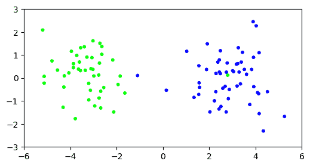
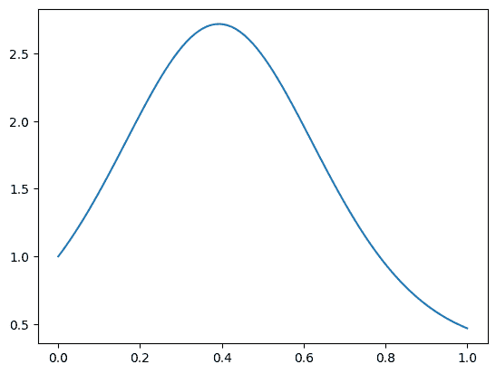
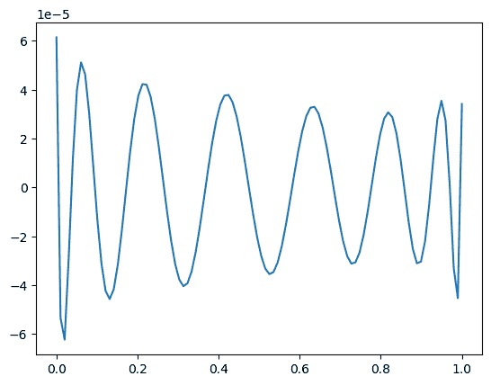
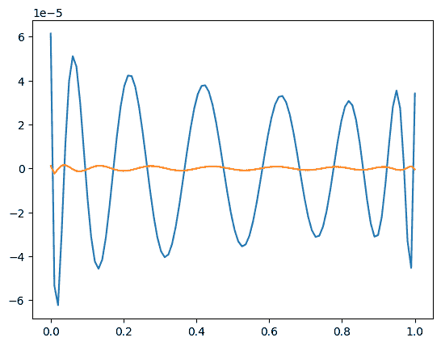

# 4.8\. 在线补充材料#

> 原文：[`mmids-textbook.github.io/chap04_svd/supp/roch-mmids-svd-supp.html`](https://mmids-textbook.github.io/chap04_svd/supp/roch-mmids-svd-supp.html)

## 4.8.1\. 测验、解答、代码等.#

### 4.8.1.1\. 仅代码#

以下是一个交互式 Jupyter 笔记本，其中包含本章的代码（推荐使用 Google Colab）。鼓励您对其进行实验。一些建议的计算练习散布在其中。笔记本也可作为幻灯片使用。

+   [笔记本](https://github.com/MMiDS-textbook/MMiDS-textbook.github.io/blob/main/just_the_code/roch_mmids_chap_svd_notebook.ipynb) ([在 Colab 中打开](https://colab.research.google.com/github/MMiDS-textbook/MMiDS-textbook.github.io/blob/main/just_the_code/roch_mmids_chap_svd_notebook.ipynb))

+   [幻灯片](https://raw.githack.com/MMiDS-textbook/MMiDS-textbook.github.io/main/just_the_code/roch_mmids_chap_svd_notebook_slides.slides.html)

### 4.8.1.2\. 自我评估测验#

通过以下链接可以获取更广泛的自我评估测验的网络版本。

+   [第 4.2 节](https://raw.githack.com/MMiDS-textbook/MMiDS-textbook.github.io/main/quizzes/self-assessment/quiz_4_2.html)

+   [第 4.3 节](https://raw.githack.com/MMiDS-textbook/MMiDS-textbook.github.io/main/quizzes/self-assessment/quiz_4_3.html)

+   [第 4.4 节](https://raw.githack.com/MMiDS-textbook/MMiDS-textbook.github.io/main/quizzes/self-assessment/quiz_4_4.html)

+   [第 4.5 节](https://raw.githack.com/MMiDS-textbook/MMiDS-textbook.github.io/main/quizzes/self-assessment/quiz_4_5.html)

+   [第 4.6 节](https://raw.githack.com/MMiDS-textbook/MMiDS-textbook.github.io/main/quizzes/self-assessment/quiz_4_6.html)

### 4.8.1.3\. 自动测验#

可以在此处访问本章的自动生成的测验（推荐使用 Google Colab）。

+   [自动测验](https://github.com/MMiDS-textbook/MMiDS-textbook.github.io/blob/main/quizzes/auto_quizzes/roch-mmids-svd-autoquiz.ipynb) ([在 Colab 中打开](https://colab.research.google.com/github/MMiDS-textbook/MMiDS-textbook.github.io/blob/main/quizzes/auto_quizzes/roch-mmids-svd-autoquiz.ipynb))

### 4.8.1.4\. 奇数编号预热练习的解答#

*(在 Claude、Gemini 和 ChatGPT 的帮助下)*

**E4.2.1** 答案是 \(\mathrm{rk}(A) = 2\)。要看到这一点，观察第三列是前两列的和，因此列空间由前两列张成。这两列是线性无关的，所以列空间的维度（即秩）是 2。

**E4.2.3** 特征值为 \(\lambda_1 = 4\) 和 \(\lambda_2 = 2\)。对于 \(\lambda_1 = 4\)，解 \((A - 4I)\mathbf{x} = \mathbf{0}\) 得到特征向量 \(\mathbf{v}_1 = (1, 1)\)。对于 \(\lambda_2 = 2\)，解 \((A - 2I)\mathbf{x} = \mathbf{0}\) 得到特征向量 \(\mathbf{v}_2 = (1, -1)\)。

**E4.2.5** 将特征向量归一化以获得正交基：\(\mathbf{q}_1 = \frac{1}{\sqrt{2}}(1, 1)\) 和 \(\mathbf{q}_2 = \frac{1}{\sqrt{2}}(1, -1)\)。然后 \(A = Q \Lambda Q^T\) 其中 \(Q = (\mathbf{q}_1, \mathbf{q}_2)\) 和 \(\Lambda = \mathrm{diag}(4, 2)\)。具体地，

\[\begin{split} A = \begin{pmatrix} \frac{1}{\sqrt{2}} & \frac{1}{\sqrt{2}}\\ \frac{1}{\sqrt{2}} & -\frac{1}{\sqrt{2}} \end{pmatrix} \begin{pmatrix} 4 & 0\\ 0 & 2 \end{pmatrix} \begin{pmatrix} \frac{1}{\sqrt{2}} & \frac{1}{\sqrt{2}}\\ \frac{1}{\sqrt{2}} & -\frac{1}{\sqrt{2}} \end{pmatrix}. \end{split}\]

**E4.2.7**

\[\begin{split} \mathbf{u}\mathbf{v}^T = \begin{pmatrix} 1\\ 2\\ 3 \end{pmatrix} (4, 5) = \begin{pmatrix} 4 & 5\\ 8 & 10\\ 12 & 15 \end{pmatrix}. \end{split}\]

**E4.2.9** \(A\) 的秩为 1。第二列是第一列的倍数，所以列空间是一维的。

**E4.2.11** \(A\) 的特征多项式为

\[ \det(A - \lambda I) = (2 - \lambda)² - 1 = \lambda² - 4 \lambda + 3 = (\lambda - 1)(\lambda - 3). \]

因此，特征值为 \(\lambda_1 = 1\) 和 \(\lambda_2 = 3\)。对于 \(\lambda_1 = 1\)，我们解 \((A - I)\mathbf{v} = \mathbf{0}\) 得到 \(\mathbf{v}_1 = \begin{pmatrix} 1 \\ -1 \end{pmatrix}\)。对于 \(\lambda_2 = 3\)，我们解 \((A - 3I)\mathbf{v} = 0\) 得到 \(\mathbf{v}_2 = \begin{pmatrix} 1 \\ 1 \end{pmatrix}\)。

**E4.2.13** \(A\) 的列向量线性相关，因为第二列是第一列的两倍。因此，\(A\) 的列空间的一个基由 \(\left\{ \begin{pmatrix} 1 \\ 2 \end{pmatrix} \right\}\) 给出。

**E4.2.15** \(A\) 的特征值为 \(\lambda_1 = 3\) 和 \(\lambda_2 = -1\)。由于 \(A\) 有一个负特征值，它不是正半定的。

**E4.2.17** \(f\) 的海森矩阵为

\[\begin{split} \nabla² f(x, y) = \begin{pmatrix} 2 & 0\\ 0 & -2 \end{pmatrix}. \end{split}\]

海森矩阵的特征值为 \(\lambda_1 = 2\) 和 \(\lambda_2 = -2\)。由于有一个特征值是负的，海森矩阵不是正半定的，且 \(f\) 不是凸函数。

**E4.2.19** \(f\) 的海森矩阵为

\[\begin{split} \nabla² f(x, y) = \frac{1}{(x² + y² + 1)²} \begin{pmatrix} 2y² - 2x² + 2 & -4xy\\ -4xy & 2x² - 2y² + 2 \end{pmatrix}. \end{split}\]

海森矩阵的特征值为 \(\lambda_1 = \frac{4}{x² + y² + 1}\) 和 \(\lambda_2 = 0\)，对于所有 \(x, y\) 都是非负的。因此，海森矩阵是正半定的，且 \(f\) 是凸函数。

**E4.3.1** 我们有 \(A = \begin{pmatrix} 1 & 2 \\ -2 & 1 \end{pmatrix}\)。按照文中描述的方法，\(w_1\) 是 \(A^TA = \begin{pmatrix} 5 & 0 \\ 0 & 5 \end{pmatrix}\) 对应于最大特征值的单位特征向量。因此，我们可以取 \(\mathbf{w}_1 = (1, 0)\) 或 \(\mathbf{w}_1 = (0, 1)\)。

**E4.3.3** 我们可以取 \(U = I_2\), \(\Sigma = A\), 和 \(V = I_2\)。这是一个 \(A\) 的奇异值分解，因为 \(U\) 和 \(V\) 是正交的，且 \(\Sigma\) 是对角线。

**E4.3.5** 我们有 \(A^TA = \begin{pmatrix} 5 & 10 \\ 10 & 20 \end{pmatrix}\)。\(A^TA\) 的特征多项式是 \(\lambda² - 25\lambda = \lambda(\lambda - 25)\)，所以特征值是 \(\lambda_1 = 25\) 和 \(\lambda_2 = 0\)。对应于 \(\lambda_1\) 的一个特征向量是 \((1, 2)\)，对应于 \(\lambda_2\) 的一个特征向量是 \((-2, 1)\)。

**E4.3.7** 我们有 \(A\) 的奇异值是 \(\sigma_1 = \sqrt{25} = 5\) 和 \(\sigma_2 = 0\)。我们可以取 \(\mathbf{v}_1 = (1/\sqrt{5}, 2/\sqrt{5})\) 和 \(\mathbf{u}_1 = A \mathbf{v}_1/\sigma_1 = (1/\sqrt{5}, 2/\sqrt{5})\)。由于 \(A\) 的秩为 1，这给出了 \(A\) 的紧凑奇异值分解：\(A = U \Sigma V^T\)，其中 \(U = \mathbf{u}_1\)，\(\Sigma = (5)\)，和 \(V = \mathbf{v}_1\)。

**E4.3.9** 从 \(A\) 的完全奇异值分解中，我们有：\(\mathrm{col}(A)\) 的一个正交基由 \(U\) 的第一列给出：\(\{(1/\sqrt{5}, 2/\sqrt{5})\}\)。\(\mathrm{row}(A)\) 的一个正交基由 \(V\) 的第一列给出：\(\{(1/\sqrt{5}, 2/\sqrt{5})\}\)。\(\mathrm{null}(A)\) 的一个正交基由 \(V\) 的第二列给出：\(\{(-2/\sqrt{5}, 1/\sqrt{5})\}\)。\(\mathrm{null}(A^T)\) 的一个正交基由 \(U\) 的第二列给出：\(\{(-2/\sqrt{5}, 1/\sqrt{5})\}\)。

**E4.3.11** 从其对角形式中，我们看到 \(\lambda_1 = 15\), \(\mathbf{q}_1 = (1, 0)\)；\(\lambda_2 = 7\), \(\mathbf{q}_2 = (0, 1)\)。

**E4.3.13** 通过直接计算，\(U_1 \Sigma_1 V_1^T = U \Sigma V^T = \begin{pmatrix} 1 & 2 \\ 2 & 1 \\ -1 & 1 \\ 3 & -1 \end{pmatrix} = A\).

**E4.3.15** 通过直接计算，

\(A^TA \mathbf{v}_1 = 15 \mathbf{v}_1\), \(A^TA \mathbf{v}_2 = 7 \mathbf{v}_2\),

\(AA^T\mathbf{u}_1 = 15 \mathbf{u}_1\), \(AA^T \mathbf{u}_2 = 7 \mathbf{u}_2\).

**E4.3.17** 维度为 \(k=1\) 的最佳逼近子空间是由向量 \(\mathbf{v}_1 = (1, 0)\) 张成的直线。到这个子空间的平方距离之和是 \(\sum_{i=1}⁴ \|\boldsymbol{\alpha}_i\|² - \sigma_1² = 5 + 5 + 2 + 10 - 15 = 7.\)

**E4.4.1**

\[\begin{split} A² = \begin{pmatrix} 9 & 0 \\ 0 & 1 \end{pmatrix}, \quad A³ = \begin{pmatrix} 27 & 0 \\ 0 & 1 \end{pmatrix}, \quad A⁴ = \begin{pmatrix} 81 & 0 \\ 0 & 1 \end{pmatrix}. \end{split}\]

对角线元素正在被提高到递增的幂次，而非对角线元素保持为零。

**E4.4.3** \(A¹ \mathbf{x} = \begin{pmatrix} 2 & 1 \\ 1 & 2 \end{pmatrix} \begin{pmatrix} 1 \\ 0 \end{pmatrix} = \begin{pmatrix} 2 \\ 1 \end{pmatrix}\), \(\frac{A¹ \mathbf{x}}{\|A¹ \mathbf{x}\|} = \frac{1}{\sqrt{5}} \begin{pmatrix} 2 \\ 1 \end{pmatrix}\) \(A² \mathbf{x} = \begin{pmatrix} 2 & 1 \\ 1 & 2 \end{pmatrix} \begin{pmatrix} 2 \\ 1 \end{pmatrix} = \begin{pmatrix} 5 \\ 4 \end{pmatrix}\), \(\frac{A² \mathbf{x}}{\|A² \mathbf{x}\|} = \frac{1}{\sqrt{41}} \begin{pmatrix} 5 \\ 4 \end{pmatrix}\) \(A³ \mathbf{x} = \begin{pmatrix} 2 & 1 \\ 1 & 2 \end{pmatrix} \begin{pmatrix} 5 \\ 4 \end{pmatrix} = \begin{pmatrix} 14 \\ 13 \end{pmatrix}\), \(\frac{A³ \mathbf{x}}{\|A³ \mathbf{x}\|} = \frac{1}{\sqrt{365}} \begin{pmatrix} 14 \\ 13 \end{pmatrix}\)

**E4.4.5** \(A¹ \mathbf{x} = \begin{pmatrix} 2 & 0 \\ 0 & 1 \end{pmatrix} \begin{pmatrix} 1 \\ 1 \end{pmatrix} = \begin{pmatrix} 2 \\ 1 \end{pmatrix}\) \(A² \mathbf{x} = \begin{pmatrix} 2 & 0 \\ 0 & 1 \end{pmatrix} \begin{pmatrix} 2 \\ 1 \end{pmatrix} = \begin{pmatrix} 4 \\ 1 \end{pmatrix}\) \(A³ \mathbf{x} = \begin{pmatrix} 2 & 0 \\ 0 & 1 \end{pmatrix} \begin{pmatrix} 4 \\ 1 \end{pmatrix} = \begin{pmatrix} 8 \\ 1 \end{pmatrix}\)

**E4.4.7** 我们有 \(A = Q \Lambda Q^T\)，其中 \(Q\) 是归一化特征向量的矩阵，\(\Lambda\) 是特征值的对角矩阵。然后，

\[\begin{split} A² = Q \Lambda² Q^T = \frac{1}{2}\begin{pmatrix} 1 & 1 \\ 1 & -1 \end{pmatrix} \begin{pmatrix} 25 & 0 \\ 0 & 9 \end{pmatrix} \begin{pmatrix} 1 & 1 \\ 1 & -1 \end{pmatrix} = \begin{pmatrix} 17 & 8 \\ 8 & 17 \end{pmatrix}, \end{split}\]

同样地，\(A³ = \begin{pmatrix} 76 & 49 \\ 49 & 76 \end{pmatrix}\)。

**E4.4.9** 我们有 \(A^TA = \begin{pmatrix} 1 & 2 \\ 2 & 5 \end{pmatrix}\)。让我们找到矩阵 \(A^TA = \begin{pmatrix} 1 & 2 \\ 2 & 5 \end{pmatrix}\) 的特征值。我们解特征方程 \(\det(A^TA - \lambda I) = 0\)。首先，让我们计算特征多项式：\(\det(A^TA - \lambda I) = \det(\begin{pmatrix} 1-\lambda & 2 \\ 2 & 5-\lambda \end{pmatrix})= \lambda² - 6\lambda + 1\)，所以 \((\lambda - 3)² - 8 = 0\) 或 \((\lambda - 3)² = 8\) 或 \(\lambda = 3 \pm 2\sqrt{2}\)。因此，\(A^TA\) 的特征值为：\(\lambda_1 = 3 + 2\sqrt{2} \approx 5.83\) 和 \(\lambda_2 = 3 - 2\sqrt{2} \approx 0.17\)。因此，这个矩阵是正半定的，因为它的特征值是 0 和 6，两者都是非负的。

**E4.5.1** \(\sum_{j=1}^p \phi_{j1}² = \left(\frac{1}{\sqrt{2}}\right)² + \left(\frac{1}{\sqrt{2}}\right)² = \frac{1}{2} + \frac{1}{2} = 1\)。单位范数约束要求 \(\sum_{j=1}^p \phi_{j1}² = 1\)。

**E4.5.3** \(t_{11} = -1 \cdot \frac{1}{\sqrt{2}} + 1 \cdot \frac{1}{\sqrt{2}} = 0\)，\(t_{21} = 1 \cdot \frac{1}{\sqrt{2}} - 1 \cdot \frac{1}{\sqrt{2}} = 0\)。分数计算为 \(t_{i1} = \sum_{j=1}^p \phi_{j1} \tilde{x}_{ij}\)。

**E4.5.5** \(\frac{1}{n-1}\sum_{i=1}^n t_{i1}t_{i2} = \frac{1}{1}(0 \cdot (-\sqrt{2}) + 0 \cdot 0) = 0\)。不相关性要求 \(\frac{1}{n-1}\sum_{i=1}^n t_{i1}t_{i2} = 0\)。

**E4.5.7** 首先，计算每一列的平均值：

\[ \bar{x}_1 = \frac{1+3+5}{3} = 3, \quad \bar{x}_2 = \frac{2+4+6}{3} = 4. \]

均值中心化的数据矩阵：

\[\begin{split} X' = X - \begin{pmatrix} 3 & 4 \\ 3 & 4 \\ 3 & 4 \end{pmatrix} = \begin{pmatrix} 1-3 & 2-4 \\ 3-3 & 4-4 \\ 5-3 & 6-4 \end{pmatrix} = \begin{pmatrix} -2 & -2 \\ 0 & 0 \\ 2 & 2 \end{pmatrix}. \end{split}\]

**E4.5.9** \(t_{11} = -2 \cdot \left(\frac{1}{\sqrt{2}}\right) - 2 \cdot \frac{1}{\sqrt{2}} = -2\sqrt{2}\)，\(t_{21} = 0 \cdot \left(\frac{1}{\sqrt{2}}\right) + 0 \cdot \frac{1}{\sqrt{2}} = 0\)，\(t_{31} = 2 \cdot \left(\frac{1}{\sqrt{2}}\right) + 2 \cdot \frac{1}{\sqrt{2}} = 2\sqrt{2}\)。分数计算为 \(t_{i1} = \sum_{j=1}^p \phi_{j1} \tilde{x}_{ij}\)。

**E4.5.11** 第二个主成分必须与第一个主成分不相关，因此其载荷向量必须与 \(\varphi_1\) 正交。一个这样的向量是 \(\varphi_2 = (-0.6, 0.8)\)。

**E4.6.1** 弗罗贝尼乌斯范数由以下给出：

\[ \|A\|_F = \sqrt{\sum_{i=1}^{3} \sum_{j=1}^{2} a_{ij}²} = \sqrt{1² + 2² + 3² + 4² + 5² + 6²} = \sqrt{91}. \]

**E4.6.3** \(\|A\|_F = \sqrt{1² + 2² + 2² + 4²} = \sqrt{25} = 5\)。

**E4.6.5** \(\|A - B\|_F = \sqrt{(1-1)² + (2-1)² + (2-1)² + (4-1)²} = \sqrt{1 + 1 + 9} = \sqrt{11}\)。

**E4.6.7** 矩阵与其秩为 1 的截断奇异值分解之差的诱导 2-范数等于第二个奇异值。因此，使用之前的 SVD，我们有 \(\|A - A_1\|_2 = \sigma_2 = 0\)。

**E4.6.9** 矩阵 \(A\) 是奇异的（其行列式为零），因此它没有逆。因此，\(\|A^{-1}\|_2\) 是未定义的。注意，伪逆 \(A^+\) 的诱导 2-范数与逆的诱导 2-范数（当存在时）不同。

### 4.8.1.5\. 学习成果#

+   定义矩阵的列空间、行空间和秩。

+   证明行秩等于列秩。

+   应用矩阵秩的性质，例如 \(\mathrm{rk}(AB)\leq \mathrm{rk}(A)\) 和 \(\mathrm{rk}(A+B) \leq \mathrm{rk}(A) + \mathrm{rk}(B)\)。

+   陈述并证明秩-零度定理。

+   定义方阵的特征值和特征向量。

+   证明对称矩阵最多有 d 个不同的特征值，其中 d 是矩阵的大小。

+   陈述对称矩阵的谱定理及其含义。

+   使用外积写出对称矩阵的谱分解。

+   根据其特征值确定一个对称矩阵是正半定还是正定。

+   使用编程工具（如 NumPy 的`linalg.eig`）计算对称矩阵的特征值和特征向量。

+   陈述最佳逼近子空间问题的目标，并将其数学上表述为平方距离之和的最小化。

+   证明最佳逼近子空间问题可以通过贪婪地找到最佳一维子空间，然后是第一个子空间正交的一维子空间，以此类推，来贪婪地解决。

+   定义矩阵的奇异值分解（SVD）及其涉及矩阵的性质。

+   使用谱定理证明任何实矩阵的奇异值分解（SVD）的存在性。

+   解释矩阵\(A\)的 SVD 与\(A^T A\)和\(A A^T\)的谱分解之间的联系。

+   计算简单矩阵的 SVD。

+   使用数据矩阵的 SVD 找到数据点集的最佳 k 维逼近子空间。

+   将奇异值解释为捕获右奇异向量对逼近子空间拟合的贡献。

+   使用截断的 SVD 获得数据点的低维表示。

+   区分 SVD 的满秩和紧凑形式，并在它们之间进行转换。

+   在正半定情况下，陈述幂迭代的关键引理，并解释为什么它意味着收敛到最大的特征向量。

+   将幂迭代引理扩展到奇异值分解（SVD）的通用情况，并证明为什么重复乘以\(A^T A\)与一个随机向量收敛到最大的右奇异向量。

+   给定收敛的最大右奇异向量，计算相应的最大奇异值和左奇异向量。

+   描述寻找除最大奇异向量之外的其他奇异向量的正交迭代方法。

+   应用幂迭代方法和正交迭代来计算给定矩阵的 SVD，并使用它来找到最佳低维子空间逼近。

+   在 Python 中实现幂迭代方法和正交迭代。

+   在 PCA 的背景下定义主成分和载荷。

+   将主成分分析（PCA）的目标表达为约束优化问题。

+   建立 PCA 与奇异值分解（SVD）之间的联系。

+   使用 SVD 算法实现 PCA。

+   在降维和数据可视化的背景下解释 PCA 的结果。

+   定义矩阵的 Frobenius 范数和诱导的 2-范数。

+   用矩阵的奇异值来表示矩阵的 Frobenius 范数和诱导的 2-范数。

+   陈述 Eckart-Young 定理。

+   使用 SVD 定义矩阵的伪逆。

+   当矩阵具有满列秩时，应用伪逆来解决最小二乘问题。

+   应用伪逆来找到具有满行秩的欠定系统的最小范数解。

+   将岭回归问题表述为正则化优化问题。

+   通过分析设计矩阵的奇异值分解（SVD）来解释岭回归的工作原理。

\(\aleph\)

## 4.8.2\. 其他部分#

### 4.8.2.1\. 计算更多的奇异向量#

我们已经展示了如何计算第一个奇异向量。我们如何计算更多的奇异向量？一种方法是首先计算 \(\mathbf{v}_1\)（或 \(-\mathbf{v}_1\)），然后找到一个与它正交的向量 \(\mathbf{y}\)，然后像上面那样继续。然后我们重复这个过程，直到我们得到所有 \(m\) 个右奇异向量。

我们通常只对前几个，比如说 \(\ell < m\)，奇异向量感兴趣。在这种情况下，另一种方法是先从 \(\ell\) 个随机向量开始，首先找到它们所张成的空间的正交基。然后，引用 [BHK, 第 3.7.1 节]：

> 然后计算 \(B\) 乘以每个基向量，并找到由结果向量所张成的空间的正交基。直观上，我们是对一个子空间而不是单个向量应用 \(B\)。我们反复将 \(B\) 应用到子空间上，每次应用后计算一个正交基，以防止子空间塌缩到由第一个奇异向量张成的单维子空间。

我们在这里不证明这种称为正交迭代的方法是有效的。证明与 *幂迭代引理* 的证明类似。

我们实现了这个最后的算法。我们将需要我们之前实现的 *Gram-Schimdt*。

```py
def svd(rng, A, l, maxiter=100):
    V = rng.normal(0,1,(np.size(A,1),l))
    for _ in range(maxiter):
        W = A @ V
        Z = A.T @ W
        V, R = mmids.gramschmidt(Z)
    W = A @ V
    S = [LA.norm(W[:, i]) for i in range(np.size(W,1))]
    U = np.stack([W[:,i]/S[i] for i in range(np.size(W,1))],axis=-1)
    return U, S, V 
```

注意，在上面我们避免了形成矩阵 \(A^T A\)。使用少量迭代，这种方法可能需要更少的算术运算，并且可以利用 \(A\) 的可能稀疏性（即它可能有很多零）。

**数值角:** 我们再次将其应用于我们的两个簇示例。

```py
seed = 535
rng = np.random.default_rng(seed)
d, n, w = 1000, 100, 3.
X = mmids.two_mixed_clusters(rng, d, n, w) 
```

让我们再次尝试，但这次在投影到前两个奇异向量之后。回想一下，这相当于找到最佳二维逼近子空间。投影可以通过截断奇异值分解 \(Z= U_{(2)} \Sigma_{(2)} V_{(2)}^T\) 来计算。我们可以将 \(U_{(2)} \Sigma_{(2)}\) 的行解释为每个数据点在基 \(\mathbf{v}_1,\mathbf{v}_2\) 中的系数。我们将在这个基上工作。

```py
U, S, V = svd(rng, X, 2, maxiter=100)
Xproj = np.stack((U[:,0]*S[0], U[:,1]*S[1]), axis=-1)
assign = mmids.kmeans(rng, Xproj, 2, maxiter=5) 
```

```py
3786.880620193068
2066.200891030328
2059.697450794238
2059.697450794238
2059.697450794238 
```

<details class="hide above-input"><summary aria-label="切换隐藏内容">显示代码单元格源代码 隐藏代码单元格源代码</summary>

```py
plt.figure(figsize=(6,3))
plt.scatter(X[:,0], X[:,1], s=10, c=assign, cmap='brg')
plt.axis([-6,6,-3,3])
plt.show() 
```</details> 

最后，观察前两个右奇异向量，我们看到第一个与第一个维度相当吻合。

```py
print(np.stack((V[:,0], V[:,1]), axis=-1)) 
```

```py
[[-0.65359543 -0.03518408]
 [ 0.04389105 -0.01030089]
 [ 0.00334687 -0.01612429]
 ...
 [-0.01970281 -0.05868921]
 [-0.01982662 -0.04122036]
 [-0.00674388  0.01161806]] 
```

\(\unlhd\)

### 4.8.2.2\. 伪逆#

SVD 导致了矩阵逆的自然推广。首先是一个观察。回忆一下，当我们乘以两个平方对角矩阵时，我们只需将相应的对角元素相乘。设 \(\Sigma \in \mathbb{R}^{r \times r}\) 是一个对角矩阵，其对角元素为 \(\sigma_1,\ldots,\sigma_r\)。如果所有对角元素都不为零，那么该矩阵是可逆的（因为其列构成了整个空间的基）。在这种情况下，\(\Sigma\) 的逆是一个对角矩阵 \(\Sigma^{-1}\)，其对角元素为 \(\sigma_1^{-1},\ldots,\sigma_r^{-1}\)。这可以通过检查逆的定义来确认。

\[ \Sigma \Sigma^{-1} = \Sigma^{-1} \Sigma = I_{r\times r}. \]

我们已经准备好给出主要定义。

**定义** **（伪逆）** 设 \(A \in \mathbb{R}^{n \times m}\) 是一个具有紧凑 SVD \(A = U \Sigma V^T\) 和奇异值 \(\sigma_1 \geq \cdots \geq \sigma_r > 0\) 的矩阵。伪逆 \(A^+ \in \mathbb{R}^{m \times n}\) 定义为

\[ A^+ = V \Sigma^{-1} U^T. \]

\(\natural\)

虽然从定义上看并不明显（为什么？），但伪逆实际上是唯一的。为了看到它确实是逆的一个推广，我们进行了一系列观察。

*观察 1:* 注意到，使用 \(U\) 的正交列，

\[ A A^+ = U \Sigma V^T V \Sigma^{-1} U^T = U U^T, \]

这在一般情况下不是单位矩阵。实际上，它对应于 \(A\) 的列空间的投影矩阵，因为 \(U\) 的列构成了该线性子空间的正交基。因此

\[ (A A^+) A = U U^T U \Sigma V^T = U \Sigma V^T = A. \]

因此 \(A A^+\) 不是单位矩阵，但它确实将 \(A\) 的列映射到自身。换句话说，当限制在 \(\mathrm{col}(A)\) 上时，它是单位映射。

类似地，

\[ A^+ A = V \Sigma^{-1} U^T U \Sigma V^T = V V^T \]

是 \(A\) 的行空间的投影矩阵，并且

\[ (A^+ A) A^+ = A^+. \]

*观察 2:* 如果 \(A\) 的满秩列 \(m \leq n\)，那么 \(r = m\)。在这种情况下，\(V\) 的列构成了 \(\mathbb{R}^m\) 的正交基，即 \(V\) 是正交的。因此，

\[ A^+ A = V V^T = I_{m \times m}. \]

类似地，如果 \(A\) 的满秩行 \(n \leq m\)，那么 \(A A^+ = I_{n \times n}\)。

如果这两种情况都成立，那么 \(n = m\)，即 \(A\) 是方阵，且 \(\mathrm{rk}(A) = n\)，即 \(A\) 是可逆的。然后我们得到

\[ A A^+ = A^+ A = I_{n\times n}. \]

这意味着根据 *逆的存在性引理*（它包括矩阵逆的唯一性），\(A^+ = A^{-1}\)。

*观察 3:* 回忆一下，当 \(A\) 是非奇异的时，系统 \(A \mathbf{x} = \mathbf{b}\) 有唯一的解 \(\mathbf{x} = A^{-1} \mathbf{b}\)。在超定情况下，伪逆提供了线性最小二乘问题的解。

**引理** **（伪逆和最小二乘）** 设 \(A \in \mathbb{R}^{n \times m}\) 且 \(m \leq n\)。线性最小二乘问题的解

\[ \min_{\mathbf{x} \in \mathbb{R}^m} \|A \mathbf{x} - \mathbf{b}\| \]

是由 \(\mathbf{x}^* = A^+ \mathbf{b}\) 给出的。进一步，如果 \(A\) 具有满秩列 \(m\)，那么

\[ A^+ = (A^T A)^{-1} A^T. \]

\(\flat\)

*证明思路：* 对于第一部分，我们使用最小二乘问题的解是正交投影。对于第二部分，我们使用奇异值分解的定义并检查两边是否相同。

*证明：* 设 \(A = U \Sigma V^T\) 为 \(A\) 的紧凑奇异值分解。对于第一个断言，注意陈述中 \(\mathbf{x}^*\) 的选择给出

\[ A \mathbf{x}^* = A A^+ \mathbf{b} = U U^T \mathbf{b}. \]

因此，\(A \mathbf{x}^*\) 是 \(\mathbf{b}\) 在 \(A\) 的列空间上的正交投影——这是我们之前证明的线性最小二乘问题的解。

接下来是第二个断言。回忆一下，当 \(A\) 是满秩时，矩阵 \(A^T A\) 是非奇异的。然后我们注意到，使用符号 \(\Sigma^{-2} = (\Sigma^{-1})²\)，

\[ (A^T A)^{-1} A^T = (V \Sigma U^T U \Sigma V^T)^{-1} V \Sigma U^T = V \Sigma^{-2} V^T V \Sigma U^T = A^+ \]

如所述。在这里，我们使用了 \((V \Sigma² V^T)^{-1} = V \Sigma^{-2} V^T\)，这可以通过检查逆矩阵的定义和我们对对角矩阵逆的先前观察来证实。 \(\square\)

伪逆在欠定系统的情况下也提供了一个解。然而，在这种情况下，通常有无穷多个解。伪逆选择的解具有一个特殊性质，我们现在可以看到：它是最小范数解。

**引理** **（伪逆和欠定系统）** 设 \(A \in \mathbb{R}^{n \times m}\) 且 \(m > n\)，\(\mathbf{b} \in \mathbb{R}^n\)。进一步假设 \(A\) 具有满秩行 \(n\)。那么 \(\mathbf{x}^* = A^+ \mathbf{b}\) 是

\[ \min \left\{ \|\mathbf{x}\|\,:\, \mathbf{x} \in \mathbb{R}^m\ \text{s.t.}\ A\mathbf{x} = \mathbf{b} \right\}. \]

此外，在这种情况下，

\[ A^+ = A^T (A A^T)^{-1}. \]

\(\flat\)

*证明：* 我们首先证明 \(A^+\) 的公式。正如我们在超定情况下所做的那样，可以通过代入紧凑的奇异值分解 \(A = U \Sigma V^T\) 来验证。回忆一下，当 \(A^T\) 是满秩时，矩阵 \(A A^T\) 是非奇异的。然后我们注意到

\[ A^T (A A^T)^{-1} = V \Sigma U^T (U \Sigma V^T V \Sigma U^T)^{-1} = V \Sigma U^T U \Sigma^{-2} U^T = A^+ \]

如所述。在这里，我们使用了 \((U \Sigma² U^T)^{-1} = U \Sigma^{-2} U^T\)，这可以通过检查逆矩阵的定义和我们对对角矩阵逆的先前观察来证实。

因为 \(A\) 具有满秩行，\(\mathbf{b} \in \mathrm{col}(A)\) 并且至少存在一个 \(\mathbf{x}\) 使得 \(A \mathbf{x} = \mathbf{b}\)。这样一个解由伪逆提供。确实，从先前的观察中，

\[ A \mathbf{x}^* = A A^+ \mathbf{b} = U U^T \mathbf{b} = I_{n \times n} \mathbf{b} = \mathbf{b}, \]

其中我们使用了 \(U\) 的列由秩的假设形成 \(\mathbb{R}^n\) 的正交基。

设 \(\mathbf{x}\) 为系统的一个其他解。那么 \(A(\mathbf{x} - \mathbf{x}^*) = \mathbf{b} - \mathbf{b} = \mathbf{0}\)。这表明

\[ (\mathbf{x} - \mathbf{x}^*)^T \mathbf{x}^* = (\mathbf{x} - \mathbf{x}^*)^T A^T (A A^T)^{-1} \mathbf{b} = [A(\mathbf{x} - \mathbf{x}^*)]^T (A A^T)^{-1} \mathbf{b} = \mathbf{0}. \]

也就是说，\(\mathbf{x} - \mathbf{x}^*\) 和 \(\mathbf{x}^*\) 是正交的。根据 *毕达哥拉斯*，

\[ \|\mathbf{x}\|² = \|(\mathbf{x} - \mathbf{x}^*) + \mathbf{x}^*\|² = \|\mathbf{x} - \mathbf{x}^*\|² + \|\mathbf{x}^*\|² \geq \|\mathbf{x}^*\|². \]

这证明了 \(\mathbf{x}^*\) 在系统 \(A \mathbf{x} = \mathbf{b}\) 的所有解中具有最小的范数。 \(\square\)

**EXAMPLE:** 继续之前的例子，设

\[\begin{split} A = \begin{pmatrix} 1 & 0\\ -1 & 0 \end{pmatrix}. \end{split}\]

回想一下

\[ A = \sigma_1 \mathbf{u}_1 \mathbf{v}_1^T \]

其中

\[\begin{split} \mathbf{u}_1 = \begin{pmatrix} 1/\sqrt{2}\\ -1/\sqrt{2} \end{pmatrix}, \quad \quad \mathbf{v}_1 = \begin{pmatrix} 1\\ 0 \end{pmatrix}, \quad \text{and} \quad \sigma_1 = \sqrt{2}. \end{split}\]

我们计算伪逆。根据公式，在秩为 1 的情况下，它简单地是（检查这个！）

\[\begin{split} A^+ = \sigma_1^{-1} \mathbf{v}_1 \mathbf{u}_1^T = \frac{1}{\sqrt{2}} \begin{pmatrix} 1\\ 0 \end{pmatrix} \begin{pmatrix} 1/\sqrt{2}\\ -1/\sqrt{2} \end{pmatrix}^T = \begin{pmatrix} 1/2 & -1/2\\ 0 & 0 \end{pmatrix} \end{split}\]

\(\lhd\)

**EXAMPLE:** 设 \(A \in \mathbb{R}^{n \times n}\) 为一个 \(n \times n\) 的非奇异方阵。设 \(A = \sum_{j=1}^n \sigma_j \mathbf{u}_j \mathbf{v}_j^T\) 为 \(A\) 的紧凑奇异值分解，其中我们使用了 \(A\) 的秩为 \(n\) 的性质，因此它有 \(n\) 个严格正的奇异值。我们寻求用奇异值来计算 \(\|A^{-1}\|_2\)。

因为 \(A\) 是可逆的，所以 \(A^+ = A^{-1}\)。因此我们计算伪逆

\[ A^{-1} = A^+ = \sum_{j=1}^n \sigma_j^{-1} \mathbf{v}_j \mathbf{u}_j^T. \]

右侧的和并不完全是一个 \(A^{-1}\) 的紧凑奇异值分解，因为系数 \(\sigma_j^{-1}\) 在 \(j\) 上是非递减的。

但将和写成相反的顺序

\[ A^{-1} = \sigma_n^{-1} \mathbf{v}_n \mathbf{u}_n^T + \sigma_{n-1}^{-1} \mathbf{v}_{n-1} \mathbf{u}_{n-1}^T + \cdots + \sigma_1^{-1} \mathbf{v}_1 \mathbf{u}_1^T \]

仍然给出了 \(A^{-1}\) 的紧凑奇异值分解，因为 \(\sigma_n^{-1} \geq \cdots \sigma_1^{-1} > 0\)，并且 \(\{\mathbf{v}_j\}_{j=1}^n\) 和 \(\{\mathbf{u}_j\}_{j=1}^n\) 是正交列表。因此，2-范数由最大的奇异值给出，即

\[ \|A^{-1}\|_2 = \sigma_n^{-1}. \]

\(\lhd\)

**NUMERICAL CORNER:** 在 Numpy 中，可以使用函数 `numpy.linalg.pinv` 计算矩阵的伪逆。[`numpy.linalg.pinv`](https://numpy.org/doc/stable/reference/generated/numpy.linalg.pinv.html)。

```py
M = np.array([[1.5, 1.3], [1.2, 1.9], [2.1, 0.8]])
print(M) 
```

```py
[[1.5 1.3]
 [1.2 1.9]
 [2.1 0.8]] 
```

```py
Mp = LA.pinv(M)
print(Mp) 
```

```py
[[ 0.09305394 -0.31101404  0.58744568]
 [ 0.12627124  0.62930858 -0.44979865]] 
```

```py
Mp @ M 
```

```py
array([[ 1.00000000e+00, -4.05255527e-17],
       [ 3.70832374e-16,  1.00000000e+00]]) 
```

让我们尝试之前的例子。

```py
A = np.array([[1., 0.], [-1., 0.]])
print(A) 
```

```py
[[ 1\.  0.]
 [-1\.  0.]] 
```

```py
Ap = LA.pinv(A)
print(Ap) 
```

```py
[[ 0.5 -0.5]
 [ 0\.   0\. ]] 
```

\(\unlhd\)

### 4.8.2.3\. 条件数#

在本节中，我们介绍条件数，它是数值问题扰动敏感性的一个度量。我们特别关注最小二乘问题的条件。我们首先介绍伪逆的概念，它本身也很重要。

**矩阵-向量乘法的条件** 我们定义矩阵的条件数，并展示它能够捕捉矩阵-向量乘法对扰动的敏感性的一些信息。

**定义** **(矩阵的条件数)** 方阵、非奇异矩阵 \(A \in \mathbb{R}^{n \times n}\) 的条件数（在诱导的 \(2\)-范数下）定义为

\[ \kappa_2(A) = \|A\|_2 \|A^{-1}\|_2. \]

\(\natural\)

实际上，这可以计算为

\[ \kappa_2(A) = \|A\|_2 \|A^{-1}\|_2 = \frac{\sigma_1}{\sigma_n} \]

其中我们使用了上面的例子。换句话说，\(\kappa_2(A)\) 是在 \(A\) 下最大拉伸与最小拉伸的比率。

**定理** **(矩阵-向量乘法的条件)** 设 \(M \in \mathbb{R}^{n \times n}\) 为非奇异矩阵。那么，对于任意的 \(\mathbf{z} \in \mathbb{R}^n\),

\[ \max_{\mathbf{d} \neq \mathbf{0}} \frac{\|M(\mathbf{z}+\mathbf{d}) - M \mathbf{z}\|/\|M\mathbf{z}\|} {\|\mathbf{d}\|/\|\mathbf{z}\|} \leq \kappa_2(M) \]

并且不等式在紧致的意义上是说存在一个 \(\mathbf{x}\) 和一个 \(\mathbf{d}\) 可以达到它。

\(\sharp\)

上面的比率衡量了在 \(\mathbf{z}\) 的无穷小扰动下 \(M \mathbf{z}\) 的相对变化的最坏速率。定理表明，当 \(\kappa_2(M)\) 很大时，即所谓的病态情况，从对 \(\mathbf{z}\) 的相对较小的扰动可以得到 \(M \mathbf{z}\) 的较大相对变化。换句话说，当矩阵病态时，矩阵-向量乘积对扰动可能很敏感。

**证明** 写出

\[ \frac{\|M(\mathbf{z}+\mathbf{d}) - M \mathbf{z}\|/\|M\mathbf{z}\|} {\|\mathbf{d}\|/\|\mathbf{z}\|} = \frac{\|M \mathbf{d}\|/\|M\mathbf{z}\|} {\|\mathbf{d}\|/\|\mathbf{z}\|} = \frac{\|M (\mathbf{d}/\|\mathbf{d}\|)\|}{\|M(\mathbf{z}/\|\mathbf{z}\|)\|} \leq \frac{\sigma_1}{\sigma_n} \]

其中我们使用了 \(\min_{\mathbf{u} \in \mathbb{S}^{n-1}} \|A \mathbf{u}\| = \sigma_n\)，这在之前的例子中已经证明过。

特别地，我们看到这个比率可以通过取 \(\mathbf{d}\) 和 \(\mathbf{z}\) 分别为对应于 \(\sigma_1\) 和 \(\sigma_n\) 的右奇异向量来达到其最大值。 \(\square\)

如果我们将定理应用于逆矩阵，我们得到非奇异线性系统 \(A \mathbf{x} = \mathbf{b}\) 对 \(\mathbf{b}\) 中扰动的相对条件数为 \(\kappa_2(A)\)。特别是当 \(A\) 的列接近线性相关时，这个值可能很大。这一点将在下一个例子中详细说明。

**示例：** 设 \(A \in \mathbb{R}^{n \times n}\) 是非奇异的。那么，对于任何 \(\mathbf{b} \in \mathbb{R}^n\)，存在一个唯一的解 \(A \mathbf{x} = \mathbf{b}\)，即，

\[ \mathbf{x} = A^{-1} \mathbf{b}. \]

假设我们求解扰动系统

\[ \mathbf{x} + \delta\mathbf{x} = A^{-1} (\mathbf{b} + \delta\mathbf{b}), \]

对于某个向量 \(\delta\mathbf{b}\)。我们使用 *矩阵-向量乘法的条件定理* 来界定 \(\delta\mathbf{x}\) 的范数。

具体来说，设

\[ M = A^{-1}, \qquad \mathbf{z} = \mathbf{b}, \qquad \mathbf{d} = \delta\mathbf{b}. \]

然后

\[ M \mathbf{z} = A^{-1}\mathbf{b} = \mathbf{x}, \]

和

\[ M(\mathbf{z}+\mathbf{d}) - M \mathbf{z} = A^{-1}(\mathbf{b} + \delta\mathbf{b}) - A^{-1}\mathbf{b} = \mathbf{x} + \delta\mathbf{x} - \mathbf{x} = \delta\mathbf{x}. \]

因此我们得到

\[ \frac{\|\delta\mathbf{x}\|/\|\mathbf{x}\|}{\|\delta\mathbf{b}\|/\|\mathbf{b}\|} =\frac{\|M(\mathbf{z}+\mathbf{d}) - M \mathbf{z}\|/\|M\mathbf{z}\|} {\|\mathbf{d}\|/\|\mathbf{z}\|} \leq \kappa_2(M) = \kappa_2(A^{-1}). \]

还要注意，因为 \((A^{-1})^{-1} = A\)，所以 \(\kappa_2(A^{-1}) = \kappa_2(A)\)。重新排列后，我们最终得到

\[ \frac{\|\delta\mathbf{x}\|}{\|\mathbf{x}\|} \leq \kappa_2(A) \frac{\|\delta\mathbf{b}\|}{\|\mathbf{b}\|}. \]

因此，条件数越大，对于给定的相对扰动大小，线性系统解的潜在相对影响也越大。 \(\lhd\)

**数值角落：** 在 Numpy 中，可以使用函数 `numpy.linalg.cond` 计算矩阵的条件数（[链接](https://numpy.org/doc/stable/reference/generated/numpy.linalg.cond.html)）。

例如，正交矩阵的条件数是 \(1\)，这是它的可能最小值（为什么？）。这表明正交矩阵具有良好的数值特性。

```py
q = 1/np.sqrt(2)
Q = np.array([[q, q], [q, -q]])
print(Q) 
```

```py
[[ 0.70710678  0.70710678]
 [ 0.70710678 -0.70710678]] 
```

```py
LA.cond(Q) 
```

```py
1.0000000000000002 
```

相比之下，列几乎线性相关的矩阵具有较大的条件数。

```py
eps = 1e-6
A = np.array([[q, q], [q, q+eps]])
print(A) 
```

```py
[[0.70710678 0.70710678]
 [0.70710678 0.70710778]] 
```

```py
LA.cond(A) 
```

```py
2828429.1245844117 
```

让我们看看 \(A\) 的奇异值分解（SVD）。

```py
u, s, vh = LA.svd(A)
print(s) 
```

```py
[1.41421406e+00 4.99999823e-07] 
```

当 \(\mathbf{b}\) 是对应于最大奇异值的 \(A\) 的左奇异向量时，我们计算 \(A \mathbf{x} = \mathbf{b}\) 的解。回忆一下，在 *矩阵-向量乘法的条件定理* 的证明中，我们展示了当 \(\mathbf{z} = \mathbf{b}\) 是 \(M = A^{-1}\) 的对应于最低奇异值的右奇异向量时，最坏情况下的界限被达到。在一个先前的例子中，给定一个矩阵 \(A = \sum_{j=1}^n \sigma_j \mathbf{u}_j \mathbf{v}_j^T\) 以紧凑的 SVD 形式，我们推导了逆的紧凑 SVD 为

\[ A^{-1} = \sigma_n^{-1} \mathbf{v}_n \mathbf{u}_n^T + \sigma_{n-1}^{-1} \mathbf{v}_{n-1} \mathbf{u}_{n-1}^T + \cdots + \sigma_1^{-1} \mathbf{v}_1 \mathbf{u}_1^T. \]

在这里，与 \(A\) 的 SVD 相比，奇异值的顺序被颠倒，左奇异向量和右奇异向量的角色也发生了交换。因此，我们取 \(\mathbf{b}\) 为 \(A\) 的左上奇异向量。

```py
b = u[:,0]
print(b) 
```

```py
[-0.70710653 -0.70710703] 
```

```py
x = LA.solve(A,b)
print(x) 
```

```py
[-0.49999965 -0.5       ] 
```

我们在第二个右奇异向量的方向上进行微小扰动。回忆在矩阵-向量乘法条件数定理的证明中，我们展示了当 \(\mathbf{d} = \delta\mathbf{b}\) 是 \(M = A^{-1}\) 的右上奇异向量时，最坏情况发生。根据上述论证，这是 \(A\) 对应于最小奇异值的左奇异向量。

```py
delta = 1e-6
bp = b + delta*u[:,1]
print(bp) 
```

```py
[-0.70710724 -0.70710632] 
```

解的相对变化是：

```py
xp = LA.solve(A,bp)
print(xp) 
```

```py
[-1.91421421  0.91421356] 
```

```py
(LA.norm(x-xp)/LA.norm(x))/(LA.norm(b-bp)/LA.norm(b)) 
```

```py
2828429.124665918 
```

注意这正好是 \(A\) 的条件数。

\(\unlhd\)

**回到最小二乘问题** 我们回到最小二乘问题

\[ \min_{\mathbf{x} \in \mathbb{R}^m} \|A \mathbf{x} - \mathbf{b}\| \]

其中

\[\begin{split} A = \begin{pmatrix} | & & | \\ \mathbf{a}_1 & \ldots & \mathbf{a}_m \\ | & & | \end{pmatrix} \quad \text{和} \quad \mathbf{b} = \begin{pmatrix} b_1 \\ \vdots \\ b_n \end{pmatrix}. \end{split}\]

我们已经证明了该解满足正则方程

\[ A^T A \mathbf{x} = A^T \mathbf{b}. \]

在这里，\(A\) 可能不是方阵且不可逆。我们定义一个更一般的条件数概念。

**定义** **(矩阵的条件数：一般情况**) 矩阵 \(A \in \mathbb{R}^{n \times m}\) 的条件数（在诱导的 \(2\)-范数下）定义为

\[ \kappa_2(A) = \|A\|_2 \|A^+\|_2. \]

\(\natural\)

正如我们接下来要展示的，\(A^T A\) 的条件数可能远大于 \(A\) 本身。

**引理** **(矩阵 \(A^T A\) 的条件数**) 设 \(A \in \mathbb{R}^{n \times m}\) 具有满列秩。我们有

\[ \kappa_2(A^T A) = \kappa_2(A)². \]

\(\flat\)

*证明思路:* 我们使用奇异值分解。

*证明:* 设 \(A = U \Sigma V^T\) 为 \(A\) 的奇异值分解，其中奇异值 \(\sigma_1 \geq \cdots \geq \sigma_m > 0\)。那么

\[ A^T A = V \Sigma U^T U \Sigma V^T = V \Sigma² V^T. \]

特别地，后一种表达式是 \(A^T A\) 的奇异值分解，因此 \(A^T A\) 的条件数是

\[ \kappa_2(A^T A) = \frac{\sigma_1²}{\sigma_m²} = \kappa_2(A)². \]

\(\square\)

**数值角:** 我们给出一个快速示例。

```py
A = np.array([[1., 101.],[1., 102.],[1., 103.],[1., 104.],[1., 105]])
print(A) 
```

```py
[[  1\. 101.]
 [  1\. 102.]
 [  1\. 103.]
 [  1\. 104.]
 [  1\. 105.]] 
```

```py
LA.cond(A) 
```

```py
7503.817028686101 
```

```py
LA.cond(A.T @ A) 
```

```py
56307270.00472849 
```

这个观察结果——以及由此产生的数值不稳定性增加——是我们之前开发最小二乘问题替代方法的原因之一。引用 [Sol, 第 5.1 节]:

> 直观地说，\(\mathrm{cond}(A^T A)\) 可以很大的一个主要原因是 \(A\) 的列可能看起来“相似” [...] 如果两个列 \(\mathbf{a}_i\) 和 \(\mathbf{a}_j\) 满足 \(\mathbf{a}_i \approx \mathbf{a}_j\)，那么如果我们用 \(\mathbf{a}_j\) 的倍数替换 \(\mathbf{a}_i\) 的倍数，或者反之亦然，则最小二乘残差长度 \(\|\mathbf{b} - A \mathbf{x}\|_2\) 不会受到太大影响。 [...] 为了解决这种病态问题，我们将采用一种替代技术，这种技术更关注 \(A\) 的列空间，而不是像高斯消元法那样使用行操作。这种策略明确识别和处理这种近依赖关系，从而提高了数值稳定性。

\(\unlhd\)

我们引用了 [[Ste](https://epubs.siam.org/doi/book/10.1137/1.9781611971408), 定理 4.2.7]] 的定理，该定理进一步阐明了这个问题。

**定理** **（最小二乘解的精度）** 设 \(\mathbf{x}^*\) 是最小二乘问题 \(\min_{\mathbf{x} \in \mathbb{R}^m} \|A \mathbf{x} - \mathbf{b}\|\) 的解。设 \(\mathbf{x}_{\mathrm{NE}}\) 是通过在 [浮点算术](https://en.wikipedia.org/wiki/Floating-point_arithmetic) 中形成和求解正则方程得到的解，其中舍入单位为 \(\epsilon_M\)。那么 \(\mathbf{x}_{\mathrm{NE}}\) 满足

\[ \frac{\|\mathbf{x}_{\mathrm{NE}} - \mathbf{x}^*\|}{\|\mathbf{x}^*\|} \leq \gamma_{\mathrm{NE}} \kappa_2²(A) \left( 1 + \frac{\|\mathbf{b}\|}{\|A\|_2 \|\mathbf{x}^*\|} \right) \epsilon_M. \]

设 \(\mathbf{x}_{\mathrm{QR}}\) 是在同一算术中从 QR 分解得到的解。那么

\[ \frac{\|\mathbf{x}_{\mathrm{QR}} - \mathbf{x}^*\|}{\|\mathbf{x}^*\|} \leq 2 \gamma_{\mathrm{QR}} \kappa_2(A) \epsilon_M + \gamma_{\mathrm{NE}} \kappa_2²(A) \frac{\|\mathbf{r}^*\|}{\|A\|_2 \|\mathbf{x}^*\|} \epsilon_M \]

其中 \(\mathbf{r}^* = \mathbf{b} - A \mathbf{x}^*\) 是残差向量。常数 \(\gamma\) 是问题维度的缓慢增长函数。

\(\sharp\)

为了解释，让我们再次引用 [[Ste](https://epubs.siam.org/doi/book/10.1137/1.9781611971408), 第 4.2.3 节]]：

> 正则方程的扰动理论表明 \(\kappa_2²(A)\) 控制着我们期望的误差大小。从 QR 方程计算出的解的界限也有一个乘以 \(\kappa_2²(A)\) 的项，但这个项还乘以缩放残差，这可能会减弱其效果。然而，在许多应用中，向量 \(\mathbf{b}\) 被误差污染，残差在一般情况下不能小于该误差的大小。

**数值角落**：这里是一个来自 [[TB](https://books.google.com/books/about/Numerical_Linear_Algebra.html?id=JaPtxOytY7kC), 第 19 讲]] 的数值示例。我们将用多项式来逼近以下函数。

```py
n = 100 
t = np.arange(n)/(n-1)
b = np.exp(np.sin(4 * t)) 
```

<details class="hide above-input"><summary aria-label="Toggle hidden content">显示代码单元格源代码 隐藏代码单元格源代码</summary>

```py
plt.plot(t, b)
plt.show() 
```</details> 

我们使用 [Vandermonde 矩阵](https://en.wikipedia.org/wiki/Vandermonde_matrix)，它可以通过 `numpy.vander` 构建，来进行多项式回归。

```py
m = 17
A = np.vander(t, m, increasing=True) 
```

在这种情况下，\(A\) 和 \(A^T A\) 的条件数都很高。

```py
print(LA.cond(A)) 
```

```py
755823354629.852 
```

```py
print(LA.cond(A.T @ A)) 
```

```py
3.846226459131048e+17 
```

我们首先使用正则方程并绘制残差向量。

```py
xNE = LA.solve(A.T @ A, A.T @ b)
print(LA.norm(b - A@xNE)) 
```

```py
0.0002873101427587512 
```

<details class="hide above-input"><summary aria-label="Toggle hidden content">显示代码单元格源代码 隐藏代码单元格源代码</summary>

```py
plt.plot(t, b - A@xNE)
plt.show() 
```</details> 

我们随后使用 `numpy.linalg.qr` 来计算 QR 解。

```py
Q, R = LA.qr(A)
xQR = mmids.backsubs(R, Q.T @ b)
print(LA.norm(b - A@xQR)) 
```

```py
7.359657452370885e-06 
```

<details class="hide above-input"><summary aria-label="Toggle hidden content">显示代码单元格源代码 隐藏代码单元格源代码</summary>

```py
plt.plot(t, b - A@xNE)
plt.plot(t, b - A@xQR)
plt.show() 
```</details> 

\(\unlhd\)

## 4.8.3\. 额外证明#

**贪婪算法找到最佳子空间证明** 在本节中，我们证明 *贪婪算法找到最佳子空间定理* 的完整版本。特别是，我们不使用 *谱定理*。

*证明思路:* 我们通过归纳法进行。对于任意正交归一列表 \(\mathbf{w}_1,\ldots,\mathbf{w}_k\)，我们找到一个包含与 \(\mathbf{v}_1,\ldots,\mathbf{v}_{k-1}\) 正交的元素的它们的张成的正交基。然后我们使用 \(\mathbf{v}_k\) 的定义来得出结论。

*证明:* 我们将问题重新表述为最大化问题

\[ \max \left\{ \sum_{j=1}^k \|A \mathbf{w}_j\|²\ :\ \text{$\{\mathbf{w}_1,\ldots,\mathbf{w}_k\}$ 是一个正交归一列表} \right\}, \]

其中，我们也用任意正交归一基 \(\{\mathbf{w}_1,\ldots,\mathbf{w}_k\}\) 替换了 \(k\) 维线性子空间 \(\mathcal{Z}\)。

我们随后通过归纳法进行。对于 \(k=1\)，我们将 \(\mathbf{v}_1\) 定义为上述最大化问题的解。假设对于任何正交归一列表 \(\{\mathbf{w}_1,\ldots,\mathbf{w}_\ell\}\) 且 \(\ell < k\)，我们有

\[ \sum_{j=1}^\ell \|A \mathbf{w}_j\|² \leq \sum_{j=1}^\ell \|A \mathbf{v}_j\|². \]

现在考虑任意正交归一列表 \(\{\mathbf{w}_1,\ldots,\mathbf{w}_k\}\) 以及其张成 \(\mathcal{W} = \mathrm{span}(\mathbf{w}_1,\ldots,\mathbf{w}_k)\)。

***步骤 1:*** 对于 \(j=1,\ldots,k-1\)，令 \(\mathbf{v}_j'\) 为 \(\mathbf{v}_j\) 在 \(\mathcal{W}\) 上的正交投影，并令 \(\mathcal{V}' = \mathrm{span}(\mathbf{v}'_1,\ldots,\mathbf{v}'_{k-1})\)。因为 \(\mathcal{V}' \subseteq \mathcal{W}\) 的维度最多为 \(k-1\)，而 \(\mathcal{W}\) 本身的维度为 \(k\)，我们可以找到一个 \(\mathcal{W}\) 的正交基 \(\mathbf{w}'_1,\ldots,\mathbf{w}'_{k}\)，使得 \(\mathbf{w}'_k\) 与 \(\mathcal{V}'\) 正交（为什么？）。然后，对于任意的 \(j=1,\ldots,k-1\)，我们有分解 \(\mathbf{v}_j = \mathbf{v}'_j + (\mathbf{v}_j - \mathbf{v}'_j)\)，其中 \(\mathbf{v}'_j \in \mathcal{V}'\) 与 \(\mathbf{w}'_k\) 正交，且 \(\mathbf{v}_j - \mathbf{v}'_j\) 也与 \(\mathbf{w}'_k \in \mathcal{W}\) 正交，这是由于正交投影到 \(\mathcal{W}\) 的性质。因此

\[\begin{align*} \left\langle \sum_{j=1}^{k-1}\beta_j \mathbf{v}_j, \mathbf{w}'_k \right\rangle &= \left\langle \sum_{j=1}^{k-1}\beta_j [\mathbf{v}'_j + (\mathbf{v}_j - \mathbf{v}'_j)], \mathbf{w}'_k \right\rangle\\ &= \left\langle \sum_{j=1}^{k-1}\beta_j \mathbf{v}'_j, \mathbf{w}'_k \right\rangle + \left\langle \sum_{j=1}^{k-1}\beta_j (\mathbf{v}_j - \mathbf{v}'_j), \mathbf{w}'_k \right\rangle\\ &= \sum_{j=1}^{k-1}\beta_j \left\langle \mathbf{v}'_j, \mathbf{w}'_k \right\rangle + \sum_{j=1}^{k-1}\beta_j \left\langle \mathbf{v}_j - \mathbf{v}'_j, \mathbf{w}'_k \right\rangle\\ &= 0 \end{align*}\]

对于任意的 \(\beta_j\)。也就是说，\(\mathbf{w}'_k\) 与 \(\mathrm{span}(\mathbf{v}_1,\ldots,\mathbf{v}_{k-1})\) 正交。

***步骤 2:*** 根据归纳假设，我们有

\[ (*) \qquad \sum_{j=1}^{k-1} \|A \mathbf{w}'_j\|² \leq \sum_{j=1}^{k-1} \|A \mathbf{v}_j\|²\. \]

此外，回顾一下，\(\boldsymbol{\alpha}_i^T\) 是 \(A\) 的行，

\[ (**) \qquad \sum_{j=1}^k \|A \mathbf{w}_j\|² = \sum_{i=1}^n \|\mathrm{proj}_{\mathcal{W}}(\boldsymbol{\alpha}_i)\|² = \sum_{j=1}^k \|A \mathbf{w}_j'\|² \]

由于 \(\mathbf{w}_j\) 和 \(\mathbf{w}'_j\) 构成了相同子空间 \(\mathcal{W}\) 的正交基。由于 \(\mathbf{w}'_k\) 与 \(\mathrm{span}(\mathbf{v}_1,\ldots,\mathbf{v}_{k-1})\) 正交，根据步骤 1 的结论，根据 \(\mathbf{v}_k\) 作为解的定义

\[ \mathbf{v}_k\in \arg\max \{\|A \mathbf{v}\|:\|\mathbf{v}\| = 1, \ \langle \mathbf{v}, \mathbf{v}_j \rangle = 0, \forall j \leq k-1\}. \]

我们有

\[ (*\!*\!*) \qquad \|A \mathbf{w}'_k\|² \leq \|A \mathbf{v}_k\|². \]

***步骤 3:*** 将所有内容综合起来

\[\begin{align*} \sum_{j=1}^k \|A \mathbf{w}_j\|² &= \sum_{j=1}^k \|A \mathbf{w}_j'\|² &\text{根据 $(**)$}\\ &= \sum_{j=1}^{k-1} \|A \mathbf{w}'_j\|² + \|A \mathbf{w}'_k\|²\\ &\leq \sum_{j=1}^{k-1} \|A \mathbf{v}_j\|² + \|A \mathbf{v}_k\|² &\text{根据 $(*)$ 和 $(*\!*\!*)$}\\ &= \sum_{j=1}^{k} \|A \mathbf{v}_j\|²\\ \end{align*}\]

证明了该命题。 \(\square\)

**奇异值分解存在的证明** 我们回到**奇异值分解存在定理**的证明。我们给出一个不依赖于**谱定理**的替代证明。

**证明：** 我们已经做了大部分工作。证明如下：

(1) 从**贪婪寻找最佳子空间定理**计算贪婪序列 \(\mathbf{v}_1,\ldots,\mathbf{v}_r\)，直到最大的 \(r\)，使得

\[ \|A \mathbf{v}_r\|² > 0 \]

或者，否则，直到 \(r=m\)。根据构造，\(\mathbf{v}_j\) 是正交归一的。

(2) 对于 \(j=1,\ldots,r\)，设

\[ \sigma_j = \|A \mathbf{v}_j\| \quad\text{and}\quad \mathbf{u}_j = \frac{1}{\sigma_j} A \mathbf{v}_j. \]

注意，由于我们选择 \(r\) 的方式，\(\sigma_j\) 都是 \(> 0\)。它们也是非递增的：根据贪婪序列的定义，

\[ \sigma_i² = \max \{\|A \mathbf{w}_i\|² :\|\mathbf{w}_i\| = 1, \ \langle \mathbf{w}_i, \mathbf{v}_j \rangle = 0, \forall j \leq i-1\}, \]

其中，正交约束的集合随着 \(i\) 的增加而增大。因此，根据定义，\(\mathbf{u}_j\) 的范数为单位。

我们在下面将证明它们也是正交的。

(3) 设 \(\mathbf{z} \in \mathbb{R}^m\) 为任意向量。为了证明我们的构造是正确的，我们证明 \(A \mathbf{z} = \left(U \Sigma V^T\right)\mathbf{z}\)。设 \(\mathcal{V} = \mathrm{span}(\mathbf{v}_1,\ldots,\mathbf{v}_r)\) 并将 \(\mathbf{z}\) 分解为正交分量

\[ \mathbf{z} = \mathrm{proj}_{\mathcal{V}}(\mathbf{z}) + (\mathbf{z} - \mathrm{proj}_{\mathcal{V}}(\mathbf{z})) = \sum_{j=1}^r \langle \mathbf{z}, \mathbf{v}_j\rangle \,\mathbf{v}_j + (\mathbf{z} - \mathrm{proj}_{\mathcal{V}}(\mathbf{z})). \]

应用 \(A\) 并使用线性，我们得到

\[\begin{align*} A \mathbf{z} &= \sum_{j=1}^r \langle \mathbf{z}, \mathbf{v}_j\rangle \, A\mathbf{v}_j + A (\mathbf{z} - \mathrm{proj}_{\mathcal{V}}(\mathbf{z})). \end{align*}\]

我们断言 \(A (\mathbf{z} - \mathrm{proj}_{\mathcal{V}}(\mathbf{z})) = \mathbf{0}\)。如果 \(\mathbf{z} - \mathrm{proj}_{\mathcal{V}}(\mathbf{z}) = \mathbf{0}\)，那么这当然成立。如果不成立，那么让

\[ \mathbf{w} = \frac{\mathbf{z} - \mathrm{proj}_{\mathcal{V}}(\mathbf{z})}{\|\mathbf{z} - \mathrm{proj}_{\mathcal{V}}(\mathbf{z})\|}. \]

根据 \(r\) 的定义，

\[ 0 = \max \{\|A \mathbf{w}_{r+1}\|² :\|\mathbf{w}_{r+1}\| = 1, \ \langle \mathbf{w}_{r+1}, \mathbf{v}_j \rangle = 0, \forall j \leq r\}. \]

换句话说，\(\|A \mathbf{w}_{r+1}\|² = 0\)（即 \(A \mathbf{w}_{r+1} = \mathbf{0}\)），对于任何与 \(\mathbf{v}_1,\ldots,\mathbf{v}_r\) 正交的单位向量 \(\mathbf{w}_{r+1}\)。这特别适用于 \(\mathbf{w}_{r+1} = \mathbf{w}\) 根据**正交投影定理**。

因此，使用 \(\mathbf{u}_j\) 和 \(\sigma_j\) 的定义，我们得到

\[\begin{align*} A \mathbf{z} &= \sum_{j=1}^r \langle \mathbf{z}, \mathbf{v}_j\rangle \, \sigma_j \mathbf{u}_j\\ &= \sum_{j=1}^r \sigma_j \mathbf{u}_j \mathbf{v}_j^T \mathbf{z}\\ &=\left(\sum_{j=1}^r \sigma_j \mathbf{u}_j \mathbf{v}_j^T\right)\mathbf{z}\\ &= \left(U \Sigma V^T\right)\mathbf{z}. \end{align*}\]

这证明了奇异值分解的存在性。

剩下要证明的只是 \(\mathbf{u}_j\) 的正交性。

**引理** **(左奇异向量是正交的)** 对于所有 \(1 \leq i \neq j \leq r\)，\(\langle \mathbf{u}_i, \mathbf{u}_j \rangle = 0\)。\(\flat\)

**证明思路**：引用 [BHK, 第 3.6 节]：

> 直观上，如果 \(\mathbf{u}_i\) 和 \(\mathbf{u}_j\)，\(i < j\)，不是正交的，人们会怀疑右奇异向量 \(\mathbf{v}_j\) 有 \(\mathbf{v}_i\) 的一个分量，这将与 \(\mathbf{v}_i\) 和 \(\mathbf{v}_j\) 正交相矛盾。设 \(i\) 为最小的整数，使得 \(\mathbf{u}_i\) 与所有其他 \(\mathbf{u}_j\) 不正交。然后为了证明 \(\mathbf{u}_i\) 和 \(\mathbf{u}_j\) 是正交的，我们向 \(\mathbf{v}_i\) 添加一个小的 \(\mathbf{v}_j\) 分量，将结果归一化为一个单位向量 \(\mathbf{v}'_i \propto \mathbf{v}_i + \varepsilon \mathbf{v}_j\)，并证明 \(\|A \mathbf{v}'_i\| > \|A \mathbf{v}_i\|\)，这是矛盾的。

**证明**：我们通过反证法来论证。设 \(i\) 为最小的索引，使得存在 \(j > i\)，使得 \(\langle \mathbf{u}_i, \mathbf{u}_j \rangle = \delta \neq 0\)。假设 \(\delta > 0\)（否则使用 \(-\mathbf{u}_i\)）。对于 \(\varepsilon \in (0,1)\)，因为 \(\mathbf{v}_k\) 是正交归一的，\(\|\mathbf{v}_i + \varepsilon \mathbf{v}_j\|² = 1+\varepsilon²\)。考虑以下向量

\[ \mathbf{v}'_i = \frac{\mathbf{v}_i + \varepsilon \mathbf{v}_j}{\sqrt{1+\varepsilon²}} \quad\text{和}\quad A \mathbf{v}'_i = \frac{\sigma_i \mathbf{u}_i + \varepsilon \sigma_j \mathbf{u}_j}{\sqrt{1+\varepsilon²}}. \]

注意到 \(\mathbf{v}'_i\) 与 \(\mathbf{v}_1,\ldots,\mathbf{v}_{i-1}\) 正交，因此

\[ \|A \mathbf{v}'_i\| \leq \|A \mathbf{v}_i\| =\sigma_i. \]

另一方面，根据**正交分解引理**，我们可以将 \(A \mathbf{v}_i'\) 写成其在单位向量 \(\mathbf{u}_i\) 上的正交投影和 \(A \mathbf{v}_i' - \mathrm{proj}_{\mathbf{u}_i}(A \mathbf{v}_i')\) 的和，后者与 \(\mathbf{u}_i\) 正交。特别是，根据**毕达哥拉斯定理**，\(\|A \mathbf{v}_i'\| \geq \|\mathrm{proj}_{\mathbf{u}_i}(A \mathbf{v}_i')\|\)。但这意味着，对于 \(\varepsilon \in (0,1)\)，

\[ \|A \mathbf{v}_i'\| \geq \|\mathrm{proj}_{\mathbf{u}_i}(A \mathbf{v}_i')\| = \left\langle \mathbf{u}_i, A \mathbf{v}_i'\right\rangle = \frac{\sigma_i + \varepsilon \sigma_j \delta}{\sqrt{1+\varepsilon²}} \geq (\sigma_i + \varepsilon \sigma_j \delta) \,(1-\varepsilon²/2) \]

其中第二个不等式来自于泰勒展开 [Taylor expansion](https://en.wikipedia.org/wiki/Taylor_series) 或观察

\[ (1+\varepsilon²)\,(1-\varepsilon²/2)² = (1+\varepsilon²)\,(1-\varepsilon² + \varepsilon⁴/4) = 1 - 3/4 \varepsilon⁴ + \varepsilon⁶/4 \leq 1. \]

现在请注意，

\[\begin{align*} \|A \mathbf{v}_i'\| &\geq (\sigma_i + \varepsilon \sigma_j \delta) \,(1-\varepsilon²/2)\\ &= \sigma_i + \varepsilon \sigma_j \delta - \varepsilon²\sigma_i/2 - \varepsilon³ \sigma_i \sigma_j \delta/2\\ &= \sigma_i + \varepsilon \left( \sigma_j \delta - \varepsilon\sigma_i/2 - \varepsilon² \sigma_i \sigma_j \delta/2\right)\\ &> \sigma_i \end{align*}\]

对于足够小的 \(\varepsilon\)，与上述不等式矛盾。 \(\square\)

**奇异值分解（SVD）和逼近子空间** 在构造 \(A\) 的 SVD 时，我们使用了最佳逼近子空间的贪婪序列。反之，给定 \(A\) 的 SVD，我们可以读出逼近子空间问题的解。换句话说，我们用来证明 SVD 存在的具体构造并没有什么特殊之处。虽然一个矩阵可能有多个 SVD，但它们都给出了逼近子空间问题的解。

此外，这种观点给出了奇异值的一个变分特征。我们将在下一章中更多地讨论变分特征及其应用。

**SVD 和贪婪序列** 事实上，设

\[ A = \sum_{j=1}^r \sigma_j \mathbf{u}_j \mathbf{v}_j^T \]

设 \(A\) 的 SVD 为

\[ \sigma_1 \geq \sigma_2 \geq \cdots \geq \sigma_r > 0. \]

我们证明 \(\mathbf{v}_j\) 形成了逼近子空间问题的贪婪序列。通过添加适当的向量 \(\mathbf{v}_{j+1},\ldots,\mathbf{v}_m\)，将 \(\mathbf{v}_1,\ldots,\mathbf{v}_r\) 补充为 \(\mathbb{R}^m\) 的一个正交归一基。根据构造，对于所有 \(i=j+1,\ldots,m\)，有 \(A\mathbf{v}_{i} = \mathbf{0}\)。

我们从 \(j=1\) 的情况开始。对于任意单位向量 \(\mathbf{w} \in \mathbb{R}^m\)，我们将其展开为 \(\mathbf{w} = \sum_{i=1}^m \langle \mathbf{w}, \mathbf{v}_i\rangle \,\mathbf{v}_i\)。根据**正交归一列表的性质**，

\[\begin{align*} \|A \mathbf{w}\|² &= \left\| A \left( \sum_{i=1}^m \langle \mathbf{w}, \mathbf{v}_i\rangle \,\mathbf{v}_i \right) \right\|²\\ &= \left\| \sum_{i=1}^m \langle \mathbf{w}, \mathbf{v}_i\rangle \,A \mathbf{v}_i \right\|²\\ &= \left\| \sum_{i=1}^r \langle \mathbf{w}, \mathbf{v}_i\rangle \,\sigma_i \mathbf{u}_i \right\|²\\ &= \sum_{i=1}^r \sigma_i² \langle \mathbf{w}, \mathbf{v}_i\rangle², \end{align*}\]

其中我们使用了 \(\mathbf{u}_i\) 的正交归一性以及 \(\mathbf{v}_{j+1},\ldots,\mathbf{v}_m\) 在 \(A\) 的零空间中的事实。因为 \(\sigma_i\) 是非递增的，所以这个和通过取 \(\mathbf{w} = \mathbf{v}_1\) 来最大化。因此，我们已经证明了 \(\mathbf{v}_1 \in \arg\max\{\|A \mathbf{w}\|²:\|\mathbf{w}\| = 1\}\)。

根据正交归一列表的性质，

\[ \sum_{i=1}^m \langle \mathbf{w}, \mathbf{v}_i\rangle² = \left\|\sum_{i=1}^m \langle \mathbf{w}, \mathbf{v}_i\rangle \mathbf{v}_i \right\|² = \|\mathbf{w}\|² = 1. \]

因此，由于 \(\sigma_i\) 是非递增的，和

\[ \|A \mathbf{w}\|² = \sum_{i=1}^r \sigma_i² \langle \mathbf{w}, \mathbf{v}_i\rangle² \leq \sigma_1². \]

这个上界是通过取 \(\mathbf{w} = \mathbf{v}_1\) 来实现的。因此，我们已经证明了 \(\mathbf{v}_1 \in \arg\max\{\|A \mathbf{w}\|²:\|\mathbf{w}\| = 1\}\)。

更一般地，对于任何与 \(\mathbf{v}_1,\ldots,\mathbf{v}_{j-1}\) 正交的单位向量 \(\mathbf{w} \in \mathbb{R}^m\)，我们将其展开为 \(\mathbf{w} = \sum_{i=j}^m \langle \mathbf{w}, \mathbf{v}_i\rangle \,\mathbf{v}_i\)。然后，只要 \(j\leq r\)，

\[\begin{align*} \|A \mathbf{w}\|² &= \left\| \sum_{i=j}^m \langle \mathbf{w}, \mathbf{v}_i\rangle \,A \mathbf{v}_i \right\|²\\ &= \left\| \sum_{i=j}^r \langle \mathbf{w}, \mathbf{v}_i\rangle \,\sigma_i \mathbf{u}_i \right\|²\\ &= \sum_{i=j}^r \sigma_i² \langle \mathbf{w}, \mathbf{v}_i\rangle²\\ &\leq \sigma_j². \end{align*}\]

其中再次使用了 \(\sigma_i\) 是非递增的，并且 \(\sum_{i=1}^m \langle \mathbf{w}, \mathbf{v}_i\rangle² = 1\)。这个最后的界限是通过取 \(\mathbf{w} = \mathbf{v}_j\) 来实现的。

因此，我们已经证明了以下内容。

**定理** **(奇异值的变分特征)** 设 \(A = \sum_{j=1}^r \sigma_j \mathbf{u}_j \mathbf{v}_j^T\) 为 \(A\) 的奇异值分解，其中 \(\sigma_1 \geq \sigma_2 \geq \cdots \geq \sigma_r > 0\)。那么

\[ \sigma_j² = \max \{\|A \mathbf{w}\|²:\|\mathbf{w}\| = 1, \ \langle \mathbf{w}, \mathbf{v}_i \rangle = 0, \forall i \leq j-1\}, \]

和

\[ \mathbf{v}_j\in \arg\max \{\|A \mathbf{w}\|²:\|\mathbf{w}\| = 1, \ \langle \mathbf{w}, \mathbf{v}_i \rangle = 0, \forall i \leq j-1\}. \]

\(\sharp\)

## 4.8.1\. 测验、解答、代码等.#

### 4.8.1.1\. 仅代码#

下面可以访问本章代码的交互式 Jupyter 笔记本（推荐使用 Google Colab）。鼓励您对其进行尝试。一些建议的计算练习散布在其中。笔记本也可以作为幻灯片查看。

+   [笔记本](https://github.com/MMiDS-textbook/MMiDS-textbook.github.io/blob/main/just_the_code/roch_mmids_chap_svd_notebook.ipynb) ([在 Colab 中打开](https://colab.research.google.com/github/MMiDS-textbook/MMiDS-textbook.github.io/blob/main/just_the_code/roch_mmids_chap_svd_notebook.ipynb))

+   [幻灯片](https://raw.githack.com/MMiDS-textbook/MMiDS-textbook.github.io/main/just_the_code/roch_mmids_chap_svd_notebook_slides.slides.html)

### 4.8.1.2\. 自我评估测验#

通过以下链接可以获取更全面的自我评估测验的网页版本。

+   [第 4.2 节](https://raw.githack.com/MMiDS-textbook/MMiDS-textbook.github.io/main/quizzes/self-assessment/quiz_4_2.html)

+   [第 4.3 节](https://raw.githack.com/MMiDS-textbook/MMiDS-textbook.github.io/main/quizzes/self-assessment/quiz_4_3.html)

+   [第 4.4 节](https://raw.githack.com/MMiDS-textbook/MMiDS-textbook.github.io/main/quizzes/self-assessment/quiz_4_4.html)

+   [第 4.5 节](https://raw.githack.com/MMiDS-textbook/MMiDS-textbook.github.io/main/quizzes/self-assessment/quiz_4_5.html)

+   [第 4.6 节](https://raw.githack.com/MMiDS-textbook/MMiDS-textbook.github.io/main/quizzes/self-assessment/quiz_4_6.html)

### 4.8.1.3\. 自动测验#

可以在此处访问本章的自动生成的测验（推荐使用 Google Colab）。

+   [自动测验](https://github.com/MMiDS-textbook/MMiDS-textbook.github.io/blob/main/quizzes/auto_quizzes/roch-mmids-svd-autoquiz.ipynb) ([在 Colab 中打开](https://colab.research.google.com/github/MMiDS-textbook/MMiDS-textbook.github.io/blob/main/quizzes/auto_quizzes/roch-mmids-svd-autoquiz.ipynb))

### 4.8.1.4\. 奇数练习题的解答#

*(在 Claude、Gemini 和 ChatGPT 的帮助下)*

**E4.2.1** 答案是 \(\mathrm{rk}(A) = 2\)。要看到这一点，观察第三列是前两列的和，所以列空间由前两列张成。这两列是线性无关的，所以列空间的维度（即秩）是 2。

**E4.2.3** 特征值是 \(\lambda_1 = 4\) 和 \(\lambda_2 = 2\)。对于 \(\lambda_1 = 4\)，解 \((A - 4I)\mathbf{x} = \mathbf{0}\) 得到特征向量 \(\mathbf{v}_1 = (1, 1)\)。对于 \(\lambda_2 = 2\)，解 \((A - 2I)\mathbf{x} = \mathbf{0}\) 得到特征向量 \(\mathbf{v}_2 = (1, -1)\)。

**E4.2.5** 将特征向量归一化以获得正交基：\(\mathbf{q}_1 = \frac{1}{\sqrt{2}}(1, 1)\) 和 \(\mathbf{q}_2 = \frac{1}{\sqrt{2}}(1, -1)\)。然后 \(A = Q \Lambda Q^T\) 其中 \(Q = (\mathbf{q}_1, \mathbf{q}_2)\) 和 \(\Lambda = \mathrm{diag}(4, 2)\)。具体来说，

\[\begin{split} A = \begin{pmatrix} \frac{1}{\sqrt{2}} & \frac{1}{\sqrt{2}}\\ \frac{1}{\sqrt{2}} & -\frac{1}{\sqrt{2}} \end{pmatrix} \begin{pmatrix} 4 & 0\\ 0 & 2 \end{pmatrix} \begin{pmatrix} \frac{1}{\sqrt{2}} & \frac{1}{\sqrt{2}}\\ \frac{1}{\sqrt{2}} & -\frac{1}{\sqrt{2}} \end{pmatrix}. \end{split}\]

**E4.2.7**

\[\begin{split} \mathbf{u}\mathbf{v}^T = \begin{pmatrix} 1\\ 2\\ 3 \end{pmatrix} (4, 5) = \begin{pmatrix} 4 & 5\\ 8 & 10\\ 12 & 15 \end{pmatrix}. \end{split}\]

**E4.2.9** \(A\) 的秩是 1。第二列是第一列的倍数，所以列空间是一维的。

**E4.2.11** \(A\) 的特征多项式是

\[ \det(A - \lambda I) = (2 - \lambda)² - 1 = \lambda² - 4 \lambda + 3 = (\lambda - 1)(\lambda - 3). \]

因此，特征值为 \(\lambda_1 = 1\) 和 \(\lambda_2 = 3\)。对于 \(\lambda_1 = 1\)，我们解 \((A - I)\mathbf{v} = \mathbf{0}\) 得到 \(\mathbf{v}_1 = \begin{pmatrix} 1 \\ -1 \end{pmatrix}\)。对于 \(\lambda_2 = 3\)，我们解 \((A - 3I)\mathbf{v} = 0\) 得到 \(\mathbf{v}_2 = \begin{pmatrix} 1 \\ 1 \end{pmatrix}\)。

**E4.2.13** \(A\) 的列是线性相关的，因为第二列是第一列的两倍。因此，\(A\) 的列空间的基由 \(\left\{ \begin{pmatrix} 1 \\ 2 \end{pmatrix} \right\}\) 给出。

**E4.2.15** \(A\) 的特征值为 \(\lambda_1 = 3\) 和 \(\lambda_2 = -1\)。由于 \(A\) 有一个负特征值，它不是正半定。

**E4.2.17** \(f\) 的 Hessian 矩阵是

\[\begin{split} \nabla² f(x, y) = \begin{pmatrix} 2 & 0\\ 0 & -2 \end{pmatrix}. \end{split}\]

Hessian 矩阵的特征值为 \(\lambda_1 = 2\) 和 \(\lambda_2 = -2\)。由于有一个特征值是负的，Hessian 矩阵不是正半定的，且 \(f\) 不是凸函数。

**E4.2.19** \(f\) 的 Hessian 矩阵是

\[\begin{split} \nabla² f(x, y) = \frac{1}{(x² + y² + 1)²} \begin{pmatrix} 2y² - 2x² + 2 & -4xy\\ -4xy & 2x² - 2y² + 2 \end{pmatrix}. \end{split}\]

Hessian 矩阵的特征值为 \(\lambda_1 = \frac{4}{x² + y² + 1}\) 和 \(\lambda_2 = 0\)，对于所有的 \(x, y\) 都是非负的。因此，Hessian 矩阵是正半定的，且 \(f\) 是凸函数。

**E4.3.1** 我们有 \(A = \begin{pmatrix} 1 & 2 \\ -2 & 1 \end{pmatrix}\)。按照文中描述的方法，\(w_1\) 是 \(A^TA = \begin{pmatrix} 5 & 0 \\ 0 & 5 \end{pmatrix}\) 对应于最大特征值的单位特征向量。因此，我们可以取 \(\mathbf{w}_1 = (1, 0)\) 或 \(\mathbf{w}_1 = (0, 1)\)。

**E4.3.3** 我们可以取 \(U = I_2\)，\(\Sigma = A\)，和 \(V = I_2\)。这是一个 \(A\) 的奇异值分解，因为 \(U\) 和 \(V\) 是正交的，且 \(\Sigma\) 是对角矩阵。

**E4.3.5** 我们有 \(A^TA = \begin{pmatrix} 5 & 10 \\ 10 & 20 \end{pmatrix}\)。\(A^TA\) 的特征多项式是 \(\lambda² - 25\lambda = \lambda(\lambda - 25)\)，所以特征值是 \(\lambda_1 = 25\) 和 \(\lambda_2 = 0\)。对应于 \(\lambda_1\) 的一个特征向量是 \((1, 2)\)，对应于 \(\lambda_2\) 的一个特征向量是 \((-2, 1)\)。

**E4.3.7** 我们有 \(A\) 的奇异值为 \(\sigma_1 = \sqrt{25} = 5\) 和 \(\sigma_2 = 0\)。我们可以取 \(\mathbf{v}_1 = (1/\sqrt{5}, 2/\sqrt{5})\) 和 \(\mathbf{u}_1 = A \mathbf{v}_1/\sigma_1 = (1/\sqrt{5}, 2/\sqrt{5})\)。由于 \(A\) 的秩为 1，这给出了 \(A\) 的紧凑奇异值分解：\(A = U \Sigma V^T\)，其中 \(U = \mathbf{u}_1\)，\(\Sigma = (5)\)，和 \(V = \mathbf{v}_1\)。

**E4.3.9** 从 \(A\) 的完全奇异值分解中，我们有：\(\mathrm{col}(A)\) 的一个正交基由 \(U\) 的第一列给出：\(\{(1/\sqrt{5}, 2/\sqrt{5})\}\)。\(\mathrm{row}(A)\) 的一个正交基由 \(V\) 的第一列给出：\(\{(1/\sqrt{5}, 2/\sqrt{5})\}\)。\(\mathrm{null}(A)\) 的一个正交基由 \(V\) 的第二列给出：\(\{(-2/\sqrt{5}, 1/\sqrt{5})\}\)。\(\mathrm{null}(A^T)\) 的一个正交基由 \(U\) 的第二列给出：\(\{(-2/\sqrt{5}, 1/\sqrt{5})\}\)。

**E4.3.11** 从其对角形式中，我们可以看到 \(\lambda_1 = 15\)，\(\mathbf{q}_1 = (1, 0)\)；\(\lambda_2 = 7\)，\(\mathbf{q}_2 = (0, 1)\)。

**E4.3.13** 通过直接计算，\(U_1 \Sigma_1 V_1^T = U \Sigma V^T = \begin{pmatrix} 1 & 2 \\ 2 & 1 \\ -1 & 1 \\ 3 & -1 \end{pmatrix} = A\).

**E4.3.15** 通过直接计算，

\(A^TA \mathbf{v}_1 = 15 \mathbf{v}_1\), \(A^TA \mathbf{v}_2 = 7 \mathbf{v}_2\),

\(AA^T\mathbf{u}_1 = 15 \mathbf{u}_1\), \(AA^T \mathbf{u}_2 = 7 \mathbf{u}_2\).

**E4.3.17** 维度为 \(k=1\) 的最佳逼近子空间是由向量 \(\mathbf{v}_1 = (1, 0)\) 张成的直线。到该子空间的平方距离之和为 \(\sum_{i=1}⁴ \|\boldsymbol{\alpha}_i\|² - \sigma_1² = 5 + 5 + 2 + 10 - 15 = 7.\)

**E4.4.1**

\[\begin{split} A² = \begin{pmatrix} 9 & 0 \\ 0 & 1 \end{pmatrix}, \quad A³ = \begin{pmatrix} 27 & 0 \\ 0 & 1 \end{pmatrix}, \quad A⁴ = \begin{pmatrix} 81 & 0 \\ 0 & 1 \end{pmatrix}. \end{split}\]

对角线元素正在被提高到递增的幂次，而非对角线元素保持为零。

**E4.4.3** \(A¹ \mathbf{x} = \begin{pmatrix} 2 & 1 \\ 1 & 2 \end{pmatrix} \begin{pmatrix} 1 \\ 0 \end{pmatrix} = \begin{pmatrix} 2 \\ 1 \end{pmatrix}\), \(\frac{A¹ \mathbf{x}}{\|A¹ \mathbf{x}\|} = \frac{1}{\sqrt{5}} \begin{pmatrix} 2 \\ 1 \end{pmatrix}\) \(A² \mathbf{x} = \begin{pmatrix} 2 & 1 \\ 1 & 2 \end{pmatrix} \begin{pmatrix} 2 \\ 1 \end{pmatrix} = \begin{pmatrix} 5 \\ 4 \end{pmatrix}\), \(\frac{A² \mathbf{x}}{\|A² \mathbf{x}\|} = \frac{1}{\sqrt{41}} \begin{pmatrix} 5 \\ 4 \end{pmatrix}\) \(A³ \mathbf{x} = \begin{pmatrix} 2 & 1 \\ 1 & 2 \end{pmatrix} \begin{pmatrix} 5 \\ 4 \end{pmatrix} = \begin{pmatrix} 14 \\ 13 \end{pmatrix}\), \(\frac{A³ \mathbf{x}}{\|A³ \mathbf{x}\|} = \frac{1}{\sqrt{365}} \begin{pmatrix} 14 \\ 13 \end{pmatrix}\)

**E4.4.5** \(A¹ \mathbf{x} = \begin{pmatrix} 2 & 0 \\ 0 & 1 \end{pmatrix} \begin{pmatrix} 1 \\ 1 \end{pmatrix} = \begin{pmatrix} 2 \\ 1 \end{pmatrix}\) \(A² \mathbf{x} = \begin{pmatrix} 2 & 0 \\ 0 & 1 \end{pmatrix} \begin{pmatrix} 2 \\ 1 \end{pmatrix} = \begin{pmatrix} 4 \\ 1 \end{pmatrix}\) \(A³ \mathbf{x} = \begin{pmatrix} 2 & 0 \\ 0 & 1 \end{pmatrix} \begin{pmatrix} 4 \\ 1 \end{pmatrix} = \begin{pmatrix} 8 \\ 1 \end{pmatrix}\)

**E4.4.7** 我们有 \(A = Q \Lambda Q^T\)，其中 \(Q\) 是归一化特征向量的矩阵，\(\Lambda\) 是特征值的对角矩阵。然后，

\[\begin{split} A² = Q \Lambda² Q^T = \frac{1}{2}\begin{pmatrix} 1 & 1 \\ 1 & -1 \end{pmatrix} \begin{pmatrix} 25 & 0 \\ 0 & 9 \end{pmatrix} \begin{pmatrix} 1 & 1 \\ 1 & -1 \end{pmatrix} = \begin{pmatrix} 17 & 8 \\ 8 & 17 \end{pmatrix}, \end{split}\]

同样地，\(A³ = \begin{pmatrix} 76 & 49 \\ 49 & 76 \end{pmatrix}\)。

**E4.4.9** 我们有 \(A^TA = \begin{pmatrix} 1 & 2 \\ 2 & 5 \end{pmatrix}\). 让我们找到矩阵 \(A^TA = \begin{pmatrix} 1 & 2 \\ 2 & 5 \end{pmatrix}\) 的特征值。我们解特征方程 \(\det(A^TA - \lambda I) = 0\)。首先，让我们计算特征多项式：\(\det(A^TA - \lambda I) = \det(\begin{pmatrix} 1-\lambda & 2 \\ 2 & 5-\lambda \end{pmatrix})= \lambda² - 6\lambda + 1\)，所以 \((\lambda - 3)² - 8 = 0\) 或 \((\lambda - 3)² = 8\) 或 \(\lambda = 3 \pm 2\sqrt{2}\)。因此，\(A^TA\) 的特征值为：\(\lambda_1 = 3 + 2\sqrt{2} \approx 5.83\) 和 \(\lambda_2 = 3 - 2\sqrt{2} \approx 0.17\)。因此，这个矩阵是正半定的，因为它的特征值是 0 和 6，都是非负的。

**E4.5.1** \(\sum_{j=1}^p \phi_{j1}² = \left(\frac{1}{\sqrt{2}}\right)² + \left(\frac{1}{\sqrt{2}}\right)² = \frac{1}{2} + \frac{1}{2} = 1\). 单位范数约束要求 \(\sum_{j=1}^p \phi_{j1}² = 1\).

**E4.5.3** \(t_{11} = -1 \cdot \frac{1}{\sqrt{2}} + 1 \cdot \frac{1}{\sqrt{2}} = 0\)，\(t_{21} = 1 \cdot \frac{1}{\sqrt{2}} - 1 \cdot \frac{1}{\sqrt{2}} = 0\)。得分计算为 \(t_{i1} = \sum_{j=1}^p \phi_{j1} \tilde{x}_{ij}\)。

**E4.5.5** \(\frac{1}{n-1}\sum_{i=1}^n t_{i1}t_{i2} = \frac{1}{1}(0 \cdot (-\sqrt{2}) + 0 \cdot 0) = 0\)。不相关性要求 \(\frac{1}{n-1}\sum_{i=1}^n t_{i1}t_{i2} = 0\)。

**E4.5.7** 首先，计算每一列的平均值：

\[ \bar{x}_1 = \frac{1+3+5}{3} = 3, \quad \bar{x}_2 = \frac{2+4+6}{3} = 4. \]

均值中心化的数据矩阵：

\[\begin{split} X' = X - \begin{pmatrix} 3 & 4 \\ 3 & 4 \\ 3 & 4 \end{pmatrix} = \begin{pmatrix} 1-3 & 2-4 \\ 3-3 & 4-4 \\ 5-3 & 6-4 \end{pmatrix} = \begin{pmatrix} -2 & -2 \\ 0 & 0 \\ 2 & 2 \end{pmatrix}. \end{split}\]

**E4.5.9** \(t_{11} = -2 \cdot \left(\frac{1}{\sqrt{2}}\right) - 2 \cdot \frac{1}{\sqrt{2}} = -2\sqrt{2}\)，\(t_{21} = 0 \cdot \left(\frac{1}{\sqrt{2}}\right) + 0 \cdot \frac{1}{\sqrt{2}} = 0\)，\(t_{31} = 2 \cdot \left(\frac{1}{\sqrt{2}}\right) + 2 \cdot \frac{1}{\sqrt{2}} = 2\sqrt{2}\)。得分计算为 \(t_{i1} = \sum_{j=1}^p \phi_{j1} \tilde{x}_{ij}\)。

**E4.5.11** 第二个主成分必须与第一个不相关，因此其载荷向量必须与 \(\varphi_1\) 正交。这样一个向量是 \(\varphi_2 = (-0.6, 0.8)\)。

**E4.6.1** 弗罗贝尼乌斯范数由以下公式给出：

\[ \|A\|_F = \sqrt{\sum_{i=1}^{3} \sum_{j=1}^{2} a_{ij}²} = \sqrt{1² + 2² + 3² + 4² + 5² + 6²} = \sqrt{91}. \]

**E4.6.3** \(\|A\|_F = \sqrt{1² + 2² + 2² + 4²} = \sqrt{25} = 5\)。

**E4.6.5** \(\|A - B\|_F = \sqrt{(1-1)² + (2-1)² + (2-1)² + (4-1)²} = \sqrt{1 + 1 + 9} = \sqrt{11}\)。

**E4.6.7** 矩阵与其秩-1 截断 SVD 之间的诱导 2-范数等于第二个奇异值。因此，使用之前的 SVD，我们有 \(\|A - A_1\|_2 = \sigma_2 = 0\)。

**E4.6.9** 矩阵 \(A\) 是奇异的（其行列式为零），因此它没有逆。因此，\(\|A^{-1}\|_2\) 是未定义的。请注意，伪逆 \(A^+\) 的诱导 2-范数与逆的诱导 2-范数（当它存在时）不同。

### 4.8.1.5\. 学习成果#

+   定义矩阵的列空间、行空间和秩。

+   证明行秩等于列秩。

+   应用矩阵秩的性质，例如 \(\mathrm{rk}(AB)\leq \mathrm{rk}(A)\) 和 \(\mathrm{rk}(A+B) \leq \mathrm{rk}(A) + \mathrm{rk}(B)\)。

+   陈述并证明秩-零度定理。

+   定义方阵的特征值和特征向量。

+   证明对称矩阵最多有 d 个不同的特征值，其中 d 是矩阵的大小。

+   陈述对称矩阵的谱定理及其含义。

+   使用外积写出对称矩阵的谱分解。

+   根据其特征值确定对称矩阵是否为正半定或正定。

+   使用编程工具（如 NumPy 的 `linalg.eig`）计算对称矩阵的特征值和特征向量。

+   陈述最佳逼近子空间问题的目标，并将其数学上表述为平方距离之和的最小化。

+   证明最佳逼近子空间问题可以通过贪婪地找到最佳一维子空间，然后是第一个子空间正交的最佳一维子空间，以此类推，来贪婪地解决。

+   定义矩阵的奇异值分解（SVD）并描述涉及矩阵的性质。

+   使用谱定理证明任何实矩阵 SVD 的存在性。

+   解释矩阵 \(A\) 的 SVD 与 \(A^T A\) 和 \(A A^T\) 的谱分解之间的联系。

+   计算简单矩阵的 SVD。

+   使用数据矩阵的 SVD 来找到一组数据点的最佳 k 维逼近子空间。

+   解释奇异值作为捕捉右奇异向量对逼近子空间拟合贡献的表示。

+   使用截断奇异值分解（SVD）来获得数据点的低维表示。

+   区分 SVD 的完整形式和紧致形式，并在它们之间进行转换。

+   陈述正半定情况下幂迭代的键引理，并解释为什么它意味着收敛到最大特征向量。

+   将幂迭代引理扩展到奇异值分解（SVD）的一般情况，并证明为什么重复乘以随机向量的 \(A^T A\) 会收敛到右上奇异向量。

+   根据收敛的右上奇异向量计算相应的最大奇异值和左奇异向量。

+   描述用于找到除第一个奇异向量之外的其他奇异向量的正交迭代法。

+   应用幂迭代法和正交迭代法来计算给定矩阵的 SVD，并使用它来找到最佳低维子空间逼近。

+   在 Python 中实现幂迭代法和正交迭代法。

+   在 PCA 的背景下定义主成分和载荷。

+   将 PCA 的目标表达为约束优化问题。

+   建立主成分分析（PCA）与奇异值分解（SVD）之间的联系。

+   使用 SVD 算法实现 PCA。

+   在降维和数据可视化的背景下解释 PCA 的结果。

+   定义矩阵的 Frobenius 范数和诱导 2-范数。

+   用矩阵的奇异值表示矩阵的 Frobenius 范数和诱导 2-范数。

+   陈述 Eckart-Young 定理。

+   使用奇异值分解定义矩阵的伪逆。

+   当矩阵具有满列秩时，应用伪逆来解决最小二乘问题。

+   当矩阵具有满行秩时，应用伪逆来找到欠定系统的最小范数解。

+   将岭回归问题表述为正则化优化问题。

+   通过分析设计矩阵的 SVD 来解释岭回归的工作原理。

\(\aleph\)

### 4.8.1.1\. 仅代码#

以下是可以访问的交互式 Jupyter 笔记本，其中包含本章的代码（推荐使用 Google Colab）。鼓励您对其进行实验。一些建议的计算练习散布在其中。笔记本也可以作为幻灯片查看。

+   [笔记本](https://github.com/MMiDS-textbook/MMiDS-textbook.github.io/blob/main/just_the_code/roch_mmids_chap_svd_notebook.ipynb) ([在 Colab 中打开](https://colab.research.google.com/github/MMiDS-textbook/MMiDS-textbook.github.io/blob/main/just_the_code/roch_mmids_chap_svd_notebook.ipynb))

+   [幻灯片](https://raw.githack.com/MMiDS-textbook/MMiDS-textbook.github.io/main/just_the_code/roch_mmids_chap_svd_notebook_slides.slides.html)

### 4.8.1.2\. 自我评估测验#

通过以下链接可以获得更全面的自我评估测验的网页版本。

+   [第 4.2 节](https://raw.githack.com/MMiDS-textbook/MMiDS-textbook.github.io/main/quizzes/self-assessment/quiz_4_2.html)

+   [第 4.3 节](https://raw.githack.com/MMiDS-textbook/MMiDS-textbook.github.io/main/quizzes/self-assessment/quiz_4_3.html)

+   [第 4.4 节](https://raw.githack.com/MMiDS-textbook/MMiDS-textbook.github.io/main/quizzes/self-assessment/quiz_4_4.html)

+   [第 4.5 节](https://raw.githack.com/MMiDS-textbook/MMiDS-textbook.github.io/main/quizzes/self-assessment/quiz_4_5.html)

+   [第 4.6 节](https://raw.githack.com/MMiDS-textbook/MMiDS-textbook.github.io/main/quizzes/self-assessment/quiz_4_6.html)

### 4.8.1.3\. 自动测验#

本章的自动生成的测验可以在此处访问（推荐使用 Google Colab）。

+   [自动测验](https://github.com/MMiDS-textbook/MMiDS-textbook.github.io/blob/main/quizzes/auto_quizzes/roch-mmids-svd-autoquiz.ipynb) ([在 Colab 中打开](https://colab.research.google.com/github/MMiDS-textbook/MMiDS-textbook.github.io/blob/main/quizzes/auto_quizzes/roch-mmids-svd-autoquiz.ipynb))

### 4.8.1.4\. 奇数编号的预热练习的解答#

*(在 Claude、Gemini 和 ChatGPT 的帮助下)*

**E4.2.1** 答案是 \(\mathrm{rk}(A) = 2\)。为了看到这一点，观察第三列是前两列的和，所以列空间由前两列张成。这两列是线性无关的，所以列空间的维度（即秩）是 2。

**E4.2.3** 特征值为 \(\lambda_1 = 4\) 和 \(\lambda_2 = 2\)。对于 \(\lambda_1 = 4\)，解 \((A - 4I)\mathbf{x} = \mathbf{0}\) 得到特征向量 \(\mathbf{v}_1 = (1, 1)\)。对于 \(\lambda_2 = 2\)，解 \((A - 2I)\mathbf{x} = \mathbf{0}\) 得到特征向量 \(\mathbf{v}_2 = (1, -1)\)。

**E4.2.5** 将特征向量正交化以得到一个正交基：\(\mathbf{q}_1 = \frac{1}{\sqrt{2}}(1, 1)\) 和 \(\mathbf{q}_2 = \frac{1}{\sqrt{2}}(1, -1)\)。然后 \(A = Q \Lambda Q^T\) 其中 \(Q = (\mathbf{q}_1, \mathbf{q}_2)\) 和 \(\Lambda = \mathrm{diag}(4, 2)\)。具体地，

\[\begin{split} A = \begin{pmatrix} \frac{1}{\sqrt{2}} & \frac{1}{\sqrt{2}}\\ \frac{1}{\sqrt{2}} & -\frac{1}{\sqrt{2}} \end{pmatrix} \begin{pmatrix} 4 & 0\\ 0 & 2 \end{pmatrix} \begin{pmatrix} \frac{1}{\sqrt{2}} & \frac{1}{\sqrt{2}}\\ \frac{1}{\sqrt{2}} & -\frac{1}{\sqrt{2}} \end{pmatrix}. \end{split}\]

**E4.2.7**

\[\begin{split} \mathbf{u}\mathbf{v}^T = \begin{pmatrix} 1\\ 2\\ 3 \end{pmatrix} (4, 5) = \begin{pmatrix} 4 & 5\\ 8 & 10\\ 12 & 15 \end{pmatrix}. \end{split}\]

**E4.2.9** \(A\) 的秩为 1。第二列是第一列的倍数，所以列空间是一维的。

**E4.2.11** \(A\) 的特征多项式是

\[ \det(A - \lambda I) = (2 - \lambda)² - 1 = \lambda² - 4 \lambda + 3 = (\lambda - 1)(\lambda - 3). \]

因此，特征值为 \(\lambda_1 = 1\) 和 \(\lambda_2 = 3\)。对于 \(\lambda_1 = 1\)，我们解 \((A - I)\mathbf{v} = \mathbf{0}\) 得到 \(\mathbf{v}_1 = \begin{pmatrix} 1 \\ -1 \end{pmatrix}\)。对于 \(\lambda_2 = 3\)，我们解 \((A - 3I)\mathbf{v} = 0\) 得到 \(\mathbf{v}_2 = \begin{pmatrix} 1 \\ 1 \end{pmatrix}\)。

**E4.2.13** \(A\) 的列向量线性相关，因为第二列是第一列的两倍。因此，\(A\) 的列空间的一个基是 \(\left\{ \begin{pmatrix} 1 \\ 2 \end{pmatrix} \right\}\)。

**E4.2.15** \(A\) 的特征值为 \(\lambda_1 = 3\) 和 \(\lambda_2 = -1\)。由于 \(A\) 有一个负特征值，它不是正半定的。

**E4.2.17** 函数 \(f\) 的 Hessian 矩阵是

\[\begin{split} \nabla² f(x, y) = \begin{pmatrix} 2 & 0\\ 0 & -2 \end{pmatrix}. \end{split}\]

Hessian 矩阵的特征值为 \(\lambda_1 = 2\) 和 \(\lambda_2 = -2\)。由于有一个特征值是负的，Hessian 矩阵不是正半定的，且 \(f\) 不是凸函数。

**E4.2.19** \(f\) 的 Hessian 矩阵是

\[\begin{split} \nabla² f(x, y) = \frac{1}{(x² + y² + 1)²} \begin{pmatrix} 2y² - 2x² + 2 & -4xy\\ -4xy & 2x² - 2y² + 2 \end{pmatrix}. \end{split}\]

Hessian 矩阵的特征值为 \(\lambda_1 = \frac{4}{x² + y² + 1}\) 和 \(\lambda_2 = 0\)，对于所有 \(x, y\) 都是正的。因此，Hessian 矩阵是正半定的，且 \(f\) 是凸函数。

**E4.3.1** 我们有 \(A = \begin{pmatrix} 1 & 2 \\ -2 & 1 \end{pmatrix}\)。按照文中描述的方法，\(w_1\) 是 \(A^TA = \begin{pmatrix} 5 & 0 \\ 0 & 5 \end{pmatrix}\) 对应于最大特征值的单位特征向量。因此，我们可以取 \(\mathbf{w}_1 = (1, 0)\) 或 \(\mathbf{w}_1 = (0, 1)\)。

**E4.3.3** 我们可以取 \(U = I_2\), \(\Sigma = A\), 和 \(V = I_2\)。这是一个 \(A\) 的奇异值分解，因为 \(U\) 和 \(V\) 是正交的，且 \(\Sigma\) 是对角的。

**E4.3.5** 我们有 \(A^TA = \begin{pmatrix} 5 & 10 \\ 10 & 20 \end{pmatrix}\)。\(A^TA\) 的特征多项式是 \(\lambda² - 25\lambda = \lambda(\lambda - 25)\)，所以特征值是 \(\lambda_1 = 25\) 和 \(\lambda_2 = 0\)。对应于 \(\lambda_1\) 的一个特征向量是 \((1, 2)\)，对应于 \(\lambda_2\) 的一个特征向量是 \((-2, 1)\)。

**E4.3.7** 我们有 \(A\) 的奇异值为 \(\sigma_1 = \sqrt{25} = 5\) 和 \(\sigma_2 = 0\)。我们可以取 \(\mathbf{v}_1 = (1/\sqrt{5}, 2/\sqrt{5})\) 和 \(\mathbf{u}_1 = A \mathbf{v}_1/\sigma_1 = (1/\sqrt{5}, 2/\sqrt{5})\)。由于 \(A\) 的秩为 1，这给出了 \(A\) 的紧凑奇异值分解：\(A = U \Sigma V^T\)，其中 \(U = \mathbf{u}_1\)，\(\Sigma = (5)\)，和 \(V = \mathbf{v}_1\)。

**E4.3.9** 从 \(A\) 的完全奇异值分解中，我们得到：\(\mathrm{col}(A)\) 的一个正交基由 \(U\) 的第一列给出：\(\{(1/\sqrt{5}, 2/\sqrt{5})\}\)。\(\mathrm{row}(A)\) 的一个正交基由 \(V\) 的第一列给出：\(\{(1/\sqrt{5}, 2/\sqrt{5})\}\)。\(\mathrm{null}(A)\) 的一个正交基由 \(V\) 的第二列给出：\(\{(-2/\sqrt{5}, 1/\sqrt{5})\}\)。\(\mathrm{null}(A^T)\) 的一个正交基由 \(U\) 的第二列给出：\(\{(-2/\sqrt{5}, 1/\sqrt{5})\}\)。

**E4.3.11** 从其对角形式中，我们看到 \(\lambda_1 = 15\), \(\mathbf{q}_1 = (1, 0)\)；\(\lambda_2 = 7\), \(\mathbf{q}_2 = (0, 1)\)。

**E4.3.13** 通过直接计算，\(U_1 \Sigma_1 V_1^T = U \Sigma V^T = \begin{pmatrix} 1 & 2 \\ 2 & 1 \\ -1 & 1 \\ 3 & -1 \end{pmatrix} = A\).

**E4.3.15** 通过直接计算，

\(A^TA \mathbf{v}_1 = 15 \mathbf{v}_1\), \(A^TA \mathbf{v}_2 = 7 \mathbf{v}_2\),

\(AA^T\mathbf{u}_1 = 15 \mathbf{u}_1\), \(AA^T \mathbf{u}_2 = 7 \mathbf{u}_2\).

**E4.3.17** 维度为 \(k=1\) 的最佳逼近子空间是由向量 \(\mathbf{v}_1 = (1, 0)\) 张成的直线。到这个子空间的平方距离之和是 \(\sum_{i=1}⁴ \|\boldsymbol{\alpha}_i\|² - \sigma_1² = 5 + 5 + 2 + 10 - 15 = 7.\)

**E4.4.1**

\[\begin{split} A² = \begin{pmatrix} 9 & 0 \\ 0 & 1 \end{pmatrix}, \quad A³ = \begin{pmatrix} 27 & 0 \\ 0 & 1 \end{pmatrix}, \quad A⁴ = \begin{pmatrix} 81 & 0 \\ 0 & 1 \end{pmatrix}. \end{split}\]

对角线元素正在被提高到更高的幂次，而非对角线元素保持为零。

**E4.4.3** \(A¹ \mathbf{x} = \begin{pmatrix} 2 & 1 \\ 1 & 2 \end{pmatrix} \begin{pmatrix} 1 \\ 0 \end{pmatrix} = \begin{pmatrix} 2 \\ 1 \end{pmatrix}\)，\(\frac{A¹ \mathbf{x}}{\|A¹ \mathbf{x}\|} = \frac{1}{\sqrt{5}} \begin{pmatrix} 2 \\ 1 \end{pmatrix}\) \(A² \mathbf{x} = \begin{pmatrix} 2 & 1 \\ 1 & 2 \end{pmatrix} \begin{pmatrix} 2 \\ 1 \end{pmatrix} = \begin{pmatrix} 5 \\ 4 \end{pmatrix}\)，\(\frac{A² \mathbf{x}}{\|A² \mathbf{x}\|} = \frac{1}{\sqrt{41}} \begin{pmatrix} 5 \\ 4 \end{pmatrix}\) \(A³ \mathbf{x} = \begin{pmatrix} 2 & 1 \\ 1 & 2 \end{pmatrix} \begin{pmatrix} 5 \\ 4 \end{pmatrix} = \begin{pmatrix} 14 \\ 13 \end{pmatrix}\)，\(\frac{A³ \mathbf{x}}{\|A³ \mathbf{x}\|} = \frac{1}{\sqrt{365}} \begin{pmatrix} 14 \\ 13 \end{pmatrix}\)

**E4.4.5** \(A¹ \mathbf{x} = \begin{pmatrix} 2 & 0 \\ 0 & 1 \end{pmatrix} \begin{pmatrix} 1 \\ 1 \end{pmatrix} = \begin{pmatrix} 2 \\ 1 \end{pmatrix}\) \(A² \mathbf{x} = \begin{pmatrix} 2 & 0 \\ 0 & 1 \end{pmatrix} \begin{pmatrix} 2 \\ 1 \end{pmatrix} = \begin{pmatrix} 4 \\ 1 \end{pmatrix}\) \(A³ \mathbf{x} = \begin{pmatrix} 2 & 0 \\ 0 & 1 \end{pmatrix} \begin{pmatrix} 4 \\ 1 \end{pmatrix} = \begin{pmatrix} 8 \\ 1 \end{pmatrix}\)

**E4.4.7** 我们有 \(A = Q \Lambda Q^T\)，其中 \(Q\) 是归一化特征向量的矩阵，\(\Lambda\) 是特征值的对角矩阵。然后，

\[\begin{split} A² = Q \Lambda² Q^T = \frac{1}{2}\begin{pmatrix} 1 & 1 \\ 1 & -1 \end{pmatrix} \begin{pmatrix} 25 & 0 \\ 0 & 9 \end{pmatrix} \begin{pmatrix} 1 & 1 \\ 1 & -1 \end{pmatrix} = \begin{pmatrix} 17 & 8 \\ 8 & 17 \end{pmatrix}, \end{split}\]

同样地，\(A³ = \begin{pmatrix} 76 & 49 \\ 49 & 76 \end{pmatrix}\).

**E4.4.9** We have \(A^TA = \begin{pmatrix} 1 & 2 \\ 2 & 5 \end{pmatrix}\). Let’s find the eigenvalues of the matrix \(A^TA = \begin{pmatrix} 1 & 2 \\ 2 & 5 \end{pmatrix}\). We solve the characteristic equation \(\det(A^TA - \lambda I) = 0\). First, let’s calculate the characteristic polynomial: \(\det(A^TA - \lambda I) = \det(\begin{pmatrix} 1-\lambda & 2 \\ 2 & 5-\lambda \end{pmatrix})= \lambda² - 6\lambda + 1\), so \((\lambda - 3)² - 8 = 0\) or \((\lambda - 3)² = 8\) or \(\lambda = 3 \pm 2\sqrt{2}\). Therefore, the eigenvalues of \(A^TA\) are: \(\lambda_1 = 3 + 2\sqrt{2} \approx 5.83\) and \(\lambda_2 = 3 - 2\sqrt{2} \approx 0.17\). Hence, this matrix is positive semidefinite because its eigenvalues are 0 and 6, both of which are non-negative.

**E4.5.1** \(\sum_{j=1}^p \phi_{j1}² = \left(\frac{1}{\sqrt{2}}\right)² + \left(\frac{1}{\sqrt{2}}\right)² = \frac{1}{2} + \frac{1}{2} = 1\). The unit norm constraint requires that \(\sum_{j=1}^p \phi_{j1}² = 1\).

**E4.5.3** \(t_{11} = -1 \cdot \frac{1}{\sqrt{2}} + 1 \cdot \frac{1}{\sqrt{2}} = 0\), \(t_{21} = 1 \cdot \frac{1}{\sqrt{2}} - 1 \cdot \frac{1}{\sqrt{2}} = 0\). The scores are computed as \(t_{i1} = \sum_{j=1}^p \phi_{j1} \tilde{x}_{ij}\).

**E4.5.5** \(\frac{1}{n-1}\sum_{i=1}^n t_{i1}t_{i2} = \frac{1}{1}(0 \cdot (-\sqrt{2}) + 0 \cdot 0) = 0\). Uncorrelatedness requires that \(\frac{1}{n-1}\sum_{i=1}^n t_{i1}t_{i2} = 0\).

**E4.5.7** First, compute the mean of each column:

\[ \bar{x}_1 = \frac{1+3+5}{3} = 3, \quad \bar{x}_2 = \frac{2+4+6}{3} = 4. \]

均值中心化的数据矩阵：

\[\begin{split} X' = X - \begin{pmatrix} 3 & 4 \\ 3 & 4 \\ 3 & 4 \end{pmatrix} = \begin{pmatrix} 1-3 & 2-4 \\ 3-3 & 4-4 \\ 5-3 & 6-4 \end{pmatrix} = \begin{pmatrix} -2 & -2 \\ 0 & 0 \\ 2 & 2 \end{pmatrix}. \end{split}\]

**E4.5.9** \(t_{11} = -2 \cdot \left(\frac{1}{\sqrt{2}}\right) - 2 \cdot \frac{1}{\sqrt{2}} = -2\sqrt{2}\), \(t_{21} = 0 \cdot \left(\frac{1}{\sqrt{2}}\right) + 0 \cdot \frac{1}{\sqrt{2}} = 0\), \(t_{31} = 2 \cdot \left(\frac{1}{\sqrt{2}}\right) + 2 \cdot \frac{1}{\sqrt{2}} = 2\sqrt{2}\). The scores are computed as \(t_{i1} = \sum_{j=1}^p \phi_{j1} \tilde{x}_{ij}\).

**E4.5.11** The second principal component must be uncorrelated with the first, so its loading vector must be orthogonal to \(\varphi_1\). One such vector is \(\varphi_2 = (-0.6, 0.8)\).

**E4.6.1** The Frobenius norm is given by:

\[ \|A\|_F = \sqrt{\sum_{i=1}^{3} \sum_{j=1}^{2} a_{ij}²} = \sqrt{1² + 2² + 3² + 4² + 5² + 6²} = \sqrt{91}. \]

**E4.6.3** \(\|A\|_F = \sqrt{1² + 2² + 2² + 4²} = \sqrt{25} = 5\).

**E4.6.5** \(\|A - B\|_F = \sqrt{(1-1)² + (2-1)² + (2-1)² + (4-1)²} = \sqrt{1 + 1 + 9} = \sqrt{11}\).

**E4.6.7** The induced 2-norm of the difference between a matrix and its rank-1 truncated SVD is equal to the second singular value. Therefore, using the SVD from before, we have \(\|A - A_1\|_2 = \sigma_2 = 0\).

**E4.6.9** 矩阵 \(A\) 是奇异的（其行列式为零），因此它没有逆。因此，\(\|A^{-1}\|_2\) 是未定义的。注意，伪逆 \(A^+\) 的诱导 2-范数与逆的诱导 2-范数（当存在时）不同。

### 4.8.1.5\. 学习成果#

+   定义矩阵的列空间、行空间和秩。

+   证明行秩等于列秩。

+   应用矩阵秩的性质，例如 \(\mathrm{rk}(AB)\leq \mathrm{rk}(A)\) 和 \(\mathrm{rk}(A+B) \leq \mathrm{rk}(A) + \mathrm{rk}(B)\)。

+   陈述并证明秩-零度定理。

+   定义方阵的特征值和特征向量。

+   证明对称矩阵最多有 d 个不同的特征值，其中 d 是矩阵的大小。

+   陈述对称矩阵的谱定理及其含义。

+   使用外积写出对称矩阵的谱分解。

+   根据特征值确定对称矩阵是正半定还是正定。

+   使用编程工具（如 NumPy 的 `linalg.eig`）计算对称矩阵的特征值和特征向量。

+   陈述最佳逼近子空间问题的目标，并将其数学上表述为平方距离之和的最小化。

+   证明最佳逼近子空间问题可以通过找到最佳一维子空间，然后是第一个子空间正交的一维子空间，依此类推，贪婪地解决。

+   定义矩阵的奇异值分解（SVD）并描述涉及矩阵的性质。

+   使用谱定理证明任何实矩阵的奇异值分解的存在性。

+   解释矩阵 \(A\) 的 SVD 与 \(A^T A\) 和 \(A A^T\) 的谱分解之间的联系。

+   计算简单矩阵的 SVD。

+   使用数据矩阵的 SVD 找到一组数据点的最佳 k 维逼近子空间。

+   解释奇异值如何捕捉右奇异向量对逼近子空间拟合的贡献。

+   使用截断 SVD 获取数据点的低维表示。

+   区分 SVD 的完整形式和紧凑形式，并在它们之间进行转换。

+   陈述正半定情况下幂迭代的键引理，并解释为什么它意味着收敛到最大特征向量。

+   将幂迭代引理扩展到奇异值分解（SVD）的一般情况，并证明为什么重复乘以 \(A^T A\) 与随机向量的乘积收敛到右上奇异向量。

+   给定收敛的右上奇异向量，计算相应的最大奇异值和左奇异向量。

+   描述用于找到除第一个奇异向量之外的其他奇异向量的正交迭代法。

+   应用幂迭代法和正交迭代法计算给定矩阵的奇异值分解（SVD），并使用它来找到最佳低维子空间逼近。

+   在 Python 中实现幂迭代法和正交迭代法。

+   在 PCA 的背景下定义主成分和载荷。

+   将 PCA 的目标表述为约束优化问题。

+   建立 PCA 与奇异值分解（SVD）之间的联系。

+   使用 SVD 算法实现 PCA。

+   在降维和数据可视化的背景下解释 PCA 的结果。

+   定义矩阵的 Frobenius 范数和诱导的 2-范数。

+   用矩阵的奇异值表示 Frobenius 范数和诱导的 2-范数。

+   陈述 Eckart-Young 定理。

+   使用 SVD 定义矩阵的伪逆。

+   当矩阵具有满列秩时，使用伪逆求解最小二乘问题。

+   将伪逆应用于求解具有满秩行的欠定系统的最小范数解。

+   将岭回归问题表述为正则化优化问题。

+   通过分析设计矩阵的 SVD 来解释岭回归的工作原理。

\(\aleph\)

## 4.8.2\. 其他部分#

### 4.8.2.1\. 计算更多的奇异向量#

我们已经展示了如何计算第一个奇异向量。我们如何计算更多的奇异向量？一种方法是首先计算 \(\mathbf{v}_1\)（或 \(-\mathbf{v}_1\)），然后找到一个与它正交的向量 \(\mathbf{y}\)，然后像上面那样进行。然后我们重复，直到我们有了所有的 \(m\) 个右奇异向量。

我们通常只对顶部，比如说 \(\ell < m\)，的奇异向量感兴趣。在这种情况下，一种替代方法是首先使用 \(\ell\) 个随机向量，首先找到它们所张成的空间的正交基。然后，引用[BHK，第 3.7.1 节]：

> 然后计算基向量的每个向量乘以 \(B\)，并找到由结果向量张成的空间的正交基。直观上，我们是对子空间而不是单个向量应用了 \(B\)。我们反复将 \(B\) 应用到子空间，每次应用后计算正交基，以防止子空间塌缩到由第一个奇异向量张成的单维子空间。

我们在这里不会证明这种称为正交迭代的方法是有效的。证明与 *幂迭代引理* 的证明类似。

我们实现最后一个算法。我们将需要我们之前实现的 *Gram-Schimdt*。

```py
def svd(rng, A, l, maxiter=100):
    V = rng.normal(0,1,(np.size(A,1),l))
    for _ in range(maxiter):
        W = A @ V
        Z = A.T @ W
        V, R = mmids.gramschmidt(Z)
    W = A @ V
    S = [LA.norm(W[:, i]) for i in range(np.size(W,1))]
    U = np.stack([W[:,i]/S[i] for i in range(np.size(W,1))],axis=-1)
    return U, S, V 
```

注意，在上面我们避免了形成矩阵 \(A^T A\)。使用少量迭代，这种方法可能需要更少的算术运算，并且可以利用 \(A\) 的可能稀疏性（即它可能有很多零）。

**数值角:** 我们再次将其应用于我们的两个簇示例。

```py
seed = 535
rng = np.random.default_rng(seed)
d, n, w = 1000, 100, 3.
X = mmids.two_mixed_clusters(rng, d, n, w) 
```

让我们再次尝试，但这次在投影到前两个奇异向量之后。回想一下，这对应于找到最佳二维逼近子空间。投影可以通过截断 SVD \(Z= U_{(2)} \Sigma_{(2)} V_{(2)}^T\) 来计算。我们可以将 \(U_{(2)} \Sigma_{(2)}\) 的行解释为每个数据点在基 \(\mathbf{v}_1,\mathbf{v}_2\) 中的系数。我们将在这个基上工作。

```py
U, S, V = svd(rng, X, 2, maxiter=100)
Xproj = np.stack((U[:,0]*S[0], U[:,1]*S[1]), axis=-1)
assign = mmids.kmeans(rng, Xproj, 2, maxiter=5) 
```

```py
3786.880620193068
2066.200891030328
2059.697450794238
2059.697450794238
2059.697450794238 
```

<details class="hide above-input"><summary aria-label="切换隐藏内容">显示代码单元格源 隐藏代码单元格源</summary>

```py
plt.figure(figsize=(6,3))
plt.scatter(X[:,0], X[:,1], s=10, c=assign, cmap='brg')
plt.axis([-6,6,-3,3])
plt.show() 
```</details> 

最后，观察前两个右奇异向量，我们看到第一个与第一个维度相当吻合。

```py
print(np.stack((V[:,0], V[:,1]), axis=-1)) 
```

```py
[[-0.65359543 -0.03518408]
 [ 0.04389105 -0.01030089]
 [ 0.00334687 -0.01612429]
 ...
 [-0.01970281 -0.05868921]
 [-0.01982662 -0.04122036]
 [-0.00674388  0.01161806]] 
```

\(\unlhd\)

### 4.8.2.2\. 伪逆#

SVD 导致了矩阵逆的自然推广。首先是一个观察。回想一下，要计算两个平方对角矩阵的乘积，我们只需乘以相应的对角元素。设 \(\Sigma \in \mathbb{R}^{r \times r}\) 是一个对角矩阵，其对角元素为 \(\sigma_1,\ldots,\sigma_r\)。如果所有对角元素都不为零，则该矩阵是可逆的（因为其列构成了整个空间的一个基）。在这种情况下，\(\Sigma\) 的逆是一个对角矩阵 \(\Sigma^{-1}\)，其对角元素为 \(\sigma_1^{-1},\ldots,\sigma_r^{-1}\)。这可以通过检查逆的定义来证实

\[ \Sigma \Sigma^{-1} = \Sigma^{-1} \Sigma = I_{r\times r}. \]

我们已经准备好我们的主要定义。

**定义** **（伪逆）** 设 \(A \in \mathbb{R}^{n \times m}\) 是一个具有紧凑 SVD \(A = U \Sigma V^T\) 和奇异值 \(\sigma_1 \geq \cdots \geq \sigma_r > 0\) 的矩阵。伪逆 \(A^+ \in \mathbb{R}^{m \times n}\) 定义为

\[ A^+ = V \Sigma^{-1} U^T. \]

\(\natural\)

虽然从定义中不明显（为什么？），但伪逆实际上是唯一的。为了看到它确实是逆的一个推广，我们进行了一系列观察。

*观察 1:* 注意到，使用 \(U\) 的正交列，

\[ A A^+ = U \Sigma V^T V \Sigma^{-1} U^T = U U^T, \]

在一般情况下，它不是单位矩阵。实际上，它对应于投影到 \(A\) 的列空间的投影矩阵，因为 \(U\) 的列构成了该线性子空间的正交基。因此

\[ (A A^+) A = U U^T U \Sigma V^T = U \Sigma V^T = A. \]

因此 \(A A^+\) 不是单位矩阵，但它确实将 \(A\) 的列映射到自身。换句话说，当限制在 \(\mathrm{col}(A)\) 上时，它是单位映射。

同样，

\[ A^+ A = V \Sigma^{-1} U^T U \Sigma V^T = V V^T \]

是投影矩阵，投影到 \(A\) 的行空间，并且

\[ (A^+ A) A^+ = A^+. \]

*观察 2:* 如果 \(A\) 的列满秩 \(m \leq n\)，则 \(r = m\)。在这种情况下，\(V\) 的列构成 \(\mathbb{R}^m\) 的正交基，即 \(V\) 是正交的。因此，

\[ A^+ A = V V^T = I_{m \times m}. \]

类似地，如果 \(A\) 的行满秩 \(n \leq m\)，那么 \(A A^+ = I_{n \times n}\)。

如果两种情况都成立，那么 \(n = m\)，即 \(A\) 是方阵，且 \(\mathrm{rk}(A) = n\)，即 \(A\) 是可逆的。然后我们得到

\[ A A^+ = A^+ A = I_{n\times n}. \]

这意味着根据 *存在逆元引理*（包括矩阵逆的唯一性），\(A^+ = A^{-1}\)。

*观察 3:* 回想一下，当 \(A\) 是非奇异的，系统 \(A \mathbf{x} = \mathbf{b}\) 承认唯一的解 \(\mathbf{x} = A^{-1} \mathbf{b}\)。在超定情况下，伪逆为线性最小二乘问题提供了一个解。

**引理** **（伪逆和最小二乘法）** 设 \(A \in \mathbb{R}^{n \times m}\) 且 \(m \leq n\)。线性最小二乘问题的解

\[ \min_{\mathbf{x} \in \mathbb{R}^m} \|A \mathbf{x} - \mathbf{b}\| \]

由 \(\mathbf{x}^* = A^+ \mathbf{b}\) 给出。此外，如果 \(A\) 的列满秩 \(m\)，那么

\[ A^+ = (A^T A)^{-1} A^T. \]

\(\flat\)

*证明思路:* 对于第一部分，我们使用最小二乘问题的解是正交投影的事实。对于第二部分，我们使用奇异值分解的定义并检查两边是否相同。

*证明:* 设 \(A = U \Sigma V^T\) 为 \(A\) 的紧凑奇异值分解。对于第一个断言，注意陈述中 \(\mathbf{x}^*\) 的选择给出

\[ A \mathbf{x}^* = A A^+ \mathbf{b} = U U^T \mathbf{b}. \]

因此，\(A \mathbf{x}^*\) 是 \(\mathbf{b}\) 在 \(A\) 的列空间上的正交投影——这是我们之前证明的线性最小二乘问题的解。

现在转到第二个断言。回想一下，当 \(A\) 是满秩的，矩阵 \(A^T A\) 是非奇异的。我们注意到，使用符号 \(\Sigma^{-2} = (\Sigma^{-1})²\)，

\[ (A^T A)^{-1} A^T = (V \Sigma U^T U \Sigma V^T)^{-1} V \Sigma U^T = V \Sigma^{-2} V^T V \Sigma U^T = A^+ \]

如所声称。在这里，我们使用了 \((V \Sigma² V^T)^{-1} = V \Sigma^{-2} V^T\)，这可以通过检查逆的定义和我们的关于对角矩阵逆的前一个观察来证实。 \(\square\)

伪逆在欠定系统的情况下也提供了一个解。然而，在这种情况下，通常有无穷多个解。伪逆选择的那个具有特殊性质，正如我们现在所看到的：它是最小范数解。

**引理** **（伪逆和欠定系统）** 设 \(A \in \mathbb{R}^{n \times m}\) 且 \(m > n\)，\(\mathbf{b} \in \mathbb{R}^n\)。进一步假设 \(A\) 的行满秩为 \(n\)。那么 \(\mathbf{x}^* = A^+ \mathbf{b}\) 是

\[ \min \left\{ \|\mathbf{x}\|\,:\, \mathbf{x} \in \mathbb{R}^m\ \text{s.t.}\ A\mathbf{x} = \mathbf{b} \right\}. \]

此外，在这种情况下，

\[ A^+ = A^T (A A^T)^{-1}. \]

\(\flat\)

**证明：** 我们首先证明 \(A^+\) 的公式。正如我们在超定情况中所做的那样，可以通过代入紧凑奇异值分解 \(A = U \Sigma V^T\) 来检查。回想一下，当 \(A^T\) 是满秩时，矩阵 \(A A^T\) 是非奇异的。我们接着注意到

\[ A^T (A A^T)^{-1} = V \Sigma U^T (U \Sigma V^T V \Sigma U^T)^{-1} = V \Sigma U^T U \Sigma^{-2} U^T = A^+ \]

如所声称。在这里，我们使用了\((U \Sigma² U^T)^{-1} = U \Sigma^{-2} U^T\)，这可以通过检查逆的定义和我们对对角矩阵逆的先前观察来证实。

因为 \(A\) 有满行秩，\(\mathbf{b} \in \mathrm{col}(A)\) 并且至少存在一个 \(\mathbf{x}\) 使得 \(A \mathbf{x} = \mathbf{b}\)。一个这样的解由伪逆提供。确实，从先前的观察中，

\[ A \mathbf{x}^* = A A^+ \mathbf{b} = U U^T \mathbf{b} = I_{n \times n} \mathbf{b} = \mathbf{b}, \]

其中我们使用了根据秩的假设，\(U\)的列构成了\(\mathbb{R}^n\)的正交基。

设 \(\mathbf{x}\) 是该系统的另一个解。那么 \(A(\mathbf{x} - \mathbf{x}^*) = \mathbf{b} - \mathbf{b} = \mathbf{0}\)。这表明

\[ (\mathbf{x} - \mathbf{x}^*)^T \mathbf{x}^* = (\mathbf{x} - \mathbf{x}^*)^T A^T (A A^T)^{-1} \mathbf{b} = [A(\mathbf{x} - \mathbf{x}^*)]^T (A A^T)^{-1} \mathbf{b} = \mathbf{0}. \]

也就是说，\(\mathbf{x} - \mathbf{x}^*\) 和 \(\mathbf{x}^*\) 是正交的。根据*毕达哥拉斯定理*，

\[ \|\mathbf{x}\|² = \|(\mathbf{x} - \mathbf{x}^*) + \mathbf{x}^*\|² = \|\mathbf{x} - \mathbf{x}^*\|² + \|\mathbf{x}^*\|² \geq \|\mathbf{x}^*\|². \]

这证明了 \(\mathbf{x}^*\) 在系统 \(A \mathbf{x} = \mathbf{b}\) 的所有解中具有最小的范数。 \(\square\)

**示例：** 继续先前的例子，设

\[\begin{split} A = \begin{pmatrix} 1 & 0\\ -1 & 0 \end{pmatrix}. \end{split}\]

回想一下

\[ A = \sigma_1 \mathbf{u}_1 \mathbf{v}_1^T \]

其中

\[\begin{split} \mathbf{u}_1 = \begin{pmatrix} 1/\sqrt{2}\\ -1/\sqrt{2} \end{pmatrix}, \quad \quad \mathbf{v}_1 = \begin{pmatrix} 1\\ 0 \end{pmatrix}, \quad \text{and} \quad \sigma_1 = \sqrt{2}. \end{split}\]

我们计算伪逆。根据公式，在秩一的情况下，它简单地是（检查这个！）

\[\begin{split} A^+ = \sigma_1^{-1} \mathbf{v}_1 \mathbf{u}_1^T = \frac{1}{\sqrt{2}} \begin{pmatrix} 1\\ 0 \end{pmatrix} \begin{pmatrix} 1/\sqrt{2}\\ -1/\sqrt{2} \end{pmatrix}^T = \begin{pmatrix} 1/2 & -1/2\\ 0 & 0 \end{pmatrix} \end{split}\]

\(\lhd\)

**示例：** 设 \(A \in \mathbb{R}^{n \times n}\) 为一个方阵且非奇异。设 \(A = \sum_{j=1}^n \sigma_j \mathbf{u}_j \mathbf{v}_j^T\) 为 \(A\) 的紧凑奇异值分解，其中我们使用了 \(A\) 的秩为 \(n\) 因此它有 \(n\) 个严格正的奇异值的事实。我们寻求用奇异值来计算 \(\|A^{-1}\|_2\)。

因为 \(A\) 是可逆的，\(A^+ = A^{-1}\)。因此我们计算伪逆

\[ A^{-1} = A^+ = \sum_{j=1}^n \sigma_j^{-1} \mathbf{v}_j \mathbf{u}_j^T. \]

右侧的求和并不是 \(A^{-1}\) 的紧凑奇异值分解，因为系数 \(\sigma_j^{-1}\) 在 \(j\) 中是非递减的。

但将求和顺序反过来写

\[ A^{-1} = \sigma_n^{-1} \mathbf{v}_n \mathbf{u}_n^T + \sigma_{n-1}^{-1} \mathbf{v}_{n-1} \mathbf{u}_{n-1}^T + \cdots + \sigma_1^{-1} \mathbf{v}_1 \mathbf{u}_1^T \]

确实给出了 \(A^{-1}\) 的紧凑奇异值分解，因为 \(\sigma_n^{-1} \geq \cdots \sigma_1^{-1} > 0\)，并且 \(\{\mathbf{v}_j\}_{j=1}^n\) 和 \(\{\mathbf{u}_j\}_{j=1}^n\) 是正交归一列表。因此，\(2\)-范数由最大的奇异值给出，即，

\[ \|A^{-1}\|_2 = \sigma_n^{-1}. \]

\(\lhd\)

**数值角落：** 在 Numpy 中，可以使用函数 `numpy.linalg.pinv` 计算矩阵的伪逆。[`numpy.linalg.pinv`](https://numpy.org/doc/stable/reference/generated/numpy.linalg.pinv.html)。

```py
M = np.array([[1.5, 1.3], [1.2, 1.9], [2.1, 0.8]])
print(M) 
```

```py
[[1.5 1.3]
 [1.2 1.9]
 [2.1 0.8]] 
```

```py
Mp = LA.pinv(M)
print(Mp) 
```

```py
[[ 0.09305394 -0.31101404  0.58744568]
 [ 0.12627124  0.62930858 -0.44979865]] 
```

```py
Mp @ M 
```

```py
array([[ 1.00000000e+00, -4.05255527e-17],
       [ 3.70832374e-16,  1.00000000e+00]]) 
```

让我们尝试之前的例子。

```py
A = np.array([[1., 0.], [-1., 0.]])
print(A) 
```

```py
[[ 1\.  0.]
 [-1\.  0.]] 
```

```py
Ap = LA.pinv(A)
print(Ap) 
```

```py
[[ 0.5 -0.5]
 [ 0\.   0\. ]] 
```

\(\unlhd\)

### 4.8.2.3\. 条件数#

在本节中，我们介绍了条件数，它是数值问题中扰动敏感度的度量。我们特别关注最小二乘问题的条件性。我们首先介绍伪逆的概念，它本身具有重要意义。

**矩阵-向量乘法的条件性** 我们定义矩阵的条件数，并展示它捕捉了关于矩阵-向量乘法对扰动敏感性的某些信息。

**定义** **（矩阵的条件数）** 矩阵 \(A \in \mathbb{R}^{n \times n}\) 的条件数（在诱导的 \(2\)-范数下）定义为

\[ \kappa_2(A) = \|A\|_2 \|A^{-1}\|_2. \]

\(\natural\)

实际上，这可以计算为

\[ \kappa_2(A) = \|A\|_2 \|A^{-1}\|_2 = \frac{\sigma_1}{\sigma_n} \]

其中我们使用了上面的例子。换句话说，\(\kappa_2(A)\) 是在 \(A\) 下最大拉伸与最小拉伸的比值。

**定理** **（矩阵-向量乘法的条件性）** 设 \(M \in \mathbb{R}^{n \times n}\) 是非奇异的。那么，对于任意的 \(\mathbf{z} \in \mathbb{R}^n\)，

\[ \max_{\mathbf{d} \neq \mathbf{0}} \frac{\|M(\mathbf{z}+\mathbf{d}) - M \mathbf{z}\|/\|M\mathbf{z}\|} {\|\mathbf{d}\|/\|\mathbf{z}\|} \leq \kappa_2(M) \]

并且不等式是紧的，因为存在一个 \(\mathbf{x}\) 和一个 \(\mathbf{d}\) 可以达到它。

\(\sharp\)

上面的比值衡量了在 \(\mathbf{z}\) 的无穷小扰动下 \(M \mathbf{z}\) 的相对变化的最坏速率。定理表明，当 \(\kappa_2(M)\) 很大时，即所谓的病态条件，从对 \(\mathbf{z}\) 的相对较小的扰动可以得到 \(M \mathbf{z}\) 的较大相对变化。换句话说，当矩阵是病态的时，矩阵-向量乘积可能对扰动敏感。

*证明：* 写成

\[ \frac{\|M(\mathbf{z}+\mathbf{d}) - M \mathbf{z}\|/\|M\mathbf{z}\|} {\|\mathbf{d}\|/\|\mathbf{z}\|} = \frac{\|M \mathbf{d}\|/\|M\mathbf{z}\|} {\|\mathbf{d}\|/\|\mathbf{z}\|} = \frac{\|M (\mathbf{d}/\|\mathbf{d}\|)\|}{\|M(\mathbf{z}/\|\mathbf{z}\|)\|} \leq \frac{\sigma_1}{\sigma_n} \]

其中我们使用了 \(\min_{\mathbf{u} \in \mathbb{S}^{n-1}} \|A \mathbf{u}\| = \sigma_n\)，这在之前的例子中已经证明。

特别是，我们可以看到，通过将 \(\mathbf{d}\) 和 \(\mathbf{z}\) 分别取为对应于 \(\sigma_1\) 和 \(\sigma_n\) 的右奇异向量，该比率可以达到其最大值。\(\square\)

如果我们将定理应用于逆矩阵，我们得到非奇异线性系统 \(A \mathbf{x} = \mathbf{b}\) 对 \(\mathbf{b}\) 中扰动的相对条件为 \(\kappa_2(A)\)。特别是当 \(A\) 的列接近线性相关时，后者可能很大。这将在下一个例子中详细说明。

**示例：** 设 \(A \in \mathbb{R}^{n \times n}\) 为非奇异矩阵。那么，对于任何 \(\mathbf{b} \in \mathbb{R}^n\)，存在 \(A \mathbf{x} = \mathbf{b}\) 的唯一解，即，

\[ \mathbf{x} = A^{-1} \mathbf{b}. \]

假设我们求解扰动系统

\[ \mathbf{x} + \delta\mathbf{x} = A^{-1} (\mathbf{b} + \delta\mathbf{b}), \]

对于某个向量 \(\delta\mathbf{b}\)。我们使用 *矩阵-向量乘法的条件定理* 来界定 \(\delta\mathbf{x}\) 的范数。

具体来说，设

\[ M = A^{-1}, \qquad \mathbf{z} = \mathbf{b}, \qquad \mathbf{d} = \delta\mathbf{b}. \]

然后

\[ M \mathbf{z} = A^{-1}\mathbf{b} = \mathbf{x}, \]

和

\[ M(\mathbf{z}+\mathbf{d}) - M \mathbf{z} = A^{-1}(\mathbf{b} + \delta\mathbf{b}) - A^{-1}\mathbf{b} = \mathbf{x} + \delta\mathbf{x} - \mathbf{x} = \delta\mathbf{x}. \]

因此我们得到，

\[ \frac{\|\delta\mathbf{x}\|/\|\mathbf{x}\|}{\|\delta\mathbf{b}\|/\|\mathbf{b}\|} =\frac{\|M(\mathbf{z}+\mathbf{d}) - M \mathbf{z}\|/\|M\mathbf{z}\|} {\|\mathbf{d}\|/\|\mathbf{z}\|} \leq \kappa_2(M) = \kappa_2(A^{-1}). \]

注意，由于 \((A^{-1})^{-1} = A\)，我们有 \(\kappa_2(A^{-1}) = \kappa_2(A)\)。重新排列后，我们最终得到

\[ \frac{\|\delta\mathbf{x}\|}{\|\mathbf{x}\|} \leq \kappa_2(A) \frac{\|\delta\mathbf{b}\|}{\|\mathbf{b}\|}. \]

因此，条件数越大，对于给定的相对扰动大小，线性系统解的潜在相对影响也越大。\(\lhd\)

**数值角落：** 在 Numpy 中，可以使用函数 `numpy.linalg.cond` 计算矩阵的条件数。[`numpy.linalg.cond`](https://numpy.org/doc/stable/reference/generated/numpy.linalg.cond.html)。

例如，正交矩阵的条件数为 \(1\)，这是它的可能最低值（为什么？）。这表明正交矩阵具有良好的数值特性。

```py
q = 1/np.sqrt(2)
Q = np.array([[q, q], [q, -q]])
print(Q) 
```

```py
[[ 0.70710678  0.70710678]
 [ 0.70710678 -0.70710678]] 
```

```py
LA.cond(Q) 
```

```py
1.0000000000000002 
```

相比之下，列几乎线性相关的矩阵具有较大的条件数。

```py
eps = 1e-6
A = np.array([[q, q], [q, q+eps]])
print(A) 
```

```py
[[0.70710678 0.70710678]
 [0.70710678 0.70710778]] 
```

```py
LA.cond(A) 
```

```py
2828429.1245844117 
```

让我们看看 \(A\) 的奇异值分解。

```py
u, s, vh = LA.svd(A)
print(s) 
```

```py
[1.41421406e+00 4.99999823e-07] 
```

当 \(\mathbf{b}\) 是对应于最大奇异值的 \(A\) 的左奇异向量时，我们计算 \(A \mathbf{x} = \mathbf{b}\) 的解。回顾在矩阵-向量乘法条件数定理的证明中，我们展示了当 \(\mathbf{z} = \mathbf{b}\) 是 \(M= A^{-1}\) 对应于最小奇异值的右奇异向量时，最坏情况界限被达到。在先前的例子中，给定一个矩阵 \(A = \sum_{j=1}^n \sigma_j \mathbf{u}_j \mathbf{v}_j^T\) 在紧凑奇异值分解形式中，我们推导出逆的紧凑奇异值分解为

\[ A^{-1} = \sigma_n^{-1} \mathbf{v}_n \mathbf{u}_n^T + \sigma_{n-1}^{-1} \mathbf{v}_{n-1} \mathbf{u}_{n-1}^T + \cdots + \sigma_1^{-1} \mathbf{v}_1 \mathbf{u}_1^T. \]

在这里，与 \(A\) 的奇异值分解相比，奇异值的顺序被颠倒，左奇异向量和右奇异向量的角色也交换了。因此，我们将 \(\mathbf{b}\) 取为 \(A\) 的顶部左奇异向量。

```py
b = u[:,0]
print(b) 
```

```py
[-0.70710653 -0.70710703] 
```

```py
x = LA.solve(A,b)
print(x) 
```

```py
[-0.49999965 -0.5       ] 
```

我们在第二个右奇异向量的方向上进行小的扰动。回顾在矩阵-向量乘法条件数定理的证明中，我们展示了当 \(\mathbf{d} = \delta\mathbf{b}\) 是 \(M = A^{-1}\) 的右上奇异向量时，最坏情况发生。根据上述论证，这是 \(A\) 对应于最小奇异值的左奇异向量。

```py
delta = 1e-6
bp = b + delta*u[:,1]
print(bp) 
```

```py
[-0.70710724 -0.70710632] 
```

解的相对变化为：

```py
xp = LA.solve(A,bp)
print(xp) 
```

```py
[-1.91421421  0.91421356] 
```

```py
(LA.norm(x-xp)/LA.norm(x))/(LA.norm(b-bp)/LA.norm(b)) 
```

```py
2828429.124665918 
```

注意，这正是 \(A\) 的条件数。

\(\unlhd\)

**回到最小二乘问题** 我们回到最小二乘问题

\[ \min_{\mathbf{x} \in \mathbb{R}^m} \|A \mathbf{x} - \mathbf{b}\| \]

其中

\[\begin{split} A = \begin{pmatrix} | & & | \\ \mathbf{a}_1 & \ldots & \mathbf{a}_m \\ | & & | \end{pmatrix} \quad \text{和} \quad \mathbf{b} = \begin{pmatrix} b_1 \\ \vdots \\ b_n \end{pmatrix}. \end{split}\]

我们已经证明了该解满足正则方程

\[ A^T A \mathbf{x} = A^T \mathbf{b}. \]

这里 \(A\) 可能不是方阵且不可逆。我们定义一个更一般的条件数概念。

**定义** **（矩阵的条件数：一般情况）** 矩阵 \(A \in \mathbb{R}^{n \times m}\) 的条件数（在诱导的 \(2\)-范数下）定义为

\[ \kappa_2(A) = \|A\|_2 \|A^+\|_2. \]

\(\natural\)

正如我们接下来要展示的，\(A^T A\) 的条件数可以远大于 \(A\) 本身。

**引理** **（\(A^T A\) 的条件数）** 设 \(A \in \mathbb{R}^{n \times m}\) 具有满列秩。当

\[ \kappa_2(A^T A) = \kappa_2(A)². \]

\(\flat\)

*证明思路:* 我们使用奇异值分解（SVD）。

*证明:* 设 \(A = U \Sigma V^T\) 是 \(A\) 的奇异值分解，具有奇异值 \(\sigma_1 \geq \cdots \geq \sigma_m > 0\)。那么

\[ A^T A = V \Sigma U^T U \Sigma V^T = V \Sigma² V^T. \]

特别地，后一种表达式是 \(A^T A\) 的奇异值分解，因此 \(A^T A\) 的条件数为

\[ \kappa_2(A^T A) = \frac{\sigma_1²}{\sigma_m²} = \kappa_2(A)². \]

\(\square\)

**数值角** 我们给出一个快速示例。

```py
A = np.array([[1., 101.],[1., 102.],[1., 103.],[1., 104.],[1., 105]])
print(A) 
```

```py
[[  1\. 101.]
 [  1\. 102.]
 [  1\. 103.]
 [  1\. 104.]
 [  1\. 105.]] 
```

```py
LA.cond(A) 
```

```py
7503.817028686101 
```

```py
LA.cond(A.T @ A) 
```

```py
56307270.00472849 
```

这一观察结果——以及由此产生的数值不稳定性增加——是我们之前开发替代最小二乘问题方法的原因之一。引用 [Sol, 第 5.1 节]:

> 直观地说，\(\mathrm{cond}(A^T A)\) 可以很大的一个主要原因是 \(A\) 的列可能看起来“相似” [...] 如果两个列 \(\mathbf{a}_i\) 和 \(\mathbf{a}_j\) 满足 \(\mathbf{a}_i \approx \mathbf{a}_j\)，那么如果我们用 \(\mathbf{a}_j\) 的倍数替换 \(\mathbf{a}_i\) 的倍数，或者反之亦然，则最小二乘残差长度 \(\|\mathbf{b} - A \mathbf{x}\|_2\) 不会受到很大影响。这种广泛但并非完全等效的解的范围会导致条件数差。 [...] 为了解决这种条件数差的问题，我们将采用一种替代技术，该技术更关注 \(A\) 的列空间，而不是像高斯消元法那样使用行操作。这种策略明确识别和处理这种近依赖关系，从而提高了数值稳定性。

\(\unlhd\)

我们引用了 [[Ste](https://epubs.siam.org/doi/book/10.1137/1.9781611971408), 定理 4.2.7] 的定理，该定理进一步阐明了这个问题。

**定理** **（最小二乘解的精度）** 设 \(\mathbf{x}^*\) 为最小二乘问题 \(\min_{\mathbf{x} \in \mathbb{R}^m} \|A \mathbf{x} - \mathbf{b}\|\) 的解。设 \(\mathbf{x}_{\mathrm{NE}}\) 为通过在 [浮点算术](https://en.wikipedia.org/wiki/Floating-point_arithmetic) 中形成和求解正则方程得到的解，其中舍入单位为 \(\epsilon_M\)。那么 \(\mathbf{x}_{\mathrm{NE}}\) 满足

\[ \frac{\|\mathbf{x}_{\mathrm{NE}} - \mathbf{x}^*\|}{\|\mathbf{x}^*\|} \leq \gamma_{\mathrm{NE}} \kappa_2²(A) \left( 1 + \frac{\|\mathbf{b}\|}{\|A\|_2 \|\mathbf{x}^*\|} \right) \epsilon_M. \]

设 \(\mathbf{x}_{\mathrm{QR}}\) 为在同一算术中通过 QR 分解得到的解。然后

\[ \frac{\|\mathbf{x}_{\mathrm{QR}} - \mathbf{x}^*\|}{\|\mathbf{x}^*\|} \leq 2 \gamma_{\mathrm{QR}} \kappa_2(A) \epsilon_M + \gamma_{\mathrm{NE}} \kappa_2²(A) \frac{\|\mathbf{r}^*\|}{\|A\|_2 \|\mathbf{x}^*\|} \epsilon_M \]

其中 \(\mathbf{r}^* = \mathbf{b} - A \mathbf{x}^*\) 是残差向量。常数 \(\gamma\) 是问题维度的缓慢增长函数。

\(\sharp\)

为了解释，让我们再次引用 [[Ste](https://epubs.siam.org/doi/book/10.1137/1.9781611971408), 第 4.2.3 节]]:

> 正则方程的扰动理论表明 \(\kappa_2²(A)\) 控制着我们可预期的误差大小。从 QR 方程计算出的解的界限也包含一个乘以 \(\kappa_2²(A)\) 的项，但这个项还乘以了缩放残差，这可能会减弱其效果。然而，在许多应用中，向量 \(\mathbf{b}\) 被误差污染，残差在一般情况下不能小于该误差的大小。

**数值角落**：以下是一个从 [[TB](https://books.google.com/books/about/Numerical_Linear_Algebra.html?id=JaPtxOytY7kC)，第十九部分] 中取出的数值示例。我们将使用多项式来近似以下函数。

```py
n = 100 
t = np.arange(n)/(n-1)
b = np.exp(np.sin(4 * t)) 
```

<details class="hide above-input"><summary aria-label="切换隐藏内容">显示代码单元格源代码 隐藏代码单元格源代码</summary>

```py
plt.plot(t, b)
plt.show() 
```</details> 

我们使用一个 [范德蒙德矩阵](https://en.wikipedia.org/wiki/Vandermonde_matrix)，可以使用 `numpy.vander` 来构造，来进行多项式回归。

```py
m = 17
A = np.vander(t, m, increasing=True) 
```

在这种情况下，\(A\) 和 \(A^T A\) 的条件数都很高。

```py
print(LA.cond(A)) 
```

```py
755823354629.852 
```

```py
print(LA.cond(A.T @ A)) 
```

```py
3.846226459131048e+17 
```

我们首先使用正则方程并绘制残差向量。

```py
xNE = LA.solve(A.T @ A, A.T @ b)
print(LA.norm(b - A@xNE)) 
```

```py
0.0002873101427587512 
```

<details class="hide above-input"><summary aria-label="切换隐藏内容">显示代码单元格源代码 隐藏代码单元格源代码</summary>

```py
plt.plot(t, b - A@xNE)
plt.show() 
```</details> 

我们随后使用 `numpy.linalg.qr` 来计算 QR 解。

```py
Q, R = LA.qr(A)
xQR = mmids.backsubs(R, Q.T @ b)
print(LA.norm(b - A@xQR)) 
```

```py
7.359657452370885e-06 
```

<details class="hide above-input"><summary aria-label="切换隐藏内容">显示代码单元格源代码 隐藏代码单元格源代码</summary>

```py
plt.plot(t, b - A@xNE)
plt.plot(t, b - A@xQR)
plt.show() 
```</details> 

\(\unlhd\)

### 4.8.2.1\. 计算更多奇异向量#

我们已经展示了如何计算第一个奇异向量。我们如何计算更多的奇异向量？一种方法是首先计算 \(\mathbf{v}_1\)（或 \(-\mathbf{v}_1\)），然后找到一个与它正交的向量 \(\mathbf{y}\)，然后像上面那样进行。然后我们重复这个过程，直到我们得到所有 \(m\) 个正确的奇异向量。

我们通常只对前几个奇异向量感兴趣，比如说 \(\ell < m\)。在这种情况下，一个替代的方法是从 \(\ell\) 个随机向量开始，首先找到它们张成的空间的正交基。然后，引用 [BHK, 第 3.7.1 节]：

> 然后计算每个基向量乘以 \(B\)，并找到由这些结果向量张成的空间的正交基。直观上，我们是对一个子空间而不是单个向量应用 \(B\)。我们反复对子空间应用 \(B\)，每次应用后计算一个正交基，以防止子空间塌缩到由第一个奇异向量张成的一维子空间。

我们在这里不会证明这种称为正交迭代的方法是有效的。证明与 *幂迭代引理* 的证明类似。

我们实现这个最后的算法。我们需要我们之前实现的 *Gram-Schimdt* 算法。

```py
def svd(rng, A, l, maxiter=100):
    V = rng.normal(0,1,(np.size(A,1),l))
    for _ in range(maxiter):
        W = A @ V
        Z = A.T @ W
        V, R = mmids.gramschmidt(Z)
    W = A @ V
    S = [LA.norm(W[:, i]) for i in range(np.size(W,1))]
    U = np.stack([W[:,i]/S[i] for i in range(np.size(W,1))],axis=-1)
    return U, S, V 
```

注意，在上面我们避免了形成矩阵 \(A^T A\)。使用少量迭代，这种方法可能需要更少的算术运算，并且可以利用 \(A\) 的可能稀疏性（即它可能有很多零）。

**数值角:** 我们再次将其应用于我们的两个簇示例。

```py
seed = 535
rng = np.random.default_rng(seed)
d, n, w = 1000, 100, 3.
X = mmids.two_mixed_clusters(rng, d, n, w) 
```

让我们再次尝试，但这次在投影到前两个奇异向量之后。回忆一下，这对应于找到最佳二维逼近子空间。投影可以使用截断 SVD \(Z= U_{(2)} \Sigma_{(2)} V_{(2)}^T\) 来计算。我们可以将 \(U_{(2)} \Sigma_{(2)}\) 的行解释为每个数据点在基 \(\mathbf{v}_1,\mathbf{v}_2\) 中的系数。我们将在这个基上工作。

```py
U, S, V = svd(rng, X, 2, maxiter=100)
Xproj = np.stack((U[:,0]*S[0], U[:,1]*S[1]), axis=-1)
assign = mmids.kmeans(rng, Xproj, 2, maxiter=5) 
```

```py
3786.880620193068
2066.200891030328
2059.697450794238
2059.697450794238
2059.697450794238 
```

<details class="hide above-input"><summary aria-label="切换隐藏内容">显示代码单元格源代码 隐藏代码单元格源代码</summary>

```py
plt.figure(figsize=(6,3))
plt.scatter(X[:,0], X[:,1], s=10, c=assign, cmap='brg')
plt.axis([-6,6,-3,3])
plt.show() 
```</details> 

最后，观察前两个右奇异向量，我们看到第一个与第一个维度相当吻合。

```py
print(np.stack((V[:,0], V[:,1]), axis=-1)) 
```

```py
[[-0.65359543 -0.03518408]
 [ 0.04389105 -0.01030089]
 [ 0.00334687 -0.01612429]
 ...
 [-0.01970281 -0.05868921]
 [-0.01982662 -0.04122036]
 [-0.00674388  0.01161806]] 
```

\(\unlhd\)

### 4.8.2.2\. 伪逆#

SVD 导致矩阵逆的自然推广。首先是一个观察。回忆一下，为了计算两个平方对角矩阵的乘积，我们只需乘以相应的对角元素。设 \(\Sigma \in \mathbb{R}^{r \times r}\) 是一个对角矩阵，其对角元素为 \(\sigma_1,\ldots,\sigma_r\)。如果所有对角元素都不为零，则该矩阵是可逆的（因为其列构成了整个空间的基）。在这种情况下，\(\Sigma\) 的逆是一个对角矩阵 \(\Sigma^{-1}\)，其对角元素为 \(\sigma_1^{-1},\ldots,\sigma_r^{-1}\)。这可以通过检查逆的定义来确认

\[ \Sigma \Sigma^{-1} = \Sigma^{-1} \Sigma = I_{r\times r}. \]

我们已经准备好我们的主要定义。

**定义** **(伪逆)** 设 \(A \in \mathbb{R}^{n \times m}\) 是一个具有紧凑 SVD \(A = U \Sigma V^T\) 和奇异值 \(\sigma_1 \geq \cdots \geq \sigma_r > 0\) 的矩阵。伪逆 \(A^+ \in \mathbb{R}^{m \times n}\) 定义为

\[ A^+ = V \Sigma^{-1} U^T. \]

\(\natural\)

虽然从定义中（为什么？）并不明显，但伪逆实际上是唯一的。为了看到它确实是逆的推广，我们进行了一系列观察。

*观察 1:* 注意，使用 \(U\) 的正交归一列，

\[ A A^+ = U \Sigma V^T V \Sigma^{-1} U^T = U U^T, \]

这在一般情况下不是单位矩阵。实际上，它对应于投影矩阵到 \(A\) 的列空间，因为 \(U\) 的列构成了该线性子空间的正交归一基。因此

\[ (A A^+) A = U U^T U \Sigma V^T = U \Sigma V^T = A. \]

因此，\(A A^+\) 不是单位矩阵，但它确实将 \(A\) 的列映射到自身。换句话说，当限制在 \(\mathrm{col}(A)\) 上时，它是单位映射。

同样地，

\[ A^+ A = V \Sigma^{-1} U^T U \Sigma V^T = V V^T \]

是 \(A\) 的行空间的投影矩阵，并且

\[ (A^+ A) A^+ = A^+. \]

*观察 2:* 如果 \(A\) 有满列秩 \(m \leq n\)，那么 \(r = m\)。在这种情况下，\(V\) 的列构成 \(\mathbb{R}^m\) 的正交基，即 \(V\) 是正交的。因此，

\[ A^+ A = V V^T = I_{m \times m}. \]

同样地，如果 \(A\) 有满行秩 \(n \leq m\)，那么 \(A A^+ = I_{n \times n}\)。

如果这两种情况都成立，那么 \(n = m\)，即 \(A\) 是方阵，且 \(\mathrm{rk}(A) = n\)，即 \(A\) 是可逆的。然后我们得到

\[ A A^+ = A^+ A = I_{n\times n}. \]

这意味着根据 *逆的存在性引理*（它包括矩阵逆的唯一性），\(A^+ = A^{-1}\)。

*观察 3:* 回想一下，当 \(A\) 是非奇异的，系统 \(A \mathbf{x} = \mathbf{b}\) 承认唯一的解 \(\mathbf{x} = A^{-1} \mathbf{b}\)。在过定情况下，伪逆为线性最小二乘问题提供了一个解。

**引理** **（伪逆和最小二乘）** 设 \(A \in \mathbb{R}^{n \times m}\) 且 \(m \leq n\)。线性最小二乘问题的解

\[ \min_{\mathbf{x} \in \mathbb{R}^m} \|A \mathbf{x} - \mathbf{b}\| \]

由 \(\mathbf{x}^* = A^+ \mathbf{b}\) 给出。此外，如果 \(A\) 有满列秩 \(m\)，那么

\[ A^+ = (A^T A)^{-1} A^T. \]

\(\flat\)

*证明思路:* 对于第一部分，我们使用最小二乘问题的解是正交投影的事实。对于第二部分，我们使用奇异值分解的定义并检查两边是否相同。

*证明:* 设 \(A = U \Sigma V^T\) 为 \(A\) 的紧凑奇异值分解。对于第一个断言，注意陈述中 \(\mathbf{x}^*\) 的选择给出

\[ A \mathbf{x}^* = A A^+ \mathbf{b} = U U^T \mathbf{b}. \]

因此，\(A \mathbf{x}^*\) 是 \(\mathbf{b}\) 在 \(A\) 的列空间上的正交投影——这是我们之前证明的线性最小二乘问题的解。

接下来是第二个断言。回想一下，当 \(A\) 是满秩时，矩阵 \(A^T A\) 是非奇异的。我们注意到，使用符号 \(\Sigma^{-2} = (\Sigma^{-1})²\)，

\[ (A^T A)^{-1} A^T = (V \Sigma U^T U \Sigma V^T)^{-1} V \Sigma U^T = V \Sigma^{-2} V^T V \Sigma U^T = A^+ \]

如所断言。在这里，我们使用了 \((V \Sigma² V^T)^{-1} = V \Sigma^{-2} V^T\)，这可以通过检查逆的定义和我们对对角矩阵逆的先前观察来证实。 \(\square\)

伪逆在欠定系统的情况下也提供了一个解。然而，这里通常有无穷多个解。伪逆选择的解具有一个特殊性质，我们现在可以看到：它是最小范数解。

**引理** **（伪逆与欠定系统）** 设 \(A \in \mathbb{R}^{n \times m}\) 且 \(m > n\)，\(\mathbf{b} \in \mathbb{R}^n\)。进一步假设 \(A\) 具有满秩 \(n\)。那么 \(\mathbf{x}^* = A^+ \mathbf{b}\) 是以下方程的解

\[ \min \left\{ \|\mathbf{x}\|\,:\, \mathbf{x} \in \mathbb{R}^m\ \text{s.t.}\ A\mathbf{x} = \mathbf{b} \right\}. \]

此外，在这种情况下，

\[ A^+ = A^T (A A^T)^{-1}. \]

\(\flat\)

*证明:* 我们首先证明 \(A^+\) 的公式。正如我们在超定情况中所做的那样，可以通过代入紧凑的奇异值分解 \(A = U \Sigma V^T\) 来验证。回想一下，当 \(A^T\) 具有满秩时，矩阵 \(A A^T\) 是非奇异的。我们接着注意到

\[ A^T (A A^T)^{-1} = V \Sigma U^T (U \Sigma V^T V \Sigma U^T)^{-1} = V \Sigma U^T U \Sigma^{-2} U^T = A^+ \]

如所声称。在这里，我们使用了 \((U \Sigma² U^T)^{-1} = U \Sigma^{-2} U^T\)，这可以通过检查逆的定义和我们的关于对角矩阵逆的先前观察来证实。

因为 \(A\) 具有满秩，\(\mathbf{b} \in \mathrm{col}(A)\)，并且至少存在一个 \(\mathbf{x}\) 使得 \(A \mathbf{x} = \mathbf{b}\)。伪逆提供了一个这样的解。实际上，从之前的观察中，

\[ A \mathbf{x}^* = A A^+ \mathbf{b} = U U^T \mathbf{b} = I_{n \times n} \mathbf{b} = \mathbf{b}, \]

其中我们使用了 \(U\) 的列向量构成 \(\mathbb{R}^n\) 的正交基这一秩假设。

设 \(\mathbf{x}\) 是该系统的一个其他解。那么 \(A(\mathbf{x} - \mathbf{x}^*) = \mathbf{b} - \mathbf{b} = \mathbf{0}\)。这表明

\[ (\mathbf{x} - \mathbf{x}^*)^T \mathbf{x}^* = (\mathbf{x} - \mathbf{x}^*)^T A^T (A A^T)^{-1} \mathbf{b} = [A(\mathbf{x} - \mathbf{x}^*)]^T (A A^T)^{-1} \mathbf{b} = \mathbf{0}. \]

从字面上讲，\(\mathbf{x} - \mathbf{x}^*\) 和 \(\mathbf{x}^*\) 是正交的。根据 *毕达哥拉斯* 定理，

\[ \|\mathbf{x}\|² = \|(\mathbf{x} - \mathbf{x}^*) + \mathbf{x}^*\|² = \|\mathbf{x} - \mathbf{x}^*\|² + \|\mathbf{x}^*\|² \geq \|\mathbf{x}^*\|². \]

这证明了 \(\mathbf{x}^*\) 在所有满足 \(A \mathbf{x} = \mathbf{b}\) 的解中具有最小的范数。 \(\square\)

**例:** 继续之前的例子，设

\[\begin{split} A = \begin{pmatrix} 1 & 0\\ -1 & 0 \end{pmatrix}. \end{split}\]

回想一下

\[ A = \sigma_1 \mathbf{u}_1 \mathbf{v}_1^T \]

其中

\[\begin{split} \mathbf{u}_1 = \begin{pmatrix} 1/\sqrt{2}\\ -1/\sqrt{2} \end{pmatrix}, \quad \quad \mathbf{v}_1 = \begin{pmatrix} 1\\ 0 \end{pmatrix}, \quad \text{and} \quad \sigma_1 = \sqrt{2}. \end{split}\]

我们计算伪逆。根据公式，在秩为 1 的情况下，它简单地是（检查这个！）

\[\begin{split} A^+ = \sigma_1^{-1} \mathbf{v}_1 \mathbf{u}_1^T = \frac{1}{\sqrt{2}} \begin{pmatrix} 1\\ 0 \end{pmatrix} \begin{pmatrix} 1/\sqrt{2}\\ -1/\sqrt{2} \end{pmatrix}^T = \begin{pmatrix} 1/2 & -1/2\\ 0 & 0 \end{pmatrix} \end{split}\]

\(\lhd\)

**例子：** 设 \(A \in \mathbb{R}^{n \times n}\) 为一个方阵非奇异矩阵。设 \(A = \sum_{j=1}^n \sigma_j \mathbf{u}_j \mathbf{v}_j^T\) 为 \(A\) 的紧凑奇异值分解，其中我们使用了 \(A\) 的秩为 \(n\) 因此它有 \(n\) 个严格正的奇异值的事实。我们寻求用奇异值来计算 \(\|A^{-1}\|_2\)。

因为 \(A\) 是可逆的，\(A^+ = A^{-1}\)。所以我们计算伪逆

\[ A^{-1} = A^+ = \sum_{j=1}^n \sigma_j^{-1} \mathbf{v}_j \mathbf{u}_j^T. \]

右侧的求和并不完全是 \(A^{-1}\) 的紧凑奇异值分解，因为系数 \(\sigma_j^{-1}\) 在 \(j\) 上是非递减的。

但是将求和顺序反过来

\[ A^{-1} = \sigma_n^{-1} \mathbf{v}_n \mathbf{u}_n^T + \sigma_{n-1}^{-1} \mathbf{v}_{n-1} \mathbf{u}_{n-1}^T + \cdots + \sigma_1^{-1} \mathbf{v}_1 \mathbf{u}_1^T \]

确实给出了 \(A^{-1}\) 的紧凑奇异值分解，因为 \(\sigma_n^{-1} \geq \cdots \sigma_1^{-1} > 0\)，并且 \(\{\mathbf{v}_j\}_{j=1}^n\) 和 \(\{\mathbf{u}_j\}_{j=1}^n\) 是正交归一列表。因此，\(2\)-范数由最大的奇异值给出，即，

\[ \|A^{-1}\|_2 = \sigma_n^{-1}. \]

\(\lhd\)

**数值角落：** 在 Numpy 中，可以使用函数 `numpy.linalg.pinv` 计算矩阵的伪逆[链接](https://numpy.org/doc/stable/reference/generated/numpy.linalg.pinv.html)。

```py
M = np.array([[1.5, 1.3], [1.2, 1.9], [2.1, 0.8]])
print(M) 
```

```py
[[1.5 1.3]
 [1.2 1.9]
 [2.1 0.8]] 
```

```py
Mp = LA.pinv(M)
print(Mp) 
```

```py
[[ 0.09305394 -0.31101404  0.58744568]
 [ 0.12627124  0.62930858 -0.44979865]] 
```

```py
Mp @ M 
```

```py
array([[ 1.00000000e+00, -4.05255527e-17],
       [ 3.70832374e-16,  1.00000000e+00]]) 
```

让我们尝试之前的例子。

```py
A = np.array([[1., 0.], [-1., 0.]])
print(A) 
```

```py
[[ 1\.  0.]
 [-1\.  0.]] 
```

```py
Ap = LA.pinv(A)
print(Ap) 
```

```py
[[ 0.5 -0.5]
 [ 0\.   0\. ]] 
```

\(\unlhd\)

### 4.8.2.3\. 条件数#

在本节中，我们介绍条件数，它是数值问题的扰动敏感度的一个度量。我们特别关注最小二乘问题的条件数。我们首先从伪逆的概念开始，这个概念本身很重要。

**矩阵-向量乘法的条件数** 我们定义矩阵的条件数并展示它捕捉了矩阵-向量乘法对扰动的敏感性的一些信息。

**定义** **（矩阵的条件数）** 方阵、非奇异矩阵 \(A \in \mathbb{R}^{n \times n}\) 的条件数（在诱导的 \(2\)-范数下）定义为

\[ \kappa_2(A) = \|A\|_2 \|A^{-1}\|_2. \]

\(\natural\)

实际上，这可以计算为

\[ \kappa_2(A) = \|A\|_2 \|A^{-1}\|_2 = \frac{\sigma_1}{\sigma_n} \]

其中我们使用了上面的例子。用语言来说，\(\kappa_2(A)\) 是在 \(A\) 下最大拉伸与最小拉伸的比率。

**定理** **（矩阵-向量乘法的条件数）** 设 \(M \in \mathbb{R}^{n \times n}\) 为非奇异。那么，对于任何 \(\mathbf{z} \in \mathbb{R}^n\)，

\[ \max_{\mathbf{d} \neq \mathbf{0}} \frac{\|M(\mathbf{z}+\mathbf{d}) - M \mathbf{z}\|/\|M\mathbf{z}\|} {\|\mathbf{d}\|/\|\mathbf{z}\|} \leq \kappa_2(M) \]

并且不等式在紧致的意义上是成立的，即存在一个 \(\mathbf{x}\) 和一个 \(\mathbf{d}\) 可以达到它。

\(\sharp\)

上述比率衡量了在 \(\mathbf{z}\) 的无穷小扰动下 \(M \mathbf{z}\) 的相对变化的最坏速率。定理表明，当 \(\kappa_2(M)\) 很大时，即所谓的病态情况，从对 \(\mathbf{z}\) 的相对较小的扰动可以得到 \(M \mathbf{z}\) 的较大相对变化。换句话说，当矩阵病态时，矩阵-向量乘积对扰动是敏感的。

*证明：* 写出

\[ \frac{\|M(\mathbf{z}+\mathbf{d}) - M \mathbf{z}\|/\|M\mathbf{z}\|} {\|\mathbf{d}\|/\|\mathbf{z}\|} = \frac{\|M \mathbf{d}\|/\|M\mathbf{z}\|} {\|\mathbf{d}\|/\|\mathbf{z}\|} = \frac{\|M (\mathbf{d}/\|\mathbf{d}\|)\|}{\|M(\mathbf{z}/\|\mathbf{z}\|)\|} \leq \frac{\sigma_1}{\sigma_n} \]

其中我们使用了 \(\min_{\mathbf{u} \in \mathbb{S}^{n-1}} \|A \mathbf{u}\| = \sigma_n\)，这在之前的例子中已经证明过。

特别地，我们看到，通过将 \(\mathbf{d}\) 和 \(\mathbf{z}\) 分别取为对应于 \(\sigma_1\) 和 \(\sigma_n\) 的右奇异向量，比率可以达到其最大值。 \(\square\)

如果我们将定理应用于逆矩阵，我们得到非奇异线性系统 \(A \mathbf{x} = \mathbf{b}\) 对 \(\mathbf{b}\) 的扰动的相对条件数为 \(\kappa_2(A)\)。特别是，当 \(A\) 的列接近线性相关时，后者可能很大。这将在下一个例子中详细说明。

**示例：** 设 \(A \in \mathbb{R}^{n \times n}\) 是非奇异的。那么，对于任何 \(\mathbf{b} \in \mathbb{R}^n\)，存在一个唯一的解 \(A \mathbf{x} = \mathbf{b}\)，即，

\[ \mathbf{x} = A^{-1} \mathbf{b}. \]

假设我们求解扰动系统

\[ \mathbf{x} + \delta\mathbf{x} = A^{-1} (\mathbf{b} + \delta\mathbf{b}), \]

对于某个向量 \(\delta\mathbf{b}\)。我们使用 *矩阵-向量乘法的条件定理* 来界定 \(\delta\mathbf{x}\) 的范数。

特别地，设

\[ M = A^{-1}, \qquad \mathbf{z} = \mathbf{b}, \qquad \mathbf{d} = \delta\mathbf{b}. \]

然后

\[ M \mathbf{z} = A^{-1}\mathbf{b} = \mathbf{x}, \]

和

\[ M(\mathbf{z}+\mathbf{d}) - M \mathbf{z} = A^{-1}(\mathbf{b} + \delta\mathbf{b}) - A^{-1}\mathbf{b} = \mathbf{x} + \delta\mathbf{x} - \mathbf{x} = \delta\mathbf{x}. \]

因此我们得到

\[ \frac{\|\delta\mathbf{x}\|/\|\mathbf{x}\|}{\|\delta\mathbf{b}\|/\|\mathbf{b}\|} =\frac{\|M(\mathbf{z}+\mathbf{d}) - M \mathbf{z}\|/\|M\mathbf{z}\|} {\|\mathbf{d}\|/\|\mathbf{z}\|} \leq \kappa_2(M) = \kappa_2(A^{-1}). \]

注意到，因为 \((A^{-1})^{-1} = A\)，所以我们有 \(\kappa_2(A^{-1}) = \kappa_2(A)\)。重新排列，我们最终得到

\[ \frac{\|\delta\mathbf{x}\|}{\|\mathbf{x}\|} \leq \kappa_2(A) \frac{\|\delta\mathbf{b}\|}{\|\mathbf{b}\|}. \]

因此，条件数越大，对于给定的相对扰动大小，线性系统解的潜在相对影响就越大。 \(\lhd\)

**数值角落** 在 Numpy 中，可以使用函数 `numpy.linalg.cond` 计算矩阵的条件数（[链接](https://numpy.org/doc/stable/reference/generated/numpy.linalg.cond.html)）。

例如，正交矩阵的条件数为 \(1\)，这是它的最低可能值（为什么？）。这表明正交矩阵具有良好的数值特性。

```py
q = 1/np.sqrt(2)
Q = np.array([[q, q], [q, -q]])
print(Q) 
```

```py
[[ 0.70710678  0.70710678]
 [ 0.70710678 -0.70710678]] 
```

```py
LA.cond(Q) 
```

```py
1.0000000000000002 
```

与之相反，列几乎线性相关的矩阵具有很大的条件数。

```py
eps = 1e-6
A = np.array([[q, q], [q, q+eps]])
print(A) 
```

```py
[[0.70710678 0.70710678]
 [0.70710678 0.70710778]] 
```

```py
LA.cond(A) 
```

```py
2828429.1245844117 
```

让我们看看 \(A\) 的奇异值分解。

```py
u, s, vh = LA.svd(A)
print(s) 
```

```py
[1.41421406e+00 4.99999823e-07] 
```

当 \(\mathbf{b}\) 是 \(A\) 对应于最大奇异值的左奇异向量时，我们计算 \(A \mathbf{x} = \mathbf{b}\) 的解。回顾在矩阵-向量乘法条件定理的证明中，我们展示了当 \(\mathbf{z} = \mathbf{b}\) 是 \(M= A^{-1}\) 对应于最小奇异值的右奇异向量时，最坏情况界限得到实现。在一个先前的例子中，给定一个矩阵 \(A = \sum_{j=1}^n \sigma_j \mathbf{u}_j \mathbf{v}_j^T\) 在紧凑奇异值分解形式中，我们推导出逆的紧凑奇异值分解为

\[ A^{-1} = \sigma_n^{-1} \mathbf{v}_n \mathbf{u}_n^T + \sigma_{n-1}^{-1} \mathbf{v}_{n-1} \mathbf{u}_{n-1}^T + \cdots + \sigma_1^{-1} \mathbf{v}_1 \mathbf{u}_1^T. \]

在这里，与 \(A\) 的奇异值分解相比，奇异值的顺序被颠倒，左和右奇异向量的角色也交换了。因此，我们取 \(\mathbf{b}\) 为 \(A\) 的顶部左奇异向量。

```py
b = u[:,0]
print(b) 
```

```py
[-0.70710653 -0.70710703] 
```

```py
x = LA.solve(A,b)
print(x) 
```

```py
[-0.49999965 -0.5       ] 
```

我们在第二个右奇异向量的方向上进行小的扰动。回顾在矩阵-向量乘法条件定理的证明中，我们展示了当 \(\mathbf{d} = \delta\mathbf{b}\) 是 \(M = A^{-1}\) 的右上奇异向量时，最坏情况发生。根据上述论证，这是 \(A\) 对应于最小奇异值的左奇异向量。

```py
delta = 1e-6
bp = b + delta*u[:,1]
print(bp) 
```

```py
[-0.70710724 -0.70710632] 
```

解的相对变化为：

```py
xp = LA.solve(A,bp)
print(xp) 
```

```py
[-1.91421421  0.91421356] 
```

```py
(LA.norm(x-xp)/LA.norm(x))/(LA.norm(b-bp)/LA.norm(b)) 
```

```py
2828429.124665918 
```

注意，这正是 \(A\) 的条件数。

\(\unlhd\)

**回到最小二乘问题** 我们回到最小二乘问题

\[ \min_{\mathbf{x} \in \mathbb{R}^m} \|A \mathbf{x} - \mathbf{b}\| \]

其中

\[\begin{split} A = \begin{pmatrix} | & & | \\ \mathbf{a}_1 & \ldots & \mathbf{a}_m \\ | & & | \end{pmatrix} \quad \text{和} \quad \mathbf{b} = \begin{pmatrix} b_1 \\ \vdots \\ b_n \end{pmatrix}. \end{split}\]

我们已经证明了解满足正则方程

\[ A^T A \mathbf{x} = A^T \mathbf{b}. \]

这里 \(A\) 可能不是方阵且不可逆。我们定义一个更一般的概念——条件数。

**定义** **(矩阵的条件数：一般情况**) 矩阵 \(A \in \mathbb{R}^{n \times m}\) 的条件数（在诱导的 \(2\)-范数下）定义为

\[ \kappa_2(A) = \|A\|_2 \|A^+\|_2. \]

\(\natural\)

正如我们接下来要展示的，\(A^T A\) 的条件数可能远大于 \(A\) 本身。

**引理** **(矩阵 \(A^T A\) 的条件数**) 设 \(A \in \mathbb{R}^{n \times m}\) 具有满列秩。

\[ \kappa_2(A^T A) = \kappa_2(A)². \]

\(\flat\)

*证明思路:* 我们使用奇异值分解（SVD）。

*证明:* 设 \(A = U \Sigma V^T\) 是 \(A\) 的奇异值分解，具有奇异值 \(\sigma_1 \geq \cdots \geq \sigma_m > 0\)。那么

\[ A^T A = V \Sigma U^T U \Sigma V^T = V \Sigma² V^T. \]

特别是后一种表达式是 \(A^T A\) 的奇异值分解（SVD），因此 \(A^T A\) 的条件数是

\[ \kappa_2(A^T A) = \frac{\sigma_1²}{\sigma_m²} = \kappa_2(A)². \]

\(\square\)

**数值角:** 我们给出一个快速示例。

```py
A = np.array([[1., 101.],[1., 102.],[1., 103.],[1., 104.],[1., 105]])
print(A) 
```

```py
[[  1\. 101.]
 [  1\. 102.]
 [  1\. 103.]
 [  1\. 104.]
 [  1\. 105.]] 
```

```py
LA.cond(A) 
```

```py
7503.817028686101 
```

```py
LA.cond(A.T @ A) 
```

```py
56307270.00472849 
```

这个观察结果——以及由此产生的数值不稳定性增加——是我们之前开发替代最小二乘问题方法的原因之一。引用 [Sol, 第 5.1 节]：

> 直观地说，\(\mathrm{cond}(A^T A)\) 可以很大的一个主要原因是 \(A\) 的列可能看起来“相似” [...] 如果两个列 \(\mathbf{a}_i\) 和 \(\mathbf{a}_j\) 满足 \(\mathbf{a}_i \approx \mathbf{a}_j\)，那么如果我们用 \(\mathbf{a}_j\) 的倍数替换 \(\mathbf{a}_i\) 的倍数，或者反之亦然，则最小二乘残差长度 \(\|\mathbf{b} - A \mathbf{x}\|_2\) 不会受到很大影响。这种广泛但并非完全等价解的范围导致条件数差。 [...] 为了解决这种条件数差的问题，我们将采用一种替代技术，更关注 \(A\) 的列空间，而不是像高斯消元法那样使用行操作。这种策略明确识别并处理这种近相关性，从而提高了数值稳定性。

\(\unlhd\)

我们引用了 [[Ste](https://epubs.siam.org/doi/book/10.1137/1.9781611971408), 定理 4.2.7] 的定理，该定理进一步阐明了这个问题。

**定理** **（最小二乘解的精度）** 设 \(\mathbf{x}^*\) 是最小二乘问题 \(\min_{\mathbf{x} \in \mathbb{R}^m} \|A \mathbf{x} - \mathbf{b}\|\) 的解。设 \(\mathbf{x}_{\mathrm{NE}}\) 是通过在 [浮点算术](https://en.wikipedia.org/wiki/Floating-point_arithmetic) 中形成和求解正规方程得到的解。那么 \(\mathbf{x}_{\mathrm{NE}}\) 满足

\[ \frac{\|\mathbf{x}_{\mathrm{NE}} - \mathbf{x}^*\|}{\|\mathbf{x}^*\|} \leq \gamma_{\mathrm{NE}} \kappa_2²(A) \left( 1 + \frac{\|\mathbf{b}\|}{\|A\|_2 \|\mathbf{x}^*\|} \right) \epsilon_M. \]

设 \(\mathbf{x}_{\mathrm{QR}}\) 是在同一算术中从 QR 分解得到的解。然后

\[ \frac{\|\mathbf{x}_{\mathrm{QR}} - \mathbf{x}^*\|}{\|\mathbf{x}^*\|} \leq 2 \gamma_{\mathrm{QR}} \kappa_2(A) \epsilon_M + \gamma_{\mathrm{NE}} \kappa_2²(A) \frac{\|\mathbf{r}^*\|}{\|A\|_2 \|\mathbf{x}^*\|} \epsilon_M \]

其中 \(\mathbf{r}^* = \mathbf{b} - A \mathbf{x}^*\) 是残差向量。常数 \(\gamma\) 是问题维度的缓慢增长函数。

\(\sharp\)

为了解释，让我们再次引用 [[Ste](https://epubs.siam.org/doi/book/10.1137/1.9781611971408), 第 4.2.3 节]：

> 正则方程的扰动理论表明 \(\kappa_2²(A)\) 控制着我们期望的误差的大小。从 QR 方程计算出的解的界限也有一个乘以 \(\kappa_2²(A)\) 的项，但这个项也乘以了缩放残差，这可能会减弱其效果。然而，在许多应用中，向量 \(\mathbf{b}\) 被误差污染，残差通常不能小于该误差的大小。

**数值角**: 这里是一个从 [[TB](https://books.google.com/books/about/Numerical_Linear_Algebra.html?id=JaPtxOytY7kC), 第 19 讲] 中取出的数值示例。我们将使用多项式来近似以下函数。

```py
n = 100 
t = np.arange(n)/(n-1)
b = np.exp(np.sin(4 * t)) 
```

<details class="hide above-input"><summary aria-label="Toggle hidden content">显示代码单元格源代码 隐藏代码单元格源代码</summary>

```py
plt.plot(t, b)
plt.show() 
```</details> 

我们使用 [Vandermonde 矩阵](https://en.wikipedia.org/wiki/Vandermonde_matrix)，它可以通过 `numpy.vander` 构建，来进行多项式回归。

```py
m = 17
A = np.vander(t, m, increasing=True) 
```

在这种情况下，\(A\) 和 \(A^T A\) 的条件数都很高。

```py
print(LA.cond(A)) 
```

```py
755823354629.852 
```

```py
print(LA.cond(A.T @ A)) 
```

```py
3.846226459131048e+17 
```

我们首先使用正则方程并绘制残差向量。

```py
xNE = LA.solve(A.T @ A, A.T @ b)
print(LA.norm(b - A@xNE)) 
```

```py
0.0002873101427587512 
```

<details class="hide above-input"><summary aria-label="Toggle hidden content">显示代码单元格源代码 隐藏代码单元格源代码</summary>

```py
plt.plot(t, b - A@xNE)
plt.show() 
```</details> 

然后我们使用 `numpy.linalg.qr` 来计算 QR 解。

```py
Q, R = LA.qr(A)
xQR = mmids.backsubs(R, Q.T @ b)
print(LA.norm(b - A@xQR)) 
```

```py
7.359657452370885e-06 
```

<details class="hide above-input"><summary aria-label="Toggle hidden content">显示代码单元格源代码 隐藏代码单元格源代码</summary>

```py
plt.plot(t, b - A@xNE)
plt.plot(t, b - A@xQR)
plt.show() 
```</details> 

\(\unlhd\)

## 4.8.3\. 额外证明#

**贪婪寻找最佳子空间证明**: 在本节中，我们证明 *贪婪寻找最佳子空间定理* 的完整版本。特别是，我们不使用 *谱定理*。

*证明思路*: 我们通过归纳法进行。对于任意正交归一列表 \(\mathbf{w}_1,\ldots,\mathbf{w}_k\)，我们找到包含与 \(\mathbf{v}_1,\ldots,\mathbf{v}_{k-1}\) 正交的元素的它们张成的正交基。然后我们使用 \(\mathbf{v}_k\) 的定义来得出结论。

*证明*: 我们将问题重新表述为最大化问题

\[ \max \left\{ \sum_{j=1}^k \|A \mathbf{w}_j\|²\ :\ \text{$\{\mathbf{w}_1,\ldots,\mathbf{w}_k\}$ 是一个正交归一列表} \right\}, \]

其中，我们还用任意正交归一基 \(\{\mathbf{w}_1,\ldots,\mathbf{w}_k\}\) 替换了 \(k\) 维线性子空间 \(\mathcal{Z}\)。

我们然后通过归纳法进行。对于 \(k=1\)，我们定义 \(\mathbf{v}_1\) 为上述最大化问题的解。假设对于任何正交列表 \(\{\mathbf{w}_1,\ldots,\mathbf{w}_\ell\}\) 且 \(\ell < k\)，我们有

\[ \sum_{j=1}^\ell \|A \mathbf{w}_j\|² \leq \sum_{j=1}^\ell \|A \mathbf{v}_j\|². \]

现在考虑任何正交列表 \(\{\mathbf{w}_1,\ldots,\mathbf{w}_k\}\)，并令其生成集为 \(\mathcal{W} = \mathrm{span}(\mathbf{w}_1,\ldots,\mathbf{w}_k)\)。

***步骤 1:*** 对于 \(j=1,\ldots,k-1\)，令 \(\mathbf{v}_j'\) 为 \(\mathbf{v}_j\) 在 \(\mathcal{W}\) 上的正交投影，并令 \(\mathcal{V}' = \mathrm{span}(\mathbf{v}'_1,\ldots,\mathbf{v}'_{k-1})\)。因为 \(\mathcal{V}' \subseteq \mathcal{W}\) 的维度最多为 \(k-1\)，而 \(\mathcal{W}\) 本身的维度为 \(k\)，我们可以找到一个 \(\mathcal{W}\) 的正交基 \(\mathbf{w}'_1,\ldots,\mathbf{w}'_{k}\)，使得 \(\mathbf{w}'_k\) 与 \(\mathcal{V}'\) 正交（为什么？）。然后，对于任意的 \(j=1,\ldots,k-1\)，我们有分解 \(\mathbf{v}_j = \mathbf{v}'_j + (\mathbf{v}_j - \mathbf{v}'_j)\)，其中 \(\mathbf{v}'_j \in \mathcal{V}'\) 与 \(\mathbf{w}'_k\) 正交，且 \(\mathbf{v}_j - \mathbf{v}'_j\) 也与 \(\mathbf{w}'_k \in \mathcal{W}\) 正交，这是由于正交投影到 \(\mathcal{W}\) 的性质。因此

\[\begin{align*} \left\langle \sum_{j=1}^{k-1}\beta_j \mathbf{v}_j, \mathbf{w}'_k \right\rangle &= \left\langle \sum_{j=1}^{k-1}\beta_j [\mathbf{v}'_j + (\mathbf{v}_j - \mathbf{v}'_j)], \mathbf{w}'_k \right\rangle\\ &= \left\langle \sum_{j=1}^{k-1}\beta_j \mathbf{v}'_j, \mathbf{w}'_k \right\rangle + \left\langle \sum_{j=1}^{k-1}\beta_j (\mathbf{v}_j - \mathbf{v}'_j), \mathbf{w}'_k \right\rangle\\ &= \sum_{j=1}^{k-1}\beta_j \left\langle \mathbf{v}'_j, \mathbf{w}'_k \right\rangle + \sum_{j=1}^{k-1}\beta_j \left\langle \mathbf{v}_j - \mathbf{v}'_j, \mathbf{w}'_k \right\rangle\\ &= 0 \end{align*}\]

对于任意的 \(\beta_j\)。也就是说，\(\mathbf{w}'_k\) 与 \(\mathrm{span}(\mathbf{v}_1,\ldots,\mathbf{v}_{k-1})\) 正交。

***步骤 2:*** 根据归纳假设，我们有

\[ (*) \qquad \sum_{j=1}^{k-1} \|A \mathbf{w}'_j\|² \leq \sum_{j=1}^{k-1} \|A \mathbf{v}_j\|²\. \]

此外，回忆一下，\(\boldsymbol{\alpha}_i^T\) 是矩阵 \(A\) 的行，

\[ (**) \qquad \sum_{j=1}^k \|A \mathbf{w}_j\|² = \sum_{i=1}^n \|\mathrm{proj}_{\mathcal{W}}(\boldsymbol{\alpha}_i)\|² = \sum_{j=1}^k \|A \mathbf{w}_j'\|² \]

由于 \(\mathbf{w}_j\) 和 \(\mathbf{w}'_j\) 形成了相同子空间 \(\mathcal{W}\) 的正交基。由于 \(\mathbf{w}'_k\) 根据步骤 1 的结论与 \(\mathrm{span}(\mathbf{v}_1,\ldots,\mathbf{v}_{k-1})\) 正交，根据 \(\mathbf{v}_k\) 作为解的定义

\[ \mathbf{v}_k\in \arg\max \{\|A \mathbf{v}\|:\|\mathbf{v}\| = 1, \ \langle \mathbf{v}, \mathbf{v}_j \rangle = 0, \forall j \leq k-1\}. \]

我们有

\[ (*\!*\!*) \qquad \|A \mathbf{w}'_k\|² \leq \|A \mathbf{v}_k\|². \]

***步骤 3：*** 将所有内容组合起来

\[\begin{align*} \sum_{j=1}^k \|A \mathbf{w}_j\|² &= \sum_{j=1}^k \|A \mathbf{w}_j'\|² &\text{根据 $(**)$}\\ &= \sum_{j=1}^{k-1} \|A \mathbf{w}'_j\|² + \|A \mathbf{w}'_k\|²\\ &\leq \sum_{j=1}^{k-1} \|A \mathbf{v}_j\|² + \|A \mathbf{v}_k\|² &\text{根据 $(*)$ 和 $(*\!*\!*)$}\\ &= \sum_{j=1}^{k} \|A \mathbf{v}_j\|²\\ \end{align*}\]

这证明了所声称的。 \(\square\)

**SVD 存在性的证明** 我们回到 SVD 存在定理的证明。我们给出一个不依赖于 **谱定理** 的替代证明。

**证明：** 我们已经完成了大部分工作。证明如下：

(1) 根据 **贪婪寻找最佳子空间定理**，从 \(\mathbf{v}_1,\ldots,\mathbf{v}_r\) 计算贪婪序列，直到最大的 \(r\)，使得

\[ \|A \mathbf{v}_r\|² > 0 \]

或者，否则，直到 \(r=m\)。由于 \(\mathbf{v}_j\) 是通过构造正交的。

(2) 对于 \(j=1,\ldots,r\)，设

\[ \sigma_j = \|A \mathbf{v}_j\| \quad\text{和}\quad \mathbf{u}_j = \frac{1}{\sigma_j} A \mathbf{v}_j. \]

注意到，根据我们选择的 \(r\)，\(\sigma_j\) 是 \(> 0\) 的。它们也是非递增的：根据贪婪序列的定义，

\[ \sigma_i² = \max \{\|A \mathbf{w}_i\|² :\|\mathbf{w}_i\| = 1, \ \langle \mathbf{w}_i, \mathbf{v}_j \rangle = 0, \forall j \leq i-1\}, \]

其中，随着 \(i\) 的增加，正交约束的集合变得更大。因此，根据定义，\(\mathbf{u}_j\) 的范数是单位范数。

我们下面将证明它们也是正交的。

(3) 设 \(\mathbf{z} \in \mathbb{R}^m\) 为任意向量。为了证明我们的构造是正确的，我们证明 \(A \mathbf{z} = \left(U \Sigma V^T\right)\mathbf{z}\)。设 \(\mathcal{V} = \mathrm{span}(\mathbf{v}_1,\ldots,\mathbf{v}_r)\) 并将 \(\mathbf{z}\) 分解为正交分量

\[ \mathbf{z} = \mathrm{proj}_{\mathcal{V}}(\mathbf{z}) + (\mathbf{z} - \mathrm{proj}_{\mathcal{V}}(\mathbf{z})) = \sum_{j=1}^r \langle \mathbf{z}, \mathbf{v}_j\rangle \,\mathbf{v}_j + (\mathbf{z} - \mathrm{proj}_{\mathcal{V}}(\mathbf{z})). \]

应用 \(A\) 并使用线性性质，我们得到

\[\begin{align*} A \mathbf{z} &= \sum_{j=1}^r \langle \mathbf{z}, \mathbf{v}_j\rangle \, A\mathbf{v}_j + A (\mathbf{z} - \mathrm{proj}_{\mathcal{V}}(\mathbf{z})). \end{align*}\]

我们声称 \(A (\mathbf{z} - \mathrm{proj}_{\mathcal{V}}(\mathbf{z})) = \mathbf{0}\)。如果 \(\mathbf{z} - \mathrm{proj}_{\mathcal{V}}(\mathbf{z}) = \mathbf{0}\)，那么当然如此。如果不是，那么

\[ \mathbf{w} = \frac{\mathbf{z} - \mathrm{proj}_{\mathcal{V}}(\mathbf{z})}{\|\mathbf{z} - \mathrm{proj}_{\mathcal{V}}(\mathbf{z})\|}. \]

根据定义 \(r\)，

\[ 0 = \max \{\|A \mathbf{w}_{r+1}\|² :\|\mathbf{w}_{r+1}\| = 1, \ \langle \mathbf{w}_{r+1}, \mathbf{v}_j \rangle = 0, \forall j \leq r\}. \]

换句话说，\(\|A \mathbf{w}_{r+1}\|² = 0\)（即 \(A \mathbf{w}_{r+1} = \mathbf{0}\)），对于任何与 \(\mathbf{v}_1,\ldots,\mathbf{v}_r\) 正交的单位向量 \(\mathbf{w}_{r+1}\)。这一点特别适用于 \(\mathbf{w}_{r+1} = \mathbf{w}\)，根据**正交投影定理**。

因此，使用 \(\mathbf{u}_j\) 和 \(\sigma_j\) 的定义，我们得到

\[\begin{align*} A \mathbf{z} &= \sum_{j=1}^r \langle \mathbf{z}, \mathbf{v}_j\rangle \, \sigma_j \mathbf{u}_j\\ &= \sum_{j=1}^r \sigma_j \mathbf{u}_j \mathbf{v}_j^T \mathbf{z}\\ &=\left(\sum_{j=1}^r \sigma_j \mathbf{u}_j \mathbf{v}_j^T\right)\mathbf{z}\\ &= \left(U \Sigma V^T\right)\mathbf{z}. \end{align*}\]

这证明了奇异值分解的存在性。

剩下要证明的是 \(\mathbf{u}_j\) 的正交性。

**引理** **(左奇异向量是正交的)** 对于所有 \(1 \leq i \neq j \leq r\)，\(\langle \mathbf{u}_i, \mathbf{u}_j \rangle = 0\)。 \(\flat\)

*证明思路:* 引用[BHK, 第 3.6 节]:

> 直观上，如果 \(\mathbf{u}_i\) 和 \(\mathbf{u}_j\)（\(i < j\)）不正交，人们会怀疑右奇异向量 \(\mathbf{v}_j\) 有 \(\mathbf{v}_i\) 的一个分量，这将与 \(\mathbf{v}_i\) 和 \(\mathbf{v}_j\) 正交相矛盾。设 \(i\) 是最小的整数，使得 \(\mathbf{u}_i\) 与所有其他 \(\mathbf{u}_j\) 不正交。然后为了证明 \(\mathbf{u}_i\) 和 \(\mathbf{u}_j\) 正交，我们向 \(\mathbf{v}_i\) 添加一个小的 \(\mathbf{v}_j\) 分量，将结果归一化以成为一个单位向量 \(\mathbf{v}'_i \propto \mathbf{v}_i + \varepsilon \mathbf{v}_j\)，并证明 \(\|A \mathbf{v}'_i\| > \|A \mathbf{v}_i\|\)，这是矛盾的。

*证明:* 我们通过反证法来论证。设 \(i\) 是最小的索引，使得存在 \(j > i\)，使得 \(\langle \mathbf{u}_i, \mathbf{u}_j \rangle = \delta \neq 0\)。假设 \(\delta > 0\)（否则使用 \(-\mathbf{u}_i\)）。对于 \(\varepsilon \in (0,1)\)，因为 \(\mathbf{v}_k\) 是正交归一的，\(\|\mathbf{v}_i + \varepsilon \mathbf{v}_j\|² = 1+\varepsilon²\)。考虑以下向量

\[ \mathbf{v}'_i = \frac{\mathbf{v}_i + \varepsilon \mathbf{v}_j}{\sqrt{1+\varepsilon²}} \quad\text{and}\quad A \mathbf{v}'_i = \frac{\sigma_i \mathbf{u}_i + \varepsilon \sigma_j \mathbf{u}_j}{\sqrt{1+\varepsilon²}}. \]

注意到 \(\mathbf{v}'_i\) 与 \(\mathbf{v}_1,\ldots,\mathbf{v}_{i-1}\) 正交，因此

\[ \|A \mathbf{v}'_i\| \leq \|A \mathbf{v}_i\| =\sigma_i. \]

另一方面，根据**正交分解引理**，我们可以将 \(A \mathbf{v}_i'\) 写成其在单位向量 \(\mathbf{u}_i\) 上的正交投影和 \(A \mathbf{v}_i' - \mathrm{proj}_{\mathbf{u}_i}(A \mathbf{v}_i')\) 的和，后者与 \(\mathbf{u}_i\) 正交。特别是，根据**毕达哥拉斯定理**，\(\|A \mathbf{v}_i'\| \geq \|\mathrm{proj}_{\mathbf{u}_i}(A \mathbf{v}_i')\|\)。但这意味着，对于 \(\varepsilon \in (0,1)\)，

\[ \|A \mathbf{v}_i'\| \geq \|\mathrm{proj}_{\mathbf{u}_i}(A \mathbf{v}_i')\| = \left\langle \mathbf{u}_i, A \mathbf{v}_i'\right\rangle = \frac{\sigma_i + \varepsilon \sigma_j \delta}{\sqrt{1+\varepsilon²}} \geq (\sigma_i + \varepsilon \sigma_j \delta) \,(1-\varepsilon²/2) \]

第二个不等式来源于 [泰勒展开](https://en.wikipedia.org/wiki/Taylor_series) 或观察

\[ (1+\varepsilon²)\,(1-\varepsilon²/2)² = (1+\varepsilon²)\,(1-\varepsilon² + \varepsilon⁴/4) = 1 - 3/4 \varepsilon⁴ + \varepsilon⁶/4 \leq 1. \]

现在注意

\[\begin{align*} \|A \mathbf{v}_i'\| &\geq (\sigma_i + \varepsilon \sigma_j \delta) \,(1-\varepsilon²/2)\\ &= \sigma_i + \varepsilon \sigma_j \delta - \varepsilon²\sigma_i/2 - \varepsilon³ \sigma_i \sigma_j \delta/2\\ &= \sigma_i + \varepsilon \left( \sigma_j \delta - \varepsilon\sigma_i/2 - \varepsilon² \sigma_i \sigma_j \delta/2\right)\\ &> \sigma_i \end{align*}\]

对于足够小的 \(\varepsilon\)，与上述不等式矛盾。 \(\square\)

**奇异值分解与逼近子空间** 在构造 \(A\) 的奇异值分解时，我们使用了最佳逼近子空间的贪婪序列。反之，给定 \(A\) 的奇异值分解，我们可以直接读出逼近子空间问题的解。换句话说，我们用来证明奇异值分解存在性的具体构造并没有什么特别之处。虽然一个矩阵可能有多个奇异值分解，但它们都给出了逼近子空间问题的解。

此外，这种观点给出了奇异值已知的变分特征。我们将在下一章中更多地讨论变分特征及其应用。

**奇异值分解与贪婪序列** 实际上，设

\[ A = \sum_{j=1}^r \sigma_j \mathbf{u}_j \mathbf{v}_j^T \]

是 \(A\) 的一个奇异值分解，其中

\[ \sigma_1 \geq \sigma_2 \geq \cdots \geq \sigma_r > 0. \]

我们证明 \(\mathbf{v}_j\) 形成了逼近子空间问题的贪婪序列。通过添加适当的向量 \(\mathbf{v}_{j+1},\ldots,\mathbf{v}_m\)，将 \(\mathbf{v}_1,\ldots,\mathbf{v}_r\) 完整地扩展为 \(\mathbb{R}^m\) 的一个正交归一基。根据构造，对于所有 \(i=j+1,\ldots,m\)，有 \(A\mathbf{v}_{i} = \mathbf{0}\)。

我们从 \(j=1\) 的情况开始。对于任意单位向量 \(\mathbf{w} \in \mathbb{R}^m\)，我们可以将其展开为 \(\mathbf{w} = \sum_{i=1}^m \langle \mathbf{w}, \mathbf{v}_i\rangle \,\mathbf{v}_i\)。根据 **正交归一列表的性质**，

\[\begin{align*} \|A \mathbf{w}\|² &= \left\| A \left( \sum_{i=1}^m \langle \mathbf{w}, \mathbf{v}_i\rangle \,\mathbf{v}_i \right) \right\|²\\ &= \left\| \sum_{i=1}^m \langle \mathbf{w}, \mathbf{v}_i\rangle \,A \mathbf{v}_i \right\|²\\ &= \left\| \sum_{i=1}^r \langle \mathbf{w}, \mathbf{v}_i\rangle \,\sigma_i \mathbf{u}_i \right\|²\\ &= \sum_{i=1}^r \sigma_i² \langle \mathbf{w}, \mathbf{v}_i\rangle², \end{align*}\]

其中我们使用了 \(\mathbf{u}_i\) 的正交性以及 \(\mathbf{v}_{j+1},\ldots,\mathbf{v}_m\) 在 \(A\) 的零空间中的事实。因为 \(\sigma_i\) 是非递增的，所以这个最后的和通过取 \(\mathbf{w} = \mathbf{v}_1\) 来最大化。因此，我们已经证明了 \(\mathbf{v}_1 \in \arg\max\{\|A \mathbf{w}\|²:\|\mathbf{w}\| = 1\}\)。

根据 *正交列表的性质*，

\[ \sum_{i=1}^m \langle \mathbf{w}, \mathbf{v}_i\rangle² = \left\|\sum_{i=1}^m \langle \mathbf{w}, \mathbf{v}_i\rangle \mathbf{v}_i \right\|² = \|\mathbf{w}\|² = 1. \]

因此，因为 \(\sigma_i\) 是非递增的，所以这个和

\[ \|A \mathbf{w}\|² = \sum_{i=1}^r \sigma_i² \langle \mathbf{w}, \mathbf{v}_i\rangle² \leq \sigma_1². \]

这个上界是通过取 \(\mathbf{w} = \mathbf{v}_1\) 来实现的。因此，我们已经证明了 \(\mathbf{v}_1 \in \arg\max\{\|A \mathbf{w}\|²:\|\mathbf{w}\| = 1\}\)。

更一般地，对于任何与 \(\mathbf{v}_1,\ldots,\mathbf{v}_{j-1}\) 正交的单位向量 \(\mathbf{w} \in \mathbb{R}^m\)，我们将其展开为 \(\mathbf{w} = \sum_{i=j}^m \langle \mathbf{w}, \mathbf{v}_i\rangle \,\mathbf{v}_i\). 然后，只要 \(j\leq r\),

\[\begin{align*} \|A \mathbf{w}\|² &= \left\| \sum_{i=j}^m \langle \mathbf{w}, \mathbf{v}_i\rangle \,A \mathbf{v}_i \right\|²\\ &= \left\| \sum_{i=j}^r \langle \mathbf{w}, \mathbf{v}_i\rangle \,\sigma_i \mathbf{u}_i \right\|²\\ &= \sum_{i=j}^r \sigma_i² \langle \mathbf{w}, \mathbf{v}_i\rangle²\\ &\leq \sigma_j². \end{align*}\]

其中我们再次使用了 \(\sigma_i\) 是非递增的，并且 \(\sum_{i=1}^m \langle \mathbf{w}, \mathbf{v}_i\rangle² = 1\). 这个最后的界限是通过取 \(\mathbf{w} = \mathbf{v}_j\) 来实现的。

因此，我们已经证明了以下内容。

**定理** **(奇异值的变分特征)** 设 \(A = \sum_{j=1}^r \sigma_j \mathbf{u}_j \mathbf{v}_j^T\) 是 \(A\) 的奇异值分解，其中 \(\sigma_1 \geq \sigma_2 \geq \cdots \geq \sigma_r > 0\)。那么

\[ \sigma_j² = \max \{\|A \mathbf{w}\|²:\|\mathbf{w}\| = 1, \ \langle \mathbf{w}, \mathbf{v}_i \rangle = 0, \forall i \leq j-1\}, \]

和

\[ \mathbf{v}_j\in \arg\max \{\|A \mathbf{w}\|²:\|\mathbf{w}\| = 1, \ \langle \mathbf{w}, \mathbf{v}_i \rangle = 0, \forall i \leq j-1\}. \]

\(\sharp\)
