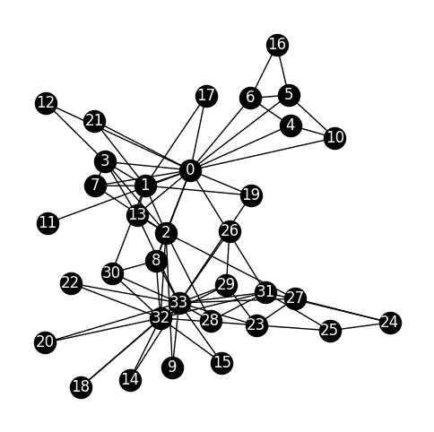

# 5.1. 动机示例：揭示社会群体#

> 原文：[`mmids-textbook.github.io/chap05_specgraph/01_motiv/roch-mmids-specgraph-motiv.html`](https://mmids-textbook.github.io/chap05_specgraph/01_motiv/roch-mmids-specgraph-motiv.html)

在本章中，我们将以网络的形式分析数据集。作为动机，我们首先查看[Karate Club 数据集](https://en.wikipedia.org/wiki/Zachary%27s_karate_club)。

来自[Wikipedia](https://en.wikipedia.org/wiki/Zachary%27s_karate_club)：

> 从 1970 年到 1972 年，Wayne W. Zachary 研究了柔道俱乐部的社会网络，为期三年。该网络捕捉了 34 名柔道俱乐部成员，记录了在俱乐部外互动的成员之间的链接。在研究期间，管理员“John A”和教练“Mr. Hi”（化名）之间发生了冲突，导致俱乐部分裂成两个部分。一半的成员围绕 Mr. Hi 形成了一个新的俱乐部；另一部分的成员找到了新的教练或放弃了柔道。基于收集到的数据，Zachary 正确地将除了一个成员之外的所有成员分配到了他们实际加入的群体。

我们使用[`NetworkX`](https://networkx.org)包来加载数据并可视化它（在克劳德的帮助下，他真的很喜欢数字`42`）。我们将在本章后面详细介绍。同时，这里有一个很好的教程[链接](https://networkx.org/documentation/stable/tutorial.html)。

```py
import networkx as nx
G = nx.karate_club_graph()

plt.figure(figsize=(6,6))
pos = nx.spring_layout(G, k=0.7, iterations=50, seed=42)
nx.draw_networkx(G, pos=pos, node_size=300, node_color='black', font_color='white')
plt.axis('off')
plt.show() 
```



我们的目标：

> 识别网络中的自然子群体

也就是说，我们想要找到许多节点之间有大量链接，但与其他节点相对较少的节点组。

结果表明，与图自然关联的拉普拉斯矩阵的特征向量包含有关此类社区的有用信息。

**CHAT & LEARN** 向你最喜欢的 AI 聊天机器人询问为什么它如此喜欢数字 42。 \(\ddagger\)
