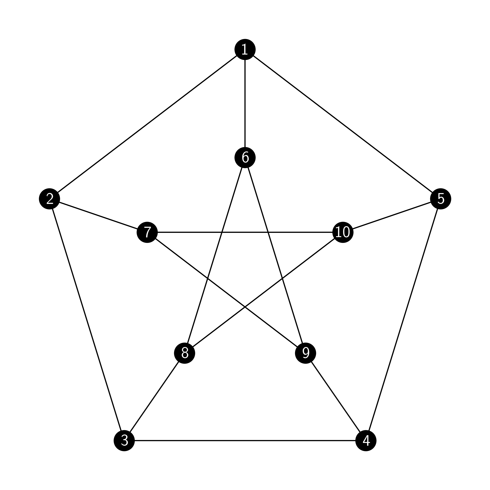
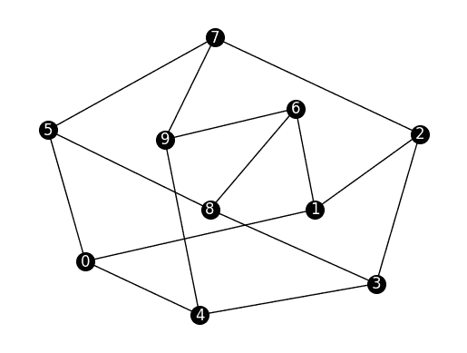
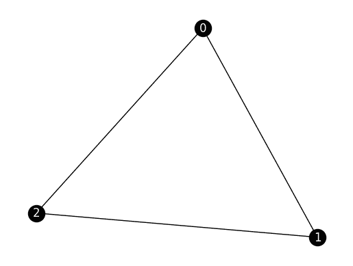
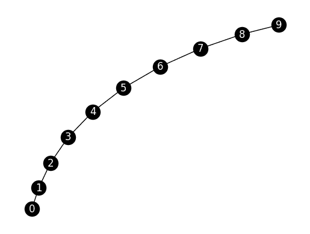
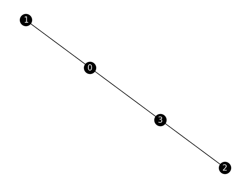
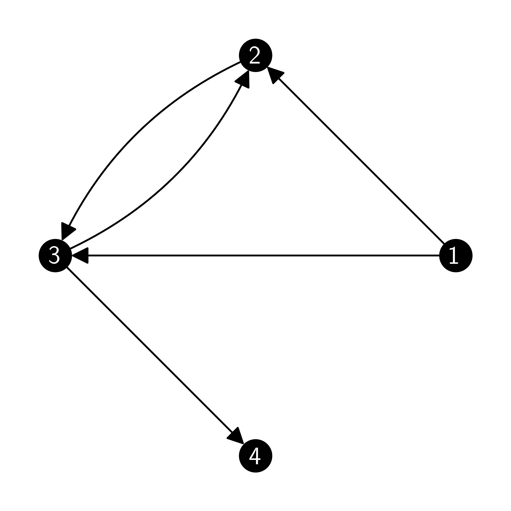
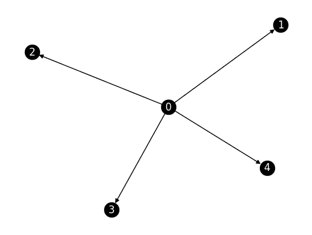
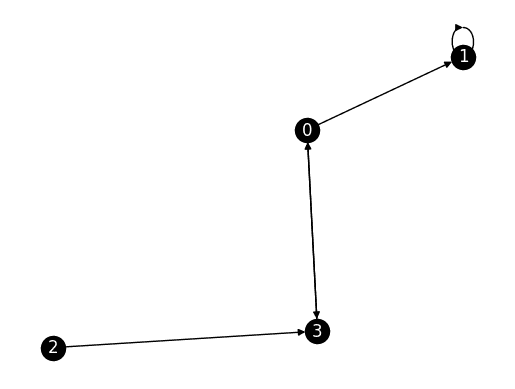
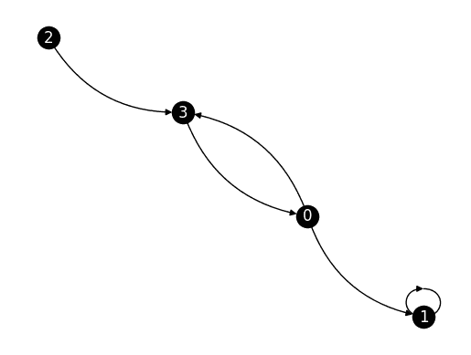
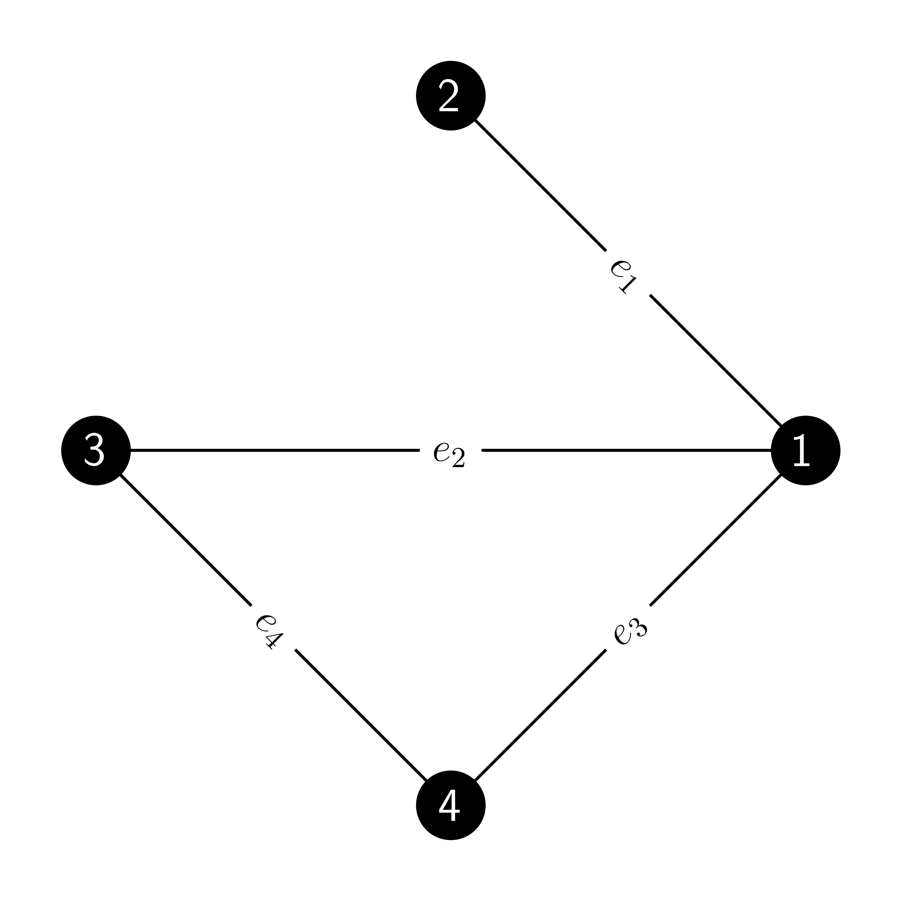

# 5.2\. 背景：图论的基本概念

> 原文：[`mmids-textbook.github.io/chap05_specgraph/02_graph/roch-mmids-specgraph-graph.html`](https://mmids-textbook.github.io/chap05_specgraph/02_graph/roch-mmids-specgraph-graph.html)

在本节中，我们介绍图论的基本概念。我们还介绍了 `NetworkX` 包。

## 5.2.1\. 无向图#

我们从无向图开始。

**定义** **（无向图）** $\idx{graph}\xdi$ $\idx{undirected graph}\xdi$ 一个无向图（或简称为图）是一个对 $G = (V,E)$，其中 $V$ 是顶点（或节点）的集合，

$$ E \subseteq \{\{u,v\}\,:\, u,v \in V,\ u \neq v\} $$

是边的集合。 $\natural$

注意，除非另有说明，我们通常不允许自环，即连接顶点到自身的边。



我们偶尔会写 $V(G)$ 和 $E(G)$ 来表示图 $G$ 的顶点和边。在我们的情况下，顶点集合 $V$ 总是有限的。

**定义** **（顶点与边的关联）** 一个顶点 $v \in V$ 与一个边 $e \in E$ 关联$\idx{incident}\xdi$，如果 $v \in e$。一个边的关联顶点称为其端点。两个顶点 $u,v \in V$ 是相邻的$\idx{adjacent}\xdi$（或邻居），我们用 $u \sim v$ 表示，如果 $\{u,v\} \in E$。 $\natural$

**定义** **（邻域和度数）** $v$ 的相邻顶点的集合，记为 $N(v)$，称为 $v$ 的邻域$\idx{neighborhood}\xdi$，其大小，即 $\delta(v):=|N(v)|$，是 $v$ 的度数$\idx{degree}\xdi$。一个 $\delta(v) = 0$ 的顶点称为孤立$\idx{isolated}\xdi$。如果一个图的所有度数都是 $d$，则称为 $d$-正则$\idx{regular}\xdi$。 $\natural$

一个众所周知的结果，有时被称为[握手引理](https://en.wikipedia.org/wiki/Handshaking_lemma)$\idx{handshaking lemma}\xdi$，表明所有度数的和是边数的两倍（证明它！）。

**示例** **（Petersen 图）** 上图展示了 Petersen 图。所有顶点的度数都是 $3$，即它是 $3$-正则的。特别是，没有孤立顶点。 $\lhd$

**定义** **（路径）** $G$ 中的一个路径$\idx{path}\xdi$ 是一系列（不一定不同的）顶点 $x_0 \sim x_1 \sim \cdots \sim x_k$，其中每对连续的顶点都是相邻的。边的数量，$k$，称为路径的长度。如果端点 $x_0$ 和 $x_k$ 相同，即 $x_0 = x_k$，我们称该路径为一个环$\idx{cycle}\xdi$。如果顶点都是不同的（除了可能的端点），我们说该路径（或环）是自避免的。连接两个不同顶点 $u, v$ 的最短自避免路径的长度称为 $u$ 和 $v$ 之间的图距离$\idx{graph distance}\xdi$，记为 $\rho(u,v)$。 $\natural$

**定义** **（连通）** 我们写 $u \leftrightarrow v$ 如果 $u$ 和 $v$ 之间存在路径。（按照惯例 $u \leftrightarrow u$。）一个图是连通的，如果它的任意两个顶点之间存在路径，即对于所有 $u, v \in V$，如果 $u \leftrightarrow v$。$\natural$

**例证：** **（Petersen 图继续）** Petersen 图是连通的。$\lhd$

**引理** 关系 $\leftrightarrow$ 是一个 [等价关系](https://en.wikipedia.org/wiki/Equivalence_relation)，即对于所有 $u$，$u \leftrightarrow u$（自反性），$u \leftrightarrow v$ 当且仅当 $v \leftrightarrow u$（对称性），以及 $u \leftrightarrow v$ 和 $v \leftrightarrow w$ 意味着 $u \leftrightarrow w$（传递性）。$\flat$

*证明：* 第一个陈述直接从定义中得出。第二个陈述是通过注意到我们可以反转 $u$ 和 $v$ 之间的路径来构造 $v$ 和 $u$ 之间的路径而得到的。第三个陈述是通过注意到我们可以将 $v$ 和 $w$ 之间的路径添加到 $u$ 和 $v$ 之间的路径中来构造 $u$ 和 $w$ 之间的路径而得到的。$\square$

**定义** **（连通分量）** 等价类 $C[u] = \{v \in V\,:\, u \leftrightarrow v\}$，即通过路径从 $u$ 可达的所有顶点的集合，被称为连通分量$\idx{连通分量}\xdi$。一个图是连通的，当且仅当它只有一个连通分量。$\natural$

我们接下来将证明（不同的）连通分量构成了 $V$ 的一个划分。对于任何等价关系，这一性质更一般地成立。

**引理** 以下陈述是等价的：

a) $u \leftrightarrow v$

b) $C[u] = C[v]$

c) $C[u] \cap C[v] \neq \emptyset$

$\flat$

因此，要么 $C[u] = C[v]$，要么 $C[u] \cap C[v] = \emptyset$。

*证明：*

a) $\implies$ b): 设 $w \in C[u]$。因此 $u \leftrightarrow w$。对称性和传递性意味着 $v \leftrightarrow w$，这证明了该命题。

b) $\implies$ c): 由于 $u \in C[u]$ 由自反性得出，我们有 $\emptyset \neq C[u] = C[v] = C[u] \cap C[v]$。

c) $\implies$ a): 设 $w \in C[u] \cap C[v]$。那么 $u \leftrightarrow w$ 和 $v \leftrightarrow w$。对称性和传递性意味着 $u \leftrightarrow v$。

$\square$


*子图和特殊图：* 在网络分析中，人们通常对在更大的图中寻找或计数有趣的基元或子图感兴趣。我们在这里不会过多地涉及网络分析中的这个重要问题，但请参阅 *练习* 部分。

**定义** **(子图)** $G = (V,E)$ 的子图$\idx{子图}\xdi$是一个图 $G' = (V',E')$，其中 $V' \subseteq V$ 且 $E' \subseteq E$。在此定义中隐含的事实是 $E'$ 中的边仅与 $V'$ 相关联。如果子图 $G'$ 被称为诱导的，那么 $\natural$

$$ E' = \{\{x,y\}\,:\, x,y \in V',\ \{x,y\}\in E\}, $$

即，如果它恰好包含 $G$ 中 $V'$ 顶点之间的边。在这种情况下，使用符号 $G' := G[V']$。 $\natural$

**定义** **(生成子图)** 如果 $V' = V$，则称子图为生成子图$\idx{生成子图}\xdi$。 $\natural$

**定义** **(完全子图或团)** 包含其所有顶点之间所有可能边的子图称为完全子图或团$\idx{团}\xdi$。 $\natural$

**示例** **(继续)** Petersen 图不包含三角形（即包含 $3$ 个顶点的完全子图），无论是诱导的还是有诱导的。 $\lhd$

**定义** **(树和森林)** 没有自回避环的图称为森林$\idx{森林}\xdi$。一个树$\idx{树}\xdi$是一个连通的森林。度数为 $1$ 的顶点称为叶子。$G$ 的生成树是一个既是树又是生成子图的子图。 $\natural$

**数值角落**：在 Python 中，\[`NetworkX`](https://networkx.org) 包提供了定义、修改和绘制图的许多功能。例如，可以方便地定义许多标准图。函数 \[`networkx.petersen_graph`](https://networkx.org/documentation/stable/reference/generated/networkx.generators.small.petersen_graph.html) 定义了 Petersen 图。

```py
G = nx.petersen_graph() 
```

可以使用函数 \[`networkx.draw_networkx`](https://networkx.org/documentation/stable/reference/generated/networkx.drawing.nx_pylab.draw_networkx.html) 绘制图形。回想一下，在 NumPy 数组索引从 $0$ 开始。一致地，NetworkX 也从 $0$ 开始命名顶点。然而，请注意，这与我们的数学约定相冲突。

```py
nx.draw_networkx(G, node_color='black', font_color='white', node_size=200)
plt.axis('off')
plt.show() 
```



其他标准图可以通过特殊函数生成，例如使用 \[`networkx.complete_graph`](https://networkx.org/documentation/stable/reference/generated/networkx.generators.classic.complete_graph.html#networkx.generators.classic.complete_graph)。有关完整列表，请参阅[这里](https://networkx.org/documentation/stable/reference/generators.html#module-networkx.generators.classic)。

```py
G = nx.complete_graph(3)

nx.draw_networkx(G, node_color='black', font_color='white')
plt.axis('off')
plt.show() 
```



请参阅[这里](https://networkx.org/documentation/stable/reference/functions.html)和[这里](https://networkx.org/documentation/stable/reference/algorithms/index.html)以获取访问图各种属性的函数列表。以下是一些示例：

```py
G = nx.path_graph(10)

nx.draw_networkx(G, node_color='black', font_color='white')
plt.axis('off')
plt.show() 
```



```py
G.number_of_nodes() # number of nodes 
```

```py
10 
```

```py
G.number_of_edges() # number of edges 
```

```py
9 
```

```py
G.has_node(7) # checks whether the graph has a particular vertex 
```

```py
True 
```

```py
G.has_node(10) 
```

```py
False 
```

```py
G.has_edge(0, 1) # checks whether the graph has a particular edge 
```

```py
True 
```

```py
G.has_edge(0, 2) 
```

```py
False 
```

```py
[n for n in G.neighbors(2)] # returns a list of neighbors of the specified vertex 
```

```py
[1, 3] 
```

```py
nx.is_connected(G) # checks whether the graph is connected 
```

```py
True 
```

```py
[cc for cc in nx.connected_components(G)] # returns the connected components 
```

```py
[{0, 1, 2, 3, 4, 5, 6, 7, 8, 9}] 
```

```py
for e in G.edges():
    print(e) 
```

```py
(0, 1)
(1, 2)
(2, 3)
(3, 4)
(4, 5)
(5, 6)
(6, 7)
(7, 8)
(8, 9) 
```

指定图的另一种方法是从一个具有给定顶点数的空图开始，然后逐个添加边。以下命令创建了一个有 $4$ 个顶点且没有边的图（参见[`networkx.empty_graph`](https://networkx.org/documentation/stable/reference/generated/networkx.generators.classic.empty_graph.html#networkx.generators.classic.empty_graph))）。

```py
G = nx.empty_graph(4)
G.add_edge(0, 1)
G.add_edge(2, 3)
G.add_edge(0, 3)
G.add_edge(3, 0)

nx.draw_networkx(G, node_color='black', font_color='white')
plt.axis('off')
plt.show() 
```



$\unlhd$

## 5.2.2\. 有向图#

我们还需要有向图。

**定义** **（有向图）** 有向图$\idx{directed graph}\xdi$（或简称为 digraph）是一个对 $G = (V,E)$，其中 $V$ 是顶点（或节点）的集合，

$$ E \subseteq V² = \{(u,v)\,:\, u,v \in V\} $$

是一组有向边（或弧）。$\natural$

注意，在有向情况下，我们明确允许自环$\idx{self-loop}\xdi$，即形式为 $(u,u)$ 的边，它将一个顶点连接到自身。

注意，与无向情况不同，在有向图中，边是有序对——这意味着它们有方向。如果 $e = (i,j) \in E$ 是有向图 $G = (V,E)$ 中的一个边，那么 $i$ 被称为 $e$ 的源，$j$ 被称为 $e$ 的目标。



无向情况中讨论的定义可以适应到有向情况。

在有向情况下，区分出度和入度。

**定义** **（出度和入度）** 设 $G = (V,E)$ 为一个有向图。顶点 $v \in V$ 的出度$\idx{out-degree}\xdi$，记为 $\delta^+(v)$，是与 $v$ 为源的边的数量。顶点 $v$ 的入度$\idx{in-degree}\xdi$，记为 $\delta^-(v)$，是与 $v$ 为目标的边的数量。$\natural$

路径和连通性也被自然地推广。

**定义** **（有向路径）** 有向路径$\idx{directed path}\xdi$ 是一个顶点序列 $x_0, \ldots, x_k$，其中对于所有 $i=1,\ldots,k$，$(x_{i-1},x_i) \in E$。我们写 $u \to v$ 如果存在这样的路径，其中 $x_0 = u$ 和 $x_k = v$。如果端点 $x_0$ 和 $x_k$ 相同，即 $x_0 = x_k$，我们称它为有向环$\idx{directed cycle}\xdi$。$\natural$

**定义** **（通信）** 我们说 $u,v \in V$ 通信$\idx{communicate}\xdi$，我们用 $u \leftrightarrow v$ 表示，如果 $u \to v$ 且 $v \to u$。$\leftrightarrow$ 关系再次是一个等价关系。$\leftrightarrow$ 的等价类被称为 $G$ 的强连通分量。$\natural$

**定义** **(强连通)** 一个有向图是强连通的$\idx{强连通}\xdi$，如果它的任意两个顶点都是相互可达的，即对于所有 $u, v \in V$，如果 $u \leftrightarrow v$。或者换句话说，如果只有一个强连通分量$\idx{强连通分量}\xdi$。 $\natural$

**定义** **(有向无环图)** 一个有向图被称为有向无环图（DAG）$\idx{有向无环图}\xdi$，如果它不包含任何有向环。 $\natural$

**数值角**：`NetworkX` 包也支持有向图。

```py
G = nx.DiGraph()
nx.add_star(G, [0, 1, 2, 3, 4])

nx.draw_networkx(G, node_color='black', font_color='white')
plt.axis('off')
plt.show() 
```



指定有向图的另一种方式是先从一个具有给定顶点数的空图开始，然后逐个添加边（与上面的无向情况进行比较）。

```py
G = nx.DiGraph()
G.add_edge(0, 1)
G.add_edge(2, 3)
G.add_edge(0, 3)
G.add_edge(3, 0)
G.add_edge(1, 1)

nx.draw_networkx(G, node_color='black', font_color='white')
plt.axis('off')
plt.show() 
```



注意，这里用双箭头表示了两个方向上的边。此外，自环通常绘制得有些尴尬。我们可以使用 `networkx.draw_networkx_edges`（与 `networkx.draw_networkx_nodes` 和 `networkx.draw_networkx_labels` 一起）来更精确地控制边的绘制。

```py
pos = nx.spring_layout(G, seed=42)
nx.draw_networkx_nodes(G, pos, node_color='black')
nx.draw_networkx_labels(G, pos, font_color='white')
nx.draw_networkx_edges(G, pos, connectionstyle="arc3,rad=0.3")
plt.axis('off')
plt.show() 
```



$\unlhd$

## 5.2.3\. 图的矩阵表示#

指定一个图的一个方便且有用的方式是通过矩阵表示。有许多这样的表示。

我们从邻接矩阵开始。

**定义** **(邻接矩阵)** 假设无向图 $G = (V,E)$ 有 $n = |V|$ 个顶点，编号为 $1,\ldots,n$。$G$ 的邻接矩阵$\idx{邻接矩阵}\xdi$ $A$ 是一个 $n\times n$ 的对称矩阵，定义为

$$\begin{align*} A_{xy} = \begin{cases} 1 & \text{if $\{x,y\} \in E$}\\ 0 & \text{o.w.} \end{cases} \end{align*}$$

$\natural$

**示例**：以下图的邻接矩阵：



是

$$\begin{split} A= \begin{pmatrix} 0 & 1 & 1 & 1\\ 1 & 0 & 0 & 0\\ 1 & 0 & 0 & 1\\ 1 & 0 & 1 & 0 \end{pmatrix}. \end{split}$$

注意，它确实是对称的。 $\lhd$

与图相关的一个有用的矩阵是它的关联矩阵。为了方便，我们再次假设 $G = (V,E)$ 的顶点编号为 $1, \ldots, n$，其中 $n$ 是顶点的数量。我们进一步假设边被标记为 $e_1, \ldots, e_{m}$，其中 $m$ 是边的数量。

**定义** **(关联矩阵)** 无向图 $G = (V, E)$ 的关联矩阵$\idx{关联矩阵}\xdi$ 是一个 $n \times m$ 的矩阵 $B$，其中 $n = |V|$ 和 $m =|E|$ 分别是顶点和边的数量，当且仅当顶点 $i$ 和边 $e_j$ 相关联时 $B_{ij} = 1$，否则为 0。 $\natural$

**示例**: **(继续)** 上一个示例中的图的关联矩阵如下所示

$$\begin{split} B = \begin{pmatrix} 1 & 1 & 1 & 0\\ 1 & 0 & 0 & 0\\ 0 & 1 & 0 & 1\\ 0 & 0 & 1 & 1 \end{pmatrix}. \end{split}$$

这个矩阵不是对称的。事实上，在一般情况下，它甚至不是方阵。 $\lhd$

**数值角**: 使用 NetworkX，可以通过 `networkx.adjacency_matrix` [链接](https://networkx.org/documentation/stable/reference/generated/networkx.linalg.graphmatrix.adjacency_matrix.html) 获取图的邻接矩阵。默认情况下，它返回一个 SciPy 稀疏矩阵。或者，可以通过 `toarray` [链接](https://docs.scipy.org/doc/scipy/reference/generated/scipy.sparse.csr_matrix.toarray.html) 获取常规数组。

```py
G = nx.complete_graph(4)
A = nx.adjacency_matrix(G)
print(A) 
```

```py
 (0, 1)	1
  (0, 2)	1
  (0, 3)	1
  (1, 0)	1
  (1, 2)	1
  (1, 3)	1
  (2, 0)	1
  (2, 1)	1
  (2, 3)	1
  (3, 0)	1
  (3, 1)	1
  (3, 2)	1 
```

```py
A = nx.adjacency_matrix(G).toarray()
print(A) 
```

```py
[[0 1 1 1]
 [1 0 1 1]
 [1 1 0 1]
 [1 1 1 0]] 
```

关联矩阵可以通过 `networkx.incidence_matrix` [链接](https://networkx.org/documentation/stable/reference/generated/networkx.linalg.graphmatrix.incidence_matrix.html) 获取——同样作为一个稀疏数组。

```py
B = nx.incidence_matrix(G)
print(B) 
```

```py
 (0, 0)	1.0
  (1, 0)	1.0
  (0, 1)	1.0
  (2, 1)	1.0
  (0, 2)	1.0
  (3, 2)	1.0
  (1, 3)	1.0
  (2, 3)	1.0
  (1, 4)	1.0
  (3, 4)	1.0
  (2, 5)	1.0
  (3, 5)	1.0 
```

```py
B = nx.incidence_matrix(G).toarray()
print(B) 
```

```py
[[1\. 1\. 1\. 0\. 0\. 0.]
 [1\. 0\. 0\. 1\. 1\. 0.]
 [0\. 1\. 0\. 1\. 0\. 1.]
 [0\. 0\. 1\. 0\. 1\. 1.]] 
```

$\unlhd$

在有向图的情况下，定义如下调整。有向图 $G = (V, E)$ 的邻接矩阵$\idx{邻接矩阵}\xdi$ $A$ 是定义为

$$\begin{align*} A_{xy} = \begin{cases} 1 & \text{if $(x,y) \in E$}\\ 0 & \text{o.w.} \end{cases} \end{align*}$$

一个具有顶点 $1,\ldots,n$ 和边 $e_1, \ldots, e_m$ 的有向图 $G$ 的关联矩阵$\idx{关联矩阵}\xdi$ 是一个矩阵 $B$，其中 $B_{ij} = -1$ 如果边 $e_j$ 离开顶点 $i$，$B_{ij} = 1$ 如果边 $e_j$ 进入顶点 $i$，否则为 0。

回到无向图，一个无向图 $G = (V, E)$ 的定向是一个为其每条边选择方向的过程，使其成为一个有向图。

**定义** **(定向关联矩阵)** 无向图 $G = (V, E)$ 的定向关联矩阵$\idx{定向关联矩阵}\xdi$ 是 $G$ 的定向的关联矩阵。 $\natural$


**数值角**: 我们重新审视一个早期的有向图。

```py
G = nx.DiGraph()
G.add_edge(0, 1)
G.add_edge(2, 3)
G.add_edge(0, 3)
G.add_edge(3, 0)
G.add_edge(1,1) 
```

我们计算邻接矩阵和关联矩阵。对于关联矩阵，必须指定 `oriented=True` 以获取定向版本。

```py
A = nx.adjacency_matrix(G).toarray()
print(A) 
```

```py
[[0 1 0 1]
 [0 1 0 0]
 [0 0 0 1]
 [1 0 0 0]] 
```

```py
B = nx.incidence_matrix(G, oriented=True).toarray()
print(B) 
```

```py
[[-1\. -1\.  0\.  0\.  1.]
 [ 1\.  0\.  0\.  0\.  0.]
 [ 0\.  0\.  0\. -1\.  0.]
 [ 0\.  1\.  0\.  1\. -1.]] 
```

回顾一个先前的无向图，我们注意到 `incidence_matrix()` 也可以通过使用 `oriented=True` 选项生成任意有向关联矩阵。

```py
G = nx.empty_graph(4)
G.add_edge(0, 1)
G.add_edge(2, 3)
G.add_edge(0, 3)
G.add_edge(3, 0)

B = nx.incidence_matrix(G, oriented=True).toarray()
print(B) 
```

```py
[[-1\. -1\.  0.]
 [ 1\.  0\.  0.]
 [ 0\.  0\. -1.]
 [ 0\.  1\.  1.]] 
```

$\unlhd$

## 5.2.4\. 拉普拉斯矩阵#

我们感兴趣的主要矩阵将是拉普拉斯矩阵。它是微分几何中 [拉普拉斯-贝尔特拉米算子](https://en.wikipedia.org/wiki/Laplace%E2%80%93Beltrami_operator) 的图类似物。我们将特别展示它包含有关图连通性的有用信息，我们将在下一节描述其应用于图划分的应用。但首先是一些理论。

回想一下，给定一个图 $G = (V, E)$，量 $\delta(v)$ 表示顶点 $v \in V$ 的度数。

**定义** **(度矩阵)** 设 $G = (V,E)$ 是一个顶点集为 $V = \{1, \ldots, n\}$ 的图。度矩阵$\idx{度矩阵}\xdi$ 是对角矩阵，其对角线上的元素是度数，即 $D = \mathrm{diag}(\delta(1), \ldots, \delta(n))$。 $\natural$

关键的定义如下。

**定义** **(拉普拉斯矩阵)** 设 $G = (V,E)$ 是一个顶点集为 $V = \{1, \ldots, n\}$ 的图，邻接矩阵 $A \in \mathbb{R}^{n \times n}$ 和度矩阵 $D = \mathrm{diag}(\delta(1), \ldots, \delta(n))$。与 $G$ 相关的拉普拉斯矩阵$\idx{拉普拉斯矩阵}\xdi$ 定义为 $L = D - A$。其元素为

$$\begin{split} l_{ij} = \begin{cases} \delta(i) & \text{if $i = j$}\\ -1 & \text{if $\{i,j\} \in E$}\\ 0 & \text{o.w.} \end{cases} \end{split}$$

$\natural$

与邻接矩阵一样，拉普拉斯矩阵是对称的。然而，与邻接矩阵不同的是，它也是正半定的。

**定理** **(拉普拉斯算子的性质)** $\idx{拉普拉斯算子性质定理}\xdi$ 对于任何图 $G$，拉普拉斯矩阵是对称和正半定的。 $\sharp$

*证明:* 观察到图 $G$ 的拉普拉斯矩阵 $L$ 确实是对称的：

$$ L^T = (D- A)^T = D^T - A^T = D - A $$

其中我们使用了 $D$ 和 $A$ 本身都是对称的。

为了证明第二个断言，我们需要一个引理。

**引理** **(拉普拉斯与关联)** $\idx{拉普拉斯与关联引理}\xdi$ 设 $L$ 是图 $G$ 的拉普拉斯矩阵。设 $B$ 是 $G$ 的任意有向关联矩阵。那么

$$ L = B B^T. $$

$\flat$

*证明思路:* 我们逐项检查这个断言。

*证明:* 列举边 $e_1,\ldots,e_m$。令 $b_{ik}$ 为 $B$ 的 $(i,k)$ 元素。对于 $i \neq j$，$B B^T$ 的 $(i,j)$ 元素

$$ (B B^T)_{ij} = \sum_{k=1}^m b_{ik} b_{jk}. $$

注意到 $b_{ik} b_{jk}$ 等于 (a) $0$ 如果 $i$ 或 $j$ (或两者) 与 $e_k$ 无关，或者 (b) $-1$ 如果 $i$ 和 $j$ 都与 $e_k$ 相关（因为 $i$ 或 $j$ 中的一个在 $e_k$ 对应的列中有 $1$，另一个有 $-1$）。所以当 $\{i,j\} \in E$ 时，$(B B^T)_{ij} = -1$，否则为 $0$。因此它与拉普拉斯矩阵的对应项相吻合。

对于 $i = j$，

$$ (B B^T)_{ii} = \sum_{k=1}^m b_{ik}² = \sum_{e = \{x, y\} \in E: i \in e} b_{xy}² = \sum_{e = \{x, y\} \in E: i \in e} 1 = \delta(i), $$

其中我们使用了 $b_{xy}² = 1$ 因为当 $\{x,y\} \in E$ 时，$b_{xy} \in \{-1,1\}$。再次与拉普拉斯矩阵的对应项相吻合。 $\square$

我们回到定理的证明。根据前面的引理，对于任何 $\mathbf{x} \in \mathbb{R}^n$，

$$ \mathbf{x}^T L \mathbf{x} = \mathbf{x}^T B B^T \mathbf{x} = \|B^T \mathbf{x}\|² \geq 0. $$

这证明了正半定性。 $\square$

***自我评估测验*** *(由克劳德、双子座和 ChatGPT 协助)*

**1** 以下哪项不是无向图的合法定义？

a) 一对 $G = (V, E)$，其中 $V$ 是顶点集，$E$ 是顶点无序对的集合。

b) 由没有方向的边连接的节点集合。

c) 一对 $G = (V, E)$，其中 $V$ 是顶点集，$E$ 是顶点有序对的集合。

d) 用于模拟对象之间成对关系的数学结构。

**2** 在一个图中，等价关系 $\leftrightarrow$ 表示什么？

a) 两个顶点处于相同的连通分量。

b) 两个顶点的度数相同。

c) 两个顶点是相邻的。

d) 两个顶点是循环的一部分。

**3** 在有向图中，顶点的入度和出度之间的关系是什么？

a) 入度总是大于或等于出度。

b) 出度总是大于或等于入度。

c) 入度和出度总是相等。

d) 入度和出度之间没有固定的关系。

**4** 以下哪项不是图拉普拉斯矩阵的性质？

a) 它是对称的。

b) 它是正半定的。

c) 它总是可逆的。

d) 它的每一行和每一列的项之和为零。

**5** 哪种图的矩阵表示通常是对称的？

a) 无向图的邻接矩阵。

b) 无向图的邻接矩阵。

c) 有向图的邻接矩阵。

d) 以上所有选项。

1 的答案：c. 理由：文本将无向图定义为 $G = (V, E)$ 的对，其中 $E$ 是顶点无序对的集合，而不是有序对。

2 的答案：a. 理由：文本将关系 $\leftrightarrow$ 定义为表示两个顶点处于相同连通分量的等价关系。

3 的答案：d. 理由：有向图中一个顶点的入度和出度分别取决于进入和离开该顶点的边的数量，它们之间没有固定的关系。

4 的答案：c. 理由：文本证明了拉普拉斯矩阵是对称和正半定的，但并没有声称它总是可逆的。

5 的答案：a. 理由：文本指出无向图的邻接矩阵是对称的。

## 5.2.1\. 无向图#

我们从无向图开始。

**定义** **（无向图**）$\idx{graph}\xdi$ $\idx{undirected graph}\xdi$ 无向图（或简称图）是一个对 $G = (V,E)$，其中 $V$ 是顶点集（或节点集），

$$ E \subseteq \{\{u,v\}\,:\, u,v \in V,\ u \neq v\} $$

是边的集合。$\natural$

注意，除非另有说明，我们通常不允许自环，即连接顶点到自身的边。


我们偶尔会写 $V(G)$ 和 $E(G)$ 来表示图 $G$ 的顶点和边。在我们的情况下，顶点集 $V$ 总是有限的。

**定义** **（关联和邻接**）顶点 $v \in V$ 与边 $e \in E$ 关联$\idx{incident}\xdi$，如果 $v \in e$。边的关联顶点称为其端点。如果 $u,v \in V$ 是相邻的$\idx{adjacent}\xdi$（或邻居），我们用 $u \sim v$ 表示，如果 $\{u,v\} \in E$。$\natural$

**定义** **（邻接点和度**）顶点 $v$ 的相邻顶点集，记为 $N(v)$，称为 $v$ 的邻域$\idx{neighborhood}\xdi$，其大小，即 $\delta(v):=|N(v)|$，是 $v$ 的度$\idx{degree}\xdi$。度数为 $\delta(v) = 0$ 的顶点称为孤立$\idx{isolated}\xdi$。如果一个图的所有顶点的度数都是 $d$，则该图称为 $d$-正则$\idx{regular}\xdi$。$\natural$

一个众所周知的结果，有时被称为[握手引理](https://en.wikipedia.org/wiki/Handshaking_lemma)$\idx{handshaking lemma}\xdi$，指出所有度数的和是边数的两倍（证明它！）。

**示例** **（彼得森图**）如上图所示，彼得森图的所有顶点度数均为 $3$，即它是 $3$-正则的。特别是，没有孤立顶点。$\lhd$

**定义** **(路径)** 在 $G$ 中，一个路径$\idx{path}\xdi$ 是一系列（不一定不同的）顶点 $x_0 \sim x_1 \sim \cdots \sim x_k$，其中每对连续的顶点相邻。边的数量，$k$，称为路径的长度。如果端点 $x_0$ 和 $x_k$ 相同，即 $x_0 = x_k$，则称该路径为一个环$\idx{cycle}\xdi$。如果顶点都是不同的（除了可能的端点），则称该路径（或环）是自避免的。连接两个不同顶点 $u, v$ 的最短自避免路径的长度称为 $u$ 和 $v$ 之间的图距离$\idx{graph distance}\xdi$，记为 $\rho(u,v)$。$\natural$

**定义** **(连通)** 我们写 $u \leftrightarrow v$ 如果存在 $u$ 和 $v$ 之间的路径。（按照惯例 $u \leftrightarrow u$。）一个图是连通的，如果它的任意两个顶点之间都存在路径，即对于所有 $u, v \in V$，如果 $u \leftrightarrow v$。$\natural$

**示例** **(Petersen 图继续)** Petersen 图是连通的。$\lhd$

**引理** 关系 $\leftrightarrow$ 是一个 [等价关系](https://en.wikipedia.org/wiki/Equivalence_relation)，即对于所有 $u$，$u \leftrightarrow u$（自反性），$u \leftrightarrow v$ 当且仅当 $v \leftrightarrow u$（对称性），并且 $u \leftrightarrow v$ 和 $v \leftrightarrow w$ 蕴含 $u \leftrightarrow w$（传递性）。$\flat$

**证明**：第一个结论直接来自定义。第二个结论是通过注意到我们可以反转 $u$ 和 $v$ 之间的路径来构造一个 $v$ 和 $u$ 之间的路径而得到的。第三个结论是通过注意到我们可以将 $v$ 和 $w$ 之间的路径添加到 $u$ 和 $v$ 之间的路径中来构造一个 $u$ 和 $w$ 之间的路径而得到的。$\square$

**定义** **(连通分量)** 等价类 $C[u] = \{v \in V\,:\, u \leftrightarrow v\}$，即通过路径从 $u$ 可达的所有顶点的集合，称为连通分量$\idx{connected component}\xdi$。一个图是连通的，当且仅当它只有一个连通分量。$\natural$

我们接下来将证明（不同的）连通分量构成了 $V$ 的一个划分。这更普遍地适用于任何等价关系的等价类。

**引理** 以下陈述是等价的：

a) $u \leftrightarrow v$

b) $C[u] = C[v]$

c) $C[u] \cap C[v] \neq \emptyset$

$\flat$

因此，要么 $C[u] = C[v]$，要么 $C[u] \cap C[v] = \emptyset$。

**证明**：

a) $\implies$ b)：设 $w \in C[u]$。因此 $u \leftrightarrow w$。对称性和传递性意味着 $v \leftrightarrow w$，这证明了该命题。

b) $\implies$ c)：由于 $u \in C[u]$ 由自反性，我们有 $\emptyset \neq C[u] = C[v] = C[u] \cap C[v]$。

c) $\implies$ a): 设$w \in C[u] \cap C[v]$。那么$u \leftrightarrow w$和$v \leftrightarrow w$。对称性和传递性意味着$u \leftrightarrow v$。

$\square$


*子图和特殊图:* 在网络分析中，人们通常对在更大的图中寻找或计数有趣的基元或子图感兴趣。我们在这里不会过多地介绍网络分析中的这个重要问题，但请参阅*练习*部分。

**DEFINITION** **(Subgraph)** $G = (V,E)$的子图$G' = (V',E')$是一个具有$V' \subseteq V$和$E' \subseteq E$的图。这个定义隐含的事实是，$E'$中的边仅与$V'$相关。如果

$$ E' = \{\{x,y\}\,:\, x,y \in V',\ \{x,y\}\in E\}, $$

也就是说，如果它恰好包含$G$中$V'$顶点之间的边。在这种情况下，使用记号$G' := G[V']$。$\natural$

**DEFINITION** **(Spanning Subgraph)** 如果$V' = V$，则子图被称为生成子图$\idx{spanning subgraph}\xdi$。$\natural$

**DEFINITION** **(Clique)** 包含其顶点之间所有可能边的子图称为完全子图或团$\idx{clique}\xdi$。$\natural$

**EXAMPLE:** **(continued)** Petersen 图不包含三角形（即包含 3 个顶点的完全子图，无论是有向还是无向）。$\lhd$

**DEFINITION** **(Tree and forest)** 森林$\idx{forest}\xdi$是一个没有自回避环的图。树$\idx{tree}\xdi$是一个连通的森林。度数为 1 的顶点被称为叶子。$G$的生成树是一个既是树又是生成子图的子图。$\natural$

**NUMERICAL CORNER:** 在 Python 中，`NetworkX`包提供了定义、修改和绘制图的许多功能。例如，可以方便地定义许多标准图。`networkx.petersen_graph`函数定义了 Petersen 图。

```py
G = nx.petersen_graph() 
```

图可以使用`networkx.draw_networkx`函数绘制。回想一下，在 NumPy 数组中索引从$0$开始。一致地，NetworkX 也将顶点命名为从$0$开始。然而，这违反了我们的数学惯例。

```py
nx.draw_networkx(G, node_color='black', font_color='white', node_size=200)
plt.axis('off')
plt.show() 
```


其他标准图可以通过特殊函数生成，例如使用[网络 X 的完整图](https://networkx.org/documentation/stable/reference/generated/networkx.generators.classic.complete_graph.html#networkx.generators.classic.complete_graph)生成完整图。有关完整列表，请参阅[这里](https://networkx.org/documentation/stable/reference/generators.html#module-networkx.generators.classic)。

```py
G = nx.complete_graph(3)

nx.draw_networkx(G, node_color='black', font_color='white')
plt.axis('off')
plt.show() 
```


请参阅[这里](https://networkx.org/documentation/stable/reference/functions.html)和[这里](https://networkx.org/documentation/stable/reference/algorithms/index.html)以获取访问图各种属性的函数列表。以下是一些示例：

```py
G = nx.path_graph(10)

nx.draw_networkx(G, node_color='black', font_color='white')
plt.axis('off')
plt.show() 
```


```py
G.number_of_nodes() # number of nodes 
```

```py
10 
```

```py
G.number_of_edges() # number of edges 
```

```py
9 
```

```py
G.has_node(7) # checks whether the graph has a particular vertex 
```

```py
True 
```

```py
G.has_node(10) 
```

```py
False 
```

```py
G.has_edge(0, 1) # checks whether the graph has a particular edge 
```

```py
True 
```

```py
G.has_edge(0, 2) 
```

```py
False 
```

```py
[n for n in G.neighbors(2)] # returns a list of neighbors of the specified vertex 
```

```py
[1, 3] 
```

```py
nx.is_connected(G) # checks whether the graph is connected 
```

```py
True 
```

```py
[cc for cc in nx.connected_components(G)] # returns the connected components 
```

```py
[{0, 1, 2, 3, 4, 5, 6, 7, 8, 9}] 
```

```py
for e in G.edges():
    print(e) 
```

```py
(0, 1)
(1, 2)
(2, 3)
(3, 4)
(4, 5)
(5, 6)
(6, 7)
(7, 8)
(8, 9) 
```

指定图的一种方法是从一个具有给定数量的顶点的空图开始，然后逐个添加边。以下命令创建了一个具有 $4$ 个顶点且没有边的图（见[网络 X 的空图](https://networkx.org/documentation/stable/reference/generated/networkx.generators.classic.empty_graph.html#networkx.generators.classic.empty_graph))）。

```py
G = nx.empty_graph(4)
G.add_edge(0, 1)
G.add_edge(2, 3)
G.add_edge(0, 3)
G.add_edge(3, 0)

nx.draw_networkx(G, node_color='black', font_color='white')
plt.axis('off')
plt.show() 
```


$\unlhd$

## 5.2.2\. 有向图#

我们还需要有向图。

**定义** **（有向图）** 有向图$\idx{directed graph}\xdi$（或简称为 digraph）是一个对 $G = (V,E)$，其中 $V$ 是顶点（或节点）的集合，

$$ E \subseteq V² = \{(u,v)\,:\, u,v \in V\} $$

是一组有向边（或弧）。 $\natural$

注意，在有向情况下，我们明确允许自环$\idx{self-loop}\xdi$，即形式为 $(u,u)$ 的边，这些边将一个顶点连接到自身。

注意，与无向情况不同，在有向图中，边是有序对——这意味着它们有方向。如果 $e = (i,j) \in E$ 是有向图 $G = (V,E)$ 中的一个边，那么 $i$ 被称为 $e$ 的源，$j$ 是目标。


无向情况中讨论的定义可以适应到有向情况。

在有向情况下，区分出度和入度。

**定义** **（出度和入度）** 设 $G = (V,E)$ 为一个有向图。顶点 $v \in V$ 的出度$\idx{out-degree}\xdi$，记为 $\delta^+(v)$，是源为 $v$ 的边的数量。顶点 $v$ 的入度$\idx{in-degree}\xdi$，记为 $\delta^-(v)$，是目标为 $v$ 的边的数量。 $\natural$

路径和连通性也可以自然地推广。

**定义** **（有向路径）** 有向路径$\idx{有向路径}\xdi$ 是顶点序列 $x_0, \ldots, x_k$，其中 $(x_{i-1},x_i) \in E$ 对于所有 $i=1,\ldots,k$。如果存在这样的路径，且 $x_0 = u$ 和 $x_k = v$，我们写 $u \to v$。如果端点 $x_0$ 和 $x_k$ 相同，即 $x_0 = x_k$，我们称它为有向环$\idx{有向环}\xdi$。$\natural$

**定义** **（通信）** 我们说 $u,v \in V$ 通信$\idx{通信}\xdi$，我们用 $u \leftrightarrow v$ 表示，如果 $u \to v$ 且 $v \to u$。这个 $\leftrightarrow$ 关系再次是一个等价关系。$\leftrightarrow$ 的等价类被称为 $G$ 的强连通分量。$\natural$

**定义** **（强连通）** 一个有向图是强连通的$\idx{强连通}\xdi$，如果它的任意两个顶点都通信，即对于所有 $u, v \in V$，如果 $u \leftrightarrow v$。或者换句话说，如果只有一个强连通分量$\idx{强连通分量}\xdi$。$\natural$

**定义** **（有向无环图）** 如果一个有向图不包含有向环，则称其为有向无环图（DAG）$\idx{有向无环图}\xdi$。$\natural$

**数值角落**：`NetworkX` 包也支持有向图。

```py
G = nx.DiGraph()
nx.add_star(G, [0, 1, 2, 3, 4])

nx.draw_networkx(G, node_color='black', font_color='white')
plt.axis('off')
plt.show() 
```


指定有向图的另一种方法是先从一个具有给定顶点数的空图开始，然后逐个添加边（与上面的无向情况比较）。

```py
G = nx.DiGraph()
G.add_edge(0, 1)
G.add_edge(2, 3)
G.add_edge(0, 3)
G.add_edge(3, 0)
G.add_edge(1, 1)

nx.draw_networkx(G, node_color='black', font_color='white')
plt.axis('off')
plt.show() 
```


注意，这里用双箭头表示了两个方向上的边。此外，自环通常绘制得有些尴尬。我们可以使用 `networkx.draw_networkx_edges`（与 `networkx.draw_networkx_nodes` 和 `networkx.draw_networkx_labels` 一起使用）来对边的绘制有更多的控制。

```py
pos = nx.spring_layout(G, seed=42)
nx.draw_networkx_nodes(G, pos, node_color='black')
nx.draw_networkx_labels(G, pos, font_color='white')
nx.draw_networkx_edges(G, pos, connectionstyle="arc3,rad=0.3")
plt.axis('off')
plt.show() 
```


$\unlhd$

## 5.2.3. 图的矩阵表示#

指定图的一个方便且有用的方式是通过矩阵表示。有许多这样的表示。

我们从邻接矩阵开始。

**定义** **（邻接矩阵）** 假设无向图 $G = (V,E)$ 有 $n = |V|$ 个顶点，编号为 $1,\ldots,n$。$G$ 的邻接矩阵 $\idx{邻接矩阵}\xdi$ $A$ 是一个 $n\times n$ 的对称矩阵，定义为

$$\begin{align*} A_{xy} = \begin{cases} 1 & \text{if $\{x,y\} \in E$}\\ 0 & \text{o.w.} \end{cases} \end{align*}$$

$\natural$

**示例：** 以下图的邻接矩阵：


是

$$\begin{split} A= \begin{pmatrix} 0 & 1 & 1 & 1\\ 1 & 0 & 0 & 0\\ 1 & 0 & 0 & 1\\ 1 & 0 & 1 & 0 \end{pmatrix}. \end{split}$$

注意，它确实是对称的。$\lhd$

与图相关联的另一个有用的矩阵是它的关联矩阵。为了方便起见，我们再次假设 $G = (V,E)$ 的顶点编号为 $1, \ldots, n$，其中 $n$ 是顶点的数量。我们进一步假设边被标记为 $e_1, \ldots, e_{m}$，其中 $m$ 是边的数量。

**定义** **（关联矩阵）** 无向图 $G = (V, E)$ 的关联矩阵 $\idx{关联矩阵}\xdi$ 是一个 $n \times m$ 的矩阵 $B$，其中 $n = |V|$ 和 $m =|E|$ 分别是顶点和边的数量，使得 $B_{ij} = 1$ 如果顶点 $i$ 和边 $e_j$ 相关联，否则为 0。$\natural$

**示例：** **（继续）** 上一示例图的关联矩阵如下

$$\begin{split} B = \begin{pmatrix} 1 & 1 & 1 & 0\\ 1 & 0 & 0 & 0\\ 0 & 1 & 0 & 1\\ 0 & 0 & 1 & 1 \end{pmatrix}. \end{split}$$

这个矩阵不是对称的。事实上，在一般情况下，它甚至不是方阵。$\lhd$

**数值角：** 使用 NetworkX，可以通过 `networkx.adjacency_matrix` [链接](https://networkx.org/documentation/stable/reference/generated/networkx.linalg.graphmatrix.adjacency_matrix.html) 获取图的邻接矩阵。默认情况下，它返回一个 SciPy 稀疏矩阵。或者，可以使用 `toarray` [链接](https://docs.scipy.org/doc/scipy/reference/generated/scipy.sparse.csr_matrix.toarray.html) 获取一个常规数组。

```py
G = nx.complete_graph(4)
A = nx.adjacency_matrix(G)
print(A) 
```

```py
 (0, 1)	1
  (0, 2)	1
  (0, 3)	1
  (1, 0)	1
  (1, 2)	1
  (1, 3)	1
  (2, 0)	1
  (2, 1)	1
  (2, 3)	1
  (3, 0)	1
  (3, 1)	1
  (3, 2)	1 
```

```py
A = nx.adjacency_matrix(G).toarray()
print(A) 
```

```py
[[0 1 1 1]
 [1 0 1 1]
 [1 1 0 1]
 [1 1 1 0]] 
```

关联矩阵可以通过 `networkx.incidence_matrix` [链接](https://networkx.org/documentation/stable/reference/generated/networkx.linalg.graphmatrix.incidence_matrix.html) 获取——同样作为一个稀疏数组。

```py
B = nx.incidence_matrix(G)
print(B) 
```

```py
 (0, 0)	1.0
  (1, 0)	1.0
  (0, 1)	1.0
  (2, 1)	1.0
  (0, 2)	1.0
  (3, 2)	1.0
  (1, 3)	1.0
  (2, 3)	1.0
  (1, 4)	1.0
  (3, 4)	1.0
  (2, 5)	1.0
  (3, 5)	1.0 
```

```py
B = nx.incidence_matrix(G).toarray()
print(B) 
```

```py
[[1\. 1\. 1\. 0\. 0\. 0.]
 [1\. 0\. 0\. 1\. 1\. 0.]
 [0\. 1\. 0\. 1\. 0\. 1.]
 [0\. 0\. 1\. 0\. 1\. 1.]] 
```

$\unlhd$

在有向图的情况下，定义如下调整。有向图 $G = (V, E)$ 的邻接矩阵 $\idx{邻接矩阵}\xdi$ $A$ 是定义为

$$\begin{align*} A_{xy} = \begin{cases} 1 & \text{if $(x,y) \in E$}\\ 0 & \text{o.w.} \end{cases} \end{align*}$$

有向图 $G$ 的关联矩阵 $\idx{关联矩阵}\xdi$，顶点为 $1,\ldots,n$，边为 $e_1, \ldots, e_m$，是一个矩阵 $B$，使得 $B_{ij} = -1$ 如果边 $e_j$ 离开顶点 $i$，$B_{ij} = 1$ 如果边 $e_j$ 进入顶点 $i$，否则为 0。

回到无向图，一个（无向）图 $G = (V, E)$ 的定向是一个为每条边选择方向的选择，将其变成一个有向图。

**定义** **（有向关联矩阵）** 一个无向图 $G = (V, E)$ 的有向关联矩阵$\idx{oriented incidence matrix}\xdi$ 是 $G$ 的一个有向关联矩阵。$\natural$


**数值角：** 我们重新审视一个早期的有向图。

```py
G = nx.DiGraph()
G.add_edge(0, 1)
G.add_edge(2, 3)
G.add_edge(0, 3)
G.add_edge(3, 0)
G.add_edge(1,1) 
```

我们计算邻接矩阵和关联矩阵。对于关联矩阵，必须指定 `oriented=True` 以获得定向版本。

```py
A = nx.adjacency_matrix(G).toarray()
print(A) 
```

```py
[[0 1 0 1]
 [0 1 0 0]
 [0 0 0 1]
 [1 0 0 0]] 
```

```py
B = nx.incidence_matrix(G, oriented=True).toarray()
print(B) 
```

```py
[[-1\. -1\.  0\.  0\.  1.]
 [ 1\.  0\.  0\.  0\.  0.]
 [ 0\.  0\.  0\. -1\.  0.]
 [ 0\.  1\.  0\.  1\. -1.]] 
```

回顾一个早期的无向图，我们注意到 `incidence_matrix()` 也可以通过使用 `oriented=True` 选项生成任意定向关联矩阵。

```py
G = nx.empty_graph(4)
G.add_edge(0, 1)
G.add_edge(2, 3)
G.add_edge(0, 3)
G.add_edge(3, 0)

B = nx.incidence_matrix(G, oriented=True).toarray()
print(B) 
```

```py
[[-1\. -1\.  0.]
 [ 1\.  0\.  0.]
 [ 0\.  0\. -1.]
 [ 0\.  1\.  1.]] 
```

$\unlhd$

## 5.2.4\. 拉普拉斯矩阵#

我们感兴趣的主要矩阵将是拉普拉斯矩阵。它是微分几何中 [拉普拉斯-贝尔特拉米算子](https://en.wikipedia.org/wiki/Laplace%E2%80%93Beltrami_operator) 的图类似物。我们将在特定情况下展示它包含有关图连通性的有用信息，我们将在下一节描述其在图划分中的应用。但首先是一些理论。

回想一下，给定一个图 $G = (V, E)$，量 $\delta(v)$ 表示顶点 $v \in V$ 的度。

**定义** **（度矩阵）** 设 $G = (V,E)$ 是一个顶点 $V = \{1, \ldots, n\}$ 的图。度矩阵$\idx{degree matrix}\xdi$ 是对角矩阵，其对角线上的元素是度数，即 $D = \mathrm{diag}(\delta(1), \ldots, \delta(n))$。$\natural$

关键的定义如下。

**定义** **（拉普拉斯矩阵）** 设 $G = (V,E)$ 是一个顶点 $V = \{1, \ldots, n\}$ 的图，邻接矩阵 $A \in \mathbb{R}^{n \times n}$ 和度矩阵 $D = \mathrm{diag}(\delta(1), \ldots, \delta(n))$。与 $G$ 相关的拉普拉斯矩阵$\idx{Laplacian matrix}\xdi$ 定义为 $L = D - A$。其元素为

$$\begin{split} l_{ij} = \begin{cases} \delta(i) & \text{如果 $i = j$}\\ -1 & \text{如果 $\{i,j\} \in E$}\\ 0 & \text{其他情况} \end{cases} \end{split}$$

$\natural$

与邻接矩阵一样，拉普拉斯矩阵也是对称的。然而，与邻接矩阵不同的是，它也是正半定的。

**定理** **（拉普拉斯矩阵的性质）** $\idx{properties of the Laplacian theorem}\xdi$ 对于任何图 $G$，拉普拉斯矩阵是对称的和正半定的。$\sharp$

*证明：* 注意到图 $G$ 的拉普拉斯矩阵 $L$ 确实是对称的：

$$ L^T = (D- A)^T = D^T - A^T = D - A $$

在这里，我们使用了 $D$ 和 $A$ 本身都是对称的这一事实。

为了证明第二个命题，我们需要一个引理。

**LEMMA** **(拉普拉斯和关联)** $\idx{拉普拉斯和关联引理}\xdi$ 设 $L$ 为图 $G$ 的拉普拉斯矩阵。设 $B$ 为 $G$ 的任意有向关联矩阵。那么

$$ L = B B^T. $$

$\flat$

*证明思路:* 我们逐项检查这个断言。

*证明:* 列举边 $e_1,\ldots,e_m$。设 $b_{ik}$ 为 $B$ 的 $(i,k)$ 项。对于 $i \neq j$，$B B^T$ 的 $(i,j)$ 项

$$ (B B^T)_{ij} = \sum_{k=1}^m b_{ik} b_{jk}. $$

注意到 $b_{ik} b_{jk}$ 等于 (a) $0$ 如果 $i$ 或 $j$（或两者）与 $e_k$ 无关联，或者 (b) $-1$ 如果 $i$ 和 $j$ 都与 $e_k$ 关联（因为 $i$ 或 $j$ 中的一个在 $e_k$ 对应的 $B$ 的列中有一个 $1$，另一个有一个 $-1$）。因此，当 $\{i,j\} \in E$ 时，$(B B^T)_{ij} = -1$，否则为 $0$。因此，它与拉普拉斯矩阵中相应的项相同。

对于 $i = j$，

$$ (B B^T)_{ii} = \sum_{k=1}^m b_{ik}² = \sum_{e = \{x, y\} \in E: i \in e} b_{xy}² = \sum_{e = \{x, y\} \in E: i \in e} 1 = \delta(i), $$

其中我们使用了 $b_{xy}² = 1$，因为当 $\{x,y\} \in E$ 时，$b_{xy} \in \{-1,1\}$。再次与拉普拉斯矩阵中相应的项相同。 $\square$

我们回到定理的证明。根据前面的引理，对于任何 $\mathbf{x} \in \mathbb{R}^n$，

$$ \mathbf{x}^T L \mathbf{x} = \mathbf{x}^T B B^T \mathbf{x} = \|B^T \mathbf{x}\|² \geq 0. $$

这证明了正半定。 $\square$

***自我评估测验*** *(由克劳德、双子星和 ChatGPT 协助)*

**1** 以下哪项不是无向图的合法定义？

a) 一对 $G = (V, E)$，其中 $V$ 是顶点集，$E$ 是顶点对的集合。

b) 由无向边连接的节点集合，其中边没有方向。

c) 一对 $G = (V, E)$，其中 $V$ 是顶点集，$E$ 是顶点对的集合。

d) 用于在对象之间建模成对关系的数学结构。

**2** 在图中，等价关系 $\leftrightarrow$ 表示什么？

a) 两个顶点在同一个连通分量中。

b) 两个顶点的度数相同。

c) 两个顶点相邻。

d) 两个顶点构成一个环。

**3** 在有向图中，顶点的入度和出度之间的关系是什么？

a) 入度总是大于或等于出度。

b) 出度总是大于或等于入度。

c) 入度和出度总是相等。

d) 入度和出度之间没有固定的关系。

**4** 以下哪项不是图拉普拉斯矩阵的性质？

a) 它是对称的

b) 它是正半定的

c) 它总是可逆的

d) 它的每一行和每一列的项之和为零

**5** 哪种图的矩阵表示通常是对称的？

a) 无向图的邻接矩阵。

b) 无向图的邻接矩阵。

c) 有向图的邻接矩阵。

d) 以上所有选项。

答案 1：c. 证明：文本将无向图定义为 $G = (V, E)$ 这一对，其中 $E$ 是顶点对的无序集合，而不是有序集合。

答案 2：a. 证明：文本将关系 $\leftrightarrow$ 定义为等价关系，表示两个顶点位于相同的连通分量中。

答案 3：d. 证明：有向图中一个顶点的入度和出度分别取决于进入和离开该顶点的边的数量，它们之间没有固定的关系。

答案 4：c. 证明：文本证明拉普拉斯矩阵是对称和正半定的，但并未声称它总是可逆的。

答案 5：a. 证明：文本指出无向图的邻接矩阵是对称的。
