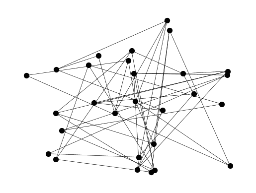
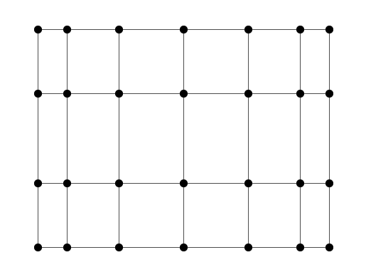
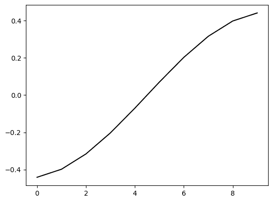

# 5.4\. 拉普拉斯矩阵的谱性质

> 原文：[`mmids-textbook.github.io/chap05_specgraph/04_laplacian/roch-mmids-specgraph-laplacian.html`](https://mmids-textbook.github.io/chap05_specgraph/04_laplacian/roch-mmids-specgraph-laplacian.html)

在本节中，我们研究图的拉普拉斯的谱性质。

## 5.4.1\. 拉普拉斯矩阵的特征值：初步观察#

设 $G = (V, E)$ 是一个有 $n = |V|$ 个顶点的图。有两个观察：

1- 由于 $G$ 的拉普拉斯矩阵 $L$ 是对称的，根据 *谱定理*，它有一个谱分解

$$ L = \sum_{i=1}^n \mu_i \mathbf{y}_i \mathbf{y}_i^T $$

其中 $\mathbf{y}_i$ 形成了 $\mathbb{R}^n$ 的正交基。

2- 此外，因为 $L$ 是半正定矩阵，所以特征值都是非负的。按照惯例，我们假设

$$ 0 \leq \mu_1 \leq \mu_2 \leq \cdots \leq \mu_n. $$

注意，这与我们在上一节中使用的是相反的顺序。

另一个观察：

**引理** 设 $G = (V, E)$ 是一个有 $n = |V|$ 个顶点和拉普拉斯矩阵 $L$ 的图。常量单位向量

$$ \mathbf{y}_1 = \frac{1}{\sqrt{n}} (1, \ldots, 1) $$

是 $L$ 的一个特征值为 $0$ 的特征向量。 $\flat$

*证明* 设 $B$ 是 $G$ 的有向关联矩阵，回忆一下 $L = B B^T$。由于 $B^T \mathbf{y}_1 = \mathbf{0}$（因为 $B$ 的每一列恰好有一个 $1$ 和一个 $-1$），所以 $L \mathbf{y}_1 = B B^T \mathbf{y}_1 = \mathbf{0}$，正如所声称的那样。 $\square$

通常，常量向量可能不是唯一具有特征值一的特征向量。

**数值角落:** 拉普拉斯矩阵的谱分解的一个用途是在图绘制中（$\idx{graph drawing}\xdi$）。我们将在下面说明这一点。给定一个图 $G = (V, E)$，在平面上如何绘制它并不清楚，因为唯一可用的信息是顶点的邻接关系。一种方法是将顶点随机定位。函数 `networkx.draw`（https://networkx.org/documentation/stable/reference/generated/networkx.drawing.nx_pylab.draw.html）或 `networkx.draw_networkx`（https://networkx.org/documentation/stable/reference/generated/networkx.drawing.nx_pylab.draw_networkx.html#networkx.drawing.nx_pylab.draw_networkx）可以接受不同的 [图布局](https://networkx.org/documentation/stable/reference/drawing.html#module-networkx.drawing.layout) 函数作为输入，这些函数为每个顶点返回一个 $x$ 和 $y$ 坐标。

我们将在网格图上测试这一点。我们使用 `networkx.grid_2d_graph`（https://networkx.org/documentation/stable/reference/generated/networkx.generators.lattice.grid_2d_graph.html）来构建这样的图。

```py
G = nx.grid_2d_graph(4,7) 
```

一种布局方法是选择节点的随机位置。具体来说，对于每个节点，通过在区间 $[0,1]$ 上均匀随机选择每个坐标来生成一个位置。

```py
nx.draw_networkx(G, pos=nx.random_layout(G, seed=535), with_labels=False, 
                 node_size=50, node_color='black', width=0.5)
plt.axis('off')
plt.show() 
```



显然，这很难阅读。

另一种方法是将顶点映射到两个特征向量，这与我们进行降维时所做的类似。与 $\mu_1$ 相关的特征向量是常数，因此对绘图没有用。我们尝试下一个两个。我们使用拉普拉斯矩阵。这是通过使用 `networkx.spectral_layout` 实现的。[networkx.spectral_layout](https://networkx.org/documentation/stable/reference/generated/networkx.drawing.layout.spectral_layout.html#networkx.drawing.layout.spectral_layout)。

```py
nx.draw_networkx(G, pos=nx.spectral_layout(G), with_labels=False, 
                 node_size=50, node_color='black', width=0.5)
plt.axis('off')
plt.show() 
```



有趣的是，结果提供了一个更自然的图绘制，揭示了其作为网格的潜在结构。我们将在以后回来尝试解释这一点，在我们对拉普拉斯矩阵的谱性质有了更深入的理解之后。

$\unlhd$

## 5.4.2. 拉普拉斯矩阵与连通性#

正如我们之前指出的，拉普拉斯矩阵包含关于 $G$ 的连通性信息。我们在这里详细阐述第一个具体的联系。但首先，我们需要一个有用的拉普拉斯二次型 $\mathbf{x}^T L \mathbf{x}$ 的形式，它进入特征值的变分表征。

**引理** **(拉普拉斯二次型)** $\idx{Laplacian quadratic form lemma}\xdi$ 设 $G = (V, E)$ 是一个有 $n = |V|$ 个顶点和拉普拉斯矩阵 $L$ 的图。我们有以下关于拉普拉斯二次型的公式

$$ \mathbf{x}^T L \mathbf{x} = \sum_{e = \{i,j\} \in E} (x_i - x_j)² $$

对于任何 $\mathbf{x} = (x_1, \ldots, x_n) \in \mathbb{R}^n$。 $\flat$

这里有一个直观的方式来解释这个引理。如果将 $\mathbf{x} = (x_1, \ldots, x_n) \in \mathbb{R}^n$ 视为顶点上的实值函数（即，它将每个顶点 $i$ 联系到一个实值 $x_i$），那么拉普拉斯二次型衡量函数在图上的“平滑”程度如下。 $\mathbf{x}^T L \mathbf{x}$ 的值较小表示相邻顶点倾向于被分配到接近的值。

*证明:* 设 $B$ 是 $G$ 的有向关联矩阵。我们有 $L = B B^T$。因此，对于任何 $\mathbf{x}$，如果边 $e_k = \{u, v\}$ 在 $B$ 下有向为 $(u,v)$，则 $(B^T \mathbf{x})_k = x_v - x_u$。这表明

$$ \mathbf{x}^T L \mathbf{x} = \mathbf{x}^T B B^T \mathbf{x} = \|B^T \mathbf{x}\|² = \sum_{e = \{i,j\} \in E} (x_i - x_j)². $$

由于后者始终是非负的，这也意味着 $L$ 是正半定的。 $\square$

现在，我们已经准备好推导出连通性的后果。回想一下，对于任何图 $G$，拉普拉斯特征值 $\mu_1 = 0$。

**引理** **（拉普拉斯矩阵与连通性）** $\idx{拉普拉斯矩阵与连通性引理}\xdi$ 如果 $G$ 是连通的，那么拉普拉斯特征值 $\mu_2 > 0$。$\flat$

*证明* 设 $G = (V, E)$ 且 $n = |V|$，设 $L = \sum_{i=1}^n \mu_i \mathbf{y}_i \mathbf{y}_i^T$ 是其拉普拉斯矩阵 $L$ 的一个谱分解，其中 $0 = \mu_1 \leq \cdots \leq \mu_n$。假设通过反证法 $\mu_2 = 0$。任何具有 $0$ 特征值的特征向量 $\mathbf{y} = (y_{1}, \ldots, y_{n})$ 根据定义满足 $L \mathbf{y} = \mathbf{0}$。根据 *拉普拉斯二次型引理*，那么

$$ 0 = \mathbf{y}^T L \mathbf{y} = \sum_{e = \{i, j\} \in E} (y_{i} - y_{j})². $$

1- 为了使这一点成立，必须满足任何两个相邻顶点 $i$ 和 $j$ 都有 $y_{i} = y_{j}$。也就是说，$\{i,j\} \in E$ 意味着 $y_i = y_j$。

2- 此外，因为 $G$ 是连通的，所以它的任意两个顶点 $u$ 和 $v$（无论是否相邻）之间都存在一条路径 $u = w_0 \sim \cdots \sim w_k = v$，在这条路径上 $y_{w}$ 的值必须相同。因此 $\mathbf{y}$ 是一个常向量。

但这与特征向量 $\mathbf{y}_1, \ldots, \mathbf{y}_n$ 实际上是线性无关的事实相矛盾，因此 $\mathbf{y}_1$ 和 $\mathbf{y}_2$ 不能同时是常向量。$\square$

量 $\mu_2$ 有时被称为图的 [代数连通性](https://mathworld.wolfram.com/AlgebraicConnectivity.html)$\idx{代数连通性}\xdi$。相应的特征向量 $\mathbf{y}_2$ 被称为 [菲德勒向量](https://mathworld.wolfram.com/FiedlerVector.html)$\idx{菲德勒向量}\xdi$。

我们以下列（更一般的）逆命题陈述，但不提供证明。

**引理** 如果 $\mu_{k+1}$ 是 $G$ 的最小的非零拉普拉斯特征值，那么 $G$ 有 $k$ 个连通分量。$\flat$

我们将对此类更定量的结果感兴趣。在继续之前，我们首先进行一个简单的观察。根据我们对 *谱定理* 的证明，拉普拉斯矩阵 $L$ 的最大特征值 $\mu_n$ 是以下优化问题的解

$$ \mu_n = \max\{\langle \mathbf{x}, L \mathbf{x}\rangle:\|\mathbf{x}\| = 1\}. $$

这种极值描述对于界定特征值 $\mu_n$ 是有用的，因为任何选择 $\|\mathbf{x}\| =1$ 的 $\mathbf{x}$ 都可以通过数量 $\langle \mathbf{x}, L \mathbf{x}\rangle$ 给出一个下界。这种观点将是我们应用于图划分的关键。

现在，我们给出一个简单的推论。

**引理** **（拉普拉斯矩阵与最大度）** $\idx{拉普拉斯矩阵与最大度引理}\xdi$ 设 $G = (V, E)$ 是一个最大度为 $\bar{\delta}$ 的图。设 $\mu_n$ 是其拉普拉斯矩阵 $L$ 的最大特征值。那么

$$ \bar{\delta}+1 \leq \mu_n \leq 2 \bar{\delta}. $$

$\flat$

*证明思路:* 如同在引理陈述之前所解释的，对于下界，只需要找到一个好的测试单位向量 $\mathbf{x}$ 插入到 $\langle \mathbf{x}, L \mathbf{x}\rangle$ 中。一个巧妙的选择就能解决问题。

*证明:* 我们从下界开始。设 $u \in V$ 是一个度数为 $\bar{\delta}$ 的顶点。设 $\mathbf{z}$ 是一个具有以下条目的向量

$$\begin{split} z_i = \begin{cases} \bar{\delta} & \text{if $i = u$}\\ -1 & \text{if $\{i,u\} \in E$}\\ 0 & \text{o.w.} \end{cases} \end{split}$$

并令 $\mathbf{x}$ 为单位向量 $\mathbf{z}/\|\mathbf{z}\|$。根据 $u$ 的度数定义，$\|\mathbf{z}\|² = \bar{\delta}² + \bar{\delta}(-1)² = \bar{\delta}(\bar{\delta}+1)$。使用 *拉普拉斯二次型引理*，

$$ \langle \mathbf{z}, L \mathbf{z}\rangle = \sum_{e = \{i, j\} \in E} (z_i - z_j)² \geq \sum_{i: \{i, u\} \in E} (z_i - z_u)² = \sum_{i: \{i, u\} \in E} (-1 - \bar{\delta})² = \bar{\delta} (\bar{\delta}+1)² $$

其中我们限制求和只包括与 $u$ 相邻的边，并利用所有求和项都是非负的事实。最后

$$ \langle \mathbf{x}, L \mathbf{x}\rangle = \left\langle \frac{\mathbf{z}}{\|\mathbf{z}\|}, L \frac{\mathbf{z}}{\|\mathbf{z}\|}\right\rangle = \frac{1}{\|\mathbf{z}\|²} \langle \mathbf{z}, L \mathbf{z}\rangle = \frac{\bar{\delta} (\bar{\delta}+1)²}{\bar{\delta}(\bar{\delta}+1)} = \bar{\delta}+1 $$

因此

$$ \mu_n = \max\{\langle \mathbf{x}', L \mathbf{x}'\rangle:\|\mathbf{x}'\| = 1\} \geq \langle \mathbf{x}, L \mathbf{x}\rangle = \bar{\delta}+1 $$

如所声称。

我们继续进行下界分析。对于任何单位向量 $\mathbf{x}$，

$$\begin{align*} \langle \mathbf{x}, L \mathbf{x}\rangle &= \sum_{i,j} L_{ij} x_i x_j\\ &\leq \sum_{i,j} |L_{ij}| |x_i| |x_j|\\ &= \sum_{i,j} (D_{ij} + A_{ij}) |x_i| |x_j|\\ &= \sum_{i} \delta(i) \,x_i² + \sum_{i,j} A_{ij} |x_i| |x_j|. \end{align*}$$

根据柯西-施瓦茨不等式，这可以表示为

$$\begin{align*} &\leq \bar{\delta} + \left(\sum_{i,j} A_{ij} x_i²\right)^{1/2} \left(\sum_{i,j} A_{ij} x_j²\right)^{1/2}\\ &\leq \bar{\delta} + \left( \bar{\delta} \sum_{i} x_i²\right)^{1/2} \left(\bar{\delta} \sum_{j} x_j²\right)^{1/2}\\ &\leq 2\bar{\delta}. \end{align*}$$

$\square$

**数值分析角:** 我们构建一个具有两个连通分量的图，并检查上述结果。我们直接使用邻接矩阵。

```py
A = np.array([[0, 1, 1, 0, 0], 
              [1, 0, 1, 0, 0], 
              [1, 1, 0, 0, 0], 
              [0, 0, 0, 0, 1], 
              [0, 0, 0, 1, 0]])
print(A) 
```

```py
[[0 1 1 0 0]
 [1 0 1 0 0]
 [1 1 0 0 0]
 [0 0 0 0 1]
 [0 0 0 1 0]] 
```

注意块结构。

通过求邻接矩阵的行和可以得到度数。

```py
degrees = A.sum(axis=1)
print(degrees) 
```

```py
[2 2 2 1 1] 
```

```py
D = np.diag(degrees)
print(D) 
```

```py
[[2 0 0 0 0]
 [0 2 0 0 0]
 [0 0 2 0 0]
 [0 0 0 1 0]
 [0 0 0 0 1]] 
```

```py
L = D - A
print(L) 
```

```py
[[ 2 -1 -1  0  0]
 [-1  2 -1  0  0]
 [-1 -1  2  0  0]
 [ 0  0  0  1 -1]
 [ 0  0  0 -1  1]] 
```

```py
print(LA.eigvals(L)) 
```

```py
[ 3.00000000e+00 -3.77809194e-16  3.00000000e+00  2.00000000e+00
  0.00000000e+00] 
```

观察（考虑到数值误差），存在两个 $0$ 特征值，并且最大的特征值大于或等于最大度数加一。

要计算拉普拉斯矩阵，也可以使用函数 `networkx.laplacian_matrix`（https://networkx.org/documentation/stable/reference/generated/networkx.linalg.laplacianmatrix.laplacian_matrix.html）。例如，Petersen 图的拉普拉斯矩阵如下：

```py
G = nx.petersen_graph()
L = nx.laplacian_matrix(G).toarray()
print(L) 
```

```py
[[ 3 -1  0  0 -1 -1  0  0  0  0]
 [-1  3 -1  0  0  0 -1  0  0  0]
 [ 0 -1  3 -1  0  0  0 -1  0  0]
 [ 0  0 -1  3 -1  0  0  0 -1  0]
 [-1  0  0 -1  3  0  0  0  0 -1]
 [-1  0  0  0  0  3  0 -1 -1  0]
 [ 0 -1  0  0  0  0  3  0 -1 -1]
 [ 0  0 -1  0  0 -1  0  3  0 -1]
 [ 0  0  0 -1  0 -1 -1  0  3  0]
 [ 0  0  0  0 -1  0 -1 -1  0  3]] 
```

```py
print(LA.eigvals(L)) 
```

```py
[ 5.00000000e+00  2.00000000e+00 -2.80861083e-17  5.00000000e+00
  5.00000000e+00  2.00000000e+00  2.00000000e+00  5.00000000e+00
  2.00000000e+00  2.00000000e+00] 
```

$\unlhd$

## 5.4.3\. 第二个拉普拉斯特征值的变分特征\#

定义 $A \mathbf{x} = \lambda \mathbf{x}$ 可能不是理解拉普拉斯矩阵的特征向量为什么有用的最佳方式。相反，以下对 *Courant-Fischer 定理* 的应用$\idx{Courant-Fischer Theorem}\xdi$提供了很多见解，正如我们将在本章的其余部分看到的那样。

**定理** **(第二个 $\mu_2$ 的变分特征)** $\idx{变分特征}\xdi$ 设 $G = (V, E)$ 是一个有 $n = |V|$ 个顶点的图。假设 $G$ 的拉普拉斯 $L$ 有谱分解 $L = \sum_{i=1}^n \mu_i \mathbf{y}_i \mathbf{y}_i^T$，其中 $0 = \mu_1 \leq \mu_2 \leq \cdots \leq \mu_n$ 且 $\mathbf{y}_1 = \frac{1}{\sqrt{n}}(1,\ldots,1)$。那么

$$\begin{align*} \mu_2 = \min\left\{ \sum_{\{i, j\} \in E}(x_i - x_j)² \,: \,\mathbf{x} = (x_1, \ldots, x_n) \in \mathbb{R}^n, \sum_{i=1}^n x_i = 0, \sum_{j = 1}^n x_j²=1 \right\}. \end{align*}$$

取 $\mathbf{x} = \mathbf{y}_2$ 达到这个最小值。$\sharp$

*证明：* 根据 *Courant-Fischer 定理*，

$$ \mu_2 = \min_{\mathbf{0} \neq \mathbf{u} \in \mathcal{V}_{n-1}} \mathcal{R}_L(\mathbf{u}), $$

其中 $\mathcal{V}_{n-1} = \mathrm{span}(\mathbf{y}_2, \ldots, \mathbf{y}_n) = \mathrm{span}(\mathbf{y}_1)^\perp$. 注意，因为我们与 *Courant-Fischer 定理* 中使用的惯例相比反转了特征值的顺序，我们必须稍微调整 $\mathcal{V}_{n-1}$ 的定义。此外，我们知道 $\mathcal{R}_L(\mathbf{y}_2) = \mu_2$。我们对问题进行简单的变换。

我们声称

$$ \mu_2 = \min\left\{\langle \mathbf{x}, L \mathbf{x}\rangle\,:\ \|\mathbf{x}\|=1, \langle \mathbf{x}, \mathbf{y}_1\rangle = 0 \right\}. \qquad (*) $$

事实上，如果 $\mathbf{u} \in \mathrm{span}(\mathbf{y}_1)^\perp$ 且具有单位范数，即 $\|\mathbf{u}\| = 1$，那么

$$ \mathcal{R}_L(\mathbf{u}) = \frac{\langle \mathbf{u}, L \mathbf{u}\rangle}{\langle \mathbf{u},\mathbf{u}\rangle} = \frac{\langle \mathbf{u}, L \mathbf{u}\rangle}{\|\mathbf{u}\|²} = \langle \mathbf{u}, L \mathbf{u}\rangle. $$

换句话说，我们已经证明了

$$ \min_{\mathbf{0} \neq \mathbf{u} \in \mathcal{V}_{n-1}} \mathcal{R}_L(\mathbf{u}) \leq \min\left\{\langle \mathbf{x}, L \mathbf{x}\rangle\,:\ \|\mathbf{x}\|=1, \langle \mathbf{x}, \mathbf{y}_1\rangle = 0 \right\}. $$

为了证明另一个方向，对于任何 $\mathbf{u} \neq \mathbf{0}$，我们可以通过定义 $\mathbf{x} = \mathbf{u}/\|\mathbf{u}\|$ 来归一化它，并且我们注意到

$$ \mathcal{R}_L(\mathbf{u}) = \frac{\langle \mathbf{u}, L \mathbf{u}\rangle}{\langle \mathbf{u},\mathbf{u}\rangle} = \frac{\langle \mathbf{u}, L \mathbf{u}\rangle}{\|\mathbf{u}\|²} = \left\langle \frac{\mathbf{u}}{\|\mathbf{u}\|}, L \frac{\mathbf{u}}{\|\mathbf{u}\|}\right\rangle = \langle \mathbf{x}, L \mathbf{x}\rangle. $$

此外，如果且仅当 $\langle \mathbf{x}, \mathbf{y}_1\rangle = 0$ 时，$\langle \mathbf{u}, \mathbf{y}_1\rangle = 0$。这确立了 $(*)$，因为原始公式中实现的任何目标值都可以在新公式中实现。

使用 $\mathbf{y}_1 = \frac{1}{\sqrt{n}}(1,\ldots,1)$，条件 $\langle \mathbf{x}, \mathbf{y}_1 \rangle = 0$，即 $\sum_{i=1}^n (x_i/\sqrt{n}) = 0$，等价于 $\sum_{i=1}^n x_i = 0$。同样，条件 $\|\mathbf{x}\|=1$ 在平方每一边后等价于 $\sum_{j=1}^n x_j² = 1$。

最后，根据 *拉普拉斯二次形式引理*，我们可以得出结论。 $\square$

这种极值特征的一个应用是我们之前描述的图绘制启发式方法。考虑第二个拉普拉斯特征向量 $\mathbf{y}_2$ 的元素。由于条件 $\langle \mathbf{y}_1, \mathbf{y}_2\rangle = 0$，其元素围绕 $0$ 对齐。因为它在所有中心单位向量上最小化以下量，

$$ \sum_{\{i, j\} \in E} (x_i - x_j)² $$

特征向量 $\mathbf{y}_2$ 倾向于为相邻顶点分配相似的坐标。类似的推理适用于第三个拉普拉斯特征向量，它还与第二个特征向量正交。因此，基于第二个和第三个拉普拉斯特征向量的坐标应该期望将相邻顶点放置在附近，从而最小化可视化中长距离边的需要。特别是，它揭示了图的一些潜在的欧几里得几何，如下一个示例所示。

**NUMERICAL CORNER:** 这在路径图上可能最容易看出。回想一下，NetworkX 将顶点编号为 $0,\ldots,n-1$。

```py
G = nx.path_graph(10) 
```

我们绘制第二个拉普拉斯特征向量（即对应于第二个最小特征值的拉普拉斯矩阵的特征向量）。我们使用 [numpy.argsort](https://numpy.org/doc/stable/reference/generated/numpy.argsort.html) 来找到第二个最小特征值的索引。因为索引从 `0` 开始，我们想要输出中的 `1` 个条目。

```py
L = nx.laplacian_matrix(G).toarray()
w, v = LA.eigh(L)
y2 = v[:,np.argsort(w)[1]]

plt.plot(y2, c='k')
plt.show() 
```



$\unlhd$

**EXAMPLE:** **(两分量图)** 设 $G=(V,E)$ 是一个具有两个连通分量 $\emptyset \neq V_1, V_2 \subseteq V$ 的图。根据连通分量的性质，我们有 $V_1 \cap V_2 = \emptyset$ 和 $V_1 \cup V_2 = V$。假设 $G$ 的拉普拉斯矩阵 $L$ 的谱分解为 $L = \sum_{i=1}^n \mu_i \mathbf{y}_i \mathbf{y}_i^T$，其中 $0 = \mu_1 \leq \mu_2 \leq \cdots \leq \mu_n$ 且 $\mathbf{y}_1 = \frac{1}{\sqrt{n}}(1,\ldots,1)$。我们之前声称对于这样的图 $\mu_2 = 0$。我们在这里使用 *$\mu_2$ 的变分特征* 来证明这一点。

$$ \mu_2 = \min\left\{ \sum_{\{u, v\} \in E} (x_u - x_v)² \,:\, \mathbf{x} = (x_1, \ldots, x_n) \in \mathbb{R}^n, \sum_{u=1}^n x_u = 0, \sum_{u = 1}^n x_u²=1 \right\}. $$

基于此特征，只需找到一个向量 $\mathbf{x}$ 满足 $\sum_{u=1}^n x_u = 0$ 和 $\sum_{u = 1}^n x_u²=1$，使得 $\sum_{\{u, v\} \in E} (x_u - x_v)² = 0$。实际上，由于 $\mu_2 \geq 0$ 并且任何这样的 $\mathbf{x}$ 都给出了 $\mu_2$ 的上界，因此我们必然有 $\mu_2 = 0$。

为了使 $\sum_{\{u, v\} \in E} (x_u - x_v)²$ 为 $0$，人们可能会倾向于取一个常数向量 $\mathbf{x}$。但这样我们就不能同时满足 $\sum_{u=1}^n x_u = 0$ 和 $\sum_{u = 1}^n x_u²=1$。相反，我们稍微修改了这个猜测。因为图有两个连通分量，$V_1$ 和 $V_2$ 之间没有边。因此，我们可以为每个分量分配不同的值，同时仍然得到 $\sum_{\{u, v\} \in E} (x_u - x_v)² = 0$。因此，我们寻找一个形式为 $\mathbf{x} = (x_1, \ldots, x_n)$ 的向量

$$\begin{split} x_u = \begin{cases} \alpha, & \text{if $u \in V_1$,}\\ \beta, & \text{if $u \in V_2$.} \end{cases} \end{split}$$

为了满足 $\mathbf{x}$ 的约束，我们需要

$$ \sum_{u=1}^n x_u = \sum_{u \in V_1} \alpha + \sum_{u \in V_2} \beta = |V_1| \alpha + |V_2| \beta = 0, $$

和

$$ \sum_{u=1}^n x_u² = \sum_{u \in V_1} \alpha² + \sum_{u \in V_2} \beta² = |V_1| \alpha² + |V_2| \beta² = 1. $$

用第二个方程中的第一个方程替换，我们得到

$$ |V_1| \left(\frac{-|V_2|\beta}{|V_1|}\right)² + |V_2| \beta² = \frac{|V_2|² \beta²}{|V_1|} + |V_2| \beta² = 1, $$

或者

$$ \beta² = \frac{|V_1|}{|V_2|(|V_2| + |V_1|)} = \frac{|V_1|}{n |V_2|}. $$

取

$$ \beta = - \sqrt{\frac{|V_1|}{n |V_2|}}, \qquad \alpha = \frac{-|V_2|\beta}{|V_1|} = \sqrt{\frac{|V_2|}{n |V_1|}}. $$

我们构造的向量 $\mathbf{x}$ 实际上是 $L$ 的特征向量。实际上，设 $B$ 是 $G$ 的有向关联矩阵。那么，对于 $e_k = \{u,v\}$，$(B^T \mathbf{x})_k$ 要么是 $x_u - x_v$，要么是 $x_v - x_u$。在两种情况下，都是 $0$。所以 $L \mathbf{x} = B B^T \mathbf{x} = \mathbf{0}$，即 $\mathbf{x}$ 是特征值为 $0$ 的特征向量。

我们已经证明，当 $G$ 有两个连通分量时，$\mu_2 = 0$。对这个论证的轻微修改表明，当 $G$ 不连通时，$\mu_2 = 0$。$\lhd$

***自我评估测验*** *(有克劳德、双子星和 ChatGPT 的帮助)*

**1** 以下哪项不是图 $G$ 的拉普拉斯矩阵 $L$ 的性质？

a) $L$ 是对称的。

b) $L$ 是正半定。

c) 常数单位向量 $\frac{1}{\sqrt{n}}(1,\ldots,1)$ 是 $L$ 的特征值为 0 的特征向量。

d) $L$ 是正定。

**2** 哪个向量被称为 Fiedler 向量？

a) 与拉普拉斯矩阵的最大特征值对应的特征向量。

b) 与拉普拉斯矩阵的最小特征值对应的特征向量。

c) 与拉普拉斯矩阵的第二小特征值对应的特征向量。

d) 与拉普拉斯矩阵所有特征值的平均值对应的特征向量。

**3** 对于一个连通图 $G$，关于其拉普拉斯矩阵的第二个最小特征值 $\mu_2$ 的以下哪个陈述是正确的？

a) $\mu_2 = 0$

b) $\mu_2 < 0$

c) $\mu_2 > 0$

d) 没有附加信息，无法确定 $\mu_2$ 的值。

**4** 对于具有拉普拉斯矩阵 $L$ 的图 $G$，拉普拉斯二次型 $\mathbf{x}^T L \mathbf{x}$ 可以写成：

$$ \mathbf{x}^T L \mathbf{x} = \sum_{\{i,j\} \in E} (x_i - x_j)². $$

这个二次型测量的是什么？

a) 图中顶点之间的平均距离。

b) 图中的连通分量数。

c) 函数 $x$ 在图上的“平滑度”。

d) 图中每个顶点的度数。

**5** 图 $G$ 的拉普拉斯矩阵 $L$ 可以分解为 $L = B B^T$，其中 $B$ 是一个有向关联矩阵。这种分解对 $L$ 有什么含义？

a) $L$ 是正定的

b) $L$ 是对称的且正半定的

c) $L$ 是反对称的

d) $L$ 是一个对角矩阵

1 的答案：d. 理由：文本中提到“因为 $L$ 是正半定的，所以特征值是非负的”，但没有断言 $L$ 是正定的。

2 的答案：c. 理由：文本提到与 $\mu_2$（第二个最小特征值）对应的特征向量是 Fiedler 向量。

3 的答案：c. 理由：文本证明了“如果 $G$ 是连通的，那么拉普拉斯特征值 $\mu_2 > 0$。”

4 的答案：c. 理由：文本中提到“拉普拉斯二次型测量函数 $\mathbf{x}$ 在图上的‘平滑度’。 $\mathbf{x}^T L \mathbf{x}$ 的值较小表示相邻顶点倾向于被分配到接近的值。”

5 的答案：b. 理由：文本中提到，“设 $B$ 为 $G$ 的有向关联矩阵。根据构造，$L = B B^T$。这表明 $L$ 是对称的且正半定的。”

## 5.4.1\. 拉普拉斯矩阵的特征值：初步观察#

设 $G = (V, E)$ 是一个有 $n = |V|$ 个顶点的图。两个观察：

1- 由于 $G$ 的拉普拉斯矩阵 $L$ 是对称的，根据**谱定理**，它有一个谱分解

$$ L = \sum_{i=1}^n \mu_i \mathbf{y}_i \mathbf{y}_i^T $$

其中 $\mathbf{y}_i$ 形成了一个 $\mathbb{R}^n$ 的正交基。

2- 此外，由于 $L$ 是正半定的，特征值是非负的。按照惯例，我们假设

$$ 0 \leq \mu_1 \leq \mu_2 \leq \cdots \leq \mu_n. $$

注意，这与我们之前章节中使用的顺序相反。

另一个观察：

**引理** 设 $G = (V, E)$ 是一个有 $n = |V|$ 个顶点和拉普拉斯矩阵 $L$ 的图。常量单位向量

$$ \mathbf{y}_1 = \frac{1}{\sqrt{n}} (1, \ldots, 1) $$

是 $L$ 的一个特征向量，其特征值为 $0$。 $\flat$

*证明*: 设 $B$ 为 $G$ 的有向关联矩阵，回忆一下 $L = B B^T$。由于 $B$ 的每一列恰好有一个 $1$ 和一个 $-1$，所以 $B^T \mathbf{y}_1 = \mathbf{0}$。因此 $L \mathbf{y}_1 = B B^T \mathbf{y}_1 = \mathbf{0}$，正如所声称的那样。 $\square$

通常，常数向量可能不是唯一具有特征值一的特征向量。

**数值角**: 拉普拉斯矩阵的谱分解的一个用途是在图绘制中（$\idx{graph drawing}\xdi$）。我们接下来将展示这一点。给定一个图 $G = (V, E)$，在平面上如何绘制它并不清楚，因为可用的唯一信息是顶点的邻接关系。一种方法是将顶点随机放置。函数 `networkx.draw` 或 `networkx.draw_networkx` 可以接受不同的 [图布局](https://networkx.org/documentation/stable/reference/drawing.html#module-networkx.drawing.layout) 函数作为输入，这些函数为每个顶点返回一个 $x$ 和 $y$ 坐标。

我们将在网格图上测试这一点。我们使用 `networkx.grid_2d_graph` 来构建这样的图。

```py
G = nx.grid_2d_graph(4,7) 
```

一种布局方法是选择节点的随机位置。具体来说，对于每个节点，通过在区间 $[0,1]$ 上随机选择每个坐标来生成一个位置。

```py
nx.draw_networkx(G, pos=nx.random_layout(G, seed=535), with_labels=False, 
                 node_size=50, node_color='black', width=0.5)
plt.axis('off')
plt.show() 
```


显然，这是难以阅读的。

另一种方法是映射顶点到两个特征向量，类似于我们为降维所做的那样。与 $\mu_1$ 相关的特征向量是常数，因此对绘制没有用。我们尝试下一个两个。我们使用拉普拉斯矩阵。这是通过使用 `networkx.spectral_layout` 实现的。

```py
nx.draw_networkx(G, pos=nx.spectral_layout(G), with_labels=False, 
                 node_size=50, node_color='black', width=0.5)
plt.axis('off')
plt.show() 
```


有趣的是，结果提供了一个更自然的图绘制，揭示了其作为网格的潜在结构。我们将在以后回来尝试解释这一点，在我们对拉普拉斯矩阵的谱性质有了更深入的理解之后。

$\unlhd$

## 5.4.2\. 拉普拉斯矩阵与连通性#

如我们之前指出的，拉普拉斯矩阵包含关于 $G$ 的连通性的信息。我们在这里详细阐述第一个具体的联系。但首先我们需要拉普拉斯二次型 $\mathbf{x}^T L \mathbf{x}$ 的一个有用形式，它进入特征值的变分表征。

**引理** **(拉普拉斯二次型)** $\idx{拉普拉斯二次型引理}\xdi$ 设 $G = (V, E)$ 是一个具有 $n = |V|$ 个顶点和拉普拉斯矩阵 $L$ 的图。我们有以下关于拉普拉斯二次型的公式

$$ \mathbf{x}^T L \mathbf{x} = \sum_{e = \{i,j\} \in E} (x_i - x_j)² $$

对于任何 $\mathbf{x} = (x_1, \ldots, x_n) \in \mathbb{R}^n$。 $\flat$

这里有一种直观的方式来解释这个引理。如果将 $\mathbf{x} = (x_1, \ldots, x_n) \in \mathbb{R}^n$ 视为顶点上的实值函数（即，它将每个 $i$ 的实值 $x_i$ 与顶点 $i$ 关联），那么拉普拉斯二次型测量函数在图上的“平滑”程度如下。 $\mathbf{x}^T L \mathbf{x}$ 的值较小表示相邻顶点倾向于被分配接近的值。

*证明:* 设 $B$ 是 $G$ 的一个有向关联矩阵。我们有 $L = B B^T$。因此，对于任何 $\mathbf{x}$，如果边 $e_k = \{u, v\}$ 在 $B$ 下有向为 $(u,v)$，则 $(B^T \mathbf{x})_k = x_v - x_u$。这表明

$$ \mathbf{x}^T L \mathbf{x} = \mathbf{x}^T B B^T \mathbf{x} = \|B^T \mathbf{x}\|² = \sum_{e = \{i,j\} \in E} (x_i - x_j)². $$

由于后者始终非负，这也表明 $L$ 是正半定的。 $\square$

我们现在准备推导出连通性的后果。回想一下，对于任何图 $G$，拉普拉斯特征值 $\mu_1 = 0$。

**引理** **(拉普拉斯与连通性)** $\idx{拉普拉斯与连通性引理}\xdi$ 如果 $G$ 是连通的，那么拉普拉斯特征值 $\mu_2 > 0$。 $\flat$

*证明:* 设 $G = (V, E)$ 且 $n = |V|$，设 $L = \sum_{i=1}^n \mu_i \mathbf{y}_i \mathbf{y}_i^T$ 是其拉普拉斯 $L$ 的谱分解，其中 $0 = \mu_1 \leq \cdots \leq \mu_n$。假设通过反证法 $\mu_2 = 0$。任何具有 $0$ 特征值的特征向量 $\mathbf{y} = (y_{1}, \ldots, y_{n})$ 根据定义满足 $L \mathbf{y} = \mathbf{0}$。根据 *拉普拉斯二次型引理*，则

$$ 0 = \mathbf{y}^T L \mathbf{y} = \sum_{e = \{i, j\} \in E} (y_{i} - y_{j})². $$

1- 为了使这一点成立，任何两个相邻顶点 $i$ 和 $j$ 必须有 $y_{i} = y_{j}$。也就是说，$\{i,j\} \in E$ 意味着 $y_i = y_j$。

2- 此外，因为 $G$ 是连通的，所以它的任意两个顶点 $u$ 和 $v$（相邻或不相邻）之间都存在一条路径 $u = w_0 \sim \cdots \sim w_k = v$，沿着这条路径 $y_{w}$ 必须相同。因此 $\mathbf{y}$ 是一个常数向量。

但这是矛盾的，因为特征向量 $\mathbf{y}_1, \ldots, \mathbf{y}_n$ 实际上是线性无关的，因此 $\mathbf{y}_1$ 和 $\mathbf{y}_2$ 不能同时是常数向量。$\square$

量 $\mu_2$ 有时被称为图的 [代数连通性](https://mathworld.wolfram.com/AlgebraicConnectivity.html)$\idx{代数连通性}\xdi$。相应的特征向量，$\mathbf{y}_2$，被称为 [Fiedler 向量](https://mathworld.wolfram.com/FiedlerVector.html)$\idx{Fiedler 向量}\xdi$。

我们以下述（更一般的）逆命题陈述，而不加证明。

**引理** 如果 $\mu_{k+1}$ 是 $G$ 的最小的非零拉普拉斯特征值，那么 $G$ 有 $k$ 个连通分量。$\flat$

我们将对此类更定量的结果感兴趣。在继续之前，我们从一个简单的观察开始。根据我们证明的 *谱定理*，拉普拉斯矩阵 $L$ 的最大特征值 $\mu_n$ 是优化问题的解

$$ \mu_n = \max\{\langle \mathbf{x}, L \mathbf{x}\rangle:\|\mathbf{x}\| = 1\}. $$

这种极值特征化对于界定特征值 $\mu_n$ 是有用的，因为任何选择 $\mathbf{x}$ 且 $\|\mathbf{x}\| =1$ 都可以通过量 $\langle \mathbf{x}, L \mathbf{x}\rangle$ 给出一个下界。这种观点将是我们应用于图划分的关键。

目前，我们给出一个简单的结论。

**引理** **(拉普拉斯矩阵与最大度)** $\idx{拉普拉斯矩阵与最大度引理}\xdi$ 设 $G = (V, E)$ 是一个最大度为 $\bar{\delta}$ 的图。设 $\mu_n$ 是其拉普拉斯矩阵 $L$ 的最大特征值。那么

$$ \bar{\delta}+1 \leq \mu_n \leq 2 \bar{\delta}. $$

$\flat$

*证明思路:* 如引理陈述之前所解释的，对于下界，找到一个好的测试单位向量 $\mathbf{x}$ 插入到 $\langle \mathbf{x}, L \mathbf{x}\rangle$ 中就足够了。一个巧妙的选择就能解决问题。

*证明:* 我们从下界开始。设 $u \in V$ 是一个度数为 $\bar{\delta}$ 的顶点。设 $\mathbf{z}$ 是一个具有条目的向量

$$\begin{split} z_i = \begin{cases} \bar{\delta} & \text{if } i = u\\ -1 & \text{if } \{i,u\} \in E\\ 0 & \text{o.w.} \end{cases} \end{split}$$

并且设 $\mathbf{x}$ 为单位向量 $\mathbf{z}/\|\mathbf{z}\|$。根据 $u$ 的度数的定义，$\|\mathbf{z}\|² = \bar{\delta}² + \bar{\delta}(-1)² = \bar{\delta}(\bar{\delta}+1)$。使用 *拉普拉斯二次型引理*，

$$ \langle \mathbf{z}, L \mathbf{z}\rangle = \sum_{e = \{i, j\} \in E} (z_i - z_j)² \geq \sum_{i: \{i, u\} \in E} (z_i - z_u)² = \sum_{i: \{i, u\} \in E} (-1 - \bar{\delta})² = \bar{\delta} (\bar{\delta}+1)² $$

其中我们限制和仅限于与 $u$ 相邻的边，并利用和中的所有项都是非负的事实。最后

$$ \langle \mathbf{x}, L \mathbf{x}\rangle = \left\langle \frac{\mathbf{z}}{\|\mathbf{z}\|}, L \frac{\mathbf{z}}{\|\mathbf{z}\|}\right\rangle = \frac{1}{\|\mathbf{z}\|²} \langle \mathbf{z}, L \mathbf{z}\rangle = \frac{\bar{\delta} (\bar{\delta}+1)²}{\bar{\delta}(\bar{\delta}+1)} = \bar{\delta}+1 $$

因此

$$ \mu_n = \max\{\langle \mathbf{x}', L \mathbf{x}'\rangle:\|\mathbf{x}'\| = 1\} \geq \langle \mathbf{x}, L \mathbf{x}\rangle = \bar{\delta}+1 $$

如所证明。

我们继续进行下界。对于任何单位向量 $\mathbf{x}$，

$$\begin{align*} \langle \mathbf{x}, L \mathbf{x}\rangle &= \sum_{i,j} L_{ij} x_i x_j\\ &\leq \sum_{i,j} |L_{ij}| |x_i| |x_j|\\ &= \sum_{i,j} (D_{ij} + A_{ij}) |x_i| |x_j|\\ &= \sum_{i} \delta(i) \,x_i² + \sum_{i,j} A_{ij} |x_i| |x_j|. \end{align*}$$

根据**柯西-施瓦茨不等式**，这可以表示为

$$\begin{align*} &\leq \bar{\delta} + \left(\sum_{i,j} A_{ij} x_i²\right)^{1/2} \left(\sum_{i,j} A_{ij} x_j²\right)^{1/2}\\ &\leq \bar{\delta} + \left( \bar{\delta} \sum_{i} x_i²\right)^{1/2} \left(\bar{\delta} \sum_{j} x_j²\right)^{1/2}\\ &\leq 2\bar{\delta}. \end{align*}$$

$\square$

**数值角**: 我们构建一个有两个连通分量的图并检查上述结果。我们直接使用邻接矩阵。

```py
A = np.array([[0, 1, 1, 0, 0], 
              [1, 0, 1, 0, 0], 
              [1, 1, 0, 0, 0], 
              [0, 0, 0, 0, 1], 
              [0, 0, 0, 1, 0]])
print(A) 
```

```py
[[0 1 1 0 0]
 [1 0 1 0 0]
 [1 1 0 0 0]
 [0 0 0 0 1]
 [0 0 0 1 0]] 
```

注意到块结构。

可以通过求邻接矩阵的行和来获得度数。

```py
degrees = A.sum(axis=1)
print(degrees) 
```

```py
[2 2 2 1 1] 
```

```py
D = np.diag(degrees)
print(D) 
```

```py
[[2 0 0 0 0]
 [0 2 0 0 0]
 [0 0 2 0 0]
 [0 0 0 1 0]
 [0 0 0 0 1]] 
```

```py
L = D - A
print(L) 
```

```py
[[ 2 -1 -1  0  0]
 [-1  2 -1  0  0]
 [-1 -1  2  0  0]
 [ 0  0  0  1 -1]
 [ 0  0  0 -1  1]] 
```

```py
print(LA.eigvals(L)) 
```

```py
[ 3.00000000e+00 -3.77809194e-16  3.00000000e+00  2.00000000e+00
  0.00000000e+00] 
```

注意到（考虑到数值误差）有两个 $0$ 特征值，并且最大的特征值大于或等于最大度数加一。

要计算拉普拉斯矩阵，也可以使用函数[`networkx.laplacian_matrix`](https://networkx.org/documentation/stable/reference/generated/networkx.linalg.laplacianmatrix.laplacian_matrix.html)。例如，Petersen 图的拉普拉斯矩阵如下：

```py
G = nx.petersen_graph()
L = nx.laplacian_matrix(G).toarray()
print(L) 
```

```py
[[ 3 -1  0  0 -1 -1  0  0  0  0]
 [-1  3 -1  0  0  0 -1  0  0  0]
 [ 0 -1  3 -1  0  0  0 -1  0  0]
 [ 0  0 -1  3 -1  0  0  0 -1  0]
 [-1  0  0 -1  3  0  0  0  0 -1]
 [-1  0  0  0  0  3  0 -1 -1  0]
 [ 0 -1  0  0  0  0  3  0 -1 -1]
 [ 0  0 -1  0  0 -1  0  3  0 -1]
 [ 0  0  0 -1  0 -1 -1  0  3  0]
 [ 0  0  0  0 -1  0 -1 -1  0  3]] 
```

```py
print(LA.eigvals(L)) 
```

```py
[ 5.00000000e+00  2.00000000e+00 -2.80861083e-17  5.00000000e+00
  5.00000000e+00  2.00000000e+00  2.00000000e+00  5.00000000e+00
  2.00000000e+00  2.00000000e+00] 
```

$\unlhd$

## 5.4.3\. 第二个拉普拉斯特征值的变分特征化#

定义 $A \mathbf{x} = \lambda \mathbf{x}$ 可能不是理解拉普拉斯矩阵特征向量有用性的最佳方式。相反，以下对**Courant-Fischer 定理**$\idx{Courant-Fischer Theorem}\xdi$的应用提供了许多见解，正如我们将在本章的其余部分看到的那样。

**定理** **(变分特征化 $\mu_2$)** $\idx{variational characterization of the algebraic connectivity}\xdi$ 设 $G = (V, E)$ 是一个有 $n = |V|$ 个顶点的图。假设 $G$ 的拉普拉斯矩阵 $L$ 的谱分解为 $L = \sum_{i=1}^n \mu_i \mathbf{y}_i \mathbf{y}_i^T$，其中 $0 = \mu_1 \leq \mu_2 \leq \cdots \leq \mu_n$ 且 $\mathbf{y}_1 = \frac{1}{\sqrt{n}}(1,\ldots,1)$。那么

$$\begin{align*} \mu_2 = \min\left\{ \sum_{\{i, j\} \in E}(x_i - x_j)² \,: \,\mathbf{x} = (x_1, \ldots, x_n) \in \mathbb{R}^n, \sum_{i=1}^n x_i = 0, \sum_{j = 1}^n x_j²=1 \right\}. \end{align*}$$

取 $\mathbf{x} = \mathbf{y}_2$ 可以达到这个最小值。$\sharp$

*证明:* 通过 *Courant-Fischer 定理*，

$$ \mu_2 = \min_{\mathbf{0} \neq \mathbf{u} \in \mathcal{V}_{n-1}} \mathcal{R}_L(\mathbf{u}), $$

其中 $\mathcal{V}_{n-1} = \mathrm{span}(\mathbf{y}_2, \ldots, \mathbf{y}_n) = \mathrm{span}(\mathbf{y}_1)^\perp$。观察一下，因为我们与 *Courant-Fischer 定理* 中使用的惯例相比反转了特征值的顺序，我们必须稍微调整 $\mathcal{V}_{n-1}$ 的定义。此外，我们知道 $\mathcal{R}_L(\mathbf{y}_2) = \mu_2$。我们对问题进行简单的转换。

我们声称

$$ \mu_2 = \min\left\{\langle \mathbf{x}, L \mathbf{x}\rangle\,:\ \|\mathbf{x}\|=1, \langle \mathbf{x}, \mathbf{y}_1\rangle = 0 \right\}. \qquad (*) $$

事实上，如果 $\mathbf{u} \in \mathrm{span}(\mathbf{y}_1)^\perp$ 且具有单位范数，即 $\|\mathbf{u}\| = 1$，那么

$$ \mathcal{R}_L(\mathbf{u}) = \frac{\langle \mathbf{u}, L \mathbf{u}\rangle}{\langle \mathbf{u},\mathbf{u}\rangle} = \frac{\langle \mathbf{u}, L \mathbf{u}\rangle}{\|\mathbf{u}\|²} = \langle \mathbf{u}, L \mathbf{u}\rangle. $$

换句话说，我们证明了

$$ \min_{\mathbf{0} \neq \mathbf{u} \in \mathcal{V}_{n-1}} \mathcal{R}_L(\mathbf{u}) \leq \min\left\{\langle \mathbf{x}, L \mathbf{x}\rangle\,:\ \|\mathbf{x}\|=1, \langle \mathbf{x}, \mathbf{y}_1\rangle = 0 \right\}. $$

为了证明另一个方向，对于任何 $\mathbf{u} \neq \mathbf{0}$，我们可以通过定义 $\mathbf{x} = \mathbf{u}/\|\mathbf{u}\|$ 来归一化它，并且我们注意到

$$ \mathcal{R}_L(\mathbf{u}) = \frac{\langle \mathbf{u}, L \mathbf{u}\rangle}{\langle \mathbf{u},\mathbf{u}\rangle} = \frac{\langle \mathbf{u}, L \mathbf{u}\rangle}{\|\mathbf{u}\|²} = \left\langle \frac{\mathbf{u}}{\|\mathbf{u}\|}, L \frac{\mathbf{u}}{\|\mathbf{u}\|}\right\rangle = \langle \mathbf{x}, L \mathbf{x}\rangle. $$

此外，如果且仅当 $\langle \mathbf{x}, \mathbf{y}_1\rangle = 0$，则 $\langle \mathbf{u}, \mathbf{y}_1\rangle = 0$。这确立了 $(*)$，因为原始公式中实现的任何目标值都可以在新公式中实现。

使用 $\mathbf{y}_1 = \frac{1}{\sqrt{n}}(1,\ldots,1)$，条件 $\langle \mathbf{x}, \mathbf{y}_1 \rangle = 0$，即 $\sum_{i=1}^n (x_i/\sqrt{n}) = 0$，等价于 $\sum_{i=1}^n x_i = 0$。类似地，条件 $\|\mathbf{x}\|=1$ 在平方每一边后等价于 $\sum_{j=1}^n x_j² = 1$。

最后，这个结论源于 *拉普拉斯二次型引理*。 $\square$

这种极值特征的一个应用是我们之前描述的图绘制启发式方法。考虑第二个拉普拉斯特征向量 $\mathbf{y}_2$ 的元素。由于 $\langle \mathbf{y}_1, \mathbf{y}_2\rangle = 0$ 的条件，这些元素围绕 $0$ 中心化。因为它在所有中心化单位向量上最小化以下量，

$$ \sum_{\{i, j\} \in E} (x_i - x_j)² $$

特征向量 $\mathbf{y}_2$ 趋于将相似的坐标分配给相邻的顶点。类似的推理适用于第三个拉普拉斯特征向量，它还与第二个特征向量正交。因此，基于第二个和第三个拉普拉斯特征向量的坐标应该期望将相邻顶点放置在附近，从而最小化可视化中长距离边的需求。特别是，它揭示了图的一些潜在的欧几里得几何，如下一个示例所示。

**数值角**: 这在路径图中可能最容易看出。回想一下，NetworkX 对顶点进行编号 $0,\ldots,n-1$。

```py
G = nx.path_graph(10) 
```

我们绘制第二个拉普拉斯特征向量（即对应于第二个最小特征值的拉普拉斯矩阵的特征向量）。我们使用 `numpy.argsort`（https://numpy.org/doc/stable/reference/generated/numpy.argsort.html）来找到第二个最小特征值的索引。因为索引从 `0` 开始，我们想要输出中的 `1` 个条目。

```py
L = nx.laplacian_matrix(G).toarray()
w, v = LA.eigh(L)
y2 = v[:,np.argsort(w)[1]]

plt.plot(y2, c='k')
plt.show() 
```


$\unlhd$

**示例**: **（双连通分量图**）设 $G=(V,E)$ 是一个有两个连通分量 $\emptyset \neq V_1, V_2 \subseteq V$ 的图。根据连通分量的性质，我们有 $V_1 \cap V_2 = \emptyset$ 和 $V_1 \cup V_2 = V$。假设 $G$ 的拉普拉斯 $L$ 有谱分解 $L = \sum_{i=1}^n \mu_i \mathbf{y}_i \mathbf{y}_i^T$，其中 $0 = \mu_1 \leq \mu_2 \leq \cdots \leq \mu_n$ 且 $\mathbf{y}_1 = \frac{1}{\sqrt{n}}(1,\ldots,1)$。我们之前声称对于这样的图 $\mu_2 = 0$。我们在这里使用 $*\mu_2 的变分描述*$ 来证明这一点。

$$ \mu_2 = \min\left\{ \sum_{\{u, v\} \in E} (x_u - x_v)² \,:\, \mathbf{x} = (x_1, \ldots, x_n) \in \mathbb{R}^n, \sum_{u=1}^n x_u = 0, \sum_{u = 1}^n x_u²=1 \right\}. $$

基于这种描述，我们只需要找到一个向量 $\mathbf{x}$，它满足 $\sum_{u=1}^n x_u = 0$ 和 $\sum_{u = 1}^n x_u²=1$，并且使得 $\sum_{\{u, v\} \in E} (x_u - x_v)² = 0$。确实，由于 $\mu_2 \geq 0$ 并且任何这样的 $\mathbf{x}$ 都给出了 $\mu_2$ 的上界，因此我们必然有 $\mu_2 = 0$。

为了使 $\sum_{\{u, v\} \in E} (x_u - x_v)²$ 为 $0$，人们可能会倾向于取一个常数向量 $\mathbf{x}$。但这样我们就不能同时满足 $\sum_{u=1}^n x_u = 0$ 和 $\sum_{u = 1}^n x_u²=1$。相反，我们稍微修改这个猜测。因为图有两个连通分量，$V_1$ 和 $V_2$ 之间没有边。因此，我们可以为每个分量分配不同的值，同时仍然得到 $\sum_{\{u, v\} \in E} (x_u - x_v)² = 0$。因此，我们寻找一个形式为 $\mathbf{x} = (x_1, \ldots, x_n)$ 的向量

$$\begin{split} x_u = \begin{cases} \alpha, & \text{if $u \in V_1$,}\\ \beta, & \text{if $u \in V_2$.} \end{cases} \end{split}$$

为了满足 $\mathbf{x}$ 的约束条件，我们需要

$$ \sum_{u=1}^n x_u = \sum_{u \in V_1} \alpha + \sum_{u \in V_2} \beta = |V_1| \alpha + |V_2| \beta = 0, $$

和

$$ \sum_{u=1}^n x_u² = \sum_{u \in V_1} \alpha² + \sum_{u \in V_2} \beta² = |V_1| \alpha² + |V_2| \beta² = 1. $$

将第二个方程中的第一个方程替换，我们得到

$$ |V_1| \left(\frac{-|V_2|\beta}{|V_1|}\right)² + |V_2| \beta² = \frac{|V_2|² \beta²}{|V_1|} + |V_2| \beta² = 1, $$

或者

$$ \beta² = \frac{|V_1|}{|V_2|(|V_2| + |V_1|)} = \frac{|V_1|}{n |V_2|}. $$

取

$$ \beta = - \sqrt{\frac{|V_1|}{n |V_2|}}, \qquad \alpha = \frac{-|V_2|\beta}{|V_1|} = \sqrt{\frac{|V_2|}{n |V_1|}}. $$

我们构造的向量 $\mathbf{x}$ 实际上是 $L$ 的一个特征向量。确实，设 $B$ 是 $G$ 的一个有向关联矩阵。那么，对于 $e_k = \{u,v\}$，$(B^T \mathbf{x})_k$ 要么是 $x_u - x_v$，要么是 $x_v - x_u$。在两种情况下，都是 $0$。所以 $L \mathbf{x} = B B^T \mathbf{x} = \mathbf{0}$，即 $\mathbf{x}$ 是 $L$ 的一个特征向量，其特征值为 $0$。

我们已经证明，当 $G$ 有两个连通分量时，$\mu_2 = 0$。对这个论证的微小修改表明，当 $G$ 不连通时，$\mu_2 = 0$。$\lhd$

***自我评估测验*** *(有克莱德、双子星和 ChatGPT 的帮助)*

**1** 以下哪项不是图 $G$ 的拉普拉斯矩阵 $L$ 的性质？

a) $L$ 是对称的。

b) $L$ 是正半定矩阵。

c) 常数单位向量 $\frac{1}{\sqrt{n}}(1,\ldots,1)$ 是 $L$ 的特征向量，其特征值为 0。

d) $L$ 是正定矩阵。

**2** 哪个向量被称为 Fiedler 向量？

a) 与拉普拉斯矩阵的最大特征值对应的特征向量。

b) 与拉普拉斯矩阵的最小特征值对应的特征向量。

c) 与拉普拉斯矩阵的第二小特征值对应的特征向量。

d) 与拉普拉斯矩阵所有特征值的平均值对应的特征向量。

**3** 对于一个连通图 $G$，关于其拉普拉斯矩阵的第二小特征值 $\mu_2$ 的以下哪个陈述是正确的？

a) $\mu_2 = 0$

b) $\mu_2 < 0$

c) $\mu_2 > 0$

d) 在没有额外信息的情况下，无法确定 $\mu_2$ 的值。

**4** 对于具有拉普拉斯矩阵 $L$ 的图 $G$，其拉普拉斯二次型 $\mathbf{x}^T L \mathbf{x}$ 可以表示为：

$$ \mathbf{x}^T L \mathbf{x} = \sum_{\{i,j\} \in E} (x_i - x_j)². $$

这个二次型测量了什么？

a) 图中顶点之间的平均距离。

b) 图中的连通分量数。

c) 函数 $x$ 在图上的“平滑性”。

d) 图中每个顶点的度数。

**5** 图 $G$ 的拉普拉斯矩阵 $L$ 可以分解为 $L = B B^T$，其中 $B$ 是一个有向关联矩阵。这种分解对 $L$ 有什么含义？

a) $L$ 是正定矩阵

b) $L$ 是对称的正半定矩阵

c) $L$ 是反对称的

d) $L$ 是对角矩阵

答案 1：d. 证明：文本指出，“因为 $L$ 是正半定矩阵，所以特征值都是非负的，”但它并没有声称 $L$ 是正定矩阵。

答案 2：c. 证明：文本将对应于 $\mu_2$（第二个最小的特征值）的特征向量称为菲德勒向量。

答案 3：c. 证明：文本证明，“如果 $G$ 是连通的，那么拉普拉斯特征值 $\mu_2 > 0$。”

答案 4：c. 证明：文本指出，“拉普拉斯二次型在以下意义上衡量函数 $\mathbf{x}$ 在图上的‘平滑’程度。 $\mathbf{x}^T L \mathbf{x}$ 的值较小表示相邻顶点倾向于被分配到接近的值。”

答案 5：b. 证明：文本指出，“设 $B$ 是 $G$ 的有向关联矩阵。根据构造，$L = B B^T$。这意味着 $L$ 是对称的正半定矩阵。”
