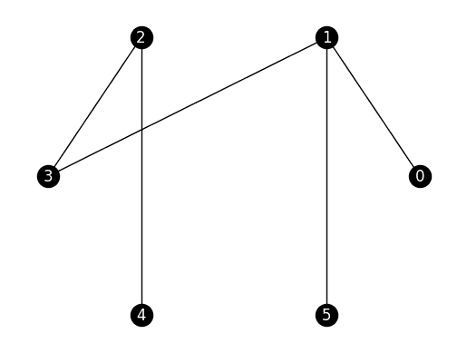
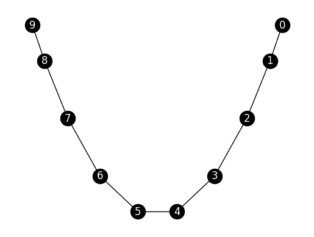
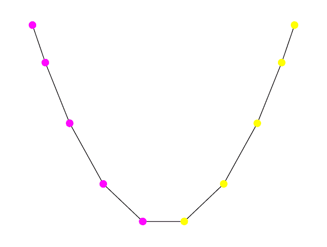
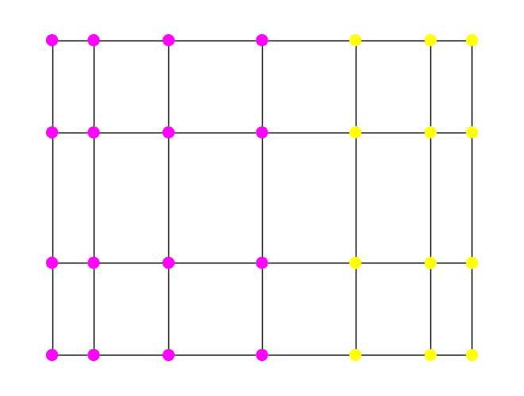
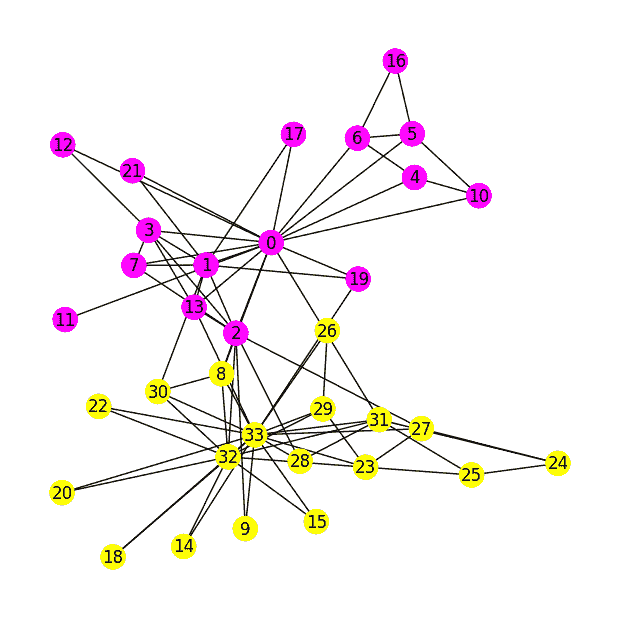

# 5.5\. 应用：通过谱聚类进行图划分#

> 原文：[`mmids-textbook.github.io/chap05_specgraph/05_partitioning/roch-mmids-specgraph-partitioning.html`](https://mmids-textbook.github.io/chap05_specgraph/05_partitioning/roch-mmids-specgraph-partitioning.html)

在本节中，我们使用图的拉普拉斯算子的谱性质来识别“好的”切割。

## 5.5.1\. 如何切割一个图#

设 \(G=(V, E)\) 为一个图。想象一下，我们感兴趣的是找到一个好的切割。也就是说，大致上，我们希望将其划分为两个不相交的顶点子集，同时实现两个目标：

1.  这两个集合之间相对较少的边

1.  任何一个集合都不是太小。

我们将证明拉普拉斯特征向量在执行此类图切割中提供了有用的信息。首先，我们正式地表述这个问题。

**切割比** 使图切割更精确的一种方法是要考虑以下组合数量。

**定义** **（等周数）** \(\idx{isoperimetric number}\xdi\) 设 \(G=(V, E)\) 为一个图。一个切割\(\idx{cut}\xdi\) 是 \(G\) 的顶点的二分划分 \((S, S^c)\)，其中 \(S\) 和 \(S^c = V\setminus S\) 是 \(V\) 的非空子集。相应的切割集是 \(S\) 和 \(S^c\) 之间的边的集合

\[ E(S,S^c) = \{ \{i,j\} \in E : i \in S, j \in S^c \}. \]

这也被称为 \(S\) 的边边界（表示为 \(\partial S\)）。然后，切割集的大小是 \(|E(S,S^c)|\)，即 \(S\) 到 \(S^c\) 之间的边的数量。\((S,S^c)\) 的切割比\(\idx{cut ratio}\xdi\) 定义为

\[ \phi(S) = \frac{|E(S,S^c)|}{\min\{|S|, |S^c|\}} \]

并且 \(G\) 的等周数（或[切氏常数](https://en.wikipedia.org/wiki/Spectral_graph_theory#Cheeger_constant)）\(\idx{Cheeger constant}\xdi\) 是这个量在 \(G\) 上可以取的最小值，即，

\[ \phi_G = \min_{\emptyset \neq S \subset V} \phi(S). \]

\(\natural\)

用话来说：切割比试图最小化切割的边的数量，同时惩罚两边顶点数量较少的切割。这些对应于上述目标，我们将使用这个标准来评估图切割的质量。

*为什么需要分母？* 如果我们只最小化所有切割（在 \(\phi(S)\) 中没有分母）的分子 \(|E(S,S^c)|\)，我们会得到所谓的[最小切割（或 min-cut）问题](https://en.wikipedia.org/wiki/Minimum_cut)。这个问题更容易解决。特别是，它可以使用一个美丽的[随机算法](https://en.wikipedia.org/wiki/Karger%27s_algorithm)来解决。然而，它往往会产生不平衡的切割，其中一边比另一边小得多。这不是我们想要的。

**图例：** 桥是交通网络中瓶颈（即，一个好的切割）的一个很好的例子。（*来源：[Midjourney](https://www.midjourney.com/)*）


\(\bowtie\)

**示例：** **(一个随机树)** 我们在上面的定义中展示了树，即没有环的连通图。函数 `networkx.random_labeled_tree` 可以生成一个随机树。和之前一样，我们使用 `seed` 来保证可重复性。再次，我们使用 \(0,\ldots,n-1\) 作为顶点集。

```py
G_tree = nx.random_labeled_tree(n=6, seed=111)

nx.draw_networkx(G_tree, pos=nx.circular_layout(G_tree), 
                 node_color='black', font_color='white')
plt.axis('off')
plt.show() 
```



假设我们取 \(S = \{0,1,2,3\}\)。那么 \(S^c = \{4,5\}\) 以及

\[ E(S,S^c) = \{\{1,5\}, \{2,4\}\}. \]

切割比随后是

\[ \phi(S) = \frac{|E(S,S^c)|}{\min\{|S|,|S^c|\}} = \frac{2}{2} = 1. \]

一个更好的切割是 \(S = \{0,1,5\}\)。在这种情况下，\(S^c = \{2,3,4\}\)，

\[ E(S,S^c)= \{\{1,3\}\}, \]

和

\[ \phi(S) = \frac{|E(S,S^c)|}{\min\{|S|,|S^c|\}} = \frac{1}{3}. \]

这也等于 \(\phi_G\)。实际上，在一个有 \(n\) 个顶点的连通图中，分子至少为 \(1\)，分母最多为 \(n/2\)，这里就是这种情况。

\(\lhd\)

**Cheeger 的不等式** 谱图理论的一个关键结果建立了等周数与第二小的拉普拉斯特征值之间的定量关系。

**定理** **(Cheeger)** \(\idx{Cheeger 的不等式}\xdi\) 设 \(G = (V, E)\) 是一个有 \(n = |V|\) 个顶点和最大度 \(\bar{\delta}\) 的图。设 \(0 = \mu_1 \leq \mu_2 \leq \cdots \leq \mu_n\) 是其拉普拉斯特征值。那么

\[ \frac{\phi_G²}{2 \bar{\delta}} \leq \mu_2 \leq 2 \phi_G. \]

\(\sharp\)

我们只证明简单方向，\(\mu_2 \leq 2 \phi_G\)，这明确展示了 \(\mu_2\) 与 \(\phi_G\) 之间的联系是如何产生的。

*证明思路：* 为了证明 \(\mu_2 \leq 2 \phi_G\)，我们找到一个合适的测试向量，将其插入到 \(\mu_2\) 的极值特征中，并将其与 \(\phi_G\) 相关联。

*证明：* 回忆一下，从 \(\mu_2\) 的 *变分特征描述* 中，我们有

\[ \mu_2 = \min\left\{ \sum_{\{u, v\} \in E} (x_u - x_v)² \,:\, \mathbf{x} = (x_1, \ldots, x_n) \in \mathbb{R}^n, \sum_{u=1}^n x_u = 0, \sum_{u = 1}^n x_u² = 1 \right\}. \]

**构建一个良好的测试向量：** 我们构建一个 \(\mathbf{x}\) 向量，它提供了一个良好的上界。设 \(\emptyset \neq S \subset V\) 是 \(V\) 的一个适当、非空子集，且 \(0 < |S| \leq \frac{1}{2}|V|\)。我们选择一个在 \(S\) 上取一个值，在 \(S^c\) 上取不同值的向量。借鉴上述两分量示例，我们考虑以下向量项

\[\begin{align*} x_i = \begin{cases} \sqrt{\frac{|S^c|}{n |S|}} & \text{if $i \in S$}\\ - \sqrt{\frac{|S|}{n |S^c|}} & \text{if $i \in S^c$}. \end{cases} \end{align*}\]

这种选择确保了

\[\begin{align*} \sum_{i=1}^n x_i &= \sum_{i\in S} \sqrt{\frac{|S^c|}{n |S|}} + \sum_{i\in S^c} \left(- \sqrt{\frac{|S|}{n |S^c|}}\right)\\ &= |S| \sqrt{\frac{|S^c|}{n |S|}} - |S^c| \sqrt{\frac{|S|}{n |S^c|}}\\ &= \sqrt{\frac{|S| |S^c|}{n}} - \sqrt{\frac{|S||S^c| }{n}}\\ &= 0, \end{align*}\]

亦然

\[\begin{align*} \sum_{i=1}^n x_i² &= \sum_{i\in S} \left(\sqrt{\frac{|S^c|}{n |S|}}\right)² + \sum_{i\in S^c} \left(- \sqrt{\frac{|S|}{n |S^c|}}\right)²\\ &= |S| \frac{|S^c|}{n |S|} + |S^c| \frac{|S|}{n |S^c|}\\ &= \frac{|S^c| + |S|}{n}\\ &=1. \end{align*}\]

为了评估拉普拉斯二次型，我们注意到 \(\mathbf{x}\) 在 \(S\)（以及 \(S^c\)）上的每个地方都取相同的值。因此，边的和简化为

\[\begin{align*} \sum_{\{i, j\} \in E} (x_i - x_j)² &= \sum_{\substack{\{i, j\} \in E \\ x_i\neq x_j}} \left(\sqrt{\frac{|S^c|}{n |S|}} + \sqrt{\frac{|S|}{n |S^c|}}\right)²\\ &= \sum_{\substack{\{i, j\} \in E \\ x_i\neq x_j}} \left(\frac{|S^c| + |S|}{\sqrt{n |S| |S^c|}}\right)²\\ &= |E(S,S^c)|\frac{n}{|S| |S^c|}, \end{align*}\]

其中我们使用了，对于每个边 \(\{i, j\} \in E\)，其中 \(x_i \neq x_j\)，一个端点在 \(S\) 中，另一个端点在 \(S^c\) 中。

***使用等周数的定义：*** 因此，对于这个 \(\mathbf{x}\) 的选择，我们有

\[ \mu_2 \leq \sum_{\{i, j\} \in E} (x_i - x_j)² = \frac{n |E(S,S^c)|}{|S^c| |S|} = \frac{|E(S,S^c)|}{(|S^c|/n) |S|} \leq 2 \frac{|E(S,S^c)|}{|S|} \]

其中我们使用了 \(|S^c| \geq n/2\)。这个不等式对于任何 \(S\) 都成立，其中 \(0 < |S| \leq \frac{1}{2}|V|\)。特别是，它对于产生最小值的 \(S\) 成立。因此，根据等周数的定义，我们得到

\[ \mu_2 \leq 2 \phi_G \]

如所声称。\(\square\)

**数值角**：我们回到上面的随机树示例。我们声称 \(\phi_G = 1/3\)。最大度数为 \(\bar{\delta} = 3\)。我们现在计算 \(\mu_2\)。我们首先计算拉普拉斯矩阵。

```py
phi_G = 1/3
max_deg = 3 
```

我们现在计算 \(\mu_2\). 我们首先计算拉普拉斯矩阵。

```py
L_tree = nx.laplacian_matrix(G_tree).toarray()
print(L_tree) 
```

```py
[[ 1 -1  0  0  0  0]
 [-1  3  0 -1  0 -1]
 [ 0  0  2 -1 -1  0]
 [ 0 -1 -1  2  0  0]
 [ 0  0 -1  0  1  0]
 [ 0 -1  0  0  0  1]] 
```

```py
w, v = LA.eigh(L_tree) 
mu_2 = np.sort(w)[1]
print(mu_2) 
```

```py
0.32486912943335317 
```

我们检查**Cheeger 不等式**。左侧是：

```py
(phi_G ** 2) / (2 * max_deg) 
```

```py
0.018518518518518517 
```

右侧是：

```py
2 * phi_G 
```

```py
0.6666666666666666 
```

\(\unlhd\)

**图割算法** 我们只证明了**Cheeger 不等式**的简单方向。然而，描述另一个方向（图上下文中的实际[Cheeger 不等式](https://en.wikipedia.org/wiki/Cheeger_constant#Cheeger's_inequality)）是有用的，因为它包含一个重要的算法思想。

***一个算法：*** 输入是图 \(G=(V,E)\)。设 \(\mathbf{y}_2 \in \mathbb{R}^n\) 是与第二小的特征值 \(\mu_2\) 相关的拉普拉斯矩阵 \(L\) 的单位范数特征向量，即，\(\mathbf{y}_2\) 是 Fiedler 向量。对于 \(G\) 的每个顶点都有一个 \(\mathbf{y}_2 = (y_{2,1}, \ldots, y_{2,n})\) 的条目。我们使用这些条目将图 \(G\) 嵌入 \(\mathbb{R}\)：顶点 \(i\) 映射到 \(y_{2,i}\)。现在对条目 \(y_{2,\pi(1)}, \ldots, y_{2,\pi(n)}\) 进行排序，其中 \(\pi\) 是一个 [排列](https://en.wikipedia.org/wiki/Permutation)\(\idx{permutation}\xdi\), 即，\(1,\ldots,n\) 的重新排序。具体来说，\(\pi(1)\) 是对应于 \(\mathbf{y}_{2}\) 中最小条目的顶点，\(\pi(2)\) 是第二小的，以此类推。我们只考虑以下形式的割

\[ S_k = \{\pi(1), \ldots, \pi(k)\} \]

并且我们输出最小化割比的割 \((S_k, S_k^c)\)。

\[ \phi(S_k) = \frac{|E(S_k,S_k^c)|}{\min\{k, n-k\}}, \]

对于 \(k \leq n-1\)。

可以严格证明（但在这里我们不会这样做）的是，存在某个 \(k^* \in\{1,\ldots,n-1\}\) 使得

\[ \mu_2 = \sum_{\{u, v\} \in E} (y_{2,u} - y_{2,v})² \geq \frac{\phi(S_{k^*})²}{2 \bar{\delta}} \geq \frac{\phi_G²}{2 \bar{\delta}}, \]

这意味着 *Cheeger 不等式* 的下界。最左边的不等式是非平凡的。

由于 \(\mu_2 \leq 2 \phi_G\)，这意味着

\[ \phi(S_{k^*}) \leq \sqrt{4 \bar{\delta} \phi_G}. \]

因此，\(\phi(S_{k^*})\) 可能不会达到 \(\phi_G\)，但我们确实对由该算法产生的割的质量有所保证。

例如，参见 [[Kel](https://ocw.mit.edu/courses/mathematics/18-409-topics-in-theoretical-computer-science-an-algorithmists-toolkit-fall-2009/index.htm)，第 3 讲，第 4.2 节]] 以获取更多详细信息。

上述提供了一个具有可证明保证的割的启发式方法。我们接下来实现它。相比之下，找到最小化割比的割的问题已知是 [NP-hard](https://en.wikipedia.org/wiki/NP-hardness)\(\idx{NP-hardness}\xdi\), 即，粗略地说，它是计算上不可行的。

我们实现了上述的图割算法。

我们现在用 Python 实现这个启发式方法。我们首先编写一个辅助函数，该函数接受一个邻接矩阵、顶点的排序和一个值 \(k\) 作为输入。它返回前 \(k\) 个顶点在排序中的割比。

```py
def cut_ratio(A, order, k):

    n = A.shape[0]
    edge_boundary = 0
    for i in range(k+1):
        for j in range(k+1,n):
            edge_boundary += A[order[i],order[j]]

    denominator = np.minimum(k+1, n-k-1)

    return edge_boundary/denominator 
```

使用 `cut_ratio` 函数，我们首先计算拉普拉斯矩阵，找到第二个特征向量和相应的顶点排序。然后我们计算每个 \(k\) 的割比。最后，我们输出与最小值对应的割（\(S_k\) 和 \(S_k^c\)），作为一个数组的元组。

```py
def spectral_cut2(A):
    n = A.shape[0]

    degrees = A.sum(axis=1)
    D = np.diag(degrees)
    L = D - A
    w, v = LA.eigh(L) 
    order = np.argsort(v[:,np.argsort(w)[1]])

    phi = np.zeros(n-1)
    for k in range(n-1):
        phi[k] = cut_ratio(A, order, k)
    imin = np.argmin(phi)

    return order[0:imin+1], order[imin+1:n] 
```

最后，为了帮助可视化输出，我们编写了一个函数，根据顶点所在的割的哪一侧来着色顶点。

```py
def viz_cut(G, s, pos, node_size=100, with_labels=False):
    n = G.number_of_nodes()
    assign = np.zeros(n)
    assign[s] = 1
    nx.draw(G, node_color=assign, pos=pos, with_labels=with_labels, 
            cmap='spring', node_size=node_size, font_color='k')
    plt.show() 
```

**数值角:** 我们将在路径图上说明这一点。

```py
n = 10
G = nx.path_graph(n)

nx.draw_networkx(G, pos=nx.spectral_layout(G), 
                 node_color='black', font_color='white')
plt.axis('off')
plt.show() 
```



我们应用我们的基于谱的切割算法。

```py
A = nx.adjacency_matrix(G).toarray()
s, sc = spectral_cut2(A)
print(s)
print(sc) 
```

```py
[0 1 2 3 4]
[5 6 7 8 9] 
```

```py
pos = nx.spectral_layout(G)
viz_cut(G, s, pos) 
```



让我们在网格图上试一试。你能猜到切割会是什么吗？

```py
G = nx.grid_2d_graph(4,7)
A = nx.adjacency_matrix(G).toarray()
s, sc = spectral_cut2(A)
pos = nx.spectral_layout(G)
viz_cut(G, s, pos) 
```



\(\unlhd\)

**如何计算第二小的特征值？** 还有一件事要处理。我们如何计算 Fiedler 向量？之前，我们看到了一个基于取矩阵幂的迭代方法，用于计算正半定矩阵的 *最大特征值及其对应的特征向量*。我们在这里展示了如何将这种方法适应我们手头的任务。具体细节留作一系列练习。

首先，我们修改拉普拉斯矩阵，以改变特征值的顺序而不改变特征向量本身。这样最小的特征值将变成最大的。根据 *拉普拉斯和最大度数引理*，对所有 \(i=1,\ldots,n\)，有 \(\mu_i \leq 2 \bar{\delta}\)，其中回忆一下，\(\bar{\delta}\) 是图的最大度数。

**引理** **(特征值顺序的逆序)** \(\idx{inverting the order of eigenvalues lemma}\xdi\) 对于 \(i=1,\ldots,n\)，令 \(\lambda_i = 2 \bar{\delta} - \mu_i\)。矩阵 \(M = 2 \bar{\delta} I_{n\times n} - L\) 是正半定的，并且有特征向量分解

\[ M = \sum_{i=1}^{n} \lambda_i \mathbf{y}_i \mathbf{y}_i^T. \]

\(\flat\)

第二，我们的目标是现在计算 \(M\) 的第二大特征值——而不是最大的一个。但我们已经知道了最大的一个。它是 \(\lambda_1 = 2\bar{\delta} - \mu_1 = 2 \bar{\delta}\)，其对应的特征向量是 \(\mathbf{y}_1 = \frac{1}{\sqrt{n}}(1,\ldots,1)\)。结果是我们可以简单地应用幂迭代法，起始向量与 \(\mathbf{y}_1\) 正交。这样的向量可以通过取一个随机向量并减去其在 \(\mathbf{y}_1\) 上的正交投影来构造。

**引理** **(第二大特征值的幂迭代法)** 假设 \(\mu_1 < \mu_2 < \mu_3\)。令 \(\mathbf{x} \in \mathbb{R}^n\) 是一个向量，使得 \(\langle \mathbf{y}_1, \mathbf{x} \rangle = 0\) 和 \(\langle \mathbf{y}_2, \mathbf{x} \rangle > 0\)。那么

\[ \frac{M^{k} \mathbf{x}}{\|M^{k} \mathbf{x}\|} \to \mathbf{y}_2 \]

当 \(k \to +\infty\) 时。如果相反 \(\langle \mathbf{y}_2, \mathbf{x} \rangle < 0\)，那么极限是 \(- \mathbf{y}_2\)。 \(\flat\)

**放松视角**: 这是另一种直观的方式来阐明谱划分的有效性。假设我们有一个具有偶数个顶点 \(n = |V|\) 的图 \(G = (V,E)\)。假设我们正在寻找最佳平衡切分 \((S,S^c)\)，使其在所有具有 \(|S| = |S^c| = n/2\) 的切分中，最小化跨其的边数 \(|E(S,S^c)|\)。这被称为 [最小二分问题](https://link.springer.com/referenceworkentry/10.1007/978-1-4939-2864-4_231)。

从数学上讲，我们可以将其表述为以下离散优化问题：

\[ \min\left\{\frac{1}{4} \sum_{\{i,j\} \in E} (x_i - x_j)²\,:\, \mathbf{x} = (x_1,\ldots,x_n) \in \{-1,+1\}^n, \sum_{i=1}^n x_i = 0 \right\}. \]

条件 \(\mathbf{x} \in \{-1,+1\}^n\) 隐含地将每个顶点 \(i\) 分配到 \(S\)（如果 \(x_i = -1\)）或 \(S^c\)（如果 \(x_i=+1\)）。条件 \(\sum_{i=1}^n x_i = 0\) 确保了切分 \((S,S^c)\) 是平衡的，即 \(|S| = |S^c|\)。在这种解释下，项 \((x_i - x_j)²\) 要么是 \(0\)（如果 \(i\) 和 \(j\) 在切分的同一侧），要么是 \(4\)（如果它们在相对的两侧）。

这是一个计算难题。解决此类离散优化问题的一种方法是将它放松。也就是说，将其转化为具有连续变量的优化问题。具体来说，我们考虑以下情况

\[ \min\left\{\frac{1}{4} \sum_{\{i,j\} \in E} (x_i - x_j)²\,:\, \mathbf{x} = (x_1,\ldots,x_n) \in \mathbb{R}^n, \sum_{i=1}^n x_i = 0, \sum_{i=1}^n x_i² = n\right\}. \]

这个放松问题的最优目标值必然小于或等于原始问题的目标值。事实上，原始问题的任何解都满足放松的约束。考虑到缩放因子，最后一个问题与 \(\mu_2\) 的变分特征等价。确实，可以证明达到的最小值是 \(\frac{\mu_2 n}{4}\)（试试看！）。

**数值角**: 我们回到 [空手道俱乐部数据集](https://en.wikipedia.org/wiki/Zachary%27s_karate_club)。

**图**: 道场 (*来源:* 使用 [Midjourney](https://www.midjourney.com/) 制作)


\(\bowtie\)

```py
G = nx.karate_club_graph()
n = G.number_of_nodes()
A = nx.adjacency_matrix(G).toarray() 
```

我们寻求找到自然的子社区。我们使用拉普拉斯算子的谱性质。具体来说，我们使用我们的 `spectral_cut2` 和 `viz_cut` 函数来计算一个良好的切分并可视化它。

```py
s, sc = spectral_cut2(A)
print(s)
print(sc) 
```

```py
[18 26 20 14 29 22 24 15 23 25 32 27  9 33 31 28 30  8]
[ 2 13  1 19  7  3 12  0 21 17 11  4 10  6  5 16] 
```

```py
plt.figure(figsize=(6,6))
pos = nx.spring_layout(G, k=0.7, iterations=50, seed=42)
viz_cut(G, s, pos, node_size=300, with_labels=True) 
```



评估所得切分的质量并非易事。但这个特定的例子有一个已知的基真社区结构（这解释了其广泛使用的一部分）。引用自 [维基百科](https://en.wikipedia.org/wiki/Zachary%27s_karate_club)：

> 卡拉特俱乐部的社会网络由 Wayne W. Zachary 在 1970 年至 1972 年期间研究了三年。该网络捕捉了 34 名俱乐部成员，记录了在俱乐部外互动的成员对之间的联系。在研究期间，管理员“John A”和教练“Mr. Hi”（化名）之间发生了冲突，导致俱乐部分裂成两个。一半的成员围绕 Mr. Hi 形成了一个新的俱乐部；另一部分的成员找到了新的教练或放弃了空手道。基于收集到的数据，Zachary 正确地将除了一个成员之外的所有成员分配到了他们实际加入的组别。

这个真实值如下。我们使用 `numpy.nonzero`（[链接](https://numpy.org/doc/stable/reference/generated/numpy.nonzero.html#numpy.nonzero)）将其转换为切割。

```py
truth = np.array([0, 0, 0, 0, 0, 0, 0, 0, 1, 1, 0, 0, 0, 0, 1, 1, 0, 
                  0, 1, 0, 1, 0, 1, 1, 1, 1, 1, 1, 1, 1, 1, 1, 1, 1])
s_truth = np.nonzero(truth)
plt.figure(figsize=(6,6))
viz_cut(G, s_truth, pos, node_size=300, with_labels=True) 
```


你可以验证我们的切割与真实值完美匹配。

**CHAT & LEARN** 调查替代图划分算法，例如 Kernighan-Lin 算法。向你的最爱 AI 聊天机器人解释它是如何工作的，并比较它在数据集上的性能与谱聚类的性能。([在 Colab 中打开](https://colab.research.google.com/github/MMiDS-textbook/MMiDS-textbook.github.io/blob/main/just_the_code/roch_mmids_chap_specgraph_notebook.ipynb)) \(\ddagger\)

\(\unlhd\)

***自我评估测验*** *(由 Claude、Gemini 和 ChatGPT 协助)*

**1** 以下哪个最好地描述了图切割 \((S, S^c)\) 的“切割比”？

a) \(S\) 和 \(S^c\) 之间边的数量与图中总边数之比。

b) \(S\) 和 \(S^c\) 之间边的数量与较小集合的大小之比，即 \(\min\{|S|, |S^c|\}\)。

c) \(S\) 内部的边数与 \(S^c\) 内部的边数之比。

d) 图中总边数与 \(S\) 和 \(S^c\) 之间边数之比。

**2** 图 \(G\) 的等周数（或 Cheeger 常数）是什么？

a) 所有可能切割的切割比的最大值。

b) 所有可能切割的切割比的最小值。

c) 所有可能切割的切割比的平均值。

d) 所有可能切割的切割比的中值。

**3** *Cheeger 不等式* 建立了什么？

a) 等周数与最大的拉普拉斯特征值之间的关系。

b) 等周数与第二大的拉普拉斯特征值之间的关系。

c) 等周数与最小的拉普拉斯特征值之间的关系。

d) 等周数与第二小的拉普拉斯特征值之间的关系。

**4** 在谱图理论背景下，Fiedler 矢量是什么？

a) 与拉普拉斯矩阵最大特征值相关的特征向量。

b) 与拉普拉斯矩阵的最小特征值相关的特征向量。

c) 与拉普拉斯矩阵的第二小特征值相关的特征向量。

d) 与拉普拉斯矩阵的第二大特征值相关的特征向量。

**5** 文本中提出的以下哪个是最小二分问题的松弛？

\[ \min \frac{1}{4} \left\{\sum_{\{i,j\} \in E} (x_i - x_j)² : \mathbf{x} = (x_1, ..., x_n) \in \{-1, +1\}^n, \sum_{i=1}^n x_i = 0\right\} \]

a)

\[ \min \frac{1}{4} \left\{\sum_{\{i,j\} \in E} (x_i - x_j)² : \mathbf{x} = (x_1, ..., x_n) \in \mathbb{R}^n, \sum_{i=1}^n x_i = 0, \sum_{i=1}^n x_i² = n\right\} \]

b)

\[ \min \frac{1}{4} \left\{\sum_{\{i,j\} \in E} |x_i - x_j| : \mathbf{x} = (x_1, ..., x_n) \in \mathbb{R}^n, \sum_{i=1}^n x_i = 0, \sum_{i=1}^n x_i² = n\right\} \]

c)

\[ \max \frac{1}{4} \left\{\sum_{\{i,j\} \in E} (x_i - x_j)² : \mathbf{x} = (x_1, ..., x_n) \in \mathbb{R}^n, \sum_{i=1}^n x_i = 0, \sum_{i=1}^n x_i² = n\right\} \]

d)

\[ \max \frac{1}{4} \left\{\sum_{\{i,j\} \in E} |x_i - x_j| : \mathbf{x} = (x_1, ..., x_n) \in \mathbb{R}^n, \sum_{i=1}^n x_i = 0, \sum_{i=1}^n x_i² = n\right\} \]

答案 1：b. 证明：文本将切割比定义为\(\phi(S) = \frac{|E(S, S^c)|}{\min\{|S|, |S^c|\}}\)，其中\(|E(S, S^c)|\)是\(S\)和\(S^c\)之间边的数量。

答案 2：b. 证明：文本将等周数定义为“[切割比]在\(G\)上可以取的最小值，即\(\phi_G = \min_{\emptyset \neq S \subset V} \phi(S)\)。”

答案 3：d. 证明：文本指出，“谱图理论的一个关键结果建立了等周数与第二小拉普拉斯特征值之间的定量关系。”

答案 4：c. 证明：文本提到与拉普拉斯矩阵的第二小特征值相关的特征向量为 Fiedler 向量。

答案 5：a. 证明：文本将约束\(\mathbf{x} = (x_1, ..., x_n) \in \{-1, +1\}^n\)替换为\(\mathbf{x} = (x_1, ..., x_n) \in \mathbb{R}^n\)，并添加约束\(\sum_{i=1}^n x_i² = n\)以保持平衡切割属性。

## 5.5.1. 如何切割一个图#

设\(G=(V, E)\)为一个图。想象一下，我们感兴趣的是找到一个好的切割。也就是说，大致上，我们希望将其划分为两个不相交的顶点子集，同时实现两个目标：

1.  两个集合之间相对较少的边

1.  两个集合都不太小。

我们将证明拉普拉斯特征向量在执行此类图切割中提供有用的信息。首先我们正式提出这个问题。

**切割比**使图切割更精确的一种方法是通过考虑以下组合数量。

**定义** **（等周数）** \(\idx{等周数}\xdi\) 设 \(G=(V, E)\) 为一个图。一个切割\(\idx{切割}\xdi\) 是 \(G\) 的顶点的二分 \((S, S^c)\)，其中 \(S\) 和 \(S^c = V\setminus S\) 是 \(V\) 的非空子集。相应的切割集是 \(S\) 和 \(S^c\) 之间的边集

\[ E(S,S^c) = \{ \{i,j\} \in E : i \in S, j \in S^c \}. \]

这也被称为 \(S\) 的边边界（表示为 \(\partial S\))。切割集的大小是 \(|E(S,S^c)|\)，即 \(S\) 到 \(S^c\) 之间的边数。\((S,S^c)\) 的切割比率\(\idx{切割比率}\xdi\) 定义为

\[ \phi(S) = \frac{|E(S,S^c)|}{\min\{|S|, |S^c|\}} \]

以及 \(G\) 的等周数（或 [Cheeger 常数](https://en.wikipedia.org/wiki/Spectral_graph_theory#Cheeger_constant))\(\idx{Cheeger 常数}\xdi\) 是这个量在 \(G\) 上可以取的最小值，即，

\[ \phi_G = \min_{\emptyset \neq S \subset V} \phi(S). \]

\(\natural\)

用话来说：切割比率试图最小化切割两边的边数，同时惩罚两边顶点数量较少的切割。这些对应于上述目标，我们将使用这个标准来评估图切割的质量。

*为什么需要分母？* 如果我们只最小化所有切割（\(\phi(S)\) 中的分母不在）的分子 \(|E(S,S^c)|\)，我们会得到所谓的 [最小切割（或 min-cut）问题](https://en.wikipedia.org/wiki/Minimum_cut)。这个问题更容易解决。特别是，它可以使用一个美丽的 [随机算法](https://en.wikipedia.org/wiki/Karger%27s_algorithm) 来解决。然而，它往往会产生不平衡的切割，其中一边比另一边小得多。这不是我们想要的。

**图例：** 桥梁是运输网络中瓶颈（即，一个好的切割）的一个很好的例子。（*来源：[Midjourney](https://www.midjourney.com/)*）


\(\bowtie\)

**示例：** **（一个随机树）** 我们在上面的定义中展示了树，即没有环的连通图。函数 `networkx.random_labeled_tree` 可以生成一个随机树。像以前一样，我们使用 `seed` 来保证可重复性。再次，我们使用 \(0,\ldots,n-1\) 作为顶点集。

```py
G_tree = nx.random_labeled_tree(n=6, seed=111)

nx.draw_networkx(G_tree, pos=nx.circular_layout(G_tree), 
                 node_color='black', font_color='white')
plt.axis('off')
plt.show() 
```


假设我们取 \(S = \{0,1,2,3\}\)。那么 \(S^c = \{4,5\}\) 并且

\[ E(S,S^c) = \{\{1,5\}, \{2,4\}\}. \]

切割比率为

\[ \phi(S) = \frac{|E(S,S^c)|}{\min\{|S|,|S^c|\}} = \frac{2}{2} = 1. \]

更好的切割方式是 \(S = \{0,1,5\}\)。在这种情况下 \(S^c = \{2,3,4\}\),

\[ E(S,S^c)= \{\{1,3\}\}, \]

和

\[ \phi(S) = \frac{|E(S,S^c)|}{\min\{|S|,|S^c|\}} = \frac{1}{3}. \]

这也等于 \(\phi_G\)。实际上，在一个有 \(n\) 个顶点的连通图中，分子至少为 \(1\)，分母最多为 \(n/2\)，这里就是这种情况。

\(\lhd\)

**Cheeger 的不等式** 谱图理论的一个关键结果建立了等周数与第二小的拉普拉斯特征值之间的定量关系。

**定理** **(Cheeger)** \(\idx{Cheeger 的不等式}\xdi\) 设 \(G = (V, E)\) 是一个有 \(n = |V|\) 个顶点和最大度数 \(\bar{\delta}\) 的图。设 \(0 = \mu_1 \leq \mu_2 \leq \cdots \leq \mu_n\) 是其拉普拉斯特征值。那么

\[ \frac{\phi_G²}{2 \bar{\delta}} \leq \mu_2 \leq 2 \phi_G. \]

\(\sharp\)

我们只证明简单方向，\(\mu_2 \leq 2 \phi_G\)，这明确地展示了 \(\mu_2\) 与 \(\phi_G\) 之间的联系是如何产生的。

*证明思路：* 要证明 \(\mu_2 \leq 2 \phi_G\)，我们需要找到一个合适的测试向量，将其插入到 \(\mu_2\) 的极值特征中，并将其与 \(\phi_G\) 相联系。

*证明：* 回想一下，从 *\(\mu_2\) 的变分特征*，我们有

\[ \mu_2 = \min\left\{ \sum_{\{u, v\} \in E} (x_u - x_v)² \,:\, \mathbf{x} = (x_1, \ldots, x_n) \in \mathbb{R}^n, \sum_{u=1}^n x_u = 0, \sum_{u = 1}^n x_u² = 1 \right\}. \]

***构建一个好的测试向量：*** 我们构建一个 \(\mathbf{x}\)，它提供了一个良好的上界。设 \(\emptyset \neq S \subset V\) 是 \(V\) 的一个适当、非空子集，且 \(0 < |S| \leq \frac{1}{2}|V|\)。我们选择一个在 \(S\) 上取一个值，在 \(S^c\) 上取不同值的向量。借鉴上面的两分量示例，我们考虑具有以下项的向量

\[\begin{align*} x_i = \begin{cases} \sqrt{\frac{|S^c|}{n |S|}} & \text{if $i \in S$}\\ - \sqrt{\frac{|S|}{n |S^c|}} & \text{if $i \in S^c$}. \end{cases} \end{align*}\]

这个选择确保了

\[\begin{align*} \sum_{i=1}^n x_i &= \sum_{i\in S} \sqrt{\frac{|S^c|}{n |S|}} + \sum_{i\in S^c} \left(- \sqrt{\frac{|S|}{n |S^c|}}\right)\\ &= |S| \sqrt{\frac{|S^c|}{n |S|}} - |S^c| \sqrt{\frac{|S|}{n |S^c|}}\\ &= \sqrt{\frac{|S| |S^c|}{n}} - \sqrt{\frac{|S||S^c| }{n}}\\ &= 0, \end{align*}\]

以及

\[\begin{align*} \sum_{i=1}^n x_i² &= \sum_{i\in S} \left(\sqrt{\frac{|S^c|}{n |S|}}\right)² + \sum_{i\in S^c} \left(- \sqrt{\frac{|S|}{n |S^c|}}\right)²\\ &= |S| \frac{|S^c|}{n |S|} + |S^c| \frac{|S|}{n |S^c|}\\ &= \frac{|S^c| + |S|}{n}\\ &=1. \end{align*}\]

为了评估拉普拉斯二次型，我们注意到 \(\mathbf{x}\) 在 \(S\)（以及 \(S^c\)）上的每个地方都取相同的值。因此，边上的和简化为

\[\begin{align*} \sum_{\{i, j\} \in E} (x_i - x_j)² &= \sum_{\substack{\{i, j\} \in E \\ x_i\neq x_j}} \left(\sqrt{\frac{|S^c|}{n |S|}} + \sqrt{\frac{|S|}{n |S^c|}}\right)²\\ &= \sum_{\substack{\{i, j\} \in E \\ x_i\neq x_j}} \left(\frac{|S^c| + |S|}{\sqrt{n |S| |S^c|}}\right)²\\ &= |E(S,S^c)|\frac{n}{|S| |S^c|}, \end{align*}\]

其中我们使用了对于每个 \(\{i, j\} \in E\) 的边，其中 \(x_i \neq x_j\)，一个端点在 \(S\) 中，另一个端点在 \(S^c\) 中。

***使用等周数的定义：*** 因此，对于这个 \(\mathbf{x}\) 的选择，我们有

\[ \mu_2 \leq \sum_{\{i, j\} \in E} (x_i - x_j)² = \frac{n |E(S,S^c)|}{|S^c| |S|} = \frac{|E(S,S^c)|}{(|S^c|/n) |S|} \leq 2 \frac{|E(S,S^c)|}{|S|} \]

其中我们使用了 \(|S^c| \geq n/2\)。这个不等式对任何 \(0 < |S| \leq \frac{1}{2}|V|\) 的 \(S\) 都成立。特别是，它对产生最小值的 \(S\) 成立。因此，根据等周数的定义，我们得到

\[ \mu_2 \leq 2 \phi_G \]

如所述。 \(\square\)

**数值角:** 我们回到上面提到的随机树示例。我们声称 \(\phi_G = 1/3\)。最大度数为 \(\bar{\delta} = 3\)。我们现在计算 \(\mu_2\)。我们首先计算拉普拉斯矩阵。

```py
phi_G = 1/3
max_deg = 3 
```

我们现在计算 \(\mu_2\)。我们首先计算拉普拉斯矩阵。

```py
L_tree = nx.laplacian_matrix(G_tree).toarray()
print(L_tree) 
```

```py
[[ 1 -1  0  0  0  0]
 [-1  3  0 -1  0 -1]
 [ 0  0  2 -1 -1  0]
 [ 0 -1 -1  2  0  0]
 [ 0  0 -1  0  1  0]
 [ 0 -1  0  0  0  1]] 
```

```py
w, v = LA.eigh(L_tree) 
mu_2 = np.sort(w)[1]
print(mu_2) 
```

```py
0.32486912943335317 
```

我们检查 *Cheeger 不等式*。左边是：

```py
(phi_G ** 2) / (2 * max_deg) 
```

```py
0.018518518518518517 
```

右边是：

```py
2 * phi_G 
```

```py
0.6666666666666666 
```

\(\unlhd\)

**图切分算法:** 我们只证明了 *Cheeger 不等式* 的简单方向。然而，描述另一个方向（图上下文中的实际 [Cheeger 不等式](https://en.wikipedia.org/wiki/Cheeger_constant#Cheeger's_inequality)）是有用的，因为它包含一个重要的算法思想。

***一个算法：*** 输入是图 \(G=(V,E)\)。设 \(\mathbf{y}_2 \in \mathbb{R}^n\) 是与拉普拉斯矩阵 \(L\) 的第二小特征值 \(\mu_2\) 相关的单位范数特征向量，即 \(\mathbf{y}_2\) 是 Fiedler 向量。对于 \(G\) 的每个顶点都有一个 \(\mathbf{y}_2 = (y_{2,1}, \ldots, y_{2,n})\) 的条目。我们使用这些条目将图 \(G\) 嵌入 \(\mathbb{R}\)：顶点 \(i\) 映射到 \(y_{2,i}\)。现在对条目 \(y_{2,\pi(1)}, \ldots, y_{2,\pi(n)}\) 进行排序，其中 \(\pi\) 是一个 [排列](https://en.wikipedia.org/wiki/Permutation)\(\idx{排列}\xdi\)，即 \(1,\ldots,n\) 的重新排序。具体来说，\(\pi(1)\) 是对应于 \(\mathbf{y}_{2}\) 最小条目的顶点，\(\pi(2)\) 是第二小的，以此类推。我们只考虑以下形式的切分

\[ S_k = \{\pi(1), \ldots, \pi(k)\} \]

我们输出最小化切分比率的切分 \((S_k, S_k^c)\)

\[ \phi(S_k) = \frac{|E(S_k,S_k^c)|}{\min\{k, n-k\}}, \]

对于 \(k \leq n-1\)。

可以严格证明（但在这里我们不会这样做）存在某个 \(k^* \in\{1,\ldots,n-1\}\) 使得

\[ \mu_2 = \sum_{\{u, v\} \in E} (y_{2,u} - y_{2,v})² \geq \frac{\phi(S_{k^*})²}{2 \bar{\delta}} \geq \frac{\phi_G²}{2 \bar{\delta}}, \]

这意味着在 *Cheeger 不等式* 中的下界。最左边的不等式是非平凡的。

由于 \(\mu_2 \leq 2 \phi_G\)，这表明

\[ \phi(S_{k^*}) \leq \sqrt{4 \bar{\delta} \phi_G}. \]

因此，\(\phi(S_{k^*})\) 可能不会达到 \(\phi_G\)，但我们对这个算法产生的切分的质量确实有一些保证。

例如，参见 [[Kel](https://ocw.mit.edu/courses/mathematics/18-409-topics-in-theoretical-computer-science-an-algorithmists-toolkit-fall-2009/index.htm)，第 3 讲，第 4.2 节] 获取更多详细信息。

上述内容提供了一个寻找具有可证明保证的切割的启发式方法。我们接下来实现它。相比之下，寻找最小化切割比率的切割问题已知是 [NP-hard](https://en.wikipedia.org/wiki/NP-hardness)\(\idx{NP-hardness}\xdi\)，即，粗略地说，它是计算上不可行的。

我们实现了上述图切割算法。

现在，我们用 Python 实现这个启发式方法。我们首先编写一个辅助函数，它接受邻接矩阵、顶点顺序和一个值 \(k\) 作为输入。它返回顺序中前 \(k\) 个顶点的切割比率。

```py
def cut_ratio(A, order, k):

    n = A.shape[0]
    edge_boundary = 0
    for i in range(k+1):
        for j in range(k+1,n):
            edge_boundary += A[order[i],order[j]]

    denominator = np.minimum(k+1, n-k-1)

    return edge_boundary/denominator 
```

使用 `cut_ratio` 函数，我们首先计算拉普拉斯矩阵，找到第二个特征向量及其对应的顶点顺序。然后，我们计算每个 \(k\) 的切割比率。最后，我们输出与最小值对应的切割（包括 \(S_k\) 和 \(S_k^c\)），作为一个数组的元组。

```py
def spectral_cut2(A):
    n = A.shape[0]

    degrees = A.sum(axis=1)
    D = np.diag(degrees)
    L = D - A
    w, v = LA.eigh(L) 
    order = np.argsort(v[:,np.argsort(w)[1]])

    phi = np.zeros(n-1)
    for k in range(n-1):
        phi[k] = cut_ratio(A, order, k)
    imin = np.argmin(phi)

    return order[0:imin+1], order[imin+1:n] 
```

最后，为了帮助可视化输出，我们编写了一个函数，根据顶点所在的切割边来着色顶点。

```py
def viz_cut(G, s, pos, node_size=100, with_labels=False):
    n = G.number_of_nodes()
    assign = np.zeros(n)
    assign[s] = 1
    nx.draw(G, node_color=assign, pos=pos, with_labels=with_labels, 
            cmap='spring', node_size=node_size, font_color='k')
    plt.show() 
```

**数值角落：** 我们将在路径图上展示这一点。

```py
n = 10
G = nx.path_graph(n)

nx.draw_networkx(G, pos=nx.spectral_layout(G), 
                 node_color='black', font_color='white')
plt.axis('off')
plt.show() 
```


我们应用我们的基于谱的切割算法。

```py
A = nx.adjacency_matrix(G).toarray()
s, sc = spectral_cut2(A)
print(s)
print(sc) 
```

```py
[0 1 2 3 4]
[5 6 7 8 9] 
```

```py
pos = nx.spectral_layout(G)
viz_cut(G, s, pos) 
```


让我们在网格图上试一试。你能猜到切割会是什么吗？

```py
G = nx.grid_2d_graph(4,7)
A = nx.adjacency_matrix(G).toarray()
s, sc = spectral_cut2(A)
pos = nx.spectral_layout(G)
viz_cut(G, s, pos) 
```


\(\unlhd\)

**如何计算第二个最小的特征值？** 最后还有一件事情需要处理。我们如何计算 Fiedler 向量？之前，我们已经看到了一个基于矩阵幂次迭代的计算方法，用于计算正半定矩阵的**最大特征值及其对应的特征向量**。在这里，我们展示如何将这种方法适应我们当前的任务。具体细节留作一系列练习。

首先，我们修改拉普拉斯矩阵，以改变特征值的顺序而不改变特征向量本身。这样，最小的特征值将变成最大的。根据**拉普拉斯和最大度数引理**，对于所有 \(i=1,\ldots,n\)，有 \(\mu_i \leq 2 \bar{\delta}\)，其中回忆一下，\(\bar{\delta}\) 是图的最大度数。

**引理** **（反转特征值的顺序）** \(\idx{inverting the order of eigenvalues lemma}\xdi\) 对于 \(i=1,\ldots,n\)，设 \(\lambda_i = 2 \bar{\delta} - \mu_i\)。矩阵 \(M = 2 \bar{\delta} I_{n\times n} - L\) 是正半定的，并且具有特征向量分解

\[ M = \sum_{i=1}^{n} \lambda_i \mathbf{y}_i \mathbf{y}_i^T. \]

\(\flat\)

其次，我们的目标是现在计算 \(M\) 的第二大特征值——而不是最大的一个。但我们已经知道了最大的一个。它是 \(\lambda_1 = 2\bar{\delta} - \mu_1 = 2 \bar{\delta}\)，其关联的特征向量是 \(\mathbf{y}_1 = \frac{1}{\sqrt{n}}(1,\ldots,1)\)。实际上，我们可以简单地应用幂迭代法，起始向量与 \(\mathbf{y}_1\) 正交。这样的向量可以通过取一个随机向量并减去其在 \(\mathbf{y}_1\) 上的正交投影来构造。

**引理** **（第二大特征值的幂迭代法）** 假设 \(\mu_1 < \mu_2 < \mu_3\)。令 \(\mathbf{x} \in \mathbb{R}^n\) 是一个向量，使得 \(\langle \mathbf{y}_1, \mathbf{x} \rangle = 0\) 且 \(\langle \mathbf{y}_2, \mathbf{x} \rangle > 0\)。那么

\[ \frac{M^{k} \mathbf{x}}{\|M^{k} \mathbf{x}\|} \to \mathbf{y}_2 \]

当 \(k \to +\infty\) 时。如果相反 \(\langle \mathbf{y}_2, \mathbf{x} \rangle < 0\)，那么极限是 \(- \mathbf{y}_2\)。 \(\flat\)

**放松视角** 这是一种另一种直观的方式来阐明频谱划分的有效性。假设我们有一个图 \(G = (V,E)\)，它有偶数个顶点 \(n = |V|\)。假设我们正在寻找最佳平衡切分 \((S,S^c)\)，在所有具有 \(|S| = |S^c| = n/2\) 的切分中，它最小化了跨切分的边数 \(|E(S,S^c)|\)。这被称为 [最小二分问题](https://link.springer.com/referenceworkentry/10.1007/978-1-4939-2864-4_231)。

从数学上讲，我们可以将其表述为以下离散优化问题：

\[ \min\left\{\frac{1}{4} \sum_{\{i,j\} \in E} (x_i - x_j)²\,:\, \mathbf{x} = (x_1,\ldots,x_n) \in \{-1,+1\}^n, \sum_{i=1}^n x_i = 0 \right\}. \]

条件 \(\mathbf{x} \in \{-1,+1\}^n\) 隐含地将每个顶点 \(i\) 分配给 \(S\)（如果 \(x_i = -1\)）或 \(S^c\)（如果 \(x_i=+1\)）。条件 \(\sum_{i=1}^n x_i = 0\) 确保切分 \((S,S^c)\) 是平衡的，也就是说 \(|S| = |S^c|\)。在这种解释下，项 \((x_i - x_j)²\) 要么是 \(0\)（如果 \(i\) 和 \(j\) 在切分的同一侧），要么是 \(4\)（如果它们在相对的两侧）。

这是一个难以计算的难题。解决此类离散优化问题的一种方法是对其进行放松。也就是说，将其转化为具有连续变量的优化问题。具体来说，我们考虑以下情况

\[ \min\left\{\frac{1}{4} \sum_{\{i,j\} \in E} (x_i - x_j)²\,:\, \mathbf{x} = (x_1,\ldots,x_n) \in \mathbb{R}^n, \sum_{i=1}^n x_i = 0, \sum_{i=1}^n x_i² = n\right\}. \]

这个放松问题的最优目标值必然小于或等于原始问题的最优值。事实上，原始问题的任何解都满足放松问题的约束。考虑到缩放因子，最后一个问题等同于 \(\mu_2\) 的变分特征。实际上，可以证明达到的最小值是 \(\frac{\mu_2 n}{4}\)（试试看！）。

**NUMERICAL CORNER:** 我们回到 [Karate Club 数据集](https://en.wikipedia.org/wiki/Zachary%27s_karate_club)。

**图：道场 (*来源:* 使用 [Midjourney](https://www.midjourney.com/) 制作)**


\(\bowtie\)

```py
G = nx.karate_club_graph()
n = G.number_of_nodes()
A = nx.adjacency_matrix(G).toarray() 
```

我们寻求找到自然子社区。我们使用拉普拉斯算子的谱性质。具体来说，我们使用我们的 `spectral_cut2` 和 `viz_cut` 函数来计算一个良好的划分并可视化它。

```py
s, sc = spectral_cut2(A)
print(s)
print(sc) 
```

```py
[18 26 20 14 29 22 24 15 23 25 32 27  9 33 31 28 30  8]
[ 2 13  1 19  7  3 12  0 21 17 11  4 10  6  5 16] 
```

```py
plt.figure(figsize=(6,6))
pos = nx.spring_layout(G, k=0.7, iterations=50, seed=42)
viz_cut(G, s, pos, node_size=300, with_labels=True) 
```


评估结果的切割质量并不简单。但这个特定的例子有一个已知的真实社区结构（这部分解释了其广泛使用）。引用自 [维基百科](https://en.wikipedia.org/wiki/Zachary%27s_karate_club)：

> Wayne W. Zachary 在 1970 年至 1972 年期间研究了三年一个柔道俱乐部的社交网络。该网络捕捉了 34 名柔道俱乐部成员，记录了在俱乐部外互动的成员之间的联系。在研究期间，管理员“John A”和教练“Mr. Hi”（化名）之间发生了冲突，导致俱乐部分裂成两个。一半的成员围绕 Mr. Hi 形成了一个新的俱乐部；另一部分的成员找到了新的教练或放弃了柔道。基于收集到的数据，Zachary 正确地将俱乐部除一名成员外，分配到了他们实际加入的组别。

这个真实情况如下。我们使用 [numpy.nonzero](https://numpy.org/doc/stable/reference/generated/numpy.nonzero.html#numpy.nonzero) 将其转换为划分。

```py
truth = np.array([0, 0, 0, 0, 0, 0, 0, 0, 1, 1, 0, 0, 0, 0, 1, 1, 0, 
                  0, 1, 0, 1, 0, 1, 1, 1, 1, 1, 1, 1, 1, 1, 1, 1, 1])
s_truth = np.nonzero(truth)
plt.figure(figsize=(6,6))
viz_cut(G, s_truth, pos, node_size=300, with_labels=True) 
```


你可以检查我们的划分与真实情况完美匹配。

**CHAT & LEARN** 研究替代图划分算法，例如 Kernighan-Lin 算法。请你的心仪 AI 聊天机器人解释它是如何工作的，并比较其在该数据集上的性能与谱聚类的性能。([在 Colab 中打开](https://colab.research.google.com/github/MMiDS-textbook/MMiDS-textbook.github.io/blob/main/just_the_code/roch_mmids_chap_specgraph_notebook.ipynb)) \(\ddagger\)

\(\unlhd\)

***自我评估测验*** *(由 Claude、Gemini 和 ChatGPT 协助)*

**1** 以下哪个选项最能描述图划分 \((S, S^c)\) 的“切割比率”？

a) \(S\) 和 \(S^c\) 之间边数与图中总边数的比率。

b) \(S\) 和 \(S^c\) 之间边数与较小集合大小的比率，即 \(\min\{|S|, |S^c|\}\)。

c) \(S\) 内边数与 \(S^c\) 内边数的比率。

d) 图中总边数与 \(S\) 和 \(S^c\) 之间边数的比率。

**2** 图 \(G\) 的等周数（或 Cheeger 常数）是什么？

a) 所有可能切割中切割比的最大值。

b) 所有可能切割中切割比的最小值。

c) 所有可能切割中切割比的平均值。

d) 所有可能切割中切割比的中间值。

**3** *Cheeger 不等式*建立了什么？

a) 等周数与最大拉普拉斯特征值之间的关系。

b) 等周数与第二大拉普拉斯特征值之间的关系。

c) 等周数与最小拉普拉斯特征值之间的关系。

d) 等周数与第二小拉普拉斯特征值之间的关系。

**4** 在谱图理论中，Fiedler 向量是什么？

a) 与拉普拉斯矩阵最大特征值相关的特征向量。

b) 与拉普拉斯矩阵最小特征值相关的特征向量。

c) 与拉普拉斯矩阵第二小特征值相关的特征向量。

d) 与拉普拉斯矩阵第二大特征值相关的特征向量。

**5** 以下哪一个是文本中提出的最小二分问题的松弛形式？

\[ \min \frac{1}{4} \left\{\sum_{\{i,j\} \in E} (x_i - x_j)² : \mathbf{x} = (x_1, ..., x_n) \in \{-1, +1\}^n, \sum_{i=1}^n x_i = 0\right\} \]

a)

\[ \min \frac{1}{4} \left\{\sum_{\{i,j\} \in E} (x_i - x_j)² : \mathbf{x} = (x_1, ..., x_n) \in \mathbb{R}^n, \sum_{i=1}^n x_i = 0, \sum_{i=1}^n x_i² = n\right\} \]

b)

\[ \min \frac{1}{4} \left\{\sum_{\{i,j\} \in E} |x_i - x_j| : \mathbf{x} = (x_1, ..., x_n) \in \mathbb{R}^n, \sum_{i=1}^n x_i = 0, \sum_{i=1}^n x_i² = n\right\} \]

c)

\[ \max \frac{1}{4} \left\{\sum_{\{i,j\} \in E} (x_i - x_j)² : \mathbf{x} = (x_1, ..., x_n) \in \mathbb{R}^n, \sum_{i=1}^n x_i = 0, \sum_{i=1}^n x_i² = n\right\} \]

d)

\[ \max \frac{1}{4} \left\{\sum_{\{i,j\} \in E} |x_i - x_j| : \mathbf{x} = (x_1, ..., x_n) \in \mathbb{R}^n, \sum_{i=1}^n x_i = 0, \sum_{i=1}^n x_i² = n\right\} \]

答案 1：b. 证明：文本中将切割比定义为\(\phi(S) = \frac{|E(S, S^c)|}{\min\{|S|, |S^c|\}}\)，其中\(|E(S, S^c)|\)是\(S\)和\(S^c\)之间边的数量。

答案 2：b. 证明：文本将等周数定义为“[切割比]在\(G\)上可以取的最小值，即\(\phi_G = \min_{\emptyset \neq S \subset V} \phi(S)\)。”

答案 3：d. 证明：文本中提到，“谱图理论的一个关键结果建立了等周数与第二小拉普拉斯特征值之间的定量关系。”

答案 4：c. 证明：文本中提到的与拉普拉斯矩阵第二小特征值相关的特征向量为 Fiedler 向量。

答案 5：a. 证明：文本将约束 \(\mathbf{x} = (x_1, ..., x_n) \in \{-1, +1\}^n\) 替换为 \(\mathbf{x} = (x_1, ..., x_n) \in \mathbb{R}^n\)，并添加约束 \(\sum_{i=1}^n x_i² = n\) 以保持平衡切割属性。
