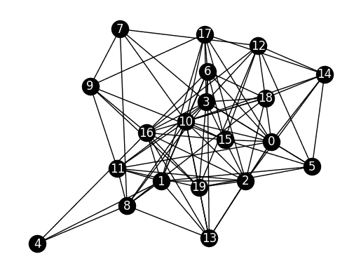
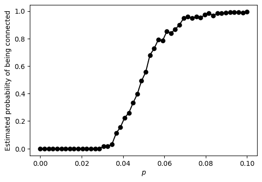
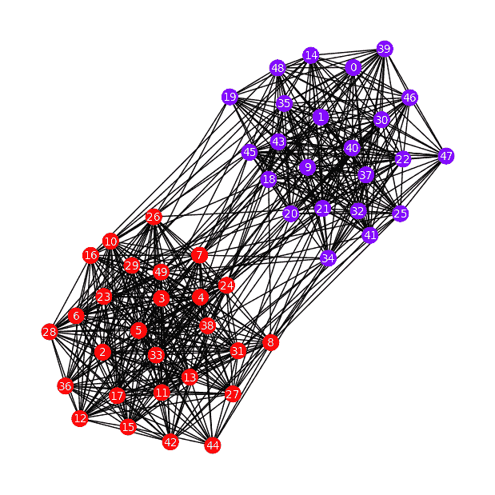
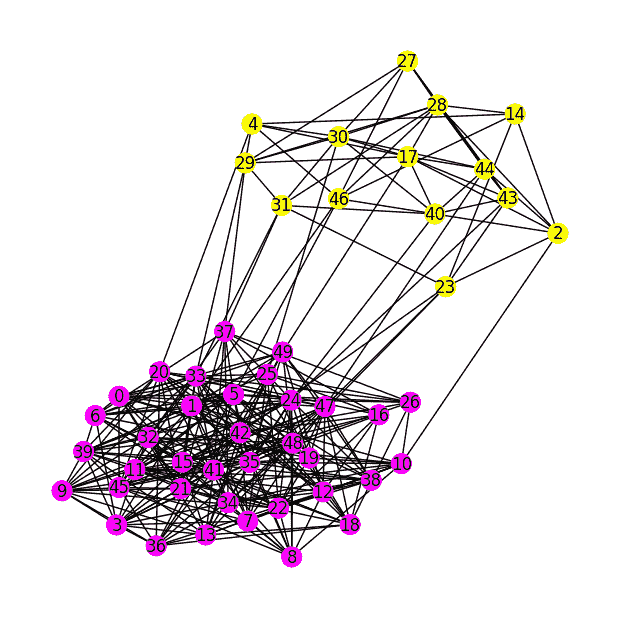
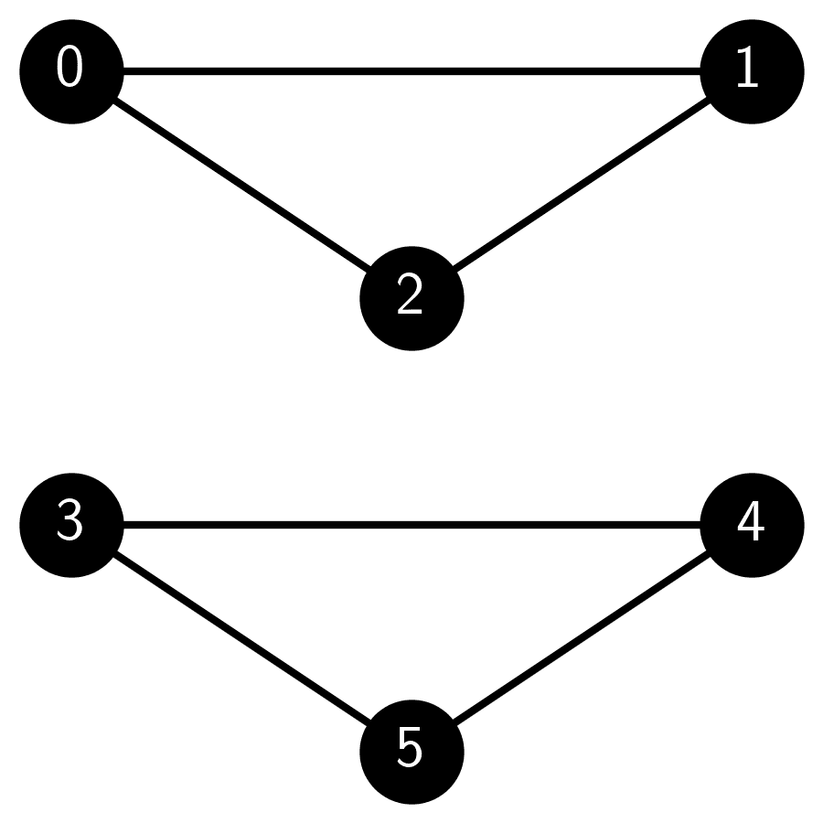

# 5.6\. 随机图和随机块模型

> 原文：[`mmids-textbook.github.io/chap05_specgraph/06_sbm/roch-mmids-specgraph-sbm.html`](https://mmids-textbook.github.io/chap05_specgraph/06_sbm/roch-mmids-specgraph-sbm.html)

测试一个算法的一种自然方式是在已知“真实情况”的模拟数据集上运行它。例如，在聚类中，我们使用了高斯混合模型；在那里，“真实情况”是从中生成数据点的混合成分。在网络分析背景下，什么是适当随机模型？

事实上，存在许多随机图的模型，即那些边是随机选择的图。具体使用哪一个取决于手头的任务。对于图划分，需要一个具有“预置划分”的图。随机块模型是这样的模型的一个典型例子。我们从更一般的设置开始。

## 5.6.1\. 非齐次随机图$$ \idx{非齐次随机图}\xdi$$#

生成随机图的一个简单方法是将每条边独立地包含在内。更确切地说，设 $V = [n]$ 是一个包含 $n$ 个顶点的集合。考虑一个对称矩阵 $M = (m_{i,j}) \in [0,1]^{n \times n}$，其元素在 $[0,1]$ 范围内任意取值。元素 $m_{i,j} = m_{j,i}$ 是边 $\{i,j\}$ 存在的概率（即 $\{i,j\} \in E$），独立于所有其他边。结果是具有随机邻接矩阵 $A = (A_{i,j}) \in \{0,1\}^{n \times n}$ 的随机图 $G = (V, E)$。这个模型被称为非齐次埃尔德什-雷尼（ER）随机图$\idx{非齐次埃尔德什-雷尼随机图}\xdi$。

注意到

$$ \E[A_{i,j}] = 1 \cdot m_{i,j} + 0 \cdot (1 - m_{i,j}) = m_{i,j}. $$

事实上，每个 $A_{i,j}$ 都是一个成功概率为 $m_{i,j}$ 的伯努利随机变量。换句话说，在矩阵形式中，我们有

$$ \E[A] = M, $$

即，$M$ 是期望邻接矩阵。特别注意的是，$M$ 是确定的，而 $A$ 是随机的（这就是为什么我们用小写字母表示 $M$，而用大写字母表示 $A$）。

一个重要的特殊情况是当 $m_{i,j} = m_{j,i} = p \in (0,1)$ 对于所有 $i \neq j$ 且 $m_{k,k} = 0$ 对于所有 $k$ 时获得。也就是说，两个不同顶点之间可能存在的每条边都以相同的概率 $p$ 存在。这个模型简单地被称为埃尔德什-雷尼（ER）随机图$\idx{埃尔德什-雷尼随机图}\xdi$。换句话说，

$$ \E[A] = M = p (J - I_{n \times n}), $$

其中 $J \in \mathbb{R}^{n \times n}$ 是全一矩阵。在这个计算中，我们减去单位矩阵以考虑到对角线是 $0$。

这个模型的研究性质非常完善。接下来，我们给出几个例子。对于事件 $\mathcal{F}$，指示随机变量 $\mathbf{1}_{\mathcal{F}}$ 在 $\mathcal{F}$ 发生时为 $1$，否则为 $0$。

**EXAMPLE:** 设 $G = (V, E)$ 为一个具有 $n$ 个顶点的 ER 图。参数 $p$ 可以被解释为边密度。实际上，让我们计算 $G$ 的期望边数。通过对所有对进行求和并使用期望的线性性，我们有

$$\begin{align*} \E[|E|] &= \E \left[\sum_{i < j} \mathbf{1}_{\{i,j\} \in E}\right]\\ &= \sum_{i < j} \E \left[\mathbf{1}_{\{i,j\} \in E}\right]\\ &= \binom{n}{2} p. \end{align*}$$

或者，换一种说法，我们已经证明了期望的边密度 $\E\left[|E|/\binom{n}{2}\right]$ 是 $p$。

类似的计算给出了期望的三角形数量。用 $T_3$ 表示 $G$ 中的三角形数量，即不同顶点 $i, j, k$ 的三元组数量，使得 $\{i,j\}, \{j,k\}, \{i,k\} \in E$（即它们之间所有的边都存在）。然后

$$\begin{align*} \E[|T_3|] &= \E \left[\sum_{i < j < k} \mathbf{1}_{\{i,j\}, \{j,k\}, \{i,k\} \in E}\right]\\ &= \E \left[\sum_{i < j < k} \mathbf{1}_{\{i,j\} \in E} \mathbf{1}_{\{j,k\} \in E} \mathbf{1}_{\{i,k\} \in E}\right]\\ &= \sum_{i < j < k} \E \left[\mathbf{1}_{\{i,j\} \in E}\right] \E \left[\mathbf{1}_{\{j,k\} \in E}\right] \E\left[\mathbf{1}_{\{i,k\} \in E}\right]\\ &= \binom{n}{3} p³. \end{align*}$$

我们在第三行使用了边的独立性。或者，换一种说法，我们已经证明了期望的三角形密度 $\E\left[|T_3|/\binom{n}{3}\right]$ 是 $p³$。 $\lhd$

我们使用 NetworkX 实现了非均匀 ER 图的生成。我们首先初始化一个伪随机数生成器 `rng`。为了确定 `i` 和 `j` 之间是否存在边，我们生成一个均匀随机变量 `rng.random()`（参见[`numpy.random.Generator.random`](https://numpy.org/doc/stable/reference/random/generated/numpy.random.Generator.random.html)），如果随机变量小于 $M[i, j]$，则使用 `G.add_edge(i, j)` 添加边——这是一个确实以期望概率发生的事件（检查它！）。

```py
def inhomogeneous_er_random_graph(rng, n, M):

    G = nx.Graph()
    G.add_nodes_from(range(n))
    for i in range(n):
        for j in range(i + 1, n):
            if rng.random() < M[i, j]:
                G.add_edge(i, j)

    return G 
```

**NUMERICAL CORNER:** 下面是一个示例用法。我们随机均匀地在 $0$ 和 $1$ 之间生成概率 $m_{i,j}$。

```py
seed = 535
rng = np.random.default_rng(seed)

n = 20
M = rng.random([n, n])
M = (M + M.T) / 2 # ensures symmetry of M (why?)

G = inhomogeneous_er_random_graph(rng, n, M) 
```

我们绘制了得到的图。

```py
nx.draw_networkx(G, node_color='black', font_color='white')
plt.axis('off')
plt.show() 
```



$\unlhd$

以下子例程生成一个 ER 图。

```py
def er_random_graph(rng, n, p):
    M = p * (np.ones((n, n)) - np.eye(n))
    return inhomogeneous_er_random_graph(rng, n, M) 
```

为了验证我们之前的计算，下面是估计具有固定参数 $p$ 的 ER 图边密度的例程的实现。回想一下，边密度定义为存在的边数除以可能的边数（即不同顶点对的数量）。该例程通过生成大量样本图、计算它们的边密度，然后取平均值来利用大数定律。

```py
def estimate_edge_density(rng, n, p, num_samples=100):

    total_edges = 0
    total_possible_edges = n * (n - 1) / 2

    for _ in range(num_samples):
        G = er_random_graph(rng, n, p)
        total_edges += G.number_of_edges()

    average_edges = total_edges / num_samples
    edge_density = average_edges / total_possible_edges
    return edge_density 
```

**NUMERICAL CORNER:** 在一个小例子中，我们确实得到边密度大约是 $p$。

```py
n = 10
p = 0.3
num_samples = 1000

estimated_density = estimate_edge_density(rng, n, p, num_samples)
print(f"Estimated edge density for an ER graph with n={n} and p={p}: {estimated_density}") 
```

```py
Estimated edge density for an ER graph with n=10 and p=0.3: 0.3004888888888889 
```

**试试看!** 修改上面的代码来估计三角形的密度。([在 Colab 中打开](https://colab.research.google.com/github/MMiDS-textbook/MMiDS-textbook.github.io/blob/main/just_the_code/roch_mmids_chap_specgraph_notebook.ipynb)) $\ddagger$

$\unlhd$

当 $n$（顶点数）很大时，随机图往往会表现出大规模的涌现行为。一个经典的例子是 ER 图中连接的概率。为了说明，下面是估计在一系列边密度 $p$（在 Claude 和 ChatGPT 的帮助下）上的概率的代码。

```py
def estimate_connected_probability(rng, n, p, num_samples=100):

    connected_count = 0

    for _ in range(num_samples):
        G = er_random_graph(rng, n, p)
        if nx.is_connected(G):
            connected_count += 1

    connected_probability = connected_count / num_samples
    return connected_probability

def plot_connected_probability(rng, n, p_values, num_samples=100):

    probabilities = []
    for p in p_values:
        prob = estimate_connected_probability(rng, n, p, num_samples)
        probabilities.append(prob)

    plt.figure(figsize=(6, 4))
    plt.plot(p_values, probabilities, marker='o', color='black')
    plt.xlabel('$p$'), plt.ylabel('Estimated probability of being connected')
    plt.show() 
```

**数值角:** 我们运行了`n`等于`100`的代码。你观察到了什么？

```py
n = 100
p_values = np.linspace(0, 0.1, 50)
num_samples = 250
plot_connected_probability(rng, n, p_values, num_samples) 
```



当 $p$ 很小时，连接的概率从 $0$ 开始，这并不奇怪，因为它意味着图中有相对较少的边。但是，当 $p$ 越过一个阈值时，那个概率会迅速增加到 $1$。这被称为 ER 图的相变。

可以严格证明，转换发生在大约 $p = \log n/n$。也就是说：

```py
np.log(n)/n 
```

```py
0.04605170185988092 
```

这与图一致。

**试试看!** 取一个更大的 `n` 会产生更尖锐的转换。自己试试。还应该尝试绘制阈值附近 $p$ 值增加时的一个随机样本。你观察到了什么？([在 Colab 中打开](https://colab.research.google.com/github/MMiDS-textbook/MMiDS-textbook.github.io/blob/main/just_the_code/roch_mmids_chap_specgraph_notebook.ipynb)) $\ddagger$

**试试看!** 许多其他属性也表现出这种尖锐的阈值行为。修改代码来估计图中是否存在大小为 4 的团。([在 Colab 中打开](https://colab.research.google.com/github/MMiDS-textbook/MMiDS-textbook.github.io/blob/main/just_the_code/roch_mmids_chap_specgraph_notebook.ipynb)) $\ddagger$

$\unlhd$

## 5.6.2\. 随机块模型#

我们回到最初的动力。我们如何创建一个具有植入划分的随机图？随机块模型（SBM）就是这样一种模型。在这里，我们假设 $[n]$ 被划分为两个不相交的集合 $C_1$ 和 $C_2$，称为块。如果顶点 $i$ 在块 $C_j$ 中，我们设置 $z(i) = j$。我们还使用矩阵 $Z \in \{0,1\}^{n \times 2}$ 对块分配进行编码，其中行 $i$ 是 $\mathbf{e}_j^T$，如果顶点 $i$ 被分配到块 $C_j$。

令 $b_{i,j} \in [0,1]$ 为块 $C_i$ 中的顶点和块 $C_j$ 中的顶点通过边连接的概率，独立于所有其他边。我们强制 $b_{1,2} = b_{2,1}$。我们在以下矩阵中收集这些概率

$$\begin{split} B = \begin{pmatrix} b_{1,1} & b_{1,2}\\ b_{2,1} & b_{2,2} \end{pmatrix}. \end{split}$$

根据我们的假设，矩阵 $B$ 是对称的。

我们通常取

$$ \min\{b_{1,1}, b_{2,2}\} > b_{1,2}, $$

即，边更可能在同一块中的顶点之间，而不是在不同块中的顶点之间。这对应于这样的直觉，在社会网络或其他类型的网络中，同一组（即，块）的成员比不同组的成员更频繁地相互互动。例如，同一社交圈内的朋友比圈外人更有可能相互连接。这与同质性的概念相关，该概念描述了个人与相似他人建立联系和建立关系的倾向。

这是非同质 ER 图模型的一个特例。相应的 $M$ 矩阵是什么？请注意，对于每个顶点对 $1 \leq i < j \leq n$，边 $\{i,j\}$ 以概率出现在 $E$ 中。

$$ m_{i,j} := b_{z(i), z(j)} = Z_{i,\cdot} B Z_{j,\cdot}^T $$

其中记住 $Z_{i,\cdot}$ 是矩阵 $Z$ 的第 $i$ 行。

以矩阵形式，这表示

$$ M = Z B Z^T. $$

因此，给定 $B$ 和 $Z$，我们可以生成一个 SBM，作为非同质 ER 图的特例。

我们实现了 SBM 模型。我们使用编号为 $0$ 和 $1$ 的块。

```py
def sbm_random_graph(rng, n, block_assignments, B):

    num_blocks = B.shape[0]
    Z = np.zeros((n, num_blocks))
    for i in range(n):
        Z[i, block_assignments[i]] = 1
    M = Z @ B @ Z.T

    return inhomogeneous_er_random_graph(rng, n, M) 
```

**数值角:** 这里是一个示例用法。我们首先随机选择一个块分配。具体来说，块是通过使用`numpy.random.Generator.choice`随机分配的。它通过将每个顶点以相等的概率分配给任一块，独立于所有其他选择来产生两个块。

```py
B = np.array([[0.8, 0.1], [0.1, 0.8]])

n = 50
block_assignments = rng.choice(2, n)

G = sbm_random_graph(rng, n, block_assignments, B) 
```

我们根据块分配用彩色节点绘制图。在这个布局中，“好的”切割非常明显。

```py
plt.figure(figsize=(6,6))
pos = nx.spring_layout(G)
nx.draw(G, pos, with_labels=True, node_color=block_assignments, cmap='rainbow',
        node_size=200, font_size=10, font_color='white')
plt.show() 
```



$\unlhd$

我们引入一个子例程，以如下方式随机分配块。设 $\beta_1, \beta_2 \in [0,1]$ 且 $\beta_1 + \beta_2 = 1$ 为顶点分别属于块 $1$ 和 $2$ 的概率。我们将这些概率收集在以下向量中

$$ \bbeta = (\beta_1, \beta_2). $$

我们根据分布 $\bbeta$ 为每个顶点 $1 \leq i \leq n$ 选择块 $z(i) \in \{1,2\}$，独立于所有其他顶点 $\neq i$。

```py
def generate_block_assignments(rng, n, beta):
    return rng.choice(len(beta), size=n, p=beta) 
```

**数值角:** 这里是一个示例用法。

```py
n = 50
beta = [0.33, 0.67]
B = np.array([[0.5, 0.03], [0.03, 0.4]])

block_assignments = generate_block_assignments(rng, n, beta)
G = sbm_random_graph(rng, n, block_assignments, B) 
```

注意这次块更加不平衡。

```py
plt.figure(figsize=(6,6))
pos = nx.spring_layout(G)
nx.draw(G, pos, with_labels=True, node_color=block_assignments, cmap=plt.cm.rainbow,
        node_size=200, font_size=10, font_color='white')
plt.show() 
```


为了测试我们的谱划分算法，我们运行了`spectral_cut2`，它确实恢复了真实情况。

```py
A = nx.adjacency_matrix(G).toarray()
s, sc = mmids.spectral_cut2(A)

plt.figure(figsize=(6,6))
mmids.viz_cut(G, s, pos, node_size=200, with_labels=True) 
```



$\unlhd$

以下代码计算错误分配顶点的比例。请注意，它考虑了两种分配，对应于交换标签 `0` 和 `1`，这些无法推断出来。

```py
def calculate_incorrect_fraction(block_assignments, inferred_s, inferred_sc):

    n = len(block_assignments)

    inferred_assignments = np.zeros(n)
    for i in inferred_s:
        inferred_assignments[i] = 0
    for i in inferred_sc:
        inferred_assignments[i] = 1

    incorrect_assignments_1 = np.sum(block_assignments != inferred_assignments)/n
    incorrect_assignments_2 = np.sum(block_assignments == inferred_assignments)/n

    return np.minimum(incorrect_assignments_1, incorrect_assignments_2) 
```

**数值角**：我们在之前的示例中确认了真实情况被完美恢复。

```py
fraction_incorrect = calculate_incorrect_fraction(block_assignments, s, sc)
print(f"Fraction of incorrectly assigned vertices: {fraction_incorrect}") 
```

```py
Fraction of incorrectly assigned vertices: 0.0 
```

预期如果块间边的概率接近块内边的概率，真实情况将更难恢复，这会使社区结构更加模糊。为了测试这个假设，我们通过显著增加块间概率修改了之前的示例。

```py
n = 100
beta = [0.55, 0.45]
B = np.array([[0.55, 0.25], [0.25, 0.45]])

block_assignments = generate_block_assignments(rng, n, beta)
G = sbm_random_graph(rng, n, block_assignments, B) 
```

我们运行了 `spectral_cut2`。这次它只部分地恢复了真实情况。

```py
A = nx.adjacency_matrix(G).toarray()
s, sc = mmids.spectral_cut2(A)
fraction_incorrect = calculate_incorrect_fraction(block_assignments, s, sc)
print(f"Fraction of incorrectly assigned vertices: {fraction_incorrect}") 
```

```py
Fraction of incorrectly assigned vertices: 0.22 
```

$\unlhd$

***自我评估测验*** *(有克莱德、盖米尼和 ChatGPT 的帮助)*

**1** 在随机块模型（SBM）中，$b_{i,j}$ 代表什么？

a) 顶点 $i$ 被分配到块 $j$ 的概率。

b) 任何两个顶点之间存在边的概率。

c) 块 $C_i$ 中的一个顶点和块 $C_j$ 中的一个顶点之间存在边的概率。

d) 顶点 $i$ 和顶点 $j$ 之间边的权重。

**2** 考虑以下使用 Python 中的 NetworkX 生成的图：



以下哪个模型可能生成了这个图？

a) 埃尔德什-雷尼（ER）随机图。

b) 具有两个社区的两个随机块模型（SBM）。

c) 具有两个大小相等的社区（即，$b_{1,1} = b_{2,2}$）的对称随机块模型（SSBM）。

d) 所有上述选项。

**3** 考虑一个具有 $n$ 个顶点和边概率 $p$ 的埃尔德什-雷尼（ER）随机图。图中边的期望数量是：

a) $n²p$

b) $\binom{n}{2}p$

c) $np$

d) $n(n-1)p$

**4** 考虑以下 Python 代码片段：

```py
n, p = 5, 0.4
rng = np.random.default_rng(123)
G = nx.Graph()
G.add_nodes_from(range(n))
for i in range(n):
    for j in range(i + 1, n):
        if rng.random() < p:
            G.add_edge(i, j) 
```

以下哪个选项最能描述由该代码生成的图？

a) 一个具有 $n=5$ 个顶点和边概率 $p=0.4$ 的埃尔德什-雷尼（ER）随机图。

b) 具有 $n=5$ 个顶点和块内概率 $p=0.4$ 的随机块模型（SBM）。

c) 具有 $n=5$ 个顶点和块间概率 $p=0.4$ 的对称随机块模型（SSBM）。

d) 一个具有 $n=5$ 个顶点和由矩阵 $M$ 给定的边概率的非齐次埃尔德什-雷尼（ER）随机图。

**5** 在随机块模型中，如果块间连接概率 $b_{1,2}$ 接近块内连接概率 $b_{1,1}$，恢复社区结构难度会发生什么变化？

a) 这会变得更容易。

b) 它保持不变。

c) 这会变得更难。

d) 以上都不是。

1 的答案：c. 理由：文本将 $b_{i,j}$ 定义为“块 $C_i$ 中的一个顶点和块 $C_j$ 中的一个顶点通过边连接的概率。”

答案 2：d. 证明：该图由两个大小为 3 的完全子图（团）组成，一个由顶点 0、1 和 2 组成，另一个由顶点 3、4 和 5 组成。两个团之间没有边。在任何 ER、SBM 或 SSBM 随机图模型中，所有边的概率都在 $(0,1)$ 范围内，它都有发生的正概率。

答案 3：b. 证明：文本中提到：“让我们计算边的期望数量 $G$。通过对所有对求和并使用期望的线性，我们有 $\mathbb{E}[|E|] = \mathbb{E} [\sum_{i<j} \mathbf{1}_{\{i,j\} \in E}] = \sum_{i<j} \mathbb{E} [\mathbf{1}_{\{i,j\} \in E}] = \binom{n}{2}p$.”

答案 4：a. 证明：该代码生成一个具有 $n=5$ 个顶点的 ER 随机图，其中每条边独立地以概率 $p=0.4$ 包含在内。这从嵌套循环结构和添加边的条件 `if rng.random() < p` 中可以明显看出。

答案 5：c. 证明：当块间连接概率 $b_{1,2}$ 接近块内连接概率 $b_{1,1}$ 时，社区结构变得难以恢复，因为块之间的区别不太明显。

## 5.6.1\. 非齐次 Erdős-Rényi 随机图#

生成随机图的一个简单方法是将每条边独立地包含在内。更确切地说，设 $V = [n]$ 是一个包含 $n$ 个顶点的集合。考虑一个具有任意 $[0,1]$ 范围内条目的对称矩阵 $M = (m_{i,j}) \in [0,1]^{n \times n}$。条目 $m_{i,j} = m_{j,i}$ 是边 $\{i,j\}$ 存在的概率（即 $\{i,j\} \in E$），独立于所有其他边。结果是具有随机邻接矩阵 $A = (A_{i,j}) \in \{0,1\}^{n \times n}$ 的随机图 $G = (V, E)$。这个模型被称为非齐次 Erdős-Rényi (ER) 随机图$\idx{inhomogeneous Erdős-Rényi random graph}\xdi$。

观察：

$$ \E[A_{i,j}] = 1 \cdot m_{i,j} + 0 \cdot (1 - m_{i,j}) = m_{i,j}. $$

确实，每个条目 $A_{i,j}$ 是一个成功概率为 $m_{i,j}$ 的伯努利随机变量。换句话说，在矩阵形式中，我们有

$$ \E[A] = M, $$

换句话说，$M$ 是期望邻接矩阵。特别注意的是，$M$ 是确定的，而 $A$ 是随机的（这就是为什么我们用小写字母表示 $M$，而用大写字母表示 $A$）。

当 $m_{i,j} = m_{j,i} = p \in (0,1)$ 对于所有 $i \neq j$ 且 $m_{k,k} = 0$ 对于所有 $k$ 时，得到一个重要的特殊情况。也就是说，两个不同顶点之间每个可能的边都以相同的概率 $p$ 存在。这个模型简单地称为 Erdős-Rényi (ER) 随机图$\idx{Erdős-Rényi random graph}\xdi$。

$$ \E[A] = M = p (J - I_{n \times n}), $$

其中 $J \in \mathbb{R}^{n \times n}$ 是全 1 矩阵。在这个计算中，我们减去单位矩阵以考虑对角线是 $0$ 的这一事实。

这个模型的性质已经被研究得很透彻了。接下来我们给出几个例子。对于一个事件 $\mathcal{F}$，指示随机变量 $\mathbf{1}_{\mathcal{F}}$ 在 $\mathcal{F}$ 发生时取值为 $1$，否则为 $0$。

**示例：** 设 $G = (V, E)$ 为一个具有 $n$ 个顶点的 ER 图。参数 $p$ 可以解释为边密度。实际上，让我们计算 $G$ 的期望边数。通过对所有对进行求和并使用期望的线性性质，我们有

$$\begin{align*} \E[|E|] &= \E \left[\sum_{i < j} \mathbf{1}_{\{i,j\} \in E}\right]\\ &= \sum_{i < j} \E \left[\mathbf{1}_{\{i,j\} \in E}\right]\\ &= \binom{n}{2} p. \end{align*}$$

或者，换一种说法，我们已经证明了期望边密度 $\E\left[|E|/\binom{n}{2}\right]$ 是 $p$。

类似的计算给出了期望三角形数。用 $T_3$ 表示 $G$ 中的三角形数，即满足 $\{i,j\}, \{j,k\}, \{i,k\} \in E$（即它们之间所有边都存在）的不同顶点 $i, j, k$ 的三元组数量。那么

$$\begin{align*} \E[|T_3|] &= \E \left[\sum_{i < j < k} \mathbf{1}_{\{i,j\}, \{j,k\}, \{i,k\} \in E}\right]\\ &= \E \left[\sum_{i < j < k} \mathbf{1}_{\{i,j\} \in E} \mathbf{1}_{\{j,k\} \in E} \mathbf{1}_{\{i,k\} \in E}\right]\\ &= \sum_{i < j < k} \E \left[\mathbf{1}_{\{i,j\} \in E}\right] \E \left[\mathbf{1}_{\{j,k\} \in E}\right] \E\left[\mathbf{1}_{\{i,k\} \in E}\right]\\ &= \binom{n}{3} p³. \end{align*}$$

我们在第三行使用了边的独立性。或者，换一种说法，我们已经证明了期望三角形密度 $\E\left[|T_3|/\binom{n}{3}\right]$ 是 $p³$。$\lhd$

我们使用 NetworkX 实现了非均匀 ER 图的生成。我们首先初始化一个伪随机数生成器 `rng`。为了确定边 `i` 和 `j` 之间是否存在，我们生成一个均匀随机变量 `rng.random()`（参见[`numpy.random.Generator.random`](https://numpy.org/doc/stable/reference/random/generated/numpy.random.Generator.random.html)），如果随机变量小于 `M[i, j]`，则使用 `G.add_edge(i, j)` 添加边——这是一个确实以期望概率发生的事件（检查它！）。

```py
def inhomogeneous_er_random_graph(rng, n, M):

    G = nx.Graph()
    G.add_nodes_from(range(n))
    for i in range(n):
        for j in range(i + 1, n):
            if rng.random() < M[i, j]:
                G.add_edge(i, j)

    return G 
```

**数值角落：** 这里是一个示例用法。我们随机均匀地在 $0$ 和 $1$ 之间生成概率 $m_{i,j}$。

```py
seed = 535
rng = np.random.default_rng(seed)

n = 20
M = rng.random([n, n])
M = (M + M.T) / 2 # ensures symmetry of M (why?)

G = inhomogeneous_er_random_graph(rng, n, M) 
```

我们绘制了生成的图。

```py
nx.draw_networkx(G, node_color='black', font_color='white')
plt.axis('off')
plt.show() 
```


$\unlhd$

下面的子程序生成一个 ER 图。

```py
def er_random_graph(rng, n, p):
    M = p * (np.ones((n, n)) - np.eye(n))
    return inhomogeneous_er_random_graph(rng, n, M) 
```

为了确认我们之前的计算，下面是实现一个例程来估计具有固定参数 $p$ 的 ER 图的边密度。回想一下，边密度定义为现有边的数量除以可能边的数量（即不同顶点对的数量）。该例程通过生成大量样本图、计算它们的边密度，然后取平均值来利用大数定律。

```py
def estimate_edge_density(rng, n, p, num_samples=100):

    total_edges = 0
    total_possible_edges = n * (n - 1) / 2

    for _ in range(num_samples):
        G = er_random_graph(rng, n, p)
        total_edges += G.number_of_edges()

    average_edges = total_edges / num_samples
    edge_density = average_edges / total_possible_edges
    return edge_density 
```

**数值角落:** 在一个小例子中，我们确实得到了边的密度大约是 $p$。

```py
n = 10
p = 0.3
num_samples = 1000

estimated_density = estimate_edge_density(rng, n, p, num_samples)
print(f"Estimated edge density for an ER graph with n={n} and p={p}: {estimated_density}") 
```

```py
Estimated edge density for an ER graph with n=10 and p=0.3: 0.3004888888888889 
```

**TRY IT!** 修改上面的代码以估计三角形的密度。([在 Colab 中打开](https://colab.research.google.com/github/MMiDS-textbook/MMiDS-textbook.github.io/blob/main/just_the_code/roch_mmids_chap_specgraph_notebook.ipynb)) $\ddagger$

$\unlhd$

当 $n$（顶点的数量）很大时，随机图往往会表现出大规模的涌现行为。一个经典的例子是 ER 图中连接的概率。为了说明，下面是估计在一系列边密度 $p$（在 Claude 和 ChatGPT 的帮助下）范围内的概率的代码。

```py
def estimate_connected_probability(rng, n, p, num_samples=100):

    connected_count = 0

    for _ in range(num_samples):
        G = er_random_graph(rng, n, p)
        if nx.is_connected(G):
            connected_count += 1

    connected_probability = connected_count / num_samples
    return connected_probability

def plot_connected_probability(rng, n, p_values, num_samples=100):

    probabilities = []
    for p in p_values:
        prob = estimate_connected_probability(rng, n, p, num_samples)
        probabilities.append(prob)

    plt.figure(figsize=(6, 4))
    plt.plot(p_values, probabilities, marker='o', color='black')
    plt.xlabel('$p$'), plt.ylabel('Estimated probability of being connected')
    plt.show() 
```

**数值角落:** 我们运行了 `n` 等于 `100` 的代码。你观察到了什么？

```py
n = 100
p_values = np.linspace(0, 0.1, 50)
num_samples = 250
plot_connected_probability(rng, n, p_values, num_samples) 
```


当 $p$ 很小时，连接的概率从 $0$ 开始，这并不令人惊讶，因为它意味着图具有相对较少的边。但是，当 $p$ 跨越阈值时，这个概率会迅速增加到 $1$。这被称为 ER 图的相变。

可以严格证明，相变发生在大约 $p = \log n/n$。也就是说：

```py
np.log(n)/n 
```

```py
0.04605170185988092 
```

这与图表一致。

**TRY IT!** 选择更大的 `n` 会产生更尖锐的过渡。自己试一试。同时尝试绘制一个随机样本，观察 $p$ 在阈值附近的增加值。你观察到了什么？([在 Colab 中打开](https://colab.research.google.com/github/MMiDS-textbook/MMiDS-textbook.github.io/blob/main/just_the_code/roch_mmids_chap_specgraph_notebook.ipynb)) $\ddagger$

**TRY IT!** 许多其他属性也表现出这样的尖锐阈值行为。修改代码以估计图中存在大小为 4 的团的概率。([在 Colab 中打开](https://colab.research.google.com/github/MMiDS-textbook/MMiDS-textbook.github.io/blob/main/just_the_code/roch_mmids_chap_specgraph_notebook.ipynb)) $\ddagger$

$\unlhd$

## 5.6.2\. 随机块模型#

我们回到我们的原始动机。我们如何创建一个具有植入划分的随机图？随机块模型（SBM）就是这样一种模型。在这里，我们想象 $[n]$ 被划分为两个不相交的集合 $C_1$ 和 $C_2$，称为块。如果顶点 $i$ 在块 $C_j$ 中，我们设置 $z(i) = j$。我们还使用矩阵 $Z \in \{0,1\}^{n \times 2}$ 对块分配进行编码，其中行 $i$ 是 $\mathbf{e}_j^T$，如果顶点 $i$ 被分配到块 $C_j$。

令 $b_{i,j} \in [0,1]$ 为顶点在块 $C_i$ 和顶点在块 $C_j$ 之间通过边连接的概率，独立于所有其他边。我们强制 $b_{1,2} = b_{2,1}$。我们将这些概率收集在以下矩阵中

$$\begin{split} B = \begin{pmatrix} b_{1,1} & b_{1,2}\\ b_{2,1} & b_{2,2} \end{pmatrix}. \end{split}$$

根据我们的假设，矩阵 $B$ 是对称的。

我们通常取

$$ \min\{b_{1,1}, b_{2,2}\} > b_{1,2}, $$

即，边更可能在同一块中的顶点之间，而不是在不同块中的顶点之间。这对应于这样的直觉：在社会网络或其他类型的网络中，同一组（即，块）的成员比不同组的成员更频繁地相互互动。例如，同一社交圈内的朋友比圈外人更有可能相互连接。这与同质性的概念相关，该概念描述了个人与相似他人建立联系和建立关系的倾向。

这是非同质 ER 图模型的一个特例。相应的 $M$ 矩阵是什么？请注意，对于每个顶点对 $1 \leq i < j \leq n$，边 $\{i,j\}$ 在 $E$ 中出现的概率

$$ m_{i,j} := b_{z(i), z(j)} = Z_{i,\cdot} B Z_{j,\cdot}^T $$

其中，回忆一下 $Z_{i,\cdot}$ 是矩阵 $Z$ 的第 $i$ 行。

以矩阵形式，这意味着

$$ M = Z B Z^T. $$

因此，给定 $B$ 和 $Z$，我们可以生成一个 SBM，作为非同质 ER 图的特例。

我们实现了 SBM 模型。我们使用编号为 $0$ 和 $1$ 的块。

```py
def sbm_random_graph(rng, n, block_assignments, B):

    num_blocks = B.shape[0]
    Z = np.zeros((n, num_blocks))
    for i in range(n):
        Z[i, block_assignments[i]] = 1
    M = Z @ B @ Z.T

    return inhomogeneous_er_random_graph(rng, n, M) 
```

**数值角:** 这里有一个示例用法。我们首先随机选择一个块分配。具体来说，块是通过使用[`numpy.random.Generator.choice`](https://numpy.org/doc/stable/reference/random/generated/numpy.random.Generator.choice.html#numpy.random.Generator.choice)随机分配的。它通过将每个顶点以相等的概率分配到任一块，独立于所有其他选择，产生两个块。

```py
B = np.array([[0.8, 0.1], [0.1, 0.8]])

n = 50
block_assignments = rng.choice(2, n)

G = sbm_random_graph(rng, n, block_assignments, B) 
```

我们根据块分配用彩色节点绘制图形。在这个布局中，“好的”切割非常明显。

```py
plt.figure(figsize=(6,6))
pos = nx.spring_layout(G)
nx.draw(G, pos, with_labels=True, node_color=block_assignments, cmap='rainbow',
        node_size=200, font_size=10, font_color='white')
plt.show() 
```


$\unlhd$

我们引入一个子例程，随机分配块，如下所示。设 $\beta_1, \beta_2 \in [0,1]$ 且 $\beta_1 + \beta_2 = 1$ 是顶点分别属于块 $1$ 和 $2$ 的概率。我们将这些概率收集在以下向量中

$$ \bbeta = (\beta_1, \beta_2). $$

我们根据分布 $\bbeta$ 为每个顶点 $1 \leq i \leq n$ 选择块 $z(i) \in \{1,2\}$，独立于所有其他顶点 $\neq i$。

```py
def generate_block_assignments(rng, n, beta):
    return rng.choice(len(beta), size=n, p=beta) 
```

**数值角:** 这里是一个示例用法。

```py
n = 50
beta = [0.33, 0.67]
B = np.array([[0.5, 0.03], [0.03, 0.4]])

block_assignments = generate_block_assignments(rng, n, beta)
G = sbm_random_graph(rng, n, block_assignments, B) 
```

观察到这次块更加不平衡。

```py
plt.figure(figsize=(6,6))
pos = nx.spring_layout(G)
nx.draw(G, pos, with_labels=True, node_color=block_assignments, cmap=plt.cm.rainbow,
        node_size=200, font_size=10, font_color='white')
plt.show() 
```


为了测试我们的谱划分算法，我们运行 `spectral_cut2`，它确实恢复了基真值。

```py
A = nx.adjacency_matrix(G).toarray()
s, sc = mmids.spectral_cut2(A)

plt.figure(figsize=(6,6))
mmids.viz_cut(G, s, pos, node_size=200, with_labels=True) 
```


$\unlhd$

以下代码计算了错误分配顶点的比例。请注意，它考虑了 *两个* 分配，对应于交换标签 `0` 和 `1`，这些无法推断出来。

```py
def calculate_incorrect_fraction(block_assignments, inferred_s, inferred_sc):

    n = len(block_assignments)

    inferred_assignments = np.zeros(n)
    for i in inferred_s:
        inferred_assignments[i] = 0
    for i in inferred_sc:
        inferred_assignments[i] = 1

    incorrect_assignments_1 = np.sum(block_assignments != inferred_assignments)/n
    incorrect_assignments_2 = np.sum(block_assignments == inferred_assignments)/n

    return np.minimum(incorrect_assignments_1, incorrect_assignments_2) 
```

**数值角:** 我们在我们的前一个示例中确认了基真值被完美恢复。

```py
fraction_incorrect = calculate_incorrect_fraction(block_assignments, s, sc)
print(f"Fraction of incorrectly assigned vertices: {fraction_incorrect}") 
```

```py
Fraction of incorrectly assigned vertices: 0.0 
```

如果块之间的边概率接近块内的边概率，则预期基真值更难恢复，这使得社区结构更加模糊。为了测试这个假设，我们通过显著增加块间概率修改了先前的示例。

```py
n = 100
beta = [0.55, 0.45]
B = np.array([[0.55, 0.25], [0.25, 0.45]])

block_assignments = generate_block_assignments(rng, n, beta)
G = sbm_random_graph(rng, n, block_assignments, B) 
```

我们运行 `spectral_cut2`。这次只部分恢复了基真值。

```py
A = nx.adjacency_matrix(G).toarray()
s, sc = mmids.spectral_cut2(A)
fraction_incorrect = calculate_incorrect_fraction(block_assignments, s, sc)
print(f"Fraction of incorrectly assigned vertices: {fraction_incorrect}") 
```

```py
Fraction of incorrectly assigned vertices: 0.22 
```

$\unlhd$

***自我评估测验*** *(有 Claude、Gemini 和 ChatGPT 的帮助)*

**1** 在随机块模型（SBM）中，$b_{i,j}$ 代表什么？

a) 顶点 $i$ 被分配到块 $j$ 的概率。

b) 任何两个顶点之间存在边的概率。

c) 在块 $C_i$ 中的一个顶点和块 $C_j$ 中的一个顶点之间存在边的概率。

d) 顶点 $i$ 和顶点 $j$ 之间边的权重。

**2** 考虑以下使用 Python 中的 NetworkX 生成的图：


以下哪个模型可能生成了这个图？

a) 一个具有 $n=5$ 个顶点和边概率 $p=0.4$ 的埃尔德什-雷尼（ER）随机图。

b) 一个具有两个社区的随机块模型（SBM）。

c) 一个具有两个大小相等的社区（即，其中 $b_{1,1} = b_{2,2}$）的对称随机块模型（SSBM）。

d) 所有上述模型。

**3** 考虑一个具有 $n$ 个顶点和边概率 $p$ 的埃尔德什-雷尼（Erdős-Rényi，ER）随机图。图中边的期望数量是：

a) $n²p$

b) $\binom{n}{2}p$

c) $np$

d) $n(n-1)p$

**4** 考虑以下 Python 代码片段：

```py
n, p = 5, 0.4
rng = np.random.default_rng(123)
G = nx.Graph()
G.add_nodes_from(range(n))
for i in range(n):
    for j in range(i + 1, n):
        if rng.random() < p:
            G.add_edge(i, j) 
```

以下哪个选项最能描述由这段代码生成的图？

a) 一个具有 $n=5$ 个顶点和边概率 $p=0.4$ 的埃尔德什-雷尼（ER）随机图。

b) 一个具有 $n=5$ 个顶点和块内概率 $p=0.4$ 的随机块模型 (SBM)。

c) 一个具有 $n=5$ 个顶点和块间概率 $p=0.4$ 的对称随机块模型 (SSBM)。

d) 一个具有 $n=5$ 个顶点和由矩阵 $M$ 给定的边概率的非齐次 Erdős-Rényi (ER) 随机图。

**5** 在随机块模型中，如果块间连接概率 $b_{1,2}$ 接近块内连接概率 $b_{1,1}$，恢复社区结构难度会发生什么变化？

a) 它变得更简单。

b) 它保持不变。

c) 它变得更难。

d) 以上皆非。

答案 1：c. 证明：文本将 $b_{i,j}$ 定义为“块 $C_i$ 中的一个顶点和块 $C_j$ 中的一个顶点通过边相连的概率。”

答案 2：d. 证明：该图由两个大小为 3 的完全子图（完全子图）组成，一个由顶点 0、1 和 2 组成，另一个由顶点 3、4 和 5 组成。两个子图之间没有边。在任何 ER、SBM 或 SSBM 随机图模型中，所有边的概率都在 $(0,1)$ 范围内，它都有发生的正概率。

答案 3：b. 证明：文本指出：“让我们计算图 $G$ 的期望边数。通过对所有对求和并使用期望的线性性质，我们有 $\mathbb{E}[|E|] = \mathbb{E} [\sum_{i<j} \mathbf{1}_{\{i,j\} \in E}] = \sum_{i<j} \mathbb{E} [\mathbf{1}_{\{i,j\} \in E}] = \binom{n}{2}p$.”

答案 4：a. 证明：代码生成一个具有 $n=5$ 个顶点的 ER 随机图，其中每条边独立地以概率 $p=0.4$ 包含。这可以从嵌套循环结构和添加边的条件 `if rng.random() < p` 中看出。

答案 5：c. 证明：当块间连接概率 $b_{1,2}$ 接近块内连接概率 $b_{1,1}$ 时，社区结构变得难以恢复，因为块之间的区别变得不那么明显。
