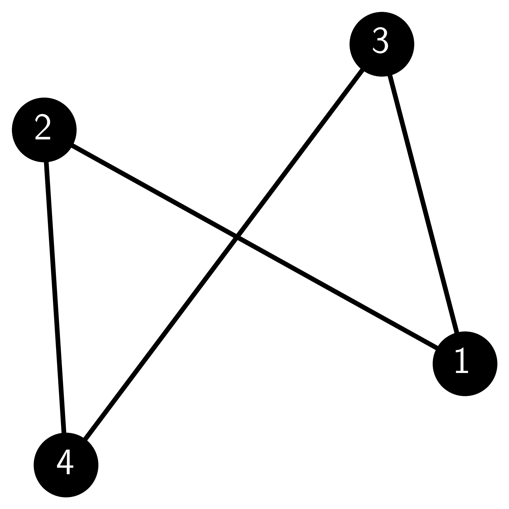
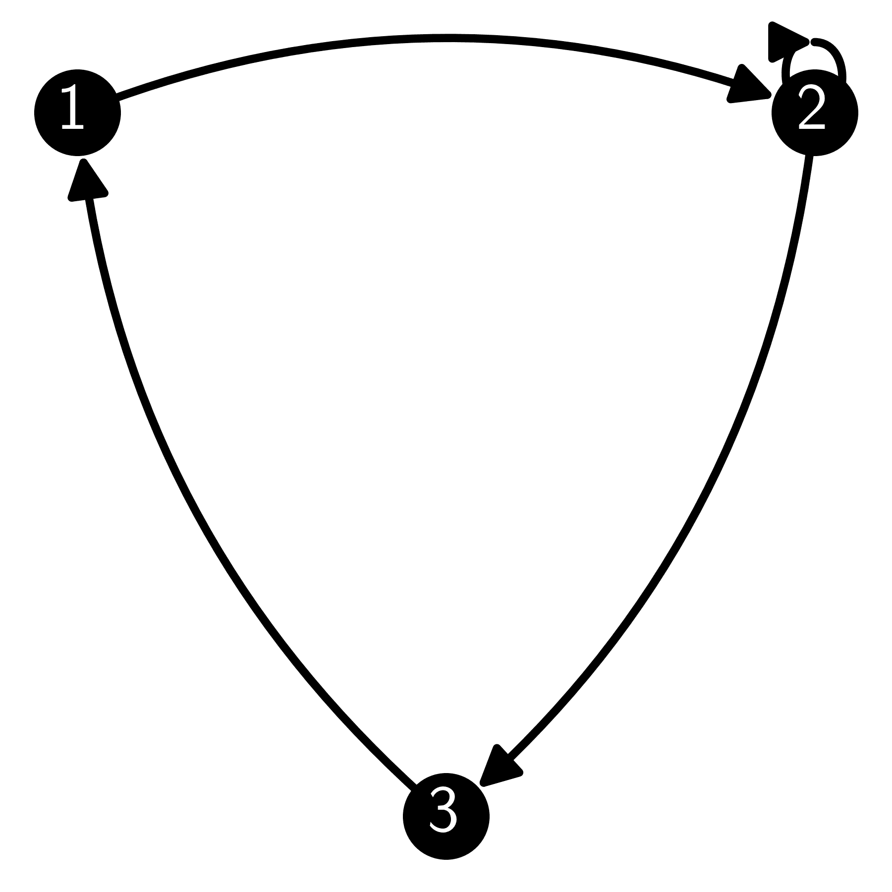
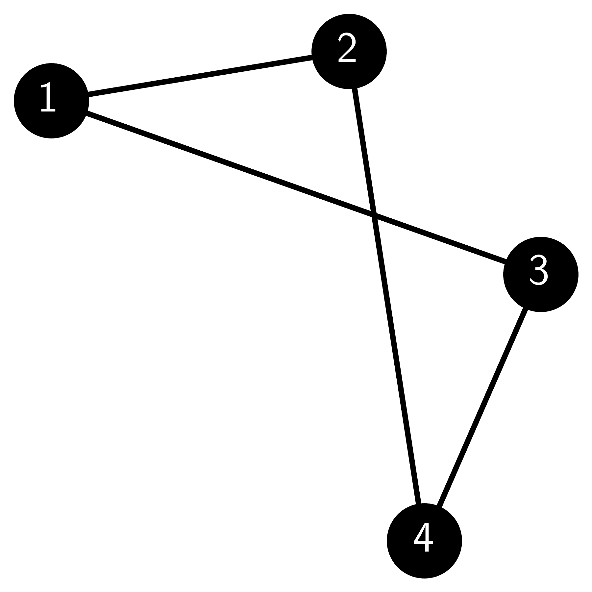
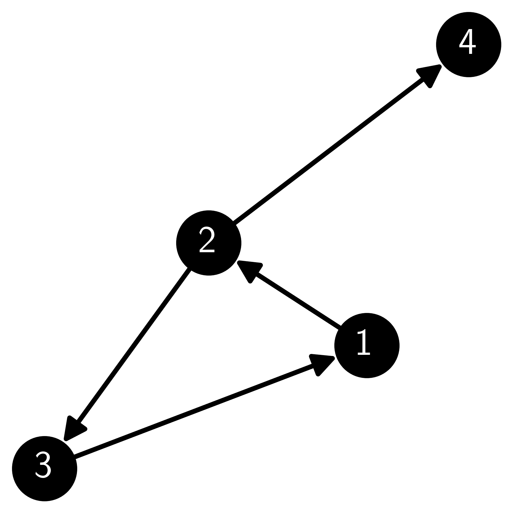
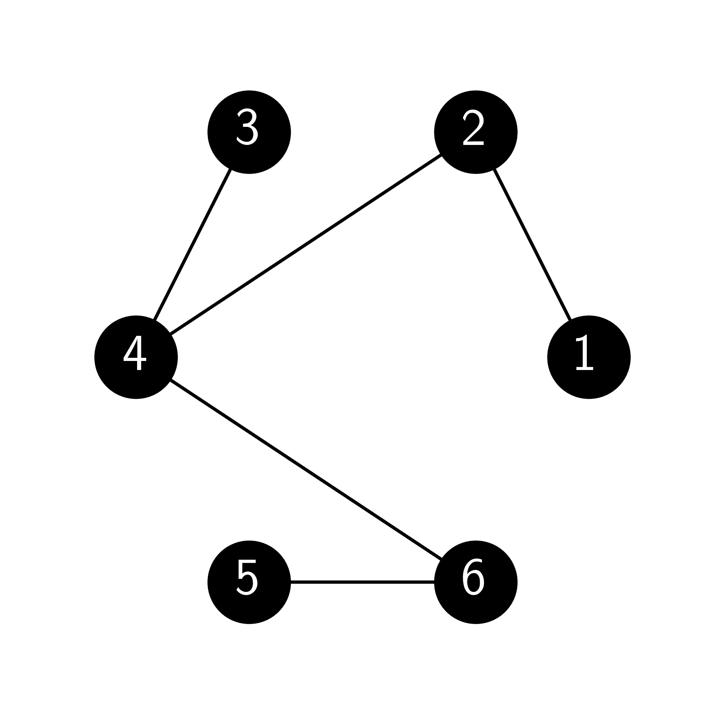
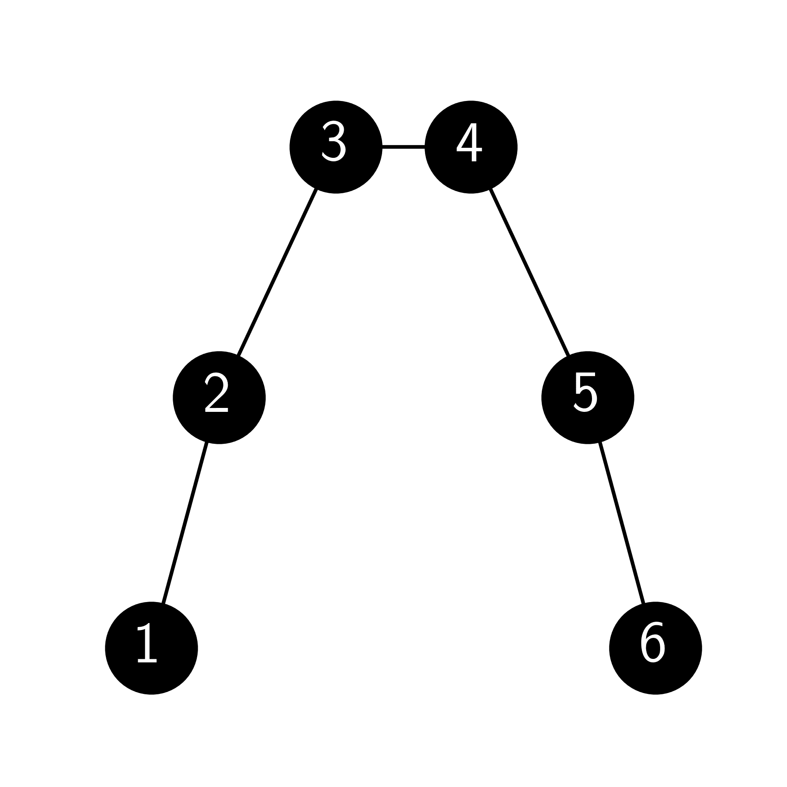
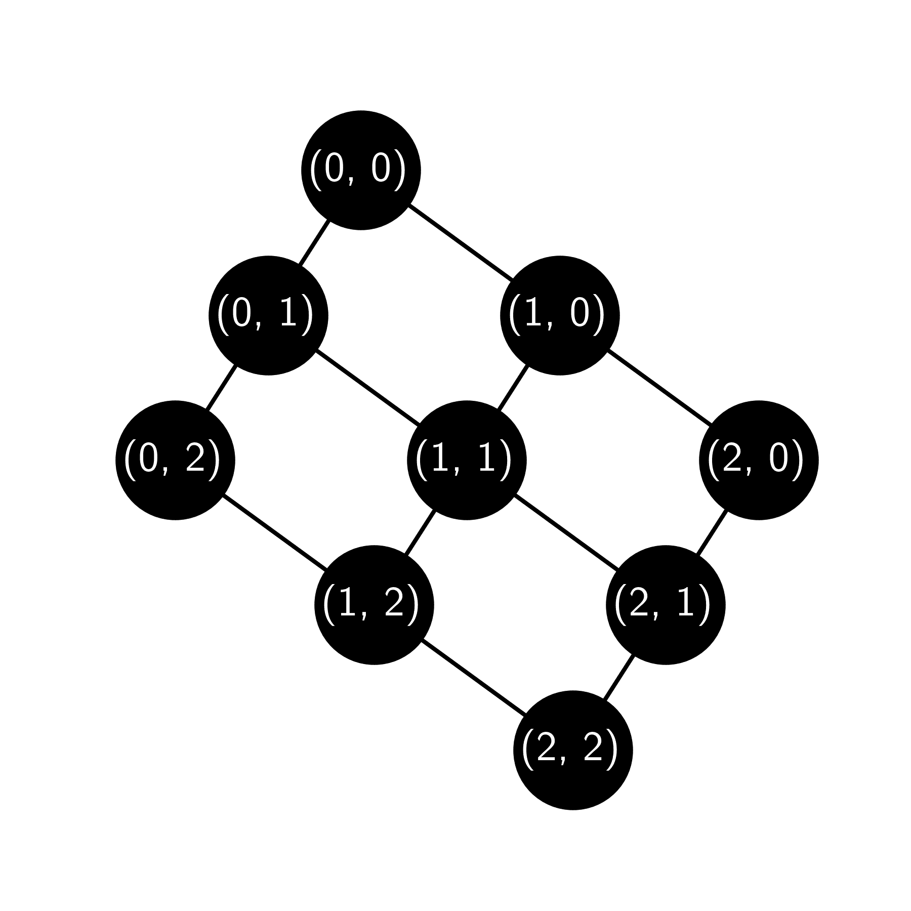

# 5.7\. 练习

> 原文：[`mmids-textbook.github.io/chap05_specgraph/exercises/roch-mmids-specgraph-exercises.html`](https://mmids-textbook.github.io/chap05_specgraph/exercises/roch-mmids-specgraph-exercises.html)

## 5.7.1\. 热身练习表#

*(在 Claude、Gemini 和 ChatGPT 的帮助下)*

**第 5.2 节**

**E5.2.1** 对于下面的图，写出顶点集合 $V$ 和边集合 $E$。

**E5.2.2** 对于 E5.2.1 中的图，写出顶点 1 的邻域 $N(1)$ 和度数 $\delta(1)$。

**E5.2.3** 对于 E5.2.1 中的图，找到顶点 1 和 4 之间的路径，并计算其长度。

**E5.2.4** 对于下面的有向图，写出邻接矩阵 $A$。

**E5.2.5** 对于 E5.2.4 中的有向图，写出顶点 2 的入度 $\delta^-(2)$ 和出度 $\delta^+(2)$。

**E5.2.6** 考虑一个无向图 $G$，其顶点集合 $V = \{1, 2, 3, 4\}$ 和边集合 $E = \{\{1, 2\}, \{2, 3\}, \{3, 4\}, \{4, 1\}\}$。计算每个顶点的度数。

**E5.2.7** 确定具有顶点集合 $V = \{1, 2, 3, 4\}$ 和边集合 $E = \{\{1, 2\}, \{2, 3\}, \{3, 4\}\}$ 的无向图 $G$ 是否连通。

**E5.2.8** 为具有顶点集合 $V = \{1, 2, 3\}$ 和边集合 $E = \{\{1, 2\}, \{2, 3\}, \{1, 3\}\}$ 的无向图 $G$ 写出拉普拉斯矩阵 $L$。

**E5.2.9** 给定一个具有顶点集合 $V = \{1, 2, 3, 4\}$ 和边集合 $E = \{\{1, 2\}, \{2, 3\}, \{3, 4\}, \{4, 1\}\}$ 的无向图 $G$，计算其连通分量的数量。

**E5.2.10** 考虑以下图：

给出此图的邻接矩阵 $A$。

**E5.2.11** 考虑与 E5.2.10 中相同的图。给出其关联矩阵 $B$。

**E5.2.12** 考虑以下有向图：

给出此图的邻接矩阵 $A$。

**E5.2.13** 考虑与 E5.2.12 中相同的有向图。给出其关联矩阵 $B$。

**E5.2.14** 给定具有顶点集合 $V = \{1, 2, 3\}$ 和有向边集合 $E = \{(1, 2), (2, 3), (3, 1)\}$ 的有向图 $G$，计算每个顶点的出度和入度。

**E5.2.15** 如果一个图的所有顶点都具有度数 $d$，则称该图为 $d$-正则图。对于哪个 $d$ 值，Petersen 图是 $d$-正则的？

**第 5.3 节**

**E5.3.1** 设 $A = \begin{pmatrix} 5 & 3 \\ 3 & 5 \end{pmatrix}$。找到一个矩阵 $W$，其列构成 $\mathbb{R}²$ 的一个正交基，并且使得 $W^T A W$ 是对角矩阵。

**E5.3.2** 设 $A = \begin{pmatrix} 3 & 1 \\ 1 & 3 \end{pmatrix}$。对于 $\mathbf{u} = \begin{pmatrix} 1 \\ 2 \end{pmatrix}$，找到二次型 $\langle \mathbf{u}, A \mathbf{u} \rangle$。

**E5.3.3** 给定一个对称矩阵 $A = \begin{pmatrix} 3 & 1 \\ 1 & 2 \end{pmatrix}$ 和向量 $\mathbf{u} = \begin{pmatrix} \frac{\sqrt{3}}{2} \\ \frac{1}{2} \end{pmatrix}$，计算 $\mathbf{u}$ 的雷利商 $\mathcal{R}_A(\mathbf{u})$。

**E5.3.4** 设 $A = \begin{pmatrix} 3 & 1 \\ 1 & 3 \end{pmatrix}$。计算 $\mathbf{u} = \begin{pmatrix} 1 \\ 1 \end{pmatrix}$ 的雷利商 $\mathcal{R}_A(\mathbf{u})$。

**E5.3.5** 给定一个对称矩阵 $A = \begin{pmatrix} 2 & -1 \\ -1 & 2 \end{pmatrix}$，找到 $A$ 的特征值和特征向量，并验证最大的特征值 $\lambda_1$ 满足变分特征 $\lambda_1 = \max_{\mathbf{u} \neq 0} \mathcal{R}_A(\mathbf{u})$。

**E5.3.6** 给定一个对称矩阵 $A = \begin{pmatrix} 4 & 2 \\ 2 & 1 \end{pmatrix}$，找到 $A$ 的特征值和特征向量，并验证最小的特征值 $\lambda_2$ 满足变分特征 $\lambda_2 = \min_{\mathbf{u} \neq 0} \mathcal{R}_A(\mathbf{u})$。

**E5.3.7** 给定一个对称矩阵 $A = \begin{pmatrix} 1 & 2 & 0 \\ 2 & 1 & 0 \\ 0 & 0 & 3 \end{pmatrix}$ 及其特征向量 $\mathbf{v}_1 = \frac{1}{\sqrt{2}} \begin{pmatrix} 1 \\ 1 \\ 0 \end{pmatrix}$，$\mathbf{v}_2 = \frac{1}{\sqrt{2}} \begin{pmatrix} -1 \\ 1 \\ 0 \end{pmatrix}$，$\mathbf{v}_3 = \begin{pmatrix} 0 \\ 0 \\ 1 \end{pmatrix}$，验证第二小的特征值 $\lambda_2$ 满足变分特征 $\lambda_2 = \min_{0 \neq \mathbf{u} \in \mathcal{V}_2} \mathcal{R}_A(\mathbf{u})$，其中 $\mathcal{V}_2 = \mathrm{span}(\mathbf{v}_1, \mathbf{v}_2)$。

**E5.3.8** 设 $A = \begin{pmatrix} 1 & 0 & 0 \\ 0 & 2 & 0 \\ 0 & 0 & 3 \end{pmatrix}$。根据柯朗-费舍尔定理，找到子空间 $\mathcal{V}_2$ 和 $\mathcal{W}_2$。

**第 5.4 节**

**E5.4.1** 给定一个具有邻接矩阵的图 $G$。

$$\begin{split} A = \begin{pmatrix} 0 & 1 & 0 & 0 \\ 1 & 0 & 1 & 1 \\ 0 & 1 & 0 & 1 \\ 0 & 1 & 1 & 0 \end{pmatrix}, \end{split}$$

找到度矩阵 $D$ 和拉普拉斯矩阵 $L$。

**E5.4.2** 给定一个具有 5 个顶点的图 $G$ 的邻接矩阵。

$$\begin{split} A = \begin{pmatrix} 0 & 1 & 0 & 1 & 0\\ 1 & 0 & 1 & 0 & 0\\ 0 & 1 & 0 & 1 & 1\\ 1 & 0 & 1 & 0 & 0\\ 0 & 0 & 1 & 0 & 0 \end{pmatrix}, \end{split}$$

计算度矩阵 $D$ 和拉普拉斯矩阵 $L = D - A$。

**E5.4.3** 对于 E5.4.2 中的拉普拉斯矩阵 $L$，验证常数单位向量 $\mathbf{y}_1 = \frac{1}{\sqrt{5}}(1, 1, 1, 1, 1)$ 是 $L$ 的特征向量，其特征值为 0。

**E5.4.4** 考虑具有 4 个顶点的路径图 $P_4$。计算其拉普拉斯矩阵 $L$。

**E5.4.5** 对于 E5.4.4 中的 $P_4$ 的拉普拉斯矩阵 $L$，验证以下向量是 $L$ 的特征向量。

$$ \mathbf{y}_1 = \frac{1}{2}(1, 1, 1, 1), \quad \mathbf{y}_2 = \frac{1}{2}(1, \frac{1}{\sqrt{2}}, -\frac{1}{\sqrt{2}}, -1). $$

**E5.4.6** 对于路径图$P_4$，计算向量$\mathbf{y} = (1, -1, 1, -1)$的拉普拉斯二次型$\mathbf{y}^T L \mathbf{y}$。

**E5.4.7** 对于完全图$K_4$，使用图的度数$\bar{\delta}$找到其拉普拉斯矩阵的最大特征值$\mu_4$的下界和上界。

**E5.4.8** 考虑具有邻接矩阵的图$G$：

$$\begin{split} A = \begin{pmatrix} 0 & 1 & 1 & 0 & 0 & 0\\ 1 & 0 & 1 & 0 & 0 & 0\\ 1 & 1 & 0 & 0 & 0 & 0\\ 0 & 0 & 0 & 0 & 1 & 1\\ 0 & 0 & 0 & 1 & 0 & 1\\ 0 & 0 & 0 & 1 & 1 & 0 \end{pmatrix}. \end{split}$$

找到一个向量$\mathbf{x} = (x_1, \ldots, x_6)$，它是$G$的拉普拉斯矩阵的特征向量，且特征值为 0，且$x$不是常数向量。

**E5.4.9** 设$G$是一个有$n$个顶点的图。证明拉普拉斯矩阵$L_G$的每一行的元素之和为零。

**E5.4.10** 设$G$是一个有$n$个顶点和$m$条边的图。计算拉普拉斯矩阵$L_G$的迹。

**E5.4.11** 设$G$是一个有$n$个顶点的图。拉普拉斯矩阵$L_G$是否总是正半定的？

**E5.4.12** 设$G$是一个最大度数$\bar{\delta} = 3$的图。你能从文本中的不等式中得到$L_G$的最大特征值$\mu_n$的最佳上界是多少？

**E5.4.13** 设$G$是一个有$n$个顶点的完全图。计算$L_G$的特征值。

**E5.4.14** 设$G$是一个有$n$个顶点的图。证明如果$L_G$的秩为$n-1$，则$G$是连通的。

**第 5.5 节**

**E5.5.1** 给定一个有 5 个顶点和以下邻接矩阵的图：

$$\begin{split} A = \begin{pmatrix} 0 & 1 & 0 & 0 & 1 \\ 1 & 0 & 1 & 0 & 0 \\ 0 & 1 & 0 & 1 & 0 \\ 0 & 0 & 1 & 0 & 1 \\ 1 & 0 & 0 & 1 & 0 \end{pmatrix}, \end{split}$$

计算割$S = \{2\}$，$S^c = \{1, 3, 4, 5\}$的割比。

**E5.5.2** 对于 E5.5.1 中的图，找到一个比 E5.5.1 中给出的割比更小的割。

**E5.5.3** 对于有 6 个顶点的图，等周数（Cheeger 常数）的最小可能值是多少？

**E5.5.4** 给定一个具有拉普拉斯特征值$\mu_1 = 0$，$\mu_2 = 0.5$和最大度数$\bar{\delta} = 4$的图，使用**Cheeger 不等式**找到等周数的下界。

**E5.5.5** 对于 E5.5.4 中的图，使用**Cheeger 不等式**找到等周数的上界。

**E5.5.6** 给定一个具有邻接矩阵的图

$$\begin{split} A = \begin{pmatrix} 0 & 1 & 0 & 1 \\ 1 & 0 & 1 & 0 \\ 0 & 1 & 0 & 1 \\ 1 & 0 & 1 & 0 \end{pmatrix}, \end{split}$$

计算度矩阵$D$和拉普拉斯矩阵$L$。

**E5.5.7** 对于 E5.5.6 中的图，验证拉普拉斯矩阵的特征向量是$(1, 1, 1, 1)/2$，$(-1, -1, 1, 1)/2$，$(1, -1, -1, 1)/2$和$(1, -1, 1, -1)/2$，并找到它们对应的特征值。

**E5.5.8** 在 E5.5.7 中的特征向量中，识别 Fiedler 向量（与拉普拉斯矩阵的第二小特征值相关的特征向量）。

**E5.5.9** 使用 E5.5.8 中的一个 Fiedler 向量，根据基于 Fiedler 向量的图切割算法对 E5.5.6 中图的顶点进行排序。

**E5.5.10** 对于 E5.5.9 中的排序，计算所有可能的切割形式 $S_k = \{\pi(1), \ldots, \pi(k)\}$，$k \leq n-1$ 的切割比率，并找到具有最小切割比率的那个。

**E5.5.11** 找到 E5.5.6 中图的等周数（Cheeger 常数），并将其与 E5.5.8 和 E5.5.10 中获得的结果以及 Cheeger 不等式给出的界限进行比较。

**E5.5.12** 给定一个图 $G$，其顶点集 $V = \{1, 2, 3, 4, 5\}$ 和边集 $E = \{(1, 2), (1, 3), (2, 3), (2, 4), (3, 5)\}$，计算 $G$ 的邻接矩阵 $A$。

**E5.5.13** 计算图 $G$ 的度矩阵 $D$。

**E5.5.14** 使用 $L = D - A$ 计算 E5.5.12 中图 $G$ 的拉普拉斯矩阵 $L$。

**E5.5.15** 找到图 $G$ 中 $S = \{1, 2\}$ 和 $S^c = \{3, 4, 5\}$ 的切割集和切割比率。

**E5.5.16** 给定 Fiedler 向量 $\mathbf{y}_2 \approx (0, -0.205, 0.205, -0.677, 0.677)$ 对应于 $\mu_2 \approx 0.697$，根据 $\mathbf{y}_2$ 的值对顶点进行排序，并提出一个切割建议。

**E5.5.17** 使用 NetworkX 在 Python 中绘制 E5.5.12 中的图 $G$，并突出显示切割 $S = \{1, 2\}$ 和 $S^c = \{3, 4, 5\}$。

**第 5.6 节**

**E5.6.1** 考虑一个具有 $n = 6$ 个顶点和边概率 $p = 0.4$ 的 Erdős-Rényi（ER）随机图。计算图中边的期望数量。

**E5.6.2** 考虑一个具有 $n = 8$ 个顶点的 ER 随机图。如果边的期望数量是 14，找到边概率 $p$。

**E5.6.3** 考虑一个具有 $n = 10$ 个顶点和边概率 $p = 0.3$ 的 ER 随机图。计算期望三角形密度，即 $\mathbb{E}[|T_3|/\binom{n}{3}]$，其中 $|T_3|$ 是图中三角形的数量。

**E5.6.4** 考虑一个具有 $n = 6$ 个顶点、两个大小相等的块 $\{1,2,3\}$ 和 $\{4,5,6\}$、块内概率 $p = 0.8$ 和块间概率 $q = 0.2$ 的随机块模型（SBM）。写下矩阵 $M = \mathbb{E}[A]$，其中 $A$ 是图的邻接矩阵。

**E5.6.5** 考虑一个具有 $n = 8$ 个顶点、两个大小相等的块 $\{1,2,3,4\}$ 和 $\{5,6,7,8\}$ 以及块概率矩阵 $B = \begin{pmatrix} 0.6 & 0.3 \\ 0.3 & 0.7 \end{pmatrix}$ 的 SBM。写下块分配矩阵 $Z$。

**E5.6.6** 考虑 E5.6.5 中的 SBM。计算矩阵 $M = \mathbb{E}[A]$，其中 $A$ 是图的邻接矩阵。

**E5.6.7** 计算具有 $n=4$ 和 $p=0.5$ 的 Erdős-Rényi 随机图中顶点的度分布。

**E5.6.8** 在一个具有 $n_1 = 3$ 和 $n_2 = 3$、$B = \begin{pmatrix} 0.5 & 0.1 \\ 0.1 & 0.6 \end{pmatrix}$ 的随机块模型中，计算块 1 中顶点的期望度。

**E5.6.9** 对于一个具有 $n = 3$ 和 $p = 0.5$ 的埃尔德什-雷尼随机图，计算边的数量的方差。

**E5.6.10** 考虑一个具有概率矩阵的不均匀埃尔德什-雷尼随机图

$$\begin{split} M = \begin{pmatrix} 0 & 1/2 & 1/4 \\ 1/2 & 0 & 1/3 \\ 1/4 & 1/3 & 0 \end{pmatrix}. \end{split}$$

图成为三角形的概率是多少？

**E5.6.11** 考虑一个具有两个块，$C_1 = \{1, 2\}$ 和 $C_2 = \{3, 4\}$，以及连接概率矩阵的随机块模型

$$\begin{split} B = \begin{pmatrix} 3/4 & 1/4 \\ 1/4 & 1/2 \end{pmatrix}. \end{split}$$

顶点 2 和 4 之间存在边的概率是多少？

**E5.6.12** 考虑一个具有块分配矩阵的随机块模型

$$\begin{split} Z = \begin{pmatrix} 1 & 0 \\ 1 & 0 \\ 0 & 1 \\ 0 & 1 \end{pmatrix} \end{split}$$

以及连接概率矩阵

$$\begin{split} B = \begin{pmatrix} 1/2 & 1/3 \\ 1/3 & 1/4 \end{pmatrix}. \end{split}$$

期望邻接矩阵 $\mathbb{E}[A]$ 是什么？

**E5.6.13** (*注意：* 指的是在线补充材料。) 在一个具有 $n=8$、$p=3/4$ 和 $q=1/4$ 的对称随机块模型（SSBM）中，每个顶点的期望度是多少？

**E5.6.14** (*注意：* 指的是在线补充材料。) 在一个具有 $n=12$、$p=5/6$、$q=1/6$ 以及块 $\{1,\ldots,6\}$ 和 $\{7,\ldots,12\}$ 的对称随机块模型（SSBM）中，期望拉普拉斯矩阵 $L$ 是什么？

**E5.6.15** 考虑一个具有概率矩阵的不均匀埃尔德什-雷尼随机图

$$\begin{split} M = \begin{pmatrix} 0 & 1/2 & 1/4 \\ 1/2 & 0 & 1/2 \\ 1/4 & 1/2 & 0 \end{pmatrix}. \end{split}$$

图中存在的边的方差是多少？

## 5.7.2\. 问题#

**5.1** 设 $A \in \mathbb{R}^{d \times d}$ 为一个对称矩阵。设 $\mathbf{v}$ 是 $A$ 的一个（不一定为单位）特征向量，其特征值为 $\lambda$。证明 $\mathcal{R}_A(\mathbf{v}) = \lambda$。 $\lhd$

**5.2** 一个图 $G = (V, E)$ 是二分图，如果存在顶点的二分 $V_1, V_2$（即 $V_1 \cap V_2 = \emptyset$ 且 $V_1 \cup V_2 = V$），使得所有边都在 $V_1$ 和 $V_2$ 之间，也就是说，对于任何边 $e = \{u, v\} \in E$，我们有 $e \cap V_1 \neq \emptyset$ 和 $e \cap V_2 \neq \emptyset$。一个图是 $\delta$-正则的，如果所有顶点的度都是 $\delta$。证明如果 $G$ 是一个 $\delta$-正则二分图，那么它的邻接矩阵有一个特征值 $-\delta$。 [提示：尝试一个在 $V_1$ 和 $V_2$ 上取不同值的向量。] $\lhd$

**5.3** 在谱定理证明的第一步：

a) 证明 $\mathbf{z}$ 是一个单位向量。

b) 正式证明 $\mathbf{w}_1 \neq \mathbf{0}$ 意味着对于足够小的 $\delta > 0$，$\mathbf{z}^T A_1 \mathbf{z} > \lambda_1$。

$\lhd$

**5.4** 考虑以下分块矩阵

$$\begin{split} \begin{pmatrix} \mathbf{y}\\ \mathbf{z} \end{pmatrix} \quad \text{和} \quad \begin{pmatrix} A & B\\ C & D \end{pmatrix} \end{split}$$

其中 $\mathbf{y}\in\mathbb{R}^{d_1}$，$\mathbf{z}\in\mathbb{R}^{d_2}$，$A \in \mathbb{R}^{d_1 \times d_1}$，$B \in \mathbb{R}^{d_1 \times d_2}$，$C \in \mathbb{R}^{d_2 \times d_1}$，和 $D \in \mathbb{R}^{d_2 \times d_2}$。证明

$$\begin{split} \begin{pmatrix} \mathbf{y}\\ \mathbf{z} \end{pmatrix}^T \begin{pmatrix} A & B\\ C & D \end{pmatrix} \begin{pmatrix} \mathbf{y}\\ \mathbf{z} \end{pmatrix} = \mathbf{y}^T A \mathbf{y} + \mathbf{y}^T B \mathbf{z} + \mathbf{z}^T C \mathbf{y} + \mathbf{z}^T D \mathbf{z}. \end{split}$$

$\lhd$

**5.5** 矩阵 $A \in \mathbb{R}^{n \times n}$ 的迹，记作 $\mathrm{tr}(A)$，是其对角元素的和。也就是说，

$$ \mathrm{tr}(A) = \sum_{i=1}^n A_{ii}. $$

a) 通过直接计算证明，对于任意两个矩阵 $A \in \mathbb{R}^{n \times m}, B \in \mathbb{R}^{m \times n}$，

$$ \mathrm{tr}(A B) = \mathrm{tr}(B A). $$

b) 使用 (a) 证明，对于任意三个矩阵 $A, B, C \in \mathbb{R}^{n \times n}$，

$$ \mathrm{tr}(A B C) = \mathrm{tr}(C A B). $$

c) 使用 (b) 和 *谱定理* 证明，对于任何对称矩阵 $A$，$A$ 的迹是其特征值的和。$\lhd$

**5.6** 设 $A^n$ 为图 $G = (V, E)$ 的邻接矩阵 $A$ 的 $n$ 次方矩阵。证明 $(i,j)$ 位置的元素 $a^n_{ij}$ 是 $G$ 中顶点 $i$ 和 $j$ 之间长度恰好为 $n$ 的路径数。[*提示*：对 $n$ 进行归纳。] $\lhd$

**5.7** 设 $A^n$ 为图 $G = (V, E)$ 的邻接矩阵 $A$ 的 $n$ 次方矩阵。

a) $\mathrm{tr}(A^n)$ 计数的是什么？[*提示*：使用前两个练习。]

b) 证明

$$ |E| = \frac{1}{2} \mathrm{tr}(A²). $$

c) 设 $T_3$ 为 $G$ 中的三角形（作为子图）。证明

$$ |T_3| = \frac{1}{6} \mathrm{tr}(A³). $$

$\lhd$

**5.8** 设 $G$ 是一个有两个连通分量的图。证明其拉普拉斯矩阵 $L$ 至少有两个线性无关的单位特征向量，其特征值为零。[提示：将 $L$ 写成分块矩阵，并使用 $\mu_1 = 0$。] $\lhd$

**5.9** 构造一个邻接矩阵不是正半定的图。 $\lhd$

**5.10** 证明 $G$ 的等周数等于

$$ \phi_G = \min\left\{ \frac{|\partial S|}{|S|} \,:\, S \subseteq V, 0 < |S| \leq \frac{1}{2}|V| \right\}. $$

$\lhd$

**5.11** 构造一个对称矩阵 $A$，其特征向量分解 $Q \Lambda Q^T$ 不是唯一的。你的例子中的特征值有什么特殊之处？(*提示*：一个小矩阵就可以。) $\lhd$

**5.12** 考虑以下图 $G$。

a) 计算 $G$ 的邻接矩阵。

b) 计算 $G$ 的有向关联矩阵。

c) 计算 $G$ 的度矩阵。

d) 计算 $G$ 的拉普拉斯矩阵。

$\lhd$

**5.13** 证明 *Courant-Fischer 定理* 中的局部公式。$\lhd$

**5.14** 设 $L$ 是具有 $V = \{1,\ldots,n\}$ 的图 $G = (V,E)$ 的拉普拉斯矩阵。证明对于任何 $\mathbf{x} \in \mathbb{R}^n$

$$ (L \mathbf{x})_i = \sum_{j: \{i,j\} \in E} (x_i - x_j). $$

[*提示：使用基于有向关联矩阵的表示。]$\lhd$

**5.15** 设 $G = (V,E)$ 是一个具有 $n=6$ 个顶点（标记为 $1,\ldots,6$）的路径图。即以下形式的图。

对于 $\mathbf{x} \in \mathbb{R}^n$，计算 $L \mathbf{x}$。[*提示：先做问题 5.14。]$\lhd$

**5.16** 设 $G = (V,E)$ 是一个 (3,3) 网格图。即以下形式的图。

对于 $\mathbf{x} \in \mathbb{R}^n$，计算 $(L \mathbf{x})_v$，其中 $v$ 是上面标记为 $(1,1)$ 的中心顶点。[提示：先做问题 5.14。]$\lhd$

**5.17** 设 $\mathbf{v}_1,\ldots,\mathbf{v}_d$ 是 $\mathbb{R}^d$ 中的一个正交列表。证明

$$ \mathrm{span}(\mathbf{v}_1,\ldots,\mathbf{v}_\ell)^\perp = \mathrm{span}(\mathbf{v}_{\ell+1},\ldots,\mathbf{v}_d) $$

对于任何 $\ell=1,\ldots,d$。$\lhd$

**5.18** 设 $G = (V,E)$ 是一个无向、无权图。证明

$$ \sum_{i \in V} \delta(i) = 2 |E|. $$

$\lhd$

**5.19** 设 $G = (V,E)$ 是一个具有顶点 $[n]$ 的图。回忆一下，$\delta(i)$ 是 $i$ 的度数。设 $P_2$ 是 $G$ 中长度为 $2$ 的路径（作为子图）的集合。证明

$$ |P_2| = \sum_{i=1}^n \binom{\delta(i)}{2}. $$

$\lhd$

**5.20** 回忆一下，在一个具有参数 $p\in (0,1)$ 的 $n$ 个顶点的 Erdős-Rényi 随机图 $G$ 中，每个可能的边 $\{i,j\}$ 以概率 $p$ 存在（即 $\{i,j\} \in E$），独立于所有其他可能的边。设 $T_3$ 是 $G$ 中的三角形（作为子图）的集合。计算 $\mathrm{Var}[|T_3|]$。[*提示：大多数三角形对是独立的，但并非所有三角形对都是独立的。]$\lhd$

**5.21** 设 $G = (V,E)$ 是一个图。设 $\emptyset \neq S \subset V$ 是 $V$ 的一个适当、非空子集，且 $0 < |S| \leq \frac{1}{2}|V|$。进一步假设 $n = |V|$ 是奇数。证明

$$ \phi(S) \leq |S^c|. $$

得出结论

$$ \phi_G \leq \frac{n+1}{2}. $$

$\lhd$

**5.22** 设 $G= (V,E)$ 是一个具有 $V = [n]$ 和拉普拉斯矩阵 $L$ 的连通图。证明

$$ \mathrm{dim}(\mathrm{null}(L)) = 1, \qquad \mathrm{dim}(\mathrm{col}(L)) = n-1. $$

$\lhd$

**5.23** 证明

$$ \min\left\{\frac{1}{4} \sum_{\{i,j\} \in E} (x_i - x_j)²\,:\, \mathbf{x} = (x_1,\ldots,x_n)^T \in \mathbb{R}^n, \sum_{i=1}^n x_i = 0, \sum_{i=1}^n x_i² = n\right\} = \frac{\mu_2 n}{4}. $$

$\lhd$

**5.24** 设 $G = (V,E)$ 是一个有 $n$ 个顶点的连通图。

(a) 证明对于任何割集 $(S,S^c)$，有 $|E(S,S^c)| \geq 1$。

(b) 证明

$$ \phi_G \geq \frac{2}{n}. $$

$\lhd$

**5.25** 设 $G = (V,E)$ 是 $n$ 维布尔超立方体，即，

$$ V = \{0,1\}^n := \{\mathbf{x}= (x_1,\ldots,x_n)\,:\, x_i \in \{0,1\}, \forall i\}. $$

和

$$ E = \{\{\mathbf{x}, \mathbf{y}\}\,:\,\mathbf{x}, \mathbf{y} \in V, \|\mathbf{x} - \mathbf{y}\|_1 = 1\}, $$

其中回忆一下 $\|\mathbf{z}\|_1 = \sum_{i=1}^n |z_i|.$ 也就是说，$G$ 的边是所有在 ${0,1}^n$ 中恰好在一个坐标上不同的向量对。

a) 对于 $i \in \{1,\ldots,n\}$，考虑割集 $(S, S^c)$ 其中

$$ S = \{\mathbf{x}= (x_1,\ldots,x_n) \in V\,:\, x_i = 0\}. $$

计算 $\phi(S)$。

b) 使用 (a) 给出拉普拉斯矩阵的第二小特征值 $\mu_2$ 的上界。 $\lhd$

**5.26** 设 $G = (V, E)$ 是 $n$ 循环图，即 $V = [n]$ 且 $E$ 包含所有形式为 $\{i, i+1\}$ 的边，对于 $i=1,\ldots,n-1$，以及边 $\{n,1\}$。

a) 对于 $k=1,\ldots,n-1$，考虑割集 $(S_k,S_k^c)$ 其中 $S_k=\{1,\ldots,k\}$。计算 $\phi(S_k)$。[*提示:* 你可以先尝试一个小的 $n$ 的具体例子。]

b) 使用 (a) 给出拉普拉斯矩阵的第二小特征值 $\mu_2$ 的上界。 $\lhd$

**5.27** 证明**倒序特征值引理**。 $\lhd$

**5.28** 证明**第二大特征值幂迭代引理**。 $\lhd$

**5.29** 设 $\mathbf{v}_1,\ldots,\mathbf{v}_k \in \mathbb{R}^n$ 是一个向量列表。证明

$$ \mathrm{span}(\mathbf{v}_1,\ldots,\mathbf{v}_k)^\perp = \left\{\mathbf{z} \in \mathbb{R}^n : \langle \mathbf{z}, \mathbf{v}_i \rangle = 0, \forall i \in [k]\right\}. $$

$\lhd$

**5.30** 一个加权图是一个三元组 $G = (V, E, w)$，其中 $(V, E)$ 是一个图，$w : E \to \mathbb{R}_+$ 是一个函数，它将正实数权重分配给边。我们写 $w_e = w_{ij}$ 表示边 $e = \{i,j\}$ 的权重。顶点 $i$ 的度数是 $\delta(i) = \sum_{j:\{i,j\} \in E} w_{ij}$，令 $D = \mathrm{diag}(\delta(1), \ldots, \delta(n))$ 为加权度矩阵。$G$ 的邻接矩阵 $A$ 的元素

$$\begin{align*} A_{ij} = \begin{cases} w_{ij} & \text{if $\{i,j\} \in E$}\\ 0 & \text{o.w.} \end{cases} \end{align*}$$

与 $G$ 相关的加权拉普拉斯矩阵定义为 $L = D - A$。证明公式

$$ \langle \mathbf{x}, L \mathbf{x} \rangle = \sum_{\{i,j\} \in E} w_{ij} (x_i - x_j)² $$

对于 $\mathbf{x} = (x_1,\ldots,x_n) \in \mathbb{R}^n$。[*提示:* 对于 $G$ 的一个定向 $G^\sigma = (V, E^\sigma)$（即给每条边一个方向以将其转换为有向图），考虑矩阵 $B^\sigma \in \mathbb{R}^{n \times m}$，其中对应弧 $(i,j)$ 的列在行 $i$ 中有 $-\sqrt{w_{ij}}$，在行 $j$ 中有 $\sqrt{w_{ij}}$，其他所有项都是 $0$。]$\lhd$

**5.31** 使用问题 5.30 中的符号，设 $G = (V, E, w)$ 是一个具有加权拉普拉斯 $L$ 的加权图。记 $L$ 的特征值为 $0 = \mu_1 \leq \mu_2 \leq \cdots \leq \mu_n$。证明

$$ \mu_2 = \min\left\{ \sum_{\{u, v\} \in E} w_{uv} (x_u - x_v)² \,:\, \mathbf{x} = (x_1, \ldots, x_n) \in \mathbb{R}^n, \sum_{u=1}^n x_u = 0, \sum_{u = 1}^n x_u² = 1 \right\}. $$

$\lhd$

**5.32** 使用问题 5.30 和 5.31 中的符号，设 $G = (V, E, w)$ 是一个具有加权拉普拉斯 $L$ 的加权图，其特征值为 $0 = \mu_1 \leq \mu_2 \leq \cdots \leq \mu_n$。定义

$$ \phi(S) = \frac{\sum_{i \in S, j \in S^c} w_{ij}}{\min\{|S|, |S^c|\}} $$

对于 $\emptyset \neq S \subset V$ 和令

$$ \phi_G = \min\left\{ \phi(S)\,:\, \emptyset \neq S \subset V \right\}. $$

在这个加权图情况下，证明不等式 $\mu_2 \leq 2 \phi_G$。[*提示:* 修改无权情况下的证明。]$\lhd$

**5.33** 使用问题 5.30 中的符号，设 $G = (V,E,w)$ 是一个具有邻接矩阵 $A$ 和度矩阵 $D$ 的加权图。$G$ 的归一化拉普拉斯定义为

$$ \mathcal{L} = I - D^{-1/2} A D^{-1/2}. $$

a) 证明

$$ \mathcal{L} = D^{-1/2} L D^{-1/2}, $$

其中加权拉普拉斯 $L$ 在问题 5.31 中定义。

b) 证明 $\mathcal{L}$ 是对称的，正半定的。

c) 设 $0 \leq \eta_1 \leq \eta_2 \leq \cdots \leq \eta_n$ 为 $\mathcal{L}$ 的特征值。证明 $\eta_1 = 0$。

d) 证明

$$ \mathbf{x}^T \mathcal{L} \mathbf{x} = \sum_{\{i,j\} \in E} w_{ij} \left(\frac{x_i}{\sqrt{\delta(i)}} - \frac{x_j}{\sqrt{\delta(j)}}\right)², $$

对于 $\mathbf{x} = (x_1,\ldots,x_n) \in \mathbb{R}^n$。

$\lhd$

**5.34** 使用问题 5.30 和 5.33 中的符号，设 $G = (V,E,w)$ 是一个具有归一化拉普拉斯矩阵 $\mathcal{L}$ 的加权图，其特征值为 $0 = \eta_1 \leq \eta_2 \leq \cdots \leq \eta_n$。证明

$$ \eta_2 = \min\left\{ \sum_{\{u, v\} \in E} w_{uv} (y_u - y_v)² \,:\, \mathbf{y} = (y_1, \ldots, y_n) \in \mathbb{R}^n, \sum_{u=1}^n \delta(u) \,y_u = 0, \sum_{u = 1}^n \delta(u) \,y_u² = 1 \right\}. $$

[*提示:* 进行变量替换 $y_i = \frac{x_i}{\sqrt{\delta(i)}}$.]$\lhd$

**5.35** 使用问题 5.30 和 5.33 中的符号，设 $G = (V,E,w)$ 是一个具有归一化拉普拉斯矩阵 $\mathcal{L} = \sum_{i=1}^n \eta_i \mathbf{z}_i \mathbf{z}_i^T$ 的加权图。对于顶点子集 $S \subseteq V$，设

$$ |S|_w = \sum_{i \in S} \delta(i), $$

我们将其称为 $S$ 的体积。定义

$$ \phi^N(S) = \frac{\sum_{i \in S, j \in S^c} w_{ij}}{\min\{|S|_w, |S^c|_w\}} $$

对于 $\emptyset \neq S \subset V$，并令

$$ \phi^N_G = \min\left\{ \phi^N(S)\,:\, \emptyset \neq S \subset V \right\}. $$

证明

$$ \eta_2 \leq 2 \phi^N_G. $$

[*提示：遵循无权情况下的证明，但用集合的体积替换集合的基数。]$\lhd$

## 5.7.1\. 热身练习表#

*(在 Claude、Gemini 和 ChatGPT 的帮助下)*

**第 5.2 节**

**E5.2.1** 对于下面的图，写下顶点集 $V$ 和边集 $E$。

**E5.2.2** 对于 E5.2.1 中的图，写下顶点 1 的邻域 $N(1)$ 和度数 $\delta(1)$。

**E5.2.3** 对于 E5.2.1 中的图，找到顶点 1 和 4 之间的路径，并计算其长度。

**E5.2.4** 对于下面的有向图，写下邻接矩阵 $A$。

**E5.2.5** 对于 E5.2.4 中的有向图，写下顶点 2 的入度 $\delta^-(2)$ 和出度 $\delta^+(2)$。

**E5.2.6** 考虑一个无向图 $G$，其顶点集 $V = \{1, 2, 3, 4\}$ 和边集 $E = \{\{1, 2\}, \{2, 3\}, \{3, 4\}, \{4, 1\}\}$。计算每个顶点的度数。

**E5.2.7** 确定无向图 $G$，其顶点集 $V = \{1, 2, 3, 4\}$ 和边集 $E = \{\{1, 2\}, \{2, 3\}, \{3, 4\}\}$ 是否是连通的。

**E5.2.8** 对于顶点集 $V = \{1, 2, 3\}$ 和边集 $E = \{\{1, 2\}, \{2, 3\}, \{1, 3\}\}$ 的无向图 $G$，写出拉普拉斯矩阵 $L$。

**E5.2.9** 给定一个无向图 $G$，其顶点集 $V = \{1, 2, 3, 4\}$ 和边集 $E = \{\{1, 2\}, \{2, 3\}, \{3, 4\}, \{4, 1\}\}$，计算连通分量的数量。

**E5.2.10** 考虑以下图：

给出此图的邻接矩阵 $A$。

**E5.2.11** 考虑与 E5.2.10 相同的图。给出其关联矩阵 $B$。

**E5.2.12** 考虑以下有向图：

给出此图的邻接矩阵 $A$。

**E5.2.13** 考虑与 E5.2.12 相同的有向图。给出其关联矩阵 $B$。

**E5.2.14** 给定有向图 $G$，其顶点集 $V = \{1, 2, 3\}$ 和有向边 $E = \{(1, 2), (2, 3), (3, 1)\}$，计算每个顶点的出度和入度。

**E5.2.15** 如果一个图的所有顶点的度数都是 $d$，则称该图为 $d$-正则图。对于哪个 $d$ 值，Petersen 图是 $d$-正则的？

**第 5.3 节**

**E5.3.1** 设 $A = \begin{pmatrix} 5 & 3 \\ 3 & 5 \end{pmatrix}$。找到一个矩阵 $W$，其列构成 $\mathbb{R}²$ 的一个正交基，并且使得 $W^T A W$ 是对角矩阵。

**E5.3.2** 设 $A = \begin{pmatrix} 3 & 1 \\ 1 & 3 \end{pmatrix}$。求向量 $\mathbf{u} = \begin{pmatrix} 1 \\ 2 \end{pmatrix}$ 的二次型 $\langle \mathbf{u}, A \mathbf{u} \rangle$。

**E5.3.3** 给定一个对称矩阵 $A = \begin{pmatrix} 3 & 1 \\ 1 & 2 \end{pmatrix}$ 和一个向量 $\mathbf{u} = \begin{pmatrix} \frac{\sqrt{3}}{2} \\ \frac{1}{2} \end{pmatrix}$，计算 $A$ 的雷利商 $\mathcal{R}_A(\mathbf{u})$。

**E5.3.4** 设 $A = \begin{pmatrix} 3 & 1 \\ 1 & 3 \end{pmatrix}$。计算向量 $\mathbf{u} = \begin{pmatrix} 1 \\ 1 \end{pmatrix}$ 的 $A$ 的雷利商 $\mathcal{R}_A(\mathbf{u})$。

**E5.3.5** 给定一个对称矩阵 $A = \begin{pmatrix} 2 & -1 \\ -1 & 2 \end{pmatrix}$，求 $A$ 的特征值和特征向量，并验证最大的特征值 $\lambda_1$ 满足变分特征 $\lambda_1 = \max_{\mathbf{u} \neq 0} \mathcal{R}_A(\mathbf{u})$。

**E5.3.6** 给定一个对称矩阵 $A = \begin{pmatrix} 4 & 2 \\ 2 & 1 \end{pmatrix}$，求 $A$ 的特征值和特征向量，并验证最小的特征值 $\lambda_2$ 满足变分特征 $\lambda_2 = \min_{\mathbf{u} \neq 0} \mathcal{R}_A(\mathbf{u})$。

**E5.3.7** 给定一个对称矩阵 $A = \begin{pmatrix} 1 & 2 & 0 \\ 2 & 1 & 0 \\ 0 & 0 & 3 \end{pmatrix}$ 及其特征向量 $\mathbf{v}_1 = \frac{1}{\sqrt{2}} \begin{pmatrix} 1 \\ 1 \\ 0 \end{pmatrix}$，$\mathbf{v}_2 = \frac{1}{\sqrt{2}} \begin{pmatrix} -1 \\ 1 \\ 0 \end{pmatrix}$，$\mathbf{v}_3 = \begin{pmatrix} 0 \\ 0 \\ 1 \end{pmatrix}$，验证第二个最小的特征值 $\lambda_2$ 满足变分特征 $\lambda_2 = \min_{0 \neq \mathbf{u} \in \mathcal{V}_2} \mathcal{R}_A(\mathbf{u})$，其中 $\mathcal{V}_2 = \mathrm{span}(\mathbf{v}_1, \mathbf{v}_2)$。

**E5.3.8** 设 $A = \begin{pmatrix} 1 & 0 & 0 \\ 0 & 2 & 0 \\ 0 & 0 & 3 \end{pmatrix}$。根据柯朗-费舍尔定理找到子空间 $\mathcal{V}_2$ 和 $\mathcal{W}_2$。

**第 5.4 节**

**E5.4.1** 给定一个具有邻接矩阵的图 $G$

$$\begin{split} A = \begin{pmatrix} 0 & 1 & 0 & 0 \\ 1 & 0 & 1 & 1 \\ 0 & 1 & 0 & 1 \\ 0 & 1 & 1 & 0 \end{pmatrix}, \end{split}$$

找到度矩阵 $D$ 和拉普拉斯矩阵 $L$。

**E5.4.2** 给定一个具有 5 个顶点的图的邻接矩阵

$$\begin{split} A = \begin{pmatrix} 0 & 1 & 0 & 1 & 0\\ 1 & 0 & 1 & 0 & 0\\ 0 & 1 & 0 & 1 & 1\\ 1 & 0 & 1 & 0 & 0\\ 0 & 0 & 1 & 0 & 0 \end{pmatrix}, \end{split}$$

计算度矩阵 $D$ 和拉普拉斯矩阵 $L = D - A$。

**E5.4.3** 对于 E5.4.2 中的拉普拉斯矩阵 $L$，验证常量单位向量 $\mathbf{y}_1 = \frac{1}{\sqrt{5}}(1, 1, 1, 1, 1)$ 是 $L$ 的特征向量，其特征值为 0。

**E5.4.4** 考虑具有 4 个顶点的路径图 $P_4$。计算其拉普拉斯矩阵 $L$。

**E5.4.5** 对于 E5.4.4 中的 $P_4$ 的拉普拉斯矩阵 $L$，验证以下向量是 $L$ 的特征向量

$$ \mathbf{y}_1 = \frac{1}{2}(1, 1, 1, 1), \quad \mathbf{y}_2 = \frac{1}{2}(1, \frac{1}{\sqrt{2}}, -\frac{1}{\sqrt{2}}, -1). $$

**E5.4.6** 对于路径图 $P_4$，计算向量 $\mathbf{y} = (1, -1, 1, -1)$ 的拉普拉斯二次型 $\mathbf{y}^T L \mathbf{y}$。

**E5.4.7** 对于完全图 $K_4$，使用图的最大度 $\bar{\delta}$ 找到其拉普拉斯矩阵的最大特征值 $\mu_4$ 的一个下界和一个上界。

**E5.4.8** 考虑具有以下邻接矩阵的图 $G$：

$$\begin{split} A = \begin{pmatrix} 0 & 1 & 1 & 0 & 0 & 0\\ 1 & 0 & 1 & 0 & 0 & 0\\ 1 & 1 & 0 & 0 & 0 & 0\\ 0 & 0 & 0 & 0 & 1 & 1\\ 0 & 0 & 0 & 1 & 0 & 1\\ 0 & 0 & 0 & 1 & 1 & 0 \end{pmatrix}. \end{split}$$

找到一个向量 $\mathbf{x} = (x_1, \ldots, x_6)$，它是 $G$ 的拉普拉斯矩阵的特征向量，且特征值为 0，且 $x$ 不是常数向量。

**E5.4.9** 设 $G$ 是一个有 $n$ 个顶点的图。证明拉普拉斯矩阵 $L_G$ 的每一行的元素之和为零。

**E5.4.10** 设 $G$ 是一个有 $n$ 个顶点和 $m$ 条边的图。计算拉普拉斯矩阵 $L_G$ 的迹。

**E5.4.11** 设 $G$ 是一个有 $n$ 个顶点的图。拉普拉斯矩阵 $L_G$ 是否总是正半定的？

**E5.4.12** 设 $G$ 是一个最大度为 $\bar{\delta} = 3$ 的图。你能从文本中的不等式中得到 $L_G$ 的最大特征值 $\mu_n$ 的最佳上界吗？

**E5.4.13** 设 $G$ 是一个有 $n$ 个顶点的完全图。计算 $L_G$ 的特征值。

**E5.4.14** 设 $G$ 是一个有 $n$ 个顶点的图。证明如果 $L_G$ 的秩为 $n-1$，则 $G$ 是连通的。

**第 5.5 节**

**E5.5.1** 给定一个有 5 个顶点的图及其邻接矩阵：

$$\begin{split} A = \begin{pmatrix} 0 & 1 & 0 & 0 & 1 \\ 1 & 0 & 1 & 0 & 0 \\ 0 & 1 & 0 & 1 & 0 \\ 0 & 0 & 1 & 0 & 1 \\ 1 & 0 & 0 & 1 & 0 \end{pmatrix}, \end{split}$$

计算割 $S = \{2\}$，$S^c = \{1, 3, 4, 5\}$ 的割比。

**E5.5.2** 对于 E5.5.1 中的图，找到一个比 E5.5.1 中给出的割比更小的割。

**E5.5.3** 对于一个有 6 个顶点的图，等周数（Cheeger 常数）的最小可能值是多少？

**E5.5.4** 给定一个拉普拉斯特征值为 $\mu_1 = 0$，$\mu_2 = 0.5$，最大度 $\bar{\delta} = 4$ 的图，使用 *Cheeger 的不等式* 找到等周数的一个下界。

**E5.5.5** 对于 E5.5.4 中的图，使用 *Cheeger 的不等式* 找到等周数的一个上界。

**E5.5.6** 给定一个邻接矩阵

$$\begin{split} A = \begin{pmatrix} 0 & 1 & 0 & 1 \\ 1 & 0 & 1 & 0 \\ 0 & 1 & 0 & 1 \\ 1 & 0 & 1 & 0 \end{pmatrix}, \end{split}$$

计算度矩阵 $D$ 和拉普拉斯矩阵 $L$。

**E5.5.7** 对于 E5.5.6 中的图，验证拉普拉斯矩阵的特征向量是 $(1, 1, 1, 1)/2$，$(-1, -1, 1, 1)/2$，$(1, -1, -1, 1)/2$，和 $(1, -1, 1, -1)/2$，并找到它们对应的特征值。

**E5.5.8** 在 E5.5.7 中的特征向量中，识别菲德勒向量（与拉普拉斯矩阵的第二小特征值相关的特征向量）。

**E5.5.9** 使用 E5.5.8 中的一个菲德勒向量，根据基于菲德勒向量的图切割算法对 E5.5.6 中的图的顶点进行排序。

**E5.5.10** 对于 E5.5.9 中的排序，计算所有可能的切割形式的切割比，形式为 $S_k = \{\pi(1), \ldots, \pi(k)\}$，$k \leq n-1$，并找到具有最小切割比的切割。

**E5.5.11** 找到 E5.5.6 中图的等周数（Cheeger 常数），并将其与 E5.5.8 和 E5.5.10 中获得的结果以及 Cheeger 不等式给出的界限进行比较。

**E5.5.12** 给定一个具有顶点 $V = \{1, 2, 3, 4, 5\}$ 和边 $E = \{(1, 2), (1, 3), (2, 3), (2, 4), (3, 5)\}$ 的图 $G$，计算 $G$ 的邻接矩阵 $A$。

**E5.5.13** 计算图 $G$ 在 E5.5.12 中的度矩阵 $D$。

**E5.5.14** 使用 $L = D - A$ 计算图 $G$ 在 E5.5.12 中的拉普拉斯矩阵 $L$。

**E5.5.15** 找到图 $G$ 在 E5.5.12 中的切割 $S = \{1, 2\}$ 和 $S^c = \{3, 4, 5\}$ 的割集和切割比。

**E5.5.16** 给定与 $\mu_2 \approx 0.697$ 对应的菲德勒向量 $\mathbf{y}_2 \approx (0, -0.205, 0.205, -0.677, 0.677)$，根据 $\mathbf{y}_2$ 值对顶点进行排序，并提出一个切割方案。

**E5.5.17** 使用 NetworkX 在 Python 中绘制 E5.5.12 中的图 $G$，并突出显示切割 $S = \{1, 2\}$ 和 $S^c = \{3, 4, 5\}$。

**第 5.6 节**

**E5.6.1** 考虑一个具有 $n = 6$ 个顶点和边概率 $p = 0.4$ 的埃尔德什-雷尼（Erdős-Rényi）随机图。计算图中边的期望数量。

**E5.6.2** 考虑一个具有 $n = 8$ 个顶点的 ER 随机图。如果边的期望数量是 14，找到边概率 $p$。

**E5.6.3** 考虑一个具有 $n = 10$ 个顶点和边概率 $p = 0.3$ 的 ER 随机图。计算期望三角形密度，即 $\mathbb{E}[|T_3|/\binom{n}{3}]$，其中 $|T_3|$ 是图中三角形的数量。

**E5.6.4** 考虑一个具有 $n = 6$ 个顶点，两个大小相等的块 $\{1,2,3\}$ 和 $\{4,5,6\}$，块内概率 $p = 0.8$，和块间概率 $q = 0.2$ 的随机块模型（SBM）。写下矩阵 $M = \mathbb{E}[A]$，其中 $A$ 是图的邻接矩阵。

**E5.6.5** 考虑一个具有 $n = 8$ 个顶点的 SBM，两个大小相等的块 $\{1,2,3,4\}$ 和 $\{5,6,7,8\}$，以及块概率矩阵 $B = \begin{pmatrix} 0.6 & 0.3 \\ 0.3 & 0.7 \end{pmatrix}$。写下块分配矩阵 $Z$。

**E5.6.6** 考虑 E5.6.5 中的 SBM。计算矩阵 $M = \mathbb{E}[A]$，其中 $A$ 是图的邻接矩阵。

**E5.6.7** 计算一个具有 $n=4$ 和 $p=0.5$ 的 Erdős-Rényi 随机图中顶点的度分布。

**E5.6.8** 在一个具有 $n_1 = 3$ 和 $n_2 = 3$、$B = \begin{pmatrix} 0.5 & 0.1 \\ 0.1 & 0.6 \end{pmatrix}$ 的随机块模型中，计算块 1 中顶点的期望度。

**E5.6.9** 对于 $n = 3$ 和 $p = 0.5$ 的 Erdős-Rényi 随机图，计算边的数量的方差。

**E5.6.10** 考虑一个概率矩阵非均匀的 Erdős-Rényi 随机图

$$\begin{split} M = \begin{pmatrix} 0 & 1/2 & 1/4 \\ 1/2 & 0 & 1/3 \\ 1/4 & 1/3 & 0 \end{pmatrix}. \end{split}$$

图是三角形的概率是多少？

**E5.6.11** 考虑一个具有两个块的随机块模型，$C_1 = \{1, 2\}$ 和 $C_2 = \{3, 4\}$，以及连接概率矩阵

$$\begin{split} B = \begin{pmatrix} 3/4 & 1/4 \\ 1/4 & 1/2 \end{pmatrix}. \end{split}$$

顶点 2 和 4 之间存在边的概率是多少？

**E5.6.12** 考虑一个具有块分配矩阵的随机块模型

$$\begin{split} Z = \begin{pmatrix} 1 & 0 \\ 1 & 0 \\ 0 & 1 \\ 0 & 1 \end{pmatrix} \end{split}$$

和连接概率矩阵

$$\begin{split} B = \begin{pmatrix} 1/2 & 1/3 \\ 1/3 & 1/4 \end{pmatrix}. \end{split}$$

期望的邻接矩阵 $\mathbb{E}[A]$ 是什么？

**E5.6.13** (*注意：* 指的是在线补充材料。) 在一个具有 $n=8$、$p=3/4$ 和 $q=1/4$ 的对称随机块模型 (SSBM) 中，每个顶点的期望度是多少？

**E5.6.14** (*注意：* 指的是在线补充材料。) 在一个具有 $n=12$、$p=5/6$、$q=1/6$ 和块 $\{1,\ldots,6\}$ 和 $\{7,\ldots,12\}$ 的对称随机块模型 (SSBM) 中，期望的拉普拉斯矩阵 $L$ 是什么？

**E5.6.15** 考虑一个概率矩阵非均匀的 Erdős-Rényi 随机图

$$\begin{split} M = \begin{pmatrix} 0 & 1/2 & 1/4 \\ 1/2 & 0 & 1/2 \\ 1/4 & 1/2 & 0 \end{pmatrix}. \end{split}$$

图中存在的边的数量方差是多少？

## 5.7.2\. 问题#

**5.1** 设 $A \in \mathbb{R}^{d \times d}$ 为一个对称矩阵。设 $\mathbf{v}$ 是 $A$ 的一个（不一定为单位）特征向量，其特征值为 $\lambda$。证明 $\mathcal{R}_A(\mathbf{v}) = \lambda$。 $\lhd$

**5.2** 一个图 $G = (V, E)$ 是二分图，如果存在顶点的二分 $V_1, V_2$（即 $V_1 \cap V_2 = \emptyset$ 且 $V_1 \cup V_2 = V$），使得所有边都在 $V_1$ 和 $V_2$ 之间，也就是说，对于任何边 $e = \{u, v\} \in E$，我们有 $e \cap V_1 \neq \emptyset$ 和 $e \cap V_2 \neq \emptyset$。一个图是 $\delta$-正则图，如果所有顶点的度数都是 $\delta$。证明如果 $G$ 是一个 $\delta$-正则二分图，那么它的邻接矩阵有一个特征值 $-\delta$。[提示：尝试一个在 $V_1$ 和 $V_2$ 上取不同值的向量。]$\lhd$

**5.3** 在 *谱定理* 的证明的第一步：

a) 证明 $\mathbf{z}$ 是一个单位向量。

b) 正式证明 $\mathbf{w}_1 \neq \mathbf{0}$ 意味着对于足够小的 $\delta > 0$，$\mathbf{z}^T A_1 \mathbf{z} > \lambda_1$。

$\lhd$

**5.4** 考虑分块矩阵

$$\begin{split} \begin{pmatrix} \mathbf{y}\\ \mathbf{z} \end{pmatrix} \quad \text{和} \quad \begin{pmatrix} A & B\\ C & D \end{pmatrix} \end{split}$$

其中 $\mathbf{y}\in\mathbb{R}^{d_1}$，$\mathbf{z}\in\mathbb{R}^{d_2}$，$A \in \mathbb{R}^{d_1 \times d_1}$，$B \in \mathbb{R}^{d_1 \times d_2}$，$C \in \mathbb{R}^{d_2 \times d_1}$，和 $D \in \mathbb{R}^{d_2 \times d_2}$。证明

$$\begin{split} \begin{pmatrix} \mathbf{y}\\ \mathbf{z} \end{pmatrix}^T \begin{pmatrix} A & B\\ C & D \end{pmatrix} \begin{pmatrix} \mathbf{y}\\ \mathbf{z} \end{pmatrix} = \mathbf{y}^T A \mathbf{y} + \mathbf{y}^T B \mathbf{z} + \mathbf{z}^T C \mathbf{y} + \mathbf{z}^T D \mathbf{z}. \end{split}$$

$\lhd$

**5.5** 矩阵 $A \in \mathbb{R}^{n \times n}$ 的 *迹*，记作 $\mathrm{tr}(A)$，是其对角元素的和。也就是说，

$$ \mathrm{tr}(A) = \sum_{i=1}^n A_{ii}. $$

a) 通过直接计算证明，对于任何两个矩阵 $A \in \mathbb{R}^{n \times m}$，$B \in \mathbb{R}^{m \times n}$，

$$ \mathrm{tr}(A B) = \mathrm{tr}(B A). $$

b) 使用 (a) 来证明，对于任何三个矩阵 $A, B, C \in \mathbb{R}^{n \times n}$，

$$ \mathrm{tr}(A B C) = \mathrm{tr}(C A B). $$

c) 使用 (b) 和 *谱定理* 来证明，对于任何对称矩阵 $A$，$A$ 的迹是其特征值的和。$\lhd$

**5.6** 设 $A^n$ 为图 $G = (V, E)$ 的邻接矩阵 $A$ 的第 $n$ 次矩阵幂。证明 $(i,j)$ 元素 $a^n_{ij}$ 是 $G$ 中顶点 $i$ 和 $j$ 之间长度恰好为 $n$ 的路径数。[*提示:* 对 $n$ 进行归纳。]$\lhd$

**5.7** 设 $A^n$ 为图 $G = (V, E)$ 的邻接矩阵 $A$ 的第 $n$ 次矩阵幂。

a) $\mathrm{tr}(A^n)$ 表示什么？[*提示:* 使用前两个练习。]

b) 证明

$$ |E| = \frac{1}{2} \mathrm{tr}(A²). $$

c) 设 $T_3$ 为 $G$ 中的三角形集合（作为子图）。证明

$$ |T_3| = \frac{1}{6} \mathrm{tr}(A³). $$

$\lhd$

**5.8** 设 $G$ 是一个有两个连通分量的图。证明其拉普拉斯矩阵 $L$ 至少有两个线性无关的单位特征向量，其特征值为零。[提示：将 $L$ 写成分块矩阵，并利用 $\mu_1 = 0$。]$\lhd$

**5.9** 构造一个邻接矩阵不是正半定的图。$\lhd$

**5.10** 证明图 $G$ 的等周数等于

$$ \phi_G = \min\left\{ \frac{|\partial S|}{|S|} \,:\, S \subseteq V, 0 < |S| \leq \frac{1}{2}|V| \right\}. $$

$\lhd$

**5.11** 构造一个对称矩阵 $A$，其特征向量分解 $Q \Lambda Q^T$ 不唯一。你的例子中的特征值有什么特别之处？(*提示:* 一个小的简单矩阵就可以。) $\lhd$

**5.12** 考虑以下图 $G$。

a) 计算图 $G$ 的邻接矩阵。

b) 计算图 $G$ 的有向关联矩阵。

c) 计算图 $G$ 的度矩阵。

d) 计算图 $G$ 的拉普拉斯矩阵。

$\lhd$

**5.13** 证明 *Courant-Fischer 定理* 中的局部公式。$\lhd$

**5.14** 设 $L$ 是图 $G = (V,E)$ 的拉普拉斯矩阵，其中 $V = \{1,\ldots,n\}$。证明对于任何 $\mathbf{x} \in \mathbb{R}^n$

$$ (L \mathbf{x})_i = \sum_{j: \{i,j\} \in E} (x_i - x_j). $$

[*提示:* 使用基于有向关联矩阵的表示。*] $\lhd$

**5.15** 设 $G = (V,E)$ 是一个有 $n=6$ 个顶点的路径图，顶点表示为 $1,\ldots,6$。即以下形式的图。

对于 $\mathbf{x} \in \mathbb{R}^n$，计算 $L \mathbf{x}$。[*提示:* 首先做问题 5.14。*]$\lhd$

**5.16** 设 $G = (V,E)$ 是一个 (3,3) 网格图。即以下形式的图。

对于 $\mathbf{x} \in \mathbb{R}^n$，计算 $(L \mathbf{x})_v$，其中 $v$ 是上面表示的中心顶点 $(1,1)$。[*提示:* 首先做问题 5.14。*]$\lhd$

**5.17** 设 $\mathbf{v}_1,\ldots,\mathbf{v}_d$ 是 $\mathbb{R}^d$ 中的一个正交列表。证明

$$ \mathrm{span}(\mathbf{v}_1,\ldots,\mathbf{v}_\ell)^\perp = \mathrm{span}(\mathbf{v}_{\ell+1},\ldots,\mathbf{v}_d) $$

对于任何 $\ell=1,\ldots,d$。$\lhd$

**5.18** 设 $G = (V,E)$ 是一个无向、无权图。证明

$$ \sum_{i \in V} \delta(i) = 2 |E|. $$

$\lhd$

**5.19** 设 $G = (V,E)$ 是一个顶点集合为 $[n]$ 的图。回忆一下，$\delta(i)$ 是 $i$ 的度数。设 $P_2$ 是 $G$ 中长度为 $2$ 的路径集合（作为子图）。证明

$$ |P_2| = \sum_{i=1}^n \binom{\delta(i)}{2}. $$

$\lhd$

**5.20** 回忆一下，在一个参数为 $p\in (0,1)$ 的 $n$ 个顶点的 Erdős-Rényi 随机图 $G$ 中，每个可能的边 $\{i,j\}$ 以概率 $p$ 存在（即 $\{i,j\} \in E$)，独立于所有其他可能的边。设 $T_3$ 是 $G$ 中的三角形集合（作为子图）。计算 $\mathrm{Var}[|T_3|]$。[*提示:* 大多数三角形对是独立的，但并非所有都是。] $\lhd$

**5.21** 设 $G = (V,E)$ 是一个图。设 $\emptyset \neq S \subset V$ 是 $V$ 的一个适当非空子集，且 $0 < |S| \leq \frac{1}{2}|V|$。进一步假设 $n = |V|$ 是奇数。证明

$$ \phi(S) \leq |S^c|. $$

得出结论：

$$ \phi_G \leq \frac{n+1}{2}. $$

$\lhd$

**5.22** 设 $G= (V,E)$ 是一个有 $V = [n]$ 和拉普拉斯矩阵 $L$ 的连通图。证明

$$ \mathrm{dim}(\mathrm{null}(L)) = 1, \qquad \mathrm{dim}(\mathrm{col}(L)) = n-1. $$

$\lhd$

**5.23** 证明

$$ \min\left\{\frac{1}{4} \sum_{\{i,j\} \in E} (x_i - x_j)²\,:\, \mathbf{x} = (x_1,\ldots,x_n)^T \in \mathbb{R}^n, \sum_{i=1}^n x_i = 0, \sum_{i=1}^n x_i² = n\right\} = \frac{\mu_2 n}{4}. $$

$\lhd$

**5.24** 设 $G = (V,E)$ 是一个有 $n$ 个顶点的连通图。

(a) 证明对于任何割 $(S,S^c)$，有 $|E(S,S^c)| \geq 1$。

(b) 证明

$$ \phi_G \geq \frac{2}{n}. $$

$\lhd$

**5.25** 设 $G = (V,E)$ 是一个 $n$-维布尔超立方体，即

$$ V = \{0,1\}^n := \{\mathbf{x}= (x_1,\ldots,x_n)\,:\, x_i \in \{0,1\}, \forall i\}. $$

和

$$ E = \{\{\mathbf{x}, \mathbf{y}\}\,:\,\mathbf{x}, \mathbf{y} \in V, \|\mathbf{x} - \mathbf{y}\|_1 = 1\}, $$

其中回忆一下 $\|\mathbf{z}\|_1 = \sum_{i=1}^n |z_i|.$ 也就是说，$G$ 的边是所有在 \{0,1\}^n 中恰好相差一个坐标的向量对。

a) 对于 $i \in \{1,\ldots,n\}$，考虑割 $(S, S^c)$，其中

$$ S = \{\mathbf{x}= (x_1,\ldots,x_n) \in V\,:\, x_i = 0\}. $$

计算 $\phi(S)$。

b) 使用(a)部分的结果，给出 $G$ 的拉普拉斯矩阵的第二小特征值 $\mu_2$ 的上界。 $\lhd$

**5.26** 设 $G = (V, E)$ 是一个 $n$-循环图，即 $V = [n]$ 且 $E$ 包含所有形式为 $\{i, i+1\}$ 的边，其中 $i=1,\ldots,n-1$，以及边 $\{n,1\}$。

a) 对于 $k=1,\ldots,n-1$，考虑割 $(S_k,S_k^c)$，其中 $S_k=\{1,\ldots,k\}$。计算 $\phi(S_k)$。[*提示:* 你可以先尝试一个小的 $n$ 的具体例子。]

b) 使用(a)部分的结果，给出 $G$ 的拉普拉斯矩阵的第二小特征值 $\mu_2$ 的上界。 $\lhd$

**5.27** 证明 *逆序特征值定理*。 $\lhd$

**5.28** 证明 *第二最大特征值幂迭代定理*。 $\lhd$

**5.29** 设 $\mathbf{v}_1,\ldots,\mathbf{v}_k \in \mathbb{R}^n$ 是一个向量列表。证明

$$ \mathrm{span}(\mathbf{v}_1,\ldots,\mathbf{v}_k)^\perp = \left\{\mathbf{z} \in \mathbb{R}^n : \langle \mathbf{z}, \mathbf{v}_i \rangle = 0, \forall i \in [k]\right\}. $$

$\lhd$

**5.30** 加权图是一个三元组 $G = (V, E, w)$，其中 $(V, E)$ 是一个图，$w : E \to \mathbb{R}_+$ 是一个函数，它将正实数权重分配给边。我们写 $w_e = w_{ij}$ 为边 $e = \{i,j\}$ 的权重。顶点 $i$ 的度数为 $\delta(i) = \sum_{j:\{i,j\} \in E} w_{ij}$，令 $D = \mathrm{diag}(\delta(1), \ldots, \delta(n))$ 为加权度矩阵。$G$ 的邻接矩阵 $A$ 的元素

$$\begin{align*} A_{ij} = \begin{cases} w_{ij} & \text{if $\{i,j\} \in E$}\\ 0 & \text{o.w.} \end{cases} \end{align*}$$

与 $G$ 相关的加权拉普拉斯矩阵定义为 $L = D - A$。证明该公式

$$ \langle \mathbf{x}, L \mathbf{x} \rangle = \sum_{\{i,j\} \in E} w_{ij} (x_i - x_j)² $$

对于 $\mathbf{x} = (x_1,\ldots,x_n) \in \mathbb{R}^n$。[*提示:* 对于 $G$ 的一个定向 $G^\sigma = (V, E^\sigma)$（即给每条边一个任意方向以将其转换为有向图），考虑矩阵 $B^\sigma \in \mathbb{R}^{n \times m}$，其中对应于弧 $(i,j)$ 的列在行 $i$ 中有 $-\sqrt{w_{ij}}$，在行 $j$ 中有 $\sqrt{w_{ij}}$，其他所有项都是 $0$。] $\lhd$

**5.31** 使用问题 5.30 中的符号，令 $G = (V, E, w)$ 为一个加权图，其加权拉普拉斯矩阵为 $L$。用 $L$ 的特征值表示 $0 = \mu_1 \leq \mu_2 \leq \cdots \leq \mu_n$。证明

$$ \mu_2 = \min\left\{ \sum_{\{u, v\} \in E} w_{uv} (x_u - x_v)² \,:\, \mathbf{x} = (x_1, \ldots, x_n) \in \mathbb{R}^n, \sum_{u=1}^n x_u = 0, \sum_{u = 1}^n x_u² = 1 \right\}. $$

$\lhd$

**5.32** 使用问题 5.30 和 5.31 中的符号，令 $G = (V, E, w)$ 为一个加权图，其加权拉普拉斯矩阵为 $L$，其特征值为 $0 = \mu_1 \leq \mu_2 \leq \cdots \leq \mu_n$。定义

$$ \phi(S) = \frac{\sum_{i \in S, j \in S^c} w_{ij}}{\min\{|S|, |S^c|\}} $$

对于 $\emptyset \neq S \subset V$，令

$$ \phi_G = \min\left\{ \phi(S)\,:\, \emptyset \neq S \subset V \right\}. $$

在这个加权图情况下证明不等式 $\mu_2 \leq 2 \phi_G$。[*提示:* 适应无权情况下的证明。] $\lhd$

**5.33** 使用问题 5.30 中的符号，令 $G = (V,E,w)$ 为一个加权图，其邻接矩阵为 $A$，度矩阵为 $D$。$G$ 的归一化拉普拉斯矩阵定义为

$$ \mathcal{L} = I - D^{-1/2} A D^{-1/2}. $$

a) 证明

$$ \mathcal{L} = D^{-1/2} L D^{-1/2}, $$

其中加权拉普拉斯 $L$ 在问题 5.31 中定义。

b) 证明 $\mathcal{L}$ 是对称的，正半定的。

c) 令 $0 \leq \eta_1 \leq \eta_2 \leq \cdots \leq \eta_n$ 为 $\mathcal{L}$ 的特征值。证明 $\eta_1 = 0$。

d) 证明

$$ \mathbf{x}^T \mathcal{L} \mathbf{x} = \sum_{\{i,j\} \in E} w_{ij} \left(\frac{x_i}{\sqrt{\delta(i)}} - \frac{x_j}{\sqrt{\delta(j)}}\right)², $$

对于 $\mathbf{x} = (x_1,\ldots,x_n) \in \mathbb{R}^n$。

$\lhd$

**5.34** 使用问题 5.30 和 5.33 中的符号，设 $G = (V,E,w)$ 为一个具有归一化拉普拉斯矩阵 $\mathcal{L}$ 的加权图，其特征值为 $0 = \eta_1 \leq \eta_2 \leq \cdots \leq \eta_n$。证明：

$$ \eta_2 = \min\left\{ \sum_{\{u, v\} \in E} w_{uv} (y_u - y_v)² \,:\, \mathbf{y} = (y_1, \ldots, y_n) \in \mathbb{R}^n, \sum_{u=1}^n \delta(u) \,y_u = 0, \sum_{u = 1}^n \delta(u) \,y_u² = 1 \right\}. $$

[*提示:* 进行变量替换 $y_i = \frac{x_i}{\sqrt{\delta(i)}}$.]$\lhd$

**5.35** 使用问题 5.30 和 5.33 中的符号，设 $G = (V,E,w)$ 为一个具有归一化拉普拉斯矩阵 $\mathcal{L} = \sum_{i=1}^n \eta_i \mathbf{z}_i \mathbf{z}_i^T$ 的加权图。对于顶点集的子集 $S \subseteq V$，设

$$ |S|_w = \sum_{i \in S} \delta(i), $$

我们将其称为 $S$ 的体积。定义

$$ \phi^N(S) = \frac{\sum_{i \in S, j \in S^c} w_{ij}}{\min\{|S|_w, |S^c|_w\}} $$

对于 $\emptyset \neq S \subset V$，并设

$$ \phi^N_G = \min\left\{ \phi^N(S)\,:\, \emptyset \neq S \subset V \right\}. $$

证明：

$$ \eta_2 \leq 2 \phi^N_G. $$

[*提示:* 按照无权情况下的证明过程，但将集合的基数替换为它们的体积。]$\lhd$
